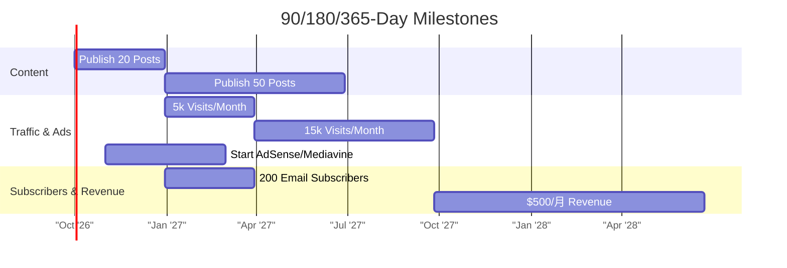

This file is a merged representation of the entire codebase, combined into a single document by Repomix.

# File Summary

## Purpose
This file contains a packed representation of the entire repository's contents.
It is designed to be easily consumable by AI systems for analysis, code review,
or other automated processes.

## File Format
The content is organized as follows:
1. This summary section
2. Repository information
3. Directory structure
4. Repository files (if enabled)
5. Multiple file entries, each consisting of:
  a. A header with the file path (## File: path/to/file)
  b. The full contents of the file in a code block

## Usage Guidelines
- This file should be treated as read-only. Any changes should be made to the
  original repository files, not this packed version.
- When processing this file, use the file path to distinguish
  between different files in the repository.
- Be aware that this file may contain sensitive information. Handle it with
  the same level of security as you would the original repository.

## Notes
- Some files may have been excluded based on .gitignore rules and Repomix's configuration
- Binary files are not included in this packed representation. Please refer to the Repository Structure section for a complete list of file paths, including binary files
- Files matching patterns in .gitignore are excluded
- Files matching default ignore patterns are excluded
- Files are sorted by Git change count (files with more changes are at the bottom)

# Directory Structure
```
.github/
  workflows/
    ci.yml
    scheduled-content-validation.yml
    security.yml
  dependabot.yml
config/
  content-schema/
    editorial-meta.schema.json
  environments/
    production.example.php
  scoring/
    default-review-model.json
content/
  calendar/
    internal-link-map.csv
    launch-calendar.csv
  evidence/
    freshness-register.csv
  first-8-briefs/
    01-what-is-biohacking-an-evidence-aware-beginner-s-guide.md
    02-nad-precursors-explained-nmn-nr-evidence-and-uncertainty.md
    03-oura-ring-4-review-sleep-trends-recovery-signals-and-limitations.md
    04-foods-that-support-brain-health-across-adulthood.md
    05-nootropic-stacks-what-the-evidence-supports-and-what-it-does-not.md
    06-whoop-review-recovery-coaching-sleep-tracking-and-subscription-value.md
    07-intermittent-fasting-and-healthy-aging-benefits-risks-and-who-should-avoid-it.md
    08-best-home-saunas-infrared-vs-traditional-models.md
  governance/
    ai-assisted-work-policy.md
    corrections-policy.md
  templates/
    content-brief-v2.md
    correction-record-template.md
    test-protocol-template.md
  testing/
    consumer-apps-protocol.md
    home-equipment-protocol.md
    wearables-protocol.md
  content-brief-template.md
  editorial-calendar.csv
  editorial-policy.md
  fact-check-log.csv
  internal-link-map.md
  medical-review-checklist.md
docker/
  development/
    README.md
  production-examples/
    README.md
  uploads.ini
docs/
  adr/
    0001-wordpress-as-primary-cms.md
    0002-first-party-editorial-controls.md
    0003-managed-host-and-docker-portability.md
    0004-conservative-structured-data.md
    0005-health-claim-governance.md
    0006-content-source-of-truth.md
    0007-product-testing-data-model.md
    0008-claim-registry-storage.md
  architecture/
    content-model.md
    permissions.md
    schema-model.md
    system-overview.md
  editorial/
    ai-assisted-work.md
    claim-management.md
    corrections.md
    editorial-workflow.md
    evidence-grading.md
    medical-review.md
    product-testing.md
  operations/
    backup-and-restore.md
    incident-response.md
    local-development.md
    managed-wordpress-deployment.md
    monitoring.md
    release-process.md
    security-hardening.md
    staging-deployment.md
    vps-deployment.md
  testing/
    artifacts/
      baseline-home-1440.png
      baseline-home-360.png
      baseline-home-768.png
      implemented-home-1440.png
    accessibility-checklist.md
    release-acceptance.md
    test-strategy.md
  baseline-audit.md
  final-implementation-report.md
  git-history.md
  implementation-baseline-ui-ux.md
  implementation-status.md
operations/
  checklists/
    production-readiness.md
  incident-response/
    README.md
  release/
    release-checklist.md
  runbooks/
    affiliate-incident.md
    medical-safety-correction.md
  90-day-roadmap.md
  analytics-event-spec.md
  corrections-to-original-plan.md
  launch-checklist.md
  qa-checklist.md
policies/
  affiliate-disclosure.md
  medical-disclaimer.md
  privacy-policy-notes.md
scripts/
  backup-example.sh
  bootstrap.sh
  create-test-fixtures.php
  create-test-fixtures.sh
  export-test-data.py
  regenerate-manifest.sh
  restore-test-example.sh
  smoke-test.sh
  validate-content.py
  validate-env.sh
  validate-freshness.py
  validate-internal-links.py
  validate.sh
source/
  deep-research-report.md
tests/
  e2e/
    accessibility.spec.js
    core.spec.js
    visual.spec.js
  fixtures/
    invalid.env
    malicious.env
  integration/
    environment-validation.sh
    health-endpoint.sh
  php/
    bootstrap.php
    MetaRegistryTest.php
    PublicationGatesTest.php
    ReviewMethodologyTest.php
    run-unit-tests.php
wp-content/
  mu-plugins/
    longevity-core/
      assets/
        admin-governance.css
        admin-governance.js
        analytics.js
        blocks.js
      blocks/
        article-meta/
          block.json
        author-profile/
          block.json
        breadcrumbs/
          block.json
        content-card-meta/
          block.json
        corrections/
          block.json
        related-content/
          block.json
        review-decision/
          block.json
        review-score/
          block.json
        reviewer-card/
          block.json
        search-filters/
          block.json
        source-list/
          block.json
        table-of-contents/
          block.json
        test-method/
          block.json
        trust-summary/
          block.json
      bootstrap.php
      class-admin-assets.php
      class-admin-ui.php
      class-affiliate-registry.php
      class-analytics.php
      class-blocks.php
      class-claims.php
      class-cli.php
      class-content-discovery.php
      class-content-types.php
      class-corrections.php
      class-freshness.php
      class-gate-result.php
      class-meta-registry.php
      class-migrations.php
      class-public-components.php
      class-publication-gates.php
      class-rest-api.php
      class-review-methodology.php
      class-review-workflow.php
      class-roles.php
      class-schema.php
      class-shortcodes.php
    longevity-core.php
  plugins/
    akismet/
      _inc/
        fonts/
          inter.css
        img/
          akismet-activation-banner-elements.png
          akismet-refresh-logo.svg
          akismet-refresh-logo@2x.png
          arrow-left.svg
          copy.svg
          logo-a-2x.png
        rtl/
          akismet-admin-rtl.css
          akismet-rtl.css
        akismet-admin.css
        akismet-admin.js
        akismet-frontend.js
        akismet.css
        akismet.js
      abilities/
        class-akismet-ability-comment-check.php
        class-akismet-ability-get-stats.php
        class-akismet-ability.php
        interface-akismet-ability.php
      views/
        activate.php
        compatible-plugins.php
        config.php
        connect-jp.php
        enter.php
        footer.php
        get.php
        logo.php
        notice.php
        predefined.php
        setup-jetpack.php
        setup.php
        start.php
        stats.php
      .htaccess
      akismet.php
      changelog.txt
      class-akismet-abilities.php
      class-akismet-compatible-plugins.php
      class-akismet-connector.php
      class.akismet-admin.php
      class.akismet-cli.php
      class.akismet-rest-api.php
      class.akismet-widget.php
      class.akismet.php
      index.php
      LICENSE.txt
      readme.txt
      wrapper.php
    hello.php
    index.php
  themes/
    longevity-starter/
      parts/
        footer.html
        header.html
      patterns/
        article-introduction.php
        article-trust.php
        consumer-lab-intro.php
        corrections-cta.php
        evidence-guide-grid.php
        featured-guide.php
        homepage-hero.php
        methodology-cta.php
        newsletter-cta.php
        publication-identity.php
        review-verdict.php
        sources-section.php
        topic-navigation.php
        trust-principles.php
      templates/
        404.html
        archive-review.html
        archive.html
        author.html
        category.html
        front-page.html
        index.html
        page.html
        search.html
        single-review.html
        single.html
      functions.php
      style.css
      theme.json
    twentytwentyfive/
      assets/
        css/
          editor-style.css
        fonts/
          beiruti/
            Beiruti-VariableFont_wght.woff2
          fira-code/
            FiraCode-VariableFont_wght.woff2
          fira-sans/
            FiraSans-Black.woff2
            FiraSans-BlackItalic.woff2
            FiraSans-Bold.woff2
            FiraSans-BoldItalic.woff2
            FiraSans-ExtraBold.woff2
            FiraSans-ExtraBoldItalic.woff2
            FiraSans-ExtraLight.woff2
            FiraSans-ExtraLightItalic.woff2
            FiraSans-Italic.woff2
            FiraSans-Light.woff2
            FiraSans-LightItalic.woff2
            FiraSans-Medium.woff2
            FiraSans-MediumItalic.woff2
            FiraSans-Regular.woff2
            FiraSans-SemiBold.woff2
            FiraSans-SemiBoldItalic.woff2
            FiraSans-Thin.woff2
            FiraSans-ThinItalic.woff2
          literata/
            Literata72pt-Black.woff2
            Literata72pt-BlackItalic.woff2
            Literata72pt-Bold.woff2
            Literata72pt-BoldItalic.woff2
            Literata72pt-ExtraBold.woff2
            Literata72pt-ExtraBoldItalic.woff2
            Literata72pt-ExtraLight.woff2
            Literata72pt-ExtraLightItalic.woff2
            Literata72pt-Light.woff2
            Literata72pt-LightItalic.woff2
            Literata72pt-Medium.woff2
            Literata72pt-MediumItalic.woff2
            Literata72pt-Regular.woff2
            Literata72pt-RegularItalic.woff2
            Literata72pt-SemiBold.woff2
            Literata72pt-SemiBoldItalic.woff2
          manrope/
            Manrope-VariableFont_wght.woff2
          platypi/
            Platypi-Italic-VariableFont_wght.woff2
            Platypi-VariableFont_wght.woff2
          roboto-slab/
            RobotoSlab-VariableFont_wght.woff2
          vollkorn/
            Vollkorn-Italic-VariableFont_wght.woff2
            Vollkorn-VariableFont_wght.woff2
          ysabeau-office/
            YsabeauOffice-Italic-VariableFont_wght.woff2
            YsabeauOffice-VariableFont_wght.woff2
        images/
          404-image.webp
          agenda-img-4.webp
          akaka-falls-state-park-flora.webp
          book-image-landing.webp
          book-image.webp
          botany-flowers-closeup.webp
          botany-flowers.webp
          campanula-alliariifolia-flower.webp
          category-anthuriums.webp
          category-cactus.webp
          category-sunflowers.webp
          coming-soon-bg-image.webp
          coral-square.webp
          dallas-creek-square.webp
          delphinium-flowers.webp
          flower-meadow-square.webp
          grid-flower-1.webp
          grid-flower-2.webp
          hero-podcast.webp
          link-in-bio-background.webp
          link-in-bio-image.webp
          location.webp
          malibu-plantlife.webp
          man-in-hat.webp
          marshland-birds-square.webp
          northern-buttercups-flowers.webp
          nurse.webp
          parthenon-square.webp
          poster-image-background.webp
          red-hibiscus-closeup.webp
          ruins-image.webp
          services-subscriber-photo.webp
          star-thristle-flower.webp
          typewriter.webp
          vash-gon-square.webp
          woman-splashing-water.webp
      parts/
        footer-columns.html
        footer-newsletter.html
        footer.html
        header-large-title.html
        header.html
        sidebar.html
        vertical-header.html
      patterns/
        banner-about-book.php
        banner-cover-big-heading.php
        banner-intro-image.php
        banner-intro.php
        banner-poster.php
        banner-with-description-and-images-grid.php
        binding-format.php
        comments.php
        contact-centered-social-link.php
        contact-info-locations.php
        contact-location-and-link.php
        cta-book-links.php
        cta-book-locations.php
        cta-centered-heading.php
        cta-events-list.php
        cta-grid-products-link.php
        cta-heading-search.php
        cta-newsletter.php
        event-3-col.php
        event-rsvp.php
        event-schedule.php
        footer-centered.php
        footer-columns.php
        footer-newsletter.php
        footer-social.php
        footer.php
        format-audio.php
        format-link.php
        grid-videos.php
        grid-with-categories.php
        header-centered.php
        header-columns.php
        header-large-title.php
        header.php
        heading-and-paragraph-with-image.php
        hero-book.php
        hero-full-width-image.php
        hero-overlapped-book-cover-with-links.php
        hero-podcast.php
        hidden-404.php
        hidden-blog-heading.php
        hidden-search.php
        hidden-sidebar.php
        hidden-written-by.php
        logos.php
        media-instagram-grid.php
        more-posts.php
        overlapped-images.php
        page-business-home.php
        page-coming-soon.php
        page-cv-bio.php
        page-landing-book.php
        page-landing-event.php
        page-landing-podcast.php
        page-link-in-bio-heading-paragraph-links-image.php
        page-link-in-bio-wide-margins.php
        page-link-in-bio-with-tight-margins.php
        page-portfolio-home.php
        page-shop-home.php
        post-navigation.php
        pricing-2-col.php
        pricing-3-col.php
        services-3-col.php
        services-subscriber-only-section.php
        services-team-photos.php
        template-404-vertical-header-blog.php
        template-archive-news-blog.php
        template-archive-photo-blog.php
        template-archive-text-blog.php
        template-archive-vertical-header-blog.php
        template-home-news-blog.php
        template-home-photo-blog.php
        template-home-posts-grid-news-blog.php
        template-home-text-blog.php
        template-home-vertical-header-blog.php
        template-home-with-sidebar-news-blog.php
        template-page-photo-blog.php
        template-page-vertical-header-blog.php
        template-query-loop-news-blog.php
        template-query-loop-photo-blog.php
        template-query-loop-text-blog.php
        template-query-loop-vertical-header-blog.php
        template-query-loop.php
        template-search-news-blog.php
        template-search-photo-blog.php
        template-search-text-blog.php
        template-search-vertical-header-blog.php
        template-single-left-aligned-content.php
        template-single-news-blog.php
        template-single-offset.php
        template-single-photo-blog.php
        template-single-text-blog.php
        template-single-vertical-header-blog.php
        testimonials-2-col.php
        testimonials-6-col.php
        testimonials-large.php
        text-faqs.php
        vertical-header.php
      styles/
        blocks/
          01-display.json
          02-subtitle.json
          03-annotation.json
          post-terms-1.json
        colors/
          01-evening.json
          02-noon.json
          03-dusk.json
          04-afternoon.json
          05-twilight.json
          06-morning.json
          07-sunrise.json
          08-midnight.json
        sections/
          section-1.json
          section-2.json
          section-3.json
          section-4.json
          section-5.json
        typography/
          typography-preset-1.json
          typography-preset-2.json
          typography-preset-3.json
          typography-preset-4.json
          typography-preset-5.json
          typography-preset-6.json
          typography-preset-7.json
        01-evening.json
        02-noon.json
        03-dusk.json
        04-afternoon.json
        05-twilight.json
        06-morning.json
        07-sunrise.json
        08-midnight.json
      templates/
        404.html
        archive.html
        home.html
        index.html
        page-no-title.html
        page.html
        search.html
        single.html
      contributing.txt
      functions.php
      package.json
      readme.txt
      screenshot.png
      style.css
      style.min.css
      theme.json
    twentytwentyfour/
      assets/
        css/
          button-outline.css
        fonts/
          cardo/
            cardo_italic_400.woff2
            cardo_normal_400.woff2
            cardo_normal_700.woff2
            LICENSE.txt
          instrument-sans/
            InstrumentSans-Italic-VariableFont_wdth,wght.woff2
            InstrumentSans-VariableFont_wdth,wght.woff2
            OFL.txt
          inter/
            Inter-VariableFont_slnt,wght.woff2
            LICENSE.txt
          jost/
            Jost-Italic-VariableFont_wght.woff2
            Jost-VariableFont_wght.woff2
            OFL.txt
        images/
          abstract-geometric-art.webp
          angular-roof.webp
          art-gallery.webp
          building-exterior.webp
          green-staircase.webp
          hotel-facade.webp
          icon-message.webp
          museum.webp
          tourist-and-building.webp
          windows.webp
      parts/
        footer.html
        header.html
        post-meta.html
        sidebar.html
      patterns/
        banner-hero.php
        banner-project-description.php
        cta-content-image-on-right.php
        cta-pricing.php
        cta-rsvp.php
        cta-services-image-left.php
        cta-subscribe-centered.php
        footer-centered-logo-nav.php
        footer-colophon-3-col.php
        footer.php
        gallery-full-screen-image.php
        gallery-offset-images-grid-2-col.php
        gallery-offset-images-grid-3-col.php
        gallery-offset-images-grid-4-col.php
        gallery-project-layout.php
        hidden-404.php
        hidden-comments.php
        hidden-no-results.php
        hidden-portfolio-hero.php
        hidden-post-meta.php
        hidden-post-navigation.php
        hidden-posts-heading.php
        hidden-search.php
        hidden-sidebar.php
        page-about-business.php
        page-home-blogging.php
        page-home-business.php
        page-home-portfolio-gallery.php
        page-home-portfolio.php
        page-newsletter-landing.php
        page-portfolio-overview.php
        page-rsvp-landing.php
        posts-1-col.php
        posts-3-col.php
        posts-grid-2-col.php
        posts-images-only-3-col.php
        posts-images-only-offset-4-col.php
        posts-list.php
        team-4-col.php
        template-archive-blogging.php
        template-archive-portfolio.php
        template-home-blogging.php
        template-home-business.php
        template-home-portfolio.php
        template-index-blogging.php
        template-index-portfolio.php
        template-search-blogging.php
        template-search-portfolio.php
        template-single-portfolio.php
        testimonial-centered.php
        text-alternating-images.php
        text-centered-statement-small.php
        text-centered-statement.php
        text-faq.php
        text-feature-grid-3-col.php
        text-project-details.php
        text-title-left-image-right.php
      styles/
        ember.json
        fossil.json
        ice.json
        maelstrom.json
        mint.json
        onyx.json
        rust.json
      templates/
        404.html
        archive.html
        home.html
        index.html
        page-no-title.html
        page-wide.html
        page-with-sidebar.html
        page.html
        search.html
        single-with-sidebar.html
        single.html
      functions.php
      readme.txt
      screenshot.png
      style.css
      theme.json
    twentytwentythree/
      assets/
        fonts/
          dm-sans/
            DMSans-Bold-Italic.woff2
            DMSans-Bold.woff2
            DMSans-Regular-Italic.woff2
            DMSans-Regular.woff2
            LICENSE.txt
          ibm-plex-mono/
            IBMPlexMono-Bold.woff2
            IBMPlexMono-Italic.woff2
            IBMPlexMono-Light.woff2
            IBMPlexMono-Regular.woff2
            OFL.txt
          inter/
            Inter-VariableFont_slnt,wght.ttf
            LICENSE.txt
          source-serif-pro/
            LICENSE.md
            SourceSerif4Variable-Italic.otf.woff2
            SourceSerif4Variable-Italic.ttf.woff2
            SourceSerif4Variable-Roman.otf.woff2
            SourceSerif4Variable-Roman.ttf.woff2
      parts/
        comments.html
        footer.html
        header.html
        post-meta.html
      patterns/
        call-to-action.php
        footer-default.php
        hidden-404.php
        hidden-comments.php
        hidden-heading.php
        hidden-no-results.php
        post-meta.php
      styles/
        aubergine.json
        block-out.json
        canary.json
        electric.json
        grapes.json
        marigold.json
        pilgrimage.json
        pitch.json
        sherbet.json
        whisper.json
      templates/
        404.html
        archive.html
        blank.html
        blog-alternative.html
        home.html
        index.html
        page.html
        search.html
        single.html
      readme.txt
      screenshot.png
      style.css
      theme.json
    index.php
  uploads/
    .gitkeep
  index.php
.env.ci
.env.example
.gitattributes
.gitignore
.npmrc
.stylelintrc.json
compose.yaml
composer.json
eslint.config.js
lighthouserc.cjs
Makefile
MANIFEST.sha256
package.json
phpcs.xml.dist
phpstan.neon.dist
phpunit.xml.dist
playwright.config.js
README.md
```

# Files

## File: .github/workflows/ci.yml
````yaml
name: CI
on:
  push:
  pull_request:
permissions:
  contents: read
jobs:
  validate:
    runs-on: ubuntu-latest
    steps:
      - uses: actions/checkout@v4
      - uses: shivammathur/setup-php@v2
        with:
          php-version: '8.3'
          coverage: none
      - uses: actions/setup-python@v5
        with:
          python-version: '3.12'
      - uses: actions/setup-node@v4
        with:
          node-version: '22'
          cache: npm
      - run: sudo apt-get update && sudo apt-get install -y shellcheck
      - run: composer validate --strict
      - run: composer install --no-interaction --prefer-dist
      - run: npm ci
      - run: make validate
      - run: composer lint
      - run: composer test
      - run: npm run lint
      - run: docker compose config --quiet
  wordpress-smoke:
    runs-on: ubuntu-latest
    needs: validate
    steps:
      - uses: actions/checkout@v4
      - run: cp .env.ci .env
      - run: docker compose up -d db wordpress
      - run: docker compose run --rm --entrypoint sh wpcli /scripts/bootstrap.sh
      - run: ./scripts/smoke-test.sh
      - if: always()
        run: docker compose down -v
  browser-tests:
    runs-on: ubuntu-latest
    needs: validate
    steps:
      - uses: actions/checkout@v4
      - uses: actions/setup-node@v4
        with:
          node-version: '22'
          cache: npm
      - run: cp .env.ci .env
      - run: npm ci
      - run: npx playwright install --with-deps chromium
      - run: docker compose up -d db wordpress
      - run: docker compose run --rm --entrypoint sh wpcli /scripts/bootstrap.sh
      - run: docker compose run --rm --entrypoint sh wpcli /scripts/create-test-fixtures.sh
      - run: npm run test:e2e
      - run: npm run test:a11y
      - run: npm run test:lighthouse
      - if: failure()
        uses: actions/upload-artifact@v4
        with:
          name: browser-diagnostics
          path: |
            reports/
            test-results/
          if-no-files-found: ignore
      - if: always()
        run: docker compose down -v
````

## File: .github/workflows/scheduled-content-validation.yml
````yaml
name: Scheduled content validation
on:
  schedule:
    - cron: '31 6 * * 2'
  workflow_dispatch:
permissions:
  contents: read
jobs:
  freshness:
    runs-on: ubuntu-latest
    steps:
      - uses: actions/checkout@v4
      - uses: actions/setup-python@v5
        with: { python-version: '3.12' }
      - run: python3 scripts/validate-content.py
      - run: python3 scripts/validate-internal-links.py
      - run: python3 scripts/validate-freshness.py
````

## File: .github/workflows/security.yml
````yaml
name: Security
on:
  pull_request:
  push:
    branches: [main]
  schedule:
    - cron: '17 5 * * 1'
permissions:
  contents: read
jobs:
  dependencies-and-secrets:
    runs-on: ubuntu-latest
    steps:
      - uses: actions/checkout@v4
        with: { fetch-depth: 0 }
      - uses: shivammathur/setup-php@v2
        with: { php-version: '8.3', coverage: none }
      - uses: actions/setup-node@v4
        with: { node-version: '22', cache: npm }
      - run: composer install --no-interaction --prefer-dist
      - run: composer audit --locked
      - run: npm audit --audit-level=high
      - name: Reject tracked secrets and environment files
        run: |
          test ! -f .env
          ! git grep -nEI '(BEGIN (RSA|OPENSSH|EC) PRIVATE KEY|ghp_[A-Za-z0-9]{20,}|AKIA[0-9A-Z]{16})'
      - name: Check unsafe executable permissions
        run: |
          bad=$(find . -path ./.git -prune -o -type f -perm /022 -print)
          test -z "$bad" || { echo "$bad"; exit 1; }
````

## File: .github/dependabot.yml
````yaml
version: 2
updates:
  - package-ecosystem: npm
    directory: /
    schedule:
      interval: weekly
    open-pull-requests-limit: 5
  - package-ecosystem: composer
    directory: /
    schedule:
      interval: weekly
    open-pull-requests-limit: 5
  - package-ecosystem: github-actions
    directory: /
    schedule:
      interval: monthly
    open-pull-requests-limit: 5
````

## File: config/content-schema/editorial-meta.schema.json
````json
{
  "$schema": "https://json-schema.org/draft/2020-12/schema",
  "title": "Longevity editorial metadata",
  "type": "object",
  "required": [
    "content_summary",
    "content_limitations",
    "commercial_relationship",
    "next_content_review_date",
    "editorial_approval_status"
  ],
  "properties": {
    "content_summary": {
      "type": "string",
      "minLength": 20
    },
    "content_limitations": {
      "type": "string",
      "minLength": 20
    },
    "evidence_grade": {
      "enum": [
        "A",
        "B",
        "C",
        "D",
        "U",
        ""
      ]
    },
    "medical_review_required": {
      "type": "boolean"
    },
    "testing_required": {
      "type": "boolean"
    },
    "commercial_relationship": {
      "enum": [
        "none",
        "affiliate",
        "product_supplied",
        "sponsored"
      ]
    },
    "next_content_review_date": {
      "type": "string",
      "format": "date"
    },
    "editorial_approval_status": {
      "enum": [
        "idea",
        "assigned",
        "researching",
        "drafting",
        "editorial_review",
        "fact_check",
        "medical_review",
        "testing_incomplete",
        "commercial_review",
        "ready",
        "published",
        "update_due",
        "correction_pending",
        "archived"
      ]
    },
    "review_score_dimensions": {
      "type": "array",
      "items": {
        "type": "object",
        "required": [
          "name",
          "weight",
          "score"
        ],
        "properties": {
          "name": {
            "type": "string",
            "minLength": 1
          },
          "weight": {
            "type": "number",
            "minimum": 0,
            "maximum": 100
          },
          "score": {
            "type": "number",
            "minimum": 0,
            "maximum": 10
          }
        },
        "additionalProperties": false
      }
    }
  },
  "additionalProperties": true
}
````

## File: config/environments/production.example.php
````php
<?php
/** Production values to translate into host-managed wp-config.php constants. */
define( 'WP_ENVIRONMENT_TYPE', 'production' );
define( 'WP_DEBUG', false );
define( 'WP_DEBUG_LOG', false );
define( 'WP_DEBUG_DISPLAY', false );
define( 'FORCE_SSL_ADMIN', true );
define( 'DISALLOW_FILE_EDIT', true );
define( 'DISALLOW_FILE_MODS', true );
define( 'WP_AUTO_UPDATE_CORE', 'minor' );
````

## File: config/scoring/default-review-model.json
````json
{
  "version": "1.0.0",
  "scale": {"minimum": 0, "maximum": 5},
  "confidence_labels": ["High confidence", "Moderate confidence", "Low confidence", "Preliminary"],
  "rules": {
    "weights_must_total": 100,
    "missing_required_dimension_blocks_publication": true,
    "commercial_relationship_may_change_score": false,
    "manual_override_requires_reason": true
  }
}
````

## File: content/calendar/internal-link-map.csv
````
source_article,destination_article,relationship,anchor_intent,required,publication_dependency,reader_purpose
LEL-002,LEL-001,Defines publication boundary,what the lab does and does not claim,Yes,Destination first,Understand scope before evaluating interventions
LEL-003,LEL-001,Provides evidence literacy,our editorial boundaries,No,Destination first,Understand how publication claims are governed
LEL-004,LEL-003,Supplies methodology,how study quality is assessed,Yes,Destination first,Connect grading rules to study appraisal
LEL-005,LEL-002,Gives practical implementation,evidence and risk framework,No,Destination first,Apply risk hierarchy before buying devices
LEL-006,LEL-003,Provides evidence literacy,how validation studies should be read,Yes,Destination first,Interpret accuracy claims cautiously
LEL-006,LEL-004,Supplies methodology,how we grade evidence,Yes,Destination first,Understand confidence labels
LEL-007,LEL-002,Provides safety detail,risk framework and escalation points,No,Destination first,Apply general safety boundaries
LEL-008,LEL-003,Provides evidence literacy,how nutrition studies are interpreted,No,Destination first,Understand observational evidence limitations
LEL-009,LEL-006,Explains measurement,sleep and recovery sensor limitations,No,Destination first,Compare metric constraints
LEL-009,LEL-003,Provides evidence literacy,surrogate outcomes and meaningful outcomes,Yes,Destination first,Avoid diagnostic interpretation
LEL-010,LEL-004,Supplies methodology,published consumer testing protocol,Yes,Destination first,Verify test design before reading conclusions
LEL-010,LEL-006,Compares products,sleep-tracking accuracy context,Yes,Destination first,Separate device experience from clinical validation
LEL-011,LEL-004,Supplies methodology,consumer-product evaluation standards,No,Destination first,Understand privacy as a scoring dimension
LEL-012,LEL-003,Provides evidence literacy,evaluate source quality and conflicts,Yes,Destination first,Assess marketing evidence
LEL-012,LEL-001,Provides regulatory context,publication claim boundaries,No,Destination first,Understand non-medical-advice scope
````

## File: content/calendar/launch-calendar.csv
````
article_id,order,publish_week,title,pillar,status,testing_required,medical_review_required,primary_question,original_contribution
LEL-001,1,1,What Longevity Evidence Lab Does—and Does Not Claim,Evidence Literacy,Planned,No,No,What can readers expect from this publication?,Published governance and decision-boundary map
LEL-002,2,1,What Is Biohacking? An Evidence and Risk Framework,Evidence Literacy,Planned,No,Yes,How should adults evaluate biohacking practices?,Evidence-risk decision matrix
LEL-003,3,2,How to Read a Health Study Without Being Misled,Evidence Literacy,Planned,No,No,Which study features change confidence in a claim?,Study appraisal worksheet
LEL-004,4,3,How We Grade Evidence and Test Consumer Products,Evidence Literacy,Planned,No,No,How are evidence grades and product scores produced?,Public methodology and protocol index
LEL-005,5,4,How to Improve Sleep Before Buying Another Device,Sleep and Circadian Health,Planned,No,Yes,Which lower-risk sleep fundamentals should come first?,Decision tool for escalation and device need
LEL-006,6,5,How Accurate Are Consumer Sleep Trackers?,Wearables and Consumer Measurement,Planned,No,Yes,What can consumer sleep trackers measure reliably?,Evidence matrix by metric
LEL-007,7,6,Resistance Training for Healthy Aging: A Beginner Framework,Movement and Physical Capacity,Planned,No,Yes,How can beginners structure resistance training safely?,Progression framework with referral boundaries
LEL-008,8,7,Foods and Dietary Patterns Associated With Healthy Aging,Nutrition and Healthy Aging,Planned,No,Yes,What dietary patterns have the strongest human evidence?,Affordable meal-component matrix
LEL-009,9,8,"HRV Explained: Useful Trend, Not Diagnosis",Wearables and Consumer Measurement,Planned,No,Yes,How should consumers interpret HRV trends?,Interpretation boundary diagram
LEL-010,10,9,Oura Ring Review Using the Published Test Protocol,Consumer Lab,Blocked until real testing,Yes,Yes,Who is the device a good fit for after protocol-compliant testing?,Real test record and downloadable observations
LEL-011,11,10,Wearable Privacy and Health Data,Wearables and Consumer Measurement,Planned,No,No,What privacy and data-access questions should buyers ask?,Vendor policy comparison table with checked dates
LEL-012,12,11,Supplement Labels Third-Party Testing and Marketing Red Flags,Supplements and High-Uncertainty Interventions,Planned,No,Yes,How can consumers screen supplement marketing and labels?,Label-reading checklist and certifier-scope matrix
````

## File: content/evidence/freshness-register.csv
````
record_id,record_type,next_review_date,status,owner,trigger_notes
````

## File: content/first-8-briefs/01-what-is-biohacking-an-evidence-aware-beginner-s-guide.md
````markdown
# Brief 1: What Is Biohacking? An Evidence-Aware Beginner’s Guide

- **Primary keyword:** what is biohacking
- **Intent:** Informational / pillar
- **Planned order:** 1
- **Medical review:** Yes

## Reader outcome
Help a cautious adult understand the scope, evidence/risk hierarchy, and why fundamentals precede gadgets.

## Required sections
- Define biohacking without endorsing fringe practices
- Create an evidence/risk framework
- Separate behaviors, devices, supplements, and procedures
- Give a low-risk starting sequence
- List red flags and referral points

## Evidence and originality requirements
- Use current official documentation for product and regulatory facts.
- Use primary research and current systematic reviews for health claims.
- Log every material claim and its evidence note.
- Add original testing, diagrams, interviews, or decision frameworks.
- State uncertainty, population limits, and conflicts before conclusions.

## Release gate
- Medical reviewer confirms risk language.
- Affiliate disclosure before the first monetized link.
- Editor approves non-sensational title/body consistency.
- Assign a 6- or 12-month recheck.
````

## File: content/first-8-briefs/02-nad-precursors-explained-nmn-nr-evidence-and-uncertainty.md
````markdown
# Brief 2: NAD+ Precursors Explained: NMN, NR, Evidence, and Uncertainty

- **Primary keyword:** NAD supplements
- **Intent:** Informational / evidence
- **Planned order:** 2
- **Medical review:** Yes

## Reader outcome
Explain rationale, human evidence limits, safety uncertainty, and market-specific regulation before purchase.

## Required sections
- Explain NAD+ pathways plainly
- Summarize human outcomes, not biomarkers alone
- Separate NMN, NR, niacin, and infusion claims
- Verify regulator status by market
- Explain quality and interaction questions

## Evidence and originality requirements
- Use current official documentation for product and regulatory facts.
- Use primary research and current systematic reviews for health claims.
- Log every material claim and its evidence note.
- Add original testing, diagrams, interviews, or decision frameworks.
- State uncertainty, population limits, and conflicts before conclusions.

## Release gate
- Mandatory clinician/pharmacist review; no dosage recommendation.
- Affiliate disclosure before the first monetized link.
- Editor approves non-sensational title/body consistency.
- Assign a 6- or 12-month recheck.
````

## File: content/first-8-briefs/03-oura-ring-4-review-sleep-trends-recovery-signals-and-limitations.md
````markdown
# Brief 3: Oura Ring 4 Review: Sleep Trends, Recovery Signals, and Limitations

- **Primary keyword:** Oura Ring 4 review
- **Intent:** Transactional / review
- **Planned order:** 3
- **Medical review:** Yes

## Reader outcome
Enable a buyer to assess fit, battery, insights, subscription, exports, and limitations.

## Required sections
- Document acquisition and 21+ day test
- Compare trends with a sleep diary
- Record comfort, charging, and sync failures
- Explain non-diagnostic limits
- Verify current pricing and terms

## Evidence and originality requirements
- Use current official documentation for product and regulatory facts.
- Use primary research and current systematic reviews for health claims.
- Log every material claim and its evidence note.
- Add original testing, diagrams, interviews, or decision frameworks.
- State uncertainty, population limits, and conflicts before conclusions.

## Release gate
- Hands-on test log and accuracy-language review required.
- Affiliate disclosure before the first monetized link.
- Editor approves non-sensational title/body consistency.
- Assign a 6- or 12-month recheck.
````

## File: content/first-8-briefs/04-foods-that-support-brain-health-across-adulthood.md
````markdown
# Brief 4: Foods That Support Brain Health Across Adulthood

- **Primary keyword:** foods for brain health
- **Intent:** Informational
- **Planned order:** 4
- **Medical review:** Yes

## Reader outcome
Provide a pattern-based food framework without implying that single foods prevent or reverse cognitive disease.

## Required sections
- Lead with dietary patterns
- Cover practical food groups and substitutions
- Address affordability and culture
- Explain evidence limits
- Include a meal-component matrix

## Evidence and originality requirements
- Use current official documentation for product and regulatory facts.
- Use primary research and current systematic reviews for health claims.
- Log every material claim and its evidence note.
- Add original testing, diagrams, interviews, or decision frameworks.
- State uncertainty, population limits, and conflicts before conclusions.

## Release gate
- Dietitian or physician review required.
- Affiliate disclosure before the first monetized link.
- Editor approves non-sensational title/body consistency.
- Assign a 6- or 12-month recheck.
````

## File: content/first-8-briefs/05-nootropic-stacks-what-the-evidence-supports-and-what-it-does-not.md
````markdown
# Brief 5: Nootropic Stacks: What the Evidence Supports—and What It Does Not

- **Primary keyword:** best nootropics
- **Intent:** Commercial investigation
- **Planned order:** 5
- **Medical review:** Yes

## Reader outcome
Help readers identify weak evidence, interaction risks, and marketing tactics rather than prescribe a stack.

## Required sections
- Define nootropics and stacks
- Rank common ingredients by evidence and risk
- Discuss interactions
- Explain proprietary blends
- Offer non-supplement alternatives

## Evidence and originality requirements
- Use current official documentation for product and regulatory facts.
- Use primary research and current systematic reviews for health claims.
- Log every material claim and its evidence note.
- Add original testing, diagrams, interviews, or decision frameworks.
- State uncertainty, population limits, and conflicts before conclusions.

## Release gate
- Mandatory clinician/pharmacist review; no individualized stack or dose.
- Affiliate disclosure before the first monetized link.
- Editor approves non-sensational title/body consistency.
- Assign a 6- or 12-month recheck.
````

## File: content/first-8-briefs/06-whoop-review-recovery-coaching-sleep-tracking-and-subscription-value.md
````markdown
# Brief 6: WHOOP Review: Recovery Coaching, Sleep Tracking, and Subscription Value

- **Primary keyword:** WHOOP review
- **Intent:** Transactional / review
- **Planned order:** 6
- **Medical review:** Yes

## Reader outcome
Compare current WHOOP hardware and subscription with rings and watches using actual use.

## Required sections
- Verify current hardware
- Use a 21+ day protocol
- Record comfort, charging, workout capture, and behavior change
- Compare with a diary
- Explain proprietary scores

## Evidence and originality requirements
- Use current official documentation for product and regulatory facts.
- Use primary research and current systematic reviews for health claims.
- Log every material claim and its evidence note.
- Add original testing, diagrams, interviews, or decision frameworks.
- State uncertainty, population limits, and conflicts before conclusions.

## Release gate
- Hands-on test log; verify terms on publication day.
- Affiliate disclosure before the first monetized link.
- Editor approves non-sensational title/body consistency.
- Assign a 6- or 12-month recheck.
````

## File: content/first-8-briefs/07-intermittent-fasting-and-healthy-aging-benefits-risks-and-who-should-avoid-it.md
````markdown
# Brief 7: Intermittent Fasting and Healthy Aging: Benefits, Risks, and Who Should Avoid It

- **Primary keyword:** intermittent fasting longevity
- **Intent:** Informational / medical
- **Planned order:** 7
- **Medical review:** Yes

## Reader outcome
Explain studied protocols, human outcomes, trade-offs, and who should avoid or seek guidance.

## Required sections
- Separate fasting protocols
- Summarize outcomes and adherence
- Discuss medication, pregnancy, older age, hypoglycemia, and eating-disorder risk
- Avoid lifespan extrapolation
- Provide clinician questions

## Evidence and originality requirements
- Use current official documentation for product and regulatory facts.
- Use primary research and current systematic reviews for health claims.
- Log every material claim and its evidence note.
- Add original testing, diagrams, interviews, or decision frameworks.
- State uncertainty, population limits, and conflicts before conclusions.

## Release gate
- Mandatory clinician and dietitian review.
- Affiliate disclosure before the first monetized link.
- Editor approves non-sensational title/body consistency.
- Assign a 6- or 12-month recheck.
````

## File: content/first-8-briefs/08-best-home-saunas-infrared-vs-traditional-models.md
````markdown
# Brief 8: Best Home Saunas: Infrared vs Traditional Models

- **Primary keyword:** best home sauna
- **Intent:** Commercial / comparison
- **Planned order:** 8
- **Medical review:** Yes

## Reader outcome
Help buyers compare space, electrical needs, heat experience, warranty, safety, and verified specifications.

## Required sections
- Define scoring before selection
- Verify electrical and service data
- Test heat-up consistently
- Include contraindications
- Reject detox and cure claims

## Evidence and originality requirements
- Use current official documentation for product and regulatory facts.
- Use primary research and current systematic reviews for health claims.
- Log every material claim and its evidence note.
- Add original testing, diagrams, interviews, or decision frameworks.
- State uncertainty, population limits, and conflicts before conclusions.

## Release gate
- Hands-on or independently verified specs; clinician review of safety.
- Affiliate disclosure before the first monetized link.
- Editor approves non-sensational title/body consistency.
- Assign a 6- or 12-month recheck.
````

## File: content/governance/ai-assisted-work-policy.md
````markdown
# AI-Assisted Work Policy

AI tools may assist topic ideation, outline development, source organization, grammar, clarity, metadata suggestions, internal-link suggestions, mechanical formatting, and code generation subject to accountable human review.

AI may not independently verify medical claims, approve safety language, invent citations, invent product tests or first-person experience, create reviewer credentials, assign evidence grades without human review, publish content, approve disclosure status, interpret private health information, or generate individualized treatment advice. Any AI-assisted output that affects a material claim must be checked against the source registry by a named human. Private or sensitive information must not be entered into unapproved AI services.
````

## File: content/governance/corrections-policy.md
````markdown
# Corrections Policy

Longevity Evidence Lab corrects material errors promptly and preserves an understandable public history. Readers may report possible errors through the corrections channel listed on the Contact page. Editors classify reports as typographical, clarification, material factual, medical safety, commercial disclosure, product specification, or privacy/legal issues.

Material corrections state what changed, why it changed, the date, whether the conclusion changed, and whether medical re-review occurred. Safety-sensitive corrections are escalated immediately and may cause temporary unpublication. Minor typographical changes that do not alter meaning may be corrected without a prominent notice, but remain visible in WordPress revisions. Commercial relationships, product acquisition, test results, or medical conclusions are never silently altered.
````

## File: content/templates/content-brief-v2.md
````markdown
# Content Brief v2

## Assignment
- Business purpose:
- Reader decision:
- Search intent:
- Primary question:
- Secondary questions:
- Audience:
- Jurisdiction:
- Population:
- Exclusions:
- Proposed URL:
- Author:
- Medical review required: Yes / No
- Hands-on testing required: Yes / No
- Commercial relationship: None / Affiliate / Product supplied / Sponsored

## Evidence plan
- Evidence cutoff date:
- Claim inventory:
- Prohibited claims:
- Required authoritative sources:
- Required primary sources:
- Required regulator sources:
- Required systematic reviews or guidelines:
- Population and external-validity limits:
- Conflicts to investigate:

## Original contribution
- Test protocol or original dataset:
- Expert interview:
- Decision tool, diagram, or evidence matrix:
- Downloadable asset:

## Review and governance
- Medical review scope:
- Fact-check scope:
- AI-summary risk:
- Structured-data eligibility:
- Internal-link requirements:
- Update triggers:
- Next review interval:
- Success metrics:

## Outline
1. Direct answer and scope
2. Definitions and decision context
3. Evidence or test method
4. Findings separated from interpretation
5. Limitations and uncertainty
6. Safety, escalation, or regulatory context when applicable
7. Practical decision support
8. Sources, corrections, and update history

## Release gate
- [ ] Material claims are in the claim registry.
- [ ] Evidence grades include rationales.
- [ ] Original contribution is complete and authentic.
- [ ] Testing record is approved when hands-on claims appear.
- [ ] Medical review is authenticated and scoped when required.
- [ ] Commercial and affiliate disclosures are complete.
- [ ] Accessibility, links, schema, and analytics checks pass.
- [ ] Evidence cutoff and next review dates are recorded.
````

## File: content/templates/correction-record-template.md
````markdown
# Correction Record Template

- Post:
- Reported date:
- Reported by:
- Issue category:
- Issue description:
- Severity:
- Public impact:
- Assigned editor:
- Status:
- Resolution:
- Corrected date:
- Public correction note:
- Claim IDs affected:
- Reviewer required: Yes / No
- Medical re-review completed: Yes / No / Not applicable

Material factual, safety, commercial, privacy, and legal corrections must not be handled as silent edits.
````

## File: content/templates/test-protocol-template.md
````markdown
# Test Protocol Template

- Protocol ID:
- Protocol name:
- Version:
- Product category:
- Effective date:
- Retired date:
- Minimum test duration:
- Required observations:
- Required comparison methods:
- Required environmental conditions:
- Required disclosure fields:
- Scoring dimensions and weights:
- Known limitations:
- Reviewer:
- Approval date:

A protocol documents how testing will be performed. It is not evidence that a product has been tested. Raw observations and deviations belong in a separate approved test record.
````

## File: content/testing/consumer-apps-protocol.md
````markdown
# Consumer Apps Test Protocol

Protocol ID: LEL-APP-001
Version: 1.0.0
Status: Draft; no test completion is implied.

Record the test period, pricing checked date, free and paid features, onboarding, notifications, export, account deletion, accessibility, privacy disclosures, cancellation, platform and app version, failures, and deviations. Testers must not include sensitive health data in screenshots or shared logs.
````

## File: content/testing/home-equipment-protocol.md
````markdown
# Home Equipment Test Protocol

Protocol ID: LEL-HOME-001
Version: 1.0.0
Status: Draft; no test completion is implied.

Record product model, space and electrical requirements, assembly, heat-up or operating time, measurements and instruments, measurement location, comfort, noise, warranty, service availability, safety documentation, and claims rejected for insufficient evidence. Physical measurements may only be published after actual testing or independently verified documentation.
````

## File: content/testing/wearables-protocol.md
````markdown
# Wearables Test Protocol

Protocol ID: LEL-WEARABLE-001
Version: 1.0.0
Status: Draft; no test completion is implied.

Minimum observations include test duration, wear time, charging frequency, sync failures, comfort, data gaps, workout capture, sleep-diary comparison, export availability, subscription restrictions, firmware/app versions, device model/size, privacy/account requirements, and behavior-change observations. Informal testing must not be described as clinical accuracy validation. Deviations are recorded, and missing required observations block publication of hands-on claims.
````

## File: content/content-brief-template.md
````markdown
# Content Brief Template

## Assignment
- Working title:
- Primary keyword:
- Search intent:
- Content cluster:
- Target reader:
- Proposed URL:
- Target length:
- Author:
- Medical reviewer required: Yes / No
- Hands-on testing required: Yes / No
- Commercial relationship: None / Product supplied / Affiliate / Sponsored

## Reader outcome
State the specific decision, action, or understanding the reader should gain.

## Evidence plan
- Primary sources required:
- Current official documentation required:
- Systematic reviews or guidelines:
- Claims that must not be made:
- Evidence cutoff date:

## Original contribution
- First-hand test protocol, expert interview, data analysis, photos, or comparison method:

## Outline
1. Introduction and bottom line
2. What the reader needs to know
3. Evidence or test method
4. Findings
5. Limitations and uncertainty
6. Practical next steps
7. FAQ only when genuinely useful

## Release gate
- [ ] Search intent confirmed
- [ ] Sources archived in fact-check log
- [ ] Product testing evidence attached when claimed
- [ ] Medical review completed when required
- [ ] Affiliate and sponsorship disclosure correct
- [ ] Mobile and accessibility QA passed
- [ ] Links, schema, metadata, and analytics events tested
````

## File: content/editorial-calendar.csv
````
order,publish_date,cluster,intent,title,target_keyword,target_length,template,medical_review,hands_on_testing,primary_internal_link_order,status,notes
1,2026-07-21,Guides,Informational,What Is Biohacking? An Evidence-Aware Beginner’s Guide,what is biohacking,1800,Pillar guide,Yes,No,—,Brief queued,Define scope; avoid promising lifespan extension.
2,2026-07-23,Supplements,Informational,"NAD+ Precursors Explained: NMN, NR, Evidence, and Uncertainty",NAD supplements,2200,Evidence guide,Yes,No,1,Brief queued,Regulatory and evidence status must be verified at publication.
3,2026-07-28,Wearables,Review,"Oura Ring 4 Review: Sleep Trends, Recovery Signals, and Limitations",Oura Ring 4 review,2400,Hands-on review,Yes,Yes,1,Brief queued,"Verify current firmware, pricing, and membership terms."
4,2026-07-30,Nutrition,Informational,Foods That Support Brain Health Across Adulthood,foods for brain health,1800,Evidence guide,Yes,No,1,Brief queued,Avoid brain-boosting outcome guarantees.
5,2026-08-04,Supplements,Commercial,Nootropic Stacks: What the Evidence Supports—and What It Does Not,best nootropics,2600,Comparison guide,Yes,No,1,Brief queued,No prescriptive stacks or dosage plans.
6,2026-08-06,Wearables,Review,"WHOOP Review: Recovery Coaching, Sleep Tracking, and Subscription Value",WHOOP review,2400,Hands-on review,Yes,Yes,3,Brief queued,Verify current hardware generation and plan terms.
7,2026-08-11,Nutrition,Informational,"Intermittent Fasting and Healthy Aging: Benefits, Risks, and Who Should Avoid It",intermittent fasting longevity,2200,Evidence guide,Yes,No,1,Brief queued,Include contraindications and eating-disorder cautions.
8,2026-08-13,Recovery,Commercial,Best Home Saunas: Infrared vs Traditional Models,best home sauna,2400,Tested comparison,Yes,Yes,1,Brief queued,Safety and electrical notes required.
9,2026-08-18,Sleep,Informational,How to Improve Sleep Naturally Before Buying Another Device,improve sleep naturally,2200,Action guide,Yes,No,1,Brief queued,Prioritize guideline-consistent practices.
10,2026-08-20,Wearables,Commercial,Best Fitness Trackers for Different Goals and Budgets,best fitness tracker,2500,Tested comparison,No,Yes,3,Brief queued,Current model verification required.
11,2026-08-25,Wearables,Review,Apple Watch Sleep Tracking Review: Useful Trends and Blind Spots,Apple Watch sleep tracking review,2200,Hands-on review,No,Yes,3,Brief queued,Verify current watchOS and supported models.
12,2026-08-27,Recovery,Informational,"Cold Plunge Benefits, Risks, and a Safer Setup",cold plunge benefits,2200,Safety guide,Yes,No,1,Brief queued,No unsupported immunity or fat-loss claims.
13,2026-09-01,Recovery,Commercial,"Red Light Therapy Devices: How to Compare Wavelength, Dose, and Claims",red light therapy device,2600,Buyer guide,Yes,Yes,1,Brief queued,Require measurements or disclose no lab validation.
14,2026-09-03,Guides,Informational,A Practical Morning Routine for Energy Without Wellness Theater,healthy morning routine,1700,Action guide,Yes,No,1,Brief queued,Avoid universal prescriptions.
15,2026-09-08,Supplements,Commercial,"Healthy-Aging Supplements: Evidence, Safety, and Marketing Red Flags",anti-aging supplements,2800,Evidence comparison,Yes,No,2,Brief queued,Do not present anti-aging as a proven outcome.
16,2026-09-10,Recovery,Informational,Science-Informed Stress Management Techniques,stress management techniques,1900,Action guide,Yes,No,1,Brief queued,Include escalation guidance for severe symptoms.
17,2026-09-15,Wearables,Review,"Fitbit Charge Review: Value, Accuracy, and Upgrade Considerations",Fitbit Charge review,2200,Hands-on review,No,Yes,10,Brief queued,Verify current model and platform support.
18,2026-09-17,Recovery,Commercial,Best Meditation Apps for Beginners: A Transparent Comparison,best meditation apps,2000,Tested comparison,No,Yes,16,Brief queued,Disclose test period and pricing date.
19,2026-09-22,Nutrition,Informational,"Meal Planning for Healthy Aging: Protein, Fiber, and Practicality",healthy aging meal plan,2200,Action guide,Yes,No,4,Brief queued,No individualized calorie prescription.
20,2026-09-24,Sleep,Commercial,"Blue-Light-Blocking Glasses: Evidence, Fit, and Buying Criteria",blue light blocking glasses,2200,Buyer guide,Yes,Yes,9,Brief queued,Distinguish light reduction from marketing.
21,2026-09-29,Sleep,Informational,How Accurate Are Consumer Sleep Trackers?,sleep tracker accuracy,2200,Evidence guide,Yes,No,9,Brief queued,Explain limits versus polysomnography.
22,2026-10-01,Recovery,Informational,HRV Explained: What It Can—and Cannot—Tell You,heart rate variability explained,2100,Evidence guide,Yes,No,1,Brief queued,Avoid diagnostic interpretation.
23,2026-10-06,Recovery,Informational,"VO2 Max and Healthy Aging: Measurement, Meaning, and Training",VO2 max longevity,2200,Evidence guide,Yes,No,1,Brief queued,Exercise safety review required.
24,2026-10-08,Supplements,Informational,"Creatine for Older Adults: Strength, Cognition, and Safety Evidence",creatine older adults,2400,Evidence guide,Yes,No,15,Brief queued,Include kidney and medication cautions.
25,2026-10-13,Supplements,Informational,"Magnesium for Sleep: Forms, Evidence, and Safety",magnesium for sleep,2300,Evidence guide,Yes,No,9,Brief queued,No dosage without reviewer approval.
26,2026-10-15,Supplements,Commercial,"NMN vs NR: Evidence, Regulation, and Buying Risks",NMN vs NR,2600,Evidence comparison,Yes,No,2,Brief queued,Verify regulator status by market.
27,2026-10-20,Wearables,Informational,Continuous Glucose Monitors for People Without Diabetes: What We Know,CGM for non diabetics,2500,Evidence guide,Yes,No,1,Brief queued,High review priority; avoid diagnosis.
28,2026-10-22,Wearables,Commercial,"Best Smart Rings: Sleep, Recovery, Comfort, and Data Access",best smart ring,2500,Tested comparison,No,Yes,3,Brief queued,Test current models consistently.
29,2026-10-27,Wearables,Commercial,Oura vs WHOOP: Which Feedback Model Fits You?,Oura vs WHOOP,2400,Tested comparison,No,Yes,3,Brief queued,Compare current plans and exports.
30,2026-10-29,Sleep,Commercial,"Best Sleep Trackers: Rings, Watches, Bands, and Bedside Sensors",best sleep tracker,2800,Tested comparison,Yes,Yes,21,Brief queued,Use transparent scoring and caveats.
31,2026-11-03,Recovery,Informational,"Sauna Safety: Heat Exposure, Hydration, and Contraindications",sauna safety,2200,Safety guide,Yes,No,8,Brief queued,Include cardiovascular and pregnancy cautions.
32,2026-11-05,Recovery,Informational,"Cold Plunge Safety: Temperature, Duration, and Red Flags",cold plunge safety,2100,Safety guide,Yes,No,12,Brief queued,No protocol for high-risk readers.
33,2026-11-10,Recovery,Informational,Red Light Therapy Wavelengths and Dose: A Reader’s Guide,red light therapy wavelength,2400,Evidence guide,Yes,No,13,Brief queued,Separate output from clinical evidence.
34,2026-11-12,Nutrition,Informational,Protein Needs in Later Adulthood: Evidence and Practical Meals,protein older adults,2300,Evidence guide,Yes,No,19,Brief queued,Account for kidney disease cautions.
35,2026-11-17,Recovery,Informational,Resistance Training for Healthy Aging: A Beginner Framework,resistance training longevity,2400,Action guide,Yes,No,23,Brief queued,Include clearance and progression caveats.
36,2026-11-19,Recovery,Informational,"Zone 2 Training: Definition, Measurement, and Limitations",zone 2 training,2200,Evidence guide,Yes,No,23,Brief queued,Avoid universal heart-rate zones.
37,2026-11-24,Recovery,Informational,A 10-Minute Mobility Routine for Desk-Bound Adults,mobility routine,1600,How-to guide,Yes,Yes,35,Brief queued,Movement review and alternatives required.
38,2026-11-26,Sleep,Informational,"Circadian Rhythm Basics: Timing Light, Meals, and Sleep",circadian rhythm guide,2200,Pillar guide,Yes,No,9,Brief queued,Do not oversimplify shift work.
39,2026-12-01,Sleep,Informational,Morning Light Exposure: What It Does and How to Use It Safely,morning light exposure,1900,Action guide,Yes,No,38,Brief queued,Eye-condition cautions required.
40,2026-12-03,Sleep,Informational,"Caffeine Timing and Sleep: Half-Life, Sensitivity, and Trade-Offs",caffeine timing sleep,1900,Evidence guide,Yes,No,9,Brief queued,Avoid one-size-fits-all cutoffs.
41,2026-12-08,Sleep,Informational,Alcohol and Sleep: Why Sedation Is Not Better Sleep,alcohol and sleep,1900,Evidence guide,Yes,No,9,Brief queued,Include support note without moralizing.
42,2026-12-10,Recovery,Informational,"Breathing Exercises for Stress: Methods, Evidence, and Safety",breathing exercises stress,1900,Action guide,Yes,Yes,16,Brief queued,Avoid treating anxiety-disorder claims.
43,2026-12-15,Supplements,Informational,"Adaptogens Explained: Evidence, Interactions, and Marketing",adaptogens evidence,2400,Evidence guide,Yes,No,15,Brief queued,Review interactions.
44,2026-12-17,Supplements,Informational,"Ashwagandha: Potential Benefits, Risks, and Who Should Avoid It",ashwagandha benefits risks,2400,Evidence guide,Yes,No,43,Brief queued,"Liver, thyroid, and pregnancy cautions."
45,2026-12-22,Supplements,Informational,Lion’s Mane Mushroom: Human Evidence vs Hype,lions mane evidence,2200,Evidence guide,Yes,No,43,Brief queued,Separate human and preclinical evidence.
46,2026-12-24,Supplements,Informational,How to Read a Supplement Label Without Being Misled,how to read supplement label,1900,Action guide,Yes,No,15,Brief queued,Verify jurisdiction-specific rules.
47,2026-12-29,Supplements,Informational,Third-Party Supplement Testing: What Seals Do—and Do Not—Mean,third party supplement testing,2100,Buyer guide,Yes,No,46,Brief queued,Verify certifier scope.
48,2026-12-31,Wearables,Informational,"Wearable Privacy: Health Data, Cloud Accounts, and Export Options",wearable privacy,2200,Privacy guide,No,No,3,Brief queued,Check current policies; avoid legal conclusions.
49,2027-01-05,Wearables,Informational,How to Interpret a Readiness Score Without Overreacting,readiness score meaning,1900,Action guide,Yes,No,22,Brief queued,Not diagnostic; emphasize trends.
50,2027-01-07,Sleep,Informational,Sleep Scores Explained: Useful Trend or False Precision?,sleep score accuracy,2000,Evidence guide,Yes,No,21,Brief queued,Explain proprietary algorithms.
51,2027-01-12,Wearables,Commercial,Best Home Blood Pressure Monitors: Validation First,best blood pressure monitor,2500,Buyer guide,Yes,Yes,27,Brief queued,Use independently validated devices.
52,2027-01-14,Guides,Commercial,Best Indoor Air Quality Monitors for Bedrooms and Offices,best air quality monitor,2300,Tested comparison,No,Yes,9,Brief queued,Define sensor limitations.
53,2027-01-19,Guides,Commercial,Desk Health Gadgets Worth Considering—and What to Skip,desk health gadgets,2200,Tested comparison,Yes,Yes,14,Brief queued,Avoid medical-device claims.
54,2027-01-21,Sleep,Commercial,A Practical Travel Sleep Kit for Time-Zone Changes,travel sleep kit,2100,Buyer guide,Yes,Yes,9,Brief queued,Medication content requires review.
55,2027-01-26,Guides,Commercial,Biohacking Under $100: High-Value Basics Before Gadgets,biohacking under 100,2200,Budget guide,Yes,Yes,1,Brief queued,Lead with low-cost habits.
56,2027-01-28,Guides,Informational,Anti-Aging Myths: What Current Evidence Does Not Support,anti aging myths,2400,Myth review,Yes,No,1,Brief queued,Use claim-by-claim evidence.
57,2027-02-02,Guides,Informational,"Longevity Biomarkers: Clinical Use, Consumer Tests, and Uncertainty",longevity biomarkers,2600,Evidence guide,Yes,No,1,Brief queued,No self-diagnosis.
58,2027-02-04,Guides,Informational,How to Read a Clinical Study Without Getting Fooled,how to read clinical study,2400,Research literacy guide,Yes,No,1,Brief queued,Use accurate examples.
59,2027-02-09,Sleep,Informational,"A 30-Day Sleep Reset: Measurement, Habits, and Review Points",30 day sleep reset,2500,Program guide,Yes,No,9,Brief queued,Not a treatment plan.
60,2027-02-11,Guides,Commercial,"The Year in Longevity Tech: Evidence, Products, and Retractions",longevity technology 2026,2800,Annual roundup,Yes,Yes,1,Brief queued,Fully re-research before publication.
````

## File: content/editorial-policy.md
````markdown
# Editorial Policy

## Mission
We publish practical, evidence-aware information about sleep, recovery, wearables, nutrition, exercise, and healthy aging. Our work is educational and must not be presented as individualized medical care.

## Independence
Editorial conclusions are determined by evidence, transparent methodology, and reader utility. Affiliate commissions, supplied products, advertising, and sponsorships must never guarantee a rating, inclusion, or favorable conclusion.

## Evidence hierarchy
Prioritize current clinical guidelines, systematic reviews, randomized controlled trials, regulator communications, official product documentation, and clearly labeled first-hand testing. Preprints, animal studies, mechanistic hypotheses, and testimonials require explicit caveats and cannot imply proven human outcomes.

## Medical review
A qualified clinician must review content discussing diagnosis, treatment, disease risk, contraindications, dosage, interactions, pregnancy, adverse effects, or material behavior changes for people with health conditions. Show the reviewer’s name, credentials, review date, and scope.

## Product reviews
Disclose how the product was obtained, test duration, conditions, comparison set, conflicts, and limitations. Scores must follow documented criteria.

## Corrections and updates
Correct material errors promptly and record them. Time-sensitive pages show a last-reviewed date and next-review date.

## AI-assisted work
AI may assist ideation, organization, and mechanical editing. It cannot replace source verification, first-hand testing, medical judgment, conflict disclosure, or accountable human authorship.
````

## File: content/fact-check-log.csv
````
article_slug,claim_id,claim_text,source_type,source_title,source_url,publication_date,accessed_date,evidence_notes,verified_by,verification_date,status
````

## File: content/internal-link-map.md
````markdown
# Internal Linking Map

Every supporting article links to its pillar; pillars link back only when useful.

| Order | Article | Primary link | Secondary suggestions |
|---:|---|---|---|
| 1 | What Is Biohacking? An Evidence-Aware Beginner’s Guide | Pillar / Start Here | Articles 58, 59 |
| 2 | NAD+ Precursors Explained: NMN, NR, Evidence, and Uncertainty | Article 1 | Articles 46, 47, 58 |
| 3 | Oura Ring 4 Review: Sleep Trends, Recovery Signals, and Limitations | Article 1 | Articles 21, 22, 48 |
| 4 | Foods That Support Brain Health Across Adulthood | Article 1 | Articles 19, 34 |
| 5 | Nootropic Stacks: What the Evidence Supports—and What It Does Not | Article 1 | Articles 46, 47, 58 |
| 6 | WHOOP Review: Recovery Coaching, Sleep Tracking, and Subscription Value | Article 3 | Articles 21, 22, 48 |
| 7 | Intermittent Fasting and Healthy Aging: Benefits, Risks, and Who Should Avoid It | Article 1 | Articles 4, 19, 34 |
| 8 | Best Home Saunas: Infrared vs Traditional Models | Article 1 | Articles 16, 23, 35 |
| 9 | How to Improve Sleep Naturally Before Buying Another Device | Article 1 | Articles 21, 38 |
| 10 | Best Fitness Trackers for Different Goals and Budgets | Article 3 | Articles 21, 22, 48 |
| 11 | Apple Watch Sleep Tracking Review: Useful Trends and Blind Spots | Article 3 | Articles 21, 22, 48 |
| 12 | Cold Plunge Benefits, Risks, and a Safer Setup | Article 1 | Articles 16, 23, 35 |
| 13 | Red Light Therapy Devices: How to Compare Wavelength, Dose, and Claims | Article 1 | Articles 16, 23, 35 |
| 14 | A Practical Morning Routine for Energy Without Wellness Theater | Article 1 | Articles 1, 58, 59 |
| 15 | Healthy-Aging Supplements: Evidence, Safety, and Marketing Red Flags | Article 2 | Articles 46, 47, 58 |
| 16 | Science-Informed Stress Management Techniques | Article 1 | Articles 23, 35 |
| 17 | Fitbit Charge Review: Value, Accuracy, and Upgrade Considerations | Article 10 | Articles 21, 22, 48 |
| 18 | Best Meditation Apps for Beginners: A Transparent Comparison | Article 16 | Articles 16, 23, 35 |
| 19 | Meal Planning for Healthy Aging: Protein, Fiber, and Practicality | Article 4 | Articles 4, 34 |
| 20 | Blue-Light-Blocking Glasses: Evidence, Fit, and Buying Criteria | Article 9 | Articles 9, 21, 38 |
| 21 | How Accurate Are Consumer Sleep Trackers? | Article 9 | Articles 9, 38 |
| 22 | HRV Explained: What It Can—and Cannot—Tell You | Article 1 | Articles 16, 23, 35 |
| 23 | VO2 Max and Healthy Aging: Measurement, Meaning, and Training | Article 1 | Articles 16, 35 |
| 24 | Creatine for Older Adults: Strength, Cognition, and Safety Evidence | Article 15 | Articles 46, 47, 58 |
| 25 | Magnesium for Sleep: Forms, Evidence, and Safety | Article 9 | Articles 46, 47, 58 |
| 26 | NMN vs NR: Evidence, Regulation, and Buying Risks | Article 2 | Articles 46, 47, 58 |
| 27 | Continuous Glucose Monitors for People Without Diabetes: What We Know | Article 1 | Articles 21, 22, 48 |
| 28 | Best Smart Rings: Sleep, Recovery, Comfort, and Data Access | Article 3 | Articles 21, 22, 48 |
| 29 | Oura vs WHOOP: Which Feedback Model Fits You? | Article 3 | Articles 21, 22, 48 |
| 30 | Best Sleep Trackers: Rings, Watches, Bands, and Bedside Sensors | Article 21 | Articles 9, 21, 38 |
| 31 | Sauna Safety: Heat Exposure, Hydration, and Contraindications | Article 8 | Articles 16, 23, 35 |
| 32 | Cold Plunge Safety: Temperature, Duration, and Red Flags | Article 12 | Articles 16, 23, 35 |
| 33 | Red Light Therapy Wavelengths and Dose: A Reader’s Guide | Article 13 | Articles 16, 23, 35 |
| 34 | Protein Needs in Later Adulthood: Evidence and Practical Meals | Article 19 | Articles 4, 19 |
| 35 | Resistance Training for Healthy Aging: A Beginner Framework | Article 23 | Articles 16, 23 |
| 36 | Zone 2 Training: Definition, Measurement, and Limitations | Article 23 | Articles 16, 23, 35 |
| 37 | A 10-Minute Mobility Routine for Desk-Bound Adults | Article 35 | Articles 16, 23, 35 |
| 38 | Circadian Rhythm Basics: Timing Light, Meals, and Sleep | Article 9 | Articles 9, 21 |
| 39 | Morning Light Exposure: What It Does and How to Use It Safely | Article 38 | Articles 9, 21, 38 |
| 40 | Caffeine Timing and Sleep: Half-Life, Sensitivity, and Trade-Offs | Article 9 | Articles 9, 21, 38 |
| 41 | Alcohol and Sleep: Why Sedation Is Not Better Sleep | Article 9 | Articles 9, 21, 38 |
| 42 | Breathing Exercises for Stress: Methods, Evidence, and Safety | Article 16 | Articles 16, 23, 35 |
| 43 | Adaptogens Explained: Evidence, Interactions, and Marketing | Article 15 | Articles 46, 47, 58 |
| 44 | Ashwagandha: Potential Benefits, Risks, and Who Should Avoid It | Article 43 | Articles 46, 47, 58 |
| 45 | Lion’s Mane Mushroom: Human Evidence vs Hype | Article 43 | Articles 46, 47, 58 |
| 46 | How to Read a Supplement Label Without Being Misled | Article 15 | Articles 47, 58 |
| 47 | Third-Party Supplement Testing: What Seals Do—and Do Not—Mean | Article 46 | Articles 46, 58 |
| 48 | Wearable Privacy: Health Data, Cloud Accounts, and Export Options | Article 3 | Articles 21, 22 |
| 49 | How to Interpret a Readiness Score Without Overreacting | Article 22 | Articles 21, 22, 48 |
| 50 | Sleep Scores Explained: Useful Trend or False Precision? | Article 21 | Articles 9, 21, 38 |
| 51 | Best Home Blood Pressure Monitors: Validation First | Article 27 | Articles 21, 22, 48 |
| 52 | Best Indoor Air Quality Monitors for Bedrooms and Offices | Article 9 | Articles 1, 58, 59 |
| 53 | Desk Health Gadgets Worth Considering—and What to Skip | Article 14 | Articles 1, 58, 59 |
| 54 | A Practical Travel Sleep Kit for Time-Zone Changes | Article 9 | Articles 9, 21, 38 |
| 55 | Biohacking Under $100: High-Value Basics Before Gadgets | Article 1 | Articles 1, 58, 59 |
| 56 | Anti-Aging Myths: What Current Evidence Does Not Support | Article 1 | Articles 1, 58, 59 |
| 57 | Longevity Biomarkers: Clinical Use, Consumer Tests, and Uncertainty | Article 1 | Articles 1, 58, 59 |
| 58 | How to Read a Clinical Study Without Getting Fooled | Article 1 | Articles 1, 59 |
| 59 | A 30-Day Sleep Reset: Measurement, Habits, and Review Points | Article 9 | Articles 9, 21, 38 |
| 60 | The Year in Longevity Tech: Evidence, Products, and Retractions | Article 1 | Articles 1, 58, 59 |
````

## File: content/medical-review-checklist.md
````markdown
# Medical Review Checklist
- [ ] Education is distinguished from medical advice.
- [ ] Population, intervention, comparator, and outcomes are accurate.
- [ ] Absolute effects are used where possible.
- [ ] Human outcomes are not inferred from animal or cell studies.
- [ ] Benefits, harms, contraindications, uncertainty, and limitations are balanced.
- [ ] Dosage information is non-prescriptive and authoritative.
- [ ] Drug, supplement, pregnancy, surgery, and chronic-condition cautions are addressed.
- [ ] Disease-treatment or prevention wording is supportable.
- [ ] Material claims are traceable to the fact-check log.
- [ ] Title and summary do not overstate evidence.
- [ ] Reviewer credentials, date, scope, and re-review date are recorded.
````

## File: docker/development/README.md
````markdown
# Development container notes

The root `compose.yaml` is the supported local reference. Keep editor code in `wp-content`, database/uploads in named volumes, and environment values in an untracked `.env`. Run `scripts/validate-env.sh .env` before `docker compose up`.
````

## File: docker/production-examples/README.md
````markdown
# Production examples

These files are references, not a turnkey production deployment. Production requires TLS termination, a managed secret store, external backups, real cron, SMTP, object/page caching, WAF/rate limiting, monitoring, log retention, and a tested rollback path. Do not expose MySQL or copy development credentials.
````

## File: docker/uploads.ini
````ini
file_uploads = On
memory_limit = 256M
upload_max_filesize = 32M
post_max_size = 40M
max_execution_time = 120
max_input_vars = 3000
````

## File: docs/adr/0001-wordpress-as-primary-cms.md
````markdown
# ADR: WordPress as the primary CMS

- Status: Accepted
- Date: 2026-07-14

## Context

The publication requires a portable, auditable system that minimizes health-claim and operational risk while remaining maintainable by a small team.

## Decision

Keep WordPress as the canonical store and editing interface for publication content, editorial metadata, and first-party workflow controls.

## Alternatives considered

A headless CMS, a static-site generator, and a custom application.

## Consequences

Preserves editor familiarity and hosting portability, while requiring careful use of WordPress APIs and migration discipline.

## Security implications

WordPress patching, role hardening, and least-privilege capabilities remain mandatory.

## Editorial implications

Editorial status, review, and audit behavior can remain close to the editor.

## Reversal strategy

Export standard content and metadata through WordPress APIs before replacing the CMS.
````

## File: docs/adr/0002-first-party-editorial-controls.md
````markdown
# ADR: First-party editorial controls

- Status: Accepted
- Date: 2026-07-14

## Context

The publication requires a portable, auditable system that minimizes health-claim and operational risk while remaining maintainable by a small team.

## Decision

Implement critical gates, claims, review, corrections, testing, and disclosure behavior in the MU plugin rather than relying on optional third-party plugins.

## Alternatives considered

ACF plus workflow plugins, a SaaS editorial system, and theme-only metadata.

## Consequences

Reduces dependency risk and keeps controls active across themes, but increases first-party maintenance responsibility.

## Security implications

Capability checks, nonce validation, sanitization, and conservative defaults are required in every write path.

## Editorial implications

Editorial controls cannot be deactivated accidentally through the normal plugin screen.

## Reversal strategy

Provide CSV/JSON exports and documented metadata keys to support migration.
````

## File: docs/adr/0003-managed-host-and-docker-portability.md
````markdown
# ADR: Managed-host and Docker portability

- Status: Accepted
- Date: 2026-07-14

## Context

The publication requires a portable, auditable system that minimizes health-claim and operational risk while remaining maintainable by a small team.

## Decision

Treat Docker as a development/staging reference while keeping first-party `wp-content` code free of container-specific assumptions.

## Alternatives considered

Docker-only production and host-specific APIs.

## Consequences

The same code can move between local, VPS, and managed WordPress environments; infrastructure features remain external.

## Security implications

Secrets and TLS are never embedded in the repository.

## Editorial implications

Editors receive consistent workflow behavior across environments.

## Reversal strategy

Remove environment adapters and migrate `wp-content` plus the database using standard WordPress tooling.
````

## File: docs/adr/0004-conservative-structured-data.md
````markdown
# ADR: Conservative structured data

- Status: Accepted
- Date: 2026-07-14

## Context

The publication requires a portable, auditable system that minimizes health-claim and operational risk while remaining maintainable by a small team.

## Decision

Emit only supported entities backed by visible page content, and suppress the first-party graph when a recognized SEO provider owns equivalent schema.

## Alternatives considered

Aggressive automatic FAQ, MedicalWebPage, Product, or aggregate-rating markup.

## Consequences

Rich-result opportunities may be narrower, but misleading or duplicate schema risk is reduced.

## Security implications

No private metadata or invented identifiers are exposed.

## Editorial implications

Schema reflects actual authorship, review scope, citations, and dates.

## Reversal strategy

Disable the graph builder or hand control to a compatible SEO integration.
````

## File: docs/adr/0005-health-claim-governance.md
````markdown
# ADR: Health-claim governance

- Status: Accepted
- Date: 2026-07-14

## Context

The publication requires a portable, auditable system that minimizes health-claim and operational risk while remaining maintainable by a small team.

## Decision

Require traceable claims, evidence rationales, fact-checking, scoped medical review, and explicit uncertainty for material health-adjacent claims.

## Alternatives considered

Free-form editorial review and automated AI approval.

## Consequences

Publishing is slower but more defensible and auditable.

## Security implications

Prevents unauthorized users and automated processes from approving safety-sensitive content.

## Editorial implications

Clinicians approve only the recorded scope; editorial responsibility remains explicit.

## Reversal strategy

Export claim/review records and replace the gate service with another audited workflow.
````

## File: docs/adr/0006-content-source-of-truth.md
````markdown
# ADR: Content source of truth

- Status: Accepted
- Date: 2026-07-14

## Context

The publication requires a portable, auditable system that minimizes health-claim and operational risk while remaining maintainable by a small team.

## Decision

Use WordPress as the operational source for published content and workflow state, while version-controlled Markdown/CSV files define planning, templates, protocols, and portable exports.

## Alternatives considered

Git-only content and database-only planning artifacts.

## Consequences

Separates editorial operation from governance assets while maintaining reproducible configuration.

## Security implications

Repository data contains no secrets or private reviewer information.

## Editorial implications

Editors work in WordPress; policy and protocol changes remain reviewable in Git.

## Reversal strategy

Export WordPress content and promote the version-controlled content format if a Git-first model is adopted.
````

## File: docs/adr/0007-product-testing-data-model.md
````markdown
# ADR: Product-testing data model

- Status: Accepted
- Date: 2026-07-14

## Context

The publication requires a portable, auditable system that minimizes health-claim and operational risk while remaining maintainable by a small team.

## Decision

Store versioned protocols and test records as private WordPress content types, separate from public article bodies; publish only approved summaries.

## Alternatives considered

Article-only testing notes, spreadsheets as the sole record, and arbitrary star ratings.

## Consequences

Testing evidence becomes reusable and auditable, with additional editorial administration overhead.

## Security implications

Private records require explicit capabilities and must not expose account credentials or sensitive tester data.

## Editorial implications

Articles cannot claim hands-on testing without an approved record and protocol version.

## Reversal strategy

Export protocol/test metadata to CSV or JSON and migrate to a dedicated lab system.
````

## File: docs/adr/0008-claim-registry-storage.md
````markdown
# ADR: Claim registry storage

- Status: Accepted
- Date: 2026-07-14

## Context

The publication requires a portable, auditable system that minimizes health-claim and operational risk while remaining maintainable by a small team.

## Decision

Use private WordPress custom post types for claims and sources in the first production iteration.

## Alternatives considered

Post metadata and a custom database table.

## Consequences

Private CPTs provide revisions, permissions, REST controls, and portability without custom SQL; very high volumes may later justify tables.

## Security implications

Records are non-public and require claim-management capabilities.

## Editorial implications

Claims can be linked to posts and sources with stable IDs and exported safely.

## Reversal strategy

Export stable IDs, introduce normalized tables, migrate in batches, and retain read-only CPT compatibility during cutover.
````

## File: docs/architecture/content-model.md
````markdown
# Content and Evidence Model

## Public content
Standard posts cover educational evidence guides. The `review` post type covers commercial or hands-on reviews. Both use registered editorial metadata and WordPress revisions.

## Private operational records
- `lel_claim`: material claim, category, importance, source reference, verification status, and recheck date.
- `lel_source`: bibliographic or documentary source metadata, identifiers, jurisdiction, conflicts, and evidence notes.
- `lel_protocol`: versioned category-specific testing method and scoring model.
- `lel_test_record`: real observations for a specific unit, dates, environment, deviations, evidence references, and approval state.
- `lel_correction`: correction status, reason, dates, and public notice.
- `lel_affiliate`: merchant/domain relationship, approval, and review date.

## Identity and review
Medical reviewers are WordPress users with optional public professional fields. The publication record links to the user ID and records scope, dates, attestation, conflicts, and next review. Fallback reviewer text exists only for legacy display and does not satisfy authenticated attestation gates.

## Source of truth
Operational publication state lives in WordPress. Repository CSV and Markdown files define assignments, protocols, governance, and exchange formats; they do not silently overwrite WordPress records. CSV import is explicit, capability-controlled, validated, and supports dry runs.

## Lifecycle
Records retain stable IDs. Superseded claims point to replacements. Protocols are versioned rather than edited retroactively. Corrections are append-oriented, and material workflow events are stored in a bounded audit log.
````

## File: docs/architecture/permissions.md
````markdown
# Roles and Capabilities

## Principles
Capabilities govern actions; role names are convenience bundles. Medical reviewers and product testers do not receive administrator access. Every write path also checks a nonce and post-specific authorization where applicable.

## First-party roles
- **Writer:** drafts and submits work.
- **Fact checker:** records claim verification and fact-check completion.
- **Medical reviewer:** completes a scoped attestation only for an assigned review.
- **Product tester:** manages protocols and test records.
- **Managing editor:** approves publication, disclosures, corrections, and exceptional overrides.

## Sensitive capabilities
`complete_medical_review`, `complete_fact_check`, `approve_commercial_disclosure`, `approve_publication`, `manage_corrections`, `manage_test_protocols`, `manage_affiliate_registry`, and `approve_publication_override` are deliberately separate.

## Operational caveat
A reviewer must be able to access the assigned post in the WordPress administration interface. Hosts should test the role mapping against their editor and security plugins. The attestation itself still requires the matching assigned user ID and the dedicated capability, preventing another editor from impersonating the reviewer.
````

## File: docs/architecture/schema-model.md
````markdown
# Conservative Schema Model

The schema service emits one `@graph` containing only entities supported by visible page content and stored metadata:

- `Organization` and `WebSite` on the site.
- `WebPage` for the current URL.
- `BlogPosting` for posts and reviews with real author and dates.
- `Person` for a linked, public reviewer profile when present.
- `BreadcrumbList` from the visible hierarchy.
- `Review` and `Product` only when a review has a real product model, a valid score, a scoring version, and completed testing.

The service does not emit unsupported FAQ, HowTo, medical-organization, physician, aggregate-rating, or fabricated review markup. It suppresses its graph when a recognized SEO plugin is active to prevent duplicate metadata. Structured data is descriptive, not proof of expertise or eligibility for rich results.
````

## File: docs/architecture/system-overview.md
````markdown
# System Overview

## Purpose
Longevity Evidence Lab is a WordPress-based evidence and consumer-testing publication. WordPress remains the editorial system of record; the block theme presents reader-facing trust information; and first-party MU-plugin services enforce governance independently of the active theme.

## Runtime components
- **WordPress:** posts, pages, users, revisions, media, REST API, and editorial permissions.
- **Longevity Core MU plugin:** content types, metadata, roles, publication gates, claim and source registries, medical review, test protocols, scoring, corrections, affiliate controls, schema, analytics, REST health checks, and WP-CLI utilities.
- **Longevity Starter block theme:** accessible templates and trust components. It contains no authoritative editorial state.
- **Structured repository content:** launch calendar, briefs, protocols, governance documents, and operational checklists.
- **Docker development stack:** MySQL, WordPress, and WP-CLI. Production deployment can use a managed host or a hardened VPS without changing the content model.

## Trust boundary
Only authenticated users with explicit capabilities may complete review states, change disclosures, approve tests, override gates, or publish. Public templates read approved state; they do not infer completion. No code fabricates reviewers, credentials, citations, measurements, or testing periods.

## Data flow
1. A writer drafts content and records scope, limitations, disclosures, and review dates.
2. Claims and sources are recorded in private registries.
3. Assigned specialists complete fact-check, scoped medical review, or test records.
4. The readiness service returns blocking failures, warnings, and passes.
5. Publication is allowed only when blocking requirements are met or a specially authorized, reasoned override is recorded.
6. Public templates and conservative JSON-LD expose only substantiated, non-empty data.

## Portability
Critical data is stored through WordPress APIs in posts, users, and post metadata. The theme can be replaced without losing governance records. The MU plugin can be copied to managed WordPress hosts that permit MU plugins. Host-specific caching, WAF, SMTP, backups, and observability remain external adapters.
````

## File: docs/editorial/ai-assisted-work.md
````markdown
# AI-Assisted Work

AI may assist with ideation, outlining, categorization, formatting, mechanical editing, test generation, and retrieval planning. It may not publish, approve medical review, invent credentials or citations, fabricate hands-on testing, infer missing measurements, provide uncontrolled dosage advice, or convert weak evidence into definitive health claims.

A named human remains accountable for authorship, source verification, claim wording, conflicts, test evidence, and publication approval. AI output containing health or product claims is treated as an unverified lead until checked against an authoritative source or actual test record.
````

## File: docs/editorial/claim-management.md
````markdown
# Claim Management

Create a claim record for every material efficacy, safety, contraindication, interaction, regulatory, specification, price, warranty, privacy, accuracy, usability, first-hand observation, or editorial-interpretation claim.

Each record identifies the article, exact claim, location, importance, source, population/intervention/comparator/outcome where relevant, evidence design and grade, conflicts, verification state, verifier, date, recheck date, and supersession link.

Use `wp longevity claims validate` before import. Use `--dry-run` for imports, preserve stable IDs, and resolve duplicates explicitly. CSV exports neutralize spreadsheet formulas. Do not store full copyrighted articles; retain metadata, lawful excerpts where necessary, archived references, and editorial notes.
````

## File: docs/editorial/corrections.md
````markdown
# Corrections and Update Policy

Correct material errors promptly. A correction record states what changed, why, the previous and corrected dates, status, approver, and whether a public notice is required. Do not silently rewrite a claim whose meaning materially changes.

Minor spelling and formatting repairs need no public notice. Safety, contraindication, efficacy, price methodology, product identity, reviewer scope, conflict, or score changes normally do. Published pages display applicable correction notices and update history without exposing private audit notes.

Scheduled freshness validation identifies due evidence cutoffs, prices, policies, and next-review dates. An overdue page is reviewed, marked update due, corrected, or archived—not automatically refreshed by AI.
````

## File: docs/editorial/editorial-workflow.md
````markdown
# Editorial Workflow

## States
Idea → Assigned → Researching → Drafting → Editorial review → Fact-check → Medical review or Testing incomplete when applicable → Commercial review → Ready for publication → Published. Published work can move to Update due, Correction pending, or Archived.

## Readiness
The editor sidebar reports applicable, passed, warning, and blocking checks. Draft saving remains available at every stage. Publishing triggers the same readiness service in classic and REST-based flows.

## Blocking examples
Missing scope/limitations, incomplete required fact-check, missing assigned medical reviewer or attestation, unsupported hands-on claims, unresolved commercial relationship, affiliate links without disclosure, unversioned scoring, stale price data, missing product model, missing evidence cutoff, placeholders, or missing review dates.

## Overrides
Only a user with `approve_publication_override` may use an emergency override. A written reason is mandatory. User, time, reason, and affected post are recorded. Routine deadline pressure is not an emergency.
````

## File: docs/editorial/evidence-grading.md
````markdown
# Evidence Grading

- **A:** strong, consistent human evidence or an applicable authoritative guideline.
- **B:** moderate human evidence with meaningful limitations.
- **C:** limited, preliminary, indirect, or inconsistent human evidence.
- **D:** mechanistic, animal, cell, anecdotal, or marketing evidence.
- **U:** unclear or insufficiently verified.

A grade is never derived from source type alone. Every grade requires a rationale. Editors may downgrade confidence for small samples, surrogate outcomes, short follow-up, attrition, conflicts, indirect populations, inconsistency, weak external validity, regulatory uncertainty, or product-specific extrapolation. Evidence grades describe support for a defined claim, not the overall virtue of a product or behavior.
````

## File: docs/editorial/medical-review.md
````markdown
# Medical Review

Medical review is scoped, authenticated, and time-bound. Assign a WordPress user with verified public credentials, record the exact review scope and sections or claim IDs, note limitations and conflicts, and set the review and next-review dates.

The reviewer attests only that the language within the recorded scope is appropriate for general educational publication as of the review date. The public label must be specific, such as “Medically reviewed for safety and contraindication language.” Never use “scientifically approved.”

A review is incomplete when the assigned reviewer, scope, credentials, date, attestation, or next-review date is absent. Reviewers must not approve their own undisclosed conflicts, commercial positioning, or fabricated evidence.
````

## File: docs/editorial/product-testing.md
````markdown
# Product Testing and Scoring

Hands-on claims require a separate approved test record linked to a versioned protocol. Record the specific product and unit, acquisition method, testers, dates, protocol version, observations, measurement equipment, environment, failures, deviations, comparison devices, evidence references, and conflicts.

Scoring dimensions and weights are defined before testing and weights must total 100%. Preserve raw scores. The final score is reproducible; confidence is reported separately as High, Moderate, Low, or Preliminary. Missing evidence lowers confidence. Commercial relationships cannot change scoring, and manual overrides require a reason.

Informal consumer testing must not be described as clinical validation. No article may claim a test duration, measurement, product unit, firmware version, or result that did not occur.
````

## File: docs/operations/backup-and-restore.md
````markdown
# Backup and Restore

Back up the database and uploaded media off site, encrypted, and with retention appropriate to editorial and legal needs. First-party code should also be recoverable from version control and release artifacts.

The example backup script creates a database dump and archive but is not a production backup service. The restore example refuses a production environment and requires explicit confirmation. At least quarterly, restore to an isolated staging environment, verify users, private records, media, permalink behavior, readiness gates, and a representative article. Record the result and recovery time.
````

## File: docs/operations/incident-response.md
````markdown
# Incident Response

Classify incidents as medical-safety/editorial, security/privacy, availability, affiliate/commercial, or data-integrity events. Preserve evidence, restrict further harm, assign an incident lead, and use the relevant runbook.

For reader-safety issues, unpublish or add a prominent warning when delay creates risk, notify editorial and medical leadership, correct the underlying claim, and preserve a public correction record. For security events, rotate credentials, contain access, preserve logs, assess notification duties with qualified counsel, restore from known-good state, and document remediation.
````

## File: docs/operations/local-development.md
````markdown
# Local Development

1. Copy `.env.example` to `.env` and replace every placeholder.
2. Run `./scripts/validate-env.sh .env`.
3. Run `docker compose config --quiet`.
4. Start services with `make up`.
5. Bootstrap with `make bootstrap`.
6. Run `make smoke`, `make validate`, and `make test`.

Local HTTP is permitted. Keep search visibility disabled. Do not reuse local credentials or databases in staging or production. The repository mounts only first-party code and structured content needed for development.
````

## File: docs/operations/managed-wordpress-deployment.md
````markdown
# Managed WordPress Deployment

Confirm that the host supports MU plugins, custom post types, WP-CLI or an equivalent migration path, cron, HTTPS, backups, and required PHP extensions. Upload the first-party theme and complete `wp-content/mu-plugins/longevity-core.php` plus its directory. Do not install development dependencies in the public web root.

Use host-provided caching, WAF, malware scanning, MFA, backups, and staging where reliable. Configure SMTP and DNS authentication externally. Verify that host security plugins do not block REST readiness responses, custom capabilities, cron freshness checks, or private operational post types.
````

## File: docs/operations/monitoring.md
````markdown
# Monitoring

Monitor HTTP availability, TLS expiry, PHP/WordPress errors, failed cron, backup completion, disk/database growth, unusual authentication activity, mail delivery, and dependency advisories. The public health endpoint reports only non-sensitive service state.

Editorial monitoring includes overdue reviews, stale evidence cutoffs, unresolved corrections, unapproved affiliate relationships, missing test evidence, and repeated override use. Alerts should identify the record and action needed without including sensitive health information.
````

## File: docs/operations/release-process.md
````markdown
# Release Process

1. Open a focused change with documentation and tests.
2. Run static validation, unit tests, dependency checks, and Docker configuration validation.
3. Deploy to staging and run bootstrap only for a new installation.
4. Execute smoke, permission, publication-gate, schema, accessibility, and responsive checks.
5. Create and verify a backup; identify rollback commit and database plan.
6. Obtain technical and editorial approval.
7. Deploy code, run required migrations, clear caches, and repeat smoke checks.
8. Observe logs and health metrics; record release and any follow-up.

Do not combine unrelated schema, workflow, theme, and infrastructure changes in one emergency release.
````

## File: docs/operations/security-hardening.md
````markdown
# Security Hardening

Use unique named accounts, MFA where supported, least-privilege roles, strong generated passwords, HTTPS, secure cookies, restricted file modifications, current dependencies, a WAF/rate limits, and off-site backups. Never commit `.env`, database dumps, access tokens, private keys, or production exports.

Review capabilities after plugin changes. Validate nonces and object authorization on every write. Escape public output. Keep private CPTs non-public and exclude them from search and sitemaps. Treat analytics and correction forms as untrusted input. Document exceptions and time-box them.
````

## File: docs/operations/staging-deployment.md
````markdown
# Staging Deployment

Use a production-like PHP and WordPress version, HTTPS, isolated credentials, non-production payment/affiliate identifiers, and blocked indexing. Import a sanitized content snapshot, never an unreviewed production database with unnecessary personal data.

Run environment validation, database migration or import, theme/MU-plugin activation, WP-CLI bootstrap only when the site is new, smoke tests, role tests, publication-gate tests, schema inspection, accessibility checks, and a backup/restore drill. Obtain editorial sign-off before production promotion.
````

## File: docs/operations/vps-deployment.md
````markdown
# VPS Deployment

Docker Compose in this repository is a reference starting point, not a complete production control plane. Terminate TLS at a maintained reverse proxy, restrict database exposure, use immutable images, external secrets, daily encrypted off-site backups, central logs, monitoring, automatic security updates with staged testing, and least-privilege SSH access.

Set production-safe WordPress constants, disable the built-in file editor and dashboard modifications, use a real cron runner, constrain outbound email, and protect admin/login endpoints. Test restore, rollback, and incident procedures before launch.
````

## File: docs/testing/accessibility-checklist.md
````markdown
# Accessibility Checklist

- Keyboard access reaches skip link, navigation, search, controls, disclosures, and forms.
- Focus remains visible and is not obscured.
- Heading levels express the document outline.
- Controls have programmatic names, states, and adequate targets.
- Text and non-text contrast meet WCAG 2.2 AA where applicable.
- Links are distinguishable without color alone.
- Images have meaningful alt text or are intentionally decorative.
- Tables preserve headers and remain usable at narrow widths.
- Status, gate, and error messages are announced and actionable.
- Motion respects reduced-motion preferences.
- Zoom to 200–400% does not lose content or functionality.
- Print output retains article identity, sources, limitations, and disclosures.
````

## File: docs/testing/release-acceptance.md
````markdown
# Release Acceptance

A production candidate is acceptable only when required automated checks pass; Docker bootstrap and smoke tests pass in a supported environment; no P0/P1 security finding is unresolved; representative high-risk and commercial articles are correctly blocked or allowed; roles cannot exceed intended capabilities; schema matches visible facts; accessibility has no known critical barrier; backup and rollback are verified; and editorial leadership approves public wording.

Advisory dependency findings, performance opportunities, and minor accessibility defects may be accepted only with a named owner, documented rationale, and due date. Missing real test evidence, incomplete medical review, fabricated data, secret exposure, or a broken restore path is always blocking.
````

## File: docs/testing/test-strategy.md
````markdown
# Test Strategy

## Static and content checks
PHP, shell, JSON, YAML, environment configuration, content calendars, briefs, internal links, freshness, placeholders, trailing whitespace, and manifest integrity.

## Unit tests
Pure services cover sanitization definitions, scoring arithmetic, evidence/readiness combinations, and blocking-versus-warning behavior. A dependency-free fallback runner provides a minimal local safety net when Composer is unavailable.

## WordPress integration
CI boots WordPress, activates the theme and MU plugin, creates representative records, checks REST health, and exercises bootstrap/smoke behavior. Additional fixtures should cover every publication-gate combination and capability boundary.

## Browser tests
Playwright checks key templates, navigation, disclosure visibility, and responsive behavior. Axe checks detectable WCAG violations. Manual checks remain required for semantics, screen-reader quality, copy accuracy, and health-claim meaning.
````

## File: docs/baseline-audit.md
````markdown
# Baseline Audit

Audit date: 2026-07-14

## Current architecture

The baseline is a local-first WordPress package with MySQL, WordPress, and WP-CLI services in Docker Compose. A custom block theme provides the presentation layer, while a single MU-plugin file registers a public `review` post type, six post-meta fields, three shortcodes, basic JSON-LD, security headers, and a public health endpoint.

## Existing features

- Docker Compose development stack using WordPress/PHP and MySQL images.
- Idempotent WP-CLI bootstrap for the site, categories, policy pages, and homepage.
- Custom block theme with front page, archive, index, page, and single templates.
- Review post type and shortcodes for affiliate links, medical disclaimer, and review summary.
- Sixty-item editorial calendar, eight briefs, policy drafts, and operating checklists.
- Basic static validation for PHP, JSON, shell syntax, and calendar ordering.

## Technical weaknesses

- The MU plugin is monolithic and has no service boundaries or test seams.
- Metadata lacks explicit defaults, field descriptions, conditional requirements, and post-specific authorization.
- No CI, Composer quality tooling, PHPUnit configuration, front-end linting, or end-to-end tests.
- The baseline manifest is static and is not validated against the working tree.
- Docker configuration does not expose all WordPress environment controls documented in the implementation plan.

## Editorial-system weaknesses

- No publication-readiness engine, workflow audit trail, role-specific capabilities, or authenticated medical-review attestation.
- Claim and source records exist only as an empty CSV header.
- Hands-on test records, protocol versions, scoring rationale, corrections, and affiliate registry are absent.
- Existing internal-link guidance includes self-links and generic repeated recommendations.

## Security risks

- Placeholder credentials can be copied without validation.
- Generic `edit_posts` authorization is used for every metadata field.
- No automated dependency, secret, or tracked-environment-file checks.
- The health endpoint has no configurable detail level or cache control.

## Accessibility risks

- No skip link or explicit focus treatment.
- Minimal navigation and footer structure.
- No automated WCAG checks, accessible table styles, reduced-motion treatment, or tested mobile navigation behavior.

## SEO and schema risks

- Schema is emitted as a single object rather than a graph and uses only constant checks for two SEO plugins.
- Review-specific schema, breadcrumbs, reviewer scope, citations, and entity consistency are absent.
- Theme archives and homepage queries omit review content in several paths.

## Testing gaps

- No unit, integration, accessibility, browser, or smoke tests.
- No validation for YAML, duplicate slugs, dates, internal links, content briefs, policy placeholders, or credentials.

## Deployment limitations

- Local validation cannot prove production behavior.
- Backups, restore drills, SMTP, WAF/CDN, object caching, cron, TLS, and observability require hosting-layer integration.
- No migration or rollback runbook exists in the baseline.

## Assumptions

- WordPress remains the canonical editorial system.
- First-party code must remain portable to managed WordPress hosting.
- Health, credential, testing, pricing, and citation data must never be invented.
- External services are represented by documented adapters or configuration placeholders only.

## Baseline commands executed

| Command | Result |
|---|---|
| `sh scripts/validate.sh` | Passed. PHP syntax, theme JSON, calendar row count/order, and shell syntax were valid. |
| `php -v` | Available: PHP 8.4.16 CLI. |
| `git status` | Not available before initialization because the reconstructed package was not a Git repository. |

## Commands not executed

| Command | Reason |
|---|---|
| `docker --version` / `docker compose config` | Docker is not installed in the execution environment. |
| `composer install` / Composer scripts | Composer is not installed in the execution environment. |
| Browser and WordPress integration tests | A running WordPress stack and installed npm dependencies are unavailable locally. |

These unavailable checks are configured in CI and documented as production prerequisites; they are not reported as locally passing.
````

## File: docs/final-implementation-report.md
````markdown
# Final Implementation Report

Report date: 2026-07-14

## Executive summary

The reconstructed Longevity Evidence Lab MVP has been evolved into a production-oriented WordPress evidence-publishing platform while preserving the required architecture: WordPress remains the CMS, the custom block theme remains the presentation layer, and first-party editorial controls live in a modular MU plugin.

The implementation prioritizes defensible publication controls over automatic content generation. It does not create medical claims, reviewer credentials, citations, product measurements, test results, approvals, or commercial relationships. Instead, it supplies explicit data models, authenticated specialist workflows, publication gates, audit events, validation, public trust components, conservative schema, and deployment runbooks.

## Architecture delivered

- A small MU-plugin loader delegates to focused first-party services under `wp-content/mu-plugins/longevity-core/`.
- Critical editorial records remain independent of the active theme.
- Public content uses the existing WordPress `post` type and the preserved `review` type.
- Operational records use private first-party post types for claims, sources, testing protocols, test records, corrections, and affiliate relationships.
- The custom block theme renders evidence, review, testing, disclosure, correction, and authorship information without requiring ACF or a complex front-end build.
- Docker remains available for local and staging use, while all first-party code remains portable to managed WordPress or a conventional VPS.

## Editorial metadata and authorization

The metadata registry defines type, default, sanitization, REST exposure, description, applicable post types, conditional use, public visibility, and authorization behavior for editorial and review fields. It includes scope, limitations, evidence grade and rationale, fact-check status, scoped medical review, testing status, acquisition method, commercial relationship, correction status, review dates, product version, comparison set, price date, score version, score confidence, and score dimensions.

First-party capabilities separate writing, fact-check completion, medical-review completion, commercial approval, publication override, corrections, testing protocols, and affiliate management. Specialist roles do not receive broad site-administration authority. Dedicated medical-review and fact-check queues allow assigned specialists to complete authenticated work without being promoted to editor.

## Publication readiness and audit trail

The readiness engine returns blocking failures, warnings, passes, and non-applicable checks. Publication is blocked when applicable controls are incomplete, including:

- missing summary, limitations, accountable author, next review date, commercial relationship, or final editorial approval;
- placeholder content;
- material claims without registered and verified claim records or authenticated fact-check completion;
- required medical review without a verified reviewer account, explicit scope, sections or claims reviewed, limitations, conflicts, dates, version, resolved revisions, and attestation;
- hands-on claims without an approved protocol-version-matched test record;
- affiliate links without an approved disclosure and active registry entry;
- review scores that cannot be recalculated from versioned weighted dimensions or lack a documented override reason;
- product reviews missing model, comparison set, confidence, price-check date when applicable, or methodology version;
- evidence grades without a rationale and evidence cutoff date.

Draft saving remains available. A dedicated emergency override capability requires a written reason and records the actor, time, reason, and post. Workflow changes, review completions, score changes, disclosures, corrections, and review-date changes are recorded as non-sensitive audit events.

## Claims, sources, and evidence grading

Private claim and source registries support stable identifiers, claim categories, evidence metadata, verification status, stale-date tracking, and source linkage. Evidence grades A, B, C, D, and U require a human rationale and can reflect study limitations rather than source type alone.

WP-CLI commands support validation, dry-run import, and export. Import logic rejects invalid rows, duplicate stable IDs, and silent overwrite. Export logic mitigates spreadsheet formula injection. The system stores source metadata and editorial notes rather than unauthorized copies of copyrighted source material.

## Medical review

Medical review is represented as a scoped, authenticated process rather than a free-text badge. Records include reviewer account, public credentials, credential verification status/date, scope, sections or claim IDs reviewed, limitations, conflicts, required revisions, review date, version, attestation, and next review date.

The public reviewer component states the actual scope and does not imply approval beyond it. Fallback names cannot create a public “medically reviewed” assertion. Completion is capability-controlled and tied to the assigned authenticated reviewer.

## Product testing and scoring

Versioned protocol and test-record models support product category, effective dates, test duration, observations, environmental conditions, acquisition method, testers, equipment, deviations, failures, evidence references, approval state, and protocol version. Initial protocol documentation covers wearables, consumer applications, and home equipment.

A test record is valid only when required fields are complete, dates are coherent, approval is recorded, and its protocol version matches an approved effective protocol. No physical testing data is included or implied.

Review scoring uses predeclared dimensions whose weights total 100 percent. Raw dimensions remain stored, final scores can be recalculated, confidence is separate from score, and manual overrides require a visible reason. Commercial relationships do not alter the calculation path.

## Reader experience and accessibility

The block theme now includes front page, single post, single review, index, archive, review archive, category, search, author, page, and 404 templates. Review content is included intentionally in relevant homepage and archive queries.

Trust components expose scope, bottom line, author/reviewer information, publication and review dates, evidence cutoff, evidence grade and rationale, commercial disclosure, testing method, score explanation, limitations, corrections, update history, related content, and newsletter context only when data is available.

Accessibility work includes a skip link, semantic navigation, visible keyboard focus, clear link treatment, responsive tables, reduced-motion handling, print styles, heading-conscious templates, and automated Playwright/axe test definitions. WCAG 2.2 AA is the stated target; automated and manual browser verification remains a staging release gate.

## Structured data and search

The schema service emits a conservative graph for the organization, website, webpage, article/review, author, reviewer where valid, breadcrumbs, and cited sources. Review schema is withheld when the underlying review/testing state is not defensible. Unsupported health or medical claims are not encoded. Output is suppressed when a supported SEO plugin is active to avoid duplicate metadata.

No ranking, rich-result, AI-summary, or citation outcome is promised.

## Analytics, privacy, and monetization

The analytics adapter exposes only an allowlisted, non-sensitive event queue. It forbids symptoms, diagnoses, medications, supplement regimens, free-text health details, and email addresses in payloads. No analytics vendor or consent state is installed silently.

Affiliate links require a matching active registry record and completed article disclosure. Public output applies sponsored, nofollow, and noopener relationship attributes. The registry records merchant, domain, program, region, approval state, dates, owner, and notes. Unregistered destinations are not rendered as approved commercial links.

## Content and operating model

The original 60-article calendar remains as backlog, with first-eight brief consistency corrected. A separate 12-item trust-first launch calendar leads with governance, evidence literacy, lower-risk decision tools, and a limited consumer-lab review that is explicitly blocked until real testing exists. Both calendars and internal-link maps are validated for ordering, duplicate IDs/slugs, malformed fields, invalid dependencies, and self-links.

The repository includes ADRs, architecture documentation, editorial governance, medical-review guidance, claim management, testing methods, correction policy, AI-use limits, deployment instructions, backup/restore procedures, security hardening, monitoring, incident response, release controls, accessibility acceptance, and a revised 90-day roadmap.

## Verification performed locally

The following checks passed in the implementation environment:

- PHP syntax for all first-party PHP and PHP test files;
- shell syntax and environment-validation integration tests;
- JSON and YAML parsing;
- editorial-calendar, launch-calendar, brief-contract, policy, and template validation;
- launch and legacy internal-link validation;
- freshness validation as of 2026-07-14;
- dependency-free publication-gate, metadata, and scoring unit tests;
- Stylelint and ESLint;
- `npm audit --audit-level=high`, reporting zero vulnerabilities at execution time;
- repository placeholder, trailing-whitespace, tracked-environment, and manifest-integrity checks after final manifest generation;
- ZIP archive integrity and validation from a clean extracted copy before delivery.

## Checks not executed locally

The following were not represented as successful because the required infrastructure was unavailable:

- Docker Compose configuration, WordPress bootstrap, database integration, and HTTP smoke tests: Docker was not installed.
- Composer installation, PHPCS/WPCS, PHPStan, and Composer-managed PHPUnit: Composer was not installed and outbound DNS prevented bootstrapping it.
- Playwright and axe against a running WordPress site: no running Docker/WordPress endpoint was available.
- Host-specific SMTP, CDN/WAF, object cache, cron, backup destination, credential-verification service, production analytics, and managed-host compatibility.
- Real reviewer credential verification, physical product testing, source acquisition, and production editorial approvals.

These checks are configured in CI or documented as explicit staging and production release gates. Their absence is a deployment limitation, not simulated success.

## External dependencies and deployment decisions

Production still requires real secrets, HTTPS, least-privilege accounts, MFA where supported, SMTP with SPF/DKIM/DMARC, off-site encrypted backups with restoration drills, central logging, uptime/error monitoring, WAF/rate limiting, privacy/consent configuration, a cron strategy, current dependency review, and host confirmation that MU plugins, private post types, REST metadata, and custom capabilities work as expected.

## Known limitations

- Private WordPress post types are a maintainable initial claim/test storage choice, but very high claim volume may justify a custom table through a future ADR and migration.
- Specialist queue behavior, block-editor notices, REST publication enforcement, cron scheduling, and schema interaction with installed SEO plugins require integration tests on the target WordPress version.
- Accessibility cannot be certified by static code inspection alone.
- The starter does not include actual health articles, citations, reviewer identities, credential evidence, test observations, affiliate approvals, or production policy legal approval.
- Composer dependencies are declared but no lock file could be generated in the offline execution environment; CI must resolve, audit, and commit a reviewed lock file before a production release.

## Recommended next 30, 60, and 90 days

### First 30 days

Deploy to a private staging site, run all CI and browser suites, verify the target host, create named least-privilege accounts, approve legal/policy copy, configure backups and observability, complete one restore drill, and verify reviewer credentials. Populate only real sources and claims for the first evidence-literacy pages.

### Days 31–60

Publish the governance and research-literacy corpus after complete fact-check and review gates. Conduct manual accessibility testing with keyboard and screen-reader workflows. Validate structured data, analytics consent behavior, corrections intake, editorial audit retrieval, and scheduled freshness reports.

### Days 61–90

Run the first approved product protocol with documented acquisition, observations, deviations, evidence files, and score calculation. Publish commercial content only after the real test record, disclosure, medical scope where required, and comparison set are complete. Review early reader questions for safety gaps and update the claim registry rather than expanding publication volume mechanically.
````

## File: docs/git-history.md
````markdown
# Implementation Git History

Generated: 2026-07-14

This history records the focused implementation commits created from the reconstructed baseline. The final manifest-only packaging commit may not appear because this file is itself part of that final package.

- `0df56d8` chore: establish reconstructed repository baseline
- `7e3f2cb` chore: establish repository quality tooling
- `e163b1c` feat: add trust-first content architecture
- `9ffd6fa` feat: enforce evidence and review publication workflows
- `d2a59cf` feat: add evidence-centered accessible block theme
- `d93c9ed` test: add platform smoke and acceptance suites
- `2a02a52` docs: document production deployment controls
````

## File: docs/implementation-baseline-ui-ux.md
````markdown
# UI/UX Implementation Baseline

Baseline date: 2026-07-14  
Repository root: `D:\Desktop\test\longevity-site-starter`

## Scope reviewed

The required repository configuration, CI workflows, architecture, editorial, testing, operations, theme templates, MU-plugin services, scripts, PHP tests, integration tests, and browser tests were inspected before implementation. WordPress remains the canonical CMS, the `longevity-core` MU-plugin remains the governance control plane, and no evidence, reviewer identity, citation, approval, product observation, commercial relationship, or correction record was created.

## Current strengths

- The codebase already uses a portable WordPress modular monolith with a block theme and first-party MU-plugin services.
- Publication gates, private operational post types, role-specific capabilities, medical-review attestation, scoring, corrections, affiliate controls, conservative schema, analytics, REST health/readiness endpoints, and WP-CLI tooling are present.
- Public templates already include a skip link, visible focus styles, responsive tables, reduced-motion handling, print rules, trust shortcodes, useful review empty-state copy, and a minimal public health response.
- Docker Compose configuration is valid and the local WordPress/MySQL stack starts successfully.
- `package-lock.json` was present. The missing `composer.lock` was generated from the declared constraints with the official Composer Docker image.
- Composer dependency audit and the existing PHPUnit suite pass.

## Current weaknesses

- The primary navigation uses a `core/page-list` fallback and exposes pages according to WordPress page state instead of a curated reader hierarchy.
- The homepage is mostly the front-page body plus two query loops. It lacks deliberate trust principles, topic entry points, methodology/corrections navigation, robust content metadata, and conditional Consumer Lab presentation.
- Cards generally omit featured images, content type, dates, evidence grade, tested state, and medical-review state.
- Article and review templates have no visible breadcrumbs, source list, table of contents, related-content component, descriptive previous/next titles, or structured review decision summary.
- Trust rendering is concentrated in `class-shortcodes.php`; no dynamic trust blocks or shared public rendering service exists.
- The governance meta box is a long linear form and uses raw JSON as the primary score-dimension editor.
- Search has no allowlisted GET filters and archive/author cards are minimally differentiated.
- Analytics exposes an event allowlist but does not yet enforce parameter schemas or consent-aware vendor forwarding.
- No migration/freshness service or internal operational status report exists.
- Browser tests cover only the homepage, review archive, and health endpoint.
- Lighthouse budgets and browser CI are not configured.
- The smoke test's diagnostic grep matches the legitimate CSS custom property name `--wp--preset--color--warning`, causing a false failure.
- PHPCS references the unavailable `PHPCompatibilityWP` ruleset with the current Composer dependency set.

## Baseline command results

| Command | Result | Notes |
| --- | --- | --- |
| `git status` / `git rev-parse --show-toplevel` | Unavailable | Git is not installed or available on `PATH`; repository root was confirmed from the shared workspace context and `.git` directory. |
| `php -v` | Unavailable on host | PHP checks were run in the official WordPress/Composer containers. |
| `composer --version` | Unavailable on host | Official `composer:2` Docker image used. |
| `node --version` | Pass | Node `v24.18.0`. |
| `npm --version` | Pass | npm `11.16.0`. |
| `python --version` | Pass | Python `3.14.6`. |
| `docker --version` | Pass | Docker `29.6.1`. |
| `docker compose version` | Pass | Docker Compose `v5.2.0`. |
| `make --version` | Unavailable | GNU Make is not installed. Equivalent commands were run individually where possible. |
| `docker compose config --quiet` | Pass | Compose interpolation and schema validation succeeded with the existing local `.env`. |
| `composer validate --strict` | Pass | Executed through `composer:2`. |
| `composer install --no-interaction --prefer-dist` | Pass | Generated `composer.lock`; installed 35 development packages. |
| `composer audit --locked` | Pass | No security vulnerability advisories found. |
| `composer test` | Pass | PHPUnit: 12 tests, 21 assertions. |
| `composer lint` | Fail | PHPCS cannot resolve the configured `PHPCompatibilityWP` sniff. |
| Docker-backed `tests/php/run-unit-tests.php` | Pass | Dependency-free fallback tests passed under PHP 8.3. |
| `npm ci` | Fail | Timed out downloading `write-file-atomic` from the configured internal registry; cleanup also reported a Windows `EPERM` directory error. |
| `npm audit --audit-level=high` | Pass | Lockfile audit reported 0 vulnerabilities. This does not imply installation succeeded. |
| `npm run lint` | Fail | `stylelint` was unavailable because `npm ci` did not complete. |
| `python scripts/validate-content.py` | Fail | Local `.env` is intentionally ignored, but the validator treats every `.env*` file as tracked because it does not consult Git or the manifest. |
| `docker compose up -d db wordpress` | Pass | MySQL and WordPress became healthy. |
| `docker compose run --rm --entrypoint sh wpcli /scripts/bootstrap.sh` | Pass | Site bootstrapped at `http://localhost:8080`; policy/legal pages remain drafts and indexing remains disabled. |
| Homepage HTTP request | Pass | HTTP 200. |
| `GET /wp-json/longevity/v1/health` | Pass | HTTP 200 with minimal `status`, `version`, and `site` fields. |
| `scripts/smoke-test.sh` | Fail (false positive) | Requests succeed, but the diagnostic grep matches WordPress global CSS containing `Warning:` as part of a token name. |
| Existing Playwright / axe tests | Unavailable | npm dependencies and Playwright browsers could not be installed because `npm ci` timed out. |
| Lighthouse | Unavailable | Lighthouse tooling is not installed and the npm dependency path is currently blocked. |

## Baseline screenshots

Responsive homepage screenshots were captured from the live bootstrapped WordPress site using the in-app browser:

- `docs/testing/artifacts/baseline-home-360.png`
- `docs/testing/artifacts/baseline-home-768.png`
- `docs/testing/artifacts/baseline-home-1440.png`

The screenshots confirm accidental `Sample Page` exposure in primary navigation, sparse discovery content, limited card context, and weak footer information architecture.

## Architectural constraints retained

- WordPress remains canonical; no SPA, headless conversion, microservice, GraphQL-first layer, or proprietary CMS dependency may be introduced.
- Publication readiness, claims/sources, specialist review, testing, scoring, disclosure, corrections, roles, and audit history remain authoritative in the MU-plugin.
- Existing post types, metadata keys, capabilities, routes, CLI commands, shortcodes, templates, and URLs remain backward compatible.
- Public components expose only approved, safe metadata and return no output for incomplete state.
- No critical workflow depends on ACF, a page builder, a commercial plugin, or a proprietary SaaS.
- Reader safety and evidence integrity outrank conversion.

## Highest-priority screens and services

1. Header navigation and footer link architecture.
2. Front page hero, trust principles, topic discovery, Start Here path, evidence cards, and conditional Consumer Lab section.
3. Single article and review templates, including breadcrumbs, TOC, sources, decision context, corrections, and related content.
4. Shared public rendering service and first-party dynamic blocks.
5. Governance meta box and score-dimension editor.
6. Search/filter handling, archive cards, and author identity presentation.
7. Analytics consent/parameter enforcement, freshness processing, schema/social fallbacks, and operational status.
8. Browser, accessibility, visual, and CI coverage.

## Assumptions

- Existing local `.env` values are development-only and must not be overwritten or committed.
- Policy and methodology destinations may be linked by stable intended slugs even while their pages remain drafts locally.
- Empty public components should teach readers about methodology without implying that evidence review or product testing occurred.
- Dynamic blocks can use server-rendered PHP with small editor-only registration JavaScript and no public framework runtime.
- Real production reviewer verification, evidence acquisition, product testing, legal approval, SMTP, consent vendor, analytics vendor, WAF/CDN, backup storage, and monitoring remain external release tasks.
- Git-based status/diff checks must remain documented as unavailable unless a Git binary becomes available later in the session.
````

## File: docs/implementation-status.md
````markdown
# Implementation Status

Last updated: 2026-07-14

| Phase | Status | Evidence and limitations |
|---|---|---|
| 0 — Baseline, safety, ADRs | Complete | Baseline audit, eight ADRs, environment validation, safe examples, and manifest workflow added. |
| 1 — Engineering quality and CI | Implemented | Composer/npm configuration and three GitHub workflows added. npm lint/audit passed locally; Composer tools could not be installed because Composer and outbound DNS were unavailable. |
| 2 — Modular MU plugin | Complete | Loader plus focused first-party classes; existing post type and shortcodes preserved. PHP syntax passed. |
| 3 — Workflow and publication gates | Implemented | Readiness service, editor interface, enforcement, reasoned override, and audit trail added. Pure gate tests passed; full block-editor integration awaits Docker CI. |
| 4 — Claims and evidence | Implemented | Private claim/source records, evidence grading fields, counts, validation, and safe WP-CLI CSV exchange added. WordPress import integration awaits running CI. |
| 5 — Medical review | Implemented | Assigned user, public credentials, exact scope, dates, conflicts, attestation and public card added. Host-specific role/editor compatibility must be integration-tested. |
| 6 — Product testing | Implemented | Versioned protocols, test records, scoring engine, confidence labels, and three category protocols added. No physical test evidence was fabricated. |
| 7 — Theme and trust UX | Implemented | Required templates, review discovery, article trust components, accessible navigation/focus, responsive tables, reduced motion and print styles added. Automated browser checks await a running site. |
| 8 — Structured data | Complete | Conservative schema graph, entity links, review gating and SEO-plugin suppression added. Rich-results eligibility is not claimed. |
| 9 — Content architecture | Complete | Trust-first launch calendar, meaningful internal-link map, brief/test/correction templates and governance files added; original 60-item calendar retained as backlog. |
| 10 — Analytics and privacy | Implemented | Allowlisted event queue and non-sensitive payload rules added; no analytics vendor is silently installed. |
| 11 — Monetization controls | Implemented | Private affiliate registry, approved-domain requirement, disclosure gate and sponsored-link output added. |
| 12 — Docker and operations | Implemented, unexecuted locally | Compose health checks, environment controls, bootstrap, cron profile, smoke and backup/restore examples added. Docker is unavailable in this environment. |
| 13 — Performance | Implemented baseline | Lean block theme, minimal JavaScript, system fonts and no front-end build runtime. Lighthouse and production cache/CDN tests remain external. |
| 14 — Testing | Implemented | Static/content/unit fallback tests pass; PHPUnit, WordPress integration, Playwright and axe are configured but require unavailable dependencies/infrastructure. |
| 15 — Corrections and lifecycle | Complete | Private correction records, public notices, audit events, freshness register and scheduled validation workflow added. |
| 16 — Documentation | Complete | Architecture, editorial, operations, testing, runbook, README and final report documentation added. |
| 17 — Operational roadmap | Complete | Ninety-day roadmap revised around trust pages, evidence tools, research literacy and limited commercial publishing after real testing. |

## Explicit external dependencies

The repository does not simulate SMTP, CDN/WAF, object cache, managed-host controls, credential verification services, production analytics, physical product testing, or external backup storage. Local interfaces, safeguards, configuration examples and runbooks are included; real integration and approval remain deployment tasks.
````

## File: operations/checklists/production-readiness.md
````markdown
# Production Readiness Checklist

- [ ] `.env` passes `scripts/validate-env.sh` with production settings.
- [ ] HTTPS, secure cookies, least-privilege accounts, and MFA are configured.
- [ ] Off-site encrypted backup and restore drill have succeeded.
- [ ] Policy, contact, ownership, corrections, reviewer, and methodology pages contain approved final text.
- [ ] Publication gates, medical review, affiliate disclosure, and correction workflows have been exercised on staging.
- [ ] CI, PHPUnit, content validation, Playwright, accessibility, and smoke tests pass.
- [ ] SMTP, WAF/CDN, uptime monitoring, error monitoring, real cron, and privacy consent are configured externally.
- [ ] No placeholder content, credentials, reviewer identity, test data, price, or citation remains.
- [ ] Rollback owner and release decision are recorded.
````

## File: operations/incident-response/README.md
````markdown
# Incident Response Records

Create one dated directory per material incident. Store timeline, scope, decisions, communications, recovery evidence, and follow-up actions. Do not commit credentials, private logs, personal data, medical details, or legally privileged advice. Reference protected evidence by secure location and retention owner.
````

## File: operations/release/release-checklist.md
````markdown
# Release Checklist

- [ ] Scope and rollback identified
- [ ] `make validate` and `make test` pass
- [ ] Composer/npm security checks reviewed
- [ ] Docker configuration, bootstrap, and smoke pass in staging
- [ ] Capability and publication-gate scenarios pass
- [ ] Schema and analytics payloads inspected
- [ ] Keyboard, axe, responsive, and print checks pass
- [ ] Backup and restore evidence is current
- [ ] Editorial and technical approvals recorded
- [ ] Post-deploy monitoring owner assigned
````

## File: operations/runbooks/affiliate-incident.md
````markdown
# Affiliate and Commercial Incident Runbook

1. Disable or remove the affected link or campaign.
2. Determine whether the merchant, destination, pricing, disclosure, tracking, or editorial independence is compromised.
3. Preserve click and configuration evidence without collecting sensitive health data.
4. Correct disclosures and affiliate-registry status; review every affected article.
5. Notify the partner only through approved business channels and never negotiate editorial scores.
6. Publish a correction when readers could have made a materially different decision.
````

## File: operations/runbooks/medical-safety-correction.md
````markdown
# Medical-Safety Correction Runbook

1. Triage whether the claim could cause immediate harm; involve the managing editor and qualified medical reviewer.
2. If needed, unpublish the page or place an explicit warning while preserving evidence.
3. Identify affected claims, syndication, snippets, newsletters, and linked pages.
4. Verify corrected language against authoritative sources and record reviewer scope.
5. Create a correction record, update dates and recheck schedule, and republish only after gates pass.
6. Notify readers or partners when the original distribution created a material risk.
7. Complete a root-cause review without storing sensitive reader medical data.
````

## File: operations/90-day-roadmap.md
````markdown
# First 90 Days — Trust-First Launch

## Days 1–30: Controls before claims

- Deploy an HTTPS staging environment and complete backup/restore, SMTP, access, cron, monitoring and consent checks.
- Verify named authors and qualified medical reviewers; test least-privilege role behavior.
- Approve Editorial Policy, Medical Disclaimer, Affiliate Disclosure, Corrections, Privacy, Terms, About, Contact and Testing Methodology pages.
- Publish the Start Here guide, evidence-grading explainer, research-literacy guide, corrections process and reviewer/test methodology pages.
- Populate claim and source registries for every launch article and exercise publication blocks deliberately.

**Exit criteria:** restore evidence recorded; no default credentials; policy pages approved; medical-review attestation works; high-risk incomplete fixtures cannot publish.

## Days 31–60: Research literacy and low-risk pillars

- Publish sleep fundamentals, movement fundamentals, nutrition-pattern literacy and wearable-data limitations before supplement or “anti-aging” commercial pages.
- Add original diagrams, decision matrices or lawful data analyses with reproducible methods.
- Review accessibility, snippets, schema, analytics payloads, and correction/update presentation on mobile and print.
- Begin cited outreach only when a resource contributes original, inspectable value.

**Exit criteria:** at least eight substantive non-commercial resources; every material claim traceable; internal links intentional; no unresolved critical accessibility or safety issue.

## Days 61–90: Limited tested commercial work

- Publish at most a small number of reviews for products actually obtained and tested under an approved protocol.
- Expose acquisition method, product/version, dates, failures, comparison set, scoring version, confidence and limitations.
- Recheck pricing, warranty, privacy and subscription facts at publication.
- Audit affiliate independence and reconcile first-party click counts without sensitive health data.
- Run a second restore drill, capability review and stale-content report.

**Exit criteria:** every hands-on statement points to a real approved test record; commercial relationships are visible; scores recalculate; no supplied product changes editorial conclusions.

## Measures

Track indexation quality, qualified impressions, citation coverage, return visits, newsletter consent, source and claim completion, update timeliness, correction rate, review confidence, affiliate-click quality and restore reliability. Traffic and revenue are scenarios, not guaranteed outcomes.
````

## File: operations/analytics-event-spec.md
````markdown
# Analytics Event Specification

Do not send diagnoses, symptoms, medication names, supplement regimens, or other sensitive health information in event names, URLs, dimensions, or form fields.

| Event | Trigger | Parameters |
|---|---|---|
| `newsletter_signup` | Confirmed subscription or successful form completion | `placement`, `content_group` |
| `affiliate_click` | Click on a disclosed affiliate link | `merchant`, `content_id`, `placement` |
| `outbound_click` | Non-affiliate external citation click | `domain`, `content_id` |
| `lead_magnet_download` | Successful asset delivery | `asset_id`, `placement` |
| `review_method_open` | Reader expands test method | `content_id`, `product_category` |
| `correction_submit` | Corrections form successfully submitted | `content_id` |

Store experiment assignment separately from personal data, document consent behavior by region, and reconcile affiliate reports with first-party click counts monthly.
````

## File: operations/corrections-to-original-plan.md
````markdown
# Corrections Applied to the Original Plan

1. **WordPress baseline:** This starter pins WordPress 7.0.1 with PHP 8.3 rather than the report’s WordPress 6.4/PHP 8.1 example. Update only after staging tests.
2. **A/B testing:** Google Optimize ended on 30 September 2023. Use a maintained third-party platform, server-side feature flags, or controlled landing-page experiments measured in GA4.
3. **Ad-network thresholds:** “Apply to Mediavine at about 10k visits” is not current. Recheck eligibility before applying; Journey is the lower-traffic path.
4. **Structured data:** JSON-LD helps search engines understand entities but does not prove expertise or guarantee rankings. FAQ rich results are restricted.
5. **Health claims:** Supplement, fasting, cold exposure, sauna, red-light, and nootropic pages require medical review for material claims.
6. **Affiliate density:** Do not mechanically add affiliate links to every article. Add them only when they help a relevant reader decision.
7. **Revenue figures:** Treat the report’s table as a scenario, not a forecast. Rebuild it from actual CTR, conversion, commission, RPM, refunds, and costs.
8. **Deployment choice:** Managed WordPress and self-hosted Docker are separate operating models. This package supports local/staging Docker and portable `wp-content`.
9. **Product-version freshness:** Verify device versions, features, prices, and policies on the assignment and publication dates.
10. **Medical/legal scope:** Market availability does not establish safety, efficacy, or lawful claims.

## Official references
- https://wordpress.org/documentation/wordpress-version/version-7-0-1/
- https://hub.docker.com/_/wordpress
- https://support.google.com/analytics/answer/12979939
- https://developers.google.com/search/docs/appearance/structured-data/sd-policies
- https://developers.google.com/search/blog/2023/08/howto-faq-changes
- https://developers.google.com/search/docs/fundamentals/creating-helpful-content
- https://www.mediavine.com/mediavine-requirements/
- https://www.fda.gov/food/dietary-supplements
````

## File: operations/launch-checklist.md
````markdown
# Launch Checklist

## Infrastructure
- [ ] Production domain and HTTPS configured
- [ ] Off-site encrypted backups restored successfully to staging
- [ ] CDN/WAF, rate limiting, SMTP, SPF, DKIM, and DMARC configured
- [ ] Unique admin accounts and MFA where supported
- [ ] Uptime and error monitoring active
- [ ] Robots and sitemap reviewed after the production URL is final

## Legal and trust
- [ ] Ownership, contact, editorial, corrections, medical, affiliate, privacy, and terms pages approved
- [ ] Consent banner reflects actual cookies and vendors
- [ ] Reviewer credentials verified
- [ ] Sponsorship and supplied-product labels tested

## Content
- [ ] Eight launch articles pass brief and fact-check gates
- [ ] Original experience is documented for every review claim
- [ ] No unsupported disease, cure, prevention, anti-aging, or guaranteed-result language
- [ ] Dates, author, reviewer, update history, and limitations visible
- [ ] Images are licensed and accessible

## Measurement and release
- [ ] GA4 page_view, newsletter_signup, affiliate_click, outbound_click, and lead_magnet_download tested
- [ ] No health-sensitive personal data appears in analytics parameters
- [ ] Mobile, keyboard, contrast, broken-link, and structured-data checks passed
- [ ] Rollback owner and decision path documented
````

## File: operations/qa-checklist.md
````markdown
# Article QA Checklist

## Accuracy and trust
- [ ] Every material claim has a source in the fact-check log
- [ ] Population and source wording match the claim
- [ ] Uncertainty and limitations are visible
- [ ] Medical review is complete where required
- [ ] Current product version, price date, availability, and region are stated
- [ ] Hands-on evidence exists for first-person claims
- [ ] Commercial conflicts are disclosed before monetized links

## Search, UX, and operations
- [ ] Intent is satisfied without padding
- [ ] Title, H1, URL, summary, canonical, and indexation are aligned
- [ ] Internal links are logical; external links are authoritative
- [ ] Schema is accurate and non-duplicative
- [ ] Mobile, keyboard, alt-text, table, CTA, and ad-placement checks pass
- [ ] Publish, review, and next-review dates are set
- [ ] Analytics fires once and carries no sensitive data
- [ ] Editor approval is recorded
````

## File: policies/affiliate-disclosure.md
````markdown
# Affiliate Disclosure
This publication may earn commissions from qualifying purchases through selected links. Commissions may support operating costs but do not increase the reader’s price or determine editorial conclusions. Affiliate relationships appear before the first affiliate link. Sponsored content, supplied products, and paid placements are labeled separately and prominently.
````

## File: policies/medical-disclaimer.md
````markdown
# Medical Disclaimer
The information on this site is for general education and is not a substitute for individualized medical advice, diagnosis, or treatment. Consult a qualified healthcare professional before changing medication, supplements, diet, fasting, exercise, sleep interventions, heat or cold exposure, or other health practices—particularly during pregnancy, before surgery, or when managing a chronic condition. In an emergency, contact local emergency services.
````

## File: policies/privacy-policy-notes.md
````markdown
# Privacy Policy Implementation Notes
A qualified privacy professional should adapt the final policy to actual data flows and target jurisdictions. Inventory hosting/CDN logs, analytics, consent management, newsletter providers, forms, affiliate tracking, cookies, retention, user rights, cross-border transfers, children’s data, and sub-processors. Do not publish a generic template that misrepresents the implemented stack.
````

## File: scripts/backup-example.sh
````bash
#!/bin/sh
set -eu
ROOT=$(CDPATH= cd -- "$(dirname -- "$0")/.." && pwd)
DEST=${1:-"$ROOT/build/backups"}
mkdir -p "$DEST"
stamp=$(date -u +%Y%m%dT%H%M%SZ)

echo 'Reference backup only: production backups must be encrypted, off-site, monitored, and restore-tested.'
docker compose run --rm wpcli wp db export "/tmp/lel-$stamp.sql" --allow-root
docker compose cp "wpcli:/tmp/lel-$stamp.sql" "$DEST/lel-$stamp.sql"
tar -C "$ROOT" -czf "$DEST/lel-wp-content-$stamp.tar.gz" wp-content
sha256sum "$DEST/lel-$stamp.sql" "$DEST/lel-wp-content-$stamp.tar.gz" > "$DEST/lel-$stamp.sha256"
chmod 600 "$DEST/lel-$stamp.sql" "$DEST/lel-wp-content-$stamp.tar.gz" "$DEST/lel-$stamp.sha256"
echo "Backup example written to $DEST. Perform a separate restore drill."
````

## File: scripts/bootstrap.sh
````bash
#!/bin/sh
set -eu

required="WP_SITE_URL WP_SITE_TITLE WP_ADMIN_USER WP_ADMIN_PASSWORD WP_ADMIN_EMAIL WP_ENVIRONMENT_TYPE WP_TIMEZONE WP_LOCALE"
for key in $required; do
  eval "value=\${$key-}"
  [ -n "$value" ] || { echo "ERROR: $key is required." >&2; exit 1; }
done

case "$(printf '%s' "$WP_ADMIN_USER" | tr '[:upper:]' '[:lower:]')" in
  admin|administrator|root|wordpress|wpadmin|site_admin)
    echo "ERROR: Refusing a commonly targeted administrator username." >&2
    exit 1
    ;;
esac

[ "${#WP_ADMIN_PASSWORD}" -ge 16 ] || { echo "ERROR: WP_ADMIN_PASSWORD must be at least 16 characters." >&2; exit 1; }
printf '%s' "$WP_ADMIN_PASSWORD" | grep -Eiq '(change-me|replace|password|placeholder)' && { echo "ERROR: WP_ADMIN_PASSWORD is a placeholder." >&2; exit 1; }
printf '%s' "$WP_ADMIN_EMAIL" | grep -Eq '^[^[:space:]@]+@[^[:space:]@]+\.[^[:space:]@]+$' || { echo "ERROR: WP_ADMIN_EMAIL is invalid." >&2; exit 1; }

# Use PHP's database driver for readiness. The MariaDB client bundled with the
# WP-CLI image can reject MySQL 8.4's self-signed development certificate even
# though WordPress can connect successfully.
until php -r '
$connection = @mysqli_connect(
    getenv("WORDPRESS_DB_HOST"),
    getenv("WORDPRESS_DB_USER"),
    getenv("WORDPRESS_DB_PASSWORD"),
    getenv("WORDPRESS_DB_NAME")
);
exit($connection ? 0 : 1);
'; do
  echo "Waiting for the database..."
  sleep 3
done

if ! wp core is-installed --allow-root; then
  wp core install \
    --url="$WP_SITE_URL" \
    --title="$WP_SITE_TITLE" \
    --admin_user="$WP_ADMIN_USER" \
    --admin_password="$WP_ADMIN_PASSWORD" \
    --admin_email="$WP_ADMIN_EMAIL" \
    --locale="$WP_LOCALE" \
    --skip-email \
    --allow-root
fi

wp theme activate longevity-starter --allow-root
wp rewrite structure '/%postname%/' --hard --allow-root
wp option update blogdescription 'Transparent evidence reviews and reproducible consumer testing with clearly stated uncertainty.' --allow-root
wp option update timezone_string "$WP_TIMEZONE" --allow-root
wp option update default_comment_status closed --allow-root
wp option update default_ping_status closed --allow-root
wp option update users_can_register 0 --allow-root
wp option update blog_public 0 --allow-root

for category in \
  "Evidence Literacy" \
  "Sleep and Circadian Health" \
  "Movement and Physical Capacity" \
  "Nutrition and Healthy Aging" \
  "Wearables and Consumer Measurement" \
  "Consumer Lab" \
  "Supplements and High-Uncertainty Interventions"; do
  slug=$(printf '%s' "$category" | tr '[:upper:]' '[:lower:]' | tr -cs 'a-z0-9' '-' | sed 's/^-//;s/-$//')
  wp term get category "$slug" --by=slug --allow-root >/dev/null 2>&1 || \
    wp term create category "$category" --slug="$slug" --allow-root >/dev/null
 done

create_page() {
  title=$1
  slug=$2
  status=$3
  content=$4
  page_id=$(wp post list --post_type=page --name="$slug" --field=ID --allow-root | head -n1 || true)
  if [ -z "$page_id" ]; then
    wp post create --post_type=page --post_status="$status" --post_title="$title" --post_name="$slug" --post_content="$content" --porcelain --allow-root
  else
    printf '%s' "$page_id"
  fi
}

home_content='<!-- wp:heading {"level":1} --><h1>Evaluate health practices and consumer products with better evidence.</h1><!-- /wp:heading --><!-- wp:paragraph {"fontSize":"large"} --><p class="has-large-font-size">Transparent evidence reviews, reproducible testing methods, and clearly stated uncertainty—without individualized medical advice or guaranteed longevity outcomes.</p><!-- /wp:paragraph --><!-- wp:buttons --><div class="wp-block-buttons"><!-- wp:button --><div class="wp-block-button"><a class="wp-block-button__link wp-element-button" href="/editorial-policy/">Read our editorial standards</a></div><!-- /wp:button --></div><!-- /wp:buttons -->'
home_id=$(create_page 'Start Here' 'start-here' publish "$home_content")

editorial_content=$(cat /project-content/editorial-policy.md)
medical_content=$(cat /project-policies/medical-disclaimer.md)
affiliate_content=$(cat /project-policies/affiliate-disclosure.md)
corrections_content=$(cat /project-content/governance/corrections-policy.md)
testing_content=$(cat /project-content/testing/wearables-protocol.md; printf '\n\n'; cat /project-content/testing/consumer-apps-protocol.md; printf '\n\n'; cat /project-content/testing/home-equipment-protocol.md)

create_page 'About' 'about' draft 'Document ownership, funding, named team members, and governance before publication.' >/dev/null
create_page 'Editorial Policy' 'editorial-policy' draft "$editorial_content" >/dev/null
create_page 'Medical Disclaimer' 'medical-disclaimer' draft "$medical_content" >/dev/null
create_page 'Affiliate Disclosure' 'affiliate-disclosure' draft "$affiliate_content" >/dev/null
create_page 'Corrections' 'corrections' draft "$corrections_content" >/dev/null
create_page 'Testing Methodology' 'testing-methodology' draft "$testing_content" >/dev/null
create_page 'Privacy' 'privacy' draft 'Replace this staging page with jurisdiction-reviewed privacy language that reflects the actual vendors and consent configuration.' >/dev/null
create_page 'Terms' 'terms' draft 'Add jurisdiction-reviewed terms before production publication.' >/dev/null
create_page 'Contact' 'contact' draft 'Add monitored editorial, corrections, privacy, and commercial contact channels before production publication.' >/dev/null

wp option update show_on_front page --allow-root
wp option update page_on_front "$home_id" --allow-root

if [ "${INSTALL_OPTIONAL_PLUGINS:-0}" = "1" ]; then
  wp plugin install wordpress-seo --activate --allow-root || true
  wp plugin install google-site-kit --activate --allow-root || true
fi

wp cache flush --allow-root
printf '\nBootstrap complete: %s\n' "$WP_SITE_URL"
printf 'Policy and legal pages remain drafts until accountable human approval.\n'
printf 'Search-engine visibility remains disabled; enable it only at production launch.\n'
````

## File: scripts/create-test-fixtures.php
````php
<?php
/**
 * Idempotent synthetic content for local browser and CI tests only.
 *
 * All identities, products, sources, and URLs are explicitly synthetic and use
 * reserved example domains. This file must never be used for production data.
 */

if ( 'production' === wp_get_environment_type() ) {
	WP_CLI::error( 'Synthetic fixtures must never run in production.' );
}

$today       = gmdate( 'Y-m-d' );
$next_review = gmdate( 'Y-m-d', strtotime( '+180 days' ) );
$admin_id    = get_current_user_id();

$author = get_user_by( 'login', 'lel_test_author' );
if ( ! $author ) {
	$author_id = wp_create_user( 'lel_test_author', wp_generate_password( 32, true, true ), 'author@example.invalid' );
	if ( is_wp_error( $author_id ) ) {
		WP_CLI::error( $author_id->get_error_message() );
	}
	$author = get_user_by( 'id', $author_id );
}
$author->set_role( 'lel_writer' );
wp_update_user( array( 'ID' => $author->ID, 'display_name' => '[TEST] Synthetic Author', 'description' => 'Synthetic author profile for local and CI route testing only.' ) );

/** Find or create a named post. */
function lel_fixture_post( string $type, string $slug, string $title, string $content, int $author_id ): int {
	$found = get_posts(
		array(
			'post_type'      => $type,
			'post_status'    => 'any',
			'name'           => $slug,
			'posts_per_page' => 1,
			'fields'         => 'ids',
		)
	);
	$post_id = empty( $found ) ? 0 : (int) $found[0];
	$data    = array(
		'ID'           => $post_id,
		'post_type'    => $type,
		'post_status'  => 'draft',
		'post_name'    => $slug,
		'post_title'   => $title,
		'post_content' => $content,
		'post_excerpt' => 'Synthetic local/CI fixture used to verify the public experience and governance controls.',
		'post_author'  => $author_id,
	);
	$result = $post_id ? wp_update_post( $data, true ) : wp_insert_post( $data, true );
	if ( is_wp_error( $result ) ) {
		WP_CLI::error( $result->get_error_message() );
	}
	return (int) $result;
}

/** Apply a metadata map. */
function lel_fixture_meta( int $post_id, array $values ): void {
	foreach ( $values as $key => $value ) {
		update_post_meta( $post_id, $key, $value );
	}
}

/** Common publication metadata for synthetic public fixtures. */
function lel_fixture_public_meta( string $today, string $next_review ): array {
	return array(
		'content_summary'              => 'A synthetic page for exercising editorial metadata and public trust components.',
		'content_scope'                => 'Local and CI rendering behavior only.',
		'content_limitations'          => 'This is test data, not health guidance, product advice, or real evidence.',
		'original_contribution'        => 'Automated verification of templates, structured metadata, and publication controls.',
		'commercial_relationship'      => 'none',
		'affiliate_disclosure_status'  => 'not_required',
		'editorial_approval_status'    => 'ready',
		'correction_status'            => 'none',
		'last_material_update'         => $today,
		'next_content_review_date'     => $next_review,
		'region_scope'                 => 'Synthetic test environment',
		'uncertainty_statement_present'=> true,
	);
}

$category = get_term_by( 'slug', 'evidence-literacy', 'category' );
if ( ! $category ) {
	$created  = wp_insert_term( 'Evidence Literacy', 'category', array( 'slug' => 'evidence-literacy' ) );
	$category = is_wp_error( $created ) ? null : get_term( (int) $created['term_id'], 'category' );
}

$article_content = <<<'HTML'
<!-- wp:paragraph {"className":"longevity-fixture-notice"} --><p class="longevity-fixture-notice"><strong>Synthetic test content:</strong> this page exists only in local and CI environments. It is not evidence or health advice.</p><!-- /wp:paragraph -->
<!-- wp:heading --><h2>What this test guide checks</h2><!-- /wp:heading -->
<!-- wp:paragraph --><p>This guide checks that long-form editorial content remains readable, predictable, and transparent across common screen sizes. It exercises the article header, metadata, trust summary, table of contents, section anchors, source list, correction history, related content, and footer. Every statement on this page describes software behavior, not human health. The deliberately plain language also helps automated checks find a stable reading order without relying on decorative text or hidden labels.</p><!-- /wp:paragraph -->
<!-- wp:heading --><h2>How the synthetic evidence label works</h2><!-- /wp:heading -->
<!-- wp:paragraph --><p>The evidence label attached to this record is test data. Its rationale says exactly that, and its source uses an example domain reserved for documentation. The public renderer should expose the grade as text, explain the uncertainty, and avoid implying that a color alone communicates meaning. A source should appear only when its linked claim is verified and contains bounded public bibliographic fields. Private editorial notes must never be printed into the page.</p><!-- /wp:paragraph -->
<!-- wp:heading --><h2>Reading order and navigation</h2><!-- /wp:heading -->
<!-- wp:paragraph --><p>The document has one primary heading followed by sequential section headings. A generated table of contents appears because the article is long enough and contains several sections. Each link points to a stable, unique identifier. Keyboard users should be able to enter through the skip link, continue through the article controls, and reach the correction and related-content areas without a focus trap. Zooming or narrowing the viewport should not hide essential information.</p><!-- /wp:paragraph -->
<!-- wp:heading --><h2>Trust information</h2><!-- /wp:heading -->
<!-- wp:paragraph --><p>The trust summary separates publication dates, evidence context, fact-check state, medical-review state, testing state, and commercial relationships. An absent review should be described honestly instead of being framed as a credential. Synthetic records carry conspicuous labels. No real professional identity, institution, product, study, price, outcome, or recommendation is represented here. That boundary is important because development data should not accidentally become public authority.</p><!-- /wp:paragraph -->
<!-- wp:heading --><h2>Resilient empty states</h2><!-- /wp:heading -->
<!-- wp:paragraph --><p>Some components intentionally have little data. The interface should omit empty sections or explain what is unavailable without exposing database keys. Search and archive views should offer a useful recovery path. A review archive with no matching filter should not invent a recommendation. Related content should stay bounded and should not repeat the current record. These decisions keep a sparse staging site understandable while preserving room for future verified material.</p><!-- /wp:paragraph -->
<!-- wp:heading --><h2>Limits of this fixture</h2><!-- /wp:heading -->
<!-- wp:paragraph --><p>Automated checks cannot establish editorial truth, clinical accuracy, legal compliance, or the validity of a professional credential. They can verify markup, permissions, state transitions, sanitization, accessibility rules, and performance budgets. Human review remains required for real publication. A passing fixture therefore means that the implementation behaves as designed under known inputs; it does not certify any real-world content or operational process.</p><!-- /wp:paragraph -->
<!-- wp:paragraph --><p>Performance results also depend on the runtime, network, cache, browser, and installed extensions. The local fixture controls only a small part of that environment. Production monitoring must use representative devices and real traffic while respecting consent and privacy. A laboratory score is a release signal, not a promise that every visit will have the same timing.</p><!-- /wp:paragraph -->
<!-- wp:paragraph --><p>Finally, this record is deliberately easy to identify and remove. Its slug, title, accounts, email domains, claims, and product names all carry test markers. The production launch checklist requires deleting synthetic records and rerunning the public crawl before search visibility is enabled.</p><!-- /wp:paragraph -->
<!-- wp:paragraph --><p>Additional checks cover responsive images, readable line lengths, high-contrast focus indicators, reduced-motion preferences, print output, and forced-color modes. They also verify that a missing image does not leave an empty visual frame, that dates use machine-readable values, and that linked citations use meaningful labels. These are narrow implementation assertions that can be repeated reliably on every change.</p><!-- /wp:paragraph -->
<!-- wp:paragraph --><p>The governance layer is exercised separately from presentation. Its synthetic complete records must pass, incomplete records must stay unpublished, and unsupported schema must remain absent. Migration and freshness jobs are bounded and idempotent. Analytics accepts only documented event fields and does not forward events until the relevant consent state is active. Together, these fixtures provide a compact regression surface without claiming to validate real evidence.</p><!-- /wp:paragraph -->
HTML;

$article_id = lel_fixture_post( 'post', 'test-evidence-guide', '[TEST] Evidence guide rendering', $article_content, $author->ID );
lel_fixture_meta(
	$article_id,
	array_merge(
		lel_fixture_public_meta( $today, $next_review ),
		array(
			'evidence_grade'           => 'U',
			'evidence_grade_rationale' => 'Unrated synthetic data used only to test the evidence-grade interface.',
			'evidence_cutoff_date'      => $today,
			'fact_check_status'         => 'not_required',
			'medical_review_status'     => 'not_required',
			'testing_status'            => 'not_required',
		)
	)
);
if ( $category ) {
	wp_set_post_terms( $article_id, array( (int) $category->term_id ), 'category' );
}
wp_set_post_terms( $article_id, array( 'synthetic-test', 'evidence-interface' ), 'post_tag' );

$claim_id = lel_fixture_post( 'lel_claim', 'test-interface-claim', '[TEST] Interface claim', '', $admin_id );
lel_fixture_meta(
	$claim_id,
	array(
		'post_id'             => $article_id,
		'claim_id'            => 'TEST-INTERFACE-001',
		'claim_text'          => 'This synthetic claim exists only to exercise the verified-source renderer.',
		'claim_category'      => 'test',
		'claim_importance'    => 'low',
		'source_type'         => 'Synthetic test record',
		'source_title'        => 'Reserved example source for interface testing',
		'source_authors'      => 'Automated test fixture',
		'source_url'          => 'https://example.invalid/test-source',
		'source_identifier'   => 'TEST-SOURCE-001',
		'publication_date'    => $today,
		'accessed_date'       => $today,
		'evidence_grade'      => 'U',
		'verified_by'         => (string) $admin_id,
		'verification_date'   => $today,
		'verification_status' => 'verified',
		'recheck_date'        => $next_review,
	)
);

$reviewer = get_user_by( 'login', 'lel_synthetic_reviewer' );
if ( ! $reviewer ) {
	$reviewer_id = wp_create_user( 'lel_synthetic_reviewer', wp_generate_password( 32, true, true ), 'reviewer@example.invalid' );
	if ( is_wp_error( $reviewer_id ) ) {
		WP_CLI::error( $reviewer_id->get_error_message() );
	}
	$reviewer = get_user_by( 'id', $reviewer_id );
}
$reviewer->set_role( 'lel_medical_reviewer' );
wp_update_user( array( 'ID' => $reviewer->ID, 'display_name' => '[TEST] Synthetic Reviewer' ) );
update_user_meta( $reviewer->ID, 'professional_credentials', 'Synthetic credential for automated interface testing only; not a real clinician.' );
update_user_meta( $reviewer->ID, 'credential_verification_status', 'verified' );
update_user_meta( $reviewer->ID, 'credential_verification_date', $today );
update_user_meta( $reviewer->ID, 'review_scope', 'Synthetic test records only.' );
update_user_meta( $reviewer->ID, 'conflict_disclosure', 'Synthetic identity; no real-world professional relationship.' );

$medical_id = lel_fixture_post( 'post', 'test-medically-reviewed-article', '[TEST] Medical review workflow', $article_content, $author->ID );
$medical_claim_id = lel_fixture_post( 'lel_claim', 'test-medical-claim', '[TEST] Medical workflow claim', '', $admin_id );
lel_fixture_meta(
	$medical_claim_id,
	array(
		'post_id'             => $medical_id,
		'claim_id'            => 'TEST-MEDICAL-001',
		'claim_text'          => 'Synthetic statement used only to exercise medical-review gating.',
		'source_type'         => 'Synthetic test record',
		'source_title'        => 'Reserved example source for medical workflow testing',
		'source_url'          => 'https://example.invalid/test-medical-source',
		'verification_status' => 'verified',
		'verified_by'         => (string) $admin_id,
		'verification_date'   => $today,
	)
);
lel_fixture_meta(
	$medical_id,
	array_merge(
		lel_fixture_public_meta( $today, $next_review ),
		array(
			'material_health_claims'          => true,
			'fact_check_status'                => 'complete',
			'fact_checked_by'                  => $admin_id,
			'fact_checked_date'                => $today,
			'next_fact_check_date'             => $next_review,
			'medical_review_required'          => true,
			'medical_review_status'            => 'complete',
			'medical_reviewer_user_id'         => $reviewer->ID,
			'medical_reviewer_credentials'     => 'Synthetic credential for automated interface testing only.',
			'medical_review_scope'             => 'full_article',
			'medical_review_sections'          => 'All synthetic sections.',
			'medical_review_limitations'       => 'No real medical assertions were reviewed.',
			'medical_review_conflicts'         => 'Synthetic identity; no real conflicts.',
			'medical_review_revision_status'   => 'not_applicable',
			'medical_review_date'              => $today,
			'next_medical_review_date'         => $next_review,
			'medical_review_version'           => 'test-1.0',
			'medical_review_attested'          => true,
			'testing_status'                   => 'not_required',
		)
	)
);

$protocol_id = lel_fixture_post( 'lel_protocol', 'test-wearable-protocol', '[TEST] Wearable protocol', '', $admin_id );
lel_fixture_meta(
	$protocol_id,
	array(
		'protocol_id'                      => 'TEST-WEARABLE',
		'protocol_version'                 => '1.0',
		'product_category'                 => 'Synthetic wearable',
		'effective_date'                   => '2025-01-01',
		'minimum_test_duration'            => 'Three synthetic sessions',
		'required_observations'            => 'Rendering and state checks only.',
		'required_comparison_methods'      => 'Synthetic comparison fixture.',
		'required_environmental_conditions'=> 'Local or CI runtime.',
		'required_disclosure_fields'       => 'Synthetic product and acquisition labels.',
		'known_limitations'                 => 'No physical product was tested.',
		'protocol_reviewer_user_id'         => $admin_id,
		'approval_date'                     => '2025-01-01',
		'approval_status'                   => 'approved',
	)
);

$record_id = lel_fixture_post( 'lel_test_record', 'test-wearable-record', '[TEST] Wearable test record', '', $admin_id );
lel_fixture_meta(
	$record_id,
	array(
		'product_name'       => 'Example Device TEST-1',
		'unit_identifier'    => 'SYNTHETIC-UNIT-001',
		'acquisition_method' => 'purchased',
		'tester_user_ids'    => (string) $admin_id,
		'test_start_date'    => '2025-02-01',
		'test_end_date'      => '2025-02-03',
		'protocol_id'        => 'TEST-WEARABLE',
		'protocol_version'   => '1.0',
		'raw_observations'   => 'Synthetic observations for template verification only.',
		'measurement_equipment'=> 'No physical equipment; software fixture.',
		'failures'           => 'None recorded in the synthetic run.',
		'deviations'         => 'Physical testing not applicable.',
		'comparison_devices' => 'Example Comparator TEST-2.',
		'environment'        => 'Local Docker environment.',
		'evidence_references'=> 'https://example.invalid/test-method',
		'conflicts'          => 'Synthetic test data only.',
		'approval_status'    => 'approved',
		'approved_by'        => $admin_id,
		'approval_date'      => $today,
	)
);

$review_content = '<!-- wp:paragraph --><p><strong>Synthetic product review:</strong> no physical product, purchase, endorsement, or recommendation is represented.</p><!-- /wp:paragraph --><!-- wp:heading --><h2>Decision context</h2><!-- /wp:heading --><p>This local fixture verifies that the decision summary appears before commercial actions and that score confidence remains distinct from the score.</p><!-- wp:heading --><h2>Method</h2><!-- /wp:heading --><p>The linked approved record and matching protocol version are synthetic. The interface must say what was and was not tested.</p><!-- wp:heading --><h2>Limitations</h2><!-- /wp:heading --><p>No physical performance, price, durability, accuracy, or health outcome was measured.</p>';
$review_id      = lel_fixture_post( 'review', 'test-valid-review', '[TEST] Valid review workflow', $review_content, $author->ID );
$dimensions     = array(
	array( 'name' => 'Interface clarity', 'score' => 4.0, 'weight' => 50.0 ),
	array( 'name' => 'Metadata completeness', 'score' => 3.6, 'weight' => 50.0 ),
);
lel_fixture_meta(
	$review_id,
	array_merge(
		lel_fixture_public_meta( $today, $next_review ),
		array(
			'testing_required'          => true,
			'testing_status'            => 'complete',
			'testing_start_date'        => '2025-02-01',
			'testing_end_date'          => '2025-02-03',
			'testing_duration'          => 'Three synthetic sessions',
			'testing_methodology_url'   => 'https://example.invalid/test-method',
			'testing_protocol_version'  => '1.0',
			'test_record_id'            => $record_id,
			'product_acquisition_method'=> 'purchased',
			'review_score'              => 3.8,
			'review_score_version'      => '1.0',
			'review_score_confidence'   => 'Low confidence',
			'review_score_dimensions'   => $dimensions,
			'best_for'                  => 'Testing the complete review interface.',
			'not_for'                   => 'Any real purchase or health decision.',
			'tested_product_model'      => 'Example Device TEST-1',
			'comparison_set'            => 'Example Comparator TEST-2',
			'major_failures'            => 'No physical product was tested.',
			'fact_check_status'         => 'not_required',
			'medical_review_status'     => 'not_required',
		)
	)
);
if ( $category ) {
	wp_set_post_terms( $review_id, array( (int) $category->term_id ), 'category' );
}

$blocked_id = lel_fixture_post( 'review', 'test-blocked-review', '[TEST] Blocked incomplete review', $review_content, $admin_id );
lel_fixture_meta(
	$blocked_id,
	array_merge(
		lel_fixture_public_meta( $today, $next_review ),
		array(
			'testing_required'         => true,
			'testing_status'           => 'not_started',
			'tested_product_model'     => 'Example Incomplete Device',
			'comparison_set'           => 'No completed comparison.',
			'editorial_approval_status'=> 'testing_incomplete',
		)
	)
);

$correction_id = lel_fixture_post( 'lel_correction', 'test-correction-record', '[TEST] Completed correction', '', $admin_id );
lel_fixture_meta(
	$correction_id,
	array(
		'corrected_post_id'       => $article_id,
		'reported_date'           => $today,
		'reported_by'             => 'Automated synthetic fixture',
		'issue_category'          => 'clarification',
		'issue_description'       => 'Test correction lifecycle and public output.',
		'severity'                => 'minor',
		'public_impact'           => 'No real-world impact; test data only.',
		'assigned_editor_user_id' => $admin_id,
		'correction_status'       => 'complete',
		'resolution'              => 'Confirmed that the correction component renders.',
		'corrected_date'          => $today,
		'public_correction_note'  => 'Synthetic correction notice used to verify the public update history.',
		'reviewer_required'       => false,
		'medical_rereviewed'      => false,
		'conclusion_changed'      => false,
	)
);

foreach ( array( $article_id, $medical_id, $review_id ) as $public_id ) {
	$result = wp_update_post( array( 'ID' => $public_id, 'post_status' => 'publish' ), true );
	if ( is_wp_error( $result ) || 'publish' !== get_post_status( $public_id ) ) {
		WP_CLI::error( sprintf( 'Synthetic fixture %d did not pass its publication gates.', $public_id ) );
	}
}

wp_update_post( array( 'ID' => $blocked_id, 'post_status' => 'publish' ) );
if ( 'publish' === get_post_status( $blocked_id ) ) {
	WP_CLI::error( 'The intentionally incomplete review bypassed publication controls.' );
}

flush_rewrite_rules( false );
WP_CLI::success( 'Synthetic local/CI fixtures are ready; the incomplete review remained blocked.' );
````

## File: scripts/create-test-fixtures.sh
````bash
#!/bin/sh
set -eu

if [ "${WP_ENVIRONMENT_TYPE:-}" = "production" ]; then
  echo "ERROR: Synthetic fixtures must never run in production." >&2
  exit 1
fi

wp eval-file /scripts/create-test-fixtures.php --user="$WP_ADMIN_USER" --allow-root
````

## File: scripts/export-test-data.py
````python
#!/usr/bin/env python3
"""Validate and normalize a non-sensitive public test-data CSV export."""
from __future__ import annotations
import argparse
import csv
from pathlib import Path

BLOCKED_HEADERS = {"tester_email", "account_email", "device_serial", "ip_address", "health_notes", "diagnosis", "medication"}
REQUIRED = {"protocol_id", "protocol_version", "product", "observation", "value", "unit", "observed_date", "limitation"}

def main() -> int:
    parser = argparse.ArgumentParser()
    parser.add_argument("input", type=Path)
    parser.add_argument("output", type=Path)
    args = parser.parse_args()
    with args.input.open(encoding="utf-8", newline="") as handle:
        reader = csv.DictReader(handle)
        headers = set(reader.fieldnames or [])
        missing = REQUIRED - headers
        blocked = BLOCKED_HEADERS & headers
        if missing:
            raise SystemExit(f"Missing required columns: {', '.join(sorted(missing))}")
        if blocked:
            raise SystemExit(f"Sensitive columns are forbidden: {', '.join(sorted(blocked))}")
        rows = list(reader)
    args.output.parent.mkdir(parents=True, exist_ok=True)
    with args.output.open("w", encoding="utf-8", newline="") as handle:
        writer = csv.DictWriter(handle, fieldnames=sorted(REQUIRED))
        writer.writeheader()
        for row in rows:
            writer.writerow({key: row.get(key, "") for key in sorted(REQUIRED)})
    print(f"Exported {len(rows)} public observation rows to {args.output}")
    return 0

if __name__ == "__main__":
    raise SystemExit(main())
````

## File: scripts/regenerate-manifest.sh
````bash
#!/bin/sh
set -eu
ROOT=$(CDPATH= cd -- "$(dirname -- "$0")/.." && pwd)
cd "$ROOT"
find . -type f \
  ! -path './.git/*' \
  ! -path './vendor/*' \
  ! -path './node_modules/*' \
  ! -name 'MANIFEST.sha256' \
  ! -name '.env' \
  -print0 | sort -z | xargs -0 sha256sum > MANIFEST.sha256
printf 'Manifest regenerated with %s entries.\n' "$(wc -l < MANIFEST.sha256 | tr -d ' ')"
````

## File: scripts/restore-test-example.sh
````bash
#!/bin/sh
set -eu
[ "${WP_ENVIRONMENT_TYPE:-local}" != "production" ] || { echo 'ERROR: This reference restore script refuses production.' >&2; exit 1; }
[ "${CONFIRM_DESTRUCTIVE_RESTORE:-}" = "RESTORE-TEST" ] || { echo 'ERROR: Set CONFIRM_DESTRUCTIVE_RESTORE=RESTORE-TEST.' >&2; exit 1; }
SQL_FILE=${1:-}
[ -n "$SQL_FILE" ] && [ -r "$SQL_FILE" ] || { echo 'Usage: restore-test-example.sh path/to/database.sql' >&2; exit 1; }
echo 'This replaces the non-production database. Verify the target environment before continuing.'
docker compose run --rm -T wpcli wp db import - --allow-root < "$SQL_FILE"
docker compose run --rm wpcli wp cache flush --allow-root
./scripts/smoke-test.sh
echo 'Reference restore test completed. Record the drill, duration, owner, and validation evidence.'
````

## File: scripts/smoke-test.sh
````bash
#!/bin/sh
set -eu
ROOT=$(CDPATH= cd -- "$(dirname -- "$0")/.." && pwd)
SITE_URL=${WP_SITE_URL:-}
if [ -z "$SITE_URL" ] && [ -f "$ROOT/.env" ]; then
  SITE_URL=$(sed -n 's/^WP_SITE_URL=//p' "$ROOT/.env" | tail -n1)
fi
[ -n "$SITE_URL" ] || { echo 'ERROR: WP_SITE_URL is required.' >&2; exit 1; }

fetch() {
  url=$1
  output=$2
  status=$(curl --fail --silent --show-error --location --output "$output" --write-out '%{http_code}' "$url")
  case "$status" in 200|301|302) : ;; *) echo "ERROR: $url returned $status" >&2; exit 1;; esac
}

tmp=$(mktemp -d)
trap 'rm -rf "$tmp"' EXIT INT TERM
fetch "$SITE_URL/" "$tmp/home.html"
fetch "$SITE_URL/wp-json/longevity/v1/health" "$tmp/health.json"
python3 -m json.tool "$tmp/health.json" >/dev/null
grep -q 'Longevity Evidence Lab\|longevity-site-header' "$tmp/home.html" || { echo 'ERROR: Homepage did not contain expected theme output.' >&2; exit 1; }
grep -q '"status":"ok"\|"status": "ok"' "$tmp/health.json" || { echo 'ERROR: Health response was not healthy.' >&2; exit 1; }
! grep -Eqi '(<b>(Fatal error|Warning|Notice)</b>:|PHP (Fatal error|Warning|Notice):|Uncaught [A-Za-z]+:)' "$tmp/home.html" || { echo 'ERROR: PHP diagnostics appeared in public output.' >&2; exit 1; }
echo 'Smoke test passed.'
````

## File: scripts/validate-content.py
````python
#!/usr/bin/env python3
"""Validate editorial calendars, briefs, policies, and repository content contracts."""
from __future__ import annotations

import csv
import re
import shutil
import subprocess
import sys
from datetime import date, datetime
from pathlib import Path

ROOT = Path(__file__).resolve().parents[1]
ERRORS: list[str] = []


def error(message: str) -> None:
    ERRORS.append(message)


def read_csv(path: Path) -> list[dict[str, str]]:
    with path.open(encoding="utf-8", newline="") as handle:
        return list(csv.DictReader(handle))


def valid_date(value: str) -> bool:
    try:
        datetime.strptime(value, "%Y-%m-%d")
        return True
    except ValueError:
        return False


def slugify(value: str) -> str:
    return re.sub(r"[^a-z0-9]+", "-", value.lower()).strip("-")


def validate_calendar() -> list[dict[str, str]]:
    path = ROOT / "content/editorial-calendar.csv"
    rows = read_csv(path)
    required = {
        "order",
        "publish_date",
        "cluster",
        "intent",
        "title",
        "target_keyword",
        "target_length",
        "template",
        "medical_review",
        "hands_on_testing",
        "primary_internal_link_order",
        "status",
        "notes",
    }
    if not rows or not required.issubset(rows[0]):
        error(f"{path}: missing required columns")
        return rows
    if len(rows) != 60:
        error(f"{path}: expected 60 rows, found {len(rows)}")
    orders: list[int] = []
    slugs: set[str] = set()
    dates: list[date] = []
    for index, row in enumerate(rows, start=2):
        try:
            order = int(row.get("order", ""))
            orders.append(order)
        except ValueError:
            error(f"{path}:{index}: invalid order")
        title = row.get("title", "").strip()
        slug = slugify(title)
        if not title:
            error(f"{path}:{index}: missing title")
        if slug in slugs:
            error(f"{path}:{index}: duplicate generated slug {slug}")
        slugs.add(slug)
        publish_date = row.get("publish_date", "")
        if not valid_date(publish_date):
            error(f"{path}:{index}: invalid publish_date {publish_date!r}")
        else:
            dates.append(datetime.strptime(publish_date, "%Y-%m-%d").date())
        if row.get("medical_review") not in {"Yes", "No"}:
            error(f"{path}:{index}: medical_review must be Yes or No")
        if row.get("hands_on_testing") not in {"Yes", "No"}:
            error(f"{path}:{index}: hands_on_testing must be Yes or No")
        try:
            if int(row.get("target_length", "0")) < 500:
                error(f"{path}:{index}: target_length is unexpectedly low")
        except ValueError:
            error(f"{path}:{index}: invalid target_length")
    if orders != list(range(1, 61)):
        error(f"{path}: order must be exactly 1..60")
    if dates != sorted(dates):
        error(f"{path}: publish dates are not in non-decreasing order")
    return rows


def validate_launch_calendar() -> None:
    path = ROOT / "content/calendar/launch-calendar.csv"
    if not path.exists():
        error(f"{path}: missing trust-first launch calendar")
        return
    rows = read_csv(path)
    required = {
        "article_id",
        "order",
        "publish_week",
        "title",
        "pillar",
        "status",
        "testing_required",
        "medical_review_required",
        "primary_question",
        "original_contribution",
    }
    if not rows or not required.issubset(rows[0]):
        error(f"{path}: missing required columns")
        return
    orders: list[int] = []
    weeks: list[int] = []
    identifiers: set[str] = set()
    slugs: set[str] = set()
    allowed_statuses = {"Planned", "Blocked until real testing", "Ready", "Published", "Deferred"}
    for line, row in enumerate(rows, start=2):
        article_id = row.get("article_id", "").strip()
        if not re.fullmatch(r"LEL-\d{3}", article_id):
            error(f"{path}:{line}: invalid article_id {article_id!r}")
        if article_id in identifiers:
            error(f"{path}:{line}: duplicate article_id {article_id}")
        identifiers.add(article_id)
        try:
            order = int(row.get("order", ""))
            week = int(row.get("publish_week", ""))
            orders.append(order)
            weeks.append(week)
        except ValueError:
            error(f"{path}:{line}: order and publish_week must be integers")
        title = row.get("title", "").strip()
        slug = slugify(title)
        if not title or not row.get("pillar", "").strip() or not row.get("primary_question", "").strip():
            error(f"{path}:{line}: title, pillar, and primary_question are required")
        if slug in slugs:
            error(f"{path}:{line}: duplicate generated slug {slug}")
        slugs.add(slug)
        for key in ("testing_required", "medical_review_required"):
            if row.get(key) not in {"Yes", "No"}:
                error(f"{path}:{line}: {key} must be Yes or No")
        status = row.get("status", "")
        if status not in allowed_statuses:
            error(f"{path}:{line}: unsupported status {status!r}")
        if row.get("testing_required") == "Yes" and status not in {"Blocked until real testing", "Ready", "Published"}:
            error(f"{path}:{line}: testing-required content must stay blocked until real testing is complete")
        if len(row.get("original_contribution", "").strip()) < 12:
            error(f"{path}:{line}: original contribution is missing or too vague")
    if orders != list(range(1, len(rows) + 1)):
        error(f"{path}: order must be contiguous from 1")
    if weeks != sorted(weeks) or any(week < 1 for week in weeks):
        error(f"{path}: publish_week must be positive and non-decreasing")


def brief_contract(path: Path) -> tuple[int | None, str, str]:
    text = path.read_text(encoding="utf-8")
    heading = re.search(r"^# Brief\s+(\d+):\s+(.+)$", text, re.MULTILINE)
    medical = re.search(r"^- \*\*Medical review:\*\*\s*(Yes|No)\s*$", text, re.MULTILINE)
    if not heading:
        return None, "", medical.group(1) if medical else ""
    return int(heading.group(1)), heading.group(2).strip(), medical.group(1) if medical else ""


def validate_briefs(calendar_rows: list[dict[str, str]]) -> None:
    required_headings = [
        "## Reader outcome",
        "## Evidence and originality requirements",
        "## Release gate",
    ]
    brief_numbers: set[int] = set()
    calendar = {int(row["order"]): row for row in calendar_rows if row.get("order", "").isdigit()}
    paths = sorted((ROOT / "content/first-8-briefs").glob("*.md"))
    if len(paths) != 8:
        error(f"content/first-8-briefs: expected 8 briefs, found {len(paths)}")
    for path in paths:
        text = path.read_text(encoding="utf-8")
        for heading in required_headings:
            if heading not in text:
                error(f"{path}: missing {heading}")
        if not re.search(r"6- or 12-month recheck|next review", text, re.I):
            error(f"{path}: next review interval is unspecified")
        if "original" not in text.lower():
            error(f"{path}: original contribution requirement is missing")
        number, title, medical = brief_contract(path)
        if number is None:
            error(f"{path}: invalid brief heading")
            continue
        if number in brief_numbers:
            error(f"{path}: duplicate brief number {number}")
        brief_numbers.add(number)
        if not medical:
            error(f"{path}: medical review requirement is unspecified")
        row = calendar.get(number)
        if not row:
            error(f"{path}: no matching editorial-calendar row for brief {number}")
            continue
        if row.get("title", "").strip() != title:
            error(f"{path}: title does not match editorial calendar row {number}")
        if row.get("medical_review") != medical:
            error(f"{path}: medical review value conflicts with editorial calendar row {number}")
    if brief_numbers != set(range(1, 9)):
        error("content/first-8-briefs: brief numbers must be exactly 1..8")


def validate_policies() -> None:
    required = [
        ROOT / "content/editorial-policy.md",
        ROOT / "policies/affiliate-disclosure.md",
        ROOT / "policies/medical-disclaimer.md",
        ROOT / "policies/privacy-policy-notes.md",
        ROOT / "content/governance/corrections-policy.md",
        ROOT / "content/governance/ai-assisted-work-policy.md",
    ]
    placeholders = re.compile(r"\b(TODO|TBD|lorem ipsum|insert policy|example\.com)\b", re.I)
    for path in required:
        if not path.exists():
            error(f"{path}: required policy file is missing")
            continue
        text = path.read_text(encoding="utf-8").strip()
        if len(text) < 120:
            error(f"{path}: policy content is unexpectedly short")
        if placeholders.search(text):
            error(f"{path}: contains placeholder policy content")


def validate_templates() -> None:
    required = [
        ROOT / "content/templates/content-brief-v2.md",
        ROOT / "content/templates/test-protocol-template.md",
        ROOT / "content/templates/correction-record-template.md",
        ROOT / "operations/checklists/production-readiness.md",
    ]
    for path in required:
        if not path.exists() or not path.read_text(encoding="utf-8").strip():
            error(f"{path}: required operational template is missing or empty")


def validate_no_tracked_env() -> None:
    allowed = {".env.example", ".env.ci"}
    tracked: set[str] = set()
    if shutil.which("git") and (ROOT / ".git").exists():
        result = subprocess.run(
            ["git", "ls-files", ".env*"],
            cwd=ROOT,
            check=False,
            capture_output=True,
            text=True,
        )
        if result.returncode == 0:
            tracked.update(line.strip() for line in result.stdout.splitlines() if line.strip())
    elif (ROOT / "MANIFEST.sha256").exists():
        for line in (ROOT / "MANIFEST.sha256").read_text(encoding="utf-8").splitlines():
            if "  " in line:
                tracked.add(line.split("  ", 1)[1].removeprefix("./"))
    for name in sorted(item for item in tracked if Path(item).name.startswith(".env")):
        if Path(name).name not in allowed:
            error(f"{ROOT / name}: tracked environment files other than .env.example are forbidden")


def main() -> int:
    calendar_rows = validate_calendar()
    validate_launch_calendar()
    validate_briefs(calendar_rows)
    validate_policies()
    validate_templates()
    validate_no_tracked_env()
    if ERRORS:
        for item in ERRORS:
            print(f"ERROR: {item}", file=sys.stderr)
        print(f"Content validation failed with {len(ERRORS)} error(s).", file=sys.stderr)
        return 1
    print("Content validation passed.")
    return 0


if __name__ == "__main__":
    raise SystemExit(main())
````

## File: scripts/validate-env.sh
````bash
#!/bin/sh
set -eu

ROOT=$(CDPATH= cd -- "$(dirname -- "$0")/.." && pwd)
ENV_FILE=${1:-"$ROOT/.env"}
case "$ENV_FILE" in /*) : ;; *) ENV_FILE="$(pwd)/$ENV_FILE" ;; esac

if [ ! -f "$ENV_FILE" ]; then
  echo "ERROR: Environment file not found: $ENV_FILE" >&2
  exit 1
fi

# Parse dotenv assignments without sourcing the file. Sourcing would execute shell code.
while IFS= read -r line || [ -n "$line" ]; do
  line=$(printf '%s' "$line" | tr -d '\r')
  case "$line" in
    ''|'#'*) continue ;;
  esac
  case "$line" in
    *=*) : ;;
    *) echo "ERROR: Invalid environment line (expected KEY=VALUE)." >&2; exit 1 ;;
  esac
  key=$(printf '%s' "${line%%=*}" | sed 's/^[[:space:]]*//;s/[[:space:]]*$//')
  value=$(printf '%s' "${line#*=}" | sed 's/^[[:space:]]*//;s/[[:space:]]*$//')
  printf '%s' "$key" | grep -Eq '^[A-Z][A-Z0-9_]*$' || { echo "ERROR: Invalid environment variable name." >&2; exit 1; }
  first=$(printf '%s' "$value" | cut -c1)
  last=$(printf '%s' "$value" | awk '{ print substr($0, length($0), 1) }')
  if [ "$first" = '"' ] && [ "$last" = '"' ]; then
    value=${value#?}
    value=${value%?}
  elif [ "$first" = "'" ] && [ "$last" = "'" ]; then
    value=${value#?}
    value=${value%?}
  fi
  export "$key=$value"
done < "$ENV_FILE"

errors=0
warnings=0
required="WORDPRESS_DB_NAME WORDPRESS_DB_USER WORDPRESS_DB_PASSWORD WORDPRESS_DB_ROOT_PASSWORD WP_SITE_URL WP_SITE_TITLE WP_ADMIN_USER WP_ADMIN_PASSWORD WP_ADMIN_EMAIL WP_ENVIRONMENT_TYPE WP_TIMEZONE WP_LOCALE WP_DEBUG WP_DEBUG_LOG WP_DEBUG_DISPLAY FORCE_SSL_ADMIN DISALLOW_FILE_MODS"

for key in $required; do
  eval "value=\${$key-}"
  if [ -z "$value" ]; then
    echo "ERROR: $key is required." >&2
    errors=$((errors + 1))
  fi
done

is_placeholder() {
  printf '%s' "$1" | grep -Eiq '(^|[-_])(change|replace|example|password|secret|changeme|placeholder)([-_]|$)|example\.(com|test)|your[-_]'
}

for key in WORDPRESS_DB_PASSWORD WORDPRESS_DB_ROOT_PASSWORD WP_ADMIN_PASSWORD; do
  eval "value=\${$key-}"
  if [ -n "$value" ] && is_placeholder "$value"; then
    echo "ERROR: $key still contains a placeholder value." >&2
    errors=$((errors + 1))
  fi
  if [ -n "$value" ] && [ "${#value}" -lt 16 ]; then
    echo "ERROR: $key must be at least 16 characters." >&2
    errors=$((errors + 1))
  fi
done

case "$(printf '%s' "${WP_ADMIN_USER-}" | tr '[:upper:]' '[:lower:]')" in
  admin|administrator|root|wordpress|wpadmin|site_admin)
    echo "ERROR: WP_ADMIN_USER is a commonly targeted username." >&2
    errors=$((errors + 1))
    ;;
esac

if [ -n "${WORDPRESS_DB_PASSWORD-}" ] && [ "${WORDPRESS_DB_PASSWORD-}" = "${WORDPRESS_DB_ROOT_PASSWORD-}" ]; then
  echo "ERROR: Database application and root passwords must differ." >&2
  errors=$((errors + 1))
fi

if ! printf '%s' "${WP_SITE_URL-}" | grep -Eq '^https?://[^[:space:]]+$'; then
  echo "ERROR: WP_SITE_URL must be an absolute HTTP(S) URL." >&2
  errors=$((errors + 1))
fi

if ! printf '%s' "${WP_ADMIN_EMAIL-}" | grep -Eq '^[^[:space:]@]+@[^[:space:]@]+\.[^[:space:]@]+$'; then
  echo "ERROR: WP_ADMIN_EMAIL is not a valid email address." >&2
  errors=$((errors + 1))
fi

case "${WP_ENVIRONMENT_TYPE-}" in
  local|development|staging|production) : ;;
  *) echo "ERROR: WP_ENVIRONMENT_TYPE must be local, development, staging, or production." >&2; errors=$((errors + 1));;
esac

for key in WP_DEBUG WP_DEBUG_LOG WP_DEBUG_DISPLAY FORCE_SSL_ADMIN DISALLOW_FILE_MODS; do
  eval "value=\${$key-}"
  case "$value" in true|false|1|0) : ;; *) echo "ERROR: $key must be true or false." >&2; errors=$((errors + 1));; esac
done

if [ "${WP_ENVIRONMENT_TYPE-}" != "local" ] && printf '%s' "${WP_SITE_URL-}" | grep -Eq '^http://'; then
  echo "WARNING: HTTP is configured outside a local environment." >&2
  warnings=$((warnings + 1))
fi

if [ "${WP_ENVIRONMENT_TYPE-}" = "production" ]; then
  [ "${WP_DEBUG_DISPLAY-}" = "false" ] || { echo "ERROR: WP_DEBUG_DISPLAY must be false in production." >&2; errors=$((errors + 1)); }
  [ "${FORCE_SSL_ADMIN-}" = "true" ] || { echo "ERROR: FORCE_SSL_ADMIN must be true in production." >&2; errors=$((errors + 1)); }
  [ "${DISALLOW_FILE_MODS-}" = "true" ] || { echo "ERROR: DISALLOW_FILE_MODS must be true in production." >&2; errors=$((errors + 1)); }
fi

if [ "$errors" -gt 0 ]; then
  echo "Environment validation failed with $errors error(s) and $warnings warning(s)." >&2
  exit 1
fi

echo "Environment validation passed with $warnings warning(s). Secret values were not printed."
````

## File: scripts/validate-freshness.py
````python
#!/usr/bin/env python3
"""Report due dates in version-controlled planning records."""
from __future__ import annotations

import argparse
import csv
from datetime import date, datetime
from pathlib import Path

ROOT = Path(__file__).resolve().parents[1]


def main() -> int:
    parser = argparse.ArgumentParser()
    parser.add_argument("--as-of", default=date.today().isoformat())
    parser.add_argument("--no-fail", action="store_true")
    args = parser.parse_args()
    as_of = datetime.strptime(args.as_of, "%Y-%m-%d").date()
    overdue: list[str] = []
    path = ROOT / "content/evidence/freshness-register.csv"
    if path.exists():
        with path.open(encoding="utf-8", newline="") as handle:
            for row in csv.DictReader(handle):
                due = row.get("next_review_date", "")
                if due and datetime.strptime(due, "%Y-%m-%d").date() < as_of and row.get("status") != "retired":
                    overdue.append(f"{row.get('record_id')}: due {due}")
    if overdue:
        print("Freshness items overdue:")
        for item in overdue:
            print(f"- {item}")
        return 0 if args.no_fail else 1
    print(f"Freshness validation passed as of {as_of.isoformat()}.")
    return 0


if __name__ == "__main__":
    raise SystemExit(main())
````

## File: scripts/validate-internal-links.py
````python
#!/usr/bin/env python3
"""Validate both structured launch links and the legacy 60-article map."""
from __future__ import annotations

import csv
import re
import sys
from collections import Counter
from pathlib import Path

ROOT = Path(__file__).resolve().parents[1]
MAP = ROOT / "content/calendar/internal-link-map.csv"
CALENDAR = ROOT / "content/calendar/launch-calendar.csv"
LEGACY_MAP = ROOT / "content/internal-link-map.md"


def rows(path: Path) -> list[dict[str, str]]:
    with path.open(encoding="utf-8", newline="") as handle:
        return list(csv.DictReader(handle))


def validate_launch_map(errors: list[str]) -> int:
    if not MAP.exists() or not CALENDAR.exists():
        errors.append("launch calendar or structured internal-link map is missing")
        return 0
    articles = {row["article_id"]: row for row in rows(CALENDAR)}
    links = rows(MAP)
    required_columns = {
        "source_article",
        "destination_article",
        "relationship",
        "anchor_intent",
        "required",
        "publication_dependency",
        "reader_purpose",
    }
    if not links or not required_columns.issubset(links[0]):
        errors.append(f"{MAP}: missing required columns")
        return len(links)
    seen: set[tuple[str, str]] = set()
    inbound: Counter[str] = Counter()
    for line, link in enumerate(links, start=2):
        source = link.get("source_article", "")
        destination = link.get("destination_article", "")
        if source == destination:
            errors.append(f"{MAP}:{line}: self-link {source}")
        if source not in articles:
            errors.append(f"{MAP}:{line}: unknown source {source}")
        if destination not in articles:
            errors.append(f"{MAP}:{line}: unknown destination {destination}")
        pair = (source, destination)
        if pair in seen:
            errors.append(f"{MAP}:{line}: duplicate link {source}->{destination}")
        seen.add(pair)
        inbound[destination] += 1
        if link.get("required") not in {"Yes", "No"}:
            errors.append(f"{MAP}:{line}: required must be Yes or No")
        if not link.get("relationship", "").strip() or not link.get("anchor_intent", "").strip() or not link.get("reader_purpose", "").strip():
            errors.append(f"{MAP}:{line}: relationship, anchor_intent, and reader_purpose are required")
        dependency = link.get("publication_dependency")
        if dependency not in {"Destination first", "Either order"}:
            errors.append(f"{MAP}:{line}: unsupported publication_dependency {dependency!r}")
        if source in articles and destination in articles and dependency == "Destination first":
            if int(articles[destination]["order"]) > int(articles[source]["order"]):
                errors.append(f"{MAP}:{line}: destination-first dependency points to a later article")
    for article, count in inbound.items():
        if count > 8:
            errors.append(f"{MAP}: excessive inbound launch links to {article}: {count}")
    return len(links)


def validate_legacy_map(errors: list[str]) -> int:
    if not LEGACY_MAP.exists():
        errors.append(f"{LEGACY_MAP}: missing legacy internal-link map")
        return 0
    parsed_orders: list[int] = []
    for line_no, raw in enumerate(LEGACY_MAP.read_text(encoding="utf-8").splitlines(), start=1):
        if not re.match(r"^\|\s*\d+\s*\|", raw):
            continue
        cells = [cell.strip() for cell in raw.strip().strip("|").split("|")]
        if len(cells) != 4:
            errors.append(f"{LEGACY_MAP}:{line_no}: expected four table columns")
            continue
        order = int(cells[0])
        parsed_orders.append(order)
        references = [int(value) for value in re.findall(r"Article(?:s)?\s+(\d+)|(?<=, )\d+", f"{cells[2]} {cells[3]}") for value in value if value]
        # The expression above deliberately handles the first number after Article/Articles;
        # collect remaining comma-separated values separately for clarity.
        references = [int(value) for value in re.findall(r"\b(?:Article(?:s)?\s+)?(\d+)\b", f"{cells[2]} {cells[3]}")]
        for reference in references:
            if reference < 1 or reference > 60:
                errors.append(f"{LEGACY_MAP}:{line_no}: article reference {reference} is outside 1..60")
            if reference == order:
                errors.append(f"{LEGACY_MAP}:{line_no}: self-referential internal link to article {order}")
    if parsed_orders != list(range(1, 61)):
        errors.append(f"{LEGACY_MAP}: table orders must be exactly 1..60")
    return len(parsed_orders)


def main() -> int:
    errors: list[str] = []
    launch_count = validate_launch_map(errors)
    legacy_count = validate_legacy_map(errors)
    if errors:
        for item in errors:
            print(f"ERROR: {item}", file=sys.stderr)
        print(f"Internal-link validation failed with {len(errors)} error(s).", file=sys.stderr)
        return 1
    print(f"Internal-link validation passed: {launch_count} launch relationships and {legacy_count} legacy rows.")
    return 0


if __name__ == "__main__":
    raise SystemExit(main())
````

## File: scripts/validate.sh
````bash
#!/bin/sh
set -eu
ROOT=$(CDPATH= cd -- "$(dirname -- "$0")/.." && pwd)
cd "$ROOT"

find wp-content -type f -name '*.php' -print | sort | while IFS= read -r file; do php -l "$file" >/dev/null; done
find tests -type f -name '*.php' -print | sort | while IFS= read -r file; do php -l "$file" >/dev/null; done
find . -type f -name '*.json' ! -path './node_modules/*' ! -path './vendor/*' -print | sort | while IFS= read -r file; do python3 -m json.tool "$file" >/dev/null; done
python3 - <<'__YAML_CHECK__'
from pathlib import Path
try:
    import yaml
except ImportError:
    yaml = None
for path in [Path('compose.yaml'), *Path('.github/workflows').glob('*.yml')]:
    text=path.read_text(encoding='utf-8')
    if not text.strip():
        raise SystemExit(f'Empty YAML: {path}')
    if yaml is not None:
        yaml.safe_load(text)
print('YAML validation passed' if yaml else 'YAML parser unavailable; non-empty YAML files confirmed')
__YAML_CHECK__
find scripts -type f -name '*.sh' -print | sort | while IFS= read -r file; do sh -n "$file"; done
if command -v shellcheck >/dev/null 2>&1; then find scripts -type f -name '*.sh' -print0 | xargs -0 shellcheck; else echo 'ShellCheck unavailable; skipped locally.'; fi
python3 scripts/validate-content.py
python3 scripts/validate-internal-links.py
python3 scripts/validate-freshness.py --no-fail
./tests/integration/environment-validation.sh

if grep -RInE --exclude-dir=.git --exclude-dir=vendor --exclude-dir=node_modules --exclude-dir=tests/fixtures --exclude='*.md' --exclude='validate.sh' --exclude='validate-env.sh' --exclude='validate-content.py' --exclude='.env.example' --exclude='.env.ci' --exclude='MANIFEST.sha256' '(https?://(www\.)?example\.com|replace-with-|change-me-use-|changeme|your[-_](password|secret|token))' .; then
  echo 'ERROR: placeholder production domains or credentials found in tracked runtime files.' >&2
  exit 1
fi
if find . -type f ! -path './.git/*' ! -path './vendor/*' ! -path './node_modules/*' ! -path './source/deep-research-report.md' -print0 | xargs -0 grep -Il '[[:blank:]]$' | grep -q .; then
  echo 'ERROR: trailing whitespace found.' >&2
  find . -type f ! -path './.git/*' ! -path './vendor/*' ! -path './node_modules/*' ! -path './source/deep-research-report.md' -print0 | xargs -0 grep -Il '[[:blank:]]$'
  exit 1
fi

if [ -f MANIFEST.sha256 ]; then
  duplicate_count=$(sed 's/^[^ ]*  //' MANIFEST.sha256 | sort | uniq -d | wc -l | tr -d ' ')
  [ "$duplicate_count" -eq 0 ] || { echo 'ERROR: duplicate manifest entries.' >&2; exit 1; }
  manifest_tmp=$(mktemp)
  trap 'rm -f "$manifest_tmp"' EXIT HUP INT TERM
  find . -type f \
    ! -path './.git/*' \
    ! -path './vendor/*' \
    ! -path './node_modules/*' \
    ! -name 'MANIFEST.sha256' \
    ! -name '.env' \
    -print0 | sort -z | xargs -0 sha256sum > "$manifest_tmp"
  if ! cmp -s MANIFEST.sha256 "$manifest_tmp"; then
    echo 'ERROR: MANIFEST.sha256 is out of date. Run make manifest.' >&2
    exit 1
  fi
  rm -f "$manifest_tmp"
  trap - EXIT HUP INT TERM
fi

echo 'Repository validation passed.'
````

## File: source/deep-research-report.md
````markdown
# Executive Summary  
We propose a **Biohacking & Longevity** niche site – focusing on health optimization products and strategies for longer, healthier living. This niche is exploding in 2026: consumers are shifting from “fixing problems” to proactive longevity (the “Longevity Economy”), with the global precision-medicine market projected at **$141.7 billion by 2026**. High-interest subtopics include nootropics, sleep-tracking wearables, NAD+ boosters (e.g. NMN), and fitness/gadget reviews. Our target audience is health-conscious adults (30–60) in affluent markets, eager to invest in wellness. Monetization will come from affiliate partnerships (supplements, wearables, courses), display ads, and possibly info-products (e.g. e-books or webinars).  

Demand is validated by keyword data and trends: for example, “best sleep tracker” has ~3,600 monthly searches (Keyword Difficulty 9), and surveys show **35% of Americans** have tried sleep trackers. We will structure the site with clear categories (e.g. *Wearables*, *Supplements*, *Guides*), optimized templates (product reviews, listicles, how-tos) and a strategic internal-linking plan. Our first 60 articles (see Table below) span transactional (e.g. product reviews), commercial (“best of” lists), and informational (guides/tutorials) intents.  

Technically, we’ll use managed WordPress (fast launch, rich plugins) on reliable hosting (e.g. AWS or Cloud hosting). A lightweight, SEO-friendly theme plus essential plugins (Yoast SEO, caching, security, schema) will be deployed. We’ll implement JSON‑LD schema (Organization, Article/BlogPosting, FAQ, Breadcrumb, etc.) as recommended. Performance and security best practices (caching, SSL, regular backups, firewalls) are planned. Deployment will use Docker/Compose for reproducibility (see code samples below). Analytics (GA4) and search console will track KPIs.  

Content creation will follow a rigorous workflow: briefs with SEO guidelines (target keyword, intent, outline, word count), peer review, and an editorial calendar publishing ~2–3 posts/week. We will build an email list and social presence to nurture readers.  

Our **monetization plan** combines affiliate marketing (Amazon, specialty networks), ads (e.g. Mediavine), and lead magnets (e.g. free reports) with clear CTAs. We’ll run A/B tests on headlines, layouts, and CTAs to improve conversions. Based on conservative assumptions (0.5–1% affiliate conversion, 3% click-through on affiliate links), we project revenues rising to **$Xk/month by Year 1** (see table and charts).  

Finally, we outline a launch & growth plan (link outreach, partnerships, paid ads) and set concrete 90/180/365‑day milestones (traffic, content count, revenue, subscribers). Risks (SEO algorithm changes, market shifts, tech failures) are addressed with contingency measures (focus on E‑E‑A‑T content, diversify channels, backup systems). This comprehensive plan, grounded in current data, gives a copy-pastable blueprint to build a profitable niche site in 2026.  

## 1. Niche Idea: Biohacking & Longevity  
**Trend & Timing:**  Consumers are increasingly investing in proactive health. Reports highlight a boom in “longevity economy” services and products. For example, NMN (an NAD+ precursor for cellular energy) has “rapidly gained favor among high-performing professionals” seeking energy and anti-aging benefits. Wearables (e.g. smart rings) are mainstream; **36% of U.S. adults** use sleep trackers. Industry sources emphasize biohacking: e.g. the precision-medicine market (NAD boosters, personalized supplements) is projected at **$141.7 B by 2026**, and home saunas / red-light therapy are $ multi-billion trends.  

**Target Audience:** Adults age 30–60 (mid-career professionals, fitness enthusiasts, and aging boomers) primarily in North America, Europe, and Asia. These readers are tech-savvy, willing to spend on wellness, and looking for expert-backed guidance. 

**Content Angles & Monetization:** We’ll cover:  
- **Product Reviews:** (wearables like Oura Ring, Whoop; supplements e.g. NMN, adaptogens). Affiliate opportunity: e.g. promote Amazon, direct vendor.  
- **How-To Guides:** (e.g. “How to improve sleep quality”, “Beginner’s guide to nootropics”) – monetize via affiliate in-text links and ads.  
- **Scientific Insights / News:** (new longevity research, biohacking studies). Build authority/SEO, link to health affiliate products.  
- **Comparison & “Best of” Lists:** (“Top 5 anti-aging supplements in 2026”). Very affiliate-friendly.  

Each article will naturally include affiliate links and ad placements. We’ll also explore premium offerings: e.g. compile expert interviews into an e-book or offer a subscription newsletter for exclusive tips.  

**Supporting Data:** Lifestyle sites list health/wellness as a top niche for 2026. For example, Elementor highlights *Health, Wellness & Longevity* as a “huge multi-trillion market” pushing high-tech products like smart rings and saunas mainstream. Modern consumers “vote with their wallets” for longevity and wellness services. This niche is well-suited for affiliate monetization (subscribers purchase supplements, devices, courses) and ad revenue, given its depth and consumer spend.

## 2. Demand Validation: Keywords, Trends, Competitors  

**Keyword Research:** Using seed terms around *“longevity supplements,” “nootropics,” “sleep tracker,” “biohacking,” “anti-aging”*, we find strong search volumes and manageable competition. For example, Ahrefs (via Strackr) shows **“best sleep tracker”** gets ~3,600 US searches/month (KD ~9), indicating room to rank with good content. Other examples (estimated):  
- *“best nootropics”*: often several thousand monthly searches (high interest, moderate KD).  
- *“NMN supplement”*: trending up (Fortune and others now publish “Best NMN in 2026” lists).  
- *“biohacking tips”*: growing queries as podcasts and forums buzz.  
While precise CPC/KD data requires paid tools, industry sources suggest these are moderate-demand, mid-CPC keywords. (Tools like Google Keyword Planner could confirm ranges if connected.)

**Trend Data:** Google Trends and industry reports support growth. For instance, a U.S. survey found **35% of Americans tried a sleep tracker** (with 77% finding them useful). Wellness industry analysis expects the **$141.7B** precision medicine sector by 2026, and digital detox/mental wellness tourism to hit $1.1T. These underline rising consumer interest in our topic.

**Competitor Analysis:** Top sites ranking for these topics include:

- **Cybernews (cybernews.com)** – Tech news site covering sleep trackers (“Best Sleep Trackers 2026”). *Strengths:* strong domain, data-driven reviews, references (cites 35% usage stat), SEO-savvy, transparent affiliate disclosures. *Weaknesses:* Not specialized in health; heavy site complexity could slow page load; audiences may not prioritize wellness.  

- **NoSleeplessNights (nosleeplessnights.com)** – Niche personal blog by a sleep enthusiast. *Strengths:* In-depth, experience-driven reviews of trackers (e.g. Oura, Whoop) with clear affiliate links, very focused content (sleeps issues). *Weaknesses:* Lower authority (small audience), single author viewpoint, limited to sleep (less broad “longevity” branding).  

- **SleepFoundation (sleepfoundation.org)** – Established non-profit health site. *Strengths:* High credibility, medically-reviewed content (updated April 2026), wide reach. *Weaknesses:* Very broad scope (sleep generally), not fully profit-driven (although it does use affiliate links), limited lifestyle/biohacking spin.  

- **Fortune Lifestyle (fortune.com – Health Commerce section)** – Major media publishing affiliate-backed “best of” guides (e.g. *“Best NMN Supplements 2026”*). *Strengths:* Renowned brand, professionally written (medical review by nutritionist), high trust signals (author, physician review). *Weaknesses:* Heavy ad structure, content is opportunistic (focuses on one product at a time, not holistic content library), may not cover fundamentals or long-form guides.  

- **Dr. Terziler (drterziler.com)** – A physician’s clinic blog focusing on longevity supplements. *Strengths:* Authoritative tone (medically reviewed), up-to-date (last updated June 2026), specific to anti-aging. *Weaknesses:* Heavy marketing (pushes clinic’s products), less user-friendly layout, limited SEO (likely smaller traffic).  

Each of these competitors shows the niche’s potential. Our site must differentiate by combining scientific credibility (citing experts, studies) with broad lifestyle appeal. We’ll target gaps: in-depth comparisons, actionable guides, and a better UX.  

## 3. Site Architecture & Content Plan  

**Sitemap & Structure:**  
- **Homepage:** Overview of mission, featured guides, signup CTA.  
- **Category Pages:** Main pillars like *“Wearables”*, *“Supplements”*, *“Healthy Living”*, *“Guides”*. Each lists relevant sub-topics.  
- **Blog Post Pages:** Individual articles (reviews, how-tos, lists) under categories.  
- **Templates:** 
  - *Article/Review Template:* Title, author, date, summary, pros/cons, star rating, affiliate links, FAQ section.  
  - *Listicles Template:* “Best of” format with brief intros and pros/cons lists.  
  - *Guides/How-to Template:* Step-by-step sections, images/diagrams.  
  - *Landing Pages:* For lead magnets (e.g. free e-book opt-in).  

**URL & Linking:** SEO-friendly URLs (e.g. `example.com/best-sleep-trackers/`). Internal links will tie related posts: e.g. an article on Oura Ring links to a comparison “Top 5 sleep wearables.” Category pages summarize topics and link to key articles. We’ll also have an HTML sitemap and HTML footer links (Privacy, About, Contact, etc.).

**Sample Content Calendar:** We plan ~2–3 posts/week (aim ~100 posts in Year 1). Below is a **table of 20 initial article ideas** (of 60 total) grouped by intent:

| Intent         | Title                                        | Target Keyword            | Word Count | Publish Order |
|----------------|----------------------------------------------|---------------------------|------------|---------------|
| **Informational** | *What is Biohacking? Beginners’ Guide*         | “what is biohacking”      | 1,500      | 1             |
| Informational  | *How NAD+ Supplements Work (NMN & NR Explained)* | “NAD+ supplements”        | 1,800      | 2             |
| **Review**       | *Oura Ring 4 Review: Is It Worth It in 2026?* | “Oura Ring 4 review”      | 2,000      | 3             |
| Informational  | *Top 10 Brain-Boosting Foods for Healthy Aging* | “foods for brain health”  | 1,500      | 4             |
| **Commercial**   | *Best Nootropic Stacks for Productivity*        | “best nootropics 2026”    | 2,200      | 5             |
| **Review**       | *Whoop 4.0 Sleep & Recovery Tracker Review*   | “Whoop 4.0 review”        | 2,000      | 6             |
| Informational  | *Guide to Intermittent Fasting for Longevity*   | “intermittent fasting”    | 1,500      | 7             |
| **List/Review** | *Top 5 Home Saunas (Infrared vs Traditional)*   | “best home sauna”         | 2,000      | 8             |
| Informational  | *How to Get Better Sleep Naturally (No Devices)* | “improve sleep naturally” | 1,800      | 9             |
| **Commercial**   | *Best Fitness Trackers of 2026 (All Price Ranges)* | “best fitness trackers” | 1,800      | 10            |
| **Review**       | *Apple Watch Ultra Sleep Tracking Review*     | “Apple Watch sleep review”| 1,800      | 11            |
| Informational  | *Cold Plunge for Health: Benefits & Setup*      | “cold plunge benefits”    | 1,500      | 12            |
| **Review**       | *Red Light Therapy Device Reviews*            | “red light therapy device”| 2,000      | 13            |
| Informational  | *How to Build a Morning Routine for Energy*     | “healthy morning routine” | 1,500      | 14            |
| **Commercial**   | *Top 5 Anti-Aging Supplements (with Science)*  | “anti-aging supplements”  | 2,000      | 15            |
| Informational  | *Stress Management Techniques Backed by Science*| “stress management tips”  | 1,500      | 16            |
| **Review**       | *Fitbit Charge 6: New Features & Is It Worth Upgrading?* | “Fitbit Charge 6 review” | 1,800 | 17           |
| **List/Review** | *Best Meditation Apps for Beginners*            | “best meditation apps”    | 1,500      | 18            |
| Informational  | *Meal Planning for Healthy Aging*               | “healthy meal plan aging” | 1,500      | 19            |
| **Commercial**   | *Top 5 Blue-Light Blockers (Glasses)*          | “blue light blocking glasses” | 1,800   | 20            |

(Topics are categorized by search intent: Informational = broad topic, Commercial = “best of”/comparison, Transactional/Review = product-specific.) Each piece will have a clear target keyword and approximate length. The full plan includes 60 such topics (covering sleep, diet, wearables, supplements, and lifestyle), prioritized by search volume and strategic importance. 

*Internal Linking:* Early posts will link to each other (e.g. the biohacking guide links to NMN article, which links to supplement reviews). “Cornerstone” guides (like the biohacking primer) will sit at top of structure, building topical authority.

## 4. Technical Implementation  

**Hosting & CMS:** We recommend a managed WordPress host (AWS Lightsail, Cloudways, or similar), for simplicity and scalability. WordPress allows quick setup, rich plugins (SEO, caching, backups), and easy content management. (A headless CMS could offer speed, but adds complexity; traditional WP suffices for our content volume and budget.)

**Theme & Plugins:** Choose a lightweight, responsive theme (e.g. GeneratePress or Astra) optimized for speed. Essential plugins:
- **SEO:** Yoast SEO or RankMath (meta tags, sitemap, breadcrumbs).  
- **Performance:** WP Rocket or free caching (W3 Total Cache), plus lazy-load images (built-in WP).  
- **Security:** Wordfence or Sucuri (firewall), plus limit login attempts.  
- **Backups:** UpdraftPlus (auto backups to cloud storage).  
- **Schema:** Many SEO plugins auto-add JSON-LD; ensure support for Article, FAQ, etc.  
- **Analytics:** Google Site Kit plugin (integrates GA4, Search Console).  

**Schema Markup:** We’ll embed JSON-LD schema to enhance SEO. Recommended tags: Organization (site-wide), Article/BlogPosting (with author, date) for each post, FAQPage for any Q&A sections, BreadcrumbList (for site nav), and HowTo or DefinedTerm where relevant. Google explicitly prefers JSON-LD format and notes that Article schema (with author/date) “strengthens E-E-A-T signals”.

**Security & Performance:**  
- **SSL:** Enforce HTTPS (e.g. Let’s Encrypt).  
- **Updates:** Enable auto-updates for WP core, theme, plugins.  
- **Caching/CDN:** Use server caching + Cloudflare CDN to accelerate global delivery.  
- **Image optimization:** Compress images (e.g. WebP format) via plugin.  
- **Minification:** CSS/JS minification through WP Rocket.  

**Deployment & Code:** We can containerize the site for reproducible deployments. Example *docker-compose.yml* for WordPress + MySQL:

```yaml
version: '3.8'
services:
  db:
    image: mysql:8.0
    environment:
      MYSQL_DATABASE: exampledb
      MYSQL_USER: exampleuser
      MYSQL_PASSWORD: examplepass
      MYSQL_ROOT_PASSWORD: rootpass
    volumes:
      - db_data:/var/lib/mysql

  wordpress:
    image: wordpress:6.4-php8.1-apache
    depends_on:
      - db
    ports:
      - "8000:80"
    environment:
      WORDPRESS_DB_HOST: db:3306
      WORDPRESS_DB_USER: exampleuser
      WORDPRESS_DB_PASSWORD: examplepass
      WORDPRESS_DB_NAME: exampledb
    volumes:
      - ./wp-content:/var/www/html/wp-content

volumes:
  db_data:
```

For custom server setups, an **Nginx config** might look like: 

```nginx
server {
    listen 80;
    server_name example.com;
    root /var/www/html;
    index index.php index.html;

    # Route all requests to WordPress
    location / {
        try_files $uri $uri/ /index.php?$args;
    }

    # PHP-FPM handling
    location ~ \.php$ {
        include fastcgi_params;
        fastcgi_pass wordpress:9000;
        fastcgi_param SCRIPT_FILENAME $document_root$fastcgi_script_name;
    }

    # Deny access to .htaccess
    location ~ /\.ht {
        deny all;
    }
}
```

**WordPress Config:** In `wp-config.php`, set DB credentials (matching above) and security salts. For example:

```php
define('DB_NAME', 'exampledb');
define('DB_USER', 'exampleuser');
define('DB_PASSWORD', 'examplepass');
define('DB_HOST', 'db:3306');
define('DB_CHARSET', 'utf8');
define('DB_COLLATE', '');

// Security keys (generate unique values)
define('AUTH_KEY',         'generate_this');
define('SECURE_AUTH_KEY',  'generate_this');
define('LOGGED_IN_KEY',    'generate_this');
// ... etc.

define('WP_DEBUG', false);
$table_prefix = 'wp_';
```

**Robots & Sitemap:** A `robots.txt` to allow search bots:

```txt
User-agent: *
Disallow: /wp-admin/
Allow: /wp-admin/admin-ajax.php
Sitemap: https://example.com/sitemap.xml
```

We’ll use a plugin (Yoast) to auto-generate `sitemap.xml` and handle robots updates.

**Analytics:** Insert the GA4 measurement code (via Site Kit). We’ll track traffic, bounce, CTR, and goal conversions (affiliate click, signup). No code snippet needed here beyond plugin installation.

## 5. Content Production Workflow  

**Team & Roles:** A small core team (which can scale):
- **Editor/Project Lead:** Oversees strategy, reviews content, builds editorial calendar.  
- **Writers:** Specialists for research and copy (ideally with science/health background).  
- **SEO/Researcher:** Conducts keyword research, provides briefs (target keyword, intent, SERP analysis).  
- **Designer:** Creates or sources feature images and infographics.  
- **Outreach/Marketing:** Manages link-building, social, email campaigns.  

**Brief & SEO Checklist:** Before each draft, authors get a brief: topic, target keyword, SERP intent analysis, title/headings, suggested sources, and format (review, list, tutorial). Checklist includes: use target keyword in title/H1 and intro, meta title/description drafted, images with alt text, proper use of headings (H2/H3), internal links to relevant articles, and schema markup hints (e.g. wrap FAQs in schema). 

**Editorial Calendar:** We use a shared calendar (e.g. Google Sheets or Trello) to plan 6 months in advance, scheduling 8–12 posts per month. Key elements per entry: publish date, title/topic, author, status, keywords. A Semrush guide notes that a calendar should include **topics, content type, due dates, publish dates, owner, and status**. We’ll also schedule promotions (social posts, newsletter) for each launch. 

*Sample Schedule (first 4 weeks):*  

- **Week 1:** Publish biohacking primer; intro guide on NAD+ supplements.  
- **Week 2:** Publish Oura Ring review; post on brain-healthy foods.  
- **Week 3:** Publish nootropics roundup; Whoop review.  
- **Week 4:** Publish intermittent fasting guide; sauna comparison.  

Each week’s content aligns with keyword goals and backlinks opportunities (e.g. after biohacking primer, outreach to lifestyle bloggers; after gadget reviews, cross-links).

**SOPs:** Writers upload drafts to Google Docs; SEO checks and editorial review occur before publishing. We schedule images (royalty-free with attribution) and infographics using tools like Canva. Upon approval, content is moved to WordPress draft, where final on-page SEO is configured (Yoast snippet). We perform a final QA: proofread, check mobile formatting, test links.

## 6. Monetization Plan  

**Affiliate Marketing:** The primary revenue driver. We’ll join networks for relevant programs: Amazon Associates (for devices, supplements), Awin/CJ/Rakuten (health and tech brands), and niche retailers (e.g. health supplement companies). Affiliate links will be naturally integrated (e.g. “Buy on Amazon” buttons under product images). We’ll disclose affiliate usage to maintain trust.  

**Display Ads:** After reaching critical traffic (≈10k visits/month), we’ll apply to ad networks (Mediavine or AdThrive) for higher eCPMs, or start with Google AdSense as fallback. Ad placement will respect UX (e.g. in-content and sidebar ads, 1-2 per page).

**Products & Funnels:** We can create an email lead magnet (e.g. a free “Longevity Starter Guide”) to build an email list. Automated email sequences will nurture subscribers (sharing articles and curated product recommendations) to drive affiliate sales. In the longer term, we may offer a paid e-book or short course (e.g. “30-day Biohacking Bootcamp”). Sales funnels can be A/B tested: for example, a CTA for a free guide vs. direct link to best-selling affiliate product.

**A/B Testing Ideas:** Test headline wording (“Ultimate vs. Top 5”), CTA button colors/text (“Learn More” vs. “Shop Now”), and ad vs. affiliate link placement. Track which versions yield higher click-through and conversion. Continuous optimization (e.g. using Google Optimize) will improve monetization over time.

**Revenue Projections:** Based on industry benchmarks, assume affiliate CTR ≈3% and conversion ≈1%. Ad CTR/CPC assumptions are based on current rates (e.g. $5 eCPM, 0.1% ad CTR for display). An illustrative 12-month projection under conservative growth:

| Month | Traffic (visits) | Pageviews | Affiliate CTR | Affiliate Conv. | Aff. Rev ($) | Ad eCPM ($) | Ad Rev ($) | Total Rev ($) |
|:-----:|:---------------:|:---------:|:-------------:|:---------------:|:------------:|:-----------:|:----------:|:-------------:|
| 1     | 3,000           | 5,000     | 3% (150 clicks) | 1% (1.5 sales) | 75         | 5.00        | 25        | **100**       |
| 3     | 6,000           | 10,000    | 3% (300)        | 1% (3)         | 150        | 5.00        | 50        | **200**       |
| 6     | 15,000          | 25,000    | 3% (750)        | 1% (7.5)       | 375        | 5.50        | 138       | **513**       |
| 9     | 25,000          | 40,000    | 3% (1,200)      | 1% (12)        | 600        | 6.00        | 240       | **840**       |
| 12    | 40,000          | 70,000    | 3% (2,100)      | 1% (21)        | 1,050      | 6.50        | 455       | **1,505**     |

*(Assumptions: Average affiliate order $50, 10% commission ⇒ $5 per sale; Ad CPM rising as traffic quality improves.)* This yields roughly **$1.5k/month by Year 1**. As traffic and list grow, we expect revenue to scale. (Costs are minimal; even using managed hosting, profit margins should exceed 80%.)

**Charts:** We illustrate growth milestones in the next section’s timeline. Additionally, a flowchart of our marketing funnel (below) shows how content drives subscriptions and sales:

```mermaid
flowchart LR
    C[Content Article (post)] -->|Click Affiliate| A[Product Purchase → Commission]
    C -->|No Click| N{Return Later?}
    N -->|Yes| E[Email Newsletter]
    E --> F[Email Promotion (product links)]
    F --> A
    N -->|No| D[View Ad] --> G[Ad Click → Ad Revenue]
```

## 7. Launch & Growth Strategy  

**Pre-Launch (Weeks –4 to 0):** Set up site infrastructure, create at least 10 pillar articles (intro guides, some reviews) before public launch to offer immediate value. Implement Google Analytics/Search Console. Begin social profiles (Twitter, Instagram, LinkedIn) branding site mission.  

**Launch (Day 0):** Publish site and initial content, announce on social media, and send launch emails to any personal networks/interested parties. Submit site to Google Search Console for indexing.  

**Outreach & Link Building:** Use a mix of tactics to build backlinks and traffic:  
- **Guest Posts:** Pitch guest articles to health/tech blogs and link back to our content.  
- **Expert Roundups:** Interview experts (doctors, trainers) for quotes; publish roundups to attract shares and links.  
- **Broken Link Replacements:** Find resource pages on health and offer our guides as updated links.  
- **Social & Forums:** Share useful tips on relevant Reddit or Quora threads (always following rules), linking our deep-dive posts when appropriate.  
- **Influencer Collaborations:** Partner with micro-influencers (wellness YouTubers, podcasters) for mentions or joint content.  

**Paid Ads:** In Month 2–3, test small-budget campaigns (e.g. $100/mo) on Facebook/Instagram targeting interests like “biohacking” or “longevity,” promoting a high-value guide in exchange for email signups. Track cost-per-acquisition of subscribers and sales, scaling what works.

**Email Marketing:** Launch a weekly newsletter (short tips + new posts) to build repeat traffic and nurture audience into buyers. We’ll use sign-up forms (pop-ups and inline CTAs) offering a free “Top 10 Supplements” PDF to encourage subscriptions.

**KPIs & Milestones:** We will monitor: organic traffic (via GSC/GA), subscriber count, bounce rate, average time on page, affiliate click-through rate, and revenue. Key milestones:  



- **90 Days:** ~20 articles published, ~5k visits/mo, first affiliate sales (experience data), ~200 email subscribers.  
- **180 Days:** ~50 articles, ~15k visits/mo, newsletter active (500+ subs), stable ad revenue starts (~$200/mo).  
- **365 Days:** ~100 articles, 25–40k visits/mo, email list >1k, $1k–$1.5k monthly revenue, profit (target ~$1k+/mo).  

Each milestone is tracked in GA/Search Console. We will adapt content strategy based on what topics and formats perform best.

## 8. Risk Analysis & Contingency Plans  

- **SEO/Algorithm Risk:** Google updates could hurt rankings. *Mitigation:* Follow E-E-A-T best practices (expert authorship, citations, clear author bios, medical disclaimers). We note Fortune’s use of medical reviews as a best practice. By using article schema (with author/date) and focusing on high-quality, helpful content, we align with Google’s guidelines for health content. We’ll monitor ranking fluctuations and diversify by also building an email audience (not solely relying on search).  

- **Market Trend Risk:** The niche could saturate or interest might wane. *Mitigation:* Our content will be evergreen (sleep optimization, healthy living) as well as trending (new gadget reviews). We will continuously update popular posts (as Fortune updated their NMN article in July 2026) to keep them current. If a subtopic fades, we can pivot to adjacent areas (e.g. from supplements to longevity tech).  

- **Competition Risk:** Larger sites may outrank us on some keywords. *Mitigation:* We will seek longer-tail and emerging keywords (e.g. “best budget sleep tracker 2026”) with lower KD, and emphasize unique angles (expert interviews, local language outreach). Ongoing competitor monitoring will inform new content gaps.

- **Technical Risk:** Server downtime or hacks. *Mitigation:* We’ll use reputable hosting (99.9% uptime), enable SSL and security plugins, and schedule automated backups. In case of a hack, a recent backup allows quick recovery. 

- **Execution Risk:** Content delays, skill gaps. *Mitigation:* Build a small pool of freelance writers/editors to cover leave or speed bumps. Use project management tools to track progress. 

In summary, by grounding our strategy in current data and following SEO and content best practices, this plan anticipates challenges and provides clear actions to mitigate them. With diligent execution, the site should grow steadily in traffic and revenue throughout 2026 and beyond.  

**Sources:** Industry and tool reports cited above (e.g. Elementor, PrometAI, SleepFoundation, Strackr SEO analysis, Opensend affiliate benchmarks, Semrush editorial calendar guide) inform each part of this plan. All technical snippets and structures are ready for direct implementation.
````

## File: tests/e2e/accessibility.spec.js
````javascript
import { test, expect } from '@playwright/test';
import AxeBuilder from '@axe-core/playwright';

for (const path of [
  '/',
  '/test-evidence-guide/',
  '/reviews/test-valid-review/',
  '/?s=evidence',
  '/category/evidence-literacy/',
  '/reviews/',
  '/author/lel_test_author/',
  '/test-route-that-does-not-exist/'
]) {
  test(`critical accessibility checks pass on ${path}`, async ({ page }) => {
    await page.goto(path);
    const results = await new AxeBuilder({ page }).withTags(['wcag2a', 'wcag2aa', 'wcag21aa', 'wcag22aa']).analyze();
    expect(results.violations).toEqual([]);
  });
}
````

## File: tests/e2e/core.spec.js
````javascript
import { test, expect } from '@playwright/test';

test('homepage exposes skip link, navigation, and search', async ({ page }) => {
  await page.goto('/');
  await expect(page.locator('.longevity-skip-link')).toHaveAttribute('href', '#main-content');
  await expect(page.getByRole('navigation', { name: 'Primary navigation' })).toBeVisible();
  await expect(page.getByRole('searchbox')).toBeVisible();
  await expect(page.getByRole('heading', { level: 1 })).toHaveCount(1);
  await expect(page.getByRole('main')).toBeVisible();
  await expect(page.getByRole('contentinfo')).toBeVisible();
});

const routes = [
  ['article', '/test-evidence-guide/'],
  ['review', '/reviews/test-valid-review/'],
  ['search', '/?s=evidence'],
  ['category', '/category/evidence-literacy/'],
  ['review archive', '/reviews/'],
  ['author', '/author/lel_test_author/']
];

for (const [name, path] of routes) {
  test(`${name} route has a unique page heading and landmark`, async ({ page }) => {
    const response = await page.goto(path);
    expect(response?.status()).toBe(200);
    await expect(page.getByRole('heading', { level: 1 })).toHaveCount(1);
    await expect(page.getByRole('main')).toBeVisible();
  });
}

test('evidence article renders public trust components and stable heading ids', async ({ page }) => {
  await page.goto('/test-evidence-guide/');
  await expect(page.locator('.longevity-trust-summary')).toBeVisible();
  await expect(page.getByRole('navigation', { name: 'On this page' })).toBeVisible();
  const headingIds = await page.locator('main h2[id]').evaluateAll((headings) => headings.map((heading) => heading.id));
  expect(headingIds.length).toBeGreaterThanOrEqual(3);
  expect(new Set(headingIds).size).toBe(headingIds.length);
});

test('valid product review exposes a decision, reproducible score, and test method', async ({ page }) => {
  await page.goto('/reviews/test-valid-review/');
  await expect(page.locator('.longevity-review-decision')).toBeVisible();
  await expect(page.locator('.longevity-review-score')).toBeVisible();
  await expect(page.locator('.longevity-test-method')).toBeVisible();
});

test('search accepts safe filters and reports its result context', async ({ page }) => {
  await page.goto('/?s=evidence&content_type=guide&sort=newest');
  await expect(page.getByRole('heading', { level: 1 })).toContainText('evidence');
  await expect(page.locator('meta[name="robots"]')).toHaveAttribute('content', /noindex/);
});

test('404 provides a useful recovery route', async ({ page }) => {
  const response = await page.goto('/test-route-that-does-not-exist/');
  expect(response?.status()).toBe(404);
  await expect(page.getByRole('heading', { level: 1 })).toBeVisible();
  await expect(page.getByRole('searchbox', { name: 'Search Longevity Evidence Lab' })).toBeVisible();
});

test('skip link and primary navigation work from the keyboard', async ({ page }) => {
  await page.goto('/');
  await page.getByRole('heading', { level: 1 }).click();
  await page.keyboard.press('Tab');
  await expect(page.locator('.longevity-skip-link')).toBeFocused();
  await page.keyboard.press('Enter');
  await expect(page.locator('#main-content')).toBeFocused();

  await page.setViewportSize({ width: 360, height: 800 });
  const menuButton = page.getByRole('button', { name: /menu/i });
  if (await menuButton.count()) {
    await menuButton.focus();
    await page.keyboard.press('Enter');
    await expect(page.getByRole('navigation', { name: 'Primary navigation' })).toBeVisible();
  }
});

test('health endpoint reports ok', async ({ request }) => {
  const response = await request.get('/wp-json/longevity/v1/health');
  expect(response.ok()).toBeTruthy();
  const json = await response.json();
  expect(json.status).toBe('ok');
});
````

## File: tests/e2e/visual.spec.js
````javascript
import { test, expect } from '@playwright/test';

const pages = [
  ['home', '/'],
  ['article', '/test-evidence-guide/'],
  ['review', '/reviews/test-valid-review/'],
  ['search', '/?s=evidence'],
  ['archive', '/reviews/']
];

for (const [name, path] of pages) {
  test(`${name} captures desktop and mobile visual evidence`, async ({ page }, testInfo) => {
    for (const viewport of [
      { name: 'desktop', width: 1440, height: 1000 },
      { name: 'mobile', width: 360, height: 800 }
    ]) {
      await page.setViewportSize(viewport);
      await page.goto(path);
      await expect(page.getByRole('main')).toBeVisible();
      await page.screenshot({
        animations: 'disabled',
        fullPage: true,
        path: testInfo.outputPath(`${name}-${viewport.name}.png`)
      });
    }
  });
}
````

## File: tests/fixtures/invalid.env
````
WORDPRESS_DB_NAME=longevity
WORDPRESS_DB_USER=longevity
WORDPRESS_DB_PASSWORD=change-me
WORDPRESS_DB_ROOT_PASSWORD=change-me
WP_SITE_URL=http://production.example.test
WP_SITE_TITLE="Invalid"
WP_ADMIN_USER=admin
WP_ADMIN_PASSWORD=change-me
WP_ADMIN_EMAIL=invalid
WP_ENVIRONMENT_TYPE=production
WP_TIMEZONE=UTC
WP_LOCALE=en_US
WP_DEBUG=true
WP_DEBUG_LOG=true
WP_DEBUG_DISPLAY=true
FORCE_SSL_ADMIN=false
DISALLOW_FILE_MODS=false
````

## File: tests/fixtures/malicious.env
````
WORDPRESS_DB_NAME=longevity_test
WORDPRESS_DB_USER=longevity_test
WORDPRESS_DB_PASSWORD=safe-db-A8k2M6n4Q9v7T3x5
WORDPRESS_DB_ROOT_PASSWORD=safe-root-J5p9R2w8L4c7N6z3
WP_SITE_URL=http://localhost:8080
WP_SITE_TITLE=$(touch /tmp/lel_env_parser_executed)
WP_ADMIN_USER=test_manager
WP_ADMIN_PASSWORD=safe-admin-V7m3K9q5C2r8X4n6
WP_ADMIN_EMAIL=tester@example.test
WP_ENVIRONMENT_TYPE=local
WP_TIMEZONE=UTC
WP_LOCALE=en_US
WP_DEBUG=false
WP_DEBUG_LOG=false
WP_DEBUG_DISPLAY=false
FORCE_SSL_ADMIN=false
DISALLOW_FILE_MODS=false
````

## File: tests/integration/environment-validation.sh
````bash
#!/bin/sh
set -eu
ROOT=$(CDPATH= cd -- "$(dirname -- "$0")/../.." && pwd)
rm -f /tmp/lel_env_parser_executed
"$ROOT/scripts/validate-env.sh" "$ROOT/.env.ci" >/dev/null
if "$ROOT/scripts/validate-env.sh" "$ROOT/tests/fixtures/invalid.env" >/dev/null 2>&1; then
  echo 'ERROR: invalid environment fixture passed.' >&2
  exit 1
fi
"$ROOT/scripts/validate-env.sh" "$ROOT/tests/fixtures/malicious.env" >/dev/null
if [ -e /tmp/lel_env_parser_executed ]; then
  echo 'ERROR: environment validator executed dotenv content.' >&2
  exit 1
fi
echo 'Environment validation integration tests passed.'
````

## File: tests/integration/health-endpoint.sh
````bash
#!/bin/sh
set -eu
SITE_URL=${WP_SITE_URL:-http://localhost:8080}
body=$(curl --fail --silent --show-error "$SITE_URL/wp-json/longevity/v1/health")
printf '%s' "$body" | python3 -m json.tool >/dev/null
printf '%s' "$body" | grep -q '"status":"ok"\|"status": "ok"'
echo 'Health endpoint integration test passed.'
````

## File: tests/php/bootstrap.php
````php
<?php
/** PHPUnit bootstrap with minimal WordPress stubs for pure service tests. */

define( 'ABSPATH', __DIR__ . '/' );
define( 'LONGEVITY_CORE_PATH', dirname( __DIR__, 2 ) . '/wp-content/mu-plugins/longevity-core/' );

if ( ! function_exists( '__' ) ) {
	function __( string $text, string $domain = '' ): string {
		unset( $domain );
		return $text;
	}
}
if ( ! function_exists( 'sanitize_text_field' ) ) {
	function sanitize_text_field( $value ): string {
		return trim( strip_tags( (string) $value ) );
	}
}
if ( ! function_exists( 'sanitize_textarea_field' ) ) {
	function sanitize_textarea_field( $value ): string {
		return trim( strip_tags( (string) $value ) );
	}
}
if ( ! function_exists( 'sanitize_key' ) ) {
	function sanitize_key( $value ): string {
		return preg_replace( '/[^a-z0-9_\-]/', '', strtolower( (string) $value ) ) ?? '';
	}
}
if ( ! function_exists( 'esc_url_raw' ) ) {
	function esc_url_raw( $value ): string {
		return filter_var( (string) $value, FILTER_VALIDATE_URL ) ? (string) $value : '';
	}
}
if ( ! function_exists( 'absint' ) ) {
	function absint( $value ): int {
		return abs( (int) $value );
	}
}
if ( ! function_exists( 'wp_strip_all_tags' ) ) {
	function wp_strip_all_tags( $value ): string {
		return strip_tags( (string) $value );
	}
}

require_once LONGEVITY_CORE_PATH . 'class-gate-result.php';
require_once LONGEVITY_CORE_PATH . 'class-review-methodology.php';
require_once LONGEVITY_CORE_PATH . 'class-meta-registry.php';
require_once LONGEVITY_CORE_PATH . 'class-publication-gates.php';
````

## File: tests/php/MetaRegistryTest.php
````php
<?php

use Longevity\Core\Meta_Registry;
use PHPUnit\Framework\TestCase;

final class MetaRegistryTest extends TestCase {
	public function test_evidence_grade_is_allowlisted(): void {
		self::assertSame( 'B', Meta_Registry::sanitize_value( 'evidence_grade', 'B' ) );
		self::assertSame( '', Meta_Registry::sanitize_value( 'evidence_grade', 'Excellent' ) );
	}

	public function test_date_rejects_non_iso_values(): void {
		self::assertSame( '2026-07-14', Meta_Registry::sanitize_value( 'date', '2026-07-14' ) );
		self::assertSame( '', Meta_Registry::sanitize_value( 'date', '14/07/2026' ) );
	}

	public function test_score_is_clamped(): void {
		self::assertSame( 5.0, Meta_Registry::sanitize_value( 'score', 8 ) );
		self::assertSame( 0.0, Meta_Registry::sanitize_value( 'score', -2 ) );
	}
}
````

## File: tests/php/PublicationGatesTest.php
````php
<?php

use Longevity\Core\Publication_Gates;
use PHPUnit\Framework\TestCase;

final class PublicationGatesTest extends TestCase {
	private function validContext(): array {
		return array(
			'post_type' => 'post',
			'content' => 'Complete educational content.',
			'author_present' => true,
			'featured_image_alt_present' => true,
			'content_summary' => 'A clear direct answer with an explicit educational scope.',
			'content_limitations' => 'The evidence is population-specific and cannot establish individual outcomes.',
			'next_content_review_date' => '2027-01-14',
			'commercial_relationship' => 'none',
			'editorial_approval_status' => 'ready',
			'material_health_claims' => false,
			'medical_review_required' => false,
			'testing_required' => false,
			'affiliate_links_present' => false,
			'original_contribution' => 'A decision framework.',
			'region_scope' => 'Global educational scope',
			'uncertainty_statement_present' => true,
			'claim_count' => 0,
			'verified_claim_count' => 0,
			'source_count' => 0,
			'evidence_grade' => '',
		);
	}

	public function test_valid_low_risk_content_is_not_blocked(): void {
		$result = Publication_Gates::evaluate_values( $this->validContext() );
		self::assertFalse( $result->is_blocked() );
	}

	public function test_missing_summary_blocks_publication(): void {
		$context = $this->validContext();
		$context['content_summary'] = '';
		$result = Publication_Gates::evaluate_values( $context );
		self::assertTrue( $result->is_blocked() );
		self::assertContains( 'missing_summary', array_column( $result->blocking(), 'code' ) );
	}

	public function test_material_health_claims_require_verified_claims_and_fact_check(): void {
		$context = $this->validContext();
		$context['material_health_claims'] = true;
		$context['fact_check_status'] = 'not_started';
		$context['claim_count'] = 1;
		$context['verified_claim_count'] = 0;
		$result = Publication_Gates::evaluate_values( $context );
		$codes = array_column( $result->blocking(), 'code' );
		self::assertContains( 'fact_check_incomplete', $codes );
		self::assertContains( 'claims_unverified', $codes );
	}

	public function test_testing_claims_require_approved_record(): void {
		$context = $this->validContext();
		$context['post_type'] = 'review';
		$context['testing_required'] = true;
		$context['testing_status'] = 'complete';
		$context['testing_start_date'] = '2026-06-01';
		$context['testing_end_date'] = '2026-06-30';
		$context['testing_protocol_version'] = '1.0.0';
		$context['testing_methodology_url'] = 'https://publication.test/method';
		$context['product_acquisition_method'] = 'purchased';
		$context['tested_product_model'] = 'Specific Model';
		$context['comparison_set'] = 'Diary comparison';
		$context['test_record_valid'] = false;
		$result = Publication_Gates::evaluate_values( $context );
		self::assertContains( 'test_record_invalid', array_column( $result->blocking(), 'code' ) );
	}

	public function test_review_score_must_recalculate_from_dimensions(): void {
		$context = $this->validContext();
		$context['post_type'] = 'review';
		$context['tested_product_model'] = 'Specific Model';
		$context['comparison_set'] = 'A defined comparison set';
		$context['review_score'] = 4.5;
		$context['review_score_version'] = '1.0.0';
		$context['review_score_confidence'] = 'Moderate confidence';
		$context['review_score_dimensions'] = array(
			array( 'name' => 'Comfort', 'score' => 4, 'weight' => 50 ),
			array( 'name' => 'Reliability', 'score' => 3, 'weight' => 50 ),
		);
		$result = Publication_Gates::evaluate_values( $context );
		self::assertContains( 'score_not_reproducible', array_column( $result->blocking(), 'code' ) );
	}

	public function test_medical_review_requires_scoped_record_fields(): void {
		$context = $this->validContext();
		$context['material_health_claims'] = true;
		$context['medical_review_required'] = true;
		$context['fact_check_status'] = 'complete';
		$context['fact_checked_by'] = 5;
		$context['fact_checked_date'] = '2026-07-14';
		$context['claim_count'] = 1;
		$context['verified_claim_count'] = 1;
		$context['medical_review_status'] = 'complete';
		$context['medical_review_scope'] = 'safety_only';
		$context['medical_review_date'] = '2026-07-14';
		$context['next_medical_review_date'] = '2027-01-14';
		$context['medical_review_version'] = '1.0.0';
		$context['medical_review_attested'] = true;
		$context['medical_reviewer_valid'] = true;
		$result = Publication_Gates::evaluate_values( $context );
		$codes = array_column( $result->blocking(), 'code' );
		self::assertContains( 'medical_medical_review_sections', $codes );
		self::assertContains( 'medical_medical_review_limitations', $codes );
		self::assertContains( 'medical_medical_review_conflicts', $codes );
	}
}
````

## File: tests/php/ReviewMethodologyTest.php
````php
<?php

use Longevity\Core\Review_Methodology;
use PHPUnit\Framework\TestCase;

final class ReviewMethodologyTest extends TestCase {
	public function test_calculates_weighted_score(): void {
		$result = Review_Methodology::calculate_score(
			array(
				array( 'name' => 'Comfort', 'score' => 4, 'weight' => 40 ),
				array( 'name' => 'Reliability', 'score' => 3, 'weight' => 60 ),
			)
		);
		self::assertSame( 3.4, $result['score'] );
	}

	public function test_rejects_weights_that_do_not_total_one_hundred(): void {
		$this->expectException( InvalidArgumentException::class );
		Review_Methodology::calculate_score( array( array( 'name' => 'Comfort', 'score' => 4, 'weight' => 80 ) ) );
	}

	public function test_sanitizes_score_bounds(): void {
		$dimensions = Review_Methodology::sanitize_dimensions( array( array( 'name' => '<b>Battery</b>', 'score' => 9, 'weight' => 120 ) ) );
		self::assertSame( 'Battery', $dimensions[0]['name'] );
		self::assertSame( 5.0, $dimensions[0]['score'] );
		self::assertSame( 100.0, $dimensions[0]['weight'] );
	}
}
````

## File: tests/php/run-unit-tests.php
````php
<?php
/** Lightweight fallback tests used when Composer/PHPUnit is unavailable. */
require __DIR__ . '/bootstrap.php';

use Longevity\Core\Meta_Registry;
use Longevity\Core\Publication_Gates;
use Longevity\Core\Review_Methodology;

$failures = array();
$assert = static function ( bool $condition, string $message ) use ( &$failures ): void {
	if ( ! $condition ) {
		$failures[] = $message;
	}
};

$score = Review_Methodology::calculate_score(
	array(
		array( 'name' => 'A', 'score' => 4, 'weight' => 40 ),
		array( 'name' => 'B', 'score' => 3, 'weight' => 60 ),
	)
);
$assert( 3.4 === $score['score'], 'Weighted score must equal 3.4.' );
$assert( 2 === count( $score['dimensions'] ), 'Calculated score must retain raw dimensions.' );
$assert( 'U' === Meta_Registry::sanitize_value( 'evidence_grade', 'U' ), 'Evidence grade U must be accepted.' );
$assert( '' === Meta_Registry::sanitize_value( 'date', 'July 14' ), 'Non-ISO date must be rejected.' );

$context = array(
	'post_type' => 'post',
	'content' => 'Complete content.',
	'author_present' => true,
	'featured_image_alt_present' => true,
	'content_summary' => 'A direct answer with enough detail.',
	'content_limitations' => 'A clear statement of meaningful limitations.',
	'next_content_review_date' => '2027-01-14',
	'commercial_relationship' => 'none',
	'editorial_approval_status' => 'ready',
	'material_health_claims' => false,
	'medical_review_required' => false,
	'testing_required' => false,
	'affiliate_links_present' => false,
	'original_contribution' => 'A decision framework.',
	'region_scope' => 'Global',
	'uncertainty_statement_present' => true,
	'claim_count' => 0,
	'verified_claim_count' => 0,
	'source_count' => 0,
	'evidence_grade' => '',
);
$assert( ! Publication_Gates::evaluate_values( $context )->is_blocked(), 'Complete low-risk content should pass.' );
$context['content_summary'] = '';
$assert( Publication_Gates::evaluate_values( $context )->is_blocked(), 'Missing summary should block.' );

if ( $failures ) {
	foreach ( $failures as $failure ) {
		fwrite( STDERR, "FAIL: $failure\n" );
	}
	exit( 1 );
}

echo "Fallback PHP unit tests passed.\n";
````

## File: wp-content/mu-plugins/longevity-core/assets/admin-governance.css
````css
.lel-editorial-grid {
	display: grid;
	gap: 0.75rem;
}

.lel-governance-section {
	background: #fff;
	border: 1px solid #c3c4c7;
	border-radius: 4px;
}

.lel-governance-section > summary {
	cursor: pointer;
	display: grid;
	gap: 0.2rem;
	min-height: 44px;
	padding: 0.85rem 1rem;
}

.lel-governance-section > summary span {
	color: #50575e;
	font-size: 12px;
}

.lel-governance-fields {
	border-top: 1px solid #dcdcde;
	padding: 0.5rem 1rem 1rem;
}

.lel-governance-fields > p {
	max-width: 900px;
}

.lel-readiness-summary {
	background: #f6f7f7;
	border-inline-start: 4px solid #2271b1;
	padding: 0.25rem 0.75rem;
}

.lel-gate-blocking {
	color: #8c1d18;
}

.lel-gate-warning {
	color: #704800;
}

.lel-gate-passed {
	color: #17633d;
}

.lel-readiness-link {
	white-space: nowrap;
}

.lel-score-editor {
	border: 1px solid #c3c4c7;
	margin-block: 1rem;
	padding: 1rem;
}

.lel-score-table-wrap {
	overflow-x: auto;
}

.lel-score-editor table {
	border-collapse: collapse;
	min-width: 620px;
	width: 100%;
}

.lel-score-editor :where(th, td) {
	border-bottom: 1px solid #dcdcde;
	padding: 0.5rem;
	text-align: start;
}

.lel-score-editor input {
	max-width: 100%;
	width: 100%;
}

.lel-score-totals {
	background: #f6f7f7;
	padding: 0.75rem;
}

.lel-score-totals.is-invalid {
	border-inline-start: 4px solid #d63638;
}

.lel-score-json {
	max-height: 18rem;
	overflow: auto;
	white-space: pre-wrap;
}

@media (max-width: 782px) {
	.lel-governance-fields {
		padding-inline: 0.75rem;
	}
}
````

## File: wp-content/mu-plugins/longevity-core/assets/admin-governance.js
````javascript
(() => {
  'use strict';

  const editor = document.querySelector('.lel-editorial-grid');
  if (!editor) return;
  editor.classList.add('lel-js');

  const checked = (id) => Boolean(document.getElementById(id)?.checked);
  const value = (id) => String(document.getElementById(id)?.value || '');
  const updateConditionalSections = () => {
    const medical = checked('medical_review_required') || checked('material_health_claims') || !['', 'not_required'].includes(value('medical_review_status'));
    const testing = checked('testing_required') || !['', 'not_required'].includes(value('testing_status'));
    const commercial = !['', 'none'].includes(value('commercial_relationship'));
    editor.querySelectorAll('[data-lel-conditional="medical"]').forEach((section) => { section.hidden = !medical; });
    editor.querySelectorAll('[data-lel-conditional="testing"]').forEach((section) => { section.hidden = !testing; });
    editor.querySelectorAll('[data-lel-conditional="commercial"]').forEach((section) => { section.hidden = !commercial; });
  };

  editor.addEventListener('change', updateConditionalSections);
  updateConditionalSections();

  document.querySelectorAll('.lel-readiness-link').forEach((link) => {
    link.addEventListener('click', () => {
      const target = document.querySelector(link.getAttribute('href'));
      if (!target) return;
      const section = target.closest('details');
      if (section) {
        section.hidden = false;
        section.open = true;
      }
      window.setTimeout(() => target.focus(), 0);
    });
  });

  const scoreEditor = document.querySelector('.lel-score-editor');
  if (!scoreEditor) return;
  const rows = scoreEditor.querySelector('[data-lel-score-rows]');
  const weightOutput = scoreEditor.querySelector('[data-lel-weight-total]');
  const scoreOutput = scoreEditor.querySelector('[data-lel-calculated-score]');
  const totals = scoreEditor.querySelector('.lel-score-totals');
  const jsonOutput = scoreEditor.querySelector('.lel-score-json');

  const reindex = () => {
    rows.querySelectorAll('[data-lel-score-row]').forEach((row, index) => {
      const inputs = row.querySelectorAll('input');
      const keys = ['name', 'score', 'weight'];
      inputs.forEach((input, inputIndex) => {
        input.name = `review_score_dimensions_rows[${index}][${keys[inputIndex]}]`;
        input.id = `lel-dimension-${keys[inputIndex]}-${index}`;
      });
    });
  };

  const calculate = () => {
    let weight = 0;
    let calculated = 0;
    const json = [];
    rows.querySelectorAll('[data-lel-score-row]').forEach((row) => {
      const inputs = row.querySelectorAll('input');
      const name = inputs[0].value.trim();
      const score = Math.min(5, Math.max(0, Number(inputs[1].value || 0)));
      const rowWeight = Math.min(100, Math.max(0, Number(inputs[2].value || 0)));
      weight += rowWeight;
      calculated += score * (rowWeight / 100);
      if (name) json.push({ name, score, weight: rowWeight });
    });
    weightOutput.textContent = weight.toFixed(1).replace('.0', '');
    scoreOutput.textContent = calculated.toFixed(2);
    totals.classList.toggle('is-invalid', Math.abs(weight - 100) > 0.01);
    jsonOutput.textContent = JSON.stringify(json, null, 2);
  };

  scoreEditor.addEventListener('input', calculate);
  scoreEditor.addEventListener('click', (event) => {
    const remove = event.target.closest('[data-lel-remove-dimension]');
    if (remove) {
      const row = remove.closest('[data-lel-score-row]');
      if (row && rows.querySelectorAll('[data-lel-score-row]').length > 1) row.remove();
      reindex();
      calculate();
      return;
    }
    if (event.target.closest('[data-lel-add-dimension]')) {
      const index = rows.querySelectorAll('[data-lel-score-row]').length;
      const row = document.createElement('tr');
      row.dataset.lelScoreRow = '';
      row.innerHTML = `<td><label class="screen-reader-text" for="lel-dimension-name-${index}">Dimension name</label><input id="lel-dimension-name-${index}" type="text"></td><td><label class="screen-reader-text" for="lel-dimension-score-${index}">Dimension score</label><input id="lel-dimension-score-${index}" type="number" min="0" max="5" step="0.1"></td><td><label class="screen-reader-text" for="lel-dimension-weight-${index}">Dimension weight</label><input id="lel-dimension-weight-${index}" type="number" min="0" max="100" step="0.1"></td><td><button type="button" class="button-link-delete" data-lel-remove-dimension>Remove</button></td>`;
      rows.appendChild(row);
      reindex();
      calculate();
      row.querySelector('input').focus();
    }
  });

  reindex();
  calculate();
})();
````

## File: wp-content/mu-plugins/longevity-core/assets/analytics.js
````javascript
(() => {
  'use strict';

  const config = window.longevityAnalyticsConfig || {};
  const schemas = config.eventSchemas || {};
  window.longevityAnalytics = window.longevityAnalytics || [];
  window.longevityConsent = window.longevityConsent || {
    analytics: false,
    advertising: false
  };

  const cleanValue = (value) => String(value || '').replace(/[\r\n\t]/g, ' ').slice(0, 120);

  const push = (name, parameters = {}) => {
    const allowedParameters = schemas[name];
    if (!Array.isArray(allowedParameters)) return;

    const candidates = {
      content_id: config.contentId,
      content_group: config.contentGroup,
      ...parameters
    };
    const safe = { event: name };
    allowedParameters.forEach((key) => {
      if (Object.prototype.hasOwnProperty.call(candidates, key)) {
        safe[key] = cleanValue(candidates[key]);
      }
    });

    window.longevityAnalytics.push(safe);
    const consent = window.longevityConsent || {};
    const advertisingAllowed = name !== 'affiliate_click' || consent.advertising === true;
    if (consent.analytics === true && advertisingAllowed && Array.isArray(window.dataLayer)) {
      window.dataLayer.push(safe);
    }
    window.dispatchEvent(new CustomEvent('longevity:analytics', { detail: safe }));
  };

  document.addEventListener('click', (event) => {
    const target = event.target.closest('[data-lel-event]');
    if (!target) return;
    push(target.dataset.lelEvent, {
      placement: target.dataset.placement,
      merchant: target.dataset.merchant,
      destination_domain: target.hostname
    });
  });

  document.addEventListener('toggle', (event) => {
    const target = event.target;
    if (target instanceof HTMLDetailsElement && target.open && target.dataset.lelEvent) {
      push(target.dataset.lelEvent, {
        product_category: target.dataset.productCategory
      });
    }
  }, true);

  window.longevityTrack = push;
})();
````

## File: wp-content/mu-plugins/longevity-core/assets/blocks.js
````javascript
(() => {
  'use strict';

  const { registerBlockType } = window.wp.blocks;
  const { createElement: el } = window.wp.element;
  const { Placeholder } = window.wp.components;
  const { __ } = window.wp.i18n;
  const blocks = {
    'article-meta': ['Article metadata', 'Author, publication, update, fact-check, review, and evidence dates.'],
    'trust-summary': ['Trust summary', 'Approved bottom line, scope, evidence grade, limitations, and disclosure.'],
    'reviewer-card': ['Reviewer card', 'Verified, authenticated medical reviewer and exact review scope.'],
    'source-list': ['Source list', 'Safe bibliographic details linked to verified claims.'],
    'table-of-contents': ['Table of contents', 'Generated for long articles with at least three H2 headings.'],
    'review-score': ['Review score', 'Reproducible dimensions, total score, confidence, and model version.'],
    'review-decision': ['Review decision', 'Verdict, fit, tested model, acquisition, dates, and failures.'],
    'test-method': ['Test method', 'Version-matched approved test record and limitations.'],
    corrections: ['Corrections', 'Published correction and material update history.'],
    'related-content': ['Related content', 'Deterministic public related guides and reviews.'],
    'content-card-meta': ['Content card metadata', 'Content type, update date, evidence, testing, and review state.'],
    breadcrumbs: ['Breadcrumbs', 'Visible hierarchy shared with breadcrumb schema.'],
    'search-filters': ['Search filters', 'Progressively enhanced, allowlisted GET filters.'],
    'author-profile': ['Author profile', 'Public biography and verified professional scope where present.']
  };

  Object.entries(blocks).forEach(([slug, labels]) => {
    registerBlockType(`longevity/${slug}`, {
      apiVersion: 3,
      title: __(labels[0], 'longevity-core'),
      description: __(labels[1], 'longevity-core'),
      category: 'theme',
      icon: 'shield-alt',
      supports: { html: false },
      edit: () => el(Placeholder, {
        icon: 'shield-alt',
        label: __(labels[0], 'longevity-core'),
        instructions: __(labels[1], 'longevity-core')
      }),
      save: () => null
    });
  });
})();
````

## File: wp-content/mu-plugins/longevity-core/blocks/article-meta/block.json
````json
{
  "$schema": "https://schemas.wp.org/trunk/block.json",
  "apiVersion": 3,
  "name": "longevity/article-meta",
  "version": "1.0.0",
  "title": "Article metadata",
  "description": "Approved article authorship and review dates",
  "category": "theme",
  "icon": "shield-alt",
  "textdomain": "longevity-core",
  "usesContext": [
    "postId",
    "postType"
  ],
  "supports": {
    "html": false
  },
  "editorScript": "longevity-core-blocks"
}
````

## File: wp-content/mu-plugins/longevity-core/blocks/author-profile/block.json
````json
{
  "$schema": "https://schemas.wp.org/trunk/block.json",
  "apiVersion": 3,
  "name": "longevity/author-profile",
  "version": "1.0.0",
  "title": "Author profile",
  "description": "Public author and verified reviewer scope",
  "category": "theme",
  "icon": "shield-alt",
  "textdomain": "longevity-core",
  "usesContext": [
    "postId",
    "postType"
  ],
  "supports": {
    "html": false
  },
  "editorScript": "longevity-core-blocks"
}
````

## File: wp-content/mu-plugins/longevity-core/blocks/breadcrumbs/block.json
````json
{
  "$schema": "https://schemas.wp.org/trunk/block.json",
  "apiVersion": 3,
  "name": "longevity/breadcrumbs",
  "version": "1.0.0",
  "title": "Breadcrumbs",
  "description": "Visible hierarchy shared with schema",
  "category": "theme",
  "icon": "shield-alt",
  "textdomain": "longevity-core",
  "usesContext": [
    "postId",
    "postType"
  ],
  "supports": {
    "html": false
  },
  "editorScript": "longevity-core-blocks"
}
````

## File: wp-content/mu-plugins/longevity-core/blocks/content-card-meta/block.json
````json
{
  "$schema": "https://schemas.wp.org/trunk/block.json",
  "apiVersion": 3,
  "name": "longevity/content-card-meta",
  "version": "1.0.0",
  "title": "Content card metadata",
  "description": "Public content status metadata",
  "category": "theme",
  "icon": "shield-alt",
  "textdomain": "longevity-core",
  "usesContext": [
    "postId",
    "postType"
  ],
  "supports": {
    "html": false
  },
  "editorScript": "longevity-core-blocks"
}
````

## File: wp-content/mu-plugins/longevity-core/blocks/corrections/block.json
````json
{
  "$schema": "https://schemas.wp.org/trunk/block.json",
  "apiVersion": 3,
  "name": "longevity/corrections",
  "version": "1.0.0",
  "title": "Corrections",
  "description": "Public correction and update history",
  "category": "theme",
  "icon": "shield-alt",
  "textdomain": "longevity-core",
  "usesContext": [
    "postId",
    "postType"
  ],
  "supports": {
    "html": false
  },
  "editorScript": "longevity-core-blocks"
}
````

## File: wp-content/mu-plugins/longevity-core/blocks/related-content/block.json
````json
{
  "$schema": "https://schemas.wp.org/trunk/block.json",
  "apiVersion": 3,
  "name": "longevity/related-content",
  "version": "1.0.0",
  "title": "Related content",
  "description": "Deterministic related public content",
  "category": "theme",
  "icon": "shield-alt",
  "textdomain": "longevity-core",
  "usesContext": [
    "postId",
    "postType"
  ],
  "supports": {
    "html": false
  },
  "editorScript": "longevity-core-blocks"
}
````

## File: wp-content/mu-plugins/longevity-core/blocks/review-decision/block.json
````json
{
  "$schema": "https://schemas.wp.org/trunk/block.json",
  "apiVersion": 3,
  "name": "longevity/review-decision",
  "version": "1.0.0",
  "title": "Review decision",
  "description": "Verdict and buying-decision context",
  "category": "theme",
  "icon": "shield-alt",
  "textdomain": "longevity-core",
  "usesContext": [
    "postId",
    "postType"
  ],
  "supports": {
    "html": false
  },
  "editorScript": "longevity-core-blocks"
}
````

## File: wp-content/mu-plugins/longevity-core/blocks/review-score/block.json
````json
{
  "$schema": "https://schemas.wp.org/trunk/block.json",
  "apiVersion": 3,
  "name": "longevity/review-score",
  "version": "1.0.0",
  "title": "Review score",
  "description": "Reproducible score dimensions and confidence",
  "category": "theme",
  "icon": "shield-alt",
  "textdomain": "longevity-core",
  "usesContext": [
    "postId",
    "postType"
  ],
  "supports": {
    "html": false
  },
  "editorScript": "longevity-core-blocks"
}
````

## File: wp-content/mu-plugins/longevity-core/blocks/reviewer-card/block.json
````json
{
  "$schema": "https://schemas.wp.org/trunk/block.json",
  "apiVersion": 3,
  "name": "longevity/reviewer-card",
  "version": "1.0.0",
  "title": "Reviewer card",
  "description": "Verified scoped medical-review identity",
  "category": "theme",
  "icon": "shield-alt",
  "textdomain": "longevity-core",
  "usesContext": [
    "postId",
    "postType"
  ],
  "supports": {
    "html": false
  },
  "editorScript": "longevity-core-blocks"
}
````

## File: wp-content/mu-plugins/longevity-core/blocks/search-filters/block.json
````json
{
  "$schema": "https://schemas.wp.org/trunk/block.json",
  "apiVersion": 3,
  "name": "longevity/search-filters",
  "version": "1.0.0",
  "title": "Search filters",
  "description": "Allowlisted server-side search filters",
  "category": "theme",
  "icon": "shield-alt",
  "textdomain": "longevity-core",
  "usesContext": [
    "postId",
    "postType"
  ],
  "supports": {
    "html": false
  },
  "editorScript": "longevity-core-blocks"
}
````

## File: wp-content/mu-plugins/longevity-core/blocks/source-list/block.json
````json
{
  "$schema": "https://schemas.wp.org/trunk/block.json",
  "apiVersion": 3,
  "name": "longevity/source-list",
  "version": "1.0.0",
  "title": "Source list",
  "description": "Verified public bibliographic sources",
  "category": "theme",
  "icon": "shield-alt",
  "textdomain": "longevity-core",
  "usesContext": [
    "postId",
    "postType"
  ],
  "supports": {
    "html": false
  },
  "editorScript": "longevity-core-blocks"
}
````

## File: wp-content/mu-plugins/longevity-core/blocks/table-of-contents/block.json
````json
{
  "$schema": "https://schemas.wp.org/trunk/block.json",
  "apiVersion": 3,
  "name": "longevity/table-of-contents",
  "version": "1.0.0",
  "title": "Table of contents",
  "description": "Server-rendered article navigation",
  "category": "theme",
  "icon": "shield-alt",
  "textdomain": "longevity-core",
  "usesContext": [
    "postId",
    "postType"
  ],
  "supports": {
    "html": false
  },
  "editorScript": "longevity-core-blocks"
}
````

## File: wp-content/mu-plugins/longevity-core/blocks/test-method/block.json
````json
{
  "$schema": "https://schemas.wp.org/trunk/block.json",
  "apiVersion": 3,
  "name": "longevity/test-method",
  "version": "1.0.0",
  "title": "Test method",
  "description": "Approved versioned testing details",
  "category": "theme",
  "icon": "shield-alt",
  "textdomain": "longevity-core",
  "usesContext": [
    "postId",
    "postType"
  ],
  "supports": {
    "html": false
  },
  "editorScript": "longevity-core-blocks"
}
````

## File: wp-content/mu-plugins/longevity-core/blocks/trust-summary/block.json
````json
{
  "$schema": "https://schemas.wp.org/trunk/block.json",
  "apiVersion": 3,
  "name": "longevity/trust-summary",
  "version": "1.0.0",
  "title": "Trust summary",
  "description": "Approved evidence, scope, limitations, and disclosure",
  "category": "theme",
  "icon": "shield-alt",
  "textdomain": "longevity-core",
  "usesContext": [
    "postId",
    "postType"
  ],
  "supports": {
    "html": false
  },
  "editorScript": "longevity-core-blocks"
}
````

## File: wp-content/mu-plugins/longevity-core/bootstrap.php
````php
<?php
/**
 * Longevity Core bootstrap.
 *
 * @package LongevityCore
 */

namespace Longevity\Core;

defined( 'ABSPATH' ) || exit;

$longevity_core_files = array(
	'class-gate-result.php',
	'class-content-types.php',
	'class-roles.php',
	'class-meta-registry.php',
	'class-claims.php',
	'class-affiliate-registry.php',
	'class-review-methodology.php',
	'class-corrections.php',
	'class-publication-gates.php',
	'class-review-workflow.php',
	'class-migrations.php',
	'class-freshness.php',
	'class-content-discovery.php',
	'class-public-components.php',
	'class-blocks.php',
	'class-admin-assets.php',
	'class-admin-ui.php',
	'class-shortcodes.php',
	'class-schema.php',
	'class-analytics.php',
	'class-rest-api.php',
	'class-cli.php',
);

foreach ( $longevity_core_files as $longevity_core_file ) {
	require_once LONGEVITY_CORE_PATH . $longevity_core_file;
}

/**
 * Starts all first-party services.
 */
final class Bootstrap {
	/**
	 * Prevent duplicate initialization.
	 *
	 * @var bool
	 */
	private static bool $initialized = false;

	/**
	 * Register service hooks.
	 */
	public static function init(): void {
		if ( self::$initialized ) {
			return;
		}

		self::$initialized = true;

		Content_Types::init();
		Roles::init();
		Meta_Registry::init();
		Claims::init();
		Affiliate_Registry::init();
		Review_Methodology::init();
		Corrections::init();
		Publication_Gates::init();
		Review_Workflow::init();
		Migrations::init();
		Freshness::init();
		Content_Discovery::init();
		Public_Components::init();
		Blocks::init();
		Admin_Assets::init();
		Admin_UI::init();
		Shortcodes::init();
		Schema::init();
		Analytics::init();
		Rest_API::init();
		CLI::init();

		add_filter( 'the_generator', '__return_empty_string' );
		add_action( 'send_headers', array( self::class, 'send_security_headers' ) );
	}

	/**
	 * Send conservative application headers. Infrastructure may add stricter headers.
	 */
	public static function send_security_headers(): void {
		if ( headers_sent() ) {
			return;
		}

		header( 'X-Content-Type-Options: nosniff' );
		header( 'Referrer-Policy: strict-origin-when-cross-origin' );
		header( 'Permissions-Policy: camera=(), microphone=(), geolocation=()' );
		header( 'X-Frame-Options: SAMEORIGIN' );
	}
}
````

## File: wp-content/mu-plugins/longevity-core/class-admin-assets.php
````php
<?php
/**
 * Focused governance-editor assets.
 *
 * @package LongevityCore
 */

namespace Longevity\Core;

defined( 'ABSPATH' ) || exit;

/** Loads progressive enhancement only on supported editorial screens. */
final class Admin_Assets {
	/** Register the admin enqueue hook. */
	public static function init(): void {
		add_action( 'admin_enqueue_scripts', array( self::class, 'enqueue' ) );
	}

	/** Enqueue small dependency-free assets on post and review editors only. */
	public static function enqueue( string $hook ): void {
		if ( ! in_array( $hook, array( 'post.php', 'post-new.php' ), true ) ) {
			return;
		}
		$screen = get_current_screen();
		if ( ! $screen || ! in_array( $screen->post_type, array( 'post', 'review' ), true ) ) {
			return;
		}
		wp_enqueue_style( 'longevity-admin-governance', LONGEVITY_CORE_URL . 'assets/admin-governance.css', array(), LONGEVITY_CORE_VERSION );
		wp_enqueue_script( 'longevity-admin-governance', LONGEVITY_CORE_URL . 'assets/admin-governance.js', array(), LONGEVITY_CORE_VERSION, true );
	}
}
````

## File: wp-content/mu-plugins/longevity-core/class-admin-ui.php
````php
<?php
/**
 * Editorial administration interface.
 *
 * @package LongevityCore
 */

namespace Longevity\Core;

defined( 'ABSPATH' ) || exit;

/** Adds readiness and governance controls to the editor. */
final class Admin_UI {
	/** Register hooks. */
	public static function init(): void {
		add_action( 'add_meta_boxes', array( self::class, 'add_meta_boxes' ) );
		add_action( 'save_post_post', array( self::class, 'save_editorial_meta' ), 20, 3 );
		add_action( 'save_post_review', array( self::class, 'save_editorial_meta' ), 20, 3 );
		add_action( 'show_user_profile', array( self::class, 'render_reviewer_profile' ) );
		add_action( 'edit_user_profile', array( self::class, 'render_reviewer_profile' ) );
		add_action( 'personal_options_update', array( self::class, 'save_reviewer_profile' ) );
		add_action( 'edit_user_profile_update', array( self::class, 'save_reviewer_profile' ) );
		add_filter( 'manage_post_posts_columns', array( self::class, 'add_readiness_column' ) );
		add_filter( 'manage_review_posts_columns', array( self::class, 'add_readiness_column' ) );
		add_action( 'manage_post_posts_custom_column', array( self::class, 'render_readiness_column' ), 10, 2 );
		add_action( 'manage_review_posts_custom_column', array( self::class, 'render_readiness_column' ), 10, 2 );
	}

	/** Add editor meta boxes. */
	public static function add_meta_boxes(): void {
		foreach ( array( 'post', 'review' ) as $post_type ) {
			add_meta_box( 'lel-readiness', __( 'Publication readiness', 'longevity-core' ), array( self::class, 'render_readiness' ), $post_type, 'side', 'high' );
			add_meta_box( 'lel-governance', __( 'Evidence, review, testing, and disclosure', 'longevity-core' ), array( self::class, 'render_governance' ), $post_type, 'normal', 'high' );
		}
	}

	/** Render readiness summary. */
	public static function render_readiness( \WP_Post $post ): void {
		$result = Publication_Gates::evaluate( $post->ID );
		printf( '<div class="lel-readiness-summary" role="status"><p><strong>%s%%</strong> %s</p><p>%s &middot; %s &middot; %s</p></div>', esc_html( (string) $result->completion_percentage() ), esc_html__( 'complete across applicable checks', 'longevity-core' ), esc_html( sprintf( _n( '%d blocker', '%d blockers', count( $result->blocking() ), 'longevity-core' ), count( $result->blocking() ) ) ), esc_html( sprintf( _n( '%d warning', '%d warnings', count( $result->warnings() ), 'longevity-core' ), count( $result->warnings() ) ) ), esc_html( sprintf( _n( '%d passed check', '%d passed checks', count( $result->passed() ), 'longevity-core' ), count( $result->passed() ) ) ) );
		self::render_result_group( __( 'Blocking', 'longevity-core' ), $result->blocking(), 'lel-gate-blocking' );
		self::render_result_group( __( 'Warnings', 'longevity-core' ), $result->warnings(), 'lel-gate-warning' );
		self::render_result_group( __( 'Passed', 'longevity-core' ), $result->passed(), 'lel-gate-passed' );
		if ( ! $result->is_blocked() ) {
			echo '<p class="lel-gate-passed"><strong>' . esc_html__( 'No blocking failures.', 'longevity-core' ) . '</strong></p>';
		}
		if ( current_user_can( 'approve_publication_override' ) ) {
			echo '<p><label for="longevity_override_reason"><strong>' . esc_html__( 'Emergency override reason', 'longevity-core' ) . '</strong></label></p>';
			echo '<textarea id="longevity_override_reason" name="longevity_override_reason" rows="3" class="widefat" aria-describedby="lel-override-help"></textarea>';
			echo '<p id="lel-override-help" class="description">' . esc_html__( 'Required only for an emergency override. The reason and user are logged.', 'longevity-core' ) . '</p>';
		}
	}

	/** Render governance fields. */
	public static function render_governance( \WP_Post $post ): void {
		wp_nonce_field( 'longevity_save_editorial', 'longevity_editorial_nonce' );
		echo '<div class="lel-editorial-grid">';
		echo '<details class="lel-governance-section" open><summary><strong>' . esc_html__( 'Publication overview', 'longevity-core' ) . '</strong><span>' . esc_html__( 'Scope, limitations, ownership, and lifecycle', 'longevity-core' ) . '</span></summary><div class="lel-governance-fields">';
		self::textarea( $post->ID, 'content_summary', __( 'Direct answer / summary', 'longevity-core' ) );
		self::textarea( $post->ID, 'content_scope', __( 'Scope', 'longevity-core' ) );
		self::textarea( $post->ID, 'content_limitations', __( 'Limitations and uncertainty', 'longevity-core' ) );
		self::textarea( $post->ID, 'original_contribution', __( 'Original contribution', 'longevity-core' ) );
		self::text( $post->ID, 'region_scope', __( 'Region or jurisdiction scope', 'longevity-core' ) );
		self::date( $post->ID, 'next_content_review_date', __( 'Next content review date', 'longevity-core' ) );
		self::select( $post->ID, 'editorial_approval_status', __( 'Editorial workflow state', 'longevity-core' ), array( 'idea' => 'Idea', 'assigned' => 'Assigned', 'researching' => 'Researching', 'drafting' => 'Drafting', 'editorial_review' => 'Editorial review', 'fact_check' => 'Fact-check', 'medical_review' => 'Medical review', 'testing_incomplete' => 'Testing incomplete', 'commercial_review' => 'Commercial review', 'ready' => 'Ready for publication', 'published' => 'Published', 'update_due' => 'Update due', 'correction_pending' => 'Correction pending', 'archived' => 'Archived' ) );
		self::checkbox( $post->ID, 'uncertainty_statement_present', __( 'Explicit uncertainty statement is present', 'longevity-core' ) );

		echo '</div></details><details class="lel-governance-section" data-lel-section="evidence"><summary><strong>' . esc_html__( 'Evidence and claims', 'longevity-core' ) . '</strong><span>' . esc_html__( 'Evidence grade, linked claims, and fact-checking', 'longevity-core' ) . '</span></summary><div class="lel-governance-fields">';
		self::checkbox( $post->ID, 'material_health_claims', __( 'Contains material health claims', 'longevity-core' ) );
		self::select( $post->ID, 'evidence_grade', __( 'Evidence grade', 'longevity-core' ), array( '' => 'Not assigned', 'A' => 'A — Strong', 'B' => 'B — Moderate', 'C' => 'C — Limited', 'D' => 'D — Mechanistic/anecdotal', 'U' => 'U — Unclear' ) );
		self::textarea( $post->ID, 'evidence_grade_rationale', __( 'Evidence-grade rationale', 'longevity-core' ) );
		self::date( $post->ID, 'evidence_cutoff_date', __( 'Evidence cutoff date', 'longevity-core' ) );
		self::select( $post->ID, 'fact_check_status', __( 'Fact-check status', 'longevity-core' ), array( 'not_started' => 'Not started', 'in_progress' => 'In progress', 'revisions_required' => 'Revisions required', 'complete' => 'Complete', 'not_required' => 'Not required' ) );
		self::date( $post->ID, 'next_fact_check_date', __( 'Next fact-check date', 'longevity-core' ) );
		if ( current_user_can( 'manage_claims' ) ) {
			echo '<p class="description"><a href="' . esc_url( admin_url( 'edit.php?post_type=lel_claim' ) ) . '">' . esc_html__( 'Manage linked claims', 'longevity-core' ) . '</a> &middot; <a href="' . esc_url( admin_url( 'edit.php?post_type=lel_source' ) ) . '">' . esc_html__( 'Manage source records', 'longevity-core' ) . '</a></p>';
		}

		echo '</div></details><details class="lel-governance-section" data-lel-conditional="medical"><summary><strong>' . esc_html__( 'Medical review', 'longevity-core' ) . '</strong><span>' . esc_html__( 'Assignment, exact scope, dates, revisions, and attestation', 'longevity-core' ) . '</span></summary><div class="lel-governance-fields">';
		self::checkbox( $post->ID, 'medical_review_required', __( 'Medical review is required', 'longevity-core' ) );
		self::reviewer_select( $post->ID );
		self::select( $post->ID, 'medical_review_status', __( 'Medical review status', 'longevity-core' ), array( 'not_required' => 'Not required', 'not_started' => 'Not started', 'assigned' => 'Assigned', 'in_review' => 'In review', 'revisions_required' => 'Revisions required', 'complete' => 'Complete' ) );
		self::select( $post->ID, 'medical_review_scope', __( 'Review scope', 'longevity-core' ), array( '' => 'Select scope', 'full_article' => 'Full article', 'safety_only' => 'Safety sections only', 'contraindications_only' => 'Contraindications only', 'dosage_language_only' => 'Dosage language only', 'product_accuracy_only' => 'Product accuracy language only', 'medical_disclaimer_only' => 'Medical disclaimer only', 'claim_ids' => 'Claims listed by ID' ) );
		self::text( $post->ID, 'medical_review_claim_ids', __( 'Claim IDs reviewed', 'longevity-core' ) );
		self::textarea( $post->ID, 'medical_review_sections', __( 'Sections reviewed', 'longevity-core' ) );
		self::textarea( $post->ID, 'medical_review_limitations', __( 'Review limitations', 'longevity-core' ) );
		self::textarea( $post->ID, 'medical_review_required_revisions', __( 'Required revisions', 'longevity-core' ) );
		self::textarea( $post->ID, 'medical_review_conflicts', __( 'Reviewer conflicts', 'longevity-core' ) );
		self::select( $post->ID, 'medical_review_revision_status', __( 'Required revision status', 'longevity-core' ), array( 'not_applicable' => 'Not applicable', 'required' => 'Required', 'in_progress' => 'In progress', 'complete' => 'Complete' ) );
		self::date( $post->ID, 'next_medical_review_date', __( 'Next medical review date', 'longevity-core' ) );
		self::text( $post->ID, 'medical_review_version', __( 'Reviewed content version', 'longevity-core' ) );
		self::attestation( $post->ID );

		echo '</div></details><details class="lel-governance-section" data-lel-conditional="testing"><summary><strong>' . esc_html__( 'Testing', 'longevity-core' ) . '</strong><span>' . esc_html__( 'Protocol, approved record, dates, acquisition, and limitations', 'longevity-core' ) . '</span></summary><div class="lel-governance-fields">';
		self::checkbox( $post->ID, 'testing_required', __( 'Hands-on testing is required', 'longevity-core' ) );
		self::select( $post->ID, 'testing_status', __( 'Testing status', 'longevity-core' ), array( 'not_required' => 'Not required', 'planned' => 'Planned', 'in_progress' => 'In progress', 'incomplete' => 'Incomplete', 'complete' => 'Complete', 'approved' => 'Approved' ) );
		self::date( $post->ID, 'testing_start_date', __( 'Testing start date', 'longevity-core' ) );
		self::date( $post->ID, 'testing_end_date', __( 'Testing end date', 'longevity-core' ) );
		self::text( $post->ID, 'testing_duration', __( 'Testing duration', 'longevity-core' ) );
		self::text( $post->ID, 'testing_protocol_version', __( 'Protocol version', 'longevity-core' ) );
		self::url( $post->ID, 'testing_methodology_url', __( 'Public methodology URL', 'longevity-core' ) );
		self::test_record_select( $post->ID );
		self::select( $post->ID, 'product_acquisition_method', __( 'Product acquisition', 'longevity-core' ), array( '' => 'Select', 'purchased' => 'Purchased', 'product_supplied' => 'Product supplied', 'loaned' => 'Loaned', 'service_access' => 'Service access', 'independently_verified_only' => 'Independently verified specifications only' ) );
		echo '</div></details><details class="lel-governance-section" data-lel-conditional="commercial"><summary><strong>' . esc_html__( 'Commercial disclosure', 'longevity-core' ) . '</strong><span>' . esc_html__( 'Relationship, disclosure approval, and destination registry', 'longevity-core' ) . '</span></summary><div class="lel-governance-fields">';
		self::select( $post->ID, 'commercial_relationship', __( 'Commercial relationship', 'longevity-core' ), array( 'none' => 'None', 'affiliate' => 'Affiliate', 'product_supplied' => 'Product supplied', 'sponsored' => 'Sponsored' ) );
		self::select( $post->ID, 'affiliate_disclosure_status', __( 'Affiliate disclosure status', 'longevity-core' ), array( 'not_required' => 'Not required', 'required' => 'Required', 'draft' => 'Draft', 'approved' => 'Approved', 'complete' => 'Complete' ) );
		self::checkbox( $post->ID, 'affiliate_registry_verified', __( 'Affiliate destinations verified in registry', 'longevity-core' ) );

		if ( 'review' === $post->post_type ) {
			echo '</div></details><details class="lel-governance-section" data-lel-section="review-score"><summary><strong>' . esc_html__( 'Review scoring and decision', 'longevity-core' ) . '</strong><span>' . esc_html__( 'Product identity, fit, failures, dimensions, and confidence', 'longevity-core' ) . '</span></summary><div class="lel-governance-fields">';
			self::text( $post->ID, 'tested_product_model', __( 'Tested product model', 'longevity-core' ) );
			self::text( $post->ID, 'tested_firmware_version', __( 'Firmware version', 'longevity-core' ) );
			self::text( $post->ID, 'tested_app_version', __( 'App version', 'longevity-core' ) );
			self::textarea( $post->ID, 'comparison_set', __( 'Comparison set', 'longevity-core' ) );
			self::textarea( $post->ID, 'major_failures', __( 'Major failures', 'longevity-core' ) );
			self::score_dimensions_editor( $post->ID );
			self::number( $post->ID, 'review_score', __( 'Calculated review score (0–5)', 'longevity-core' ), '0.1', 0, 5 );
			self::text( $post->ID, 'review_score_version', __( 'Scoring model version', 'longevity-core' ) );
			self::textarea( $post->ID, 'review_score_override_reason', __( 'Manual score override reason (only when calculated score differs)', 'longevity-core' ) );
			self::select( $post->ID, 'review_score_confidence', __( 'Score confidence', 'longevity-core' ), array( '' => 'Select', 'High confidence' => 'High confidence', 'Moderate confidence' => 'Moderate confidence', 'Low confidence' => 'Low confidence', 'Preliminary' => 'Preliminary' ) );
			self::text( $post->ID, 'best_for', __( 'Best for', 'longevity-core' ) );
			self::text( $post->ID, 'not_for', __( 'Not for', 'longevity-core' ) );
			self::date( $post->ID, 'price_checked_date', __( 'Price checked date', 'longevity-core' ) );
			self::text( $post->ID, 'price_region', __( 'Price region', 'longevity-core' ) );
			self::date( $post->ID, 'warranty_checked_date', __( 'Warranty checked date', 'longevity-core' ) );
		}
		echo '</div></details><details class="lel-governance-section"><summary><strong>' . esc_html__( 'Lifecycle and corrections', 'longevity-core' ) . '</strong><span>' . esc_html__( 'Updates and protected correction records', 'longevity-core' ) . '</span></summary><div class="lel-governance-fields"><p>' . esc_html__( 'Material corrections are managed as append-oriented protected records and rendered publicly only after completion.', 'longevity-core' ) . '</p>';
		if ( current_user_can( 'manage_corrections' ) ) {
			echo '<p><a href="' . esc_url( admin_url( 'edit.php?post_type=lel_correction' ) ) . '">' . esc_html__( 'Manage correction records', 'longevity-core' ) . '</a></p>';
		}
		echo '</div></details></div>';
	}

	/** Save editor metadata without accepting unauthorized attestations. */
	public static function save_editorial_meta( int $post_id, \WP_Post $post, bool $update ): void {
		unset( $update );
		if ( wp_is_post_revision( $post_id ) || wp_is_post_autosave( $post_id ) || ! current_user_can( 'edit_post', $post_id ) ) {
			return;
		}
		if ( empty( $_POST['longevity_editorial_nonce'] ) || ! wp_verify_nonce( sanitize_text_field( wp_unslash( $_POST['longevity_editorial_nonce'] ) ), 'longevity_save_editorial' ) ) {
			return;
		}
		if ( 'review' === $post->post_type && isset( $_POST['review_score_dimensions_rows'] ) && is_array( $_POST['review_score_dimensions_rows'] ) ) {
			$dimensions = Review_Methodology::sanitize_dimensions( wp_unslash( $_POST['review_score_dimensions_rows'] ) );
			update_post_meta( $post_id, 'review_score_dimensions', $dimensions );
			try {
				$calculated = Review_Methodology::calculate_score( $dimensions );
				update_post_meta( $post_id, 'review_score', $calculated['score'] );
			} catch ( \InvalidArgumentException $exception ) {
				// Publication readiness remains blocked until weights total 100.
			}
		}

		$allowed_fields = array_keys( Meta_Registry::definitions() );
		$boolean_fields = array_filter(
			$allowed_fields,
			static fn( string $key ) => 'boolean' === ( Meta_Registry::definitions()[ $key ]['type'] ?? '' )
		);

		foreach ( $allowed_fields as $key ) {
			if ( isset( $_POST['review_score_dimensions_rows'] ) && in_array( $key, array( 'review_score_dimensions', 'review_score' ), true ) ) {
				continue;
			}
			if ( ! in_array( $post->post_type, Meta_Registry::definitions()[ $key ]['post_types'], true ) ) {
				continue;
			}
			if ( in_array( $key, array( 'medical_review_attested', 'medical_review_date', 'fact_checked_by', 'fact_checked_date' ), true ) ) {
				continue;
			}
			if ( 'fact_check_status' === $key && isset( $_POST[ $key ] ) && 'complete' === sanitize_key( (string) wp_unslash( $_POST[ $key ] ) ) && ! current_user_can( 'complete_fact_check' ) ) {
				continue;
			}
			if ( 'medical_review_status' === $key && isset( $_POST[ $key ] ) && 'complete' === sanitize_key( (string) wp_unslash( $_POST[ $key ] ) ) && ! current_user_can( 'complete_medical_review' ) ) {
				continue;
			}
			if ( in_array( $key, array( 'affiliate_disclosure_status', 'affiliate_registry_verified' ), true ) && ! current_user_can( 'approve_commercial_disclosure' ) ) {
				continue;
			}
			if ( in_array( $key, $boolean_fields, true ) ) {
				$value = isset( $_POST[ $key ] );
			} elseif ( isset( $_POST[ $key ] ) ) {
				$value = wp_unslash( $_POST[ $key ] );
			} else {
				continue;
			}
			$sanitized = Meta_Registry::sanitize_by_key( $key, $value );
			$old       = get_post_meta( $post_id, $key, true );
			if ( $old !== $sanitized ) {
				update_post_meta( $post_id, $key, $sanitized );
				Publication_Gates::log_event( $post_id, 'metadata_changed', array( 'field' => $key ) );
			}
		}

		self::save_fact_check_completion( $post_id );
		self::save_medical_attestation( $post_id );
	}

	/** Render reviewer profile fields. */
	public static function render_reviewer_profile( \WP_User $user ): void {
		if ( ! current_user_can( 'edit_user', $user->ID ) ) {
			return;
		}
		$fields = self::reviewer_profile_fields();
		echo '<h2>' . esc_html__( 'Reviewer profile', 'longevity-core' ) . '</h2><table class="form-table" role="presentation">';
		foreach ( $fields as $key => $label ) {
			$value = get_user_meta( $user->ID, $key, true );
			echo '<tr><th><label for="' . esc_attr( $key ) . '">' . esc_html( $label ) . '</label></th><td>';
			if ( in_array( $key, array( 'professional_credentials', 'review_scope', 'jurisdictions', 'conflict_disclosure' ), true ) ) {
				echo '<textarea class="regular-text" rows="4" id="' . esc_attr( $key ) . '" name="' . esc_attr( $key ) . '">' . esc_textarea( (string) $value ) . '</textarea>';
			} elseif ( 'credential_verification_status' === $key ) {
				echo '<select id="' . esc_attr( $key ) . '" name="' . esc_attr( $key ) . '">';
				foreach ( array( '' => 'Not set', 'unverified' => 'Unverified', 'pending' => 'Pending', 'verified' => 'Verified', 'expired' => 'Expired' ) as $option => $option_label ) {
					echo '<option value="' . esc_attr( $option ) . '" ' . selected( $value, $option, false ) . '>' . esc_html( $option_label ) . '</option>';
				}
				echo '</select>';
			} else {
				$type = str_contains( $key, 'date' ) ? 'date' : ( str_contains( $key, 'url' ) ? 'url' : 'text' );
				echo '<input class="regular-text" type="' . esc_attr( $type ) . '" id="' . esc_attr( $key ) . '" name="' . esc_attr( $key ) . '" value="' . esc_attr( (string) $value ) . '">';
			}
			echo '</td></tr>';
		}
		echo '</table>';
	}

	/** Save reviewer profile fields. */
	public static function save_reviewer_profile( int $user_id ): void {
		if ( ! current_user_can( 'edit_user', $user_id ) ) {
			return;
		}
		foreach ( self::reviewer_profile_fields() as $key => $label ) {
			unset( $label );
			if ( ! isset( $_POST[ $key ] ) ) {
				continue;
			}
			$rule = match ( $key ) {
				'credential_verification_date' => 'date',
				'professional_profile_url' => 'url',
				'credential_verification_status' => 'credential_status',
				'professional_credentials', 'review_scope', 'jurisdictions', 'conflict_disclosure' => 'textarea',
				default => 'text',
			};
			update_user_meta( $user_id, $key, Meta_Registry::sanitize_value( $rule, wp_unslash( $_POST[ $key ] ) ) );
		}
	}

	/** Add a readiness column. */
	public static function add_readiness_column( array $columns ): array {
		$columns['lel_readiness'] = __( 'Readiness', 'longevity-core' );
		return $columns;
	}

	/** Render a readiness column. */
	public static function render_readiness_column( string $column, int $post_id ): void {
		if ( 'lel_readiness' !== $column ) {
			return;
		}
		$result = Publication_Gates::evaluate( $post_id );
		printf( '<strong>%d%%</strong><br>%s', esc_html( (string) $result->completion_percentage() ), $result->is_blocked() ? esc_html__( 'Blocked', 'longevity-core' ) : esc_html__( 'Ready', 'longevity-core' ) );
	}

	/** Save authenticated fact-check completion. */
	private static function save_fact_check_completion( int $post_id ): void {
		if ( 'complete' !== get_post_meta( $post_id, 'fact_check_status', true ) || ! current_user_can( 'complete_fact_check' ) ) {
			return;
		}
		update_post_meta( $post_id, 'fact_checked_by', get_current_user_id() );
		update_post_meta( $post_id, 'fact_checked_date', gmdate( 'Y-m-d' ) );
		Publication_Gates::log_event( $post_id, 'fact_check_completed' );
	}

	/** Save authenticated reviewer attestation. */
	private static function save_medical_attestation( int $post_id ): void {
		if ( empty( $_POST['medical_review_attested'] ) || ! current_user_can( 'complete_medical_review' ) ) {
			return;
		}
		$reviewer_id = (int) get_post_meta( $post_id, 'medical_reviewer_user_id', true );
		if ( $reviewer_id !== get_current_user_id() ) {
			return;
		}
		$scope = get_post_meta( $post_id, 'medical_review_scope', true );
		if ( '' === $scope ) {
			return;
		}
		update_post_meta( $post_id, 'medical_review_attested', true );
		update_post_meta( $post_id, 'medical_review_status', 'complete' );
		update_post_meta( $post_id, 'medical_review_date', gmdate( 'Y-m-d' ) );
		Publication_Gates::log_event( $post_id, 'medical_review_completed', array( 'scope' => $scope ) );
	}

	/** Render an attestation checkbox only to the assigned reviewer. */
	private static function attestation( int $post_id ): void {
		$reviewer_id = (int) get_post_meta( $post_id, 'medical_reviewer_user_id', true );
		if ( $reviewer_id !== get_current_user_id() || ! current_user_can( 'complete_medical_review' ) ) {
			$attested = get_post_meta( $post_id, 'medical_review_attested', true );
			echo '<p><strong>' . esc_html__( 'Reviewer attestation:', 'longevity-core' ) . '</strong> ' . ( $attested ? esc_html__( 'Completed', 'longevity-core' ) : esc_html__( 'Not completed by assigned reviewer', 'longevity-core' ) ) . '</p>';
			return;
		}
		self::checkbox( $post_id, 'medical_review_attested', __( 'I reviewed the stated scope and confirm that the reviewed language is appropriate for general educational publication as of the recorded review date.', 'longevity-core' ) );
	}

	/** Render a reviewer selector. */
	private static function reviewer_select( int $post_id ): void {
		$value = (int) get_post_meta( $post_id, 'medical_reviewer_user_id', true );
		$users = get_users( array( 'capability' => 'complete_medical_review', 'orderby' => 'display_name' ) );
		echo '<p><label for="medical_reviewer_user_id"><strong>' . esc_html__( 'Medical reviewer', 'longevity-core' ) . '</strong></label><br><select class="widefat" id="medical_reviewer_user_id" name="medical_reviewer_user_id"><option value="0">' . esc_html__( 'Select reviewer', 'longevity-core' ) . '</option>';
		foreach ( $users as $user ) {
			$status = (string) get_user_meta( $user->ID, 'credential_verification_status', true );
			echo '<option value="' . esc_attr( (string) $user->ID ) . '" ' . selected( $value, $user->ID, false ) . '>' . esc_html( sprintf( '%1$s (ID %2$d; %3$s)', $user->display_name, $user->ID, $status ?: __( 'unverified', 'longevity-core' ) ) ) . '</option>';
		}
		echo '</select></p><p class="description">' . esc_html__( 'Only an assigned authenticated reviewer with verified public credentials can complete the attestation.', 'longevity-core' ) . '</p>';
	}

	/** Render approved test records with human-readable titles and stable IDs. */
	private static function test_record_select( int $post_id ): void {
		$value   = (int) get_post_meta( $post_id, 'test_record_id', true );
		$records = get_posts( array( 'post_type' => 'lel_test_record', 'post_status' => 'any', 'posts_per_page' => 100, 'orderby' => array( 'title' => 'ASC', 'ID' => 'ASC' ) ) );
		echo '<p><label for="test_record_id"><strong>' . esc_html__( 'Test record', 'longevity-core' ) . '</strong></label><br><select class="widefat" id="test_record_id" name="test_record_id"><option value="0">' . esc_html__( 'Select an approved record', 'longevity-core' ) . '</option>';
		foreach ( $records as $record ) {
			$status = (string) get_post_meta( $record->ID, 'approval_status', true );
			echo '<option value="' . esc_attr( (string) $record->ID ) . '" ' . selected( $value, $record->ID, false ) . '>' . esc_html( sprintf( '%1$s (ID %2$d; %3$s)', get_the_title( $record ), $record->ID, $status ?: __( 'not approved', 'longevity-core' ) ) ) . '</option>';
		}
		echo '</select></p><p class="description">' . esc_html__( 'Publication requires an approved record whose protocol version matches this review.', 'longevity-core' ) . '</p>';
	}

	/** Render result list. */
	private static function render_result_group( string $title, array $items, string $class ): void {
		if ( empty( $items ) ) {
			return;
		}
		echo '<div class="' . esc_attr( $class ) . '"><strong>' . esc_html( $title ) . '</strong><ul>';
		foreach ( $items as $item ) {
			$field = self::readiness_field( (string) ( $item['code'] ?? '' ) );
			echo '<li>' . esc_html( $item['message'] );
			if ( $field ) {
				echo ' <a href="#' . esc_attr( $field ) . '" class="lel-readiness-link">' . esc_html__( 'Go to field', 'longevity-core' ) . '</a>';
			}
			echo '</li>';
		}
		echo '</ul></div>';
	}

	/** Map gate codes to the nearest actionable field. */
	private static function readiness_field( string $code ): string {
		$map = array(
			'missing_summary'                 => 'content_summary',
			'missing_limitations'             => 'content_limitations',
			'claims_unverified'                => 'material_health_claims',
			'fact_check_incomplete'            => 'fact_check_status',
			'medical_review_incomplete'        => 'medical_review_status',
			'test_record_invalid'              => 'test_record_id',
			'score_not_reproducible'           => 'review_score_dimensions',
			'commercial_disclosure_incomplete' => 'affiliate_disclosure_status',
			'missing_review_date'              => 'next_content_review_date',
		);
		return $map[ $code ] ?? '';
	}

	/** Render an accessible repeatable dimension editor backed by the existing meta shape. */
	private static function score_dimensions_editor( int $post_id ): void {
		$dimensions = get_post_meta( $post_id, 'review_score_dimensions', true );
		$dimensions = is_array( $dimensions ) && $dimensions ? $dimensions : array( array( 'name' => '', 'score' => '', 'weight' => '' ) );
		echo '<fieldset id="review_score_dimensions" class="lel-score-editor"><legend><strong>' . esc_html__( 'Score dimensions', 'longevity-core' ) . '</strong></legend><p class="description">' . esc_html__( 'Weights must total 100%. The calculated score is saved server-side; confidence remains a separate editorial judgment.', 'longevity-core' ) . '</p><div class="lel-score-table-wrap"><table><thead><tr><th scope="col">' . esc_html__( 'Dimension', 'longevity-core' ) . '</th><th scope="col">' . esc_html__( 'Score (0–5)', 'longevity-core' ) . '</th><th scope="col">' . esc_html__( 'Weight %', 'longevity-core' ) . '</th><th scope="col">' . esc_html__( 'Action', 'longevity-core' ) . '</th></tr></thead><tbody data-lel-score-rows>';
		foreach ( $dimensions as $index => $dimension ) {
			self::score_dimension_row( (int) $index, is_array( $dimension ) ? $dimension : array() );
		}
		echo '</tbody></table></div><p><button type="button" class="button" data-lel-add-dimension>' . esc_html__( 'Add dimension', 'longevity-core' ) . '</button></p><p class="lel-score-totals" aria-live="polite"><strong>' . esc_html__( 'Weight total:', 'longevity-core' ) . '</strong> <span data-lel-weight-total>0</span>% &middot; <strong>' . esc_html__( 'Calculated score:', 'longevity-core' ) . '</strong> <span data-lel-calculated-score>0.00</span>/5</p><details><summary>' . esc_html__( 'Raw JSON debug view', 'longevity-core' ) . '</summary><pre class="lel-score-json">' . esc_html( wp_json_encode( Review_Methodology::sanitize_dimensions( $dimensions ), JSON_PRETTY_PRINT | JSON_UNESCAPED_SLASHES ) ) . '</pre></details></fieldset>';
	}

	/** Render one dimension row. */
	private static function score_dimension_row( int $index, array $dimension ): void {
		$name   = (string) ( $dimension['name'] ?? '' );
		$score  = (string) ( $dimension['score'] ?? '' );
		$weight = (string) ( $dimension['weight'] ?? '' );
		echo '<tr data-lel-score-row><td><label class="screen-reader-text" for="lel-dimension-name-' . esc_attr( (string) $index ) . '">' . esc_html__( 'Dimension name', 'longevity-core' ) . '</label><input id="lel-dimension-name-' . esc_attr( (string) $index ) . '" type="text" name="review_score_dimensions_rows[' . esc_attr( (string) $index ) . '][name]" value="' . esc_attr( $name ) . '"></td><td><label class="screen-reader-text" for="lel-dimension-score-' . esc_attr( (string) $index ) . '">' . esc_html__( 'Dimension score', 'longevity-core' ) . '</label><input id="lel-dimension-score-' . esc_attr( (string) $index ) . '" type="number" min="0" max="5" step="0.1" name="review_score_dimensions_rows[' . esc_attr( (string) $index ) . '][score]" value="' . esc_attr( $score ) . '"></td><td><label class="screen-reader-text" for="lel-dimension-weight-' . esc_attr( (string) $index ) . '">' . esc_html__( 'Dimension weight', 'longevity-core' ) . '</label><input id="lel-dimension-weight-' . esc_attr( (string) $index ) . '" type="number" min="0" max="100" step="0.1" name="review_score_dimensions_rows[' . esc_attr( (string) $index ) . '][weight]" value="' . esc_attr( $weight ) . '"></td><td><button type="button" class="button-link-delete" data-lel-remove-dimension>' . esc_html__( 'Remove', 'longevity-core' ) . '</button></td></tr>';
	}

	private static function textarea( int $post_id, string $key, string $label ): void {
		$value = get_post_meta( $post_id, $key, true );
		echo '<p><label for="' . esc_attr( $key ) . '"><strong>' . esc_html( $label ) . '</strong></label><br><textarea class="widefat" rows="3" id="' . esc_attr( $key ) . '" name="' . esc_attr( $key ) . '" aria-describedby="' . esc_attr( $key ) . '-help">' . esc_textarea( (string) $value ) . '</textarea>' . self::field_help( $key ) . '</p>';
	}

	private static function json_textarea( int $post_id, string $key, string $label ): void {
		$value = get_post_meta( $post_id, $key, true );
		$value = is_array( $value ) ? wp_json_encode( $value, JSON_PRETTY_PRINT | JSON_UNESCAPED_SLASHES ) : (string) $value;
		echo '<p><label for="' . esc_attr( $key ) . '"><strong>' . esc_html( $label ) . '</strong></label><br><textarea class="widefat code" rows="8" id="' . esc_attr( $key ) . '" name="' . esc_attr( $key ) . '">' . esc_textarea( $value ) . '</textarea></p>';
	}

	private static function text( int $post_id, string $key, string $label ): void {
		self::input( $post_id, $key, $label, 'text' );
	}

	private static function url( int $post_id, string $key, string $label ): void {
		self::input( $post_id, $key, $label, 'url' );
	}

	private static function date( int $post_id, string $key, string $label ): void {
		self::input( $post_id, $key, $label, 'date' );
	}

	private static function number( int $post_id, string $key, string $label, $step = 1, $min = null, $max = null ): void {
		$value = get_post_meta( $post_id, $key, true );
		$attrs = '';
		if ( null !== $min ) {
			$attrs .= ' min="' . esc_attr( (string) $min ) . '"';
		}
		if ( null !== $max ) {
			$attrs .= ' max="' . esc_attr( (string) $max ) . '"';
		}
		echo '<p><label for="' . esc_attr( $key ) . '"><strong>' . esc_html( $label ) . '</strong></label><br><input class="widefat" type="number" step="' . esc_attr( (string) $step ) . '"' . $attrs . ' id="' . esc_attr( $key ) . '" name="' . esc_attr( $key ) . '" value="' . esc_attr( (string) $value ) . '"></p>';
	}

	private static function input( int $post_id, string $key, string $label, string $type ): void {
		$value = get_post_meta( $post_id, $key, true );
		echo '<p><label for="' . esc_attr( $key ) . '"><strong>' . esc_html( $label ) . '</strong></label><br><input class="widefat" type="' . esc_attr( $type ) . '" id="' . esc_attr( $key ) . '" name="' . esc_attr( $key ) . '" value="' . esc_attr( (string) $value ) . '" aria-describedby="' . esc_attr( $key ) . '-help">' . self::field_help( $key ) . '</p>';
	}

	private static function checkbox( int $post_id, string $key, string $label ): void {
		$value = (bool) get_post_meta( $post_id, $key, true );
		echo '<p><label><input type="checkbox" name="' . esc_attr( $key ) . '" value="1" ' . checked( $value, true, false ) . '> ' . esc_html( $label ) . '</label></p>';
	}

	private static function select( int $post_id, string $key, string $label, array $options ): void {
		$value = (string) get_post_meta( $post_id, $key, true );
		echo '<p><label for="' . esc_attr( $key ) . '"><strong>' . esc_html( $label ) . '</strong></label><br><select class="widefat" id="' . esc_attr( $key ) . '" name="' . esc_attr( $key ) . '" aria-describedby="' . esc_attr( $key ) . '-help">';
		foreach ( $options as $option => $option_label ) {
			echo '<option value="' . esc_attr( $option ) . '" ' . selected( $value, $option, false ) . '>' . esc_html( $option_label ) . '</option>';
		}
		echo '</select>' . self::field_help( $key ) . '</p>';
	}

	/** Render registered field help without duplicating governance definitions. */
	private static function field_help( string $key ): string {
		$definitions = Meta_Registry::definitions();
		$description = (string) ( $definitions[ $key ]['description'] ?? '' );
		return $description ? '<span class="description" id="' . esc_attr( $key ) . '-help">' . esc_html( $description ) . '</span>' : '';
	}

	/** Reviewer profile field labels. */
	private static function reviewer_profile_fields(): array {
		return array(
			'professional_credentials'       => __( 'Professional credentials', 'longevity-core' ),
			'credential_verification_status' => __( 'Credential verification status', 'longevity-core' ),
			'credential_verification_date'   => __( 'Credential verification date', 'longevity-core' ),
			'professional_profile_url'        => __( 'Professional profile URL', 'longevity-core' ),
			'review_scope'                    => __( 'Qualified review scope', 'longevity-core' ),
			'jurisdictions'                   => __( 'Jurisdictions', 'longevity-core' ),
			'conflict_disclosure'             => __( 'Conflict disclosure', 'longevity-core' ),
		);
	}
}
````

## File: wp-content/mu-plugins/longevity-core/class-affiliate-registry.php
````php
<?php
/**
 * Affiliate registry and disclosed link rendering.
 *
 * @package LongevityCore
 */

namespace Longevity\Core;

defined( 'ABSPATH' ) || exit;

/** Controls affiliate destinations and disclosure metadata. */
final class Affiliate_Registry {
	/** Register hooks. */
	public static function init(): void {
		add_action( 'init', array( self::class, 'register_meta' ), 12 );
	}

	/** Register registry metadata. */
	public static function register_meta(): void {
		$fields = array(
			'merchant_id'              => 'text',
			'merchant_name'            => 'text',
			'merchant_domain'          => 'text',
			'program_name'             => 'text',
			'relationship_status'      => 'status',
			'effective_date'           => 'date',
			'expiration_date'          => 'date',
			'disclosure_language'      => 'textarea',
			'editorial_independence_note' => 'textarea',
			'owner_user_id'            => 'absint',
			'last_verified_date'       => 'date',
		);
		foreach ( $fields as $key => $rule ) {
			register_post_meta(
				'lel_affiliate',
				$key,
				array(
					'type'              => 'absint' === $rule ? 'integer' : 'string',
					'single'            => true,
					'show_in_rest'      => true,
					'sanitize_callback' => static function ( $value ) use ( $rule ) {
						if ( 'status' === $rule ) {
							$value = sanitize_key( (string) $value );
							return in_array( $value, array( 'active', 'paused', 'expired', 'terminated' ), true ) ? $value : 'paused';
						}
						return Meta_Registry::sanitize_value( $rule, $value );
					},
					'auth_callback'     => static fn() => current_user_can( 'manage_affiliate_registry' ),
				)
			);
		}
	}

	/** Whether content contains an affiliate shortcode or sponsored link marker. */
	public static function content_has_affiliate_link( string $content ): bool {
		return has_shortcode( $content, 'affiliate_link' ) || false !== stripos( $content, 'rel="sponsored' ) || false !== stripos( $content, "rel='sponsored" );
	}

	/** Verify every affiliate destination present in content against an active registry record. */
	public static function all_destinations_registered( string $content ): bool {
		$urls = array();
		if ( preg_match_all( '/' . get_shortcode_regex( array( 'affiliate_link' ) ) . '/s', $content, $matches, PREG_SET_ORDER ) ) {
			foreach ( $matches as $match ) {
				$attributes = shortcode_parse_atts( $match[3] );
				if ( is_array( $attributes ) && ! empty( $attributes['url'] ) ) {
					$urls[] = (string) $attributes['url'];
				}
			}
		}
		if ( preg_match_all( '/<a\b(?=[^>]*\brel=["\'][^"\']*sponsored[^"\']*["\'])(?=[^>]*\bhref=["\']([^"\']+)["\'])[^>]*>/i', $content, $matches ) ) {
			$urls = array_merge( $urls, $matches[1] );
		}
		$urls = array_values( array_unique( array_filter( array_map( 'esc_url_raw', $urls ) ) ) );
		if ( empty( $urls ) ) {
			return true;
		}
		foreach ( $urls as $url ) {
			if ( ! self::find_by_url( $url ) ) {
				return false;
			}
		}
		return true;
	}

	/** Find an active merchant registry record by URL host. */
	public static function find_by_url( string $url ): ?\WP_Post {
		$host = strtolower( (string) wp_parse_url( $url, PHP_URL_HOST ) );
		$host = preg_replace( '/^www\./', '', $host );
		if ( '' === $host ) {
			return null;
		}
		$posts = get_posts(
			array(
				'post_type'      => 'lel_affiliate',
				'post_status'    => 'any',
				'posts_per_page' => 1,
				'meta_query'     => array(
					array( 'key' => 'merchant_domain', 'value' => $host ),
					array( 'key' => 'relationship_status', 'value' => 'active' ),
				),
			)
		);
		return $posts ? $posts[0] : null;
	}

	/** Render a safe, instrumented affiliate link. */
	public static function render_link( string $url, string $label, string $placement = 'article' ): string {
		$url = esc_url( $url );
		if ( '' === $url ) {
			return '';
		}
		$merchant = self::find_by_url( $url );
		if ( ! $merchant ) {
			return current_user_can( 'manage_affiliate_registry' )
				? '<p class="longevity-affiliate-warning" role="note">' . esc_html__( 'Affiliate link withheld: this destination is not active in the affiliate registry.', 'longevity-core' ) . '</p>'
				: '';
		}
		$attributes = array(
			'class'          => 'wp-element-button longevity-affiliate-link',
			'href'           => $url,
			'rel'            => 'sponsored nofollow noopener',
			'target'         => '_blank',
			'data-lel-event' => 'affiliate_click',
			'data-placement' => sanitize_key( $placement ),
			'data-merchant'  => sanitize_text_field( (string) get_post_meta( $merchant->ID, 'merchant_id', true ) ),
		);
		$html = '';
		foreach ( $attributes as $name => $value ) {
			$html .= sprintf( ' %s="%s"', esc_attr( $name ), esc_attr( $value ) );
		}
		return sprintf( '<p class="longevity-affiliate-cta"><a%s>%s</a></p>', $html, esc_html( $label ) );
	}
}
````

## File: wp-content/mu-plugins/longevity-core/class-analytics.php
````php
<?php
/**
 * Privacy-safe first-party analytics event layer.
 *
 * @package LongevityCore
 */

namespace Longevity\Core;

defined( 'ABSPATH' ) || exit;

/** Exposes a vendor-neutral event queue. */
final class Analytics {
	/** Register hooks. */
	public static function init(): void {
		add_action( 'wp_enqueue_scripts', array( self::class, 'enqueue' ) );
	}

	/** Enqueue the small event collector. */
	public static function enqueue(): void {
		if ( is_admin() ) {
			return;
		}
		wp_enqueue_script( 'longevity-analytics', LONGEVITY_CORE_URL . 'assets/analytics.js', array(), LONGEVITY_CORE_VERSION, true );
		$config = array(
			'contentId'    => is_singular() ? (string) get_queried_object_id() : '',
			'contentGroup' => is_singular() ? sanitize_key( (string) get_post_type() ) : 'archive',
			'eventSchemas' => self::event_schemas(),
		);
		wp_add_inline_script( 'longevity-analytics', 'window.longevityAnalyticsConfig=' . wp_json_encode( $config ) . ';', 'before' );
	}

	/** Return the only public parameters accepted for each event. */
	public static function event_schemas(): array {
		return array(
			'newsletter_signup'       => array( 'placement', 'content_group' ),
			'affiliate_click'          => array( 'merchant', 'content_id', 'placement' ),
			'outbound_citation_click' => array( 'destination_domain', 'content_id' ),
			'lead_magnet_download'     => array( 'asset_id', 'placement' ),
			'review_method_open'       => array( 'content_id', 'product_category' ),
			'evidence_summary_open'    => array( 'content_id' ),
			'correction_submit'        => array( 'content_id' ),
			'comparison_filter_use'    => array( 'content_id', 'product_category' ),
			'methodology_download'     => array( 'content_id', 'placement' ),
			'test_data_download'       => array( 'content_id', 'placement' ),
		);
	}
}
````

## File: wp-content/mu-plugins/longevity-core/class-blocks.php
````php
<?php
/**
 * First-party dynamic trust blocks.
 *
 * @package LongevityCore
 */

namespace Longevity\Core;

defined( 'ABSPATH' ) || exit;

/** Registers editor blocks that share the public component renderer. */
final class Blocks {
	/** @var array<string, string> */
	private const RENDERERS = array(
		'article-meta'      => 'render_article_meta',
		'trust-summary'     => 'render_trust_summary',
		'reviewer-card'     => 'render_reviewer_card',
		'source-list'       => 'render_source_list',
		'table-of-contents' => 'render_table_of_contents',
		'review-score'      => 'render_review_score',
		'review-decision'   => 'render_review_decision',
		'test-method'       => 'render_test_method',
		'corrections'       => 'render_corrections',
		'related-content'   => 'render_related_content',
		'content-card-meta' => 'render_content_card_meta',
		'breadcrumbs'       => 'render_breadcrumbs',
	);

	/** Register blocks on init. */
	public static function init(): void {
		add_action( 'init', array( self::class, 'register' ), 20 );
	}

	/** Register metadata and server callbacks. */
	public static function register(): void {
		wp_register_script(
			'longevity-core-blocks',
			LONGEVITY_CORE_URL . 'assets/blocks.js',
			array( 'wp-blocks', 'wp-components', 'wp-element', 'wp-i18n' ),
			LONGEVITY_CORE_VERSION,
			true
		);
		foreach ( self::RENDERERS as $slug => $method ) {
			register_block_type(
				LONGEVITY_CORE_PATH . 'blocks/' . $slug,
				array(
					'render_callback' => static function ( array $attributes, string $content, \WP_Block $block ) use ( $method ): string {
						unset( $attributes, $content );
						$post_id = isset( $block->context['postId'] ) ? (int) $block->context['postId'] : (int) get_the_ID();
						return Public_Components::$method( $post_id );
					},
				)
			);
		}

		register_block_type(
			LONGEVITY_CORE_PATH . 'blocks/search-filters',
			array( 'render_callback' => static fn() => Public_Components::render_search_filters() )
		);
		register_block_type(
			LONGEVITY_CORE_PATH . 'blocks/author-profile',
			array( 'render_callback' => static fn() => Public_Components::render_author_profile() )
		);
	}
}
````

## File: wp-content/mu-plugins/longevity-core/class-claims.php
````php
<?php
/**
 * Claim and source registry helpers.
 *
 * @package LongevityCore
 */

namespace Longevity\Core;

defined( 'ABSPATH' ) || exit;

/** Claim registry service. */
final class Claims {
	/** Register claim/source meta. */
	public static function init(): void {
		add_action( 'init', array( self::class, 'register_meta' ), 12 );
	}

	/** Register private claim and source metadata. */
	public static function register_meta(): void {
		$claim_fields = array(
			'claim_id', 'claim_text', 'claim_category', 'claim_importance', 'claim_location', 'source_id', 'source_type', 'source_title', 'source_authors', 'source_url', 'source_identifier', 'publication_date', 'accessed_date', 'jurisdiction', 'population', 'intervention', 'comparator', 'outcome', 'evidence_design', 'evidence_grade', 'conflict_notes', 'evidence_notes', 'verified_by', 'verification_date', 'verification_status', 'recheck_date', 'superseded_by',
		);

		foreach ( $claim_fields as $field ) {
			register_post_meta(
				'lel_claim',
				$field,
				array(
					'type'              => 'string',
					'single'            => true,
					'show_in_rest'      => true,
					'sanitize_callback' => static fn( $value ) => self::sanitize_claim_field( $field, $value ),
					'auth_callback'     => static fn() => current_user_can( 'manage_claims' ),
				)
			);
		}
		register_post_meta(
			'lel_claim',
			'post_id',
			array(
				'type'              => 'integer',
				'single'            => true,
				'show_in_rest'      => true,
				'sanitize_callback' => 'absint',
				'auth_callback'     => static fn() => current_user_can( 'manage_claims' ),
			)
		);

		$source_fields = array( 'source_id', 'source_type', 'source_title', 'source_authors', 'source_url', 'source_identifier', 'publication_date', 'accessed_date', 'archive_url', 'rights_notes', 'source_notes', 'validation_status', 'recheck_date' );
		foreach ( $source_fields as $field ) {
			register_post_meta(
				'lel_source',
				$field,
				array(
					'type'              => 'string',
					'single'            => true,
					'show_in_rest'      => true,
					'sanitize_callback' => static fn( $value ) => self::sanitize_source_field( $field, $value ),
					'auth_callback'     => static fn() => current_user_can( 'manage_claims' ),
				)
			);
		}
	}

	/** Count claims linked to a post. */
	public static function count_for_post( int $post_id, string $status = '' ): int {
		$args = array(
			'post_type'      => 'lel_claim',
			'post_status'    => 'any',
			'fields'         => 'ids',
			'posts_per_page' => 1,
			'no_found_rows'  => false,
			'meta_query'     => array(
				array( 'key' => 'post_id', 'value' => $post_id, 'compare' => '=', 'type' => 'NUMERIC' ),
			),
		);
		if ( '' !== $status ) {
			$args['meta_query'][] = array( 'key' => 'verification_status', 'value' => $status );
		}
		$query = new \WP_Query( $args );
		return (int) $query->found_posts;
	}

	/** Get public citation URLs/identifiers for an article. */
	public static function citations_for_post( int $post_id, int $limit = 20 ): array {
		$claims = get_posts(
			array(
				'post_type'      => 'lel_claim',
				'post_status'    => 'any',
				'posts_per_page' => $limit,
				'orderby'        => 'ID',
				'order'          => 'ASC',
				'meta_query'     => array(
					array( 'key' => 'post_id', 'value' => $post_id, 'compare' => '=', 'type' => 'NUMERIC' ),
					array( 'key' => 'verification_status', 'value' => 'verified' ),
				),
			)
		);
		$citations = array();
		foreach ( $claims as $claim ) {
			$url        = esc_url_raw( (string) get_post_meta( $claim->ID, 'source_url', true ) );
			$identifier = sanitize_text_field( (string) get_post_meta( $claim->ID, 'source_identifier', true ) );
			if ( $url ) {
				$citations[] = $url;
			} elseif ( $identifier ) {
				$citations[] = $identifier;
			}
		}
		return array_values( array_unique( $citations ) );
	}

	/**
	 * Get safe bibliographic fields for verified claims linked to an article.
	 *
	 * Private notes, conflicts, email addresses, and source bodies are never returned.
	 */
	public static function public_sources_for_post( int $post_id, int $limit = 50 ): array {
		if ( $post_id <= 0 ) {
			return array();
		}
		$claims = get_posts(
			array(
				'post_type'              => 'lel_claim',
				'post_status'            => 'any',
				'posts_per_page'         => min( 100, max( 1, $limit ) ),
				'orderby'                => array( 'ID' => 'ASC' ),
				'no_found_rows'          => true,
				'update_post_term_cache' => false,
				'meta_query'             => array(
					array( 'key' => 'post_id', 'value' => $post_id, 'compare' => '=', 'type' => 'NUMERIC' ),
					array( 'key' => 'verification_status', 'value' => 'verified' ),
				),
			)
		);
		$sources = array();
		$seen    = array();
		foreach ( $claims as $claim ) {
			$title      = trim( (string) get_post_meta( $claim->ID, 'source_title', true ) );
			$url        = esc_url_raw( (string) get_post_meta( $claim->ID, 'source_url', true ) );
			$identifier = trim( (string) get_post_meta( $claim->ID, 'source_identifier', true ) );
			if ( '' === $title || ( '' === $url && '' === $identifier ) ) {
				continue;
			}
			$key = strtolower( $url ?: $identifier );
			if ( isset( $seen[ $key ] ) ) {
				continue;
			}
			$seen[ $key ] = true;
			$sources[]    = array(
				'title'      => $title,
				'authors'    => trim( (string) get_post_meta( $claim->ID, 'source_authors', true ) ),
				'publisher'  => trim( (string) get_post_meta( $claim->ID, 'source_type', true ) ),
				'date'       => trim( (string) get_post_meta( $claim->ID, 'publication_date', true ) ),
				'url'        => $url,
				'identifier' => $identifier,
			);
		}
		return $sources;
	}

	/** Sanitize claim metadata. */
	private static function sanitize_claim_field( string $field, $value ): string {
		$value = (string) $value;
		if ( in_array( $field, array( 'source_url' ), true ) ) {
			return esc_url_raw( $value );
		}
		if ( str_ends_with( $field, '_date' ) || 'recheck_date' === $field ) {
			return Meta_Registry::sanitize_value( 'date', $value );
		}
		if ( 'evidence_grade' === $field ) {
			return Meta_Registry::sanitize_value( 'evidence_grade', $value );
		}
		if ( in_array( $field, array( 'claim_text', 'conflict_notes', 'evidence_notes', 'population', 'intervention', 'comparator', 'outcome' ), true ) ) {
			return sanitize_textarea_field( $value );
		}
		return sanitize_text_field( $value );
	}

	/** Sanitize source metadata. */
	private static function sanitize_source_field( string $field, $value ): string {
		if ( str_contains( $field, 'url' ) ) {
			return esc_url_raw( (string) $value );
		}
		if ( str_ends_with( $field, '_date' ) ) {
			return Meta_Registry::sanitize_value( 'date', $value );
		}
		if ( in_array( $field, array( 'rights_notes', 'source_notes' ), true ) ) {
			return sanitize_textarea_field( (string) $value );
		}
		return sanitize_text_field( (string) $value );
	}
}
````

## File: wp-content/mu-plugins/longevity-core/class-cli.php
````php
<?php
/**
 * WP-CLI commands for claims, sources, readiness, and safe exports.
 *
 * @package LongevityCore
 */

namespace Longevity\Core;

defined( 'ABSPATH' ) || exit;

/** Registers CLI commands only when WP-CLI is active. */
final class CLI {
	/** Register command namespaces. */
	public static function init(): void {
		if ( ! defined( 'WP_CLI' ) || ! WP_CLI ) {
			return;
		}
		\WP_CLI::add_command( 'longevity claims', Claims_Command::class );
		\WP_CLI::add_command( 'longevity sources', Sources_Command::class );
		\WP_CLI::add_command( 'longevity readiness', Readiness_Command::class );
		\WP_CLI::add_command( 'longevity freshness', Freshness_Command::class );
	}
}

/** Shared CSV utilities. */
trait CSV_Command_Utilities {
	/** Require a logged-in CLI user with a capability. */
	private function require_capability( string $capability ): void {
		if ( ! current_user_can( $capability ) ) {
			\WP_CLI::error( sprintf( 'This command requires %s. Run WP-CLI with an authorized --user.', $capability ) );
		}
	}

	/** Open an output stream. */
	private function output_stream( array $assoc_args ) {
		$file = isset( $assoc_args['file'] ) ? (string) $assoc_args['file'] : '';
		$stream = fopen( '' === $file ? 'php://output' : $file, 'wb' );
		if ( false === $stream ) {
			\WP_CLI::error( 'Unable to open CSV output.' );
		}
		return $stream;
	}

	/** Protect spreadsheet consumers from CSV formula injection. */
	private function csv_safe( $value ): string {
		$value = (string) $value;
		return preg_match( '/^[=+\-@]/', $value ) ? "'" . $value : $value;
	}

	/** Read a CSV file into associative rows and preserve row numbers. */
	private function read_csv( string $file ): array {
		$stream = fopen( $file, 'rb' );
		if ( false === $stream ) {
			\WP_CLI::error( 'Unable to read CSV file.' );
		}
		$headers = fgetcsv( $stream );
		if ( ! is_array( $headers ) ) {
			\WP_CLI::error( 'CSV header is missing.' );
		}
		$rows = array();
		$line = 1;
		while ( ( $values = fgetcsv( $stream ) ) !== false ) {
			++$line;
			if ( count( $values ) !== count( $headers ) ) {
				$rows[] = array( '__line' => $line, '__error' => 'Column count does not match the header.' );
				continue;
			}
			$row = array_combine( $headers, $values );
			$row['__line'] = $line;
			$rows[] = $row;
		}
		fclose( $stream );
		return array( $headers, $rows );
	}
}

/** Claim import, export, and validation commands. */
final class Claims_Command {
	use CSV_Command_Utilities;

	/** @var array<int, string> */
	private const FIELDS = array( 'claim_id', 'post_id', 'claim_text', 'claim_category', 'claim_importance', 'claim_location', 'source_id', 'source_type', 'source_title', 'source_authors', 'source_url', 'source_identifier', 'publication_date', 'accessed_date', 'jurisdiction', 'population', 'intervention', 'comparator', 'outcome', 'evidence_design', 'evidence_grade', 'conflict_notes', 'evidence_notes', 'verified_by', 'verification_date', 'verification_status', 'recheck_date', 'superseded_by' );

	/**
	 * Export claims as UTF-8 CSV.
	 *
	 * ## OPTIONS
	 * [--file=<path>]
	 */
	public function export( array $args, array $assoc_args ): void {
		unset( $args );
		$this->require_capability( 'manage_claims' );
		$stream = $this->output_stream( $assoc_args );
		fputcsv( $stream, self::FIELDS );
		$posts = get_posts( array( 'post_type' => 'lel_claim', 'post_status' => 'any', 'posts_per_page' => -1, 'orderby' => 'ID', 'order' => 'ASC' ) );
		foreach ( $posts as $post ) {
			$row = array();
			foreach ( self::FIELDS as $field ) {
				$value = 'claim_text' === $field && ! get_post_meta( $post->ID, $field, true ) ? $post->post_content : get_post_meta( $post->ID, $field, true );
				$row[] = $this->csv_safe( $value );
			}
			fputcsv( $stream, $row );
		}
		fclose( $stream );
		\WP_CLI::success( sprintf( 'Exported %d claim(s).', count( $posts ) ) );
	}

	/**
	 * Import claims from CSV.
	 *
	 * ## OPTIONS
	 * --file=<path>
	 * [--dry-run]
	 * [--update]
	 */
	public function import( array $args, array $assoc_args ): void {
		unset( $args );
		$this->require_capability( 'manage_claims' );
		$file = (string) ( $assoc_args['file'] ?? '' );
		if ( '' === $file || ! is_readable( $file ) ) {
			\WP_CLI::error( 'Provide a readable --file.' );
		}
		list( $headers, $rows ) = $this->read_csv( $file );
		$missing = array_diff( self::FIELDS, $headers );
		if ( $missing ) {
			\WP_CLI::error( 'Missing required columns: ' . implode( ', ', $missing ) );
		}
		$dry_run = isset( $assoc_args['dry-run'] );
		$allow_update = isset( $assoc_args['update'] );
		$created = 0;
		$updated = 0;
		$errors = $this->validate_rows( $rows );
		if ( $errors ) {
			foreach ( $errors as $error ) {
				\WP_CLI::warning( $error );
			}
			\WP_CLI::error( 'Import rejected because validation failed. No rows were changed.' );
		}
		foreach ( $rows as $row ) {
			$existing = self::find_by_stable_id( (string) $row['claim_id'] );
			if ( $existing && ! $allow_update ) {
				\WP_CLI::error( sprintf( 'Claim %s already exists. Use --update explicitly.', $row['claim_id'] ) );
			}
			if ( $dry_run ) {
				$existing ? ++$updated : ++$created;
				continue;
			}
			$post_id = $existing ?: wp_insert_post(
				array(
					'post_type'    => 'lel_claim',
					'post_status'  => 'private',
					'post_title'   => sanitize_text_field( (string) $row['claim_id'] ),
					'post_content' => sanitize_textarea_field( (string) $row['claim_text'] ),
				),
				true
			);
			if ( is_wp_error( $post_id ) ) {
				\WP_CLI::error( $post_id->get_error_message() );
			}
			foreach ( self::FIELDS as $field ) {
				$value = 'post_id' === $field ? absint( $row[ $field ] ) : Meta_Registry::sanitize_value( self::rule_for_field( $field ), $row[ $field ] );
				update_post_meta( (int) $post_id, $field, $value );
			}
			$existing ? ++$updated : ++$created;
		}
		\WP_CLI::success( sprintf( '%s: %d create(s), %d update(s).', $dry_run ? 'Dry run valid' : 'Import complete', $created, $updated ) );
	}

	/**
	 * Validate a claims CSV without changing WordPress.
	 *
	 * ## OPTIONS
	 * --file=<path>
	 */
	public function validate( array $args, array $assoc_args ): void {
		unset( $args );
		$this->require_capability( 'manage_claims' );
		$file = (string) ( $assoc_args['file'] ?? '' );
		if ( '' === $file || ! is_readable( $file ) ) {
			\WP_CLI::error( 'Provide a readable --file.' );
		}
		list( $headers, $rows ) = $this->read_csv( $file );
		$missing = array_diff( self::FIELDS, $headers );
		$errors = $missing ? array( 'Missing columns: ' . implode( ', ', $missing ) ) : $this->validate_rows( $rows );
		if ( $errors ) {
			foreach ( $errors as $error ) {
				\WP_CLI::warning( $error );
			}
			\WP_CLI::error( sprintf( 'Validation failed with %d error(s).', count( $errors ) ) );
		}
		\WP_CLI::success( sprintf( 'Validated %d claim row(s).', count( $rows ) ) );
	}

	/** Validate rows and duplicate stable IDs. */
	private function validate_rows( array $rows ): array {
		$errors = array();
		$seen = array();
		foreach ( $rows as $row ) {
			$line = (int) ( $row['__line'] ?? 0 );
			if ( isset( $row['__error'] ) ) {
				$errors[] = sprintf( 'Row %d: %s', $line, $row['__error'] );
				continue;
			}
			$id = sanitize_key( (string) ( $row['claim_id'] ?? '' ) );
			if ( '' === $id ) {
				$errors[] = sprintf( 'Row %d: claim_id is required.', $line );
			} elseif ( isset( $seen[ $id ] ) ) {
				$errors[] = sprintf( 'Row %d: duplicate claim_id %s.', $line, $id );
			}
			$seen[ $id ] = true;
			if ( empty( $row['claim_text'] ) ) {
				$errors[] = sprintf( 'Row %d: claim_text is required.', $line );
			}
			if ( ! in_array( $row['evidence_grade'] ?? '', array( 'A', 'B', 'C', 'D', 'U' ), true ) ) {
				$errors[] = sprintf( 'Row %d: evidence_grade must be A, B, C, D, or U.', $line );
			}
			if ( empty( $row['evidence_notes'] ) ) {
				$errors[] = sprintf( 'Row %d: evidence_notes/rationale is required.', $line );
			}
		}
		return $errors;
	}

	/** Find a claim by stable ID. */
	private static function find_by_stable_id( string $claim_id ): int {
		$posts = get_posts( array( 'post_type' => 'lel_claim', 'post_status' => 'any', 'fields' => 'ids', 'posts_per_page' => 1, 'meta_key' => 'claim_id', 'meta_value' => sanitize_key( $claim_id ) ) );
		return $posts ? (int) $posts[0] : 0;
	}

	/** Map CSV fields to sanitization rules. */
	private static function rule_for_field( string $field ): string {
		if ( 'source_url' === $field ) {
			return 'url';
		}
		if ( str_ends_with( $field, '_date' ) || 'recheck_date' === $field ) {
			return 'date';
		}
		if ( 'evidence_grade' === $field ) {
			return 'evidence_grade';
		}
		if ( in_array( $field, array( 'claim_text', 'conflict_notes', 'evidence_notes', 'population', 'intervention', 'comparator', 'outcome' ), true ) ) {
			return 'textarea';
		}
		return 'text';
	}
}

/** Source registry export and validation commands. */
final class Sources_Command {
	use CSV_Command_Utilities;

	/** @var array<int, string> */
	private const FIELDS = array( 'source_id', 'source_type', 'source_title', 'source_authors', 'source_url', 'source_identifier', 'publication_date', 'accessed_date', 'archive_url', 'rights_notes', 'source_notes', 'validation_status', 'recheck_date' );

	/** Export sources. */
	public function export( array $args, array $assoc_args ): void {
		unset( $args );
		$this->require_capability( 'manage_claims' );
		$stream = $this->output_stream( $assoc_args );
		fputcsv( $stream, self::FIELDS );
		$posts = get_posts( array( 'post_type' => 'lel_source', 'post_status' => 'any', 'posts_per_page' => -1, 'orderby' => 'ID', 'order' => 'ASC' ) );
		foreach ( $posts as $post ) {
			$row = array_map( fn( string $field ) => $this->csv_safe( get_post_meta( $post->ID, $field, true ) ), self::FIELDS );
			fputcsv( $stream, $row );
		}
		fclose( $stream );
		\WP_CLI::success( sprintf( 'Exported %d source(s).', count( $posts ) ) );
	}

	/** Validate a source CSV. */
	public function validate( array $args, array $assoc_args ): void {
		unset( $args );
		$this->require_capability( 'manage_claims' );
		$file = (string) ( $assoc_args['file'] ?? '' );
		if ( '' === $file || ! is_readable( $file ) ) {
			\WP_CLI::error( 'Provide a readable --file.' );
		}
		list( $headers, $rows ) = $this->read_csv( $file );
		$errors = array();
		$missing = array_diff( self::FIELDS, $headers );
		if ( $missing ) {
			$errors[] = 'Missing columns: ' . implode( ', ', $missing );
		}
		$seen = array();
		foreach ( $rows as $row ) {
			$line = (int) ( $row['__line'] ?? 0 );
			$id = sanitize_key( (string) ( $row['source_id'] ?? '' ) );
			if ( '' === $id || isset( $seen[ $id ] ) ) {
				$errors[] = sprintf( 'Row %d: source_id is missing or duplicated.', $line );
			}
			$seen[ $id ] = true;
			if ( empty( $row['source_title'] ) || ( empty( $row['source_url'] ) && empty( $row['source_identifier'] ) ) ) {
				$errors[] = sprintf( 'Row %d: title and URL or identifier are required.', $line );
			}
		}
		if ( $errors ) {
			foreach ( $errors as $error ) {
				\WP_CLI::warning( $error );
			}
			\WP_CLI::error( 'Source validation failed.' );
		}
		\WP_CLI::success( sprintf( 'Validated %d source row(s).', count( $rows ) ) );
	}
}

/** Publication-readiness CLI command. */
final class Readiness_Command {
	/** Check a post readiness state. */
	public function __invoke( array $args, array $assoc_args ): void {
		unset( $assoc_args );
		$post_id = isset( $args[0] ) ? absint( $args[0] ) : 0;
		if ( ! $post_id || ! current_user_can( 'edit_post', $post_id ) ) {
			\WP_CLI::error( 'Provide an editable post ID and an authorized --user.' );
		}
		$result = Publication_Gates::evaluate( $post_id );
		\WP_CLI::line( wp_json_encode( $result->to_array(), JSON_PRETTY_PRINT | JSON_UNESCAPED_SLASHES ) );
		if ( $result->is_blocked() ) {
			\WP_CLI::halt( 1 );
		}
		\WP_CLI::success( 'Publication readiness passed.' );
	}
}

/** Bounded freshness audit and operational-status command. */
final class Freshness_Command {
	/** Run the freshness audit or display the latest protected status counts. */
	public function __invoke( array $args, array $assoc_args ): void {
		unset( $assoc_args );
		if ( ! current_user_can( 'approve_publication' ) ) {
			\WP_CLI::error( 'This command requires approve_publication. Run WP-CLI with an authorized --user.' );
		}
		$action = sanitize_key( (string) ( $args[0] ?? 'status' ) );
		if ( 'run' === $action ) {
			$report = Freshness::run();
			\WP_CLI::line( wp_json_encode( $report, JSON_PRETTY_PRINT | JSON_UNESCAPED_SLASHES ) );
			if ( 'failed' === ( $report['status'] ?? '' ) ) {
				\WP_CLI::halt( 1 );
			}
			\WP_CLI::success( 'Freshness audit completed without publishing or rewriting content.' );
			return;
		}
		if ( 'status' !== $action ) {
			\WP_CLI::error( 'Use `wp longevity freshness status` or `wp longevity freshness run`.' );
		}
		\WP_CLI::line( wp_json_encode( Freshness::status(), JSON_PRETTY_PRINT | JSON_UNESCAPED_SLASHES ) );
	}
}
````

## File: wp-content/mu-plugins/longevity-core/class-content-discovery.php
````php
<?php
/**
 * Reader-facing search and archive query policy.
 *
 * @package LongevityCore
 */

namespace Longevity\Core;

defined( 'ABSPATH' ) || exit;

/** Applies bounded, progressively enhanced discovery filters. */
final class Content_Discovery {
	/** Register query and indexation filters. */
	public static function init(): void {
		add_action( 'pre_get_posts', array( self::class, 'filter_main_query' ) );
		add_filter( 'wp_robots', array( self::class, 'search_robots' ) );
	}

	/** Restrict public discovery to supported types and allowlisted GET values. */
	public static function filter_main_query( \WP_Query $query ): void {
		if ( is_admin() || ! $query->is_main_query() ) {
			return;
		}
		if ( $query->is_search() ) {
			$content_type = self::requested_content_type();
			$query->set( 'post_type', 'guide' === $content_type ? 'post' : ( 'review' === $content_type ? 'review' : array( 'post', 'review' ) ) );
			$query->set( 'posts_per_page', 10 );
			$sort = self::requested_sort();
			if ( 'newest' === $sort ) {
				$query->set( 'orderby', array( 'date' => 'DESC', 'ID' => 'DESC' ) );
			} elseif ( 'updated' === $sort ) {
				$query->set( 'orderby', array( 'modified' => 'DESC', 'ID' => 'DESC' ) );
			}
			return;
		}
		if ( $query->is_category() || $query->is_tag() || $query->is_author() || $query->is_home() ) {
			$query->set( 'post_type', array( 'post', 'review' ) );
			$query->set( 'posts_per_page', 10 );
		}
	}

	/** Return an allowlisted content type. */
	public static function requested_content_type(): string {
		$value = isset( $_GET['content_type'] ) ? sanitize_key( wp_unslash( $_GET['content_type'] ) ) : 'all';
		return in_array( $value, array( 'all', 'guide', 'review' ), true ) ? $value : 'all';
	}

	/** Return an allowlisted sort value. */
	public static function requested_sort(): string {
		$value = isset( $_GET['sort'] ) ? sanitize_key( wp_unslash( $_GET['sort'] ) ) : 'relevance';
		return in_array( $value, array( 'relevance', 'newest', 'updated' ), true ) ? $value : 'relevance';
	}

	/** Search-result pages are useful to readers but should not be indexed. */
	public static function search_robots( array $robots ): array {
		if ( is_search() ) {
			$robots['noindex'] = true;
			$robots['follow']  = true;
		}
		return $robots;
	}
}
````

## File: wp-content/mu-plugins/longevity-core/class-content-types.php
````php
<?php
/**
 * First-party content types and workflow statuses.
 *
 * @package LongevityCore
 */

namespace Longevity\Core;

defined( 'ABSPATH' ) || exit;

/** Registers public and administrative content types. */
final class Content_Types {
	/** Register hooks. */
	public static function init(): void {
		add_action( 'init', array( self::class, 'register' ), 5 );
	}

	/** Register content types and statuses. */
	public static function register(): void {
		register_post_type(
			'review',
			array(
				'labels'          => array(
					'name'          => __( 'Reviews', 'longevity-core' ),
					'singular_name' => __( 'Review', 'longevity-core' ),
				),
				'public'          => true,
				'show_in_rest'    => true,
				'has_archive'     => true,
				'rewrite'         => array( 'slug' => 'reviews' ),
				'menu_icon'       => 'dashicons-star-filled',
				'supports'        => array( 'title', 'editor', 'author', 'thumbnail', 'excerpt', 'revisions', 'custom-fields' ),
				'taxonomies'      => array( 'category', 'post_tag' ),
				'capability_type' => array( 'review', 'reviews' ),
				'map_meta_cap'    => true,
			)
		);

		self::register_private_type( 'lel_claim', __( 'Claims', 'longevity-core' ), __( 'Claim', 'longevity-core' ), 'dashicons-yes-alt', 'manage_claims' );
		self::register_private_type( 'lel_source', __( 'Sources', 'longevity-core' ), __( 'Source', 'longevity-core' ), 'dashicons-book-alt', 'manage_claims' );
		self::register_private_type( 'lel_protocol', __( 'Test Protocols', 'longevity-core' ), __( 'Test Protocol', 'longevity-core' ), 'dashicons-clipboard', 'manage_test_protocols' );
		self::register_private_type( 'lel_test_record', __( 'Test Records', 'longevity-core' ), __( 'Test Record', 'longevity-core' ), 'dashicons-chart-line', 'manage_test_protocols' );
		self::register_private_type( 'lel_correction', __( 'Corrections', 'longevity-core' ), __( 'Correction', 'longevity-core' ), 'dashicons-undo', 'manage_corrections' );
		self::register_private_type( 'lel_affiliate', __( 'Affiliate Registry', 'longevity-core' ), __( 'Affiliate Merchant', 'longevity-core' ), 'dashicons-money-alt', 'manage_affiliate_registry' );

		$statuses = array(
			'lel_assigned'          => __( 'Assigned', 'longevity-core' ),
			'lel_researching'       => __( 'Researching', 'longevity-core' ),
			'lel_editorial_review'  => __( 'Editorial review', 'longevity-core' ),
			'lel_fact_check'        => __( 'Fact-check', 'longevity-core' ),
			'lel_medical_review'    => __( 'Medical review', 'longevity-core' ),
			'lel_testing_incomplete'=> __( 'Testing incomplete', 'longevity-core' ),
			'lel_commercial_review' => __( 'Commercial review', 'longevity-core' ),
			'lel_ready'             => __( 'Ready for publication', 'longevity-core' ),
			'lel_update_due'        => __( 'Update due', 'longevity-core' ),
			'lel_correction_pending'=> __( 'Correction pending', 'longevity-core' ),
			'lel_archived'          => __( 'Archived', 'longevity-core' ),
		);

		foreach ( $statuses as $key => $label ) {
			register_post_status(
				$key,
				array(
					'label'                     => $label,
					'public'                    => false,
					'internal'                  => false,
					'protected'                 => true,
					'show_in_admin_status_list' => true,
					'show_in_admin_all_list'    => true,
					'label_count'               => _n_noop( $label . ' <span class="count">(%s)</span>', $label . ' <span class="count">(%s)</span>', 'longevity-core' ),
				)
			);
		}
	}

	/** Register an administrative CPT. */
	private static function register_private_type( string $post_type, string $plural, string $singular, string $icon, string $capability ): void {
		register_post_type(
			$post_type,
			array(
				'labels'              => array( 'name' => $plural, 'singular_name' => $singular ),
				'public'              => false,
				'publicly_queryable'  => false,
				'show_ui'             => true,
				'show_in_rest'        => true,
				'exclude_from_search' => true,
				'menu_icon'           => $icon,
				'supports'            => array( 'title', 'editor', 'author', 'revisions', 'custom-fields' ),
				'capabilities'        => array(
					'edit_post'              => $capability,
					'read_post'              => $capability,
					'delete_post'            => $capability,
					'edit_posts'             => $capability,
					'edit_others_posts'      => $capability,
					'publish_posts'          => $capability,
					'read_private_posts'     => $capability,
					'delete_posts'           => $capability,
					'delete_private_posts'   => $capability,
					'delete_published_posts' => $capability,
					'delete_others_posts'    => $capability,
					'edit_private_posts'     => $capability,
					'edit_published_posts'   => $capability,
					'create_posts'           => $capability,
				),
				'map_meta_cap'        => false,
			)
		);
	}
}
````

## File: wp-content/mu-plugins/longevity-core/class-corrections.php
````php
<?php
/**
 * Correction records and public notices.
 *
 * @package LongevityCore
 */

namespace Longevity\Core;

defined( 'ABSPATH' ) || exit;

/** Correction lifecycle service. */
final class Corrections {
	/** Register hooks. */
	public static function init(): void {
		add_action( 'init', array( self::class, 'register_meta' ), 12 );
	}

	/** Register correction metadata. */
	public static function register_meta(): void {
		$fields = array(
			'corrected_post_id'      => 'absint',
			'reported_date'          => 'date',
			'reported_by'            => 'text',
			'issue_category'         => 'category',
			'issue_description'      => 'textarea',
			'severity'               => 'severity',
			'public_impact'          => 'textarea',
			'assigned_editor_user_id'=> 'absint',
			'correction_status'      => 'status',
			'resolution'             => 'textarea',
			'corrected_date'         => 'date',
			'public_correction_note' => 'textarea',
			'claim_ids_affected'     => 'csv_ids',
			'reviewer_required'      => 'boolean',
			'medical_rereviewed'     => 'boolean',
			'conclusion_changed'     => 'boolean',
		);
		foreach ( $fields as $key => $rule ) {
			register_post_meta(
				'lel_correction',
				$key,
				array(
					'type'              => 'absint' === $rule ? 'integer' : ( 'boolean' === $rule ? 'boolean' : 'string' ),
					'single'            => true,
					'show_in_rest'      => true,
					'sanitize_callback' => static fn( $value ) => self::sanitize( $rule, $value ),
					'auth_callback'     => static fn() => current_user_can( 'manage_corrections' ),
				)
			);
		}
	}

	/** Get completed material corrections for a post. */
	public static function public_records( int $post_id ): array {
		return get_posts(
			array(
				'post_type'      => 'lel_correction',
				'post_status'    => 'any',
				'posts_per_page' => 50,
				'orderby'        => 'meta_value',
				'meta_key'       => 'corrected_date',
				'order'          => 'DESC',
				'meta_query'     => array(
					array( 'key' => 'corrected_post_id', 'value' => $post_id, 'type' => 'NUMERIC' ),
					array( 'key' => 'correction_status', 'value' => 'complete' ),
					array( 'key' => 'public_correction_note', 'compare' => 'EXISTS' ),
				),
			)
		);
	}

	/** Render public correction history. */
	public static function render( int $post_id ): string {
		$records = self::public_records( $post_id );
		if ( empty( $records ) ) {
			return '';
		}
		$heading_id = wp_unique_id( 'longevity-corrections-' );
		$html = '<section class="longevity-update-history" aria-labelledby="' . esc_attr( $heading_id ) . '"><h2 id="' . esc_attr( $heading_id ) . '">' . esc_html__( 'Corrections and material updates', 'longevity-core' ) . '</h2><ol>';
		foreach ( $records as $record ) {
			$date = get_post_meta( $record->ID, 'corrected_date', true );
			$note = get_post_meta( $record->ID, 'public_correction_note', true );
			$changed = get_post_meta( $record->ID, 'conclusion_changed', true ) ? __( 'The conclusion changed.', 'longevity-core' ) : __( 'The overall conclusion did not change.', 'longevity-core' );
			$rereview = get_post_meta( $record->ID, 'medical_rereviewed', true ) ? __( 'Medical re-review was completed.', 'longevity-core' ) : '';
			$html .= '<li><time datetime="' . esc_attr( $date ) . '">' . esc_html( $date ) . '</time><p>' . esc_html( $note ) . '</p><p class="longevity-small">' . esc_html( trim( $changed . ' ' . $rereview ) ) . '</p></li>';
		}
		return $html . '</ol></section>';
	}

	/** Sanitize correction values. */
	private static function sanitize( string $rule, $value ) {
		if ( 'category' === $rule ) {
			$value = sanitize_key( (string) $value );
			return in_array( $value, array( 'typographical', 'clarification', 'material_factual', 'medical_safety', 'commercial_disclosure', 'product_specification', 'privacy_legal' ), true ) ? $value : 'clarification';
		}
		if ( 'severity' === $rule ) {
			$value = sanitize_key( (string) $value );
			return in_array( $value, array( 'minor', 'moderate', 'material', 'critical' ), true ) ? $value : 'moderate';
		}
		if ( 'status' === $rule ) {
			$value = sanitize_key( (string) $value );
			return in_array( $value, array( 'reported', 'investigating', 'in_progress', 'complete', 'rejected' ), true ) ? $value : 'reported';
		}
		return Meta_Registry::sanitize_value( $rule, $value );
	}
}
````

## File: wp-content/mu-plugins/longevity-core/class-freshness.php
````php
<?php
/**
 * Bounded content-freshness automation and operational status.
 *
 * @package LongevityCore
 */

namespace Longevity\Core;

defined( 'ABSPATH' ) || exit;

/** Identifies due records without rewriting, approving, or publishing content. */
final class Freshness {
	private const HOOK = 'lel_daily_freshness';
	private const LOCK = 'lel_freshness_lock';

	/** Register cron and authenticated status hooks. */
	public static function init(): void {
		add_action( 'init', array( self::class, 'schedule' ), 30 );
		add_action( self::HOOK, array( self::class, 'run' ) );
		add_action( 'admin_menu', array( self::class, 'register_status_page' ) );
	}

	/** Schedule the daily bounded audit if it is not already scheduled. */
	public static function schedule(): void {
		if ( ! wp_next_scheduled( self::HOOK ) ) {
			wp_schedule_event( time() + HOUR_IN_SECONDS, 'daily', self::HOOK );
		}
	}

	/** Run a bounded, locked scan and return a non-sensitive report. */
	public static function run(): array {
		if ( get_transient( self::LOCK ) ) {
			return array( 'status' => 'locked', 'processed' => 0, 'due' => 0 );
		}
		set_transient( self::LOCK, '1', 15 * MINUTE_IN_SECONDS );
		$report = array( 'status' => 'ok', 'processed' => 0, 'due' => 0, 'run_at' => gmdate( DATE_W3C ) );
		try {
			$batch = min( 250, max( 10, (int) get_option( 'lel_freshness_batch_size', 100 ) ) );
			$posts = get_posts(
				array(
					'post_type'              => array( 'post', 'review' ),
					'post_status'            => array( 'publish', 'draft', 'pending', 'future', 'private' ),
					'posts_per_page'         => $batch,
					'fields'                 => 'ids',
					'orderby'                => array( 'modified' => 'ASC', 'ID' => 'ASC' ),
					'no_found_rows'          => true,
					'update_post_term_cache' => false,
				)
			);
			$today = gmdate( 'Y-m-d' );
			foreach ( $posts as $post_id ) {
				++$report['processed'];
				$due_fields = array();
				foreach ( array( 'next_content_review_date', 'next_fact_check_date', 'next_medical_review_date' ) as $field ) {
					$date = (string) get_post_meta( (int) $post_id, $field, true );
					if ( '' !== $date && $date < $today ) {
						$due_fields[] = $field;
					}
				}
				if ( $due_fields ) {
					++$report['due'];
					update_post_meta( (int) $post_id, '_lel_freshness_status', 'update_due' );
					update_post_meta( (int) $post_id, '_lel_freshness_due_fields', array_values( $due_fields ) );
					Publication_Gates::log_event( (int) $post_id, 'freshness_update_due', array( 'checks' => count( $due_fields ) ) );
				} else {
					delete_post_meta( (int) $post_id, '_lel_freshness_status' );
					delete_post_meta( (int) $post_id, '_lel_freshness_due_fields' );
				}
			}
			update_option( 'lel_last_freshness_report', $report, false );
			delete_option( 'lel_freshness_last_error' );
		} catch ( \Throwable $error ) {
			$report['status'] = 'failed';
			update_option( 'lel_freshness_last_error', array( 'time' => gmdate( DATE_W3C ) ), false );
			if ( function_exists( 'error_log' ) ) {
				error_log( 'Longevity Core freshness job failed.' );
			}
		} finally {
			delete_transient( self::LOCK );
		}
		return $report;
	}

	/** Register a capability-protected operational status page. */
	public static function register_status_page(): void {
		add_management_page( __( 'Longevity operational status', 'longevity-core' ), __( 'Longevity status', 'longevity-core' ), 'approve_publication', 'lel-operational-status', array( self::class, 'render_status_page' ) );
	}

	/** Render bounded operational issue counts without exposing private records. */
	public static function render_status_page(): void {
		if ( ! current_user_can( 'approve_publication' ) ) {
			wp_die( esc_html__( 'You are not allowed to view operational status.', 'longevity-core' ) );
		}
		$report = self::status();
		echo '<div class="wrap"><h1>' . esc_html__( 'Longevity operational status', 'longevity-core' ) . '</h1><p>' . esc_html__( 'Counts are operational signals. Inspect and resolve records through their protected editorial screens.', 'longevity-core' ) . '</p><table class="widefat striped"><tbody>';
		foreach ( $report as $label => $value ) {
			echo '<tr><th scope="row">' . esc_html( ucwords( str_replace( '_', ' ', $label ) ) ) . '</th><td>' . esc_html( is_scalar( $value ) ? (string) $value : wp_json_encode( $value ) ) . '</td></tr>';
		}
		echo '</tbody></table></div>';
	}

	/** Return non-sensitive operational counts for admin and CLI. */
	public static function status(): array {
		$last = get_option( 'lel_last_freshness_report', array() );
		return array(
			'last_freshness_run'        => is_array( $last ) ? ( $last['run_at'] ?? __( 'Never', 'longevity-core' ) ) : __( 'Never', 'longevity-core' ),
			'overdue_content_reviews'   => self::count_meta( array( 'post', 'review' ), '_lel_freshness_status', 'update_due' ),
			'overdue_fact_checks'       => self::count_due_field( 'next_fact_check_date' ),
			'overdue_medical_reviews'   => self::count_due_field( 'next_medical_review_date' ),
			'pending_corrections'       => self::count_not_meta( 'lel_correction', 'correction_status', 'complete' ),
			'unapproved_affiliates'     => self::count_not_meta( 'lel_affiliate', 'relationship_status', 'active' ),
			'invalid_test_records'      => self::count_not_meta( 'lel_test_record', 'approval_status', 'approved' ),
			'repeated_emergency_overrides' => self::count_repeated_overrides(),
			'failed_freshness_jobs'     => get_option( 'lel_freshness_last_error', false ) ? 1 : 0,
			'last_batch_processed'      => is_array( $last ) ? (int) ( $last['processed'] ?? 0 ) : 0,
		);
	}

	/** Count records with an exact meta value. */
	private static function count_meta( $post_type, string $key, string $value ): int {
		$query = new \WP_Query( array( 'post_type' => $post_type, 'post_status' => 'any', 'fields' => 'ids', 'posts_per_page' => 1, 'no_found_rows' => false, 'meta_key' => $key, 'meta_value' => $value ) );
		return (int) $query->found_posts;
	}

	/** Count records whose state is absent or not equal to the approved value. */
	private static function count_not_meta( string $post_type, string $key, string $value ): int {
		$query = new \WP_Query(
			array(
				'post_type'      => $post_type,
				'post_status'    => 'any',
				'fields'         => 'ids',
				'posts_per_page' => 1,
				'no_found_rows'  => false,
				'meta_query'     => array(
					'relation' => 'OR',
					array( 'key' => $key, 'compare' => 'NOT EXISTS' ),
					array( 'key' => $key, 'value' => $value, 'compare' => '!=' ),
				),
			)
		);
		return (int) $query->found_posts;
	}

	/** Count overdue items for a specific lifecycle date in a bounded query. */
	private static function count_due_field( string $field ): int {
		$query = new \WP_Query(
			array(
				'post_type'      => array( 'post', 'review' ),
				'post_status'    => 'any',
				'fields'         => 'ids',
				'posts_per_page' => 1,
				'no_found_rows'  => false,
				'meta_query'     => array(
					array( 'key' => $field, 'value' => gmdate( 'Y-m-d' ), 'compare' => '<', 'type' => 'DATE' ),
				),
			)
		);
		return (int) $query->found_posts;
	}

	/** Count posts with two or more recorded emergency publication overrides. */
	private static function count_repeated_overrides(): int {
		$posts = get_posts( array( 'post_type' => array( 'post', 'review' ), 'post_status' => 'any', 'fields' => 'ids', 'posts_per_page' => 250, 'meta_key' => '_longevity_audit_log', 'orderby' => 'ID', 'order' => 'DESC' ) );
		$count = 0;
		foreach ( $posts as $post_id ) {
			$events = get_post_meta( (int) $post_id, '_longevity_audit_log', true );
			if ( ! is_array( $events ) ) {
				continue;
			}
			$overrides = array_filter( $events, static fn( $event ) => is_array( $event ) && 'publication_override_used' === ( $event['event'] ?? '' ) );
			if ( count( $overrides ) >= 2 ) {
				++$count;
			}
		}
		return $count;
	}
}
````

## File: wp-content/mu-plugins/longevity-core/class-gate-result.php
````php
<?php
/**
 * Publication-gate result value object.
 *
 * @package LongevityCore
 */

namespace Longevity\Core;

defined( 'ABSPATH' ) || exit;

/**
 * Collects publication readiness outcomes.
 */
final class Gate_Result {
	/** @var array<int, array<string, string>> */
	private array $blocking = array();

	/** @var array<int, array<string, string>> */
	private array $warnings = array();

	/** @var array<int, array<string, string>> */
	private array $passed = array();

	/** @var array<int, array<string, string>> */
	private array $not_applicable = array();

	/** Add a blocking result. */
	public function block( string $code, string $message ): void {
		$this->blocking[] = array( 'code' => $code, 'message' => $message );
	}

	/** Add a warning result. */
	public function warn( string $code, string $message ): void {
		$this->warnings[] = array( 'code' => $code, 'message' => $message );
	}

	/** Add a passed result. */
	public function pass( string $code, string $message ): void {
		$this->passed[] = array( 'code' => $code, 'message' => $message );
	}

	/** Add a non-applicable result. */
	public function skip( string $code, string $message ): void {
		$this->not_applicable[] = array( 'code' => $code, 'message' => $message );
	}

	/** Whether publication is blocked. */
	public function is_blocked(): bool {
		return ! empty( $this->blocking );
	}

	/** Get blocking items. */
	public function blocking(): array {
		return $this->blocking;
	}

	/** Get warning items. */
	public function warnings(): array {
		return $this->warnings;
	}

	/** Get passed items. */
	public function passed(): array {
		return $this->passed;
	}

	/** Get non-applicable items. */
	public function not_applicable(): array {
		return $this->not_applicable;
	}

	/** Calculate a completion percentage across applicable checks. */
	public function completion_percentage(): int {
		$applicable = count( $this->blocking ) + count( $this->warnings ) + count( $this->passed );
		if ( 0 === $applicable ) {
			return 100;
		}

		return (int) round( ( count( $this->passed ) / $applicable ) * 100 );
	}

	/** Convert to a REST-safe array. */
	public function to_array(): array {
		return array(
			'blocked'            => $this->is_blocked(),
			'completion_percent' => $this->completion_percentage(),
			'blocking'           => $this->blocking,
			'warnings'           => $this->warnings,
			'passed'             => $this->passed,
			'not_applicable'     => $this->not_applicable,
		);
	}
}
````

## File: wp-content/mu-plugins/longevity-core/class-meta-registry.php
````php
<?php
/**
 * Explicit metadata registry.
 *
 * @package LongevityCore
 */

namespace Longevity\Core;

defined( 'ABSPATH' ) || exit;

/** Registers and sanitizes editorial metadata. */
final class Meta_Registry {
	/** Register hooks. */
	public static function init(): void {
		add_action( 'init', array( self::class, 'register' ), 10 );
		add_action( 'init', array( self::class, 'register_user_meta' ), 11 );
	}

	/** Register all post metadata. */
	public static function register(): void {
		foreach ( self::definitions() as $key => $definition ) {
			foreach ( $definition['post_types'] as $post_type ) {
				register_post_meta(
					$post_type,
					$key,
					array(
						'type'              => $definition['type'],
						'single'            => true,
						'default'           => $definition['default'],
						'description'       => $definition['description'],
						'show_in_rest'      => self::rest_visibility( $definition ),
						'sanitize_callback' => static fn( $value ) => self::sanitize_by_key( $key, $value ),
						'auth_callback'     => static fn( bool $allowed, string $meta_key, int $post_id, int $user_id ) => self::authorize( $meta_key, $post_id, $user_id ),
					)
				);
			}
		}
	}

	/** Register reviewer profile metadata. */
	public static function register_user_meta(): void {
		$fields = array(
			'professional_credentials'        => array( 'type' => 'string', 'sanitize' => 'textarea', 'description' => 'Public professional credentials.' ),
			'credential_verification_status'  => array( 'type' => 'string', 'sanitize' => 'credential_status', 'description' => 'Administrative credential verification status.' ),
			'credential_verification_date'    => array( 'type' => 'string', 'sanitize' => 'date', 'description' => 'Date credentials were checked.' ),
			'professional_profile_url'         => array( 'type' => 'string', 'sanitize' => 'url', 'description' => 'Public professional profile URL.' ),
			'review_scope'                     => array( 'type' => 'string', 'sanitize' => 'textarea', 'description' => 'Topics this reviewer is qualified to review.' ),
			'jurisdictions'                    => array( 'type' => 'string', 'sanitize' => 'textarea', 'description' => 'Relevant professional jurisdictions.' ),
			'conflict_disclosure'              => array( 'type' => 'string', 'sanitize' => 'textarea', 'description' => 'Public conflicts disclosure.' ),
		);

		foreach ( $fields as $key => $definition ) {
			register_meta(
				'user',
				$key,
				array(
					'type'              => $definition['type'],
					'single'            => true,
					'description'       => $definition['description'],
					'show_in_rest'      => false,
					'sanitize_callback' => static fn( $value ) => self::sanitize_value( $definition['sanitize'], $value ),
					'auth_callback'     => static fn( bool $allowed, string $meta_key, int $user_id ) => current_user_can( 'edit_user', $user_id ),
				)
			);
		}
	}

	/** Metadata definitions. */
	public static function definitions(): array {
		$editorial = array( 'post', 'review' );
		$review    = array( 'review' );

		return array(
			'content_summary'                  => self::field( 'string', '', 'textarea', $editorial, true, true, 'A concise public scope or answer summary.' ),
			'content_scope'                    => self::field( 'string', '', 'textarea', $editorial, true, true, 'What the content covers.' ),
			'content_limitations'              => self::field( 'string', '', 'textarea', $editorial, true, true, 'Material limitations and uncertainty.' ),
			'original_contribution'            => self::field( 'string', '', 'textarea', $editorial, true, true, 'Original data, testing, interview, framework, or tool.' ),
			'evidence_grade'                   => self::field( 'string', '', 'evidence_grade', $editorial, true, true, 'Conservative evidence grade A, B, C, D, or U.' ),
			'evidence_grade_rationale'         => self::field( 'string', '', 'textarea', $editorial, true, true, 'Human rationale for the evidence grade.' ),
			'material_health_claims'           => self::field( 'boolean', false, 'boolean', $editorial, true, false, 'Whether material health claims are present.' ),
			'medical_review_required'          => self::field( 'boolean', false, 'boolean', $editorial, true, false, 'Whether medical review is required.' ),
			'medical_review_status'            => self::field( 'string', 'not_required', 'medical_status', $editorial, true, true, 'Medical-review workflow status.' ),
			'medical_reviewer_user_id'         => self::field( 'integer', 0, 'absint', $editorial, true, true, 'WordPress user ID of the reviewer.' ),
			'medical_reviewer_name_fallback'   => self::field( 'string', '', 'text', $editorial, true, true, 'Fallback public reviewer name for migrated content.' ),
			'medical_reviewer_credentials'     => self::field( 'string', '', 'textarea', $editorial, true, true, 'Public reviewer credentials; never invented.' ),
			'medical_review_scope'             => self::field( 'string', '', 'review_scope', $editorial, true, true, 'Exact scope of the medical review.' ),
			'medical_review_sections'          => self::field( 'string', '', 'textarea', $editorial, true, true, 'Sections included in review.' ),
			'medical_review_claim_ids'         => self::field( 'string', '', 'csv_ids', $editorial, true, true, 'Claim IDs included in review.' ),
			'medical_review_limitations'       => self::field( 'string', '', 'textarea', $editorial, true, true, 'Limitations of the recorded review.' ),
			'medical_review_required_revisions'=> self::field( 'string', '', 'textarea', $editorial, true, false, 'Required revisions from the reviewer.' ),
			'medical_review_revision_status'   => self::field( 'string', 'not_applicable', 'revision_status', $editorial, true, false, 'Status of required review revisions.' ),
			'medical_review_conflicts'         => self::field( 'string', '', 'textarea', $editorial, true, true, 'Reviewer conflicts of interest.' ),
			'medical_review_date'              => self::field( 'string', '', 'date', $editorial, true, true, 'Date medical review was completed.' ),
			'next_medical_review_date'         => self::field( 'string', '', 'date', $editorial, true, true, 'Next medical review date.' ),
			'medical_review_version'           => self::field( 'string', '', 'version', $editorial, true, true, 'Version of the content reviewed.' ),
			'medical_review_attested'          => self::field( 'boolean', false, 'boolean', $editorial, true, false, 'Authenticated reviewer attestation.' ),
			'fact_check_status'                => self::field( 'string', 'not_started', 'fact_status', $editorial, true, true, 'Fact-check workflow status.' ),
			'fact_checked_by'                  => self::field( 'integer', 0, 'absint', $editorial, true, true, 'WordPress user ID of fact checker.' ),
			'fact_checked_date'                => self::field( 'string', '', 'date', $editorial, true, true, 'Fact-check completion date.' ),
			'next_fact_check_date'             => self::field( 'string', '', 'date', $editorial, true, true, 'Next fact-check date.' ),
			'testing_required'                 => self::field( 'boolean', false, 'boolean', $editorial, true, false, 'Whether hands-on testing is required.' ),
			'testing_status'                   => self::field( 'string', 'not_required', 'testing_status', $editorial, true, true, 'Testing workflow status.' ),
			'testing_start_date'               => self::field( 'string', '', 'date', $editorial, true, true, 'Testing start date.' ),
			'testing_end_date'                 => self::field( 'string', '', 'date', $editorial, true, true, 'Testing end date.' ),
			'testing_duration'                 => self::field( 'string', '', 'text', $editorial, true, true, 'Human-readable test duration.' ),
			'testing_methodology_url'          => self::field( 'string', '', 'url', $editorial, true, true, 'Public methodology URL.' ),
			'testing_protocol_version'         => self::field( 'string', '', 'version', $editorial, true, true, 'Test protocol version.' ),
			'test_record_id'                   => self::field( 'integer', 0, 'absint', $review, true, false, 'Approved private test record ID.' ),
			'product_acquisition_method'       => self::field( 'string', '', 'acquisition', $editorial, true, true, 'How the product was obtained.' ),
			'commercial_relationship'          => self::field( 'string', 'none', 'commercial', $editorial, true, true, 'Commercial relationship for the content.' ),
			'affiliate_disclosure_required'    => self::field( 'boolean', false, 'boolean', $editorial, true, false, 'Whether affiliate disclosure is required.' ),
			'affiliate_disclosure_status'      => self::field( 'string', 'not_required', 'disclosure_status', $editorial, true, true, 'Affiliate disclosure completion status.' ),
			'affiliate_registry_verified'      => self::field( 'boolean', false, 'boolean', $editorial, true, false, 'Whether affiliate destinations are registered.' ),
			'editorial_approval_status'        => self::field( 'string', 'drafting', 'editorial_status', $editorial, true, false, 'Editorial workflow state.' ),
			'correction_status'                => self::field( 'string', 'none', 'correction_status', $editorial, true, true, 'Correction status.' ),
			'last_material_update'             => self::field( 'string', '', 'date', $editorial, true, true, 'Date of last material update.' ),
			'next_content_review_date'         => self::field( 'string', '', 'date', $editorial, true, true, 'Next content review date.' ),
			'region_scope'                     => self::field( 'string', '', 'text', $editorial, true, true, 'Jurisdiction or regional scope.' ),
			'evidence_cutoff_date'             => self::field( 'string', '', 'date', $editorial, true, true, 'Evidence search cutoff date.' ),
			'uncertainty_statement_present'    => self::field( 'boolean', false, 'boolean', $editorial, true, false, 'Whether explicit uncertainty appears in the article.' ),
			'review_score'                     => self::field( 'number', 0.0, 'score', $review, true, true, 'Calculated review score from zero to five.' ),
			'review_score_version'             => self::field( 'string', '', 'version', $review, true, true, 'Scoring model version.' ),
			'review_score_confidence'          => self::field( 'string', '', 'confidence', $review, true, true, 'Confidence in the review score.' ),
			'review_score_dimensions'          => self::field( 'array', array(), 'dimensions', $review, true, false, 'Raw dimensions and weights used for scoring.' ),
			'review_score_override_reason'     => self::field( 'string', '', 'textarea', $review, true, false, 'Reason for any manual score override.' ),
			'best_for'                         => self::field( 'string', '', 'text', $review, true, true, 'Best-fit audience.' ),
			'not_for'                          => self::field( 'string', '', 'text', $review, true, true, 'Readers for whom the product is not a good fit.' ),
			'price_checked_date'               => self::field( 'string', '', 'date', $review, true, true, 'Date price was checked.' ),
			'price_region'                     => self::field( 'string', '', 'text', $review, true, true, 'Region for price information.' ),
			'tested_product_model'             => self::field( 'string', '', 'text', $review, true, true, 'Exact product model tested.' ),
			'tested_firmware_version'          => self::field( 'string', '', 'text', $review, true, true, 'Firmware version observed.' ),
			'tested_app_version'               => self::field( 'string', '', 'text', $review, true, true, 'App version observed.' ),
			'test_unit_identifier'             => self::field( 'string', '', 'text', $review, true, false, 'Internal non-sensitive test unit identifier.' ),
			'comparison_set'                   => self::field( 'string', '', 'textarea', $review, true, true, 'Products or methods used for comparison.' ),
			'major_failures'                   => self::field( 'string', '', 'textarea', $review, true, true, 'Material failures or problems observed.' ),
			'data_export_available'            => self::field( 'boolean', false, 'boolean', $review, true, true, 'Whether the product supports data export.' ),
			'subscription_required'            => self::field( 'boolean', false, 'boolean', $review, true, true, 'Whether a subscription is required.' ),
			'warranty_checked_date'            => self::field( 'string', '', 'date', $review, true, true, 'Date warranty terms were checked.' ),
			// Backward-compatible aliases retained for existing content.
			'medical_reviewer'                 => self::field( 'string', '', 'text', $editorial, true, true, 'Deprecated fallback reviewer name.' ),
			'last_fact_checked'                 => self::field( 'string', '', 'date', $editorial, true, true, 'Deprecated fact-check date.' ),
			'evidence_level'                   => self::field( 'string', '', 'text', $editorial, true, true, 'Deprecated evidence level.' ),
		);
	}

	/** Construct a field definition. */
	private static function field( string $type, $default, string $sanitize, array $post_types, bool $rest, bool $public, string $description, string $required_when = 'none' ): array {
		return compact( 'type', 'default', 'sanitize', 'post_types', 'rest', 'public', 'description', 'required_when' );
	}

	/** Build REST visibility, including an item schema for structured score dimensions. */
	private static function rest_visibility( array $definition ) {
		if ( empty( $definition['rest'] ) ) {
			return false;
		}
		if ( 'dimensions' !== $definition['sanitize'] ) {
			return true;
		}

		return array(
			'schema' => array(
				'type'  => 'array',
				'items' => array(
					'type'                 => 'object',
					'additionalProperties' => false,
					'properties'           => array(
						'name'   => array( 'type' => 'string' ),
						'score'  => array( 'type' => 'number', 'minimum' => 0, 'maximum' => 5 ),
						'weight' => array( 'type' => 'number', 'minimum' => 0, 'maximum' => 100 ),
					),
				),
			),
		);
	}

	/** Sanitize a metadata value using its registered rule. */
	public static function sanitize_by_key( string $key, $value ) {
		$definitions = self::definitions();
		if ( ! isset( $definitions[ $key ] ) ) {
			return null;
		}

		return self::sanitize_value( $definitions[ $key ]['sanitize'], $value );
	}

	/** Sanitize a value by rule. */
	public static function sanitize_value( string $rule, $value ) {
		switch ( $rule ) {
			case 'boolean':
				return filter_var( $value, FILTER_VALIDATE_BOOLEAN );
			case 'absint':
				return absint( $value );
			case 'score':
				return min( 5.0, max( 0.0, (float) $value ) );
			case 'date':
				$value = sanitize_text_field( (string) $value );
				return preg_match( '/^\d{4}-\d{2}-\d{2}$/', $value ) ? $value : '';
			case 'url':
				return esc_url_raw( (string) $value );
			case 'textarea':
				return sanitize_textarea_field( (string) $value );
			case 'csv_ids':
				$ids = array_filter( array_map( 'sanitize_key', preg_split( '/[\s,]+/', (string) $value ) ?: array() ) );
				return implode( ',', array_values( array_unique( $ids ) ) );
			case 'dimensions':
				return Review_Methodology::sanitize_dimensions( $value );
			case 'version':
				$value = sanitize_text_field( (string) $value );
				return preg_match( '/^[0-9A-Za-z][0-9A-Za-z._-]{0,39}$/', $value ) ? $value : '';
			case 'evidence_grade':
				return self::enum( $value, array( '', 'A', 'B', 'C', 'D', 'U' ), '' );
			case 'medical_status':
				return self::enum( $value, array( 'not_required', 'not_started', 'assigned', 'in_review', 'revisions_required', 'complete' ), 'not_required' );
			case 'review_scope':
				return self::enum( $value, array( '', 'full_article', 'safety_only', 'contraindications_only', 'dosage_language_only', 'product_accuracy_only', 'medical_disclaimer_only', 'claim_ids' ), '' );
			case 'revision_status':
				return self::enum( $value, array( 'not_applicable', 'required', 'in_progress', 'complete' ), 'not_applicable' );
			case 'fact_status':
				return self::enum( $value, array( 'not_started', 'in_progress', 'revisions_required', 'complete', 'not_required' ), 'not_started' );
			case 'testing_status':
				return self::enum( $value, array( 'not_required', 'planned', 'in_progress', 'incomplete', 'complete', 'approved' ), 'not_required' );
			case 'acquisition':
				return self::enum( $value, array( '', 'purchased', 'product_supplied', 'loaned', 'service_access', 'independently_verified_only' ), '' );
			case 'commercial':
				return self::enum( $value, array( 'none', 'affiliate', 'product_supplied', 'sponsored' ), 'none' );
			case 'disclosure_status':
				return self::enum( $value, array( 'not_required', 'required', 'draft', 'approved', 'complete' ), 'not_required' );
			case 'editorial_status':
				return self::enum( $value, array( 'idea', 'assigned', 'researching', 'drafting', 'editorial_review', 'fact_check', 'medical_review', 'testing_incomplete', 'commercial_review', 'ready', 'published', 'update_due', 'correction_pending', 'archived' ), 'drafting' );
			case 'correction_status':
				return self::enum( $value, array( 'none', 'reported', 'investigating', 'pending', 'complete' ), 'none' );
			case 'confidence':
				return self::enum( $value, array( '', 'High confidence', 'Moderate confidence', 'Low confidence', 'Preliminary' ), '' );
			case 'credential_status':
				return self::enum( $value, array( '', 'unverified', 'pending', 'verified', 'expired' ), '' );
			case 'text':
			default:
				return sanitize_text_field( (string) $value );
		}
	}

	/** Determine whether a metadata field is public. */
	public static function is_public( string $key ): bool {
		$definitions = self::definitions();
		return ! empty( $definitions[ $key ]['public'] );
	}

	/** Authorize metadata writes by field sensitivity and post. */
	public static function authorize( string $meta_key, int $post_id, int $user_id ): bool {
		if ( in_array( $meta_key, array( 'medical_review_attested', 'medical_review_date' ), true ) ) {
			$assigned_user_id = (int) get_post_meta( $post_id, 'medical_reviewer_user_id', true );
			return $assigned_user_id === $user_id && user_can( $user_id, 'complete_medical_review' );
		}
		if ( in_array( $meta_key, array( 'fact_checked_by', 'fact_checked_date' ), true ) ) {
			return user_can( $user_id, 'complete_fact_check' );
		}
		if ( str_starts_with( $meta_key, 'medical_review_' ) || in_array( $meta_key, array( 'medical_reviewer_user_id', 'medical_reviewer_credentials', 'next_medical_review_date' ), true ) ) {
			return user_can( $user_id, 'complete_medical_review' ) || user_can( $user_id, 'edit_post', $post_id );
		}
		if ( str_starts_with( $meta_key, 'fact_check' ) || 'next_fact_check_date' === $meta_key ) {
			return user_can( $user_id, 'complete_fact_check' ) || user_can( $user_id, 'edit_post', $post_id );
		}
		if ( str_starts_with( $meta_key, 'affiliate_' ) || 'commercial_relationship' === $meta_key ) {
			return user_can( $user_id, 'approve_commercial_disclosure' ) || user_can( $user_id, 'edit_post', $post_id );
		}

		return user_can( $user_id, 'edit_post', $post_id );
	}

	/** Sanitize enum values. */
	private static function enum( $value, array $allowed, string $default ): string {
		$value = sanitize_text_field( (string) $value );
		return in_array( $value, $allowed, true ) ? $value : $default;
	}
}
````

## File: wp-content/mu-plugins/longevity-core/class-migrations.php
````php
<?php
/**
 * Idempotent internal data-version migrations.
 *
 * @package LongevityCore
 */

namespace Longevity\Core;

defined( 'ABSPATH' ) || exit;

/** Advances non-destructive metadata and option migrations once per version. */
final class Migrations {
	public const CURRENT_VERSION = 1;

	/** Register the version check. */
	public static function init(): void {
		add_action( 'init', array( self::class, 'maybe_run' ), 1 );
	}

	/** Apply only missing versions and record success after each completed step. */
	public static function maybe_run(): void {
		$current = (int) get_option( 'lel_data_version', 0 );
		if ( $current >= self::CURRENT_VERSION ) {
			return;
		}
		for ( $version = $current + 1; $version <= self::CURRENT_VERSION; ++$version ) {
			try {
				self::run_version( $version );
				update_option( 'lel_data_version', $version, false );
				delete_option( 'lel_data_migration_error' );
				if ( function_exists( 'error_log' ) ) {
					error_log( sprintf( 'Longevity Core migration %d completed.', $version ) );
				}
			} catch ( \Throwable $error ) {
				update_option( 'lel_data_migration_error', array( 'version' => $version, 'time' => gmdate( DATE_W3C ) ), false );
				if ( function_exists( 'error_log' ) ) {
					error_log( sprintf( 'Longevity Core migration %d failed.', $version ) );
				}
				return;
			}
		}
	}

	/** Execute an individual restart-safe migration. */
	private static function run_version( int $version ): void {
		if ( 1 === $version ) {
			add_option( 'lel_last_freshness_report', array(), '', false );
			add_option( 'lel_freshness_batch_size', 100, '', false );
		}
	}
}
````

## File: wp-content/mu-plugins/longevity-core/class-public-components.php
````php
<?php
/**
 * Shared server-rendered public components.
 *
 * @package LongevityCore
 */

namespace Longevity\Core;

defined( 'ABSPATH' ) || exit;

/** Renders approved public state for shortcodes, blocks, and templates. */
final class Public_Components {
	/** @var array<string, int> */
	private static array $instance_counts = array();

	/** Register content filters used by public components. */
	public static function init(): void {
		add_filter( 'the_content', array( self::class, 'add_heading_ids' ), 12 );
	}

	/** Render visible breadcrumbs from the same hierarchy used by schema. */
	public static function render_breadcrumbs( int $post_id = 0 ): string {
		$items = self::breadcrumb_items( $post_id );
		if ( count( $items ) < 2 ) {
			return '';
		}
		$html = '<nav class="longevity-breadcrumbs" aria-label="' . esc_attr__( 'Breadcrumb', 'longevity-core' ) . '"><ol>';
		$last = count( $items ) - 1;
		foreach ( $items as $index => $item ) {
			$html .= '<li>';
			if ( $index !== $last && ! empty( $item['url'] ) ) {
				$html .= '<a href="' . esc_url( $item['url'] ) . '">' . esc_html( $item['name'] ) . '</a>';
			} else {
				$html .= '<span aria-current="page">' . esc_html( $item['name'] ) . '</span>';
			}
			$html .= '</li>';
		}
		return $html . '</ol></nav>';
	}

	/** Get deterministic visible breadcrumb facts. */
	public static function breadcrumb_items( int $post_id = 0 ): array {
		$items = array( array( 'name' => get_bloginfo( 'name' ), 'url' => home_url( '/' ) ) );
		if ( is_search() ) {
			$items[] = array( 'name' => __( 'Search', 'longevity-core' ), 'url' => '' );
			return $items;
		}
		if ( is_category() ) {
			$term = get_queried_object();
			if ( $term instanceof \WP_Term ) {
				$items[] = array( 'name' => $term->name, 'url' => '' );
			}
			return $items;
		}
		if ( is_author() ) {
			$user = get_queried_object();
			if ( $user instanceof \WP_User ) {
				$items[] = array( 'name' => $user->display_name, 'url' => '' );
			}
			return $items;
		}
		if ( is_post_type_archive( 'review' ) ) {
			$items[] = array( 'name' => __( 'Consumer Lab', 'longevity-core' ), 'url' => '' );
			return $items;
		}
		$post_id = $post_id > 0 ? $post_id : get_queried_object_id();
		if ( $post_id <= 0 ) {
			return $items;
		}
		if ( 'review' === get_post_type( $post_id ) ) {
			$items[] = array( 'name' => __( 'Consumer Lab', 'longevity-core' ), 'url' => get_post_type_archive_link( 'review' ) );
		} else {
			$categories = get_the_category( $post_id );
			if ( $categories ) {
				$items[] = array( 'name' => $categories[0]->name, 'url' => get_category_link( $categories[0] ) );
			}
		}
		$items[] = array( 'name' => get_the_title( $post_id ), 'url' => '' );
		return $items;
	}

	/** Render author and editorial dates. */
	public static function render_article_meta( int $post_id ): string {
		if ( $post_id <= 0 || ! get_post( $post_id ) ) {
			return '';
		}
		$items     = array();
		$author_id = (int) get_post_field( 'post_author', $post_id );
		if ( $author_id ) {
			$items[] = sprintf( '<span>%s <a href="%s">%s</a></span>', esc_html__( 'By', 'longevity-core' ), esc_url( get_author_posts_url( $author_id ) ), esc_html( get_the_author_meta( 'display_name', $author_id ) ) );
		}
		$items[] = '<span>' . esc_html__( 'Published', 'longevity-core' ) . ' <time datetime="' . esc_attr( get_the_date( DATE_W3C, $post_id ) ) . '">' . esc_html( get_the_date( '', $post_id ) ) . '</time></span>';
		if ( get_the_modified_time( 'U', $post_id ) > get_the_time( 'U', $post_id ) ) {
			$items[] = '<span>' . esc_html__( 'Updated', 'longevity-core' ) . ' <time datetime="' . esc_attr( get_the_modified_date( DATE_W3C, $post_id ) ) . '">' . esc_html( get_the_modified_date( '', $post_id ) ) . '</time></span>';
		}
		$fact_date = (string) get_post_meta( $post_id, 'fact_checked_date', true );
		$fact_user = (int) get_post_meta( $post_id, 'fact_checked_by', true );
		if ( $fact_date && $fact_user ) {
			$items[] = '<span>' . esc_html__( 'Fact-checked by', 'longevity-core' ) . ' <a href="' . esc_url( get_author_posts_url( $fact_user ) ) . '">' . esc_html( get_the_author_meta( 'display_name', $fact_user ) ) . '</a> <time datetime="' . esc_attr( $fact_date ) . '">' . esc_html( $fact_date ) . '</time></span>';
		}
		$review_date = (string) get_post_meta( $post_id, 'medical_review_date', true );
		if ( $review_date && 'complete' === get_post_meta( $post_id, 'medical_review_status', true ) && get_post_meta( $post_id, 'medical_review_attested', true ) ) {
			$items[] = '<span>' . esc_html__( 'Medically reviewed', 'longevity-core' ) . ' <time datetime="' . esc_attr( $review_date ) . '">' . esc_html( $review_date ) . '</time></span>';
		}
		$cutoff = (string) get_post_meta( $post_id, 'evidence_cutoff_date', true );
		if ( $cutoff ) {
			$items[] = '<span>' . esc_html__( 'Evidence cutoff', 'longevity-core' ) . ' <time datetime="' . esc_attr( $cutoff ) . '">' . esc_html( $cutoff ) . '</time></span>';
		}
		return '<div class="longevity-article-meta">' . implode( '<span aria-hidden="true">&middot;</span>', $items ) . '</div>';
	}

	/** Render evidence, scope, limitations, and commercial relationship. */
	public static function render_trust_summary( int $post_id ): string {
		if ( $post_id <= 0 ) {
			return '';
		}
		$summary      = trim( (string) get_post_meta( $post_id, 'content_summary', true ) );
		$scope        = trim( (string) get_post_meta( $post_id, 'content_scope', true ) );
		$limitations  = trim( (string) get_post_meta( $post_id, 'content_limitations', true ) );
		$grade        = (string) get_post_meta( $post_id, 'evidence_grade', true );
		$rationale    = trim( (string) get_post_meta( $post_id, 'evidence_grade_rationale', true ) );
		$relationship = (string) get_post_meta( $post_id, 'commercial_relationship', true );
		if ( '' === $summary && '' === $scope && '' === $limitations && '' === $grade && in_array( $relationship, array( '', 'none' ), true ) ) {
			return '';
		}
		$id   = self::unique_id( 'trust', $post_id );
		$html = '<section class="longevity-trust-summary" aria-labelledby="' . esc_attr( $id ) . '"><h2 id="' . esc_attr( $id ) . '">' . esc_html__( 'At a glance', 'longevity-core' ) . '</h2>';
		if ( $summary ) {
			$html .= '<div class="longevity-bottom-line"><h3>' . esc_html__( 'Bottom line', 'longevity-core' ) . '</h3><p>' . esc_html( $summary ) . '</p></div>';
		}
		if ( $scope ) {
			$html .= '<p><strong>' . esc_html__( 'Scope:', 'longevity-core' ) . '</strong> ' . esc_html( $scope ) . '</p>';
		}
		if ( $grade ) {
			$grade_labels = array( 'A' => __( 'strong', 'longevity-core' ), 'B' => __( 'moderate', 'longevity-core' ), 'C' => __( 'limited', 'longevity-core' ), 'D' => __( 'mechanistic or anecdotal', 'longevity-core' ), 'U' => __( 'unclear', 'longevity-core' ) );
			$html .= '<div class="longevity-evidence-grade"><span class="longevity-badge" data-grade="' . esc_attr( $grade ) . '">' . esc_html( sprintf( __( 'Evidence grade %1$s: %2$s', 'longevity-core' ), $grade, $grade_labels[ $grade ] ?? __( 'unclassified', 'longevity-core' ) ) ) . '</span>';
			if ( $rationale ) {
				$html .= '<p>' . esc_html( $rationale ) . '</p>';
			}
			$html .= '</div>';
		}
		if ( $limitations ) {
			$html .= '<div class="longevity-limitations" role="note"><h3>' . esc_html__( 'Limitations and uncertainty', 'longevity-core' ) . '</h3><p>' . esc_html( $limitations ) . '</p></div>';
		}
		if ( ! in_array( $relationship, array( '', 'none' ), true ) ) {
			$labels = array( 'affiliate' => __( 'This page contains affiliate relationships.', 'longevity-core' ), 'product_supplied' => __( 'A product or access was supplied for evaluation.', 'longevity-core' ), 'sponsored' => __( 'This content has a disclosed sponsorship relationship.', 'longevity-core' ) );
			$html  .= '<p class="longevity-disclosure"><strong>' . esc_html__( 'Commercial disclosure:', 'longevity-core' ) . '</strong> ' . esc_html( $labels[ $relationship ] ?? $relationship ) . ' ' . esc_html__( 'Commercial relationships do not determine editorial conclusions.', 'longevity-core' ) . '</p>';
		}
		return $html . '</section>';
	}

	/** Render verified scoped reviewer identity. */
	public static function render_reviewer_card( int $post_id ): string {
		if ( $post_id <= 0 || 'complete' !== get_post_meta( $post_id, 'medical_review_status', true ) || ! get_post_meta( $post_id, 'medical_review_attested', true ) ) {
			return '';
		}
		$user_id = (int) get_post_meta( $post_id, 'medical_reviewer_user_id', true );
		if ( $user_id <= 0 || 'verified' !== get_user_meta( $user_id, 'credential_verification_status', true ) ) {
			return '';
		}
		$name        = (string) get_the_author_meta( 'display_name', $user_id );
		$credentials = trim( (string) get_user_meta( $user_id, 'professional_credentials', true ) );
		if ( '' === $name || '' === $credentials ) {
			return '';
		}
		$id    = self::unique_id( 'reviewer', $post_id );
		$scope = self::scope_label( (string) get_post_meta( $post_id, 'medical_review_scope', true ) );
		$date  = (string) get_post_meta( $post_id, 'medical_review_date', true );
		$next  = (string) get_post_meta( $post_id, 'next_medical_review_date', true );
		$html  = '<aside class="longevity-reviewer-card" aria-labelledby="' . esc_attr( $id ) . '"><h2 id="' . esc_attr( $id ) . '">' . esc_html__( 'Medical review', 'longevity-core' ) . '</h2><p><strong><a href="' . esc_url( get_author_posts_url( $user_id ) ) . '">' . esc_html( $name ) . '</a></strong><br>' . esc_html( $credentials ) . '</p><p>' . esc_html( $scope ) . '</p>';
		if ( $date ) {
			$html .= '<p><strong>' . esc_html__( 'Reviewed:', 'longevity-core' ) . '</strong> <time datetime="' . esc_attr( $date ) . '">' . esc_html( $date ) . '</time>';
			if ( $next ) {
				$html .= '<br><strong>' . esc_html__( 'Next review:', 'longevity-core' ) . '</strong> <time datetime="' . esc_attr( $next ) . '">' . esc_html( $next ) . '</time>';
			}
			$html .= '</p>';
		}
		return $html . '</aside>';
	}

	/** Render the review verdict and buying-decision context without blank rows. */
	public static function render_review_decision( int $post_id ): string {
		if ( $post_id <= 0 || 'review' !== get_post_type( $post_id ) ) {
			return '';
		}
		$fields = array(
			__( 'Verdict', 'longevity-core' )             => get_post_meta( $post_id, 'content_summary', true ),
			__( 'Best for', 'longevity-core' )            => get_post_meta( $post_id, 'best_for', true ),
			__( 'Not for', 'longevity-core' )             => get_post_meta( $post_id, 'not_for', true ),
			__( 'Tested model', 'longevity-core' )        => get_post_meta( $post_id, 'tested_product_model', true ),
			__( 'Firmware / app version', 'longevity-core' ) => trim( (string) get_post_meta( $post_id, 'tested_firmware_version', true ) . ' / ' . (string) get_post_meta( $post_id, 'tested_app_version', true ), ' /' ),
			__( 'Acquisition', 'longevity-core' )         => get_post_meta( $post_id, 'product_acquisition_method', true ),
			__( 'Test period', 'longevity-core' )         => trim( (string) get_post_meta( $post_id, 'testing_start_date', true ) . ' – ' . (string) get_post_meta( $post_id, 'testing_end_date', true ), ' –' ),
			__( 'Testing duration', 'longevity-core' )    => get_post_meta( $post_id, 'testing_duration', true ),
			__( 'Price context', 'longevity-core' )       => self::checked_context( $post_id, 'price_checked_date', 'price_region' ),
			__( 'Warranty checked', 'longevity-core' )    => get_post_meta( $post_id, 'warranty_checked_date', true ),
			__( 'Major failures', 'longevity-core' )      => get_post_meta( $post_id, 'major_failures', true ),
		);
		$fields = array_filter( $fields, static fn( $value ) => '' !== trim( (string) $value ) );
		if ( empty( $fields ) ) {
			return '';
		}
		$id   = self::unique_id( 'decision', $post_id );
		$html = '<section class="longevity-review-decision" aria-labelledby="' . esc_attr( $id ) . '"><h2 id="' . esc_attr( $id ) . '">' . esc_html__( 'Review decision summary', 'longevity-core' ) . '</h2><dl class="longevity-review-decision-grid">';
		foreach ( $fields as $label => $value ) {
			$html .= '<div><dt>' . esc_html( $label ) . '</dt><dd>' . esc_html( (string) $value ) . '</dd></div>';
		}
		return $html . '</dl></section>';
	}

	/** Render a reproducible score explanation. */
	public static function render_review_score( int $post_id ): string {
		if ( $post_id <= 0 || 'review' !== get_post_type( $post_id ) ) {
			return '';
		}
		$score      = (float) get_post_meta( $post_id, 'review_score', true );
		$version    = (string) get_post_meta( $post_id, 'review_score_version', true );
		$confidence = (string) get_post_meta( $post_id, 'review_score_confidence', true );
		$dimensions = get_post_meta( $post_id, 'review_score_dimensions', true );
		if ( $score <= 0 || '' === $version || '' === $confidence || ! is_array( $dimensions ) ) {
			return '';
		}
		try {
			$calculated = Review_Methodology::calculate_score( $dimensions );
		} catch ( \InvalidArgumentException $exception ) {
			return '';
		}
		$override = trim( (string) get_post_meta( $post_id, 'review_score_override_reason', true ) );
		if ( abs( (float) $calculated['score'] - $score ) > 0.01 && '' === $override ) {
			return '';
		}
		$id   = self::unique_id( 'score', $post_id );
		$html = '<section class="longevity-review-score-card" aria-labelledby="' . esc_attr( $id ) . '"><h2 id="' . esc_attr( $id ) . '">' . esc_html__( 'Review score and confidence', 'longevity-core' ) . '</h2><p class="longevity-review-score">' . esc_html( number_format_i18n( $score, 1 ) ) . '<span class="longevity-score-scale"> / 5</span></p><p><strong>' . esc_html__( 'Confidence:', 'longevity-core' ) . '</strong> ' . esc_html( $confidence ) . '<br><strong>' . esc_html__( 'Scoring model:', 'longevity-core' ) . '</strong> ' . esc_html( $version ) . '</p><div class="longevity-table-wrap"><table><caption class="screen-reader-text">' . esc_html__( 'Weighted review score dimensions', 'longevity-core' ) . '</caption><thead><tr><th scope="col">' . esc_html__( 'Dimension', 'longevity-core' ) . '</th><th scope="col">' . esc_html__( 'Raw score', 'longevity-core' ) . '</th><th scope="col">' . esc_html__( 'Weight', 'longevity-core' ) . '</th></tr></thead><tbody>';
		foreach ( $calculated['dimensions'] as $dimension ) {
			$html .= '<tr><th scope="row">' . esc_html( $dimension['name'] ) . '</th><td>' . esc_html( number_format_i18n( (float) $dimension['score'], 1 ) ) . '/5</td><td>' . esc_html( number_format_i18n( (float) $dimension['weight'], 1 ) ) . '%</td></tr>';
		}
		$html .= '</tbody></table></div>';
		if ( $override ) {
			$html .= '<p><strong>' . esc_html__( 'Documented score adjustment:', 'longevity-core' ) . '</strong> ' . esc_html( $override ) . '</p>';
		}
		return $html . '</section>';
	}

	/** Render a valid, version-matched test method. */
	public static function render_test_method( int $post_id ): string {
		if ( $post_id <= 0 || ! get_post_meta( $post_id, 'testing_required', true ) ) {
			return '';
		}
		$status       = (string) get_post_meta( $post_id, 'testing_status', true );
		$version      = (string) get_post_meta( $post_id, 'testing_protocol_version', true );
		$record_id    = (int) get_post_meta( $post_id, 'test_record_id', true );
		$record_valid = Review_Methodology::valid_test_record( $record_id, $version );
		if ( ! in_array( $status, array( 'complete', 'approved' ), true ) || ! $record_valid ) {
			return '<aside class="longevity-testing-note" role="note"><strong>' . esc_html__( 'Testing incomplete:', 'longevity-core' ) . '</strong> ' . esc_html__( 'This page must not imply completed hands-on testing until a version-matched, approved test record exists.', 'longevity-core' ) . '</aside>';
		}
		$fields = array(
			__( 'Product', 'longevity-core' )               => get_post_meta( $record_id, 'product_name', true ),
			__( 'Protocol version', 'longevity-core' )      => $version,
			__( 'Test dates', 'longevity-core' )            => trim( (string) get_post_meta( $record_id, 'test_start_date', true ) . ' – ' . (string) get_post_meta( $record_id, 'test_end_date', true ), ' –' ),
			__( 'Testing duration', 'longevity-core' )      => get_post_meta( $post_id, 'testing_duration', true ),
			__( 'Acquisition', 'longevity-core' )           => get_post_meta( $record_id, 'acquisition_method', true ),
			__( 'Measurement equipment', 'longevity-core' ) => get_post_meta( $record_id, 'measurement_equipment', true ),
			__( 'Comparison devices', 'longevity-core' )    => get_post_meta( $record_id, 'comparison_devices', true ),
			__( 'Environment', 'longevity-core' )           => get_post_meta( $record_id, 'environment', true ),
			__( 'Protocol deviations', 'longevity-core' )   => get_post_meta( $record_id, 'deviations', true ),
			__( 'Failures observed', 'longevity-core' )     => get_post_meta( $record_id, 'failures', true ),
		);
		$html = '<details class="longevity-test-method" data-lel-event="review_method_open"><summary>' . esc_html__( 'How this product was tested', 'longevity-core' ) . '</summary><dl>';
		foreach ( $fields as $label => $value ) {
			if ( '' !== trim( (string) $value ) ) {
				$html .= '<div><dt>' . esc_html( $label ) . '</dt><dd>' . esc_html( (string) $value ) . '</dd></div>';
			}
		}
		$html .= '</dl>';
		$method_url = (string) get_post_meta( $post_id, 'testing_methodology_url', true );
		if ( $method_url ) {
			$html .= '<p><a href="' . esc_url( $method_url ) . '" data-lel-event="methodology_download" data-placement="review-method">' . esc_html__( 'Read the full methodology', 'longevity-core' ) . '</a></p>';
		}
		return $html . '<p>' . esc_html__( 'Consumer testing describes this unit and protocol. It does not establish clinical accuracy or universal outcomes.', 'longevity-core' ) . '</p></details>';
	}

	/** Render safe, deduplicated public sources linked to verified claims. */
	public static function render_source_list( int $post_id ): string {
		$sources = Claims::public_sources_for_post( $post_id, 50 );
		if ( empty( $sources ) ) {
			return '';
		}
		$id   = self::unique_id( 'sources', $post_id );
		$html = '<section class="longevity-source-list" aria-labelledby="' . esc_attr( $id ) . '"><h2 id="' . esc_attr( $id ) . '">' . esc_html__( 'Sources', 'longevity-core' ) . '</h2><ol>';
		foreach ( $sources as $source ) {
			$html .= '<li><cite>' . esc_html( $source['title'] ) . '</cite>';
			$details = array_filter( array( $source['authors'], $source['publisher'], $source['date'] ) );
			if ( $details ) {
				$html .= '. ' . esc_html( implode( '. ', $details ) );
			}
			if ( $source['url'] ) {
				$html .= '. <a href="' . esc_url( $source['url'] ) . '" rel="external noopener" data-lel-event="outbound_citation_click">' . esc_html__( 'View source', 'longevity-core' ) . '</a>';
			} elseif ( $source['identifier'] ) {
				$html .= '. ' . esc_html( $source['identifier'] );
			}
			$html .= '</li>';
		}
		return $html . '</ol></section>';
	}

	/** Render a TOC only for long articles with at least three H2 headings. */
	public static function render_table_of_contents( int $post_id ): string {
		$post = get_post( $post_id );
		if ( ! $post || str_word_count( wp_strip_all_tags( $post->post_content ) ) < 600 ) {
			return '';
		}
		$headings = self::extract_headings( $post->post_content );
		if ( count( array_filter( $headings, static fn( $heading ) => 2 === $heading['level'] ) ) < 3 ) {
			return '';
		}
		$html = '<nav class="longevity-toc" aria-label="' . esc_attr__( 'On this page', 'longevity-core' ) . '"><strong>' . esc_html__( 'On this page', 'longevity-core' ) . '</strong><ol>';
		foreach ( $headings as $heading ) {
			$class = 3 === $heading['level'] ? ' class="is-subheading"' : '';
			$html .= '<li' . $class . '><a href="#' . esc_attr( $heading['id'] ) . '">' . esc_html( $heading['text'] ) . '</a></li>';
		}
		return $html . '</ol></nav>';
	}

	/** Add the same stable IDs used by the TOC while preserving manual IDs. */
	public static function add_heading_ids( string $content ): string {
		if ( ! is_singular( array( 'post', 'review' ) ) || false === stripos( $content, '<h2' ) ) {
			return $content;
		}
		$headings = self::extract_headings( $content );
		$offset   = 0;
		return (string) preg_replace_callback(
			'/<h([23])([^>]*)>(.*?)<\/h\1>/is',
			static function ( array $matches ) use ( $headings, &$offset ): string {
				$heading = $headings[ $offset ] ?? null;
				++$offset;
				if ( ! $heading || preg_match( "/\\sid=(['\"])[^'\"]+\\1/i", $matches[2] ) ) {
					return $matches[0];
				}
				return '<h' . $matches[1] . $matches[2] . ' id="' . esc_attr( $heading['id'] ) . '">' . $matches[3] . '</h' . $matches[1] . '>';
			},
			$content
		);
	}

	/** Render deterministic related content. */
	public static function render_related_content( int $post_id, int $limit = 3 ): string {
		if ( $post_id <= 0 ) {
			return '';
		}
		$categories = wp_get_post_categories( $post_id );
		$tags       = wp_get_post_tags( $post_id, array( 'fields' => 'ids' ) );
		$args       = array(
			'post_type'           => array( 'post', 'review' ),
			'post_status'         => 'publish',
			'post__not_in'        => array( $post_id ),
			'posts_per_page'      => min( 6, max( 1, $limit ) ),
			'orderby'             => array( 'date' => 'DESC', 'ID' => 'DESC' ),
			'ignore_sticky_posts' => true,
			'no_found_rows'       => true,
		);
		if ( $categories ) {
			$args['category__in'] = $categories;
		} elseif ( $tags ) {
			$args['tag__in'] = $tags;
		} else {
			$args['post_type'] = get_post_type( $post_id );
		}
		$posts = get_posts( $args );
		if ( empty( $posts ) ) {
			return '';
		}
		$id   = self::unique_id( 'related', $post_id );
		$html = '<section class="longevity-related-content" aria-labelledby="' . esc_attr( $id ) . '"><h2 id="' . esc_attr( $id ) . '">' . esc_html__( 'Continue exploring', 'longevity-core' ) . '</h2><ul>';
		foreach ( $posts as $related ) {
			$html .= '<li><a href="' . esc_url( get_permalink( $related ) ) . '">' . esc_html( get_the_title( $related ) ) . '</a> <span class="longevity-small">' . esc_html( 'review' === $related->post_type ? __( 'Consumer Lab review', 'longevity-core' ) : __( 'Evidence guide', 'longevity-core' ) ) . '</span></li>';
		}
		return $html . '</ul></section>';
	}

	/** Render compact metadata for a query-loop card. */
	public static function render_content_card_meta( int $post_id ): string {
		if ( $post_id <= 0 ) {
			return '';
		}
		$items   = array();
		$items[] = '<span><strong>' . esc_html( 'review' === get_post_type( $post_id ) ? __( 'Review', 'longevity-core' ) : __( 'Guide', 'longevity-core' ) ) . '</strong></span>';
		$items[] = '<time datetime="' . esc_attr( get_the_modified_date( DATE_W3C, $post_id ) ) . '">' . esc_html( sprintf( __( 'Updated %s', 'longevity-core' ), get_the_modified_date( '', $post_id ) ) ) . '</time>';
		$grade = (string) get_post_meta( $post_id, 'evidence_grade', true );
		if ( $grade ) {
			$items[] = '<span>' . esc_html( sprintf( __( 'Evidence %s', 'longevity-core' ), $grade ) ) . '</span>';
		}
		if ( 'review' === get_post_type( $post_id ) && in_array( get_post_meta( $post_id, 'testing_status', true ), array( 'complete', 'approved' ), true ) ) {
			$items[] = '<span>' . esc_html__( 'Tested', 'longevity-core' ) . '</span>';
		}
		if ( 'complete' === get_post_meta( $post_id, 'medical_review_status', true ) && get_post_meta( $post_id, 'medical_review_attested', true ) ) {
			$items[] = '<span>' . esc_html__( 'Medical review recorded', 'longevity-core' ) . '</span>';
		}
		return '<div class="longevity-card-meta">' . implode( '', $items ) . '</div>';
	}

	/** Render an allowlisted GET search/filter form. */
	public static function render_search_filters(): string {
		$query        = get_search_query();
		$content_type = Content_Discovery::requested_content_type();
		$sort         = Content_Discovery::requested_sort();
		$count        = isset( $GLOBALS['wp_query'] ) ? (int) $GLOBALS['wp_query']->found_posts : 0;
		$html         = '<p class="longevity-result-count" aria-live="polite">' . esc_html( sprintf( _n( '%s result', '%s results', $count, 'longevity-core' ), number_format_i18n( $count ) ) ) . '</p><form class="longevity-search-form" role="search" method="get" action="' . esc_url( home_url( '/' ) ) . '">';
		$html        .= '<label>' . esc_html__( 'Search terms', 'longevity-core' ) . '<input type="search" name="s" value="' . esc_attr( $query ) . '"></label>';
		$html        .= '<label>' . esc_html__( 'Content type', 'longevity-core' ) . '<select name="content_type">' . self::options( array( 'all' => __( 'All content', 'longevity-core' ), 'guide' => __( 'Evidence guides', 'longevity-core' ), 'review' => __( 'Consumer Lab reviews', 'longevity-core' ) ), $content_type ) . '</select></label>';
		$html        .= '<label>' . esc_html__( 'Sort', 'longevity-core' ) . '<select name="sort">' . self::options( array( 'relevance' => __( 'Relevance', 'longevity-core' ), 'newest' => __( 'Newest', 'longevity-core' ), 'updated' => __( 'Recently updated', 'longevity-core' ) ), $sort ) . '</select></label>';
		return $html . '<button type="submit" class="wp-element-button">' . esc_html__( 'Apply filters', 'longevity-core' ) . '</button></form>';
	}

	/** Render public author identity without private reviewer metadata. */
	public static function render_author_profile(): string {
		$user = get_queried_object();
		if ( ! $user instanceof \WP_User ) {
			return '';
		}
		$name        = $user->display_name;
		$bio         = (string) get_the_author_meta( 'description', $user->ID );
		$credentials = 'verified' === get_user_meta( $user->ID, 'credential_verification_status', true ) ? (string) get_user_meta( $user->ID, 'professional_credentials', true ) : '';
		$scope       = $credentials ? (string) get_user_meta( $user->ID, 'review_scope', true ) : '';
		$conflict    = (string) get_user_meta( $user->ID, 'conflict_disclosure', true );
		$html        = '<header class="longevity-author-profile"><h1>' . esc_html( $name ) . '</h1>';
		if ( $credentials ) {
			$html .= '<p><strong>' . esc_html__( 'Verified professional credentials:', 'longevity-core' ) . '</strong> ' . esc_html( $credentials ) . '</p>';
		}
		if ( $bio ) {
			$html .= '<p>' . esc_html( $bio ) . '</p>';
		}
		if ( $scope ) {
			$html .= '<p><strong>' . esc_html__( 'Qualified review scope:', 'longevity-core' ) . '</strong> ' . esc_html( $scope ) . '</p>';
		}
		if ( $conflict ) {
			$html .= '<p><strong>' . esc_html__( 'Public conflict disclosure:', 'longevity-core' ) . '</strong> ' . esc_html( $conflict ) . '</p>';
		}
		return $html . '</header>';
	}

	/** Render correction history through the authoritative correction service. */
	public static function render_corrections( int $post_id ): string {
		return $post_id > 0 ? Corrections::render( $post_id ) : '';
	}

	/** Render the educational medical disclaimer. */
	public static function render_medical_disclaimer(): string {
		return '<aside class="longevity-medical-disclaimer" role="note"><strong>' . esc_html__( 'Medical disclaimer:', 'longevity-core' ) . '</strong> ' . esc_html__( 'This material is educational and does not replace individualized advice, diagnosis, or treatment from a qualified healthcare professional. Seek professional guidance before changing medication, supplements, diet, or exercise—especially if pregnant, managing a health condition, or preparing for a procedure.', 'longevity-core' ) . '</aside>';
	}

	/** Render the legacy review box without changing its public contract. */
	public static function render_legacy_review_box( array $atts ): string {
		$html = '<aside class="longevity-review-box" aria-label="' . esc_attr__( 'Review summary', 'longevity-core' ) . '">';
		if ( '' !== (string) ( $atts['score'] ?? '' ) ) {
			$score = Meta_Registry::sanitize_value( 'score', $atts['score'] );
			$html .= '<div class="longevity-review-score">' . esc_html( number_format_i18n( $score, 1 ) ) . '/5</div>';
		}
		if ( '' !== (string) ( $atts['best_for'] ?? '' ) ) {
			$html .= '<p><strong>' . esc_html__( 'Best for:', 'longevity-core' ) . '</strong> ' . esc_html( (string) $atts['best_for'] ) . '</p>';
		}
		if ( '' !== (string) ( $atts['tested'] ?? '' ) ) {
			$html .= '<p><strong>' . esc_html__( 'Testing period:', 'longevity-core' ) . '</strong> ' . esc_html( (string) $atts['tested'] ) . '</p>';
		}
		return $html . '</aside>';
	}

	/** Render portable policy links. */
	public static function render_policy_links(): string {
		$links = array( 'about' => __( 'About', 'longevity-core' ), 'editorial-policy' => __( 'Editorial Policy', 'longevity-core' ), 'medical-disclaimer' => __( 'Medical Disclaimer', 'longevity-core' ), 'affiliate-disclosure' => __( 'Affiliate Disclosure', 'longevity-core' ), 'corrections' => __( 'Corrections', 'longevity-core' ), 'testing-methodology' => __( 'Testing Methodology', 'longevity-core' ), 'privacy' => __( 'Privacy', 'longevity-core' ), 'terms' => __( 'Terms', 'longevity-core' ), 'contact' => __( 'Contact', 'longevity-core' ) );
		$html  = '<nav class="longevity-policy-nav" aria-label="' . esc_attr__( 'Publication policies', 'longevity-core' ) . '"><ul>';
		foreach ( $links as $slug => $label ) {
			$page = get_page_by_path( $slug );
			$url  = $page ? get_permalink( $page ) : home_url( '/' . $slug . '/' );
			$html .= '<li><a href="' . esc_url( $url ) . '">' . esc_html( $label ) . '</a></li>';
		}
		return $html . '</ul></nav>';
	}

	/** Render footer ownership and review context. */
	public static function render_footer_meta(): string {
		$reviewed = (string) get_option( 'lel_policy_review_date', '' );
		$html     = '<p class="longevity-small">&copy; ' . esc_html( gmdate( 'Y' ) ) . ' ' . esc_html( get_bloginfo( 'name' ) ) . '. ' . esc_html__( 'Material corrections remain visible. Commercial relationships do not control conclusions.', 'longevity-core' );
		if ( $reviewed ) {
			$html .= ' ' . esc_html__( 'Policies last reviewed:', 'longevity-core' ) . ' <time datetime="' . esc_attr( $reviewed ) . '">' . esc_html( $reviewed ) . '</time>.';
		}
		return $html . '</p>';
	}

	/** Extract stable, deduplicated H2/H3 identifiers. */
	private static function extract_headings( string $content ): array {
		preg_match_all( '/<h([23])([^>]*)>(.*?)<\/h\1>/is', $content, $matches, PREG_SET_ORDER );
		$headings = array();
		$used     = array();
		foreach ( $matches as $match ) {
			$text = trim( wp_strip_all_tags( $match[3] ) );
			if ( '' === $text ) {
				continue;
			}
			$id = '';
			if ( preg_match( "/\\sid=(['\"])([^'\"]+)\\1/i", $match[2], $id_match ) ) {
				$id = sanitize_title( $id_match[2] );
			}
			$base = $id ?: sanitize_title( $text );
			$base = $base ?: 'section';
			$id   = $base;
			$i    = 2;
			while ( isset( $used[ $id ] ) ) {
				$id = $base . '-' . $i;
				++$i;
			}
			$used[ $id ] = true;
			$headings[]  = array( 'level' => (int) $match[1], 'id' => $id, 'text' => $text );
		}
		return $headings;
	}

	/** Build select options. */
	private static function options( array $options, string $selected ): string {
		$html = '';
		foreach ( $options as $value => $label ) {
			$html .= '<option value="' . esc_attr( $value ) . '" ' . selected( $selected, $value, false ) . '>' . esc_html( $label ) . '</option>';
		}
		return $html;
	}

	/** Join price-check date and region without emitting empty punctuation. */
	private static function checked_context( int $post_id, string $date_key, string $region_key ): string {
		$date   = trim( (string) get_post_meta( $post_id, $date_key, true ) );
		$region = trim( (string) get_post_meta( $post_id, $region_key, true ) );
		return implode( ' · ', array_filter( array( $date, $region ) ) );
	}

	/** Return a page-unique heading ID. */
	private static function unique_id( string $component, int $post_id ): string {
		$key = $component . '-' . $post_id;
		self::$instance_counts[ $key ] = ( self::$instance_counts[ $key ] ?? 0 ) + 1;
		return 'lel-' . sanitize_html_class( $key ) . '-' . self::$instance_counts[ $key ];
	}

	/** Human-readable, deliberately scoped medical-review label. */
	private static function scope_label( string $scope ): string {
		$labels = array( 'full_article' => __( 'Medically reviewed for the full article scope recorded by the reviewer.', 'longevity-core' ), 'safety_only' => __( 'Medically reviewed for safety language.', 'longevity-core' ), 'contraindications_only' => __( 'Medically reviewed for contraindication language.', 'longevity-core' ), 'dosage_language_only' => __( 'Medically reviewed for dosage-language accuracy and boundaries.', 'longevity-core' ), 'product_accuracy_only' => __( 'Medically reviewed for product accuracy language and non-diagnostic limitations.', 'longevity-core' ), 'medical_disclaimer_only' => __( 'Medically reviewed only for the medical disclaimer.', 'longevity-core' ), 'claim_ids' => __( 'Medically reviewed only for the recorded claim IDs.', 'longevity-core' ) );
		return $labels[ $scope ] ?? __( 'Medically reviewed for the scope recorded on this page.', 'longevity-core' );
	}
}
````

## File: wp-content/mu-plugins/longevity-core/class-publication-gates.php
````php
<?php
/**
 * Publication readiness evaluation and enforcement.
 *
 * @package LongevityCore
 */

namespace Longevity\Core;

defined( 'ABSPATH' ) || exit;

/** Prevents incomplete high-risk content from being published. */
final class Publication_Gates {
	private const TRANSIENT_PREFIX = 'lel_gate_notice_';

	/** Register hooks. */
	public static function init(): void {
		add_filter( 'wp_insert_post_data', array( self::class, 'enforce_classic_publish' ), 99, 2 );
		add_filter( 'rest_pre_insert_post', array( self::class, 'enforce_rest_publish' ), 99, 2 );
		add_filter( 'rest_pre_insert_review', array( self::class, 'enforce_rest_publish' ), 99, 2 );
		add_action( 'admin_notices', array( self::class, 'admin_notice' ) );
		add_action( 'transition_post_status', array( self::class, 'log_status_transition' ), 10, 3 );
		add_action( 'save_post_post', array( self::class, 'persist_override_audit' ), 100, 3 );
		add_action( 'save_post_review', array( self::class, 'persist_override_audit' ), 100, 3 );
	}

	/** Evaluate a post from persisted WordPress state. */
	public static function evaluate( int $post_id, array $overrides = array() ): Gate_Result {
		$post = get_post( $post_id );
		if ( ! $post ) {
			$result = new Gate_Result();
			$result->block( 'missing_post', __( 'The content record could not be loaded.', 'longevity-core' ) );
			return $result;
		}

		$context = array(
			'post_type'                     => $post->post_type,
			'content'                       => $post->post_content,
			'author_present'                => (int) $post->post_author > 0,
			'featured_image_alt_present'    => self::featured_image_alt_present( $post_id ),
			'claim_count'                   => Claims::count_for_post( $post_id ),
			'verified_claim_count'          => Claims::count_for_post( $post_id, 'verified' ),
		);
		foreach ( Meta_Registry::definitions() as $key => $definition ) {
			$context[ $key ] = get_post_meta( $post_id, $key, true );
		}
		$context['source_count'] = self::source_count_for_post( $post_id );
		$context                 = array_merge( $context, $overrides );
		$context['affiliate_links_present'] = Affiliate_Registry::content_has_affiliate_link( (string) $context['content'] );
		$context['affiliate_registry_verified'] = Affiliate_Registry::all_destinations_registered( (string) $context['content'] );
		$context['test_record_valid'] = Review_Methodology::valid_test_record(
			(int) ( $context['test_record_id'] ?? 0 ),
			(string) ( $context['testing_protocol_version'] ?? '' )
		);
		$context['medical_reviewer_valid'] = self::reviewer_is_valid( $context );

		return self::evaluate_values( $context );
	}

	/** Pure readiness evaluation for testability. */
	public static function evaluate_values( array $context ): Gate_Result {
		$result = new Gate_Result();
		self::required_text_check( $result, $context, 'content_summary', 'missing_summary', __( 'Add a concise content summary or direct answer.', 'longevity-core' ) );
		self::required_text_check( $result, $context, 'content_limitations', 'missing_limitations', __( 'Add a meaningful limitations and uncertainty section.', 'longevity-core' ) );
		self::required_text_check( $result, $context, 'next_content_review_date', 'missing_next_review', __( 'Set the next content review date.', 'longevity-core' ) );

		if ( empty( $context['author_present'] ) ) {
			$result->block( 'missing_author', __( 'Assign an accountable author.', 'longevity-core' ) );
		} else {
			$result->pass( 'author_present', __( 'An accountable author is assigned.', 'longevity-core' ) );
		}

		$relationship = (string) ( $context['commercial_relationship'] ?? '' );
		if ( ! in_array( $relationship, array( 'none', 'affiliate', 'product_supplied', 'sponsored' ), true ) ) {
			$result->block( 'commercial_relationship_missing', __( 'Select the applicable commercial relationship.', 'longevity-core' ) );
		} else {
			$result->pass( 'commercial_relationship_selected', __( 'Commercial relationship is selected.', 'longevity-core' ) );
		}

		$editorial_state = (string) ( $context['editorial_approval_status'] ?? '' );
		if ( ! in_array( $editorial_state, array( 'ready', 'published' ), true ) ) {
			$result->block( 'editorial_approval_incomplete', __( 'Move the editorial workflow to Ready for publication before publishing.', 'longevity-core' ) );
		} else {
			$result->pass( 'editorial_approval_complete', __( 'Editorial approval is complete.', 'longevity-core' ) );
		}

		$content = (string) ( $context['content'] ?? '' );
		if ( preg_match( '/\b(TODO|TBD|lorem ipsum|insert (content|name|citation)|placeholder)\b/i', wp_strip_all_tags( $content ) ) ) {
			$result->block( 'placeholder_content', __( 'Remove placeholder content before publication.', 'longevity-core' ) );
		} else {
			$result->pass( 'no_placeholders', __( 'No common placeholder markers were found.', 'longevity-core' ) );
		}

		$material_claims = ! empty( $context['material_health_claims'] ) || ! empty( $context['medical_review_required'] );
		if ( $material_claims ) {
			if ( 'complete' !== ( $context['fact_check_status'] ?? '' ) ) {
				$result->block( 'fact_check_incomplete', __( 'Complete fact-checking for material health claims.', 'longevity-core' ) );
			} else {
				$result->pass( 'fact_check_complete', __( 'Fact-checking is complete.', 'longevity-core' ) );
			}
			if ( empty( $context['fact_checked_by'] ) || empty( $context['fact_checked_date'] ) ) {
				$result->block( 'fact_check_identity_missing', __( 'Record the fact checker and completion date.', 'longevity-core' ) );
			}
			if ( empty( $context['claim_count'] ) ) {
				$result->block( 'claims_missing', __( 'Register each material claim and its source.', 'longevity-core' ) );
			} elseif ( (int) $context['verified_claim_count'] < (int) $context['claim_count'] ) {
				$result->block( 'claims_unverified', __( 'Verify or explicitly supersede every registered material claim.', 'longevity-core' ) );
			} else {
				$result->pass( 'claims_verified', __( 'Registered claims are verified.', 'longevity-core' ) );
			}
		} else {
			$result->skip( 'material_claim_checks', __( 'Material health-claim checks are not applicable.', 'longevity-core' ) );
		}

		if ( ! empty( $context['medical_review_required'] ) ) {
			$medical_fields = array(
				'medical_review_status'      => 'complete',
				'medical_review_scope'       => null,
				'medical_review_sections'    => null,
				'medical_review_limitations' => null,
				'medical_review_conflicts'   => null,
				'medical_review_date'        => null,
				'next_medical_review_date'   => null,
				'medical_review_version'     => null,
			);
			foreach ( $medical_fields as $field => $expected ) {
				$value = $context[ $field ] ?? '';
				if ( null === $expected ? empty( $value ) : $expected !== $value ) {
					$result->block( 'medical_' . $field, sprintf( /* translators: %s: metadata field */ __( 'Complete required medical-review field: %s.', 'longevity-core' ), $field ) );
				}
			}
			if ( 'claim_ids' === ( $context['medical_review_scope'] ?? '' ) && empty( $context['medical_review_claim_ids'] ) ) {
				$result->block( 'medical_claim_ids_missing', __( 'List the exact claim IDs covered by a claim-scoped medical review.', 'longevity-core' ) );
			}
			if ( empty( $context['medical_reviewer_valid'] ) ) {
				$result->block( 'medical_reviewer_invalid', __( 'Assign an authenticated reviewer with recorded, verified credentials.', 'longevity-core' ) );
			}
			if ( empty( $context['medical_review_attested'] ) ) {
				$result->block( 'medical_attestation_missing', __( 'The authenticated reviewer must complete the review attestation.', 'longevity-core' ) );
			} else {
				$result->pass( 'medical_review_complete', __( 'Scoped medical review and attestation are complete.', 'longevity-core' ) );
			}
			if ( 'required' === ( $context['medical_review_revision_status'] ?? '' ) || 'in_progress' === ( $context['medical_review_revision_status'] ?? '' ) ) {
				$result->block( 'medical_revisions_open', __( 'Resolve required medical-review revisions.', 'longevity-core' ) );
			}
		} else {
			$result->skip( 'medical_review', __( 'Medical review is not marked as required.', 'longevity-core' ) );
		}

		if ( ! empty( $context['testing_required'] ) ) {
			if ( ! in_array( (string) ( $context['testing_status'] ?? '' ), array( 'complete', 'approved' ), true ) ) {
				$result->block( 'testing_incomplete', __( 'Complete and approve the required product test.', 'longevity-core' ) );
			}
			foreach ( array( 'testing_start_date', 'testing_end_date', 'testing_protocol_version', 'testing_methodology_url', 'product_acquisition_method' ) as $field ) {
				if ( empty( $context[ $field ] ) ) {
					$result->block( 'testing_' . $field, sprintf( /* translators: %s: metadata field */ __( 'Complete required testing field: %s.', 'longevity-core' ), $field ) );
				}
			}
			if ( empty( $context['test_record_valid'] ) ) {
				$result->block( 'test_record_invalid', __( 'Link an approved test record using the same protocol version.', 'longevity-core' ) );
			} else {
				$result->pass( 'test_record_valid', __( 'The linked test record is approved and version-matched.', 'longevity-core' ) );
			}
		} else {
			$result->skip( 'testing', __( 'Hands-on testing is not required.', 'longevity-core' ) );
		}

		$affiliate_present = ! empty( $context['affiliate_links_present'] ) || 'affiliate' === $relationship;
		if ( $affiliate_present ) {
			if ( ! in_array( (string) ( $context['affiliate_disclosure_status'] ?? '' ), array( 'approved', 'complete' ), true ) ) {
				$result->block( 'affiliate_disclosure_incomplete', __( 'Approve the affiliate disclosure before publication.', 'longevity-core' ) );
			}
			if ( empty( $context['affiliate_registry_verified'] ) ) {
				$result->block( 'affiliate_registry_unverified', __( 'Verify every affiliate destination in the affiliate registry.', 'longevity-core' ) );
			} else {
				$result->pass( 'affiliate_controls_complete', __( 'Affiliate disclosure and registry checks are complete.', 'longevity-core' ) );
			}
		} else {
			$result->skip( 'affiliate_controls', __( 'No affiliate relationship or link is present.', 'longevity-core' ) );
		}

		if ( 'review' === ( $context['post_type'] ?? '' ) ) {
			foreach ( array( 'tested_product_model', 'comparison_set' ) as $field ) {
				if ( empty( $context[ $field ] ) ) {
					$result->block( 'review_' . $field, sprintf( /* translators: %s: metadata field */ __( 'Complete required review field: %s.', 'longevity-core' ), $field ) );
				}
			}
			$score = (float) ( $context['review_score'] ?? 0 );
			if ( $score > 0 && empty( $context['review_score_version'] ) ) {
				$result->block( 'score_version_missing', __( 'Record the scoring-model version for any review score.', 'longevity-core' ) );
			}
			if ( $score > 0 && empty( $context['review_score_confidence'] ) ) {
				$result->block( 'score_confidence_missing', __( 'Record confidence separately from the review score.', 'longevity-core' ) );
			}
			if ( $score > 0 ) {
				$dimensions = $context['review_score_dimensions'] ?? array();
				try {
					$calculated = Review_Methodology::calculate_score( is_array( $dimensions ) ? $dimensions : array() );
					if ( abs( (float) $calculated['score'] - $score ) > 0.01 ) {
						if ( empty( $context['review_score_override_reason'] ) ) {
							$result->block( 'score_not_reproducible', __( 'The public score must match the stored weighted dimensions or include a documented override reason.', 'longevity-core' ) );
						} else {
							$result->warn( 'score_override_used', __( 'A manual score override is documented; verify that the public methodology explains it.', 'longevity-core' ) );
						}
					} else {
						$result->pass( 'score_reproducible', __( 'The review score recalculates from the stored dimensions.', 'longevity-core' ) );
					}
				} catch ( \InvalidArgumentException $exception ) {
					$result->block( 'score_dimensions_invalid', sanitize_text_field( $exception->getMessage() ) );
				}
			}
			if ( ! empty( $context['price_region'] ) && empty( $context['price_checked_date'] ) ) {
				$result->block( 'price_date_missing', __( 'Add a checked date for regional price claims.', 'longevity-core' ) );
			}
		}

		if ( ! empty( $context['evidence_grade'] ) ) {
			if ( empty( $context['evidence_grade_rationale'] ) ) {
				$result->block( 'evidence_rationale_missing', __( 'Every evidence grade requires a human rationale.', 'longevity-core' ) );
			}
			if ( empty( $context['evidence_cutoff_date'] ) ) {
				$result->block( 'evidence_cutoff_missing', __( 'Record the evidence cutoff date.', 'longevity-core' ) );
			} else {
				$result->pass( 'evidence_metadata_complete', __( 'Evidence grade metadata is present.', 'longevity-core' ) );
			}
		}

		if ( empty( $context['original_contribution'] ) ) {
			$result->warn( 'original_contribution_missing', __( 'Record an authentic original contribution or explain why none applies.', 'longevity-core' ) );
		} else {
			$result->pass( 'original_contribution_present', __( 'Original contribution is recorded.', 'longevity-core' ) );
		}
		if ( empty( $context['region_scope'] ) ) {
			$result->warn( 'region_scope_missing', __( 'Add regional or jurisdiction scope when facts may vary by market.', 'longevity-core' ) );
		}
		if ( empty( $context['uncertainty_statement_present'] ) && $material_claims ) {
			$result->warn( 'uncertainty_statement_missing', __( 'Add an explicit uncertainty statement for material health claims.', 'longevity-core' ) );
		}
		if ( empty( $context['featured_image_alt_present'] ) ) {
			$result->warn( 'featured_image_alt_missing', __( 'Add meaningful alternative text if a featured image is used.', 'longevity-core' ) );
		}
		if ( empty( $context['source_count'] ) && ! empty( $context['claim_count'] ) ) {
			$result->warn( 'source_registry_empty', __( 'Link claims to source-registry records for reusable provenance.', 'longevity-core' ) );
		}

		return $result;
	}

	/** Enforce classic-editor publishing by preserving content as a draft. */
	public static function enforce_classic_publish( array $data, array $postarr ): array {
		if ( ! in_array( $data['post_type'] ?? '', array( 'post', 'review' ), true ) || ! in_array( $data['post_status'] ?? '', array( 'publish', 'future', 'private' ), true ) ) {
			return $data;
		}
		$post_id = isset( $postarr['ID'] ) ? (int) $postarr['ID'] : 0;
		if ( $post_id <= 0 ) {
			$data['post_status'] = 'draft';
			self::set_notice( array( __( 'Save the draft and complete editorial metadata before first publication.', 'longevity-core' ) ) );
			return $data;
		}
		$overrides = self::classic_request_overrides( $post_id );
		$overrides['content'] = $data['post_content'] ?? '';
		$result = self::evaluate( $post_id, $overrides );
		if ( ! $result->is_blocked() ) {
			return $data;
		}
		if ( self::override_allowed_from_request() ) {
			set_transient( 'lel_override_' . $post_id . '_' . get_current_user_id(), sanitize_textarea_field( wp_unslash( $_POST['longevity_override_reason'] ) ), MINUTE_IN_SECONDS );
			return $data;
		}
		$data['post_status'] = 'draft';
		self::set_notice( array_column( $result->blocking(), 'message' ) );
		return $data;
	}

	/** Enforce REST/block-editor publishing with a structured error. */
	public static function enforce_rest_publish( $prepared_post, \WP_REST_Request $request ) {
		$status = (string) ( $prepared_post->post_status ?? $request->get_param( 'status' ) );
		if ( ! in_array( $status, array( 'publish', 'future', 'private' ), true ) ) {
			return $prepared_post;
		}
		$post_id = (int) $request->get_param( 'id' );
		if ( $post_id <= 0 ) {
			return new \WP_Error( 'lel_gate_new_post', __( 'Save the draft before attempting first publication.', 'longevity-core' ), array( 'status' => 400 ) );
		}
		$overrides = array( 'content' => (string) ( $prepared_post->post_content ?? '' ) );
		$meta = $request->get_param( 'meta' );
		if ( is_array( $meta ) ) {
			$definitions = Meta_Registry::definitions();
			foreach ( $meta as $key => $value ) {
				if ( isset( $definitions[ $key ] ) && Meta_Registry::authorize( $key, $post_id, get_current_user_id() ) ) {
					$overrides[ $key ] = Meta_Registry::sanitize_by_key( $key, $value );
				}
			}
		}
		$result = self::evaluate( $post_id, $overrides );
		if ( ! $result->is_blocked() ) {
			return $prepared_post;
		}
		$reason = sanitize_textarea_field( (string) $request->get_param( 'longevity_override_reason' ) );
		if ( current_user_can( 'approve_publication_override' ) && '' !== $reason ) {
			set_transient( 'lel_override_' . $post_id . '_' . get_current_user_id(), $reason, MINUTE_IN_SECONDS );
			return $prepared_post;
		}
		return new \WP_Error(
			'lel_publication_blocked',
			__( 'Publication readiness checks failed.', 'longevity-core' ),
			array( 'status' => 400, 'readiness' => $result->to_array() )
		);
	}

	/** Display a one-use gate notice. */
	public static function admin_notice(): void {
		$user_id = get_current_user_id();
		$messages = get_transient( self::TRANSIENT_PREFIX . $user_id );
		if ( ! is_array( $messages ) || empty( $messages ) ) {
			return;
		}
		delete_transient( self::TRANSIENT_PREFIX . $user_id );
		echo '<div class="notice notice-error"><p><strong>' . esc_html__( 'Publication was blocked; the content remains a draft.', 'longevity-core' ) . '</strong></p><ul>';
		foreach ( $messages as $message ) {
			echo '<li>' . esc_html( $message ) . '</li>';
		}
		echo '</ul></div>';
	}

	/** Log status changes. */
	public static function log_status_transition( string $new_status, string $old_status, \WP_Post $post ): void {
		if ( $new_status === $old_status || ! in_array( $post->post_type, array( 'post', 'review' ), true ) ) {
			return;
		}
		self::log_event( $post->ID, 'status_changed', array( 'from' => $old_status, 'to' => $new_status ) );
	}

	/** Persist an override audit event. */
	public static function persist_override_audit( int $post_id, \WP_Post $post, bool $update ): void {
		unset( $post, $update );
		$key = 'lel_override_' . $post_id . '_' . get_current_user_id();
		$reason = get_transient( $key );
		if ( ! is_string( $reason ) || '' === $reason ) {
			return;
		}
		delete_transient( $key );
		self::log_event( $post_id, 'publication_override_used', array( 'reason' => $reason ) );
	}

	/** Append a bounded, non-sensitive audit record. */
	public static function log_event( int $post_id, string $event, array $details = array() ): void {
		$log = get_post_meta( $post_id, '_longevity_audit_log', true );
		$log = is_array( $log ) ? $log : array();
		$log[] = array(
			'event'   => sanitize_key( $event ),
			'user_id' => get_current_user_id(),
			'time'    => gmdate( DATE_ATOM ),
			'details' => array_map( static fn( $value ) => sanitize_textarea_field( (string) $value ), $details ),
		);
		$log = array_slice( $log, -100 );
		update_post_meta( $post_id, '_longevity_audit_log', $log );
	}

	/** Add a required text check. */
	private static function required_text_check( Gate_Result $result, array $context, string $field, string $code, string $message ): void {
		if ( '' === trim( (string) ( $context[ $field ] ?? '' ) ) ) {
			$result->block( $code, $message );
		} else {
			$result->pass( $field, sprintf( /* translators: %s: metadata field */ __( '%s is complete.', 'longevity-core' ), $field ) );
		}
	}

	/** Read authorized metadata submitted by the classic editor for same-request evaluation. */
	private static function classic_request_overrides( int $post_id ): array {
		if ( empty( $_POST['longevity_editorial_nonce'] ) || ! wp_verify_nonce( sanitize_text_field( wp_unslash( $_POST['longevity_editorial_nonce'] ) ), 'longevity_save_editorial' ) ) {
			return array();
		}
		$overrides   = array();
		$definitions = Meta_Registry::definitions();
		foreach ( $definitions as $key => $definition ) {
			if ( ! Meta_Registry::authorize( $key, $post_id, get_current_user_id() ) ) {
				continue;
			}
			if ( 'boolean' === $definition['type'] ) {
				$overrides[ $key ] = isset( $_POST[ $key ] );
			} elseif ( isset( $_POST[ $key ] ) ) {
				$overrides[ $key ] = Meta_Registry::sanitize_by_key( $key, wp_unslash( $_POST[ $key ] ) );
			}
		}
		return $overrides;
	}

	/** Store a user-scoped notice. */
	private static function set_notice( array $messages ): void {
		set_transient( self::TRANSIENT_PREFIX . get_current_user_id(), array_values( array_unique( array_map( 'sanitize_text_field', $messages ) ) ), MINUTE_IN_SECONDS );
	}

	/** Check a classic request for an authorized written override reason. */
	private static function override_allowed_from_request(): bool {
		if ( ! current_user_can( 'approve_publication_override' ) || empty( $_POST['longevity_editorial_nonce'] ) || empty( $_POST['longevity_override_reason'] ) ) {
			return false;
		}
		return wp_verify_nonce( sanitize_text_field( wp_unslash( $_POST['longevity_editorial_nonce'] ) ), 'longevity_save_editorial' );
	}

	/** Verify reviewer identity and credentials. */
	private static function reviewer_is_valid( array $context ): bool {
		$user_id = (int) ( $context['medical_reviewer_user_id'] ?? 0 );
		if ( $user_id <= 0 || ! user_can( $user_id, 'complete_medical_review' ) ) {
			return false;
		}
		$status      = get_user_meta( $user_id, 'credential_verification_status', true );
		$credentials = get_user_meta( $user_id, 'professional_credentials', true );
		return 'verified' === $status && '' !== trim( (string) $credentials );
	}

	/** Check featured image alternative text only when an image exists. */
	private static function featured_image_alt_present( int $post_id ): bool {
		$thumbnail_id = get_post_thumbnail_id( $post_id );
		if ( ! $thumbnail_id ) {
			return true;
		}
		return '' !== trim( (string) get_post_meta( $thumbnail_id, '_wp_attachment_image_alt', true ) );
	}

	/** Count source records linked through claims. */
	private static function source_count_for_post( int $post_id ): int {
		$claims = get_posts(
			array(
				'post_type'      => 'lel_claim',
				'post_status'    => 'any',
				'posts_per_page' => -1,
				'fields'         => 'ids',
				'meta_key'       => 'post_id',
				'meta_value'     => $post_id,
			)
		);
		$source_ids = array();
		foreach ( $claims as $claim_id ) {
			$source_id = get_post_meta( $claim_id, 'source_id', true );
			if ( $source_id ) {
				$source_ids[] = $source_id;
			}
		}
		return count( array_unique( $source_ids ) );
	}
}
````

## File: wp-content/mu-plugins/longevity-core/class-rest-api.php
````php
<?php
/**
 * REST API endpoints.
 *
 * @package LongevityCore
 */

namespace Longevity\Core;

defined( 'ABSPATH' ) || exit;

/** Provides health and editorial readiness endpoints. */
final class Rest_API {
	/** Register hooks. */
	public static function init(): void {
		add_action( 'rest_api_init', array( self::class, 'register_routes' ) );
	}

	/** Register REST routes. */
	public static function register_routes(): void {
		register_rest_route(
			'longevity/v1',
			'/health',
			array(
				'methods'             => \WP_REST_Server::READABLE,
				'permission_callback' => '__return_true',
				'callback'            => array( self::class, 'health' ),
			)
		);
		register_rest_route(
			'longevity/v1',
			'/readiness/(?P<id>\d+)',
			array(
				'methods'             => \WP_REST_Server::READABLE,
				'permission_callback' => static fn( \WP_REST_Request $request ) => current_user_can( 'edit_post', (int) $request['id'] ),
				'callback'            => static fn( \WP_REST_Request $request ) => rest_ensure_response( Publication_Gates::evaluate( (int) $request['id'] )->to_array() ),
				'args'                => array( 'id' => array( 'validate_callback' => static fn( $value ) => is_numeric( $value ) && (int) $value > 0 ) ),
			)
		);
	}

	/** Return a minimal public liveness response without environment secrets. */
	public static function health(): \WP_REST_Response {
		$response = new \WP_REST_Response(
			array(
				'status'  => 'ok',
				'version' => LONGEVITY_CORE_VERSION,
				'site'    => home_url( '/' ),
			),
			200
		);
		$response->header( 'Cache-Control', 'no-store, max-age=0' );
		return $response;
	}
}
````

## File: wp-content/mu-plugins/longevity-core/class-review-methodology.php
````php
<?php
/**
 * Product test protocols and reproducible scoring.
 *
 * @package LongevityCore
 */

namespace Longevity\Core;

defined( 'ABSPATH' ) || exit;

use InvalidArgumentException;

/** Product-testing service. */
final class Review_Methodology {
	/** Register metadata. */
	public static function init(): void {
		add_action( 'init', array( self::class, 'register_meta' ), 12 );
	}

	/** Register test protocol and record metadata. */
	public static function register_meta(): void {
		$protocol_fields = array(
			'protocol_id' => 'text', 'protocol_version' => 'version', 'product_category' => 'text', 'effective_date' => 'date', 'retired_date' => 'date', 'minimum_test_duration' => 'text', 'required_observations' => 'textarea', 'required_comparison_methods' => 'textarea', 'required_environmental_conditions' => 'textarea', 'required_disclosure_fields' => 'textarea', 'scoring_dimensions' => 'dimensions', 'known_limitations' => 'textarea', 'protocol_reviewer_user_id' => 'absint', 'approval_date' => 'date', 'approval_status' => 'text',
		);
		foreach ( $protocol_fields as $key => $rule ) {
			self::register_private_meta( 'lel_protocol', $key, $rule );
		}
		$record_fields = array(
			'product_name' => 'text', 'unit_identifier' => 'text', 'acquisition_method' => 'acquisition', 'tester_user_ids' => 'csv_ids', 'test_start_date' => 'date', 'test_end_date' => 'date', 'protocol_id' => 'text', 'protocol_version' => 'version', 'raw_observations' => 'textarea', 'measurement_equipment' => 'textarea', 'failures' => 'textarea', 'deviations' => 'textarea', 'comparison_devices' => 'textarea', 'environment' => 'textarea', 'evidence_references' => 'textarea', 'conflicts' => 'textarea', 'approval_status' => 'text', 'approved_by' => 'absint', 'approval_date' => 'date',
		);
		foreach ( $record_fields as $key => $rule ) {
			self::register_private_meta( 'lel_test_record', $key, $rule );
		}
	}

	/** Sanitize raw scoring dimensions. */
	public static function sanitize_dimensions( $value ): array {
		if ( is_string( $value ) ) {
			$decoded = json_decode( $value, true );
			$value   = is_array( $decoded ) ? $decoded : array();
		}
		if ( ! is_array( $value ) ) {
			return array();
		}
		$sanitized = array();
		foreach ( $value as $dimension ) {
			if ( ! is_array( $dimension ) ) {
				continue;
			}
			$name   = sanitize_text_field( (string) ( $dimension['name'] ?? '' ) );
			$score  = min( 5.0, max( 0.0, (float) ( $dimension['score'] ?? 0 ) ) );
			$weight = min( 100.0, max( 0.0, (float) ( $dimension['weight'] ?? 0 ) ) );
			if ( '' === $name ) {
				continue;
			}
			$sanitized[] = array( 'name' => $name, 'score' => $score, 'weight' => $weight );
		}
		return $sanitized;
	}

	/** Calculate a reproducible score. */
	public static function calculate_score( array $dimensions ): array {
		$dimensions = self::sanitize_dimensions( $dimensions );
		if ( empty( $dimensions ) ) {
			throw new InvalidArgumentException( 'At least one scoring dimension is required.' );
		}
		$total_weight = array_sum( array_column( $dimensions, 'weight' ) );
		if ( abs( 100.0 - $total_weight ) > 0.01 ) {
			throw new InvalidArgumentException( 'Scoring weights must total 100.' );
		}
		$weighted = 0.0;
		foreach ( $dimensions as $dimension ) {
			$weighted += $dimension['score'] * ( $dimension['weight'] / 100 );
		}
		return array(
			'score'      => round( $weighted, 2 ),
			'dimensions' => $dimensions,
		);
	}

	/** Whether a linked test record is approved and protocol-versioned. */
	public static function valid_test_record( int $record_id, string $protocol_version ): bool {
		if ( $record_id <= 0 || 'lel_test_record' !== get_post_type( $record_id ) || 'trash' === get_post_status( $record_id ) ) {
			return false;
		}
		if ( 'approved' !== get_post_meta( $record_id, 'approval_status', true ) || $protocol_version !== get_post_meta( $record_id, 'protocol_version', true ) ) {
			return false;
		}

		$required_fields = array(
			'product_name',
			'unit_identifier',
			'acquisition_method',
			'tester_user_ids',
			'test_start_date',
			'test_end_date',
			'protocol_id',
			'raw_observations',
			'evidence_references',
			'approved_by',
			'approval_date',
		);
		foreach ( $required_fields as $field ) {
			if ( '' === trim( (string) get_post_meta( $record_id, $field, true ) ) ) {
				return false;
			}
		}

		$start = (string) get_post_meta( $record_id, 'test_start_date', true );
		$end   = (string) get_post_meta( $record_id, 'test_end_date', true );
		if ( $end < $start ) {
			return false;
		}

		return self::approved_protocol_exists(
			(string) get_post_meta( $record_id, 'protocol_id', true ),
			$protocol_version,
			$end
		);
	}

	/** Verify that the record points to an approved protocol version effective during testing. */
	private static function approved_protocol_exists( string $protocol_id, string $protocol_version, string $test_end_date ): bool {
		$protocols = get_posts(
			array(
				'post_type'      => 'lel_protocol',
				'post_status'    => 'any',
				'fields'         => 'ids',
				'posts_per_page' => 1,
				'meta_query'     => array(
					array( 'key' => 'protocol_id', 'value' => $protocol_id ),
					array( 'key' => 'protocol_version', 'value' => $protocol_version ),
					array( 'key' => 'approval_status', 'value' => 'approved' ),
				),
			)
		);
		if ( empty( $protocols ) ) {
			return false;
		}

		$protocol_id_post = (int) $protocols[0];
		$effective        = (string) get_post_meta( $protocol_id_post, 'effective_date', true );
		$retired          = (string) get_post_meta( $protocol_id_post, 'retired_date', true );
		if ( '' === $effective || $effective > $test_end_date ) {
			return false;
		}
		return '' === $retired || $retired >= $test_end_date;
	}

	/** Register private meta consistently. */
	private static function register_private_meta( string $post_type, string $key, string $rule ): void {
		$show_in_rest = true;
		if ( 'dimensions' === $rule ) {
			$show_in_rest = array(
				'schema' => array(
					'type'  => 'array',
					'items' => array(
						'type'                 => 'object',
						'additionalProperties' => false,
						'properties'           => array(
							'name'   => array( 'type' => 'string' ),
							'score'  => array( 'type' => 'number', 'minimum' => 0, 'maximum' => 5 ),
							'weight' => array( 'type' => 'number', 'minimum' => 0, 'maximum' => 100 ),
						),
					),
				),
			);
		}

		register_post_meta(
			$post_type,
			$key,
			array(
				'type'              => 'absint' === $rule ? 'integer' : ( 'dimensions' === $rule ? 'array' : 'string' ),
				'single'            => true,
				'show_in_rest'      => $show_in_rest,
				'sanitize_callback' => static fn( $value ) => Meta_Registry::sanitize_value( $rule, $value ),
				'auth_callback'     => static fn() => current_user_can( 'manage_test_protocols' ),
			)
		);
	}
}
````

## File: wp-content/mu-plugins/longevity-core/class-review-workflow.php
````php
<?php
/**
 * Dedicated fact-check and medical-review work queues.
 *
 * @package LongevityCore
 */

namespace Longevity\Core;

defined( 'ABSPATH' ) || exit;

/** Provides specialist workflows without granting broad post-editing access. */
final class Review_Workflow {
	/** Register hooks. */
	public static function init(): void {
		add_action( 'admin_menu', array( self::class, 'register_pages' ) );
		add_action( 'admin_post_lel_submit_medical_review', array( self::class, 'submit_medical_review' ) );
		add_action( 'admin_post_lel_submit_fact_check', array( self::class, 'submit_fact_check' ) );
	}

	/** Register role-specific administration pages. */
	public static function register_pages(): void {
		add_menu_page(
			__( 'Medical review queue', 'longevity-core' ),
			__( 'Medical Reviews', 'longevity-core' ),
			'complete_medical_review',
			'lel-medical-review-queue',
			array( self::class, 'render_medical_queue' ),
			'dashicons-shield-alt',
			26
		);
		add_menu_page(
			__( 'Fact-check queue', 'longevity-core' ),
			__( 'Fact Checks', 'longevity-core' ),
			'complete_fact_check',
			'lel-fact-check-queue',
			array( self::class, 'render_fact_queue' ),
			'dashicons-search',
			27
		);
	}

	/** Render articles assigned to the authenticated medical reviewer. */
	public static function render_medical_queue(): void {
		if ( ! current_user_can( 'complete_medical_review' ) ) {
			wp_die( esc_html__( 'You are not authorized to complete medical reviews.', 'longevity-core' ) );
		}
		$user_id = get_current_user_id();
		$posts   = get_posts(
			array(
				'post_type'      => array( 'post', 'review' ),
				'post_status'    => array( 'draft', 'pending', 'private', 'future', 'publish', 'lel_medical_review', 'lel_correction_pending', 'lel_update_due' ),
				'posts_per_page' => 100,
				'orderby'        => 'modified',
				'order'          => 'DESC',
				'meta_key'       => 'medical_reviewer_user_id',
				'meta_value'     => $user_id,
			)
		);
		$selected_id = isset( $_GET['post_id'] ) ? absint( $_GET['post_id'] ) : 0;

		echo '<div class="wrap"><h1>' . esc_html__( 'Assigned medical reviews', 'longevity-core' ) . '</h1>';
		self::render_notice();
		self::render_reviewer_identity_status( $user_id );
		self::render_queue_table( $posts, 'lel-medical-review-queue', $selected_id, 'medical_review_status' );
		if ( $selected_id ) {
			self::render_medical_form( $selected_id, $user_id );
		}
		echo '</div>';
	}

	/** Render material-claim articles awaiting fact-checking. */
	public static function render_fact_queue(): void {
		if ( ! current_user_can( 'complete_fact_check' ) ) {
			wp_die( esc_html__( 'You are not authorized to complete fact checks.', 'longevity-core' ) );
		}
		$posts = get_posts(
			array(
				'post_type'      => array( 'post', 'review' ),
				'post_status'    => array( 'draft', 'pending', 'private', 'future', 'publish', 'lel_fact_check', 'lel_correction_pending', 'lel_update_due' ),
				'posts_per_page' => 100,
				'orderby'        => 'modified',
				'order'          => 'DESC',
				'meta_query'     => array(
					array( 'key' => 'material_health_claims', 'value' => '1' ),
					array( 'key' => 'fact_check_status', 'value' => array( 'in_progress', 'revisions_required', 'not_started' ), 'compare' => 'IN' ),
				),
			)
		);
		$selected_id = isset( $_GET['post_id'] ) ? absint( $_GET['post_id'] ) : 0;

		echo '<div class="wrap"><h1>' . esc_html__( 'Fact-check queue', 'longevity-core' ) . '</h1>';
		self::render_notice();
		self::render_queue_table( $posts, 'lel-fact-check-queue', $selected_id, 'fact_check_status' );
		if ( $selected_id ) {
			self::render_fact_form( $selected_id, $posts );
		}
		echo '</div>';
	}

	/** Process a medical review by the assigned, credential-verified reviewer. */
	public static function submit_medical_review(): void {
		if ( ! current_user_can( 'complete_medical_review' ) ) {
			wp_die( esc_html__( 'You are not authorized to complete medical reviews.', 'longevity-core' ) );
		}
		check_admin_referer( 'lel_medical_review', 'lel_review_nonce' );
		$post_id = isset( $_POST['post_id'] ) ? absint( $_POST['post_id'] ) : 0;
		$user_id = get_current_user_id();
		if ( ! $post_id || $user_id !== (int) get_post_meta( $post_id, 'medical_reviewer_user_id', true ) ) {
			wp_die( esc_html__( 'This review is not assigned to your account.', 'longevity-core' ) );
		}
		if ( 'verified' !== get_user_meta( $user_id, 'credential_verification_status', true ) || '' === trim( (string) get_user_meta( $user_id, 'professional_credentials', true ) ) ) {
			self::redirect( 'lel-medical-review-queue', $post_id, 'credentials_required' );
		}

		$scope       = Meta_Registry::sanitize_value( 'review_scope', self::posted( 'medical_review_scope' ) );
		$sections    = Meta_Registry::sanitize_value( 'textarea', self::posted( 'medical_review_sections' ) );
		$claim_ids   = Meta_Registry::sanitize_value( 'csv_ids', self::posted( 'medical_review_claim_ids' ) );
		$limitations = Meta_Registry::sanitize_value( 'textarea', self::posted( 'medical_review_limitations' ) );
		$conflicts   = Meta_Registry::sanitize_value( 'textarea', self::posted( 'medical_review_conflicts' ) );
		$revisions   = Meta_Registry::sanitize_value( 'textarea', self::posted( 'medical_review_required_revisions' ) );
		$status      = Meta_Registry::sanitize_value( 'revision_status', self::posted( 'medical_review_revision_status' ) );
		$next_date   = Meta_Registry::sanitize_value( 'date', self::posted( 'next_medical_review_date' ) );
		$version     = Meta_Registry::sanitize_value( 'version', self::posted( 'medical_review_version' ) );

		if ( '' === $scope || '' === $sections || '' === $limitations || '' === $conflicts || '' === $next_date || '' === $version || ( 'claim_ids' === $scope && '' === $claim_ids ) ) {
			self::redirect( 'lel-medical-review-queue', $post_id, 'required_fields' );
		}
		$values = array(
			'medical_review_scope'              => $scope,
			'medical_review_sections'           => $sections,
			'medical_review_claim_ids'          => $claim_ids,
			'medical_review_limitations'        => $limitations,
			'medical_review_conflicts'          => $conflicts,
			'medical_review_required_revisions' => $revisions,
			'medical_review_revision_status'    => $status,
			'next_medical_review_date'          => $next_date,
			'medical_review_version'            => $version,
		);
		foreach ( $values as $key => $value ) {
			update_post_meta( $post_id, $key, $value );
		}

		if ( in_array( $status, array( 'required', 'in_progress' ), true ) ) {
			update_post_meta( $post_id, 'medical_review_status', 'revisions_required' );
			update_post_meta( $post_id, 'medical_review_attested', false );
			delete_post_meta( $post_id, 'medical_review_date' );
			Publication_Gates::log_event( $post_id, 'medical_review_revisions_required', array( 'scope' => $scope ) );
			self::redirect( 'lel-medical-review-queue', $post_id, 'revisions_recorded' );
		}
		if ( empty( $_POST['medical_review_attested'] ) ) {
			self::redirect( 'lel-medical-review-queue', $post_id, 'attestation_required' );
		}

		update_post_meta( $post_id, 'medical_review_attested', true );
		update_post_meta( $post_id, 'medical_review_status', 'complete' );
		update_post_meta( $post_id, 'medical_review_date', gmdate( 'Y-m-d' ) );
		Publication_Gates::log_event( $post_id, 'medical_review_completed', array( 'scope' => $scope, 'version' => $version ) );
		self::redirect( 'lel-medical-review-queue', $post_id, 'medical_complete' );
	}

	/** Process a fact-check outcome. */
	public static function submit_fact_check(): void {
		if ( ! current_user_can( 'complete_fact_check' ) ) {
			wp_die( esc_html__( 'You are not authorized to complete fact checks.', 'longevity-core' ) );
		}
		check_admin_referer( 'lel_fact_check', 'lel_fact_nonce' );
		$post_id = isset( $_POST['post_id'] ) ? absint( $_POST['post_id'] ) : 0;
		if ( ! $post_id || ! in_array( get_post_type( $post_id ), array( 'post', 'review' ), true ) || ! get_post_meta( $post_id, 'material_health_claims', true ) ) {
			wp_die( esc_html__( 'This record is not eligible for the fact-check queue.', 'longevity-core' ) );
		}
		$outcome   = sanitize_key( self::posted( 'fact_check_outcome' ) );
		$next_date = Meta_Registry::sanitize_value( 'date', self::posted( 'next_fact_check_date' ) );
		$notes     = Meta_Registry::sanitize_value( 'textarea', self::posted( 'fact_check_notes' ) );
		if ( ! in_array( $outcome, array( 'complete', 'revisions_required' ), true ) ) {
			self::redirect( 'lel-fact-check-queue', $post_id, 'required_fields' );
		}
		if ( 'revisions_required' === $outcome ) {
			update_post_meta( $post_id, 'fact_check_status', 'revisions_required' );
			delete_post_meta( $post_id, 'fact_checked_by' );
			delete_post_meta( $post_id, 'fact_checked_date' );
			Publication_Gates::log_event( $post_id, 'fact_check_revisions_required', array( 'notes' => $notes ) );
			self::redirect( 'lel-fact-check-queue', $post_id, 'revisions_recorded' );
		}

		$claim_count    = Claims::count_for_post( $post_id );
		$verified_count = Claims::count_for_post( $post_id, 'verified' );
		if ( $claim_count <= 0 || $verified_count !== $claim_count || '' === $next_date ) {
			self::redirect( 'lel-fact-check-queue', $post_id, 'claims_incomplete' );
		}
		update_post_meta( $post_id, 'fact_check_status', 'complete' );
		update_post_meta( $post_id, 'fact_checked_by', get_current_user_id() );
		update_post_meta( $post_id, 'fact_checked_date', gmdate( 'Y-m-d' ) );
		update_post_meta( $post_id, 'next_fact_check_date', $next_date );
		Publication_Gates::log_event( $post_id, 'fact_check_completed', array( 'claims' => $claim_count, 'notes' => $notes ) );
		self::redirect( 'lel-fact-check-queue', $post_id, 'fact_complete' );
	}

	/** Render a table shared by both queues. */
	private static function render_queue_table( array $posts, string $page, int $selected_id, string $status_key ): void {
		if ( empty( $posts ) ) {
			echo '<p>' . esc_html__( 'No records are currently in this queue.', 'longevity-core' ) . '</p>';
			return;
		}
		echo '<table class="widefat striped"><thead><tr><th>' . esc_html__( 'Title', 'longevity-core' ) . '</th><th>' . esc_html__( 'Type', 'longevity-core' ) . '</th><th>' . esc_html__( 'Status', 'longevity-core' ) . '</th><th>' . esc_html__( 'Action', 'longevity-core' ) . '</th></tr></thead><tbody>';
		foreach ( $posts as $post ) {
			$url = add_query_arg( array( 'page' => $page, 'post_id' => $post->ID ), admin_url( 'admin.php' ) );
			echo '<tr' . ( $selected_id === $post->ID ? ' aria-current="true"' : '' ) . '><td>' . esc_html( get_the_title( $post ) ) . '</td><td>' . esc_html( get_post_type_object( $post->post_type )->labels->singular_name ) . '</td><td>' . esc_html( (string) get_post_meta( $post->ID, $status_key, true ) ) . '</td><td><a class="button" href="' . esc_url( $url ) . '">' . esc_html__( 'Open review form', 'longevity-core' ) . '</a></td></tr>';
		}
		echo '</tbody></table>';
	}

	/** Render the selected medical review form. */
	private static function render_medical_form( int $post_id, int $user_id ): void {
		if ( $user_id !== (int) get_post_meta( $post_id, 'medical_reviewer_user_id', true ) ) {
			echo '<div class="notice notice-error inline"><p>' . esc_html__( 'This review is not assigned to you.', 'longevity-core' ) . '</p></div>';
			return;
		}
		$post = get_post( $post_id );
		if ( ! $post ) {
			return;
		}
		echo '<hr><h2>' . esc_html( get_the_title( $post ) ) . '</h2>';
		echo '<p><a href="' . esc_url( get_preview_post_link( $post ) ?: get_permalink( $post ) ) . '" target="_blank" rel="noopener">' . esc_html__( 'Open preview in a new tab', 'longevity-core' ) . '</a></p>';
		echo '<div class="notice notice-info inline"><p>' . esc_html( wp_trim_words( wp_strip_all_tags( $post->post_content ), 180 ) ) . '</p></div>';
		echo '<form method="post" action="' . esc_url( admin_url( 'admin-post.php' ) ) . '">';
		wp_nonce_field( 'lel_medical_review', 'lel_review_nonce' );
		echo '<input type="hidden" name="action" value="lel_submit_medical_review"><input type="hidden" name="post_id" value="' . esc_attr( (string) $post_id ) . '">';
		self::select_field( 'medical_review_scope', __( 'Review scope', 'longevity-core' ), array( 'full_article' => 'Full article', 'safety_only' => 'Safety sections only', 'contraindications_only' => 'Contraindications only', 'dosage_language_only' => 'Dosage language only', 'product_accuracy_only' => 'Product accuracy language only', 'medical_disclaimer_only' => 'Medical disclaimer only', 'claim_ids' => 'Claims listed by ID' ), get_post_meta( $post_id, 'medical_review_scope', true ) );
		self::textarea_field( 'medical_review_sections', __( 'Sections reviewed', 'longevity-core' ), get_post_meta( $post_id, 'medical_review_sections', true ) );
		self::text_field( 'medical_review_claim_ids', __( 'Claim IDs reviewed (required for claim-ID scope)', 'longevity-core' ), get_post_meta( $post_id, 'medical_review_claim_ids', true ) );
		self::textarea_field( 'medical_review_limitations', __( 'Limitations of this review', 'longevity-core' ), get_post_meta( $post_id, 'medical_review_limitations', true ) );
		self::textarea_field( 'medical_review_conflicts', __( 'Conflicts of interest (enter “None known” when accurate)', 'longevity-core' ), get_post_meta( $post_id, 'medical_review_conflicts', true ) );
		self::textarea_field( 'medical_review_required_revisions', __( 'Required revisions', 'longevity-core' ), get_post_meta( $post_id, 'medical_review_required_revisions', true ) );
		self::select_field( 'medical_review_revision_status', __( 'Revision status', 'longevity-core' ), array( 'not_applicable' => 'Not applicable', 'required' => 'Required', 'in_progress' => 'In progress', 'complete' => 'Complete' ), get_post_meta( $post_id, 'medical_review_revision_status', true ) );
		self::text_field( 'next_medical_review_date', __( 'Next medical review date', 'longevity-core' ), get_post_meta( $post_id, 'next_medical_review_date', true ), 'date' );
		self::text_field( 'medical_review_version', __( 'Reviewed content version', 'longevity-core' ), get_post_meta( $post_id, 'medical_review_version', true ) );
		echo '<p><label><input type="checkbox" name="medical_review_attested" value="1"> ' . esc_html__( 'I reviewed the stated scope and confirm that the reviewed language is appropriate for general educational publication as of today. I understand that this is not a digital signature and does not cover material outside the recorded scope.', 'longevity-core' ) . '</label></p>';
		submit_button( __( 'Submit medical review', 'longevity-core' ) );
		echo '</form>';
	}

	/** Render the selected fact-check form. */
	private static function render_fact_form( int $post_id, array $eligible_posts ): void {
		$eligible_ids = array_map( static fn( $post ) => (int) $post->ID, $eligible_posts );
		if ( ! in_array( $post_id, $eligible_ids, true ) ) {
			echo '<div class="notice notice-error inline"><p>' . esc_html__( 'This record is not currently eligible for this queue.', 'longevity-core' ) . '</p></div>';
			return;
		}
		$post = get_post( $post_id );
		if ( ! $post ) {
			return;
		}
		$claims   = Claims::count_for_post( $post_id );
		$verified = Claims::count_for_post( $post_id, 'verified' );
		echo '<hr><h2>' . esc_html( get_the_title( $post ) ) . '</h2><p><strong>' . esc_html__( 'Claims:', 'longevity-core' ) . '</strong> ' . esc_html( (string) $verified ) . '/' . esc_html( (string) $claims ) . ' ' . esc_html__( 'verified', 'longevity-core' ) . '</p>';
		echo '<p><a href="' . esc_url( get_preview_post_link( $post ) ?: get_permalink( $post ) ) . '" target="_blank" rel="noopener">' . esc_html__( 'Open preview in a new tab', 'longevity-core' ) . '</a></p>';
		echo '<form method="post" action="' . esc_url( admin_url( 'admin-post.php' ) ) . '">';
		wp_nonce_field( 'lel_fact_check', 'lel_fact_nonce' );
		echo '<input type="hidden" name="action" value="lel_submit_fact_check"><input type="hidden" name="post_id" value="' . esc_attr( (string) $post_id ) . '">';
		self::select_field( 'fact_check_outcome', __( 'Outcome', 'longevity-core' ), array( 'complete' => 'Complete', 'revisions_required' => 'Revisions required' ), '' );
		self::text_field( 'next_fact_check_date', __( 'Next fact-check date (required for completion)', 'longevity-core' ), get_post_meta( $post_id, 'next_fact_check_date', true ), 'date' );
		self::textarea_field( 'fact_check_notes', __( 'Notes or required revisions', 'longevity-core' ), '' );
		submit_button( __( 'Submit fact-check outcome', 'longevity-core' ) );
		echo '</form>';
	}

	/** Show reviewer credential readiness without exposing private fields. */
	private static function render_reviewer_identity_status( int $user_id ): void {
		$status      = (string) get_user_meta( $user_id, 'credential_verification_status', true );
		$credentials = trim( (string) get_user_meta( $user_id, 'professional_credentials', true ) );
		$class       = 'verified' === $status && '' !== $credentials ? 'notice-success' : 'notice-warning';
		$message     = 'notice-success' === $class ? __( 'Your reviewer credentials are recorded and verified.', 'longevity-core' ) : __( 'An administrator must record and verify your public credentials before a review can be completed.', 'longevity-core' );
		echo '<div class="notice ' . esc_attr( $class ) . ' inline"><p>' . esc_html( $message ) . '</p></div>';
	}

	/** Display a redirected result message. */
	private static function render_notice(): void {
		$message = isset( $_GET['lel_message'] ) ? sanitize_key( $_GET['lel_message'] ) : '';
		$messages = array(
			'credentials_required' => array( 'error', __( 'Verified credentials are required before completion.', 'longevity-core' ) ),
			'required_fields'      => array( 'error', __( 'Complete every required field before submitting.', 'longevity-core' ) ),
			'attestation_required' => array( 'error', __( 'Completion requires the reviewer attestation.', 'longevity-core' ) ),
			'claims_incomplete'    => array( 'error', __( 'Every registered claim must be verified and a next fact-check date supplied.', 'longevity-core' ) ),
			'revisions_recorded'   => array( 'warning', __( 'Required revisions were recorded; the review remains incomplete.', 'longevity-core' ) ),
			'medical_complete'     => array( 'success', __( 'The scoped medical review was completed and audited.', 'longevity-core' ) ),
			'fact_complete'        => array( 'success', __( 'Fact-check completion was recorded and audited.', 'longevity-core' ) ),
		);
		if ( ! isset( $messages[ $message ] ) ) {
			return;
		}
		list( $type, $text ) = $messages[ $message ];
		echo '<div class="notice notice-' . esc_attr( $type ) . ' is-dismissible"><p>' . esc_html( $text ) . '</p></div>';
	}

	/** Safely redirect back to a queue. */
	private static function redirect( string $page, int $post_id, string $message ): void {
		wp_safe_redirect( add_query_arg( array( 'page' => $page, 'post_id' => $post_id, 'lel_message' => $message ), admin_url( 'admin.php' ) ) );
		exit;
	}

	/** Read an unslashed scalar POST value. */
	private static function posted( string $key ): string {
		return isset( $_POST[ $key ] ) ? (string) wp_unslash( $_POST[ $key ] ) : '';
	}

	/** Render a text input. */
	private static function text_field( string $name, string $label, $value, string $type = 'text' ): void {
		echo '<p><label for="' . esc_attr( $name ) . '"><strong>' . esc_html( $label ) . '</strong></label><br><input class="regular-text" type="' . esc_attr( $type ) . '" id="' . esc_attr( $name ) . '" name="' . esc_attr( $name ) . '" value="' . esc_attr( (string) $value ) . '"></p>';
	}

	/** Render a textarea. */
	private static function textarea_field( string $name, string $label, $value ): void {
		echo '<p><label for="' . esc_attr( $name ) . '"><strong>' . esc_html( $label ) . '</strong></label><br><textarea class="large-text" rows="4" id="' . esc_attr( $name ) . '" name="' . esc_attr( $name ) . '">' . esc_textarea( (string) $value ) . '</textarea></p>';
	}

	/** Render a select. */
	private static function select_field( string $name, string $label, array $options, $value ): void {
		echo '<p><label for="' . esc_attr( $name ) . '"><strong>' . esc_html( $label ) . '</strong></label><br><select id="' . esc_attr( $name ) . '" name="' . esc_attr( $name ) . '">';
		foreach ( $options as $option => $option_label ) {
			echo '<option value="' . esc_attr( $option ) . '" ' . selected( (string) $value, (string) $option, false ) . '>' . esc_html( $option_label ) . '</option>';
		}
		echo '</select></p>';
	}
}
````

## File: wp-content/mu-plugins/longevity-core/class-roles.php
````php
<?php
/**
 * Editorial roles and capabilities.
 *
 * @package LongevityCore
 */

namespace Longevity\Core;

defined( 'ABSPATH' ) || exit;

/** Registers least-privilege editorial roles. */
final class Roles {
	/** @var array<int, string> */
	private const ALL_CUSTOM_CAPS = array(
		'submit_for_fact_check',
		'complete_fact_check',
		'submit_for_medical_review',
		'complete_medical_review',
		'approve_commercial_disclosure',
		'approve_publication',
		'approve_publication_override',
		'manage_corrections',
		'manage_test_protocols',
		'manage_affiliate_registry',
		'manage_claims',
	);

	/** @var array<int, string> */
	private const EDITORIAL_MANAGER_CAPS = array(
		'submit_for_fact_check',
		'submit_for_medical_review',
		'approve_commercial_disclosure',
		'approve_publication',
		'manage_corrections',
		'manage_claims',
	);

	/** Register hooks. */
	public static function init(): void {
		add_action( 'init', array( self::class, 'register' ), 20 );
	}

	/** Add roles and capabilities idempotently. */
	public static function register(): void {
		add_role(
			'lel_writer',
			__( 'Writer', 'longevity-core' ),
			array(
				'read'                      => true,
				'edit_posts'                => true,
				'delete_posts'              => true,
				'upload_files'              => true,
				'submit_for_fact_check'     => true,
				'submit_for_medical_review' => true,
			)
		);
		add_role(
			'lel_fact_checker',
			__( 'Fact checker', 'longevity-core' ),
			array(
				'read'                => true,
				'complete_fact_check' => true,
				'manage_claims'       => true,
			)
		);
		add_role(
			'lel_medical_reviewer',
			__( 'Medical reviewer', 'longevity-core' ),
			array(
				'read'                    => true,
				'complete_medical_review' => true,
			)
		);
		add_role(
			'lel_product_tester',
			__( 'Product tester', 'longevity-core' ),
			array(
				'read'                  => true,
				'manage_test_protocols' => true,
				'upload_files'          => true,
			)
		);
		add_role(
			'lel_managing_editor',
			__( 'Managing editor', 'longevity-core' ),
			array(
				'read'                 => true,
				'edit_posts'           => true,
				'edit_others_posts'    => true,
				'edit_published_posts' => true,
				'publish_posts'        => true,
				'delete_posts'         => true,
				'upload_files'         => true,
				'moderate_comments'    => true,
			)
		);

		$administrator = get_role( 'administrator' );
		if ( $administrator ) {
			self::add_caps( $administrator, self::ALL_CUSTOM_CAPS );
			self::add_review_caps( $administrator );
		}

		foreach ( array( 'editor', 'lel_managing_editor' ) as $role_name ) {
			$role = get_role( $role_name );
			if ( ! $role ) {
				continue;
			}
			self::add_caps( $role, self::EDITORIAL_MANAGER_CAPS );
			self::add_review_caps( $role );
		}

		$managing_editor = get_role( 'lel_managing_editor' );
		if ( $managing_editor ) {
			self::add_caps(
				$managing_editor,
				array(
					'approve_publication_override',
					'manage_test_protocols',
					'manage_affiliate_registry',
				)
			);
		}

		$writer = get_role( 'lel_writer' );
		if ( $writer ) {
			$writer->add_cap( 'edit_reviews' );
			$writer->add_cap( 'delete_reviews' );
		}
	}

	/** Add a list of capabilities to a role. */
	private static function add_caps( \WP_Role $role, array $capabilities ): void {
		foreach ( $capabilities as $capability ) {
			$role->add_cap( $capability );
		}
	}

	/** Add public review CPT capabilities. */
	private static function add_review_caps( \WP_Role $role ): void {
		self::add_caps(
			$role,
			array(
				'edit_review',
				'read_review',
				'delete_review',
				'edit_reviews',
				'edit_others_reviews',
				'publish_reviews',
				'read_private_reviews',
				'delete_reviews',
				'delete_private_reviews',
				'delete_published_reviews',
				'delete_others_reviews',
				'edit_private_reviews',
				'edit_published_reviews',
			)
		);
	}
}
````

## File: wp-content/mu-plugins/longevity-core/class-schema.php
````php
<?php
/**
 * Conservative schema graph builder.
 *
 * @package LongevityCore
 */

namespace Longevity\Core;

defined( 'ABSPATH' ) || exit;

/** Emits visible-content-backed JSON-LD when no equivalent SEO provider owns schema. */
final class Schema {
	/** Register hooks. */
	public static function init(): void {
		add_action( 'wp_head', array( self::class, 'output_social_meta' ), 5 );
		add_action( 'wp_head', array( self::class, 'output' ), 30 );
	}

	/** Output conservative social metadata when no supported SEO provider owns it. */
	public static function output_social_meta(): void {
		if ( self::seo_provider_owns_schema() ) {
			return;
		}
		$post_id     = is_singular() ? get_queried_object_id() : 0;
		$title       = $post_id ? get_the_title( $post_id ) : wp_get_document_title();
		$url         = $post_id ? get_permalink( $post_id ) : home_url( '/' );
		$description = $post_id ? trim( (string) get_the_excerpt( $post_id ) ) : '';
		if ( '' === $description && $post_id ) {
			$description = trim( (string) get_post_meta( $post_id, 'content_summary', true ) );
		}
		if ( '' === $description ) {
			$description = (string) get_bloginfo( 'description' );
		}
		$type  = is_singular( array( 'post', 'review' ) ) ? 'article' : 'website';
		$image = $post_id ? wp_get_attachment_image_url( get_post_thumbnail_id( $post_id ), 'full' ) : '';
		$tags  = array(
			array( 'property' => 'og:title', 'content' => $title ),
			array( 'property' => 'og:description', 'content' => $description ),
			array( 'property' => 'og:url', 'content' => $url ),
			array( 'property' => 'og:type', 'content' => $type ),
			array( 'name' => 'twitter:card', 'content' => $image ? 'summary_large_image' : 'summary' ),
			array( 'name' => 'twitter:title', 'content' => $title ),
			array( 'name' => 'twitter:description', 'content' => $description ),
		);
		if ( $image ) {
			$tags[] = array( 'property' => 'og:image', 'content' => $image );
			$tags[] = array( 'name' => 'twitter:image', 'content' => $image );
		}
		foreach ( $tags as $tag ) {
			$attribute = isset( $tag['property'] ) ? 'property="' . esc_attr( $tag['property'] ) . '"' : 'name="' . esc_attr( $tag['name'] ) . '"';
			echo '<meta ' . $attribute . ' content="' . esc_attr( wp_strip_all_tags( (string) $tag['content'] ) ) . '">' . "\n";
		}
	}

	/** Output the JSON-LD graph. */
	public static function output(): void {
		if ( self::seo_provider_owns_schema() ) {
			return;
		}
		$graph = self::build_graph();
		if ( empty( $graph ) ) {
			return;
		}
		$schema = array( '@context' => 'https://schema.org', '@graph' => $graph );
		echo '<script type="application/ld+json">' . wp_json_encode( $schema, JSON_UNESCAPED_SLASHES | JSON_UNESCAPED_UNICODE ) . '</script>' . "\n";
	}

	/** Build a graph for the current request. */
	public static function build_graph(): array {
		$home       = home_url( '/' );
		$org_id     = trailingslashit( $home ) . '#organization';
		$website_id = trailingslashit( $home ) . '#website';
		$graph      = array(
			array_filter(
				array(
					'@type'       => 'Organization',
					'@id'         => $org_id,
					'name'        => get_bloginfo( 'name' ),
					'url'         => $home,
					'description' => get_bloginfo( 'description' ),
					'logo'        => self::logo_schema(),
				),
				static fn( $value ) => ! empty( $value )
			),
			array(
				'@type'     => 'WebSite',
				'@id'       => $website_id,
				'url'       => $home,
				'name'      => get_bloginfo( 'name' ),
				'inLanguage'=> get_bloginfo( 'language' ),
				'publisher' => array( '@id' => $org_id ),
			),
		);

		if ( is_singular( array( 'post', 'review', 'page' ) ) ) {
			$post_id = get_queried_object_id();
			$graph   = array_merge( $graph, self::singular_graph( $post_id, $org_id, $website_id ) );
		}
		return $graph;
	}

	/** Build page, article, author, reviewer, breadcrumb, and optional review entities. */
	private static function singular_graph( int $post_id, string $org_id, string $website_id ): array {
		$post = get_post( $post_id );
		if ( ! $post ) {
			return array();
		}
		$url         = get_permalink( $post_id );
		$page_id     = $url . '#webpage';
		$article_id  = $url . '#article';
		$author_id   = $url . '#author';
		$breadcrumb  = $url . '#breadcrumb';
		$description = get_the_excerpt( $post_id );
		if ( '' === $description ) {
			$description = (string) get_post_meta( $post_id, 'content_summary', true );
		}
		$graph = array();
		$graph[] = array_filter(
			array(
				'@type'      => 'WebPage',
				'@id'        => $page_id,
				'url'        => $url,
				'name'       => get_the_title( $post_id ),
				'description'=> $description,
				'isPartOf'   => array( '@id' => $website_id ),
				'breadcrumb' => array( '@id' => $breadcrumb ),
				'inLanguage' => get_bloginfo( 'language' ),
			),
			static fn( $value ) => ! empty( $value )
		);
		$graph[] = self::breadcrumb_schema( $post_id, $breadcrumb );

		if ( 'page' === $post->post_type ) {
			return $graph;
		}

		$author_user_id = (int) $post->post_author;
		$graph[] = array_filter(
			array(
				'@type'       => 'Person',
				'@id'         => $author_id,
				'name'        => get_the_author_meta( 'display_name', $author_user_id ),
				'url'         => get_author_posts_url( $author_user_id ),
				'description' => get_the_author_meta( 'description', $author_user_id ),
			),
			static fn( $value ) => ! empty( $value )
		);

		$article = array(
			'@type'            => 'BlogPosting',
			'@id'              => $article_id,
			'url'              => $url,
			'headline'         => get_the_title( $post_id ),
			'description'      => $description,
			'mainEntityOfPage' => array( '@id' => $page_id ),
			'datePublished'    => get_the_date( DATE_W3C, $post_id ),
			'dateModified'     => get_the_modified_date( DATE_W3C, $post_id ),
			'author'           => array( '@id' => $author_id ),
			'publisher'        => array( '@id' => $org_id ),
			'isPartOf'         => array( '@id' => $website_id ),
			'inLanguage'       => get_bloginfo( 'language' ),
			'wordCount'        => str_word_count( wp_strip_all_tags( $post->post_content ) ),
			'articleSection'   => self::article_sections( $post_id ),
			'image'            => self::image_schema( $post_id ),
			'citation'         => Claims::citations_for_post( $post_id ),
		);

		$reviewer = self::reviewer_schema( $post_id, $url );
		if ( $reviewer ) {
			$graph[]               = $reviewer['person'];
			$article['reviewedBy'] = array( '@id' => $reviewer['person']['@id'] );
		}
		$article = array_filter( $article, static fn( $value ) => ! empty( $value ) || 0 === $value );
		$graph[] = $article;

		if ( 'review' === $post->post_type ) {
			$review = self::review_schema( $post_id, $article_id, $url );
			if ( $review ) {
				$graph[] = $review['product'];
				$graph[] = $review['review'];
			}
		}
		return $graph;
	}

	/** Build a review entity only for a specific product with real score/method metadata. */
	private static function review_schema( int $post_id, string $article_id, string $url ): ?array {
		$model      = trim( (string) get_post_meta( $post_id, 'tested_product_model', true ) );
		$score      = (float) get_post_meta( $post_id, 'review_score', true );
		$version    = trim( (string) get_post_meta( $post_id, 'review_score_version', true ) );
		$confidence = trim( (string) get_post_meta( $post_id, 'review_score_confidence', true ) );
		$test_state = (string) get_post_meta( $post_id, 'testing_status', true );
		$record_id  = (int) get_post_meta( $post_id, 'test_record_id', true );
		$dimensions = get_post_meta( $post_id, 'review_score_dimensions', true );
		$disclosure = (string) get_post_meta( $post_id, 'affiliate_disclosure_status', true );
		if ( 'publish' !== get_post_status( $post_id ) || '' === $model || $score <= 0 || '' === $version || '' === $confidence || ! in_array( $test_state, array( 'complete', 'approved' ), true ) || ! Review_Methodology::valid_test_record( $record_id, (string) get_post_meta( $post_id, 'testing_protocol_version', true ) ) ) {
			return null;
		}
		if ( ! in_array( get_post_meta( $post_id, 'commercial_relationship', true ), array( '', 'none' ), true ) && ! in_array( $disclosure, array( 'approved', 'complete' ), true ) ) {
			return null;
		}
		try {
			$calculated = Review_Methodology::calculate_score( is_array( $dimensions ) ? $dimensions : array() );
		} catch ( \InvalidArgumentException $exception ) {
			return null;
		}
		$override = trim( (string) get_post_meta( $post_id, 'review_score_override_reason', true ) );
		if ( abs( (float) $calculated['score'] - $score ) > 0.01 && '' === $override ) {
			return null;
		}
		$product_id = $url . '#product';
		$review_id  = $url . '#review';
		return array(
			'product' => array(
				'@type' => 'Product',
				'@id'   => $product_id,
				'name'  => $model,
			),
			'review' => array(
				'@type'        => 'Review',
				'@id'          => $review_id,
				'itemReviewed' => array( '@id' => $product_id ),
				'reviewBody'   => (string) get_post_meta( $post_id, 'content_summary', true ),
				'reviewRating' => array(
					'@type'       => 'Rating',
					'ratingValue' => $score,
					'bestRating'  => 5,
					'worstRating' => 0,
				),
				'isBasedOn'    => array( '@id' => $article_id ),
			),
		);
	}

	/** Build reviewer person entity only for completed scoped review. */
	private static function reviewer_schema( int $post_id, string $url ): ?array {
		if ( 'complete' !== get_post_meta( $post_id, 'medical_review_status', true ) ) {
			return null;
		}
		$user_id = (int) get_post_meta( $post_id, 'medical_reviewer_user_id', true );
		if ( $user_id <= 0 ) {
			return null;
		}
		$name = get_the_author_meta( 'display_name', $user_id );
		$credentials = get_user_meta( $user_id, 'professional_credentials', true );
		if ( 'verified' !== get_user_meta( $user_id, 'credential_verification_status', true ) || '' === trim( (string) $name ) || '' === trim( (string) $credentials ) ) {
			return null;
		}
		return array(
			'person' => array_filter(
				array(
					'@type'       => 'Person',
					'@id'         => $url . '#medical-reviewer',
					'name'        => $name,
					'url'         => get_author_posts_url( $user_id ),
					'description' => $credentials,
				),
				static fn( $value ) => ! empty( $value )
			),
		);
	}

	/** Build breadcrumbs from visible navigation facts. */
	private static function breadcrumb_schema( int $post_id, string $id ): array {
		$visible = Public_Components::breadcrumb_items( $post_id );
		$items   = array();
		foreach ( $visible as $index => $item ) {
			$items[] = array( '@type' => 'ListItem', 'position' => $index + 1, 'name' => $item['name'], 'item' => $item['url'] ?: get_permalink( $post_id ) );
		}
		return array( '@type' => 'BreadcrumbList', '@id' => $id, 'itemListElement' => $items );
	}

	/** Get visible article sections. */
	private static function article_sections( int $post_id ): array {
		return array_values( array_map( static fn( $term ) => $term->name, get_the_category( $post_id ) ) );
	}

	/** Get image schema from a real featured image. */
	private static function image_schema( int $post_id ): ?array {
		$image = wp_get_attachment_image_src( get_post_thumbnail_id( $post_id ), 'full' );
		if ( ! $image ) {
			return null;
		}
		return array( '@type' => 'ImageObject', 'url' => $image[0], 'width' => $image[1], 'height' => $image[2] );
	}

	/** Get site logo schema when configured. */
	private static function logo_schema(): ?array {
		$logo_id = (int) get_theme_mod( 'custom_logo' );
		$image   = $logo_id ? wp_get_attachment_image_src( $logo_id, 'full' ) : false;
		if ( ! $image ) {
			return null;
		}
		return array( '@type' => 'ImageObject', 'url' => $image[0], 'width' => $image[1], 'height' => $image[2] );
	}

	/** Detect supported SEO providers that already produce equivalent schema. */
	private static function seo_provider_owns_schema(): bool {
		$detected = defined( 'WPSEO_VERSION' )
			|| defined( 'RANK_MATH_VERSION' )
			|| defined( 'AIOSEO_VERSION' )
			|| defined( 'SEOPRESS_VERSION' )
			|| class_exists( 'WPSEO_Options' )
			|| class_exists( 'RankMath' )
			|| function_exists( 'aioseo' );
		return (bool) apply_filters( 'longevity_core_disable_schema', $detected );
	}
}
````

## File: wp-content/mu-plugins/longevity-core/class-shortcodes.php
````php
<?php
/**
 * Backward-compatible shortcode adapters.
 *
 * @package LongevityCore
 */

namespace Longevity\Core;

defined( 'ABSPATH' ) || exit;

/** Maps legacy shortcodes to shared server-side renderers. */
final class Shortcodes {
	/** Register existing public shortcode names without changing their contracts. */
	public static function init(): void {
		add_shortcode( 'affiliate_link', array( self::class, 'affiliate_link' ) );
		add_shortcode( 'medical_disclaimer', static fn() => Public_Components::render_medical_disclaimer() );
		add_shortcode( 'review_box', array( self::class, 'review_box' ) );
		add_shortcode( 'longevity_article_meta', static fn() => Public_Components::render_article_meta( (int) get_the_ID() ) );
		add_shortcode( 'longevity_trust_summary', static fn() => Public_Components::render_trust_summary( (int) get_the_ID() ) );
		add_shortcode( 'longevity_reviewer_card', static fn() => Public_Components::render_reviewer_card( (int) get_the_ID() ) );
		add_shortcode( 'longevity_test_method', static fn() => Public_Components::render_test_method( (int) get_the_ID() ) );
		add_shortcode( 'longevity_review_score', static fn() => Public_Components::render_review_score( (int) get_the_ID() ) );
		add_shortcode( 'longevity_corrections', static fn() => Public_Components::render_corrections( (int) get_the_ID() ) );
		add_shortcode( 'longevity_policy_links', static fn() => Public_Components::render_policy_links() );
		add_shortcode( 'longevity_footer_meta', static fn() => Public_Components::render_footer_meta() );
	}

	/** Preserve the affiliate shortcode interface and registry enforcement. */
	public static function affiliate_link( array $atts ): string {
		$atts = shortcode_atts( array( 'url' => '', 'label' => __( 'Check current price', 'longevity-core' ), 'placement' => 'article' ), $atts, 'affiliate_link' );
		return Affiliate_Registry::render_link( (string) $atts['url'], (string) $atts['label'], (string) $atts['placement'] );
	}

	/** Preserve the legacy review-box attributes. */
	public static function review_box( array $atts ): string {
		$atts = shortcode_atts( array( 'score' => '', 'best_for' => '', 'tested' => '' ), $atts, 'review_box' );
		return Public_Components::render_legacy_review_box( $atts );
	}
}
````

## File: wp-content/mu-plugins/longevity-core.php
````php
<?php
/**
 * Plugin Name: Longevity Core
 * Description: Editorial governance, evidence traceability, product-testing controls, analytics, and conservative schema.
 * Version: 3.0.0
 * Requires PHP: 8.1
 * Text Domain: longevity-core
 */

defined( 'ABSPATH' ) || exit;

define( 'LONGEVITY_CORE_VERSION', '3.0.0' );
define( 'LONGEVITY_CORE_PATH', __DIR__ . '/longevity-core/' );
define( 'LONGEVITY_CORE_URL', content_url( 'mu-plugins/longevity-core/' ) );

require_once LONGEVITY_CORE_PATH . 'bootstrap.php';

Longevity\Core\Bootstrap::init();
````

## File: wp-content/plugins/akismet/_inc/fonts/inter.css
````css
/* NOAUTORTL */
@font-face {
	font-family: 'Inter';
	font-style:  normal;
	font-weight: 400;
	font-display: swap;
	src: url("https://s0.wp.com/i/fonts/inter/Inter-Regular.woff2?v=3.19") format("woff2"),
	url("https://s0.wp.com/i/fonts/inter/Inter-Regular.woff?v=3.19") format("woff");
}
@font-face {
	font-family: 'Inter';
	font-style:  italic;
	font-weight: 400;
	font-display: swap;
	src: url("https://s0.wp.com/i/fonts/inter/Inter-Italic.woff2?v=3.19") format("woff2"),
	url("https://s0.wp.com/i/fonts/inter/Inter-Italic.woff?v=3.19") format("woff");
}

@font-face {
	font-family: 'Inter';
	font-style:  normal;
	font-weight: 500;
	font-display: swap;
	src: url("https://s0.wp.com/i/fonts/inter/Inter-Medium.woff2?v=3.19") format("woff2"),
	url("https://s0.wp.com/i/fonts/inter/Inter-Medium.woff?v=3.19") format("woff");
}
@font-face {
	font-family: 'Inter';
	font-style:  italic;
	font-weight: 500;
	font-display: swap;
	src: url("https://s0.wp.com/i/fonts/inter/Inter-MediumItalic.woff2?v=3.19") format("woff2"),
	url("https://s0.wp.com/i/fonts/inter/Inter-MediumItalic.woff?v=3.19") format("woff");
}

@font-face {
	font-family: 'Inter';
	font-style:  normal;
	font-weight: 600;
	font-display: swap;
	src: url("https://s0.wp.com/i/fonts/inter/Inter-SemiBold.woff2?v=3.19") format("woff2"),
	url("https://s0.wp.com/i/fonts/inter/Inter-SemiBold.woff?v=3.19") format("woff");
}
@font-face {
	font-family: 'Inter';
	font-style:  italic;
	font-weight: 600;
	font-display: swap;
	src: url("https://s0.wp.com/i/fonts/inter/Inter-SemiBoldItalic.woff2?v=3.19") format("woff2"),
	url("https://s0.wp.com/i/fonts/inter/Inter-SemiBoldItalic.woff?v=3.19") format("woff");
}

@font-face {
	font-family: 'Inter';
	font-style:  normal;
	font-weight: 700;
	font-display: swap;
	src: url("https://s0.wp.com/i/fonts/inter/Inter-Bold.woff2?v=3.19") format("woff2"),
	url("https://s0.wp.com/i/fonts/inter/Inter-Bold.woff?v=3.19") format("woff");
}
@font-face {
	font-family: 'Inter';
	font-style:  italic;
	font-weight: 700;
	font-display: swap;
	src: url("https://s0.wp.com/i/fonts/inter/Inter-BoldItalic.woff2?v=3.19") format("woff2"),
	url("https://s0.wp.com/i/fonts/inter/Inter-BoldItalic.woff?v=3.19") format("woff");
}
````

## File: wp-content/plugins/akismet/_inc/img/akismet-refresh-logo.svg
````xml
<svg xmlns="http://www.w3.org/2000/svg" width="203" height="44" fill="none"><rect width="44" height="44" fill="#357B49" rx="6"/><path fill="#fff" fill-rule="evenodd" d="m29.746 28.31-6.392-16.797c-.152-.397-.305-.672-.789-.675-.673 0-1.408.611-1.746 1.316l-7.378 16.154c-.072.16-.143.311-.214.454-.5.995-1.045 1.546-2.357 1.626a.399.399 0 0 0-.16.033l-.01.004a.399.399 0 0 0-.23.392v.01c0 .054.01.106.03.155l.004.01a.416.416 0 0 0 .394.252h6.212a.417.417 0 0 0 .307-.12.416.416 0 0 0 .124-.305.398.398 0 0 0-.105-.302.399.399 0 0 0-.294-.127c-.757 0-2.197-.062-2.197-1.164.02-.318.103-.63.245-.916l1.399-3.152c.52-1.163 1.654-1.163 2.572-1.163h5.843c.023 0 .044 0 .062.003.13.014.16.081.214.242l1.534 4.07a2.857 2.857 0 0 1 .216 1.04c0 .054-.003.104-.01.153-.09.726-.831.887-1.49.887a.4.4 0 0 0-.294.127l-.007.008-.007.008a.401.401 0 0 0-.092.286v.01c0 .054.01.106.03.155l.005.01a.42.42 0 0 0 .395.252h7.011a.413.413 0 0 0 .279-.13.412.412 0 0 0 .11-.297.387.387 0 0 0-.09-.294.388.388 0 0 0-.277-.135c-1.448-.122-2.295-.643-2.847-2.08Zm-11.985-5.844 2.847-6.304c.361-.728.659-1.486.889-2.265 0-.06.03-.092.06-.092s.061.032.061.091c.02.122.045.247.073.374.197.888.584 1.878.914 2.723l.176.453 1.684 4.529a.927.927 0 0 1 .092.4.473.473 0 0 1-.009.094c-.041.202-.228.272-.602.272h-6.063c-.122 0-.184-.03-.184-.092a.36.36 0 0 1 .062-.183Zm17.107-.721c0 .786-.446 1.231-1.25 1.231-.806 0-1.125-.409-1.125-1.034 0-.786.465-1.231 1.25-1.231.785 0 1.125.427 1.125 1.034ZM9.629 23.002c.803 0 1.25-.447 1.25-1.231 0-.607-.343-1.036-1.128-1.036-.785 0-1.25.447-1.25 1.231 0 .625.325 1.036 1.128 1.036Z" clip-rule="evenodd"/><path fill="#000" fill-rule="evenodd" d="M94.37 14.539c0-1.24-1.166-1.633-2.95-1.633a1.225 1.225 0 0 1-.103-.424.674.674 0 0 1 .186-.432.738.738 0 0 1 .432-.22 9.943 9.943 0 0 0 2.984-1.209c.085-.056.166-.114.244-.17.332-.237.63-.45 1.133-.45a.857.857 0 0 1 .436.095c.133.069.243.172.319.297l-.514 14.527c0 .065 0 .098.034.098.02 0 .028-.011.045-.033a.51.51 0 0 1 .058-.065l4.796-4.037.033-.028c.593-.502.824-.698.824-1.082 0-.457-.309-.882-1.509-.882a.456.456 0 0 1-.329-.134.416.416 0 0 1-.117-.323c0-.293.172-.424.48-.424h7.271a.465.465 0 0 1 .34.11.42.42 0 0 1 .141.314.41.41 0 0 1-.017.167.419.419 0 0 1-.225.249.45.45 0 0 1-.17.041c-1.715.229-3.43 1.176-4.664 2.155l-4.574 3.722 4.151 4.08c.162.162.326.329.493.498.641.653 1.317 1.341 2.079 1.885a4.931 4.931 0 0 0 2.915 1.045c.234 0 .423-.02.587-.04.125-.013.235-.025.339-.025.24 0 .24.196.24.294a.56.56 0 0 1-.171.424 3.94 3.94 0 0 1-.755.588c-.7.32-1.469.484-2.246.478a4.728 4.728 0 0 1-2.778-.848 12.042 12.042 0 0 1-2.093-2.024l-5.047-5.583a.515.515 0 0 1-.058-.065c-.017-.022-.025-.033-.045-.033-.034 0-.034.033-.034.098l-.172 4.8c0 1.436.995 2.176 2.504 2.415a.528.528 0 0 1 .319.166c.082.09.127.205.127.324a.406.406 0 0 1-.142.313.45.45 0 0 1-.338.11h-7.677a.477.477 0 0 1-.335-.115.438.438 0 0 1-.145-.308.454.454 0 0 1 .119-.33.5.5 0 0 1 .326-.16c1.715-.229 2.676-.751 2.71-2.22l.543-15.996Zm-19.929-1.894 7.168 17.923c.618 1.534 1.578 2.09 3.19 2.22a.452.452 0 0 1 .31.144.408.408 0 0 1 .102.313.421.421 0 0 1-.123.317.461.461 0 0 1-.323.14H76.91a.489.489 0 0 1-.343-.13.444.444 0 0 1-.138-.327.403.403 0 0 1 .113-.319.442.442 0 0 1 .322-.138c.789 0 1.68-.196 1.68-1.11a2.933 2.933 0 0 0-.24-1.11l-1.714-4.353c-.069-.196-.103-.272-.31-.272h-6.539c-1.029 0-2.286 0-2.88 1.24l-1.578 3.385a2.49 2.49 0 0 0-.286.98c0 1.174 1.612 1.24 2.47 1.24a.462.462 0 0 1 .328.134.417.417 0 0 1 .117.323.426.426 0 0 1-.137.326.47.47 0 0 1-.343.13h-6.951a.489.489 0 0 1-.343-.13.445.445 0 0 1-.137-.326.4.4 0 0 1 .116-.323.442.442 0 0 1 .33-.134c1.68-.098 2.23-.85 2.88-2.22l8.266-17.237c.378-.75 1.2-1.404 1.956-1.404.548 0 .72.294.891.718Zm-6.288 11.698c-.068.131-.068.164-.068.196 0 .033.068.098.206.098h6.802c.48 0 .686-.098.686-.392a.967.967 0 0 0-.103-.424L73.79 18.98l-.21-.514c-.42-1.024-.918-2.244-1.094-3.273 0-.066-.034-.098-.068-.098-.035 0-.069.033-.069.098a14.374 14.374 0 0 1-.995 2.426l-3.2 6.725Zm43.783-3.863c1.784 0 2.675.425 2.675 1.665l-.274 7.215c-.069 1.991-.377 3.101-2.778 3.395a.471.471 0 0 0-.312.164.428.428 0 0 0-.1.326.405.405 0 0 0 .273.396.45.45 0 0 0 .173.028h7.683a.463.463 0 0 0 .347-.112.42.42 0 0 0 .139-.323.453.453 0 0 0-.12-.33.5.5 0 0 0-.326-.16c-2.229-.326-2.435-1.632-2.435-3.428l.406-11.284a.697.697 0 0 0-.301-.335.745.745 0 0 0-.454-.09c-.47 0-.784.227-1.103.457a8.534 8.534 0 0 1-2.978 1.372.73.73 0 0 0-.434.22.667.667 0 0 0-.184.433.753.753 0 0 0 .103.391Zm3.842-6.692c1.269 0 2.023-.686 2.023-1.86 0-.98-.549-1.6-1.84-1.6-1.247 0-2.001.652-2.001 1.86 0 .98.549 1.6 1.818 1.6Zm17.939 6.431c0 .324-.04.887-.07 1.314-.018.262-.033.473-.033.547a.335.335 0 0 1-.105.197.366.366 0 0 1-.437.042.34.34 0 0 1-.144-.174c-.412-2.09-2.229-3.068-3.979-3.068-1.749 0-3.144.816-3.144 2.448 0 1.443 1.824 2.198 3.219 2.774.182.076.357.148.52.218.229.105.459.207.686.309 1.614.716 3.133 1.391 3.704 2.793.17.435.251.896.24 1.36a4.153 4.153 0 0 1-.309 1.6c-.926 2.252-3.715 3.395-6.379 3.395-3.944 0-4.63-1.175-4.63-3.787v-.827a.256.256 0 0 1 .093-.23.298.298 0 0 1 .25-.064c.286 0 .343.13.343.163.754 2.024 2.949 3.265 5.007 3.265 1.646 0 3.121-.816 3.121-2.35 0-1.744-1.337-2.306-2.797-2.918-.289-.121-.583-.245-.873-.38a50.215 50.215 0 0 0-.817-.369c-1.347-.598-2.654-1.178-3.367-2.21a3.501 3.501 0 0 1-.492-1.752 3.778 3.778 0 0 1 .378-1.6c.897-1.838 3.292-3.297 6.276-3.297s3.739.904 3.739 2.601Zm25.716 1.894c0-.947-.137-2.057-.823-2.971-.681-.882-1.778-1.524-3.527-1.524-2.916 0-5.111 1.85-6.174 4.527-.034.066-.069.098-.103.098-.034 0-.069-.032-.069-.13l.343-3.95a.78.78 0 0 0-.326-.328.84.84 0 0 0-.462-.097c-.488 0-.783.228-1.127.494l-.211.159c-.921.543-1.929.94-2.984 1.175a.77.77 0 0 0-.435.24.705.705 0 0 0-.182.446.93.93 0 0 0 .103.392c1.817 0 2.984.391 2.984 1.665l-.241 7.05c-.068 1.992-.377 3.102-2.743 3.396a.482.482 0 0 0-.36.139.432.432 0 0 0-.121.35.443.443 0 0 0 .162.318.473.473 0 0 0 .353.107h7.648a.447.447 0 0 0 .345-.105.4.4 0 0 0 .136-.32.448.448 0 0 0-.263-.445.5.5 0 0 0-.183-.044c-2.23-.326-2.47-1.6-2.47-3.395l.137-3.428c.115-2.775 1.441-6.007 4.974-6.007 2.812 0 3.258 2.318 3.258 4.538l-.172 4.897c-.068 1.959-.377 3.101-2.778 3.395a.461.461 0 0 0-.319.158.415.415 0 0 0-.092.332.396.396 0 0 0 .126.304.436.436 0 0 0 .32.12h7.682a.463.463 0 0 0 .335-.107.423.423 0 0 0 .145-.306.433.433 0 0 0-.113-.336.487.487 0 0 0-.332-.154c-2.184-.327-2.47-1.567-2.47-3.395l.137-3.559c.115-2.774 1.475-5.876 4.974-5.876 2.812 0 3.224 2.318 3.224 4.538l-.172 4.897c-.069 1.959-.343 3.101-2.744 3.395a.475.475 0 0 0-.34.148.414.414 0 0 0-.106.341.405.405 0 0 0 .141.315.446.446 0 0 0 .339.11h7.649a.473.473 0 0 0 .358-.102.44.44 0 0 0 .114-.145.407.407 0 0 0 .042-.177.466.466 0 0 0-.133-.34.498.498 0 0 0-.347-.15c-2.183-.327-2.469-1.567-2.469-3.395l.24-6.464c0-2.383-.72-5.289-4.527-5.289-2.984 0-5.248 1.948-6.18 4.527-.034.066-.068.098-.103.098-.034 0-.068-.032-.068-.13Zm29.023-.196c0 .587-.138 1.665-.789 2.024-2.092 1.11-6.763 1.567-10.049 1.567-.138 0-.172.065-.172.163.005.8.144 1.593.412 2.35.857 2.318 2.858 3.537 5.247 3.537a6.696 6.696 0 0 0 2.829-.63 6.369 6.369 0 0 0 2.247-1.753.491.491 0 0 1 .168-.188.53.53 0 0 1 .244-.084.453.453 0 0 1 .328.098.4.4 0 0 1 .152.294.449.449 0 0 1-.069.196c-1.406 3.036-4.253 4.505-6.956 4.505-4.573-.033-6.757-3.69-6.757-7.215 0-4.08 2.858-9.173 8.197-9.173 2.875.01 4.968 1.991 4.968 4.309Zm-10.701 1.088c-.07.226-.127.454-.172.686a5.136 5.136 0 0 0-.108.674.147.147 0 0 0 .057.099.164.164 0 0 0 .114.032c2.675 0 8.163-.914 8.163-1.763a3.297 3.297 0 0 0-1.061-2.3 3.638 3.638 0 0 0-2.437-.965c-2.361 0-3.939 1.665-4.551 3.526l-.005.011Zm16.011-2.981c.24 0 .309.065.309.228l-.315 9.5c0 1.143.143 2.35 1.029 3.2.374.352.822.628 1.314.808.492.18 1.018.26 1.544.236 2.47 0 4.39-1.306 5.214-3.102a.94.94 0 0 0 .137-.359.297.297 0 0 0-.093-.238.329.329 0 0 0-.25-.088.312.312 0 0 0-.24.098c-1.166 1.11-2.287 1.567-3.43 1.567a2.779 2.779 0 0 1-1.088-.19 2.664 2.664 0 0 1-.913-.594c-.651-.652-.651-1.6-.651-2.415l.314-8.662 5.316-.49a.682.682 0 0 0 .368-.227.63.63 0 0 0 .147-.393.645.645 0 0 0-.117-.35.687.687 0 0 0-.295-.238h-5.145c-.205 0-.24-.098-.24-.228l.137-3.809c0-.327-.274-.457-.651-.457a.688.688 0 0 0-.413.086.634.634 0 0 0-.273.306c-.686 2.71-1.818 4.113-4.047 4.864a.469.469 0 0 0-.225.166.434.434 0 0 0-.084.258.47.47 0 0 0 .062.31.51.51 0 0 0 .247.213h2.332ZM87.553 23.565c0 .838-.5 1.314-1.4 1.314-.9 0-1.26-.438-1.26-1.104 0-.838.52-1.314 1.4-1.314.88 0 1.26.457 1.26 1.104Zm51.386 1.314c.901 0 1.401-.476 1.401-1.314 0-.647-.38-1.104-1.261-1.104-.88 0-1.4.476-1.4 1.314 0 .666.36 1.104 1.26 1.104Z" clip-rule="evenodd"/></svg>
````

## File: wp-content/plugins/akismet/_inc/img/arrow-left.svg
````xml
<svg xmlns="http://www.w3.org/2000/svg" viewBox="0 0 24 24" width="24" height="24" aria-hidden="true" focusable="false"><path d="M20 11.2H6.8l3.7-3.7-1-1L3.9 12l5.6 5.5 1-1-3.7-3.7H20z"></path></svg>
````

## File: wp-content/plugins/akismet/_inc/img/copy.svg
````xml
<svg width="16" height="16" viewBox="0 0 24 24" fill="currentColor" aria-hidden="true" xmlns="http://www.w3.org/2000/svg">
	<path fill-rule="evenodd" clip-rule="evenodd" d="M5 4.5h11a.5.5 0 0 1 .5.5v11a.5.5 0 0 1-.5.5H5a.5.5 0 0 1-.5-.5V5a.5.5 0 0 1 .5-.5ZM3 5a2 2 0 0 1 2-2h11a2 2 0 0 1 2 2v11a2 2 0 0 1-2 2H5a2 2 0 0 1-2-2V5Zm17 3v10.75c0 .69-.56 1.25-1.25 1.25H6v1.5h12.75a2.75 2.75 0 0 0 2.75-2.75V8H20Z"/>
</svg>
````

## File: wp-content/plugins/akismet/_inc/rtl/akismet-admin-rtl.css
````css
/* This file was automatically generated on Apr 09 2026 23:28:55 */

body {
	--akismet-color-charcoal: #272635;
	--akismet-color-light-grey: #f6f7f7;
	--akismet-color-mid-grey: #a7aaad;
	--akismet-color-dark-grey: #646970;
	--akismet-color-grey-80: #2c3338;
	--akismet-color-grey-100: #101517;
	--akismet-color-grey-border: #dcdcde;
	--akismet-color-white: #fff;
	--akismet-color-dark-green: #2d6a40;
	--akismet-color-mid-green: #357b49;
	--akismet-color-light-green: #4eb26a;
	--akismet-color-mid-red: #e82c3f;
	--akismet-color-light-blue: #256eff;
	--akismet-color-notice-light-green: #dbf0e1;
	--akismet-color-notice-dark-green: #69bf82;
	--akismet-color-notice-light-red: #ffdbde;
	--akismet-color-notice-dark-red: #ff6676;
	--akismet-color-notice-yellow: #e5c133;
	--akismet-color-page-bg: #fcfcfc;
	--akismet-color-border: #e0e0e0;
	--akismet-color-border-light: #f0f0f0;
	--akismet-color-near-black: #1e1e1e;
	--akismet-color-text-grey: #757575;
	--akismet-color-icon: #666666;
	--akismet-color-icon-hover: #333333;
}

/* UI components */
#akismet-plugin-container {
	background-color: var(--akismet-color-page-bg);
	border: 1px solid var(--akismet-color-border);
	font-family: 'Inter', -apple-system, BlinkMacSystemFont, 'Segoe UI', 'Roboto', 'Oxygen-Sans', 'Ubuntu', 'Cantarell', 'Helvetica Neue', sans-serif;
	-webkit-font-smoothing: antialiased;
}

#akismet-plugin-container a {
	color: var(--akismet-color-mid-green);
}

#akismet-plugin-container a.akismet-button {
	background-color: var(--akismet-color-mid-green);
	color: var(--akismet-color-white);
}

#akismet-plugin-container button:focus-visible,
#akismet-plugin-container input:focus-visible {
	border: 0;
	box-shadow: none;
	outline: 2px solid var(--akismet-color-light-blue);
}

#akismet-plugin-container a:focus-visible {
	box-shadow: none;
	outline: 2px solid var(--akismet-color-light-blue);
}

.akismet-masthead {
	border-bottom: 1px solid var(--akismet-color-border-light);
	box-shadow: none;
}

.akismet-masthead__logo {
	margin: 20px 0;
}

.akismet-section-header {
	box-shadow: none;
	margin-bottom: 0;
}

.akismet-section-header__label {
	color: var(--akismet-color-charcoal);
	font-weight: 600;
	padding-right: 0.2em;
}

.akismet-button, 
.akismet-button:hover {
	border: 0;
	color: var(--akismet-color-white);
}

.akismet-button {
	background-color: var(--akismet-color-mid-green);
}

.akismet-button:hover {
	background-color: var(--akismet-color-dark-green);
}

.akismet-external-link {
	display: inline-block;
}

.akismet-external-link::after {
	content: "↗";
	display: inline-block;
	padding-right: 2px;
	text-decoration: none;
	vertical-align: middle;
}

/* Need this specificity to override the existing header rule */
.akismet-new-snapshot h3.akismet-new-snapshot__header {
	background: none;
	font-size: 13px;
	color: var(--akismet-color-charcoal);
	text-align: right;
	text-transform: none;
}

.akismet-new-snapshot__number {
	color: var(--akismet-color-charcoal);
	display: block;
	font-size: 32px;
	font-weight: 400;
	letter-spacing: -1px;
	line-height: 1.5em;
	text-align: right;
}

.akismet-new-snapshot li.akismet-new-snapshot__item {
	color: var(--akismet-color-dark-grey);
	font-size: 13px;
	text-align: right;
	text-transform: none;
}

.akismet-masthead__logo-link {
	min-height: 50px;
}

.akismet-masthead__back-link-container {
	margin-top: 16px;
	margin-bottom: 2px;
}

/* Need this specificity to override the existing link rule */
#akismet-plugin-container a.akismet-masthead__back-link {
	background-image: url(../img/arrow-left.svg);
	background-position: right;
	background-repeat: no-repeat;
	background-size: 16px;
	color: var(--akismet-color-charcoal);
	font-weight: 400;
	padding-right: 20px;
	text-decoration: none;
}

#akismet-plugin-container a.akismet-masthead__back-link:hover {
	text-decoration: underline;
}

.akismet-new-snapshot__item {
	border-top: 1px solid var(--akismet-color-border-light);
	border-right: 1px solid var(--akismet-color-border-light);
	padding: 1em;
}

.akismet-new-snapshot li:first-child {
	border-right: none;
}

.akismet-new-snapshot__list {
	display: flex;
	margin-bottom: 0;
}

.akismet-new-snapshot__item {
	flex: 1 0 33.33%;
	margin-bottom: 0;
	padding-right: 1.5em;
	padding-left: 1.5em;
}

.akismet-new-snapshot__chart {
	padding: 1em;
}

.akismet-stats-footer {
	align-items: center;
	border-radius: 0 0 7px 7px;
	border-top: 1px solid var(--akismet-color-border-light);
	display: flex;
	justify-content: space-between;
	outline-offset: -2px;
	padding: 1em 1.5em;
	text-decoration: none;
}

.akismet-stats-footer:hover {
	text-decoration: underline;
}

.akismet-stats-footer:focus {
	border-radius: 0 0 7px 7px;
	box-shadow: none;
}

.akismet-stats-footer:focus-visible {
	box-shadow: none;
	outline: 2px solid var(--akismet-color-light-blue);
}

.akismet-box {
	border: 0;
}

.akismet-box:not(:first-child) {
	margin-top: 1rem;
}

.akismet-box,
.akismet-card {
	border: 1px solid var(--akismet-color-border);
	border-radius: 8px;
	overflow: hidden;
}

.akismet-card {
	margin: 16px auto 0 auto;
}

.akismet-lower {
	padding-top: 0;
}

.akismet-lower .inside {
	padding: 0;
}

.akismet-section-header__label {
	margin: 0;
}

.akismet-settings__row {
	border-bottom: 1px solid var(--akismet-color-border-light);
	display: block;
	padding: 1em 1.5em;
}

.akismet-settings__row-input {
	margin-right: auto;
}

.akismet-settings__row-title {
	font-weight: 500;
	font-size: 1em;
	margin: 0;
	margin-bottom: 1em;
}

.akismet-settings__row-description {
	margin-top: 0.5em;
}

.akismet-card-actions {
	display: flex;
	justify-content: flex-end;
	padding: 1em;
}

.akismet-card-actions__secondary-action {
	align-self: center;
	margin-inline-end: auto;
	margin-inline-start: 6px;
}

.akismet-settings__row label {
	padding-bottom: 1em;
}

.akismet-settings__row-note {
	font-size: 0.9em;
	margin-top: 0.4em;
}

.akismet-settings__row-note abbr {
	cursor: help;
}

.akismet-settings__row input[type="checkbox"],
.akismet-settings__row input[type="radio"] {
	accent-color: var(--akismet-color-mid-green);
	box-shadow: none;
	flex-shrink: 0;
	margin: 2px 0 0 0;
}

.akismet-settings__row input[type="checkbox"] {
	margin-top: 1px;
	vertical-align: top;
	-webkit-appearance: checkbox;
}

.akismet-settings__row input[type="radio"] {
	-webkit-appearance: radio;
}

/* Fix up misbehaving wp-admin styles in Chrome (from forms and colors stylesheets) */
.akismet-settings__row input[type="checkbox"]:checked:before {
	content: '';
}

.akismet-settings__row input[type="radio"]:checked:before {
	background: none;
}

.akismet-settings__row input[type="checkbox"]:checked:hover,
.akismet-settings__row input[type="radio"]:checked:hover {
	accent-color: var(--akismet-color-mid-green);
}

.akismet-button:disabled {
	background-color: var(--akismet-color-mid-grey);
	color: var(--akismet-color-white);
	cursor: arrow;
}

.akismet-awaiting-stats,
.akismet-account {
	padding: 0 1rem 1rem 1rem;
	margin: 0;
}

.akismet-account {
	display: grid;
	grid-template-columns: auto 1fr;
	margin-inline-start: 2px;
	margin-top: 0.25em;
	padding-bottom: 0;
	row-gap: 0.25em;
}

.akismet-account__label {
	font-weight: 500;
	padding-bottom: 1em;
	padding-inline-end: 1em;
}

.akismet-account__value {
	margin: 0;
	padding-bottom: 1em;
}

.akismet-settings__row-input-label {
	align-items: center;
	display: flex;
}

.akismet-settings__row-label-text {
	padding-right: 0.5em;
	margin-top: 2px;
}

.akismet-alert {
	border-right: 8px solid;
	border-radius: 8px;
	margin: 20px 0;
	padding: 0.2em 1em;
}

.akismet-alert__heading {
	font-size: 1em;
}

.akismet-alert.is-good {
	background-color: var(--akismet-color-notice-light-green);
	border-right-color: var(--akismet-color-notice-dark-green);
}

.akismet-alert.is-neutral {
	background-color: var(--akismet-color-white);
	border-right-color: var(--akismet-color-dark-grey);
}

.akismet-alert.is-bad {
	background-color: var(--akismet-color-notice-light-red);
	border-right-color: var(--akismet-color-notice-dark-red);
}

.akismet-alert.is-commercial {
	background-color: var(--akismet-color-white);
	border-color: var(--akismet-color-mid-grey);
	border-bottom-width: 1px;
	border-right-color: var(--akismet-color-notice-yellow);
	display: flex;
	padding-bottom: 1em;
}

#akismet-plugin-container .akismet-alert.is-good a,
#akismet-plugin-container .akismet-alert.is-bad a {
	/* For better contrast - green isn't great */
	color: var(--akismet-color-grey-80);
}

.akismet-alert-header {
	font-size: 16px;
	margin-bottom: 0.5em;
}

.akismet-alert-button-wrapper {
	align-self: center;
	margin-right: 2em;
	min-width: 120px;
}

.akismet-alert-info {
	text-wrap: pretty;
	margin: 0.5em 0;
}

/* Setup */
.akismet-setup-instructions__heading {
	font-size: 1.375rem;
	font-weight: 700;
	padding-block-end: 0;
}

h3.akismet-setup-instructions__subheading {
	color: var(--akismet-color-dark-grey);
	font-size: 1rem;
	font-weight: 400;
	line-height: 1.5;
	margin: 0 0 1.25rem;
	padding-block-start: 1rem;
}

.akismet-setup-instructions__feature-list {
	list-style: none;
	margin: 1rem 0.5rem 1.5rem;
	max-width: 640px;
	padding: 0 1rem;
}

.akismet-setup-instructions__feature {
	align-items: start;
	display: flex;
	margin-block-end: 1rem;
	text-align: right;
}

.akismet-setup-instructions__icon {
	height: 20px;
	width: 20px;
}

.akismet-setup-instructions__body {
	flex: 1;
	padding-inline-start: 0.5rem;
}

.akismet-setup-instructions__title {
	color: #1d2327;
	font-size: 1rem;
	font-weight: 600;
	line-height: 1.3;
	margin: 0;
	text-align: right;
}

p.akismet-setup-instructions__text {
	color: var(--akismet-color-grey-80);
	font-size: 0.875rem;
	line-height: 1.5;
	margin: 0.25rem 0 0;
	padding: 0;
	text-align: right;
}

.akismet-setup-instructions__button,
.akismet-setup-instructions__button:hover,
.akismet-setup-instructions__button:visited {
	font-size: 1rem;
	margin-inline-start: 1.5rem;
}

.akismet-setup__connection {
	background: var(--akismet-color-light-grey);
	border: 1px solid var(--akismet-color-grey-border);
	border-radius: 8px;
	margin: 1rem 1rem 2rem 1rem;
	padding: 1rem;
}

.akismet-setup__connection-action:not(:last-child) {
	margin-bottom: 1rem;
}

.akismet-setup__connection-user {
	display: flex;
}

.akismet-setup__connection-avatar {
	align-items: center;
	display: flex;
	gap: 12px;
	margin-bottom: 12px;
}

.akismet-setup__connection-avatar-image {
	border-radius: 50%;
}

.akismet-setup__connection-account-name {
	color: var(--akismet-color-charcoal);
	font-size: 0.9rem;
	overflow-wrap: anywhere;
}

.akismet-setup__connection-account-email {
	margin-top: 0.1rem;
	overflow-wrap: anywhere;
}

.akismet-setup__connection-action {
	margin-right: auto;
}

.akismet-setup__connection-button {
	text-align: center;
	width: 100%;
}

p.akismet-setup__connection-action-intro,
p.akismet-setup__connection-action-description {
	color: var(--akismet-color-dark-grey);
	font-size: 0.875rem;
	padding: 0;
}

p.akismet-setup__connection-action-intro {
	margin: 0 0 1rem 0;
}

p.akismet-setup__connection-action-description {
	margin: 1rem 0 0;
}

/* API key field with copy button */
.akismet-api-key-wrapper {
	position: relative;
	display: inline-flex;
	align-items: center;
}

.akismet-api-key-wrapper input {
	padding-left: 36px;
}

.akismet-api-key-copy {
	position: absolute;
	left: 4px;
	background: none;
	border: none;
	cursor: pointer;
	padding: 4px;
	color: var(--akismet-color-icon);
	display: flex;
	align-items: center;
}

.akismet-api-key-copy:hover {
	color: var(--akismet-color-icon-hover);
}

/* Setup - API key input */
.akismet-enter-api-key-box {
	margin: 1.5rem 0;
}

.akismet-enter-api-key-box__reveal {
	background: none;
	border: 0;
	color: var(--akismet-color-mid-green);
	cursor: pointer;
	text-decoration: underline;
}

.akismet-enter-api-key-box__form-wrapper {
	display: none;
	margin-top: 1.5rem;
}

.akismet-enter-api-key-box__input-wrapper {
	box-sizing: border-box;
	display: flex;
	flex-wrap: nowrap;
	padding: 0 1.5rem;
	width: 100%;
}

.akismet-enter-api-key-box__key-input {
	flex-grow: 1;
	margin-left: 1rem;
}

h3.akismet-enter-api-key-box__header {
	padding-top: 0;
	padding-bottom: 1em;
	text-align: right;
}

/* Notices > Activation (shown on edit-comments.php) */
#akismet-setup-prompt {
	background: none;
	border: none;
	margin: 0;
	padding: 0;
	width: 100%;
}

.akismet-activate {
	align-items: center;
	/* background-image is defined via an inline style in class.akismet-admin.php */
	background-color: var(--akismet-color-light-grey);
	background-position: calc(100% - (100% - 1em)) center;
	background-repeat: no-repeat;
	background-size: 140px;
	border: 1px solid var(--akismet-color-mid-green);
	border-right-width: 4px;
	display: flex;
	justify-content: space-between;
	margin: 15px 0;
	min-height: 60px;
	overflow: hidden;
	padding: 5px 5px 5px 160px;
	position: relative;
}

.akismet-activate__button,
.akismet-activate__button:hover,
.akismet-activate__button:visited {
	margin: 0 1em;
}

.akismet-activate__description {
	color: var(--akismet-color-charcoal);
	flex-grow: 1;
	font-size: 16px;
	font-weight: 600;
	margin: 0 auto;
	text-align: center;
	text-wrap: pretty;
}

/* Compatible plugins section */
.akismet-compatible-plugins__content {
	padding: 0 1.5em 1.5em 1.5em;
}

.akismet-compatible-plugins__intro {
	margin: 0;
}

.akismet-compatible-plugins__section-header-label {
	display: block;
}

.akismet-compatible-plugins__section-header-label-text {
	padding-left: 0.5em;
}

.akismet-compatible-plugins__list {
	display: grid;
	grid-template-columns: 1fr;
	gap: 10px;
	margin: 1.5em 0 1em 0;
	padding: 0;
}

.akismet-compatible-plugins__card {
	border: 1px solid var(--akismet-color-border-light);
	border-radius: 4px;
	padding: 1em;
	display: flex;
	align-items: center;
}

.akismet-compatible-plugins__card-logo {
	padding: 0 0 0 1.5em;
	object-fit: contain;
	width: 36px;
	height: 36px;
}

.akismet-compatible-plugins__card-detail {
	display: flex;
	flex: 1;
	justify-content: space-between;
	align-items: center;
}

.akismet-compatible-plugins__card-title {
	font-size: 1.2em;
	margin-top: 0;
	margin-bottom: 0;
}

.akismet-compatible-plugins__docs {
	margin-top: 0;
}

.akismet-compatible-plugins__show-more {
	all: unset;
	cursor: pointer;
	display: flex;
	justify-content: space-between;
	position: relative;
	width: 100%;
}

/* Generates the show/hide chevron */
.akismet-compatible-plugins__show-more::after {
	align-self: center;
	border-bottom: 2px solid black;
	border-left: 2px solid black;
	content: "";
	height: 8px;
	transform: rotate(-45deg);
	transition: transform 0.2s ease;
	width: 8px;
}

.akismet-compatible-plugins__list.is-expanded + .akismet-compatible-plugins__show-more::after {
	align-self: end;
	transform: rotate(-225deg);
}

/* Gutenberg medium breakpoint */
@media screen and (max-width: 782px) {
	.akismet-new-snapshot__list {
		display: block;
	}

	.akismet-new-snapshot__number {
		float: left;
		font-size: 20px;
		font-weight: 500;
		margin-top: -16px;
	}

	.akismet-new-snapshot__header {
		font-size: 14px;
		font-weight: 500;
	}

	.akismet-new-snapshot__text {
		font-size: 12px;
	}

	.akismet-settings__row input[type="checkbox"],
	.akismet-settings__row input[type="radio"] {
		height: 24px;
		width: 24px;
	}

	.akismet-settings__row-label-text {
		padding-right: 0.8em;
	}

	.akismet-settings__row input[type="checkbox"],
	.akismet-settings__row input[type="radio"] {
		margin-top: 0;
	}

	.akismet-activate {
		background-size: 120px;
		padding-left: 134px;
	}

	.akismet-activate__button {
		white-space: normal;
	}

	.akismet-activate__description {
		font-size: 14px;
		margin-left: 1em;
	}
}

/* Gutenberg small breakpoint */
@media screen and (max-width: 600px) {
	.akismet-compatible-plugins__list {
		gap: 8px;
	}

	.akismet-activate__button,
	.akismet-activate__button:hover {
		font-size: 13px;
	}

	.akismet-activate__description {
		display: none;
	}
}
````

## File: wp-content/plugins/akismet/_inc/rtl/akismet-rtl.css
````css
/* This file was automatically generated on Oct 30 2025 21:26:42 */

.wp-admin.jetpack_page_akismet-key-config, .wp-admin.settings_page_akismet-key-config {
	background-color:#f3f6f8;
}

#submitted-on {
    position: relative;
}
#the-comment-list .author .akismet-user-comment-count {
    display: inline;
}
#the-comment-list .author a span {
    text-decoration: none;
    color: #999;
}
#the-comment-list .author a span.akismet-span-link {
	text-decoration: inherit;
	color: inherit;
}
#the-comment-list .akismet_remove_url {
    margin-right: 3px;
    color: #999;
    padding: 2px 0 2px 3px;
}
#the-comment-list .akismet_remove_url:hover {
    color: #A7301F;
    font-weight: bold;
    padding: 2px 0 2px 2px;
}
#dashboard_recent_comments .akismet-status {
    display: none;
}
.akismet-status {
    float: left;
}
.akismet-status a {
    color: #AAA;
    font-style: italic;
}
table.comments td.comment p a {
    text-decoration: underline;
}
table.comments td.comment p a:after {
    content: attr(href);
    color: #aaa;
    display: inline-block; /* Show the URL without the link's underline extending under it. */
    padding: 0 1ex; /* Because it's inline block, we can't just use spaces in the content: attribute to separate it from the link text. */
}
.mshot-arrow {
    width: 0;
    height: 0;
    border-top: 10px solid transparent;
    border-bottom: 10px solid transparent;
    border-left: 10px solid #5C5C5C;
    position: absolute;
    right: -6px;
    top: 91px;
}
.mshot-container {
    background: #5C5C5C;
    position: absolute;
    top: -94px;
    padding: 7px;
    width: 450px;
    height: 338px;
    z-index: 20000;
    border-radius: 6px;
}
.akismet-mshot {
    position: absolute;
    z-index: 100;
}
.akismet-mshot .mshot-image {
    margin: 0;
    height: 338px;
    width: 450px;
}
.checkforspam {
    display: inline-block !important;
}

.checkforspam-spinner {
    display: inline-block;
    margin-top: 7px;
}

.akismet-right {
	float: left;
}

.akismet-card .akismet-right {
	margin: 1em 0;
}

.akismet-new-snapshot {
	margin-top: 1em;
	text-align: center;
	background: #fff;
}

.akismet-new-snapshot h3 {
    background: #f5f5f5;
	color: #888;
	font-size: 11px;
    margin: 0;
}

.akismet-new-snapshot ul li {
    color: #999;
    font-size: 11px;
    text-transform: uppercase;
	box-sizing: border-box;
}


.akismet-settings th:first-child {
	vertical-align: top;
	padding-top: 15px;
}

.akismet-settings th.akismet-api-key {
	vertical-align: middle;
	padding-top: 0;
}

.akismet-settings span.akismet-note {
	float: right;
	padding-right: 23px;
	font-size: 75%;
	margin-top: -10px;
}

.jetpack_page_akismet-key-config #wpcontent, .settings_page_akismet-key-config #wpcontent {
	padding-right: 0;
}

.akismet-masthead {
	background-color:#fff;
	text-align:center;
	box-shadow:0 1px 0 rgba(200,215,225,0.5),0 1px 2px #e9eff3
}

@media (max-width: 45rem) {
	.akismet-masthead {
		padding:0 1.25rem
	}
}

.akismet-masthead__inside-container {
	padding:.375rem 0;
	margin:0 auto;
	width:100%;
	max-width:45rem;
	text-align: right;
}
.akismet-masthead__logo-container {
	padding:.3125rem 0 0
}
.akismet-masthead__logo-link {
	display:inline-block;
	outline:none;
	vertical-align:middle
}
.akismet-masthead__logo-link:focus {
	line-height:0;
	box-shadow:0 0 0 2px #78dcfa
}
.akismet-masthead__logo-link+code {
	margin:0 10px;
	padding:5px 9px;
	border-radius:2px;
	background:#e6ecf1;
	color:#647a88
}
.akismet-masthead__links {
	display:flex;
	flex-flow:row wrap;
	flex:2 50%;
	justify-content:flex-end;
	margin:0
}
@media (max-width: 480px) {
	.akismet-masthead__links {
		padding-left:.625rem
	}
}
.akismet-masthead__link-li {
	margin:0;
	padding:0
}
.akismet-masthead__link {
	font-style:normal;
	color:#0087be;
	padding:.625rem;
	display:inline-block
}
.akismet-masthead__link:visited {
	color:#0087be
}
.akismet-masthead__link:active,.akismet-masthead__link:hover {
	color:#00aadc
}
.akismet-masthead__link:hover {
	text-decoration:underline
}
.akismet-masthead__link .dashicons {
	display:none
}
@media (max-width: 480px) {
	.akismet-masthead__link:hover,.akismet-masthead__link:active {
		text-decoration:none
	}
	.akismet-masthead__link .dashicons {
		display:block;
		font-size:1.75rem
	}
	.akismet-masthead__link span+span {
		display:none
	}
}
.akismet-masthead__link-li:last-of-type .akismet-masthead__link {
	padding-left:0
}

.akismet-lower {
	margin: 0 auto;
	text-align: right;
	max-width: 45rem;
	padding: 1.5rem;
}

.akismet-lower .notice {
	margin-bottom: 2rem;
}

.akismet-card {
	margin-top: 1rem;
	margin-bottom: 0;
	position: relative;
	box-sizing: border-box;
	background: white;
}

.akismet-card:after, .akismet-card .inside:after, .akismet-masthead__logo-container:after {
	content: ".";
	display: block;
	height: 0;
	clear: both;
	visibility: hidden;
}

.akismet-card .inside {
	padding: 1.5rem;
	padding-top: 1rem;
}

.akismet-card .akismet-card-actions {
	margin-top: 1rem;
}

.jetpack_page_akismet-key-config .update-nag, .settings_page_akismet-key-config .update-nag {
    display: none;
}

.akismet-masthead .akismet-right {
	line-height: 2.125rem;
	font-size: 0.9rem;
}

.akismet-box {
	box-sizing: border-box;
	background: white;
	border: 1px solid rgba(200, 215, 225, 0.5);
}

.akismet-box h2, .akismet-box h3 {
	padding: 1.5rem 1.5rem .5rem 1.5rem;
	margin: 0;
}

.akismet-box p {
	padding: 0 1.5rem 1.5rem 1.5rem;
	margin: 0;
}

.akismet-box p:after {
	content: ".";
	display: block;
	height: 0;
	clear: both;
	visibility: hidden;
}

.akismet-box .akismet-right {
	padding-left: 1.5rem;
}

.akismet-boxes .akismet-box {
	margin-bottom: 0;
	padding: 0;
	margin-top: -1px;
}

.akismet-boxes .akismet-box:last-child {
	margin-bottom: 1.5rem;
}

.akismet-boxes .akismet-box:first-child {
	margin-top: 1.5rem;
}

.akismet-box .centered {
	text-align: center;
}

.akismet-button, .akismet-button:hover, .akismet-button:visited {
	background: white;
	border-color: #c8d7e1;
	border-style: solid;
	border-width: 1px 1px 2px;
	color: #2e4453;
	cursor: pointer;
	display: inline-block;
	margin: 0;
	outline: 0;
	overflow: hidden;
	font-size: 14px;
	font-weight: 500;
	text-overflow: ellipsis;
	text-decoration: none;
	vertical-align: top;
	box-sizing: border-box;
	line-height: 21px;
	border-radius: 4px;
	padding: 7px 14px 9px;
	-webkit-appearance: none;
	-moz-appearance: none;
	appearance: none;
}

.akismet-button:hover {
	border-color: #a8bece;
}

.akismet-button:active {
	border-width: 2px 1px 1px;
}

.akismet-is-primary, .akismet-is-primary:hover, .akismet-is-primary:visited {
	background: #00aadc;
	border-color: #0087be;
	color: white;
}

.akismet-is-primary:hover, .akismet-is-primary:focus {
    border-color: #005082;
}

.akismet-is-primary:hover {
	border-color: #005082;
}

.akismet-section-header {
	position: relative;
	margin: 0 auto 0.625rem auto;
	padding: 1rem;
	box-sizing: border-box;
	box-shadow: 0 0 0 1px rgba(200, 215, 225, 0.5), 0 1px 2px #e9eff3;
	background: #ffffff;
	width: 100%;
	padding-top: 0.6875rem;
	padding-bottom: 0.6875rem;
	display: flex;
}

.akismet-section-header__label {
	display: flex;
	align-items: center;
	flex-grow: 1;
	line-height: 1.75rem;
	position: relative;
	font-size: 0.875rem;
	color: #4f748e;
}

.akismet-section-header__actions {
	line-height: 1.75rem;
}

.akismet-setup-instructions form {
	padding-bottom: 1.5rem;
}

.akismet-setup-instructions > a.akismet-button {
	display: inline-block;
	margin-bottom: 1.5rem;
}

div.error.akismet-usage-limit-alert {
	padding: 25px 15px 25px 45px;
	display: flex;
	align-items: center;
}

#akismet-plugin-container .akismet-usage-limit-alert {
	margin: 0 auto 0.625rem auto;
	box-sizing: border-box;
	box-shadow: 0 0 0 1px rgba(200, 215, 225, 0.5), 0 1px 2px #e9eff3;
	border: none;
	border-right: 4px solid #d63638;
}

.akismet-usage-limit-alert .akismet-usage-limit-logo {
	width: 38px;
	min-width: 38px;
	height: 38px;
	border-radius: 20px;
	margin-left: 18px;
	background: black;
	position: relative;
}

.akismet-usage-limit-alert .akismet-usage-limit-logo img {
	position: absolute;
	width: 22px;
	right: 8px;
	top: 10px;
}

.akismet-usage-limit-alert .akismet-usage-limit-text {
	flex-grow: 1;
	margin-left: 18px;
}

.akismet-usage-limit-alert h3 {
	line-height: 1.3;
	margin: 0;
}

.akismet-usage-limit-alert .akismet-usage-limit-cta {
	border-color: none;
	text-align: left;
}

#akismet-plugin-container .akismet-usage-limit-cta a {
	color: #d63638;
	background: #fafafa;
}

@media (max-width: 550px) {
	div.error.akismet-usage-limit-alert {
		display: block;
	}

	.akismet-usage-limit-alert .akismet-usage-limit-logo,
	.akismet-usage-limit-alert .akismet-usage-limit-text {
		margin-bottom: 15px;
	}

	.akismet-usage-limit-alert .akismet-usage-limit-cta {
		text-align: right;
	}
}
````

## File: wp-content/plugins/akismet/_inc/akismet-admin.css
````css
body {
	--akismet-color-charcoal: #272635;
	--akismet-color-light-grey: #f6f7f7;
	--akismet-color-mid-grey: #a7aaad;
	--akismet-color-dark-grey: #646970;
	--akismet-color-grey-80: #2c3338;
	--akismet-color-grey-100: #101517;
	--akismet-color-grey-border: #dcdcde;
	--akismet-color-white: #fff;
	--akismet-color-dark-green: #2d6a40;
	--akismet-color-mid-green: #357b49;
	--akismet-color-light-green: #4eb26a;
	--akismet-color-mid-red: #e82c3f;
	--akismet-color-light-blue: #256eff;
	--akismet-color-notice-light-green: #dbf0e1;
	--akismet-color-notice-dark-green: #69bf82;
	--akismet-color-notice-light-red: #ffdbde;
	--akismet-color-notice-dark-red: #ff6676;
	--akismet-color-notice-yellow: #e5c133;
	--akismet-color-page-bg: #fcfcfc;
	--akismet-color-border: #e0e0e0;
	--akismet-color-border-light: #f0f0f0;
	--akismet-color-near-black: #1e1e1e;
	--akismet-color-text-grey: #757575;
	--akismet-color-icon: #666666;
	--akismet-color-icon-hover: #333333;
}

/* UI components */
#akismet-plugin-container {
	background-color: var(--akismet-color-page-bg);
	border: 1px solid var(--akismet-color-border);
	font-family: 'Inter', -apple-system, BlinkMacSystemFont, 'Segoe UI', 'Roboto', 'Oxygen-Sans', 'Ubuntu', 'Cantarell', 'Helvetica Neue', sans-serif;
	-webkit-font-smoothing: antialiased;
}

#akismet-plugin-container a {
	color: var(--akismet-color-mid-green);
}

#akismet-plugin-container a.akismet-button {
	background-color: var(--akismet-color-mid-green);
	color: var(--akismet-color-white);
}

#akismet-plugin-container button:focus-visible,
#akismet-plugin-container input:focus-visible {
	border: 0;
	box-shadow: none;
	outline: 2px solid var(--akismet-color-light-blue);
}

#akismet-plugin-container a:focus-visible {
	box-shadow: none;
	outline: 2px solid var(--akismet-color-light-blue);
}

.akismet-masthead {
	border-bottom: 1px solid var(--akismet-color-border-light);
	box-shadow: none;
}

.akismet-masthead__logo {
	margin: 20px 0;
}

.akismet-section-header {
	box-shadow: none;
	margin-bottom: 0;
}

.akismet-section-header__label {
	color: var(--akismet-color-charcoal);
	font-weight: 600;
	padding-left: 0.2em;
}

.akismet-button, 
.akismet-button:hover {
	border: 0;
	color: var(--akismet-color-white);
}

.akismet-button {
	background-color: var(--akismet-color-mid-green);
}

.akismet-button:hover {
	background-color: var(--akismet-color-dark-green);
}

.akismet-external-link {
	display: inline-block;
}

.akismet-external-link::after {
	content: "↗";
	display: inline-block;
	padding-left: 2px;
	text-decoration: none;
	vertical-align: middle;
}

/* Need this specificity to override the existing header rule */
.akismet-new-snapshot h3.akismet-new-snapshot__header {
	background: none;
	font-size: 13px;
	color: var(--akismet-color-charcoal);
	text-align: left;
	text-transform: none;
}

.akismet-new-snapshot__number {
	color: var(--akismet-color-charcoal);
	display: block;
	font-size: 32px;
	font-weight: 400;
	letter-spacing: -1px;
	line-height: 1.5em;
	text-align: left;
}

.akismet-new-snapshot li.akismet-new-snapshot__item {
	color: var(--akismet-color-dark-grey);
	font-size: 13px;
	text-align: left;
	text-transform: none;
}

.akismet-masthead__logo-link {
	min-height: 50px;
}

.akismet-masthead__back-link-container {
	margin-top: 16px;
	margin-bottom: 2px;
}

/* Need this specificity to override the existing link rule */
#akismet-plugin-container a.akismet-masthead__back-link {
	background-image: url(img/arrow-left.svg);
	background-position: left;
	background-repeat: no-repeat;
	background-size: 16px;
	color: var(--akismet-color-charcoal);
	font-weight: 400;
	padding-left: 20px;
	text-decoration: none;
}

#akismet-plugin-container a.akismet-masthead__back-link:hover {
	text-decoration: underline;
}

.akismet-new-snapshot__item {
	border-top: 1px solid var(--akismet-color-border-light);
	border-left: 1px solid var(--akismet-color-border-light);
	padding: 1em;
}

.akismet-new-snapshot li:first-child {
	border-left: none;
}

.akismet-new-snapshot__list {
	display: flex;
	margin-bottom: 0;
}

.akismet-new-snapshot__item {
	flex: 1 0 33.33%;
	margin-bottom: 0;
	padding-left: 1.5em;
	padding-right: 1.5em;
}

.akismet-new-snapshot__chart {
	padding: 1em;
}

.akismet-stats-footer {
	align-items: center;
	border-radius: 0 0 7px 7px;
	border-top: 1px solid var(--akismet-color-border-light);
	display: flex;
	justify-content: space-between;
	outline-offset: -2px;
	padding: 1em 1.5em;
	text-decoration: none;
}

.akismet-stats-footer:hover {
	text-decoration: underline;
}

.akismet-stats-footer:focus {
	border-radius: 0 0 7px 7px;
	box-shadow: none;
}

.akismet-stats-footer:focus-visible {
	box-shadow: none;
	outline: 2px solid var(--akismet-color-light-blue);
}

.akismet-box {
	border: 0;
}

.akismet-box:not(:first-child) {
	margin-top: 1rem;
}

.akismet-box,
.akismet-card {
	border: 1px solid var(--akismet-color-border);
	border-radius: 8px;
	overflow: hidden;
}

.akismet-card {
	margin: 16px auto 0 auto;
}

.akismet-lower {
	padding-top: 0;
}

.akismet-lower .inside {
	padding: 0;
}

.akismet-section-header__label {
	margin: 0;
}

.akismet-settings__row {
	border-bottom: 1px solid var(--akismet-color-border-light);
	display: block;
	padding: 1em 1.5em;
}

.akismet-settings__row-input {
	margin-left: auto;
}

.akismet-settings__row-title {
	font-weight: 500;
	font-size: 1em;
	margin: 0;
	margin-bottom: 1em;
}

.akismet-settings__row-description {
	margin-top: 0.5em;
}

.akismet-card-actions {
	display: flex;
	justify-content: flex-end;
	padding: 1em;
}

.akismet-card-actions__secondary-action {
	align-self: center;
	margin-inline-end: auto;
	margin-inline-start: 6px;
}

.akismet-settings__row label {
	padding-bottom: 1em;
}

.akismet-settings__row-note {
	font-size: 0.9em;
	margin-top: 0.4em;
}

.akismet-settings__row-note abbr {
	cursor: help;
}

.akismet-settings__row input[type="checkbox"],
.akismet-settings__row input[type="radio"] {
	accent-color: var(--akismet-color-mid-green);
	box-shadow: none;
	flex-shrink: 0;
	margin: 2px 0 0 0;
}

.akismet-settings__row input[type="checkbox"] {
	margin-top: 1px;
	vertical-align: top;
	-webkit-appearance: checkbox;
}

.akismet-settings__row input[type="radio"] {
	-webkit-appearance: radio;
}

/* Fix up misbehaving wp-admin styles in Chrome (from forms and colors stylesheets) */
.akismet-settings__row input[type="checkbox"]:checked:before {
	content: '';
}

.akismet-settings__row input[type="radio"]:checked:before {
	background: none;
}

.akismet-settings__row input[type="checkbox"]:checked:hover,
.akismet-settings__row input[type="radio"]:checked:hover {
	accent-color: var(--akismet-color-mid-green);
}

.akismet-button:disabled {
	background-color: var(--akismet-color-mid-grey);
	color: var(--akismet-color-white);
	cursor: arrow;
}

.akismet-awaiting-stats,
.akismet-account {
	padding: 0 1rem 1rem 1rem;
	margin: 0;
}

.akismet-account {
	display: grid;
	grid-template-columns: auto 1fr;
	margin-inline-start: 2px;
	margin-top: 0.25em;
	padding-bottom: 0;
	row-gap: 0.25em;
}

.akismet-account__label {
	font-weight: 500;
	padding-bottom: 1em;
	padding-inline-end: 1em;
}

.akismet-account__value {
	margin: 0;
	padding-bottom: 1em;
}

.akismet-settings__row-input-label {
	align-items: center;
	display: flex;
}

.akismet-settings__row-label-text {
	padding-left: 0.5em;
	margin-top: 2px;
}

.akismet-alert {
	border-left: 8px solid;
	border-radius: 8px;
	margin: 20px 0;
	padding: 0.2em 1em;
}

.akismet-alert__heading {
	font-size: 1em;
}

.akismet-alert.is-good {
	background-color: var(--akismet-color-notice-light-green);
	border-left-color: var(--akismet-color-notice-dark-green);
}

.akismet-alert.is-neutral {
	background-color: var(--akismet-color-white);
	border-left-color: var(--akismet-color-dark-grey);
}

.akismet-alert.is-bad {
	background-color: var(--akismet-color-notice-light-red);
	border-left-color: var(--akismet-color-notice-dark-red);
}

.akismet-alert.is-commercial {
	background-color: var(--akismet-color-white);
	border-color: var(--akismet-color-mid-grey);
	border-bottom-width: 1px;
	border-left-color: var(--akismet-color-notice-yellow);
	display: flex;
	padding-bottom: 1em;
}

#akismet-plugin-container .akismet-alert.is-good a,
#akismet-plugin-container .akismet-alert.is-bad a {
	/* For better contrast - green isn't great */
	color: var(--akismet-color-grey-80);
}

.akismet-alert-header {
	font-size: 16px;
	margin-bottom: 0.5em;
}

.akismet-alert-button-wrapper {
	align-self: center;
	margin-left: 2em;
	min-width: 120px;
}

.akismet-alert-info {
	text-wrap: pretty;
	margin: 0.5em 0;
}

/* Setup */
.akismet-setup-instructions__heading {
	font-size: 1.375rem;
	font-weight: 700;
	padding-block-end: 0;
}

h3.akismet-setup-instructions__subheading {
	color: var(--akismet-color-dark-grey);
	font-size: 1rem;
	font-weight: 400;
	line-height: 1.5;
	margin: 0 0 1.25rem;
	padding-block-start: 1rem;
}

.akismet-setup-instructions__feature-list {
	list-style: none;
	margin: 1rem 0.5rem 1.5rem;
	max-width: 640px;
	padding: 0 1rem;
}

.akismet-setup-instructions__feature {
	align-items: start;
	display: flex;
	margin-block-end: 1rem;
	text-align: left;
}

.akismet-setup-instructions__icon {
	height: 20px;
	width: 20px;
}

.akismet-setup-instructions__body {
	flex: 1;
	padding-inline-start: 0.5rem;
}

.akismet-setup-instructions__title {
	color: #1d2327;
	font-size: 1rem;
	font-weight: 600;
	line-height: 1.3;
	margin: 0;
	text-align: left;
}

p.akismet-setup-instructions__text {
	color: var(--akismet-color-grey-80);
	font-size: 0.875rem;
	line-height: 1.5;
	margin: 0.25rem 0 0;
	padding: 0;
	text-align: left;
}

.akismet-setup-instructions__button,
.akismet-setup-instructions__button:hover,
.akismet-setup-instructions__button:visited {
	font-size: 1rem;
	margin-inline-start: 1.5rem;
}

.akismet-setup__connection {
	background: var(--akismet-color-light-grey);
	border: 1px solid var(--akismet-color-grey-border);
	border-radius: 8px;
	margin: 1rem 1rem 2rem 1rem;
	padding: 1rem;
}

.akismet-setup__connection-action:not(:last-child) {
	margin-bottom: 1rem;
}

.akismet-setup__connection-user {
	display: flex;
}

.akismet-setup__connection-avatar {
	align-items: center;
	display: flex;
	gap: 12px;
	margin-bottom: 12px;
}

.akismet-setup__connection-avatar-image {
	border-radius: 50%;
}

.akismet-setup__connection-account-name {
	color: var(--akismet-color-charcoal);
	font-size: 0.9rem;
	overflow-wrap: anywhere;
}

.akismet-setup__connection-account-email {
	margin-top: 0.1rem;
	overflow-wrap: anywhere;
}

.akismet-setup__connection-action {
	margin-left: auto;
}

.akismet-setup__connection-button {
	text-align: center;
	width: 100%;
}

p.akismet-setup__connection-action-intro,
p.akismet-setup__connection-action-description {
	color: var(--akismet-color-dark-grey);
	font-size: 0.875rem;
	padding: 0;
}

p.akismet-setup__connection-action-intro {
	margin: 0 0 1rem 0;
}

p.akismet-setup__connection-action-description {
	margin: 1rem 0 0;
}

/* API key field with copy button */
.akismet-api-key-wrapper {
	position: relative;
	display: inline-flex;
	align-items: center;
}

.akismet-api-key-wrapper input {
	padding-right: 36px;
}

.akismet-api-key-copy {
	position: absolute;
	right: 4px;
	background: none;
	border: none;
	cursor: pointer;
	padding: 4px;
	color: var(--akismet-color-icon);
	display: flex;
	align-items: center;
}

.akismet-api-key-copy:hover {
	color: var(--akismet-color-icon-hover);
}

/* Setup - API key input */
.akismet-enter-api-key-box {
	margin: 1.5rem 0;
}

.akismet-enter-api-key-box__reveal {
	background: none;
	border: 0;
	color: var(--akismet-color-mid-green);
	cursor: pointer;
	text-decoration: underline;
}

.akismet-enter-api-key-box__form-wrapper {
	display: none;
	margin-top: 1.5rem;
}

.akismet-enter-api-key-box__input-wrapper {
	box-sizing: border-box;
	display: flex;
	flex-wrap: nowrap;
	padding: 0 1.5rem;
	width: 100%;
}

.akismet-enter-api-key-box__key-input {
	flex-grow: 1;
	margin-right: 1rem;
}

h3.akismet-enter-api-key-box__header {
	padding-top: 0;
	padding-bottom: 1em;
	text-align: left;
}

/* Notices > Activation (shown on edit-comments.php) */
#akismet-setup-prompt {
	background: none;
	border: none;
	margin: 0;
	padding: 0;
	width: 100%;
}

.akismet-activate {
	align-items: center;
	/* background-image is defined via an inline style in class.akismet-admin.php */
	background-color: var(--akismet-color-light-grey);
	background-position: calc(100% - 1em) center;
	background-repeat: no-repeat;
	background-size: 140px;
	border: 1px solid var(--akismet-color-mid-green);
	border-left-width: 4px;
	display: flex;
	justify-content: space-between;
	margin: 15px 0;
	min-height: 60px;
	overflow: hidden;
	padding: 5px 160px 5px 5px;
	position: relative;
}

.akismet-activate__button,
.akismet-activate__button:hover,
.akismet-activate__button:visited {
	margin: 0 1em;
}

.akismet-activate__description {
	color: var(--akismet-color-charcoal);
	flex-grow: 1;
	font-size: 16px;
	font-weight: 600;
	margin: 0 auto;
	text-align: center;
	text-wrap: pretty;
}

/* Compatible plugins section */
.akismet-compatible-plugins__content {
	padding: 0 1.5em 1.5em 1.5em;
}

.akismet-compatible-plugins__intro {
	margin: 0;
}

.akismet-compatible-plugins__section-header-label {
	display: block;
}

.akismet-compatible-plugins__section-header-label-text {
	padding-right: 0.5em;
}

.akismet-compatible-plugins__list {
	display: grid;
	grid-template-columns: 1fr;
	gap: 10px;
	margin: 1.5em 0 1em 0;
	padding: 0;
}

.akismet-compatible-plugins__card {
	border: 1px solid var(--akismet-color-border-light);
	border-radius: 4px;
	padding: 1em;
	display: flex;
	align-items: center;
}

.akismet-compatible-plugins__card-logo {
	padding: 0 1.5em 0 0;
	object-fit: contain;
	width: 36px;
	height: 36px;
}

.akismet-compatible-plugins__card-detail {
	display: flex;
	flex: 1;
	justify-content: space-between;
	align-items: center;
}

.akismet-compatible-plugins__card-title {
	font-size: 1.2em;
	margin-top: 0;
	margin-bottom: 0;
}

.akismet-compatible-plugins__docs {
	margin-top: 0;
}

.akismet-compatible-plugins__show-more {
	all: unset;
	cursor: pointer;
	display: flex;
	justify-content: space-between;
	position: relative;
	width: 100%;
}

/* Generates the show/hide chevron */
.akismet-compatible-plugins__show-more::after {
	align-self: center;
	border-bottom: 2px solid black;
	border-right: 2px solid black;
	content: "";
	height: 8px;
	transform: rotate(45deg);
	transition: transform 0.2s ease;
	width: 8px;
}

.akismet-compatible-plugins__list.is-expanded + .akismet-compatible-plugins__show-more::after {
	align-self: end;
	transform: rotate(225deg);
}

/* Gutenberg medium breakpoint */
@media screen and (max-width: 782px) {
	.akismet-new-snapshot__list {
		display: block;
	}

	.akismet-new-snapshot__number {
		float: right;
		font-size: 20px;
		font-weight: 500;
		margin-top: -16px;
	}

	.akismet-new-snapshot__header {
		font-size: 14px;
		font-weight: 500;
	}

	.akismet-new-snapshot__text {
		font-size: 12px;
	}

	.akismet-settings__row input[type="checkbox"],
	.akismet-settings__row input[type="radio"] {
		height: 24px;
		width: 24px;
	}

	.akismet-settings__row-label-text {
		padding-left: 0.8em;
	}

	.akismet-settings__row input[type="checkbox"],
	.akismet-settings__row input[type="radio"] {
		margin-top: 0;
	}

	.akismet-activate {
		background-size: 120px;
		padding-right: 134px;
	}

	.akismet-activate__button {
		white-space: normal;
	}

	.akismet-activate__description {
		font-size: 14px;
		margin-right: 1em;
	}
}

/* Gutenberg small breakpoint */
@media screen and (max-width: 600px) {
	.akismet-compatible-plugins__list {
		gap: 8px;
	}

	.akismet-activate__button,
	.akismet-activate__button:hover {
		font-size: 13px;
	}

	.akismet-activate__description {
		display: none;
	}
}
````

## File: wp-content/plugins/akismet/_inc/akismet-admin.js
````javascript
document.addEventListener( 'DOMContentLoaded', function() {
	// Prevent aggressive iframe caching in Firefox
	var statsIframe = document.getElementById( 'stats-iframe' );
	if ( statsIframe ) {
		statsIframe.contentWindow.location.href = statsIframe.src;
	}

	initCompatiblePluginsShowMoreToggle();
	initApiKeyCopyButton();
} );

function initApiKeyCopyButton() {
	const button = document.querySelector( '.akismet-api-key-copy' );
	if ( ! button ) {
		return;
	}

	button.addEventListener( 'click', function() {
		const input = document.getElementById( 'key' );
		if ( ! input || ! input.value ) {
			return;
		}

		if ( navigator.clipboard && navigator.clipboard.writeText ) {
			navigator.clipboard.writeText( input.value ).then( function() {
				const svg = button.querySelector( 'svg' );
				const original = svg.innerHTML;
				svg.innerHTML = '<polyline points="20 6 9 17 4 12" fill="none" stroke="currentColor" stroke-width="2" stroke-linecap="round" stroke-linejoin="round"/>';
				setTimeout( function() {
					svg.innerHTML = original;
				}, 2000 );
			} ).catch( function() {
				input.select();
				document.execCommand( 'copy' );
			} );
		} else {
			input.select();
			document.execCommand( 'copy' );
		}
	} );
}

function initCompatiblePluginsShowMoreToggle() {
	const section = document.querySelector( '.akismet-compatible-plugins' );
	const list = document.querySelector( '.akismet-compatible-plugins__list' );
	const button = document.querySelector( '.akismet-compatible-plugins__show-more' );

	if ( ! section || ! list || ! button ) {
		return;
	}

	function isElementInViewport( element ) {
		const rect = element.getBoundingClientRect();
		return rect.top >= 0 && rect.bottom <= window.innerHeight;
	}

	function toggleCards() {
		list.classList.toggle( 'is-expanded' );
		const isExpanded = list.classList.contains( 'is-expanded' );
		button.textContent = isExpanded ? button.dataset.labelOpen : button.dataset.labelClosed;
		button.setAttribute( 'aria-expanded', isExpanded.toString() );

		if ( ! isExpanded && ! isElementInViewport( section ) ) {
			section.scrollIntoView( { block: 'start' } );
		}
	}

	button.addEventListener( 'click', toggleCards );
}
````

## File: wp-content/plugins/akismet/_inc/akismet-frontend.js
````javascript
/**
 * Observe how the user enters content into the comment form in order to determine whether it's a bot or not.
 *
 * Note that no actual input is being saved here, only counts and timings between events.
 */

( function() {
	// Passive event listeners are guaranteed to never call e.preventDefault(),
	// but they're not supported in all browsers.  Use this feature detection
	// to determine whether they're available for use.
	var supportsPassive = false;

	try {
		var opts = Object.defineProperty( {}, 'passive', {
			get : function() {
				supportsPassive = true;
			}
		} );

		window.addEventListener( 'testPassive', null, opts );
		window.removeEventListener( 'testPassive', null, opts );
	} catch ( e ) {}

	function init() {
		var input_begin = '';

		var keydowns = {};
		var lastKeyup = null;
		var lastKeydown = null;
		var keypresses = [];

		var modifierKeys = [];
		var correctionKeys = [];

		var lastMouseup = null;
		var lastMousedown = null;
		var mouseclicks = [];
		var mouseclickCoordinates = [];

		var mousemoveTimer = null;
		var lastMousemoveX = null;
		var lastMousemoveY = null;
		var mousemoveStart = null;
		var mousemoves = [];

		var touchmoveCountTimer = null;
		var touchmoveCount = 0;

		var lastTouchEnd = null;
		var lastTouchStart = null;
		var touchEvents = [];

		var scrollCountTimer = null;
		var scrollCount = 0;

		var correctionKeyCodes = [ 'Backspace', 'Delete', 'ArrowUp', 'ArrowDown', 'ArrowLeft', 'ArrowRight', 'Home', 'End', 'PageUp', 'PageDown' ];
		var modifierKeyCodes = [ 'Shift', 'CapsLock' ];

		var forms = document.querySelectorAll( 'form[method=post]' );

		for ( var i = 0; i < forms.length; i++ ) {
			var form = forms[i];

			var formAction = form.getAttribute( 'action' );

			// Ignore forms that POST directly to other domains; these could be things like payment forms.
			if ( formAction ) {
				// Check that the form is posting to an external URL, not a path.
				if ( formAction.indexOf( 'http://' ) == 0 || formAction.indexOf( 'https://' ) == 0 ) {
					if ( formAction.indexOf( 'http://' + window.location.hostname + '/' ) != 0 && formAction.indexOf( 'https://' + window.location.hostname + '/' ) != 0 ) {
						continue;
					}
				}
			}

			form.addEventListener( 'submit', function () {
				var ak_bkp = prepare_array_for_request( keypresses );
				var ak_bmc = prepare_array_for_request( mouseclicks );
				var ak_bte = prepare_array_for_request( touchEvents );
				var ak_bmm = prepare_array_for_request( mousemoves );
				var ak_bcc = prepare_array_for_request( mouseclickCoordinates );

				var input_fields = {
					// When did the user begin entering any input?
					'bib': input_begin,

					// When was the form submitted?
					'bfs': Date.now(),

					// How many keypresses did they make?
					'bkpc': keypresses.length,

					// How quickly did they press a sample of keys, and how long between them?
					'bkp': ak_bkp,

					// How quickly did they click the mouse, and how long between clicks?
					'bmc': ak_bmc,

					// How many mouseclicks did they make?
					'bmcc': mouseclicks.length,

					// When did they press modifier keys (like Shift or Capslock)?
					'bmk': modifierKeys.join( ';' ),

					// When did they correct themselves? e.g., press Backspace, or use the arrow keys to move the cursor back
					'bck': correctionKeys.join( ';' ),

					// How many times did they move the mouse?
					'bmmc': mousemoves.length,

					// How many times did they move around using a touchscreen?
					'btmc': touchmoveCount,

					// How many times did they scroll?
					'bsc': scrollCount,

					// How quickly did they perform touch events, and how long between them?
					'bte': ak_bte,

					// How many touch events were there?
					'btec' : touchEvents.length,

					// How quickly did they move the mouse, and how long between moves?
					'bmm' : ak_bmm,

					// Click coordinates
					'bcc' : ak_bcc
				};

				var akismet_field_prefix = 'ak_';

				if ( this.getElementsByClassName ) {
					// Check to see if we've used an alternate field name prefix. We store this as an attribute of the container around some of the Akismet fields.
					var possible_akismet_containers = this.getElementsByClassName( 'akismet-fields-container' );

					for ( var containerIndex = 0; containerIndex < possible_akismet_containers.length; containerIndex++ ) {
						var container = possible_akismet_containers.item( containerIndex );

						if ( container.getAttribute( 'data-prefix' ) ) {
							akismet_field_prefix = container.getAttribute( 'data-prefix' );
							break;
						}
					}
				}

				for ( var field_name in input_fields ) {
					var field = document.createElement( 'input' );
					field.setAttribute( 'type', 'hidden' );
					field.setAttribute( 'name', akismet_field_prefix + field_name );
					field.setAttribute( 'value', input_fields[ field_name ] );
					this.appendChild( field );
				}
			}, supportsPassive ? { passive: true } : false  );

			form.addEventListener( 'keydown', function ( e ) {
				// If you hold a key down, some browsers send multiple keydown events in a row.
				// Ignore any keydown events for a key that hasn't come back up yet.
				if ( e.key in keydowns ) {
					return;
				}

				var keydownTime = ( new Date() ).getTime();
				keydowns[ e.key ] = [ keydownTime ];

				if ( ! input_begin ) {
					input_begin = keydownTime;
				}

				// In some situations, we don't want to record an interval since the last keypress -- for example,
				// on the first keypress, or on a keypress after focus has changed to another element. Normally,
				// we want to record the time between the last keyup and this keydown. But if they press a
				// key while already pressing a key, we want to record the time between the two keydowns.

				var lastKeyEvent = Math.max( lastKeydown, lastKeyup );

				if ( lastKeyEvent ) {
					keydowns[ e.key ].push( keydownTime - lastKeyEvent );
				}

				lastKeydown = keydownTime;
			}, supportsPassive ? { passive: true } : false  );

			form.addEventListener( 'keyup', function ( e ) {
				if ( ! ( e.key in keydowns ) ) {
					// This key was pressed before this script was loaded, or a mouseclick happened during the keypress, or...
					return;
				}

				var keyupTime = ( new Date() ).getTime();

				if ( 'TEXTAREA' === e.target.nodeName || 'INPUT' === e.target.nodeName ) {
					if ( -1 !== modifierKeyCodes.indexOf( e.key ) ) {
						modifierKeys.push( keypresses.length - 1 );
					} else if ( -1 !== correctionKeyCodes.indexOf( e.key ) ) {
						correctionKeys.push( keypresses.length - 1 );
					} else {
						// ^ Don't record timings for keys like Shift or backspace, since they
						// typically get held down for longer than regular typing.

						var keydownTime = keydowns[ e.key ][0];

						var keypress = [];

						// Keypress duration.
						keypress.push( keyupTime - keydownTime );

						// Amount of time between this keypress and the previous keypress.
						if ( keydowns[ e.key ].length > 1 ) {
							keypress.push( keydowns[ e.key ][1] );
						}

						keypresses.push( keypress );
					}
				}

				delete keydowns[ e.key ];

				lastKeyup = keyupTime;
			}, supportsPassive ? { passive: true } : false  );

			form.addEventListener( "focusin", function ( e ) {
				lastKeydown = null;
				lastKeyup = null;
				keydowns = {};
			}, supportsPassive ? { passive: true } : false  );

			form.addEventListener( "focusout", function ( e ) {
				lastKeydown = null;
				lastKeyup = null;
				keydowns = {};
			}, supportsPassive ? { passive: true } : false  );
		}

		document.addEventListener( 'mousedown', function ( e ) {
			lastMousedown = ( new Date() ).getTime();

			var mouseclickCoordinate = [];

			var rect = e.target.getBoundingClientRect();
			var relativeX = e.clientX - rect.left;
			var relativeY = e.clientY - rect.top;

			// Pixel offset of the click within the target element.
			mouseclickCoordinate.push( Math.round( relativeX ) );
			mouseclickCoordinate.push( Math.round( relativeY ) );

			// Percentage offset of the click within the target element.
			mouseclickCoordinate.push( rect.width > 0 ? Math.round( relativeX / rect.width * 100 ) : 0 );
			mouseclickCoordinate.push( rect.height > 0 ? Math.round( relativeY / rect.height * 100 ) : 0 );

			mouseclickCoordinates.push( mouseclickCoordinate );
		}, supportsPassive ? { passive: true } : false  );

		document.addEventListener( 'mouseup', function ( e ) {
			if ( ! lastMousedown ) {
				// If the mousedown happened before this script was loaded, but the mouseup happened after...
				return;
			}

			var now = ( new Date() ).getTime();

			var mouseclick = [];
			mouseclick.push( now - lastMousedown );

			if ( lastMouseup ) {
				mouseclick.push( lastMousedown - lastMouseup );
			}

			mouseclicks.push( mouseclick );

			lastMouseup = now;

			// If the mouse has been clicked, don't record this time as an interval between keypresses.
			lastKeydown = null;
			lastKeyup = null;
			keydowns = {};
		}, supportsPassive ? { passive: true } : false  );

		document.addEventListener( 'mousemove', function ( e ) {
			if ( mousemoveTimer ) {
				clearTimeout( mousemoveTimer );
				mousemoveTimer = null;
			}
			else {
				mousemoveStart = ( new Date() ).getTime();
				lastMousemoveX = e.offsetX;
				lastMousemoveY = e.offsetY;
			}

			mousemoveTimer = setTimeout( function ( theEvent, originalMousemoveStart ) {
				var now = ( new Date() ).getTime() - 500; // To account for the timer delay.

				var mousemove = [];
				mousemove.push( now - originalMousemoveStart );
				mousemove.push(
					Math.round(
						Math.sqrt(
							Math.pow( theEvent.offsetX - lastMousemoveX, 2 ) +
							Math.pow( theEvent.offsetY - lastMousemoveY, 2 )
						)
					)
				);

				if ( mousemove[1] > 0 ) {
					// If there was no measurable distance, then it wasn't really a move.
					mousemoves.push( mousemove );
				}

				mousemoveStart = null;
				mousemoveTimer = null;
			}, 500, e, mousemoveStart );
		}, supportsPassive ? { passive: true } : false  );

		document.addEventListener( 'touchmove', function ( e ) {
			if ( touchmoveCountTimer ) {
				clearTimeout( touchmoveCountTimer );
			}

			touchmoveCountTimer = setTimeout( function () {
				touchmoveCount++;
			}, 500 );
		}, supportsPassive ? { passive: true } : false );

		document.addEventListener( 'touchstart', function ( e ) {
			lastTouchStart = ( new Date() ).getTime();
		}, supportsPassive ? { passive: true } : false );

		document.addEventListener( 'touchend', function ( e ) {
			if ( ! lastTouchStart ) {
				// If the touchstart happened before this script was loaded, but the touchend happened after...
				return;
			}

			var now = ( new Date() ).getTime();

			var touchEvent = [];
			touchEvent.push( now - lastTouchStart );

			if ( lastTouchEnd ) {
				touchEvent.push( lastTouchStart - lastTouchEnd );
			}

			touchEvents.push( touchEvent );

			lastTouchEnd = now;

			// Don't record this time as an interval between keypresses.
			lastKeydown = null;
			lastKeyup = null;
			keydowns = {};
		}, supportsPassive ? { passive: true } : false );

		document.addEventListener( 'scroll', function ( e ) {
			if ( scrollCountTimer ) {
				clearTimeout( scrollCountTimer );
			}

			scrollCountTimer = setTimeout( function () {
				scrollCount++;
			}, 500 );
		}, supportsPassive ? { passive: true } : false );
	}

	/**
	 * For the timing/coordinate data that is collected, don't send more than `limit` data points in the request.
	 * Choose a random slice and send those, with each batch separated by semicolons and the items in each batch
	 * separated by commas.
	 */
	function prepare_array_for_request( a, limit ) {
		if ( ! limit ) {
			limit = 100;
		}

		var rv = '';

		if ( a.length > 0 ) {
			var random_starting_point = Math.max( 0, Math.floor( Math.random() * a.length - limit ) );

			for ( var i = 0; i < limit && i < a.length; i++ ) {
				var entry = a[ random_starting_point + i ];
				rv += entry.join( ',' ) + ';';
			}
		}

		return rv;
	}

	if ( document.readyState !== 'loading' ) {
		init();
	} else {
		document.addEventListener( 'DOMContentLoaded', init );
	}
})();
````

## File: wp-content/plugins/akismet/_inc/akismet.css
````css
.wp-admin.jetpack_page_akismet-key-config, .wp-admin.settings_page_akismet-key-config {
	background-color:#f3f6f8;
}

#submitted-on {
    position: relative;
}
#the-comment-list .author .akismet-user-comment-count {
    display: inline;
}
#the-comment-list .author a span {
    text-decoration: none;
    color: #999;
}
#the-comment-list .author a span.akismet-span-link {
	text-decoration: inherit;
	color: inherit;
}
#the-comment-list .akismet_remove_url {
    margin-left: 3px;
    color: #999;
    padding: 2px 3px 2px 0;
}
#the-comment-list .akismet_remove_url:hover {
    color: #A7301F;
    font-weight: bold;
    padding: 2px 2px 2px 0;
}
#dashboard_recent_comments .akismet-status {
    display: none;
}
.akismet-status {
    float: right;
}
.akismet-status a {
    color: #AAA;
    font-style: italic;
}
table.comments td.comment p a {
    text-decoration: underline;
}
table.comments td.comment p a:after {
    content: attr(href);
    color: #aaa;
    display: inline-block; /* Show the URL without the link's underline extending under it. */
    padding: 0 1ex; /* Because it's inline block, we can't just use spaces in the content: attribute to separate it from the link text. */
}
.mshot-arrow {
    width: 0;
    height: 0;
    border-top: 10px solid transparent;
    border-bottom: 10px solid transparent;
    border-right: 10px solid #5C5C5C;
    position: absolute;
    left: -6px;
    top: 91px;
}
.mshot-container {
    background: #5C5C5C;
    position: absolute;
    top: -94px;
    padding: 7px;
    width: 450px;
    height: 338px;
    z-index: 20000;
    border-radius: 6px;
}
.akismet-mshot {
    position: absolute;
    z-index: 100;
}
.akismet-mshot .mshot-image {
    margin: 0;
    height: 338px;
    width: 450px;
}
.checkforspam {
    display: inline-block !important;
}

.checkforspam-spinner {
    display: inline-block;
    margin-top: 7px;
}

.akismet-right {
	float: right;
}

.akismet-card .akismet-right {
	margin: 1em 0;
}

.akismet-new-snapshot {
	margin-top: 1em;
	text-align: center;
	background: #fff;
}

.akismet-new-snapshot h3 {
    background: #f5f5f5;
	color: #888;
	font-size: 11px;
    margin: 0;
}

.akismet-new-snapshot ul li {
    color: #999;
    font-size: 11px;
    text-transform: uppercase;
	box-sizing: border-box;
}


.akismet-settings th:first-child {
	vertical-align: top;
	padding-top: 15px;
}

.akismet-settings th.akismet-api-key {
	vertical-align: middle;
	padding-top: 0;
}

.akismet-settings span.akismet-note {
	float: left;
	padding-left: 23px;
	font-size: 75%;
	margin-top: -10px;
}

.jetpack_page_akismet-key-config #wpcontent, .settings_page_akismet-key-config #wpcontent {
	padding-left: 0;
}

.akismet-masthead {
	background-color:#fff;
	text-align:center;
	box-shadow:0 1px 0 rgba(200,215,225,0.5),0 1px 2px #e9eff3
}

@media (max-width: 45rem) {
	.akismet-masthead {
		padding:0 1.25rem
	}
}

.akismet-masthead__inside-container {
	padding:.375rem 0;
	margin:0 auto;
	width:100%;
	max-width:45rem;
	text-align: left;
}
.akismet-masthead__logo-container {
	padding:.3125rem 0 0
}
.akismet-masthead__logo-link {
	display:inline-block;
	outline:none;
	vertical-align:middle
}
.akismet-masthead__logo-link:focus {
	line-height:0;
	box-shadow:0 0 0 2px #78dcfa
}
.akismet-masthead__logo-link+code {
	margin:0 10px;
	padding:5px 9px;
	border-radius:2px;
	background:#e6ecf1;
	color:#647a88
}
.akismet-masthead__links {
	display:flex;
	flex-flow:row wrap;
	flex:2 50%;
	justify-content:flex-end;
	margin:0
}
@media (max-width: 480px) {
	.akismet-masthead__links {
		padding-right:.625rem
	}
}
.akismet-masthead__link-li {
	margin:0;
	padding:0
}
.akismet-masthead__link {
	font-style:normal;
	color:#0087be;
	padding:.625rem;
	display:inline-block
}
.akismet-masthead__link:visited {
	color:#0087be
}
.akismet-masthead__link:active,.akismet-masthead__link:hover {
	color:#00aadc
}
.akismet-masthead__link:hover {
	text-decoration:underline
}
.akismet-masthead__link .dashicons {
	display:none
}
@media (max-width: 480px) {
	.akismet-masthead__link:hover,.akismet-masthead__link:active {
		text-decoration:none
	}
	.akismet-masthead__link .dashicons {
		display:block;
		font-size:1.75rem
	}
	.akismet-masthead__link span+span {
		display:none
	}
}
.akismet-masthead__link-li:last-of-type .akismet-masthead__link {
	padding-right:0
}

.akismet-lower {
	margin: 0 auto;
	text-align: left;
	max-width: 45rem;
	padding: 1.5rem;
}

.akismet-lower .notice {
	margin-bottom: 2rem;
}

.akismet-card {
	margin-top: 1rem;
	margin-bottom: 0;
	position: relative;
	box-sizing: border-box;
	background: white;
}

.akismet-card:after, .akismet-card .inside:after, .akismet-masthead__logo-container:after {
	content: ".";
	display: block;
	height: 0;
	clear: both;
	visibility: hidden;
}

.akismet-card .inside {
	padding: 1.5rem;
	padding-top: 1rem;
}

.akismet-card .akismet-card-actions {
	margin-top: 1rem;
}

.jetpack_page_akismet-key-config .update-nag, .settings_page_akismet-key-config .update-nag {
    display: none;
}

.akismet-masthead .akismet-right {
	line-height: 2.125rem;
	font-size: 0.9rem;
}

.akismet-box {
	box-sizing: border-box;
	background: white;
	border: 1px solid rgba(200, 215, 225, 0.5);
}

.akismet-box h2, .akismet-box h3 {
	padding: 1.5rem 1.5rem .5rem 1.5rem;
	margin: 0;
}

.akismet-box p {
	padding: 0 1.5rem 1.5rem 1.5rem;
	margin: 0;
}

.akismet-box p:after {
	content: ".";
	display: block;
	height: 0;
	clear: both;
	visibility: hidden;
}

.akismet-box .akismet-right {
	padding-right: 1.5rem;
}

.akismet-boxes .akismet-box {
	margin-bottom: 0;
	padding: 0;
	margin-top: -1px;
}

.akismet-boxes .akismet-box:last-child {
	margin-bottom: 1.5rem;
}

.akismet-boxes .akismet-box:first-child {
	margin-top: 1.5rem;
}

.akismet-box .centered {
	text-align: center;
}

.akismet-button, .akismet-button:hover, .akismet-button:visited {
	background: white;
	border-color: #c8d7e1;
	border-style: solid;
	border-width: 1px 1px 2px;
	color: #2e4453;
	cursor: pointer;
	display: inline-block;
	margin: 0;
	outline: 0;
	overflow: hidden;
	font-size: 14px;
	font-weight: 500;
	text-overflow: ellipsis;
	text-decoration: none;
	vertical-align: top;
	box-sizing: border-box;
	line-height: 21px;
	border-radius: 4px;
	padding: 7px 14px 9px;
	-webkit-appearance: none;
	-moz-appearance: none;
	appearance: none;
}

.akismet-button:hover {
	border-color: #a8bece;
}

.akismet-button:active {
	border-width: 2px 1px 1px;
}

.akismet-is-primary, .akismet-is-primary:hover, .akismet-is-primary:visited {
	background: #00aadc;
	border-color: #0087be;
	color: white;
}

.akismet-is-primary:hover, .akismet-is-primary:focus {
    border-color: #005082;
}

.akismet-is-primary:hover {
	border-color: #005082;
}

.akismet-section-header {
	position: relative;
	margin: 0 auto 0.625rem auto;
	padding: 1rem;
	box-sizing: border-box;
	box-shadow: 0 0 0 1px rgba(200, 215, 225, 0.5), 0 1px 2px #e9eff3;
	background: #ffffff;
	width: 100%;
	padding-top: 0.6875rem;
	padding-bottom: 0.6875rem;
	display: flex;
}

.akismet-section-header__label {
	display: flex;
	align-items: center;
	flex-grow: 1;
	line-height: 1.75rem;
	position: relative;
	font-size: 0.875rem;
	color: #4f748e;
}

.akismet-section-header__actions {
	line-height: 1.75rem;
}

.akismet-setup-instructions form {
	padding-bottom: 1.5rem;
}

.akismet-setup-instructions > a.akismet-button {
	display: inline-block;
	margin-bottom: 1.5rem;
}

div.error.akismet-usage-limit-alert {
	padding: 25px 45px 25px 15px;
	display: flex;
	align-items: center;
}

#akismet-plugin-container .akismet-usage-limit-alert {
	margin: 0 auto 0.625rem auto;
	box-sizing: border-box;
	box-shadow: 0 0 0 1px rgba(200, 215, 225, 0.5), 0 1px 2px #e9eff3;
	border: none;
	border-left: 4px solid #d63638;
}

.akismet-usage-limit-alert .akismet-usage-limit-logo {
	width: 38px;
	min-width: 38px;
	height: 38px;
	border-radius: 20px;
	margin-right: 18px;
	background: black;
	position: relative;
}

.akismet-usage-limit-alert .akismet-usage-limit-logo img {
	position: absolute;
	width: 22px;
	left: 8px;
	top: 10px;
}

.akismet-usage-limit-alert .akismet-usage-limit-text {
	flex-grow: 1;
	margin-right: 18px;
}

.akismet-usage-limit-alert h3 {
	line-height: 1.3;
	margin: 0;
}

.akismet-usage-limit-alert .akismet-usage-limit-cta {
	border-color: none;
	text-align: right;
}

#akismet-plugin-container .akismet-usage-limit-cta a {
	color: #d63638;
	background: #fafafa;
}

@media (max-width: 550px) {
	div.error.akismet-usage-limit-alert {
		display: block;
	}

	.akismet-usage-limit-alert .akismet-usage-limit-logo,
	.akismet-usage-limit-alert .akismet-usage-limit-text {
		margin-bottom: 15px;
	}

	.akismet-usage-limit-alert .akismet-usage-limit-cta {
		text-align: left;
	}
}
````

## File: wp-content/plugins/akismet/_inc/akismet.js
````javascript
jQuery( function ( $ ) {
	var mshotRemovalTimer = null;
	var mshotRetryTimer = null;
	var mshotTries = 0;
	var mshotRetryInterval = 1000;
	var mshotEnabledLinkSelector = 'a[id^="author_comment_url"], tr.pingback td.column-author a:first-of-type, td.comment p a';

	var preloadedMshotURLs = [];

	$('.akismet-status').each(function () {
		var thisId = $(this).attr('commentid');
		$(this).prependTo('#comment-' + thisId + ' .column-comment');
	});
	$('.akismet-user-comment-count').each(function () {
		var thisId = $(this).attr('commentid');
		$(this).insertAfter('#comment-' + thisId + ' .author strong:first').show();
	});

	akismet_enable_comment_author_url_removal();
	
	$( '#the-comment-list' ).on( 'click', '.akismet_remove_url', function () {
		var thisId = $(this).attr('commentid');
		var data = {
			action: 'comment_author_deurl',
			_wpnonce: WPAkismet.comment_author_url_nonce,
			id: thisId
		};
		$.ajax({
			url: ajaxurl,
			type: 'POST',
			data: data,
			beforeSend: function () {
				// Removes "x" link
				$("a[commentid='"+ thisId +"']").hide();
				// Show temp status
				$("#author_comment_url_"+ thisId).html( $( '<span/>' ).text( WPAkismet.strings['Removing...'] ) );
			},
			success: function (response) {
				if (response) {
					// Show status/undo link
					$("#author_comment_url_"+ thisId)
						.attr('cid', thisId)
						.addClass('akismet_undo_link_removal')
						.html(
							$( '<span/>' ).text( WPAkismet.strings['URL removed'] )
						)
						.append( ' ' )
						.append(
							$( '<span/>' )
								.text( WPAkismet.strings['(undo)'] )
								.addClass( 'akismet-span-link' )
						);
				}
			}
		});

		return false;
	}).on( 'click', '.akismet_undo_link_removal', function () {
		var thisId = $(this).attr('cid');
		var thisUrl = $(this).attr('href');
		var data = {
			action: 'comment_author_reurl',
			_wpnonce: WPAkismet.comment_author_url_nonce,
			id: thisId,
			url: thisUrl
		};
		$.ajax({
			url: ajaxurl,
			type: 'POST',
			data: data,
			beforeSend: function () {
				// Show temp status
				$("#author_comment_url_"+ thisId).html( $( '<span/>' ).text( WPAkismet.strings['Re-adding...'] ) );
			},
			success: function (response) {
				if (response) {
					// Add "x" link
					$("a[commentid='"+ thisId +"']").show();
					// Show link. Core strips leading http://, so let's do that too.
					$("#author_comment_url_"+ thisId).removeClass('akismet_undo_link_removal').text( thisUrl.replace( /^http:\/\/(www\.)?/ig, '' ) );
				}
			}
		});

		return false;
	});

	// Show a preview image of the hovered URL. Applies to author URLs and URLs inside the comments.
	if ( "enable_mshots" in WPAkismet && WPAkismet.enable_mshots ) {
		$( '#the-comment-list' ).on( 'mouseover', mshotEnabledLinkSelector, function () {
			clearTimeout( mshotRemovalTimer );

			if ( $( '.akismet-mshot' ).length > 0 ) {
				if ( $( '.akismet-mshot:first' ).data( 'link' ) == this ) {
					// The preview is already showing for this link.
					return;
				}
				else {
					// A new link is being hovered, so remove the old preview.
					$( '.akismet-mshot' ).remove();
				}
			}

			clearTimeout( mshotRetryTimer );

			var linkUrl = $( this ).attr( 'href' );

			if ( preloadedMshotURLs.indexOf( linkUrl ) !== -1 ) {
				// This preview image was already preloaded, so begin with a retry URL so the user doesn't see the placeholder image for the first second.
				mshotTries = 2;
			}
			else {
				mshotTries = 1;
			}

			var mShot = $( '<div class="akismet-mshot mshot-container"><div class="mshot-arrow"></div></div>' );
			mShot.data( 'link', this );
			mShot.data( 'url', linkUrl );

			mShot.find( 'img' ).on( 'load', function () {
				$( '.akismet-mshot' ).data( 'pending-request', false );
			} );

			var offset = $( this ).offset();

			mShot.offset( {
				left : Math.min( $( window ).width() - 475, offset.left + $( this ).width() + 10 ), // Keep it on the screen if the link is near the edge of the window.
				top: offset.top + ( $( this ).height() / 2 ) - 101 // 101 = top offset of the arrow plus the top border thickness
			} );

			$( 'body' ).append( mShot );

			mshotRetryTimer = setTimeout( retryMshotUntilLoaded, mshotRetryInterval );
		} ).on( 'mouseout', 'a[id^="author_comment_url"], tr.pingback td.column-author a:first-of-type, td.comment p a', function () {
			mshotRemovalTimer = setTimeout( function () {
				clearTimeout( mshotRetryTimer );

				$( '.akismet-mshot' ).remove();
			}, 200 );
		} );

		var preloadDelayTimer = null;

		$( window ).on( 'scroll resize', function () {
			clearTimeout( preloadDelayTimer );

			preloadDelayTimer = setTimeout( preloadMshotsInViewport, 500 );
		} );

		preloadMshotsInViewport();
	}

	/**
	 * The way mShots works is if there was no screenshot already recently generated for the URL,
	 * it returns a "loading..." image for the first request. Then, some subsequent request will
	 * receive the actual screenshot, but it's unknown how long it will take. So, what we do here
	 * is continually re-request the mShot, waiting a second after every response until we get the
	 * actual screenshot.
	 */
	function retryMshotUntilLoaded() {
		clearTimeout( mshotRetryTimer );

		var imageWidth = $( '.akismet-mshot img' ).get(0).naturalWidth;

		if ( imageWidth == 0 ) {
			// It hasn't finished loading yet the first time. Check again shortly.
			setTimeout( retryMshotUntilLoaded, mshotRetryInterval );
		}
		else if ( imageWidth == 400 ) {
			// It loaded the preview image.

			if ( mshotTries == 20 ) {
				// Give up if we've requested the mShot 20 times already.
				return;
			}

			if ( ! $( '.akismet-mshot' ).data( 'pending-request' ) ) {
				$( '.akismet-mshot' ).data( 'pending-request', true );

				mshotTries++;

				$( '.akismet-mshot .mshot-image' ).attr( 'src', akismet_mshot_url( $( '.akismet-mshot' ).data( 'url' ), mshotTries ) );
			}

			mshotRetryTimer = setTimeout( retryMshotUntilLoaded, mshotRetryInterval );
		}
		else {
			// All done.
		}
	}
	
	function preloadMshotsInViewport() {
		var windowWidth = $( window ).width();
		var windowHeight = $( window ).height();

		$( '#the-comment-list' ).find( mshotEnabledLinkSelector ).each( function ( index, element ) {
			var linkUrl = $( this ).attr( 'href' );

			// Don't attempt to preload an mshot for a single link twice.
			if ( preloadedMshotURLs.indexOf( linkUrl ) !== -1 ) {
				// The URL is already preloaded.
				return true;
			}

			if ( typeof element.getBoundingClientRect !== 'function' ) {
				// The browser is too old. Return false to stop this preloading entirely.
				return false;
			}

			var rect = element.getBoundingClientRect();

			if ( rect.top >= 0 && rect.left >= 0 && rect.bottom <= windowHeight && rect.right <= windowWidth ) {
				akismet_preload_mshot( linkUrl );
				$( this ).data( 'akismet-mshot-preloaded', true );
			}
		} );
	}

	$( '.checkforspam.enable-on-load' ).on( 'click', function( e ) {
		if ( $( this ).hasClass( 'ajax-disabled' ) ) {
			// Akismet hasn't been configured yet. Allow the user to proceed to the button's link.
			return;
		}

		e.preventDefault();

		if ( $( this ).hasClass( 'button-disabled' ) ) {
			window.location.href = $( this ).data( 'success-url' ).replace( '__recheck_count__', 0 ).replace( '__spam_count__', 0 );
			return;
		}

		$('.checkforspam').addClass('button-disabled').addClass( 'checking' );
		$('.checkforspam-spinner').addClass( 'spinner' ).addClass( 'is-active' );

		akismet_check_for_spam(0, 100);
	}).removeClass( 'button-disabled' );

	var spam_count = 0;
	var recheck_count = 0;

	function akismet_check_for_spam(offset, limit) {
		var check_for_spam_buttons = $( '.checkforspam' );
		
		var nonce = check_for_spam_buttons.data( 'nonce' );
		
		// We show the percentage complete down to one decimal point so even queues with 100k
		// pending comments will show some progress pretty quickly.
		var percentage_complete = Math.round( ( recheck_count / check_for_spam_buttons.data( 'pending-comment-count' ) ) * 1000 ) / 10;
		
		// Update the progress counter on the "Check for Spam" button.
		$( '.checkforspam' ).text( check_for_spam_buttons.data( 'progress-label' ).replace( '%1$s', percentage_complete ) );

		$.post(
			ajaxurl,
			{
				'action': 'akismet_recheck_queue',
				'offset': offset,
				'limit': limit,
				'nonce': nonce
			},
			function(result) {
				if ( 'error' in result ) {
					// An error is only returned in the case of a missing nonce, so we don't need the actual error message.
					window.location.href = check_for_spam_buttons.data( 'failure-url' );
					return;
				}
				
				recheck_count += result.counts.processed;
				spam_count += result.counts.spam;
				
				if (result.counts.processed < limit) {
					window.location.href = check_for_spam_buttons.data( 'success-url' ).replace( '__recheck_count__', recheck_count ).replace( '__spam_count__', spam_count );
				}
				else {
					// Account for comments that were caught as spam and moved out of the queue.
					akismet_check_for_spam(offset + limit - result.counts.spam, limit);
				}
			}
		);
	}
	
	if ( "start_recheck" in WPAkismet && WPAkismet.start_recheck ) {
		$( '.checkforspam:first' ).click();
	}
	
	if ( typeof MutationObserver !== 'undefined' ) {
		// Dynamically add the "X" next the the author URL links when a comment is quick-edited.
		var comment_list_container = document.getElementById( 'the-comment-list' );

		if ( comment_list_container ) {
			var observer = new MutationObserver( function ( mutations ) {
				for ( var i = 0, _len = mutations.length; i < _len; i++ ) {
					if ( mutations[i].addedNodes.length > 0 ) {
						akismet_enable_comment_author_url_removal();
						
						// Once we know that we'll have to check for new author links, skip the rest of the mutations.
						break;
					}
				}
			} );
			
			observer.observe( comment_list_container, { attributes: true, childList: true, characterData: true } );
		}
	}

	function akismet_enable_comment_author_url_removal() {
		$( '#the-comment-list' )
			.find( 'tr.comment, tr[id ^= "comment-"]' )
			.find( '.column-author a[href^="http"]:first' ) // Ignore mailto: links, which would be the comment author's email.
			.each(function () {
				if ( $( this ).parent().find( '.akismet_remove_url' ).length > 0 ) {
					return;
				}
			
			var linkHref = $(this).attr( 'href' );
		
			// Ignore any links to the current domain, which are diagnostic tools, like the IP address link
			// or any other links another plugin might add.
			var currentHostParts = document.location.href.split( '/' );
			var currentHost = currentHostParts[0] + '//' + currentHostParts[2] + '/';
		
			if ( linkHref.indexOf( currentHost ) != 0 ) {
				var thisCommentId = $(this).parents('tr:first').attr('id').split("-");

				$(this)
					.attr("id", "author_comment_url_"+ thisCommentId[1])
					.after(
						$( '<a href="#" class="akismet_remove_url">x</a>' )
							.attr( 'commentid', thisCommentId[1] )
							.attr( 'title', WPAkismet.strings['Remove this URL'] )
					);
			}
		});
	}
	
	/**
	 * Generate an mShot URL if given a link URL.
	 *
	 * @param string linkUrl
	 * @param int retry If retrying a request, the number of the retry.
	 * @return string The mShot URL;
	 */
	function akismet_mshot_url( linkUrl, retry ) {
		var mshotUrl = '//s0.wp.com/mshots/v1/' + encodeURIComponent( linkUrl ) + '?w=900';

		if ( retry > 1 ) {
			mshotUrl += '&r=' + encodeURIComponent( retry );
		}

		mshotUrl += '&source=akismet';

		return mshotUrl;
	}
	
	/**
	 * Begin loading an mShot preview of a link.
	 *
	 * @param string linkUrl
	 */
	function akismet_preload_mshot( linkUrl ) {
		var img = new Image();
		img.src = akismet_mshot_url( linkUrl );
		
		preloadedMshotURLs.push( linkUrl );
	}

	$( '.akismet-could-be-primary' ).each( function () {
		var form = $( this ).closest( 'form' );

		form.data( 'initial-state', form.serialize() );

		form.on( 'change keyup', function () {
			var self = $( this );
			var submit_button = self.find( '.akismet-could-be-primary' );

			if ( self.serialize() != self.data( 'initial-state' ) ) {
				submit_button.addClass( 'akismet-is-primary' );
			}
			else {
				submit_button.removeClass( 'akismet-is-primary' );
			}
		} );
	} );

	/**
	 * Shows the Enter API key form
	 */
	$( '.akismet-enter-api-key-box__reveal' ).on( 'click', function ( e ) {
		e.preventDefault();

		var div = $( '.akismet-enter-api-key-box__form-wrapper' );
		div.show();
		div.find( 'input[name=key]' ).focus();

		$( this ).hide();
	} );
});
````

## File: wp-content/plugins/akismet/abilities/class-akismet-ability-comment-check.php
````php
<?php
/**
 * Comment Check ability for Akismet.
 *
 * @package Akismet
 * @since 5.7
 */

declare( strict_types = 1 );

/**
 * Class Akismet_Ability_Comment_Check
 *
 * Registers and handles the ability to check comments for spam.
 */
class Akismet_Ability_Comment_Check extends Akismet_Ability implements Akismet_Ability_Interface {

	/**
	 * Get the ability name.
	 *
	 * @return string The ability name.
	 */
	protected function get_ability_name(): string {
		return 'akismet/comment-check';
	}

	/**
	 * Get the human-readable label.
	 *
	 * @return string The label.
	 */
	protected function get_label(): string {
		return __( 'Check comment for spam', 'akismet' );
	}

	/**
	 * Get the ability description.
	 *
	 * @return string The description.
	 */
	protected function get_description(): string {
		return __( 'Checks a comment against the Akismet spam filter to determine if it is spam or legitimate content.', 'akismet' );
	}

	/**
	 * Get the input schema.
	 *
	 * @return array The input schema.
	 */
	protected function get_input_schema(): array {
		return array(
			'type'                 => 'object',
			'properties'           => array(
				'comment_author'       => array(
					'type'        => 'string',
					'description' => __( 'Name of the comment author.', 'akismet' ),
				),
				'comment_author_email' => array(
					'type'        => 'string',
					'description' => __( 'Email address of the comment author.', 'akismet' ),
					'format'      => 'email',
				),
				'comment_author_url'   => array(
					'type'        => 'string',
					'description' => __( 'URL/website of the comment author.', 'akismet' ),
					'format'      => 'uri',
				),
				'comment_content'      => array(
					'type'        => 'string',
					'description' => __( 'The comment content/text.', 'akismet' ),
				),
				'comment_type'         => array(
					'type'        => 'string',
					'description' => __( 'The comment type (e.g., "comment", "trackback", "pingback").', 'akismet' ),
					'default'     => 'comment',
				),
				'comment_post_ID'      => array(
					'type'        => 'integer',
					'description' => __( 'The ID of the post the comment is being submitted to.', 'akismet' ),
				),
				'permalink'            => array(
					'type'        => 'string',
					'description' => __( 'The permanent link to the post or page.', 'akismet' ),
					'format'      => 'uri',
				),
				'user_ip'              => array(
					'type'        => 'string',
					'description' => __( 'IP address of the commenter.', 'akismet' ),
				),
				'user_agent'           => array(
					'type'        => 'string',
					'description' => __( 'User agent string of the web browser submitting the comment.', 'akismet' ),
				),
				'referrer'             => array(
					'type'        => 'string',
					'description' => __( 'The HTTP_REFERER header.', 'akismet' ),
				),
				'user_role'            => array(
					'type'        => 'string',
					'description' => __( 'The user role of the comment author if logged in.', 'akismet' ),
				),
			),
			'additionalProperties' => false,
		);
	}

	/**
	 * Get the output schema.
	 *
	 * @return array The output schema.
	 */
	protected function get_output_schema(): array {
		return array(
			'type'                 => 'object',
			'properties'           => array(
				'success'    => array(
					'type'        => 'boolean',
					'description' => __( 'Whether the check was successfully performed.', 'akismet' ),
				),
				'is_spam'    => array(
					'type'        => 'boolean',
					'description' => __( 'Whether the comment is identified as spam.', 'akismet' ),
				),
				'pro_tip'    => array(
					'type'        => 'string',
					'description' => __( 'Optional recommendation from Akismet (e.g., "discard" for obvious spam).', 'akismet' ),
				),
				'guid'       => array(
					'type'        => 'string',
					'description' => __( 'Unique identifier for this check, used for webhooks and updates.', 'akismet' ),
				),
				'error'      => array(
					'type'        => 'string',
					'description' => __( 'Error message if the check could not be completed.', 'akismet' ),
				),
				'debug_help' => array(
					'type'        => 'string',
					'description' => __( 'Debug information to help troubleshoot issues.', 'akismet' ),
				),
			),
			'additionalProperties' => false,
		);
	}

	/**
	 * Get the ability configuration.
	 *
	 * @return array The ability configuration.
	 */
	public function get_config(): array {
		return array(
			'label'               => $this->get_label(),
			'description'         => $this->get_description(),
			'category'            => Akismet_Abilities::CATEGORY_SLUG,
			'input_schema'        => $this->get_input_schema(),
			'output_schema'       => $this->get_output_schema(),
			'execute_callback'    => array( $this, 'execute' ),
			'permission_callback' => array( $this, 'current_user_has_permission' ),
			'meta'                => array(
				'annotations'  => array(
					'readonly'    => true,
					'destructive' => false,
					'idempotent'  => false,
				),
				'mcp'          => array(
					'public' => ( get_option( 'akismet_enable_mcp_access' ) === '1' ),
					'type'   => 'tool',
				),
				'show_in_rest' => true,
			),
		);
	}

	/**
	 * Execute callback for the comment-check ability.
	 *
	 * @param array|null $input The comment data to check.
	 * @return array|WP_Error The spam check result or error.
	 */
	public function execute( ?array $input = null ) {
		// Check for required API key.
		if ( ! Akismet::get_api_key() ) {
			return new WP_Error(
				'akismet_not_configured',
				__( 'Akismet is not configured. Please enter an API key.', 'akismet' )
			);
		}

		// Perform the comment check.
		$result = Akismet::comment_check( $input );

		if ( ! $result ) {
			return new WP_Error(
				'comment_check_failed',
				__( 'Failed to check comment with Akismet API.', 'akismet' )
			);
		}

		// Build response array.
		$response = array(
			'success' => true,
			'is_spam' => $result->is_spam,
		);

		// Include optional fields if present.
		if ( isset( $result->pro_tip ) ) {
			$response['pro_tip'] = $result->pro_tip;
		}

		if ( isset( $result->guid ) ) {
			$response['guid'] = $result->guid;
		}

		if ( isset( $result->error ) ) {
			$response['error'] = $result->error;
		}

		if ( isset( $result->debug_help ) ) {
			$response['debug_help'] = $result->debug_help;
		}

		return $response;
	}
}
````

## File: wp-content/plugins/akismet/abilities/class-akismet-ability-get-stats.php
````php
<?php
/**
 * Get Stats ability for Akismet.
 *
 * @package Akismet
 * @since 5.7
 */

declare( strict_types = 1 );

/**
 * Class Akismet_Ability_Get_Stats
 *
 * Registers and handles the ability to retrieve Akismet statistics.
 */
class Akismet_Ability_Get_Stats extends Akismet_Ability implements Akismet_Ability_Interface {

	/**
	 * Get the ability name.
	 *
	 * @return string The ability name.
	 */
	protected function get_ability_name(): string {
		return 'akismet/get-stats';
	}

	/**
	 * Get the human-readable label.
	 *
	 * @return string The label.
	 */
	protected function get_label(): string {
		return __( 'Get Akismet statistics', 'akismet' );
	}

	/**
	 * Get the ability description.
	 *
	 * @return string The description.
	 */
	protected function get_description(): string {
		return __( 'Retrieves Akismet spam protection statistics including spam blocked count, accuracy percentage, and other key metrics.', 'akismet' );
	}

	/**
	 * Get the input schema.
	 *
	 * @return array The input schema.
	 */
	protected function get_input_schema(): array {
		return array(
			'type'                 => array( 'object', 'null' ),
			'properties'           => array(
				'interval' => array(
					'type'        => 'string',
					'description' => __( 'The time interval for stats. Options: "6-months", "all", or "60-days".', 'akismet' ),
					'enum'        => array( '6-months', 'all', '60-days' ),
					'default'     => '6-months',
				),
			),
			'additionalProperties' => false,
		);
	}

	/**
	 * Get the output schema.
	 *
	 * @return array The output schema.
	 */
	protected function get_output_schema(): array {
		return array(
			'type'                 => 'object',
			'properties'           => array(
				'success'         => array(
					'type'        => 'boolean',
					'description' => __( 'Whether the stats were successfully retrieved.', 'akismet' ),
				),
				'spam'            => array(
					'type'        => 'integer',
					'description' => __( 'Total number of spam comments blocked.', 'akismet' ),
				),
				'ham'             => array(
					'type'        => 'integer',
					'description' => __( 'Total number of legitimate comments approved.', 'akismet' ),
				),
				'missed_spam'     => array(
					'type'        => 'integer',
					'description' => __( 'Number of spam comments that were missed.', 'akismet' ),
				),
				'false_positives' => array(
					'type'        => 'integer',
					'description' => __( 'Number of legitimate comments incorrectly marked as spam.', 'akismet' ),
				),
				'accuracy'        => array(
					'type'        => 'number',
					'description' => __( 'Accuracy percentage of spam detection.', 'akismet' ),
				),
				'time_saved'      => array(
					'type'        => 'integer',
					'description' => __( 'Estimated time saved by Akismet blocking spam, in seconds.', 'akismet' ),
				),
				'breakdown'       => array(
					'type'                 => 'object',
					'description'          => __( 'Monthly breakdown of statistics.', 'akismet' ),
					'additionalProperties' => array(
						'type'       => 'object',
						'properties' => array(
							'spam'            => array(
								'type'        => 'integer',
								'description' => __( 'Total number of spam comments blocked in this period.', 'akismet' ),
							),
							'ham'             => array(
								'type'        => 'integer',
								'description' => __( 'Total number of legitimate comments approved in this period.', 'akismet' ),
							),
							'missed_spam'     => array(
								'type'        => 'integer',
								'description' => __( 'Number of spam comments that were missed in this period.', 'akismet' ),
							),
							'false_positives' => array(
								'type'        => 'integer',
								'description' => __( 'Number of legitimate comments incorrectly marked as spam in this period.', 'akismet' ),
							),
							'da'              => array(
								'type'        => 'string',
								'description' => __( 'Date for this period.', 'akismet' ),
							),
						),
					),
				),
				'interval'        => array(
					'type'        => 'string',
					'description' => __( 'The time interval for these stats.', 'akismet' ),
				),
				'error'           => array(
					'type'        => 'string',
					'description' => __( 'Error message if the operation could not be completed.', 'akismet' ),
				),
			),
			'additionalProperties' => false,
		);
	}

	/**
	 * Get the ability configuration.
	 *
	 * @return array The ability configuration.
	 */
	public function get_config(): array {
		return array(
			'label'               => $this->get_label(),
			'description'         => $this->get_description(),
			'category'            => Akismet_Abilities::CATEGORY_SLUG,
			'input_schema'        => $this->get_input_schema(),
			'output_schema'       => $this->get_output_schema(),
			'execute_callback'    => array( $this, 'execute' ),
			'permission_callback' => array( $this, 'current_user_has_permission' ),
			'meta'                => array(
				'annotations'  => array(
					'readonly'    => true,
					'destructive' => false,
					'idempotent'  => true,
				),
				'mcp'          => array(
					'public' => ( get_option( 'akismet_enable_mcp_access' ) === '1' ),
					'type'   => 'tool',
				),
				'show_in_rest' => true,
			),
		);
	}

	/**
	 * Execute callback for the get-stats ability.
	 *
	 * @param array|null $input The input parameters with optional interval.
	 * @return array|WP_Error The stats data or error.
	 */
	public function execute( ?array $input = null ) {
		// Get interval from input or use default.
		$interval = isset( $input['interval'] ) ? $input['interval'] : '6-months';

		// Fetch stats from Akismet API.
		$data = Akismet::get_stats( $interval );

		if ( ! $data ) {
			return new WP_Error(
				'stats_fetch_failed',
				__( 'Failed to retrieve stats from Akismet API.', 'akismet' )
			);
		}

		// Build response with data from API (already properly typed by get_stats).
		return array_merge(
			array(
				'success'  => true,
				'interval' => $interval,
			),
			(array) $data
		);
	}
}
````

## File: wp-content/plugins/akismet/abilities/class-akismet-ability.php
````php
<?php
/**
 * Represents a Base Ability.
 *
 * This class holds a default constructor to register the ability and a default permission.
 *
 * @package Akismet
 * @since 5.7
 */

declare( strict_types = 1 );

/**
 * Base class for Akismet abilities.
 *
 * @package Akismet
 * @since 5.7
 */
abstract class Akismet_Ability implements Akismet_Ability_Interface {

	/**
	 * Get the ability name.
	 *
	 * Classes extending this must implement this method to provide the ability name into the registration.
	 *
	 * @return string The ability name.
	 */
	abstract protected function get_ability_name(): string;

	/**
	 * Get the config.
	 *
	 * Classes extending this must implement this method to provide the ability configuration into the registration.
	 *
	 * @return array The ability configuration array.
	 */
	abstract public function get_config(): array;

	/**
	 * Constructor - registers the ability.
	 */
	public function __construct() {
		wp_register_ability(
			$this->get_ability_name(),
			$this->get_config()
		);
	}

	// phpcs:disable Generic.CodeAnalysis.UnusedFunctionParameter.Found -- Base class default, subclasses use $input.
	/**
	 * Permission callback for any ability that uses this trait.
	 *
	 * @param array|null $input The input parameters (unused).
	 * @return bool Whether the current user can use this ability.
	 */
	public function current_user_has_permission( ?array $input = null ): bool {
	// phpcs:enable Generic.CodeAnalysis.UnusedFunctionParameter.Found
		return current_user_can( 'moderate_comments' );
	}
}
````

## File: wp-content/plugins/akismet/abilities/interface-akismet-ability.php
````php
<?php
/**
 * Interface for Akismet abilities.
 *
 * @package Akismet
 * @since 5.7
 */

declare( strict_types = 1 );

/**
 * Interface Akismet_Ability_Interface
 */
interface Akismet_Ability_Interface {

	/**
	 * Get the ability configuration array.
	 *
	 * Returns the configuration array used to register the ability with wp_register_ability().
	 *
	 * @return array {
	 *     The ability configuration array.
	 *
	 *     @type string   $label               A human-readable name for the ability. Used for display purposes. Should be translatable.
	 *     @type string   $description         A detailed description of what the ability does, its purpose, and its parameters or return values.
	 *                                         This is crucial for AI agents to understand how and when to use the ability.
	 *     @type string   $category            The slug of the category this ability belongs to. The category must be registered before
	 *                                         registering the ability.
	 *     @type array    $output_schema       A JSON Schema definition describing the expected format of the data returned by the ability.
	 *                                         Used for validation and documentation.
	 *     @type callable $execute_callback    The PHP function or method to execute when this ability is called. Receives optional input
	 *                                         argument matching the input schema type.
	 *     @type callable $permission_callback A callback function to check if the current user has permission to execute this ability.
	 *                                         Returns boolean or WP_Error.
	 *     @type array    $input_schema        Optional. JSON Schema defining expected input parameters. Required when the ability accepts inputs.
	 *     @type array    $meta                Optional. An associative array for storing arbitrary additional metadata about the ability,
	 *                                         including 'annotations' (readonly, destructive, idempotent flags) and 'show_in_rest'.
	 *     @type string   $ability_class       Optional. Custom class name extending WP_Ability for behavior customization.
	 * }
	 */
	public function get_config(): array;

	/**
	 * Execute callback for the ability.
	 *
	 * Runs the main functionality of the ability.
	 *
	 * @param array|null $input The input parameters for the ability. Null when no input provided.
	 * @return array|WP_Error The result of the execution or a WP_Error on failure.
	 */
	public function execute( ?array $input = null );

	/**
	 * Permission callback for the ability.
	 *
	 * Checks if the current user has permission to execute the ability.
	 *
	 * @param array|null $input The input parameters for the ability. Null when no input provided.
	 * @return bool Whether the current user has permission.
	 */
	public function current_user_has_permission( ?array $input = null ): bool;
}
````

## File: wp-content/plugins/akismet/views/activate.php
````php
<div class="akismet-box">
	<?php Akismet::view( 'setup' ); ?>
</div>

<div class="akismet-box">
	<?php Akismet::view( 'enter' ); ?>
</div>
````

## File: wp-content/plugins/akismet/views/compatible-plugins.php
````php
<?php

/** @var array|WP_Error $compatible_plugins */
$bypass_cache = ! empty( $_GET['akismet_refresh_compatible_plugins'] );
$compatible_plugins = Akismet_Compatible_Plugins::get_installed_compatible_plugins( $bypass_cache );
if ( is_array( $compatible_plugins ) ) :

	$compatible_plugin_count = count( $compatible_plugins );
	?>
	<div class="akismet-card akismet-compatible-plugins">
		<div class="akismet-section-header">
			<h2 class="akismet-section-header__label  akismet-compatible-plugins__section-header-label">
				<?php esc_html_e( 'Compatible plugins', 'akismet' ); ?>
			</h2>
		</div>

		<div class="akismet-compatible-plugins__content">
			<?php

			echo '<p>';
			echo esc_html( __( 'Akismet works with other plugins to keep spam away.', 'akismet' ) );
			echo '</p>';

			echo '<p>';

			if ( 0 === $compatible_plugin_count ) {
				echo '<a class="akismet-external-link" href="https://akismet.com/developers/plugins-and-libraries/?utm_source=akismet_plugin&amp;utm_campaign=plugin_static_link&amp;utm_medium=in_plugin&amp;utm_content=compatible_plugins">';
				echo esc_html( __( 'See supported integrations', 'akismet' ) );
				echo '</a>';
			} else {
				echo esc_html(
					_n(
						"This plugin you've installed is compatible. Follow the documentation link to get started.",
						"These plugins you've installed are compatible. Follow the documentation links to get started.",
						$compatible_plugin_count,
						'akismet'
					)
				);
			}

			echo '</p>';

			?>

			<?php if ( ! empty( $compatible_plugins ) ) : ?>
				<ul class="akismet-compatible-plugins__list" id="akismet-compatible-plugins__list">
					<?php

					foreach ( $compatible_plugins as $compatible_plugin ) :
						if ( empty( $compatible_plugin['help_url'] ) ) {
							continue;
						}

						?>
						<li class="akismet-compatible-plugins__card">
							<?php if ( strlen( $compatible_plugin['logo'] ) > 0 ) : ?>
								<?php

								$logo_alt = sprintf(
									/* translators: The placeholder is the name of a plugin, like "Jetpack" . */
									__( '%s logo', 'akismet' ),
									$compatible_plugin['name']
								);

								?>
								"
									alt="<?php echo esc_attr( $logo_alt ); ?>"
									class="akismet-compatible-plugins__card-logo"
									width="36"
									height="36"
								/>
							<?php endif ?>
							<div class="akismet-compatible-plugins__card-detail">
								<h3 class="akismet-compatible-plugins__card-title"><?php echo esc_html( $compatible_plugin['name'] ); ?></h3>
								<div class="akismet-compatible-plugins__docs">
									<a
										class="akismet-external-link"
										href="<?php echo esc_url( $compatible_plugin['help_url'] ); ?>"
										aria-label="
											<?php

											echo esc_attr(
												sprintf(
													/* translators: The placeholder is the name of a plugin, like "Jetpack" . */
													__( 'Documentation for %s', 'akismet' ),
													$compatible_plugin['name']
												)
											);

											?>
									"><?php esc_html_e( 'View documentation', 'akismet' ); ?></a>
								</div>
							</div>
						</li>
					<?php endforeach; ?>
				</ul>

				<?php if ( $compatible_plugin_count > Akismet_Compatible_Plugins::DEFAULT_VISIBLE_PLUGIN_COUNT ) : ?>
					<button class="akismet-compatible-plugins__show-more"
						aria-expanded="false"
						aria-controls="akismet-compatible-plugins__list"
						data-label-closed="
							<?php

							/* translators: %d: number of compatible plugins, which is guaranteed to be more than 1. */
							echo esc_attr( sprintf( __( 'Show all %d plugins', 'akismet' ), $compatible_plugin_count ) );

							?>
						"
						data-label-open="<?php echo esc_attr( __( 'Show less', 'akismet' ) ); ?>">
						<?php

						/* translators: %d: number of compatible plugins, which is guaranteed to be more than 1. */
						echo esc_html( sprintf( __( 'Show all %d plugins', 'akismet' ), $compatible_plugin_count ) );

						?>
					</button>
				<?php endif; ?>

			<?php endif; ?>
		</div>
	</div>
	<?php
	endif;
````

## File: wp-content/plugins/akismet/views/config.php
````php
<?php

//phpcs:disable VariableAnalysis
// There are "undefined" variables here because they're defined in the code that includes this file as a template.
$kses_allow_link_href = array(
	'a' => array(
		'href' => true,
	),
);
?>
<div id="akismet-plugin-container">
	<?php if ( has_action( 'akismet_header' ) ) : ?>
		<?php do_action( 'akismet_header' ); ?>
	<?php else : ?>
		<div class="akismet-masthead">
			<div class="akismet-masthead__inside-container">
				<?php Akismet::view( 'logo' ); ?>
			</div>
		</div>
	<?php endif; ?>
	<div class="akismet-lower">
		<?php if ( Akismet::get_api_key() ) { ?>
			<?php Akismet_Admin::display_status(); ?>
		<?php } ?>
		<?php if ( ! empty( $notices ) ) { ?>
			<?php foreach ( $notices as $notice ) { ?>
				<?php Akismet::view( 'notice', array_merge( $notice, array( 'parent_view' => $name ) ) ); ?>
			<?php } ?>
		<?php } ?>

		<?php if ( isset( $stat_totals['all'] ) && isset( $stat_totals['6-months'] ) ) : ?>
			<div class="akismet-card">
				<div class="akismet-section-header">
					<h2 class="akismet-section-header__label">
						<span><?php esc_html_e( 'Statistics', 'akismet' ); ?></span>
					</h2>
				</div> <!-- close akismet-section-header -->

				<div class="akismet-new-snapshot">
					<?php /* name attribute on iframe is used as a cache-buster here to force Firefox to load the new style charts: https://bugzilla.mozilla.org/show_bug.cgi?id=356558 */ ?>
					<div class="akismet-new-snapshot__chart">
						<iframe id="stats-iframe" allowtransparency="true" scrolling="no" frameborder="0" style="width: 100%; height: 220px; overflow: hidden;" src="<?php echo esc_url( sprintf( 'https://tools.akismet.com/1.0/snapshot.php?blog=%s&token=%s&height=200&locale=%s&is_redecorated=1', rawurlencode( get_option( 'home' ) ), rawurlencode( Akismet::get_access_token() ), get_user_locale() ) ); ?>" name="<?php echo esc_attr( 'snapshot-' . filemtime( __FILE__ ) ); ?>" title="<?php echo esc_attr__( 'Akismet stats', 'akismet' ); ?>"></iframe>
					</div>

					<ul class="akismet-new-snapshot__list">
						<li class="akismet-new-snapshot__item">
							<h3 class="akismet-new-snapshot__header"><?php esc_html_e( 'Past six months', 'akismet' ); ?></h3>
							<span class="akismet-new-snapshot__number"><?php echo number_format( $stat_totals['6-months']->spam ); ?></span>
							<span class="akismet-new-snapshot__text"><?php echo esc_html( _n( 'Spam blocked', 'Spam blocked', $stat_totals['6-months']->spam, 'akismet' ) ); ?></span>
						</li>
						<li class="akismet-new-snapshot__item">
							<h3 class="akismet-new-snapshot__header"><?php esc_html_e( 'All time', 'akismet' ); ?></h3>
							<span class="akismet-new-snapshot__number"><?php echo number_format( $stat_totals['all']->spam ); ?></span>
							<span class="akismet-new-snapshot__text"><?php echo esc_html( _n( 'Spam blocked', 'Spam blocked', $stat_totals['all']->spam, 'akismet' ) ); ?></span>
						</li>
						<li class="akismet-new-snapshot__item">
							<h3 class="akismet-new-snapshot__header"><?php esc_html_e( 'Accuracy', 'akismet' ); ?></h3>
							<span class="akismet-new-snapshot__number"><?php echo floatval( $stat_totals['all']->accuracy ); ?>%</span>
							<span class="akismet-new-snapshot__text">
							<?php
							/* translators: %s: number of spam missed by Akismet */
							echo esc_html( sprintf( _n( '%s missed spam', '%s missed spam', $stat_totals['all']->missed_spam, 'akismet' ), number_format( $stat_totals['all']->missed_spam ) ) ) . ', ';
							/* translators: %s: number of false positive spam flagged by Akismet */
							echo esc_html( sprintf( _n( '%s false positive', '%s false positives', $stat_totals['all']->false_positives, 'akismet' ), number_format( $stat_totals['all']->false_positives ) ) );
							?>
							</span>
						</li>
					</ul>
				</div> <!-- close akismet-new-snapshot -->

				<a href="<?php echo esc_url( Akismet_Admin::get_page_url( 'stats' ) ); ?>" class="akismet-stats-footer">
					<?php esc_html_e( 'View detailed stats', 'akismet' ); ?>
					<svg width="16" height="16" viewBox="0 0 24 24" fill="none" stroke="currentColor" stroke-width="2" stroke-linecap="round" stroke-linejoin="round" aria-hidden="true">
						<polyline points="9 18 15 12 9 6"/>
					</svg>
				</a>
			</div> <!-- close akismet-card -->
		<?php endif; ?>

		<?php if ( apply_filters( 'akismet_show_compatible_plugins', true ) ) : ?>
			<?php Akismet::view( 'compatible-plugins' ); ?>
		<?php endif; ?>

		<?php if ( $akismet_user ) : ?>
			<div class="akismet-card">
				<div class="akismet-section-header">
					<h2 class="akismet-section-header__label">
						<span><?php esc_html_e( 'Settings', 'akismet' ); ?></span>
					</h2>
				</div>

				<div class="inside">
					<form action="<?php echo esc_url( Akismet_Admin::get_page_url() ); ?>" autocomplete="off" method="POST" id="akismet-settings-form">

						<div class="akismet-settings">
							<?php if ( ! Akismet::predefined_api_key() ) : ?>
								<div class="akismet-settings__row">
									<h3 class="akismet-settings__row-title">
										<label class="akismet-settings__row-label" for="key"><?php esc_html_e( 'API key', 'akismet' ); ?></label>
									</h3>
									<div class="akismet-settings__row-input">
										<div class="akismet-api-key-wrapper">
											<input id="key" name="key" type="text" size="15" value="<?php echo esc_attr( get_option( 'wordpress_api_key' ) ); ?>" class="<?php echo esc_attr( 'regular-text code ' . $akismet_user->status ); ?>">
											<button type="button" class="akismet-api-key-copy" aria-label="<?php esc_attr_e( 'Copy API key', 'akismet' ); ?>">
												<?php include plugin_dir_path( __FILE__ ) . '../_inc/img/copy.svg'; ?>
											</button>
										</div>
									</div>
								</div>
							<?php endif; ?>

							<?php
							//phpcs:ignore WordPress.Security.NonceVerification.Recommended
							if ( isset( $_GET['ssl_status'] ) ) :
								?>
								<div class="akismet-settings__row">
									<div class="akismet-settings__row-text">
										<h3 class="akismet-settings__row-title"><?php esc_html_e( 'SSL status', 'akismet' ); ?></h3>
										<div class="akismet-settings__row-description">
											<?php if ( ! wp_http_supports( array( 'ssl' ) ) ) : ?>
												<strong><?php esc_html_e( 'Disabled.', 'akismet' ); ?></strong>
												<?php esc_html_e( 'Your Web server cannot make SSL requests; contact your Web host and ask them to add support for SSL requests.', 'akismet' ); ?>
											<?php else : ?>
												<?php $ssl_disabled = get_option( 'akismet_ssl_disabled' ); ?>

												<?php if ( $ssl_disabled ) : ?>
													<strong><?php esc_html_e( 'Temporarily disabled.', 'akismet' ); ?></strong>
													<?php esc_html_e( 'Akismet encountered a problem with a previous SSL request and disabled it temporarily. It will begin using SSL for requests again shortly.', 'akismet' ); ?>
												<?php else : ?>
													<strong><?php esc_html_e( 'Enabled.', 'akismet' ); ?></strong>
													<?php esc_html_e( 'All systems functional.', 'akismet' ); ?>
												<?php endif; ?>
											<?php endif; ?>
										</div>
									</div>
								</div>
							<?php endif; ?>

							<div class="akismet-settings__row">
								<div class="akismet-settings__row-text">
									<h3 class="akismet-settings__row-title"><?php esc_html_e( 'Comments', 'akismet' ); ?></h3>
								</div>
								<div class="akismet-settings__row-input">
									<label class="akismet-settings__row-input-label" for="akismet_show_user_comments_approved">
										<input
										name="akismet_show_user_comments_approved"
										id="akismet_show_user_comments_approved"
										value="1"
										type="checkbox"
										<?php
										// If the option isn't set, or if it's enabled ('1'), or if it was enabled a long time ago ('true'), check the checkbox.
										checked( true, ( in_array( get_option( 'akismet_show_user_comments_approved' ), array( false, '1', 'true' ), true ) ) );
										?>
										/>
										<span class="akismet-settings__row-label-text">
											<?php esc_html_e( 'Show the number of approved comments beside each comment author.', 'akismet' ); ?>
										</span>
									</label>
								</div>
							</div>

							<div class="akismet-settings__row is-radio">
								<div class="akismet-settings__row-text">
									<h3 class="akismet-settings__row-title"><?php esc_html_e( 'Spam filtering', 'akismet' ); ?></h3>
								</div>
								<div class="akismet-settings__row-input">
									<fieldset>
										<legend class="screen-reader-text">
											<span><?php esc_html_e( 'Akismet Anti-spam strictness', 'akismet' ); ?></span>
										</legend>
										<div>
											<label class="akismet-settings__row-input-label" for="akismet_strictness_1">
												<input type="radio" name="akismet_strictness" id="akismet_strictness_1" value="1" <?php checked( '1', get_option( 'akismet_strictness' ) ); ?> />
												<span class="akismet-settings__row-label-text">
													<?php esc_html_e( 'Silently discard the worst and most pervasive spam so I never see it.', 'akismet' ); ?>
												</span>
											</label>
										</div>
										<div>
											<label class="akismet-settings__row-input-label" for="akismet_strictness_0">
												<input type="radio" name="akismet_strictness" id="akismet_strictness_0" value="0" <?php checked( true, get_option( 'akismet_strictness' ) !== '1' ); ?> />
												<span class="akismet-settings__row-label-text">
													<?php esc_html_e( 'Always put spam in the Spam folder for review.', 'akismet' ); ?>
												</span>
											</label>
										</div>
									</fieldset>

									<div class="akismet-settings__row-note">
										<strong><?php esc_html_e( 'Note:', 'akismet' ); ?></strong>
										<?php
										$delete_interval = max( 1, intval( apply_filters( 'akismet_delete_comment_interval', 15 ) ) );

										$spam_folder_link = sprintf(
											'<a href="%s">%s</a>',
											esc_url( admin_url( 'edit-comments.php?comment_status=spam' ) ),
											esc_html__( 'spam folder', 'akismet' )
										);

										// The _n() needs to be on one line so the i18n tooling can extract the translator comment.
										/* translators: %1$s: spam folder link, %2$d: delete interval in days */
										$delete_message = _n( 'Spam in the %1$s older than %2$d day is deleted automatically.', 'Spam in the %1$s older than %2$d days is deleted automatically.', $delete_interval, 'akismet' );

										printf(
											wp_kses( $delete_message, $kses_allow_link_href ),
											wp_kses( $spam_folder_link, $kses_allow_link_href ),
											esc_html( $delete_interval )
										);
										?>
									</div>
								</div>
							</div>

							<div class="akismet-settings__row is-radio">
								<div class="akismet-settings__row-text">
									<h3 class="akismet-settings__row-title"><?php esc_html_e( 'Privacy', 'akismet' ); ?></h3>
								</div>
								<div class="akismet-settings__row-input">
									<fieldset>
										<legend class="screen-reader-text">
											<span><?php esc_html_e( 'Akismet privacy notice', 'akismet' ); ?></span>
										</legend>
										<div>
											<label class="akismet-settings__row-input-label" for="akismet_comment_form_privacy_notice_display">
												<input type="radio" name="akismet_comment_form_privacy_notice" id="akismet_comment_form_privacy_notice_display" value="display" <?php checked( 'display', get_option( 'akismet_comment_form_privacy_notice' ) ); ?> />
												<span class="akismet-settings__row-label-text">
													<?php esc_html_e( 'Display a privacy notice under your comment forms.', 'akismet' ); ?>
												</span>
											</label>
										</div>
										<div>
											<label class="akismet-settings__row-input-label" for="akismet_comment_form_privacy_notice_hide">
												<input type="radio" name="akismet_comment_form_privacy_notice" id="akismet_comment_form_privacy_notice_hide" value="hide" <?php echo in_array( get_option( 'akismet_comment_form_privacy_notice' ), array( 'display', 'hide' ), true ) ? checked( 'hide', get_option( 'akismet_comment_form_privacy_notice' ), false ) : 'checked="checked"'; ?> />
												<span class="akismet-settings__row-label-text">
													<?php esc_html_e( 'Do not display privacy notice.', 'akismet' ); ?>
												</span>
											</label>
										</div>
									</fieldset>

									<div class="akismet-settings__row-note">
										<?php esc_html_e( 'To help your site with transparency under privacy laws like the GDPR, Akismet can display a notice to your users under your comment forms.', 'akismet' ); ?>
									</div>
								</div>
							</div>

							<?php if ( apply_filters( 'akismet_show_mcp_setting', true ) ) : ?>
								<div class="akismet-settings__row">
									<div class="akismet-settings__row-text">
										<h3 class="akismet-settings__row-title">
											<?php esc_html_e( 'Tool access', 'akismet' ); ?>
										</h3>
									</div>
									<div class="akismet-settings__row-input">
										<label class="akismet-settings__row-input-label" for="akismet_enable_mcp_access">
											<input
												name="akismet_enable_mcp_access"
												id="akismet_enable_mcp_access"
												value="1"
												type="checkbox"
												<?php checked( '1', get_option( 'akismet_enable_mcp_access' ) ); ?>
											/>
											<span class="akismet-settings__row-label-text">
												<?php esc_html_e( 'Allow ', 'akismet' ); ?><abbr title="<?php esc_attr_e( 'Model Context Protocol', 'akismet' ); ?>"><?php esc_html_e( 'MCP', 'akismet' ); ?></abbr><?php esc_html_e( ' clients to access Akismet data and functionality', 'akismet' ); ?>
											</span>
										</label>
										<div class="akismet-settings__row-note">
											<?php esc_html_e( 'MCP (Model Context Protocol) allows AI assistants to access Akismet statistics and spam checking features.', 'akismet' ); ?>
										</div>
									</div>
								</div>
							<?php endif; ?>
						</div>

						<div class="akismet-card-actions">
							<?php if ( ! Akismet::predefined_api_key() ) : ?>
								<div id="delete-action" class="akismet-card-actions__secondary-action">
									<a class="submitdelete deletion" href="<?php echo esc_url( Akismet_Admin::get_page_url( 'delete_key' ) ); ?>"><?php esc_html_e( 'Disconnect this account', 'akismet' ); ?></a>
								</div>
							<?php endif; ?>

							<?php wp_nonce_field( Akismet_Admin::NONCE ); ?>

							<div id="publishing-action">
								<input type="hidden" name="action" value="enter-key">
								<input type="submit" name="submit" id="submit" class="akismet-button akismet-could-be-primary" value="<?php esc_attr_e( 'Save changes', 'akismet' ); ?>">
							</div>
						</div>
					</form>
				</div>
			</div>

			<?php if ( ! Akismet::predefined_api_key() ) : ?>
				<div class="akismet-card">
					<div class="akismet-section-header">
						<h2 class="akismet-section-header__label">
							<span><?php esc_html_e( 'Account', 'akismet' ); ?></span>
						</h2>
					</div>

					<div class="inside">
						<dl class="akismet-account">
							<dt class="akismet-account__label"><?php esc_html_e( 'Subscription type', 'akismet' ); ?></dt>
							<dd class="akismet-account__value"><?php echo esc_html( $akismet_user->account_name ); ?></dd>

							<dt class="akismet-account__label"><?php esc_html_e( 'Status', 'akismet' ); ?></dt>
							<dd class="akismet-account__value">
								<?php
								if ( Akismet::USER_STATUS_CANCELLED === $akismet_user->status ) :
									esc_html_e( 'Cancelled', 'akismet' );
								elseif ( Akismet::USER_STATUS_SUSPENDED === $akismet_user->status ) :
									esc_html_e( 'Suspended', 'akismet' );
								elseif ( Akismet::USER_STATUS_MISSING === $akismet_user->status ) :
									esc_html_e( 'Missing', 'akismet' );
								elseif ( Akismet::USER_STATUS_NO_SUB === $akismet_user->status ) :
									esc_html_e( 'No subscription found', 'akismet' );
								else :
									esc_html_e( 'Active', 'akismet' );
								endif;
								?>
							</dd>

							<?php if ( $akismet_user->next_billing_date ) : ?>
								<dt class="akismet-account__label"><?php esc_html_e( 'Next billing date', 'akismet' ); ?></dt>
								<dd class="akismet-account__value"><?php echo esc_html( gmdate( 'F j, Y', $akismet_user->next_billing_date ) ); ?></dd>
							<?php endif; ?>
						</dl>
						<div class="akismet-card-actions">
							<?php if ( $akismet_user->status === Akismet::USER_STATUS_ACTIVE ) : ?>
								<div class="akismet-card-actions__secondary-action">
									<a href="https://akismet.com/account?utm_source=akismet_plugin&amp;utm_campaign=plugin_static_link&amp;utm_medium=in_plugin&amp;utm_content=account_overview" class="akismet-external-link" aria-label="Account overview on akismet.com"><?php esc_html_e( 'Account overview', 'akismet' ); ?></a>
								</div>
							<?php endif; ?>
							<div id="publishing-action">
								<?php
								Akismet::view(
									'get',
									array(
										'text'        => ( $akismet_user->account_type === 'free-api-key' && $akismet_user->status === Akismet::USER_STATUS_ACTIVE ? __( 'Upgrade', 'akismet' ) : __( 'Change', 'akismet' ) ),
										'redirect'    => 'upgrade',
										'utm_content' => ( $akismet_user->account_type === 'free-api-key' && $akismet_user->status === Akismet::USER_STATUS_ACTIVE ? 'config_upgrade' : 'config_change' ),
									)
								);
								?>
							</div>
						</div>
					</div>
				</div>
			<?php endif; ?>
		<?php endif; ?>
	</div>
	<?php Akismet::view( 'footer' ); ?>
</div>
````

## File: wp-content/plugins/akismet/views/connect-jp.php
````php
<?php
declare( strict_types = 1 );

//phpcs:disable VariableAnalysis
// There are "undefined" variables here because they're defined in the code that includes this file as a template.
?>
<div class="akismet-box">
		<?php Akismet::view( 'setup', array( 'use_jetpack_connection' => true ) ); ?>
		<?php Akismet::view( 'setup-jetpack', array( 'akismet_user' => $akismet_user ) ); ?>
</div>

<div class="akismet-box">
	<?php Akismet::view( 'enter' ); ?>
</div>
````

## File: wp-content/plugins/akismet/views/enter.php
````php
<div class="akismet-enter-api-key-box centered">
	<button class="akismet-enter-api-key-box__reveal"><?php esc_html_e( 'Manually enter an API key', 'akismet' ); ?></button>
	<div class="akismet-enter-api-key-box__form-wrapper">
		<form action="<?php echo esc_url( Akismet_Admin::get_page_url() ); ?>" method="post">
			<?php wp_nonce_field( Akismet_Admin::NONCE ); ?>
			<input type="hidden" name="action" value="enter-key">
			<h3 class="akismet-enter-api-key-box__header" id="akismet-enter-api-key-box__header"><?php esc_html_e( 'Enter your API key', 'akismet' ); ?></h3>
			<div class="akismet-enter-api-key-box__input-wrapper">
				<input id="key" name="key" type="text" size="15" value="" placeholder="<?php esc_attr_e( 'API key', 'akismet' ); ?>" class="akismet-enter-api-key-box__key-input regular-text code" aria-labelledby="akismet-enter-api-key-box__header">
				<input type="submit" name="submit" id="submit" class="akismet-button" value="<?php esc_attr_e( 'Connect with API key', 'akismet' ); ?>">
			</div>
		</form>
	</div>
</div>
````

## File: wp-content/plugins/akismet/views/footer.php
````php
<?php
/**
 * Akismet footer template.
 *
 * Renders the akismet_footer action hook.
 */
declare( strict_types = 1 );

do_action( 'akismet_footer' );
````

## File: wp-content/plugins/akismet/views/get.php
````php
<?php

//phpcs:disable VariableAnalysis
// There are "undefined" variables here because they're defined in the code that includes this file as a template.

$submit_classes_attr = 'akismet-button';

if ( isset( $classes ) && ( is_countable( $classes ) ? count( $classes ) : 0 ) > 0 ) {
	$submit_classes_attr = implode( ' ', $classes );
}

$query_args = array(
	'passback_url' => Akismet_Admin::get_page_url(),
	'redirect'     => isset( $redirect ) ? $redirect : 'plugin-signup',
);

// Set default UTM parameters, overriding with any provided values.
$utm_args = array(
	'utm_source'   => isset( $utm_source ) ? $utm_source : 'akismet_plugin',
	'utm_medium'   => isset( $utm_medium ) ? $utm_medium : 'in_plugin',
	'utm_campaign' => isset( $utm_campaign ) ? $utm_campaign : 'plugin_static_link',
	'utm_content'  => isset( $utm_content ) ? $utm_content : 'get_view_link',
);

$query_args = array_merge( $query_args, $utm_args );

$url = add_query_arg( $query_args, 'https://akismet.com/get/' );
?>
<a href="<?php echo esc_url( $url ); ?>" class="<?php echo esc_attr( $submit_classes_attr ); ?>" target="_blank">
	<?php echo esc_html( is_string( $text ) ? $text : '' ); ?>
	<span class="screen-reader-text"><?php esc_html_e( '(opens in a new tab)', 'akismet' ); ?></span>
</a>
````

## File: wp-content/plugins/akismet/views/logo.php
````php
<?php
//phpcs:disable VariableAnalysis
// There are "undefined" variables here because they're defined in the code that includes this file as a template.
?>
<div class="akismet-masthead__logo-container">
	<?php if ( isset( $include_logo_link ) && $include_logo_link === true ) : ?>
		<a href="<?php echo esc_url( Akismet_Admin::get_page_url() ); ?>" class="akismet-masthead__logo-link">
	<?php endif; ?>
	" srcset="<?php echo esc_url( plugins_url( '../_inc/img/akismet-refresh-logo.svg', __FILE__ ) ); ?>" alt="Akismet logo" />
	<?php if ( isset( $include_logo_link ) && $include_logo_link === true ) : ?>
		</a>
	<?php endif; ?>
</div>
````

## File: wp-content/plugins/akismet/views/notice.php
````php
<?php
//phpcs:disable VariableAnalysis
// There are "undefined" variables here because they're defined in the code that includes this file as a template.
$kses_allow_link   = array(
	'a' => array(
		'href'   => true,
		'target' => true,
		'class'  => true,
	),
);
$kses_allow_strong = array( 'strong' => true );

if ( ! isset( $type ) ) {
	$type = false; // phpcs:ignore WordPress.WP.GlobalVariablesOverride.Prohibited
}

/*
 * Some notices (plugin, spam-check, spam-check-cron-disabled, alert and usage-limit) are also shown elsewhere in wp-admin, so have different classes applied so that they match the standard WordPress notice format.
 */
?>
<?php if ( $type === 'plugin' ) : ?>
	<?php // Displayed on edit-comments.php to users who have not set up Akismet yet. ?>
	<div class="updated" id="akismet-setup-prompt">
		<form name="akismet_activate" action="<?php echo esc_url( Akismet_Admin::get_page_url() ); ?>" method="post">
			<div class="akismet-activate">
				<input type="submit" class="akismet-activate__button akismet-button" value="<?php esc_attr_e( 'Set up your Akismet account', 'akismet' ); ?>" />
				<div class="akismet-activate__description">
					<?php esc_html_e( 'Almost done! Configure Akismet and say goodbye to spam', 'akismet' ); ?>
				</div>
			</div>
		</form>
	</div>
<?php elseif ( $type === 'spam-check' ) : ?>
	<?php // This notice is only displayed on edit-comments.php. ?>
	<div class="notice notice-warning">
		<p><strong><?php esc_html_e( 'Akismet has detected a problem.', 'akismet' ); ?></strong></p>
		<p><?php esc_html_e( 'Some comments have not yet been checked for spam by Akismet. They have been temporarily held for moderation and will automatically be rechecked later.', 'akismet' ); ?></p>
		<?php if ( ! empty( $link_text ) ) : ?>
			<p><?php echo wp_kses( $link_text, $kses_allow_link ); ?></p>
		<?php endif; ?>
	</div>

<?php elseif ( $type === 'spam-check-cron-disabled' ) : ?>
	<?php // This notice is only displayed on edit-comments.php. ?>
	<div class="notice notice-warning">
		<p><strong><?php esc_html_e( 'Akismet has detected a problem.', 'akismet' ); ?></strong></p>
		<p><?php esc_html_e( 'WP-Cron has been disabled using the DISABLE_WP_CRON constant. Comment rechecks may not work properly.', 'akismet' ); ?></p>
	</div>

<?php elseif ( $type === 'alert' && $code === Akismet::ALERT_CODE_COMMERCIAL && isset( $parent_view ) && $parent_view === 'config' ) : ?>
	<?php // Display a different commercial warning alert on the config page ?>
	<div class="akismet-card akismet-alert is-commercial">
		<div>
			<h3 class="akismet-alert-header"><?php esc_html_e( 'We detected commercial activity on your site', 'akismet' ); ?></h3>
			<p class="akismet-alert-info">
				<?php
					/* translators: The placeholder is a URL. */
					echo wp_kses( sprintf( __( 'Your current subscription is for <a class="akismet-external-link" href="%s">personal, non-commercial use</a>. Please upgrade your plan to continue using Akismet.', 'akismet' ), esc_url( 'https://akismet.com/support/getting-started/free-or-paid/?utm_source=akismet_plugin&utm_campaign=plugin_static_link&utm_medium=in_plugin&utm_content=commercial_support' ) ), $kses_allow_link );
				?>
			</p>
			<p class="akismet-alert-info">
				<?php
					/* translators: The placeholder is a URL to the contact form. */
					echo wp_kses( sprintf( __( 'If you believe your site should not be classified as commercial, <a class="akismet-external-link" href="%s">please get in touch</a>', 'akismet' ), esc_url( 'https://akismet.com/contact/?purpose=commercial&utm_source=akismet_plugin&utm_campaign=plugin_static_link&utm_medium=in_plugin&utm_content=commercial_contact' ) ), $kses_allow_link );
				?>
			</p>
		</div>
		<div class="akismet-alert-button-wrapper">
			<?php
			Akismet::view(
				'get',
				array(
					'text'         => __( 'Upgrade plan', 'akismet' ),
					'classes'      => array( 'akismet-alert-button', 'akismet-button' ),
					'redirect'     => 'upgrade',
					'utm_content'  => 'commercial_upgrade',
				)
			);
			?>
		</div>
	</div>

<?php elseif ( $type === 'alert' ) : ?>
<div class="<?php echo isset( $parent_view ) && $parent_view === 'config' ? 'akismet-alert is-bad' : 'error'; ?>">
	<?php /* translators: The placeholder is an error code returned by Akismet. */ ?>
	<p><strong><?php printf( esc_html__( 'Akismet error code: %s', 'akismet' ), esc_html( $code ) ); ?></strong></p>
	<p><?php echo isset( $msg ) ? esc_html( $msg ) : ''; ?></p>
	<p>
		<?php
		echo wp_kses(
			sprintf(
				/* translators: the placeholder is a clickable URL that leads to more information regarding an error code. */
				__( 'For more information, see the <a class="akismet-external-link" href="%s">error documentation on akismet.com</a>', 'akismet' ),
				esc_url( 'https://akismet.com/developers/detailed-docs/errors/akismet-error-' . absint( $code ) . '?utm_source=akismet_plugin&utm_campaign=plugin_static_link&utm_medium=in_plugin&utm_content=error_info' )
			),
			$kses_allow_link
		);
		?>
	</p>
</div>

<?php elseif ( $type === 'notice' ) : ?>
<div class="akismet-alert is-bad">
	<h3 class="akismet-alert__heading"><?php echo wp_kses( $notice_header, Akismet_Admin::get_notice_kses_allowed_elements() ); ?></h3>
	<p>
		<?php echo wp_kses( $notice_text, Akismet_Admin::get_notice_kses_allowed_elements() ); ?>
	</p>
</div>

<?php elseif ( $type === 'missing-functions' ) : ?>
<div class="akismet-alert is-bad">
	<h3 class="akismet-alert__heading"><?php esc_html_e( 'Network functions are disabled.', 'akismet' ); ?></h3>
	<p>
		<?php
		echo wp_kses( __( 'Your web host or server administrator has disabled PHP&#8217;s <code>gethostbynamel</code> function.', 'akismet' ), array_merge( $kses_allow_link, $kses_allow_strong, array( 'code' => true ) ) );
		?>
	</p>
	<p>
		<?php
		/* translators: The placeholder is a URL. */
		echo wp_kses( sprintf( __( 'Please contact your web host or firewall administrator and give them <a class="akismet-external-link" href="%s" target="_blank">this information about Akismet&#8217;s system requirements</a>', 'akismet' ), esc_url( 'https://akismet.com/akismet-hosting-faq/?utm_source=akismet_plugin&utm_campaign=plugin_static_link&utm_medium=in_plugin&utm_content=hosting_faq_php' ) ), array_merge( $kses_allow_link, $kses_allow_strong, array( 'code' => true ) ) );
		?>
	</p>
</div>

<?php elseif ( $type === 'servers-be-down' ) : ?>
<div class="akismet-alert is-bad">
	<h3 class="akismet-alert__heading"><?php esc_html_e( 'Your site can&#8217;t connect to the Akismet servers.', 'akismet' ); ?></h3>
	<p>
	<?php
		/* translators: The placeholder is a URL. */
		echo wp_kses( sprintf( __( 'Your firewall may be blocking Akismet from connecting to its API. Please contact your host and refer to <a class="akismet-external-link" href="%s" target="_blank">our guide about firewalls</a>', 'akismet' ), esc_url( 'https://akismet.com/akismet-hosting-faq/?utm_source=akismet_plugin&utm_campaign=plugin_static_link&utm_medium=in_plugin&utm_content=hosting_faq_firewall' ) ), $kses_allow_link );
	?>
	</p>
</div>

<?php elseif ( $type === 'cancelled' ) : ?>
<div class="akismet-alert is-bad">
	<h3 class="akismet-alert__heading"><?php esc_html_e( 'Your Akismet plan has been cancelled.', 'akismet' ); ?></h3>
	<p>
		<?php
		/* translators: The placeholder is a URL. */
		echo wp_kses( sprintf( __( 'Please visit <a class="akismet-external-link" href="%s" target="_blank">Akismet.com</a> to purchase a new subscription.', 'akismet' ), esc_url( 'https://akismet.com/pricing/?utm_source=akismet_plugin&utm_campaign=plugin_static_link&utm_medium=in_plugin&utm_content=pricing_cancelled' ) ), $kses_allow_link );
		?>
	</p>
</div>

<?php elseif ( $type === 'suspended' ) : ?>
<div class="akismet-alert is-bad">
	<h3 class="akismet-alert__heading"><?php esc_html_e( 'Your Akismet subscription is suspended.', 'akismet' ); ?></h3>
	<p>
		<?php
		/* translators: The placeholder is a URL. */
		echo wp_kses( sprintf( __( 'Please contact <a class="akismet-external-link" href="%s" target="_blank">Akismet support</a> for assistance.', 'akismet' ), esc_url( 'https://akismet.com/contact/?utm_source=akismet_plugin&utm_campaign=plugin_static_link&utm_medium=in_plugin&utm_content=support_suspended' ) ), $kses_allow_link );
		?>
	</p>
</div>

<?php elseif ( $type === 'active-notice' && $time_saved ) : ?>
<div class="akismet-alert is-neutral">
	<h3 class="akismet-alert__heading"><?php echo esc_html( $time_saved ); ?></h3>
	<p>
		<?php
		/* translators: the placeholder is a clickable URL to the Akismet account upgrade page. */
		echo wp_kses( sprintf( __( 'You can help us fight spam and upgrade your account by <a class="akismet-external-link" href="%s" target="_blank">contributing a token amount</a>', 'akismet' ), esc_url( 'https://akismet.com/pricing?utm_source=akismet_plugin&utm_campaign=plugin_static_link&utm_medium=in_plugin&utm_content=upgrade_contribution' ) ), $kses_allow_link );
		?>
	</p>
</div>

<?php elseif ( $type === 'missing' ) : ?>
<div class="akismet-alert is-bad">
	<h3 class="akismet-alert__heading"><?php esc_html_e( 'There is a problem with your API key.', 'akismet' ); ?></h3>
	<p>
		<?php
		/* translators: The placeholder is a URL to the Akismet contact form. */
		echo wp_kses( sprintf( __( 'Please contact <a class="akismet-external-link" href="%s" target="_blank">Akismet support</a> for assistance.', 'akismet' ), esc_url( 'https://akismet.com/contact/?utm_source=akismet_plugin&utm_campaign=plugin_static_link&utm_medium=in_plugin&utm_content=support_missing' ) ), $kses_allow_link );
		?>
	</p>
</div>

<?php elseif ( $type === 'no-sub' ) : ?>
<div class="akismet-alert is-bad">
	<h3 class="akismet-alert__heading"><?php esc_html_e( 'You don&#8217;t have an Akismet plan.', 'akismet' ); ?></h3>
	<p>
		<?php
		/* translators: the placeholder is the URL to the Akismet pricing page. */
		echo wp_kses( sprintf( __( 'Please <a class="akismet-external-link" href="%s" target="_blank">choose a free or paid plan</a> so Akismet can protect your site from spam.', 'akismet' ), esc_url( 'https://akismet.com/pricing?utm_source=akismet_plugin&utm_campaign=plugin_static_link&utm_medium=in_plugin&utm_content=choose_plan' ) ), $kses_allow_link );
		?>
	</p>
	<p><?php echo esc_html__( 'Once you\'ve chosen a plan, return here to complete your setup.', 'akismet' ); ?></p>
</div>

<?php elseif ( $type === 'new-key-valid' ) : ?>
	<?php
	global $wpdb;

	$check_pending_link = false;

	$at_least_one_comment_in_moderation = ! ! $wpdb->get_var( "SELECT comment_ID FROM {$wpdb->comments} WHERE comment_approved = '0' LIMIT 1" );

	if ( $at_least_one_comment_in_moderation ) {
		$check_pending_link = 'edit-comments.php?akismet_recheck=' . wp_create_nonce( 'akismet_recheck' );
	}
	?>
	<div class="akismet-alert is-good">
		<p><?php esc_html_e( 'Akismet is now protecting your site from spam.', 'akismet' ); ?></p>
		<?php if ( $check_pending_link ) : ?>
			<p>
				<?php
				echo wp_kses(
					sprintf(
						/* translators: The placeholder is a URL for checking pending comments. */
						__( 'Would you like to <a href="%s">scan pending comments for spam</a>?', 'akismet' ),
						esc_url( $check_pending_link )
					),
					$kses_allow_link
				);
				?>
			</p>
		<?php endif; ?>
	</div>

<?php elseif ( $type === 'new-key-invalid' ) : ?>
<div class="akismet-alert is-bad">
	<p><?php esc_html_e( 'The key you entered is invalid. Please double-check it.', 'akismet' ); ?></p>
</div>

<?php elseif ( $type === Akismet_Admin::NOTICE_EXISTING_KEY_INVALID ) : ?>
<div class="akismet-alert is-bad">
	<h3 class="akismet-alert__heading"><?php echo esc_html( __( 'Your API key is no longer valid.', 'akismet' ) ); ?></h3>
	<p>
		<?php
		echo wp_kses(
			sprintf(
				/* translators: The placeholder is a URL to the Akismet contact form. */
				__( 'Please enter a new key or <a class="akismet-external-link" href="%s" target="_blank">contact Akismet support</a>', 'akismet' ),
				'https://akismet.com/contact/?utm_source=akismet_plugin&utm_campaign=plugin_static_link&utm_medium=in_plugin&utm_content=support_invalid_key'
			),
			$kses_allow_link
		);
		?>
	</p>
</div>

<?php elseif ( $type === 'new-key-failed' ) : ?>
<div class="akismet-alert is-bad">
	<h3 class="akismet-alert__heading"><?php esc_html_e( 'The API key you entered could not be verified.', 'akismet' ); ?></h3>
	<p>
		<?php
		echo wp_kses(
			sprintf(
				/* translators: The placeholder is a URL. */
				__( 'The connection to akismet.com could not be established. Please refer to <a class="akismet-external-link" href="%s" target="_blank">our guide about firewalls</a> and check your server configuration.', 'akismet' ),
				'https://akismet.com/akismet-hosting-faq/?utm_source=akismet_plugin&utm_campaign=plugin_static_link&utm_medium=in_plugin&utm_content=hosting_faq'
			),
			$kses_allow_link
		);
		?>
	</p>
</div>

<?php elseif ( $type === 'usage-limit' && isset( Akismet::$limit_notices[ $code ] ) ) : ?>
<div class="error akismet-usage-limit-alert">
	<div class="akismet-usage-limit-logo">
		" alt="Akismet logo" />
	</div>
	<div class="akismet-usage-limit-text">
		<h3>
		<?php
		switch ( Akismet::$limit_notices[ $code ] ) {
			case 'FIRST_MONTH_OVER_LIMIT':
			case 'SECOND_MONTH_OVER_LIMIT':
				esc_html_e( 'Your Akismet account usage is over your plan&#8217;s limit', 'akismet' );
				break;
			case 'THIRD_MONTH_APPROACHING_LIMIT':
				esc_html_e( 'Your Akismet account usage is approaching your plan&#8217;s limit', 'akismet' );
				break;
			case 'THIRD_MONTH_OVER_LIMIT':
			case 'FOUR_PLUS_MONTHS_OVER_LIMIT':
				esc_html_e( 'Your account has been restricted', 'akismet' );
				break;
			default:
		}
		?>
		</h3>
		<p>
		<?php
		switch ( Akismet::$limit_notices[ $code ] ) {
			case 'FIRST_MONTH_OVER_LIMIT':
				echo esc_html(
					sprintf(
						/* translators: The first placeholder is a date, the second is a (formatted) number, the third is another formatted number. */
						__( 'Since %1$s, your account made %2$s API calls, compared to your plan&#8217;s limit of %3$s.', 'akismet' ),
						esc_html( gmdate( 'F' ) . ' 1' ),
						number_format( $api_calls ),
						number_format( $usage_limit )
					)
				);
				echo '&nbsp;';
				echo '<a class="akismet-external-link" href="https://akismet.com/support/general/akismet-api-usage-limits/?utm_source=akismet_plugin&amp;utm_campaign=plugin_static_link&amp;utm_medium=in_plugin&amp;utm_content=usage_limit_docs" target="_blank">';
				echo esc_html( __( 'Learn more about usage limits', 'akismet' ) );
				echo '</a>';

				break;
			case 'SECOND_MONTH_OVER_LIMIT':
				echo esc_html( __( 'Your Akismet usage has been over your plan&#8217;s limit for two consecutive months. Next month, we will restrict your account after you reach the limit. Increase your limit to make sure your site stays protected from spam.', 'akismet' ) );
				echo '&nbsp;';
				echo '<a class="akismet-external-link" href="https://akismet.com/support/general/akismet-api-usage-limits/?utm_source=akismet_plugin&amp;utm_campaign=plugin_static_link&amp;utm_medium=in_plugin&amp;utm_content=usage_limit_docs" target="_blank">';
				echo esc_html( __( 'Learn more about usage limits', 'akismet' ) );
				echo '</a>';

				break;
			case 'THIRD_MONTH_APPROACHING_LIMIT':
				echo esc_html( __( 'Your Akismet usage is nearing your plan&#8217;s limit for the third consecutive month. We will restrict your account after you reach the limit. Increase your limit to make sure your site stays protected from spam.', 'akismet' ) );
				echo '&nbsp;';
				echo '<a class="akismet-external-link" href="https://akismet.com/support/general/akismet-api-usage-limits/?utm_source=akismet_plugin&amp;utm_campaign=plugin_static_link&amp;utm_medium=in_plugin&amp;utm_content=usage_limit_docs" target="_blank">';
				echo esc_html( __( 'Learn more about usage limits', 'akismet' ) );
				echo '</a>';

				break;
			case 'THIRD_MONTH_OVER_LIMIT':
			case 'FOUR_PLUS_MONTHS_OVER_LIMIT':
				echo esc_html( __( 'Your Akismet usage has been over your plan&#8217;s limit for three consecutive months. We have restricted your account for the rest of the month. Increase your limit to make sure your site stays protected from spam.', 'akismet' ) );
				echo '&nbsp;';
				echo '<a class="akismet-external-link" href="https://akismet.com/support/general/akismet-api-usage-limits/?utm_source=akismet_plugin&amp;utm_campaign=plugin_static_link&amp;utm_medium=in_plugin&amp;utm_content=usage_limit_docs" target="_blank">';
				echo esc_html( __( 'Learn more about usage limits', 'akismet' ) );
				echo '</a>';

				break;

			default:
		}
		?>
		</p>
	</div>
	<div class="akismet-usage-limit-cta">
		<a href="<?php echo esc_url( $upgrade_url . ( strpos( $upgrade_url, '?' ) !== false ? '&' : '?' ) . 'utm_source=akismet_plugin&utm_campaign=plugin_static_link&utm_medium=in_plugin&utm_content=usage_limit_upgrade' ); ?>" class="button" target="_blank">
			<?php
			if ( isset( $upgrade_via_support ) && $upgrade_via_support ) {
				// Direct user to contact support.
				esc_html_e( 'Contact Akismet support', 'akismet' );
			} elseif ( ! empty( $upgrade_type ) && 'qty' === $upgrade_type ) {
				// If a qty upgrade is required, use recommended plan name if available.
				if ( ! empty( $recommended_plan_name ) && is_string( $recommended_plan_name ) ) {
					echo esc_html(
						sprintf(
							/* translators: The placeholder is the name of an Akismet subscription plan, like "Akismet Pro" or "Akismet Business" . */
							__( 'Add an %s subscription', 'akismet' ),
							$recommended_plan_name
						)
					);
				} else {
					esc_html_e( 'Increase your limit', 'akismet' );
				}
			} else {
				echo esc_html(
					sprintf(
						/* translators: The placeholder is the name of a subscription level, like "Akismet Business" or "Akismet Enterprise" . */
						__( 'Upgrade to %s', 'akismet' ),
						$upgrade_plan
					)
				);
			}
			?>
		</a>
	</div>
</div>
<?php endif; ?>
````

## File: wp-content/plugins/akismet/views/predefined.php
````php
<div class="akismet-box">
	<h2><?php esc_html_e( 'Manual configuration', 'akismet' ); ?></h2>
	<p>
		<?php

		/* translators: %s is the wp-config.php file */
		printf( esc_html__( 'An Akismet API key has been defined in the %s file for this site.', 'akismet' ), '<code>wp-config.php</code>' );

		?>
	</p>
</div>
````

## File: wp-content/plugins/akismet/views/setup-jetpack.php
````php
<?php
declare( strict_types = 1 );

//phpcs:disable VariableAnalysis
// There are "undefined" variables here because they're defined in the code that includes this file as a template.

$user_status = $akismet_user->status ?? null;
?>
<div class="akismet-setup__connection">
	<?php if ( ! empty( $akismet_user->user_email ) && ! empty( $akismet_user->user_login ) ) : ?>
	<div class="akismet-setup__connection-user">
		<div class="akismet-setup__connection-avatar">
			<?php
			// Decorative avatar; empty alt for screen readers.
			echo get_avatar(
				$akismet_user->user_email,
				48,
				'',
				'',
				array(
					'class' => 'akismet-setup__connection-avatar-image',
					'alt'   => '',
				)
			);
			?>
			<div class="akismet-setup__connection-account">
				<div class="akismet-setup__connection-account-name">
					<?php
					printf(
						/* translators: %s is the WordPress.com username */
						esc_html__( 'Signed in as %s', 'akismet' ),
						'<strong>' . esc_html( $akismet_user->user_login ) . '</strong>'
					);
					?>
				</div>
				<div class="akismet-setup__connection-account-email"><?php echo esc_html( $akismet_user->user_email ); ?></div>
			</div>
		</div>
	</div>
	<?php endif; ?>
	<div class="akismet-setup__connection-action">
		<?php if ( in_array( $user_status, array( Akismet::USER_STATUS_CANCELLED, Akismet::USER_STATUS_MISSING, Akismet::USER_STATUS_NO_SUB ) ) ) : ?>

			<p class="akismet-setup__connection-action-intro">
				<?php esc_html_e( "Your Jetpack account is connected, but it doesn't have an active Akismet subscription yet. To continue, please choose a plan on Akismet.com.", 'akismet' ); ?>
			</p>

			<a href="https://akismet.com/get?utm_source=akismet_plugin&amp;utm_campaign=plugin_static_link&amp;utm_medium=in_plugin&amp;utm_content=jetpack_flow_<?php echo esc_attr( str_replace( '-', '_', $user_status ) ); ?>" class="akismet-setup__connection-button akismet-button">
				<?php esc_html_e( 'Choose a plan on Akismet.com', 'akismet' ); ?>
			</a>

			<p class="akismet-setup__connection-action-description">
				<?php esc_html_e( "Once you've chosen a plan, return here to complete your setup.", 'akismet' ); ?>
			</p>

		<?php elseif ( $user_status === Akismet::USER_STATUS_SUSPENDED ) : ?>
			<p class="akismet-setup__connection-action-intro">
				<?php esc_html_e( "Your Akismet account appears to be suspended. This sometimes happens if there's a billing or verification issue. Please contact our support team so we can help you get it sorted.", 'akismet' ); ?>
			</p>

			<a href="https://akismet.com/contact?utm_source=akismet_plugin&amp;utm_campaign=plugin_static_link&amp;utm_medium=in_plugin&amp;utm_content=jetpack_flow_suspended" class="akismet-setup__connection-button akismet-button">
				<?php esc_html_e( 'Contact support', 'akismet' ); ?>
			</a>
		<?php else : ?>
			<form name="akismet_use_wpcom_key" action="<?php echo esc_url( Akismet_Admin::get_page_url() ); ?>" method="post" id="akismet-activate">
				<input type="hidden" name="key" value="<?php echo esc_attr( $akismet_user->api_key ); ?>"/>
				<input type="hidden" name="action" value="enter-key">
				<?php wp_nonce_field( Akismet_Admin::NONCE ); ?>
				<input type="submit" class="akismet-setup__connection-button akismet-button" value="<?php esc_attr_e( 'Connect with Jetpack', 'akismet' ); ?>"/>
			</form>

			<p class="akismet-setup__connection-action-description">
				<?php esc_html_e( "By connecting, we'll use your Jetpack account to activate Akismet on this site.", 'akismet' ); ?>
			</p>
		<?php endif; ?>

		<?php if ( ! in_array( $user_status, array( Akismet::USER_STATUS_CANCELLED, Akismet::USER_STATUS_MISSING, Akismet::USER_STATUS_NO_SUB ) ) ) : ?>
			<p class="akismet-setup__connection-action-description">
				<?php
				echo wp_kses(
					sprintf(
						/* translators: The placeholder is a URL. */
						__( 'Want to use a different account? <a href="%s" class="akismet-external-link">Visit akismet.com</a> to set it up and get your API key.', 'akismet' ),
						esc_url( 'https://akismet.com/get?utm_source=akismet_plugin&utm_campaign=plugin_static_link&utm_medium=in_plugin&utm_content=jetpack_flow_different_account' )
					),
					array(
						'a' => array(
							'href'  => array(),
							'class' => array(),
						),
					)
				);
				?>
			</p>
		<?php endif; ?>
	</div>
</div>
````

## File: wp-content/plugins/akismet/views/setup.php
````php
<?php
declare( strict_types = 1 );

//phpcs:disable VariableAnalysis
// There are "undefined" variables here because they're defined in the code that includes this file as a template.

$tick_icon = '<svg class="akismet-setup-instructions__icon" width="48" height="48" viewBox="0 0 48 48" aria-hidden="true" focusable="false" xmlns="http://www.w3.org/2000/svg">
  <circle cx="24" cy="24" r="22" fill="#2E7D32"/>
  <path d="M16 24l6 6 12-14" fill="none" stroke="#FFFFFF" stroke-width="4" stroke-linecap="round" stroke-linejoin="round"/>
</svg>';
?>
<section class="akismet-setup-instructions">
	<h2 class="akismet-setup-instructions__heading"><?php esc_html_e( 'Eliminate spam from your site', 'akismet' ); ?></h2>

	<h3 class="akismet-setup-instructions__subheading">
		<?php echo esc_html__( 'Protect your site from comment spam and contact form spam — automatically.', 'akismet' ); ?>
	</h3>

	<ul class="akismet-setup-instructions__feature-list">
		<li class="akismet-setup-instructions__feature">
			<?php echo $tick_icon; // phpcs:ignore WordPress.Security.EscapeOutput.OutputNotEscaped ?>
			<div class="akismet-setup-instructions__body">
				<h4 class="akismet-setup-instructions__title">
					<?php echo esc_html__( 'Machine learning accuracy', 'akismet' ); ?>
				</h4>
				<p class="akismet-setup-instructions__text">
					<?php echo esc_html__( 'Learns from billions of spam signals across the web to stop junk before it reaches you.', 'akismet' ); ?>
				</p>
			</div>
		</li>
		<li class="akismet-setup-instructions__feature">
			<?php echo $tick_icon; // phpcs:ignore WordPress.Security.EscapeOutput.OutputNotEscaped ?>
			<div class="akismet-setup-instructions__body">
				<h4 class="akismet-setup-instructions__title">
					<?php echo esc_html__( 'Zero effort', 'akismet' ); ?>
				</h4>
				<p class="akismet-setup-instructions__text">
					<?php echo esc_html__( 'Akismet runs quietly in the background, saving you hours of manual moderation.', 'akismet' ); ?>
				</p>
			</div>
		</li>
		<li class="akismet-setup-instructions__feature">
			<?php echo $tick_icon; // phpcs:ignore WordPress.Security.EscapeOutput.OutputNotEscaped ?>
			<div class="akismet-setup-instructions__body">
				<h4 class="akismet-setup-instructions__title">
					<?php echo esc_html__( 'Works with popular contact forms', 'akismet' ); ?>
				</h4>
				<p class="akismet-setup-instructions__text">
					<?php echo esc_html__( 'Seamlessly integrates with plugins like Elementor, Contact Form 7, Jetpack and WPForms.', 'akismet' ); ?>
				</p>
			</div>
		</li>
		<li class="akismet-setup-instructions__feature">
			<?php echo $tick_icon; // phpcs:ignore WordPress.Security.EscapeOutput.OutputNotEscaped ?>
			<div class="akismet-setup-instructions__body">
				<h4 class="akismet-setup-instructions__title">
					<?php echo esc_html__( 'Flexible pricing', 'akismet' ); ?>
				</h4>
				<p class="akismet-setup-instructions__text">
					<?php echo esc_html__( 'Name your own price for personal sites. Businesses start on a paid plan.', 'akismet' ); ?>
				</p>
			</div>
		</li>
	</ul>

	<?php
	if ( empty( $use_jetpack_connection ) ) :
		Akismet::view(
			'get',
			array(
				'text'    => __( 'Get started', 'akismet' ),
				'classes' => array( 'akismet-button', 'akismet-is-primary', 'akismet-setup-instructions__button' ),
				'utm_content' => 'setup_instructions',
			)
		);
	endif;
	?>
</section>
````

## File: wp-content/plugins/akismet/views/start.php
````php
<?php

//phpcs:disable VariableAnalysis
// There are "undefined" variables here because they're defined in the code that includes this file as a template.
?>
<div id="akismet-plugin-container">
	<?php if ( has_action( 'akismet_header' ) ) : ?>
		<?php do_action( 'akismet_header' ); ?>
	<?php else : ?>
		<div class="akismet-masthead">
			<div class="akismet-masthead__inside-container">
				<?php Akismet::view( 'logo' ); ?>
			</div>
		</div>
	<?php endif; ?>
	<div class="akismet-lower">
		<?php Akismet_Admin::display_status(); ?>
		<div class="akismet-boxes">
			<?php
			if ( Akismet::predefined_api_key() ) {
				Akismet::view( 'predefined' );
			} elseif ( $akismet_user && in_array( $akismet_user->status, array( Akismet::USER_STATUS_ACTIVE, Akismet::USER_STATUS_NO_SUB, Akismet::USER_STATUS_MISSING, Akismet::USER_STATUS_CANCELLED, Akismet::USER_STATUS_SUSPENDED ) ) ) {
				Akismet::view( 'connect-jp', compact( 'akismet_user' ) );
			} else {
				Akismet::view( 'activate' );
			}
			?>
		</div>
	</div>
	<?php Akismet::view( 'footer' ); ?>
</div>
````

## File: wp-content/plugins/akismet/views/stats.php
````php
<div id="akismet-plugin-container">
	<?php if ( has_action( 'akismet_header' ) ) : ?>
		<?php do_action( 'akismet_header' ); ?>
	<?php else : ?>
		<div class="akismet-masthead">
			<div class="akismet-masthead__inside-container">
				<?php Akismet::view( 'logo', array( 'include_logo_link' => true ) ); ?>
				<div class="akismet-masthead__back-link-container">
					<a class="akismet-masthead__back-link" href="<?php echo esc_url( Akismet_Admin::get_page_url() ); ?>"><?php esc_html_e( 'Back to settings', 'akismet' ); ?></a>
				</div>
			</div>
		</div>
	<?php endif; ?>
	<?php /* name attribute on iframe is used as a cache-buster here to force Firefox to load the new style charts: https://bugzilla.mozilla.org/show_bug.cgi?id=356558 */ ?>
	<iframe id="stats-iframe" src="<?php echo esc_url( sprintf( 'https://tools.akismet.com/1.0/user-stats.php?blog=%s&token=%s&locale=%s&is_redecorated=1', urlencode( get_option( 'home' ) ), urlencode( Akismet::get_access_token() ), esc_attr( get_user_locale() ) ) ); ?>" name="<?php echo esc_attr( 'user-stats- ' . filemtime( __FILE__ ) ); ?>" width="100%" height="2500px" frameborder="0" title="<?php echo esc_attr__( 'Akismet detailed stats', 'akismet' ); ?>"></iframe>
	<?php Akismet::view( 'footer' ); ?>
</div>
````

## File: wp-content/plugins/akismet/.htaccess
````
# Only allow direct access to specific Web-available files.

# Apache 2.2
<IfModule !mod_authz_core.c>
	Order Deny,Allow
	Deny from all
</IfModule>

# Apache 2.4
<IfModule mod_authz_core.c>
	Require all denied
</IfModule>

# Akismet CSS and JS
<FilesMatch "^(form\.js|akismet(-frontend|-admin)?\.js|akismet(-admin)?(-rtl)?\.css|inter\.css)$">
	<IfModule !mod_authz_core.c>
		Allow from all
	</IfModule>
	
	<IfModule mod_authz_core.c>
		Require all granted
	</IfModule>
</FilesMatch>

# Akismet images
<FilesMatch "^(logo-a-2x\.png|akismet-refresh-logo\.svg|akismet-refresh-logo@2x\.png|arrow-left\.svg|akismet-activation-banner-elements\.png|copy\.svg)$">
	<IfModule !mod_authz_core.c>
		Allow from all
	</IfModule>
	
	<IfModule mod_authz_core.c>
		Require all granted
	</IfModule>
</FilesMatch>
````

## File: wp-content/plugins/akismet/akismet.php
````php
<?php
/**
 * @package Akismet
 */
/*
Plugin Name: Akismet Anti-spam: Spam Protection
Plugin URI: https://akismet.com/
Description: Used by millions, Akismet is quite possibly the best way in the world to <strong>protect your blog from spam</strong>. Akismet Anti-spam keeps your site protected even while you sleep. To get started: activate the Akismet plugin and then go to your Akismet Settings page to set up your API key.
Version: 5.7
Requires at least: 5.8
Requires PHP: 7.2
Author: Automattic - Anti-spam Team
Author URI: https://automattic.com/wordpress-plugins/
License: GPLv2 or later
Text Domain: akismet
*/

/*
This program is free software; you can redistribute it and/or
modify it under the terms of the GNU General Public License
as published by the Free Software Foundation; either version 2
of the License, or (at your option) any later version.

This program is distributed in the hope that it will be useful,
but WITHOUT ANY WARRANTY; without even the implied warranty of
MERCHANTABILITY or FITNESS FOR A PARTICULAR PURPOSE.  See the
GNU General Public License for more details.

You should have received a copy of the GNU General Public License
along with this program; if not, write to the Free Software
Foundation, Inc., 51 Franklin Street, Fifth Floor, Boston, MA  02110-1301, USA.

Copyright 2005-2025 Automattic, Inc.
*/

// Make sure we don't expose any info if called directly
if ( ! function_exists( 'add_action' ) ) {
	echo 'Hi there!  I\'m just a plugin, not much I can do when called directly.';
	exit;
}

define( 'AKISMET_VERSION', '5.7' );
define( 'AKISMET__MINIMUM_WP_VERSION', '5.8' );
define( 'AKISMET__PLUGIN_DIR', plugin_dir_path( __FILE__ ) );
define( 'AKISMET_DELETE_LIMIT', 10000 );

register_activation_hook( __FILE__, array( 'Akismet', 'plugin_activation' ) );
register_deactivation_hook( __FILE__, array( 'Akismet', 'plugin_deactivation' ) );

require_once AKISMET__PLUGIN_DIR . 'class.akismet.php';
require_once AKISMET__PLUGIN_DIR . 'class.akismet-widget.php';
require_once AKISMET__PLUGIN_DIR . 'class.akismet-rest-api.php';
require_once AKISMET__PLUGIN_DIR . 'class-akismet-compatible-plugins.php';

add_action( 'init', array( 'Akismet', 'init' ) );

add_action( 'rest_api_init', array( 'Akismet_REST_API', 'init' ) );

add_action( 'init', array( 'Akismet_Compatible_Plugins', 'init' ) );

if ( function_exists( 'wp_get_connectors' ) ) {
	require_once AKISMET__PLUGIN_DIR . 'class-akismet-connector.php';
	add_action( 'init', array( 'Akismet_Connector', 'init' ) );
}

/**
 * Conditionally loads for a WordPress 6.9+ installation, which has
 * access to the core Abilities API. Only register abilities if Akismet
 * is set up with an API key (either predefined or configured).
 */
if ( function_exists( 'wp_register_ability' ) ) {
	require_once AKISMET__PLUGIN_DIR . 'class-akismet-abilities.php';
	add_action(
		'init',
		function () {
			if ( Akismet::get_api_key() ) {
				Akismet_Abilities::init();
			}
		}
	);
}

if ( is_admin() || ( defined( 'WP_CLI' ) && WP_CLI ) ) {
	require_once AKISMET__PLUGIN_DIR . 'class.akismet-admin.php';
	add_action( 'init', array( 'Akismet_Admin', 'init' ) );
}

// add wrapper class around deprecated akismet functions that are referenced elsewhere
require_once AKISMET__PLUGIN_DIR . 'wrapper.php';

if ( defined( 'WP_CLI' ) && WP_CLI ) {
	require_once AKISMET__PLUGIN_DIR . 'class.akismet-cli.php';
}
````

## File: wp-content/plugins/akismet/changelog.txt
````
=== Akismet Anti-spam ===

== Archived Changelog Entries ==

This file contains older changelog entries, so we can keep the size of the standard WordPress readme.txt file reasonable.
For the latest changes, please see the "Changelog" section of the [readme.txt file](https://plugins.svn.wordpress.org/akismet/trunk/readme.txt).

= 4.2.5 =
*Release Date - 11 July 2022*

* Fixed a bug that added unnecessary comment history entries after comment rechecks.
* Added a notice that displays when WP-Cron is disabled and might be affecting comment rechecks.

= 4.2.4 =
*Release Date - 20 May 2022*

* Improved translator instructions for comment history.
* Bumped the "Tested up to" tag to WP 6.0.

= 4.2.3 =
*Release Date - 25 April 2022*

* Improved compatibility with Fluent Forms
* Fixed missing translation domains
* Updated stats URL.
* Improved accessibility of elements on the config page.

= 4.2.2 =
*Release Date - 24 January 2022*

* Improved compatibility with Formidable Forms
* Fixed a bug that could cause issues when multiple contact forms appear on one page.
* Updated delete_comment and deleted_comment actions to pass two arguments to match WordPress core since 4.9.0.
* Added a filter that allows comment types to be excluded when counting users' approved comments.

= 4.2.1 =
*Release Date - 1 October 2021*

* Fixed a bug causing AMP validation to fail on certain pages with forms.

= 4.2 =
*Release Date - 30 September 2021*

* Added links to additional information on API usage notifications.
* Reduced the number of network requests required for a comment page when running Akismet.
* Improved compatibility with the most popular contact form plugins.
* Improved API usage buttons for clarity on what upgrade is needed.

= 4.1.12 =
*Release Date - 3 September 2021*

* Fixed "Use of undefined constant" notice.
* Improved styling of alert notices.

= 4.1.11 =
*Release Date - 23 August 2021*

* Added support for Akismet API usage notifications on Akismet settings and edit-comments admin pages.
* Added support for the deleted_comment action when bulk-deleting comments from Spam.

= 4.1.10 =
*Release Date - 6 July 2021*

* Simplified the code around checking comments in REST API and XML-RPC requests.
* Updated Plus plan terminology in notices to match current subscription names.
* Added `rel="noopener"` to the widget link to avoid warnings in Google Lighthouse.
* Set the Akismet JavaScript as deferred instead of async to improve responsiveness.
* Improved the preloading of screenshot popups on the edit comments admin page.

= 4.1.9 =
*Release Date - 2 March 2021*

* Improved handling of pingbacks in XML-RPC multicalls

= 4.1.8 =
*Release Date - 6 January 2021*

* Fixed missing fields in submit-spam and submit-ham calls that could lead to reduced accuracy.
* Fixed usage of deprecated jQuery function.

= 4.1.7 =
*Release Date - 22 October 2020*

* Show the "Set up your Akismet account" banner on the comments admin screen, where it's relevant to mention if Akismet hasn't been configured.
* Don't use wp_blacklist_check when the new wp_check_comment_disallowed_list function is available.

= 4.1.6 =
*Release Date - 4 June 2020*

* Disable "Check for Spam" button until the page is loaded to avoid errors with clicking through to queue recheck endpoint directly.
* Added filter "akismet_enable_mshots" to allow disabling screenshot popups on the edit comments admin page.

= 4.1.5 =
*Release Date - 29 April 2020*

* Based on user feedback, we have dropped the in-admin notice explaining the availability of the "privacy notice" option in the AKismet settings screen. The option itself is available, but after displaying the notice for the last 2 years, it is now considered a known fact.
* Updated the "Requires at least" to WP 4.6, based on recommendations from https://wp-info.org/tools/checkplugini18n.php?slug=akismet
* Moved older changelog entries to a separate file to keep the size of this readme reasonable, also based on recommendations from https://wp-info.org/tools/checkplugini18n.php?slug=akismet

= 4.1.4 =
*Release Date - 17 March 2020*

* Only redirect to the Akismet setup screen upon plugin activation if the plugin was activated manually from within the plugin-related screens, to help users with non-standard install workflows, like WP-CLI.
* Update the layout of the initial setup screen to be more readable on small screens.
* If no API key has been entered, don't run code that expects an API key.
* Improve the readability of the comment history entries.
* Don't modify the comment form HTML if no API key has been set.

= 4.1.3 =
*Release Date - 31 October 2019*

* Prevented an attacker from being able to cause a user to unknowingly recheck their Pending comments for spam.
* Improved compatibility with Jetpack 7.7+.
* Updated the plugin activation page to use consistent language and markup.
* Redirecting users to the Akismet connnection/settings screen upon plugin activation, in an effort to make it easier for people to get setup.

= 4.1.2 =
*Release Date - 14 May 2019*

* Fixed a conflict between the Akismet setup banner and other plugin notices.
* Reduced the number of API requests made by the plugin when attempting to verify the API key.
* Include additional data in the pingback pre-check API request to help make the stats more accurate.
* Fixed a bug that was enabling the "Check for Spam" button when no comments were eligible to be checked.
* Improved Akismet's AMP compatibility.

= 4.1.1 =
*Release Date - 31 January 2019*

* Fixed the "Setup Akismet" notice so it resizes responsively.
* Only highlight the "Save Changes" button in the Akismet config when changes have been made.
* The count of comments in your spam queue shown on the dashboard show now always be up-to-date.

= 4.1 =
*Release Date - 12 November 2018*

* Added a WP-CLI method for retrieving stats.
* Hooked into the new "Personal Data Eraser" functionality from WordPress 4.9.6.
* Added functionality to clear outdated alerts from Akismet.com.

= 4.0.8 =
*Release Date - 19 June 2018*

* Improved the grammar and consistency of the in-admin privacy related notes (notice and config).
* Revised in-admin explanation of the comment form privacy notice to make its usage clearer.
* Added `rel="nofollow noopener"` to the comment form privacy notice to improve SEO and security.

= 4.0.7 =
*Release Date - 28 May 2018*

* Based on user feedback, the link on "Learn how your comment data is processed." in the optional privacy notice now has a `target` of `_blank` and opens in a new tab/window.
* Updated the in-admin privacy notice to use the term "comment" instead of "contact" in "Akismet can display a notice to your users under your comment forms."
* Only show in-admin privacy notice if Akismet has an API Key configured

= 4.0.6 =
*Release Date - 26 May 2018*

* Moved away from using `empty( get_option() )` to instantiating a variable to be compatible with older versions of PHP (5.3, 5.4, etc).

= 4.0.5 =
*Release Date - 26 May 2018*

* Corrected version number after tagging. Sorry...

= 4.0.4 =
*Release Date - 26 May 2018*

* Added a hook to provide Akismet-specific privacy information for a site's privacy policy.
* Added tools to control the display of a privacy related notice under comment forms.
* Fixed HTML in activation failure message to close META and HEAD tag properly.
* Fixed a bug that would sometimes prevent Akismet from being correctly auto-configured.

= 4.0.3 =
*Release Date - 19 February 2018*

* Added a scheduled task to remove entries in wp_commentmeta that no longer have corresponding comments in wp_comments.
* Added a new `akismet_batch_delete_count` action to the batch delete methods for people who'd like to keep track of the numbers of records being processed by those methods.

= 4.0.2 =
*Release Date - 18 December 2017*

* Fixed a bug that could cause Akismet to recheck a comment that has already been manually approved or marked as spam.
* Fixed a bug that could cause Akismet to claim that some comments are still waiting to be checked when no comments are waiting to be checked.

= 4.0.1 =
*Release Date - 6 November 2017*

* Fixed a bug that could prevent some users from connecting Akismet via their Jetpack connection.
* Ensured that any pending Akismet-related events are unscheduled if the plugin is deactivated.
* Allow some JavaScript to be run asynchronously to avoid affecting page render speeds.

= 4.0 =
*Release Date - 19 September 2017*

* Added REST API endpoints for configuring Akismet and retrieving stats.
* Increased the minimum supported WordPress version to 4.0.
* Added compatibility with comments submitted via the REST API.
* Improved the progress indicator on the "Check for Spam" button.

= 3.3.4 =
*Release Date - 3 August 2017*

* Disabled Akismet's debug log output by default unless AKISMET_DEBUG is defined.
* URL previews now begin preloading when the mouse moves near them in the comments section of wp-admin.
* When a comment is caught by the Comment Blacklist, Akismet will always allow it to stay in the trash even if it is spam as well.
* Fixed a bug that was preventing an error from being shown when a site can't reach Akismet's servers.

= 3.3.3 =
*Release Date - 13 July 2017*

* Reduced amount of bandwidth used by the URL Preview feature.
* Improved the admin UI when the API key is manually pre-defined for the site.
* Removed a workaround for WordPress installations older than 3.3 that will improve Akismet's compatibility with other plugins.
* The number of spam blocked that is displayed on the WordPress dashboard will now be more accurate and updated more frequently.
* Fixed a bug in the Akismet widget that could cause PHP warnings.

= 3.3.2 =
*Release Date - 10 May 2017*

* Fixed a bug causing JavaScript errors in some browsers.

= 3.3.1 =
*Release Date - 2 May 2017*

* Improve performance by only requesting the akismet_comment_nonce option when absolutely necessary.
* Fixed two bugs that could cause PHP warnings.
* Fixed a bug that was preventing the "Remove author URL" feature from working after a comment was edited using "Quick Edit."
* Fixed a bug that was preventing the URL preview feature from working after a comment was edited using "Quick Edit."

= 3.3 =
*Release Date - 23 February 2017*

* Updated the Akismet admin pages with a new clean design.
* Fixed bugs preventing the `akismet_add_comment_nonce` and `akismet_update_alert` wrapper functions from working properly.
* Fixed bug preventing the loading indicator from appearing when re-checking all comments for spam.
* Added a progress indicator to the "Check for Spam" button.
* Added a success message after manually rechecking the Pending queue for spam.

= 3.2 =
*Release Date - 6 September 2016*

* Added a WP-CLI module. You can now check comments and recheck the moderation queue from the command line.
* Stopped using the deprecated jQuery function `.live()`.
* Fixed a bug in `remove_comment_author_url()` and `add_comment_author_url()` that could generate PHP notices.
* Fixed a bug that could cause an infinite loop for sites with very very very large comment IDs.
* Fixed a bug that could cause the Akismet widget title to be blank.

= 3.1.11 =
*Release Date - 12 May 2016*

* Fixed a bug that could cause the "Check for Spam" button to skip some comments.
* Fixed a bug that could prevent some spam submissions from being sent to Akismet.
* Updated all links to use https:// when possible.
* Disabled Akismet debug logging unless WP_DEBUG and WP_DEBUG_LOG are both enabled.

= 3.1.10 =
*Release Date - 1 April 2016*

* Fixed a bug that could cause comments caught as spam to be placed in the Pending queue.
* Fixed a bug that could have resulted in comments that were caught by the core WordPress comment blacklist not to have a corresponding History entry.
* Fixed a bug that could have caused avoidable PHP warnings in the error log.

= 3.1.9 =
*Release Date - 28 March 2016*

* Add compatibility with Jetpack so that Jetpack can automatically configure Akismet settings when appropriate.
* Fixed a bug preventing some comment data from being sent to Akismet.

= 3.1.8 =
*Release Date - 4 March 2016*

* Fixed a bug preventing Akismet from being used with some plugins that rewrite admin URLs.
* Reduced the amount of bandwidth used on Akismet API calls
* Reduced the amount of space Akismet uses in the database
* Fixed a bug that could cause comments caught as spam to be placed in the Pending queue.

= 3.1.7 =
*Release Date - 4 January 2016*

* Added documentation for the 'akismet_comment_nonce' filter.
* The post-install activation button is now accessible to screen readers and keyboard-only users.
* Fixed a bug that was preventing the "Remove author URL" feature from working in WordPress 4.4

= 3.1.6 =
*Release Date - 14 December 2015*

* Improve the notices shown after activating Akismet.
* Update some strings to allow for the proper plural forms in all languages.

= 3.1.5 =
*Release Date - 13 October 2015*

* Closes a potential XSS vulnerability.

= 3.1.4 =
*Release Date - 24 September 2015*

* Fixed a bug that was preventing some users from automatically connecting using Jetpack if they didn't have a current Akismet subscription.
* Fixed a bug that could cause comments caught as spam to be placed in the Pending queue.
* Error messages and instructions have been simplified to be more understandable.
* Link previews are enabled for all links inside comments, not just the author's website link.

= 3.1.3 =
*Release Date - 6 July 2015*

* Notify users when their account status changes after previously being successfully set up. This should help any users who are seeing blank Akismet settings screens.

= 3.1.2 =
*Release Date - 7 June 2015*

* Reduced the amount of space Akismet uses in the commentmeta table.
* Fixed a bug where some comments with quotes in the author name weren't getting history entries
* Pre-emptive security improvements to ensure that the Akismet plugin can't be used by attackers to compromise a WordPress installation.
* Better UI for the key entry field: allow whitespace to be included at the beginning or end of the key and strip it out automatically when the form is submitted.
* When deactivating the plugin, notify the Akismet API so the site can be marked as inactive.
* Clearer error messages.

= 3.1.1 =
*Release Date - 17th March, 2015*

* Improvements to the "Remove comment author URL" JavaScript
* Include the pingback pre-check from the 2.6 branch.

= 3.1 =
*Release Date - 11th March, 2015*

* Use HTTPS by default for all requests to Akismet.
* Fix for a situation where Akismet might strip HTML from a comment.

= 3.0.4 =
*Release Date - 11th December, 2014*

* Fix to make .htaccess compatible with Apache 2.4.
* Fix to allow removal of https author URLs.
* Fix to avoid stripping part of the author URL when removing and re-adding.
* Removed the "Check for Spam" button from the "Trash" and "Approved" queues, where it would have no effect.
* Allow automatic API key configuration when Jetpack is installed and connected to a WordPress.com account

= 3.0.3 =
*Release Date - 3rd November, 2014*

* Fix for sending the wrong data to delete_comment action that could have prevented old spam comments from being deleted.
* Added a filter to disable logging of Akismet debugging information.
* Added a filter for the maximum comment age when deleting old spam comments.
* Added a filter for the number per batch when deleting old spam comments.
* Removed the "Check for Spam" button from the Spam folder.

= 3.0.2 =
*Release Date - 18th August, 2014*

* Performance improvements.
* Fixed a bug that could truncate the comment data being sent to Akismet for checking.

= 3.0.1 =
*Release Date - 9th July, 2014*

* Removed dependency on PHP's fsockopen function
* Fix spam/ham reports to work when reported outside of the WP dashboard, e.g., from Notifications or the WP app
* Remove jQuery dependency for comment form JavaScript
* Remove unnecessary data from some Akismet comment meta
* Suspended keys will now result in all comments being put in moderation, not spam.

= 3.0.0 =
*Release Date - 15th April, 2014*

* Move Akismet to Settings menu
* Drop Akismet Stats menu
* Add stats snapshot to Akismet settings
* Add Akismet subscription details and status to Akismet settings
* Add contextual help for each page
* Improve Akismet setup to use Jetpack to automate plugin setup
* Fix "Check for Spam" to use AJAX to avoid page timing out
* Fix Akismet settings page to be responsive
* Drop legacy code
* Tidy up CSS and Javascript
* Replace the old discard setting with a new "discard pervasive spam" feature.

= 2.6.0 =
*Release Date - 18th March, 2014*

* Add ajax paging to the check for spam button to handle large volumes of comments
* Optimize javascript and add localization support
* Fix bug in link to spam comments from right now dashboard widget
* Fix bug with deleting old comments to avoid timeouts dealing with large volumes of comments
* Include X-Pingback-Forwarded-For header in outbound WordPress pingback verifications
* Add pre-check for pingbacks, to stop spam before an outbound verification request is made

= 2.5.9 =
*Release Date - 1st August, 2013*

* Update 'Already have a key' link to redirect page rather than depend on javascript
* Fix some non-translatable strings to be translatable
* Update Activation banner in plugins page to redirect user to Akismet config page

= 2.5.8 =
*Release Date - 20th January, 2013*

* Simplify the activation process for new users
* Remove the reporter_ip parameter
* Minor preventative security improvements

= 2.5.7 =
*Release Date - 13th December, 2012*

* FireFox Stats iframe preview bug
* Fix mshots preview when using https
* Add .htaccess to block direct access to files
* Prevent some PHP notices
* Fix Check For Spam return location when referrer is empty
* Fix Settings links for network admins
* Fix prepare() warnings in WP 3.5

= 2.5.6 =
*Release Date - 26th April, 2012*

* Prevent retry scheduling problems on sites where wp_cron is misbehaving
* Preload mshot previews
* Modernize the widget code
* Fix a bug where comments were not held for moderation during an error condition
* Improve the UX and display when comments are temporarily held due to an error
* Make the Check For Spam button force a retry when comments are held due to an error
* Handle errors caused by an invalid key
* Don't retry comments that are too old
* Improve error messages when verifying an API key

= 2.5.5 =
*Release Date - 11th January, 2012*

* Add nonce check for comment author URL remove action
* Fix the settings link

= 2.5.4 =
*Release Date - 5th January, 2012*

* Limit Akismet CSS and Javascript loading in wp-admin to just the pages that need it
* Added author URL quick removal functionality
* Added mShot preview on Author URL hover
* Added empty index.php to prevent directory listing
* Move wp-admin menu items under Jetpack, if it is installed
* Purge old Akismet comment meta data, default of 15 days

= 2.5.3 =
*Release Date - 8th Febuary, 2011*

* Specify the license is GPL v2 or later
* Fix a bug that could result in orphaned commentmeta entries
* Include hotfix for WordPress 3.0.5 filter issue

= 2.5.2 =
*Release Date - 14th January, 2011*

* Properly format the comment count for author counts
* Look for super admins on multisite installs when looking up user roles
* Increase the HTTP request timeout
* Removed padding for author approved count
* Fix typo in function name
* Set Akismet stats iframe height to fixed 2500px.  Better to have one tall scroll bar than two side by side.

= 2.5.1 =
*Release Date - 17th December, 2010*

* Fix a bug that caused the "Auto delete" option to fail to discard comments correctly
* Remove the comment nonce form field from the 'Akismet Configuration' page in favor of using a filter, akismet_comment_nonce
* Fixed padding bug in "author" column of posts screen
* Added margin-top to "cleared by ..." badges on dashboard
* Fix possible error when calling akismet_cron_recheck()
* Fix more PHP warnings
* Clean up XHTML warnings for comment nonce
* Fix for possible condition where scheduled comment re-checks could get stuck
* Clean up the comment meta details after deleting a comment
* Only show the status badge if the comment status has been changed by someone/something other than Akismet
* Show a 'History' link in the row-actions
* Translation fixes
* Reduced font-size on author name
* Moved "flagged by..." notification to top right corner of comment container and removed heavy styling
* Hid "flagged by..." notification while on dashboard

= 2.5.0 =
*Release Date - 7th December, 2010*

* Track comment actions under 'Akismet Status' on the edit comment screen
* Fix a few remaining deprecated function calls ( props Mike Glendinning )
* Use HTTPS for the stats IFRAME when wp-admin is using HTTPS
* Use the WordPress HTTP class if available
* Move the admin UI code to a separate file, only loaded when needed
* Add cron retry feature, to replace the old connectivity check
* Display Akismet status badge beside each comment
* Record history for each comment, and display it on the edit page
* Record the complete comment as originally submitted in comment_meta, to use when reporting spam and ham
* Highlight links in comment content
* New option, "Show the number of comments you've approved beside each comment author."
* New option, "Use a nonce on the comment form."

= 2.4.0 =
*Release Date - 23rd August, 2010*

* Spell out that the license is GPLv2
* Fix PHP warnings
* Fix WordPress deprecated function calls
* Fire the delete_comment action when deleting comments
* Move code specific for older WP versions to legacy.php
* General code clean up

= 2.3.0 =
*Release Date - 5th June, 2010*

* Fix "Are you sure" nonce message on config screen in WPMU
* Fix XHTML compliance issue in sidebar widget
* Change author link; remove some old references to WordPress.com accounts
* Localize the widget title (core ticket #13879)

= 2.2.9 =
*Release Date - 2nd June, 2010*

* Eliminate a potential conflict with some plugins that may cause spurious reports

= 2.2.8 =
*Release Date - 27th May, 2010*

* Fix bug in initial comment check for ipv6 addresses
* Report comments as ham when they are moved from spam to moderation
* Report comments as ham when clicking undo after spam
* Use transition_comment_status action when available instead of older actions for spam/ham submissions
* Better diagnostic messages when PHP network functions are unavailable
* Better handling of comments by logged-in users

= 2.2.7 =
*Release Date - 17th December, 2009*

* Add a new AKISMET_VERSION constant
* Reduce the possibility of over-counting spam when another spam filter plugin is in use
* Disable the connectivity check when the API key is hard-coded for WPMU

= 2.2.6 =
*Release Date - 20th July, 2009*

* Fix a global warning introduced in 2.2.5
* Add changelog and additional readme.txt tags
* Fix an array conversion warning in some versions of PHP
* Support a new WPCOM_API_KEY constant for easier use with WordPress MU

= 2.2.5 =
*Release Date - 13th July, 2009*

* Include a new Server Connectivity diagnostic check, to detect problems caused by firewalls

= 2.2.4 =
*Release Date - 3rd June, 2009*

* Fixed a key problem affecting the stats feature in WordPress MU
* Provide additional blog information in Akismet API calls
````

## File: wp-content/plugins/akismet/class-akismet-abilities.php
````php
<?php
/**
 * Registers Akismet abilities with the WordPress Abilities API.
 *
 * @package Akismet
 * @since 5.7
 */

declare( strict_types = 1 );

// Load ability interface and classes.
require_once __DIR__ . '/abilities/interface-akismet-ability.php';
require_once __DIR__ . '/abilities/class-akismet-ability.php';
require_once __DIR__ . '/abilities/class-akismet-ability-get-stats.php';
require_once __DIR__ . '/abilities/class-akismet-ability-comment-check.php';

/**
 * Class Akismet_Abilities
 *
 * Registers Akismet abilities with the WordPress Abilities API.
 * Provides abilities for spam detection and comment moderation.
 */
class Akismet_Abilities {

	/**
	 * The category slug for Akismet abilities.
	 *
	 * @var string
	 */
	const CATEGORY_SLUG = 'akismet';

	/**
	 * Initialize the ability registration.
	 *
	 * @return void
	 */
	public static function init() {
		// Register category.
		if ( did_action( 'wp_abilities_api_categories_init' ) ) {
			self::register_category();
		} else {
			add_action( 'wp_abilities_api_categories_init', array( __CLASS__, 'register_category' ) );
		}

		// Register abilities.
		if ( did_action( 'wp_abilities_api_init' ) ) {
			self::register_abilities();
		} else {
			add_action( 'wp_abilities_api_init', array( __CLASS__, 'register_abilities' ) );
		}
	}

	/**
	 * Register the Akismet ability category.
	 *
	 * @return void
	 */
	public static function register_category() {
		if ( ! function_exists( 'wp_register_ability_category' ) ) {
			return;
		}

		wp_register_ability_category(
			self::CATEGORY_SLUG,
			array(
				'label'       => 'Akismet',
				'description' => __( 'Abilities for spam protection and comment moderation with Akismet.', 'akismet' ),
			)
		);
	}

	/**
	 * Register all Akismet abilities.
	 *
	 * @return void
	 */
	public static function register_abilities() {
		if ( ! function_exists( 'wp_register_ability' ) ) {
			return;
		}

		$abilities = array(
			Akismet_Ability_Get_Stats::class,
			Akismet_Ability_Comment_Check::class,
		);

		foreach ( $abilities as $ability_class ) {
			new $ability_class();
		}
	}
}
````

## File: wp-content/plugins/akismet/class-akismet-compatible-plugins.php
````php
<?php
/**
 * Handles compatibility checks for Akismet with other plugins.
 *
 * @package Akismet
 * @since 5.4.0
 */

declare( strict_types = 1 );

// Following existing Akismet convention for file naming.
// phpcs:ignore WordPress.Files.FileName.NotHyphenatedLowercase

/**
 * Class for managing compatibility checks for Akismet with other plugins.
 *
 * This class includes methods for determining whether specific plugins are
 * installed and active relative to the ability to work with Akismet.
 */
class Akismet_Compatible_Plugins {
	/**
	 * The endpoint for the compatible plugins API.
	 *
	 * @var string
	 */
	protected const COMPATIBLE_PLUGIN_ENDPOINT = 'https://rest.akismet.com/1.2/compatible-plugins';

	/**
	 * The error key for the compatible plugins API error.
	 *
	 * @var string
	 */
	protected const COMPATIBLE_PLUGIN_API_ERROR = 'akismet_compatible_plugins_api_error';

	/**
	 * The valid fields for a compatible plugin object.
	 *
	 * @var array
	 */
	protected const COMPATIBLE_PLUGIN_FIELDS = array(
		'slug',
		'name',
		'logo',
		'help_url',
		'path',
	);

	/**
	 * The cache key for the compatible plugins.
	 *
	 * @var string
	 */
	protected const CACHE_KEY = 'akismet_compatible_plugin_list';


	/**
	 * How many plugins should be visible by default?
	 *
	 * @var int
	 */
	public const DEFAULT_VISIBLE_PLUGIN_COUNT = 2;

	/**
	 * Get the list of active, installed compatible plugins.
	 *
	 * @param bool $bypass_cache Whether to bypass the cache and fetch fresh data.
	 * @return WP_Error|array {
	 *     Array of active, installed compatible plugins with their metadata.
	 *     @type string $name     The display name of the plugin
	 *     @type string $help_url URL to the plugin's help documentation
	 *     @type string $logo     URL or path to the plugin's logo
	 * }
	 */
	public static function get_installed_compatible_plugins( bool $bypass_cache = false ) {
		// Retrieve and validate the full compatible plugins list.
		$compatible_plugins = static::get_compatible_plugins( $bypass_cache );

		if ( empty( $compatible_plugins ) ) {
			return new WP_Error(
				self::COMPATIBLE_PLUGIN_API_ERROR,
				__( 'Error getting compatible plugins.', 'akismet' )
			);
		}

		// Retrieve all installed plugins once.
		$all_plugins = get_plugins();

		// Build list of compatible plugins that are both installed and active.
		$active_compatible_plugins = array();

		foreach ( $compatible_plugins as $slug => $data ) {
			$path = $data['path'];
			// Skip if not installed.
			if ( ! isset( $all_plugins[ $path ] ) ) {
				continue;
			}
			// Check activation: per-site or network-wide (multisite).
			$site_active    = is_plugin_active( $path );
			$network_active = is_multisite() && is_plugin_active_for_network( $path );
			if ( $site_active || $network_active ) {
				$active_compatible_plugins[ $slug ] = $data;
			}
		}

		return $active_compatible_plugins;
	}

	/**
	 * Initializes action hooks for the class.
	 *
	 * @return void
	 */
	public static function init(): void {
		add_action( 'activated_plugin', array( static::class, 'handle_plugin_change' ), true );
		add_action( 'deactivated_plugin', array( static::class, 'handle_plugin_change' ), true );
	}

	/**
	 * Handles plugin activation and deactivation events.
	 *
	 * @param string $plugin The path to the main plugin file from plugins directory.
	 * @return void
	 */
	public static function handle_plugin_change( string $plugin ): void {
		$cached_plugins = static::get_cached_plugins();

		/**
		 * Terminate if nothing's cached.
		 */
		if ( false === $cached_plugins ) {
			return;
		}

		$plugin_change_should_invalidate_cache = in_array( $plugin, array_column( $cached_plugins, 'path' ) );

		/**
		 * Purge the cache if the plugin is activated or deactivated.
		 */
		if ( $plugin_change_should_invalidate_cache ) {
			static::purge_cache();
		}
	}

	/**
	 * Gets plugins that are compatible with Akismet from the Akismet API.
	 *
	 * @param bool $bypass_cache Whether to bypass the cache and fetch fresh data.
	 * @return array
	 */
	private static function get_compatible_plugins( bool $bypass_cache = false ): array {
		// Return cached result if present (false => cache miss; empty array is valid).
		$cached_plugins = static::get_cached_plugins();

		if ( false !== $cached_plugins && ! $bypass_cache ) {
			return $cached_plugins;
		}

		$response = wp_remote_get(
			self::COMPATIBLE_PLUGIN_ENDPOINT
		);

		$sanitized = static::validate_compatible_plugin_response( $response );

		if ( false === $sanitized ) {
			return array();
		}

		/**
		 * Sets local static associative array of plugin data keyed by plugin slug.
		 */
		$compatible_plugins = array();

		foreach ( $sanitized as $plugin ) {
			$compatible_plugins[ $plugin['slug'] ] = $plugin;
		}

		static::set_cached_plugins( $compatible_plugins );

		return $compatible_plugins;
	}

	/**
	 * Validates a response object from the Compatible Plugins API.
	 *
	 * @param array|WP_Error $response
	 * @return array|false
	 */
	private static function validate_compatible_plugin_response( $response ) {
		/**
		 * Terminates the function if the response is a WP_Error object.
		 */
		if ( is_wp_error( $response ) ) {
			return false;
		}

		/**
		 * The response returned is an array of header + body string data.
		 * This pops off the body string for processing.
		 */
		$response_body = wp_remote_retrieve_body( $response );

		if ( empty( $response_body ) ) {
			return false;
		}

		$plugins = json_decode( $response_body, true );

		if ( false === is_array( $plugins ) ) {
			return false;
		}

		foreach ( $plugins as $plugin ) {
			if ( ! is_array( $plugin ) ) {
				/**
				 * Skips to the next iteration if for some reason the plugin is not an array.
				 */
				continue;
			}

			// Ensure that the plugin config read in from the API has all the required fields.
			$plugin_key_count = count(
				array_intersect_key( $plugin, array_flip( static::COMPATIBLE_PLUGIN_FIELDS ) )
			);

			$does_not_have_all_required_fields = ! (
				$plugin_key_count === count( static::COMPATIBLE_PLUGIN_FIELDS )
			);

			if ( $does_not_have_all_required_fields ) {
				return false;
			}

			if ( false === static::has_valid_plugin_path( $plugin['path'] ) ) {
				return false;
			}
		}

		return static::sanitize_compatible_plugin_response( $plugins );
	}

	/**
	 * Validates a plugin path format.
	 *
	 * The path should be in the format of 'plugin-name/plugin-name.php'.
	 * Allows alphanumeric characters, dashes, underscores, and optional dots in folder names.
	 *
	 * @param string $path
	 * @return bool
	 */
	private static function has_valid_plugin_path( string $path ): bool {
		return preg_match( '/^[a-zA-Z0-9._-]+\/[a-zA-Z0-9_-]+\.php$/', $path ) === 1;
	}

	/**
	 * Sanitizes a response object from the Compatible Plugins API.
	 *
	 * @param array $plugins
	 * @return array
	 */
	private static function sanitize_compatible_plugin_response( array $plugins = array() ): array {
		foreach ( $plugins as $key => $plugin ) {
			$plugins[ $key ]             = array_map( 'sanitize_text_field', $plugin );
			$plugins[ $key ]['help_url'] = sanitize_url( $plugins[ $key ]['help_url'] );
			$plugins[ $key ]['logo']     = sanitize_url( $plugins[ $key ]['logo'] );
		}

		return $plugins;
	}

	/**
	 * @param array $plugins
	 * @return bool
	 */
	private static function set_cached_plugins( array $plugins ): bool {
		$_blog_id = (int) get_current_blog_id();

		return set_transient(
			static::CACHE_KEY . "_$_blog_id",
			$plugins,
			DAY_IN_SECONDS
		);
	}

	/**
	 * Attempts to get cached compatible plugins.
	 *
	 * @return mixed|false
	 */
	private static function get_cached_plugins() {
		$_blog_id = (int) get_current_blog_id();

		return get_transient(
			static::CACHE_KEY . "_$_blog_id"
		);
	}

	/**
	 * Purges the cache for the compatible plugins.
	 *
	 * @return bool
	 */
	private static function purge_cache(): bool {
		$_blog_id = (int) get_current_blog_id();

		return delete_transient(
			static::CACHE_KEY . "_$_blog_id"
		);
	}
}
````

## File: wp-content/plugins/akismet/class-akismet-connector.php
````php
<?php
/**
 * Akismet Connector integration.
 *
 * @package Akismet
 */

declare( strict_types = 1 );

/**
 * Integrates Akismet with the WordPress Connectors framework,
 * handling API key validation and connection status reporting.
 */
class Akismet_Connector {

	/**
	 * Register hooks for the WordPress Connectors integration.
	 */
	public static function init() {
		add_action( 'wp_connectors_init', array( 'Akismet_Connector', 'register_connector' ) );

		// Priority 9 so we validate the real key before core's connector masking filter at priority 10.
		add_filter( 'rest_post_dispatch', array( 'Akismet_Connector', 'validate_api_key' ), 9, 3 );
		add_filter( 'script_module_data_options-connectors-wp-admin', array( 'Akismet_Connector', 'set_connected_status' ), 11 );

		// Invalidate the connector key status cache on any key change.
		foreach ( array( 'add', 'update', 'delete' ) as $action ) {
			add_action( "{$action}_option_wordpress_api_key", array( 'Akismet_Connector', 'invalidate_key_status_cache' ) );
		}
	}

	/**
	 * Validate the Akismet API key when saved via the connectors REST settings endpoint.
	 * If the key is invalid, revert it to an empty string.
	 *
	 * @param WP_REST_Response $response The response object.
	 * @param WP_REST_Server   $server   The server instance.
	 * @param WP_REST_Request  $request  The request object.
	 * @return WP_REST_Response
	 */
	public static function validate_api_key( $response, $server, $request ) {
		if ( '/wp/v2/settings' !== $request->get_route() ) {
			return $response;
		}

		if ( 'POST' !== $request->get_method() && 'PUT' !== $request->get_method() ) {
			return $response;
		}

		$data = $response->get_data();
		if ( ! is_array( $data ) || ! array_key_exists( 'wordpress_api_key', $data ) ) {
			return $response;
		}

		$key = $data['wordpress_api_key'];
		if ( ! is_string( $key ) || '' === $key ) {
			return $response;
		}

		if ( Akismet::KEY_STATUS_INVALID === Akismet::verify_key( $key ) ) {
			update_option( 'wordpress_api_key', '' );
			$data['wordpress_api_key'] = '';
			$response->set_data( $data );
		}

		return $response;
	}

	/**
	 * Set the isConnected status for the Akismet connector based on actual key validity.
	 *
	 * @param array $data Script module data.
	 * @return array
	 */
	public static function set_connected_status( $data ) {
		if ( ! isset( $data['connectors']['akismet']['authentication'] ) ) {
			return $data;
		}

		$key = Akismet::get_api_key();

		if ( empty( $key ) ) {
			$data['connectors']['akismet']['authentication']['isConnected'] = false;
			return $data;
		}

		$is_connected = get_transient( 'akismet_connector_key_status' );

		if ( false === $is_connected ) {
			$is_connected = Akismet::verify_key( $key );

			// Don't cache failures (e.g. network timeouts) so we retry on the next page load.
			if ( Akismet::KEY_STATUS_FAILED !== $is_connected ) {
				set_transient( 'akismet_connector_key_status', $is_connected, DAY_IN_SECONDS );
			}
		}

		$data['connectors']['akismet']['authentication']['isConnected'] = ( Akismet::KEY_STATUS_VALID === $is_connected );

		return $data;
	}

	/**
	 * Clear the connector key status cache so it doesn't serve stale data.
	 */
	public static function invalidate_key_status_cache() {
		delete_transient( 'akismet_connector_key_status' );
	}

	/**
	 * Register the Akismet connector with an is_active callback so the
	 * connectors page can detect Akismet as active when installed as a mu-plugin.
	 *
	 * We re-register the full connector rather than patching the core one
	 * so that Akismet still has a connector even if core removes its own.
	 *
	 * @see https://github.com/WordPress/gutenberg/pull/76994
	 *
	 * @param WP_Connector_Registry $registry Connector registry instance.
	 */
	public static function register_connector( $registry ) {
		if ( method_exists( $registry, 'is_registered' ) && $registry->is_registered( 'akismet' ) ) {
			$registry->unregister( 'akismet' );
		}

		$registry->register(
			'akismet',
			array(
				'name'           => __( 'Akismet Anti-spam', 'akismet' ),
				'description'    => __( 'Protect your site from spam.', 'akismet' ),
				'type'           => 'spam_filtering',
				'plugin'         => array(
					'file'      => 'akismet/akismet.php',
					'is_active' => function () {
						return defined( 'AKISMET_VERSION' );
					},
				),
				'authentication' => array(
					'method'          => 'api_key',
					'credentials_url' => 'https://akismet.com/get/',
					'setting_name'    => 'wordpress_api_key',
					'constant_name'   => 'WPCOM_API_KEY',
				),
			)
		);
	}
}
````

## File: wp-content/plugins/akismet/class.akismet-admin.php
````php
<?php

// We plan to gradually remove all of the disabled lint rules below.
// phpcs:disable WordPress.Security.ValidatedSanitizedInput.InputNotValidated
// phpcs:disable WordPress.Security.ValidatedSanitizedInput.MissingUnslash
// phpcs:disable WordPress.Security.ValidatedSanitizedInput.InputNotSanitized
// phpcs:disable Squiz.PHP.DisallowMultipleAssignments.FoundInControlStructure
// phpcs:disable WordPress.Security.EscapeOutput.OutputNotEscaped

class Akismet_Admin {

	const NONCE = 'akismet-update-key';

	const NOTICE_EXISTING_KEY_INVALID = 'existing-key-invalid';

	private static $initiated = false;
	private static $notices   = array();
	private static $allowed   = array(
		'a'      => array(
			'href'  => true,
			'title' => true,
		),
		'b'      => array(),
		'code'   => array(),
		'del'    => array(
			'datetime' => true,
		),
		'em'     => array(),
		'i'      => array(),
		'q'      => array(
			'cite' => true,
		),
		'strike' => array(),
		'strong' => array(),
	);

	/**
	 * List of pages where activation banner should be displayed.
	 *
	 * @var array
	 */
	private static $activation_banner_pages = array(
		'edit-comments.php',
		'options-discussion.php',
		'plugins.php',
	);

	public static function init() {
		if ( ! self::$initiated ) {
			self::init_hooks();
		}

		if ( isset( $_POST['action'] ) && $_POST['action'] == 'enter-key' ) {
			self::enter_api_key();
		}
	}

	public static function init_hooks() {
		// The standalone stats page was removed in 3.0 for an all-in-one config and stats page.
		// Redirect any links that might have been bookmarked or in browser history.
		if ( isset( $_GET['page'] ) && 'akismet-stats-display' == $_GET['page'] ) {
			wp_safe_redirect( esc_url_raw( self::get_page_url( 'stats' ) ), 301 );
			die;
		}

		self::$initiated = true;

		add_action( 'admin_init', array( 'Akismet_Admin', 'admin_init' ) );
		add_action( 'admin_menu', array( 'Akismet_Admin', 'admin_menu' ), 5 ); // Priority 5, so it's called before Jetpack's admin_menu.
		add_action( 'admin_notices', array( 'Akismet_Admin', 'display_notice' ) );
		add_action( 'admin_enqueue_scripts', array( 'Akismet_Admin', 'load_resources' ) );
		add_action( 'activity_box_end', array( 'Akismet_Admin', 'dashboard_stats' ) );
		add_action( 'rightnow_end', array( 'Akismet_Admin', 'rightnow_stats' ) );
		add_action( 'manage_comments_nav', array( 'Akismet_Admin', 'check_for_spam_button' ) );
		add_action( 'admin_action_akismet_recheck_queue', array( 'Akismet_Admin', 'recheck_queue' ) );
		add_action( 'wp_ajax_akismet_recheck_queue', array( 'Akismet_Admin', 'recheck_queue' ) );
		add_action( 'wp_ajax_comment_author_deurl', array( 'Akismet_Admin', 'remove_comment_author_url' ) );
		add_action( 'wp_ajax_comment_author_reurl', array( 'Akismet_Admin', 'add_comment_author_url' ) );
		add_action( 'jetpack_auto_activate_akismet', array( 'Akismet_Admin', 'connect_jetpack_user' ) );

		add_filter( 'plugin_action_links', array( 'Akismet_Admin', 'plugin_action_links' ), 10, 2 );
		add_filter( 'comment_row_actions', array( 'Akismet_Admin', 'comment_row_action' ), 10, 2 );

		add_filter( 'plugin_action_links_' . plugin_basename( plugin_dir_path( __FILE__ ) . 'akismet.php' ), array( 'Akismet_Admin', 'admin_plugin_settings_link' ) );

		add_filter( 'wxr_export_skip_commentmeta', array( 'Akismet_Admin', 'exclude_commentmeta_from_export' ), 10, 3 );

		add_filter( 'all_plugins', array( 'Akismet_Admin', 'modify_plugin_description' ) );

		// priority=1 because we need ours to run before core's comment anonymizer runs, and that's registered at priority=10
		add_filter( 'wp_privacy_personal_data_erasers', array( 'Akismet_Admin', 'register_personal_data_eraser' ), 1 );
	}

	public static function admin_init() {
		if ( get_option( 'Activated_Akismet' ) ) {
			delete_option( 'Activated_Akismet' );
			if ( ! headers_sent() ) {
				$admin_url = self::get_page_url( 'init' );
				wp_redirect( $admin_url );
			}
		}

		add_meta_box( 'akismet-status', __( 'Comment History', 'akismet' ), array( 'Akismet_Admin', 'comment_status_meta_box' ), 'comment', 'normal' );

		if ( function_exists( 'wp_add_privacy_policy_content' ) ) {
			wp_add_privacy_policy_content(
				__( 'Akismet', 'akismet' ),
				__( 'We collect information about visitors who comment on Sites that use our Akismet Anti-spam service. The information we collect depends on how the User sets up Akismet for the Site, but typically includes the commenter\'s IP address, user agent, referrer, and Site URL (along with other information directly provided by the commenter such as their name, username, email address, and the comment itself).', 'akismet' )
			);
		}

		if ( ! Akismet::predefined_api_key() ) {
			register_setting(
				'connectors',
				'wordpress_api_key',
				array(
					'type' => 'string',
					'label' => __( 'Akismet API Key', 'akismet' ),
					'description' => __( 'API key for Akismet.', 'akismet' ),
					'default' => '',
					'show_in_rest' => true,
					'sanitize_callback' => 'sanitize_text_field',
				)
			);
		}
	}

	public static function admin_menu() {
		if ( self::is_jetpack_active() ) {
			add_action( 'jetpack_admin_menu', array( 'Akismet_Admin', 'load_menu' ) );
		} else {
			self::load_menu();
		}
	}

	/**
	 * Check if Jetpack is active.
	 *
	 * @return bool True if Jetpack class exists, false otherwise.
	 */
	public static function is_jetpack_active(): bool {
		return class_exists( 'Jetpack' );
	}

	public static function admin_head() {
		if ( ! current_user_can( 'manage_options' ) ) {
			return;
		}
	}

	public static function admin_plugin_settings_link( $links ) {
		$settings_link = '<a href="' . esc_url( self::get_page_url() ) . '">' . __( 'Settings', 'akismet' ) . '</a>';
		array_unshift( $links, $settings_link );
		return $links;
	}

	public static function load_menu() {
		if ( self::is_jetpack_active() ) {
			$hook = add_submenu_page( 'jetpack', __( 'Akismet Anti-spam', 'akismet' ), __( 'Akismet Anti-spam', 'akismet' ), 'manage_options', 'akismet-key-config', array( 'Akismet_Admin', 'display_page' ) );
		} else {
			$hook = add_options_page( __( 'Akismet Anti-spam', 'akismet' ), __( 'Akismet Anti-spam', 'akismet' ), 'manage_options', 'akismet-key-config', array( 'Akismet_Admin', 'display_page' ) );
		}

		if ( $hook ) {
			add_action( "load-$hook", array( 'Akismet_Admin', 'admin_help' ) );
		}
	}

	public static function load_resources() {
		global $hook_suffix;

		if ( in_array(
			$hook_suffix,
			apply_filters(
				'akismet_admin_page_hook_suffixes',
				array_merge(
					array(
						'index.php', // dashboard
						'comment.php',
						'post.php',
						'settings_page_akismet-key-config',
						'jetpack_page_akismet-key-config',
					),
					self::$activation_banner_pages
				)
			)
		) ) {
			$akismet_css_path = is_rtl() ? '_inc/rtl/akismet-rtl.css' : '_inc/akismet.css';
			wp_register_style( 'akismet', plugin_dir_url( __FILE__ ) . $akismet_css_path, array(), self::get_asset_file_version( $akismet_css_path ) );
			wp_enqueue_style( 'akismet' );

			wp_register_style( 'akismet-font-inter', plugin_dir_url( __FILE__ ) . '_inc/fonts/inter.css', array(), self::get_asset_file_version( '_inc/fonts/inter.css' ) );
			wp_enqueue_style( 'akismet-font-inter' );

			$akismet_admin_css_path = is_rtl() ? '_inc/rtl/akismet-admin-rtl.css' : '_inc/akismet-admin.css';
			wp_register_style( 'akismet-admin', plugin_dir_url( __FILE__ ) . $akismet_admin_css_path, array(), self::get_asset_file_version( $akismet_admin_css_path ) );
			wp_enqueue_style( 'akismet-admin' );

			wp_add_inline_style( 'akismet-admin', self::get_inline_css() );

			wp_register_script( 'akismet.js', plugin_dir_url( __FILE__ ) . '_inc/akismet.js', array( 'jquery' ), self::get_asset_file_version( '_inc/akismet.js' ) );
			wp_enqueue_script( 'akismet.js' );

			wp_register_script( 'akismet-admin.js', plugin_dir_url( __FILE__ ) . '_inc/akismet-admin.js', array(), self::get_asset_file_version( '/_inc/akismet-admin.js' ) );
			wp_enqueue_script( 'akismet-admin.js' );

			$inline_js = array(
				'comment_author_url_nonce' => wp_create_nonce( 'comment_author_url_nonce' ),
				'strings'                  => array(
					'Remove this URL'      => __( 'Remove this URL', 'akismet' ),
					'Removing...'          => __( 'Removing...', 'akismet' ),
					'URL removed'          => __( 'URL removed', 'akismet' ),
					'(undo)'               => __( '(undo)', 'akismet' ),
					'Re-adding...'         => __( 'Re-adding...', 'akismet' ),
				),
				'manage_akismet_url'       => admin_url( 'admin.php?page=akismet-key-config' ),
			);

			if ( isset( $_GET['akismet_recheck'] ) && is_string( $_GET['akismet_recheck'] ) && wp_verify_nonce( $_GET['akismet_recheck'], 'akismet_recheck' ) ) {
				$inline_js['start_recheck'] = true;
			}

			if ( apply_filters( 'akismet_enable_mshots', true ) ) {
				$inline_js['enable_mshots'] = true;
			}

			wp_localize_script( 'akismet.js', 'WPAkismet', $inline_js );
		}
	}

	/**
	 * Add help to the Akismet page
	 *
	 * @return false if not the Akismet page
	 */
	public static function admin_help() {
		$current_screen = get_current_screen();

		// Screen Content
		if ( current_user_can( 'manage_options' ) ) {
			if ( ! Akismet::get_api_key() || ( isset( $_GET['view'] ) && $_GET['view'] == 'start' ) ) {
				// setup page
				$current_screen->add_help_tab(
					array(
						'id'      => 'overview',
						'title'   => __( 'Overview', 'akismet' ),
						'content' =>
							'<p><strong>' . esc_html__( 'Akismet Setup', 'akismet' ) . '</strong></p>' .
							'<p>' . esc_html__( 'Akismet filters out spam, so you can focus on more important things.', 'akismet' ) . '</p>' .
							'<p>' . esc_html__( 'On this page, you are able to set up the Akismet plugin.', 'akismet' ) . '</p>',
					)
				);

				$current_screen->add_help_tab(
					array(
						'id'      => 'setup-signup',
						'title'   => __( 'New to Akismet', 'akismet' ),
						'content' =>
							'<p><strong>' . esc_html__( 'Akismet Setup', 'akismet' ) . '</strong></p>' .
							'<p>' . esc_html__( 'You need to enter an API key to activate the Akismet service on your site.', 'akismet' ) . '</p>' .
							/* translators: %s: a link to the signup page with the text 'Akismet.com'. */
							'<p>' . sprintf( __( 'Sign up for an account on %s to get an API Key.', 'akismet' ), '<a href="https://akismet.com/pricing/?utm_source=akismet_plugin&amp;utm_campaign=plugin_static_link&amp;utm_medium=in_plugin&amp;utm_content=help_signup" target="_blank">Akismet.com</a>' ) . '</p>',
					)
				);

				$current_screen->add_help_tab(
					array(
						'id'      => 'setup-manual',
						'title'   => __( 'Enter an API Key', 'akismet' ),
						'content' =>
							'<p><strong>' . esc_html__( 'Akismet Setup', 'akismet' ) . '</strong></p>' .
							'<p>' . esc_html__( 'If you already have an API key', 'akismet' ) . '</p>' .
							'<ol>' .
							'<li>' . esc_html__( 'Copy and paste the API key into the text field.', 'akismet' ) . '</li>' .
							'<li>' . esc_html__( 'Click the Use this Key button.', 'akismet' ) . '</li>' .
							'</ol>',
					)
				);
			} elseif ( isset( $_GET['view'] ) && $_GET['view'] == 'stats' ) {
				// stats page
				$current_screen->add_help_tab(
					array(
						'id'      => 'overview',
						'title'   => __( 'Overview', 'akismet' ),
						'content' =>
							'<p><strong>' . esc_html__( 'Akismet Stats', 'akismet' ) . '</strong></p>' .
							'<p>' . esc_html__( 'Akismet filters out spam, so you can focus on more important things.', 'akismet' ) . '</p>' .
							'<p>' . esc_html__( 'On this page, you are able to view stats on spam filtered on your site.', 'akismet' ) . '</p>',
					)
				);
			} else {
				// configuration page
				$current_screen->add_help_tab(
					array(
						'id'      => 'overview',
						'title'   => __( 'Overview', 'akismet' ),
						'content' =>
							'<p><strong>' . esc_html__( 'Akismet Configuration', 'akismet' ) . '</strong></p>' .
							'<p>' . esc_html__( 'Akismet filters out spam, so you can focus on more important things.', 'akismet' ) . '</p>' .
							'<p>' . esc_html__( 'On this page, you are able to update your Akismet settings and view spam stats.', 'akismet' ) . '</p>',
					)
				);

				$current_screen->add_help_tab(
					array(
						'id'      => 'settings',
						'title'   => __( 'Settings', 'akismet' ),
						'content' =>
							'<p><strong>' . esc_html__( 'Akismet Configuration', 'akismet' ) . '</strong></p>' .
							( Akismet::predefined_api_key() ? '' : '<p><strong>' . esc_html__( 'API Key', 'akismet' ) . '</strong> - ' . esc_html__( 'Enter/remove an API key.', 'akismet' ) . '</p>' ) .
							'<p><strong>' . esc_html__( 'Comments', 'akismet' ) . '</strong> - ' . esc_html__( 'Show the number of approved comments beside each comment author in the comments list page.', 'akismet' ) . '</p>' .
							'<p><strong>' . esc_html__( 'Strictness', 'akismet' ) . '</strong> - ' . esc_html__( 'Choose to either discard the worst spam automatically or to always put all spam in spam folder.', 'akismet' ) . '</p>',
					)
				);

				if ( ! Akismet::predefined_api_key() ) {
					$current_screen->add_help_tab(
						array(
							'id'      => 'account',
							'title'   => __( 'Account', 'akismet' ),
							'content' =>
								'<p><strong>' . esc_html__( 'Akismet Configuration', 'akismet' ) . '</strong></p>' .
								'<p><strong>' . esc_html__( 'Subscription Type', 'akismet' ) . '</strong> - ' . esc_html__( 'The Akismet subscription plan', 'akismet' ) . '</p>' .
								'<p><strong>' . esc_html__( 'Status', 'akismet' ) . '</strong> - ' . esc_html__( 'The subscription status - active, cancelled or suspended', 'akismet' ) . '</p>',
						)
					);
				}
			}
		}

		// Help Sidebar
		$current_screen->set_help_sidebar(
			'<p><strong>' . esc_html__( 'For more information:', 'akismet' ) . '</strong></p>' .

			'<p><a href="https://akismet.com/resources/?utm_source=akismet_plugin&amp;utm_campaign=plugin_static_link&amp;utm_medium=in_plugin&amp;utm_content=help_faq" target="_blank">' . esc_html__( 'Akismet FAQ', 'akismet' ) . '</a></p>' .
			'<p><a href="https://akismet.com/support/?utm_source=akismet_plugin&amp;utm_campaign=plugin_static_link&amp;utm_medium=in_plugin&amp;utm_content=help_support" target="_blank">' . esc_html__( 'Akismet Support', 'akismet' ) . '</a></p>'
		);
	}

	public static function enter_api_key() {
		if ( ! current_user_can( 'manage_options' ) ) {
			die( __( 'Cheatin&#8217; uh?', 'akismet' ) );
		}

		if ( empty( $_POST['_wpnonce'] ) || ! is_string( $_POST['_wpnonce'] ) || ! wp_verify_nonce( $_POST['_wpnonce'], self::NONCE ) ) {
			return false;
		}

		foreach ( array( 'akismet_strictness', 'akismet_show_user_comments_approved', 'akismet_enable_mcp_access' ) as $option ) {
			update_option( $option, isset( $_POST[ $option ] ) && (int) $_POST[ $option ] == 1 ? '1' : '0' );
		}

		if ( ! empty( $_POST['akismet_comment_form_privacy_notice'] ) ) {
			self::set_form_privacy_notice_option( $_POST['akismet_comment_form_privacy_notice'] );
		} else {
			self::set_form_privacy_notice_option( 'hide' );
		}

		if ( Akismet::predefined_api_key() ) {
			return false; // shouldn't have option to save key if already defined
		}

		$new_key = preg_replace( '/[^a-f0-9]/i', '', $_POST['key'] );
		$old_key = Akismet::get_api_key();

		if ( empty( $new_key ) ) {
			if ( ! empty( $old_key ) ) {
				delete_option( 'wordpress_api_key' );
				self::$notices[] = 'new-key-empty';
			}
		} elseif ( $new_key != $old_key ) {
			self::save_key( $new_key );
		}

		return true;
	}

	public static function save_key( $api_key ) {
		$key_status = Akismet::verify_key( $api_key );

		if ( $key_status == 'valid' ) {
			$akismet_user = self::get_akismet_user( $api_key );

			if ( $akismet_user ) {
				if ( $akismet_user->status === Akismet::USER_STATUS_ACTIVE ) {
					update_option( 'wordpress_api_key', $api_key );
				}

				if ( $akismet_user->status == Akismet::USER_STATUS_ACTIVE ) {
					self::$notices['status'] = 'new-key-valid';
				} elseif ( $akismet_user->status == Akismet::USER_STATUS_NO_SUB ) {
					self::$notices['status'] = 'no-sub';
				} else {
					self::$notices['status'] = $akismet_user->status;
				}
			} else {
				self::$notices['status'] = 'new-key-invalid';
			}
		} elseif ( in_array( $key_status, array( 'invalid', 'failed' ) ) ) {
			// When verify-key returns 'invalid', it could be truly invalid OR suspended.
			// Check get-subscription to distinguish between these cases.
			$akismet_user = self::get_akismet_user( $api_key );

			if ( $akismet_user && isset( $akismet_user->status ) && $akismet_user->status === Akismet::USER_STATUS_SUSPENDED ) {
				self::$notices['status'] = Akismet::USER_STATUS_SUSPENDED;
			} else {
				self::$notices['status'] = 'new-key-' . $key_status;
			}
		}
	}

	public static function dashboard_stats() {
		if ( did_action( 'rightnow_end' ) ) {
			return; // We already displayed this info in the "Right Now" section
		}

		if ( ! $count = get_option( 'akismet_spam_count' ) ) {
			return;
		}

		global $submenu;

		echo '<h3>' . esc_html( _x( 'Spam', 'comments', 'akismet' ) ) . '</h3>';

		echo '<p>' . sprintf(
			/* translators: 1: Akismet website URL, 2: Comments page URL, 3: Number of spam comments. */
			_n(
				'<a href="%1$s">Akismet</a> has protected your site from <a href="%2$s">%3$s spam comment</a>.',
				'<a href="%1$s">Akismet</a> has protected your site from <a href="%2$s">%3$s spam comments</a>.',
				$count,
				'akismet'
			),
			'https://akismet.com/wordpress/?utm_source=akismet_plugin&amp;utm_campaign=plugin_static_link&amp;utm_medium=in_plugin&amp;utm_content=dashboard_stats',
			esc_url( add_query_arg( array( 'page' => 'akismet-admin' ), admin_url( isset( $submenu['edit-comments.php'] ) ? 'edit-comments.php' : 'edit.php' ) ) ),
			number_format_i18n( $count )
		) . '</p>';
	}

	// WP 2.5+
	public static function rightnow_stats() {
		if ( $count = get_option( 'akismet_spam_count' ) ) {
			$intro = sprintf(
			/* translators: 1: Akismet website URL, 2: Number of spam comments. */
				_n(
					'<a href="%1$s">Akismet</a> has protected your site from %2$s spam comment already. ',
					'<a href="%1$s">Akismet</a> has protected your site from %2$s spam comments already. ',
					$count,
					'akismet'
				),
				'https://akismet.com/wordpress/?utm_source=akismet_plugin&amp;utm_campaign=plugin_static_link&amp;utm_medium=in_plugin&amp;utm_content=dashboard_stats',
				number_format_i18n( $count )
			);
		} else {
			/* translators: %s: Akismet website URL. */
			$intro = sprintf( __( '<a href="%s">Akismet</a> blocks spam from getting to your blog. ', 'akismet' ), 'https://akismet.com/wordpress/?utm_source=akismet_plugin&amp;utm_campaign=plugin_static_link&amp;utm_medium=in_plugin&amp;utm_content=dashboard_stats' );
		}

		$link = add_query_arg( array( 'comment_status' => 'spam' ), admin_url( 'edit-comments.php' ) );

		if ( $queue_count = self::get_spam_count() ) {
			$queue_text = sprintf(
			/* translators: 1: Number of comments, 2: Comments page URL. */
				_n(
					'There&#8217;s <a href="%2$s">%1$s comment</a> in your spam queue right now.',
					'There are <a href="%2$s">%1$s comments</a> in your spam queue right now.',
					$queue_count,
					'akismet'
				),
				number_format_i18n( $queue_count ),
				esc_url( $link )
			);
		} else {
			/* translators: %s: Comments page URL. */
			$queue_text = sprintf( __( "There&#8217;s nothing in your <a href='%s'>spam queue</a> at the moment.", 'akismet' ), esc_url( $link ) );
		}

		$text = $intro . '<br />' . $queue_text;
		echo "<p class='akismet-right-now'>$text</p>\n";
	}

	public static function check_for_spam_button( $comment_status ) {
		// The "Check for Spam" button should only appear when the page might be showing
		// a comment with comment_approved=0, which means an un-trashed, un-spammed,
		// not-yet-moderated comment.
		if ( 'all' != $comment_status && 'moderated' != $comment_status ) {
			return;
		}

		if ( ! current_user_can( 'moderate_comments' ) ) {
			return;
		}

		$link = '';

		$comments_count = wp_count_comments();

		echo '</div>';
		echo '<div class="alignleft actions">';

		$classes = array(
			'button',
			'button-secondary',
			'checkforspam',
			'button-disabled',   // Disable button until the page is loaded
		);

		if ( $comments_count->moderated > 0 ) {
			$classes[] = 'enable-on-load';

			if ( ! Akismet::get_api_key() ) {
				$link      = self::get_page_url();
				$classes[] = 'ajax-disabled';
			}
		}

		echo '<a
				class="' . esc_attr( implode( ' ', $classes ) ) . '"' .
			( ! empty( $link ) ? ' href="' . esc_url( $link ) . '"' : '' ) .
			/* translators: The placeholder is for showing how much of the process has completed, as a percent. e.g., "Checking for Spam (40%)" */
			' data-progress-label="' . esc_attr( __( 'Checking for Spam (%1$s%)', 'akismet' ) ) . '"
				data-success-url="' . esc_attr(
				remove_query_arg(
					array( 'akismet_recheck', 'akismet_recheck_error' ),
					add_query_arg(
						array(
							'akismet_recheck_complete' => 1,
							'recheck_count'            => urlencode( '__recheck_count__' ),
							'spam_count'               => urlencode( '__spam_count__' ),
						)
					)
				)
			) . '"
				data-failure-url="' . esc_attr( remove_query_arg( array( 'akismet_recheck', 'akismet_recheck_complete' ), add_query_arg( array( 'akismet_recheck_error' => 1 ) ) ) ) . '"
				data-pending-comment-count="' . esc_attr( $comments_count->moderated ) . '"
				data-nonce="' . esc_attr( wp_create_nonce( 'akismet_check_for_spam' ) ) . '"
				' . ( ! in_array( 'ajax-disabled', $classes ) ? 'onclick="return false;"' : '' ) . '
				>' . esc_html__( 'Check for Spam', 'akismet' ) . '</a>';
		echo '<span class="checkforspam-spinner"></span>';
	}

	public static function recheck_queue() {
		global $wpdb;

		Akismet::fix_scheduled_recheck();

		if ( ! ( isset( $_GET['recheckqueue'] ) || ( isset( $_REQUEST['action'] ) && 'akismet_recheck_queue' == $_REQUEST['action'] ) ) ) {
			return;
		}

		if ( empty( $_POST['nonce'] ) || ! is_string( $_POST['nonce'] ) || ! wp_verify_nonce( $_POST['nonce'], 'akismet_check_for_spam' ) || ! current_user_can( 'moderate_comments' ) ) {
			wp_send_json(
				array(
					'error' => __( 'You don&#8217;t have permission to do that.', 'akismet' ),
				)
			);
			return;
		}

		$result_counts = self::recheck_queue_portion( empty( $_POST['offset'] ) ? 0 : $_POST['offset'], empty( $_POST['limit'] ) ? 100 : $_POST['limit'] );

		if ( defined( 'DOING_AJAX' ) && DOING_AJAX ) {
			wp_send_json(
				array(
					'counts' => $result_counts,
				)
			);
		} else {
			$redirect_to = isset( $_SERVER['HTTP_REFERER'] ) ? $_SERVER['HTTP_REFERER'] : admin_url( 'edit-comments.php' );
			wp_safe_redirect( $redirect_to );
			exit;
		}
	}

	public static function recheck_queue_portion( $start = 0, $limit = 100 ) {
		global $wpdb;

		$paginate = '';

		if ( $limit <= 0 ) {
			$limit = 100;
		}

		if ( $start < 0 ) {
			$start = 0;
		}

		$moderation = $wpdb->get_col( $wpdb->prepare( "SELECT * FROM {$wpdb->comments} WHERE comment_approved = '0' LIMIT %d OFFSET %d", $limit, $start ) );

		$result_counts = array(
			'processed' => is_countable( $moderation ) ? count( $moderation ) : 0,
			'spam'      => 0,
			'ham'       => 0,
			'error'     => 0,
		);

		foreach ( $moderation as $comment_id ) {
			$api_response = Akismet::recheck_comment( $comment_id, 'recheck_queue' );

			if ( 'true' === $api_response ) {
				++$result_counts['spam'];
			} elseif ( 'false' === $api_response ) {
				++$result_counts['ham'];
			} else {
				++$result_counts['error'];
			}
		}

		return $result_counts;
	}

	// Adds an 'x' link next to author URLs, clicking will remove the author URL and show an undo link
	public static function remove_comment_author_url() {
		if ( ! empty( $_POST['id'] ) && check_admin_referer( 'comment_author_url_nonce' ) ) {
			$comment_id = intval( $_POST['id'] );
			$comment    = get_comment( $comment_id, ARRAY_A );
			if ( $comment && current_user_can( 'edit_comment', $comment['comment_ID'] ) ) {
				$comment['comment_author_url'] = '';
				do_action( 'comment_remove_author_url' );
				print( wp_update_comment( $comment ) );
				die();
			}
		}
	}

	public static function add_comment_author_url() {
		if ( ! empty( $_POST['id'] ) && ! empty( $_POST['url'] ) && check_admin_referer( 'comment_author_url_nonce' ) ) {
			$comment_id = intval( $_POST['id'] );
			$comment    = get_comment( $comment_id, ARRAY_A );
			if ( $comment && current_user_can( 'edit_comment', $comment['comment_ID'] ) ) {
				$comment['comment_author_url'] = esc_url( $_POST['url'] );
				do_action( 'comment_add_author_url' );
				print( wp_update_comment( $comment ) );
				die();
			}
		}
	}

	public static function comment_row_action( $a, $comment ) {
		$akismet_result = get_comment_meta( $comment->comment_ID, 'akismet_result', true );
		if ( ! $akismet_result && get_comment_meta( $comment->comment_ID, 'akismet_skipped', true ) ) {
			$akismet_result = 'skipped'; // Akismet chose to skip the comment-check request.
		}

		$akismet_error  = get_comment_meta( $comment->comment_ID, 'akismet_error', true );
		$user_result    = get_comment_meta( $comment->comment_ID, 'akismet_user_result', true );
		$comment_status = wp_get_comment_status( $comment->comment_ID );
		$desc           = null;
		if ( $akismet_error ) {
			$desc = __( 'Awaiting spam check', 'akismet' );
		} elseif ( ! $user_result || $user_result == $akismet_result ) {
			// Show the original Akismet result if the user hasn't overridden it, or if their decision was the same
			if ( $akismet_result == 'true' && $comment_status != 'spam' && $comment_status != 'trash' ) {
				$desc = __( 'Flagged as spam by Akismet', 'akismet' );
			} elseif ( $akismet_result == 'false' && $comment_status == 'spam' ) {
				$desc = __( 'Cleared by Akismet', 'akismet' );
			}
		} else {
			$who = get_comment_meta( $comment->comment_ID, 'akismet_user', true );
			if ( $user_result == 'true' ) {
				/* translators: %s: Username. */
				$desc = sprintf( __( 'Flagged as spam by %s', 'akismet' ), $who );
			} else {
				/* translators: %s: Username. */
				$desc = sprintf( __( 'Un-spammed by %s', 'akismet' ), $who );
			}
		}

		// add a History item to the hover links, just after Edit
		if ( $akismet_result && is_array( $a ) ) {
			$b = array();
			foreach ( $a as $k => $item ) {
				$b[ $k ] = $item;
				if (
					$k == 'edit'
					|| $k == 'unspam'
				) {
					$b['history'] = '<a href="comment.php?action=editcomment&amp;c=' . $comment->comment_ID . '#akismet-status" title="' . esc_attr__( 'View comment history', 'akismet' ) . '"> ' . esc_html__( 'History', 'akismet' ) . '</a>';
				}
			}

			$a = $b;
		}

		if ( $desc ) {
			echo '<span class="akismet-status" commentid="' . $comment->comment_ID . '"><a href="comment.php?action=editcomment&amp;c=' . $comment->comment_ID . '#akismet-status" title="' . esc_attr__( 'View comment history', 'akismet' ) . '">' . esc_html( $desc ) . '</a></span>';
		}

		$show_user_comments_option = get_option( 'akismet_show_user_comments_approved' );

		if ( $show_user_comments_option === false ) {
			// Default to active if the user hasn't made a decision.
			$show_user_comments_option = '1';
		}

		$show_user_comments = apply_filters( 'akismet_show_user_comments_approved', $show_user_comments_option );
		$show_user_comments = $show_user_comments === 'false' ? false : $show_user_comments; // option used to be saved as 'false' / 'true'

		if ( $show_user_comments ) {
			$comment_count = Akismet::get_user_comments_approved( $comment->user_id, $comment->comment_author_email, $comment->comment_author, $comment->comment_author_url );
			$comment_count = intval( $comment_count );
			echo '<span class="akismet-user-comment-count" commentid="' . $comment->comment_ID . '" style="display:none;"><br><span class="akismet-user-comment-counts">';
			/* translators: %s: Number of comments. */
			echo sprintf( esc_html( _n( '%s approved', '%s approved', $comment_count, 'akismet' ) ), number_format_i18n( $comment_count ) ) . '</span></span>';
		}

		return $a;
	}

	public static function comment_status_meta_box( $comment ) {
		$history = Akismet::get_comment_history( $comment->comment_ID );

		if ( $history ) {
			foreach ( $history as $row ) {
				$message = '';

				if ( ! empty( $row['message'] ) ) {
					// Old versions of Akismet stored the message as a literal string in the commentmeta.
					// New versions don't do that for two reasons:
					// 1) Save space.
					// 2) The message can be translated into the current language of the blog, not stuck
					// in the language of the blog when the comment was made.
					$message = esc_html( $row['message'] );
				} elseif ( ! empty( $row['event'] ) ) {
					// If possible, use a current translation.
					switch ( $row['event'] ) {
						case 'recheck-spam':
							$message = esc_html( __( 'Akismet re-checked and caught this comment as spam.', 'akismet' ) );
							break;
						case 'check-spam':
							$message = esc_html( __( 'Akismet caught this comment as spam.', 'akismet' ) );
							break;
						case 'recheck-ham':
							$message = esc_html( __( 'Akismet re-checked and cleared this comment.', 'akismet' ) );
							break;
						case 'check-ham':
							$message = esc_html( __( 'Akismet cleared this comment.', 'akismet' ) );
							break;
						case 'check-ham-pending':
							$message = esc_html( __( 'Akismet provisionally cleared this comment.', 'akismet' ) );
							break;
						case 'wp-blacklisted':
						case 'wp-disallowed':
							$message = sprintf(
							/* translators: The placeholder is a WordPress PHP function name. */
								esc_html( __( 'Comment was caught by %s.', 'akismet' ) ),
								function_exists( 'wp_check_comment_disallowed_list' ) ? '<code>wp_check_comment_disallowed_list</code>' : '<code>wp_blacklist_check</code>'
							);
							break;
						case 'report-spam':
							if ( isset( $row['user'] ) ) {
								/* translators: The placeholder is a username. */
								$message = esc_html( sprintf( __( '%s reported this comment as spam.', 'akismet' ), $row['user'] ) );
							} elseif ( ! $message ) {
								$message = esc_html( __( 'This comment was reported as spam.', 'akismet' ) );
							}
							break;
						case 'report-ham':
							if ( isset( $row['user'] ) ) {
								/* translators: The placeholder is a username. */
								$message = esc_html( sprintf( __( '%s reported this comment as not spam.', 'akismet' ), $row['user'] ) );
							} elseif ( ! $message ) {
								$message = esc_html( __( 'This comment was reported as not spam.', 'akismet' ) );
							}
							break;
						case 'cron-retry-spam':
							$message = esc_html( __( 'Akismet caught this comment as spam during an automatic retry.', 'akismet' ) );
							break;
						case 'cron-retry-ham':
							$message = esc_html( __( 'Akismet cleared this comment during an automatic retry.', 'akismet' ) );
							break;
						case 'check-error':
							if ( isset( $row['meta'], $row['meta']['response'] ) ) {
								/* translators: The placeholder is an error response returned by the API server. */
								$message = sprintf( esc_html( __( 'Akismet was unable to check this comment (response: %s) but will automatically retry later.', 'akismet' ) ), '<code>' . esc_html( $row['meta']['response'] ) . '</code>' );
							} else {
								$message = esc_html( __( 'Akismet was unable to check this comment but will automatically retry later.', 'akismet' ) );
							}
							break;
						case 'recheck-error':
							if ( isset( $row['meta'], $row['meta']['response'] ) ) {
								/* translators: The placeholder is an error response returned by the API server. */
								$message = sprintf( esc_html( __( 'Akismet was unable to recheck this comment (response: %s).', 'akismet' ) ), '<code>' . esc_html( $row['meta']['response'] ) . '</code>' );
							} else {
								$message = esc_html( __( 'Akismet was unable to recheck this comment.', 'akismet' ) );
							}
							break;
						case 'webhook-spam':
							$message = esc_html( __( 'Akismet caught this comment as spam and updated its status via webhook.', 'akismet' ) );
							break;
						case 'webhook-ham':
							$message = esc_html( __( 'Akismet cleared this comment and updated its status via webhook.', 'akismet' ) );
							break;
						case 'webhook-spam-noaction':
							$message = esc_html( __( 'Akismet determined this comment was spam during a recheck. It did not update the comment status because it had already been modified by another user or plugin.', 'akismet' ) );
							break;
						case 'webhook-ham-noaction':
							$message = esc_html( __( 'Akismet cleared this comment during a recheck. It did not update the comment status because it had already been modified by another user or plugin.', 'akismet' ) );
							break;
						case 'akismet-skipped':
							$message = esc_html( __( 'This comment was not sent to Akismet when it was submitted because it was caught by something else.', 'akismet' ) );
							break;
						case 'akismet-skipped-disallowed':
							$message = esc_html( __( 'This comment was not sent to Akismet when it was submitted because it was caught by the comment disallowed list.', 'akismet' ) );
							break;
						default:
							if ( preg_match( '/^status-changed/', $row['event'] ) ) {
								// Half of these used to be saved without the dash after 'status-changed'.
								// See https://plugins.trac.wordpress.org/changeset/1150658/akismet/trunk
								$new_status = preg_replace( '/^status-changed-?/', '', $row['event'] );
								/* translators: The placeholder is a short string (like 'spam' or 'approved') denoting the new comment status. */
								$message = sprintf( esc_html( __( 'Comment status was changed to %s', 'akismet' ) ), '<code>' . esc_html( $new_status ) . '</code>' );
							} elseif ( preg_match( '/^status-/', $row['event'] ) ) {
								$new_status = preg_replace( '/^status-/', '', $row['event'] );

								if ( isset( $row['user'] ) ) {
									/* translators: %1$s is a username; %2$s is a short string (like 'spam' or 'approved') denoting the new comment status. */
									$message = sprintf( esc_html( __( '%1$s changed the comment status to %2$s.', 'akismet' ) ), esc_html( $row['user'] ), '<code>' . esc_html( $new_status ) . '</code>' );
								}
							}
							break;
					}
				}

				if ( ! empty( $message ) ) {
					echo '<p>';

					if ( isset( $row['time'] ) ) {
						$time = gmdate( 'D d M Y @ h:i:s a', (int) $row['time'] ) . ' GMT';

						/* translators: The placeholder is an amount of time, like "7 seconds" or "3 days" returned by the function human_time_diff(). */
						$time_html = '<span style="color: #999;" alt="' . esc_attr( $time ) . '" title="' . esc_attr( $time ) . '">' . sprintf( esc_html__( '%s ago', 'akismet' ), human_time_diff( $row['time'] ) ) . '</span>';

						printf(
						/* translators: %1$s is a human-readable time difference, like "3 hours ago", and %2$s is an already-translated phrase describing how a comment's status changed, like "This comment was reported as spam." */
							esc_html( __( '%1$s - %2$s', 'akismet' ) ),
                            // phpcs:ignore WordPress.Security.EscapeOutput.OutputNotEscaped
							$time_html,
                            // phpcs:ignore WordPress.Security.EscapeOutput.OutputNotEscaped
							$message
						); // esc_html() is done above so that we can use HTML in $message.
					} else {
                        // phpcs:ignore WordPress.Security.EscapeOutput.OutputNotEscaped
						echo $message; // esc_html() is done above so that we can use HTML in $message.
					}

					echo '</p>';
				}
			}
		} else {
			echo '<p>';
			echo esc_html( __( 'No comment history.', 'akismet' ) );
			echo '</p>';
		}
	}

	public static function plugin_action_links( $links, $file ) {
		if ( $file == plugin_basename( plugin_dir_url( __FILE__ ) . '/akismet.php' ) ) {
			$links[] = '<a href="' . esc_url( self::get_page_url() ) . '">' . esc_html__( 'Settings', 'akismet' ) . '</a>';
		}

		return $links;
	}

	// Total spam in queue
	// get_option( 'akismet_spam_count' ) is the total caught ever
	public static function get_spam_count( $type = false ) {
		global $wpdb;

		if ( ! $type ) { // total
			$count = wp_cache_get( 'akismet_spam_count', 'widget' );
			if ( false === $count ) {
				$count = wp_count_comments();
				$count = $count->spam;
				wp_cache_set( 'akismet_spam_count', $count, 'widget', 3600 );
			}
			return $count;
		} elseif ( 'comments' == $type || 'comment' == $type ) { // comments
			$type = '';
		}

		return (int) $wpdb->get_var( $wpdb->prepare( "SELECT COUNT(comment_ID) FROM {$wpdb->comments} WHERE comment_approved = 'spam' AND comment_type = %s", $type ) );
	}

	// Check connectivity between the WordPress blog and Akismet's servers.
	// Returns an associative array of server IP addresses, where the key is the IP address, and value is true (available) or false (unable to connect).
	public static function check_server_ip_connectivity() {

		$servers = $ips = array();

		// Some web hosts may disable this function
		if ( function_exists( 'gethostbynamel' ) ) {

			$ips = gethostbynamel( 'rest.akismet.com' );
			if ( $ips && is_array( $ips ) && count( $ips ) ) {
				$api_key = Akismet::get_api_key();

				foreach ( $ips as $ip ) {
					$response = Akismet::verify_key( $api_key, $ip );
					// even if the key is invalid, at least we know we have connectivity
					if ( $response == 'valid' || $response == 'invalid' ) {
						$servers[ $ip ] = 'connected';
					} else {
						$servers[ $ip ] = $response ? $response : 'unable to connect';
					}
				}
			}
		}

		return $servers;
	}

	// Simpler connectivity check
	public static function check_server_connectivity( $cache_timeout = 86400 ) {

		$debug                        = array();
		$debug['PHP_VERSION']         = PHP_VERSION;
		$debug['WORDPRESS_VERSION']   = $GLOBALS['wp_version'];
		$debug['AKISMET_VERSION']     = AKISMET_VERSION;
		$debug['AKISMET__PLUGIN_DIR'] = AKISMET__PLUGIN_DIR;
		$debug['SITE_URL']            = site_url();
		$debug['HOME_URL']            = home_url();

		$servers = get_option( 'akismet_available_servers' );
		if ( ( time() - get_option( 'akismet_connectivity_time' ) < $cache_timeout ) && $servers !== false ) {
			$servers = self::check_server_ip_connectivity();
			update_option( 'akismet_available_servers', $servers );
			update_option( 'akismet_connectivity_time', time() );
		}

		if ( wp_http_supports( array( 'ssl' ) ) ) {
			$response = wp_remote_get( 'https://rest.akismet.com/1.1/test' );
		} else {
			$response = wp_remote_get( 'http://rest.akismet.com/1.1/test' );
		}

		$debug['gethostbynamel']  = function_exists( 'gethostbynamel' ) ? 'exists' : 'not here';
		$debug['Servers']         = $servers;
		$debug['Test Connection'] = $response;

		Akismet::log( $debug );

		if ( $response && 'connected' == wp_remote_retrieve_body( $response ) ) {
			return true;
		}

		return false;
	}

	// Check the server connectivity and store the available servers in an option.
	public static function get_server_connectivity( $cache_timeout = 86400 ) {
		return self::check_server_connectivity( $cache_timeout );
	}

	/**
	 * Find out whether any comments in the Pending queue have not yet been checked by Akismet.
	 *
	 * @return bool
	 */
	public static function are_any_comments_waiting_to_be_checked() {
		return ! ! get_comments(
			array(
				// Exclude comments that are not pending. This would happen if someone manually approved or spammed a comment
				// that was waiting to be checked. The akismet_error meta entry will eventually be removed by the cron recheck job.
				'status'   => 'hold',

				// This is the commentmeta that is saved when a comment couldn't be checked.
				'meta_key' => 'akismet_error',

				// We only need to know whether at least one comment is waiting for a check.
				'number'   => 1,
			)
		);
	}

	public static function get_page_url( $page = 'config' ) {

		$args = array( 'page' => 'akismet-key-config' );

		if ( $page == 'stats' ) {
			$args = array(
				'page' => 'akismet-key-config',
				'view' => 'stats',
			);
		} elseif ( $page == 'delete_key' ) {
			$args = array(
				'page'     => 'akismet-key-config',
				'view'     => 'start',
				'action'   => 'delete-key',
				'_wpnonce' => wp_create_nonce( self::NONCE ),
			);
		} elseif ( $page === 'init' ) {
			$args = array(
				'page' => 'akismet-key-config',
				'view' => 'start',
			);
		}

		return add_query_arg( $args, menu_page_url( 'akismet-key-config', false ) );
	}

	/**
	 * Get Akismet user subscription information.
	 *
	 * @param string $api_key The Akismet API key.
	 * @return object|false Object with subscription info, or false if key is invalid or has no subscription.
	 *
	 * The returned object contains these properties:
	 * - account_id (int|false): WordPress.com user ID, or false if unavailable.
	 * - status (string): Account status - 'active', 'no-sub', 'cancelled', 'suspended', 'missing', or 'notice'.
	 * - account_name (string): Subscription plan display name.
	 * - account_type (string): Account type slug.
	 * - next_billing_date (int|false): Unix timestamp of next billing date, or false if none.
	 * - limit_reached (bool): Whether the usage limit has been reached.
	 */
	public static function get_akismet_user( $api_key ) {
		$request_args = array(
			'key'  => $api_key,
			'blog' => get_option( 'home' ),
		);

		$request_args = apply_filters( 'akismet_request_args', $request_args, 'get-subscription' );

		$subscription_verification = Akismet::http_post( Akismet::build_query( $request_args ), 'get-subscription' );

		$akismet_user = false;

		if ( ! empty( $subscription_verification[1] ) ) {
			if ( 'invalid' !== $subscription_verification[1] ) {
				$decoded = json_decode( $subscription_verification[1] );
				if ( is_object( $decoded ) ) {
					$akismet_user = $decoded;
				}
			}
		}

		return $akismet_user;
	}

	public static function get_stats( $api_key ) {
		$stat_totals = array();

		foreach ( array( '6-months', 'all' ) as $interval ) {
			$request_args = array(
				'blog' => get_option( 'home' ),
				'key'  => $api_key,
				'from' => $interval,
			);

			$request_args = apply_filters( 'akismet_request_args', $request_args, 'get-stats' );

			$response = Akismet::http_post( Akismet::build_query( $request_args ), 'get-stats' );

			if ( ! empty( $response[1] ) ) {
				$data = json_decode( $response[1] );
				/*
				 * The json decoded response should be an object. If it's not an object, something's wrong, and the data
				 * shouldn't be added to the stats_totals array.
				 */
				if ( is_object( $data ) ) {
					$stat_totals[ $interval ] = $data;
				}
			}
		}

		return $stat_totals;
	}

	public static function verify_wpcom_key( $api_key, $user_id, $extra = array() ) {
		$request_args = array_merge(
			array(
				'user_id'          => $user_id,
				'api_key'          => $api_key,
				'get_account_type' => 'true',
			),
			$extra
		);

		$request_args = apply_filters( 'akismet_request_args', $request_args, 'verify-wpcom-key' );

		$akismet_account = Akismet::http_post( Akismet::build_query( $request_args ), 'verify-wpcom-key' );

		if ( ! empty( $akismet_account[1] ) ) {
			$akismet_account = json_decode( $akismet_account[1] );
		}

		Akismet::log( compact( 'akismet_account' ) );

		return $akismet_account;
	}

	public static function connect_jetpack_user() {

		if ( $jetpack_user = self::get_jetpack_user() ) {
			if ( isset( $jetpack_user['user_id'] ) && isset( $jetpack_user['api_key'] ) ) {
				$akismet_user = self::verify_wpcom_key( $jetpack_user['api_key'], $jetpack_user['user_id'], array( 'action' => 'connect_jetpack_user' ) );

				if ( is_object( $akismet_user ) ) {
					self::save_key( $akismet_user->api_key );
					return in_array( $akismet_user->status, array( Akismet::USER_STATUS_ACTIVE, Akismet::USER_STATUS_NO_SUB ) );
				}
			}
		}

		return false;
	}

	public static function display_alert() {
		Akismet::view(
			'notice',
			array(
				'type' => 'alert',
				'code' => (int) get_option( 'akismet_alert_code' ),
				'msg'  => get_option( 'akismet_alert_msg' ),
			)
		);
	}

	public static function get_usage_limit_alert_data() {
		return array(
			'type'                   => 'usage-limit',
			'code'                   => (int) get_option( 'akismet_alert_code' ),
			'msg'                    => get_option( 'akismet_alert_msg' ),
			'api_calls'              => get_option( 'akismet_alert_api_calls' ),
			'usage_limit'            => get_option( 'akismet_alert_usage_limit' ),
			'upgrade_plan'           => get_option( 'akismet_alert_upgrade_plan' ),
			'upgrade_url'            => get_option( 'akismet_alert_upgrade_url' ),
			'upgrade_type'           => get_option( 'akismet_alert_upgrade_type' ),
			'upgrade_via_support'    => get_option( 'akismet_alert_upgrade_via_support' ) === 'true',
			'recommended_plan_name'  => get_option( 'akismet_alert_recommended_plan_name' ),
		);
	}

	public static function display_usage_limit_alert() {
		Akismet::view( 'notice', self::get_usage_limit_alert_data() );
	}

	public static function display_spam_check_warning() {
		Akismet::fix_scheduled_recheck();

		if ( wp_next_scheduled( 'akismet_schedule_cron_recheck' ) > time() && self::are_any_comments_waiting_to_be_checked() ) {
			/*
			 * The 'akismet_display_cron_disabled_notice' filter can be used to control whether the WP-Cron disabled notice is displayed.
			 */
			if ( defined( 'DISABLE_WP_CRON' ) && DISABLE_WP_CRON && apply_filters( 'akismet_display_cron_disabled_notice', true ) ) {
				Akismet::view( 'notice', array( 'type' => 'spam-check-cron-disabled' ) );
			} else {
				/* translators: The Akismet configuration page URL. */
				$link_text = apply_filters( 'akismet_spam_check_warning_link_text', sprintf( __( 'Please check your <a href="%s">Akismet configuration</a> and contact your web host if problems persist.', 'akismet' ), esc_url( self::get_page_url() ) ) );
				Akismet::view(
					'notice',
					array(
						'type'      => 'spam-check',
						'link_text' => $link_text,
					)
				);
			}
		}
	}

	public static function display_api_key_warning() {
		Akismet::view( 'notice', array( 'type' => 'plugin' ) );
	}

	public static function display_page() {
		if ( ! Akismet::get_api_key() || ( isset( $_GET['view'] ) && $_GET['view'] == 'start' ) ) {
			self::display_start_page();
		} elseif ( isset( $_GET['view'] ) && $_GET['view'] == 'stats' ) {
			self::display_stats_page();
		} else {
			self::display_configuration_page();
		}
	}

	public static function display_start_page() {
		if ( isset( $_GET['action'] ) ) {
			if ( $_GET['action'] == 'delete-key' ) {
				if ( isset( $_GET['_wpnonce'] ) && is_string( $_GET['_wpnonce'] ) && wp_verify_nonce( $_GET['_wpnonce'], self::NONCE ) ) {
					delete_option( 'wordpress_api_key' );
				}
			}
		}

		$api_key               = Akismet::get_api_key();
		$existing_key_is_valid = ! (
			self::get_notice_by_key( 'status' ) === self::NOTICE_EXISTING_KEY_INVALID
		);

		if ( $api_key && $existing_key_is_valid ) {
			self::display_configuration_page();
			return;
		}

		// the user can choose to auto connect their API key by clicking a button on the akismet done page
		// if jetpack, get verified api key by using connected wpcom user id
		// if no jetpack, get verified api key by using an akismet token

		$akismet_user = false;

		if ( isset( $_GET['token'] ) && preg_match( '/^(\d+)-[0-9a-f]{20}$/', $_GET['token'] ) ) {
			$akismet_user = self::verify_wpcom_key( '', '', array( 'token' => $_GET['token'] ) );
		}

		if ( false === $akismet_user ) {
			$jetpack_user = self::get_jetpack_user();

			if ( is_array( $jetpack_user ) ) {
				$akismet_user = self::verify_wpcom_key( $jetpack_user['api_key'], $jetpack_user['user_id'] );
			}
		}

		if ( isset( $_GET['action'] ) ) {
			if ( $_GET['action'] == 'save-key' ) {
				if ( is_object( $akismet_user ) ) {
					self::save_key( $akismet_user->api_key );
					self::display_configuration_page();
					return;
				}
			}
		}

		Akismet::view( 'start', compact( 'akismet_user' ) );

		/*
		// To see all variants when testing.
		$akismet_user->status = Akismet::USER_STATUS_NO_SUB;
		Akismet::view( 'start', compact( 'akismet_user' ) );
		$akismet_user->status = Akismet::USER_STATUS_CANCELLED;
		Akismet::view( 'start', compact( 'akismet_user' ) );
		$akismet_user->status = Akismet::USER_STATUS_SUSPENDED;
		Akismet::view( 'start', compact( 'akismet_user' ) );
		$akismet_user->status = 'other';
		Akismet::view( 'start', compact( 'akismet_user' ) );
		$akismet_user = false;
		*/
	}

	public static function display_stats_page() {
		Akismet::view( 'stats' );
	}

	public static function display_configuration_page() {
		$api_key      = Akismet::get_api_key();
		$akismet_user = self::get_akismet_user( $api_key );

		if ( ! $akismet_user ) {
			// This could happen if the user's key became invalid after it was previously valid and successfully set up.
			self::$notices['status'] = self::NOTICE_EXISTING_KEY_INVALID;
			self::display_start_page();
			return;
		}

		$stat_totals = self::get_stats( $api_key );

		// If unset, create the new strictness option using the old discard option to determine its default.
		// If the old option wasn't set, default to discarding the blatant spam.
		if ( get_option( 'akismet_strictness' ) === false ) {
			add_option( 'akismet_strictness', ( get_option( 'akismet_discard_month' ) === 'false' ? '0' : '1' ) );
		}

		// Sync the local "Total spam blocked" count with the authoritative count from the server.
		if ( isset( $stat_totals['all'], $stat_totals['all']->spam ) ) {
			update_option( 'akismet_spam_count', $stat_totals['all']->spam );
		}

		$notices = array();

		if ( empty( self::$notices ) ) {
			if ( ! empty( $stat_totals['all'] ) && isset( $stat_totals['all']->time_saved ) && $akismet_user->status == Akismet::USER_STATUS_ACTIVE && $akismet_user->account_type == 'free-api-key' ) {

				$time_saved = false;

				if ( $stat_totals['all']->time_saved > 1800 ) {
					$total_in_minutes = round( $stat_totals['all']->time_saved / 60 );
					$total_in_hours   = round( $total_in_minutes / 60 );
					$total_in_days    = round( $total_in_hours / 8 );
					$cleaning_up      = __( 'Cleaning up spam takes time.', 'akismet' );

					if ( $total_in_days > 1 ) {
						/* translators: %s: Number of days. */
						$time_saved = $cleaning_up . ' ' . sprintf( _n( 'Akismet has saved you %s day!', 'Akismet has saved you %s days!', $total_in_days, 'akismet' ), number_format_i18n( $total_in_days ) );
					} elseif ( $total_in_hours > 1 ) {
						/* translators: %s: Number of hours. */
						$time_saved = $cleaning_up . ' ' . sprintf( _n( 'Akismet has saved you %d hour!', 'Akismet has saved you %d hours!', $total_in_hours, 'akismet' ), $total_in_hours );
					} elseif ( $total_in_minutes >= 30 ) {
						/* translators: %s: Number of minutes. */
						$time_saved = $cleaning_up . ' ' . sprintf( _n( 'Akismet has saved you %d minute!', 'Akismet has saved you %d minutes!', $total_in_minutes, 'akismet' ), $total_in_minutes );
					}
				}

				$notices[] = array(
					'type'       => 'active-notice',
					'time_saved' => $time_saved,
				);
			}
		}

		if ( ! Akismet::predefined_api_key() && ! isset( self::$notices['status'] ) && in_array( $akismet_user->status, array( Akismet::USER_STATUS_CANCELLED, Akismet::USER_STATUS_SUSPENDED, Akismet::USER_STATUS_MISSING, Akismet::USER_STATUS_NO_SUB ) ) ) {
			$notices[] = array( 'type' => $akismet_user->status );
		}

		$alert_code = get_option( 'akismet_alert_code' );
		if ( isset( Akismet::$limit_notices[ $alert_code ] ) ) {
			$notices[] = self::get_usage_limit_alert_data();
		} elseif ( $alert_code > 0 ) {
			$notices[] = array(
				'type' => 'alert',
				'code' => (int) get_option( 'akismet_alert_code' ),
				'msg'  => get_option( 'akismet_alert_msg' ),
			);
		}

		/*
		 *  To see all variants when testing.
		 *
		 *  You may also want to comment out the akismet_view_arguments filter in Akismet::view()
		 *  to ensure that you can see all of the notices (e.g. suspended, active-notice).
		*/
		// $notices[] = array( 'type' => 'active-notice', 'time_saved' => 'Cleaning up spam takes time. Akismet has saved you 1 minute!' );
		// $notices[] = array( 'type' => 'plugin' );
		// $notices[] = array( 'type' => 'notice', 'notice_header' => 'This is the notice header.', 'notice_text' => 'This is the notice text.' );
		// $notices[] = array( 'type' => 'missing-functions' );
		// $notices[] = array( 'type' => 'servers-be-down' );
		// $notices[] = array( 'type' => Akismet::USER_STATUS_CANCELLED );
		// $notices[] = array( 'type' => Akismet::USER_STATUS_SUSPENDED );
		// $notices[] = array( 'type' => Akismet::USER_STATUS_MISSING );
		// $notices[] = array( 'type' => Akismet::USER_STATUS_NO_SUB );
		// $notices[] = array( 'type' => 'new-key-valid' );
		// $notices[] = array( 'type' => 'new-key-invalid' );
		// $notices[] = array( 'type' => 'existing-key-invalid' );
		// $notices[] = array( 'type' => 'new-key-failed' );
		// $notices[] = array( 'type' => 'usage-limit', 'api_calls' => '15000', 'usage_limit' => '10000', 'upgrade_plan' => 'Enterprise', 'upgrade_url' => 'https://akismet.com/account/', 'code' => 10502 );
		// $notices[] = array( 'type' => 'usage-limit', 'api_calls' => '15000', 'usage_limit' => '10000', 'upgrade_type' => 'qty', 'upgrade_plan' => 'Business', 'upgrade_url' => 'https://akismet.com/account/', 'code' => 10504, 'recommended_plan_name' => 'Akismet Pro (500)' );
		// $notices[] = array( 'type' => 'usage-limit', 'api_calls' => '15000', 'usage_limit' => '10000', 'upgrade_type' => 'qty', 'upgrade_plan' => 'Business', 'upgrade_url' => 'https://akismet.com/pricing/', 'code' => 10508 );
		// $notices[] = array( 'type' => 'spam-check', 'link_text' => 'Link text.' );
		// $notices[] = array( 'type' => 'spam-check-cron-disabled' );
		// $notices[] = array( 'type' => 'alert', 'code' => 123 );
		// $notices[] = array( 'type' => 'alert', 'code' => Akismet::ALERT_CODE_COMMERCIAL );

		Akismet::log( compact( 'stat_totals', 'akismet_user' ) );
		Akismet::view( 'config', compact( 'api_key', 'akismet_user', 'stat_totals', 'notices' ) );
	}

	public static function display_notice() {
		global $hook_suffix;

		if ( in_array( $hook_suffix, array( 'jetpack_page_akismet-key-config', 'settings_page_akismet-key-config' ) ) ) {
			// This page manages the notices and puts them inline where they make sense.
			return;
		}

		// To see notice variants while testing.
		// Akismet::view( 'notice', array( 'type' => 'spam-check-cron-disabled' ) );
		// Akismet::view( 'notice', array( 'type' => 'spam-check' ) );
		// Akismet::view( 'notice', array( 'type' => 'alert', 'code' => 123, 'msg' => 'Message' ) );
		// Akismet::view( 'notice', array( 'type' => 'usage-limit', 'api_calls' => '15000', 'usage_limit' => '10000', 'upgrade_plan' => 'Enterprise', 'upgrade_url' => 'https://akismet.com/account/', 'code' => 10502 ) );
		// Akismet::view( 'notice', array( 'type' => 'usage-limit', 'api_calls' => '15000', 'usage_limit' => '10000', 'upgrade_type' => 'qty', 'upgrade_plan' => 'Business', 'upgrade_url' => 'https://akismet.com/account/', 'code' => 10504, 'recommended_plan_name' => 'Akismet Pro (500)' ) );
		// Akismet::view( 'notice', array( 'type' => 'usage-limit', 'api_calls' => '15000', 'usage_limit' => '10000', 'upgrade_type' => 'qty', 'upgrade_plan' => 'Business', 'upgrade_url' => 'https://akismet.com/pricing/', 'code' => 10508 ) );

		if ( in_array( $hook_suffix, array( 'edit-comments.php' ) ) && (int) get_option( 'akismet_alert_code' ) > 0 ) {
			Akismet::verify_key( Akismet::get_api_key() ); // verify that the key is still in alert state

			$alert_code = get_option( 'akismet_alert_code' );
			if ( isset( Akismet::$limit_notices[ $alert_code ] ) ) {
				self::display_usage_limit_alert();
			} elseif ( $alert_code > 0 ) {
				self::display_alert();
			}
		} elseif ( in_array( $hook_suffix, self::$activation_banner_pages, true ) && ! Akismet::get_api_key() ) {
			// Show the "Set Up Akismet" banner on the comments and plugin pages if no API key has been set.
			self::display_api_key_warning();
		} elseif ( $hook_suffix == 'edit-comments.php' && wp_next_scheduled( 'akismet_schedule_cron_recheck' ) ) {
			self::display_spam_check_warning();
		}

		if ( isset( $_GET['akismet_recheck_complete'] ) ) {
			$recheck_count = (int) $_GET['recheck_count'];
			$spam_count    = (int) $_GET['spam_count'];

			if ( $recheck_count === 0 ) {
				$message = __( 'There were no comments to check. Akismet will only check comments awaiting moderation.', 'akismet' );
			} else {
				/* translators: %s: Number of comments. */
				$message  = sprintf( _n( 'Akismet checked %s comment.', 'Akismet checked %s comments.', $recheck_count, 'akismet' ), number_format( $recheck_count ) );
				$message .= ' ';

				if ( $spam_count === 0 ) {
					$message .= __( 'No comments were caught as spam.', 'akismet' );
				} else {
					/* translators: %s: Number of comments. */
					$message .= sprintf( _n( '%s comment was caught as spam.', '%s comments were caught as spam.', $spam_count, 'akismet' ), number_format( $spam_count ) );
				}
			}

			echo '<div class="notice notice-success"><p>' . esc_html( $message ) . '</p></div>';
		} elseif ( isset( $_GET['akismet_recheck_error'] ) ) {
			echo '<div class="notice notice-error"><p>' . esc_html( __( 'Akismet could not recheck your comments for spam.', 'akismet' ) ) . '</p></div>';
		}
	}

	public static function display_status() {
		if ( ! self::get_server_connectivity() ) {
			Akismet::view( 'notice', array( 'type' => 'servers-be-down' ) );
		} elseif ( ! empty( self::$notices ) ) {
			foreach ( self::$notices as $index => $type ) {
				if ( is_object( $type ) ) {
					$notice_header = $notice_text = '';

					if ( property_exists( $type, 'notice_header' ) ) {
						$notice_header = wp_kses( $type->notice_header, self::$allowed );
					}

					if ( property_exists( $type, 'notice_text' ) ) {
						$notice_text = wp_kses( $type->notice_text, self::$allowed );
					}

					if ( property_exists( $type, 'status' ) ) {
						$type = wp_kses( $type->status, self::$allowed );
						Akismet::view( 'notice', compact( 'type', 'notice_header', 'notice_text' ) );

						unset( self::$notices[ $index ] );
					}
				} else {
					Akismet::view( 'notice', compact( 'type' ) );

					unset( self::$notices[ $index ] );
				}
			}
		}
	}

	/**
	 * Gets a specific notice by key.
	 *
	 * @param $key
	 * @return mixed
	 */
	private static function get_notice_by_key( $key ) {
		return self::$notices[ $key ] ?? null;
	}

	/**
	 * Gets a Jetpack user.
	 *
	 * @return array|false
	 */
	private static function get_jetpack_user() {
		if ( ! self::is_jetpack_active() ) {
			return false;
		}

		if ( defined( 'JETPACK__VERSION' ) && version_compare( JETPACK__VERSION, '7.7', '<' ) ) {
			// For version of Jetpack prior to 7.7.
			Jetpack::load_xml_rpc_client();
		}

		$xml = new Jetpack_IXR_ClientMulticall( array( 'user_id' => get_current_user_id() ) );

		$xml->addCall( 'wpcom.getUserID' );
		$xml->addCall( 'akismet.getAPIKey' );
		$xml->query();

		Akismet::log( compact( 'xml' ) );

		if ( ! $xml->isError() ) {
			$responses = $xml->getResponse();
			if ( ( is_countable( $responses ) ? count( $responses ) : 0 ) > 1 ) {
				// Due to a quirk in how Jetpack does multi-calls, the response order
				// can't be trusted to match the call order. It's a good thing our
				// return values can be mostly differentiated from each other.
				$first_response_value  = array_shift( $responses[0] );
				$second_response_value = array_shift( $responses[1] );

				// If WPCOM ever reaches 100 billion users, this will fail. :-)
				if ( preg_match( '/^[a-f0-9]{12}$/i', $first_response_value ) ) {
					$api_key = $first_response_value;
					$user_id = (int) $second_response_value;
				} else {
					$api_key = $second_response_value;
					$user_id = (int) $first_response_value;
				}

				return compact( 'api_key', 'user_id' );
			}
		}
		return false;
	}

	/**
	 * Some commentmeta isn't useful in an export file. Suppress it (when supported).
	 *
	 * @param bool   $exclude
	 * @param string $key The meta key
	 * @param object $meta The meta object
	 * @return bool Whether to exclude this meta entry from the export.
	 */
	public static function exclude_commentmeta_from_export( $exclude, $key, $meta ) {
		if (
			in_array(
				$key,
				array(
					'akismet_as_submitted',
					'akismet_delay_moderation_email',
					'akismet_delayed_moderation_email',
					'akismet_rechecking',
					'akismet_schedule_approval_fallback',
					'akismet_schedule_email_fallback',
					'akismet_skipped_microtime',
				)
			)
		) {
			return true;
		}

		return $exclude;
	}

	/**
	 * When Akismet is active, remove the "Activate Akismet" step from the plugin description.
	 */
	public static function modify_plugin_description( $all_plugins ) {
		if ( isset( $all_plugins['akismet/akismet.php'] ) ) {
			if ( Akismet::get_api_key() ) {
				$all_plugins['akismet/akismet.php']['Description'] = __( 'Used by millions, Akismet is quite possibly the best way in the world to <strong>protect your blog from spam</strong>. Your site is fully configured and being protected, even while you sleep.', 'akismet' );
			} else {
				$all_plugins['akismet/akismet.php']['Description'] = __( 'Used by millions, Akismet is quite possibly the best way in the world to <strong>protect your blog from spam</strong>. It keeps your site protected even while you sleep. To get started, just go to <a href="admin.php?page=akismet-key-config">your Akismet Settings page</a> to set up your API key.', 'akismet' );
			}
		}

		return $all_plugins;
	}

	private static function set_form_privacy_notice_option( $state ) {
		if ( in_array( $state, array( 'display', 'hide' ) ) ) {
			update_option( 'akismet_comment_form_privacy_notice', $state );
		}
	}

	public static function register_personal_data_eraser( $erasers ) {
		$erasers['akismet'] = array(
			'eraser_friendly_name' => __( 'Akismet', 'akismet' ),
			'callback'             => array( 'Akismet_Admin', 'erase_personal_data' ),
		);

		return $erasers;
	}

	/**
	 * When a user requests that their personal data be removed, Akismet has a duty to discard
	 * any personal data we store outside of the comment itself. Right now, that is limited
	 * to the copy of the comment we store in the akismet_as_submitted commentmeta.
	 *
	 * FWIW, this information would be automatically deleted after 15 days.
	 *
	 * @param $email_address string The email address of the user who has requested erasure.
	 * @param $page int This function can (and will) be called multiple times to prevent timeouts,
	 *                  so this argument is used for pagination.
	 * @return array
	 * @see https://developer.wordpress.org/plugins/privacy/adding-the-personal-data-eraser-to-your-plugin/
	 */
	public static function erase_personal_data( $email_address, $page = 1 ) {
		$items_removed = false;

		$number = 50;
		$page   = (int) $page;

		$comments = get_comments(
			array(
				'author_email' => $email_address,
				'number'       => $number,
				'paged'        => $page,
				'order_by'     => 'comment_ID',
				'order'        => 'ASC',
			)
		);

		foreach ( (array) $comments as $comment ) {
			$comment_as_submitted = get_comment_meta( $comment->comment_ID, 'akismet_as_submitted', true );

			if ( $comment_as_submitted ) {
				delete_comment_meta( $comment->comment_ID, 'akismet_as_submitted' );
				$items_removed = true;
			}
		}

		// Tell core if we have more comments to work on still
		$done = ( is_countable( $comments ) ? count( $comments ) : 0 ) < $number;

		return array(
			'items_removed'  => $items_removed,
			'items_retained' => false, // always false in this example
			'messages'       => array(), // no messages in this example
			'done'           => $done,
		);
	}

	/**
	 * Return an array of HTML elements that are allowed in a notice.
	 *
	 * @return array
	 */
	public static function get_notice_kses_allowed_elements() {
		return self::$allowed;
	}

	/**
	 * Return a version to append to the URL of an asset file (e.g. CSS and images).
	 *
	 * @param string $relative_path Relative path to asset file
	 * @return string
	 */
	public static function get_asset_file_version( $relative_path ) {

		$full_path = AKISMET__PLUGIN_DIR . $relative_path;

		// If the AKISMET_VERSION contains a lower-case letter, it's a development version (e.g. 5.3.1a2).
		// Use the file modified time in development.
		if ( preg_match( '/[a-z]/', AKISMET_VERSION ) && file_exists( $full_path ) ) {
			return filemtime( $full_path );
		}

		// Otherwise, use the AKISMET_VERSION.
		return AKISMET_VERSION;
	}

	/**
	 * Return inline CSS for Akismet admin.
	 *
	 * @return string
	 */
	protected static function get_inline_css(): string {
		global $hook_suffix;

		// Hide excess compatible plugins when there are lots.
		$inline_css = '
			.akismet-compatible-plugins__card:nth-child(n+' . esc_attr( Akismet_Compatible_Plugins::DEFAULT_VISIBLE_PLUGIN_COUNT + 1 ) . ') {
				display: none;
			}

			.akismet-compatible-plugins__list.is-expanded .akismet-compatible-plugins__card:nth-child(n+' . esc_attr( Akismet_Compatible_Plugins::DEFAULT_VISIBLE_PLUGIN_COUNT + 1 ) . ') {
				display: flex;
			}
		';

		// Enqueue the Akismet activation banner background separately so we can
		// include the right path to the image. Shown on edit-comments.php and plugins.php.
		if ( in_array( $hook_suffix, self::$activation_banner_pages, true ) ) {
			$activation_banner_url = esc_url(
				plugin_dir_url( __FILE__ ) . '_inc/img/akismet-activation-banner-elements.png'
			);
			$inline_css           .= '.akismet-activate {' . PHP_EOL .
				'background-image: url(' . $activation_banner_url . ');' . PHP_EOL .
				'}';
		}

		return $inline_css;
	}
}
````

## File: wp-content/plugins/akismet/class.akismet-cli.php
````php
<?php

WP_CLI::add_command( 'akismet', 'Akismet_CLI' );

/**
 * Filter spam comments.
 */
class Akismet_CLI extends WP_CLI_Command {
	/**
	 * Checks one or more comments against the Akismet API.
	 *
	 * ## OPTIONS
	 * <comment_id>...
	 * : The ID(s) of the comment(s) to check.
	 *
	 * [--noaction]
	 * : Don't change the status of the comment. Just report what Akismet thinks it is.
	 *
	 * ## EXAMPLES
	 *
	 *     wp akismet check 12345
	 *
	 * @alias comment-check
	 */
	public function check( $args, $assoc_args ) {
		foreach ( $args as $comment_id ) {
			if ( isset( $assoc_args['noaction'] ) ) {
				// Check the comment, but don't reclassify it.
				$api_response = Akismet::check_db_comment( $comment_id, 'wp-cli' );
			} else {
				$api_response = Akismet::recheck_comment( $comment_id, 'wp-cli' );
			}

			if ( 'true' === $api_response ) {
				/* translators: %d: Comment ID. */
				WP_CLI::line( sprintf( __( 'Comment #%d is spam.', 'akismet' ), $comment_id ) );
			} elseif ( 'false' === $api_response ) {
				/* translators: %d: Comment ID. */
				WP_CLI::line( sprintf( __( 'Comment #%d is not spam.', 'akismet' ), $comment_id ) );
			} elseif ( false === $api_response ) {
				/* translators: %d: Comment ID. */
				WP_CLI::error( __( 'Failed to connect to Akismet.', 'akismet' ) );
			} elseif ( is_wp_error( $api_response ) ) {
				/* translators: %d: Comment ID. */
				WP_CLI::warning( sprintf( __( 'Comment #%d could not be checked.', 'akismet' ), $comment_id ) );
			}
		}
	}

	/**
	 * Recheck all comments in the Pending queue.
	 *
	 * ## EXAMPLES
	 *
	 *     wp akismet recheck_queue
	 *
	 * @alias recheck-queue
	 */
	public function recheck_queue() {
		$batch_size = 100;
		$start      = 0;

		$total_counts = array();

		do {
			$result_counts = Akismet_Admin::recheck_queue_portion( $start, $batch_size );

			if ( $result_counts['processed'] > 0 ) {
				foreach ( $result_counts as $key => $count ) {
					if ( ! isset( $total_counts[ $key ] ) ) {
						$total_counts[ $key ] = $count;
					} else {
						$total_counts[ $key ] += $count;
					}
				}
				$start += $batch_size;
				$start -= $result_counts['spam']; // These comments will have been removed from the queue.
			}
		} while ( $result_counts['processed'] > 0 );

		/* translators: %d: Number of comments. */
		WP_CLI::line( sprintf( _n( 'Processed %d comment.', 'Processed %d comments.', $total_counts['processed'], 'akismet' ), number_format( $total_counts['processed'] ) ) );

		/* translators: %d: Number of comments. */
		WP_CLI::line( sprintf( _n( '%d comment moved to Spam.', '%d comments moved to Spam.', $total_counts['spam'], 'akismet' ), number_format( $total_counts['spam'] ) ) );

		if ( $total_counts['error'] ) {
			/* translators: %d: Number of comments. */
			WP_CLI::line( sprintf( _n( '%d comment could not be checked.', '%d comments could not be checked.', $total_counts['error'], 'akismet' ), number_format( $total_counts['error'] ) ) );
		}
	}

	/**
	 * Fetches stats from the Akismet API.
	 *
	 * ## OPTIONS
	 *
	 * [<interval>]
	 * : The time period for which to retrieve stats.
	 * ---
	 * default: all
	 * options:
	 *  - days
	 *  - months
	 *  - all
	 * ---
	 *
	 * [--format=<format>]
	 * : Allows overriding the output of the command when listing connections.
	 * ---
	 * default: table
	 * options:
	 *  - table
	 *  - json
	 *  - csv
	 *  - yaml
	 *  - count
	 * ---
	 *
	 * [--summary]
	 * : When set, will display a summary of the stats.
	 *
	 * ## EXAMPLES
	 *
	 * wp akismet stats
	 * wp akismet stats all
	 * wp akismet stats days
	 * wp akismet stats months
	 * wp akismet stats all --summary
	 */
	public function stats( $args, $assoc_args ) {
		$api_key = Akismet::get_api_key();

		if ( empty( $api_key ) ) {
			WP_CLI::error( __( 'API key must be set to fetch stats.', 'akismet' ) );
		}

		switch ( $args[0] ) {
			case 'days':
				$interval = '60-days';
				break;
			case 'months':
				$interval = '6-months';
				break;
			default:
				$interval = 'all';
				break;
		}

		$request_args = array(
			'blog' => get_option( 'home' ),
			'key'  => $api_key,
			'from' => $interval,
		);

		$request_args = apply_filters( 'akismet_request_args', $request_args, 'get-stats' );

		$response = Akismet::http_post( Akismet::build_query( $request_args ), 'get-stats' );

		if ( empty( $response[1] ) ) {
			WP_CLI::error( __( 'Currently unable to fetch stats. Please try again.', 'akismet' ) );
		}

		$response_body = json_decode( $response[1], true );

		if ( is_null( $response_body ) ) {
			WP_CLI::error( __( 'Stats response could not be decoded.', 'akismet' ) );
		}

		if ( isset( $assoc_args['summary'] ) ) {
			$keys = array(
				'spam',
				'ham',
				'missed_spam',
				'false_positives',
				'accuracy',
				'time_saved',
			);

			WP_CLI\Utils\format_items( $assoc_args['format'], array( $response_body ), $keys );
		} else {
			$stats = $response_body['breakdown'];
			WP_CLI\Utils\format_items( $assoc_args['format'], $stats, array_keys( end( $stats ) ) );
		}
	}
}
````

## File: wp-content/plugins/akismet/class.akismet-rest-api.php
````php
<?php

class Akismet_REST_API {
	/**
	 * Register the REST API routes.
	 */
	public static function init() {
		if ( ! function_exists( 'register_rest_route' ) ) {
			// The REST API wasn't integrated into core until 4.4, and we support 4.0+ (for now).
			return false;
		}

		register_rest_route(
			'akismet/v1',
			'/key',
			array(
				array(
					'methods'             => WP_REST_Server::READABLE,
					'permission_callback' => array( 'Akismet_REST_API', 'privileged_permission_callback' ),
					'callback'            => array( 'Akismet_REST_API', 'get_key' ),
				),
				array(
					'methods'             => WP_REST_Server::EDITABLE,
					'permission_callback' => array( 'Akismet_REST_API', 'privileged_permission_callback' ),
					'callback'            => array( 'Akismet_REST_API', 'set_key' ),
					'args'                => array(
						'key' => array(
							'required'          => true,
							'type'              => 'string',
							'sanitize_callback' => array( 'Akismet_REST_API', 'sanitize_key' ),
							'description'       => __( 'A 12-character Akismet API key. Available at akismet.com/account', 'akismet' ),
						),
					),
				),
				array(
					'methods'             => WP_REST_Server::DELETABLE,
					'permission_callback' => array( 'Akismet_REST_API', 'privileged_permission_callback' ),
					'callback'            => array( 'Akismet_REST_API', 'delete_key' ),
				),
			)
		);

		register_rest_route(
			'akismet/v1',
			'/settings/',
			array(
				array(
					'methods'             => WP_REST_Server::READABLE,
					'permission_callback' => array( 'Akismet_REST_API', 'privileged_permission_callback' ),
					'callback'            => array( 'Akismet_REST_API', 'get_settings' ),
				),
				array(
					'methods'             => WP_REST_Server::EDITABLE,
					'permission_callback' => array( 'Akismet_REST_API', 'privileged_permission_callback' ),
					'callback'            => array( 'Akismet_REST_API', 'set_boolean_settings' ),
					'args'                => array(
						'akismet_strictness' => array(
							'required'    => false,
							'type'        => 'boolean',
							'description' => __( 'If true, Akismet will automatically discard the worst spam automatically rather than putting it in the spam folder.', 'akismet' ),
						),
						'akismet_show_user_comments_approved' => array(
							'required'    => false,
							'type'        => 'boolean',
							'description' => __( 'If true, show the number of approved comments beside each comment author in the comments list page.', 'akismet' ),
						),
						'akismet_enable_mcp_access' => array(
							'required'    => false,
							'type'        => 'boolean',
							'description' => __( 'If true, allow MCP clients to access Akismet data and functionality.', 'akismet' ),
						),
					),
				),
			)
		);

		register_rest_route(
			'akismet/v1',
			'/stats',
			array(
				'methods'             => WP_REST_Server::READABLE,
				'permission_callback' => array( 'Akismet_REST_API', 'privileged_permission_callback' ),
				'callback'            => array( 'Akismet_REST_API', 'get_stats' ),
				'args'                => array(
					'interval' => array(
						'required'          => false,
						'type'              => 'string',
						'sanitize_callback' => array( 'Akismet_REST_API', 'sanitize_interval' ),
						'description'       => __( 'The time period for which to retrieve stats. Options: 60-days, 6-months, all', 'akismet' ),
						'default'           => 'all',
					),
				),
			)
		);

		register_rest_route(
			'akismet/v1',
			'/stats/(?P<interval>[\w+])',
			array(
				'args' => array(
					'interval' => array(
						'description' => __( 'The time period for which to retrieve stats. Options: 60-days, 6-months, all', 'akismet' ),
						'type'        => 'string',
					),
				),
				array(
					'methods'             => WP_REST_Server::READABLE,
					'permission_callback' => array( 'Akismet_REST_API', 'privileged_permission_callback' ),
					'callback'            => array( 'Akismet_REST_API', 'get_stats' ),
				),
			)
		);

		register_rest_route(
			'akismet/v1',
			'/alert',
			array(
				array(
					'methods'             => WP_REST_Server::READABLE,
					'permission_callback' => array( 'Akismet_REST_API', 'remote_call_permission_callback' ),
					'callback'            => array( 'Akismet_REST_API', 'get_alert' ),
					'args'                => array(
						'key' => array(
							'required'          => false,
							'type'              => 'string',
							'sanitize_callback' => array( 'Akismet_REST_API', 'sanitize_key' ),
							'description'       => __( 'A 12-character Akismet API key. Available at akismet.com/account', 'akismet' ),
						),
					),
				),
				array(
					'methods'             => WP_REST_Server::EDITABLE,
					'permission_callback' => array( 'Akismet_REST_API', 'remote_call_permission_callback' ),
					'callback'            => array( 'Akismet_REST_API', 'set_alert' ),
					'args'                => array(
						'key' => array(
							'required'          => false,
							'type'              => 'string',
							'sanitize_callback' => array( 'Akismet_REST_API', 'sanitize_key' ),
							'description'       => __( 'A 12-character Akismet API key. Available at akismet.com/account', 'akismet' ),
						),
					),
				),
				array(
					'methods'             => WP_REST_Server::DELETABLE,
					'permission_callback' => array( 'Akismet_REST_API', 'remote_call_permission_callback' ),
					'callback'            => array( 'Akismet_REST_API', 'delete_alert' ),
					'args'                => array(
						'key' => array(
							'required'          => false,
							'type'              => 'string',
							'sanitize_callback' => array( 'Akismet_REST_API', 'sanitize_key' ),
							'description'       => __( 'A 12-character Akismet API key. Available at akismet.com/account', 'akismet' ),
						),
					),
				),
			)
		);

		register_rest_route(
			'akismet/v1',
			'/webhook',
			array(
				'methods'             => WP_REST_Server::CREATABLE,
				'callback'            => array( 'Akismet_REST_API', 'receive_webhook' ),
				'permission_callback' => array( 'Akismet_REST_API', 'remote_call_permission_callback' ),
			)
		);
	}

	/**
	 * Get the current Akismet API key.
	 *
	 * @param WP_REST_Request $request
	 * @return WP_Error|WP_REST_Response
	 */
	public static function get_key( $request = null ) {
		return rest_ensure_response( Akismet::get_api_key() );
	}

	/**
	 * Set the API key, if possible.
	 *
	 * @param WP_REST_Request $request
	 * @return WP_Error|WP_REST_Response
	 */
	public static function set_key( $request ) {
		if ( defined( 'WPCOM_API_KEY' ) ) {
			return rest_ensure_response( new WP_Error( 'hardcoded_key', __( 'This site\'s API key is hardcoded and cannot be changed via the API.', 'akismet' ), array( 'status' => 409 ) ) );
		}

		$new_api_key = $request->get_param( 'key' );

		if ( ! self::key_is_valid( $new_api_key ) ) {
			return rest_ensure_response( new WP_Error( 'invalid_key', __( 'The value provided is not a valid and registered API key.', 'akismet' ), array( 'status' => 400 ) ) );
		}

		update_option( 'wordpress_api_key', $new_api_key );

		return self::get_key();
	}

	/**
	 * Unset the API key, if possible.
	 *
	 * @param WP_REST_Request $request
	 * @return WP_Error|WP_REST_Response
	 */
	public static function delete_key( $request ) {
		if ( defined( 'WPCOM_API_KEY' ) ) {
			return rest_ensure_response( new WP_Error( 'hardcoded_key', __( 'This site\'s API key is hardcoded and cannot be deleted.', 'akismet' ), array( 'status' => 409 ) ) );
		}

		delete_option( 'wordpress_api_key' );

		return rest_ensure_response( true );
	}

	/**
	 * Get the Akismet settings.
	 *
	 * @param WP_REST_Request $request
	 * @return WP_Error|WP_REST_Response
	 */
	public static function get_settings( $request = null ) {
		return rest_ensure_response(
			array(
				'akismet_strictness'                  => ( get_option( 'akismet_strictness', '1' ) === '1' ),
				'akismet_show_user_comments_approved' => ( get_option( 'akismet_show_user_comments_approved', '1' ) === '1' ),
				'akismet_enable_mcp_access'           => ( get_option( 'akismet_enable_mcp_access', '0' ) === '1' ),
			)
		);
	}

	/**
	 * Update the Akismet settings.
	 *
	 * @param WP_REST_Request $request
	 * @return WP_Error|WP_REST_Response
	 */
	public static function set_boolean_settings( $request ) {
		foreach ( array(
			'akismet_strictness',
			'akismet_show_user_comments_approved',
			'akismet_enable_mcp_access',
		) as $setting_key ) {

			$setting_value = $request->get_param( $setting_key );
			if ( is_null( $setting_value ) ) {
				// This setting was not specified.
				continue;
			}

			// From 4.7+, WP core will ensure that these are always boolean
			// values because they are registered with 'type' => 'boolean',
			// but we need to do this ourselves for prior versions.
			$setting_value = self::parse_boolean( $setting_value );

			update_option( $setting_key, $setting_value ? '1' : '0' );
		}

		return self::get_settings();
	}

	/**
	 * Parse a numeric or string boolean value into a boolean.
	 *
	 * @param mixed $value The value to convert into a boolean.
	 * @return bool The converted value.
	 */
	public static function parse_boolean( $value ) {
		switch ( $value ) {
			case true:
			case 'true':
			case '1':
			case 1:
				return true;

			case false:
			case 'false':
			case '0':
			case 0:
				return false;

			default:
				return (bool) $value;
		}
	}

	/**
	 * Get the Akismet stats for a given time period.
	 *
	 * Possible `interval` values:
	 * - all
	 * - 60-days
	 * - 6-months
	 *
	 * @param WP_REST_Request $request
	 * @return WP_Error|WP_REST_Response
	 */
	public static function get_stats( $request ) {
		$api_key = Akismet::get_api_key();

		$interval = $request->get_param( 'interval' );

		$stat_totals = array();

		$request_args = array(
			'blog' => get_option( 'home' ),
			'key'  => $api_key,
			'from' => $interval,
		);

		$request_args = apply_filters( 'akismet_request_args', $request_args, 'get-stats' );

		$response = Akismet::http_post( Akismet::build_query( $request_args ), 'get-stats' );

		if ( ! empty( $response[1] ) ) {
			$stat_totals[ $interval ] = json_decode( $response[1] );
		}

		return rest_ensure_response( $stat_totals );
	}

	/**
	 * Get the current alert code and message. Alert codes are used to notify the site owner
	 * if there's a problem, like a connection issue between their site and the Akismet API,
	 * invalid requests being sent, etc.
	 *
	 * @param WP_REST_Request $request
	 * @return WP_Error|WP_REST_Response
	 */
	public static function get_alert( $request ) {
		return rest_ensure_response(
			array(
				'code'    => get_option( 'akismet_alert_code' ),
				'message' => get_option( 'akismet_alert_msg' ),
			)
		);
	}

	/**
	 * Update the current alert code and message by triggering a call to the Akismet server.
	 *
	 * @param WP_REST_Request $request
	 * @return WP_Error|WP_REST_Response
	 */
	public static function set_alert( $request ) {
		delete_option( 'akismet_alert_code' );
		delete_option( 'akismet_alert_msg' );

		// Make a request so the most recent alert code and message are retrieved.
		Akismet::verify_key( Akismet::get_api_key() );

		return self::get_alert( $request );
	}

	/**
	 * Clear the current alert code and message.
	 *
	 * @param WP_REST_Request $request
	 * @return WP_Error|WP_REST_Response
	 */
	public static function delete_alert( $request ) {
		delete_option( 'akismet_alert_code' );
		delete_option( 'akismet_alert_msg' );

		return self::get_alert( $request );
	}

	private static function key_is_valid( $key ) {
		$request_args = array(
			'key'  => $key,
			'blog' => get_option( 'home' ),
		);

		$request_args = apply_filters( 'akismet_request_args', $request_args, 'verify-key' );

		$response = Akismet::http_post( Akismet::build_query( $request_args ), 'verify-key' );

		if ( $response[1] == 'valid' ) {
			return true;
		}

		return false;
	}

	public static function privileged_permission_callback() {
		return current_user_can( 'manage_options' );
	}

	/**
	 * For calls that Akismet.com makes to the site to clear outdated alert codes, use the API key for authorization.
	 */
	public static function remote_call_permission_callback( $request ) {
		$local_key = Akismet::get_api_key();

		return $local_key && ( strtolower( $request->get_param( 'key' ) ?? '' ) === strtolower( $local_key ) );
	}

	public static function sanitize_interval( $interval, $request, $param ) {
		$interval = trim( $interval );

		$valid_intervals = array( '60-days', '6-months', 'all' );

		if ( ! in_array( $interval, $valid_intervals ) ) {
			$interval = 'all';
		}

		return $interval;
	}

	public static function sanitize_key( $key, $request, $param ) {
		return trim( $key );
	}

	/**
	 * Process a webhook request from the Akismet servers.
	 *
	 * @param WP_REST_Request $request
	 * @return WP_Error|WP_REST_Response
	 */
	public static function receive_webhook( $request ) {
		Akismet::log( array( 'Webhook request received', $request->get_body() ) );

		/**
		 * The request body should look like this:
		 * array(
		 *     'key' => '1234567890abcd',
		 *     'endpoint' => '[comment-check|submit-ham|submit-spam]',
		 *     'comments' => array(
		 *         array(
		 *             'guid' => '[...]',
		 *             'result' => '[true|false]',
		 *             'comment_author' => '[...]',
		 *             [...]
		 *         ),
		 *         array(
		 *             'guid' => '[...]',
		 *             [...],
		 *         ),
		 *         [...]
		 *     )
		 * )
		 *
		 * Multiple comments can be included in each request, and the only truly required
		 * field for each is the guid, although it would be friendly to include also
		 * comment_post_ID, comment_parent, and comment_author_email, if possible to make
		 * searching easier.
		 */

		// The response will include statuses for the result of each comment that was supplied.
		$response = array(
			'comments' => array(),
		);

		$endpoint = $request->get_param( 'endpoint' );

		switch ( $endpoint ) {
			case 'comment-check':
				$webhook_comments = $request->get_param( 'comments' );

				if ( ! is_array( $webhook_comments ) ) {
					return rest_ensure_response( new WP_Error( 'malformed_request', __( 'The \'comments\' parameter must be an array.', 'akismet' ), array( 'status' => 400 ) ) );
				}

				foreach ( $webhook_comments as $webhook_comment ) {
					$guid = $webhook_comment['guid'];

					if ( ! $guid ) {
						// Without the GUID, we can't be sure that we're matching the right comment.
						// We'll make it a rule that any comment without a GUID is ignored intentionally.
						continue;
					}

					// Search on the fields that are indexed in the comments table, plus the GUID.
					// The GUID is the only thing we really need to search on, but comment_meta
					// is not indexed in a useful way if there are many many comments. This
					// should help narrow it down first.
					$queryable_fields = array(
						'comment_post_ID'      => 'post_id',
						'comment_parent'       => 'parent',
						'comment_author_email' => 'author_email',
					);

					$query_args               = array();
					$query_args['status']     = 'any';
					$query_args['meta_key']   = 'akismet_guid';
					$query_args['meta_value'] = $guid;

					foreach ( $queryable_fields as $queryable_field => $wp_comment_query_field ) {
						if ( isset( $webhook_comment[ $queryable_field ] ) ) {
							$query_args[ $wp_comment_query_field ] = $webhook_comment[ $queryable_field ];
						}
					}

					$comments_query = new WP_Comment_Query( $query_args );
					$comments       = $comments_query->comments;

					if ( ! $comments ) {
						// Unexpected, although the comment could have been deleted since being submitted.
						Akismet::log( 'Webhook failed: no matching comment found.' );

						$response['comments'][ $guid ] = array(
							'status'  => 'error',
							'message' => __( 'Could not find matching comment.', 'akismet' ),
						);

						continue;
					} if ( count( $comments ) > 1 ) {
						// Two comments shouldn't be able to match the same GUID.
						Akismet::log( 'Webhook failed: multiple matching comments found.', $comments );

						$response['comments'][ $guid ] = array(
							'status'  => 'error',
							'message' => __( 'Multiple comments matched request.', 'akismet' ),
						);

						continue;
					} else {
						// We have one single match, as hoped for.
						Akismet::log( 'Found matching comment.', $comments );

						$comment = $comments[0];

						$current_status = wp_get_comment_status( $comment );

						$result = $webhook_comment['result'];

						if ( 'true' == $result ) {
							Akismet::log( 'Comment should be spam' );

							// The comment should be classified as spam.
							if ( 'spam' != $current_status ) {
								// The comment is not classified as spam. If Akismet was the one to act on it, move it to spam.
								if ( Akismet::last_comment_status_change_came_from_akismet( $comment->comment_ID ) ) {
									Akismet::log( 'Comment is not spam; marking as spam.' );

									wp_spam_comment( $comment );
									Akismet::update_comment_history( $comment->comment_ID, '', 'webhook-spam' );
								} else {
									Akismet::log( 'Comment is not spam, but it has already been manually handled by some other process.' );
									Akismet::update_comment_history( $comment->comment_ID, '', 'webhook-spam-noaction' );
								}
							}
						} elseif ( 'false' == $result ) {
							Akismet::log( 'Comment should be ham' );

							// The comment should be classified as ham.
							if ( 'spam' == $current_status ) {
								Akismet::log( 'Comment is spam.' );

								// The comment is classified as spam. If Akismet was the one to label it as spam, unspam it.
								if ( Akismet::last_comment_status_change_came_from_akismet( $comment->comment_ID ) ) {
									Akismet::log( 'Akismet marked it as spam; unspamming.' );

									wp_unspam_comment( $comment );

									akismet::update_comment_history( $comment->comment_ID, '', 'webhook-ham' );
								} else {
									Akismet::log( 'Comment is not spam, but it has already been manually handled by some other process.' );
									Akismet::update_comment_history( $comment->comment_ID, '', 'webhook-ham-noaction' );
								}
							} else if ( 'unapproved' == $current_status ) {
								Akismet::log( 'Comment is pending.' );

								// The comment is in Pending. If Akismet was the one to put it there, approve it (but only if the site
								// settings dictate that).
								if ( Akismet::last_comment_status_change_came_from_akismet( $comment->comment_ID ) ) {
									Akismet::log( 'Akismet marked it as Pending; approving.' );

									if ( check_comment( $comment->comment_author, $comment->comment_author_email, $comment->comment_author_url, $comment->comment_content, $comment->comment_author_IP, $comment->comment_agent, $comment->comment_type ) ) {
										wp_set_comment_status( $comment->comment_ID, 1 );
									}

									akismet::update_comment_history( $comment->comment_ID, '', 'webhook-ham' );
								} else {
									Akismet::log( 'Comment is not spam, but it has already been manually handled by some other process.' );
									Akismet::update_comment_history( $comment->comment_ID, '', 'webhook-ham-noaction' );
								}
							}

							$moderation_email_was_delayed = get_comment_meta( $comment->comment_ID, 'akismet_delayed_moderation_email', true );

							if ( $moderation_email_was_delayed ) {
								Akismet::log( 'Moderation email was delayed for comment #' . $comment->comment_ID . '; sending now.' );

								delete_comment_meta( $comment->comment_ID, 'akismet_delayed_moderation_email' );
								wp_new_comment_notify_moderator( $comment->comment_ID );
								wp_new_comment_notify_postauthor( $comment->comment_ID );
							}

							delete_comment_meta( $comment->comment_ID, 'akismet_delay_moderation_email' );
						}

						$response['comments'][ $guid ] = array( 'status' => 'success' );
					}
				}

				break;
			case 'submit-ham':
			case 'submit-spam':
				// Nothing to do for submit-ham or submit-spam.
				break;
			default:
				// Unsupported endpoint.
				break;
		}

		/**
		 * Allow plugins to do things with a successfully processed webhook request, like logging.
		 *
		 * @since 5.3.2
		 *
		 * @param WP_REST_Request $request The REST request object.
		 */
		do_action( 'akismet_webhook_received', $request );

		Akismet::log( 'Done processing webhook.' );

		return rest_ensure_response( $response );
	}
}
````

## File: wp-content/plugins/akismet/class.akismet-widget.php
````php
<?php
/**
 * @package Akismet
 */

// We plan to gradually remove all of the disabled lint rules below.
// phpcs:disable WordPress.Security.EscapeOutput.OutputNotEscaped

/**
 * Akismet Widget Class
 */
class Akismet_Widget extends WP_Widget {

	/**
	* Constructor
	*/
	function __construct() {
		parent::__construct(
			'akismet_widget',
			__( 'Akismet Widget', 'akismet' ),
			array( 'description' => __( 'Display the number of spam comments Akismet has caught', 'akismet' ) )
		);
	}

	/**
	 * Outputs the widget settings form
	 *
	 * @param array $instance The widget options
	 */
	public function form( $instance ) {
		if ( $instance && isset( $instance['title'] ) ) {
			$title = $instance['title'];
		} else {
			$title = __( 'Spam Blocked', 'akismet' );
		}
		?>

		<p>
			<label for="<?php echo $this->get_field_id( 'title' ); ?>"><?php esc_html_e( 'Title:', 'akismet' ); ?></label>
			<input class="widefat" id="<?php echo esc_attr( $this->get_field_id( 'title' ) ); ?>" name="<?php echo esc_attr( $this->get_field_name( 'title' ) ); ?>" type="text" value="<?php echo esc_attr( $title ); ?>" />
		</p>

		<?php
	}

	/**
	 * Updates the widget settings
	 *
	 * @param array $new_instance New widget instance
	 * @param array $old_instance Old widget instance
	 * @return array Updated widget instance
	 */
	public function update( $new_instance, $old_instance ) {
		$instance          = array();
		$instance['title'] = sanitize_text_field( $new_instance['title'] );
		return $instance;
	}

	/**
	 * Outputs the widget content
	 *
	 * @param array $args Widget arguments
	 * @param array $instance Widget instance
	 */
	public function widget( $args, $instance ) {
		$count = get_option( 'akismet_spam_count' );

		if ( ! isset( $instance['title'] ) ) {
			$instance['title'] = __( 'Spam Blocked', 'akismet' );
		}

		echo $args['before_widget'];
		if ( ! empty( $instance['title'] ) ) {
			echo $args['before_title'];
			echo esc_html( $instance['title'] );
			echo $args['after_title'];
		}
		?>

		<style>
			.a-stats {
				--akismet-color-mid-green: #357b49;
				--akismet-color-white: #fff;
				--akismet-color-light-grey: #f6f7f7;

				max-width: 350px;
				width: auto;
			}

			.a-stats * {
				all: unset;
				box-sizing: border-box;
			}

			.a-stats strong {
				font-weight: 600;
			}

			.a-stats a.a-stats__link,
			.a-stats a.a-stats__link:visited,
			.a-stats a.a-stats__link:active {
				background: var(--akismet-color-mid-green);
				border: none;
				box-shadow: none;
				border-radius: 8px;
				color: var(--akismet-color-white);
				cursor: pointer;
				display: block;
				font-family: -apple-system, BlinkMacSystemFont, 'Segoe UI', 'Roboto', 'Oxygen-Sans', 'Ubuntu', 'Cantarell', 'Helvetica Neue', sans-serif;
				font-weight: 500;
				padding: 12px;
				text-align: center;
				text-decoration: none;
				transition: all 0.2s ease;
			}

			/* Extra specificity to deal with TwentyTwentyOne focus style */
			.widget .a-stats a.a-stats__link:focus {
				background: var(--akismet-color-mid-green);
				color: var(--akismet-color-white);
				text-decoration: none;
			}

			.a-stats a.a-stats__link:hover {
				filter: brightness(110%);
				box-shadow: 0 4px 12px rgba(0, 0, 0, 0.06), 0 0 2px rgba(0, 0, 0, 0.16);
			}

			.a-stats .count {
				color: var(--akismet-color-white);
				display: block;
				font-size: 1.5em;
				line-height: 1.4;
				padding: 0 13px;
				white-space: nowrap;
			}
		</style>

		<div class="a-stats">
			<a href="https://akismet.com?utm_source=akismet_plugin&amp;utm_campaign=plugin_static_link&amp;utm_medium=in_plugin&amp;utm_content=widget_stats" class="a-stats__link" target="_blank" rel="noopener" style="background-color: var(--akismet-color-mid-green); color: var(--akismet-color-white);">
				<?php

				echo wp_kses(
					sprintf(
					/* translators: The placeholder is the number of pieces of spam blocked by Akismet. */
						_n(
							'<strong class="count">%1$s spam</strong> blocked by <strong>Akismet</strong>',
							'<strong class="count">%1$s spam</strong> blocked by <strong>Akismet</strong>',
							$count,
							'akismet'
						),
						number_format_i18n( $count )
					),
					array(
						'strong' => array(
							'class' => true,
						),
					)
				);

				?>
			</a>
		</div>

		<?php
		echo $args['after_widget'];
	}
}

/**
 * Register the Akismet widget
 */
function akismet_register_widgets() {
	register_widget( 'Akismet_Widget' );
}

add_action( 'widgets_init', 'akismet_register_widgets' );
````

## File: wp-content/plugins/akismet/class.akismet.php
````php
<?php

// We plan to gradually remove all of the disabled lint rules below.
// phpcs:disable WordPress.Security.ValidatedSanitizedInput.MissingUnslash
// phpcs:disable WordPress.Security.ValidatedSanitizedInput.InputNotSanitized
// phpcs:disable WordPress.Security.NonceVerification.Missing
// phpcs:disable Squiz.PHP.DisallowMultipleAssignments.FoundInControlStructure

class Akismet {
	const API_HOST                          = 'rest.akismet.com';
	const API_PORT                          = 80;
	const MAX_DELAY_BEFORE_MODERATION_EMAIL = 86400; // One day in seconds
	const ALERT_CODE_COMMERCIAL             = 30001;

	// User account status constants
	const USER_STATUS_ACTIVE    = 'active';
	const USER_STATUS_NO_SUB    = 'no-sub';
	const USER_STATUS_MISSING   = 'missing';
	const USER_STATUS_CANCELLED = 'cancelled';
	const USER_STATUS_SUSPENDED = 'suspended';

	// Key verification status constants
	const KEY_STATUS_VALID   = 'valid';
	const KEY_STATUS_INVALID = 'invalid';
	const KEY_STATUS_FAILED  = 'failed';

	public static $limit_notices = array(
		10501 => 'FIRST_MONTH_OVER_LIMIT',
		10502 => 'SECOND_MONTH_OVER_LIMIT',
		10504 => 'THIRD_MONTH_APPROACHING_LIMIT',
		10508 => 'THIRD_MONTH_OVER_LIMIT',
		10516 => 'FOUR_PLUS_MONTHS_OVER_LIMIT',
	);

	private static $last_comment                                = '';
	private static $initiated                                   = false;
	private static $last_comment_result                         = null;
	private static $comment_as_submitted_allowed_keys           = array(
		'blog'                 => '',
		'blog_charset'         => '',
		'blog_lang'            => '',
		'blog_ua'              => '',
		'comment_agent'        => '',
		'comment_author'       => '',
		'comment_author_IP'    => '',
		'comment_author_email' => '',
		'comment_author_url'   => '',
		'comment_content'      => '',
		'comment_date_gmt'     => '',
		'comment_tags'         => '',
		'comment_type'         => '',
		'guid'                 => '',
		'is_test'              => '',
		'permalink'            => '',
		'reporter'             => '',
		'site_domain'          => '',
		'submit_referer'       => '',
		'submit_uri'           => '',
		'user_ID'              => '',
		'user_agent'           => '',
		'user_id'              => '',
		'user_ip'              => '',
	);

	public static function init() {
		if ( ! self::$initiated ) {
			self::init_hooks();
		}
	}

	/**
	 * Initializes WordPress hooks
	 */
	private static function init_hooks() {
		self::$initiated = true;

		add_action( 'wp_insert_comment', array( 'Akismet', 'auto_check_update_meta' ), 10, 2 );
		add_action( 'wp_insert_comment', array( 'Akismet', 'schedule_email_fallback' ), 10, 2 );
		add_action( 'wp_insert_comment', array( 'Akismet', 'schedule_approval_fallback' ), 10, 2 );

		add_filter( 'preprocess_comment', array( 'Akismet', 'auto_check_comment' ), 1 );
		add_filter( 'rest_pre_insert_comment', array( 'Akismet', 'rest_auto_check_comment' ), 1 );

		add_action( 'comment_form', array( 'Akismet', 'load_form_js' ) );
		add_action( 'do_shortcode_tag', array( 'Akismet', 'load_form_js_via_filter' ), 10, 4 );

		add_action( 'akismet_scheduled_delete', array( 'Akismet', 'delete_old_comments' ) );
		add_action( 'akismet_scheduled_delete', array( 'Akismet', 'delete_old_comments_meta' ) );
		add_action( 'akismet_scheduled_delete', array( 'Akismet', 'delete_orphaned_commentmeta' ) );
		add_action( 'akismet_schedule_cron_recheck', array( 'Akismet', 'cron_recheck' ) );

		add_action( 'akismet_email_fallback', array( 'Akismet', 'email_fallback' ), 10, 3 );
		add_action( 'akismet_approval_fallback', array( 'Akismet', 'approval_fallback' ), 10, 3 );

		add_action( 'comment_form', array( 'Akismet', 'add_comment_nonce' ), 1 );
		add_action( 'comment_form', array( 'Akismet', 'output_custom_form_fields' ) );
		add_filter( 'script_loader_tag', array( 'Akismet', 'set_form_js_async' ), 10, 3 );

		add_filter( 'notify_moderator', array( 'Akismet', 'disable_emails_if_unreachable' ), 1000, 2 );
		add_filter( 'notify_post_author', array( 'Akismet', 'disable_emails_if_unreachable' ), 1000, 2 );

		add_filter( 'pre_comment_approved', array( 'Akismet', 'last_comment_status' ), 10, 2 );

		add_action( 'transition_comment_status', array( 'Akismet', 'transition_comment_status' ), 10, 3 );

		// Run this early in the pingback call, before doing a remote fetch of the source uri
		add_action( 'xmlrpc_call', array( 'Akismet', 'pre_check_pingback' ), 10, 3 );

		// Jetpack compatibility
		add_filter( 'jetpack_options_whitelist', array( 'Akismet', 'add_to_jetpack_options_whitelist' ) );
		add_filter( 'jetpack_contact_form_html', array( 'Akismet', 'inject_custom_form_fields' ) );
		add_filter( 'jetpack_contact_form_akismet_values', array( 'Akismet', 'prepare_custom_form_values' ) );

		// Gravity Forms
		add_filter( 'gform_get_form_filter', array( 'Akismet', 'inject_custom_form_fields' ) );
		add_filter( 'gform_akismet_fields', array( 'Akismet', 'prepare_custom_form_values' ) );

		// Contact Form 7
		add_filter( 'wpcf7_form_elements', array( 'Akismet', 'append_custom_form_fields' ) );
		add_filter( 'wpcf7_akismet_parameters', array( 'Akismet', 'prepare_custom_form_values' ) );

		// Formidable Forms
		add_filter( 'frm_filter_final_form', array( 'Akismet', 'inject_custom_form_fields' ) );
		add_filter( 'frm_akismet_values', array( 'Akismet', 'prepare_custom_form_values' ) );

		// Fluent Forms
		/*
		 * The Fluent Forms  hook names were updated in version 5.0.0. The last version that supported
		 * the original hook names was 4.3.25, and version 4.3.25 was tested up to WordPress version 6.1.
		 *
		 * The legacy hooks are fired before the new hooks. See
		 * https://github.com/fluentform/fluentform/commit/cc45341afcae400f217470a7bbfb15efdd80454f
		 *
		 * The legacy Fluent Forms hooks will be removed when Akismet no longer supports WordPress version 6.1.
		 * This will provide compatibility with previous versions of Fluent Forms for a reasonable amount of time.
		 */
		add_filter( 'fluentform_form_element_start', array( 'Akismet', 'output_custom_form_fields' ) );
		add_filter( 'fluentform_akismet_fields', array( 'Akismet', 'prepare_custom_form_values' ), 10, 2 );
		// Current Fluent Form hooks.
		add_filter( 'fluentform/form_element_start', array( 'Akismet', 'output_custom_form_fields' ) );
		add_filter( 'fluentform/akismet_fields', array( 'Akismet', 'prepare_custom_form_values' ), 10, 2 );

		add_action( 'update_option_wordpress_api_key', array( 'Akismet', 'updated_option' ), 10, 2 );
		add_action( 'add_option_wordpress_api_key', array( 'Akismet', 'added_option' ), 10, 2 );

		add_action( 'comment_form_after', array( 'Akismet', 'display_comment_form_privacy_notice' ) );
	}

	public static function get_api_key() {
		return apply_filters( 'akismet_get_api_key', defined( 'WPCOM_API_KEY' ) ? constant( 'WPCOM_API_KEY' ) : get_option( 'wordpress_api_key' ) );
	}

	/**
	 * Exchange the API key for a token that can only be used to access stats pages.
	 *
	 * @return string
	 */
	public static function get_access_token() {
		static $access_token = null;

		if ( is_null( $access_token ) ) {
			$request_args = array( 'api_key' => self::get_api_key() );

			$request_args = apply_filters( 'akismet_request_args', $request_args, 'token' );

			$response = self::http_post( self::build_query( $request_args ), 'token' );

			$access_token = $response[1];
		}

		return $access_token;
	}

	public static function check_key_status( $key, $ip = null ) {
		$request_args = array(
			'key'  => $key,
			'blog' => get_option( 'home' ),
		);

		$request_args = apply_filters( 'akismet_request_args', $request_args, 'verify-key' );

		return self::http_post( self::build_query( $request_args ), 'verify-key', $ip );
	}

	public static function verify_key( $key, $ip = null ) {
		// Shortcut for obviously invalid keys.
		if ( strlen( $key ) != 12 ) {
			return 'invalid';
		}

		$response = self::check_key_status( $key, $ip );

		if ( $response[1] != 'valid' && $response[1] != 'invalid' ) {
			return 'failed';
		}

		return $response[1];
	}

	public static function deactivate_key( $key ) {
		$request_args = array(
			'key'  => $key,
			'blog' => get_option( 'home' ),
		);

		$request_args = apply_filters( 'akismet_request_args', $request_args, 'deactivate' );

		$response = self::http_post( self::build_query( $request_args ), 'deactivate' );

		if ( $response[1] != 'deactivated' ) {
			return 'failed';
		}

		return $response[1];
	}

	/**
	 * Get spam protection statistics from Akismet API.
	 *
	 * @param string $interval Time interval for stats: '6-months', 'all', or '60-days'.
	 * @param string $api_key  Optional. API key to use. Defaults to stored key.
	 * @return object|false Stats data object on success, false on failure.
	 */
	public static function get_stats( $interval = '6-months', $api_key = null ) {
		if ( is_null( $api_key ) ) {
			$api_key = self::get_api_key();
		}

		if ( ! $api_key ) {
			return false;
		}

		$request_args = array(
			'blog' => get_option( 'home' ),
			'key'  => $api_key,
			'from' => $interval,
		);

		$request_args = apply_filters( 'akismet_request_args', $request_args, 'get-stats' );

		$response = self::http_post( self::build_query( $request_args ), 'get-stats' );

		if ( empty( $response[1] ) ) {
			return false;
		}

		$data = json_decode( $response[1] );

		if ( ! is_object( $data ) ) {
			return false;
		}

		// Ensure proper types for numeric fields.
		if ( isset( $data->spam ) ) {
			$data->spam = (int) $data->spam;
		}
		if ( isset( $data->ham ) ) {
			$data->ham = (int) $data->ham;
		}
		if ( isset( $data->missed_spam ) ) {
			$data->missed_spam = (int) $data->missed_spam;
		}
		if ( isset( $data->false_positives ) ) {
			$data->false_positives = (int) $data->false_positives;
		}
		if ( isset( $data->accuracy ) ) {
			$data->accuracy = (float) $data->accuracy;
		}
		if ( isset( $data->time_saved ) ) {
			$data->time_saved = (int) $data->time_saved;
		}

		// Ensure proper types for breakdown data.
		if ( isset( $data->breakdown ) && is_object( $data->breakdown ) ) {
			foreach ( $data->breakdown as $period => $stats ) {
				if ( ! is_object( $stats ) ) {
					continue;
				}

				if ( isset( $stats->spam ) ) {
					$stats->spam = (int) $stats->spam;
				}
				if ( isset( $stats->ham ) ) {
					$stats->ham = (int) $stats->ham;
				}
				if ( isset( $stats->missed_spam ) ) {
					$stats->missed_spam = (int) $stats->missed_spam;
				}
				if ( isset( $stats->false_positives ) ) {
					$stats->false_positives = (int) $stats->false_positives;
				}
			}
		}

		return $data;
	}

	/**
	 * Check comment data for spam via Akismet API.
	 *
	 * @param array  $comment_data Array of comment data to check.
	 * @param string $api_key      Optional. API key to use. Defaults to stored key.
	 * @return object|false Result object on success, false on failure.
	 */
	public static function comment_check( $comment_data, $api_key = null ) {
		if ( is_null( $api_key ) ) {
			$api_key = self::get_api_key();
		}

		if ( ! $api_key ) {
			return false;
		}

		// Build the request array with required and optional fields.
		$request = array_merge(
			array(
				'blog'         => get_option( 'home' ),
				'blog_lang'    => get_locale(),
				'blog_charset' => get_option( 'blog_charset' ),
				'user_ip'      => self::get_ip_address(),
				'user_agent'   => self::get_user_agent(),
			),
			$comment_data
		);

		$request = apply_filters( 'akismet_request_args', $request, 'comment-check' );

		$response = self::http_post( self::build_query( $request ), 'comment-check' );

		if ( empty( $response[1] ) ) {
			return false;
		}

		// Build result object.
		$result = (object) array(
			'is_spam' => ( 'true' === $response[1] ),
		);

		// Include additional response headers if present.
		if ( isset( $response[0]['x-akismet-pro-tip'] ) ) {
			$result->pro_tip = $response[0]['x-akismet-pro-tip'];
		}

		if ( isset( $response[0]['x-akismet-guid'] ) ) {
			$result->guid = $response[0]['x-akismet-guid'];
		}

		if ( isset( $response[0]['x-akismet-error'] ) ) {
			$result->error = $response[0]['x-akismet-error'];
		}

		if ( isset( $response[0]['x-akismet-debug-help'] ) ) {
			$result->debug_help = $response[0]['x-akismet-debug-help'];
		}

		return $result;
	}

	/**
	 * Add the akismet option to the Jetpack options management whitelist.
	 *
	 * @param array $options The list of whitelisted option names.
	 * @return array The updated whitelist
	 */
	public static function add_to_jetpack_options_whitelist( $options ) {
		$options[] = 'wordpress_api_key';
		return $options;
	}

	/**
	 * When the akismet option is updated, run the registration call.
	 *
	 * This should only be run when the option is updated from the Jetpack/WP.com
	 * API call, and only if the new key is different than the old key.
	 *
	 * @param mixed $old_value   The old option value.
	 * @param mixed $value       The new option value.
	 */
	public static function updated_option( $old_value, $value ) {
		// Not an API call
		if ( ! class_exists( 'WPCOM_JSON_API_Update_Option_Endpoint' ) ) {
			return;
		}
		// Only run the registration if the old key is different.
		if ( $old_value !== $value ) {
			self::verify_key( $value );
		}
	}

	/**
	 * Treat the creation of an API key the same as updating the API key to a new value.
	 *
	 * @param mixed $option_name   Will always be "wordpress_api_key", until something else hooks in here.
	 * @param mixed $value         The option value.
	 */
	public static function added_option( $option_name, $value ) {
		if ( 'wordpress_api_key' === $option_name ) {
			return self::updated_option( '', $value );
		}
	}

	public static function rest_auto_check_comment( $commentdata ) {
		return self::auto_check_comment( $commentdata, 'rest_api' );
	}

	/**
	 * Check a comment for spam.
	 *
	 * @param array  $commentdata
	 * @param string $context What kind of request triggered this comment check? Possible values are 'default', 'rest_api', and 'xml-rpc'.
	 * @return array|WP_Error Either the $commentdata array with additional entries related to its spam status
	 *                        or a WP_Error, if it's a REST API request and the comment should be discarded.
	 */
	public static function auto_check_comment( $commentdata, $context = 'default' ) {
		// If no key is configured, then there's no point in doing any of this.
		if ( ! self::get_api_key() ) {
			return $commentdata;
		}

		if ( ! isset( $commentdata['comment_meta'] ) ) {
			$commentdata['comment_meta'] = array();
		}

		self::$last_comment_result = null;

		// Skip the Akismet check if the comment matches the Disallowed Keys list.
		if ( function_exists( 'wp_check_comment_disallowed_list' ) ) {
			$comment_author       = isset( $commentdata['comment_author'] ) ? $commentdata['comment_author'] : '';
			$comment_author_email = isset( $commentdata['comment_author_email'] ) ? $commentdata['comment_author_email'] : '';
			$comment_author_url   = isset( $commentdata['comment_author_url'] ) ? $commentdata['comment_author_url'] : '';
			$comment_content      = isset( $commentdata['comment_content'] ) ? $commentdata['comment_content'] : '';
			$comment_author_ip    = isset( $commentdata['comment_author_IP'] ) ? $commentdata['comment_author_IP'] : '';
			$comment_agent        = isset( $commentdata['comment_agent'] ) ? $commentdata['comment_agent'] : '';

			if ( wp_check_comment_disallowed_list( $comment_author, $comment_author_email, $comment_author_url, $comment_content, $comment_author_ip, $comment_agent ) ) {
				$commentdata['akismet_result'] = 'skipped';
				$commentdata['comment_meta']['akismet_result'] = 'skipped';

				$commentdata['akismet_skipped_microtime'] = microtime( true );
				$commentdata['comment_meta']['akismet_skipped_microtime'] = $commentdata['akismet_skipped_microtime'];

				self::set_last_comment( $commentdata );

				return $commentdata;
			}
		}

		$comment = $commentdata;

		$comment['user_ip']      = self::get_ip_address();
		$comment['user_agent']   = self::get_user_agent();
		$comment['referrer']     = self::get_referer();
		$comment['blog']         = get_option( 'home' );
		$comment['blog_lang']    = get_locale();
		$comment['blog_charset'] = get_option( 'blog_charset' );
		$comment['permalink']    = get_permalink( $comment['comment_post_ID'] );

		if ( ! empty( $comment['user_ID'] ) ) {
			$comment['user_role'] = self::get_user_roles( $comment['user_ID'] );
		}

		/** See filter documentation in init_hooks(). */
		$akismet_nonce_option             = apply_filters( 'akismet_comment_nonce', get_option( 'akismet_comment_nonce' ) );
		$comment['akismet_comment_nonce'] = 'inactive';
		if ( $akismet_nonce_option == 'true' || $akismet_nonce_option == '' ) {
			$comment['akismet_comment_nonce'] = 'failed';
			if ( isset( $_POST['akismet_comment_nonce'] ) && is_string( $_POST['akismet_comment_nonce'] ) && wp_verify_nonce( $_POST['akismet_comment_nonce'], 'akismet_comment_nonce_' . $comment['comment_post_ID'] ) ) {
				$comment['akismet_comment_nonce'] = 'passed';
			}

			// comment reply in wp-admin
			if ( isset( $_POST['_ajax_nonce-replyto-comment'] ) && check_ajax_referer( 'replyto-comment', '_ajax_nonce-replyto-comment' ) ) {
				$comment['akismet_comment_nonce'] = 'passed';
			}
		}

		if ( self::is_test_mode() ) {
			$comment['is_test'] = 'true';
		}

		foreach ( $_POST as $key => $value ) {
			if ( is_string( $value ) ) {
				$comment[ "POST_{$key}" ] = $value;
			}
		}

		foreach ( $_SERVER as $key => $value ) {
			if ( ! is_string( $value ) ) {
				continue;
			}

			if ( preg_match( '/^HTTP_COOKIE/', $key ) ) {
				continue;
			}

			// Send any potentially useful $_SERVER vars, but avoid sending junk we don't need.
			if ( preg_match( '/^(HTTP_|REMOTE_ADDR|REQUEST_URI|DOCUMENT_URI)/', $key ) ) {
				$comment[ "$key" ] = $value;
			}
		}

		$post = get_post( $comment['comment_post_ID'] );

		if ( ! is_null( $post ) ) {
			// $post can technically be null, although in the past, it's always been an indicator of another plugin interfering.
			$comment['comment_post_modified_gmt'] = $post->post_modified_gmt;

			// Tags and categories are important context in which to consider the comment.
			$comment['comment_context'] = array();

			$tag_names = wp_get_post_tags( $post->ID, array( 'fields' => 'names' ) );

			if ( $tag_names && ! is_wp_error( $tag_names ) ) {
				foreach ( $tag_names as $tag_name ) {
					$comment['comment_context'][] = $tag_name;
				}
			}

			$category_names = wp_get_post_categories( $post->ID, array( 'fields' => 'names' ) );

			if ( $category_names && ! is_wp_error( $category_names ) ) {
				foreach ( $category_names as $category_name ) {
					$comment['comment_context'][] = $category_name;
				}
			}
		}

		// Set the webhook callback URL. The Akismet servers may make a request to this URL
		// if a comment's spam status changes.
		$comment['callback'] = get_rest_url( null, 'akismet/v1/webhook' );

		/**
		 * Filter the data that is used to generate the request body for the API call.
		 *
		 * @since 5.3.1
		 *
		 * @param array $comment An array of request data.
		 * @param string $endpoint The API endpoint being requested.
		 */
		$comment = apply_filters( 'akismet_request_args', $comment, 'comment-check' );

		$response = self::http_post( self::build_query( $comment ), 'comment-check' );

		do_action( 'akismet_comment_check_response', $response );

		$commentdata['comment_as_submitted'] = array_intersect_key( $comment, self::$comment_as_submitted_allowed_keys );

		// Also include any form fields we inject into the comment form, like ak_js
		foreach ( $_POST as $key => $value ) {
			if ( is_string( $value ) && strpos( $key, 'ak_' ) === 0 ) {
				$commentdata['comment_as_submitted'][ 'POST_' . $key ] = $value;
			}
		}

		$commentdata['akismet_result'] = $response[1];

		if ( 'true' === $response[1] || 'false' === $response[1] ) {
			$commentdata['comment_meta']['akismet_result'] = $response[1];
		} else {
			$commentdata['comment_meta']['akismet_error'] = time();
		}

		if ( isset( $response[0]['x-akismet-pro-tip'] ) ) {
			$commentdata['akismet_pro_tip'] = $response[0]['x-akismet-pro-tip'];
			$commentdata['comment_meta']['akismet_pro_tip'] = $response[0]['x-akismet-pro-tip'];
		}

		if ( isset( $response[0]['x-akismet-guid'] ) ) {
			$commentdata['akismet_guid'] = $response[0]['x-akismet-guid'];
			$commentdata['comment_meta']['akismet_guid'] = $response[0]['x-akismet-guid'];

			if ( 'false' === $response[1] ) {
				// If Akismet has indicated that there is more processing to be done before this comment
				// can be fully classified, delay moderation emails until that processing is complete.
				if ( isset( $response[0]['X-akismet-recheck-after'] ) ) {
					// Prevent this comment from reaching Active status (keep in Pending) until
					// it's finished being checked.
					$commentdata['comment_approved'] = '0';
					self::$last_comment_result = '0';

					// Indicate that we should schedule a fallback so that if the site never receives a
					// followup from Akismet, the emails will still be sent. We don't schedule it here
					// because we don't yet have the comment ID. Add an extra minute to ensure that the
					// fallback email isn't sent while the recheck or webhook call is happening.
					$delay = $response[0]['X-akismet-recheck-after'] * 2;

					$commentdata['comment_meta']['akismet_schedule_approval_fallback'] = $delay;

					// If this commentmeta is present, we'll prevent the moderation email from sending once.
					$commentdata['comment_meta']['akismet_delay_moderation_email'] = true;

					self::log( 'Delaying moderation email for comment from ' . $commentdata['comment_author'] . ' for ' . $delay . ' seconds' );

					$commentdata['comment_meta']['akismet_schedule_email_fallback'] = $delay;
				}
			}
		}

		$commentdata['comment_meta']['akismet_as_submitted'] = $commentdata['comment_as_submitted'];

		if ( isset( $response[0]['x-akismet-error'] ) ) {
			// An error occurred that we anticipated (like a suspended key) and want the user to act on.
			// Send to moderation.
			self::$last_comment_result = '0';
		} elseif ( 'true' == $response[1] ) {
			// akismet_spam_count will be incremented later by comment_is_spam()
			self::$last_comment_result = 'spam';

			$discard = ( isset( $commentdata['akismet_pro_tip'] ) && $commentdata['akismet_pro_tip'] === 'discard' && self::allow_discard() );

			do_action( 'akismet_spam_caught', $discard );

			if ( $discard ) {
				// The spam is obvious, so we're bailing out early.
				// akismet_result_spam() won't be called so bump the counter here
				if ( $incr = apply_filters( 'akismet_spam_count_incr', 1 ) ) {
					update_option( 'akismet_spam_count', get_option( 'akismet_spam_count' ) + $incr );
				}

				if ( 'rest_api' === $context ) {
					return new WP_Error( 'akismet_rest_comment_discarded', __( 'Comment discarded.', 'akismet' ) );
				} elseif ( 'xml-rpc' === $context ) {
					// If this is a pingback that we're pre-checking, the discard behavior is the same as the normal spam response behavior.
					return $commentdata;
				} else {
					// Redirect back to the previous page, or failing that, the post permalink, or failing that, the homepage of the blog.
					$redirect_to = isset( $_SERVER['HTTP_REFERER'] ) ? $_SERVER['HTTP_REFERER'] : ( $post ? get_permalink( $post ) : home_url() );
					wp_safe_redirect( esc_url_raw( $redirect_to ) );
					die();
				}
			} elseif ( 'rest_api' === $context ) {
				// The way the REST API structures its calls, we can set the comment_approved value right away.
				$commentdata['comment_approved'] = 'spam';
			}
		}

		// if the response is neither true nor false, hold the comment for moderation and schedule a recheck
		if ( 'true' != $response[1] && 'false' != $response[1] ) {
			if ( ! current_user_can( 'moderate_comments' ) ) {
				// Comment status should be moderated
				self::$last_comment_result = '0';
			}

			$commentdata['comment_meta']['akismet_delay_moderation_email'] = true;

			if ( ! wp_next_scheduled( 'akismet_schedule_cron_recheck' ) ) {
				wp_schedule_single_event( time() + 1200, 'akismet_schedule_cron_recheck' );
				do_action( 'akismet_scheduled_recheck', 'invalid-response-' . $response[1] );
			}
		}

		// Delete old comments daily
		if ( ! wp_next_scheduled( 'akismet_scheduled_delete' ) ) {
			wp_schedule_event( time(), 'daily', 'akismet_scheduled_delete' );
		}

		self::set_last_comment( $commentdata );
		self::fix_scheduled_recheck();

		return $commentdata;
	}

	public static function get_last_comment() {
		return self::$last_comment;
	}

	public static function set_last_comment( $comment ) {
		if ( is_null( $comment ) ) {
			// This never happens in our code.
			self::$last_comment = null;
		} else {
			// We filter it here so that it matches the filtered comment data that we'll have to compare against later.
			// wp_filter_comment expects comment_author_IP
			self::$last_comment = wp_filter_comment(
				array_merge(
					array( 'comment_author_IP' => self::get_ip_address() ),
					$comment
				)
			);
		}
	}

	// this fires on wp_insert_comment.  we can't update comment_meta when auto_check_comment() runs
	// because we don't know the comment ID at that point.
	public static function auto_check_update_meta( $id, $comment ) {
		// wp_insert_comment() might be called in other contexts, so make sure this is the same comment
		// as was checked by auto_check_comment
		if ( is_object( $comment ) && ! empty( self::$last_comment ) && is_array( self::$last_comment ) ) {
			if ( self::matches_last_comment_by_id( $id ) ) {
				// normal result: true or false
				if ( isset( self::$last_comment['akismet_result'] ) && self::$last_comment['akismet_result'] == 'true' ) {
					self::update_comment_history( $comment->comment_ID, '', 'check-spam' );
					if ( $comment->comment_approved != 'spam' ) {
						self::update_comment_history(
							$comment->comment_ID,
							'',
							'status-changed-' . $comment->comment_approved
						);
					}
				} elseif ( isset( self::$last_comment['akismet_result'] ) && self::$last_comment['akismet_result'] == 'false' ) {
					if ( get_comment_meta( $comment->comment_ID, 'akismet_schedule_approval_fallback', true ) ) {
						self::update_comment_history( $comment->comment_ID, '', 'check-ham-pending' );
					} else {
						self::update_comment_history( $comment->comment_ID, '', 'check-ham' );
					}

					// Status could be spam or trash, depending on the WP version and whether this change applies:
					// https://core.trac.wordpress.org/changeset/34726
					if ( $comment->comment_approved == 'spam' || $comment->comment_approved == 'trash' ) {
						if ( function_exists( 'wp_check_comment_disallowed_list' ) ) {
							if ( wp_check_comment_disallowed_list( $comment->comment_author, $comment->comment_author_email, $comment->comment_author_url, $comment->comment_content, $comment->comment_author_IP, $comment->comment_agent ) ) {
								self::update_comment_history( $comment->comment_ID, '', 'wp-disallowed' );
							} else {
								self::update_comment_history( $comment->comment_ID, '', 'status-changed-' . $comment->comment_approved );
							}
						} else {
							self::update_comment_history( $comment->comment_ID, '', 'status-changed-' . $comment->comment_approved );
						}
					}
				} elseif ( isset( self::$last_comment['akismet_result'] ) && 'skipped' == self::$last_comment['akismet_result'] ) {
					// The comment wasn't sent to Akismet because it matched the disallowed comment keys.
					self::update_comment_history( $comment->comment_ID, '', 'wp-disallowed' );
					self::update_comment_history( $comment->comment_ID, '', 'akismet-skipped-disallowed' );
				} else if ( ! isset( self::$last_comment['akismet_result'] ) ) {
					// Add a generic skipped history item.
					self::update_comment_history( $comment->comment_ID, '', 'akismet-skipped' );
				} else {
					// abnormal result: error
					self::update_comment_history(
						$comment->comment_ID,
						'',
						'check-error',
						array( 'response' => substr( self::$last_comment['akismet_result'], 0, 50 ) )
					);
				}
			}
		}
	}

	/**
	 * After the comment has been inserted, we have access to the comment ID. Now, we can
	 * schedule the fallback moderation/notification emails using the comment ID instead
	 * of relying on a lookup of the GUID in the commentmeta table.
	 *
	 * @param int $id The comment ID.
	 * @param object $comment The comment object.
	 */
	public static function schedule_email_fallback( $id, $comment ) {
		self::log( 'Checking whether to schedule_email_fallback for comment #' . $id );

		// If the moderation/notification emails for this comment were delayed
		$email_delay = get_comment_meta( $id, 'akismet_schedule_email_fallback', true );

		if ( $email_delay ) {
			delete_comment_meta( $id, 'akismet_schedule_email_fallback' );

			wp_schedule_single_event( time() + $email_delay, 'akismet_email_fallback', array( $id ) );

			self::log( 'Scheduled email fallback for ' . ( time() + $email_delay ) . ' for comment #' . $id );
		} else {
			self::log( 'No need to schedule_email_fallback for comment #' . $id );
		}
	}

	/**
	 * Send out the notification emails if they were previously delayed while waiting
	 * for a recheck or webhook.
	 *
	 * @param int $comment_ID The comment ID.
	 */
	public static function email_fallback( $comment_id ) {
		self::log( 'In email fallback for comment #' . $comment_id );

		if ( get_comment_meta( $comment_id, 'akismet_delayed_moderation_email', true ) ) {
			self::log( 'Triggering notification emails for comment #' . $comment_id . '. They will be sent if comment is not spam.' );

			delete_comment_meta( $comment_id, 'akismet_delayed_moderation_email' );
			wp_new_comment_notify_moderator( $comment_id );
			wp_new_comment_notify_postauthor( $comment_id );
		} else {
			self::log( 'No need to send fallback email for comment #' . $comment_id );
		}

		delete_comment_meta( $comment_id, 'akismet_delay_moderation_email' );
	}

	/**
	 * After the comment has been inserted, we have access to the comment ID. Now, we can
	 * schedule the fallback moderation/notification emails using the comment ID instead
	 * of relying on a lookup of the GUID in the commentmeta table.
	 *
	 * @param int $id The comment ID.
	 * @param object $comment The comment object.
	 */
	public static function schedule_approval_fallback( $id, $comment ) {
		self::log( 'Checking whether to schedule_approval_fallback for comment #' . $id );

		// If the moderation/notification emails for this comment were delayed
		$approval_delay = get_comment_meta( $id, 'akismet_schedule_approval_fallback', true );

		if ( $approval_delay ) {
			delete_comment_meta( $id, 'akismet_schedule_approval_fallback' );

			wp_schedule_single_event( time() + $approval_delay, 'akismet_approval_fallback', array( $id ) );

			self::log( 'Scheduled approval fallback for ' . ( time() + $approval_delay ) . ' for comment #' . $id );
		} else {
			self::log( 'No need to schedule_approval_fallback for comment #' . $id );
		}
	}

	/**
	 * If no other process has approved or spammed this comment since it was put in pending, approve it.
	 *
	 * @param int $comment_ID The comment ID.
	 */
	public static function approval_fallback( $comment_id ) {
		self::log( 'In approval fallback for comment #' . $comment_id );

		if ( wp_get_comment_status( $comment_id ) == 'unapproved' ) {
			if ( self::last_comment_status_change_came_from_akismet( $comment_id ) ) {
				$comment = get_comment( $comment_id );

				if ( ! $comment ) {
					self::log( 'Comment #' . $comment_id . ' no longer exists.' );
				} else if ( check_comment( $comment->comment_author, $comment->comment_author_email, $comment->comment_author_url, $comment->comment_content, $comment->comment_author_IP, $comment->comment_agent, $comment->comment_type ) ) {
					self::log( 'Approving comment #' . $comment_id );

					wp_set_comment_status( $comment_id, 1 );
				} else {
					self::log( 'Not approving comment #' . $comment_id . ' because it does not pass check_comment()' );
				}

				self::update_comment_history( $comment->comment_ID, '', 'check-ham' );
			} else {
				self::log( 'No need to fallback approve comment #' . $comment_id . ' because it was not last modified by Akismet.' );

				$history = self::get_comment_history( $comment_id );

				if ( ! empty( $history ) ) {
					$most_recent_history_event = $history[0];

					error_log( 'Comment history: ' . print_r( $history, true ) );
				}
			}
		} else {
			self::log( 'No need to fallback approve comment #' . $comment_id . ' because it is not pending.' );
		}
	}

	public static function delete_old_comments() {
		global $wpdb;

		/**
		 * Determines how many comments will be deleted in each batch.
		 *
		 * @param int The default, as defined by AKISMET_DELETE_LIMIT.
		 */
		$delete_limit = apply_filters( 'akismet_delete_comment_limit', defined( 'AKISMET_DELETE_LIMIT' ) ? AKISMET_DELETE_LIMIT : 10000 );
		$delete_limit = max( 1, intval( $delete_limit ) );

		/**
		 * Determines how many days a comment will be left in the Spam queue before being deleted.
		 *
		 * @param int The default number of days.
		 */
		$delete_interval = apply_filters( 'akismet_delete_comment_interval', 15 );
		$delete_interval = max( 1, intval( $delete_interval ) );

		while ( $comment_ids = $wpdb->get_col( $wpdb->prepare( "SELECT comment_id FROM {$wpdb->comments} WHERE DATE_SUB(NOW(), INTERVAL %d DAY) > comment_date_gmt AND comment_approved = 'spam' LIMIT %d", $delete_interval, $delete_limit ) ) ) {
			if ( empty( $comment_ids ) ) {
				return;
			}

			$wpdb->queries = array();

			$comments = array();

			foreach ( $comment_ids as $comment_id ) {
				$comments[ $comment_id ] = get_comment( $comment_id );

				do_action( 'delete_comment', $comment_id, $comments[ $comment_id ] );
				do_action( 'akismet_batch_delete_count', __FUNCTION__ );
			}

			// Prepared as strings since comment_id is an unsigned BIGINT, and using %d will constrain the value to the maximum signed BIGINT.
			$format_string = implode( ', ', array_fill( 0, is_countable( $comment_ids ) ? count( $comment_ids ) : 0, '%s' ) );

			$wpdb->query( $wpdb->prepare( "DELETE FROM {$wpdb->comments} WHERE comment_id IN ( " . $format_string . ' )', $comment_ids ) );
			$wpdb->query( $wpdb->prepare( "DELETE FROM {$wpdb->commentmeta} WHERE comment_id IN ( " . $format_string . ' )', $comment_ids ) );

			foreach ( $comment_ids as $comment_id ) {
				do_action( 'deleted_comment', $comment_id, $comments[ $comment_id ] );
				unset( $comments[ $comment_id ] );
			}

			clean_comment_cache( $comment_ids );
			do_action( 'akismet_delete_comment_batch', is_countable( $comment_ids ) ? count( $comment_ids ) : 0 );
		}

		if ( apply_filters( 'akismet_optimize_table', ( mt_rand( 1, 5000 ) == 11 ), $wpdb->comments ) ) { // lucky number
			$wpdb->query( "OPTIMIZE TABLE {$wpdb->comments}" );
		}
	}

	public static function delete_old_comments_meta() {
		global $wpdb;

		$interval = apply_filters( 'akismet_delete_commentmeta_interval', 15 );

		// enforce a minimum of 1 day
		$interval = absint( $interval );
		if ( $interval < 1 ) {
			$interval = 1;
		}

		// akismet_as_submitted meta values are large, so expire them
		// after $interval days regardless of the comment status
		while ( $comment_ids = $wpdb->get_col( $wpdb->prepare( "SELECT m.comment_id FROM {$wpdb->commentmeta} as m INNER JOIN {$wpdb->comments} as c USING(comment_id) WHERE m.meta_key = 'akismet_as_submitted' AND DATE_SUB(NOW(), INTERVAL %d DAY) > c.comment_date_gmt LIMIT 10000", $interval ) ) ) {
			if ( empty( $comment_ids ) ) {
				return;
			}

			$wpdb->queries = array();

			foreach ( $comment_ids as $comment_id ) {
				delete_comment_meta( $comment_id, 'akismet_as_submitted' );
				do_action( 'akismet_batch_delete_count', __FUNCTION__ );
			}

			do_action( 'akismet_delete_commentmeta_batch', is_countable( $comment_ids ) ? count( $comment_ids ) : 0 );
		}

		if ( apply_filters( 'akismet_optimize_table', ( mt_rand( 1, 5000 ) == 11 ), $wpdb->commentmeta ) ) { // lucky number
			$wpdb->query( "OPTIMIZE TABLE {$wpdb->commentmeta}" );
		}
	}

	// Clear out comments meta that no longer have corresponding comments in the database
	public static function delete_orphaned_commentmeta() {
		global $wpdb;

		$last_meta_id  = 0;
		$start_time    = isset( $_SERVER['REQUEST_TIME_FLOAT'] ) ? $_SERVER['REQUEST_TIME_FLOAT'] : microtime( true );
		$max_exec_time = max( ini_get( 'max_execution_time' ) - 5, 3 );

		while ( $commentmeta_results = $wpdb->get_results( $wpdb->prepare( "SELECT m.meta_id, m.comment_id, m.meta_key FROM {$wpdb->commentmeta} as m LEFT JOIN {$wpdb->comments} as c USING(comment_id) WHERE c.comment_id IS NULL AND m.meta_id > %d ORDER BY m.meta_id LIMIT 1000", $last_meta_id ) ) ) {
			if ( empty( $commentmeta_results ) ) {
				return;
			}

			$wpdb->queries = array();

			$commentmeta_deleted = 0;

			foreach ( $commentmeta_results as $commentmeta ) {
				if ( 'akismet_' == substr( $commentmeta->meta_key, 0, 8 ) ) {
					delete_comment_meta( $commentmeta->comment_id, $commentmeta->meta_key );
					do_action( 'akismet_batch_delete_count', __FUNCTION__ );
					++$commentmeta_deleted;
				}

				$last_meta_id = $commentmeta->meta_id;
			}

			do_action( 'akismet_delete_commentmeta_batch', $commentmeta_deleted );

			// If we're getting close to max_execution_time, quit for this round.
			if ( microtime( true ) - $start_time > $max_exec_time ) {
				return;
			}
		}

		if ( apply_filters( 'akismet_optimize_table', ( mt_rand( 1, 5000 ) == 11 ), $wpdb->commentmeta ) ) { // lucky number
			$wpdb->query( "OPTIMIZE TABLE {$wpdb->commentmeta}" );
		}
	}

	// how many approved comments does this author have?
	public static function get_user_comments_approved( $user_id, $comment_author_email, $comment_author, $comment_author_url ) {
		global $wpdb;

		/**
		 * Which comment types should be ignored when counting a user's approved comments?
		 *
		 * Some plugins add entries to the comments table that are not actual
		 * comments that could have been checked by Akismet. Allow these comments
		 * to be excluded from the "approved comment count" query in order to
		 * avoid artificially inflating the approved comment count.
		 *
		 * @param array $comment_types An array of comment types that won't be considered
		 *                             when counting a user's approved comments.
		 *
		 * @since 4.2.2
		 */
		$excluded_comment_types = apply_filters( 'akismet_excluded_comment_types', array() );

		$comment_type_where = '';

		if ( is_array( $excluded_comment_types ) && ! empty( $excluded_comment_types ) ) {
			$excluded_comment_types = array_unique( $excluded_comment_types );

			foreach ( $excluded_comment_types as $excluded_comment_type ) {
				$comment_type_where .= $wpdb->prepare( ' AND comment_type <> %s ', $excluded_comment_type );
			}
		}

		if ( ! empty( $user_id ) ) {
			return (int) $wpdb->get_var( $wpdb->prepare( "SELECT COUNT(*) FROM {$wpdb->comments} WHERE user_id = %d AND comment_approved = 1" . $comment_type_where, $user_id ) );
		}

		if ( ! empty( $comment_author_email ) ) {
			return (int) $wpdb->get_var( $wpdb->prepare( "SELECT COUNT(*) FROM {$wpdb->comments} WHERE comment_author_email = %s AND comment_author = %s AND comment_author_url = %s AND comment_approved = 1" . $comment_type_where, $comment_author_email, $comment_author, $comment_author_url ) );
		}

		return 0;
	}

	/**
	 * Get the full comment history for a given comment, as an array in reverse chronological order.
	 * Each entry will have an 'event', a 'time', and possibly a 'message' member (if the entry is old enough).
	 * Some entries will also have a 'user' or 'meta' member.
	 *
	 * @param int $comment_id The relevant comment ID.
	 * @return array|bool An array of history events, or false if there is no history.
	 */
	public static function get_comment_history( $comment_id ) {
		$history = get_comment_meta( $comment_id, 'akismet_history', false );
		if ( empty( $history ) || empty( $history[0] ) ) {
			return false;
		}

		/*
		// To see all variants when testing.
		$history[] = array( 'time' => 445856401, 'message' => 'Old versions of Akismet stored the message as a literal string in the commentmeta.', 'event' => null );
		$history[] = array( 'time' => 445856402, 'event' => 'recheck-spam' );
		$history[] = array( 'time' => 445856403, 'event' => 'check-spam' );
		$history[] = array( 'time' => 445856404, 'event' => 'recheck-ham' );
		$history[] = array( 'time' => 445856405, 'event' => 'check-ham' );
		$history[] = array( 'time' => 445856405, 'event' => 'check-ham-pending' );
		$history[] = array( 'time' => 445856406, 'event' => 'wp-blacklisted' );
		$history[] = array( 'time' => 445856406, 'event' => 'wp-disallowed' );
		$history[] = array( 'time' => 445856407, 'event' => 'report-spam' );
		$history[] = array( 'time' => 445856408, 'event' => 'report-spam', 'user' => 'sam' );
		$history[] = array( 'message' => 'sam reported this comment as spam (hardcoded message).', 'time' => 445856400, 'event' => 'report-spam', 'user' => 'sam' );
		$history[] = array( 'time' => 445856409, 'event' => 'report-ham', 'user' => 'sam' );
		$history[] = array( 'message' => 'sam reported this comment as ham (hardcoded message).', 'time' => 445856400, 'event' => 'report-ham', 'user' => 'sam' ); //
		$history[] = array( 'time' => 445856410, 'event' => 'cron-retry-spam' );
		$history[] = array( 'time' => 445856411, 'event' => 'cron-retry-ham' );
		$history[] = array( 'time' => 445856412, 'event' => 'check-error' ); //
		$history[] = array( 'time' => 445856413, 'event' => 'check-error', 'meta' => array( 'response' => 'The server was taking a nap.' ) );
		$history[] = array( 'time' => 445856414, 'event' => 'recheck-error' ); // Should not generate a message.
		$history[] = array( 'time' => 445856415, 'event' => 'recheck-error', 'meta' => array( 'response' => 'The server was taking a nap.' ) );
		$history[] = array( 'time' => 445856416, 'event' => 'status-changedtrash' );
		$history[] = array( 'time' => 445856417, 'event' => 'status-changedspam' );
		$history[] = array( 'time' => 445856418, 'event' => 'status-changedhold' );
		$history[] = array( 'time' => 445856419, 'event' => 'status-changedapprove' );
		$history[] = array( 'time' => 445856420, 'event' => 'status-changed-trash' );
		$history[] = array( 'time' => 445856421, 'event' => 'status-changed-spam' );
		$history[] = array( 'time' => 445856422, 'event' => 'status-changed-hold' );
		$history[] = array( 'time' => 445856423, 'event' => 'status-changed-approve' );
		$history[] = array( 'time' => 445856424, 'event' => 'status-trash', 'user' => 'sam' );
		$history[] = array( 'time' => 445856425, 'event' => 'status-spam', 'user' => 'sam' );
		$history[] = array( 'time' => 445856426, 'event' => 'status-hold', 'user' => 'sam' );
		$history[] = array( 'time' => 445856427, 'event' => 'status-approve', 'user' => 'sam' );
		$history[] = array( 'time' => 445856427, 'event' => 'webhook-spam' );
		$history[] = array( 'time' => 445856427, 'event' => 'webhook-ham' );
		$history[] = array( 'time' => 445856427, 'event' => 'webhook-spam-noaction' );
		$history[] = array( 'time' => 445856427, 'event' => 'webhook-ham-noaction' );
		*/

		// Validate history entries to guard against malformed data.
		// In one case, serialized data was returned in $entry instead of an array.
		$history = array_filter(
			$history,
			function ( $entry ) {
				return is_array( $entry ) && isset( $entry['time'] ) && is_numeric( $entry['time'] );
			}
		);

		usort( $history, 'Akismet::_cmp_time' );

		return $history;
	}

	/**
	 * Log an event for a given comment, storing it in comment_meta.
	 *
	 * @param int    $comment_id The ID of the relevant comment.
	 * @param string $message The string description of the event. No longer used.
	 * @param string $event The event code.
	 * @param array  $meta Metadata about the history entry. e.g., the user that reported or changed the status of a given comment.
	 */
	public static function update_comment_history( $comment_id, $message, $event = null, $meta = null ) {
		global $current_user;

		$user = '';

		$event = array(
			'time'  => self::_get_microtime(),
			'event' => $event,
		);

		if ( is_object( $current_user ) && isset( $current_user->user_login ) ) {
			$event['user'] = $current_user->user_login;
		}

		if ( ! empty( $meta ) ) {
			$event['meta'] = $meta;
		}

		// $unique = false so as to allow multiple values per comment
		$r = add_comment_meta( $comment_id, 'akismet_history', $event, false );
	}

	public static function check_db_comment( $id, $recheck_reason = 'recheck_queue' ) {
		global $wpdb;

		if ( ! self::get_api_key() ) {
			return new WP_Error( 'akismet-not-configured', __( 'Akismet is not configured. Please enter an API key.', 'akismet' ) );
		}

		$c = $wpdb->get_row( $wpdb->prepare( "SELECT * FROM {$wpdb->comments} WHERE comment_ID = %d", $id ), ARRAY_A );

		if ( ! $c ) {
			return new WP_Error( 'invalid-comment-id', __( 'Comment not found.', 'akismet' ) );
		}

		$c['user_ip']        = $c['comment_author_IP'];
		$c['user_agent']     = $c['comment_agent'];
		$c['referrer']       = '';
		$c['blog']           = get_option( 'home' );
		$c['blog_lang']      = get_locale();
		$c['blog_charset']   = get_option( 'blog_charset' );
		$c['permalink']      = get_permalink( $c['comment_post_ID'] );
		$c['recheck_reason'] = $recheck_reason;

		$c['user_role'] = '';
		if ( ! empty( $c['user_ID'] ) ) {
			$c['user_role'] = self::get_user_roles( $c['user_ID'] );
		}

		if ( self::is_test_mode() ) {
			$c['is_test'] = 'true';
		}

		$c = apply_filters( 'akismet_request_args', $c, 'comment-check' );

		$response = self::http_post( self::build_query( $c ), 'comment-check' );

		if ( ! empty( $response[1] ) ) {
			return $response[1];
		}

		return false;
	}

	public static function recheck_comment( $id, $recheck_reason = 'recheck_queue' ) {
		add_comment_meta( $id, 'akismet_rechecking', true );

		$api_response = self::check_db_comment( $id, $recheck_reason );

		if ( is_wp_error( $api_response ) ) {
			// Invalid comment ID.
		} elseif ( 'true' === $api_response ) {
			wp_set_comment_status( $id, 'spam' );
			update_comment_meta( $id, 'akismet_result', 'true' );
			delete_comment_meta( $id, 'akismet_error' );
			delete_comment_meta( $id, 'akismet_delay_moderation_email' );
			delete_comment_meta( $id, 'akismet_delayed_moderation_email' );
			delete_comment_meta( $id, 'akismet_schedule_approval_fallback' );
			delete_comment_meta( $id, 'akismet_schedule_email_fallback' );
			self::update_comment_history( $id, '', 'recheck-spam' );
		} elseif ( 'false' === $api_response ) {
			update_comment_meta( $id, 'akismet_result', 'false' );
			delete_comment_meta( $id, 'akismet_error' );
			delete_comment_meta( $id, 'akismet_delay_moderation_email' );
			delete_comment_meta( $id, 'akismet_delayed_moderation_email' );
			delete_comment_meta( $id, 'akismet_schedule_approval_fallback' );
			delete_comment_meta( $id, 'akismet_schedule_email_fallback' );
			self::update_comment_history( $id, '', 'recheck-ham' );
		} else {
			// abnormal result: error
			update_comment_meta( $id, 'akismet_result', 'error' );
			self::update_comment_history(
				$id,
				'',
				'recheck-error',
				array( 'response' => substr( $api_response, 0, 50 ) )
			);
		}

		delete_comment_meta( $id, 'akismet_rechecking' );

		return $api_response;
	}

	public static function transition_comment_status( $new_status, $old_status, $comment ) {

		if ( $new_status == $old_status ) {
			return;
		}

		if ( 'spam' === $new_status || 'spam' === $old_status ) {
			// Clear the cache of the "X comments in your spam queue" count on the dashboard.
			wp_cache_delete( 'akismet_spam_count', 'widget' );
		}

		// we don't need to record a history item for deleted comments
		if ( $new_status == 'delete' ) {
			return;
		}

		if ( ! current_user_can( 'edit_post', $comment->comment_post_ID ) && ! current_user_can( 'moderate_comments' ) ) {
			return;
		}

		if ( defined( 'WP_IMPORTING' ) && WP_IMPORTING == true ) {
			return;
		}

		// if this is present, it means the status has been changed by a re-check, not an explicit user action
		if ( get_comment_meta( $comment->comment_ID, 'akismet_rechecking' ) ) {
			return;
		}

		if ( function_exists( 'getallheaders' ) ) {
			$request_headers = getallheaders();

			foreach ( $request_headers as $header => $value ) {
				if ( strtolower( $header ) == 'x-akismet-webhook' ) {
					// This change is due to a webhook request.
					return;
				}
			}
		}

		// Assumption alert:
		// We want to submit comments to Akismet only when a moderator explicitly spams or approves it - not if the status
		// is changed automatically by another plugin.  Unfortunately WordPress doesn't provide an unambiguous way to
		// determine why the transition_comment_status action was triggered.  And there are several different ways by which
		// to spam and unspam comments: bulk actions, ajax, links in moderation emails, the dashboard, and perhaps others.
		// We'll assume that this is an explicit user action if certain POST/GET variables exist.
		if (
			// status=spam: Marking as spam via the REST API or...
			// status=unspam: I'm not sure. Maybe this used to be used instead of status=approved? Or the UI for removing from spam but not approving has been since removed?...
			// status=approved: Unspamming via the REST API (Calypso) or...
			( isset( $_POST['status'] ) && in_array( $_POST['status'], array( 'spam', 'unspam', 'approved' ) ) )
			// spam=1: Clicking "Spam" underneath a comment in wp-admin and allowing the AJAX request to happen.
			|| ( isset( $_POST['spam'] ) && (int) $_POST['spam'] == 1 )
			// unspam=1: Clicking "Not Spam" underneath a comment in wp-admin and allowing the AJAX request to happen. Or, clicking "Undo" after marking something as spam.
			|| ( isset( $_POST['unspam'] ) && (int) $_POST['unspam'] == 1 )
			// comment_status=spam/unspam: It's unclear where this is happening.
			|| ( isset( $_POST['comment_status'] ) && in_array( $_POST['comment_status'], array( 'spam', 'unspam' ) ) )
			// action=spam: Choosing "Mark as Spam" from the Bulk Actions dropdown in wp-admin (or the "Spam it" link in notification emails).
			// action=unspam: Choosing "Not Spam" from the Bulk Actions dropdown in wp-admin.
			// action=spamcomment: Following the "Spam" link below a comment in wp-admin (not allowing AJAX request to happen).
			// action=unspamcomment: Following the "Not Spam" link below a comment in wp-admin (not allowing AJAX request to happen).
			|| ( isset( $_GET['action'] ) && in_array( $_GET['action'], array( 'spam', 'unspam', 'spamcomment', 'unspamcomment' ) ) )
			// action=editedcomment: Editing a comment via wp-admin (and possibly changing its status).
			|| ( isset( $_POST['action'] ) && in_array( $_POST['action'], array( 'editedcomment' ) ) )
			// for=jetpack: Moderation via the WordPress app, Calypso, anything powered by the Jetpack connection.
			|| ( isset( $_GET['for'] ) && ( 'jetpack' == $_GET['for'] ) && ( ! defined( 'IS_WPCOM' ) || ! IS_WPCOM ) )
			// Certain WordPress.com API requests
			|| ( defined( 'REST_API_REQUEST' ) && REST_API_REQUEST )
			// WordPress.org REST API requests
			|| ( defined( 'REST_REQUEST' ) && REST_REQUEST )
		) {
			if ( $new_status == 'spam' && ( $old_status == 'approved' || $old_status == 'unapproved' || ! $old_status ) ) {
				return self::submit_spam_comment( $comment->comment_ID );
			} elseif ( $old_status == 'spam' && ( $new_status == 'approved' || $new_status == 'unapproved' ) ) {
				return self::submit_nonspam_comment( $comment->comment_ID );
			}
		}

		self::update_comment_history( $comment->comment_ID, '', 'status-' . $new_status );
	}

	public static function submit_spam_comment( $comment_id ) {
		global $wpdb, $current_user, $current_site;

		$comment_id = (int) $comment_id;

		$comment = $wpdb->get_row( $wpdb->prepare( "SELECT * FROM {$wpdb->comments} WHERE comment_ID = %d", $comment_id ), ARRAY_A );

		if ( ! $comment ) {
			// it was deleted
			return;
		}

		if ( 'spam' != $comment['comment_approved'] ) {
			return;
		}

		self::update_comment_history( $comment_id, '', 'report-spam' );

		// If the user hasn't configured Akismet, there's nothing else to do at this point.
		if ( ! self::get_api_key() ) {
			return;
		}

		// use the original version stored in comment_meta if available
		$as_submitted = self::sanitize_comment_as_submitted( get_comment_meta( $comment_id, 'akismet_as_submitted', true ) );

		if ( $as_submitted && is_array( $as_submitted ) && isset( $as_submitted['comment_content'] ) ) {
			$comment = array_merge( $comment, $as_submitted );
		}

		$comment['blog']         = get_option( 'home' );
		$comment['blog_lang']    = get_locale();
		$comment['blog_charset'] = get_option( 'blog_charset' );
		$comment['permalink']    = get_permalink( $comment['comment_post_ID'] );

		if ( is_object( $current_user ) ) {
			$comment['reporter'] = $current_user->user_login;
		}

		if ( is_object( $current_site ) ) {
			$comment['site_domain'] = $current_site->domain;
		}

		$comment['user_role'] = '';
		if ( ! empty( $comment['user_ID'] ) ) {
			$comment['user_role'] = self::get_user_roles( $comment['user_ID'] );
		}

		if ( self::is_test_mode() ) {
			$comment['is_test'] = 'true';
		}

		$post = get_post( $comment['comment_post_ID'] );

		if ( ! is_null( $post ) ) {
			$comment['comment_post_modified_gmt'] = $post->post_modified_gmt;
		}

		$comment['comment_check_response'] = self::last_comment_check_response( $comment_id );

		$comment = apply_filters( 'akismet_request_args', $comment, 'submit-spam' );

		$response = self::http_post( self::build_query( $comment ), 'submit-spam' );

		update_comment_meta( $comment_id, 'akismet_user_result', 'true' );

		if ( $comment['reporter'] ) {
			update_comment_meta( $comment_id, 'akismet_user', $comment['reporter'] );
		}

		do_action( 'akismet_submit_spam_comment', $comment_id, $response[1] );
	}

	public static function submit_nonspam_comment( $comment_id ) {
		global $wpdb, $current_user, $current_site;

		$comment_id = (int) $comment_id;

		$comment = $wpdb->get_row( $wpdb->prepare( "SELECT * FROM {$wpdb->comments} WHERE comment_ID = %d", $comment_id ), ARRAY_A );

		if ( ! $comment ) {
			// it was deleted
			return;
		}

		self::update_comment_history( $comment_id, '', 'report-ham' );

		// If the user hasn't configured Akismet, there's nothing else to do at this point.
		if ( ! self::get_api_key() ) {
			return;
		}

		// use the original version stored in comment_meta if available
		$as_submitted = self::sanitize_comment_as_submitted( get_comment_meta( $comment_id, 'akismet_as_submitted', true ) );

		if ( $as_submitted && is_array( $as_submitted ) && isset( $as_submitted['comment_content'] ) ) {
			$comment = array_merge( $comment, $as_submitted );
		}

		$comment['blog']         = get_option( 'home' );
		$comment['blog_lang']    = get_locale();
		$comment['blog_charset'] = get_option( 'blog_charset' );
		$comment['permalink']    = get_permalink( $comment['comment_post_ID'] );
		$comment['user_role']    = '';

		if ( is_object( $current_user ) ) {
			$comment['reporter'] = $current_user->user_login;
		}

		if ( is_object( $current_site ) ) {
			$comment['site_domain'] = $current_site->domain;
		}

		if ( ! empty( $comment['user_ID'] ) ) {
			$comment['user_role'] = self::get_user_roles( $comment['user_ID'] );
		}

		if ( self::is_test_mode() ) {
			$comment['is_test'] = 'true';
		}

		$post = get_post( $comment['comment_post_ID'] );

		if ( ! is_null( $post ) ) {
			$comment['comment_post_modified_gmt'] = $post->post_modified_gmt;
		}

		$comment['comment_check_response'] = self::last_comment_check_response( $comment_id );

		$comment = apply_filters( 'akismet_request_args', $comment, 'submit-ham' );

		$response = self::http_post( self::build_query( $comment ), 'submit-ham' );

		update_comment_meta( $comment_id, 'akismet_user_result', 'false' );

		if ( $comment['reporter'] ) {
			update_comment_meta( $comment_id, 'akismet_user', $comment['reporter'] );
		}

		do_action( 'akismet_submit_nonspam_comment', $comment_id, $response[1] );
	}

	public static function cron_recheck() {
		global $wpdb;

		$api_key = self::get_api_key();

		$status = self::verify_key( $api_key );
		if ( get_option( 'akismet_alert_code' ) || $status == 'invalid' ) {
			// since there is currently a problem with the key, reschedule a check for 6 hours hence
			wp_schedule_single_event( time() + 21600, 'akismet_schedule_cron_recheck' );
			do_action( 'akismet_scheduled_recheck', 'key-problem-' . get_option( 'akismet_alert_code' ) . '-' . $status );
			return false;
		}

		delete_option( 'akismet_available_servers' );

		$comment_errors = $wpdb->get_col( "SELECT comment_id FROM {$wpdb->commentmeta} WHERE meta_key = 'akismet_error'	LIMIT 100" );

		foreach ( (array) $comment_errors as $comment_id ) {
			// if the comment no longer exists, or is too old, remove the meta entry from the queue to avoid getting stuck
			$comment = get_comment( $comment_id );

			if (
				! $comment // Comment has been deleted
				|| strtotime( $comment->comment_date_gmt ) < strtotime( '-15 days' ) // Comment is too old.
				|| $comment->comment_approved !== '0' // Comment is no longer in the Pending queue
				) {
				delete_comment_meta( $comment_id, 'akismet_error' );
				delete_comment_meta( $comment_id, 'akismet_delay_moderation_email' );
				delete_comment_meta( $comment_id, 'akismet_delayed_moderation_email' );
				delete_comment_meta( $comment_id, 'akismet_schedule_approval_fallback' );
				delete_comment_meta( $comment_id, 'akismet_schedule_email_fallback' );
				continue;
			}

			add_comment_meta( $comment_id, 'akismet_rechecking', true );
			$status = self::check_db_comment( $comment_id, 'retry' );

			$event = '';
			if ( $status == 'true' ) {
				$event = 'cron-retry-spam';
			} elseif ( $status == 'false' ) {
				$event = 'cron-retry-ham';
			}

			// If we got back a legit response then update the comment history
			// other wise just bail now and try again later.  No point in
			// re-trying all the comments once we hit one failure.
			if ( ! empty( $event ) ) {
				delete_comment_meta( $comment_id, 'akismet_error' );
				self::update_comment_history( $comment_id, '', $event );
				update_comment_meta( $comment_id, 'akismet_result', $status );
				// make sure the comment status is still pending.  if it isn't, that means the user has already moved it elsewhere.
				$comment = get_comment( $comment_id );
				if ( $comment && 'unapproved' == wp_get_comment_status( $comment_id ) ) {
					if ( $status == 'true' ) {
						wp_spam_comment( $comment_id );
					} elseif ( $status == 'false' ) {
						// comment is good, but it's still in the pending queue.  depending on the moderation settings
						// we may need to change it to approved.
						if ( check_comment( $comment->comment_author, $comment->comment_author_email, $comment->comment_author_url, $comment->comment_content, $comment->comment_author_IP, $comment->comment_agent, $comment->comment_type ) ) {
							wp_set_comment_status( $comment_id, 1 );
						} elseif ( get_comment_meta( $comment_id, 'akismet_delayed_moderation_email', true ) ) {
							wp_new_comment_notify_moderator( $comment_id );
							wp_new_comment_notify_postauthor( $comment_id );
						}
					}
				}

				delete_comment_meta( $comment_id, 'akismet_delay_moderation_email' );
				delete_comment_meta( $comment_id, 'akismet_delayed_moderation_email' );
			} else {
				// If this comment has been pending moderation for longer than MAX_DELAY_BEFORE_MODERATION_EMAIL,
				// send a moderation email now.
				if ( ( intval( gmdate( 'U' ) ) - strtotime( $comment->comment_date_gmt ) ) < self::MAX_DELAY_BEFORE_MODERATION_EMAIL ) {
					delete_comment_meta( $comment_id, 'akismet_delay_moderation_email' );
					delete_comment_meta( $comment_id, 'akismet_delayed_moderation_email' );

					wp_new_comment_notify_moderator( $comment_id );
					wp_new_comment_notify_postauthor( $comment_id );
				}

				delete_comment_meta( $comment_id, 'akismet_rechecking' );
				wp_schedule_single_event( time() + 1200, 'akismet_schedule_cron_recheck' );
				do_action( 'akismet_scheduled_recheck', 'check-db-comment-' . $status );

				return;
			}

			delete_comment_meta( $comment_id, 'akismet_rechecking' );
		}

		$remaining = $wpdb->get_var( "SELECT COUNT(*) FROM {$wpdb->commentmeta} WHERE meta_key = 'akismet_error'" );

		if ( $remaining && ! wp_next_scheduled( 'akismet_schedule_cron_recheck' ) ) {
			wp_schedule_single_event( time() + 1200, 'akismet_schedule_cron_recheck' );
			do_action( 'akismet_scheduled_recheck', 'remaining' );
		}
	}

	public static function fix_scheduled_recheck() {
		$future_check = wp_next_scheduled( 'akismet_schedule_cron_recheck' );
		if ( ! $future_check ) {
			return;
		}

		if ( get_option( 'akismet_alert_code' ) > 0 ) {
			return;
		}

		$check_range = time() + 1200;
		if ( $future_check > $check_range ) {
			wp_clear_scheduled_hook( 'akismet_schedule_cron_recheck' );
			wp_schedule_single_event( time() + 300, 'akismet_schedule_cron_recheck' );
			do_action( 'akismet_scheduled_recheck', 'fix-scheduled-recheck' );
		}
	}

	public static function add_comment_nonce( $post_id ) {
		/**
		 * To disable the Akismet comment nonce, add a filter for the 'akismet_comment_nonce' tag
		 * and return any string value that is not 'true' or '' (empty string).
		 *
		 * Don't return boolean false, because that implies that the 'akismet_comment_nonce' option
		 * has not been set and that Akismet should just choose the default behavior for that
		 * situation.
		 */

		if ( ! self::get_api_key() ) {
			return;
		}

		$akismet_comment_nonce_option = apply_filters( 'akismet_comment_nonce', get_option( 'akismet_comment_nonce' ) );

		if ( $akismet_comment_nonce_option == 'true' || $akismet_comment_nonce_option == '' ) {
			echo '<p style="display: none;">';
			wp_nonce_field( 'akismet_comment_nonce_' . $post_id, 'akismet_comment_nonce', false );
			echo '</p>';
		}
	}

	public static function is_test_mode() {
		return defined( 'AKISMET_TEST_MODE' ) && AKISMET_TEST_MODE;
	}

	public static function allow_discard() {
		if ( defined( 'DOING_AJAX' ) && DOING_AJAX ) {
			return false;
		}
		if ( is_user_logged_in() ) {
			return false;
		}

		return ( get_option( 'akismet_strictness' ) === '1' );
	}

	public static function get_ip_address() {
		return isset( $_SERVER['REMOTE_ADDR'] ) ? $_SERVER['REMOTE_ADDR'] : null;
	}

	/**
	 * Using the unique values that we assign, do we consider these two comments
	 * to be the same instance of a comment?
	 *
	 * The only fields that matter in $comment1 and $comment2 are akismet_guid and akismet_skipped_microtime.
	 * We set both of these during the comment-check call, and if the comment has been saved to the DB,
	 * we save them as comment meta and add them back into the comment array before comparing the comments.
	 *
	 * @param mixed $comment1 A comment object or array.
	 * @param mixed $comment2 A comment object or array.
	 * @return bool Whether the two comments should be treated as the same comment.
	 */
	private static function comments_match( $comment1, $comment2 ) {
		$comment1 = (array) $comment1;
		$comment2 = (array) $comment2;

		if ( ! empty( $comment1['akismet_guid'] ) && ! empty( $comment2['akismet_guid'] ) ) {
			// If the comment got sent to the API and got a response, it will have a GUID.

			return ( $comment1['akismet_guid'] == $comment2['akismet_guid'] );
		} else if ( ! empty( $comment1['akismet_skipped_microtime'] ) && ! empty( $comment2['akismet_skipped_microtime'] ) ) {
			// It won't have a GUID if it didn't get sent to the API because it matched the disallowed list,
			// but it should have a microtimestamp to use here for matching against the comment DB entry it matches.
			return ( strval( $comment1['akismet_skipped_microtime'] ) == strval( $comment2['akismet_skipped_microtime'] ) );
		}

		return false;
	}

	/**
	 * Does the supplied comment match the details of the one most recently stored in self::$last_comment?
	 *
	 * @param array $comment
	 * @return bool Whether the comment supplied as an argument is a match for the one we have stored in $last_comment.
	 */
	public static function matches_last_comment( $comment ) {
		if ( ! self::$last_comment ) {
			return false;
		}

		return self::comments_match( $comment, self::$last_comment );
	}

	/**
	 * Because of the order of operations, we don't always know the comment ID of the comment that we're checking,
	 * so we have to be able to match the comment we cached locally with the comment from the DB.
	 *
	 * @param int $comment_id
	 * @return bool Whether the comment represented by $comment_id is a match for the one we have stored in $last_comment.
	 */
	public static function matches_last_comment_by_id( $comment_id ) {
		return self::matches_last_comment( self::get_fields_for_comment_matching( $comment_id ) );
	}

	/**
	 * Given a comment ID, retrieve the values that we use for matching comments together.
	 *
	 * @param int $comment_id
	 * @return array An array containing akismet_guid and akismet_skipped_microtime. Either or both may be falsy, but we hope that at least one is a string.
	 */
	public static function get_fields_for_comment_matching( $comment_id ) {
		return array(
			'akismet_guid' => get_comment_meta( $comment_id, 'akismet_guid', true ),
			'akismet_skipped_microtime' => get_comment_meta( $comment_id, 'akismet_skipped_microtime', true ),
		);
	}

	private static function get_user_agent() {
		return isset( $_SERVER['HTTP_USER_AGENT'] ) ? $_SERVER['HTTP_USER_AGENT'] : null;
	}

	private static function get_referer() {
		return isset( $_SERVER['HTTP_REFERER'] ) ? $_SERVER['HTTP_REFERER'] : null;
	}

	// return a comma-separated list of role names for the given user
	public static function get_user_roles( $user_id ) {
		$comment_user = null;
		$roles        = false;

		if ( ! class_exists( 'WP_User' ) ) {
			return false;
		}

		if ( $user_id > 0 ) {
			$comment_user = new WP_User( $user_id );
			if ( isset( $comment_user->roles ) ) {
				$roles = implode( ',', $comment_user->roles );
			}
		}

		if ( is_multisite() && is_super_admin( $user_id ) ) {
			if ( empty( $roles ) ) {
				$roles = 'super_admin';
			} else {
				$comment_user->roles[] = 'super_admin';
				$roles                 = implode( ',', $comment_user->roles );
			}
		}

		return $roles;
	}

	// filter handler used to return a spam result to pre_comment_approved
	public static function last_comment_status( $approved, $comment ) {
		if ( is_null( self::$last_comment_result ) ) {
			// We didn't have reason to store the result of the last check.
			return $approved;
		}

		// Only do this if it's the correct comment.
		if ( ! self::matches_last_comment( $comment ) ) {
			self::log( "comment_is_spam mismatched comment, returning unaltered $approved" );
			return $approved;
		}

		if ( 'trash' === $approved ) {
			// If the last comment we checked has had its approval set to 'trash',
			// then it failed the comment blacklist check. Let that blacklist override
			// the spam check, since users have the (valid) expectation that when
			// they fill out their blacklists, comments that match it will always
			// end up in the trash.
			return $approved;
		}

		// bump the counter here instead of when the filter is added to reduce the possibility of overcounting
		if ( $incr = apply_filters( 'akismet_spam_count_incr', 1 ) ) {
			update_option( 'akismet_spam_count', get_option( 'akismet_spam_count' ) + $incr );
		}

		return self::$last_comment_result;
	}

	/**
	 * If Akismet is temporarily unreachable, we don't want to "spam" the blogger or post author
	 * with emails for comments that will be automatically cleared or spammed on the next retry.
	 *
	 * @param bool $maybe_notify Whether the notification email will be sent.
	 * @param int   $comment_id The ID of the relevant comment.
	 * @return bool Whether the notification email should still be sent.
	 */
	public static function disable_emails_if_unreachable( $maybe_notify, $comment_id ) {
		if ( $maybe_notify ) {
			if ( get_comment_meta( $comment_id, 'akismet_delay_moderation_email', true ) ) {
				self::log( 'Disabling notification email for comment #' . $comment_id );

				update_comment_meta( $comment_id, 'akismet_delayed_moderation_email', true );
				delete_comment_meta( $comment_id, 'akismet_delay_moderation_email' );

				// If we want to prevent the email from sending another time, we'll have to reset
				// the akismet_delay_moderation_email commentmeta.

				return false;
			}
		}

		return $maybe_notify;
	}

	/**
	 * Comparison function for sorting activity history entries by time.
	 *
	 * Used as a callback for usort() to sort activity entries in descending
	 * chronological order. Includes defensive validation to handle malformed
	 * data.
	 *
	 * @param mixed $a First comparison value (expected: array with 'time' key).
	 * @param mixed $b Second comparison value (expected: array with 'time' key).
	 * @return int Returns -1 if $a > $b, 1 if $a < $b, 0 if equal or both invalid.
	 */
	public static function _cmp_time( $a, $b ) {
		// Validate entries to guard against malformed data.
		// Third-party integrations may pass invalid data types.
		$a_valid = is_array( $a ) && isset( $a['time'] ) && is_numeric( $a['time'] );
		$b_valid = is_array( $b ) && isset( $b['time'] ) && is_numeric( $b['time'] );

		if ( $a_valid && $b_valid ) {
			return (float) $b['time'] <=> (float) $a['time'];
		}

		// Push invalid entries to the end of the sorted array.
		if ( $a_valid && ! $b_valid ) {
			return -1;
		}

		if ( ! $a_valid && $b_valid ) {
			return 1;
		}

		// Both invalid; maintain relative order.
		return 0;
	}

	public static function _get_microtime() {
		$mtime = explode( ' ', microtime() );
		return $mtime[1] + $mtime[0];
	}

	/**
	 * Make a POST request to the Akismet API.
	 *
	 * @param string $request The body of the request.
	 * @param string $path The path for the request.
	 * @param string $ip The specific IP address to hit.
	 * @return array A two-member array consisting of the headers and the response body, both empty in the case of a failure.
	 */
	public static function http_post( $request, $path, $ip = null ) {

		$akismet_ua = sprintf( 'WordPress/%s | Akismet/%s', $GLOBALS['wp_version'], constant( 'AKISMET_VERSION' ) );
		$akismet_ua = apply_filters( 'akismet_ua', $akismet_ua );

		$host    = self::API_HOST;
		$api_key = self::get_api_key();

		if ( $api_key ) {
			$request = add_query_arg( 'api_key', $api_key, $request );
		}

		$http_host = $host;
		// use a specific IP if provided
		// needed by Akismet_Admin::check_server_connectivity()
		if ( $ip && long2ip( ip2long( $ip ) ) ) {
			$http_host = $ip;
		}

		$http_args = array(
			'body'        => $request,
			'headers'     => array(
				'Content-Type' => 'application/x-www-form-urlencoded; charset=' . get_option( 'blog_charset' ),
				'Host'         => $host,
				'User-Agent'   => $akismet_ua,
			),
			'httpversion' => '1.0',
			'timeout'     => 15,
		);

		$akismet_url = $http_akismet_url = "http://{$http_host}/1.1/{$path}";

		/**
		 * Try SSL first; if that fails, try without it and don't try it again for a while.
		 */

		$ssl = $ssl_failed = false;

		// Check if SSL requests were disabled fewer than X hours ago.
		$ssl_disabled = get_option( 'akismet_ssl_disabled' );

		if ( $ssl_disabled && $ssl_disabled < ( time() - 60 * 60 * 24 ) ) { // 24 hours
			$ssl_disabled = false;
			delete_option( 'akismet_ssl_disabled' );
		} elseif ( $ssl_disabled ) {
			do_action( 'akismet_ssl_disabled' );
		}

		if ( ! $ssl_disabled && ( $ssl = wp_http_supports( array( 'ssl' ) ) ) ) {
			$akismet_url = set_url_scheme( $akismet_url, 'https' );

			do_action( 'akismet_https_request_pre' );
		}

		$response = wp_remote_post( $akismet_url, $http_args );

		self::log( compact( 'akismet_url', 'http_args', 'response' ) );

		if ( $ssl && is_wp_error( $response ) ) {
			do_action( 'akismet_https_request_failure', $response );

			// Intermittent connection problems may cause the first HTTPS
			// request to fail and subsequent HTTP requests to succeed randomly.
			// Retry the HTTPS request once before disabling SSL for a time.
			$response = wp_remote_post( $akismet_url, $http_args );

			self::log( compact( 'akismet_url', 'http_args', 'response' ) );

			if ( is_wp_error( $response ) ) {
				$ssl_failed = true;

				do_action( 'akismet_https_request_failure', $response );

				do_action( 'akismet_http_request_pre' );

				// Try the request again without SSL.
				$response = wp_remote_post( $http_akismet_url, $http_args );

				self::log( compact( 'http_akismet_url', 'http_args', 'response' ) );
			}
		}

		if ( is_wp_error( $response ) ) {
			do_action( 'akismet_request_failure', $response );

			return array( '', '' );
		}

		if ( $ssl_failed ) {
			// The request failed when using SSL but succeeded without it. Disable SSL for future requests.
			update_option( 'akismet_ssl_disabled', time() );

			do_action( 'akismet_https_disabled' );
		}

		$simplified_response = array( $response['headers'], $response['body'] );

		$alert_code_check_paths = array(
			'verify-key',
			'comment-check',
			'get-stats',
		);

		if ( in_array( $path, $alert_code_check_paths ) ) {
			self::update_alert( $simplified_response );
		}

		return $simplified_response;
	}

	// given a response from an API call like check_key_status(), update the alert code options if an alert is present.
	public static function update_alert( $response ) {
		$alert_option_prefix = 'akismet_alert_';
		$alert_header_prefix = 'x-akismet-alert-';
		$alert_header_names  = array(
			'code',
			'msg',
			'api-calls',
			'usage-limit',
			'upgrade-plan',
			'upgrade-url',
			'upgrade-type',
			'upgrade-via-support',
			'recommended-plan-name',
		);

		foreach ( $alert_header_names as $alert_header_name ) {
			$value = null;
			if ( isset( $response[0][ $alert_header_prefix . $alert_header_name ] ) ) {
				$value = $response[0][ $alert_header_prefix . $alert_header_name ];
			}

			$option_name = $alert_option_prefix . str_replace( '-', '_', $alert_header_name );
			if ( $value != get_option( $option_name ) ) {
				if ( ! $value ) {
					delete_option( $option_name );
				} else {
					update_option( $option_name, $value );
				}
			}
		}
	}

	/**
	 * Mark akismet-frontend.js as deferred. Because nothing depends on it, it can run at any time
	 * after it's loaded, and the browser won't have to wait for it to load to continue
	 * parsing the rest of the page.
	 */
	public static function set_form_js_async( $tag, $handle, $src ) {
		if ( 'akismet-frontend' !== $handle ) {
			return $tag;
		}

		return preg_replace( '/^<script /i', '<script defer ', $tag );
	}

	public static function get_akismet_form_fields() {
		$fields = '';

		$prefix = 'ak_';

		// Contact Form 7 uses _wpcf7 as a prefix to know which fields to exclude from comment_content.
		if ( 'wpcf7_form_elements' === current_filter() ) {
			$prefix = '_wpcf7_ak_';
		}

		$fields .= '<p style="display: none !important;" class="akismet-fields-container" data-prefix="' . esc_attr( $prefix ) . '">';
		$fields .= '<label>&#916;<textarea name="' . $prefix . 'hp_textarea" cols="45" rows="8" maxlength="100"></textarea></label>';

		if ( ! function_exists( 'amp_is_request' ) || ! amp_is_request() ) {
			// Keep track of how many ak_js fields are in this page so that we don't re-use
			// the same ID.
			static $field_count = 0;

			++$field_count;

			$fields .= '<input type="hidden" id="ak_js_' . $field_count . '" name="' . $prefix . 'js" value="' . mt_rand( 0, 250 ) . '"/>';
			$fields .= wp_get_inline_script_tag( 'document.getElementById( "ak_js_' . $field_count . '" ).setAttribute( "value", ( new Date() ).getTime() );' );
		}

		$fields .= '</p>';

		return $fields;
	}

	public static function output_custom_form_fields( $post_id ) {
		if ( 'fluentform/form_element_start' === current_filter() && did_action( 'fluentform_form_element_start' ) ) {
			// Already did this via the legacy filter.
			return;
		}

		// phpcs:ignore WordPress.Security.EscapeOutput
		echo self::get_akismet_form_fields();
	}

	public static function inject_custom_form_fields( $html ) {
		$html = str_replace( '</form>', self::get_akismet_form_fields() . '</form>', $html );

		return $html;
	}

	public static function append_custom_form_fields( $html ) {
		$html .= self::get_akismet_form_fields();

		return $html;
	}

	/**
	 * Ensure that any Akismet-added form fields are included in the comment-check call.
	 *
	 * @param array $form
	 * @param array $data Some plugins will supply the POST data via the filter, since they don't
	 *                    read it directly from $_POST.
	 * @return array $form
	 */
	public static function prepare_custom_form_values( $form, $data = null ) {
		if ( 'fluentform/akismet_fields' === current_filter() && did_filter( 'fluentform_akismet_fields' ) ) {
			// Already updated the form fields via the legacy filter.
			return $form;
		}

		if ( is_null( $data ) ) {
			// phpcs:ignore WordPress.Security.NonceVerification.Missing
			$data = $_POST;
		}

		$prefix = 'ak_';

		// Contact Form 7 uses _wpcf7 as a prefix to know which fields to exclude from comment_content.
		if ( 'wpcf7_akismet_parameters' === current_filter() ) {
			$prefix = '_wpcf7_ak_';
		}

		foreach ( $data as $key => $val ) {
			if ( 0 === strpos( $key, $prefix ) ) {
				$form[ 'POST_ak_' . substr( $key, strlen( $prefix ) ) ] = $val;
			}
		}

		return $form;
	}

	private static function bail_on_activation( $message, $deactivate = true ) {
		?>
<!doctype html>
<html>
<head>
<meta charset="<?php bloginfo( 'charset' ); ?>" />
<style>
* {
	text-align: center;
	margin: 0;
	padding: 0;
	font-family: "Lucida Grande",Verdana,Arial,"Bitstream Vera Sans",sans-serif;
}
p {
	margin-top: 1em;
	font-size: 18px;
}
</style>
</head>
<body>
<p><?php echo esc_html( $message ); ?></p>
</body>
</html>
		<?php
		if ( $deactivate ) {
			$plugins = get_option( 'active_plugins' );
			$akismet = plugin_basename( AKISMET__PLUGIN_DIR . 'akismet.php' );
			$update  = false;
			foreach ( $plugins as $i => $plugin ) {
				if ( $plugin === $akismet ) {
					$plugins[ $i ] = false;
					$update        = true;
				}
			}

			if ( $update ) {
				update_option( 'active_plugins', array_filter( $plugins ) );
			}
		}
		exit;
	}

	public static function view( $name, array $args = array() ) {
		$args = apply_filters( 'akismet_view_arguments', $args, $name );

		foreach ( $args as $key => $val ) {
			$$key = $val;
		}

		$file = AKISMET__PLUGIN_DIR . 'views/' . basename( $name ) . '.php';

		if ( file_exists( $file ) ) {
			include $file;
		}
	}

	/**
	 * Attached to activate_{ plugin_basename( __FILES__ ) } by register_activation_hook()
	 *
	 * @static
	 */
	public static function plugin_activation() {
		if ( version_compare( $GLOBALS['wp_version'], AKISMET__MINIMUM_WP_VERSION, '<' ) ) {
			$message = '<strong>' .
				/* translators: 1: Current Akismet version number, 2: Minimum WordPress version number required. */
				sprintf( esc_html__( 'Akismet %1$s requires WordPress %2$s or higher.', 'akismet' ), AKISMET_VERSION, AKISMET__MINIMUM_WP_VERSION ) . '</strong> ' .
				/* translators: 1: WordPress documentation URL, 2: Akismet download URL. */
				sprintf( __( 'Please <a href="%1$s">upgrade WordPress</a> to a current version, or <a href="%2$s">downgrade to version 2.4 of the Akismet plugin</a>.', 'akismet' ), 'https://codex.wordpress.org/Upgrading_WordPress', 'https://wordpress.org/plugins/akismet' );

			self::bail_on_activation( $message );
		} elseif ( ! empty( $_SERVER['SCRIPT_NAME'] ) && false !== strpos( $_SERVER['SCRIPT_NAME'], '/wp-admin/plugins.php' ) ) {
			add_option( 'Activated_Akismet', true );
		}
	}

	/**
	 * Removes all connection options
	 *
	 * @static
	 */
	public static function plugin_deactivation() {
		self::deactivate_key( self::get_api_key() );

		// Remove any scheduled cron jobs.
		$akismet_cron_events = array(
			'akismet_schedule_cron_recheck',
			'akismet_scheduled_delete',
		);

		foreach ( $akismet_cron_events as $akismet_cron_event ) {
			$timestamp = wp_next_scheduled( $akismet_cron_event );

			if ( $timestamp ) {
				wp_unschedule_event( $timestamp, $akismet_cron_event );
			}
		}
	}

	/**
	 * Essentially a copy of WP's build_query but one that doesn't expect pre-urlencoded values.
	 *
	 * @param array $args An array of key => value pairs
	 * @return string A string ready for use as a URL query string.
	 */
	public static function build_query( $args ) {
		return _http_build_query( $args, '', '&' );
	}

	/**
	 * Log debugging info to the error log.
	 *
	 * Enabled when WP_DEBUG_LOG is enabled (and WP_DEBUG, since according to
	 * core, "WP_DEBUG_DISPLAY and WP_DEBUG_LOG perform no function unless
	 * WP_DEBUG is true), but can be disabled via the akismet_debug_log filter.
	 *
	 * @param mixed $akismet_debug The data to log.
	 */
	public static function log( $akismet_debug ) {
		if ( apply_filters( 'akismet_debug_log', defined( 'WP_DEBUG' ) && WP_DEBUG && defined( 'WP_DEBUG_LOG' ) && WP_DEBUG_LOG && defined( 'AKISMET_DEBUG' ) && AKISMET_DEBUG ) ) {
			error_log( print_r( compact( 'akismet_debug' ), true ) );
		}
	}

	/**
	 * Check pingbacks for spam before they're saved to the DB.
	 *
	 * @param string           $method The XML-RPC method that was called.
	 * @param array            $args This and the $server arg are marked as optional since plugins might still be
	 *                               calling do_action( 'xmlrpc_action', [...] ) without the arguments that were added in WP 5.7.
	 * @param wp_xmlrpc_server $server
	 */
	public static function pre_check_pingback( $method, $args = array(), $server = null ) {
		if ( $method !== 'pingback.ping' ) {
			return;
		}

		/*
		 * $args looks like this:
		 *
		 * Array
		 * (
		 *     [0] => http://www.example.net/?p=1 // Site that created the pingback.
		 *     [1] => https://www.example.com/?p=2 // Post being pingback'd on this site.
		 * )
		 */

		if ( ! is_null( $server ) && ! empty( $args[1] ) ) {
			$is_multicall    = false;
			$multicall_count = 0;

			if ( 'system.multicall' === $server->message->methodName ) {
				$is_multicall    = true;
				$multicall_count = is_countable( $server->message->params ) ? count( $server->message->params ) : 0;
			}

			$post_id = url_to_postid( $args[1] );

			// If pingbacks aren't open on this post, we'll still check whether this request is part of a potential DDOS,
			// but indicate to the server that pingbacks are indeed closed so we don't include this request in the user's stats,
			// since the user has already done their part by disabling pingbacks.
			$pingbacks_closed = false;

			$post = get_post( $post_id );

			if ( ! $post || ! pings_open( $post ) ) {
				$pingbacks_closed = true;
			}

			$comment = array(
				'comment_author_url'      => $args[0],
				'comment_post_ID'         => $post_id,
				'comment_author'          => '',
				'comment_author_email'    => '',
				'comment_content'         => '',
				'comment_type'            => 'pingback',
				'akismet_pre_check'       => '1',
				'comment_pingback_target' => $args[1],
				'pingbacks_closed'        => $pingbacks_closed ? '1' : '0',
				'is_multicall'            => $is_multicall,
				'multicall_count'         => $multicall_count,
			);

			$comment = self::auto_check_comment( $comment, 'xml-rpc' );

			if ( isset( $comment['akismet_result'] ) && 'true' == $comment['akismet_result'] ) {
				// Sad: tightly coupled with the IXR classes. Unfortunately the action provides no context and no way to return anything.
				$server->error( new IXR_Error( 0, 'Invalid discovery target' ) );

				// Also note that if this was part of a multicall, a spam result will prevent the subsequent calls from being executed.
				// This is probably fine, but it raises the bar for what should be acceptable as a false positive.
			}
		}
	}

	/**
	 * Ensure that we are loading expected scalar values from akismet_as_submitted commentmeta.
	 *
	 * @param mixed $meta_value
	 * @return mixed
	 */
	private static function sanitize_comment_as_submitted( $meta_value ) {
		if ( empty( $meta_value ) ) {
			return $meta_value;
		}

		$meta_value = (array) $meta_value;

		foreach ( $meta_value as $key => $value ) {
			if ( ! is_scalar( $value ) ) {
				unset( $meta_value[ $key ] );
			} else {
				// These can change, so they're not explicitly listed in comment_as_submitted_allowed_keys.
				if ( strpos( $key, 'POST_ak_' ) === 0 ) {
					continue;
				}

				if ( ! isset( self::$comment_as_submitted_allowed_keys[ $key ] ) ) {
					unset( $meta_value[ $key ] );
				}
			}
		}

		return $meta_value;
	}

	public static function predefined_api_key() {
		if ( defined( 'WPCOM_API_KEY' ) ) {
			return true;
		}

		return apply_filters( 'akismet_predefined_api_key', false );
	}

	/**
	 * Controls the display of a privacy related notice underneath the comment
	 * form using the `akismet_comment_form_privacy_notice` option and filter
	 * respectively.
	 *
	 * Default is to not display the notice, leaving the choice to site admins,
	 * or integrators.
	 */
	public static function display_comment_form_privacy_notice() {
		if ( 'display' !== apply_filters( 'akismet_comment_form_privacy_notice', get_option( 'akismet_comment_form_privacy_notice', 'hide' ) ) ) {
			return;
		}

		echo apply_filters(
			'akismet_comment_form_privacy_notice_markup',
			'<p class="akismet_comment_form_privacy_notice">' .
				wp_kses(
					sprintf(
						/* translators: %s: Akismet privacy URL */
						__( 'This site uses Akismet to reduce spam. <a href="%s" target="_blank" rel="nofollow noopener">Learn how your comment data is processed.</a>', 'akismet' ),
						'https://akismet.com/privacy/'
					),
					array(
						'a' => array(
							'href' => array(),
							'target' => array(),
							'rel' => array(),
						),
					)
				) .
			'</p>'
		);
	}

	public static function load_form_js() {
		if (
			! is_admin()
			&& ( ! function_exists( 'amp_is_request' ) || ! amp_is_request() )
			&& self::get_api_key()
			) {
			wp_register_script( 'akismet-frontend', plugin_dir_url( __FILE__ ) . '_inc/akismet-frontend.js', array(), filemtime( plugin_dir_path( __FILE__ ) . '_inc/akismet-frontend.js' ), true );
			wp_enqueue_script( 'akismet-frontend' );
		}
	}

	/**
	 * Add the form JavaScript when we detect that a supported form shortcode is being parsed.
	 */
	public static function load_form_js_via_filter( $return_value, $tag, $attr, $m ) {
		if ( in_array( $tag, array( 'contact-form', 'gravityform', 'contact-form-7', 'formidable', 'fluentform' ) ) ) {
			self::load_form_js();
		}

		return $return_value;
	}

	/**
	 * Was the last entry in the comment history created by Akismet?
	 *
	 * @param int $comment_id The ID of the comment.
	 * @return bool
	 */
	public static function last_comment_status_change_came_from_akismet( $comment_id ) {
		$history = self::get_comment_history( $comment_id );

		if ( empty( $history ) ) {
			return false;
		}

		$most_recent_history_event = $history[0];

		if ( ! isset( $most_recent_history_event['event'] ) ) {
			return false;
		}

		$akismet_history_events = array(
			'check-error',
			'cron-retry-ham',
			'cron-retry-spam',
			'check-ham',
			'check-ham-pending',
			'check-spam',
			'recheck-error',
			'recheck-ham',
			'recheck-spam',
			'webhook-ham',
			'webhook-spam',
		);

		if ( in_array( $most_recent_history_event['event'], $akismet_history_events ) ) {
			return true;
		}

		return false;
	}

	/**
	 * Check the comment history to find out what the most recent comment-check
	 * response said about this comment.
	 *
	 * This value is then included in submit-ham and submit-spam requests to allow
	 * us to know whether the comment is actually a missed spam/ham or if it's
	 * just being reclassified after either never being checked or being mistakenly
	 * marked as ham/spam.
	 *
	 * @param int $comment_id The comment ID.
	 * @return string 'true', 'false', or an empty string if we don't have a record
	 *                of comment-check being called.
	 */
	public static function last_comment_check_response( $comment_id ) {
		$history = self::get_comment_history( $comment_id );

		if ( $history ) {
			$history = array_reverse( $history );

			foreach ( $history as $akismet_history_entry ) {
				// We've always been consistent in how history entries are formatted
				// but comment_meta is writable by everyone, so don't assume that all
				// entries contain the expected parts.

				if ( ! is_array( $akismet_history_entry ) ) {
					continue;
				}

				if ( ! isset( $akismet_history_entry['event'] ) ) {
					continue;
				}

				if ( in_array(
					$akismet_history_entry['event'],
					array(
						'recheck-spam',
						'check-spam',
						'cron-retry-spam',
						'webhook-spam',
						'webhook-spam-noaction',
					),
					true
				) ) {
					return 'true';
				} elseif ( in_array(
					$akismet_history_entry['event'],
					array(
						'recheck-ham',
						'check-ham',
						'cron-retry-ham',
						'webhook-ham',
						'webhook-ham-noaction',
					),
					true
				) ) {
					return 'false';
				}
			}
		}

		return '';
	}
}
````

## File: wp-content/plugins/akismet/index.php
````php
<?php
declare( strict_types = 1 );

// Silence is golden.
````

## File: wp-content/plugins/akismet/LICENSE.txt
````
GNU GENERAL PUBLIC LICENSE
                       Version 2, June 1991

 Copyright (C) 1989, 1991 Free Software Foundation, Inc.,
 51 Franklin Street, Fifth Floor, Boston, MA 02110-1301 USA
 Everyone is permitted to copy and distribute verbatim copies
 of this license document, but changing it is not allowed.

                            Preamble

  The licenses for most software are designed to take away your
freedom to share and change it.  By contrast, the GNU General Public
License is intended to guarantee your freedom to share and change free
software--to make sure the software is free for all its users.  This
General Public License applies to most of the Free Software
Foundation's software and to any other program whose authors commit to
using it.  (Some other Free Software Foundation software is covered by
the GNU Lesser General Public License instead.)  You can apply it to
your programs, too.

  When we speak of free software, we are referring to freedom, not
price.  Our General Public Licenses are designed to make sure that you
have the freedom to distribute copies of free software (and charge for
this service if you wish), that you receive source code or can get it
if you want it, that you can change the software or use pieces of it
in new free programs; and that you know you can do these things.

  To protect your rights, we need to make restrictions that forbid
anyone to deny you these rights or to ask you to surrender the rights.
These restrictions translate to certain responsibilities for you if you
distribute copies of the software, or if you modify it.

  For example, if you distribute copies of such a program, whether
gratis or for a fee, you must give the recipients all the rights that
you have.  You must make sure that they, too, receive or can get the
source code.  And you must show them these terms so they know their
rights.

  We protect your rights with two steps: (1) copyright the software, and
(2) offer you this license which gives you legal permission to copy,
distribute and/or modify the software.

  Also, for each author's protection and ours, we want to make certain
that everyone understands that there is no warranty for this free
software.  If the software is modified by someone else and passed on, we
want its recipients to know that what they have is not the original, so
that any problems introduced by others will not reflect on the original
authors' reputations.

  Finally, any free program is threatened constantly by software
patents.  We wish to avoid the danger that redistributors of a free
program will individually obtain patent licenses, in effect making the
program proprietary.  To prevent this, we have made it clear that any
patent must be licensed for everyone's free use or not licensed at all.

  The precise terms and conditions for copying, distribution and
modification follow.

                    GNU GENERAL PUBLIC LICENSE
   TERMS AND CONDITIONS FOR COPYING, DISTRIBUTION AND MODIFICATION

  0. This License applies to any program or other work which contains
a notice placed by the copyright holder saying it may be distributed
under the terms of this General Public License.  The "Program", below,
refers to any such program or work, and a "work based on the Program"
means either the Program or any derivative work under copyright law:
that is to say, a work containing the Program or a portion of it,
either verbatim or with modifications and/or translated into another
language.  (Hereinafter, translation is included without limitation in
the term "modification".)  Each licensee is addressed as "you".

Activities other than copying, distribution and modification are not
covered by this License; they are outside its scope.  The act of
running the Program is not restricted, and the output from the Program
is covered only if its contents constitute a work based on the
Program (independent of having been made by running the Program).
Whether that is true depends on what the Program does.

  1. You may copy and distribute verbatim copies of the Program's
source code as you receive it, in any medium, provided that you
conspicuously and appropriately publish on each copy an appropriate
copyright notice and disclaimer of warranty; keep intact all the
notices that refer to this License and to the absence of any warranty;
and give any other recipients of the Program a copy of this License
along with the Program.

You may charge a fee for the physical act of transferring a copy, and
you may at your option offer warranty protection in exchange for a fee.

  2. You may modify your copy or copies of the Program or any portion
of it, thus forming a work based on the Program, and copy and
distribute such modifications or work under the terms of Section 1
above, provided that you also meet all of these conditions:

    a) You must cause the modified files to carry prominent notices
    stating that you changed the files and the date of any change.

    b) You must cause any work that you distribute or publish, that in
    whole or in part contains or is derived from the Program or any
    part thereof, to be licensed as a whole at no charge to all third
    parties under the terms of this License.

    c) If the modified program normally reads commands interactively
    when run, you must cause it, when started running for such
    interactive use in the most ordinary way, to print or display an
    announcement including an appropriate copyright notice and a
    notice that there is no warranty (or else, saying that you provide
    a warranty) and that users may redistribute the program under
    these conditions, and telling the user how to view a copy of this
    License.  (Exception: if the Program itself is interactive but
    does not normally print such an announcement, your work based on
    the Program is not required to print an announcement.)

These requirements apply to the modified work as a whole.  If
identifiable sections of that work are not derived from the Program,
and can be reasonably considered independent and separate works in
themselves, then this License, and its terms, do not apply to those
sections when you distribute them as separate works.  But when you
distribute the same sections as part of a whole which is a work based
on the Program, the distribution of the whole must be on the terms of
this License, whose permissions for other licensees extend to the
entire whole, and thus to each and every part regardless of who wrote it.

Thus, it is not the intent of this section to claim rights or contest
your rights to work written entirely by you; rather, the intent is to
exercise the right to control the distribution of derivative or
collective works based on the Program.

In addition, mere aggregation of another work not based on the Program
with the Program (or with a work based on the Program) on a volume of
a storage or distribution medium does not bring the other work under
the scope of this License.

  3. You may copy and distribute the Program (or a work based on it,
under Section 2) in object code or executable form under the terms of
Sections 1 and 2 above provided that you also do one of the following:

    a) Accompany it with the complete corresponding machine-readable
    source code, which must be distributed under the terms of Sections
    1 and 2 above on a medium customarily used for software interchange; or,

    b) Accompany it with a written offer, valid for at least three
    years, to give any third party, for a charge no more than your
    cost of physically performing source distribution, a complete
    machine-readable copy of the corresponding source code, to be
    distributed under the terms of Sections 1 and 2 above on a medium
    customarily used for software interchange; or,

    c) Accompany it with the information you received as to the offer
    to distribute corresponding source code.  (This alternative is
    allowed only for noncommercial distribution and only if you
    received the program in object code or executable form with such
    an offer, in accord with Subsection b above.)

The source code for a work means the preferred form of the work for
making modifications to it.  For an executable work, complete source
code means all the source code for all modules it contains, plus any
associated interface definition files, plus the scripts used to
control compilation and installation of the executable.  However, as a
special exception, the source code distributed need not include
anything that is normally distributed (in either source or binary
form) with the major components (compiler, kernel, and so on) of the
operating system on which the executable runs, unless that component
itself accompanies the executable.

If distribution of executable or object code is made by offering
access to copy from a designated place, then offering equivalent
access to copy the source code from the same place counts as
distribution of the source code, even though third parties are not
compelled to copy the source along with the object code.

  4. You may not copy, modify, sublicense, or distribute the Program
except as expressly provided under this License.  Any attempt
otherwise to copy, modify, sublicense or distribute the Program is
void, and will automatically terminate your rights under this License.
However, parties who have received copies, or rights, from you under
this License will not have their licenses terminated so long as such
parties remain in full compliance.

  5. You are not required to accept this License, since you have not
signed it.  However, nothing else grants you permission to modify or
distribute the Program or its derivative works.  These actions are
prohibited by law if you do not accept this License.  Therefore, by
modifying or distributing the Program (or any work based on the
Program), you indicate your acceptance of this License to do so, and
all its terms and conditions for copying, distributing or modifying
the Program or works based on it.

  6. Each time you redistribute the Program (or any work based on the
Program), the recipient automatically receives a license from the
original licensor to copy, distribute or modify the Program subject to
these terms and conditions.  You may not impose any further
restrictions on the recipients' exercise of the rights granted herein.
You are not responsible for enforcing compliance by third parties to
this License.

  7. If, as a consequence of a court judgment or allegation of patent
infringement or for any other reason (not limited to patent issues),
conditions are imposed on you (whether by court order, agreement or
otherwise) that contradict the conditions of this License, they do not
excuse you from the conditions of this License.  If you cannot
distribute so as to satisfy simultaneously your obligations under this
License and any other pertinent obligations, then as a consequence you
may not distribute the Program at all.  For example, if a patent
license would not permit royalty-free redistribution of the Program by
all those who receive copies directly or indirectly through you, then
the only way you could satisfy both it and this License would be to
refrain entirely from distribution of the Program.

If any portion of this section is held invalid or unenforceable under
any particular circumstance, the balance of the section is intended to
apply and the section as a whole is intended to apply in other
circumstances.

It is not the purpose of this section to induce you to infringe any
patents or other property right claims or to contest validity of any
such claims; this section has the sole purpose of protecting the
integrity of the free software distribution system, which is
implemented by public license practices.  Many people have made
generous contributions to the wide range of software distributed
through that system in reliance on consistent application of that
system; it is up to the author/donor to decide if he or she is willing
to distribute software through any other system and a licensee cannot
impose that choice.

This section is intended to make thoroughly clear what is believed to
be a consequence of the rest of this License.

  8. If the distribution and/or use of the Program is restricted in
certain countries either by patents or by copyrighted interfaces, the
original copyright holder who places the Program under this License
may add an explicit geographical distribution limitation excluding
those countries, so that distribution is permitted only in or among
countries not thus excluded.  In such case, this License incorporates
the limitation as if written in the body of this License.

  9. The Free Software Foundation may publish revised and/or new versions
of the General Public License from time to time.  Such new versions will
be similar in spirit to the present version, but may differ in detail to
address new problems or concerns.

Each version is given a distinguishing version number.  If the Program
specifies a version number of this License which applies to it and "any
later version", you have the option of following the terms and conditions
either of that version or of any later version published by the Free
Software Foundation.  If the Program does not specify a version number of
this License, you may choose any version ever published by the Free Software
Foundation.

  10. If you wish to incorporate parts of the Program into other free
programs whose distribution conditions are different, write to the author
to ask for permission.  For software which is copyrighted by the Free
Software Foundation, write to the Free Software Foundation; we sometimes
make exceptions for this.  Our decision will be guided by the two goals
of preserving the free status of all derivatives of our free software and
of promoting the sharing and reuse of software generally.

                            NO WARRANTY

  11. BECAUSE THE PROGRAM IS LICENSED FREE OF CHARGE, THERE IS NO WARRANTY
FOR THE PROGRAM, TO THE EXTENT PERMITTED BY APPLICABLE LAW.  EXCEPT WHEN
OTHERWISE STATED IN WRITING THE COPYRIGHT HOLDERS AND/OR OTHER PARTIES
PROVIDE THE PROGRAM "AS IS" WITHOUT WARRANTY OF ANY KIND, EITHER EXPRESSED
OR IMPLIED, INCLUDING, BUT NOT LIMITED TO, THE IMPLIED WARRANTIES OF
MERCHANTABILITY AND FITNESS FOR A PARTICULAR PURPOSE.  THE ENTIRE RISK AS
TO THE QUALITY AND PERFORMANCE OF THE PROGRAM IS WITH YOU.  SHOULD THE
PROGRAM PROVE DEFECTIVE, YOU ASSUME THE COST OF ALL NECESSARY SERVICING,
REPAIR OR CORRECTION.

  12. IN NO EVENT UNLESS REQUIRED BY APPLICABLE LAW OR AGREED TO IN WRITING
WILL ANY COPYRIGHT HOLDER, OR ANY OTHER PARTY WHO MAY MODIFY AND/OR
REDISTRIBUTE THE PROGRAM AS PERMITTED ABOVE, BE LIABLE TO YOU FOR DAMAGES,
INCLUDING ANY GENERAL, SPECIAL, INCIDENTAL OR CONSEQUENTIAL DAMAGES ARISING
OUT OF THE USE OR INABILITY TO USE THE PROGRAM (INCLUDING BUT NOT LIMITED
TO LOSS OF DATA OR DATA BEING RENDERED INACCURATE OR LOSSES SUSTAINED BY
YOU OR THIRD PARTIES OR A FAILURE OF THE PROGRAM TO OPERATE WITH ANY OTHER
PROGRAMS), EVEN IF SUCH HOLDER OR OTHER PARTY HAS BEEN ADVISED OF THE
POSSIBILITY OF SUCH DAMAGES.

                     END OF TERMS AND CONDITIONS

            How to Apply These Terms to Your New Programs

  If you develop a new program, and you want it to be of the greatest
possible use to the public, the best way to achieve this is to make it
free software which everyone can redistribute and change under these terms.

  To do so, attach the following notices to the program.  It is safest
to attach them to the start of each source file to most effectively
convey the exclusion of warranty; and each file should have at least
the "copyright" line and a pointer to where the full notice is found.

    <one line to give the program's name and a brief idea of what it does.>
    Copyright (C) <year>  <name of author>

    This program is free software; you can redistribute it and/or modify
    it under the terms of the GNU General Public License as published by
    the Free Software Foundation; either version 2 of the License, or
    (at your option) any later version.

    This program is distributed in the hope that it will be useful,
    but WITHOUT ANY WARRANTY; without even the implied warranty of
    MERCHANTABILITY or FITNESS FOR A PARTICULAR PURPOSE.  See the
    GNU General Public License for more details.

    You should have received a copy of the GNU General Public License along
    with this program; if not, write to the Free Software Foundation, Inc.,
    51 Franklin Street, Fifth Floor, Boston, MA 02110-1301 USA.

Also add information on how to contact you by electronic and paper mail.

If the program is interactive, make it output a short notice like this
when it starts in an interactive mode:

    Gnomovision version 69, Copyright (C) year name of author
    Gnomovision comes with ABSOLUTELY NO WARRANTY; for details type `show w'.
    This is free software, and you are welcome to redistribute it
    under certain conditions; type `show c' for details.

The hypothetical commands `show w' and `show c' should show the appropriate
parts of the General Public License.  Of course, the commands you use may
be called something other than `show w' and `show c'; they could even be
mouse-clicks or menu items--whatever suits your program.

You should also get your employer (if you work as a programmer) or your
school, if any, to sign a "copyright disclaimer" for the program, if
necessary.  Here is a sample; alter the names:

  Yoyodyne, Inc., hereby disclaims all copyright interest in the program
  `Gnomovision' (which makes passes at compilers) written by James Hacker.

  <signature of Ty Coon>, 1 April 1989
  Ty Coon, President of Vice

This General Public License does not permit incorporating your program into
proprietary programs.  If your program is a subroutine library, you may
consider it more useful to permit linking proprietary applications with the
library.  If this is what you want to do, use the GNU Lesser General
Public License instead of this License.
````

## File: wp-content/plugins/akismet/readme.txt
````
=== Akismet Anti-spam: Spam Protection ===
Contributors: matt, ryan, andy, mdawaffe, tellyworth, josephscott, lessbloat, eoigal, cfinke, automattic, jgs, procifer, stephdau, kbrownkd, bluefuton, derekspringer, lschuyler, andyperdomo, akismetantispam
Tags: comments, spam, antispam, anti-spam, contact form
Requires at least: 5.8
Tested up to: 7.0
Stable tag: 5.7
License: GPLv2 or later

The best anti-spam protection to block spam comments and spam in a contact form. The most trusted antispam solution for WordPress and WooCommerce.

== Description ==

The best anti-spam protection to block spam comments and spam in a contact form. The most trusted antispam solution for WordPress and WooCommerce.

Akismet checks your comments and contact form submissions against our global database of spam to prevent your site from publishing malicious content. You can review the comment spam it catches on your blog's "Comments" admin screen.

Major features in Akismet include:

* Automatically checks all comments and filters out the ones that look like spam.
* Each comment has a status history, so you can easily see which comments were caught or cleared by Akismet and which were spammed or unspammed by a moderator.
* URLs are shown in the comment body to reveal hidden or misleading links.
* Moderators can see the number of approved comments for each user.
* A discard feature that outright blocks the worst spam, saving you disk space and speeding up your site.

PS: You'll be prompted to get an Akismet.com API key to use it, once activated. Keys are free for personal blogs; paid subscriptions are available for businesses and commercial sites.

== Installation ==

Upload the Akismet plugin to your blog, activate it, and then enter your Akismet.com API key.

1, 2, 3: You're done!

== Changelog ==

= 5.7 =
*Release Date - 23 April 2026*

* Add Abilities API support for stats and comment checking, including MCP tool integration.
* Add support for the new Connectors page in the upcoming WordPress 7.0.
* Improve detection of automated spam submissions on the front end.
* Make comment history sorting more resilient when called with invalid data.
* Use wp_get_inline_script_tag() for safer inline script output, and other small security enhancements.
* Add action hooks to allow customization of the admin page header and footer.
* Accessibility improvements.

= 5.6 =
*Release Date - 12 November 2025*

* Improve caching of compatible plugins.
* Explain the key features of Akismet more clearly on the setup page.
* Improve the configuration process to better explain errors when they occur.
* Setup UI cleanup and refresh.
* Improve messaging related to usage limits.

= 5.5 =
*Release Date - 15 July 2025*

* Enable webhooks so that Akismet can process comments asynchronously to detect more types of spam.
* Only include the Akismet widget CSS when the Akismet widget is present
* Improve contrast/readability for certain UI elements

= 5.4 =
*Release Date - 7 May 2025*

* The stats pages now use the user's locale instead of the site's locale if they're different.
* Adds a 'Compatible plugins' section that will show installed and active plugins that are compatible with Akismet.
* Akismet now requires PHP version 7.2 or above.

= 5.3.7 =
*Release Date - 14 February 2025*

* Simplify the logic used during a comment-check request to compare comments.

= 5.3.6 =
*Release Date - 4 February 2025*

* Improve the utility of submit-spam and submit-ham requests.
* Modernize styles for the Akismet classic widget.

= 5.3.5 =
*Release Date - 18 November 2024*

* Address compatibility issues with < PHP 7.3 in v5.3.4 release.

= 5.3.4 =
*Release Date - 18 November 2024*

* Improve activation notice on Comments for users who haven't set up their API key yet.
* Improve notice about commercial site status.

= 5.3.3 =
*Release Date - 10 July 2024*

* Make setup step clearer for new users.
* Remove the stats section from the configuration page if the site has been revoked from the key.
* Skip the Akismet comment check when the comment matches something in the disallowed list.
* Prompt users on legacy plans to contact Akismet support for upgrades.

= 5.3.2 =
*Release Date - 21 March 2024*

* Improve the empty state shown to new users when no spam has been caught yet.
* Update the message shown to users without a current subscription.
* Add foundations for future webhook support.

= 5.3.1 =
*Release Date - 17 January 2024*

* Make the plugin more resilient when asset files are missing (as seen in WordPress Playground).
* Add a link to the 'Account overview' page on akismet.com.
* Fix a minor error that occurs when another plugin removes all comment actions from the dashboard.
* Add the akismet_request_args filter to allow request args in Akismet API requests to be filtered.
* Fix a bug that causes some contact forms to include unnecessary data in the comment_content parameter.

= 5.3 =
*Release Date - 14 September 2023*

* Improve display of user notices.
* Add stylesheets for RTL languages.
* Remove initial disabled state from 'Save changes' button.
* Improve accessibility of API key entry form.
* Add new filter hooks for Fluent Forms.
* Fix issue with PHP 8.1 compatibility.

= 5.2 =
*Release Date - 21 June 2023*

* Visual refresh of Akismet stats.
* Improve PHP 8.1 compatibility.
* Improve appearance of plugin to match updated stats.
* Change minimum supported PHP version to 5.6 to match WordPress.
* Drop IE11 support and update minimum WordPress version to 5.8 (where IE11 support was removed from WP Core).

= 5.1 =
*Release Date - 20 March 2023*

* Removed unnecessary limit notices from admin page.
* Improved spam detection by including post taxonomies in the comment-check call.
* Removed API keys from stats iframes to avoid possible inadvertent exposure.

= 5.0.2 =
*Release Date - 1 December 2022*

* Improved compatibility with themes that hide or show UI elements based on mouse movements.
* Increased security of API keys by sending them in request bodies instead of subdomains.

= 5.0.1 =
*Release Date - 28 September 2022*

* Added an empty state for the Statistics section on the admin page.
* Fixed a bug that broke some admin page links when Jetpack plugins are active.
* Marked some event listeners as passive to improve performance in newer browsers.
* Disabled interaction observation on forms that post to other domains.

= 5.0 =
*Release Date - 26 July 2022*

* Added a new feature to catch spammers by observing how they interact with the page.

For older changelog entries, please see the [additional changelog.txt file](https://plugins.svn.wordpress.org/akismet/trunk/changelog.txt) delivered with the plugin.
````

## File: wp-content/plugins/akismet/wrapper.php
````php
<?php

global $wpcom_api_key, $akismet_api_host, $akismet_api_port;

$wpcom_api_key    = defined( 'WPCOM_API_KEY' ) ? constant( 'WPCOM_API_KEY' ) : '';
$akismet_api_host = Akismet::get_api_key() . '.rest.akismet.com';
$akismet_api_port = 80;

function akismet_test_mode() {
	return Akismet::is_test_mode();
}

function akismet_http_post( $request, $host, $path, $port = 80, $ip = null ) {
	$path = str_replace( '/1.1/', '', $path );

	return Akismet::http_post( $request, $path, $ip );
}

function akismet_microtime() {
	return Akismet::_get_microtime();
}

function akismet_delete_old() {
	return Akismet::delete_old_comments();
}

function akismet_delete_old_metadata() {
	return Akismet::delete_old_comments_meta();
}

function akismet_check_db_comment( $id, $recheck_reason = 'recheck_queue' ) {
	return Akismet::check_db_comment( $id, $recheck_reason );
}

function akismet_rightnow() {
	if ( ! class_exists( 'Akismet_Admin' ) ) {
		return false;
	}

	return Akismet_Admin::rightnow_stats();
}

function akismet_admin_init() {
	_deprecated_function( __FUNCTION__, '3.0' );
}
function akismet_version_warning() {
	_deprecated_function( __FUNCTION__, '3.0' );
}
function akismet_load_js_and_css() {
	_deprecated_function( __FUNCTION__, '3.0' );
}
function akismet_nonce_field( $action = -1 ) {
	return wp_nonce_field( $action );
}
function akismet_plugin_action_links( $links, $file ) {
	return Akismet_Admin::plugin_action_links( $links, $file );
}
function akismet_conf() {
	_deprecated_function( __FUNCTION__, '3.0' );
}
function akismet_stats_display() {
	_deprecated_function( __FUNCTION__, '3.0' );
}
function akismet_stats() {
	return Akismet_Admin::dashboard_stats();
}
function akismet_admin_warnings() {
	_deprecated_function( __FUNCTION__, '3.0' );
}
function akismet_comment_row_action( $a, $comment ) {
	return Akismet_Admin::comment_row_actions( $a, $comment );
}
function akismet_comment_status_meta_box( $comment ) {
	return Akismet_Admin::comment_status_meta_box( $comment );
}
function akismet_comments_columns( $columns ) {
	_deprecated_function( __FUNCTION__, '3.0' );

	return $columns;
}
function akismet_comment_column_row( $column, $comment_id ) {
	_deprecated_function( __FUNCTION__, '3.0' );
}
function akismet_text_add_link_callback( $m ) {
	return Akismet_Admin::text_add_link_callback( $m );
}
function akismet_text_add_link_class( $comment_text ) {
	return Akismet_Admin::text_add_link_class( $comment_text );
}
function akismet_check_for_spam_button( $comment_status ) {
	return Akismet_Admin::check_for_spam_button( $comment_status );
}
function akismet_submit_nonspam_comment( $comment_id ) {
	return Akismet::submit_nonspam_comment( $comment_id );
}
function akismet_submit_spam_comment( $comment_id ) {
	return Akismet::submit_spam_comment( $comment_id );
}
function akismet_transition_comment_status( $new_status, $old_status, $comment ) {
	return Akismet::transition_comment_status( $new_status, $old_status, $comment );
}
function akismet_spam_count( $type = false ) {
	return Akismet_Admin::get_spam_count( $type );
}
function akismet_recheck_queue() {
	return Akismet_Admin::recheck_queue();
}
function akismet_remove_comment_author_url() {
	return Akismet_Admin::remove_comment_author_url();
}
function akismet_add_comment_author_url() {
	return Akismet_Admin::add_comment_author_url();
}
function akismet_check_server_connectivity() {
	return Akismet_Admin::check_server_connectivity();
}
function akismet_get_server_connectivity( $cache_timeout = 86400 ) {
	return Akismet_Admin::get_server_connectivity( $cache_timeout );
}
function akismet_server_connectivity_ok() {
	_deprecated_function( __FUNCTION__, '3.0' );

	return true;
}
function akismet_admin_menu() {
	return Akismet_Admin::admin_menu();
}
function akismet_load_menu() {
	return Akismet_Admin::load_menu();
}
function akismet_init() {
	_deprecated_function( __FUNCTION__, '3.0' );
}
function akismet_get_key() {
	return Akismet::get_api_key();
}
function akismet_check_key_status( $key, $ip = null ) {
	return Akismet::check_key_status( $key, $ip );
}
function akismet_update_alert( $response ) {
	return Akismet::update_alert( $response );
}
function akismet_verify_key( $key, $ip = null ) {
	return Akismet::verify_key( $key, $ip );
}
function akismet_get_user_roles( $user_id ) {
	return Akismet::get_user_roles( $user_id );
}
function akismet_result_spam( $approved ) {
	return Akismet::comment_is_spam( $approved );
}
function akismet_result_hold( $approved ) {
	return Akismet::comment_needs_moderation( $approved );
}
function akismet_get_user_comments_approved( $user_id, $comment_author_email, $comment_author, $comment_author_url ) {
	return Akismet::get_user_comments_approved( $user_id, $comment_author_email, $comment_author, $comment_author_url );
}
function akismet_update_comment_history( $comment_id, $message, $event = null ) {
	return Akismet::update_comment_history( $comment_id, $message, $event );
}
function akismet_get_comment_history( $comment_id ) {
	return Akismet::get_comment_history( $comment_id );
}
function akismet_cmp_time( $a, $b ) {
	return Akismet::_cmp_time( $a, $b );
}
function akismet_auto_check_update_meta( $id, $comment ) {
	return Akismet::auto_check_update_meta( $id, $comment );
}
function akismet_auto_check_comment( $commentdata ) {
	return Akismet::auto_check_comment( $commentdata );
}
function akismet_get_ip_address() {
	return Akismet::get_ip_address();
}
function akismet_cron_recheck() {
	return Akismet::cron_recheck();
}
function akismet_add_comment_nonce( $post_id ) {
	return Akismet::add_comment_nonce( $post_id );
}
function akismet_fix_scheduled_recheck() {
	return Akismet::fix_scheduled_recheck();
}
function akismet_spam_comments() {
	_deprecated_function( __FUNCTION__, '3.0' );

	return array();
}
function akismet_spam_totals() {
	_deprecated_function( __FUNCTION__, '3.0' );

	return array();
}
function akismet_manage_page() {
	_deprecated_function( __FUNCTION__, '3.0' );
}
function akismet_caught() {
	_deprecated_function( __FUNCTION__, '3.0' );
}
function redirect_old_akismet_urls() {
	_deprecated_function( __FUNCTION__, '3.0' );
}
function akismet_kill_proxy_check( $option ) {
	_deprecated_function( __FUNCTION__, '3.0' );

	return 0;
}
function akismet_pingback_forwarded_for( $r, $url ) {
	// This functionality is now in core.
	return false;
}
function akismet_pre_check_pingback( $method ) {
	return Akismet::pre_check_pingback( $method );
}
````

## File: wp-content/plugins/hello.php
````php
<?php
/**
 * @package Hello_Dolly
 * @version 1.7.2
 */
/*
Plugin Name: Hello Dolly
Plugin URI: http://wordpress.org/plugins/hello-dolly/
Description: This is not just a plugin, it symbolizes the hope and enthusiasm of an entire generation summed up in two words sung most famously by Louis Armstrong: Hello, Dolly. When activated you will randomly see a lyric from <cite>Hello, Dolly</cite> in the upper right of your admin screen on every page.
Author: Matt Mullenweg
Version: 1.7.2
Author URI: http://ma.tt/
Text Domain: hello-dolly
*/

// Do not load directly.
if ( ! defined( 'ABSPATH' ) ) {
	die();
}

function hello_dolly_get_lyric() {
	/** These are the lyrics to Hello Dolly */
	$lyrics = "Hello, Dolly
Well, hello, Dolly
It's so nice to have you back where you belong
You're lookin' swell, Dolly
I can tell, Dolly
You're still glowin', you're still crowin'
You're still goin' strong
I feel the room swayin'
While the band's playin'
One of our old favorite songs from way back when
So, take her wrap, fellas
Dolly, never go away again
Hello, Dolly
Well, hello, Dolly
It's so nice to have you back where you belong
You're lookin' swell, Dolly
I can tell, Dolly
You're still glowin', you're still crowin'
You're still goin' strong
I feel the room swayin'
While the band's playin'
One of our old favorite songs from way back when
So, golly, gee, fellas
Have a little faith in me, fellas
Dolly, never go away
Promise, you'll never go away
Dolly'll never go away again";

	// Here we split it into lines.
	$lyrics = explode( "\n", $lyrics );

	// And then randomly choose a line.
	return wptexturize( $lyrics[ mt_rand( 0, count( $lyrics ) - 1 ) ] );
}

// This just echoes the chosen line, we'll position it later.
function hello_dolly() {
	$chosen = hello_dolly_get_lyric();
	$lang   = '';
	if ( 'en_' !== substr( get_user_locale(), 0, 3 ) ) {
		$lang = ' lang="en"';
	}

	printf(
		'<p id="dolly"><span class="screen-reader-text">%s </span><span dir="ltr"%s>%s</span></p>',
		__( 'Quote from Hello Dolly song, by Jerry Herman:' ),
		$lang,
		$chosen
	);
}

// Now we set that function up to execute when the admin_notices action is called.
add_action( 'admin_notices', 'hello_dolly' );

// We need some CSS to position the paragraph.
function dolly_css() {
	echo "
	<style type='text/css'>
	#dolly {
		float: right;
		padding: 5px 10px;
		margin: 0;
		font-size: 12px;
		line-height: 1.6666;
	}
	.rtl #dolly {
		float: left;
	}
	.block-editor-page #dolly {
		display: none;
	}
	@media screen and (max-width: 782px) {
		#dolly,
		.rtl #dolly {
			float: none;
			padding-left: 0;
			padding-right: 0;
		}
	}
	</style>
	";
}

add_action( 'admin_head', 'dolly_css' );
````

## File: wp-content/plugins/index.php
````php
<?php
// Silence is golden.
````

## File: wp-content/themes/longevity-starter/parts/footer.html
````html
<!-- wp:group {"tagName":"footer","className":"longevity-site-footer","layout":{"type":"constrained"}} -->
<footer class="wp-block-group longevity-site-footer"><!-- wp:html --><div class="longevity-footer-grid alignwide"><div><h2>Longevity Evidence Lab</h2><p>Evidence-led guidance for evaluating health practices and consumer products. We show evidence strength, uncertainty, review scope, testing methods, commercial relationships, and material corrections.</p><p class="longevity-small">Educational information only; not individualized medical advice.</p></div><nav aria-label="Explore"><h3>Explore</h3><ul><li><a href="/start-here/">Start Here</a></li><li><a href="/evidence-guides/">Evidence Guides</a></li><li><a href="/reviews/">Consumer Lab</a></li><li><a href="/?s=">Search</a></li></ul></nav><nav aria-label="About the publication"><h3>About</h3><ul><li><a href="/about/">About the publication</a></li><li><a href="/editorial-policy/">Editorial Policy</a></li><li><a href="/contact/">Contact</a></li></ul></nav><nav aria-label="Editorial standards"><h3>Standards</h3><ul><li><a href="/evidence-methodology/">Evidence methodology</a></li><li><a href="/testing-methodology/">Testing Methodology</a></li><li><a href="/corrections/">Corrections</a></li><li><a href="/affiliate-disclosure/">Affiliate Disclosure</a></li></ul></nav><nav aria-label="Legal"><h3>Legal</h3><ul><li><a href="/medical-disclaimer/">Medical Disclaimer</a></li><li><a href="/privacy/">Privacy</a></li><li><a href="/terms/">Terms</a></li></ul></nav></div><!-- /wp:html --><!-- wp:separator {"backgroundColor":"border-strong"} /--><!-- wp:shortcode -->[longevity_footer_meta]<!-- /wp:shortcode --></footer><!-- /wp:group -->
````

## File: wp-content/themes/longevity-starter/parts/header.html
````html
<!-- wp:html --><a class="longevity-skip-link" href="#main-content">Skip to content</a><!-- /wp:html -->
<!-- wp:group {"tagName":"header","className":"longevity-site-header","style":{"spacing":{"padding":{"top":"0.85rem","bottom":"0.85rem"}}},"layout":{"type":"constrained"}} -->
<header class="wp-block-group longevity-site-header" style="padding-top:0.85rem;padding-bottom:0.85rem"><!-- wp:group {"align":"wide","layout":{"type":"flex","flexWrap":"wrap","justifyContent":"space-between","verticalAlignment":"center"}} -->
<div class="wp-block-group alignwide"><!-- wp:group {"layout":{"type":"flex","flexWrap":"nowrap"}} --><div class="wp-block-group"><!-- wp:site-logo {"width":42,"shouldSyncIcon":true} /--><!-- wp:site-title {"level":0} /--></div><!-- /wp:group --><!-- wp:group {"layout":{"type":"flex","flexWrap":"wrap","justifyContent":"right"}} --><div class="wp-block-group"><!-- wp:navigation {"overlayMenu":"mobile","ariaLabel":"Primary navigation","className":"longevity-primary-nav","layout":{"type":"flex","justifyContent":"right"}} --><!-- wp:navigation-link {"label":"Start Here","url":"/start-here/","kind":"custom"} /--><!-- wp:navigation-link {"label":"Evidence Guides","url":"/evidence-guides/","kind":"custom"} /--><!-- wp:navigation-link {"label":"Sleep","url":"/category/sleep/","kind":"custom"} /--><!-- wp:navigation-link {"label":"Movement","url":"/category/movement/","kind":"custom"} /--><!-- wp:navigation-link {"label":"Nutrition","url":"/category/nutrition/","kind":"custom"} /--><!-- wp:navigation-link {"label":"Wearables","url":"/category/wearables/","kind":"custom"} /--><!-- wp:navigation-link {"label":"Consumer Lab","url":"/reviews/","kind":"custom"} /--><!-- /wp:navigation --><!-- wp:search {"label":"Search the publication","showLabel":false,"placeholder":"Search evidence","buttonText":"Search","buttonUseIcon":true} /--></div><!-- /wp:group --></div>
<!-- /wp:group --></header><!-- /wp:group -->
````

## File: wp-content/themes/longevity-starter/patterns/article-introduction.php
````php
<?php
/**
 * Title: Article introduction
 * Slug: longevity-starter/article-introduction
 * Categories: text
 * Inserter: true
 */
?>
<!-- wp:paragraph {"className":"longevity-deck"} --><p class="longevity-deck">State the reader outcome, scope, and decision boundary without overstating what the evidence can establish.</p><!-- /wp:paragraph --><!-- wp:longevity/trust-summary /-->
````

## File: wp-content/themes/longevity-starter/patterns/article-trust.php
````php
<?php
/**
 * Title: Article trust stack
 * Slug: longevity-starter/article-trust
 * Categories: featured, text
 * Inserter: true
 */
?>
<!-- wp:longevity/article-meta /-->
<!-- wp:longevity/trust-summary /-->
<!-- wp:longevity/reviewer-card /-->
<!-- wp:longevity/review-score /-->
<!-- wp:longevity/test-method /-->
<!-- wp:longevity/corrections /-->
````

## File: wp-content/themes/longevity-starter/patterns/consumer-lab-intro.php
````php
<?php
/**
 * Title: Consumer Lab introduction
 * Slug: longevity-starter/consumer-lab-intro
 * Categories: featured, text
 * Inserter: true
 */
?>
<!-- wp:group --><div class="wp-block-group"><!-- wp:paragraph {"className":"longevity-kicker"} --><p class="longevity-kicker">Consumer Lab</p><!-- /wp:paragraph --><!-- wp:heading --><h2 class="wp-block-heading">Reviews with inspectable testing</h2><!-- /wp:heading --><!-- wp:paragraph --><p>Reviews appear only after required test, score, disclosure, and publication checks pass.</p><!-- /wp:paragraph --></div><!-- /wp:group -->
````

## File: wp-content/themes/longevity-starter/patterns/corrections-cta.php
````php
<?php
/**
 * Title: Corrections call to action
 * Slug: longevity-starter/corrections-cta
 * Categories: call-to-action
 * Inserter: true
 */
?>
<!-- wp:group --><div class="wp-block-group"><!-- wp:heading --><h2 class="wp-block-heading">Corrections remain visible</h2><!-- /wp:heading --><!-- wp:paragraph --><p>Report a possible factual error or material product change through the documented corrections process.</p><!-- /wp:paragraph --><!-- wp:paragraph --><p><a href="/corrections/">Review the corrections process</a></p><!-- /wp:paragraph --></div><!-- /wp:group -->
````

## File: wp-content/themes/longevity-starter/patterns/evidence-guide-grid.php
````php
<?php
/**
 * Title: Evidence guide card grid
 * Slug: longevity-starter/evidence-guide-grid
 * Categories: posts, query
 * Inserter: true
 */
?>
<!-- wp:query {"query":{"perPage":3,"postType":"post","order":"desc","orderBy":"date","inherit":false}} --><div class="wp-block-query"><!-- wp:post-template {"className":"longevity-card-grid","layout":{"type":"grid","columnCount":3}} --><!-- wp:group {"className":"longevity-card-body"} --><div class="wp-block-group longevity-card-body"><!-- wp:post-title {"isLink":true} /--><!-- wp:longevity/content-card-meta /--><!-- wp:post-excerpt {"moreText":""} /--></div><!-- /wp:group --><!-- /wp:post-template --></div><!-- /wp:query -->
````

## File: wp-content/themes/longevity-starter/patterns/featured-guide.php
````php
<?php
/**
 * Title: Featured guide
 * Slug: longevity-starter/featured-guide
 * Categories: featured, text
 * Inserter: true
 */
?>
<!-- wp:group {"backgroundColor":"brand-subtle","style":{"spacing":{"padding":{"top":"2rem","right":"2rem","bottom":"2rem","left":"2rem"}}}} --><div class="wp-block-group has-brand-subtle-background-color has-background" style="padding:2rem"><!-- wp:paragraph {"className":"longevity-kicker"} --><p class="longevity-kicker">Start Here</p><!-- /wp:paragraph --><!-- wp:heading --><h2 class="wp-block-heading">A practical guide to reading health evidence</h2><!-- /wp:heading --><!-- wp:paragraph --><p><a href="/start-here/">Read the foundational guide</a></p><!-- /wp:paragraph --></div><!-- /wp:group -->
````

## File: wp-content/themes/longevity-starter/patterns/homepage-hero.php
````php
<?php
/**
 * Title: Homepage hero
 * Slug: longevity-starter/homepage-hero
 * Categories: featured, banner
 * Inserter: true
 */
?>
<!-- wp:group {"className":"longevity-hero","layout":{"type":"constrained"}} --><div class="wp-block-group longevity-hero"><!-- wp:paragraph {"className":"longevity-eyebrow"} --><p class="longevity-eyebrow">Evidence before certainty</p><!-- /wp:paragraph --><!-- wp:heading {"level":1} --><h1 class="wp-block-heading">Make clearer decisions about health claims and consumer products.</h1><!-- /wp:heading --><!-- wp:paragraph {"className":"longevity-hero-copy"} --><p class="longevity-hero-copy">Show evidence strength, uncertainty, review scope, testing methods, and commercial context.</p><!-- /wp:paragraph --></div><!-- /wp:group -->
````

## File: wp-content/themes/longevity-starter/patterns/methodology-cta.php
````php
<?php
/**
 * Title: Methodology call to action
 * Slug: longevity-starter/methodology-cta
 * Categories: call-to-action
 * Inserter: true
 */
?>
<!-- wp:group {"backgroundColor":"brand-subtle","style":{"spacing":{"padding":{"top":"2rem","right":"2rem","bottom":"2rem","left":"2rem"}}}} --><div class="wp-block-group has-brand-subtle-background-color has-background" style="padding:2rem"><!-- wp:heading --><h2 class="wp-block-heading">Inspect the methodology</h2><!-- /wp:heading --><!-- wp:paragraph --><p><a href="/evidence-methodology/">How evidence is graded</a> and <a href="/testing-methodology/">how products are tested</a>.</p><!-- /wp:paragraph --></div><!-- /wp:group -->
````

## File: wp-content/themes/longevity-starter/patterns/newsletter-cta.php
````php
<?php
/**
 * Title: Newsletter configuration placeholder
 * Slug: longevity-starter/newsletter-cta
 * Categories: call-to-action
 * Inserter: true
 */
?>
<!-- wp:group {"className":"longevity-empty-state"} --><div class="wp-block-group longevity-empty-state"><!-- wp:heading {"level":3} --><h3 class="wp-block-heading">Newsletter not configured</h3><!-- /wp:heading --><!-- wp:paragraph --><p>Add a signup form only after a functional handler, accurate consent copy, accessible status feedback, and privacy review are complete.</p><!-- /wp:paragraph --></div><!-- /wp:group -->
````

## File: wp-content/themes/longevity-starter/patterns/publication-identity.php
````php
<?php
/**
 * Title: Publication identity
 * Slug: longevity-starter/publication-identity
 * Categories: about
 * Inserter: true
 */
?>
<!-- wp:group --><div class="wp-block-group"><!-- wp:heading --><h2 class="wp-block-heading">About Longevity Evidence Lab</h2><!-- /wp:heading --><!-- wp:paragraph --><p>An evidence-led publication that makes uncertainty, medical-review scope, product testing, commercial relationships, and corrections inspectable.</p><!-- /wp:paragraph --></div><!-- /wp:group -->
````

## File: wp-content/themes/longevity-starter/patterns/review-verdict.php
````php
<?php
/**
 * Title: Review verdict
 * Slug: longevity-starter/review-verdict
 * Categories: text
 * Inserter: true
 */
?>
<!-- wp:longevity/review-decision /--><!-- wp:longevity/review-score /--><!-- wp:longevity/test-method /-->
````

## File: wp-content/themes/longevity-starter/patterns/sources-section.php
````php
<?php
/**
 * Title: Sources section
 * Slug: longevity-starter/sources-section
 * Categories: text
 * Inserter: true
 */
?>
<!-- wp:longevity/source-list /--><!-- wp:longevity/corrections /-->
````

## File: wp-content/themes/longevity-starter/patterns/topic-navigation.php
````php
<?php
/**
 * Title: Topic navigation
 * Slug: longevity-starter/topic-navigation
 * Categories: featured, posts
 * Inserter: true
 */
?>
<!-- wp:html --><div class="longevity-topic-grid"><article class="longevity-topic-card"><h3>Evidence Literacy</h3><p>Learn how to interpret certainty and uncertainty.</p><a href="/category/evidence-literacy/">Explore evidence literacy</a></article><article class="longevity-topic-card"><h3>Sleep</h3><p>Read evidence-led sleep guidance.</p><a href="/category/sleep/">Explore sleep</a></article><article class="longevity-topic-card"><h3>Consumer Lab</h3><p>Inspect completed product testing.</p><a href="/reviews/">Explore reviews</a></article></div><!-- /wp:html -->
````

## File: wp-content/themes/longevity-starter/patterns/trust-principles.php
````php
<?php
/**
 * Title: Publication trust principles
 * Slug: longevity-starter/trust-principles
 * Categories: featured, text
 * Inserter: true
 */
?>
<!-- wp:html --><div class="longevity-trust-grid"><article class="longevity-principle"><h3>Evidence strength is shown</h3><p>Grades include a rationale.</p></article><article class="longevity-principle"><h3>Limitations stay visible</h3><p>Uncertainty appears beside conclusions.</p></article><article class="longevity-principle"><h3>Review is scoped</h3><p>Medical review states what was reviewed.</p></article><article class="longevity-principle"><h3>Testing is documented</h3><p>Approved records support tested presentation.</p></article></div><!-- /wp:html -->
````

## File: wp-content/themes/longevity-starter/templates/404.html
````html
<!-- wp:template-part {"slug":"header"} /--><!-- wp:group {"tagName":"main","anchor":"main-content","style":{"spacing":{"padding":{"top":"5rem","bottom":"5rem"}}},"layout":{"type":"constrained"}} --><main id="main-content" class="wp-block-group" style="padding-top:5rem;padding-bottom:5rem"><!-- wp:heading {"level":1,"fontSize":"x-large"} --><h1 class="wp-block-heading has-x-large-font-size">Page not found</h1><!-- /wp:heading --><!-- wp:paragraph --><p>The address may have changed during an evidence update or correction. Search the publication or return to Start Here.</p><!-- /wp:paragraph --><!-- wp:search {"label":"Search Longevity Evidence Lab","showLabel":true,"buttonText":"Search"} /--><!-- wp:buttons --><div class="wp-block-buttons"><!-- wp:button --><div class="wp-block-button"><a class="wp-block-button__link wp-element-button" href="/start-here/">Return to Start Here</a></div><!-- /wp:button --></div><!-- /wp:buttons --></main><!-- /wp:group --><!-- wp:template-part {"slug":"footer"} /-->
````

## File: wp-content/themes/longevity-starter/templates/archive-review.html
````html
<!-- wp:template-part {"slug":"header"} /-->
<!-- wp:group {"tagName":"main","anchor":"main-content","className":"longevity-section","layout":{"type":"constrained"}} --><main id="main-content" class="wp-block-group longevity-section"><!-- wp:longevity/breadcrumbs /--><!-- wp:paragraph {"className":"longevity-kicker"} --><p class="longevity-kicker">Consumer Lab</p><!-- /wp:paragraph --><!-- wp:heading {"level":1,"fontSize":"x-large"} --><h1 class="wp-block-heading has-x-large-font-size">Product reviews with inspectable testing</h1><!-- /wp:heading --><!-- wp:paragraph {"className":"longevity-section-intro"} --><p class="longevity-section-intro">Published reviews disclose acquisition, product version, test dates, protocol, observed failures, score dimensions, confidence, limitations, and commercial relationships.</p><!-- /wp:paragraph --><!-- wp:query {"query":{"perPage":10,"postType":"review","order":"desc","orderBy":"date","inherit":true},"align":"wide"} --><div class="wp-block-query alignwide"><!-- wp:post-template {"className":"longevity-card-grid","layout":{"type":"grid","columnCount":2}} --><!-- wp:group {"className":"longevity-card","layout":{"type":"default"}} --><div class="wp-block-group longevity-card"><!-- wp:post-featured-image {"isLink":true,"sizeSlug":"longevity-card"} /--><!-- wp:group {"className":"longevity-card-body","layout":{"type":"default"}} --><div class="wp-block-group longevity-card-body"><!-- wp:paragraph {"className":"longevity-kicker"} --><p class="longevity-kicker">Consumer Lab review</p><!-- /wp:paragraph --><!-- wp:post-title {"isLink":true,"fontSize":"large"} /--><!-- wp:longevity/content-card-meta /--><!-- wp:post-excerpt {"excerptLength":24,"moreText":""} /--><!-- wp:read-more {"content":"Read transparent review","className":"longevity-card-link"} /--></div><!-- /wp:group --></div><!-- /wp:group --><!-- /wp:post-template --><!-- wp:query-no-results --><!-- wp:html --><div class="longevity-empty-state"><h2>No reviews have completed the required gates</h2><p>We do not publish tested-review presentation without a real approved test record, reproducible score, explicit limitations, and completed disclosure.</p><p><a href="/testing-methodology/">Inspect the testing methodology</a></p></div><!-- /wp:html --><!-- /wp:query-no-results --><!-- wp:query-pagination {"layout":{"type":"flex","justifyContent":"space-between"}} --><!-- wp:query-pagination-previous {"label":"Previous reviews"} /--><!-- wp:query-pagination-numbers /--><!-- wp:query-pagination-next {"label":"Next reviews"} /--><!-- /wp:query-pagination --></div><!-- /wp:query --></main><!-- /wp:group -->
<!-- wp:template-part {"slug":"footer"} /-->
````

## File: wp-content/themes/longevity-starter/templates/archive.html
````html
<!-- wp:template-part {"slug":"header"} /-->
<!-- wp:group {"tagName":"main","anchor":"main-content","className":"longevity-section","layout":{"type":"constrained"}} --><main id="main-content" class="wp-block-group longevity-section"><!-- wp:longevity/breadcrumbs /--><!-- wp:query-title {"type":"archive","showPrefix":false,"fontSize":"x-large"} /--><!-- wp:term-description {"className":"longevity-section-intro"} /--><!-- wp:query {"query":{"perPage":10,"order":"desc","orderBy":"date","inherit":true},"align":"wide"} --><div class="wp-block-query alignwide"><!-- wp:post-template {"className":"longevity-card-grid","layout":{"type":"grid","columnCount":2}} --><!-- wp:group {"className":"longevity-card","layout":{"type":"default"}} --><div class="wp-block-group longevity-card"><!-- wp:post-featured-image {"isLink":true,"sizeSlug":"longevity-card"} /--><!-- wp:group {"className":"longevity-card-body","layout":{"type":"default"}} --><div class="wp-block-group longevity-card-body"><!-- wp:post-terms {"term":"category","fontSize":"small"} /--><!-- wp:post-title {"isLink":true,"fontSize":"large"} /--><!-- wp:longevity/content-card-meta /--><!-- wp:post-excerpt {"excerptLength":24,"moreText":""} /--><!-- wp:read-more {"content":"Read guide","className":"longevity-card-link"} /--></div><!-- /wp:group --></div><!-- /wp:group --><!-- /wp:post-template --><!-- wp:query-no-results --><!-- wp:html --><div class="longevity-empty-state"><h2>No published content here yet</h2><p>Content remains unpublished until its applicable evidence, review, and disclosure checks pass.</p><p><a href="/start-here/">Explore Start Here</a></p></div><!-- /wp:html --><!-- /wp:query-no-results --><!-- wp:query-pagination {"layout":{"type":"flex","justifyContent":"space-between"}} --><!-- wp:query-pagination-previous {"label":"Previous page"} /--><!-- wp:query-pagination-numbers /--><!-- wp:query-pagination-next {"label":"Next page"} /--><!-- /wp:query-pagination --></div><!-- /wp:query --></main><!-- /wp:group -->
<!-- wp:template-part {"slug":"footer"} /-->
````

## File: wp-content/themes/longevity-starter/templates/author.html
````html
<!-- wp:template-part {"slug":"header"} /-->
<!-- wp:group {"tagName":"main","anchor":"main-content","className":"longevity-section","layout":{"type":"constrained"}} --><main id="main-content" class="wp-block-group longevity-section"><!-- wp:longevity/breadcrumbs /--><!-- wp:longevity/author-profile /--><!-- wp:heading --><h2 class="wp-block-heading">Recent contributions</h2><!-- /wp:heading --><!-- wp:query {"query":{"perPage":10,"order":"desc","orderBy":"date","inherit":true},"align":"wide"} --><div class="wp-block-query alignwide"><!-- wp:post-template {"className":"longevity-card-grid","layout":{"type":"grid","columnCount":2}} --><!-- wp:group {"className":"longevity-card","layout":{"type":"default"}} --><div class="wp-block-group longevity-card"><!-- wp:post-featured-image {"isLink":true,"sizeSlug":"longevity-card"} /--><!-- wp:group {"className":"longevity-card-body","layout":{"type":"default"}} --><div class="wp-block-group longevity-card-body"><!-- wp:post-terms {"term":"category","fontSize":"small"} /--><!-- wp:post-title {"isLink":true,"fontSize":"large"} /--><!-- wp:longevity/content-card-meta /--><!-- wp:post-excerpt {"excerptLength":24,"moreText":""} /--><!-- wp:read-more {"content":"Read contribution","className":"longevity-card-link"} /--></div><!-- /wp:group --></div><!-- /wp:group --><!-- /wp:post-template --><!-- wp:query-no-results --><!-- wp:paragraph --><p>No public contributions are available for this profile.</p><!-- /wp:query-no-results --><!-- wp:query-pagination {"layout":{"type":"flex","justifyContent":"space-between"}} --><!-- wp:query-pagination-previous {"label":"Previous page"} /--><!-- wp:query-pagination-numbers /--><!-- wp:query-pagination-next {"label":"Next page"} /--><!-- /wp:query-pagination --></div><!-- /wp:query --></main><!-- /wp:group -->
<!-- wp:template-part {"slug":"footer"} /-->
````

## File: wp-content/themes/longevity-starter/templates/category.html
````html
<!-- wp:template-part {"slug":"header"} /-->
<!-- wp:group {"tagName":"main","anchor":"main-content","className":"longevity-section","layout":{"type":"constrained"}} --><main id="main-content" class="wp-block-group longevity-section"><!-- wp:longevity/breadcrumbs /--><!-- wp:query-title {"type":"archive","showPrefix":false,"fontSize":"x-large"} /--><!-- wp:term-description {"className":"longevity-section-intro"} /--><!-- wp:query {"query":{"perPage":10,"order":"desc","orderBy":"date","inherit":true},"align":"wide"} --><div class="wp-block-query alignwide"><!-- wp:post-template {"className":"longevity-card-grid","layout":{"type":"grid","columnCount":2}} --><!-- wp:group {"className":"longevity-card","layout":{"type":"default"}} --><div class="wp-block-group longevity-card"><!-- wp:post-featured-image {"isLink":true,"sizeSlug":"longevity-card"} /--><!-- wp:group {"className":"longevity-card-body","layout":{"type":"default"}} --><div class="wp-block-group longevity-card-body"><!-- wp:post-title {"isLink":true,"fontSize":"large"} /--><!-- wp:longevity/content-card-meta /--><!-- wp:post-excerpt {"excerptLength":24,"moreText":""} /--><!-- wp:read-more {"content":"Read guide","className":"longevity-card-link"} /--></div><!-- /wp:group --></div><!-- /wp:group --><!-- /wp:post-template --><!-- wp:query-no-results --><!-- wp:html --><div class="longevity-empty-state"><h2>No published guides in this topic</h2><p>Try another topic or review the evidence methodology while this section is being prepared.</p></div><!-- /wp:html --><!-- /wp:query-no-results --><!-- wp:query-pagination {"layout":{"type":"flex","justifyContent":"space-between"}} --><!-- wp:query-pagination-previous {"label":"Previous page"} /--><!-- wp:query-pagination-numbers /--><!-- wp:query-pagination-next {"label":"Next page"} /--><!-- /wp:query-pagination --></div><!-- /wp:query --></main><!-- /wp:group -->
<!-- wp:template-part {"slug":"footer"} /-->
````

## File: wp-content/themes/longevity-starter/templates/front-page.html
````html
<!-- wp:template-part {"slug":"header"} /-->
<!-- wp:group {"tagName":"main","anchor":"main-content","layout":{"type":"constrained"}} -->
<main id="main-content" class="wp-block-group"><!-- wp:group {"align":"full","className":"longevity-hero","layout":{"type":"constrained"}} --><div class="wp-block-group alignfull longevity-hero"><!-- wp:group {"align":"wide","layout":{"type":"constrained","contentSize":"900px","justifyContent":"left"}} --><div class="wp-block-group alignwide"><!-- wp:paragraph {"className":"longevity-eyebrow"} --><p class="longevity-eyebrow">Evidence before certainty</p><!-- /wp:paragraph --><!-- wp:heading {"level":1} --><h1 class="wp-block-heading">Make clearer decisions about health claims and consumer products.</h1><!-- /wp:heading --><!-- wp:paragraph {"className":"longevity-hero-copy"} --><p class="longevity-hero-copy">We evaluate the strength of evidence, state what remains uncertain, document medical-review scope, and show how products were tested—without replacing individualized medical advice.</p><!-- /wp:paragraph --><!-- wp:buttons --><div class="wp-block-buttons"><!-- wp:button --><div class="wp-block-button"><a class="wp-block-button__link wp-element-button" href="/start-here/">Start with the evidence guide</a></div><!-- /wp:button --><!-- wp:button {"className":"is-style-outline"} --><div class="wp-block-button is-style-outline"><a class="wp-block-button__link wp-element-button" href="/evidence-methodology/">How we evaluate evidence</a></div><!-- /wp:button --></div><!-- /wp:buttons --></div><!-- /wp:group --></div><!-- /wp:group -->
<!-- wp:group {"align":"full","className":"longevity-section","backgroundColor":"paper","layout":{"type":"constrained"}} --><div class="wp-block-group alignfull longevity-section has-paper-background-color has-background"><!-- wp:group {"align":"wide","layout":{"type":"constrained"}} --><div class="wp-block-group alignwide"><!-- wp:heading --><h2 class="wp-block-heading longevity-section-heading">Trust should be inspectable</h2><!-- /wp:heading --><!-- wp:paragraph {"className":"longevity-section-intro"} --><p class="longevity-section-intro">Our trust signals reflect recorded editorial state. They are not decorative badges or substitutes for sources and limitations.</p><!-- /wp:paragraph --><!-- wp:html --><div class="longevity-trust-grid"><article class="longevity-principle"><h3>Evidence strength is shown</h3><p>Grades include a plain-language rationale and an evidence cutoff date when recorded.</p></article><article class="longevity-principle"><h3>Uncertainty stays visible</h3><p>Scope and limitations are presented alongside conclusions, not hidden at the bottom.</p></article><article class="longevity-principle"><h3>Review is scoped</h3><p>Medical review appears only after assigned, authenticated completion and states what was reviewed.</p></article><article class="longevity-principle"><h3>Testing is documented</h3><p>Tested-review presentation requires an approved, version-matched record and reproducible score.</p></article></div><!-- /wp:html --></div><!-- /wp:group --></div><!-- /wp:group -->
<!-- wp:group {"align":"full","className":"longevity-section","backgroundColor":"surface","layout":{"type":"constrained"}} --><div class="wp-block-group alignfull longevity-section has-surface-background-color has-background"><!-- wp:group {"align":"wide","layout":{"type":"constrained"}} --><div class="wp-block-group alignwide"><!-- wp:heading --><h2 class="wp-block-heading longevity-section-heading">Explore by topic</h2><!-- /wp:heading --><!-- wp:html --><div class="longevity-topic-grid"><article class="longevity-topic-card"><h3>Evidence Literacy</h3><p>Learn how study design, certainty, and uncertainty change what a claim can support.</p><a href="/category/evidence-literacy/">Explore evidence literacy</a></article><article class="longevity-topic-card"><h3>Sleep &amp; Circadian Health</h3><p>Understand sleep guidance, measurement limits, and practical decision boundaries.</p><a href="/category/sleep/">Explore sleep</a></article><article class="longevity-topic-card"><h3>Movement &amp; Physical Capacity</h3><p>Evaluate activity guidance in the context of ability, safety, and evidence quality.</p><a href="/category/movement/">Explore movement</a></article><article class="longevity-topic-card"><h3>Nutrition &amp; Healthy Aging</h3><p>Separate pattern-level evidence from overconfident claims about individual foods.</p><a href="/category/nutrition/">Explore nutrition</a></article><article class="longevity-topic-card"><h3>Wearables &amp; Measurement</h3><p>Interpret consumer metrics without confusing estimates with clinical measurements.</p><a href="/category/wearables/">Explore wearables</a></article><article class="longevity-topic-card"><h3>Consumer Lab</h3><p>Read product reviews only after required testing, scoring, and disclosure gates pass.</p><a href="/reviews/">Explore Consumer Lab</a></article></div><!-- /wp:html --></div><!-- /wp:group --></div><!-- /wp:group -->
<!-- wp:group {"align":"wide","className":"longevity-section","layout":{"type":"constrained"}} --><div class="wp-block-group alignwide longevity-section"><!-- wp:columns {"verticalAlignment":"center"} --><div class="wp-block-columns are-vertically-aligned-center"><!-- wp:column {"verticalAlignment":"center"} --><div class="wp-block-column is-vertically-aligned-center"><!-- wp:paragraph {"className":"longevity-eyebrow"} --><p class="longevity-eyebrow">Start Here</p><!-- /wp:paragraph --><!-- wp:heading --><h2 class="wp-block-heading">A practical guide to reading health evidence</h2><!-- /wp:heading --><!-- wp:paragraph --><p>Begin with the framework we use to separate useful evidence, uncertainty, plausibility, and unsupported certainty.</p><!-- /wp:paragraph --><!-- wp:paragraph --><p><a href="/start-here/"><strong>Read the foundational evidence guide</strong></a></p><!-- /wp:paragraph --></div><!-- /wp:column --><!-- wp:column {"verticalAlignment":"center","backgroundColor":"brand-subtle"} --><div class="wp-block-column is-vertically-aligned-center has-brand-subtle-background-color has-background" style="padding:2rem"><!-- wp:heading {"level":3} --><h3 class="wp-block-heading">Before you act on a claim</h3><!-- /wp:heading --><!-- wp:list --><ul class="wp-block-list"><li>What outcome was actually measured?</li><li>How certain is the evidence?</li><li>Who might the result not apply to?</li><li>What are the relevant risks and alternatives?</li></ul><!-- /wp:list --></div><!-- /wp:column --></div><!-- /wp:columns --></div><!-- /wp:group -->
<!-- wp:group {"align":"full","className":"longevity-section","backgroundColor":"surface","layout":{"type":"constrained"}} --><div class="wp-block-group alignfull longevity-section has-surface-background-color has-background"><!-- wp:group {"align":"wide","layout":{"type":"constrained"}} --><div class="wp-block-group alignwide"><!-- wp:heading --><h2 class="wp-block-heading">Latest evidence guides</h2><!-- /wp:heading --><!-- wp:query {"query":{"perPage":6,"postType":"post","order":"desc","orderBy":"date","inherit":false}} --><div class="wp-block-query"><!-- wp:post-template {"className":"longevity-card-grid","layout":{"type":"grid","columnCount":3}} --><!-- wp:group {"className":"longevity-card","layout":{"type":"default"}} --><div class="wp-block-group longevity-card"><!-- wp:post-featured-image {"isLink":true,"sizeSlug":"longevity-card"} /--><!-- wp:group {"className":"longevity-card-body","layout":{"type":"default"}} --><div class="wp-block-group longevity-card-body"><!-- wp:post-terms {"term":"category","fontSize":"small"} /--><!-- wp:post-title {"isLink":true,"fontSize":"large"} /--><!-- wp:longevity/content-card-meta /--><!-- wp:post-excerpt {"excerptLength":24,"moreText":""} /--><!-- wp:read-more {"content":"Read evidence guide","className":"longevity-card-link"} /--></div><!-- /wp:group --></div><!-- /wp:group --><!-- /wp:post-template --><!-- wp:query-no-results --><!-- wp:html --><div class="longevity-empty-state"><h3>Evidence guides are being prepared</h3><p>Nothing is published until the applicable evidence, review, and editorial checks are complete. Start with our methodology in the meantime.</p><p><a href="/evidence-methodology/">Read the evidence methodology</a></p></div><!-- /wp:html --><!-- /wp:query-no-results --></div><!-- /wp:query --></div><!-- /wp:group --></div><!-- /wp:group -->
<!-- wp:group {"align":"wide","className":"longevity-section","layout":{"type":"constrained"}} --><div class="wp-block-group alignwide longevity-section"><!-- wp:heading --><h2 class="wp-block-heading">Consumer Lab</h2><!-- /wp:heading --><!-- wp:paragraph {"className":"longevity-section-intro"} --><p class="longevity-section-intro">Buying guidance appears only when a review has completed its testing, scoring, disclosure, and publication gates.</p><!-- /wp:paragraph --><!-- wp:query {"query":{"perPage":3,"postType":"review","order":"desc","orderBy":"date","inherit":false}} --><div class="wp-block-query"><!-- wp:post-template {"className":"longevity-card-grid","layout":{"type":"grid","columnCount":3}} --><!-- wp:group {"className":"longevity-card","layout":{"type":"default"}} --><div class="wp-block-group longevity-card"><!-- wp:post-featured-image {"isLink":true,"sizeSlug":"longevity-card"} /--><!-- wp:group {"className":"longevity-card-body","layout":{"type":"default"}} --><div class="wp-block-group longevity-card-body"><!-- wp:paragraph {"className":"longevity-kicker"} --><p class="longevity-kicker">Consumer Lab review</p><!-- /wp:paragraph --><!-- wp:post-title {"isLink":true,"fontSize":"large"} /--><!-- wp:longevity/content-card-meta /--><!-- wp:post-excerpt {"excerptLength":22,"moreText":""} /--><!-- wp:read-more {"content":"Read transparent review","className":"longevity-card-link"} /--></div><!-- /wp:group --></div><!-- /wp:group --><!-- /wp:post-template --><!-- wp:query-no-results --><!-- wp:html --><div class="longevity-empty-state"><h3>No completed product reviews yet</h3><p>We will not imply hands-on testing until a real approved test record exists. You can inspect the protocol and independence rules now.</p><p><a href="/testing-methodology/">How Consumer Lab testing works</a></p></div><!-- /wp:html --><!-- /wp:query-no-results --></div><!-- /wp:query --></div><!-- /wp:group -->
<!-- wp:group {"align":"full","className":"longevity-section","backgroundColor":"brand-subtle","layout":{"type":"constrained"}} --><div class="wp-block-group alignfull longevity-section has-brand-subtle-background-color has-background"><!-- wp:group {"align":"wide","layout":{"type":"constrained"}} --><div class="wp-block-group alignwide"><!-- wp:heading --><h2 class="wp-block-heading">Inspect how the publication works</h2><!-- /wp:heading --><!-- wp:buttons --><div class="wp-block-buttons"><!-- wp:button --><div class="wp-block-button"><a class="wp-block-button__link wp-element-button" href="/editorial-policy/">Editorial Policy</a></div><!-- /wp:button --><!-- wp:button {"className":"is-style-outline"} --><div class="wp-block-button is-style-outline"><a class="wp-block-button__link wp-element-button" href="/evidence-methodology/">Evidence grading</a></div><!-- /wp:button --><!-- wp:button {"className":"is-style-outline"} --><div class="wp-block-button is-style-outline"><a class="wp-block-button__link wp-element-button" href="/testing-methodology/">Testing methodology</a></div><!-- /wp:button --><!-- wp:button {"className":"is-style-outline"} --><div class="wp-block-button is-style-outline"><a class="wp-block-button__link wp-element-button" href="/corrections/">Corrections</a></div><!-- /wp:button --></div><!-- /wp:buttons --><!-- wp:paragraph {"fontSize":"small"} --><p class="has-small-font-size">Newsletter signup is omitted until a functional, privacy-reviewed subscription handler is configured.</p><!-- /wp:paragraph --></div><!-- /wp:group --></div><!-- /wp:group --></main><!-- /wp:group -->
<!-- wp:template-part {"slug":"footer"} /-->
````

## File: wp-content/themes/longevity-starter/templates/index.html
````html
<!-- wp:template-part {"slug":"header"} /-->
<!-- wp:group {"tagName":"main","anchor":"main-content","className":"longevity-section","layout":{"type":"constrained"}} --><main id="main-content" class="wp-block-group longevity-section"><!-- wp:heading {"level":1,"fontSize":"x-large"} --><h1 class="wp-block-heading has-x-large-font-size">Evidence guides and reviews</h1><!-- /wp:heading --><!-- wp:query {"query":{"perPage":10,"order":"desc","orderBy":"date","inherit":true},"align":"wide"} --><div class="wp-block-query alignwide"><!-- wp:post-template {"className":"longevity-card-grid","layout":{"type":"grid","columnCount":2}} --><!-- wp:group {"className":"longevity-card","layout":{"type":"default"}} --><div class="wp-block-group longevity-card"><!-- wp:post-featured-image {"isLink":true,"sizeSlug":"longevity-card"} /--><!-- wp:group {"className":"longevity-card-body","layout":{"type":"default"}} --><div class="wp-block-group longevity-card-body"><!-- wp:post-terms {"term":"category","fontSize":"small"} /--><!-- wp:post-title {"isLink":true,"fontSize":"large"} /--><!-- wp:longevity/content-card-meta /--><!-- wp:post-excerpt {"excerptLength":24,"moreText":""} /--><!-- wp:read-more {"content":"Read more","className":"longevity-card-link"} /--></div><!-- /wp:group --></div><!-- /wp:group --><!-- /wp:post-template --><!-- wp:query-no-results --><!-- wp:paragraph --><p>No published content is available yet.</p><!-- /wp:query-no-results --><!-- wp:query-pagination {"layout":{"type":"flex","justifyContent":"space-between"}} --><!-- wp:query-pagination-previous {"label":"Previous page"} /--><!-- wp:query-pagination-numbers /--><!-- wp:query-pagination-next {"label":"Next page"} /--><!-- /wp:query-pagination --></div><!-- /wp:query --></main><!-- /wp:group -->
<!-- wp:template-part {"slug":"footer"} /-->
````

## File: wp-content/themes/longevity-starter/templates/page.html
````html
<!-- wp:template-part {"slug":"header"} /--><!-- wp:group {"tagName":"main","anchor":"main-content","style":{"spacing":{"padding":{"top":"3.5rem","bottom":"4rem"}}},"layout":{"type":"constrained"}} --><main id="main-content" class="wp-block-group" style="padding-top:3.5rem;padding-bottom:4rem"><!-- wp:post-title {"level":1,"fontSize":"x-large"} /--><!-- wp:post-content {"layout":{"type":"constrained"}} /--></main><!-- /wp:group --><!-- wp:template-part {"slug":"footer"} /-->
````

## File: wp-content/themes/longevity-starter/templates/search.html
````html
<!-- wp:template-part {"slug":"header"} /-->
<!-- wp:group {"tagName":"main","anchor":"main-content","className":"longevity-section","layout":{"type":"constrained"}} --><main id="main-content" class="wp-block-group longevity-section"><!-- wp:longevity/breadcrumbs /--><!-- wp:query-title {"type":"search","showPrefix":true,"fontSize":"x-large"} /--><!-- wp:longevity/search-filters /--><!-- wp:query {"query":{"perPage":10,"order":"desc","orderBy":"relevance","inherit":true},"align":"wide"} --><div class="wp-block-query alignwide"><!-- wp:post-template {"className":"longevity-card-grid","layout":{"type":"grid","columnCount":2}} --><!-- wp:group {"className":"longevity-card","layout":{"type":"default"}} --><div class="wp-block-group longevity-card"><!-- wp:post-featured-image {"isLink":true,"sizeSlug":"longevity-card"} /--><!-- wp:group {"className":"longevity-card-body","layout":{"type":"default"}} --><div class="wp-block-group longevity-card-body"><!-- wp:post-terms {"term":"category","fontSize":"small"} /--><!-- wp:post-title {"isLink":true,"fontSize":"large"} /--><!-- wp:longevity/content-card-meta /--><!-- wp:post-excerpt {"excerptLength":24,"moreText":""} /--><!-- wp:read-more {"content":"Read result","className":"longevity-card-link"} /--></div><!-- /wp:group --></div><!-- /wp:group --><!-- /wp:post-template --><!-- wp:query-no-results --><!-- wp:html --><div class="longevity-empty-state"><h2>No matching evidence guides or reviews</h2><p>Try a broader term, remove a filter, or explore sleep, movement, nutrition, wearables, and evidence literacy.</p><p><a href="/start-here/">Go to Start Here</a></p></div><!-- /wp:html --><!-- /wp:query-no-results --><!-- wp:query-pagination {"layout":{"type":"flex","justifyContent":"space-between"}} --><!-- wp:query-pagination-previous {"label":"Previous results"} /--><!-- wp:query-pagination-numbers /--><!-- wp:query-pagination-next {"label":"Next results"} /--><!-- /wp:query-pagination --></div><!-- /wp:query --></main><!-- /wp:group -->
<!-- wp:template-part {"slug":"footer"} /-->
````

## File: wp-content/themes/longevity-starter/templates/single-review.html
````html
<!-- wp:template-part {"slug":"header"} /-->
<!-- wp:group {"tagName":"main","anchor":"main-content","className":"longevity-article-shell","style":{"spacing":{"padding":{"top":"3rem","bottom":"4.5rem"}}},"layout":{"type":"constrained"}} -->
<main id="main-content" class="wp-block-group longevity-article-shell" style="padding-top:3rem;padding-bottom:4.5rem"><!-- wp:longevity/breadcrumbs /--><!-- wp:group {"className":"longevity-article-header","layout":{"type":"constrained"}} --><div class="wp-block-group longevity-article-header"><!-- wp:paragraph {"className":"longevity-kicker"} --><p class="longevity-kicker">Consumer Lab review</p><!-- /wp:paragraph --><!-- wp:post-title {"level":1,"fontSize":"x-large"} /--><!-- wp:post-excerpt {"className":"longevity-deck","moreText":""} /--><!-- wp:longevity/article-meta /--></div><!-- /wp:group --><!-- wp:longevity/trust-summary /--><!-- wp:longevity/reviewer-card /--><!-- wp:post-featured-image {"align":"wide","sizeSlug":"longevity-hero"} /--><!-- wp:longevity/review-decision /--><!-- wp:longevity/review-score /--><!-- wp:longevity/test-method /--><!-- wp:longevity/table-of-contents /--><!-- wp:post-content {"layout":{"type":"constrained"}} /--><!-- wp:longevity/source-list /--><!-- wp:longevity/corrections /--><!-- wp:shortcode -->[medical_disclaimer]<!-- /wp:shortcode --><!-- wp:longevity/related-content /--><!-- wp:paragraph {"fontSize":"small"} --><p class="has-small-font-size">Review conclusions apply to the recorded product version, unit, dates, and protocol. <a href="/corrections/">Report a possible error or material product change</a>.</p><!-- /wp:paragraph --></main><!-- /wp:group -->
<!-- wp:template-part {"slug":"footer"} /-->
````

## File: wp-content/themes/longevity-starter/templates/single.html
````html
<!-- wp:template-part {"slug":"header"} /-->
<!-- wp:group {"tagName":"main","anchor":"main-content","className":"longevity-article-shell","style":{"spacing":{"padding":{"top":"3rem","bottom":"4.5rem"}}},"layout":{"type":"constrained"}} -->
<main id="main-content" class="wp-block-group longevity-article-shell" style="padding-top:3rem;padding-bottom:4.5rem"><!-- wp:longevity/breadcrumbs /--><!-- wp:group {"className":"longevity-article-header","layout":{"type":"constrained"}} --><div class="wp-block-group longevity-article-header"><!-- wp:post-terms {"term":"category","fontSize":"small"} /--><!-- wp:post-title {"level":1,"fontSize":"x-large"} /--><!-- wp:post-excerpt {"className":"longevity-deck","moreText":""} /--><!-- wp:longevity/article-meta /--></div><!-- /wp:group --><!-- wp:longevity/trust-summary /--><!-- wp:longevity/reviewer-card /--><!-- wp:post-featured-image {"align":"wide","sizeSlug":"longevity-hero"} /--><!-- wp:longevity/table-of-contents /--><!-- wp:post-content {"layout":{"type":"constrained"}} /--><!-- wp:longevity/source-list /--><!-- wp:longevity/test-method /--><!-- wp:longevity/corrections /--><!-- wp:shortcode -->[medical_disclaimer]<!-- /wp:shortcode --><!-- wp:longevity/related-content /--><!-- wp:separator /--><!-- wp:group {"layout":{"type":"flex","flexWrap":"wrap","justifyContent":"space-between"}} --><div class="wp-block-group"><!-- wp:post-navigation-link {"type":"previous","label":"Previous","showTitle":true} /--><!-- wp:post-navigation-link {"label":"Next","showTitle":true} /--></div><!-- /wp:group --><!-- wp:paragraph {"fontSize":"small"} --><p class="has-small-font-size">See something that may be wrong or out of date? <a href="/corrections/">Review our corrections process and report it</a>.</p><!-- /wp:paragraph --></main><!-- /wp:group -->
<!-- wp:template-part {"slug":"footer"} /-->
````

## File: wp-content/themes/longevity-starter/functions.php
````php
<?php
/**
 * Theme bootstrap.
 *
 * @package LongevityStarter
 */

defined( 'ABSPATH' ) || exit;

add_action(
	'wp_enqueue_scripts',
	static function (): void {
		wp_enqueue_style( 'longevity-starter', get_stylesheet_uri(), array(), wp_get_theme()->get( 'Version' ) );
	}
);

add_action(
	'after_setup_theme',
	static function (): void {
		remove_action( 'wp_enqueue_scripts', 'wp_enqueue_block_template_skip_link' );
		remove_action( 'wp_footer', 'the_block_template_skip_link' );
		add_theme_support( 'wp-block-styles' );
		add_theme_support( 'editor-styles' );
		add_editor_style( 'style.css' );
		add_theme_support( 'responsive-embeds' );
		add_theme_support( 'title-tag' );
		add_theme_support( 'custom-logo' );
		add_theme_support( 'html5', array( 'search-form', 'gallery', 'caption', 'style', 'script' ) );
		add_image_size( 'longevity-card', 720, 450, true );
		add_image_size( 'longevity-hero', 1440, 900, false );
	}
);

/** Describe responsive card and article-image display widths to WordPress. */
add_filter(
	'wp_calculate_image_sizes',
	static function ( string $sizes, array $size ): string {
		if ( $size[0] <= 720 ) {
			return '(max-width: 700px) 100vw, (max-width: 1000px) 50vw, 33vw';
		}
		return $sizes;
	},
	10,
	2
);

/** Keep excerpts concise; templates provide explicit link labels. */
add_filter( 'excerpt_more', static fn() => '&hellip;' );

/** Make skip-link targets programmatically focusable without changing tab order. */
add_filter(
	'render_block_core/group',
	static function ( string $content, array $block ): string {
		if ( 'main' !== ( $block['attrs']['tagName'] ?? '' ) || 'main-content' !== ( $block['attrs']['anchor'] ?? '' ) ) {
			return $content;
		}
		return (string) preg_replace( '/<main\b/', '<main tabindex="-1"', $content, 1 );
	},
	10,
	2
);

/** Add semantic body classes for trust-oriented layouts. */
add_filter(
	'body_class',
	static function ( array $classes ): array {
		if ( is_singular( 'review' ) ) {
			$classes[] = 'is-product-review';
		}
		if ( is_singular( array( 'post', 'review' ) ) ) {
			$classes[] = 'is-evidence-article';
		}
		return $classes;
	}
);
````

## File: wp-content/themes/longevity-starter/style.css
````css
/*
Theme Name: Longevity Starter
Theme URI: https://invalid.local/longevity-starter
Author: Longevity Evidence Lab
Description: Accessible block theme for an evidence-led consumer health and product-testing publication.
Version: 3.0.0
Requires at least: 6.7
Requires PHP: 8.1
Text Domain: longevity-starter
*/

/* 1. Reset and base */
:root {
	color-scheme: light;
}

html {
	scroll-padding-top: 7rem;
	scroll-behavior: smooth;
}

body {
	text-wrap: pretty;
}

* {
	box-sizing: border-box;
}

img {
	height: auto;
	max-width: 100%;
}

a {
	text-decoration-thickness: 0.09em;
	text-underline-offset: 0.2em;
}

a:hover {
	color: var(--wp--preset--color--brand-hover);
	text-decoration-thickness: 0.14em;
}

:where(p, li, dd) {
	overflow-wrap: anywhere;
}

button,
input,
select,
textarea {
	font: inherit;
	min-height: 2.75rem;
}

/* 2. Accessibility */
:where(a, button, input, select, textarea, summary):focus-visible {
	outline: 3px solid var(--wp--preset--color--focus);
	outline-offset: 3px;
}

.longevity-skip-link {
	background: var(--wp--preset--color--ink);
	border-radius: var(--wp--custom--radius--small);
	color: var(--wp--preset--color--paper);
	font-weight: 700;
	left: 1rem;
	padding: 0.75rem 1rem;
	position: fixed;
	top: -8rem;
	z-index: 100000;
}

.longevity-skip-link:focus {
	top: 1rem;
}

.screen-reader-text:focus {
	clip: auto !important;
	height: auto !important;
	width: auto !important;
}

/* 3. Layout */
.wp-site-blocks {
	display: flex;
	flex-direction: column;
	min-height: 100vh;
}

main {
	flex: 1;
}

.longevity-section {
	padding-block: clamp(3rem, 7vw, 6.5rem);
}

.longevity-section + .longevity-section {
	border-top: 1px solid var(--wp--preset--color--border);
}

.longevity-section-heading {
	max-width: var(--wp--custom--measure--compact);
}

.longevity-section-intro {
	color: var(--wp--preset--color--muted);
	font-size: var(--wp--preset--font-size--medium);
	max-width: var(--wp--custom--measure--compact);
}

/* 4. Header and navigation */
.longevity-site-header {
	background: color-mix(in srgb, var(--wp--preset--color--paper) 96%, transparent);
	border-bottom: 1px solid var(--wp--preset--color--border);
	position: relative;
	z-index: 20;
}

.longevity-site-header .wp-block-site-title {
	font-family: var(--wp--preset--font-family--serif);
	font-size: 1.25rem;
	font-weight: 700;
	line-height: 1.1;
}

.longevity-site-header .wp-block-site-title a {
	color: var(--wp--preset--color--ink);
	text-decoration: none;
}

.longevity-primary-nav .wp-block-navigation-item__content {
	color: var(--wp--preset--color--ink);
	font-size: 0.92rem;
	font-weight: 680;
	padding-block: 0.6rem;
}

.longevity-primary-nav .current-menu-item > .wp-block-navigation-item__content,
.longevity-primary-nav .wp-block-navigation-item__content[aria-current="page"] {
	box-shadow: inset 0 -3px var(--wp--preset--color--brand);
}

.longevity-site-header .wp-block-search__inside-wrapper {
	min-width: min(15rem, 80vw);
}

.wp-block-navigation__responsive-container.is-menu-open {
	padding: 1.5rem;
}

.wp-block-navigation__responsive-container-close,
.wp-block-navigation__responsive-container-open {
	min-height: 2.75rem;
	min-width: 2.75rem;
}

/* 5. Hero */
.longevity-hero {
	background:
		linear-gradient(115deg, rgb(223 242 233 / 78%), rgb(247 250 248 / 94%)),
		radial-gradient(circle at 85% 20%, rgb(20 97 71 / 16%), transparent 32%);
	border-bottom: 1px solid var(--wp--preset--color--border);
	padding-block: clamp(4rem, 9vw, 8rem);
}

.longevity-hero h1 {
	font-size: var(--wp--preset--font-size--display);
	letter-spacing: -0.035em;
	max-width: 15ch;
}

.longevity-hero .longevity-hero-copy {
	color: var(--wp--preset--color--muted);
	font-size: var(--wp--preset--font-size--medium);
	max-width: 58ch;
}

.longevity-eyebrow,
.longevity-kicker {
	color: var(--wp--preset--color--brand);
	font-size: var(--wp--preset--font-size--small);
	font-weight: 780;
	letter-spacing: 0.09em;
	text-transform: uppercase;
}

.wp-block-button.is-style-outline .wp-block-button__link {
	background: transparent;
	border: 2px solid var(--wp--preset--color--brand);
	color: var(--wp--preset--color--brand);
}

.wp-element-button:hover,
.wp-block-button__link:hover {
	background: var(--wp--preset--color--brand-hover);
	color: var(--wp--preset--color--paper);
}

/* 6. Cards and content grids */
.longevity-card-grid,
.longevity-topic-grid,
.longevity-trust-grid,
.longevity-footer-grid {
	display: grid;
	gap: clamp(1rem, 2vw, 1.5rem);
}

.longevity-card-grid,
.longevity-topic-grid {
	grid-template-columns: repeat(3, minmax(0, 1fr));
}

.longevity-trust-grid {
	grid-template-columns: repeat(4, minmax(0, 1fr));
}

.longevity-footer-grid {
	grid-template-columns: 1.5fr repeat(4, minmax(8rem, 1fr));
}

.longevity-card,
.longevity-topic-card,
.longevity-principle {
	background: var(--wp--preset--color--paper);
	border: 1px solid var(--wp--preset--color--border);
	border-radius: var(--wp--custom--radius--card);
	height: 100%;
	overflow: hidden;
}

.longevity-card {
	box-shadow: var(--wp--custom--shadow--subtle);
	display: flex;
	flex-direction: column;
}

.longevity-card-body,
.longevity-topic-card,
.longevity-principle {
	padding: clamp(1.1rem, 2vw, 1.5rem);
}

.longevity-card :where(h2, h3),
.longevity-topic-card h3,
.longevity-principle h3 {
	margin-block-start: 0.35rem;
}

.longevity-card .wp-block-post-featured-image {
	aspect-ratio: 16 / 10;
	background: var(--wp--preset--color--surface-subtle);
	margin: 0;
	overflow: hidden;
}

.longevity-card .wp-block-post-featured-image img {
	height: 100%;
	object-fit: cover;
	width: 100%;
}

.longevity-card-meta {
	color: var(--wp--preset--color--muted);
	display: flex;
	flex-wrap: wrap;
	font-size: var(--wp--preset--font-size--small);
	gap: 0.45rem 0.75rem;
	margin-block: 0.75rem;
}

.longevity-card-meta strong {
	color: var(--wp--preset--color--ink);
}

.longevity-card-link {
	font-weight: 700;
	margin-block-start: auto;
}

.longevity-topic-card a,
.longevity-principle a {
	font-weight: 700;
}

.longevity-empty-state {
	background: var(--wp--preset--color--surface);
	border: 1px dashed var(--wp--preset--color--border-strong);
	border-radius: var(--wp--custom--radius--card);
	max-width: 65ch;
	padding: 1.5rem;
}

/* 7. Article typography */
.longevity-article-shell {
	max-width: var(--wp--style--global--content-size);
}

.longevity-article-header {
	margin-block-end: var(--wp--preset--spacing--50);
}

.longevity-article-header h1 {
	font-size: var(--wp--preset--font-size--x-large);
	letter-spacing: -0.025em;
	margin-block: 0.5rem 1rem;
}

.longevity-deck,
.longevity-article-header .wp-block-post-excerpt__excerpt {
	color: var(--wp--preset--color--muted);
	font-size: var(--wp--preset--font-size--medium);
	line-height: 1.55;
}

.longevity-article-shell .entry-content,
.longevity-article-shell .wp-block-post-content {
	max-width: var(--wp--custom--measure--article);
}

.longevity-article-shell .wp-block-post-content > :where(h2, h3) {
	scroll-margin-top: 6rem;
}

.longevity-article-shell .wp-block-post-content > h2 {
	margin-block-start: 2.75em;
}

.longevity-article-shell .wp-block-post-content > h3 {
	margin-block-start: 2em;
}

.longevity-article-shell .wp-block-post-content :where(ul, ol) {
	padding-inline-start: 1.4em;
}

.longevity-breadcrumbs {
	font-size: var(--wp--preset--font-size--small);
	margin-block-end: 1rem;
}

.longevity-breadcrumbs ol {
	display: flex;
	flex-wrap: wrap;
	gap: 0.35rem;
	list-style: none;
	margin: 0;
	padding: 0;
}

.longevity-breadcrumbs li + li::before {
	color: var(--wp--preset--color--muted);
	content: "/";
	margin-inline-end: 0.35rem;
}

.longevity-article-meta {
	color: var(--wp--preset--color--muted);
	display: flex;
	flex-wrap: wrap;
	font-size: var(--wp--preset--font-size--small);
	gap: 0.4rem 0.7rem;
	margin-block: 1rem 1.5rem;
}

/* 8. Trust components */
.longevity-trust-summary,
.longevity-reviewer-card,
.longevity-review-box,
.longevity-review-score-card,
.longevity-review-decision,
.longevity-test-method,
.longevity-update-history,
.longevity-testing-note,
.longevity-source-list,
.longevity-related-content,
.longevity-toc {
	border: 1px solid var(--wp--preset--color--border);
	border-radius: var(--wp--custom--radius--card);
	margin-block: var(--wp--preset--spacing--50);
	padding: clamp(1.1rem, 2.5vw, 1.75rem);
}

.longevity-trust-summary,
.longevity-toc,
.longevity-related-content {
	background: var(--wp--preset--color--surface);
}

:where(.longevity-trust-summary, .longevity-reviewer-card, .longevity-update-history, .longevity-source-list, .longevity-related-content, .longevity-review-decision) > h2 {
	font-size: var(--wp--preset--font-size--large);
	margin-block-start: 0;
}

.longevity-bottom-line {
	border-bottom: 1px solid var(--wp--preset--color--border);
	margin-bottom: 1rem;
	padding-bottom: 0.5rem;
}

.longevity-bottom-line h3,
.longevity-limitations h3 {
	font-size: var(--wp--preset--font-size--medium);
}

.longevity-badge {
	align-items: center;
	background: var(--wp--preset--color--brand-subtle);
	border: 1px solid var(--wp--preset--color--brand);
	border-radius: var(--wp--custom--radius--pill);
	display: inline-flex;
	font-size: var(--wp--preset--font-size--small);
	font-weight: 750;
	gap: 0.35rem;
	padding: 0.3rem 0.75rem;
}

.longevity-limitations,
.longevity-disclosure,
.longevity-medical-disclaimer,
.longevity-testing-note {
	background: var(--wp--preset--color--warning-subtle);
	border-inline-start: 0.3rem solid var(--wp--preset--color--warning);
	padding: 0.95rem 1rem;
}

.longevity-medical-disclaimer {
	font-size: var(--wp--preset--font-size--small);
	margin-block: var(--wp--preset--spacing--40);
}

.longevity-toc ol,
.longevity-source-list ol {
	padding-inline-start: 1.35rem;
}

.longevity-toc li + li,
.longevity-source-list li + li {
	margin-block-start: 0.5rem;
}

/* 9. Review components */
.longevity-review-decision-grid {
	display: grid;
	gap: 0.85rem 1.5rem;
	grid-template-columns: repeat(2, minmax(0, 1fr));
}

.longevity-review-decision-grid > div {
	border-top: 1px solid var(--wp--preset--color--border);
	padding-block-start: 0.8rem;
}

.longevity-review-decision dt,
.longevity-test-method dt {
	font-weight: 750;
}

.longevity-review-decision dd,
.longevity-test-method dd {
	margin: 0.25rem 0 0;
}

.longevity-review-score {
	font-size: clamp(2rem, 7vw, 3.5rem);
	font-weight: 820;
	line-height: 1;
}

.longevity-score-scale {
	color: var(--wp--preset--color--muted);
	font-size: var(--wp--preset--font-size--small);
}

.longevity-test-method summary {
	cursor: pointer;
	font-size: 1.1rem;
	font-weight: 750;
	min-height: 2.75rem;
	padding-block: 0.6rem;
}

.longevity-test-method dl > div {
	display: grid;
	gap: 0.3rem;
	grid-template-columns: minmax(9rem, 0.4fr) 1fr;
	padding-block: 0.5rem;
}

.longevity-update-history ol {
	padding-inline-start: 1.25rem;
}

.longevity-update-history li + li {
	border-top: 1px solid var(--wp--preset--color--border);
	margin-top: 1rem;
	padding-top: 1rem;
}

/* 10. Search and filters */
.longevity-search-form {
	background: var(--wp--preset--color--surface);
	border: 1px solid var(--wp--preset--color--border);
	border-radius: var(--wp--custom--radius--card);
	display: grid;
	gap: 1rem;
	grid-template-columns: minmax(12rem, 2fr) repeat(2, minmax(10rem, 1fr)) auto;
	margin-block: 1.5rem 2.5rem;
	padding: 1rem;
}

.longevity-search-form label {
	display: grid;
	font-size: var(--wp--preset--font-size--small);
	font-weight: 700;
	gap: 0.3rem;
}

.longevity-search-form :where(input, select) {
	background: var(--wp--preset--color--paper);
	border: 1px solid var(--wp--preset--color--border-strong);
	border-radius: var(--wp--custom--radius--small);
	padding: 0.55rem 0.7rem;
}

.longevity-result-count {
	color: var(--wp--preset--color--muted);
}

.wp-block-query-pagination {
	margin-block-start: var(--wp--preset--spacing--50);
}

.wp-block-query-pagination a,
.wp-block-query-pagination .page-numbers {
	align-items: center;
	display: inline-flex;
	min-height: 2.75rem;
	padding: 0.4rem 0.65rem;
}

/* 11. Forms */
:where(.wp-block-search, .wp-block-post-comments-form) input,
:where(.wp-block-search, .wp-block-post-comments-form) textarea {
	border: 1px solid var(--wp--preset--color--border-strong);
	border-radius: var(--wp--custom--radius--small);
	padding: 0.65rem 0.8rem;
}

/* 12. Tables */
.wp-block-table,
.longevity-table-wrap {
	overflow-x: auto;
}

table {
	border-collapse: collapse;
	font-variant-numeric: tabular-nums;
	width: 100%;
}

th,
td {
	border: 1px solid var(--wp--preset--color--border);
	padding: 0.7rem;
	text-align: start;
	vertical-align: top;
}

th {
	background: var(--wp--preset--color--surface-subtle);
}

/* 13. Author and policy pages */
.longevity-author-profile {
	background: var(--wp--preset--color--surface);
	border-block: 1px solid var(--wp--preset--color--border);
	padding-block: var(--wp--preset--spacing--50);
}

.longevity-author-profile .wp-block-avatar img {
	border-radius: 50%;
}

/* 14. Footer */
.longevity-site-footer {
	background: var(--wp--preset--color--ink);
	color: var(--wp--preset--color--paper);
	padding-block: clamp(3rem, 6vw, 5rem);
}

.longevity-site-footer a {
	color: inherit;
}

.longevity-site-footer h2,
.longevity-site-footer h3 {
	color: inherit;
}

.longevity-site-footer h3 {
	font-family: var(--wp--preset--font-family--system);
	font-size: 0.95rem;
	letter-spacing: 0.04em;
	text-transform: uppercase;
}

.longevity-site-footer ul,
.longevity-policy-nav ul {
	display: grid;
	gap: 0.45rem;
	list-style: none;
	margin: 0;
	padding: 0;
}

.longevity-site-footer .wp-block-site-title {
	font-family: var(--wp--preset--font-family--serif);
}

.longevity-small {
	font-size: var(--wp--preset--font-size--small);
}

/* 15. Responsive behavior */
@media (width <= 1000px) {
	.longevity-card-grid,
	.longevity-topic-grid,
	.longevity-trust-grid {
		grid-template-columns: repeat(2, minmax(0, 1fr));
	}

	.longevity-footer-grid {
		grid-template-columns: repeat(2, minmax(0, 1fr));
	}

	.longevity-footer-grid > :first-child {
		grid-column: 1 / -1;
	}

	.longevity-search-form {
		grid-template-columns: repeat(2, minmax(0, 1fr));
	}
}

@media (width <= 700px) {
	.longevity-card-grid,
	.longevity-topic-grid,
	.longevity-trust-grid,
	.longevity-footer-grid,
	.longevity-review-decision-grid,
	.longevity-search-form,
	.longevity-test-method dl > div {
		grid-template-columns: 1fr;
	}

	.longevity-footer-grid > :first-child {
		grid-column: auto;
	}

	.wp-block-query .wp-block-post-template.is-layout-grid {
		grid-template-columns: 1fr;
	}

	.longevity-article-meta > [aria-hidden="true"] {
		display: none;
	}

	.longevity-hero {
		padding-block: 3.5rem;
	}
}

@media (width <= 420px) {
	.longevity-site-header .wp-block-search {
		width: 100%;
	}

	.longevity-site-header .wp-block-search__inside-wrapper {
		min-width: 0;
	}
}

/* 16. Reduced motion and forced colors */
@media (prefers-reduced-motion: reduce) {
	html {
		scroll-behavior: auto;
	}

	*,
	*::before,
	*::after {
		animation-duration: 0.01ms !important;
		animation-iteration-count: 1 !important;
		scroll-behavior: auto !important;
		transition-duration: 0.01ms !important;
	}
}

@media (forced-colors: active) {
	.longevity-badge,
	.longevity-card,
	.longevity-trust-summary,
	.longevity-disclosure {
		border: 1px solid CanvasText;
	}
}

/* 17. Print */
@media print {
	.longevity-site-header,
	.longevity-site-footer,
	.longevity-affiliate-cta,
	.wp-block-post-navigation-link,
	.longevity-toc {
		display: none !important;
	}

	body {
		background: white;
		color: black;
		font-size: 11pt;
	}

	a::after {
		content: " (" attr(href) ")";
		font-size: 0.8em;
	}

	.longevity-trust-summary,
	.longevity-source-list,
	.longevity-medical-disclaimer,
	.longevity-disclosure {
		break-inside: avoid;
	}
}
````

## File: wp-content/themes/longevity-starter/theme.json
````json
{
  "$schema": "https://schemas.wp.org/trunk/theme.json",
  "version": 3,
  "settings": {
    "appearanceTools": true,
    "layout": {
      "contentSize": "720px",
      "wideSize": "1200px"
    },
    "color": {
      "defaultPalette": false,
      "palette": [
        { "slug": "ink", "name": "Ink", "color": "#17211d" },
        { "slug": "muted", "name": "Muted", "color": "#52615b" },
        { "slug": "paper", "name": "Paper", "color": "#ffffff" },
        { "slug": "surface", "name": "Surface", "color": "#f7faf8" },
        { "slug": "surface-subtle", "name": "Surface Subtle", "color": "#edf4f0" },
        { "slug": "border", "name": "Border", "color": "#c8d6d0" },
        { "slug": "border-strong", "name": "Border Strong", "color": "#82958d" },
        { "slug": "brand", "name": "Brand", "color": "#146147" },
        { "slug": "brand-hover", "name": "Brand Hover", "color": "#0c4935" },
        { "slug": "brand-subtle", "name": "Brand Subtle", "color": "#dff2e9" },
        { "slug": "focus", "name": "Focus", "color": "#005fcc" },
        { "slug": "success", "name": "Success", "color": "#17633d" },
        { "slug": "success-subtle", "name": "Success Subtle", "color": "#e1f4e9" },
        { "slug": "warning", "name": "Warning", "color": "#7a4d00" },
        { "slug": "warning-subtle", "name": "Warning Subtle", "color": "#fff4d6" },
        { "slug": "danger", "name": "Danger", "color": "#8c1d18" },
        { "slug": "danger-subtle", "name": "Danger Subtle", "color": "#fde9e7" },
        { "slug": "info", "name": "Info", "color": "#174f78" },
        { "slug": "info-subtle", "name": "Info Subtle", "color": "#e5f1f8" },
        { "slug": "soft", "name": "Legacy Soft", "color": "#edf4f0" },
        { "slug": "accent", "name": "Legacy Accent", "color": "#146147" },
        { "slug": "accent-soft", "name": "Legacy Accent Soft", "color": "#dff2e9" },
        { "slug": "warning-soft", "name": "Legacy Warning Soft", "color": "#fff4d6" },
        { "slug": "warning-text", "name": "Legacy Warning Text", "color": "#633f00" }
      ]
    },
    "typography": {
      "fluid": true,
      "fontFamilies": [
        { "slug": "system", "name": "System Sans", "fontFamily": "-apple-system,BlinkMacSystemFont,\"Segoe UI\",Roboto,Helvetica,Arial,sans-serif" },
        { "slug": "serif", "name": "Editorial Serif", "fontFamily": "Georgia,\"Times New Roman\",serif" },
        { "slug": "mono", "name": "System Mono", "fontFamily": "ui-monospace,SFMono-Regular,Consolas,\"Liberation Mono\",monospace" }
      ],
      "fontSizes": [
        { "slug": "small", "name": "Metadata", "size": "0.875rem" },
        { "slug": "body", "name": "Body", "size": "clamp(1.0625rem, 1rem + 0.2vw, 1.1875rem)" },
        { "slug": "medium", "name": "Lead", "size": "clamp(1.15rem, 1.05rem + 0.45vw, 1.4rem)" },
        { "slug": "large", "name": "Section Heading", "size": "clamp(1.5rem, 1.2rem + 1.25vw, 2.3rem)" },
        { "slug": "x-large", "name": "Article Title", "size": "clamp(2.1rem, 1.6rem + 2.4vw, 4.25rem)" },
        { "slug": "display", "name": "Display", "size": "clamp(2.6rem, 1.8rem + 3.7vw, 5.6rem)" }
      ]
    },
    "spacing": {
      "units": ["px", "rem", "vw", "%"],
      "spacingSizes": [
        { "slug": "10", "name": "3XS", "size": "0.25rem" },
        { "slug": "20", "name": "2XS", "size": "0.5rem" },
        { "slug": "30", "name": "XS", "size": "0.75rem" },
        { "slug": "40", "name": "S", "size": "1.25rem" },
        { "slug": "50", "name": "M", "size": "2rem" },
        { "slug": "60", "name": "L", "size": "3rem" },
        { "slug": "70", "name": "XL", "size": "4.5rem" },
        { "slug": "80", "name": "2XL", "size": "6.5rem" }
      ]
    },
    "custom": {
      "radius": { "small": "0.4rem", "card": "0.85rem", "pill": "999px" },
      "shadow": { "subtle": "0 0.3rem 1.2rem rgba(23, 33, 29, 0.07)" },
      "measure": { "article": "70ch", "compact": "54ch" }
    }
  },
  "styles": {
    "color": {
      "background": "var(--wp--preset--color--paper)",
      "text": "var(--wp--preset--color--ink)"
    },
    "typography": {
      "fontFamily": "var(--wp--preset--font-family--system)",
      "fontSize": "var(--wp--preset--font-size--body)",
      "lineHeight": "1.72"
    },
    "elements": {
      "heading": {
        "typography": {
          "fontFamily": "var(--wp--preset--font-family--serif)",
          "fontWeight": "700",
          "lineHeight": "1.12"
        }
      },
      "link": {
        "color": { "text": "var(--wp--preset--color--brand)" }
      },
      "button": {
        "border": { "radius": "0.45rem" },
        "color": {
          "background": "var(--wp--preset--color--brand)",
          "text": "var(--wp--preset--color--paper)"
        },
        "typography": { "fontWeight": "700" }
      }
    },
    "blocks": {
      "core/button": { "border": { "radius": "0.45rem" } },
      "core/post-title": { "typography": { "fontFamily": "var(--wp--preset--font-family--serif)" } },
      "core/post-excerpt": { "typography": { "lineHeight": "1.6" } },
      "core/pullquote": { "border": { "color": "var(--wp--preset--color--brand)" } },
      "core/code": { "typography": { "fontFamily": "var(--wp--preset--font-family--mono)", "fontSize": "0.9rem" } }
    },
    "spacing": { "blockGap": "1.35rem" }
  }
}
````

## File: wp-content/themes/twentytwentyfive/assets/css/editor-style.css
````css
/*
 * Link styles
 * https://github.com/WordPress/gutenberg/issues/42319
 */
a {
	text-decoration-thickness: 1px !important;
	text-underline-offset: .1em;
}
````

## File: wp-content/themes/twentytwentyfive/parts/footer-columns.html
````html
<!-- wp:pattern {"slug":"twentytwentyfive/footer-columns"} /-->
````

## File: wp-content/themes/twentytwentyfive/parts/footer-newsletter.html
````html
<!-- wp:pattern {"slug":"twentytwentyfive/footer-newsletter"} /-->
````

## File: wp-content/themes/twentytwentyfive/parts/footer.html
````html
<!-- wp:pattern {"slug":"twentytwentyfive/footer"} /-->
````

## File: wp-content/themes/twentytwentyfive/parts/header-large-title.html
````html
<!-- wp:pattern {"slug":"twentytwentyfive/header-large-title"} /-->
````

## File: wp-content/themes/twentytwentyfive/parts/header.html
````html
<!-- wp:pattern {"slug":"twentytwentyfive/header"} /-->
````

## File: wp-content/themes/twentytwentyfive/parts/sidebar.html
````html
<!-- wp:pattern {"slug":"twentytwentyfive/hidden-sidebar"} /-->
````

## File: wp-content/themes/twentytwentyfive/parts/vertical-header.html
````html
<!-- wp:pattern {"slug":"twentytwentyfive/vertical-header"} /-->
````

## File: wp-content/themes/twentytwentyfive/patterns/banner-about-book.php
````php
<?php
/**
 * Title: Banner with book description
 * Slug: twentytwentyfive/banner-about-book
 * Categories: banner
 * Description: Banner with book description and accompanying image for promotion.
 *
 * @package WordPress
 * @subpackage Twenty_Twenty_Five
 * @since Twenty Twenty-Five 1.0
 */

?>

<!-- wp:group {"align":"full","style":{"spacing":{"padding":{"top":"var:preset|spacing|50","bottom":"var:preset|spacing|50"},"margin":{"top":"0","bottom":"0"}}},"layout":{"type":"constrained"}} -->
<div class="wp-block-group alignfull" style="margin-top:0;margin-bottom:0;padding-top:var(--wp--preset--spacing--50);padding-bottom:var(--wp--preset--spacing--50)">
	<!-- wp:columns {"verticalAlignment":null,"align":"wide","style":{"spacing":{"blockGap":{"top":"var:preset|spacing|50","left":"var:preset|spacing|70"}}}} -->
	<div class="wp-block-columns alignwide">
		<!-- wp:column {"verticalAlignment":"center","width":""} -->
		<div class="wp-block-column is-vertically-aligned-center">
			<!-- wp:heading {"className":"wp-block-heading","fontSize":"xx-large"} -->
			<h2 class="wp-block-heading has-xx-large-font-size"><?php esc_html_e( 'About the book', 'twentytwentyfive' ); ?></h2>
			<!-- /wp:heading -->

			<!-- wp:paragraph {"fontSize":"medium"} -->
			<p class="has-medium-font-size"><?php echo esc_html_x( 'This exquisite compilation showcases a diverse array of photographs that capture the essence of different eras and cultures, reflecting the unique styles and perspectives of each artist. Fleckenstein’s evocative imagery, Strand’s groundbreaking modernist approach, and Kōno’s meticulous documentation of Japanese life come together in a harmonious blend that celebrates the art of photography. Each image in “The Stories Book” is accompanied by insightful commentary, providing historical context and revealing the stories behind the photographs. This collection is not only a visual feast but also a tribute to the power of photography to preserve and narrate the multifaceted experiences of humanity.', 'Pattern placeholder text.', 'twentytwentyfive' ); ?></p>
			<!-- /wp:paragraph -->
		</div>
		<!-- /wp:column -->

		<!-- wp:column {"verticalAlignment":"center","width":"","layout":{"type":"default"}} -->
		<div class="wp-block-column is-vertically-aligned-center">
			<!-- wp:image {"aspectRatio":"1","scale":"cover","sizeSlug":"full","linkDestination":"none"} -->
			<figure class="wp-block-image size-full">/assets/images/book-image-landing.webp" alt="<?php esc_attr_e( 'Image of a book', 'twentytwentyfive' ); ?>" style="aspect-ratio:1;object-fit:cover"/></figure>
			<!-- /wp:image -->
		</div>
		<!-- /wp:column -->
	</div>
	<!-- /wp:columns -->
</div>
<!-- /wp:group -->
````

## File: wp-content/themes/twentytwentyfive/patterns/banner-cover-big-heading.php
````php
<?php
/**
 * Title: Cover with big heading
 * Slug: twentytwentyfive/banner-cover-big-heading
 * Categories: banner, about, featured
 * Description: A full-width cover section with a large background image and an oversized heading.
 *
 * @package WordPress
 * @subpackage Twenty_Twenty_Five
 * @since Twenty Twenty-Five 1.0
 */

?>
<!-- wp:group {"align":"full","className":"is-style-section-3","style":{"spacing":{"padding":{"top":"var:preset|spacing|50","bottom":"var:preset|spacing|50"},"margin":{"top":"0","bottom":"0"}}},"layout":{"type":"constrained"}} -->
<div class="wp-block-group alignfull is-style-section-3" style="margin-top:0;margin-bottom:0;padding-top:var(--wp--preset--spacing--50);padding-bottom:var(--wp--preset--spacing--50)">
	<!-- wp:group {"align":"wide","style":{"spacing":{}},"layout":{"type":"constrained"}} -->
	<div class="wp-block-group alignwide">
		<!-- wp:image {"sizeSlug":"full","linkDestination":"none","align":"wide"} -->
		<figure class="wp-block-image alignwide size-full">
			/assets/images/coming-soon-bg-image.webp" alt="<?php esc_attr_e( 'Photo of a field full of flowers, a blue sky and a tree.', 'twentytwentyfive' ); ?>"/>
		</figure>
		<!-- /wp:image -->

		<!-- wp:group {"align":"full","layout":{"type":"default"}} -->
		<div class="wp-block-group alignfull">
			<!-- wp:heading {"align":"left","style":{"typography":{"fontSize":"clamp(1rem, 380px, 24vw)","letterSpacing":"-0.02em","lineHeight":"1","fontWeight":"700","fontStyle":"normal"}}} -->
			<h2 class="wp-block-heading has-text-align-left" style="font-size:clamp(1rem, 380px, 24vw);font-style:normal;font-weight:700;letter-spacing:-0.02em;line-height:1"><?php esc_html_e( 'Stories', 'twentytwentyfive' ); ?></h2>
			<!-- /wp:heading -->

		</div>
		<!-- /wp:group -->
	</div>
	<!-- /wp:group -->
</div>
<!-- /wp:group -->
````

## File: wp-content/themes/twentytwentyfive/patterns/banner-intro-image.php
````php
<?php
/**
 * Title: Short heading and paragraph and image on the left
 * Slug: twentytwentyfive/banner-intro-image
 * Categories: banner, featured
 * Description: A Intro pattern with Short heading, paragraph and image on the left.
 *
 * @package WordPress
 * @subpackage Twenty_Twenty_Five
 * @since Twenty Twenty-Five 1.0
 */

?>
<!-- wp:group {"align":"full","style":{"spacing":{"padding":{"top":"var:preset|spacing|50","bottom":"var:preset|spacing|50"},"margin":{"top":"0","bottom":"0"}}},"layout":{"type":"constrained"}} -->
<div class="wp-block-group alignfull" style="margin-top:0;margin-bottom:0;padding-top:var(--wp--preset--spacing--50);padding-bottom:var(--wp--preset--spacing--50)">
	<!-- wp:columns {"align":"wide","style":{"spacing":{"blockGap":{"top":"var:preset|spacing|50","left":"var:preset|spacing|50"}}}} -->
	<div class="wp-block-columns alignwide">
		<!-- wp:column {"width":"56%"} -->
		<div class="wp-block-column" style="flex-basis:56%">
			<!-- wp:image {"aspectRatio":"1","scale":"cover","sizeSlug":"full"} -->
			<figure class="wp-block-image size-full">
				/assets/images/botany-flowers.webp" alt="<?php echo esc_attr_x( 'Picture of a flower', 'Alt text for intro picture.', 'twentytwentyfive' ); ?>" style="aspect-ratio:1;object-fit:cover"/>
			</figure>
			<!-- /wp:image -->
		</div>
		<!-- /wp:column -->

		<!-- wp:column {"verticalAlignment":"center","style":{"spacing":{"blockGap":"var:preset|spacing|40"}}} -->
		<div class="wp-block-column is-vertically-aligned-center">
			<!-- wp:heading -->
			<h2 class="wp-block-heading"><?php echo esc_html_x( 'New arrivals', 'Heading for banner pattern.', 'twentytwentyfive' ); ?></h2>
			<!-- /wp:heading -->

			<!-- wp:paragraph -->
			<p><?php echo esc_html_x( 'Like flowers that bloom in unexpected places, every story unfolds with beauty and resilience, revealing hidden wonders.', 'Sample description for banner with flower.', 'twentytwentyfive' ); ?></p>
			<!-- /wp:paragraph -->

			<!-- wp:buttons -->
			<div class="wp-block-buttons">
				<!-- wp:button -->
				<div class="wp-block-button">
					<a class="wp-block-button__link wp-element-button"><?php esc_html_e( 'Learn more', 'twentytwentyfive' ); ?></a>
				</div>
				<!-- /wp:button -->
			</div>
			<!-- /wp:buttons -->
		</div>
		<!-- /wp:column -->
	</div>
	<!-- /wp:columns -->
</div>
<!-- /wp:group -->
````

## File: wp-content/themes/twentytwentyfive/patterns/banner-intro.php
````php
<?php
/**
 * Title: Intro with left-aligned description
 * Slug: twentytwentyfive/banner-intro
 * Categories: banner
 * Description: A large left-aligned heading with a brand name emphasized in bold.
 *
 * @package WordPress
 * @subpackage Twenty_Twenty_Five
 * @since Twenty Twenty-Five 1.0
 */

?>
<!-- wp:group {"align":"full","style":{"spacing":{"padding":{"top":"var:preset|spacing|80","bottom":"var:preset|spacing|80"},"margin":{"top":"0","bottom":"0"}}},"layout":{"type":"constrained"}} -->
<div class="wp-block-group alignfull" style="margin-top:0;margin-bottom:0;padding-top:var(--wp--preset--spacing--80);padding-bottom:var(--wp--preset--spacing--80)">
	<!-- wp:heading {"align":"wide","fontSize":"x-large"} -->
	<h2 class="wp-block-heading alignwide has-x-large-font-size">
		<?php
			printf(
				/* translators: %s is the brand name, e.g., 'Fleurs'. */
				esc_html_x( 'We\'re %s, our mission is to deliver exquisite flower arrangements that not only adorn living spaces but also inspire a deeper appreciation for natural beauty.', 'Pattern placeholder text.', 'twentytwentyfive' ),
				'<strong>' . esc_html_x( 'Fleurs', 'Example brand name.', 'twentytwentyfive' ) . '</strong>'
			);
			?>
	</h2>
	<!-- /wp:heading -->
</div>
<!-- /wp:group -->
````

## File: wp-content/themes/twentytwentyfive/patterns/banner-poster.php
````php
<?php
/**
 * Title: Poster-like section
 * Slug: twentytwentyfive/banner-poster
 * Categories: banner, media
 * Description: A section that can be used as a banner or a landing page to announce an event.
 *
 * @package WordPress
 * @subpackage Twenty_Twenty_Five
 * @since Twenty Twenty-Five 1.0
 */

?>
<!-- wp:cover {"url":"<?php echo esc_url( get_template_directory_uri() ); ?>/assets/images/poster-image-background.webp","alt":"Picture of a historical building in ruins.","dimRatio":30,"overlayColor":"contrast","isUserOverlayColor":true,"minHeight":100,"minHeightUnit":"vh","align":"full","style":{"elements":{"link":{"color":{"text":"var:preset|color|accent-1"}}},"spacing":{"padding":{"right":"var:preset|spacing|50","left":"var:preset|spacing|50","top":"var:preset|spacing|50","bottom":"var:preset|spacing|50"},"margin":{"top":"0","bottom":"0"}}},"textColor":"accent-1","layout":{"type":"constrained"}} -->
<div class="wp-block-cover alignfull has-accent-1-color has-text-color has-link-color" style="margin-top:0;margin-bottom:0;padding-top:var(--wp--preset--spacing--50);padding-right:var(--wp--preset--spacing--50);padding-bottom:var(--wp--preset--spacing--50);padding-left:var(--wp--preset--spacing--50);min-height:100vh"><span aria-hidden="true" class="wp-block-cover__background has-contrast-background-color has-background-dim-30 has-background-dim"></span>" src="<?php echo esc_url( get_template_directory_uri() ); ?>/assets/images/poster-image-background.webp" data-object-fit="cover"/>
<div class="wp-block-cover__inner-container">
	<!-- wp:group {"align":"wide","style":{"dimensions":{"minHeight":"100vh"}},"layout":{"type":"flex","orientation":"vertical","verticalAlignment":"space-between","justifyContent":"stretch"}} -->
	<div class="wp-block-group alignwide" style="min-height:100vh">
		<!-- wp:columns {"align":"wide","style":{"spacing":{"blockGap":{"top":"var:preset|spacing|50"}}}} -->
		<div class="wp-block-columns alignwide">
			<!-- wp:column {"width":"80%"} -->
			<div class="wp-block-column" style="flex-basis:80%">
				<!-- wp:heading {"textAlign":"left","align":"wide","style":{"typography":{"fontSize":"12vw","lineHeight":"0.9","fontStyle":"normal","fontWeight":"300"}}} -->
				<h2 class="wp-block-heading alignwide has-text-align-left" style="font-size:12vw;font-style:normal;font-weight:300;line-height:0.9">
					<?php
					echo wp_kses_post(
						/* translators: This string contains the word "Stories" in four different languages with the first item in the locale's language. */
						_x( '“Stories, <span lang="es">historias</span>, <span lang="uk">iсторії</span>, <span lang="el">iστορίες</span>”', 'Placeholder heading in four languages.', 'twentytwentyfive' )
					);
					?>
				</h2>
				<!-- /wp:heading -->
			</div>
			<!-- /wp:column -->

			<!-- wp:column {"width":"20%"} -->
			<div class="wp-block-column" style="flex-basis:20%">
				<!-- wp:paragraph {"align":"right"} -->
				<p class="has-text-align-right"><?php echo esc_html_x( 'Aug 08—10 2025', 'Example event date in pattern.', 'twentytwentyfive' ); ?><br><?php esc_html_e( 'Fuego Bar, Mexico City', 'twentytwentyfive' ); ?></p>
				<!-- /wp:paragraph -->
			</div>
			<!-- /wp:column -->
		</div>
		<!-- /wp:columns -->

		<!-- wp:columns {"verticalAlignment":"bottom","isStackedOnMobile":false,"align":"wide"} -->
		<div class="wp-block-columns alignwide are-vertically-aligned-bottom is-not-stacked-on-mobile">
			<!-- wp:column {"verticalAlignment":"bottom","width":"80%"} -->
			<div class="wp-block-column is-vertically-aligned-bottom" style="flex-basis:80%">
				<!-- wp:heading {"textAlign":"left","align":"wide","style":{"typography":{"lineHeight":"0.9","fontStyle":"normal","fontWeight":"300"}},"fontSize":"xx-large"} -->
				<h2 class="wp-block-heading alignwide has-text-align-left has-xx-large-font-size" style="font-style:normal;font-weight:300;line-height:0.9"><?php esc_html_e( 'Let’s hear them.', 'twentytwentyfive' ); ?></h2>
				<!-- /wp:heading -->
			</div>
			<!-- /wp:column -->

			<!-- wp:column {"verticalAlignment":"bottom","width":"20%"} -->
			<div class="wp-block-column is-vertically-aligned-bottom" style="flex-basis:20%">
				<!-- wp:paragraph {"align":"right"} -->
				<p class="has-text-align-right"><?php esc_html_e( '#stories', 'twentytwentyfive' ); ?></p>
				<!-- /wp:paragraph -->
			</div>
			<!-- /wp:column -->
		</div>
		<!-- /wp:columns -->
	</div>
	<!-- /wp:group -->
	</div>
</div>
<!-- /wp:cover -->
````

## File: wp-content/themes/twentytwentyfive/patterns/banner-with-description-and-images-grid.php
````php
<?php
/**
 * Title: Banner with description and images grid
 * Slug: twentytwentyfive/banner-description-images-grid
 * Categories: banner, featured
 * Description: A banner with a short paragraph, and two images displayed in a grid layout.
 *
 * @package WordPress
 * @subpackage Twenty_Twenty_Five
 * @since Twenty Twenty-Five 1.0
 */

?>
<!-- wp:group {"align":"full","style":{"spacing":{"margin":{"top":"0","bottom":"0"}}},"layout":{"type":"constrained"}} -->
<div class="wp-block-group alignfull" style="margin-top:0;margin-bottom:0">
	<!-- wp:group {"align":"wide","style":{"spacing":{"padding":{"top":"var:preset|spacing|50","bottom":"var:preset|spacing|50"},"blockGap":"var:preset|spacing|50"}},"layout":{"type":"grid","minimumColumnWidth":"26rem"}} -->
	<div class="wp-block-group alignwide" style="padding-top:var(--wp--preset--spacing--50);padding-bottom:var(--wp--preset--spacing--50)">
		<!-- wp:group {"style":{"spacing":{"blockGap":"var:preset|spacing|50"}},"layout":{"type":"flex","orientation":"vertical","verticalAlignment":"space-between","justifyContent":"stretch","flexWrap":"nowrap"}} -->
		<div class="wp-block-group">
			<!-- wp:group {"layout":{"type":"flex","orientation":"vertical","justifyContent":"left"}} -->
			<div class="wp-block-group">
				<!-- wp:heading {"className":"is-style-text-annotation"} -->
				<h2 class="wp-block-heading is-style-text-annotation"><?php esc_html_e( 'About Us', 'twentytwentyfive' ); ?></h2>
				<!-- /wp:heading -->

				<!-- wp:paragraph {"className":"is-style-text-subtitle"} -->
				<p class="is-style-text-subtitle">
				<?php
				printf(
					/* translators: %s is the brand name, e.g., 'Fleurs'. */
					esc_html__( '%s is a flower delivery and subscription business. Based in the EU, our mission is not only to deliver stunning flower arrangements across but also foster knowledge and enthusiasm on the beautiful gift of nature: flowers.', 'twentytwentyfive' ),
					'<strong>' . esc_html_x( 'Fleurs', 'Example brand name.', 'twentytwentyfive' ) . '</strong>'
				);
				?>
				</p>
				<!-- /wp:paragraph -->

			</div>
			<!-- /wp:group -->

			<!-- wp:image {"aspectRatio":"16/9","scale":"cover","sizeSlug":"full","linkDestination":"none"} -->
			<figure class="wp-block-image size-full">/assets/images/grid-flower-1.webp" alt="<?php esc_attr_e( 'Photography close up of a red flower.', 'twentytwentyfive' ); ?>" style="aspect-ratio:16/9;object-fit:cover"/></figure>
			<!-- /wp:image -->
		</div>
		<!-- /wp:group -->

		<!-- wp:image {"aspectRatio":"3/4","scale":"cover","sizeSlug":"full","linkDestination":"none"} -->
		<figure class="wp-block-image size-full">/assets/images/grid-flower-2.webp" alt="<?php esc_attr_e( 'Black and white photography close up of a flower.', 'twentytwentyfive' ); ?>" style="aspect-ratio:3/4;object-fit:cover"/></figure>
		<!-- /wp:image -->
	</div>
	<!-- /wp:group -->
</div>
<!-- /wp:group -->
````

## File: wp-content/themes/twentytwentyfive/patterns/binding-format.php
````php
<?php
/**
 * Title: Post format name
 * Slug: twentytwentyfive/binding-format
 * Categories: twentytwentyfive_post-format
 * Description: Prints the name of the post format with the help of the Block Bindings API.
 *
 * @package WordPress
 * @subpackage Twenty_Twenty_Five
 * @since Twenty Twenty-Five 1.0
 */

?>
<!-- wp:paragraph {"metadata":{"bindings":{"content":{"source":"twentytwentyfive/format"}}},"fontSize":"small"} -->
<p class="has-small-font-size"></p>
<!-- /wp:paragraph -->
````

## File: wp-content/themes/twentytwentyfive/patterns/comments.php
````php
<?php
/**
 * Title: Comments
 * Slug: twentytwentyfive/comments
 * Description: Comments area with comments list, pagination, and comment form.
 * Categories: text
 * Block Types: core/comments
 *
 * @package WordPress
 * @subpackage Twenty_Twenty_Five
 * @since Twenty Twenty-Five 1.0
 */

?>
<!-- wp:comments {"className":"wp-block-comments-query-loop","style":{"spacing":{"margin":{"top":"var:preset|spacing|70","bottom":"var:preset|spacing|70"}}}} -->
<div class="wp-block-comments wp-block-comments-query-loop" style="margin-top:var(--wp--preset--spacing--70);margin-bottom:var(--wp--preset--spacing--70)">
	<!-- wp:heading {"fontSize":"x-large"} -->
	<h2 class="wp-block-heading has-x-large-font-size"><?php esc_html_e( 'Comments', 'twentytwentyfive' ); ?></h2>
	<!-- /wp:heading -->
	<!-- wp:comments-title {"level":3,"fontSize":"large"} /-->
	<!-- wp:comment-template -->
	<!-- wp:group {"style":{"spacing":{"margin":{"top":"0","bottom":"var:preset|spacing|50"}}}} -->
	<div class="wp-block-group" style="margin-top:0;margin-bottom:var(--wp--preset--spacing--50)">
		<!-- wp:group {"layout":{"type":"flex","flexWrap":"nowrap","verticalAlignment":"top"}} -->
		<div class="wp-block-group">
			<!-- wp:avatar {"size":50} /-->
			<!-- wp:group -->
			<div class="wp-block-group">
				<!-- wp:comment-date /-->
				<!-- wp:comment-author-name /-->
				<!-- wp:comment-content /-->
				<!-- wp:group {"layout":{"type":"flex","flexWrap":"nowrap"}} -->
				<div class="wp-block-group">
					<!-- wp:comment-edit-link /-->
					<!-- wp:comment-reply-link /-->
				</div>
				<!-- /wp:group -->
			</div>
			<!-- /wp:group -->
		</div>
		<!-- /wp:group -->
	</div>
	<!-- /wp:group -->
	<!-- /wp:comment-template -->

	<!-- wp:comments-pagination {"layout":{"type":"flex","justifyContent":"space-between"}} -->
	<!-- wp:comments-pagination-previous /-->
	<!-- wp:comments-pagination-next /-->
	<!-- /wp:comments-pagination -->

	<!-- wp:post-comments-form /-->
</div>
<!-- /wp:comments -->
````

## File: wp-content/themes/twentytwentyfive/patterns/contact-centered-social-link.php
````php
<?php
/**
 * Title: Centered link and social links
 * Slug: twentytwentyfive/contact-centered-social-link
 * Keywords: contact, faq, questions
 * Categories: contact
 * Description: Centered contact section with a prominent message and social media links.
 *
 * @package WordPress
 * @subpackage Twenty_Twenty_Five
 * @since Twenty Twenty-Five 1.0
 */

?>

<!-- wp:group {"align":"full","style":{"spacing":{"padding":{"top":"var:preset|spacing|80","bottom":"var:preset|spacing|80"},"blockGap":"var:preset|spacing|50","margin":{"top":"0","bottom":"0"}}},"layout":{"type":"constrained"}} -->
<div class="wp-block-group alignfull" style="margin-top:0;margin-bottom:0;padding-top:var(--wp--preset--spacing--80);padding-bottom:var(--wp--preset--spacing--80)">
	<!-- wp:group {"align":"wide","layout":{"type":"default"}} -->
	<div class="wp-block-group alignwide">
		<!-- wp:paragraph {"align":"center","className":"is-style-text-display","style":{"typography":{"fontStyle":"normal","fontWeight":"400"}}} -->
		<p class="has-text-align-center is-style-text-display" style="font-style:normal;font-weight:400"><?php echo wp_kses_post( _x( 'Got questions? <br><a href="#" rel="nofollow">Feel free to reach out.</a>', 'Heading of the Contact social link pattern', 'twentytwentyfive' ) ); ?></p>
		<!-- /wp:paragraph -->

		<!-- wp:spacer {"height":"var:preset|spacing|40"} -->
		<div style="height:var(--wp--preset--spacing--40)" aria-hidden="true" class="wp-block-spacer"></div>
		<!-- /wp:spacer -->

		<!-- wp:social-links {"iconColor":"contrast","className":"has-icon-color is-style-logos-only","layout":{"type":"flex","justifyContent":"center"}} -->
		<ul class="wp-block-social-links has-icon-color is-style-logos-only">
			<!-- wp:social-link {"url":"#","service":"twitter"} /-->
			<!-- wp:social-link {"url":"#","service":"facebook"} /-->
			<!-- wp:social-link {"url":"#","service":"instagram"} /-->
			<!-- wp:social-link {"url":"#","service":"pinterest"} /-->
		</ul>
		<!-- /wp:social-links -->
	</div>
	<!-- /wp:group -->
</div>
<!-- /wp:group -->
````

## File: wp-content/themes/twentytwentyfive/patterns/contact-info-locations.php
````php
<?php
/**
 * Title: Contact, info and locations
 * Slug: twentytwentyfive/contact-info-locations
 * Keywords: contact, location
 * Categories: contact
 * Viewport width: 1400
 * Description: Contact section with social media links, email, and multiple location details.
 *
 * @package WordPress
 * @subpackage Twenty_Twenty_Five
 * @since Twenty Twenty-Five 1.0
 */

?>
<!-- wp:group {"align":"full","style":{"spacing":{"padding":{"top":"var:preset|spacing|50","bottom":"var:preset|spacing|50"},"margin":{"top":"0","bottom":"0"}}},"layout":{"type":"constrained"}} -->
<div class="wp-block-group alignfull" style="margin-top:0;margin-bottom:0;padding-top:var(--wp--preset--spacing--50);padding-bottom:var(--wp--preset--spacing--50)">
	<!-- wp:group {"align":"wide","layout":{"type":"constrained"}} -->
	<div class="wp-block-group alignwide">
		<!-- wp:heading {"textAlign":"left","align":"full","fontSize":"xx-large"} -->
		<h2 class="wp-block-heading alignfull has-text-align-left has-xx-large-font-size"><?php esc_html_e( 'How to get in touch with us', 'twentytwentyfive' ); ?></h2>
		<!-- /wp:heading -->

		<!-- wp:group {"align":"wide","style":{"spacing":{"padding":{"top":"var:preset|spacing|60","bottom":"var:preset|spacing|60"},"blockGap":"var:preset|spacing|50","margin":{"top":"var:preset|spacing|50"}},"border":{"top":{"color":"var:preset|color|accent-4","width":"1px"}}},"layout":{"type":"grid","minimumColumnWidth":"23rem"}} -->
		<div class="wp-block-group alignwide" style="border-top-color:var(--wp--preset--color--accent-4);border-top-width:1px;margin-top:var(--wp--preset--spacing--50);padding-top:var(--wp--preset--spacing--60);padding-bottom:var(--wp--preset--spacing--60)">
			<!-- wp:group {"style":{"layout":{"rowSpan":1,"columnSpan":2}},"layout":{"type":"flex","orientation":"vertical"}} -->
			<div class="wp-block-group">
				<!-- wp:heading {"level":3,"style":{"typography":{"fontStyle":"normal","fontWeight":"700"}},"fontSize":"medium"} -->
				<h3 class="wp-block-heading has-medium-font-size" style="font-style:normal;font-weight:700"><?php esc_html_e( 'Social media', 'twentytwentyfive' ); ?></h3>
				<!-- /wp:heading -->
				<!-- wp:navigation {"overlayMenu":"never","style":{"spacing":{"blockGap":"var:preset|spacing|20"}},"fontSize":"medium","layout":{"type":"flex","orientation":"vertical"},"ariaLabel":"<?php esc_attr_e( 'Social media', 'twentytwentyfive' ); ?>"} -->
					<!-- wp:navigation-link {"label":"<?php echo esc_html_x( 'X', 'Refers to the social media platform formerly known as Twitter.', 'twentytwentyfive' ); ?>","url":"#"} /-->
					<!-- wp:navigation-link {"label":"<?php esc_html_e( 'Instagram', 'twentytwentyfive' ); ?>","url":"#"} /-->
					<!-- wp:navigation-link {"label":"<?php esc_html_e( 'Facebook', 'twentytwentyfive' ); ?>","url":"#"} /-->
					<!-- wp:navigation-link {"label":"<?php esc_html_e( 'TikTok', 'twentytwentyfive' ); ?>","url":"#"} /-->
				<!-- /wp:navigation -->
				<!-- wp:heading {"level":3,"style":{"typography":{"fontStyle":"normal","fontWeight":"700"}},"fontSize":"medium"} -->
				<h3 class="wp-block-heading has-medium-font-size" style="font-style:normal;font-weight:700"><?php esc_html_e( 'Email', 'twentytwentyfive' ); ?></h3>
				<!-- /wp:heading -->
				<!-- wp:paragraph {"fontSize":"medium"} -->
				<p class="has-medium-font-size"><?php esc_html_e( 'example@example.com', 'twentytwentyfive' ); ?></p>
				<!-- /wp:paragraph -->
			</div>
			<!-- /wp:group -->

			<!-- wp:group {"layout":{"type":"grid","minimumColumnWidth":null,"columnCount":2}} -->
			<div class="wp-block-group">
				<!-- wp:group {"style":{"layout":{"columnSpan":1,"rowSpan":1}},"layout":{"type":"constrained"}} -->
				<div class="wp-block-group">
					<!-- wp:heading {"level":3,"style":{"typography":{"fontStyle":"normal","fontWeight":"700"}},"fontSize":"medium"} -->
					<h3 class="wp-block-heading has-medium-font-size" style="font-style:normal;font-weight:700"><?php esc_html_e( 'New York', 'twentytwentyfive' ); ?></h3>
					<!-- /wp:heading -->
					<!-- wp:paragraph {"fontSize":"medium"} -->
					<p class="has-medium-font-size"><?php esc_html_e( '123 Example St. Manhattan, NY 10300 United States', 'twentytwentyfive' ); ?></p>
					<!-- /wp:paragraph -->
				</div>
				<!-- /wp:group -->

				<!-- wp:group {"style":{"layout":{"columnSpan":1,"rowSpan":1}},"layout":{"type":"constrained"}} -->
				<div class="wp-block-group">
					<!-- wp:heading {"level":3,"style":{"typography":{"fontStyle":"normal","fontWeight":"700"}},"fontSize":"medium"} -->
					<h3 class="wp-block-heading has-medium-font-size" style="font-style:normal;font-weight:700"><?php esc_html_e( 'San Diego', 'twentytwentyfive' ); ?></h3>
					<!-- /wp:heading -->

					<!-- wp:paragraph {"fontSize":"medium"} -->
					<p class="has-medium-font-size"><?php esc_html_e( '123 Example St. Manhattan, NY 10300 United States', 'twentytwentyfive' ); ?></p>
					<!-- /wp:paragraph -->
				</div>
				<!-- /wp:group -->

				<!-- wp:group {"style":{"layout":{"columnSpan":1,"rowSpan":1}},"layout":{"type":"constrained"}} -->
				<div class="wp-block-group">
					<!-- wp:heading {"level":3,"style":{"typography":{"fontStyle":"normal","fontWeight":"700"}},"fontSize":"medium"} -->
					<h3 class="wp-block-heading has-medium-font-size" style="font-style:normal;font-weight:700"><?php esc_html_e( 'Salt Lake City', 'twentytwentyfive' ); ?></h3>
					<!-- /wp:heading -->

					<!-- wp:paragraph {"fontSize":"medium"} -->
					<p class="has-medium-font-size"><?php esc_html_e( '123 Example St. Manhattan, NY 10300 United States', 'twentytwentyfive' ); ?></p>
					<!-- /wp:paragraph -->
				</div>
				<!-- /wp:group -->

				<!-- wp:group {"style":{"layout":{"columnSpan":1,"rowSpan":1}},"layout":{"type":"constrained"}} -->
				<div class="wp-block-group">
					<!-- wp:heading {"level":3,"style":{"typography":{"fontStyle":"normal","fontWeight":"700"}},"fontSize":"medium"} -->
					<h3 class="wp-block-heading has-medium-font-size" style="font-style:normal;font-weight:700"><?php esc_html_e( 'Portland', 'twentytwentyfive' ); ?></h3>
					<!-- /wp:heading -->

					<!-- wp:paragraph {"fontSize":"medium"} -->
					<p class="has-medium-font-size"><?php esc_html_e( '123 Example St. Manhattan, NY 10300 United States', 'twentytwentyfive' ); ?></p>
					<!-- /wp:paragraph -->
				</div>
				<!-- /wp:group -->
			</div>
			<!-- /wp:group -->
		</div>
		<!-- /wp:group -->
	</div>
	<!-- /wp:group -->
</div>
<!-- /wp:group -->
````

## File: wp-content/themes/twentytwentyfive/patterns/contact-location-and-link.php
````php
<?php
/**
 * Title: Contact location and link
 * Slug: twentytwentyfive/contact-location-and-link
 * Categories: contact, featured
 * Description: Contact section with a location address, a directions link, and an image of the location.
 *
 * @package WordPress
 * @subpackage Twenty_Twenty_Five
 * @since Twenty Twenty-Five 1.0
 */

?>
<!-- wp:group {"align":"full","className":"is-style-section-3","style":{"spacing":{"padding":{"top":"var:preset|spacing|50","bottom":"var:preset|spacing|50"},"margin":{"top":"0","bottom":"0"}}},"layout":{"type":"constrained","justifyContent":"center"}} -->
<div class="wp-block-group alignfull is-style-section-3" style="margin-top:0;margin-bottom:0;padding-top:var(--wp--preset--spacing--50);padding-bottom:var(--wp--preset--spacing--50)">
	<!-- wp:columns {"align":"wide","style":{"spacing":{"blockGap":{"top":"var:preset|spacing|50","left":"var:preset|spacing|50"}}}} -->
	<div class="wp-block-columns alignwide">
		<!-- wp:column {"verticalAlignment":"top","width":""} -->
		<div class="wp-block-column is-vertically-aligned-top">
			<!-- wp:group {"style":{"dimensions":{"minHeight":"100%"},"spacing":{"blockGap":"var:preset|spacing|40"}},"layout":{"type":"flex","orientation":"vertical","justifyContent":"stretch","verticalAlignment":"space-between"}} -->
			<div class="wp-block-group" style="min-height:100%"><!-- wp:paragraph {"className":"is-style-text-display","fontSize":"xx-large"} -->
				<p class="is-style-text-display has-xx-large-font-size"><?php esc_html_e( 'Visit us at 123 Example St. Manhattan, NY 10300, United States', 'twentytwentyfive' ); ?></p>
				<!-- /wp:paragraph -->

				<!-- wp:paragraph {"style":{"typography":{"textTransform":"uppercase"}},"fontSize":"medium"} -->
				<p class="has-medium-font-size" style="text-transform:uppercase"><a href="#"><?php esc_html_e( 'Get directions', 'twentytwentyfive' ); ?></a></p>
				<!-- /wp:paragraph -->
			</div>
			<!-- /wp:group -->
		</div>
		<!-- /wp:column -->

		<!-- wp:column {"verticalAlignment":"top","width":""} -->
		<div class="wp-block-column is-vertically-aligned-top">
			<!-- wp:image {"aspectRatio":"1","scale":"cover","linkDestination":"none","className":"wp-block-image size-large"} -->
			<figure class="wp-block-image size-large">/assets/images/location.webp" alt="<?php esc_attr_e( 'The business location', 'twentytwentyfive' ); ?>"/></figure>
			<!-- /wp:image -->
		</div>
		<!-- /wp:column -->
	</div>
	<!-- /wp:columns -->
</div>
<!-- /wp:group -->
````

## File: wp-content/themes/twentytwentyfive/patterns/cta-book-links.php
````php
<?php
/**
 * Title: Call to action with book links
 * Slug: twentytwentyfive/cta-book-links
 * Categories: call-to-action
 * Description: A call to action section with links to get the book in different websites.
 *
 * @package WordPress
 * @subpackage Twenty_Twenty_Five
 * @since Twenty Twenty-Five 1.0
 */

?>
<!-- wp:group {"align":"full","style":{"spacing":{"padding":{"top":"var:preset|spacing|60","bottom":"var:preset|spacing|60"},"blockGap":"var:preset|spacing|50","margin":{"top":"0","bottom":"0"}}},"layout":{"type":"constrained","contentSize":"800px"}} -->
<div class="wp-block-group alignfull" style="margin-top:0;margin-bottom:0;padding-top:var(--wp--preset--spacing--60);padding-bottom:var(--wp--preset--spacing--60)">
	<!-- wp:heading {"textAlign":"center","align":"wide","fontSize":"x-large"} -->
	<h2 class="wp-block-heading alignwide has-text-align-center has-x-large-font-size"><?php esc_html_e( 'Buy your copy of The Stories Book', 'twentytwentyfive' ); ?></h2>
	<!-- /wp:heading -->

	<!-- wp:buttons {"align":"wide","fontSize":"medium","layout":{"type":"flex","justifyContent":"center","flexWrap":"wrap"}} -->
	<div class="wp-block-buttons alignwide has-custom-font-size has-medium-font-size">
		<!-- wp:button -->
		<div class="wp-block-button"><a class="wp-block-button__link wp-element-button"><?php echo esc_html_x( 'Amazon', 'Example brand name.', 'twentytwentyfive' ); ?></a></div>
		<!-- /wp:button -->

		<!-- wp:button -->
		<div class="wp-block-button"><a class="wp-block-button__link wp-element-button"><?php echo esc_html_x( 'Audible', 'Example brand name.', 'twentytwentyfive' ); ?></a></div>
		<!-- /wp:button -->

		<!-- wp:button -->
		<div class="wp-block-button"><a class="wp-block-button__link wp-element-button"><?php echo esc_html_x( 'Barnes &amp; Noble', 'Example brand name.', 'twentytwentyfive' ); ?></a></div>
		<!-- /wp:button -->

		<!-- wp:button -->
		<div class="wp-block-button"><a class="wp-block-button__link wp-element-button"><?php echo esc_html_x( 'Apple Books', 'Example brand name.', 'twentytwentyfive' ); ?></a></div>
		<!-- /wp:button -->

		<!-- wp:button -->
		<div class="wp-block-button"><a class="wp-block-button__link wp-element-button"><?php echo esc_html_x( 'Bookshop.org', 'Example brand name.', 'twentytwentyfive' ); ?></a></div>
		<!-- /wp:button -->

		<!-- wp:button -->
		<div class="wp-block-button"><a class="wp-block-button__link wp-element-button"><?php echo esc_html_x( 'Spotify', 'Example brand name.', 'twentytwentyfive' ); ?></a></div>
		<!-- /wp:button -->

		<!-- wp:button -->
		<div class="wp-block-button"><a class="wp-block-button__link wp-element-button"><?php echo esc_html_x( 'BAM!', 'Example brand name.', 'twentytwentyfive' ); ?></a></div>
		<!-- /wp:button -->

		<!-- wp:button -->
		<div class="wp-block-button"><a class="wp-block-button__link wp-element-button"><?php echo esc_html_x( 'Simon &amp; Schuster', 'Example brand name.', 'twentytwentyfive' ); ?></a></div>
		<!-- /wp:button -->
	</div>
	<!-- /wp:buttons -->

	<!-- wp:paragraph {"align":"center","fontSize":"medium"} -->
	<p class="has-text-align-center has-medium-font-size"><?php echo wp_kses_post( _x( 'Outside Europe? View <a href="#" rel="nofollow">international editions</a>.', 'Pattern placeholder text with link.', 'twentytwentyfive' ) ); ?></p>
	<!-- /wp:paragraph -->
</div>
<!-- /wp:group -->
````

## File: wp-content/themes/twentytwentyfive/patterns/cta-book-locations.php
````php
<?php
/**
 * Title: Call to action with locations
 * Slug: twentytwentyfive/cta-book-locations
 * Categories: call-to-action
 * Description: A call to action section with links to get the book in the most popular locations.
 *
 * @package WordPress
 * @subpackage Twenty_Twenty_Five
 * @since Twenty Twenty-Five 1.0
 */

?>
<!-- wp:group {"align":"full","className":"is-style-default","style":{"spacing":{"padding":{"top":"var:preset|spacing|60","bottom":"var:preset|spacing|60"},"margin":{"top":"0","bottom":"0"}}},"layout":{"type":"constrained"}} -->
<div class="wp-block-group alignfull is-style-default" style="margin-top:0;margin-bottom:0;padding-top:var(--wp--preset--spacing--60);padding-bottom:var(--wp--preset--spacing--60)">
	<!-- wp:columns {"align":"wide","style":{"spacing":{"blockGap":{"top":"var:preset|spacing|50","left":"var:preset|spacing|80"}}}} -->
	<div class="wp-block-columns alignwide">
		<!-- wp:column {"width":"60%"} -->
		<div class="wp-block-column" style="flex-basis:60%">
			<!-- wp:group {"style":{"spacing":{"padding":{"bottom":"var:preset|spacing|30"}}},"layout":{"type":"flex","orientation":"vertical","flexWrap":"wrap"}} -->
			<div class="wp-block-group" style="padding-bottom:var(--wp--preset--spacing--30)">
				<!-- wp:heading -->
				<h2 class="wp-block-heading"><?php esc_html_e( 'International editions', 'twentytwentyfive' ); ?></h2>
				<!-- /wp:heading -->

				<!-- wp:paragraph {"fontSize":"medium"} -->
				<p class="has-medium-font-size"><?php esc_html_e( 'The Stories Book will be available from these international retailers.', 'twentytwentyfive' ); ?></p>
				<!-- /wp:paragraph -->
			</div>
			<!-- /wp:group -->
		</div>
		<!-- /wp:column -->

		<!-- wp:column {"width":"40%"} -->
		<div class="wp-block-column" style="flex-basis:40%">
			<!-- wp:columns -->
			<div class="wp-block-columns">
				<!-- wp:column {"width":"","style":{"spacing":{"blockGap":"var:preset|spacing|50"}}} -->
				<div class="wp-block-column">
					<!-- wp:group {"style":{"spacing":{"blockGap":"0"}},"layout":{"type":"constrained","justifyContent":"left"}} -->
					<div class="wp-block-group">
						<!-- wp:heading {"level":3,"style":{"typography":{"fontStyle":"normal","fontWeight":"500"}},"fontSize":"large"} -->
						<h3 class="wp-block-heading has-large-font-size" style="font-style:normal;font-weight:500"><?php esc_html_e( 'Australia', 'twentytwentyfive' ); ?></h3>
						<!-- /wp:heading -->

						<!-- wp:paragraph {"fontSize":"medium"} -->
						<p class="has-medium-font-size"><a href="#"><?php esc_html_e( 'Book Store', 'twentytwentyfive' ); ?></a></p>
						<!-- /wp:paragraph -->
					</div>
					<!-- /wp:group -->

					<!-- wp:group {"style":{"spacing":{"blockGap":"var:preset|spacing|20"}},"layout":{"type":"constrained","justifyContent":"left"}} -->
					<div class="wp-block-group">
						<!-- wp:heading {"level":3,"style":{"typography":{"fontStyle":"normal","fontWeight":"500"}},"fontSize":"large"} -->
						<h3 class="wp-block-heading has-large-font-size" style="font-style:normal;font-weight:500"><?php esc_html_e( 'Brazil', 'twentytwentyfive' ); ?></h3>
						<!-- /wp:heading -->

						<!-- wp:paragraph {"fontSize":"medium"} -->
						<p class="has-medium-font-size"><a href="#"><?php esc_html_e( 'Book Store', 'twentytwentyfive' ); ?></a></p>
						<!-- /wp:paragraph -->
					</div>
					<!-- /wp:group -->

					<!-- wp:group {"style":{"spacing":{"blockGap":"var:preset|spacing|20"}},"layout":{"type":"constrained","justifyContent":"left"}} -->
					<div class="wp-block-group">
						<!-- wp:heading {"level":3,"style":{"typography":{"fontStyle":"normal","fontWeight":"500"}},"fontSize":"large"} -->
						<h3 class="wp-block-heading has-large-font-size" style="font-style:normal;font-weight:500"><?php esc_html_e( 'Canada', 'twentytwentyfive' ); ?></h3>
						<!-- /wp:heading -->

						<!-- wp:paragraph {"fontSize":"medium"} -->
						<p class="has-medium-font-size"><a href="#"><?php esc_html_e( 'Book Store', 'twentytwentyfive' ); ?></a></p>
						<!-- /wp:paragraph -->
					</div>
					<!-- /wp:group -->

					<!-- wp:group {"style":{"spacing":{"blockGap":"var:preset|spacing|20"}},"layout":{"type":"constrained","justifyContent":"left"}} -->
					<div class="wp-block-group">
						<!-- wp:heading {"level":3,"style":{"typography":{"fontStyle":"normal","fontWeight":"500"}},"fontSize":"large"} -->
						<h3 class="wp-block-heading has-large-font-size" style="font-style:normal;font-weight:500"><?php esc_html_e( 'Japan', 'twentytwentyfive' ); ?></h3>
						<!-- /wp:heading -->

						<!-- wp:paragraph {"fontSize":"medium"} -->
						<p class="has-medium-font-size"><a href="#"><?php esc_html_e( 'Book Store', 'twentytwentyfive' ); ?></a></p>
						<!-- /wp:paragraph -->
					</div>
					<!-- /wp:group -->
				</div>
				<!-- /wp:column -->

				<!-- wp:column {"width":"","style":{"spacing":{"blockGap":"var:preset|spacing|50"}}} -->
				<div class="wp-block-column">
					<!-- wp:group {"style":{"spacing":{"blockGap":"0"}},"layout":{"type":"constrained","justifyContent":"left"}} -->
					<div class="wp-block-group">
						<!-- wp:heading {"level":3,"style":{"typography":{"fontStyle":"normal","fontWeight":"500"}},"fontSize":"large"} -->
						<h3 class="wp-block-heading has-large-font-size" style="font-style:normal;font-weight:500"><?php esc_html_e( 'New Zealand', 'twentytwentyfive' ); ?></h3>
						<!-- /wp:heading -->

						<!-- wp:paragraph {"fontSize":"medium"} -->
						<p class="has-medium-font-size"><a href="#"><?php esc_html_e( 'Book Store', 'twentytwentyfive' ); ?></a></p>
						<!-- /wp:paragraph -->
					</div>
					<!-- /wp:group -->

					<!-- wp:group {"style":{"spacing":{"blockGap":"var:preset|spacing|20"}},"layout":{"type":"constrained","justifyContent":"left"}} -->
					<div class="wp-block-group">
						<!-- wp:heading {"level":3,"style":{"typography":{"fontStyle":"normal","fontWeight":"500"}},"fontSize":"large"} -->
						<h3 class="wp-block-heading has-large-font-size" style="font-style:normal;font-weight:500"><?php esc_html_e( 'Switzerland', 'twentytwentyfive' ); ?></h3>
						<!-- /wp:heading -->

						<!-- wp:paragraph {"fontSize":"medium"} -->
						<p class="has-medium-font-size"><a href="#"><?php esc_html_e( 'Book Store', 'twentytwentyfive' ); ?></a></p>
						<!-- /wp:paragraph -->
					</div>
					<!-- /wp:group -->

					<!-- wp:group {"style":{"spacing":{"blockGap":"var:preset|spacing|20"}},"layout":{"type":"constrained","justifyContent":"left"}} -->
					<div class="wp-block-group">
						<!-- wp:heading {"level":3,"style":{"typography":{"fontStyle":"normal","fontWeight":"500"}},"fontSize":"large"} -->
						<h3 class="wp-block-heading has-large-font-size" style="font-style:normal;font-weight:500"><?php esc_html_e( 'United States', 'twentytwentyfive' ); ?></h3>
						<!-- /wp:heading -->

						<!-- wp:paragraph {"fontSize":"medium"} -->
						<p class="has-medium-font-size"><a href="#"><?php esc_html_e( 'Book Store', 'twentytwentyfive' ); ?></a></p>
						<!-- /wp:paragraph -->
					</div>
					<!-- /wp:group -->

					<!-- wp:group {"style":{"spacing":{"blockGap":"var:preset|spacing|20"}},"layout":{"type":"constrained","justifyContent":"left"}} -->
					<div class="wp-block-group">
						<!-- wp:heading {"level":3,"style":{"typography":{"fontStyle":"normal","fontWeight":"500"}},"fontSize":"large"} -->
						<h3 class="wp-block-heading has-large-font-size" style="font-style:normal;font-weight:500"><?php esc_html_e( 'United Kingdom', 'twentytwentyfive' ); ?></h3>
						<!-- /wp:heading -->

						<!-- wp:paragraph {"fontSize":"medium"} -->
						<p class="has-medium-font-size"><a href="#"><?php esc_html_e( 'Book Store', 'twentytwentyfive' ); ?></a></p>
						<!-- /wp:paragraph -->
					</div>
					<!-- /wp:group -->
				</div>
				<!-- /wp:column -->
			</div>
			<!-- /wp:columns -->
		</div>
		<!-- /wp:column -->
	</div>
	<!-- /wp:columns -->
</div>
<!-- /wp:group -->
````

## File: wp-content/themes/twentytwentyfive/patterns/cta-centered-heading.php
````php
<?php
/**
 * Title: Centered heading
 * Slug: twentytwentyfive/cta-centered-heading
 * Categories: call-to-action
 * Description: A hero with a centered heading, paragraph and button.
 *
 * @package WordPress
 * @subpackage Twenty_Twenty_Five
 * @since Twenty Twenty-Five 1.0
 */

?>
<!-- wp:group {"align":"full","style":{"spacing":{"padding":{"right":"var:preset|spacing|40","left":"var:preset|spacing|40","top":"var:preset|spacing|70","bottom":"var:preset|spacing|70"},"margin":{"top":"0","bottom":"0"}},"dimensions":{"minHeight":"0vh"}},"layout":{"type":"constrained"}} -->
<div class="wp-block-group alignfull" style="min-height:0vh;margin-top:0;margin-bottom:0;padding-top:var(--wp--preset--spacing--70);padding-right:var(--wp--preset--spacing--40);padding-bottom:var(--wp--preset--spacing--70);padding-left:var(--wp--preset--spacing--40)">
	<!-- wp:group {"style":{"spacing":{"blockGap":"var:preset|spacing|40"}},"layout":{"type":"constrained"}} -->
	<div class="wp-block-group">
		<!-- wp:heading {"textAlign":"center","style":{"spacing":{"margin":{"right":"0","left":"0"},"padding":{"right":"0","left":"0"}}},"fontSize":"xx-large"} -->
		<h2 class="wp-block-heading has-text-align-center has-xx-large-font-size" style="margin-right:0;margin-left:0;padding-right:0;padding-left:0"><?php esc_html_e( 'Tell your story', 'twentytwentyfive' ); ?></h2>
		<!-- /wp:heading -->
		<!-- wp:paragraph {"align":"center"} -->
		<p class="has-text-align-center"><?php esc_html_e( 'Like flowers that bloom in unexpected places, every story unfolds with beauty and resilience, revealing hidden wonders.', 'twentytwentyfive' ); ?></p>
		<!-- /wp:paragraph -->

		<!-- wp:buttons {"layout":{"type":"flex","justifyContent":"center"}} -->
		<div class="wp-block-buttons">
			<!-- wp:button -->
			<div class="wp-block-button"><a class="wp-block-button__link wp-element-button"><?php esc_html_e( 'Learn more', 'twentytwentyfive' ); ?></a></div>
			<!-- /wp:button --></div>
		<!-- /wp:buttons -->
		</div>
	<!-- /wp:group -->
	</div>
<!-- /wp:group -->
````

## File: wp-content/themes/twentytwentyfive/patterns/cta-events-list.php
````php
<?php
/**
 * Title: Events list
 * Slug: twentytwentyfive/cta-events-list
 * Categories: call-to-action
 * Description: A list of events with call to action.
 *
 * @package WordPress
 * @subpackage Twenty_Twenty_Five
 * @since Twenty Twenty-Five 1.0
 */

?>
<!-- wp:group {"align":"full","style":{"spacing":{"padding":{"top":"var:preset|spacing|50","bottom":"var:preset|spacing|50"},"margin":{"top":"0","bottom":"0"}}},"layout":{"type":"constrained"}} -->
<div class="wp-block-group alignfull" style="margin-top:0;margin-bottom:0;padding-top:var(--wp--preset--spacing--50);padding-bottom:var(--wp--preset--spacing--50)">
	<!-- wp:group {"align":"wide","layout":{"type":"default"}} -->
	<div class="wp-block-group alignwide">
		<!-- wp:heading -->
		<h2 class="wp-block-heading"><?php esc_html_e( 'Upcoming events', 'twentytwentyfive' ); ?></h2>
		<!-- /wp:heading -->

		<!-- wp:paragraph -->
		<p><?php esc_html_e( 'These are some of the upcoming events', 'twentytwentyfive' ); ?></p>
		<!-- /wp:paragraph -->

		<!-- wp:group {"style":{"spacing":{"blockGap":"0","margin":{"top":"var:preset|spacing|70"}}},"layout":{"type":"default"}} -->
		<div class="wp-block-group" style="margin-top:var(--wp--preset--spacing--70)">
			<!-- wp:group {"style":{"spacing":{"padding":{"top":"var:preset|spacing|40","bottom":"var:preset|spacing|40"}}},"layout":{"type":"flex","flexWrap":"wrap","justifyContent":"space-between"}} -->
			<div class="wp-block-group" style="padding-top:var(--wp--preset--spacing--40);padding-bottom:var(--wp--preset--spacing--40)">
				<!-- wp:group {"layout":{"type":"constrained"}} -->
				<div class="wp-block-group">
					<!-- wp:heading {"level":3} -->
					<h3 class="wp-block-heading"><?php esc_html_e( 'Tell your story', 'twentytwentyfive' ); ?></h3>
					<!-- /wp:heading -->

					<!-- wp:paragraph -->
					<p><?php esc_html_e( 'Atlanta, GA, USA', 'twentytwentyfive' ); ?></p>
					<!-- /wp:paragraph -->
				</div>
				<!-- /wp:group -->

				<!-- wp:group {"style":{"spacing":{"blockGap":"var:preset|spacing|70"}},"layout":{"type":"flex","flexWrap":"wrap","justifyContent":"space-between"}} -->
				<div class="wp-block-group">
					<!-- wp:paragraph {"style":{"typography":{"textTransform":"uppercase"}}} -->
					<p style="text-transform:uppercase"><?php echo esc_html_x( 'Mon, Jan 1', 'Example event date in pattern.', 'twentytwentyfive' ); ?></p>
					<!-- /wp:paragraph -->

					<!-- wp:buttons -->
					<div class="wp-block-buttons">
						<!-- wp:button {"fontSize":"small"} -->
						<div class="wp-block-button has-custom-font-size has-small-font-size"><a class="wp-block-button__link wp-element-button"><?php esc_html_e( 'Buy Tickets', 'twentytwentyfive' ); ?></a></div>
						<!-- /wp:button -->
					</div>
					<!-- /wp:buttons -->
				</div>
				<!-- /wp:group -->
			</div>
			<!-- /wp:group -->

			<!-- wp:group {"style":{"spacing":{"padding":{"top":"var:preset|spacing|40","bottom":"var:preset|spacing|40"}},"border":{"top":{"color":"var:preset|color|accent-6","width":"1px"}}},"layout":{"type":"flex","flexWrap":"wrap","justifyContent":"space-between"}} -->
			<div class="wp-block-group" style="border-top-color:var(--wp--preset--color--accent-6);border-top-width:1px;padding-top:var(--wp--preset--spacing--40);padding-bottom:var(--wp--preset--spacing--40)"><!-- wp:group {"layout":{"type":"constrained"}} -->
				<div class="wp-block-group">
					<!-- wp:heading {"level":3} -->
					<h3 class="wp-block-heading">
						<?php
						echo wp_kses_post(
							/* translators: This string contains the word "Stories" in four different languages with the first item in the locale's language. */
							_x( '“Stories, <span lang="es">historias</span>, <span lang="uk">iсторії</span>, <span lang="el">iστορίες</span>”', 'Placeholder heading in four languages.', 'twentytwentyfive' )
						);
						?>
					</h3>
					<!-- /wp:heading -->

					<!-- wp:paragraph -->
					<p><?php esc_html_e( 'Mexico City, Mexico', 'twentytwentyfive' ); ?></p>
					<!-- /wp:paragraph -->
				</div>
				<!-- /wp:group -->

				<!-- wp:group {"style":{"spacing":{"blockGap":"var:preset|spacing|70"}},"layout":{"type":"flex","flexWrap":"wrap","justifyContent":"space-between"}} -->
				<div class="wp-block-group">
					<!-- wp:paragraph {"style":{"typography":{"textTransform":"uppercase"}}} -->
					<p style="text-transform:uppercase"><?php echo esc_html_x( 'Mon, Jan 1', 'Example event date in pattern.', 'twentytwentyfive' ); ?></p>
					<!-- /wp:paragraph -->

					<!-- wp:buttons -->
					<div class="wp-block-buttons">
						<!-- wp:button {"fontSize":"small"} -->
						<div class="wp-block-button has-custom-font-size has-small-font-size"><a class="wp-block-button__link wp-element-button"><?php esc_html_e( 'Buy Tickets', 'twentytwentyfive' ); ?></a></div>
						<!-- /wp:button -->
					</div>
					<!-- /wp:buttons -->
				</div>
				<!-- /wp:group -->
			</div>
			<!-- /wp:group -->

			<!-- wp:group {"style":{"spacing":{"padding":{"top":"var:preset|spacing|40","bottom":"var:preset|spacing|40"}},"border":{"top":{"color":"var:preset|color|accent-6","width":"1px"}}},"layout":{"type":"flex","flexWrap":"wrap","justifyContent":"space-between"}} -->
			<div class="wp-block-group" style="border-top-color:var(--wp--preset--color--accent-6);border-top-width:1px;padding-top:var(--wp--preset--spacing--40);padding-bottom:var(--wp--preset--spacing--40)"><!-- wp:group {"layout":{"type":"constrained"}} -->
				<div class="wp-block-group">
					<!-- wp:heading {"level":3} -->
					<h3 class="wp-block-heading"><?php esc_html_e( 'Tell your story', 'twentytwentyfive' ); ?></h3>
					<!-- /wp:heading -->

					<!-- wp:paragraph -->
					<p><?php esc_html_e( 'Thornville, OH, USA', 'twentytwentyfive' ); ?></p>
					<!-- /wp:paragraph -->
				</div>
				<!-- /wp:group -->

				<!-- wp:group {"style":{"spacing":{"blockGap":"var:preset|spacing|70"}},"layout":{"type":"flex","flexWrap":"wrap","justifyContent":"space-between"}} -->
				<div class="wp-block-group">
					<!-- wp:paragraph {"style":{"typography":{"textTransform":"uppercase"}}} -->
					<p style="text-transform:uppercase"><?php echo esc_html_x( 'Mon, Jan 1', 'Example event date in pattern.', 'twentytwentyfive' ); ?></p>
					<!-- /wp:paragraph -->

					<!-- wp:buttons -->
					<div class="wp-block-buttons">
						<!-- wp:button {"fontSize":"small"} -->
						<div class="wp-block-button has-custom-font-size has-small-font-size"><a class="wp-block-button__link wp-element-button"><?php esc_html_e( 'Buy Tickets', 'twentytwentyfive' ); ?></a></div>
						<!-- /wp:button -->
					</div>
					<!-- /wp:buttons -->
				</div>
				<!-- /wp:group -->
			</div>
			<!-- /wp:group -->

			<!-- wp:group {"style":{"spacing":{"padding":{"top":"var:preset|spacing|40","bottom":"var:preset|spacing|40"}},"border":{"top":{"color":"var:preset|color|accent-6","width":"1px"}}},"layout":{"type":"flex","flexWrap":"wrap","justifyContent":"space-between"}} -->
			<div class="wp-block-group" style="border-top-color:var(--wp--preset--color--accent-6);border-top-width:1px;padding-top:var(--wp--preset--spacing--40);padding-bottom:var(--wp--preset--spacing--40)"><!-- wp:group {"layout":{"type":"constrained"}} -->
				<div class="wp-block-group">
					<!-- wp:heading {"level":3} -->
					<h3 class="wp-block-heading">
						<?php
						echo wp_kses_post(
							/* translators: This string contains the word "Stories" in four different languages with the first item in the locale's language. */
							_x( '“Stories, <span lang="es">historias</span>, <span lang="uk">iсторії</span>, <span lang="el">iστορίες</span>”', 'Placeholder heading in four languages.', 'twentytwentyfive' )
						);
						?>
					</h3>
					<!-- /wp:heading -->

					<!-- wp:paragraph -->
					<p><?php esc_html_e( 'Thornville, OH, USA', 'twentytwentyfive' ); ?></p>
					<!-- /wp:paragraph -->
				</div>
				<!-- /wp:group -->

				<!-- wp:group {"style":{"spacing":{"blockGap":"var:preset|spacing|70"}},"layout":{"type":"flex","flexWrap":"wrap","justifyContent":"space-between"}} -->
				<div class="wp-block-group">
					<!-- wp:paragraph {"style":{"typography":{"textTransform":"uppercase"}}} -->
					<p style="text-transform:uppercase"><?php echo esc_html_x( 'Mon, Jan 1', 'Example event date in pattern.', 'twentytwentyfive' ); ?></p>
					<!-- /wp:paragraph -->

					<!-- wp:buttons -->
					<div class="wp-block-buttons">
						<!-- wp:button {"fontSize":"small"} -->
						<div class="wp-block-button has-custom-font-size has-small-font-size"><a class="wp-block-button__link wp-element-button"><?php esc_html_e( 'Buy Tickets', 'twentytwentyfive' ); ?></a></div>
						<!-- /wp:button -->
					</div>
					<!-- /wp:buttons -->
				</div>
				<!-- /wp:group -->
			</div>
			<!-- /wp:group -->
		</div>
		<!-- /wp:group -->
	</div>
	<!-- /wp:group -->
</div>
<!-- /wp:group -->
````

## File: wp-content/themes/twentytwentyfive/patterns/cta-grid-products-link.php
````php
<?php
/**
 * Title: Call to action with grid layout with products and link
 * Slug: twentytwentyfive/cta-grid-products-link
 * Categories: call-to-action, featured
 * Viewport width: 1400
 * Description: A call to action featuring product images.
 *
 * @package WordPress
 * @subpackage Twenty_Twenty_Five
 * @since Twenty Twenty-Five 1.0
 */

?>
<!-- wp:group {"align":"full","style":{"spacing":{"blockGap":"var:preset|spacing|40","padding":{"top":"var:preset|spacing|50","bottom":"var:preset|spacing|50"},"margin":{"top":"0","bottom":"0"}}},"layout":{"type":"constrained"}} -->
<div class="wp-block-group alignfull" style="margin-top:0;margin-bottom:0;padding-top:var(--wp--preset--spacing--50);padding-bottom:var(--wp--preset--spacing--50)">
	<!-- wp:group {"align":"wide","layout":{"type":"default"}} -->
	<div class="wp-block-group alignwide">
		<!-- wp:heading {"style":{"typography":{"fontSize":"9.6rem","letterSpacing":"-0.02em"}}} -->
		<h2 class="wp-block-heading" style="font-size:9.6rem;letter-spacing:-0.02em"><?php esc_html_e( 'Our online store.', 'twentytwentyfive' ); ?></h2>
		<!-- /wp:heading -->

		<!-- wp:group {"layout":{"type":"grid","columnCount":null,"minimumColumnWidth":"10rem"}} -->
		<div class="wp-block-group">
			<!-- wp:image {"aspectRatio":"1","scale":"cover","sizeSlug":"large","linkDestination":"none"} -->
			<figure class="wp-block-image size-large">" alt="<?php esc_attr_e( 'Black and white flower', 'twentytwentyfive' ); ?>" style="aspect-ratio:1;object-fit:cover"/></figure>
			<!-- /wp:image -->

			<!-- wp:cover {"dimRatio":0,"isDark":false,"style":{"dimensions":{"aspectRatio":"1"},"elements":{"link":{"color":{"text":"var:preset|color|contrast"}}}},"textColor":"contrast","fontSize":"medium"} -->
			<div class="wp-block-cover is-light has-contrast-color has-text-color has-link-color has-medium-font-size"><span aria-hidden="true" class="wp-block-cover__background has-background-dim-0 has-background-dim"></span><div class="wp-block-cover__inner-container">
				<!-- wp:paragraph {"align":"center"} -->
				<p class="has-text-align-center"><?php esc_html_e( 'Delivered every week', 'twentytwentyfive' ); ?></p>
				<!-- /wp:paragraph -->
			</div></div>
			<!-- /wp:cover -->

			<!-- wp:image {"aspectRatio":"1","scale":"cover","sizeSlug":"large","linkDestination":"none"} -->
			<figure class="wp-block-image size-large">" alt="<?php esc_attr_e( 'Closeup of plantlife in the Malibu Canyon area', 'twentytwentyfive' ); ?>" style="aspect-ratio:1;object-fit:cover"/></figure>
			<!-- /wp:image -->

			<!-- wp:cover {"overlayColor":"contrast","isUserOverlayColor":true,"style":{"dimensions":{"aspectRatio":"1"}},"layout":{"type":"constrained"}} -->
			<div class="wp-block-cover"><span aria-hidden="true" class="wp-block-cover__background has-contrast-background-color has-background-dim-100 has-background-dim"></span><div class="wp-block-cover__inner-container">
				<!-- wp:spacer {"height":"var:preset|spacing|20"} -->
				<div style="height:var(--wp--preset--spacing--20)" aria-hidden="true" class="wp-block-spacer"></div>
				<!-- /wp:spacer -->
			</div></div>
			<!-- /wp:cover -->

			<!-- wp:cover {"dimRatio":0,"isDark":false,"style":{"dimensions":{"aspectRatio":"1"},"spacing":{"padding":{"top":"0","bottom":"0","left":"0","right":"0"},"margin":{"top":"0","bottom":"0"}},"elements":{"link":{"color":{"text":"var:preset|color|contrast"}}}},"textColor":"contrast"} -->
			<div class="wp-block-cover is-light has-contrast-color has-text-color has-link-color" style="margin-top:0;margin-bottom:0;padding-top:0;padding-right:0;padding-bottom:0;padding-left:0"><span aria-hidden="true" class="wp-block-cover__background has-background-dim-0 has-background-dim"></span><div class="wp-block-cover__inner-container">
				<!-- wp:group {"style":{"spacing":{"blockGap":"0","padding":{"top":"var:preset|spacing|40","bottom":"var:preset|spacing|40","left":"var:preset|spacing|40","right":"var:preset|spacing|40"}}},"fontSize":"medium","layout":{"type":"flex","orientation":"vertical","verticalAlignment":"center","justifyContent":"center"}} -->
				<div class="wp-block-group has-medium-font-size" style="padding-top:var(--wp--preset--spacing--40);padding-right:var(--wp--preset--spacing--40);padding-bottom:var(--wp--preset--spacing--40);padding-left:var(--wp--preset--spacing--40)">
					<!-- wp:paragraph {"align":"center"} -->
					<p class="has-text-align-center">
						<?php
						printf(
							/* translators: %s: Starting price, split into three rows using HTML <br> tags. The price value has a font size set.*/
							esc_html__( 'Starting at%s/month', 'twentytwentyfive' ),
							'<br /><span style="font-size:2.63rem;">' . esc_html__( '30€', 'twentytwentyfive' ) . '</span><br />'
						);
						?>
					</p>
					<!-- /wp:paragraph -->
				</div>
				<!-- /wp:group -->
			</div></div>
			<!-- /wp:cover -->

			<!-- wp:image {"aspectRatio":"1","scale":"cover","sizeSlug":"large","linkDestination":"none"} -->
			<figure class="wp-block-image size-large">" alt="<?php esc_attr_e( 'Flora of Akaka Falls State Park', 'twentytwentyfive' ); ?>" style="aspect-ratio:1;object-fit:cover"/></figure>
			<!-- /wp:image -->

			<!-- wp:cover {"dimRatio":0,"isDark":false,"style":{"dimensions":{"aspectRatio":"1"},"elements":{"link":{"color":{"text":"var:preset|color|contrast"}}}},"textColor":"contrast","fontSize":"medium"} -->
			<div class="wp-block-cover is-light has-contrast-color has-text-color has-link-color has-medium-font-size"><span aria-hidden="true" class="wp-block-cover__background has-background-dim-0 has-background-dim"></span><div class="wp-block-cover__inner-container">
				<!-- wp:paragraph {"align":"center"} -->
				<p class="has-text-align-center"><?php esc_html_e( 'Tailored to your needs', 'twentytwentyfive' ); ?></p>
				<!-- /wp:paragraph -->
			</div></div>
			<!-- /wp:cover -->

			<!-- wp:cover {"dimRatio":0,"isDark":false,"style":{"dimensions":{"aspectRatio":"1"},"elements":{"link":{"color":{"text":"var:preset|color|contrast"}}}},"textColor":"contrast","fontSize":"medium"} -->
			<div class="wp-block-cover is-light has-contrast-color has-text-color has-link-color has-medium-font-size"><span aria-hidden="true" class="wp-block-cover__background has-background-dim-0 has-background-dim"></span><div class="wp-block-cover__inner-container">
				<!-- wp:paragraph {"align":"center"} -->
				<p class="has-text-align-center"><?php esc_html_e( 'Free shipping', 'twentytwentyfive' ); ?></p>
				<!-- /wp:paragraph -->
			</div></div>
			<!-- /wp:cover -->

			<!-- wp:cover {"overlayColor":"accent-2","isUserOverlayColor":true,"isDark":false,"style":{"dimensions":{"aspectRatio":"1"}},"layout":{"type":"constrained"}} -->
			<div class="wp-block-cover is-light"><span aria-hidden="true" class="wp-block-cover__background has-accent-2-background-color has-background-dim-100 has-background-dim"></span><div class="wp-block-cover__inner-container">
				<!-- wp:spacer {"height":"var:preset|spacing|20"} -->
				<div style="height:var(--wp--preset--spacing--20)" aria-hidden="true" class="wp-block-spacer"></div>
				<!-- /wp:spacer -->
			</div></div>
			<!-- /wp:cover -->

			<!-- wp:cover {"dimRatio":0,"isDark":false,"style":{"dimensions":{"aspectRatio":"1"},"elements":{"link":{"color":{"text":"var:preset|color|contrast"}}}},"textColor":"contrast","fontSize":"medium"} -->
			<div class="wp-block-cover is-light has-contrast-color has-text-color has-link-color has-medium-font-size"><span aria-hidden="true" class="wp-block-cover__background has-background-dim-0 has-background-dim"></span><div class="wp-block-cover__inner-container">
				<!-- wp:paragraph {"align":"center"} -->
				<p class="has-text-align-center"><?php esc_html_e( 'Cancel anytime', 'twentytwentyfive' ); ?></p>
				<!-- /wp:paragraph -->
			</div></div>
			<!-- /wp:cover -->

			<!-- wp:cover {"overlayColor":"accent-3","isUserOverlayColor":true,"style":{"dimensions":{"aspectRatio":"1"}},"layout":{"type":"constrained"}} -->
			<div class="wp-block-cover"><span aria-hidden="true" class="wp-block-cover__background has-accent-3-background-color has-background-dim-100 has-background-dim"></span><div class="wp-block-cover__inner-container">
				<!-- wp:spacer {"height":"var:preset|spacing|20"} -->
				<div style="height:var(--wp--preset--spacing--20)" aria-hidden="true" class="wp-block-spacer"></div>
				<!-- /wp:spacer -->
			</div></div>
			<!-- /wp:cover -->

			<!-- wp:image {"aspectRatio":"1","scale":"cover","sizeSlug":"large","linkDestination":"none"} -->
			<figure class="wp-block-image size-large">" alt="<?php esc_attr_e( 'Botany flowers', 'twentytwentyfive' ); ?>" style="aspect-ratio:1;object-fit:cover"/></figure>
			<!-- /wp:image -->

			<!-- wp:cover {"overlayColor":"accent-1","isUserOverlayColor":true,"isDark":false,"style":{"dimensions":{"aspectRatio":"1"}},"layout":{"type":"constrained"}} -->
			<div class="wp-block-cover is-light"><span aria-hidden="true" class="wp-block-cover__background has-accent-1-background-color has-background-dim-100 has-background-dim"></span><div class="wp-block-cover__inner-container">
				<!-- wp:spacer {"height":"var:preset|spacing|20"} -->
				<div style="height:var(--wp--preset--spacing--20)" aria-hidden="true" class="wp-block-spacer"></div>
				<!-- /wp:spacer -->
			</div></div>
			<!-- /wp:cover -->

			<!-- wp:image {"aspectRatio":"1","scale":"cover","sizeSlug":"large","linkDestination":"none"} -->
			<figure class="wp-block-image size-large">" alt="<?php esc_attr_e( 'Black and white flower', 'twentytwentyfive' ); ?>" style="aspect-ratio:1;object-fit:cover"/></figure>
			<!-- /wp:image -->
		</div>
		<!-- /wp:group -->

		<!-- wp:buttons -->
		<div class="wp-block-buttons">
			<!-- wp:button {"width":100} -->
			<div class="wp-block-button has-custom-width wp-block-button__width-100"><a class="wp-block-button__link wp-element-button"><?php esc_html_e( 'Shop now', 'twentytwentyfive' ); ?></a></div>
			<!-- /wp:button -->
		</div>
		<!-- /wp:buttons -->
	</div>
	<!-- /wp:group -->
</div>
<!-- /wp:group -->
````

## File: wp-content/themes/twentytwentyfive/patterns/cta-heading-search.php
````php
<?php
/**
 * Title: Heading and search form
 * Slug: twentytwentyfive/cta-heading-search
 * Categories: call-to-action
 * Description: Large heading with a search form for quick navigation.
 *
 * @package WordPress
 * @subpackage Twenty_Twenty_Five
 * @since Twenty Twenty-Five 1.0
 */

?>
<!-- wp:group {"align":"wide","style":{"spacing":{"blockGap":"var:preset|spacing|50","padding":{"top":"var:preset|spacing|80","bottom":"var:preset|spacing|80"}}},"layout":{"type":"constrained"}} -->
<div class="wp-block-group alignwide" style="padding-top:var(--wp--preset--spacing--80);padding-bottom:var(--wp--preset--spacing--80)"><!-- wp:group {"align":"wide","layout":{"type":"default"}} -->
	<div class="wp-block-group alignwide">
		<!-- wp:heading {"fontSize":"xx-large"} -->
		<h2 class="wp-block-heading has-xx-large-font-size"><?php esc_html_e( 'What are you looking for?', 'twentytwentyfive' ); ?></h2>
		<!-- /wp:heading -->

		<!-- wp:search {"label":"<?php echo esc_html_x( 'Search', 'Search form label.', 'twentytwentyfive' ); ?>","showLabel":false,"placeholder":"<?php echo esc_attr_x( 'Type here...', 'Search input field placeholder text.', 'twentytwentyfive' ); ?>","buttonText":"<?php echo esc_attr_x( 'Search', 'Button text. Verb.', 'twentytwentyfive' ); ?>"} /-->
	</div>
	<!-- /wp:group -->
</div>
<!-- /wp:group -->
````

## File: wp-content/themes/twentytwentyfive/patterns/cta-newsletter.php
````php
<?php
/**
 * Title: Newsletter sign-up
 * Slug: twentytwentyfive/cta-newsletter
 * Keywords: call-to-action, newsletter
 * Categories: call-to-action
 *
 * @package WordPress
 * @subpackage Twenty_Twenty_Five
 * @since Twenty Twenty-Five 1.0
 */

?>
<!-- wp:group {"tagName":"aside","align":"full","className":"is-style-section-3","style":{"spacing":{"padding":{"right":"var:preset|spacing|50","left":"var:preset|spacing|50","top":"var:preset|spacing|50","bottom":"var:preset|spacing|50"},"margin":{"top":"0","bottom":"0"}},"dimensions":{"minHeight":""}},"layout":{"type":"constrained","contentSize":"800px"}} -->
<aside class="wp-block-group alignfull is-style-section-3" style="margin-top:0;margin-bottom:0;padding-top:var(--wp--preset--spacing--50);padding-right:var(--wp--preset--spacing--50);padding-bottom:var(--wp--preset--spacing--50);padding-left:var(--wp--preset--spacing--50)">
	<!-- wp:group {"style":{"dimensions":{"minHeight":"360px"},"spacing":{"margin":{"top":"0","bottom":"0"}}},"layout":{"type":"flex","orientation":"vertical","verticalAlignment":"center","justifyContent":"center"}} -->
	<div class="wp-block-group" style="min-height:360px;margin-top:0;margin-bottom:0">
		<!-- wp:heading {"textAlign":"center","fontSize":"xx-large"} -->
		<h2 class="wp-block-heading has-text-align-center has-xx-large-font-size"><?php esc_html_e( 'Sign up to get daily stories', 'twentytwentyfive' ); ?></h2>
		<!-- /wp:heading -->

		<!-- wp:paragraph {"align":"center","className":"is-style-text-subtitle"} -->
		<p class="has-text-align-center is-style-text-subtitle"><?php esc_html_e( 'Get access to a curated collection of moments in time featuring photographs from historical relevance.', 'twentytwentyfive' ); ?></p>
		<!-- /wp:paragraph -->

		<!-- wp:spacer {"height":"var:preset|spacing|30"} -->
		<div style="height:var(--wp--preset--spacing--30)" aria-hidden="true" class="wp-block-spacer"></div>
		<!-- /wp:spacer -->

		<!-- wp:buttons {"layout":{"type":"flex","justifyContent":"center"}} -->
		<div class="wp-block-buttons"><!-- wp:button {"textAlign":"center"} -->
			<div class="wp-block-button"><a class="wp-block-button__link has-text-align-center wp-element-button"><?php esc_html_e( 'Subscribe', 'twentytwentyfive' ); ?></a></div>
		<!-- /wp:button --></div>
		<!-- /wp:buttons -->
	</div>
	<!-- /wp:group -->
</aside>
<!-- /wp:group -->
````

## File: wp-content/themes/twentytwentyfive/patterns/event-3-col.php
````php
<?php
/**
 * Title: Events, 3 columns with event images and titles
 * Slug: twentytwentyfive/event-3-col
 * Categories: banner
 * Description: A header with title and text and three columns that show 3 events with their images and titles.
 * Keywords: events, columns, images
 *
 * @package WordPress
 * @subpackage Twenty_Twenty_Five
 * @since Twenty Twenty-Five 1.0
 */

?>
<!-- wp:group {"align":"full","style":{"spacing":{"padding":{"top":"var:preset|spacing|50","bottom":"var:preset|spacing|50"},"blockGap":"0","margin":{"top":"0","bottom":"0"}}},"layout":{"type":"constrained"}} -->
<div class="wp-block-group alignfull" style="margin-top:0;margin-bottom:0;padding-top:var(--wp--preset--spacing--50);padding-bottom:var(--wp--preset--spacing--50)">
	<!-- wp:group {"align":"wide","layout":{"type":"constrained","justifyContent":"left"}} -->
	<div class="wp-block-group alignwide">
		<!-- wp:heading {"fontSize":"x-large"} -->
		<h2 class="wp-block-heading has-x-large-font-size"><?php esc_html_e( 'Events', 'twentytwentyfive' ); ?></h2>
		<!-- /wp:heading -->

		<!-- wp:paragraph -->
		<p><?php esc_html_e( 'These are some of the upcoming events.', 'twentytwentyfive' ); ?></p>
		<!-- /wp:paragraph -->
	</div>
	<!-- /wp:group -->

	<!-- wp:columns {"align":"wide","style":{"spacing":{"blockGap":{"top":"0","left":"var:preset|spacing|50"},"padding":{"top":"0","bottom":"0"}}}} -->
	<div class="wp-block-columns alignwide" style="padding-top:0;padding-bottom:0">
		<!-- wp:column {"style":{"spacing":{"padding":{"top":"var:preset|spacing|70"},"blockGap":"0"}}} -->
		<div class="wp-block-column" style="padding-top:var(--wp--preset--spacing--70)">
			<!-- wp:image {"sizeSlug":"full","linkDestination":"none"} -->
			<figure class="wp-block-image size-full">" alt="<?php esc_attr_e( 'Event image', 'twentytwentyfive' ); ?>"/></figure>
			<!-- /wp:image -->

			<!-- wp:group {"style":{"spacing":{"blockGap":"var:preset|spacing|20","padding":{"top":"var:preset|spacing|30"}}},"layout":{"type":"flex","orientation":"vertical"}} -->
			<div class="wp-block-group" style="padding-top:var(--wp--preset--spacing--30)">
				<!-- wp:heading {"level":3,"style":{"spacing":{"padding":{"top":"var:preset|spacing|20"}}}} -->
				<h3 class="wp-block-heading" style="padding-top:var(--wp--preset--spacing--20)"><?php esc_html_e( 'Tell your story', 'twentytwentyfive' ); ?></h3>
				<!-- /wp:heading -->

				<!-- wp:paragraph {"style":{"elements":{"link":{"color":{"text":"var:preset|color|accent-4"}}}},"textColor":"accent-4","fontSize":"medium"} -->
				<p class="has-accent-4-color has-text-color has-link-color has-medium-font-size"><?php echo esc_html_x( 'Mon, Jan 1', 'Example event date in pattern.', 'twentytwentyfive' ); ?></p>
				<!-- /wp:paragraph -->
			</div>
			<!-- /wp:group -->

			<!-- wp:paragraph {"style":{"spacing":{"padding":{"top":"var:preset|spacing|40"}}}} -->
			<p style="padding-top:var(--wp--preset--spacing--40)"><a href="#"><?php esc_html_e( 'Event details', 'twentytwentyfive' ); ?></a></p>
			<!-- /wp:paragraph -->
		</div>
		<!-- /wp:column -->

		<!-- wp:column {"style":{"spacing":{"padding":{"top":"var:preset|spacing|70"},"blockGap":"0"}}} -->
		<div class="wp-block-column" style="padding-top:var(--wp--preset--spacing--70)">
			<!-- wp:image {"sizeSlug":"full","linkDestination":"none"} -->
			<figure class="wp-block-image size-full">" alt="<?php esc_attr_e( 'Event image', 'twentytwentyfive' ); ?>"/></figure>
			<!-- /wp:image -->

			<!-- wp:group {"style":{"spacing":{"blockGap":"var:preset|spacing|20","padding":{"top":"var:preset|spacing|30"}}},"layout":{"type":"flex","orientation":"vertical"}} -->
			<div class="wp-block-group" style="padding-top:var(--wp--preset--spacing--30)">
				<!-- wp:heading {"level":3,"style":{"spacing":{"padding":{"top":"var:preset|spacing|20"}}}} -->
				<h3 class="wp-block-heading" style="padding-top:var(--wp--preset--spacing--20)"><?php esc_html_e( 'Tell your story', 'twentytwentyfive' ); ?></h3>
				<!-- /wp:heading -->

				<!-- wp:paragraph {"style":{"elements":{"link":{"color":{"text":"var:preset|color|accent-4"}}}},"textColor":"accent-4","fontSize":"medium"} -->
				<p class="has-accent-4-color has-text-color has-link-color has-medium-font-size"><?php echo esc_html_x( 'Mon, Jan 1', 'Example event date in pattern.', 'twentytwentyfive' ); ?></p>
				<!-- /wp:paragraph -->
			</div>
			<!-- /wp:group -->

			<!-- wp:paragraph {"style":{"spacing":{"padding":{"top":"var:preset|spacing|40"}}}} -->
			<p style="padding-top:var(--wp--preset--spacing--40)"><a href="#"><?php esc_html_e( 'Event details', 'twentytwentyfive' ); ?></a></p>
			<!-- /wp:paragraph -->
		</div>
		<!-- /wp:column -->

		<!-- wp:column {"style":{"spacing":{"padding":{"top":"var:preset|spacing|70"},"blockGap":"0"}}} -->
		<div class="wp-block-column" style="padding-top:var(--wp--preset--spacing--70)">
			<!-- wp:image {"sizeSlug":"full","linkDestination":"none"} -->
			<figure class="wp-block-image size-full">" alt="<?php esc_attr_e( 'Event image', 'twentytwentyfive' ); ?>"/></figure>
			<!-- /wp:image -->

			<!-- wp:group {"style":{"spacing":{"blockGap":"var:preset|spacing|20","padding":{"top":"var:preset|spacing|30"}}},"layout":{"type":"flex","orientation":"vertical"}} -->
			<div class="wp-block-group" style="padding-top:var(--wp--preset--spacing--30)">
				<!-- wp:heading {"level":3,"style":{"spacing":{"padding":{"top":"var:preset|spacing|20"}}}} -->
				<h3 class="wp-block-heading" style="padding-top:var(--wp--preset--spacing--20)"><?php esc_html_e( 'Tell your story', 'twentytwentyfive' ); ?></h3>
				<!-- /wp:heading -->

				<!-- wp:paragraph {"style":{"elements":{"link":{"color":{"text":"var:preset|color|accent-4"}}}},"textColor":"accent-4","fontSize":"medium"} -->
				<p class="has-accent-4-color has-text-color has-link-color has-medium-font-size"><?php echo esc_html_x( 'Mon, Jan 1', 'Example event date in pattern.', 'twentytwentyfive' ); ?></p>
				<!-- /wp:paragraph -->
			</div>
			<!-- /wp:group -->

			<!-- wp:paragraph {"style":{"spacing":{"padding":{"top":"var:preset|spacing|40"}}}} -->
			<p style="padding-top:var(--wp--preset--spacing--40)"><a href="#"><?php esc_html_e( 'Event details', 'twentytwentyfive' ); ?></a></p>
			<!-- /wp:paragraph -->
		</div>
		<!-- /wp:column -->
	</div>
	<!-- /wp:columns -->
</div>
<!-- /wp:group -->
````

## File: wp-content/themes/twentytwentyfive/patterns/event-rsvp.php
````php
<?php
/**
 * Title: Event RSVP
 * Slug: twentytwentyfive/event-rsvp
 * Keywords: call-to-action, rsvp, event
 * Categories: call-to-action
 * Block Types: core/post-content
 * Viewport width: 1400
 * Description: RSVP for an upcoming event with a cover image and event details.
 *
 * @package WordPress
 * @subpackage Twenty_Twenty_Five
 * @since Twenty Twenty-Five 1.0
 */

?>
<!-- wp:group {"align":"full","style":{"spacing":{"blockGap":"0","margin":{"top":"0","bottom":"0"}}},"layout":{"type":"default"}} -->
<div class="wp-block-group alignfull" style="margin-top:0;margin-bottom:0">
	<!-- wp:columns {"isStackedOnMobile":false,"align":"full","style":{"spacing":{"padding":{"top":"var:preset|spacing|40","bottom":"var:preset|spacing|80","left":"var:preset|spacing|40","right":"var:preset|spacing|40"},"margin":{"top":"0","bottom":"0"}}}} -->
	<div class="wp-block-columns alignfull is-not-stacked-on-mobile" style="margin-top:0;margin-bottom:0;padding-top:var(--wp--preset--spacing--40);padding-right:var(--wp--preset--spacing--40);padding-bottom:var(--wp--preset--spacing--80);padding-left:var(--wp--preset--spacing--40)">
		<!-- wp:column {"width":"66.66%"} -->
		<div class="wp-block-column" style="flex-basis:66.66%">
			<!-- wp:group {"style":{"spacing":{"blockGap":"var:preset|spacing|20"}},"layout":{"type":"flex","orientation":"vertical","justifyContent":"stretch"}} -->
			<div class="wp-block-group">
				<!-- wp:heading {"fontSize":"xx-large"} -->
				<h2 class="wp-block-heading has-xx-large-font-size">
					<?php
					echo wp_kses_post(
						/* translators: This string contains the word "Stories" in four different languages with the first item in the locale's language. */
						_x( '“Stories, <span lang="es">historias</span>, <span lang="uk">iсторії</span>, <span lang="el">iστορίες</span>”', 'Placeholder heading in four languages.', 'twentytwentyfive' )
					);
					?>
				</h2>
				<!-- /wp:heading -->

				<!-- wp:paragraph {"fontSize":"x-large"} -->
				<p class="has-x-large-font-size"><?php echo esc_html_x( 'Mon, Jan 1', 'Example event date in pattern.', 'twentytwentyfive' ); ?></p>
				<!-- /wp:paragraph -->

				<!-- wp:spacer {"height":"0px","style":{"layout":{"selfStretch":"fixed","flexSize":"140px"}}} -->
				<div style="height:0px" aria-hidden="true" class="wp-block-spacer"></div>
				<!-- /wp:spacer -->
			</div>
			<!-- /wp:group -->
		</div>
		<!-- /wp:column -->

		<!-- wp:column {"width":"12vw"} -->
		<div class="wp-block-column" style="flex-basis:12vw"></div>
		<!-- /wp:column -->

		<!-- wp:column -->
		<div class="wp-block-column">
			<!-- wp:group {"layout":{"type":"flex","flexWrap":"nowrap","justifyContent":"right"}} -->
			<div class="wp-block-group">
				<!-- wp:paragraph {"align":"left","style":{"typography":{"writingMode":"vertical-rl","textTransform":"uppercase","lineHeight":"0.6"}}} -->
				<p class="has-text-align-left" style="line-height:0.6;text-transform:uppercase;writing-mode:vertical-rl"><?php esc_html_e( 'Free Workshop', 'twentytwentyfive' ); ?></p>
				<!-- /wp:paragraph -->
			</div>
			<!-- /wp:group -->
		</div>
		<!-- /wp:column -->
	</div>
	<!-- /wp:columns -->

	<!-- wp:columns {"align":"full","className":"is-style-section-2","style":{"spacing":{"blockGap":{"top":"0","left":"0"},"padding":{"top":"0","bottom":"0"}}}} -->
	<div class="wp-block-columns alignfull is-style-section-2" style="padding-top:0;padding-bottom:0">
		<!-- wp:column {"width":"50%"} -->
		<div class="wp-block-column" style="flex-basis:50%">
			<!-- wp:group {"style":{"spacing":{"blockGap":"var:preset|spacing|20","padding":{"top":"var:preset|spacing|50","bottom":"var:preset|spacing|50","left":"var:preset|spacing|50","right":"var:preset|spacing|50"}},"dimensions":{"minHeight":"33vh"}},"layout":{"type":"flex","orientation":"vertical","justifyContent":"stretch","verticalAlignment":"space-between"}} -->
			<div class="wp-block-group" style="min-height:33vh;padding-top:var(--wp--preset--spacing--50);padding-right:var(--wp--preset--spacing--50);padding-bottom:var(--wp--preset--spacing--50);padding-left:var(--wp--preset--spacing--50)">
				<!-- wp:paragraph -->
				<p><?php esc_html_e( 'This immersive event celebrates the universal human experience through the lenses of history and ancestry, featuring a diverse array of photographers whose works capture the essence of different cultures and historical moments.', 'twentytwentyfive' ); ?></p>
				<!-- /wp:paragraph -->

				<!-- wp:spacer {"height":"0px","style":{"layout":{"flexSize":"100px","selfStretch":"fixed"}}} -->
				<div style="height:0px" aria-hidden="true" class="wp-block-spacer"></div>
				<!-- /wp:spacer -->

				<!-- wp:heading {"fontSize":"xx-large"} -->
				<h2 class="wp-block-heading has-xx-large-font-size"><a href="#"><?php echo esc_html_x( 'RSVP', 'Abbreviation for "Please respond".', 'twentytwentyfive' ); ?></a></h2>
				<!-- /wp:heading -->
			</div>
			<!-- /wp:group -->
		</div>
		<!-- /wp:column -->

		<!-- wp:column {"width":"50%"} -->
		<div class="wp-block-column" style="flex-basis:50%">
			<!-- wp:cover {"url":"<?php echo esc_url( get_template_directory_uri() ); ?>/assets/images/botany-flowers-closeup.webp","dimRatio":0,"isDark":false} -->
			<div class="wp-block-cover is-light"><span aria-hidden="true" class="wp-block-cover__background has-background-dim-0 has-background-dim"></span>" src="<?php echo esc_url( get_template_directory_uri() ); ?>/assets/images/botany-flowers-closeup.webp" data-object-fit="cover"/>
			<div class="wp-block-cover__inner-container">
				<!-- wp:spacer {"height":"var:preset|spacing|20"} -->
				<div style="height:var(--wp--preset--spacing--20)" aria-hidden="true" class="wp-block-spacer"></div>
				<!-- /wp:spacer -->
			</div></div>
			<!-- /wp:cover -->
		</div>
		<!-- /wp:column -->
	</div>
	<!-- /wp:columns -->
</div>
<!-- /wp:group -->
````

## File: wp-content/themes/twentytwentyfive/patterns/event-schedule.php
````php
<?php
/**
 * Title: Event schedule
 * Slug: twentytwentyfive/event-schedule
 * Categories: about
 * Description: A section with specified dates and times for an event.
 * Keywords: events, agenda, schedule, lectures
 *
 * @package WordPress
 * @subpackage Twenty_Twenty_Five
 * @since Twenty Twenty-Five 1.0
 */

?>
<!-- wp:group {"align":"full","style":{"spacing":{"padding":{"top":"var:preset|spacing|60","bottom":"var:preset|spacing|60"},"margin":{"top":"0","bottom":"0"}}},"layout":{"type":"constrained"}} -->
<div class="wp-block-group alignfull" style="margin-top:0;margin-bottom:0;padding-top:var(--wp--preset--spacing--60);padding-bottom:var(--wp--preset--spacing--60)">
	<!-- wp:group {"align":"wide","layout":{"type":"default"}} -->
	<div class="wp-block-group alignwide">
		<!-- wp:heading {"fontSize":"xx-large"} -->
		<h2 class="wp-block-heading has-xx-large-font-size"><?php esc_html_e( 'Agenda', 'twentytwentyfive' ); ?></h2>
		<!-- /wp:heading -->
		<!-- wp:paragraph -->
		<p><?php esc_html_e( 'These are some of the upcoming events.', 'twentytwentyfive' ); ?></p>
		<!-- /wp:paragraph -->
		<!-- wp:spacer {"height":"var:preset|spacing|30"} -->
		<div style="height:var(--wp--preset--spacing--30)" aria-hidden="true" class="wp-block-spacer"></div>
		<!-- /wp:spacer -->
		<!-- wp:group {"style":{"spacing":{"padding":{"top":"var:preset|spacing|40","bottom":"var:preset|spacing|40"}},"border":{"top":{"color":"var:preset|color|accent-6","width":"1px"}}},"layout":{"type":"flex","orientation":"vertical","justifyContent":"stretch"}} -->
		<div class="wp-block-group" style="border-top-color:var(--wp--preset--color--accent-6);border-top-width:1px;padding-top:var(--wp--preset--spacing--40);padding-bottom:var(--wp--preset--spacing--40)">
			<!-- wp:columns -->
			<div class="wp-block-columns">
				<!-- wp:column {"verticalAlignment":"top","width":"40%"} -->
				<div class="wp-block-column is-vertically-aligned-top" style="flex-basis:40%">
					<!-- wp:heading {"level":3} -->
					<h3 class="wp-block-heading"><?php echo esc_html_x( 'Mon, Jan 1', 'Example event date in pattern.', 'twentytwentyfive' ); ?></h3>
					<!-- /wp:heading -->
				</div>
				<!-- /wp:column -->
				<!-- wp:column {"verticalAlignment":"top","width":"60%"} -->
				<div class="wp-block-column is-vertically-aligned-top" style="flex-basis:60%">
					<!-- wp:columns {"isStackedOnMobile":false,"style":{"spacing":{"blockGap":{"top":"var:preset|spacing|40","left":"var:preset|spacing|40"},"margin":{"top":"var:preset|spacing|40","bottom":"var:preset|spacing|40"}}}} -->
					<div class="wp-block-columns is-not-stacked-on-mobile" style="margin-top:var(--wp--preset--spacing--40);margin-bottom:var(--wp--preset--spacing--40)">
						<!-- wp:column {"width":"33.33%"} -->
						<div class="wp-block-column" style="flex-basis:33.33%">
							<!-- wp:image {"aspectRatio":"1","scale":"cover","sizeSlug":"full","linkDestination":"none","style":{"layout":{"selfStretch":"fixed","flexSize":"270px"}}} -->
							<figure class="wp-block-image size-full">/assets/images/marshland-birds-square.webp" alt="<?php esc_attr_e( 'Birds on a lake.', 'twentytwentyfive' ); ?>" style="aspect-ratio:1;object-fit:cover"/></figure>
							<!-- /wp:image -->
						</div>
						<!-- /wp:column -->
						<!-- wp:column {"width":"66.66%"} -->
						<div class="wp-block-column" style="flex-basis:66.66%">
							<!-- wp:group {"layout":{"type":"flex","orientation":"vertical","justifyContent":"stretch"}} -->
							<div class="wp-block-group">
								<!-- wp:group {"style":{"spacing":{"blockGap":"var:preset|spacing|20"}},"layout":{"type":"flex","orientation":"vertical","justifyContent":"stretch"}} -->
								<div class="wp-block-group">
									<!-- wp:heading {"level":4} -->
									<h4 class="wp-block-heading"><a href="#"><?php esc_html_e( 'Fauna from North America and its characteristics', 'twentytwentyfive' ); ?></a></h4>
									<!-- /wp:heading -->
									<!-- wp:paragraph -->
									<p><?php echo esc_html_x( '9 AM — 11 AM', 'Example event time in pattern.', 'twentytwentyfive' ); ?></p>
									<!-- /wp:paragraph -->
								</div>
								<!-- /wp:group -->
								<!-- wp:paragraph {"fontSize":"small"} -->
								<p class="has-small-font-size"><?php echo wp_kses_post( _x( 'Lecture by <a href="#">Prof. Fiona Presley</a>', 'Pattern placeholder text with link.', 'twentytwentyfive' ) ); ?></p>
								<!-- /wp:paragraph -->
							</div>
							<!-- /wp:group -->
						</div>
						<!-- /wp:column -->
					</div>
					<!-- /wp:columns -->
					<!-- wp:columns {"isStackedOnMobile":false,"style":{"spacing":{"blockGap":{"top":"var:preset|spacing|40","left":"var:preset|spacing|40"},"margin":{"top":"var:preset|spacing|40","bottom":"var:preset|spacing|40"}}}} -->
					<div class="wp-block-columns is-not-stacked-on-mobile" style="margin-top:var(--wp--preset--spacing--40);margin-bottom:var(--wp--preset--spacing--40)">
						<!-- wp:column {"width":"33.33%"} -->
						<div class="wp-block-column" style="flex-basis:33.33%">
							<!-- wp:image {"aspectRatio":"1","scale":"cover","sizeSlug":"full","linkDestination":"none","style":{"layout":{"selfStretch":"fixed","flexSize":"270px"}}} -->
							<figure class="wp-block-image size-full">/assets/images/coral-square.webp" alt="<?php esc_attr_e( 'View of the deep ocean.', 'twentytwentyfive' ); ?>" style="aspect-ratio:1;object-fit:cover"/></figure>
							<!-- /wp:image -->
						</div>
						<!-- /wp:column -->
						<!-- wp:column {"width":"66.66%"} -->
						<div class="wp-block-column" style="flex-basis:66.66%">
							<!-- wp:group {"layout":{"type":"flex","orientation":"vertical","justifyContent":"stretch"}} -->
							<div class="wp-block-group">
								<!-- wp:group {"style":{"spacing":{"blockGap":"var:preset|spacing|20"}},"layout":{"type":"flex","orientation":"vertical","justifyContent":"stretch"}} -->
								<div class="wp-block-group">
									<!-- wp:heading {"level":4} -->
									<h4 class="wp-block-heading"><a href="#"><?php esc_html_e( 'Things you didn’t know about the deep ocean', 'twentytwentyfive' ); ?></a></h4>
									<!-- /wp:heading -->
									<!-- wp:paragraph -->
									<p><?php echo esc_html_x( '9 AM — 11 AM', 'Example event time in pattern.', 'twentytwentyfive' ); ?></p>
									<!-- /wp:paragraph -->
								</div>
								<!-- /wp:group -->
								<!-- wp:paragraph {"fontSize":"small"} -->
								<p class="has-small-font-size"><?php echo wp_kses_post( _x( 'Lecture by <a href="#">Prof. Fiona Presley</a>', 'Pattern placeholder text with link.', 'twentytwentyfive' ) ); ?></p>
								<!-- /wp:paragraph -->
							</div>
							<!-- /wp:group -->
						</div>
						<!-- /wp:column -->
					</div>
					<!-- /wp:columns -->
				</div>
				<!-- /wp:column -->
			</div>
			<!-- /wp:columns -->
		</div>
		<!-- /wp:group -->
		<!-- wp:spacer {"height":"var:preset|spacing|30"} -->
		<div style="height:var(--wp--preset--spacing--30)" aria-hidden="true" class="wp-block-spacer"></div>
		<!-- /wp:spacer -->
		<!-- wp:group {"style":{"spacing":{"padding":{"top":"var:preset|spacing|40","bottom":"var:preset|spacing|40"}},"border":{"top":{"color":"var:preset|color|accent-6","width":"1px"}}},"layout":{"type":"flex","orientation":"vertical","justifyContent":"stretch"}} -->
		<div class="wp-block-group" style="border-top-color:var(--wp--preset--color--accent-6);border-top-width:1px;padding-top:var(--wp--preset--spacing--40);padding-bottom:var(--wp--preset--spacing--40)">
			<!-- wp:columns -->
			<div class="wp-block-columns">
				<!-- wp:column {"verticalAlignment":"top","width":"40%"} -->
				<div class="wp-block-column is-vertically-aligned-top" style="flex-basis:40%">
					<!-- wp:heading {"level":3} -->
					<h3 class="wp-block-heading"><?php echo esc_html_x( 'Mon, Jan 1', 'Example event date in pattern.', 'twentytwentyfive' ); ?></h3>
					<!-- /wp:heading -->
				</div>
				<!-- /wp:column -->
				<!-- wp:column {"verticalAlignment":"top","width":"60%"} -->
				<div class="wp-block-column is-vertically-aligned-top" style="flex-basis:60%">
					<!-- wp:columns {"isStackedOnMobile":false,"style":{"spacing":{"blockGap":{"top":"var:preset|spacing|40","left":"var:preset|spacing|40"},"margin":{"top":"var:preset|spacing|40","bottom":"var:preset|spacing|40"}}}} -->
					<div class="wp-block-columns is-not-stacked-on-mobile" style="margin-top:var(--wp--preset--spacing--40);margin-bottom:var(--wp--preset--spacing--40)">
						<!-- wp:column {"width":"33.33%"} -->
						<div class="wp-block-column" style="flex-basis:33.33%">
							<!-- wp:image {"aspectRatio":"1","scale":"cover","sizeSlug":"full","linkDestination":"none","style":{"layout":{"selfStretch":"fixed","flexSize":"270px"}}} -->
							<figure class="wp-block-image size-full">/assets/images/parthenon-square.webp" alt="<?php esc_attr_e( 'The Acropolis of Athens.', 'twentytwentyfive' ); ?>" style="aspect-ratio:1;object-fit:cover"/></figure>
							<!-- /wp:image -->
						</div>
						<!-- /wp:column -->
						<!-- wp:column {"width":"66.66%"} -->
						<div class="wp-block-column" style="flex-basis:66.66%"><!-- wp:group {"layout":{"type":"flex","orientation":"vertical","justifyContent":"stretch"}} -->
							<div class="wp-block-group">
								<!-- wp:group {"style":{"spacing":{"blockGap":"var:preset|spacing|20"}},"layout":{"type":"flex","orientation":"vertical","justifyContent":"stretch"}} -->
								<div class="wp-block-group">
									<!-- wp:heading {"level":4} -->
									<h4 class="wp-block-heading"><a href="#"><?php esc_html_e( 'Ancient buildings and symbols', 'twentytwentyfive' ); ?></a></h4>
									<!-- /wp:heading -->
									<!-- wp:paragraph -->
									<p><?php echo esc_html_x( '9 AM — 11 AM', 'Example event time in pattern.', 'twentytwentyfive' ); ?></p>
									<!-- /wp:paragraph -->
								</div>
								<!-- /wp:group -->
								<!-- wp:paragraph {"fontSize":"small"} -->
								<p class="has-small-font-size"><?php echo wp_kses_post( _x( 'Lecture by <a href="#">Prof. Fiona Presley</a>', 'Pattern placeholder text with link.', 'twentytwentyfive' ) ); ?></p>
								<!-- /wp:paragraph -->
							</div>
							<!-- /wp:group -->
						</div>
						<!-- /wp:column -->
					</div>
					<!-- /wp:columns -->
					<!-- wp:columns {"isStackedOnMobile":false,"style":{"spacing":{"blockGap":{"top":"var:preset|spacing|40","left":"var:preset|spacing|40"},"margin":{"top":"var:preset|spacing|40","bottom":"var:preset|spacing|40"}}}} -->
					<div class="wp-block-columns is-not-stacked-on-mobile" style="margin-top:var(--wp--preset--spacing--40);margin-bottom:var(--wp--preset--spacing--40)">
						<!-- wp:column {"width":"33.33%"} -->
						<div class="wp-block-column" style="flex-basis:33.33%">
							<!-- wp:image {"aspectRatio":"1","scale":"cover","sizeSlug":"full","linkDestination":"none","style":{"layout":{"selfStretch":"fixed","flexSize":"270px"}}} -->
							<figure class="wp-block-image size-full">/assets/images/agenda-img-4.webp" alt="<?php esc_attr_e( 'Black and white photo of an African woman.', 'twentytwentyfive' ); ?>" style="aspect-ratio:1;object-fit:cover"/></figure>
							<!-- /wp:image -->
						</div>
						<!-- /wp:column -->
						<!-- wp:column {"width":"66.66%"} -->
						<div class="wp-block-column" style="flex-basis:66.66%">
							<!-- wp:group {"layout":{"type":"flex","orientation":"vertical","justifyContent":"stretch"}} -->
							<div class="wp-block-group">
								<!-- wp:group {"style":{"spacing":{"blockGap":"var:preset|spacing|20"}},"layout":{"type":"flex","orientation":"vertical","justifyContent":"stretch"}} -->
								<div class="wp-block-group">
									<!-- wp:heading {"level":4} -->
									<h4 class="wp-block-heading"><a href="#"><?php esc_html_e( 'An introduction to African dialects', 'twentytwentyfive' ); ?></a></h4>
									<!-- /wp:heading -->
									<!-- wp:paragraph -->
									<p><?php echo esc_html_x( '9 AM — 11 AM', 'Example event time in pattern.', 'twentytwentyfive' ); ?></p>
									<!-- /wp:paragraph -->
								</div>
								<!-- /wp:group -->
								<!-- wp:paragraph {"fontSize":"small"} -->
								<p class="has-small-font-size"><?php echo wp_kses_post( _x( 'Lecture by <a href="#">Prof. Fiona Presley</a>', 'Pattern placeholder text with link.', 'twentytwentyfive' ) ); ?></p>
								<!-- /wp:paragraph -->
							</div>
							<!-- /wp:group -->
						</div>
						<!-- /wp:column -->
					</div>
					<!-- /wp:columns -->
				</div>
				<!-- /wp:column -->
			</div>
			<!-- /wp:columns -->
		</div>
		<!-- /wp:group -->
	</div>
	<!-- /wp:group -->
</div>
<!-- /wp:group -->
````

## File: wp-content/themes/twentytwentyfive/patterns/footer-centered.php
````php
<?php
/**
 * Title: Centered footer
 * Slug: twentytwentyfive/footer-centered
 * Categories: footer
 * Block Types: core/template-part/footer
 * Description: Footer with centered site title and tagline.
 *
 * @package WordPress
 * @subpackage Twenty_Twenty_Five
 * @since Twenty Twenty-Five 1.0
 */

?>
<!-- wp:group {"align":"full","style":{"spacing":{"padding":{"top":"var:preset|spacing|70","bottom":"var:preset|spacing|70"}}},"layout":{"type":"constrained"}} -->
<div class="wp-block-group alignfull" style="padding-top:var(--wp--preset--spacing--70);padding-bottom:var(--wp--preset--spacing--70)">
	<!-- wp:group {"style":{"spacing":{"blockGap":"var:preset|spacing|10"}},"layout":{"type":"flex","orientation":"vertical","justifyContent":"center"}} -->
	<div class="wp-block-group">
		<!-- wp:site-title {"level":0,"textAlign":"center"} /-->
		<!-- wp:site-tagline {"textAlign":"center"} /-->
	</div>
	<!-- /wp:group -->

	<!-- wp:spacer {"height":"var:preset|spacing|20"} -->
	<div style="height:var(--wp--preset--spacing--20)" aria-hidden="true" class="wp-block-spacer"></div>
	<!-- /wp:spacer -->

	<!-- wp:paragraph {"align":"center","fontSize":"small"} -->
	<p class="has-text-align-center has-small-font-size">
		<?php
		printf(
			/* translators: Designed with WordPress. %s: WordPress link. */
			esc_html__( 'Designed with %s', 'twentytwentyfive' ),
			'<a href="' . esc_url( __( 'https://wordpress.org', 'twentytwentyfive' ) ) . '" rel="nofollow">WordPress</a>'
		);
		?>
	</p>
	<!-- /wp:paragraph -->
</div>
<!-- /wp:group -->
````

## File: wp-content/themes/twentytwentyfive/patterns/footer-columns.php
````php
<?php
/**
 * Title: Footer with columns
 * Slug: twentytwentyfive/footer-columns
 * Categories: footer
 * Block Types: core/template-part/footer
 * Description: Footer columns with title, tagline and links.
 *
 * @package WordPress
 * @subpackage Twenty_Twenty_Five
 * @since Twenty Twenty-Five 1.0
 */

?>
<!-- wp:group {"style":{"spacing":{"padding":{"top":"var:preset|spacing|50","bottom":"var:preset|spacing|50"}}},"layout":{"type":"constrained"}} -->
<div class="wp-block-group" style="padding-top:var(--wp--preset--spacing--50);padding-bottom:var(--wp--preset--spacing--50)">
	<!-- wp:group {"align":"wide","layout":{"type":"default"}} -->
	<div class="wp-block-group alignwide">
		<!-- wp:group {"align":"full","layout":{"type":"flex","flexWrap":"wrap","justifyContent":"space-between","verticalAlignment":"top"}} -->
		<div class="wp-block-group alignfull">
			<!-- wp:group {"style":{"spacing":{"blockGap":"var:preset|spacing|20","padding":{"top":"0","bottom":"0","left":"0","right":"0"}}},"layout":{"type":"constrained"}} -->
			<div class="wp-block-group" style="padding-top:0;padding-right:0;padding-bottom:0;padding-left:0">
				<!-- wp:site-title {"level":2,"fontSize":"xx-large"} /-->
				<!-- wp:site-tagline /-->
			</div>
			<!-- /wp:group -->

			<!-- wp:group {"style":{"spacing":{"blockGap":"var:preset|spacing|80"}},"layout":{"type":"flex","flexWrap":"wrap"}} -->
			<div class="wp-block-group">
				<!-- wp:group {"style":{"spacing":{"padding":{"right":"0","left":"0"}}},"layout":{"type":"constrained"}} -->
				<div class="wp-block-group" style="padding-right:0;padding-left:0">
					<!-- wp:heading {"level":3,"style":{"typography":{"fontStyle":"normal","fontWeight":"700"}},"fontSize":"medium"} -->
					<h3 class="wp-block-heading has-medium-font-size" style="font-style:normal;font-weight:700"><?php esc_html_e( 'Stories', 'twentytwentyfive' ); ?></h3>
					<!-- /wp:heading -->
					<!-- wp:navigation {"overlayMenu":"never","style":{"spacing":{"blockGap":"var:preset|spacing|20"}},"fontSize":"medium","layout":{"type":"flex","orientation":"vertical"},"ariaLabel":"<?php esc_attr_e( 'Stories', 'twentytwentyfive' ); ?>"} -->
						<!-- wp:navigation-link {"label":"<?php esc_html_e( 'Blog', 'twentytwentyfive' ); ?>","url":"#"} /-->
						<!-- wp:navigation-link {"label":"<?php esc_html_e( 'About', 'twentytwentyfive' ); ?>","url":"#"} /-->
						<!-- wp:navigation-link {"label":"<?php esc_html_e( 'FAQs', 'twentytwentyfive' ); ?>","url":"#"} /-->
						<!-- wp:navigation-link {"label":"<?php esc_html_e( 'Authors', 'twentytwentyfive' ); ?>","url":"#"} /-->
					<!-- /wp:navigation -->
				</div>
				<!-- /wp:group -->
				<!-- wp:group {"style":{"spacing":{"padding":{"right":"0","left":"0"}}},"layout":{"type":"constrained"}} -->
				<div class="wp-block-group" style="padding-right:0;padding-left:0">
					<!-- wp:heading {"level":3,"style":{"typography":{"fontStyle":"normal","fontWeight":"700"}},"fontSize":"medium"} -->
					<h3 class="wp-block-heading has-medium-font-size" style="font-style:normal;font-weight:700"><?php echo esc_html_x( 'Fleurs', 'Example brand name.', 'twentytwentyfive' ); ?></h3>
					<!-- /wp:heading -->
					<!-- wp:navigation {"overlayMenu":"never","style":{"spacing":{"blockGap":"var:preset|spacing|20"}},"fontSize":"medium","layout":{"type":"flex","orientation":"vertical"},"ariaLabel":"<?php esc_attr_e( 'Featured', 'twentytwentyfive' ); ?>"} -->
						<!-- wp:navigation-link {"label":"<?php esc_html_e( 'Events', 'twentytwentyfive' ); ?>","url":"#"} /-->
						<!-- wp:navigation-link {"label":"<?php esc_html_e( 'Shop', 'twentytwentyfive' ); ?>","url":"#"} /-->
						<!-- wp:navigation-link {"label":"<?php esc_html_e( 'Patterns', 'twentytwentyfive' ); ?>","url":"#"} /-->
						<!-- wp:navigation-link {"label":"<?php esc_html_e( 'Themes', 'twentytwentyfive' ); ?>","url":"#"} /-->
					<!-- /wp:navigation -->
				</div>
				<!-- /wp:group -->
			</div>
			<!-- /wp:group -->
		</div>
		<!-- /wp:group -->
		<!-- wp:spacer {"height":"var:preset|spacing|60"} -->
		<div style="height:var(--wp--preset--spacing--60)" aria-hidden="true" class="wp-block-spacer"></div>
		<!-- /wp:spacer -->
		<!-- wp:group {"align":"full","layout":{"type":"flex","flexWrap":"wrap","justifyContent":"space-between"}} -->
		<div class="wp-block-group alignfull">
			<!-- wp:paragraph {"fontSize":"small"} -->
			<p class="has-small-font-size"><?php esc_html_e( 'Twenty Twenty-Five', 'twentytwentyfive' ); ?></p>
			<!-- /wp:paragraph -->
			<!-- wp:paragraph {"fontSize":"small"} -->
			<p class="has-small-font-size">
			<?php
			printf(
				/* translators: Designed with WordPress. %s: WordPress link. */
				esc_html__( 'Designed with %s', 'twentytwentyfive' ),
				'<a href="' . esc_url( __( 'https://wordpress.org', 'twentytwentyfive' ) ) . '" rel="nofollow">WordPress</a>'
			);
			?>
			</p>
			<!-- /wp:paragraph -->
		</div>
		<!-- /wp:group -->
	</div>
	<!-- /wp:group -->
</div>
<!-- /wp:group -->
````

## File: wp-content/themes/twentytwentyfive/patterns/footer-newsletter.php
````php
<?php
/**
 * Title: Footer with newsletter signup
 * Slug: twentytwentyfive/footer-newsletter
 * Categories: footer
 * Block Types: core/template-part/footer
 * Description: Footer with large site title and newsletter signup.
 *
 * @package WordPress
 * @subpackage Twenty_Twenty_Five
 * @since Twenty Twenty-Five 1.0
 */

?>
<!-- wp:group {"align":"full","className":"is-style-section-3","style":{"spacing":{"padding":{"top":"var:preset|spacing|50","bottom":"var:preset|spacing|50"}}},"layout":{"type":"constrained","justifyContent":"center"}} -->
<div class="wp-block-group alignfull is-style-section-3" style="padding-top:var(--wp--preset--spacing--50);padding-bottom:var(--wp--preset--spacing--50)">
	<!-- wp:group {"align":"wide","layout":{"type":"default"}} -->
	<div class="wp-block-group alignwide">
		<!-- wp:heading {"style":{"typography":{"fontSize":"clamp(1rem, 380px, 24vw)","letterSpacing":"-0.02em","fontWeight":"600","fontStyle":"normal"}}} -->
		<h2 class="wp-block-heading" style="font-size:clamp(1rem, 380px, 24vw);font-style:normal;font-weight:600;letter-spacing:-0.02em"><?php esc_html_e( 'Stories', 'twentytwentyfive' ); ?></h2>
		<!-- /wp:heading -->

		<!-- wp:paragraph {"fontSize":"x-large"} -->
		<p class="has-x-large-font-size"><?php esc_html_e( 'Receive our articles in your inbox.', 'twentytwentyfive' ); ?></p>
		<!-- /wp:paragraph -->

		<!-- wp:buttons -->
		<div class="wp-block-buttons">
			<!-- wp:button -->
			<div class="wp-block-button"><a class="wp-block-button__link wp-element-button"><?php esc_html_e( 'Subscribe', 'twentytwentyfive' ); ?></a></div>
			<!-- /wp:button -->
		</div>
		<!-- /wp:buttons -->

		<!-- wp:spacer {"height":"var:preset|spacing|50"} -->
		<div style="height:var(--wp--preset--spacing--50)" aria-hidden="true" class="wp-block-spacer"></div>
		<!-- /wp:spacer -->

		<!-- wp:group {"align":"full","layout":{"type":"flex","flexWrap":"wrap","justifyContent":"space-between"}} -->
		<div class="wp-block-group alignfull">
			<!-- wp:paragraph {"fontSize":"small"} -->
			<p class="has-small-font-size"><?php esc_html_e( 'Twenty Twenty-Five', 'twentytwentyfive' ); ?></p>
			<!-- /wp:paragraph -->
			<!-- wp:paragraph {"fontSize":"small"} -->
			<p class="has-small-font-size">
				<?php
					printf(
						/* translators: Designed with WordPress. %s: WordPress link. */
						esc_html__( 'Designed with %s', 'twentytwentyfive' ),
						'<a href="' . esc_url( __( 'https://wordpress.org', 'twentytwentyfive' ) ) . '" rel="nofollow">WordPress</a>'
					);
					?>
			</p>
			<!-- /wp:paragraph -->
		</div>
		<!-- /wp:group -->
	</div>
	<!-- /wp:group -->
</div>
<!-- /wp:group -->
````

## File: wp-content/themes/twentytwentyfive/patterns/footer-social.php
````php
<?php
/**
 * Title: Centered footer with social links
 * Slug: twentytwentyfive/footer-social
 * Categories: footer
 * Block Types: core/template-part/footer
 * Description: Footer with centered site title and social links.
 *
 * @package WordPress
 * @subpackage Twenty_Twenty_Five
 * @since Twenty Twenty-Five 1.0
 */

?>
<!-- wp:group {"align":"full","className":"is-style-section-5","style":{"spacing":{"padding":{"top":"var:preset|spacing|60","bottom":"var:preset|spacing|60"}}},"layout":{"type":"constrained"}} -->
<div class="wp-block-group alignfull is-style-section-5" style="padding-top:var(--wp--preset--spacing--60);padding-bottom:var(--wp--preset--spacing--60)">
	<!-- wp:group {"style":{"spacing":{"blockGap":"var:preset|spacing|10"}},"layout":{"type":"flex","orientation":"vertical","justifyContent":"stretch"}} -->
	<div class="wp-block-group">
		<!-- wp:site-title {"level":2,"textAlign":"center","style":{"typography":{"textTransform":"uppercase","fontStyle":"normal","fontWeight":"400"}},"fontSize":"x-large"} /-->
		<!-- wp:navigation {"overlayMenu":"never","style":{"typography":{"textTransform":"uppercase","fontStyle":"normal","fontWeight":"400"},"spacing":{"blockGap":"var:preset|spacing|20"}},"fontSize":"x-large","layout":{"type":"flex","justifyContent":"center"},"ariaLabel":"<?php esc_attr_e( 'Social media', 'twentytwentyfive' ); ?>"} -->
		<!-- wp:navigation-link {"label":"<?php esc_html_e( 'Facebook', 'twentytwentyfive' ); ?>","url":"#"} /-->
		<!-- wp:navigation-link {"label":"<?php esc_html_e( 'Instagram', 'twentytwentyfive' ); ?>","url":"#"} /-->
		<!-- wp:navigation-link {"label":"<?php echo esc_html_x( 'X', 'Refers to the social media platform formerly known as Twitter.', 'twentytwentyfive' ); ?>","url":"#"} /-->
		<!-- /wp:navigation -->
	</div>
	<!-- /wp:group -->
	<!-- wp:spacer {"height":"var:preset|spacing|30"} -->
	<div style="height:var(--wp--preset--spacing--30)" aria-hidden="true" class="wp-block-spacer"></div>
	<!-- /wp:spacer -->
	<!-- wp:paragraph {"align":"center","fontSize":"small"} -->
	<p class="has-text-align-center has-small-font-size">
		<?php
		printf(
			/* translators: Designed with WordPress. %s: WordPress link. */
			esc_html__( 'Designed with %s', 'twentytwentyfive' ),
			'<a href="' . esc_url( __( 'https://wordpress.org', 'twentytwentyfive' ) ) . '" rel="nofollow">WordPress</a>'
		);
		?>
		</p>
	<!-- /wp:paragraph -->
</div>
<!-- /wp:group -->
````

## File: wp-content/themes/twentytwentyfive/patterns/footer.php
````php
<?php
/**
 * Title: Footer
 * Slug: twentytwentyfive/footer
 * Categories: footer
 * Block Types: core/template-part/footer
 * Description: Footer columns with logo, title, tagline and links.
 *
 * @package WordPress
 * @subpackage Twenty_Twenty_Five
 * @since Twenty Twenty-Five 1.0
 */

?>
<!-- wp:group {"style":{"spacing":{"padding":{"top":"var:preset|spacing|60","bottom":"var:preset|spacing|50"}}},"layout":{"type":"constrained"}} -->
<div class="wp-block-group" style="padding-top:var(--wp--preset--spacing--60);padding-bottom:var(--wp--preset--spacing--50)">
	<!-- wp:group {"align":"wide","layout":{"type":"default"}} -->
	<div class="wp-block-group alignwide">
		<!-- wp:site-logo /-->

		<!-- wp:group {"align":"full","layout":{"type":"flex","flexWrap":"wrap","justifyContent":"space-between","verticalAlignment":"top"}} -->
		<div class="wp-block-group alignfull">
			<!-- wp:columns -->
			<div class="wp-block-columns">
				<!-- wp:column {"width":"100%"} -->
				<div class="wp-block-column" style="flex-basis:100%"><!-- wp:site-title {"level":2} /-->

				<!-- wp:site-tagline /-->
				</div>
				<!-- /wp:column -->

				<!-- wp:column {"width":""} -->
				<div class="wp-block-column">
					<!-- wp:spacer {"height":"var:preset|spacing|40","width":"0px"} -->
					<div style="height:var(--wp--preset--spacing--40);width:0px" aria-hidden="true" class="wp-block-spacer"></div>
					<!-- /wp:spacer -->
				</div>
				<!-- /wp:column -->
			</div>
			<!-- /wp:columns -->

			<!-- wp:group {"style":{"spacing":{"blockGap":"var:preset|spacing|80"}},"layout":{"type":"flex","flexWrap":"wrap","verticalAlignment":"top","justifyContent":"space-between"}} -->
			<div class="wp-block-group">
				<!-- wp:navigation {"overlayMenu":"never","layout":{"type":"flex","orientation":"vertical"}} -->
					<!-- wp:navigation-link {"label":"<?php esc_html_e( 'Blog', 'twentytwentyfive' ); ?>","url":"#"} /-->

					<!-- wp:navigation-link {"label":"<?php esc_html_e( 'About', 'twentytwentyfive' ); ?>","url":"#"} /-->

					<!-- wp:navigation-link {"label":"<?php esc_html_e( 'FAQs', 'twentytwentyfive' ); ?>","url":"#"} /-->

					<!-- wp:navigation-link {"label":"<?php esc_html_e( 'Authors', 'twentytwentyfive' ); ?>","url":"#"} /-->
				<!-- /wp:navigation -->

				<!-- wp:navigation {"overlayMenu":"never","layout":{"type":"flex","orientation":"vertical"}} -->
					<!-- wp:navigation-link {"label":"<?php esc_html_e( 'Events', 'twentytwentyfive' ); ?>","url":"#"} /-->

					<!-- wp:navigation-link {"label":"<?php esc_html_e( 'Shop', 'twentytwentyfive' ); ?>","url":"#"} /-->

					<!-- wp:navigation-link {"label":"<?php esc_html_e( 'Patterns', 'twentytwentyfive' ); ?>","url":"#"} /-->

					<!-- wp:navigation-link {"label":"<?php esc_html_e( 'Themes', 'twentytwentyfive' ); ?>","url":"#"} /-->
				<!-- /wp:navigation -->
			</div>
				<!-- /wp:group -->
		</div>
		<!-- /wp:group -->

		<!-- wp:spacer {"height":"var:preset|spacing|70"} -->
		<div style="height:var(--wp--preset--spacing--70)" aria-hidden="true" class="wp-block-spacer"></div>
		<!-- /wp:spacer -->

		<!-- wp:group {"align":"full","style":{"spacing":{"blockGap":"var:preset|spacing|20"}},"layout":{"type":"flex","flexWrap":"wrap","justifyContent":"space-between"}} -->
		<div class="wp-block-group alignfull">
			<!-- wp:paragraph {"fontSize":"small"} -->
			<p class="has-small-font-size"><?php esc_html_e( 'Twenty Twenty-Five', 'twentytwentyfive' ); ?></p>
			<!-- /wp:paragraph -->
			<!-- wp:paragraph {"fontSize":"small"} -->
			<p class="has-small-font-size">
				<?php
				printf(
					/* translators: Designed with WordPress. %s: WordPress link. */
					esc_html__( 'Designed with %s', 'twentytwentyfive' ),
					'<a href="' . esc_url( __( 'https://wordpress.org', 'twentytwentyfive' ) ) . '" rel="nofollow">WordPress</a>'
				);
				?>
			</p>
			<!-- /wp:paragraph -->
		</div>
		<!-- /wp:group -->
	</div>
	<!-- /wp:group -->
</div>
<!-- /wp:group -->
````

## File: wp-content/themes/twentytwentyfive/patterns/format-audio.php
````php
<?php
/**
 * Title: Audio format
 * Slug: twentytwentyfive/format-audio
 * Categories: twentytwentyfive_post-format
 * Description: An audio post format with an image, title, audio player, and description.
 *
 * @package WordPress
 * @subpackage Twenty_Twenty_Five
 * @since Twenty Twenty-Five 1.0
 */

?>
<!-- wp:group {"className":"is-style-section-3","style":{"spacing":{"padding":{"top":"var:preset|spacing|30","bottom":"var:preset|spacing|30","left":"var:preset|spacing|30","right":"var:preset|spacing|30"}}},"layout":{"type":"constrained"}} -->
<div class="wp-block-group is-style-section-3" style="padding-top:var(--wp--preset--spacing--30);padding-right:var(--wp--preset--spacing--30);padding-bottom:var(--wp--preset--spacing--30);padding-left:var(--wp--preset--spacing--30)">
	<!-- wp:columns {"isStackedOnMobile":false,"style":{"spacing":{"blockGap":{"left":"var:preset|spacing|30"}}}} -->
	<div class="wp-block-columns is-not-stacked-on-mobile">
		<!-- wp:column {"width":"100px"} -->
		<div class="wp-block-column" style="flex-basis:100px"><!-- wp:image {"width":"100px","height":"auto","aspectRatio":"1","scale":"cover","sizeSlug":"full","linkDestination":"none"} -->
		<figure class="wp-block-image size-full is-resized">" alt="<?php esc_attr_e( 'Event image', 'twentytwentyfive' ); ?>" style="aspect-ratio:1;object-fit:cover;width:100px;height:auto"/></figure>
		<!-- /wp:image --></div>
		<!-- /wp:column -->

		<!-- wp:column {"width":""} -->
		<div class="wp-block-column"><!-- wp:paragraph -->
		<p><?php esc_html_e( 'Episode 1: Acoma Pueblo with Prof. Fiona Presley', 'twentytwentyfive' ); ?></p>
		<!-- /wp:paragraph -->

		<!-- wp:paragraph {"fontSize":"small"} -->
		<p class="has-small-font-size"><?php esc_html_e( 'Acoma Pueblo, in New Mexico, stands as a testament to the resilience and cultural heritage of the Acoma people', 'twentytwentyfive' ); ?></p>
		<!-- /wp:paragraph -->

		<!-- wp:audio -->
		<figure class="wp-block-audio"><audio controls="" src="#"></audio></figure>
		<!-- /wp:audio --></div>
		<!-- /wp:column --></div>
	<!-- /wp:columns --></div>
<!-- /wp:group -->
````

## File: wp-content/themes/twentytwentyfive/patterns/format-link.php
````php
<?php
/**
 * Title: Link format
 * Slug: twentytwentyfive/format-link
 * Categories: twentytwentyfive_post-format
 * Description: A link post format with a description and an emphasized link for key content.
 *
 * @package WordPress
 * @subpackage Twenty_Twenty_Five
 * @since Twenty Twenty-Five 1.0
 */

?>
<!-- wp:group {"className":"is-style-section-3","style":{"spacing":{"padding":{"top":"var:preset|spacing|40","bottom":"var:preset|spacing|40","left":"var:preset|spacing|40","right":"var:preset|spacing|40"}}},"layout":{"type":"constrained"}} -->
<div class="wp-block-group is-style-section-3" style="padding-top:var(--wp--preset--spacing--40);padding-right:var(--wp--preset--spacing--40);padding-bottom:var(--wp--preset--spacing--40);padding-left:var(--wp--preset--spacing--40)">
	<!-- wp:paragraph {"style":{"typography":{"fontStyle":"normal","fontWeight":"700"}}} -->
	<p style="font-style:normal;font-weight:700"><?php esc_html_e( 'The Stories Book, a fine collection of moments in time featuring photographs from Louis Fleckenstein, Paul Strand and Asahachi Kōno, is available for pre-order', 'twentytwentyfive' ); ?></p>
	<!-- /wp:paragraph -->

	<!-- wp:group {"fontSize":"medium","layout":{"type":"flex","flexWrap":"nowrap","justifyContent":"space-between"}} -->
	<div class="wp-block-group has-medium-font-size">
		<!-- wp:paragraph -->
		<p><a href="#"><?php esc_html_e( 'https://example.com', 'twentytwentyfive' ); ?></a></p>
		<!-- /wp:paragraph -->
		</div>
	<!-- /wp:group -->
</div>
<!-- /wp:group -->
````

## File: wp-content/themes/twentytwentyfive/patterns/grid-videos.php
````php
<?php
/**
 * Title: Grid with videos
 * Slug: twentytwentyfive/grid-videos
 * Categories: about
 * Description: A grid with videos.
 *
 * @package WordPress
 * @subpackage Twenty_Twenty_Five
 * @since Twenty Twenty-Five 1.0
 */

?>
<!-- wp:group {"align":"full","style":{"spacing":{"padding":{"top":"var:preset|spacing|50","bottom":"var:preset|spacing|50"},"blockGap":"var:preset|spacing|50","margin":{"top":"0","bottom":"0"}}},"layout":{"type":"constrained"}} -->
<div class="wp-block-group alignfull" style="margin-top:0;margin-bottom:0;padding-top:var(--wp--preset--spacing--50);padding-bottom:var(--wp--preset--spacing--50)">
	<!-- wp:group {"align":"wide","layout":{"type":"flex","flexWrap":"wrap","justifyContent":"space-between"}} -->
	<div class="wp-block-group alignwide">
		<!-- wp:heading {"textAlign":"left","align":"wide","className":"is-style-text-subtitle","style":{"layout":{"selfStretch":"fit","flexSize":null}},"fontSize":"x-large"} -->
		<h2 class="wp-block-heading alignwide has-text-align-left is-style-text-subtitle has-x-large-font-size"><?php esc_html_e( 'Explore the episodes', 'twentytwentyfive' ); ?></h2>
		<!-- /wp:heading -->

		<!-- wp:paragraph {"className":"is-style-text-annotation"} -->
		<p class="is-style-text-annotation"><?php esc_html_e( 'Podcast', 'twentytwentyfive' ); ?></p>
		<!-- /wp:paragraph -->
	</div>
	<!-- /wp:group -->

	<!-- wp:group {"align":"wide","style":{"spacing":{"blockGap":"var:preset|spacing|50"}},"layout":{"type":"grid","minimumColumnWidth":"19rem"}} -->
	<div class="wp-block-group alignwide">
		<!-- wp:video -->
		<figure class="wp-block-video"></figure>
		<!-- /wp:video -->

		<!-- wp:video -->
		<figure class="wp-block-video"></figure>
		<!-- /wp:video -->

		<!-- wp:video -->
		<figure class="wp-block-video"></figure>
		<!-- /wp:video -->

		<!-- wp:video -->
		<figure class="wp-block-video"></figure>
		<!-- /wp:video -->

		<!-- wp:video -->
		<figure class="wp-block-video"></figure>
		<!-- /wp:video -->

		<!-- wp:video -->
		<figure class="wp-block-video"></figure>
		<!-- /wp:video -->
	</div>
	<!-- /wp:group -->
</div>
<!-- /wp:group -->
````

## File: wp-content/themes/twentytwentyfive/patterns/grid-with-categories.php
````php
<?php
/**
 * Title: Grid with categories
 * Slug: twentytwentyfive/grid-with-categories
 * Categories: banner
 * Viewport width: 1400
 * Description: A grid section with different categories.
 *
 * @package WordPress
 * @subpackage Twenty_Twenty_Five
 * @since Twenty Twenty-Five 1.0
 */

?>
<!-- wp:group {"align":"full","style":{"spacing":{"padding":{"top":"var:preset|spacing|50","bottom":"var:preset|spacing|50"},"margin":{"top":"0","bottom":"0"}}},"layout":{"type":"constrained"}} -->
<div class="wp-block-group alignfull" style="margin-top:0;margin-bottom:0;padding-top:var(--wp--preset--spacing--50);padding-bottom:var(--wp--preset--spacing--50)">
	<!-- wp:group {"align":"wide","style":{"spacing":{"blockGap":"var:preset|spacing|50"}},"layout":{"type":"grid","minimumColumnWidth":"16rem"}} -->
	<div class="wp-block-group alignwide">
		<!-- wp:group {"layout":{"type":"flex","orientation":"vertical","verticalAlignment":"center"}} -->
		<div class="wp-block-group">
			<!-- wp:heading {"fontSize":"x-large"} -->
			<h2 class="wp-block-heading has-x-large-font-size"><?php esc_html_e( 'Top Categories', 'twentytwentyfive' ); ?></h2>
			<!-- /wp:heading -->
		</div>
		<!-- /wp:group -->
		<!-- wp:group {"layout":{"type":"flex","orientation":"vertical","justifyContent":"stretch"}} -->
		<div class="wp-block-group">
			<!-- wp:cover {"url":"<?php echo esc_url( get_template_directory_uri() ); ?>/assets/images/category-anthuriums.webp","alt":"Close up of a red anthurium.","dimRatio":0,"customOverlayColor":"#833d3a","isUserOverlayColor":true,"layout":{"type":"constrained"}} -->
			<div class="wp-block-cover"><span aria-hidden="true" class="wp-block-cover__background has-background-dim-0 has-background-dim" style="background-color:#833d3a"></span>" src="<?php echo esc_url( get_template_directory_uri() ); ?>/assets/images/category-anthuriums.webp" data-object-fit="cover"/><div class="wp-block-cover__inner-container">
				<!-- wp:spacer {"height":"var:preset|spacing|20"} -->
				<div style="height:var(--wp--preset--spacing--20)" aria-hidden="true" class="wp-block-spacer"></div>
				<!-- /wp:spacer -->
			</div></div>
			<!-- /wp:cover -->
			<!-- wp:paragraph {"align":"center"} -->
			<p class="has-text-align-center"><?php esc_html_e( 'Anthuriums', 'twentytwentyfive' ); ?></p>
			<!-- /wp:paragraph -->
		</div>
		<!-- /wp:group -->
		<!-- wp:group {"layout":{"type":"flex","orientation":"vertical","justifyContent":"stretch"}} -->
		<div class="wp-block-group">
			<!-- wp:cover {"url":"<?php echo esc_url( get_template_directory_uri() ); ?>/assets/images/category-cactus.webp","dimRatio":0,"customOverlayColor":"#828282","isUserOverlayColor":true,"isDark":false,"layout":{"type":"constrained"}} -->
			<div class="wp-block-cover is-light"><span aria-hidden="true" class="wp-block-cover__background has-background-dim-0 has-background-dim" style="background-color:#828282"></span>/assets/images/category-cactus.webp" data-object-fit="cover"/><div class="wp-block-cover__inner-container">
				<!-- wp:spacer {"height":"var:preset|spacing|20"} -->
				<div style="height:var(--wp--preset--spacing--20)" aria-hidden="true" class="wp-block-spacer"></div>
				<!-- /wp:spacer -->
			</div></div>
			<!-- /wp:cover -->
			<!-- wp:paragraph {"align":"center"} -->
			<p class="has-text-align-center"><?php esc_html_e( 'Cactus', 'twentytwentyfive' ); ?></p>
			<!-- /wp:paragraph -->
		</div>
		<!-- /wp:group -->
		<!-- wp:group {"layout":{"type":"flex","orientation":"vertical","justifyContent":"stretch"}} -->
		<div class="wp-block-group">
			<!-- wp:cover {"url":"<?php echo esc_url( get_template_directory_uri() ); ?>/assets/images/category-sunflowers.webp","dimRatio":0,"customOverlayColor":"#d6bc98","isUserOverlayColor":true,"isDark":false,"layout":{"type":"constrained"}} -->
			<div class="wp-block-cover is-light"><span aria-hidden="true" class="wp-block-cover__background has-background-dim-0 has-background-dim" style="background-color:#d6bc98"></span>/assets/images/category-sunflowers.webp" data-object-fit="cover"/><div class="wp-block-cover__inner-container">
				<!-- wp:spacer {"height":"var:preset|spacing|20"} -->
				<div style="height:var(--wp--preset--spacing--20)" aria-hidden="true" class="wp-block-spacer"></div>
				<!-- /wp:spacer -->
			</div></div>
			<!-- /wp:cover -->
			<!-- wp:paragraph {"align":"center"} -->
			<p class="has-text-align-center"><?php esc_html_e( 'Sunflowers', 'twentytwentyfive' ); ?></p>
			<!-- /wp:paragraph -->
		</div>
		<!-- /wp:group -->
	</div>
	<!-- /wp:group -->
</div>
<!-- /wp:group -->
````

## File: wp-content/themes/twentytwentyfive/patterns/header-centered.php
````php
<?php
/**
 * Title: Centered site header
 * Slug: twentytwentyfive/header-centered
 * Categories: header
 * Block Types: core/template-part/header
 * Description: Site header with centered site title and navigation.
 *
 * @package WordPress
 * @subpackage Twenty_Twenty_Five
 * @since Twenty Twenty-Five 1.0
 */

?>
<!-- wp:group {"layout":{"type":"constrained"}} -->
<div class="wp-block-group">
	<!-- wp:group {"align":"wide","style":{"spacing":{"padding":{"top":"var:preset|spacing|60","bottom":"var:preset|spacing|30"}}},"layout":{"type":"constrained"}} -->
	<div class="wp-block-group alignwide" style="padding-top:var(--wp--preset--spacing--60);padding-bottom:var(--wp--preset--spacing--30)">
		<!-- wp:site-title {"level":0,"textAlign":"center","align":"wide","fontSize":"x-large"} /-->
		<!-- wp:group {"align":"wide","layout":{"type":"constrained"}} -->
		<div class="wp-block-group alignwide">
			<!-- wp:navigation {"overlayBackgroundColor":"base","overlayTextColor":"contrast","layout":{"type":"flex","justifyContent":"center"}} /-->
		</div>
		<!-- /wp:group -->
	</div>
	<!-- /wp:group -->
</div>
<!-- /wp:group -->
````

## File: wp-content/themes/twentytwentyfive/patterns/header-columns.php
````php
<?php
/**
 * Title: Header with columns
 * Slug: twentytwentyfive/header-columns
 * Categories: header
 * Block Types: core/template-part/header
 * Description: Site header with site title and navigation in columns.
 *
 * @package WordPress
 * @subpackage Twenty_Twenty_Five
 * @since Twenty Twenty-Five 1.0
 */

?>
<!-- wp:group {"layout":{"type":"constrained"}} -->
<div class="wp-block-group">
	<!-- wp:group {"align":"wide","style":{"spacing":{"padding":{"top":"var:preset|spacing|40","bottom":"var:preset|spacing|60"}}},"layout":{"type":"flex","flexWrap":"nowrap","justifyContent":"space-between","verticalAlignment":"top"}} -->
	<div class="wp-block-group alignwide" style="padding-top:var(--wp--preset--spacing--40);padding-bottom:var(--wp--preset--spacing--60)">
		<!-- wp:group {"style":{"spacing":{"blockGap":"var:preset|spacing|20","padding":{"top":"0","bottom":"0","left":"0","right":"0"}}},"layout":{"type":"constrained"}} -->
		<div class="wp-block-group" style="padding-top:0;padding-right:0;padding-bottom:0;padding-left:0">
			<!-- wp:site-title {"level":0} /-->
			<!-- wp:site-tagline /-->
		</div>
		<!-- /wp:group -->
		<!-- wp:group {"layout":{"type":"constrained","justifyContent":"left"}} -->
		<div class="wp-block-group">
			<!-- wp:navigation {"overlayBackgroundColor":"base","overlayTextColor":"contrast","layout":{"type":"flex","orientation":"vertical"}} /-->
		</div>
		<!-- /wp:group -->
		<!-- wp:site-logo /-->
	</div>
	<!-- /wp:group -->
</div>
<!-- /wp:group -->
````

## File: wp-content/themes/twentytwentyfive/patterns/header-large-title.php
````php
<?php
/**
 * Title: Header with large title
 * Slug: twentytwentyfive/header-large-title
 * Categories: header
 * Block Types: core/template-part/header
 * Description: Site header with large site title and right-aligned navigation.
 *
 * @package WordPress
 * @subpackage Twenty_Twenty_Five
 * @since Twenty Twenty-Five 1.0
 */

?>
<!-- wp:group {"style":{"border":{"bottom":{"color":"var:preset|color|accent-6","width":"1px"}},"spacing":{"padding":{"top":"0","bottom":"0"}}},"layout":{"type":"constrained"}} -->
<div class="wp-block-group" style="border-bottom-color:var(--wp--preset--color--accent-6);border-bottom-width:1px;padding-top:0;padding-bottom:0">
	<!-- wp:group {"align":"wide","style":{"spacing":{"padding":{"top":"var:preset|spacing|30","bottom":"var:preset|spacing|30"}}},"layout":{"type":"flex","flexWrap":"nowrap","justifyContent":"space-between","verticalAlignment":"center"}} -->
	<div class="wp-block-group alignwide" style="padding-top:var(--wp--preset--spacing--30);padding-bottom:var(--wp--preset--spacing--30)">
		<!-- wp:site-title {"level":0,"style":{"typography":{"fontSize":"100px","lineHeight":"1.2"}}} /-->
		<!-- wp:group {"style":{"spacing":{"padding":{"right":"0","left":"0"}}},"layout":{"type":"constrained"}} -->
		<div class="wp-block-group" style="padding-right:0;padding-left:0">
			<!-- wp:navigation {"overlayBackgroundColor":"base","overlayTextColor":"contrast","style":{"spacing":{"blockGap":"0"}},"layout":{"type":"flex","justifyContent":"right","orientation":"vertical"}} /-->
		</div>
		<!-- /wp:group -->
	</div>
	<!-- /wp:group -->
</div>
<!-- /wp:group -->
````

## File: wp-content/themes/twentytwentyfive/patterns/header.php
````php
<?php
/**
 * Title: Header
 * Slug: twentytwentyfive/header
 * Categories: header
 * Block Types: core/template-part/header
 * Description: Site header with site title and navigation.
 *
 * @package WordPress
 * @subpackage Twenty_Twenty_Five
 * @since Twenty Twenty-Five 1.0
 */

?>
<!-- wp:group {"align":"full","layout":{"type":"default"}} -->
<div class="wp-block-group alignfull">
	<!-- wp:group {"layout":{"type":"constrained"}} -->
	<div class="wp-block-group">
		<!-- wp:group {"align":"wide","style":{"spacing":{"padding":{"top":"var:preset|spacing|30","bottom":"var:preset|spacing|30"}}},"layout":{"type":"flex","flexWrap":"nowrap","justifyContent":"space-between"}} -->
		<div class="wp-block-group alignwide" style="padding-top:var(--wp--preset--spacing--30);padding-bottom:var(--wp--preset--spacing--30)">
			<!-- wp:site-title {"level":0} /-->
			<!-- wp:group {"style":{"spacing":{"blockGap":"var:preset|spacing|10"}},"layout":{"type":"flex","flexWrap":"nowrap","justifyContent":"right"}} -->
			<div class="wp-block-group">
				<!-- wp:navigation {"overlayBackgroundColor":"base","overlayTextColor":"contrast","layout":{"type":"flex","justifyContent":"right","flexWrap":"wrap"}} /-->
			</div>
			<!-- /wp:group -->
		</div>
		<!-- /wp:group -->
	</div>
	<!-- /wp:group -->
</div>
<!-- /wp:group -->
````

## File: wp-content/themes/twentytwentyfive/patterns/heading-and-paragraph-with-image.php
````php
<?php
/**
 * Title: Heading and paragraph with image on the right
 * Slug: twentytwentyfive/heading-and-paragraph-with-image
 * Categories: about
 * Description: A two-column section with a heading and paragraph on the left, and an image on the right.
 *
 * @package WordPress
 * @subpackage Twenty_Twenty_Five
 * @since Twenty Twenty-Five 1.0
 */

?>

<!-- wp:group {"align":"full","className":"is-style-section-5","style":{"spacing":{"padding":{"top":"var:preset|spacing|50","bottom":"var:preset|spacing|50"},"margin":{"top":"0","bottom":"0"}}},"layout":{"type":"constrained"}} -->
<div class="wp-block-group alignfull is-style-section-5" style="margin-top:0;margin-bottom:0;padding-top:var(--wp--preset--spacing--50);padding-bottom:var(--wp--preset--spacing--50)">
	<!-- wp:columns {"align":"wide","style":{"spacing":{"blockGap":{"top":"var:preset|spacing|60","left":"var:preset|spacing|80"}}}} -->
	<div class="wp-block-columns alignwide">
		<!-- wp:column {"verticalAlignment":"center","width":"50%"} -->
		<div class="wp-block-column is-vertically-aligned-center" style="flex-basis:50%">
			<!-- wp:heading {"className":"wp-block-heading"} -->
			<h2 class="wp-block-heading">
				<?php esc_html_e( 'About the event', 'twentytwentyfive' ); ?>
			</h2>
			<!-- /wp:heading -->
			<!-- wp:paragraph {"fontSize":"medium"} -->
			<p class="has-medium-font-size"><?php echo esc_html_x( 'Held over a weekend, the event is structured around a series of exhibitions, workshops, and panel discussions. The exhibitions showcase a curated selection of photographs that tell compelling stories from various corners of the globe, each image accompanied by detailed narratives that provide context and deeper insight into the historical significance of the scenes depicted. These photographs are drawn from the archives of renowned photographers, as well as emerging talents, ensuring a blend of both classical and contemporary perspectives.', 'Event Overview Text.', 'twentytwentyfive' ); ?></p>
			<!-- /wp:paragraph -->
		</div>
		<!-- /wp:column -->

		<!-- wp:column {"verticalAlignment":"center","width":"50%","layout":{"type":"default"}} -->
		<div class="wp-block-column is-vertically-aligned-center" style="flex-basis:50%">
			<!-- wp:image {"aspectRatio":"1","scale":"cover","sizeSlug":"full"} -->
			<figure class="wp-block-image size-full">
				" alt="<?php echo esc_attr_x( 'Cliff Palace, Colorado', 'Alt text for Overview picture.', 'twentytwentyfive' ); ?>" style="aspect-ratio:1;object-fit:cover"/>
			</figure>
			<!-- /wp:image -->
		</div>
		<!-- /wp:column -->
	</div>
	<!-- /wp:columns -->
</div>
<!-- /wp:group -->
````

## File: wp-content/themes/twentytwentyfive/patterns/hero-book.php
````php
<?php
/**
 * Title: Hero book
 * Slug: twentytwentyfive/hero-book
 * Categories: banner
 * Keywords: podcast, hero, stories
 * Description: A hero section for the book with a description and pre-order link.
 *
 * @package WordPress
 * @subpackage Twenty_Twenty_Five
 * @since Twenty Twenty-Five 1.0
 */

?>
<!-- wp:group {"align":"full","style":{"spacing":{"margin":{"top":"0","bottom":"0"}}},"layout":{"type":"constrained"}} -->
<div class="wp-block-group alignfull" style="margin-top:0;margin-bottom:0">
	<!-- wp:columns {"align":"full","style":{"spacing":{"blockGap":{"left":"0"}}}} -->
	<div class="wp-block-columns alignfull">
		<!-- wp:column {"width":"55%"} -->
		<div class="wp-block-column" style="flex-basis:55%">
			<!-- wp:cover {"url":"<?php echo esc_url( get_template_directory_uri() ); ?>/assets/images/book-image-landing.webp","dimRatio":0,"customOverlayColor":"#6b6b6b","isUserOverlayColor":true,"isDark":false,"style":{"dimensions":{"aspectRatio":"1"}},"layout":{"type":"default"}} -->
			<div class="wp-block-cover is-light">
				<span aria-hidden="true" class="wp-block-cover__background has-background-dim-0 has-background-dim" style="background-color:#6b6b6b"></span>
				" src="<?php echo esc_url( get_template_directory_uri() ); ?>/assets/images/book-image-landing.webp" data-object-fit="cover"/>
				<div class="wp-block-cover__inner-container">
					<!-- wp:spacer {"height":"var:preset|spacing|20"} -->
					<div style="height:var(--wp--preset--spacing--20)" aria-hidden="true" class="wp-block-spacer"></div>
					<!-- /wp:spacer -->
				</div>
			</div>
			<!-- /wp:cover -->
		</div>
		<!-- /wp:column -->

<!-- wp:column {"verticalAlignment":"center","style":{"spacing":{"padding":{"top":"var:preset|spacing|60","bottom":"var:preset|spacing|60","left":"var:preset|spacing|60","right":"var:preset|spacing|60"}}}} -->
<div class="wp-block-column is-vertically-aligned-center" style="padding-top:var(--wp--preset--spacing--60);padding-right:var(--wp--preset--spacing--60);padding-bottom:var(--wp--preset--spacing--60);padding-left:var(--wp--preset--spacing--60)">
<!-- wp:heading -->
<h2 class="wp-block-heading has-xx-large-font-size"><?php echo esc_html_x( 'The Stories Book', 'Heading of the hero section.', 'twentytwentyfive' ); ?></h2>
<!-- /wp:heading -->

<!-- wp:paragraph -->
<p><?php echo esc_html_x( 'A fine collection of moments in time featuring photographs from Louis Fleckenstein, Paul Strand and Asahachi Kōno.', 'Content of the hero section.', 'twentytwentyfive' ); ?></p>
<!-- /wp:paragraph -->

<!-- wp:paragraph {"fontSize":"medium"} -->
<p class="has-medium-font-size"><?php echo esc_html_x( 'Available for pre-order now.', 'CTA text of the hero section.', 'twentytwentyfive' ); ?></p>
<!-- /wp:paragraph --></div>
<!-- /wp:column --></div>
<!-- /wp:columns --></div>
<!-- /wp:group -->
````

## File: wp-content/themes/twentytwentyfive/patterns/hero-full-width-image.php
````php
<?php
/**
 * Title: Hero, full width image
 * Slug: twentytwentyfive/hero-full-width-image
 * Categories: banner
 * Description: A hero with a full width image, heading, short paragraph and button.
 *
 * @package WordPress
 * @subpackage Twenty_Twenty_Five
 * @since Twenty Twenty-Five 1.0
 */

?>

<!-- wp:cover {"url":"<?php echo esc_url( get_template_directory_uri() ); ?>/assets/images/northern-buttercups-flowers.webp","alt":"Picture of a flower","dimRatio":10,"isUserOverlayColor":true,"focalPoint":{"x":0.5,"y":0.95},"minHeight":840,"minHeightUnit":"px","contentPosition":"bottom center","align":"full","style":{"spacing":{"padding":{"top":"var:preset|spacing|50","bottom":"var:preset|spacing|50","left":"var:preset|spacing|50","right":"var:preset|spacing|50"},"margin":{"top":"0","bottom":"0"}}},"layout":{"type":"constrained"}} -->
<div class="wp-block-cover alignfull has-custom-content-position is-position-bottom-center" style="margin-top:0;margin-bottom:0;padding-top:var(--wp--preset--spacing--50);padding-right:var(--wp--preset--spacing--50);padding-bottom:var(--wp--preset--spacing--50);padding-left:var(--wp--preset--spacing--50);min-height:840px">
	<span aria-hidden="true" class="wp-block-cover__background has-background-dim-10 has-background-dim"></span>
	" src="<?php echo esc_url( get_template_directory_uri() ); ?>/assets/images/northern-buttercups-flowers.webp" style="object-position:50% 95%" data-object-fit="cover" data-object-position="50% 95%"/>
	<div class="wp-block-cover__inner-container">
		<!-- wp:group {"align":"wide","layout":{"type":"constrained","justifyContent":"left"}} -->
		<div class="wp-block-group alignwide">
			<!-- wp:heading {"textAlign":"left","fontSize":"xx-large"} -->
			<h2 class="wp-block-heading has-text-align-left has-xx-large-font-size"><?php echo esc_html_x( 'Tell your story', 'Sample hero heading', 'twentytwentyfive' ); ?></h2>
			<!-- /wp:heading -->

			<!-- wp:paragraph -->
			<p><?php echo esc_html_x( 'Like flowers that bloom in unexpected places, every story unfolds with beauty and resilience, revealing hidden wonders.', 'Sample hero paragraph', 'twentytwentyfive' ); ?></p>
			<!-- /wp:paragraph -->

			<!-- wp:buttons -->
			<div class="wp-block-buttons">
				<!-- wp:button -->
				<div class="wp-block-button"><a class="wp-block-button__link wp-element-button"><?php esc_html_e( 'Learn more', 'twentytwentyfive' ); ?></a></div>
				<!-- /wp:button -->
			</div>
			<!-- /wp:buttons -->
		</div>
		<!-- /wp:group -->
	</div>
</div>
<!-- /wp:cover -->
````

## File: wp-content/themes/twentytwentyfive/patterns/hero-overlapped-book-cover-with-links.php
````php
<?php
/**
 * Title: Hero, overlapped book cover with links
 * Slug: twentytwentyfive/hero-overlapped-book-cover-with-links
 * Categories: banner
 * Description: A hero with an overlapped book cover and links.
 *
 * @package WordPress
 * @subpackage Twenty_Twenty_Five
 * @since Twenty Twenty-Five 1.0
 */

?>
<!-- wp:group {"align":"full","className":"is-style-section-1","style":{"spacing":{"padding":{"top":"var:preset|spacing|80","bottom":"var:preset|spacing|80","left":"var:preset|spacing|50","right":"var:preset|spacing|50"},"margin":{"top":"0","bottom":"0"}}},"layout":{"type":"constrained"}} -->
<div class="wp-block-group alignfull is-style-section-1" style="margin-top:0;margin-bottom:0;padding-top:var(--wp--preset--spacing--80);padding-right:var(--wp--preset--spacing--50);padding-bottom:var(--wp--preset--spacing--80);padding-left:var(--wp--preset--spacing--50)">
	<!-- wp:group {"align":"wide","layout":{"type":"default"}} -->
	<div class="wp-block-group alignwide">
		<!-- wp:columns {"verticalAlignment":null,"align":"wide","style":{"spacing":{"blockGap":{"top":"var:preset|spacing|80","left":"var:preset|spacing|80"}}}} -->
		<div class="wp-block-columns alignwide">
			<!-- wp:column {"verticalAlignment":"center","width":"55%"} -->
			<div class="wp-block-column is-vertically-aligned-center" style="flex-basis:55%">
				<!-- wp:group {"style":{"dimensions":{"minHeight":"100%"}},"layout":{"type":"flex","orientation":"vertical","justifyContent":"left","flexWrap":"nowrap","verticalAlignment":"top"}} -->
				<div class="wp-block-group" style="min-height:100%">
					<!-- wp:group {"style":{"spacing":{"blockGap":"var:preset|spacing|30"}},"layout":{"type":"constrained"}} -->
					<div class="wp-block-group">
						<!-- wp:heading {"fontSize":"xx-large"} -->
						<h2 class="wp-block-heading has-xx-large-font-size">
							<?php echo esc_html_x( 'The Stories Book', 'Hero - Overlapped book cover pattern headline text', 'twentytwentyfive' ); ?>
						</h2>
						<!-- /wp:heading -->

						<!-- wp:paragraph {"className":"is-style-text-subtitle"} -->
						<p class="is-style-text-subtitle">
							<?php echo esc_html_x( 'A fine collection of moments in time featuring photographs from Louis Fleckenstein, Paul Strand and Asahachi Kōno.', 'Hero - Overlapped book cover pattern subline text', 'twentytwentyfive' ); ?>
						</p>
						<!-- /wp:paragraph -->
					</div>
					<!-- /wp:group -->

					<!-- wp:group {"layout":{"type":"flex","orientation":"vertical","justifyContent":"stretch"}} -->
					<div class="wp-block-group">
						<!-- wp:spacer {"style":{"layout":{"selfStretch":"fit","flexSize":null},"spacing":{"margin":{"top":"var:preset|spacing|20","bottom":"var:preset|spacing|20"}}}} -->
						<div style="margin-top:var(--wp--preset--spacing--20);margin-bottom:var(--wp--preset--spacing--20)" aria-hidden="true" class="wp-block-spacer"></div>
						<!-- /wp:spacer -->

						<!-- wp:columns {"style":{"spacing":{"blockGap":{"top":"var:preset|spacing|20","left":"var:preset|spacing|20"}}}} -->
						<div class="wp-block-columns">
							<!-- wp:column {"verticalAlignment":"stretch"} -->
							<div class="wp-block-column is-vertically-aligned-stretch">
								<!-- wp:buttons {"style":{"spacing":{"blockGap":"var:preset|spacing|20"}},"layout":{"type":"flex","orientation":"horizontal","flexWrap":"wrap","justifyContent":"space-between"}} -->
								<div class="wp-block-buttons">
									<!-- wp:button {"width":100,"className":"is-style-fill"} -->
									<div class="wp-block-button has-custom-width wp-block-button__width-100 is-style-fill">
										<a class="wp-block-button__link wp-element-button" href="#">
											<?php echo esc_html_x( 'Amazon', 'Example brand name.', 'twentytwentyfive' ); ?>
										</a>
									</div>
									<!-- /wp:button -->
									<!-- wp:button {"width":100,"className":"is-style-fill"} -->
									<div class="wp-block-button has-custom-width wp-block-button__width-100 is-style-fill">
										<a class="wp-block-button__link wp-element-button" href="#">
											<?php echo esc_html_x( 'Apple Books', 'Example brand name.', 'twentytwentyfive' ); ?>
										</a>
									</div>
									<!-- /wp:button -->
								</div>
								<!-- /wp:buttons -->
							</div>
							<!-- /wp:column -->
							<!-- wp:column {"verticalAlignment":"stretch"} -->
							<div class="wp-block-column is-vertically-aligned-stretch">
								<!-- wp:buttons {"style":{"spacing":{"blockGap":"var:preset|spacing|20"}},"layout":{"type":"flex","orientation":"horizontal","flexWrap":"wrap","justifyContent":"space-between"}} -->
								<div class="wp-block-buttons">
									<!-- wp:button {"width":100,"className":"is-style-fill"} -->
									<div class="wp-block-button has-custom-width wp-block-button__width-100 is-style-fill">
										<a class="wp-block-button__link wp-element-button" href="#">
											<?php echo esc_html_x( 'Audible', 'Example brand name.', 'twentytwentyfive' ); ?>
										</a>
									</div>
									<!-- /wp:button -->
									<!-- wp:button {"width":100,"className":"is-style-fill"} -->
									<div class="wp-block-button has-custom-width wp-block-button__width-100 is-style-fill">
										<a class="wp-block-button__link wp-element-button" href="#">
											<?php echo esc_html_x( 'Barnes &amp; Noble', 'Example brand name.', 'twentytwentyfive' ); ?>
										</a>
									</div>
									<!-- /wp:button -->
								</div>
								<!-- /wp:buttons -->
							</div>
							<!-- /wp:column -->
						</div>
						<!-- /wp:columns -->

						<!-- wp:spacer {"style":{"layout":{"selfStretch":"fit","flexSize":null},"spacing":{"margin":{"top":"var:preset|spacing|20","bottom":"var:preset|spacing|20"}}}} -->
						<div style="margin-top:var(--wp--preset--spacing--20);margin-bottom:var(--wp--preset--spacing--20)" aria-hidden="true" class="wp-block-spacer"></div>
						<!-- /wp:spacer -->

						<!-- wp:paragraph {"fontSize":"medium"} -->
						<p class="has-medium-font-size"><?php echo wp_kses_post( _x( 'Outside Europe? View <a href="#" rel="nofollow">international editions</a>.', 'Pattern placeholder text with link.', 'twentytwentyfive' ) ); ?></p>
						<!-- /wp:paragraph -->
					</div>
					<!-- /wp:group -->
				</div>
				<!-- /wp:group -->
			</div>
			<!-- /wp:column -->

			<!-- wp:column {"verticalAlignment":"top","width":"45%"} -->
			<div class="wp-block-column is-vertically-aligned-top" style="flex-basis:45%">
				<!-- wp:image {"aspectRatio":"3/4","scale":"cover","sizeSlug":"full","linkDestination":"none"} -->
				<figure class="wp-block-image size-full">
					/assets/images/book-image.webp" alt="<?php echo esc_attr__( 'Book Image', 'twentytwentyfive' ); ?>" style="aspect-ratio:3/4;object-fit:cover"/>
				</figure>
				<!-- /wp:image -->
			</div>
			<!-- /wp:column -->
		</div>
		<!-- /wp:columns -->
	</div>
	<!-- /wp:group -->
</div>
<!-- /wp:group -->
````

## File: wp-content/themes/twentytwentyfive/patterns/hero-podcast.php
````php
<?php
/**
 * Title: Hero podcast
 * Slug: twentytwentyfive/hero-podcast
 * Categories: banner
 * Keywords: podcast, hero, stories
 *
 * @package WordPress
 * @subpackage Twenty_Twenty_Five
 * @since Twenty Twenty-Five 1.0
 */

?>
<!-- wp:group {"align":"full","className":"is-style-section-2","style":{"spacing":{"padding":{"top":"var:preset|spacing|60","bottom":"var:preset|spacing|60"},"margin":{"top":"0","bottom":"0"}}},"layout":{"type":"constrained"}} -->
<div class="wp-block-group alignfull is-style-section-2" style="margin-top:0;margin-bottom:0;padding-top:var(--wp--preset--spacing--60);padding-bottom:var(--wp--preset--spacing--60)">
	<!-- wp:columns {"align":"wide","style":{"spacing":{"blockGap":{"top":"var:preset|spacing|60","left":"var:preset|spacing|60"}}}} -->
	<div class="wp-block-columns alignwide">
		<!-- wp:column {"width":"40%"} -->
		<div class="wp-block-column" style="flex-basis:40%">
			<!-- wp:image {"sizeSlug":"large","linkDestination":"none"} -->
			<figure class="wp-block-image size-large">
				/assets/images/hero-podcast.webp" alt="<?php echo esc_attr_x( 'Picture of a person', 'Alt text for hero image.', 'twentytwentyfive' ); ?>"/>
			</figure>
			<!-- /wp:image -->
		</div>
		<!-- /wp:column -->


		<!-- wp:column {"verticalAlignment":"center","width":"60%","style":{"spacing":{"blockGap":"var:preset|spacing|40"}}} -->
		<div class="wp-block-column is-vertically-aligned-center" style="flex-basis:60%">
			<!-- wp:heading {"fontSize":"xx-large"} -->
			<h2 class="wp-block-heading has-xx-large-font-size"><?php esc_html_e( 'The Stories Podcast', 'twentytwentyfive' ); ?></h2>
			<!-- /wp:heading -->

			<!-- wp:paragraph -->
			<p><?php echo esc_html_x( 'Storytelling, expert analysis, and vivid descriptions. The Stories Podcast brings history to life, making it accessible and engaging for a global audience.', 'Podcast description', 'twentytwentyfive' ); ?></p>
			<!-- /wp:paragraph -->

			<!-- wp:group {"style":{"spacing":{"blockGap":"var:preset|spacing|30"}},"layout":{"type":"flex","orientation":"vertical","flexWrap":"wrap"}} -->
			<div class="wp-block-group">

				<!-- wp:heading {"level":3,"style":{"typography":{"textTransform":"uppercase","letterSpacing":"1px","fontStyle":"normal","fontWeight":"600"}},"fontSize":"small"} -->
				<h3 class="wp-block-heading has-small-font-size" style="font-style:normal;font-weight:600;letter-spacing:1px;text-transform:uppercase"><?php esc_html_e( 'Subscribe on your favorite platform', 'twentytwentyfive' ); ?></h3>
				<!-- /wp:heading -->

				<!-- wp:group {"layout":{"type":"flex","flexWrap":"wrap"}} -->
				<div class="wp-block-group">
					<!-- wp:paragraph {"className":"is-style-text-annotation"} -->
					<p class="is-style-text-annotation"><a href="#"><?php echo esc_html_x( 'YouTube', 'Button text', 'twentytwentyfive' ); ?></a></p>
					<!-- /wp:paragraph -->

					<!-- wp:paragraph {"className":"is-style-text-annotation"} -->
					<p class="is-style-text-annotation"><a href="#"><?php echo esc_html_x( 'Apple Podcasts', 'Button text', 'twentytwentyfive' ); ?></a></p>
					<!-- /wp:paragraph -->

					<!-- wp:paragraph {"className":"is-style-text-annotation"} -->
					<p class="is-style-text-annotation"><a href="#"><?php echo esc_html_x( 'Spotify', 'Button text', 'twentytwentyfive' ); ?></a></p>
					<!-- /wp:paragraph -->

					<!-- wp:paragraph {"className":"is-style-text-annotation"} -->
					<p class="is-style-text-annotation"><a href="#"><?php echo esc_html_x( 'Pocket Casts', 'Button text', 'twentytwentyfive' ); ?></a></p>
					<!-- /wp:paragraph -->

					<!-- wp:paragraph {"className":"is-style-text-annotation"} -->
					<p class="is-style-text-annotation"><a href="#"><?php echo esc_html_x( 'RSS', 'Button text', 'twentytwentyfive' ); ?></a></p>
					<!-- /wp:paragraph -->
				</div>
				<!-- /wp:group -->

			</div>
			<!-- /wp:group -->

		</div>
		<!-- /wp:column -->
	</div>
	<!-- /wp:columns -->
</div>
<!-- /wp:group -->
````

## File: wp-content/themes/twentytwentyfive/patterns/hidden-404.php
````php
<?php
/**
 * Title: 404
 * Slug: twentytwentyfive/hidden-404
 * Inserter: no
 *
 * @package WordPress
 * @subpackage Twenty_Twenty_Five
 * @since Twenty Twenty-Five 1.0
 */

?>
<!-- wp:group {"style":{"spacing":{"padding":{"right":"0","left":"0"}}},"layout":{"type":"constrained"}} -->
<div class="wp-block-group" style="padding-right:0;padding-left:0">
	<!-- wp:columns {"align":"wide","style":{"spacing":{"blockGap":{"top":"var:preset|spacing|50","left":"var:preset|spacing|50"}}}} -->
	<div class="wp-block-columns alignwide">
		<!-- wp:column -->
		<div class="wp-block-column">
			<!-- wp:image {"scale":"cover","sizeSlug":"full","linkDestination":"none"} -->
			<figure class="wp-block-image size-full">
				/assets/images/404-image.webp" alt="<?php echo esc_attr_x( 'Small totara tree on ridge above Long Point', 'image description', 'twentytwentyfive' ); ?>" style="object-fit:cover"/>
			</figure>
			<!-- /wp:image -->
		</div>
		<!-- /wp:column -->
		<!-- wp:column {"verticalAlignment":"bottom"} -->
		<div class="wp-block-column is-vertically-aligned-bottom">
			<!-- wp:group {"layout":{"type":"default"}} -->
			<div class="wp-block-group">
				<!-- wp:heading {"level":1} -->
				<h1 class="wp-block-heading">
					<?php echo esc_html_x( 'Page not found', '404 error message', 'twentytwentyfive' ); ?>
				</h1>
				<!-- /wp:heading -->
				<!-- wp:paragraph -->
				<p><?php echo esc_html_x( 'The page you are looking for doesn\'t exist, or it has been moved. Please try searching using the form below.', '404 error message', 'twentytwentyfive' ); ?></p>
				<!-- /wp:paragraph -->
				<!-- wp:pattern {"slug":"twentytwentyfive/hidden-search"} /-->
			</div>
			<!-- /wp:group -->
		</div>
		<!-- /wp:column -->
	</div>
	<!-- /wp:columns -->
</div>
<!-- /wp:group -->
````

## File: wp-content/themes/twentytwentyfive/patterns/hidden-blog-heading.php
````php
<?php
/**
 * Title: Hidden blog heading
 * Slug: twentytwentyfive/hidden-blog-heading
 * Description: Hidden heading for the home page and index template.
 * Inserter: no
 *
 * @package WordPress
 * @subpackage Twenty_Twenty_Five
 * @since Twenty Twenty-Five 1.0
 */

?>
<!-- wp:heading {"textAlign":"left","level":1} -->
<h1 class="wp-block-heading has-text-align-left"><?php esc_html_e( 'Blog', 'twentytwentyfive' ); ?></h1>
<!-- /wp:heading -->
````

## File: wp-content/themes/twentytwentyfive/patterns/hidden-search.php
````php
<?php
/**
 * Title: Search
 * Slug: twentytwentyfive/hidden-search
 * Inserter: no
 *
 * @package WordPress
 * @subpackage Twenty_Twenty_Five
 * @since Twenty Twenty-Five 1.0
 */

?>

<!-- wp:search {"label":"<?php echo esc_html_x( 'Search', 'Search form label.', 'twentytwentyfive' ); ?>","showLabel":false,"placeholder":"<?php echo esc_attr_x( 'Type here...', 'Search input field placeholder text.', 'twentytwentyfive' ); ?>","buttonText":"<?php echo esc_attr_x( 'Search', 'Button text. Verb.', 'twentytwentyfive' ); ?>"} /-->
````

## File: wp-content/themes/twentytwentyfive/patterns/hidden-sidebar.php
````php
<?php
/**
 * Title: Sidebar
 * Slug: twentytwentyfive/hidden-sidebar
 * Inserter: no
 *
 * @package WordPress
 * @subpackage Twenty_Twenty_Five
 * @since Twenty Twenty-Five 1.0
 */

?>
<!-- wp:heading {"style":{"typography":{"fontStyle":"normal","fontWeight":"600","textTransform":"uppercase","letterSpacing":"1.6px"}},"fontSize":"small"} -->
<h2 class="wp-block-heading has-small-font-size" style="font-style:normal;font-weight:600;letter-spacing:1.6px;text-transform:uppercase"><?php esc_html_e( 'Other Posts', 'twentytwentyfive' ); ?></h2>
<!-- /wp:heading -->

<!-- wp:spacer {"height":"var:preset|spacing|40"} -->
<div style="height:var(--wp--preset--spacing--40)" aria-hidden="true" class="wp-block-spacer"></div>
<!-- /wp:spacer -->

<!-- wp:query {"query":{"perPage":4,"pages":0,"offset":0,"postType":"post","order":"desc","orderBy":"date","author":"","search":"","exclude":[],"sticky":"","inherit":false,"taxQuery":null,"parents":[]}} -->
<div class="wp-block-query">
	<!-- wp:post-template -->
		<!-- wp:group {"style":{"spacing":{"blockGap":"var:preset|spacing|20"}},"layout":{"type":"flex","orientation":"vertical"}} -->
		<div class="wp-block-group">
			<!-- wp:post-title {"isLink":true,"fontSize":"medium"} /-->
			<!-- wp:post-date {"fontSize":"small","isLink":true} /-->
		</div>
		<!-- /wp:group -->

		<!-- wp:spacer {"height":"var:preset|spacing|20"} -->
		<div style="height:var(--wp--preset--spacing--20)" aria-hidden="true" class="wp-block-spacer"></div>
		<!-- /wp:spacer -->
	<!-- /wp:post-template -->

	<!-- wp:query-no-results -->
		<!-- wp:paragraph {"placeholder":"<?php esc_attr_e( 'Add text or blocks that will display when a query returns no results.', 'twentytwentyfive' ); ?>","fontSize":"medium"} -->
		<p class="has-medium-font-size"><?php echo esc_html_x( 'Sorry, but nothing was found. Please try a search with different keywords.', 'Message explaining that there are no results returned from a search.', 'twentytwentyfive' ); ?></p>
		<!-- /wp:paragraph -->
	<!-- /wp:query-no-results -->
</div>
<!-- /wp:query -->
````

## File: wp-content/themes/twentytwentyfive/patterns/hidden-written-by.php
````php
<?php
/**
 * Title: Written by
 * Slug: twentytwentyfive/hidden-written-by
 * Inserter: no
 *
 * @package    WordPress
 * @subpackage Twenty_Twenty_Five
 * @since      Twenty Twenty-Five 1.0
 */

?>
<!-- wp:group {"style":{"spacing":{"blockGap":"0.2em","margin":{"bottom":"var:preset|spacing|60"}}},"fontSize":"small","layout":{"type":"flex","flexWrap":"wrap"}} -->
<div class="wp-block-group has-small-font-size" style="margin-bottom:var(--wp--preset--spacing--60)">
	<!-- wp:paragraph -->
	<p><?php esc_html_e( 'Written by ', 'twentytwentyfive' ); ?></p>
	<!-- /wp:paragraph -->
	<!-- wp:post-author-name {"isLink":true} /-->
	<!-- wp:paragraph -->
	<p><?php esc_html_e( 'in', 'twentytwentyfive' ); ?></p>
	<!-- /wp:paragraph -->
	<!-- wp:post-terms {"term":"category","style":{"typography":{"fontWeight":"300"}}} /-->
</div>
<!-- /wp:group -->
````

## File: wp-content/themes/twentytwentyfive/patterns/logos.php
````php
<?php
/**
 * Title: Logos
 * Slug: twentytwentyfive/logos
 * Categories: banner
 * Description: Showcasing the podcast's clients with a heading and a series of client logos.
 *
 * @package WordPress
 * @subpackage Twenty_Twenty_Five
 * @since Twenty Twenty-Five 1.0
 */

?>
<!-- wp:group {"align":"full","className":"is-style-section-1","style":{"spacing":{"padding":{"top":"var:preset|spacing|80","bottom":"var:preset|spacing|80"},"margin":{"top":"0","bottom":"0"}}},"layout":{"type":"constrained"}} -->
<div class="wp-block-group alignfull is-style-section-1" style="margin-top:0;margin-bottom:0;padding-top:var(--wp--preset--spacing--80);padding-bottom:var(--wp--preset--spacing--80)">
	<!-- wp:heading {"textAlign":"center"} -->
	<h2 class="wp-block-heading has-text-align-center"><?php esc_html_e( 'The Stories Podcast is sponsored by', 'twentytwentyfive' ); ?></h2>
	<!-- /wp:heading -->

	<!-- wp:spacer {"height":"var:preset|spacing|30"} -->
	<div style="height:var(--wp--preset--spacing--30)" aria-hidden="true" class="wp-block-spacer"></div>
	<!-- /wp:spacer -->

	<!-- wp:group {"align":"wide","style":{"spacing":{"blockGap":"var:preset|spacing|20"}},"layout":{"type":"flex","flexWrap":"wrap","justifyContent":"center"}} -->
	<div class="wp-block-group alignwide">
		<!-- wp:image {"width":"150px","aspectRatio":"4/3","scale":"contain","linkDestination":"none"} -->
		<figure class="wp-block-image is-resized"></figure>
		<!-- /wp:image -->

		<!-- wp:image {"width":"150px","aspectRatio":"4/3","scale":"contain","linkDestination":"none"} -->
		<figure class="wp-block-image is-resized"></figure>
		<!-- /wp:image -->

		<!-- wp:image {"width":"150px","aspectRatio":"4/3","scale":"contain","linkDestination":"none"} -->
		<figure class="wp-block-image is-resized"></figure>
		<!-- /wp:image -->

		<!-- wp:image {"width":"150px","aspectRatio":"4/3","scale":"contain","linkDestination":"none"} -->
		<figure class="wp-block-image is-resized"></figure>
		<!-- /wp:image -->

		<!-- wp:image {"width":"150px","aspectRatio":"4/3","scale":"contain","linkDestination":"none"} -->
		<figure class="wp-block-image is-resized"></figure>
		<!-- /wp:image -->
	</div>
	<!-- /wp:group -->
</div>
<!-- /wp:group -->
````

## File: wp-content/themes/twentytwentyfive/patterns/media-instagram-grid.php
````php
<?php
/**
 * Title: Instagram grid
 * Slug: twentytwentyfive/media-instagram-grid
 * Categories: media, gallery, featured
 * Viewport width: 1440
 * Description: A grid section with photos and a link to an Instagram profile.
 *
 * @package WordPress
 * @subpackage Twenty_Twenty_Five
 * @since Twenty Twenty-Five 1.0
 */

?>
<!-- wp:group {"align":"full","style":{"spacing":{"padding":{"top":"var:preset|spacing|50","bottom":"var:preset|spacing|50"},"margin":{"top":"0","bottom":"0"}}},"layout":{"type":"constrained"}} -->
<div class="wp-block-group alignfull" style="margin-top:0;margin-bottom:0;padding-top:var(--wp--preset--spacing--50);padding-bottom:var(--wp--preset--spacing--50)">
	<!-- wp:group {"align":"wide","style":{"spacing":{"blockGap":"var:preset|spacing|50"}},"layout":{"type":"grid","minimumColumnWidth":"18rem"}} -->
	<div class="wp-block-group alignwide">
		<!-- wp:group {"className":"is-style-section-3","style":{"dimensions":{"minHeight":"297px"}},"layout":{"type":"constrained"}} -->
		<div class="wp-block-group is-style-section-3" style="min-height:297px">
			<!-- wp:group {"style":{"dimensions":{"minHeight":"100%"},"spacing":{"blockGap":"var:preset|spacing|20"}},"layout":{"type":"flex","orientation":"vertical","verticalAlignment":"center","justifyContent":"center"}} -->
			<div class="wp-block-group" style="min-height:100%">
				<!-- wp:heading {"fontSize":"large"} -->
				<h2 class="wp-block-heading has-large-font-size"><?php esc_html_e( 'Instagram', 'twentytwentyfive' ); ?></h2>
				<!-- /wp:heading -->

				<!-- wp:paragraph {"align":"center","fontSize":"medium"} -->
				<p class="has-text-align-center has-medium-font-size"><a href="#"><?php echo esc_html_x( '@example', 'Example username for social media account.', 'twentytwentyfive' ); ?></a></p>
				<!-- /wp:paragraph -->
				</div>
			<!-- /wp:group -->
		</div>
		<!-- /wp:group -->

		<!-- wp:image {"aspectRatio":"1","scale":"cover","sizeSlug":"full","linkDestination":"none"} -->
		<figure class="wp-block-image size-full">/assets/images/flower-meadow-square.webp" alt="<?php esc_attr_e( 'Photo of a field full of flowers, a blue sky and a tree.', 'twentytwentyfive' ); ?>" style="aspect-ratio:1;object-fit:cover"/></figure>
		<!-- /wp:image -->

		<!-- wp:image {"aspectRatio":"1","scale":"cover","sizeSlug":"full","linkDestination":"none"} -->
		<figure class="wp-block-image size-full">/assets/images/vash-gon-square.webp" alt="<?php esc_attr_e( 'Profile portrait of a native person.', 'twentytwentyfive' ); ?>" style="aspect-ratio:1;object-fit:cover"/></figure>
		<!-- /wp:image -->

		<!-- wp:image {"aspectRatio":"1","scale":"cover","sizeSlug":"full","linkDestination":"none"} -->
		<figure class="wp-block-image size-full">/assets/images/coral-square.webp" alt="<?php esc_attr_e( 'View of the deep ocean.', 'twentytwentyfive' ); ?>" style="aspect-ratio:1;object-fit:cover"/></figure>
		<!-- /wp:image -->

		<!-- wp:image {"aspectRatio":"1","scale":"cover","sizeSlug":"full","linkDestination":"none"} -->
		<figure class="wp-block-image size-full">/assets/images/agenda-img-4.webp" alt="<?php esc_attr_e( 'Portrait of an African Woman dressed in traditional costume, wearing decorative jewelry.', 'twentytwentyfive' ); ?>" style="aspect-ratio:1;object-fit:cover"/></figure>
		<!-- /wp:image -->

		<!-- wp:image {"aspectRatio":"1","scale":"cover","sizeSlug":"full","linkDestination":"none"} -->
		<figure class="wp-block-image size-full">/assets/images/parthenon-square.webp" alt="<?php esc_attr_e( 'The Acropolis of Athens.', 'twentytwentyfive' ); ?>" style="aspect-ratio:1;object-fit:cover"/></figure>
		<!-- /wp:image -->

		<!-- wp:image {"aspectRatio":"1","scale":"cover","sizeSlug":"full","linkDestination":"none"} -->
		<figure class="wp-block-image size-full">/assets/images/dallas-creek-square.webp" alt="<?php esc_attr_e( 'Close up of two flowers on a dark background.', 'twentytwentyfive' ); ?>" style="aspect-ratio:1;object-fit:cover"/></figure>
		<!-- /wp:image -->

		<!-- wp:image {"aspectRatio":"1","scale":"cover","sizeSlug":"full","linkDestination":"none"} -->
		<figure class="wp-block-image size-full">/assets/images/marshland-birds-square.webp" alt="<?php esc_attr_e( 'Birds on a lake.', 'twentytwentyfive' ); ?>" style="aspect-ratio:1;object-fit:cover"/></figure>
		<!-- /wp:image -->
	</div>
	<!-- /wp:group -->
</div>
<!-- /wp:group -->
````

## File: wp-content/themes/twentytwentyfive/patterns/more-posts.php
````php
<?php
/**
 * Title: More posts
 * Slug: twentytwentyfive/more-posts
 * Description: Displays a list of posts with title and date.
 * Categories: query
 * Block Types: core/query
 *
 * @package WordPress
 * @subpackage Twenty_Twenty_Five
 * @since Twenty Twenty-Five 1.0
 */

?>
<!-- wp:group {"align":"wide","style":{"spacing":{"padding":{"top":"var:preset|spacing|60","bottom":"var:preset|spacing|60"}}},"layout":{"type":"constrained"}} -->
<div class="wp-block-group alignwide" style="padding-top:var(--wp--preset--spacing--60);padding-bottom:var(--wp--preset--spacing--60)">
	<!-- wp:heading {"align":"wide","style":{"typography":{"textTransform":"uppercase","fontStyle":"normal","fontWeight":"700","letterSpacing":"1.4px"}},"fontSize":"small"} -->
	<h2 class="wp-block-heading alignwide has-small-font-size" style="font-style:normal;font-weight:700;letter-spacing:1.4px;text-transform:uppercase"><?php esc_html_e( 'More posts', 'twentytwentyfive' ); ?></h2>
	<!-- /wp:heading -->

	<!-- wp:query {"query":{"perPage":4,"pages":0,"offset":0,"postType":"post","order":"desc","orderBy":"date","author":"","search":"","exclude":[],"sticky":"","inherit":false,"taxQuery":null,"parents":[]},"align":"wide","layout":{"type":"default"}} -->
	<div class="wp-block-query alignwide">
		<!-- wp:post-template {"align":"full","style":{"spacing":{"blockGap":"0"}},"layout":{"type":"default"}} -->
			<!-- wp:group {"align":"full","style":{"spacing":{"padding":{"top":"var:preset|spacing|30","bottom":"var:preset|spacing|30"}},"border":{"bottom":{"color":"var:preset|color|accent-6","width":"1px"},"top":[],"right":[],"left":[]}},"layout":{"type":"flex","flexWrap":"nowrap","verticalAlignment":"center","justifyContent":"space-between"}} -->
			<div class="wp-block-group alignfull" style="border-bottom-color:var(--wp--preset--color--accent-6);border-bottom-width:1px;padding-top:var(--wp--preset--spacing--30);padding-bottom:var(--wp--preset--spacing--30)">
				<!-- wp:post-title {"level":3,"isLink":true,"fontSize":"large"} /-->
				<!-- wp:post-date {"textAlign":"right","isLink":true} /-->
			</div>
			<!-- /wp:group -->
		<!-- /wp:post-template -->
	</div>
	<!-- /wp:query -->
</div>
<!-- /wp:group -->
````

## File: wp-content/themes/twentytwentyfive/patterns/overlapped-images.php
````php
<?php
/**
 * Title: Overlapping images and paragraph on right
 * Slug: twentytwentyfive/overlapped-images
 * Categories: about, featured
 * Description: A section with overlapping images, and a description.
 *
 * @package WordPress
 * @subpackage Twenty_Twenty_Five
 * @since Twenty Twenty-Five 1.0
 */

?>
<!-- wp:group {"align":"full","className":"is-style-section-1","style":{"spacing":{"padding":{"top":"var:preset|spacing|80","bottom":"var:preset|spacing|80"},"margin":{"top":"0","bottom":"0"}}},"layout":{"type":"constrained"}} -->
<div class="wp-block-group alignfull is-style-section-1" style="margin-top:0;margin-bottom:0;padding-top:var(--wp--preset--spacing--80);padding-bottom:var(--wp--preset--spacing--80)">
	<!-- wp:columns {"align":"wide","style":{"spacing":{"blockGap":{"top":"var:preset|spacing|80","left":"var:preset|spacing|80"}}}} -->
	<div class="wp-block-columns alignwide">
		<!-- wp:column {"width":"45%","style":{"spacing":{"padding":{"right":"var:preset|spacing|50"}}}} -->
		<div class="wp-block-column" style="padding-right:var(--wp--preset--spacing--50);flex-basis:45%">
			<!-- wp:image {"sizeSlug":"full"} -->
			<figure class="wp-block-image size-full">/assets/images/red-hibiscus-closeup.webp" alt="<?php esc_attr_e( 'Photography close up of a red flower.', 'twentytwentyfive' ); ?>"/></figure>
			<!-- /wp:image -->
			<!-- wp:group {"style":{"spacing":{"margin":{"top":"-12vw"}}},"layout":{"type":"constrained"}} -->
			<div class="wp-block-group" style="margin-top:-12vw">
				<!-- wp:image {"width":"202px","sizeSlug":"full","align":"right","className":"is-resized","style":{"spacing":{"margin":{"right":"-5vw","left":"-5vw"}}}} -->
				<figure class="wp-block-image alignright size-full is-resized" style="margin-right:-5vw;margin-left:-5vw">/assets/images/grid-flower-2.webp" alt="<?php esc_attr_e( 'Black and white photography close up of a flower.', 'twentytwentyfive' ); ?>" style="width:202px"/></figure>
				<!-- /wp:image -->
			</div>
			<!-- /wp:group -->
		</div>
		<!-- /wp:column -->
		<!-- wp:column {"verticalAlignment":"center","width":"50%","style":{"spacing":{"padding":{"left":"0","right":"0"}}}} -->
		<div class="wp-block-column is-vertically-aligned-center" style="padding-right:0;padding-left:0;flex-basis:50%">
			<!-- wp:group {"layout":{"type":"flex","orientation":"vertical"}} -->
			<div class="wp-block-group">
				<!-- wp:heading {"className":"is-style-text-annotation"} -->
				<h2 class="wp-block-heading is-style-text-annotation"><?php esc_html_e( 'About Us', 'twentytwentyfive' ); ?></h2>
				<!-- /wp:heading -->
			</div>
			<!-- /wp:group -->

			<!-- wp:paragraph {"className":"is-style-text-subtitle"} -->
			<p class="is-style-text-subtitle">
			<?php
				printf(
					/* translators: %s is the brand name, e.g., 'Fleurs'. */
					esc_html__( '%s is a flower delivery and subscription business. Based in the EU, our mission is not only to deliver stunning flower arrangements across but also foster knowledge and enthusiasm on the beautiful gift of nature: flowers.', 'twentytwentyfive' ),
					'<strong>' . esc_html_x( 'Fleurs', 'Example brand name.', 'twentytwentyfive' ) . '</strong>'
				);
				?>
			</p>
			<!-- /wp:paragraph -->
		</div>
		<!-- /wp:column -->
	</div>
	<!-- /wp:columns -->
</div>
<!-- /wp:group -->
````

## File: wp-content/themes/twentytwentyfive/patterns/page-business-home.php
````php
<?php
/**
 * Title: Business homepage
 * Slug: twentytwentyfive/page-business-home
 * Categories: twentytwentyfive_page, featured
 * Keywords: starter
 * Block Types: core/post-content
 * Post Types: page, wp_template
 * Viewport width: 1400
 * Description: A business homepage pattern.
 *
 * @package WordPress
 * @subpackage Twenty_Twenty_Five
 * @since Twenty Twenty-Five 1.0
 */

?>

<!-- wp:pattern {"slug":"twentytwentyfive/cta-centered-heading"} /-->
<!-- wp:pattern {"slug":"twentytwentyfive/overlapped-images"} /-->
<!-- wp:pattern {"slug":"twentytwentyfive/services-3-col"} /-->
<!-- wp:pattern {"slug":"twentytwentyfive/testimonials-large"} /-->
<!-- wp:pattern {"slug":"twentytwentyfive/pricing-2-col"} /-->
<!-- wp:pattern {"slug":"twentytwentyfive/cta-newsletter"} /-->
````

## File: wp-content/themes/twentytwentyfive/patterns/page-coming-soon.php
````php
<?php
/**
 * Title: Coming soon
 * Slug: twentytwentyfive/page-coming-soon
 * Categories: twentytwentyfive_page, featured
 * Keywords: starter
 * Block Types: core/post-content
 * Post Types: page, wp_template
 * Viewport width: 1400
 * Description: A full-width cover banner that can be applied to a page or it can work as a single landing page.
 *
 * @package WordPress
 * @subpackage Twenty_Twenty_Five
 * @since Twenty Twenty-Five 1.0
 */

?>
<!-- wp:cover {"url":"<?php echo esc_url( get_template_directory_uri() ); ?>/assets/images/coming-soon-bg-image.webp","alt":"Photo of a field full of flowers, a blue sky and a tree.","dimRatio":10,"minHeight":100,"minHeightUnit":"vh","align":"full","style":{"elements":{"link":{"color":{"text":"var:preset|color|accent-1"}},"heading":{"color":{"text":"var:preset|color|accent-1"}}},"spacing":{"padding":{"right":"var:preset|spacing|50","left":"var:preset|spacing|50","top":"200px","bottom":"200px"},"margin":{"top":"0","bottom":"0"},"blockGap":"var:preset|spacing|40"}},"textColor":"accent-1","layout":{"type":"constrained"}} -->
<div class="wp-block-cover alignfull has-accent-1-color has-text-color has-link-color" style="margin-top:0;margin-bottom:0;padding-top:200px;padding-right:var(--wp--preset--spacing--50);padding-bottom:200px;padding-left:var(--wp--preset--spacing--50);min-height:100vh"><span aria-hidden="true" class="wp-block-cover__background has-background-dim-10 has-background-dim"></span>" src="<?php echo esc_url( get_template_directory_uri() ); ?>/assets/images/coming-soon-bg-image.webp" data-object-fit="cover"/>
	<div class="wp-block-cover__inner-container">
		<!-- wp:group {"layout":{"type":"flex","orientation":"vertical","justifyContent":"center"}} -->
		<div class="wp-block-group">
			<!-- wp:heading {"textAlign":"center","className":"is-style-text-annotation"} -->
			<h2 class="wp-block-heading has-text-align-center is-style-text-annotation"><?php esc_html_e( 'Event', 'twentytwentyfive' ); ?></h2>
			<!-- /wp:heading -->
		</div>
		<!-- /wp:group -->
		<!-- wp:heading {"textAlign":"center","level":3,"fontSize":"xx-large"} -->
		<h3 class="wp-block-heading has-text-align-center has-xx-large-font-size"><?php esc_html_e( 'Something great is coming soon', 'twentytwentyfive' ); ?></h3>
		<!-- /wp:heading -->

		<!-- wp:paragraph {"align":"center"} -->
		<p class="has-text-align-center"><?php esc_html_e( 'Subscribe to get notified when our website is ready.', 'twentytwentyfive' ); ?></p>
		<!-- /wp:paragraph -->

		<!-- wp:buttons {"layout":{"type":"flex","justifyContent":"center"}} -->
		<div class="wp-block-buttons">
			<!-- wp:button {"backgroundColor":"accent-1","textColor":"contrast","className":"is-style-fill","style":{"elements":{"link":{"color":{"text":"var:preset|color|contrast"}}}},"borderColor":"accent-1"} -->
			<div class="wp-block-button is-style-fill"><a class="wp-block-button__link has-contrast-color has-accent-1-background-color has-text-color has-background has-link-color has-border-color has-accent-1-border-color wp-element-button"><?php esc_html_e( 'Subscribe', 'twentytwentyfive' ); ?></a></div>
			<!-- /wp:button -->
		</div>
		<!-- /wp:buttons -->
	</div>
</div>
<!-- /wp:cover -->
````

## File: wp-content/themes/twentytwentyfive/patterns/page-cv-bio.php
````php
<?php
/**
 * Title: CV/bio
 * Slug: twentytwentyfive/page-cv-bio
 * Categories: twentytwentyfive_page, about, featured
 * Keywords: starter
 * Block Types: core/post-content
 * Viewport width: 1400
 * Description: A pattern for a CV/Bio landing page.
 *
 * @package WordPress
 * @subpackage Twenty_Twenty_Five
 * @since Twenty Twenty-Five 1.0
 */

?>
<!-- wp:cover {"overlayColor":"base","isUserOverlayColor":true,"isDark":false,"align":"full","style":{"spacing":{"padding":{"right":"var:preset|spacing|50","left":"var:preset|spacing|50","top":"var:preset|spacing|60","bottom":"var:preset|spacing|60"},"margin":{"top":"0","bottom":"0"}},"elements":{"link":{"color":{"text":"var:preset|color|contrast"}}}},"textColor":"contrast","layout":{"type":"constrained"}} -->
<div class="wp-block-cover alignfull is-light has-contrast-color has-text-color has-link-color" style="margin-top:0;margin-bottom:0;padding-top:var(--wp--preset--spacing--60);padding-right:var(--wp--preset--spacing--50);padding-bottom:var(--wp--preset--spacing--60);padding-left:var(--wp--preset--spacing--50)">
	<span aria-hidden="true" class="wp-block-cover__background has-base-background-color has-background-dim-100 has-background-dim"></span>
	<div class="wp-block-cover__inner-container">
	<!-- wp:columns {"align":"wide","style":{"spacing":{"blockGap":{"top":"var:preset|spacing|60","left":"var:preset|spacing|80"}}}} -->
	<div class="wp-block-columns alignwide">
			<!-- wp:column {"width":"65%"} -->
			<div class="wp-block-column" style="flex-basis:65%">
				<!-- wp:group {"layout":{"type":"flex","orientation":"vertical","justifyContent":"stretch"}} -->
				<div class="wp-block-group">
					<!-- wp:heading {"textAlign":"left","style":{"typography":{"fontSize":"22rem","letterSpacing":"-0.03em","fontStyle":"normal","fontWeight":"300","lineHeight":"1.4"}}} -->
					<h2 class="wp-block-heading has-text-align-left" style="font-size:22rem;font-style:normal;font-weight:300;letter-spacing:-0.03em;line-height:1.4"><?php echo esc_html_x( 'Hey,', 'Example heading in pattern.', 'twentytwentyfive' ); ?></h2>
					<!-- /wp:heading -->
					<!-- wp:paragraph {"className":"is-style-text-subtitle"} -->
					<p class="is-style-text-subtitle"><?php echo esc_html_x( 'My name is Nora Winslow Keene, and I’m a committed public interest attorney. Living in Denver, Colorado, I’ve spent years championing the rights of underrepresented workers. A graduate of Stanford University, I played a key role in securing critical protections for agricultural laborers, ensuring better wages and access to healthcare. My work has focused on advocating for environmental justice and improving the quality of life for rural communities. Every case I take on is driven by the belief that everyone deserves dignity and fair treatment in the workplace.', 'Pattern placeholder text.', 'twentytwentyfive' ); ?></p>
					<!-- /wp:paragraph -->
				</div>
				<!-- /wp:group -->
			</div>
			<!-- /wp:column -->

			<!-- wp:column {"width":"35%"} -->
			<div class="wp-block-column" style="flex-basis:35%">
				<!-- wp:group {"layout":{"type":"flex","orientation":"vertical","justifyContent":"stretch","flexWrap":"nowrap"}} -->
				<div class="wp-block-group">
					<!-- wp:image {"aspectRatio":"3/4","scale":"cover","sizeSlug":"full","linkDestination":"none"} -->
					<figure class="wp-block-image size-full">/assets/images/woman-splashing-water.webp" alt="<?php esc_attr_e( 'Woman on beach, splashing water.', 'twentytwentyfive' ); ?>" style="aspect-ratio:3/4;object-fit:cover"/></figure>
					<!-- /wp:image -->

					<!-- wp:paragraph {"align":"right","style":{"typography":{"lineHeight":"1.2"}},"fontSize":"x-large"} -->
					<p class="has-text-align-right has-x-large-font-size" style="line-height:1.2"><a href="#"><?php esc_html_e( 'Instagram', 'twentytwentyfive' ); ?></a><br><a href="#"><?php esc_html_e( 'LinkedIn', 'twentytwentyfive' ); ?></a><br><a href="#"><?php echo esc_html_x( 'Now', 'Link to a page with information about what the person is working on right now.', 'twentytwentyfive' ); ?></a></p>
					<!-- /wp:paragraph -->
				</div>
				<!-- /wp:group -->
			</div>
			<!-- /wp:column -->
		</div>
	<!-- /wp:columns -->
	</div>
</div>
<!-- /wp:cover -->
````

## File: wp-content/themes/twentytwentyfive/patterns/page-landing-book.php
````php
<?php
/**
 * Title: Landing page for book
 * Slug: twentytwentyfive/page-landing-book
 * Categories: twentytwentyfive_page, featured
 * Keywords: starter
 * Block Types: core/post-content
 * Post Types: page, wp_template
 * Viewport width: 1400
 * Description: A landing page for the book with a hero section, pre-order links, locations, FAQs and newsletter signup.
 *
 * @package WordPress
 * @subpackage Twenty_Twenty_Five
 * @since Twenty Twenty-Five 1.0
 */

?>

<!-- wp:pattern {"slug":"twentytwentyfive/hero-book"} /-->
<!-- wp:pattern {"slug":"twentytwentyfive/cta-book-links"} /-->
<!-- wp:pattern {"slug":"twentytwentyfive/banner-about-book"} /-->
<!-- wp:pattern {"slug":"twentytwentyfive/cta-book-locations"} /-->
<!-- wp:pattern {"slug":"twentytwentyfive/text-faqs"} /-->
<!-- wp:pattern {"slug":"twentytwentyfive/cta-newsletter"} /-->
````

## File: wp-content/themes/twentytwentyfive/patterns/page-landing-event.php
````php
<?php
/**
 * Title: Landing page for event
 * Slug: twentytwentyfive/page-landing-event
 * Categories: twentytwentyfive_page, featured
 * Keywords: starter
 * Block Types: core/post-content
 * Post Types: page, wp_template
 * Viewport width: 1400
 * Description: A landing page for the event with a hero section, description, FAQs and call to action.
 *
 * @package WordPress
 * @subpackage Twenty_Twenty_Five
 * @since Twenty Twenty-Five 1.0
 */

?>

<!-- wp:pattern {"slug":"twentytwentyfive/hero-full-width-image"} /-->
<!-- wp:pattern {"slug":"twentytwentyfive/heading-and-paragraph-with-image"} /-->
<!-- wp:pattern {"slug":"twentytwentyfive/banner-description-images-grid"} /-->
<!-- wp:pattern {"slug":"twentytwentyfive/text-faqs"} /-->
<!-- wp:pattern {"slug":"twentytwentyfive/contact-centered-social-link"} /-->
````

## File: wp-content/themes/twentytwentyfive/patterns/page-landing-podcast.php
````php
<?php
/**
 * Title: Landing page for podcast
 * Slug: twentytwentyfive/page-landing-podcast
 * Categories: twentytwentyfive_page, featured
 * Keywords: starter
 * Block Types: core/post-content
 * Post Types: page, wp_template
 * Viewport width: 1400
 * Description: A landing page for the podcast with a hero section, description, logos, grid with videos and newsletter signup.
 *
 * @package WordPress
 * @subpackage Twenty_Twenty_Five
 * @since Twenty Twenty-Five 1.0
 */

?>

<!-- wp:pattern {"slug":"twentytwentyfive/hero-podcast"} /-->
<!-- wp:pattern {"slug":"twentytwentyfive/heading-and-paragraph-with-image"} /-->
<!-- wp:pattern {"slug":"twentytwentyfive/logos"} /-->
<!-- wp:pattern {"slug":"twentytwentyfive/grid-videos"} /-->
<!-- wp:pattern {"slug":"twentytwentyfive/cta-newsletter"} /-->
````

## File: wp-content/themes/twentytwentyfive/patterns/page-link-in-bio-heading-paragraph-links-image.php
````php
<?php
/**
 * Title: Link in bio heading, paragraph, links and full-height image
 * Slug: twentytwentyfive/page-link-in-bio-heading-paragraph-links-image
 * Categories: twentytwentyfive_page, banner, featured
 * Keywords: starter
 * Block Types: core/post-content
 * Viewport width: 1400
 * Description: A link in bio landing page with a heading, paragraph, links and a full height image.
 *
 * @package WordPress
 * @subpackage Twenty_Twenty_Five
 * @since Twenty Twenty-Five 1.0
 */

?>
<!-- wp:group {"align":"full","className":"is-style-section-4","style":{"dimensions":{"minHeight":"100vh"},"spacing":{"margin":{"top":"0","bottom":"0"}}},"layout":{"type":"constrained"}} -->
<div class="wp-block-group alignfull is-style-section-4" style="min-height:100vh;margin-top:0;margin-bottom:0">
	<!-- wp:columns {"align":"full"} -->
	<div class="wp-block-columns alignfull">
		<!-- wp:column {"verticalAlignment":"center"} -->
		<div class="wp-block-column is-vertically-aligned-center">
			<!-- wp:group {"style":{"spacing":{"padding":{"right":"var:preset|spacing|50","left":"var:preset|spacing|50","top":"var:preset|spacing|50","bottom":"var:preset|spacing|50"}}},"layout":{"type":"default"}} -->
			<div class="wp-block-group" style="padding-top:var(--wp--preset--spacing--50);padding-right:var(--wp--preset--spacing--50);padding-bottom:var(--wp--preset--spacing--50);padding-left:var(--wp--preset--spacing--50)">
				<!-- wp:heading -->
				<h2 class="wp-block-heading"><?php esc_html_e( 'Lewis Hine', 'twentytwentyfive' ); ?></h2>
				<!-- /wp:heading -->

				<!-- wp:paragraph -->
				<p><?php esc_html_e( 'Lewis W. Hine studied sociology before moving to New York in 1901 to work at the Ethical Culture School, where he took up photography to enhance his teaching practices', 'twentytwentyfive' ); ?></p>
				<!-- /wp:paragraph -->

				<!-- wp:group {"style":{"spacing":{"blockGap":"var:preset|spacing|20"}},"layout":{"type":"flex","flexWrap":"nowrap"}} -->
				<div class="wp-block-group">
					<!-- wp:paragraph -->
					<p><a href="#"><?php esc_html_e( 'Instagram', 'twentytwentyfive' ); ?></a></p>
					<!-- /wp:paragraph -->

					<!-- wp:paragraph -->
					<p><a href="#"><?php echo esc_html_x( 'X', 'Refers to the social media platform formerly known as Twitter.', 'twentytwentyfive' ); ?></a></p>
					<!-- /wp:paragraph -->

					<!-- wp:paragraph -->
					<p><a href="#"><?php esc_html_e( 'TikTok', 'twentytwentyfive' ); ?></a></p>
					<!-- /wp:paragraph -->
				</div>
				<!-- /wp:group -->
			</div>
			<!-- /wp:group -->
		</div>
		<!-- /wp:column -->

		<!-- wp:column -->
		<div class="wp-block-column">
			<!-- wp:cover {"url":"<?php echo esc_url( get_template_directory_uri() ); ?>/assets/images/link-in-bio-background.webp","alt":"Photo of a woman worker.","dimRatio":0,"customOverlayColor":"#6b6b6b","isUserOverlayColor":true,"minHeight":100,"minHeightUnit":"vh","layout":{"type":"default"}} -->
			<div class="wp-block-cover" style="min-height:100vh"><span aria-hidden="true" class="wp-block-cover__background has-background-dim-0 has-background-dim" style="background-color:#6b6b6b"></span>
				" src="<?php echo esc_url( get_template_directory_uri() ); ?>/assets/images/link-in-bio-background.webp" data-object-fit="cover"/><div class="wp-block-cover__inner-container">
				<!-- wp:spacer {"height":"var:preset|spacing|20"} -->
				<div style="height:var(--wp--preset--spacing--20)" aria-hidden="true" class="wp-block-spacer"></div>
				<!-- /wp:spacer -->
			</div></div>
			<!-- /wp:cover -->
		</div>
		<!-- /wp:column -->
	</div>
	<!-- /wp:columns -->
</div>
<!-- /wp:group -->
````

## File: wp-content/themes/twentytwentyfive/patterns/page-link-in-bio-wide-margins.php
````php
<?php
/**
 * Title: Link in bio with profile, links and wide margins
 * Slug: twentytwentyfive/page-link-in-bio-wide-margins
 * Categories: twentytwentyfive_page, banner, featured
 * Keywords: starter
 * Block Types: core/post-content
 * Viewport width: 1400
 * Description: A link in bio landing page with social links, a profile photo and a brief description.
 *
 * @package WordPress
 * @subpackage Twenty_Twenty_Five
 * @since Twenty Twenty-Five 1.0
 */

?>
<!-- wp:group {"align":"full","className":"is-style-section-1","style":{"dimensions":{"minHeight":"100vh"},"spacing":{"padding":{"right":"var:preset|spacing|80","left":"var:preset|spacing|80","top":"var:preset|spacing|80","bottom":"var:preset|spacing|80"},"margin":{"top":"0","bottom":"0"}}},"layout":{"type":"constrained"}} -->
<div class="wp-block-group alignfull is-style-section-1" style="min-height:100vh;margin-top:0;margin-bottom:0;padding-top:var(--wp--preset--spacing--80);padding-right:var(--wp--preset--spacing--80);padding-bottom:var(--wp--preset--spacing--80);padding-left:var(--wp--preset--spacing--80)">
	<!-- wp:columns {"verticalAlignment":"center","align":"wide","style":{"spacing":{"blockGap":{"top":"var:preset|spacing|60","left":"var:preset|spacing|60"}}}} -->
	<div class="wp-block-columns alignwide are-vertically-aligned-center">
		<!-- wp:column {"verticalAlignment":"center"} -->
		<div class="wp-block-column is-vertically-aligned-center">
			<!-- wp:image {"scale":"cover","sizeSlug":"full","linkDestination":"none","align":"center","style":{"border":{"radius":{"topLeft":"150px","bottomRight":"150px"}}}} -->
			<figure class="wp-block-image aligncenter size-full has-custom-border">/assets/images/woman-splashing-water.webp" alt="<?php esc_attr_e( 'Woman on beach, splashing water.', 'twentytwentyfive' ); ?>" style="border-top-left-radius:150px;border-bottom-right-radius:150px;object-fit:cover"/></figure>
			<!-- /wp:image -->
		</div>
		<!-- /wp:column -->

		<!-- wp:column {"verticalAlignment":"center"} -->
		<div class="wp-block-column is-vertically-aligned-center">
			<!-- wp:group {"layout":{"type":"flex","orientation":"vertical","justifyContent":"stretch"}} -->
			<div class="wp-block-group">
				<!-- wp:heading {"textAlign":"left"} -->
				<h2 class="wp-block-heading has-text-align-left"><?php esc_html_e( 'Nora Winslow Keene', 'twentytwentyfive' ); ?></h2>
				<!-- /wp:heading -->

				<!-- wp:paragraph -->
				<p><?php echo esc_html_x( 'I’m Nora, a dedicated public interest attorney based in Denver. I’m a graduate of Stanford University.', 'Pattern placeholder text.', 'twentytwentyfive' ); ?></p>
				<!-- /wp:paragraph -->

				<!-- wp:social-links {"iconColor":"currentColor","iconColorValue":"currentColor","className":"is-style-logos-only"} -->
				<ul class="wp-block-social-links has-icon-color is-style-logos-only">
					<!-- wp:social-link {"url":"#","service":"x"} /-->

					<!-- wp:social-link {"url":"#","service":"instagram"} /-->

					<!-- wp:social-link {"url":"#","service":"whatsapp"} /-->
				</ul>
				<!-- /wp:social-links -->
			</div>
			<!-- /wp:group -->
		</div>
		<!-- /wp:column -->
	</div>
	<!-- /wp:columns -->
</div>
<!-- /wp:group -->
````

## File: wp-content/themes/twentytwentyfive/patterns/page-link-in-bio-with-tight-margins.php
````php
<?php
/**
 * Title: Link in bio with tight margins
 * Slug: twentytwentyfive/page-link-in-bio-with-tight-margins
 * Categories: twentytwentyfive_page, banner
 * Keywords: starter
 * Block Types: core/post-content
 * Post Types: page, wp_template
 * Viewport width: 1400
 * Description: A full-width, full-height link in bio section with an image, a paragraph and social links.
 *
 * @package WordPress
 * @subpackage Twenty_Twenty_Five
 * @since Twenty Twenty-Five 1.0
 */

?>
<!-- wp:group {"align":"full","className":"is-style-section-5","style":{"spacing":{"padding":{"top":"var:preset|spacing|50","bottom":"var:preset|spacing|50","left":"var:preset|spacing|50","right":"var:preset|spacing|50"},"margin":{"top":"0","bottom":"0"}},"dimensions":{"minHeight":"100vh"}},"layout":{"type":"default"}} -->
<div class="wp-block-group alignfull is-style-section-5" style="min-height:100vh;margin-top:0;margin-bottom:0;padding-top:var(--wp--preset--spacing--50);padding-right:var(--wp--preset--spacing--50);padding-bottom:var(--wp--preset--spacing--50);padding-left:var(--wp--preset--spacing--50)">
	<!-- wp:columns {"align":"full","style":{"spacing":{"blockGap":{"top":"var:preset|spacing|50","left":"var:preset|spacing|50"}}}} -->
	<div class="wp-block-columns alignfull">
		<!-- wp:column -->
		<div class="wp-block-column">
			<!-- wp:cover {"url":"<?php echo esc_url( get_template_directory_uri() ); ?>/assets/images/link-in-bio-image.webp","alt":"Black and white photo focusing on a woman and a child from afar.","dimRatio":0,"customOverlayColor":"#818181","isUserOverlayColor":true,"minHeight":100,"minHeightUnit":"vh","isDark":false,"layout":{"type":"default"}} -->
			<div class="wp-block-cover is-light" style="min-height:100vh">
				<span aria-hidden="true" class="wp-block-cover__background has-background-dim-0 has-background-dim" style="background-color:#818181"></span>
				" src="<?php echo esc_url( get_template_directory_uri() ); ?>/assets/images/link-in-bio-image.webp" data-object-fit="cover"/><div class="wp-block-cover__inner-container">

				<!-- wp:spacer {"height":"var:preset|spacing|20"} -->
				<div style="height:var(--wp--preset--spacing--20)" aria-hidden="true" class="wp-block-spacer"></div>
				<!-- /wp:spacer -->
			</div></div>
			<!-- /wp:cover -->
		</div>
		<!-- /wp:column -->

		<!-- wp:column -->
		<div class="wp-block-column">
			<!-- wp:group {"style":{"dimensions":{"minHeight":"100%"}},"layout":{"type":"flex","orientation":"vertical","verticalAlignment":"space-between","flexWrap":"nowrap","justifyContent":"stretch"}} -->
			<div class="wp-block-group" style="min-height:100%">
				<!-- wp:paragraph {"align":"left","style":{"typography":{"lineHeight":"1.2"}},"fontSize":"x-large"} -->
				<p class="has-text-align-left has-x-large-font-size" style="line-height:1.2"><?php esc_html_e( 'I’m Asahachi Kōno, a Japanese photographer, a member of Los Angeles’s Japanese Camera Pictorialists of California. Before returning to Japan, I worked as a photo retoucher.', 'twentytwentyfive' ); ?></p>
				<!-- /wp:paragraph -->

				<!-- wp:group {"style":{"spacing":{"blockGap":"var:preset|spacing|20"}},"layout":{"type":"flex","flexWrap":"nowrap"}} -->
				<div class="wp-block-group">
					<!-- wp:paragraph -->
					<p><a href="#"><?php esc_html_e( 'Instagram', 'twentytwentyfive' ); ?></a></p>
					<!-- /wp:paragraph -->

					<!-- wp:paragraph -->
					<p><a href="#"><?php echo esc_html_x( 'X', 'Refers to the social media platform formerly known as Twitter.', 'twentytwentyfive' ); ?></a></p>
					<!-- /wp:paragraph -->

					<!-- wp:paragraph -->
					<p><a href="#"><?php esc_html_e( 'TikTok', 'twentytwentyfive' ); ?></a></p>
					<!-- /wp:paragraph -->
				</div>
				<!-- /wp:group -->
			</div>
			<!-- /wp:group -->
		</div>
		<!-- /wp:column -->
	</div>
	<!-- /wp:columns -->
</div>
<!-- /wp:group -->
````

## File: wp-content/themes/twentytwentyfive/patterns/page-portfolio-home.php
````php
<?php
/**
 * Title: Portfolio homepage
 * Slug: twentytwentyfive/page-portfolio-home
 * Categories: twentytwentyfive_page, posts
 * Keywords: starter
 * Block Types: core/post-content
 * Post Types: page, wp_template
 * Viewport width: 1400
 * Description: A portfolio homepage pattern.
 *
 * @package WordPress
 * @subpackage Twenty_Twenty_Five
 * @since Twenty Twenty-Five 1.0
 */

?>
<!-- wp:group {"align":"full","layout":{"type":"default"}} -->
<div class="wp-block-group alignfull">
	<!-- wp:group {"align":"full","style":{"spacing":{"padding":{"top":"var:preset|spacing|50","bottom":"var:preset|spacing|50"}}},"layout":{"type":"constrained"}} -->
	<div class="wp-block-group alignfull" style="padding-top:var(--wp--preset--spacing--50);padding-bottom:var(--wp--preset--spacing--50)">
		<!-- wp:columns {"align":"wide","style":{"spacing":{"padding":{"top":"var:preset|spacing|80","bottom":"var:preset|spacing|50"}}}} -->
		<div class="wp-block-columns alignwide" style="padding-top:var(--wp--preset--spacing--80);padding-bottom:var(--wp--preset--spacing--50)">
			<!-- wp:column {"width":"50%"} -->
			<div class="wp-block-column" style="flex-basis:50%">
				<!-- wp:heading {"align":"wide","fontSize":"x-large"} -->
				<h2 class="wp-block-heading alignwide has-x-large-font-size"><?php esc_html_e( 'My name is Anna Möller and these are some of my photo projects.', 'twentytwentyfive' ); ?></h2>
				<!-- /wp:heading -->
			</div>
			<!-- /wp:column -->

			<!-- wp:column {"width":"50%"} -->
			<div class="wp-block-column" style="flex-basis:50%">
				<!-- wp:spacer {"height":"var:preset|spacing|20"} -->
				<div style="height:var(--wp--preset--spacing--20)" aria-hidden="true" class="wp-block-spacer"></div>
				<!-- /wp:spacer -->
				</div>
			<!-- /wp:column -->
		</div>
		<!-- /wp:columns -->
	</div>
	<!-- /wp:group -->
</div>
<!-- /wp:group -->

<!-- wp:group {"align":"full","style":{"spacing":{"margin":{"top":"0","bottom":"0"}}},"layout":{"type":"constrained"}} -->
<div class="wp-block-group alignfull" style="margin-top:0;margin-bottom:0">
	<!-- wp:columns {"align":"wide","style":{"spacing":{"blockGap":{"left":"var:preset|spacing|20"}}}} -->
	<div class="wp-block-columns alignwide">
		<!-- wp:column {"width":"66.66%"} -->
		<div class="wp-block-column" style="flex-basis:66.66%">
			<!-- wp:query {"query":{"perPage":1,"pages":0,"offset":0,"postType":"post","order":"desc","orderBy":"date","author":"","search":"","exclude":[],"sticky":"ignore","inherit":false,"taxQuery":null,"parents":[]},"layout":{"type":"default"}} -->
			<div class="wp-block-query">
				<!-- wp:post-template -->
					<!-- wp:group {"style":{"spacing":{"blockGap":"var:preset|spacing|20"}},"layout":{"type":"default"}} -->
					<div class="wp-block-group">
						<!-- wp:post-featured-image {"isLink":true,"aspectRatio":"3/2"} /-->
						<!-- wp:post-title {"isLink":true} /-->
						<!-- wp:post-terms {"term":"category","style":{"elements":{"link":{"color":{"text":"var:preset|color|accent-4"}}},"typography":{"fontStyle":"normal","fontWeight":"300"}}} /-->
					</div>
					<!-- /wp:group -->
				<!-- /wp:post-template -->
				<!-- wp:query-no-results -->
				<!-- wp:paragraph -->
				<p><?php echo esc_html_x( 'Sorry, but nothing was found. Please try a search with different keywords.', 'Message explaining that there are no results returned from a search.', 'twentytwentyfive' ); ?></p>
				<!-- /wp:paragraph -->
				<!-- /wp:query-no-results -->
			</div>
			<!-- /wp:query -->
		</div>
		<!-- /wp:column -->
		<!-- wp:column {"width":"33.33%"} -->
		<div class="wp-block-column" style="flex-basis:33.33%">
			<!-- wp:query {"query":{"perPage":1,"pages":0,"offset":"1","postType":"post","order":"desc","orderBy":"date","author":"","search":"","exclude":[],"sticky":"ignore","inherit":false,"taxQuery":null,"parents":[]},"layout":{"type":"default"}} -->
			<div class="wp-block-query">
				<!-- wp:post-template -->
					<!-- wp:group {"style":{"spacing":{"blockGap":"var:preset|spacing|20"}},"layout":{"type":"default"}} -->
					<div class="wp-block-group">
						<!-- wp:post-featured-image {"isLink":true,"aspectRatio":"3/2"} /-->
						<!-- wp:post-title {"isLink":true} /-->
						<!-- wp:post-terms {"term":"category","style":{"elements":{"link":{"color":{"text":"var:preset|color|accent-4"}}},"typography":{"fontStyle":"normal","fontWeight":"300"}}} /-->
					</div>
					<!-- /wp:group -->
				<!-- /wp:post-template -->
				<!-- wp:query-no-results -->
				<!-- wp:paragraph -->
				<p><?php echo esc_html_x( 'Sorry, but nothing was found. Please try a search with different keywords.', 'Message explaining that there are no results returned from a search.', 'twentytwentyfive' ); ?></p>
				<!-- /wp:paragraph -->
				<!-- /wp:query-no-results -->
			</div>
			<!-- /wp:query -->
		</div>
		<!-- /wp:column -->
	</div>
	<!-- /wp:columns -->

	<!-- wp:spacer {"height":"var:preset|spacing|30"} -->
	<div style="height:var(--wp--preset--spacing--30)" aria-hidden="true" class="wp-block-spacer"></div>
	<!-- /wp:spacer -->
</div>
<!-- /wp:group -->

<!-- wp:group {"align":"full","style":{"spacing":{"margin":{"top":"0","bottom":"0"}}},"layout":{"type":"constrained"}} -->
<div class="wp-block-group alignfull" style="margin-top:0;margin-bottom:0">
	<!-- wp:spacer {"height":"var:preset|spacing|30"} -->
	<div style="height:var(--wp--preset--spacing--30)" aria-hidden="true" class="wp-block-spacer"></div>
	<!-- /wp:spacer -->
	<!-- wp:query {"query":{"perPage":3,"pages":0,"offset":"2","postType":"post","order":"desc","orderBy":"date","author":"","search":"","exclude":[],"sticky":"ignore","inherit":false,"taxQuery":null,"parents":[]},"align":"wide","layout":{"type":"default"}} -->
	<div class="wp-block-query alignwide">
		<!-- wp:post-template {"style":{"spacing":{"blockGap":"var:preset|spacing|20"}},"layout":{"type":"grid","columnCount":3}} -->
			<!-- wp:group {"style":{"spacing":{"blockGap":"var:preset|spacing|20"}},"layout":{"type":"default"}} -->
			<div class="wp-block-group">
				<!-- wp:post-featured-image {"isLink":true,"aspectRatio":"3/2"} /-->
				<!-- wp:post-title {"isLink":true} /-->
				<!-- wp:post-terms {"term":"category","style":{"elements":{"link":{"color":{"text":"var:preset|color|accent-4"}}},"typography":{"fontStyle":"normal","fontWeight":"300"}}} /-->
			</div>
			<!-- /wp:group -->
		<!-- /wp:post-template -->
		<!-- wp:query-no-results -->
		<!-- wp:paragraph -->
		<p><?php echo esc_html_x( 'Sorry, but nothing was found. Please try a search with different keywords.', 'Message explaining that there are no results returned from a search.', 'twentytwentyfive' ); ?></p>
		<!-- /wp:paragraph -->
		<!-- /wp:query-no-results -->
	</div>
	<!-- /wp:query -->
	<!-- wp:spacer {"height":"var:preset|spacing|30"} -->
	<div style="height:var(--wp--preset--spacing--30)" aria-hidden="true" class="wp-block-spacer"></div>
	<!-- /wp:spacer -->
</div>
<!-- /wp:group -->

<!-- wp:group {"align":"full","style":{"spacing":{"margin":{"top":"0","bottom":"0"}}},"layout":{"type":"constrained"}} -->
<div class="wp-block-group alignfull" style="margin-top:0;margin-bottom:0">
	<!-- wp:spacer {"height":"var:preset|spacing|30"} -->
	<div style="height:var(--wp--preset--spacing--30)" aria-hidden="true" class="wp-block-spacer"></div>
	<!-- /wp:spacer -->
	<!-- wp:columns {"align":"wide","style":{"spacing":{"blockGap":{"left":"var:preset|spacing|20"}}}} -->
	<div class="wp-block-columns alignwide">
		<!-- wp:column {"width":"33.33%"} -->
		<div class="wp-block-column" style="flex-basis:33.33%">
			<!-- wp:query {"query":{"perPage":1,"pages":0,"offset":"5","postType":"post","order":"desc","orderBy":"date","author":"","search":"","exclude":[],"sticky":"ignore","inherit":false,"taxQuery":null,"parents":[]},"layout":{"type":"default"}} -->
			<div class="wp-block-query">
				<!-- wp:post-template -->
					<!-- wp:group {"style":{"spacing":{"blockGap":"var:preset|spacing|20"}},"layout":{"type":"default"}} -->
					<div class="wp-block-group">
						<!-- wp:post-featured-image {"isLink":true,"aspectRatio":"3/2"} /-->
						<!-- wp:post-title {"isLink":true} /-->
						<!-- wp:post-terms {"term":"category","style":{"elements":{"link":{"color":{"text":"var:preset|color|accent-4"}}},"typography":{"fontStyle":"normal","fontWeight":"300"}}} /-->
					</div>
					<!-- /wp:group -->
				<!-- /wp:post-template -->
				<!-- wp:query-no-results -->
				<!-- wp:paragraph -->
				<p><?php echo esc_html_x( 'Sorry, but nothing was found. Please try a search with different keywords.', 'Message explaining that there are no results returned from a search.', 'twentytwentyfive' ); ?></p>
				<!-- /wp:paragraph -->
				<!-- /wp:query-no-results -->
			</div>
			<!-- /wp:query -->
		</div>
		<!-- /wp:column -->
		<!-- wp:column {"width":"66.66%"} -->
		<div class="wp-block-column" style="flex-basis:66.66%">
			<!-- wp:query {"query":{"perPage":1,"pages":0,"offset":"6","postType":"post","order":"desc","orderBy":"date","author":"","search":"","exclude":[],"sticky":"ignore","inherit":false,"taxQuery":null,"parents":[]},"layout":{"type":"default"}} -->
			<div class="wp-block-query">
				<!-- wp:post-template -->
					<!-- wp:group {"style":{"spacing":{"blockGap":"var:preset|spacing|20"}},"layout":{"type":"default"}} -->
					<div class="wp-block-group">
						<!-- wp:post-featured-image {"isLink":true,"aspectRatio":"3/2"} /-->
						<!-- wp:post-title {"isLink":true} /-->
						<!-- wp:post-terms {"term":"category","style":{"elements":{"link":{"color":{"text":"var:preset|color|accent-4"}}},"typography":{"fontStyle":"normal","fontWeight":"300"}}} /-->
					</div>
					<!-- /wp:group -->
				<!-- /wp:post-template -->
				<!-- wp:query-no-results -->
				<!-- wp:paragraph -->
				<p><?php echo esc_html_x( 'Sorry, but nothing was found. Please try a search with different keywords.', 'Message explaining that there are no results returned from a search.', 'twentytwentyfive' ); ?></p>
				<!-- /wp:paragraph -->
				<!-- /wp:query-no-results -->
			</div>
			<!-- /wp:query -->
		</div>
		<!-- /wp:column -->
	</div>
	<!-- /wp:columns -->

	<!-- wp:spacer {"height":"var:preset|spacing|70"} -->
	<div style="height:var(--wp--preset--spacing--70)" aria-hidden="true" class="wp-block-spacer"></div>
	<!-- /wp:spacer -->

	<!-- wp:query {"query":{"perPage":3,"pages":0,"offset":"7","postType":"post","order":"desc","orderBy":"date","author":"","search":"","exclude":[],"sticky":"ignore","inherit":false,"taxQuery":null,"parents":[]},"align":"wide","layout":{"type":"default"}} -->
	<div class="wp-block-query alignwide">
		<!-- wp:post-template {"style":{"spacing":{"blockGap":"var:preset|spacing|20"}},"layout":{"type":"grid","columnCount":3}} -->
			<!-- wp:group {"style":{"spacing":{"blockGap":"var:preset|spacing|20"}},"layout":{"type":"default"}} -->
			<div class="wp-block-group">
				<!-- wp:post-featured-image {"isLink":true,"aspectRatio":"3/2"} /-->
				<!-- wp:post-title {"isLink":true} /-->
				<!-- wp:post-terms {"term":"category","style":{"elements":{"link":{"color":{"text":"var:preset|color|accent-4"}}},"typography":{"fontStyle":"normal","fontWeight":"300"}}} /-->
			</div>
			<!-- /wp:group -->
		<!-- /wp:post-template -->
		<!-- wp:query-no-results -->
		<!-- wp:paragraph -->
		<p><?php echo esc_html_x( 'Sorry, but nothing was found. Please try a search with different keywords.', 'Message explaining that there are no results returned from a search.', 'twentytwentyfive' ); ?></p>
		<!-- /wp:paragraph -->
		<!-- /wp:query-no-results -->
	</div>
	<!-- /wp:query -->

	<!-- wp:separator {"align":"full"} -->
	<hr class="wp-block-separator alignfull has-alpha-channel-opacity"/>
	<!-- /wp:separator -->

	<!-- wp:spacer {"height":"var:preset|spacing|30"} -->
	<div style="height:var(--wp--preset--spacing--30)" aria-hidden="true" class="wp-block-spacer"></div>
	<!-- /wp:spacer -->
</div>
<!-- /wp:group -->

<!-- wp:group {"align":"full","style":{"spacing":{"margin":{"top":"0","bottom":"0"}}},"layout":{"type":"constrained"}} -->
<div class="wp-block-group alignfull" style="margin-top:0;margin-bottom:0">
	<!-- wp:group {"align":"wide","layout":{"type":"constrained"}} -->
	<div class="wp-block-group alignwide">
		<!-- wp:group {"align":"wide","layout":{"type":"default"}} -->
		<div class="wp-block-group alignwide">
			<!-- wp:paragraph {"fontSize":"small"} -->
			<p class="has-small-font-size"><?php esc_html_e( 'Twenty Twenty-Five', 'twentytwentyfive' ); ?></p>
			<!-- /wp:paragraph -->
			<!-- wp:paragraph {"fontSize":"small"} -->
			<p class="has-small-font-size"><?php esc_html_e( 'email@example.com', 'twentytwentyfive' ); ?><br><?php echo esc_html_x( '+1 555 349 1806', 'Phone number.', 'twentytwentyfive' ); ?></p>
			<!-- /wp:paragraph -->
		</div>
		<!-- /wp:group -->
	</div>
	<!-- /wp:group -->
</div>
<!-- /wp:group -->
````

## File: wp-content/themes/twentytwentyfive/patterns/page-shop-home.php
````php
<?php
/**
 * Title: Shop homepage
 * Slug: twentytwentyfive/page-shop-home
 * Categories: twentytwentyfive_page
 * Keywords: starter
 * Block Types: core/post-content
 * Post Types: page, wp_template
 * Viewport width: 1400
 * Description: A shop homepage pattern.
 *
 * @package WordPress
 * @subpackage Twenty_Twenty_Five
 * @since Twenty Twenty-Five 1.0
 */

?>

<!-- wp:pattern {"slug":"twentytwentyfive/banner-intro-image"} /-->
<!-- wp:pattern {"slug":"twentytwentyfive/grid-with-categories"} /-->
<!-- wp:pattern {"slug":"twentytwentyfive/media-instagram-grid"} /-->
````

## File: wp-content/themes/twentytwentyfive/patterns/post-navigation.php
````php
<?php
/**
 * Title: Post navigation
 * Slug: twentytwentyfive/post-navigation
 * Categories: text
 * Description: Next and previous post links.
 * Block Types: core/post-navigation-link
 *
 * @package WordPress
 * @subpackage Twenty_Twenty_Five
 * @since Twenty Twenty-Five 1.0
 */

?>
<!-- wp:group {"align":"wide","style":{"spacing":{"margin":{"top":"var:preset|spacing|60","bottom":"var:preset|spacing|60"}}},"layout":{"type":"default"}} -->
<div class="wp-block-group alignwide" style="margin-top:var(--wp--preset--spacing--60);margin-bottom:var(--wp--preset--spacing--60);">
	<!-- wp:group {"ariaLabel":"<?php esc_attr_e( 'Post navigation', 'twentytwentyfive' ); ?>","tagName":"nav","align":"wide","style":{"border":{"top":{"color":"var:preset|color|accent-6","width":"1px"}},"spacing":{"padding":{"top":"var:preset|spacing|40","bottom":"var:preset|spacing|40"}}},"layout":{"type":"flex","flexWrap":"nowrap","justifyContent":"space-between"}} -->
	<nav class="wp-block-group alignwide" aria-label="<?php esc_attr_e( 'Post navigation', 'twentytwentyfive' ); ?>" style="border-top-color:var(--wp--preset--color--accent-6);border-top-width:1px;padding-top:var(--wp--preset--spacing--40);padding-bottom:var(--wp--preset--spacing--40)">
		<!-- wp:post-navigation-link {"type":"previous","showTitle":true,"arrow":"arrow"} /-->
		<!-- wp:post-navigation-link {"showTitle":true,"arrow":"arrow"} /-->
	</nav>
	<!-- /wp:group -->
</div>
<!-- /wp:group -->
````

## File: wp-content/themes/twentytwentyfive/patterns/pricing-2-col.php
````php
<?php
/**
 * Title: Pricing, 2 columns
 * Slug: twentytwentyfive/pricing-2-col
 * Categories: call-to-action
 * Viewport width: 1400
 * Description: Pricing section with two columns, pricing plan, description, and call-to-action buttons.
 *
 * @package WordPress
 * @subpackage Twenty_Twenty_Five
 * @since Twenty Twenty-Five 1.0
 */

?>
<!-- wp:group {"align":"full","style":{"spacing":{"padding":{"top":"var:preset|spacing|60","bottom":"var:preset|spacing|60"},"margin":{"top":"0","bottom":"0"}}},"layout":{"type":"constrained"}} -->
<div class="wp-block-group alignfull" style="margin-top:0;margin-bottom:0;padding-top:var(--wp--preset--spacing--60);padding-bottom:var(--wp--preset--spacing--60)">
	<!-- wp:heading {"textAlign":"center","align":"wide"} -->
	<h2 class="wp-block-heading alignwide has-text-align-center"><?php esc_html_e( 'Pricing', 'twentytwentyfive' ); ?></h2>
	<!-- /wp:heading -->

	<!-- wp:paragraph {"align":"center"} -->
	<p class="has-text-align-center"><?php esc_html_e( 'Cancel or pause anytime.', 'twentytwentyfive' ); ?></p>
	<!-- /wp:paragraph -->

	<!-- wp:spacer {"height":"var:preset|spacing|40"} -->
	<div style="height:var(--wp--preset--spacing--40)" aria-hidden="true" class="wp-block-spacer"></div>
	<!-- /wp:spacer -->

	<!-- wp:columns {"align":"wide","style":{"spacing":{"blockGap":{"top":"var:preset|spacing|30","left":"var:preset|spacing|50"}}}} -->
	<div class="wp-block-columns alignwide">
		<!-- wp:column {"style":{"spacing":{"padding":{"top":"var:preset|spacing|50","right":"var:preset|spacing|50","bottom":"var:preset|spacing|50","left":"var:preset|spacing|50"}},"border":{"width":"1px","color":"var:preset|color|accent-6","radius":"10px"}}} -->
		<div class="wp-block-column has-border-color" style="border-color:var(--wp--preset--color--accent-6);border-width:1px;border-radius:10px;padding-top:var(--wp--preset--spacing--50);padding-right:var(--wp--preset--spacing--50);padding-bottom:var(--wp--preset--spacing--50);padding-left:var(--wp--preset--spacing--50)">
			<!-- wp:heading {"level":3} -->
			<h3 class="wp-block-heading" id="free"><?php esc_html_e( 'Free', 'twentytwentyfive' ); ?></h3>
			<!-- /wp:heading -->

			<!-- wp:paragraph {"fontSize":"large"} -->
			<p class="has-large-font-size"><?php esc_html_e( '0€', 'twentytwentyfive' ); ?></p>
			<!-- /wp:paragraph -->

			<!-- wp:list {"className":"is-style-checkmark-list","style":{"spacing":{"padding":{"left":"var:preset|spacing|20","bottom":"var:preset|spacing|20"}}},"fontSize":"small"} -->
			<ul style="padding-bottom:var(--wp--preset--spacing--20);padding-left:var(--wp--preset--spacing--20)" class="wp-block-list is-style-checkmark-list has-small-font-size">
				<!-- wp:list-item -->
				<li><?php esc_html_e( 'Get access to our paid articles and weekly newsletter.', 'twentytwentyfive' ); ?></li>
				<!-- /wp:list-item -->

				<!-- wp:list-item -->
				<li><?php esc_html_e( 'Join our IRL events.', 'twentytwentyfive' ); ?></li>
				<!-- /wp:list-item -->

				<!-- wp:list-item -->
				<li><?php esc_html_e( 'Get a free tote bag.', 'twentytwentyfive' ); ?></li>
				<!-- /wp:list-item -->

				<!-- wp:list-item -->
				<li><?php esc_html_e( 'An elegant addition of home decor collection.', 'twentytwentyfive' ); ?></li>
				<!-- /wp:list-item -->

				<!-- wp:list-item -->
				<li><?php esc_html_e( 'Join our forums.', 'twentytwentyfive' ); ?></li>
				<!-- /wp:list-item -->
			</ul>
			<!-- /wp:list -->

			<!-- wp:buttons {"layout":{"type":"flex","justifyContent":"center"}} -->
			<div class="wp-block-buttons">
				<!-- wp:button {"width":100} -->
				<div class="wp-block-button has-custom-width wp-block-button__width-100"><a class="wp-block-button__link wp-element-button"><?php echo esc_html_x( 'Join', 'Button text, refers to joining a community. Verb.', 'twentytwentyfive' ); ?></a></div>
				<!-- /wp:button -->
			</div>
			<!-- /wp:buttons -->
		</div>
		<!-- /wp:column -->

		<!-- wp:column {"style":{"spacing":{"padding":{"top":"var:preset|spacing|50","right":"var:preset|spacing|50","bottom":"var:preset|spacing|50","left":"var:preset|spacing|50"}},"border":{"width":"1px","color":"var:preset|color|accent-6","radius":"10px"}},"layout":{"type":"default"}} -->
		<div class="wp-block-column has-border-color" style="border-color:var(--wp--preset--color--accent-6);border-width:1px;border-radius:10px;padding-top:var(--wp--preset--spacing--50);padding-right:var(--wp--preset--spacing--50);padding-bottom:var(--wp--preset--spacing--50);padding-left:var(--wp--preset--spacing--50)">
			<!-- wp:heading {"level":3} -->
			<h3 class="wp-block-heading" id="single"><?php echo esc_html_x( 'Single', 'Name of membership package.', 'twentytwentyfive' ); ?></h3>
			<!-- /wp:heading -->

			<!-- wp:paragraph {"fontSize":"large"} -->
			<p class="has-large-font-size"><?php esc_html_e( '20€/month', 'twentytwentyfive' ); ?></p>
			<!-- /wp:paragraph -->

			<!-- wp:list {"className":"is-style-checkmark-list","style":{"spacing":{"padding":{"bottom":"var:preset|spacing|20","left":"var:preset|spacing|20"}}},"fontSize":"small"} -->
			<ul style="padding-bottom:var(--wp--preset--spacing--20);padding-left:var(--wp--preset--spacing--20)" class="wp-block-list is-style-checkmark-list has-small-font-size">
				<!-- wp:list-item -->
				<li><?php esc_html_e( 'Get access to our paid articles and weekly newsletter.', 'twentytwentyfive' ); ?></li>
				<!-- /wp:list-item -->

				<!-- wp:list-item -->
				<li><?php esc_html_e( 'Join our IRL events.', 'twentytwentyfive' ); ?></li>
				<!-- /wp:list-item -->

				<!-- wp:list-item -->
				<li><?php esc_html_e( 'Get a free tote bag.', 'twentytwentyfive' ); ?></li>
				<!-- /wp:list-item -->

				<!-- wp:list-item -->
				<li><?php esc_html_e( 'An elegant addition of home decor collection.', 'twentytwentyfive' ); ?></li>
				<!-- /wp:list-item -->

				<!-- wp:list-item -->
				<li><?php esc_html_e( 'Join our forums.', 'twentytwentyfive' ); ?></li>
				<!-- /wp:list-item -->
			</ul>
			<!-- /wp:list -->

			<!-- wp:buttons {"layout":{"type":"flex","justifyContent":"center"}} -->
			<div class="wp-block-buttons">
				<!-- wp:button {"width":100} -->
				<div class="wp-block-button has-custom-width wp-block-button__width-100"><a class="wp-block-button__link wp-element-button"><?php echo esc_html_x( 'Join', 'Button text, refers to joining a community. Verb.', 'twentytwentyfive' ); ?></a></div>
				<!-- /wp:button -->
			</div>
			<!-- /wp:buttons -->
		</div>
		<!-- /wp:column -->
	</div>
	<!-- /wp:columns -->
</div>
<!-- /wp:group -->
````

## File: wp-content/themes/twentytwentyfive/patterns/pricing-3-col.php
````php
<?php
/**
 * Title: Pricing, 3 columns
 * Slug: twentytwentyfive/pricing-3-col
 * Categories: call-to-action, banner, services
 * Description: A three-column boxed pricing table designed to showcase services, descriptions, and pricing options.
 *
 * @package WordPress
 * @subpackage Twenty_Twenty_Five
 * @since Twenty Twenty-Five 1.0
 */

?>
<!-- wp:group {"align":"full","style":{"spacing":{"padding":{"top":"var:preset|spacing|60","bottom":"var:preset|spacing|60"},"margin":{"top":"0","bottom":"0"}}},"layout":{"type":"constrained"}} -->
<div class="wp-block-group alignfull" style="margin-top:0;margin-bottom:0;padding-top:var(--wp--preset--spacing--60);padding-bottom:var(--wp--preset--spacing--60)">
	<!-- wp:group {"align":"wide","layout":{"type":"flex","flexWrap":"wrap","justifyContent":"space-between"}} -->
	<div class="wp-block-group alignwide">
		<!-- wp:heading {"fontSize":"x-large"} -->
		<h2 class="wp-block-heading has-x-large-font-size"><?php esc_html_e( 'Choose your membership', 'twentytwentyfive' ); ?></h2>
		<!-- /wp:heading -->

		<!-- wp:paragraph {"className":"is-style-text-annotation"} -->
		<p class="is-style-text-annotation"><?php esc_html_e( 'Pricing', 'twentytwentyfive' ); ?></p>
		<!-- /wp:paragraph -->
	</div>
	<!-- /wp:group -->

	<!-- wp:columns {"align":"wide","style":{"spacing":{"margin":{"top":"var:preset|spacing|70","bottom":"0"},"blockGap":{"top":"var:preset|spacing|30","left":"var:preset|spacing|50"}}}} -->
	<div class="wp-block-columns alignwide" style="margin-top:var(--wp--preset--spacing--70);margin-bottom:0">
		<!-- wp:column {"style":{"spacing":{"padding":{"top":"var:preset|spacing|40","bottom":"var:preset|spacing|40","left":"var:preset|spacing|40","right":"var:preset|spacing|40"}},"border":{"radius":"10px","width":"1px"}},"borderColor":"accent-6","layout":{"type":"constrained","justifyContent":"center"}} -->
		<div class="wp-block-column has-border-color has-accent-6-border-color" style="border-width:1px;border-radius:10px;padding-top:var(--wp--preset--spacing--40);padding-right:var(--wp--preset--spacing--40);padding-bottom:var(--wp--preset--spacing--40);padding-left:var(--wp--preset--spacing--40)">
			<!-- wp:columns {"isStackedOnMobile":false,"style":{"spacing":{"blockGap":{"top":"0"},"margin":{"top":"0","bottom":"0"}}}} -->
			<div class="wp-block-columns is-not-stacked-on-mobile" style="margin-top:0;margin-bottom:0">
				<!-- wp:column {"width":"70%"} -->
				<div class="wp-block-column" style="flex-basis:70%">
					<!-- wp:heading {"level":3,"style":{"spacing":{"margin":{"bottom":"var:preset|spacing|20"}}},"fontSize":"large"} -->
					<h3 class="wp-block-heading has-large-font-size" style="margin-bottom:var(--wp--preset--spacing--20)"><?php esc_html_e( 'Free', 'twentytwentyfive' ); ?></h3>
					<!-- /wp:heading -->

					<!-- wp:paragraph {"fontSize":"small"} -->
					<p class="has-small-font-size"><?php esc_html_e( 'Get access to our free articles and weekly newsletter.', 'twentytwentyfive' ); ?></p>
					<!-- /wp:paragraph -->
				</div>
				<!-- /wp:column -->

				<!-- wp:column {"style":{"spacing":{"margin":{"top":"0","bottom":"0","left":"0","right":"0"}}}} -->
				<div class="wp-block-column" style="margin-top:0;margin-right:0;margin-bottom:0;margin-left:0">
					<!-- wp:heading {"textAlign":"right","level":3,"style":{"typography":{"textDecoration":"line-through"}}} -->
					<h3 class="wp-block-heading has-text-align-right" style="text-decoration:line-through"><?php esc_html_e( '0€', 'twentytwentyfive' ); ?></h3>
					<!-- /wp:heading -->
				</div>
				<!-- /wp:column -->
			</div>
			<!-- /wp:columns -->

			<!-- wp:buttons {"style":{"spacing":{"margin":{"top":"var:preset|spacing|30"}}},"layout":{"type":"flex","justifyContent":"center"}} -->
			<div class="wp-block-buttons" style="margin-top:var(--wp--preset--spacing--30)">
				<!-- wp:button {"width":100,"style":{"typography":{"lineHeight":"1.2","letterSpacing":"0.08px"}}} -->
				<div class="wp-block-button has-custom-width wp-block-button__width-100" style="letter-spacing:0.08px;line-height:1.2"><a class="wp-block-button__link wp-element-button"><?php echo esc_html_x( 'Join', 'Button text, refers to joining a community. Verb.', 'twentytwentyfive' ); ?></a></div>
				<!-- /wp:button -->
			</div>
			<!-- /wp:buttons -->
		</div>
		<!-- /wp:column -->

		<!-- wp:column {"style":{"spacing":{"padding":{"top":"var:preset|spacing|40","bottom":"var:preset|spacing|40","left":"var:preset|spacing|40","right":"var:preset|spacing|40"}},"border":{"radius":"10px","width":"1px"}},"borderColor":"accent-6","layout":{"type":"constrained","justifyContent":"center"}} -->
		<div class="wp-block-column has-border-color has-accent-6-border-color" style="border-width:1px;border-radius:10px;padding-top:var(--wp--preset--spacing--40);padding-right:var(--wp--preset--spacing--40);padding-bottom:var(--wp--preset--spacing--40);padding-left:var(--wp--preset--spacing--40)">
			<!-- wp:columns {"isStackedOnMobile":false,"style":{"spacing":{"blockGap":{"top":"0"},"margin":{"top":"0","bottom":"0"}}}} -->
			<div class="wp-block-columns is-not-stacked-on-mobile" style="margin-top:0;margin-bottom:0">
				<!-- wp:column {"width":"70%"} -->
				<div class="wp-block-column" style="flex-basis:70%">
					<!-- wp:heading {"level":3,"style":{"spacing":{"margin":{"bottom":"var:preset|spacing|20"}}},"fontSize":"large"} -->
					<h3 class="wp-block-heading has-large-font-size" style="margin-bottom:var(--wp--preset--spacing--20)"><?php echo esc_html_x( 'Single', 'Name of membership package.', 'twentytwentyfive' ); ?></h3>
					<!-- /wp:heading -->

					<!-- wp:paragraph {"fontSize":"small"} -->
					<p class="has-small-font-size"><?php esc_html_e( 'Get access to our paid newsletter and a limited pass for one event.', 'twentytwentyfive' ); ?></p>
					<!-- /wp:paragraph -->
				</div>
				<!-- /wp:column -->

				<!-- wp:column {"style":{"spacing":{"margin":{"top":"0","bottom":"0","left":"0","right":"0"}}}} -->
				<div class="wp-block-column" style="margin-top:0;margin-right:0;margin-bottom:0;margin-left:0">
					<!-- wp:heading {"textAlign":"right","level":3} -->
					<h3 class="wp-block-heading has-text-align-right"><?php esc_html_e( '20€', 'twentytwentyfive' ); ?></h3>
					<!-- /wp:heading -->

					<!-- wp:paragraph {"align":"right","style":{"spacing":{"margin":{"top":"0"}}},"fontSize":"small"} -->
					<p class="has-text-align-right has-small-font-size" style="margin-top:0"><?php esc_html_e( 'Month', 'twentytwentyfive' ); ?></p>
					<!-- /wp:paragraph -->
				</div>
				<!-- /wp:column -->
			</div>
			<!-- /wp:columns -->

			<!-- wp:buttons {"style":{"spacing":{"margin":{"top":"var:preset|spacing|30"}}},"layout":{"type":"flex","justifyContent":"center"}} -->
			<div class="wp-block-buttons" style="margin-top:var(--wp--preset--spacing--30)">
				<!-- wp:button {"width":100,"style":{"typography":{"lineHeight":"1.2","letterSpacing":"0.08px"}}} -->
				<div class="wp-block-button has-custom-width wp-block-button__width-100" style="letter-spacing:0.08px;line-height:1.2"><a class="wp-block-button__link wp-element-button"><?php echo esc_html_x( 'Join', 'Button text, refers to joining a community. Verb.', 'twentytwentyfive' ); ?></a></div>
				<!-- /wp:button -->
			</div>
			<!-- /wp:buttons -->
		</div>
		<!-- /wp:column -->

		<!-- wp:column {"style":{"spacing":{"padding":{"top":"var:preset|spacing|40","bottom":"var:preset|spacing|40","left":"var:preset|spacing|40","right":"var:preset|spacing|40"}},"border":{"radius":"10px","width":"1px"}},"borderColor":"accent-6","layout":{"type":"constrained","justifyContent":"center"}} -->
		<div class="wp-block-column has-border-color has-accent-6-border-color" style="border-width:1px;border-radius:10px;padding-top:var(--wp--preset--spacing--40);padding-right:var(--wp--preset--spacing--40);padding-bottom:var(--wp--preset--spacing--40);padding-left:var(--wp--preset--spacing--40)">
			<!-- wp:columns {"isStackedOnMobile":false,"style":{"spacing":{"blockGap":{"top":"0"},"margin":{"top":"0","bottom":"0"}}}} -->
			<div class="wp-block-columns is-not-stacked-on-mobile" style="margin-top:0;margin-bottom:0">
				<!-- wp:column {"width":"70%"} -->
				<div class="wp-block-column" style="flex-basis:70%">
					<!-- wp:heading {"level":3,"style":{"spacing":{"margin":{"bottom":"var:preset|spacing|20"}}},"fontSize":"large"} -->
					<h3 class="wp-block-heading has-large-font-size" style="margin-bottom:var(--wp--preset--spacing--20)"><?php echo esc_html_x( 'Expert', 'Name of membership package.', 'twentytwentyfive' ); ?></h3>
					<!-- /wp:heading -->

					<!-- wp:paragraph {"fontSize":"small"} -->
					<p class="has-small-font-size"><?php esc_html_e( 'Get access to our paid newsletter and an unlimited pass.', 'twentytwentyfive' ); ?></p>
					<!-- /wp:paragraph -->
				</div>
				<!-- /wp:column -->

				<!-- wp:column {"style":{"spacing":{"margin":{"top":"0","bottom":"0","left":"0","right":"0"}}}} -->
				<div class="wp-block-column" style="margin-top:0;margin-right:0;margin-bottom:0;margin-left:0">
					<!-- wp:heading {"textAlign":"right","level":3} -->
					<h3 class="wp-block-heading has-text-align-right"><?php esc_html_e( '40€', 'twentytwentyfive' ); ?></h3>
					<!-- /wp:heading -->

					<!-- wp:paragraph {"align":"right","style":{"spacing":{"margin":{"top":"0"}}},"fontSize":"small"} -->
					<p class="has-text-align-right has-small-font-size" style="margin-top:0"><?php esc_html_e( 'Month', 'twentytwentyfive' ); ?></p>
					<!-- /wp:paragraph -->
				</div>
				<!-- /wp:column -->
			</div>
			<!-- /wp:columns -->

			<!-- wp:buttons {"style":{"spacing":{"margin":{"top":"var:preset|spacing|30"}}},"layout":{"type":"flex","justifyContent":"center"}} -->
			<div class="wp-block-buttons" style="margin-top:var(--wp--preset--spacing--30)">
				<!-- wp:button {"width":100,"style":{"typography":{"lineHeight":"1.2","letterSpacing":"0.08px"}}} -->
				<div class="wp-block-button has-custom-width wp-block-button__width-100" style="letter-spacing:0.08px;line-height:1.2"><a class="wp-block-button__link wp-element-button"><?php echo esc_html_x( 'Join', 'Button text, refers to joining a community. Verb.', 'twentytwentyfive' ); ?></a></div>
				<!-- /wp:button -->
			</div>
			<!-- /wp:buttons -->
		</div>
		<!-- /wp:column -->
	</div>
	<!-- /wp:columns -->
</div>
<!-- /wp:group -->
````

## File: wp-content/themes/twentytwentyfive/patterns/services-3-col.php
````php
<?php
/**
 * Title: Services, 3 columns
 * Slug: twentytwentyfive/services-3-col
 * Categories: call-to-action, banner, services
 * Description: Three columns with images and text to showcase services.
 *
 * @package WordPress
 * @subpackage Twenty_Twenty_Five
 * @since Twenty Twenty-Five 1.0
 */

?>
<!-- wp:group {"align":"full","style":{"spacing":{"padding":{"top":"var:preset|spacing|50","bottom":"var:preset|spacing|50"},"blockGap":"var:preset|spacing|50","margin":{"top":"0","bottom":"0"}}},"layout":{"type":"constrained"}} -->
<div class="wp-block-group alignfull" style="margin-top:0;margin-bottom:0;padding-top:var(--wp--preset--spacing--50);padding-bottom:var(--wp--preset--spacing--50)">
	<!-- wp:heading {"align":"wide"} -->
	<h2 class="wp-block-heading alignwide"><?php esc_html_e( 'Our services', 'twentytwentyfive' ); ?></h2>
	<!-- /wp:heading -->

	<!-- wp:columns {"align":"wide"} -->
	<div class="wp-block-columns alignwide">
		<!-- wp:column -->
		<div class="wp-block-column">

			<!-- wp:image {"aspectRatio":"4/3","scale":"cover","sizeSlug":"full","style":{"spacing":{"margin":{"bottom":"24px"}}}} -->
			<figure class="wp-block-image size-full" style="margin-bottom:24px">
				/assets/images/campanula-alliariifolia-flower.webp" alt="<?php esc_attr_e( 'Image for service', 'twentytwentyfive' ); ?>" style="aspect-ratio:4/3;object-fit:cover"/>
			</figure>
			<!-- /wp:image -->

			<!-- wp:heading {"level":3} -->
			<h3 class="wp-block-heading"><?php esc_html_e( 'Collect', 'twentytwentyfive' ); ?></h3>
			<!-- /wp:heading -->

			<!-- wp:paragraph {"fontSize":"medium"} -->
			<p class="has-medium-font-size"><?php esc_html_e( 'Like flowers that bloom in unexpected places, every story unfolds with beauty and resilience', 'twentytwentyfive' ); ?></p>
			<!-- /wp:paragraph -->
		</div>
		<!-- /wp:column -->

		<!-- wp:column -->
		<div class="wp-block-column">
			<!-- wp:image {"aspectRatio":"4/3","scale":"cover","sizeSlug":"full","style":{"spacing":{"margin":{"bottom":"24px"}}}} -->
			<figure class="wp-block-image size-full" style="margin-bottom:24px">
				/assets/images/delphinium-flowers.webp" alt="<?php esc_attr_e( 'Image for service', 'twentytwentyfive' ); ?>" style="aspect-ratio:4/3;object-fit:cover"/>
			</figure>
			<!-- /wp:image -->

			<!-- wp:heading {"level":3} -->
			<h3 class="wp-block-heading"><?php esc_html_e( 'Assemble', 'twentytwentyfive' ); ?></h3>
			<!-- /wp:heading -->

			<!-- wp:paragraph {"fontSize":"medium"} -->
			<p class="has-medium-font-size"><?php esc_html_e( 'Like flowers that bloom in unexpected places, every story unfolds with beauty and resilience', 'twentytwentyfive' ); ?></p>
			<!-- /wp:paragraph -->
		</div>
		<!-- /wp:column -->

		<!-- wp:column -->
		<div class="wp-block-column">
			<!-- wp:image {"aspectRatio":"4/3","scale":"cover","sizeSlug":"full","style":{"spacing":{"margin":{"bottom":"24px"}}}} -->
			<figure class="wp-block-image size-full" style="margin-bottom:24px">
				/assets/images/star-thristle-flower.webp" alt="<?php esc_attr_e( 'Image for service', 'twentytwentyfive' ); ?>" style="aspect-ratio:4/3;object-fit:cover"/>
			</figure>
			<!-- /wp:image -->

			<!-- wp:heading {"level":3} -->
			<h3 class="wp-block-heading"><?php esc_html_e( 'Deliver', 'twentytwentyfive' ); ?></h3>
			<!-- /wp:heading -->

			<!-- wp:paragraph {"fontSize":"medium"} -->
			<p class="has-medium-font-size"><?php esc_html_e( 'Like flowers that bloom in unexpected places, every story unfolds with beauty and resilience', 'twentytwentyfive' ); ?></p>
			<!-- /wp:paragraph -->
		</div>
		<!-- /wp:column -->
	</div>
	<!-- /wp:columns -->
</div>
<!-- /wp:group -->
````

## File: wp-content/themes/twentytwentyfive/patterns/services-subscriber-only-section.php
````php
<?php
/**
 * Title: Services, subscriber only section
 * Slug: twentytwentyfive/services-subscriber-only-section
 * Categories: call-to-action, services
 * Description: A subscriber-only section highlighting exclusive services and offerings.
 *
 * @package WordPress
 * @subpackage Twenty_Twenty_Five
 * @since Twenty Twenty-Five 1.0
 */

?>
<!-- wp:group {"align":"full","style":{"spacing":{"blockGap":"var:preset|spacing|50","padding":{"top":"var:preset|spacing|70","bottom":"var:preset|spacing|70"},"margin":{"top":"0","bottom":"0"}}},"layout":{"type":"constrained"}} -->
<div class="wp-block-group alignfull" style="margin-top:0;margin-bottom:0;padding-top:var(--wp--preset--spacing--70);padding-bottom:var(--wp--preset--spacing--70)">
	<!-- wp:columns {"align":"wide","style":{"spacing":{"blockGap":{"top":"var:preset|spacing|70","left":"var:preset|spacing|70"}}}} -->
	<div class="wp-block-columns alignwide">
		<!-- wp:column {"verticalAlignment":"center"} -->
		<div class="wp-block-column is-vertically-aligned-center">
			<!-- wp:heading {"fontSize":"xx-large"} -->
			<h2 class="wp-block-heading has-xx-large-font-size"><?php esc_html_e( 'Subscribe to get unlimited access', 'twentytwentyfive' ); ?></h2>
			<!-- /wp:heading -->

			<!-- wp:list {"className":"is-style-checkmark-list","style":{"spacing":{"margin":{"top":"var:preset|spacing|40","bottom":"var:preset|spacing|40"},"padding":{"left":"var:preset|spacing|30"}}}} -->
			<ul style="margin-top:var(--wp--preset--spacing--40);margin-bottom:var(--wp--preset--spacing--40);padding-left:var(--wp--preset--spacing--30)" class="wp-block-list is-style-checkmark-list">
				<!-- wp:list-item {"fontSize":"medium"} -->
				<li class="has-medium-font-size"><?php esc_html_e( 'Get access to our paid articles and weekly newsletter.', 'twentytwentyfive' ); ?></li>
				<!-- /wp:list-item -->

				<!-- wp:list-item {"fontSize":"medium"} -->
				<li class="has-medium-font-size"><?php esc_html_e( 'Join our IRL events.', 'twentytwentyfive' ); ?></li>
				<!-- /wp:list-item -->

				<!-- wp:list-item {"fontSize":"medium"} -->
				<li class="has-medium-font-size"><?php esc_html_e( 'Get a free tote bag.', 'twentytwentyfive' ); ?></li>
				<!-- /wp:list-item -->

				<!-- wp:list-item {"fontSize":"medium"} -->
				<li class="has-medium-font-size"><?php esc_html_e( 'An elegant addition of home decor collection.', 'twentytwentyfive' ); ?></li>
				<!-- /wp:list-item -->

				<!-- wp:list-item {"fontSize":"medium"} -->
				<li class="has-medium-font-size"><?php esc_html_e( 'Join our forums.', 'twentytwentyfive' ); ?></li>
				<!-- /wp:list-item -->
			</ul>
			<!-- /wp:list -->

			<!-- wp:buttons {"layout":{"type":"flex","justifyContent":"left","flexWrap":"nowrap"}} -->
			<div class="wp-block-buttons">
				<!-- wp:button {"className":"is-style-fill"} -->
				<div class="wp-block-button is-style-fill"><a class="wp-block-button__link wp-element-button"><?php esc_html_e( 'Subscribe', 'twentytwentyfive' ); ?></a></div>
				<!-- /wp:button -->

				<!-- wp:button {"className":"is-style-outline"} -->
				<div class="wp-block-button is-style-outline"><a class="wp-block-button__link wp-element-button"><?php esc_html_e( 'View plans', 'twentytwentyfive' ); ?></a></div>
				<!-- /wp:button -->
			</div>
			<!-- /wp:buttons -->

			<!-- wp:paragraph {"fontSize":"small"} -->
			<p class="has-small-font-size"><?php esc_html_e( 'Cancel or pause anytime.', 'twentytwentyfive' ); ?></p>
			<!-- /wp:paragraph -->
		</div>
		<!-- /wp:column -->

		<!-- wp:column {"verticalAlignment":"center"} -->
		<div class="wp-block-column is-vertically-aligned-center">
			<!-- wp:image {"sizeSlug":"full","linkDestination":"none"} -->
			<figure class="wp-block-image size-full">/assets/images/services-subscriber-photo.webp" alt="<?php esc_attr_e( 'Smartphones capturing a scenic wildflower meadow with trees', 'twentytwentyfive' ); ?>"/></figure>
			<!-- /wp:image -->
		</div>
		<!-- /wp:column -->
	</div>
	<!-- /wp:columns -->
</div>
<!-- /wp:group -->
````

## File: wp-content/themes/twentytwentyfive/patterns/services-team-photos.php
````php
<?php
/**
 * Title: Services, team photos
 * Slug: twentytwentyfive/services-team-photos
 * Categories: banner, call-to-action, featured
 * Description: Display team photos in a services section with grid layout.
 *
 * @package WordPress
 * @subpackage Twenty_Twenty_Five
 * @since Twenty Twenty-Five 1.0
 */

?>
<!-- wp:group {"align":"full","style":{"spacing":{"padding":{"top":"var:preset|spacing|60","bottom":"var:preset|spacing|60"},"margin":{"top":"0","bottom":"0"}}},"layout":{"type":"constrained"}} -->
<div class="wp-block-group alignfull" style="margin-top:0;margin-bottom:0;padding-top:var(--wp--preset--spacing--60);padding-bottom:var(--wp--preset--spacing--60)">
	<!-- wp:columns {"align":"wide"} -->
	<div class="wp-block-columns alignwide">
		<!-- wp:column -->
		<div class="wp-block-column">
			<!-- wp:heading -->
			<h2 class="wp-block-heading"><?php esc_html_e( 'Our small team is a group of driven, detail-oriented people who are passionate about their customers.', 'twentytwentyfive' ); ?></h2>
			<!-- /wp:heading -->
		</div>
		<!-- /wp:column -->

		<!-- wp:column -->
		<div class="wp-block-column">
			<!-- wp:group {"layout":{"type":"grid","columnCount":2,"minimumColumnWidth":null}} -->
			<div class="wp-block-group">
				<!-- wp:image {"aspectRatio":"1","scale":"cover","sizeSlug":"full"} -->
				<figure class="wp-block-image size-full">
					/assets/images/woman-splashing-water.webp" alt="<?php esc_attr_e( 'Woman on beach, splashing water.', 'twentytwentyfive' ); ?>" style="aspect-ratio:1;object-fit:cover"/>
				</figure>
				<!-- /wp:image -->

				<!-- wp:image {"aspectRatio":"1","scale":"cover","sizeSlug":"full"} -->
				<figure class="wp-block-image size-full">
					/assets/images/nurse.webp" alt="<?php esc_attr_e( 'Portrait of a nurse', 'twentytwentyfive' ); ?>" style="aspect-ratio:1;object-fit:cover"/>
				</figure>
				<!-- /wp:image -->

				<!-- wp:image {"aspectRatio":"1","scale":"cover","sizeSlug":"full"} -->
				<figure class="wp-block-image size-full">
					/assets/images/typewriter.webp" alt="<?php esc_attr_e( 'Picture of a person typing on a typewriter.', 'twentytwentyfive' ); ?>" style="aspect-ratio:1;object-fit:cover"/>
				</figure>
				<!-- /wp:image -->

				<!-- wp:image {"aspectRatio":"1","scale":"cover","sizeSlug":"full"} -->
				<figure class="wp-block-image size-full">
					/assets/images/man-in-hat.webp" alt="<?php esc_attr_e( 'Man in hat, standing in front of a building.', 'twentytwentyfive' ); ?>" style="aspect-ratio:1;object-fit:cover"/>
				</figure>
				<!-- /wp:image -->
			</div>
			<!-- /wp:group -->
		</div>
		<!-- /wp:column -->
	</div>
	<!-- /wp:columns -->
</div>
<!-- /wp:group -->
````

## File: wp-content/themes/twentytwentyfive/patterns/template-404-vertical-header-blog.php
````php
<?php
/**
 * Title: Right-aligned 404
 * Slug: twentytwentyfive/template-404-vertical-header-blog
 * Template Types: 404
 * Viewport width: 1400
 *
 * @package WordPress
 * @subpackage Twenty_Twenty_Five
 * @since Twenty Twenty-Five 1.0
 */

?>
<!-- wp:columns {"isStackedOnMobile":false,"style":{"spacing":{"padding":{"right":"0","left":"0","top":"0","bottom":"0"},"blockGap":{"left":"0"}}}} -->
<div class="wp-block-columns is-not-stacked-on-mobile" style="padding-top:0;padding-right:0;padding-bottom:0;padding-left:0">
	<!-- wp:column {"width":"8rem"} -->
	<div class="wp-block-column" style="flex-basis:8rem">
		<!-- wp:template-part {"slug":"vertical-header"} /-->
	</div>
	<!-- /wp:column -->
	<!-- wp:column {"width":"90%","style":{"spacing":{"padding":{"top":"var:preset|spacing|50","bottom":"var:preset|spacing|50","left":"var:preset|spacing|50","right":"var:preset|spacing|50"}}},"layout":{"type":"default"}} -->
	<div class="wp-block-column" style="padding-top:var(--wp--preset--spacing--50);padding-right:var(--wp--preset--spacing--50);padding-bottom:var(--wp--preset--spacing--50);padding-left:var(--wp--preset--spacing--50);flex-basis:90%">
		<!-- wp:group {"tagName":"main","layout":{"type":"default"}} -->
		<main class="wp-block-group">
			<!-- wp:spacer {"height":"var:preset|spacing|50"} -->
			<div style="height:var(--wp--preset--spacing--50)" aria-hidden="true" class="wp-block-spacer"></div>
			<!-- /wp:spacer -->

			<!-- wp:pattern {"slug":"twentytwentyfive/hidden-404"} /-->

			<!-- wp:spacer {"height":"var:preset|spacing|50"} -->
			<div style="height:var(--wp--preset--spacing--50)" aria-hidden="true" class="wp-block-spacer"></div>
			<!-- /wp:spacer -->
		</main>
		<!-- /wp:group -->
	</div>
	<!-- /wp:column -->
</div>
<!-- /wp:columns -->

<!-- wp:template-part {"slug":"footer"} /-->
````

## File: wp-content/themes/twentytwentyfive/patterns/template-archive-news-blog.php
````php
<?php
/**
 * Title: News blog archive
 * Slug: twentytwentyfive/template-archive-news-blog
 * Template Types: archive
 * Viewport width: 1400
 * Inserter: no
 *
 * @package WordPress
 * @subpackage Twenty_Twenty_Five
 * @since Twenty Twenty-Five 1.0
 */

?>
<!-- wp:template-part {"slug":"header-large-title"} /-->

<!-- wp:group {"tagName":"main","layout":{"type":"constrained"}} -->
<main class="wp-block-group">
	<!-- wp:group {"align":"wide","layout":{"type":"default"}} -->
	<div class="wp-block-group alignwide">
		<!-- wp:spacer {"height":"var:preset|spacing|80"} -->
		<div style="height:var(--wp--preset--spacing--80)" aria-hidden="true" class="wp-block-spacer"></div>
		<!-- /wp:spacer -->
		<!-- wp:query-title {"type":"archive"} /-->
		<!-- wp:term-description /-->
		<!-- wp:spacer {"height":"var:preset|spacing|40"} -->
		<div style="height:var(--wp--preset--spacing--40)" aria-hidden="true" class="wp-block-spacer"></div>
		<!-- /wp:spacer -->
	</div>
	<!-- /wp:group -->
	<!-- wp:group {"align":"wide","layout":{"type":"default"}} -->
	<div class="wp-block-group alignwide">
		<!-- wp:pattern {"slug":"twentytwentyfive/template-query-loop-news-blog"} /-->
	</div>
	<!-- /wp:group -->
</main>
<!-- /wp:group -->

<!-- wp:template-part {"slug":"footer-newsletter"} /-->
````

## File: wp-content/themes/twentytwentyfive/patterns/template-archive-photo-blog.php
````php
<?php
/**
 * Title: Photo blog archive
 * Slug: twentytwentyfive/template-archive-photo-blog
 * Template Types: archive
 * Viewport width: 1400
 * Inserter: no
 *
 * @package WordPress
 * @subpackage Twenty_Twenty_Five
 * @since Twenty Twenty-Five 1.0
 */

?>

<!-- wp:template-part {"slug":"header"} /-->

<!-- wp:group {"tagName":"main","style":{"spacing":{"margin":{"top":"var:preset|spacing|60"}}},"layout":{"type":"constrained"}} -->
<main class="wp-block-group" style="margin-top:var(--wp--preset--spacing--60)">
	<!-- wp:query-title {"type":"archive","textAlign":"center"} /-->
	<!-- wp:term-description {"textAlign":"center"} /-->
	<!-- wp:pattern {"slug":"twentytwentyfive/template-query-loop-photo-blog"} /-->
</main>
<!-- /wp:group -->

<!-- wp:template-part {"slug":"footer"} /-->
````

## File: wp-content/themes/twentytwentyfive/patterns/template-archive-text-blog.php
````php
<?php
/**
 * Title: Text blog archive
 * Slug: twentytwentyfive/template-archive-text-blog
 * Template Types: archive
 * Viewport width: 1400
 * Inserter: no
 *
 * @package WordPress
 * @subpackage Twenty_Twenty_Five
 * @since Twenty Twenty-Five 1.0
 */

?>
<!-- wp:template-part {"slug":"header"} /-->

<!-- wp:group {"tagName":"main","style":{"spacing":{"margin":{"top":"var:preset|spacing|60"}}},"layout":{"type":"constrained"}} -->
<main class="wp-block-group" style="margin-top:var(--wp--preset--spacing--60)">
	<!-- wp:query-title {"type":"archive","align":"wide","fontSize":"x-large"} /-->
	<!-- wp:term-description {"align":"wide"} /-->
	<!-- wp:spacer {"height":"var:preset|spacing|50"} -->
	<div style="height:var(--wp--preset--spacing--50)" aria-hidden="true" class="wp-block-spacer"></div>
	<!-- /wp:spacer -->
	<!-- wp:pattern {"slug":"twentytwentyfive/template-query-loop-text-blog"} /-->
</main>
<!-- /wp:group -->

<!-- wp:template-part {"slug":"footer"} /-->
````

## File: wp-content/themes/twentytwentyfive/patterns/template-archive-vertical-header-blog.php
````php
<?php
/**
 * Title: Right-aligned archive
 * Slug: twentytwentyfive/template-archive-vertical-header-blog
 * Template Types: archive
 * Viewport width: 1400
 * Inserter: no
 *
 * @package WordPress
 * @subpackage Twenty_Twenty_Five
 * @since Twenty Twenty-Five 1.0
 */

?>
<!-- wp:columns {"isStackedOnMobile":false,"style":{"spacing":{"padding":{"right":"0","left":"0","top":"0","bottom":"0"},"blockGap":{"left":"0"}}}} -->
<div class="wp-block-columns is-not-stacked-on-mobile" style="padding-top:0;padding-right:0;padding-bottom:0;padding-left:0">
	<!-- wp:column {"width":"8rem"} -->
	<div class="wp-block-column" style="flex-basis:8rem">
		<!-- wp:template-part {"slug":"vertical-header"} /-->
	</div>
	<!-- /wp:column -->

	<!-- wp:column {"width":"90%","style":{"spacing":{"padding":{"top":"var:preset|spacing|50","bottom":"var:preset|spacing|50","left":"var:preset|spacing|50","right":"var:preset|spacing|50"}}},"layout":{"type":"default"}} -->
	<div class="wp-block-column" style="padding-top:var(--wp--preset--spacing--50);padding-right:var(--wp--preset--spacing--50);padding-bottom:var(--wp--preset--spacing--50);padding-left:var(--wp--preset--spacing--50);flex-basis:90%">
		<!-- wp:group {"tagName":"main","layout":{"type":"default"}} -->
		<main class="wp-block-group">
			<!-- wp:spacer {"height":"var:preset|spacing|50"} -->
			<div style="height:var(--wp--preset--spacing--50)" aria-hidden="true" class="wp-block-spacer"></div>
			<!-- /wp:spacer -->
			<!-- wp:query-title {"type":"archive","fontSize":"large"} /-->
			<!-- wp:term-description /-->
			<!-- wp:spacer {"height":"var:preset|spacing|50"} -->
			<div style="height:var(--wp--preset--spacing--50)" aria-hidden="true" class="wp-block-spacer"></div>
			<!-- /wp:spacer -->

			<!-- wp:pattern {"slug":"twentytwentyfive/template-query-loop-vertical-header-blog"} /-->

			<!-- wp:spacer {"height":"var:preset|spacing|50"} -->
			<div style="height:var(--wp--preset--spacing--50)" aria-hidden="true" class="wp-block-spacer"></div>
			<!-- /wp:spacer -->
		</main>
		<!-- /wp:group -->
	</div>
	<!-- /wp:column -->
</div>
<!-- /wp:columns -->

<!-- wp:template-part {"slug":"footer"} /-->
````

## File: wp-content/themes/twentytwentyfive/patterns/template-home-news-blog.php
````php
<?php
/**
 * Title: News blog home
 * Slug: twentytwentyfive/template-home-news-blog
 * Template Types: front-page, index, home
 * Viewport width: 1400
 * Inserter: no
 *
 * @package WordPress
 * @subpackage Twenty_Twenty_Five
 * @since Twenty Twenty-Five 1.0
 */

?>
<!-- wp:template-part {"slug":"header-large-title"} /-->

<!-- wp:group {"tagName":"main","style":{"spacing":{"blockGap":"0"}},"layout":{"type":"constrained"}} -->
<main class="wp-block-group">
	<!-- wp:group {"align":"full","style":{"spacing":{"padding":{"top":"var:preset|spacing|50","bottom":"var:preset|spacing|50"}}},"layout":{"type":"constrained"}} -->
	<div class="wp-block-group alignfull" style="padding-top:var(--wp--preset--spacing--50);padding-bottom:var(--wp--preset--spacing--50)">
		<!-- wp:columns {"align":"wide","style":{"spacing":{"blockGap":{"left":"var:preset|spacing|50"}}}} -->
		<div class="wp-block-columns alignwide">
			<!-- wp:column {"width":"25%"} -->
			<div class="wp-block-column" style="flex-basis:25%">
				<!-- wp:group {"style":{"layout":{"columnSpan":1,"rowSpan":1}},"layout":{"type":"flex","orientation":"vertical","justifyContent":"stretch"}} -->
				<div class="wp-block-group">
					<!-- wp:query {"query":{"perPage":1,"pages":0,"offset":0,"postType":"post","order":"desc","orderBy":"date","author":"","search":"","exclude":[],"sticky":"ignore","inherit":false,"taxQuery":null,"parents":[]}} -->
					<div class="wp-block-query">
						<!-- wp:post-template -->
							<!-- wp:group {"style":{"spacing":{"blockGap":"var:preset|spacing|20"}},"layout":{"type":"default"}} -->
							<div class="wp-block-group">
								<!-- wp:post-featured-image {"isLink":true,"aspectRatio":"3/2"} /-->
								<!-- wp:post-title {"isLink":true,"fontSize":"large"} /-->
								<!-- wp:post-terms {"term":"category","style":{"typography":{"textTransform":"uppercase","letterSpacing":"1.4px"}}} /-->
							</div>
							<!-- /wp:group -->
						<!-- /wp:post-template -->
						<!-- wp:query-no-results -->
							<!-- wp:paragraph -->
							<p><?php echo esc_html_x( 'Sorry, but nothing was found. Please try a search with different keywords.', 'Message explaining that there are no results returned from a search.', 'twentytwentyfive' ); ?></p>
							<!-- /wp:paragraph -->
						<!-- /wp:query-no-results -->
					</div>
					<!-- /wp:query -->
					<!-- wp:query {"query":{"perPage":1,"pages":0,"offset":"3","postType":"post","order":"desc","orderBy":"date","author":"","search":"","exclude":[],"sticky":"ignore","inherit":false,"taxQuery":null,"parents":[]}} -->
					<div class="wp-block-query">
						<!-- wp:post-template -->
							<!-- wp:group {"style":{"spacing":{"blockGap":"var:preset|spacing|20"}},"layout":{"type":"default"}} -->
							<div class="wp-block-group">
								<!-- wp:post-featured-image {"isLink":true,"aspectRatio":"3/2"} /-->
								<!-- wp:post-title {"isLink":true,"fontSize":"large"} /-->
								<!-- wp:post-terms {"term":"category","style":{"typography":{"textTransform":"uppercase","letterSpacing":"1.4px"}}} /-->
							</div>
							<!-- /wp:group -->
						<!-- /wp:post-template -->
					</div>
					<!-- /wp:query -->
				</div>
				<!-- /wp:group -->
			</div>
			<!-- /wp:column -->
			<!-- wp:column {"width":"50%"} -->
			<div class="wp-block-column" style="flex-basis:50%">
				<!-- wp:query {"query":{"perPage":1,"pages":0,"offset":"1","postType":"post","order":"desc","orderBy":"date","author":"","search":"","exclude":[],"sticky":"ignore","inherit":false,"taxQuery":null,"parents":[]}} -->
				<div class="wp-block-query">
					<!-- wp:post-template -->
						<!-- wp:group {"style":{"spacing":{"blockGap":"var:preset|spacing|30"}},"layout":{"type":"default"}} -->
						<div class="wp-block-group">
							<!-- wp:post-featured-image {"isLink":true,"aspectRatio":"4/3"} /-->
							<!-- wp:post-title {"level":1,"isLink":true} /-->
							<!-- wp:post-terms {"term":"category","style":{"typography":{"textTransform":"uppercase","letterSpacing":"1.4px"}}} /-->
							<!-- wp:post-excerpt {"fontSize":"medium"} /-->
						</div>
						<!-- /wp:group -->
					<!-- /wp:post-template -->
				</div>
				<!-- /wp:query -->
			</div>
			<!-- /wp:column -->
			<!-- wp:column {"width":"25%"} -->
			<div class="wp-block-column" style="flex-basis:25%">
				<!-- wp:group {"style":{"layout":{"columnSpan":1,"rowSpan":1}},"layout":{"type":"flex","orientation":"vertical","justifyContent":"stretch"}} -->
				<div class="wp-block-group">
					<!-- wp:query {"query":{"perPage":1,"pages":0,"offset":"2","postType":"post","order":"desc","orderBy":"date","author":"","search":"","exclude":[],"sticky":"ignore","inherit":false,"taxQuery":null,"parents":[]}} -->
					<div class="wp-block-query">
						<!-- wp:post-template -->
							<!-- wp:group {"style":{"spacing":{"blockGap":"var:preset|spacing|20"}},"layout":{"type":"default"}} -->
							<div class="wp-block-group">
								<!-- wp:post-featured-image {"isLink":true,"aspectRatio":"3/2"} /-->
								<!-- wp:post-title {"isLink":true,"fontSize":"large"} /-->
								<!-- wp:post-terms {"term":"category","style":{"typography":{"textTransform":"uppercase","letterSpacing":"1.4px"}}} /-->
							</div>
							<!-- /wp:group -->
						<!-- /wp:post-template -->
					</div>
					<!-- /wp:query -->
					<!-- wp:query {"query":{"perPage":1,"pages":0,"offset":"4","postType":"post","order":"desc","orderBy":"date","author":"","search":"","exclude":[],"sticky":"ignore","inherit":false,"taxQuery":null,"parents":[]}} -->
					<div class="wp-block-query">
						<!-- wp:post-template -->
							<!-- wp:group {"style":{"spacing":{"blockGap":"var:preset|spacing|20"}},"layout":{"type":"default"}} -->
							<div class="wp-block-group">
								<!-- wp:post-featured-image {"isLink":true,"aspectRatio":"3/2"} /-->
								<!-- wp:post-title {"isLink":true,"fontSize":"large"} /-->
								<!-- wp:post-terms {"term":"category","style":{"typography":{"textTransform":"uppercase","letterSpacing":"1.4px"}}} /-->
							</div>
							<!-- /wp:group -->
						<!-- /wp:post-template -->
					</div>
					<!-- /wp:query -->
				</div>
				<!-- /wp:group -->
			</div>
			<!-- /wp:column -->
		</div>
		<!-- /wp:columns -->
	</div>
	<!-- /wp:group -->

	<!-- wp:group {"align":"full","style":{"spacing":{"padding":{"top":"var:preset|spacing|50","bottom":"var:preset|spacing|50"},"blockGap":"var:preset|spacing|50"}},"layout":{"type":"constrained"}} -->
	<div class="wp-block-group alignfull" style="padding-top:var(--wp--preset--spacing--50);padding-bottom:var(--wp--preset--spacing--50)">
		<!-- wp:query {"query":{"perPage":2,"pages":0,"offset":"5","postType":"post","order":"desc","orderBy":"date","author":"","search":"","exclude":[],"sticky":"ignore","inherit":false,"taxQuery":null,"parents":[]},"align":"wide"} -->
		<div class="wp-block-query alignwide">
			<!-- wp:post-template {"style":{"spacing":{"blockGap":"var:preset|spacing|50"}},"layout":{"type":"grid","columnCount":2}} -->
				<!-- wp:group {"style":{"spacing":{"blockGap":"var:preset|spacing|20"}},"layout":{"type":"default"}} -->
				<div class="wp-block-group">
					<!-- wp:post-featured-image {"isLink":true,"aspectRatio":"3/2"} /-->
					<!-- wp:post-title {"isLink":true,"fontSize":"x-large"} /-->
					<!-- wp:post-terms {"term":"category","style":{"typography":{"textTransform":"uppercase","letterSpacing":"1.4px"}}} /-->
				</div>
				<!-- /wp:group -->
			<!-- /wp:post-template -->
		</div>
		<!-- /wp:query -->
	</div>
	<!-- /wp:group -->

	<!-- wp:group {"align":"full","style":{"spacing":{"padding":{"top":"var:preset|spacing|50","bottom":"var:preset|spacing|50"}}},"layout":{"type":"constrained"}} -->
	<div class="wp-block-group alignfull" style="padding-top:var(--wp--preset--spacing--50);padding-bottom:var(--wp--preset--spacing--50)">
		<!-- wp:query {"query":{"perPage":6,"pages":0,"offset":"7","postType":"post","order":"desc","orderBy":"date","author":"","search":"","exclude":[],"sticky":"ignore","inherit":false,"taxQuery":null,"parents":[]},"align":"wide"} -->
		<div class="wp-block-query alignwide">
			<!-- wp:post-template {"style":{"spacing":{"blockGap":"var:preset|spacing|50"}},"layout":{"type":"grid","columnCount":3}} -->
				<!-- wp:group {"style":{"spacing":{"blockGap":"var:preset|spacing|20"}},"layout":{"type":"default"}} -->
				<div class="wp-block-group">
					<!-- wp:post-featured-image {"isLink":true,"aspectRatio":"4/3"} /-->
					<!-- wp:post-title {"isLink":true,"fontSize":"large"} /-->
					<!-- wp:post-terms {"term":"category","style":{"typography":{"textTransform":"uppercase","letterSpacing":"1.4px"}}} /-->
				</div>
				<!-- /wp:group -->
			<!-- /wp:post-template -->
			<!-- wp:group {"style":{"spacing":{"padding":{"top":"var:preset|spacing|40","bottom":"var:preset|spacing|40"}}},"layout":{"type":"constrained"}} -->
			<div class="wp-block-group" style="padding-top:var(--wp--preset--spacing--40);padding-bottom:var(--wp--preset--spacing--40)">
				<!-- wp:query-pagination {"align":"wide","layout":{"type":"flex","justifyContent":"space-between"}} -->
					<!-- wp:query-pagination-previous /-->
					<!-- wp:query-pagination-numbers /-->
					<!-- wp:query-pagination-next /-->
				<!-- /wp:query-pagination -->
			</div>
			<!-- /wp:group -->
		</div>
		<!-- /wp:query -->
	</div>
	<!-- /wp:group -->
</main>
<!-- /wp:group -->

<!-- wp:template-part {"slug":"footer-newsletter"} /-->
````

## File: wp-content/themes/twentytwentyfive/patterns/template-home-photo-blog.php
````php
<?php
/**
 * Title: Photo blog home
 * Slug: twentytwentyfive/template-home-photo-blog
 * Template Types: front-page, index, home
 * Viewport width: 1400
 * Inserter: no
 *
 * @package WordPress
 * @subpackage Twenty_Twenty_Five
 * @since Twenty Twenty-Five 1.0
 */

?>
<!-- wp:template-part {"slug":"header"} /-->

<!-- wp:group {"tagName":"main","style":{"spacing":{"margin":{"top":"var:preset|spacing|60"}}},"layout":{"type":"constrained"}} -->
<main class="wp-block-group" style="margin-top:var(--wp--preset--spacing--60)">
	<!-- wp:group {"layout":{"type":"flex","orientation":"vertical","justifyContent":"center"}} -->
	<div class="wp-block-group">
		<!-- wp:heading {"textAlign":"center","level":1,"className":"is-style-text-annotation"} -->
		<h1 class="wp-block-heading has-text-align-center is-style-text-annotation"><?php esc_html_e( 'Stories', 'twentytwentyfive' ); ?></h1>
		<!-- /wp:heading -->
	</div>
	<!-- /wp:group -->
	<!-- wp:heading {"textAlign":"center","align":"wide","fontSize":"xx-large"} -->
	<h2 class="wp-block-heading alignwide has-text-align-center has-xx-large-font-size"><?php esc_html_e( 'Tell your story', 'twentytwentyfive' ); ?></h2>
	<!-- /wp:heading -->
	<!-- wp:pattern {"slug":"twentytwentyfive/template-query-loop-photo-blog"} /-->
</main>
<!-- /wp:group -->

<!-- wp:template-part {"slug":"footer"} /-->
````

## File: wp-content/themes/twentytwentyfive/patterns/template-home-posts-grid-news-blog.php
````php
<?php
/**
 * Title: News blog with featured posts grid
 * Slug: twentytwentyfive/template-home-posts-grid-news-blog
 * Template Types: front-page, index, home
 * Inserter: no
 *
 * @package WordPress
 * @subpackage Twenty_Twenty_Five
 * @since Twenty Twenty-Five 1.0
 */

?>
<!-- wp:template-part {"slug":"header-large-title"} /-->

<!-- wp:group {"tagName":"main","style":{"spacing":{"margin":{"top":"0","bottom":"0"}}},"layout":{"type":"default"}} -->
<main class="wp-block-group" style="margin-top:0;margin-bottom:0;">

	<!-- wp:group {"style":{"spacing":{"padding":{"top":"var:preset|spacing|50","bottom":"var:preset|spacing|50"},"margin":{"top":"0","bottom":"0"}}},"layout":{"type":"constrained"}} -->
	<div class="wp-block-group" style="margin-top:0;margin-bottom:0;padding-top:var(--wp--preset--spacing--50);padding-bottom:var(--wp--preset--spacing--50)">
		<!-- wp:query {"query":{"perPage":1,"pages":0,"offset":0,"postType":"post","order":"desc","orderBy":"date","author":"","search":"","exclude":[],"sticky":"ignore","inherit":false},"align":"wide"} -->
		<div class="wp-block-query alignwide">
			<!-- wp:post-template -->
				<!-- wp:post-featured-image {"isLink":true,"aspectRatio":"16/9","align":"wide"} /-->
				<!-- wp:group {"style":{"spacing":{"padding":{"top":"var:preset|spacing|40"}}},"layout":{"type":"flex","orientation":"vertical","justifyContent":"stretch"}} -->
				<div class="wp-block-group" style="padding-top:var(--wp--preset--spacing--40)">
					<!-- wp:post-title {"textAlign":"center","level":1,"isLink":true,"fontSize":"xx-large"} /-->
					<!-- wp:post-terms {"term":"category","textAlign":"center","style":{"typography":{"textTransform":"uppercase","letterSpacing":"1.4px"}}} /-->
					<!-- wp:post-date {"textAlign":"center","isLink":true} /-->
				</div>
				<!-- /wp:group -->
			<!-- /wp:post-template -->
			<!-- wp:query-no-results -->
				<!-- wp:paragraph {"align":"center","placeholder":"<?php esc_attr_e( 'Add text or blocks that will display when a query returns no results.', 'twentytwentyfive' ); ?>"} -->
				<p class="has-text-align-center"><?php echo esc_html_x( 'Sorry, but nothing was found. Please try a search with different keywords.', 'Message explaining that there are no results returned from a search.', 'twentytwentyfive' ); ?></p>
				<!-- /wp:paragraph -->
			<!-- /wp:query-no-results -->
		</div>
		<!-- /wp:query -->
	</div>
	<!-- /wp:group -->

	<!-- wp:group {"style":{"spacing":{"padding":{"top":"var:preset|spacing|50","bottom":"var:preset|spacing|50"},"margin":{"top":"0","bottom":"0"}}},"layout":{"type":"constrained"}} -->
	<div class="wp-block-group" style="margin-top:0;margin-bottom:0;padding-top:var(--wp--preset--spacing--50);padding-bottom:var(--wp--preset--spacing--50)">
		<!-- wp:group {"align":"wide","style":{"spacing":{"blockGap":"var:preset|spacing|50"}},"layout":{"type":"grid","columnCount":null,"minimumColumnWidth":"40rem"}} -->
		<div class="wp-block-group alignwide">
			<!-- wp:query {"query":{"perPage":1,"pages":0,"offset":"1","postType":"post","order":"desc","orderBy":"date","author":"","search":"","exclude":[],"sticky":"ignore","inherit":false,"taxQuery":null,"parents":[]}} -->
			<div class="wp-block-query">
				<!-- wp:post-template -->
					<!-- wp:group {"style":{"spacing":{"blockGap":"var:preset|spacing|20"}},"layout":{"type":"default"}} -->
					<div class="wp-block-group">
						<!-- wp:post-featured-image {"isLink":true,"aspectRatio":"3/2"} /-->
						<!-- wp:post-title {"isLink":true,"fontSize":"x-large"} /-->
						<!-- wp:post-terms {"term":"category","style":{"typography":{"textTransform":"uppercase","letterSpacing":"1.4px"}}} /-->
					</div>
					<!-- /wp:group -->
				<!-- /wp:post-template -->
				<!-- wp:query-no-results -->
				<!-- wp:paragraph -->
				<p><?php echo esc_html_x( 'Sorry, but nothing was found. Please try a search with different keywords.', 'Message explaining that there are no results returned from a search.', 'twentytwentyfive' ); ?></p>
				<!-- /wp:paragraph -->
				<!-- /wp:query-no-results -->
			</div>
			<!-- /wp:query -->
			<!-- wp:query {"query":{"perPage":1,"pages":0,"offset":"2","postType":"post","order":"desc","orderBy":"date","author":"","search":"","exclude":[],"sticky":"ignore","inherit":false,"taxQuery":null,"parents":[]}} -->
			<div class="wp-block-query">
				<!-- wp:post-template -->
					<!-- wp:group {"style":{"spacing":{"blockGap":"var:preset|spacing|20"}},"layout":{"type":"default"}} -->
					<div class="wp-block-group">
						<!-- wp:post-featured-image {"isLink":true,"aspectRatio":"3/2"} /-->
						<!-- wp:post-title {"isLink":true,"fontSize":"x-large"} /-->
						<!-- wp:post-terms {"term":"category","style":{"typography":{"textTransform":"uppercase","letterSpacing":"1.4px"}}} /-->
					</div>
					<!-- /wp:group -->
				<!-- /wp:post-template -->
				<!-- wp:query-no-results -->
				<!-- wp:paragraph -->
				<p><?php echo esc_html_x( 'Sorry, but nothing was found. Please try a search with different keywords.', 'Message explaining that there are no results returned from a search.', 'twentytwentyfive' ); ?></p>
				<!-- /wp:paragraph -->
				<!-- /wp:query-no-results -->
			</div>
			<!-- /wp:query -->
		</div>
		<!-- /wp:group -->
	</div>
	<!-- /wp:group -->

	<!-- wp:group {"style":{"spacing":{"padding":{"top":"var:preset|spacing|50","bottom":"var:preset|spacing|50"},"margin":{"top":"0","bottom":"0"}}},"layout":{"type":"constrained"}} -->
	<div class="wp-block-group" style="margin-top:0;margin-bottom:0;padding-top:var(--wp--preset--spacing--50);padding-bottom:var(--wp--preset--spacing--50)">
		<!-- wp:query {"query":{"perPage":3,"pages":0,"offset":"3","postType":"post","order":"desc","orderBy":"date","author":"","search":"","exclude":[],"sticky":"ignore","inherit":false,"taxQuery":null,"parents":[]},"align":"wide"} -->
		<div class="wp-block-query alignwide">
			<!-- wp:post-template {"style":{"spacing":{"blockGap":"var:preset|spacing|50"}},"layout":{"type":"grid","columnCount":3}} -->
				<!-- wp:group {"style":{"spacing":{"blockGap":"var:preset|spacing|20"}},"layout":{"type":"default"}} -->
				<div class="wp-block-group">
					<!-- wp:post-featured-image {"isLink":true,"aspectRatio":"4/3"} /-->
					<!-- wp:post-title {"isLink":true,"fontSize":"large"} /-->
					<!-- wp:post-terms {"term":"category","style":{"typography":{"textTransform":"uppercase","letterSpacing":"1.4px"}}} /-->
				</div>
				<!-- /wp:group -->
			<!-- /wp:post-template -->
			<!-- wp:query-no-results -->
			<!-- wp:paragraph -->
			<p><?php echo esc_html_x( 'Sorry, but nothing was found. Please try a search with different keywords.', 'Message explaining that there are no results returned from a search.', 'twentytwentyfive' ); ?></p>
			<!-- /wp:paragraph -->
			<!-- /wp:query-no-results -->
		</div>
		<!-- /wp:query -->
	</div>
	<!-- /wp:group -->

	<!-- wp:group {"align":"wide","style":{"spacing":{"padding":{"top":"var:preset|spacing|60","bottom":"var:preset|spacing|60"},"margin":{"top":"0","bottom":"0"}}},"layout":{"type":"constrained"}} -->
	<div class="wp-block-group alignwide" style="margin-top:0;margin-bottom:0;padding-top:var(--wp--preset--spacing--60);padding-bottom:var(--wp--preset--spacing--60)">
		<!-- wp:heading {"align":"wide"} -->
		<h2 class="wp-block-heading alignwide"><?php esc_html_e( 'Architecture', 'twentytwentyfive' ); ?></h2>
		<!-- /wp:heading -->
		<!-- wp:query {"query":{"perPage":6,"pages":0,"offset":"6","postType":"post","order":"desc","orderBy":"date","author":"","search":"","exclude":[],"sticky":"ignore","inherit":false,"taxQuery":null,"parents":[]},"align":"wide","layout":{"type":"default"}} -->
		<div class="wp-block-query alignwide">
			<!-- wp:post-template {"align":"full","style":{"spacing":{"blockGap":"0"}},"layout":{"type":"default"}} -->
				<!-- wp:group {"align":"full","style":{"spacing":{"padding":{"top":"var:preset|spacing|30","bottom":"var:preset|spacing|30"}},"border":{"bottom":{"color":"var:preset|color|accent-6","width":"1px"},"top":[],"right":[],"left":[]}},"layout":{"type":"flex","flexWrap":"nowrap","verticalAlignment":"center","justifyContent":"space-between"}} -->
				<div class="wp-block-group alignfull" style="border-bottom-color:var(--wp--preset--color--accent-6);border-bottom-width:1px;padding-top:var(--wp--preset--spacing--30);padding-bottom:var(--wp--preset--spacing--30)">
					<!-- wp:post-title {"level":3,"isLink":true,"fontSize":"large"} /-->
					<!-- wp:post-date {"textAlign":"right","isLink":true} /-->
				</div>
				<!-- /wp:group -->
			<!-- /wp:post-template -->
			</div>
		<!-- /wp:query -->
	</div>
	<!-- /wp:group -->

</main>
<!-- /wp:group -->

<!-- wp:pattern {"slug":"twentytwentyfive/cta-newsletter"} /-->

<!-- wp:template-part {"slug":"footer-columns"} /-->
````

## File: wp-content/themes/twentytwentyfive/patterns/template-home-text-blog.php
````php
<?php
/**
 * Title: Text blog home
 * Slug: twentytwentyfive/template-home-text-blog
 * Template Types: front-page, home
 * Viewport width: 1400
 * Inserter: no
 *
 * @package WordPress
 * @subpackage Twenty_Twenty_Five
 * @since Twenty Twenty-Five 1.0
 */

?>
<!-- wp:template-part {"slug":"header"} /-->

<!-- wp:group {"tagName":"main","style":{"spacing":{"margin":{"top":"var:preset|spacing|60"}}},"layout":{"type":"constrained"}} -->
<main class="wp-block-group" style="margin-top:var(--wp--preset--spacing--60)">
	<!-- wp:heading {"level":1,"align":"wide","fontSize":"x-large"} -->
	<h1 class="wp-block-heading alignwide has-x-large-font-size"><?php esc_html_e( 'Blog', 'twentytwentyfive' ); ?></h1>
	<!-- /wp:heading -->
	<!-- wp:spacer {"height":"var:preset|spacing|50"} -->
	<div style="height:var(--wp--preset--spacing--50)" aria-hidden="true" class="wp-block-spacer"></div>
	<!-- /wp:spacer -->
	<!-- wp:pattern {"slug":"twentytwentyfive/template-query-loop-text-blog"} /-->
</main>
<!-- /wp:group -->

<!-- wp:template-part {"slug":"footer"} /-->
````

## File: wp-content/themes/twentytwentyfive/patterns/template-home-vertical-header-blog.php
````php
<?php
/**
 * Title: Right-aligned home
 * Slug: twentytwentyfive/template-home-vertical-header-blog
 * Template Types: front-page, index, home
 * Viewport width: 1400
 * Inserter: no
 *
 * @package WordPress
 * @subpackage Twenty_Twenty_Five
 * @since Twenty Twenty-Five 1.0
 */

?>
<!-- wp:columns {"isStackedOnMobile":false,"style":{"spacing":{"padding":{"right":"0","left":"0","top":"0","bottom":"0"},"blockGap":{"left":"0"}}}} -->
<div class="wp-block-columns is-not-stacked-on-mobile" style="padding-top:0;padding-right:0;padding-bottom:0;padding-left:0">
	<!-- wp:column {"width":"8rem"} -->
	<div class="wp-block-column" style="flex-basis:8rem">
		<!-- wp:template-part {"slug":"vertical-header"} /-->
	</div>
	<!-- /wp:column -->

	<!-- wp:column {"width":"90%","style":{"spacing":{"padding":{"top":"var:preset|spacing|50","bottom":"var:preset|spacing|50","left":"var:preset|spacing|50","right":"var:preset|spacing|50"}}}} -->
	<div class="wp-block-column" style="padding-top:var(--wp--preset--spacing--50);padding-right:var(--wp--preset--spacing--50);padding-bottom:var(--wp--preset--spacing--50);padding-left:var(--wp--preset--spacing--50);flex-basis:90%">
		<!-- wp:group {"tagName":"main","layout":{"type":"default"}} -->
		<main class="wp-block-group">
			<!-- wp:spacer {"height":"var:preset|spacing|50"} -->
			<div style="height:var(--wp--preset--spacing--50)" aria-hidden="true" class="wp-block-spacer"></div>
			<!-- /wp:spacer -->
			<!-- wp:pattern {"slug":"twentytwentyfive/hidden-blog-heading"} /-->
			<!-- wp:spacer {"height":"var:preset|spacing|50"} -->
			<div style="height:var(--wp--preset--spacing--50)" aria-hidden="true" class="wp-block-spacer"></div>
			<!-- /wp:spacer -->

			<!-- wp:pattern {"slug":"twentytwentyfive/template-query-loop-vertical-header-blog"} /-->

			<!-- wp:spacer {"height":"var:preset|spacing|50"} -->
			<div style="height:var(--wp--preset--spacing--50)" aria-hidden="true" class="wp-block-spacer"></div>
			<!-- /wp:spacer -->
		</main>
		<!-- /wp:group -->
	</div>
	<!-- /wp:column -->
</div>
<!-- /wp:columns -->

<!-- wp:template-part {"slug":"footer"} /-->
````

## File: wp-content/themes/twentytwentyfive/patterns/template-home-with-sidebar-news-blog.php
````php
<?php
/**
 * Title: News blog with sidebar
 * Slug: twentytwentyfive/template-home-with-sidebar-news-blog
 * Template Types: front-page, index, home
 * Viewport width: 1400
 * Inserter: no
 *
 * @package WordPress
 * @subpackage Twenty_Twenty_Five
 * @since Twenty Twenty-Five 1.0
 */

?>
<!-- wp:template-part {"slug":"header-large-title"} /-->

<!-- wp:group {"tagName":"main","style":{"spacing":{"padding":{"top":"var:preset|spacing|50","bottom":"var:preset|spacing|50"},"margin":{"top":"0","bottom":"0"}}},"layout":{"type":"constrained"}} -->
<main class="wp-block-group" style="margin-top:0;margin-bottom:0;padding-top:var(--wp--preset--spacing--50);padding-bottom:var(--wp--preset--spacing--50)">
	<!-- wp:columns {"align":"wide","style":{"spacing":{"blockGap":{"left":"var:preset|spacing|50"}}}} -->
	<div class="wp-block-columns alignwide">
		<!-- wp:column {"width":"75%"} -->
		<div class="wp-block-column" style="flex-basis:75%">
			<!-- wp:query {"query":{"perPage":1,"pages":0,"offset":0,"postType":"post","order":"desc","orderBy":"date","author":"","search":"","exclude":[],"sticky":"ignore","inherit":false}} -->
			<div class="wp-block-query">
				<!-- wp:post-template -->
					<!-- wp:post-featured-image {"isLink":true,"aspectRatio":"3/2","align":"wide"} /-->
					<!-- wp:group {"style":{"spacing":{"blockGap":"var:preset|spacing|20","padding":{"top":"var:preset|spacing|40","bottom":"var:preset|spacing|40"}}},"layout":{"type":"flex","orientation":"vertical","justifyContent":"stretch"}} -->
					<div class="wp-block-group" style="padding-top:var(--wp--preset--spacing--40);padding-bottom:var(--wp--preset--spacing--40)">
						<!-- wp:post-title {"level":1,"isLink":true} /-->
						<!-- wp:post-terms {"term":"category","style":{"typography":{"textTransform":"uppercase","letterSpacing":"1.4px"}}} /-->
						<!-- wp:post-date {"isLink":true} /-->
					</div>
					<!-- /wp:group -->
				<!-- /wp:post-template -->
			</div>
			<!-- /wp:query -->
		</div>
		<!-- /wp:column -->
		<!-- wp:column {"width":"25%"} -->
		<div class="wp-block-column" style="flex-basis:25%">
			<!-- wp:heading {"style":{"typography":{"fontStyle":"normal","fontWeight":"600","textTransform":"uppercase","letterSpacing":"1.6px"}},"fontSize":"small"} -->
			<h2 class="wp-block-heading has-small-font-size" style="font-style:normal;font-weight:600;letter-spacing:1.6px;text-transform:uppercase"><?php esc_html_e( 'The Latest', 'twentytwentyfive' ); ?></h2>
			<!-- /wp:heading -->
			<!-- wp:spacer {"height":"var:preset|spacing|20"} -->
			<div style="height:var(--wp--preset--spacing--20)" aria-hidden="true" class="wp-block-spacer"></div>
			<!-- /wp:spacer -->
			<!-- wp:query {"query":{"perPage":6,"pages":0,"offset":"1","postType":"post","order":"desc","orderBy":"date","author":"","search":"","exclude":[],"sticky":"","inherit":false,"taxQuery":null,"parents":[]}} -->
			<div class="wp-block-query">
				<!-- wp:post-template -->
					<!-- wp:group {"style":{"spacing":{"blockGap":"var:preset|spacing|20"}},"layout":{"type":"flex","orientation":"vertical"}} -->
					<div class="wp-block-group">
						<!-- wp:post-title {"level":3,"isLink":true,"fontSize":"large"} /-->
						<!-- wp:post-date {"fontSize":"small","isLink":true} /-->
					</div>
					<!-- /wp:group -->
					<!-- wp:spacer {"height":"var:preset|spacing|20"} -->
					<div style="height:var(--wp--preset--spacing--20)" aria-hidden="true" class="wp-block-spacer"></div>
					<!-- /wp:spacer -->
				<!-- /wp:post-template -->
				<!-- wp:query-no-results -->
					<!-- wp:paragraph {"placeholder":"<?php esc_attr_e( 'Add text or blocks that will display when a query returns no results.', 'twentytwentyfive' ); ?>","fontSize":"medium"} -->
					<p class="has-medium-font-size"><?php echo esc_html_x( 'Sorry, but nothing was found. Please try a search with different keywords.', 'Message explaining that there are no results returned from a search.', 'twentytwentyfive' ); ?></p>
					<!-- /wp:paragraph -->
				<!-- /wp:query-no-results -->
			</div>
			<!-- /wp:query -->
		</div>
		<!-- /wp:column -->
	</div>
	<!-- /wp:columns -->
	<!-- wp:spacer {"height":"var:preset|spacing|50"} -->
	<div style="height:var(--wp--preset--spacing--50)" aria-hidden="true" class="wp-block-spacer"></div>
	<!-- /wp:spacer -->
	<!-- wp:query {"query":{"perPage":4,"pages":0,"offset":"7","postType":"post","order":"desc","orderBy":"date","author":"","search":"","exclude":[],"sticky":"ignore","inherit":false,"taxQuery":null,"parents":[]},"align":"wide"} -->
	<div class="wp-block-query alignwide">
		<!-- wp:post-template -->
			<!-- wp:columns {"style":{"spacing":{"blockGap":{"left":"var:preset|spacing|50"},"margin":{"top":"var:preset|spacing|30","bottom":"var:preset|spacing|30"},"padding":{"top":"var:preset|spacing|30","bottom":"var:preset|spacing|30"}},"border":{"bottom":{"color":"var:preset|color|accent-6","width":"1px"}}}} -->
			<div class="wp-block-columns" style="border-bottom-color:var(--wp--preset--color--accent-6);border-bottom-width:1px;margin-top:var(--wp--preset--spacing--30);margin-bottom:var(--wp--preset--spacing--30);padding-top:var(--wp--preset--spacing--30);padding-bottom:var(--wp--preset--spacing--30)">
				<!-- wp:column {"verticalAlignment":"center","width":"60%"} -->
				<div class="wp-block-column is-vertically-aligned-center" style="flex-basis:60%">
					<!-- wp:group {"style":{"spacing":{"blockGap":"var:preset|spacing|30"}},"layout":{"type":"flex","orientation":"vertical","justifyContent":"stretch"}} -->
					<div class="wp-block-group">
						<!-- wp:post-title {"fontSize":"x-large"} /-->
						<!-- wp:group {"style":{"spacing":{"blockGap":"var:preset|spacing|20"}},"fontSize":"small","layout":{"type":"flex","flexWrap":"wrap"}} -->
						<div class="wp-block-group has-small-font-size">
							<!-- wp:post-terms {"term":"category","style":{"typography":{"textTransform":"uppercase","letterSpacing":"1.4px"}}} /-->
							<!-- wp:paragraph -->
							<p><?php echo esc_html_x( '·', 'Separator between date and categories.', 'twentytwentyfive' ); ?></p>
							<!-- /wp:paragraph -->
							<!-- wp:post-date {"isLink":true} /-->
						</div>
						<!-- /wp:group -->
					</div>
					<!-- /wp:group -->
				</div>
				<!-- /wp:column -->
				<!-- wp:column {"width":"20%"} -->
				<div class="wp-block-column" style="flex-basis:20%"></div>
				<!-- /wp:column -->
				<!-- wp:column {"width":"13.33%"} -->
				<div class="wp-block-column" style="flex-basis:13.33%">
					<!-- wp:post-featured-image {"isLink":true,"aspectRatio":"1","style":{"layout":{"selfStretch":"fixed","flexSize":"180px"}}} /-->
				</div>
				<!-- /wp:column -->
			</div>
			<!-- /wp:columns -->
		<!-- /wp:post-template -->
		<!-- wp:group {"style":{"spacing":{"padding":{"top":"var:preset|spacing|30","bottom":"var:preset|spacing|30"}}},"layout":{"type":"constrained"}} -->
		<div class="wp-block-group" style="padding-top:var(--wp--preset--spacing--30);padding-bottom:var(--wp--preset--spacing--30)">
			<!-- wp:query-pagination {"fontSize":"medium","layout":{"type":"flex","justifyContent":"space-between"}} -->
				<!-- wp:query-pagination-previous /-->
				<!-- wp:query-pagination-numbers /-->
				<!-- wp:query-pagination-next /-->
			<!-- /wp:query-pagination -->
		</div>
		<!-- /wp:group -->
		<!-- wp:query-no-results -->
			<!-- wp:paragraph -->
			<p><?php echo esc_html_x( 'Sorry, but nothing was found. Please try a search with different keywords.', 'Message explaining that there are no results returned from a search.', 'twentytwentyfive' ); ?></p>
			<!-- /wp:paragraph -->
		<!-- /wp:query-no-results -->
	</div>
	<!-- /wp:query -->
</main>
<!-- /wp:group -->

<!-- wp:template-part {"slug":"footer-columns"} /-->
````

## File: wp-content/themes/twentytwentyfive/patterns/template-page-photo-blog.php
````php
<?php
/**
 * Title: Photo blog page
 * Slug: twentytwentyfive/template-page-photo-blog
 * Template Types: page
 * Viewport width: 1400
 *
 * @package WordPress
 * @subpackage Twenty_Twenty_Five
 * @since Twenty Twenty-Five 1.0
 */

?>
<!-- wp:template-part {"slug":"header"} /-->

<!-- wp:group {"tagName":"main","style":{"spacing":{"margin":{"top":"var:preset|spacing|60"}}},"layout":{"type":"constrained"}} -->
<main class="wp-block-group" style="margin-top:var(--wp--preset--spacing--60)">
	<!-- wp:group {"align":"full","style":{"spacing":{"padding":{"top":"var:preset|spacing|60","bottom":"var:preset|spacing|60"}}},"layout":{"type":"constrained"}} -->
	<div class="wp-block-group alignfull" style="padding-top:var(--wp--preset--spacing--60);padding-bottom:var(--wp--preset--spacing--60)">
		<!-- wp:post-title {"textAlign":"center","level":1,"style":{"spacing":{"margin":{"bottom":"var:preset|spacing|60"}}},"fontSize":"x-large"} /-->
		<!-- wp:post-featured-image {"style":{"spacing":{"margin":{"bottom":"var:preset|spacing|60"}}}} /-->
		<!-- wp:post-content {"align":"full","layout":{"type":"constrained"}} /-->
	</div>
	<!-- /wp:group -->
</main>
<!-- /wp:group -->

<!-- wp:template-part {"slug":"footer"} /-->
````

## File: wp-content/themes/twentytwentyfive/patterns/template-page-vertical-header-blog.php
````php
<?php
/**
 * Title: Right-aligned page
 * Slug: twentytwentyfive/template-page-vertical-header-blog
 * Template Types: page
 * Viewport width: 1400
 *
 * @package WordPress
 * @subpackage Twenty_Twenty_Five
 * @since Twenty Twenty-Five 1.0
 */

?>
<!-- wp:columns {"isStackedOnMobile":false,"style":{"spacing":{"padding":{"right":"0","left":"0","top":"0","bottom":"0"},"blockGap":{"left":"0"}}}} -->
<div class="wp-block-columns is-not-stacked-on-mobile" style="padding-top:0;padding-right:0;padding-bottom:0;padding-left:0">
	<!-- wp:column {"width":"8rem"} -->
	<div class="wp-block-column" style="flex-basis:8rem">
		<!-- wp:template-part {"slug":"vertical-header"} /-->
	</div>
	<!-- /wp:column -->
	<!-- wp:column {"width":"90%","style":{"spacing":{"padding":{"bottom":"var:preset|spacing|50","left":"0","right":"0"}}},"layout":{"type":"default"}} -->
	<div class="wp-block-column" style="padding-right:0;padding-bottom:var(--wp--preset--spacing--50);padding-left:0;flex-basis:90%">
		<!-- wp:group {"tagName":"main","layout":{"type":"default"}} -->
		<main class="wp-block-group">
			<!-- wp:post-featured-image {"aspectRatio":"16/9","height":""} /-->
			<!-- wp:group {"style":{"spacing":{"padding":{"right":"var:preset|spacing|50","left":"var:preset|spacing|50"}}},"layout":{"type":"default"}} -->
			<div class="wp-block-group" style="padding-right:var(--wp--preset--spacing--50);padding-left:var(--wp--preset--spacing--50)">
				<!-- wp:spacer {"height":"var:preset|spacing|50"} -->
				<div style="height:var(--wp--preset--spacing--50)" aria-hidden="true" class="wp-block-spacer"></div>
				<!-- /wp:spacer -->
				<!-- wp:group {"layout":{"type":"flex","flexWrap":"wrap","justifyContent":"space-between","verticalAlignment":"top"}} -->
				<div class="wp-block-group">
					<!-- wp:post-title {"level":1,"style":{"layout":{"selfStretch":"fixed","flexSize":"70vw"}},"fontSize":"xx-large"} /-->
				</div>
				<!-- /wp:group -->
				<!-- wp:spacer {"height":"var:preset|spacing|30"} -->
				<div style="height:var(--wp--preset--spacing--30)" aria-hidden="true" class="wp-block-spacer"></div>
				<!-- /wp:spacer -->

				<!-- wp:columns {"style":{"spacing":{"blockGap":{"left":"var:preset|spacing|70"}}}} -->
				<div class="wp-block-columns">
					<!-- wp:column {"width":"75%","style":{"spacing":{"padding":{"bottom":"var:preset|spacing|60"}}}} -->
					<div class="wp-block-column" style="padding-bottom:var(--wp--preset--spacing--60);flex-basis:75%">
						<!-- wp:post-content {"layout":{"type":"default"}} /-->
					</div>
					<!-- /wp:column -->
					<!-- wp:column {"width":"25%"} -->
					<div class="wp-block-column" style="flex-basis:25%">
					<!-- wp:template-part {"slug":"sidebar"} /-->
					</div>
					<!-- /wp:column -->
				</div>
				<!-- /wp:columns -->
			</div>
			<!-- /wp:group -->
		</main>
		<!-- /wp:group -->
	</div>
	<!-- /wp:column -->
</div>
<!-- /wp:columns -->

<!-- wp:template-part {"slug":"footer"} /-->
````

## File: wp-content/themes/twentytwentyfive/patterns/template-query-loop-news-blog.php
````php
<?php
/**
 * Title: News blog query loop
 * Slug: twentytwentyfive/template-query-loop-news-blog
 * Inserter: no
 *
 * @package WordPress
 * @subpackage Twenty_Twenty_Five
 * @since Twenty Twenty-Five 1.0
 */

?>
<!-- wp:query {"query":{"perPage":10,"pages":0,"offset":0,"postType":"post","order":"desc","orderBy":"date","author":"","search":"","exclude":[],"sticky":"","inherit":true,"taxQuery":null,"parents":[]}} -->
<div class="wp-block-query"><!-- wp:post-template -->
<!-- wp:columns {"style":{"spacing":{"blockGap":{"top":"var:preset|spacing|50","left":"var:preset|spacing|50"},"padding":{"top":"var:preset|spacing|50","bottom":"var:preset|spacing|50"}},"border":{"top":{"color":"var:preset|color|accent-6","width":"1px"}}}} -->
<div class="wp-block-columns" style="border-top-color:var(--wp--preset--color--accent-6);border-top-width:1px;padding-top:var(--wp--preset--spacing--50);padding-bottom:var(--wp--preset--spacing--50)"><!-- wp:column {"width":"20%"} -->
<div class="wp-block-column" style="flex-basis:20%"><!-- wp:post-date {"isLink":true} /--></div>
<!-- /wp:column -->

<!-- wp:column -->
<div class="wp-block-column"><!-- wp:post-title /-->

<!-- wp:post-terms {"term":"category","style":{"typography":{"textTransform":"uppercase","letterSpacing":"1.4px"}}} /-->

<!-- wp:post-excerpt {"showMoreOnNewLine":false,"fontSize":"medium"} /-->

<!-- wp:group {"style":{"spacing":{"blockGap":"0.12em"}},"layout":{"type":"flex","flexWrap":"nowrap"}} -->
<div class="wp-block-group">
	<!-- wp:paragraph {"style":{"elements":{"link":{"color":{"text":"var:preset|color|accent-4"}}}},"textColor":"accent-4","fontSize":"small"} -->
	<p class="has-accent-4-color has-text-color has-link-color has-small-font-size"><?php echo esc_html_x( 'Written by', 'Prefix before the author name. The post author name is displayed in a separate block.', 'twentytwentyfive' ); ?></p>
	<!-- /wp:paragraph -->
	<!-- wp:post-author-name {"isLink":true,"fontSize":"small"} /-->
</div>
<!-- /wp:group --></div>
<!-- /wp:column -->

<!-- wp:column {"width":"20%"} -->
<div class="wp-block-column" style="flex-basis:20%"><!-- wp:post-featured-image {"aspectRatio":"1"} /--></div>
<!-- /wp:column --></div>
<!-- /wp:columns -->
<!-- /wp:post-template -->

<!-- wp:group {"style":{"spacing":{"padding":{"top":"var:preset|spacing|40","bottom":"var:preset|spacing|40"}}},"layout":{"type":"default"}} -->
<div class="wp-block-group" style="padding-top:var(--wp--preset--spacing--40);padding-bottom:var(--wp--preset--spacing--40)"><!-- wp:query-pagination {"paginationArrow":"arrow","layout":{"type":"flex","justifyContent":"space-between"}} -->
<!-- wp:query-pagination-previous {"label":"<?php esc_html_e( 'Newer Posts', 'twentytwentyfive' ); ?>"} /-->

<!-- wp:query-pagination-numbers /-->

<!-- wp:query-pagination-next {"label":"<?php esc_html_e( 'Older Posts', 'twentytwentyfive' ); ?>"} /-->
<!-- /wp:query-pagination --></div>
<!-- /wp:group -->

<!-- wp:query-no-results -->
<!-- wp:paragraph -->
<p><?php echo esc_html_x( 'Sorry, but nothing was found. Please try a search with different keywords.', 'Message explaining that there are no results returned from a search.', 'twentytwentyfive' ); ?></p>
<!-- /wp:paragraph -->
<!-- /wp:query-no-results -->

<!-- wp:spacer {"height":"var:preset|spacing|70"} -->
<div style="height:var(--wp--preset--spacing--70)" aria-hidden="true" class="wp-block-spacer"></div>
<!-- /wp:spacer --></div>
<!-- /wp:query -->
````

## File: wp-content/themes/twentytwentyfive/patterns/template-query-loop-photo-blog.php
````php
<?php
/**
 * Title: Photo blog posts
 * Slug: twentytwentyfive/template-query-loop-photo-blog
 * Categories: query
 * Block Types: core/query
 * Viewport width: 1400
 * Description: A list of posts, 3 columns, with only featured images.
 *
 * @package WordPress
 * @subpackage Twenty_Twenty_Five
 * @since Twenty Twenty-Five 1.0
 */

?>
<!-- wp:query {"query":{"perPage":9,"pages":0,"offset":0,"postType":"post","order":"desc","orderBy":"date","author":"","search":"","exclude":[],"sticky":"","inherit":true,"taxQuery":null,"parents":[]},"align":"wide","layout":{"type":"default"}} -->
<div class="wp-block-query alignwide">
		<!-- wp:group {"layout":{"type":"constrained"}} -->
		<div class="wp-block-group">
		<!-- wp:query-no-results -->
		<!-- wp:paragraph {"align":"center"} -->
		<p class="has-text-align-center"><?php echo esc_html_x( 'Sorry, but nothing was found. Please try a search with different keywords.', 'Message explaining that there are no results returned from a search.', 'twentytwentyfive' ); ?></p>
		<!-- /wp:paragraph -->
		<!-- /wp:query-no-results -->
	</div>
	<!-- /wp:group -->

	<!-- wp:group {"style":{"spacing":{"padding":{"top":"var:preset|spacing|50","bottom":"var:preset|spacing|50"}}},"layout":{"type":"default"}} -->
	<div class="wp-block-group" style="padding-top:var(--wp--preset--spacing--50);padding-bottom:var(--wp--preset--spacing--50);">
		<!-- wp:post-template {"style":{"spacing":{"blockGap":"var:preset|spacing|50"}},"layout":{"type":"grid","columnCount":null,"minimumColumnWidth":"23rem"}} -->
			<!-- wp:post-featured-image {"isLink":true,"aspectRatio":"1"} /-->
		<!-- /wp:post-template -->
	</div>
	<!-- /wp:group -->

	<!-- wp:group {"layout":{"type":"default"}} -->
	<div class="wp-block-group">
		<!-- wp:query-pagination {"paginationArrow":"arrow","align":"full","layout":{"type":"flex","justifyContent":"space-between"}} -->
		<!-- wp:query-pagination-previous /-->
		<!-- wp:query-pagination-numbers /-->
		<!-- wp:query-pagination-next /-->
		<!-- /wp:query-pagination -->
	</div>
	<!-- /wp:group -->
</div>
<!-- /wp:query -->
````

## File: wp-content/themes/twentytwentyfive/patterns/template-query-loop-text-blog.php
````php
<?php
/**
 * Title: Text blog query loop
 * Slug: twentytwentyfive/template-query-loop-text-blog
 * Inserter: no
 *
 * @package WordPress
 * @subpackage Twenty_Twenty_Five
 * @since Twenty Twenty-Five 1.0
 */

?>
<!-- wp:query {"query":{"perPage":10,"pages":0,"offset":0,"postType":"post","order":"desc","orderBy":"date","author":"","search":"","exclude":[],"sticky":"","inherit":true,"taxQuery":null,"parents":[]},"align":"wide","layout":{"type":"default"}} -->
<div class="wp-block-query alignwide">
	<!-- wp:group {"layout":{"type":"constrained"}} -->
	<div class="wp-block-group">
		<!-- wp:query-no-results {"align":"wide","fontSize":"medium"} -->
			<!-- wp:paragraph -->
			<p><?php echo esc_html_x( 'Sorry, but nothing was found. Please try a search with different keywords.', 'Message explaining that there are no results returned from a search.', 'twentytwentyfive' ); ?></p>
			<!-- /wp:paragraph -->
		<!-- /wp:query-no-results -->
	</div>
	<!-- /wp:group -->
	<!-- wp:post-template {"align":"full","style":{"spacing":{"blockGap":"0"}},"layout":{"type":"default"}} -->
		<!-- wp:group {"align":"full","style":{"spacing":{"padding":{"top":"var:preset|spacing|30","bottom":"var:preset|spacing|30"}},"border":{"bottom":{"color":"var:preset|color|accent-6","width":"1px"},"top":{},"right":{},"left":{}}},"layout":{"type":"flex","flexWrap":"nowrap","verticalAlignment":"center","justifyContent":"space-between"}} -->
		<div class="wp-block-group alignfull" style="border-bottom-color:var(--wp--preset--color--accent-6);border-bottom-width:1px;padding-top:var(--wp--preset--spacing--30);padding-bottom:var(--wp--preset--spacing--30)">
			<!-- wp:post-title {"isLink":true,"fontSize":"large"} /-->
			<!-- wp:post-date {"textAlign":"right","isLink":true,"fontSize":"small"} /-->
		</div>
		<!-- /wp:group -->
	<!-- /wp:post-template -->

	<!-- wp:spacer {"height":"var:preset|spacing|30"} -->
	<div style="height:var(--wp--preset--spacing--30)" aria-hidden="true" class="wp-block-spacer"></div>
	<!-- /wp:spacer -->

	<!-- wp:group {"align":"full","style":{"spacing":{"margin":{"top":"var:preset|spacing|40","bottom":"var:preset|spacing|40"}}},"layout":{"type":"constrained"}} -->
	<div class="wp-block-group alignfull" style="margin-top:var(--wp--preset--spacing--40);margin-bottom:var(--wp--preset--spacing--40);">
		<!-- wp:query-pagination {"align":"full","style":{"typography":{"fontStyle":"normal","fontWeight":"400"}},"layout":{"type":"flex","justifyContent":"space-between","flexWrap":"wrap"}} -->
		<!-- wp:query-pagination-previous /-->
		<!-- wp:query-pagination-numbers /-->
		<!-- wp:query-pagination-next /-->
		<!-- /wp:query-pagination -->
	</div>
	<!-- /wp:group -->
</div>
<!-- /wp:query -->
````

## File: wp-content/themes/twentytwentyfive/patterns/template-query-loop-vertical-header-blog.php
````php
<?php
/**
 * Title: Right-aligned query loop
 * Slug: twentytwentyfive/template-query-loop-vertical-header-blog
 * Inserter: no
 *
 * @package WordPress
 * @subpackage Twenty_Twenty_Five
 * @since Twenty Twenty-Five 1.0
 */

?>
<!-- wp:query {"query":{"perPage":10,"pages":0,"offset":0,"postType":"post","order":"desc","orderBy":"date","author":"","search":"","exclude":[],"sticky":"","inherit":true,"taxQuery":null,"parents":[]}} -->
<div class="wp-block-query">
	<!-- wp:post-template -->
		<!-- wp:group {"layout":{"type":"flex","orientation":"vertical","justifyContent":"stretch"}} -->
		<div class="wp-block-group">
			<!-- wp:post-title {"isLink":true,"fontSize":"xx-large"} /-->
			<!-- wp:post-date {"fontSize":"small","isLink":true} /-->
		</div>
		<!-- /wp:group -->
		<!-- wp:spacer {"height":"var:preset|spacing|40"} -->
		<div style="height:var(--wp--preset--spacing--40)" aria-hidden="true" class="wp-block-spacer"></div>
		<!-- /wp:spacer -->
		<!-- wp:columns {"style":{"spacing":{"blockGap":{"left":"var:preset|spacing|50"}}}} -->
		<div class="wp-block-columns"><!-- wp:column {"width":"70%"} -->
		<div class="wp-block-column" style="flex-basis:70%"><!-- wp:post-excerpt {"moreText":"","showMoreOnNewLine":false} /--></div>
		<!-- /wp:column -->

		<!-- wp:column -->
		<div class="wp-block-column"></div>
		<!-- /wp:column --></div>
		<!-- /wp:columns -->
		<!-- wp:post-featured-image {"isLink":true,"aspectRatio":"16/9"} /-->
		<!-- wp:spacer {"height":"var:preset|spacing|80"} -->
		<div style="height:var(--wp--preset--spacing--80)" aria-hidden="true" class="wp-block-spacer"></div>
		<!-- /wp:spacer -->
	<!-- /wp:post-template -->
	<!-- wp:query-pagination {"layout":{"type":"flex","justifyContent":"space-between","flexWrap":"wrap"}} -->
		<!-- wp:query-pagination-previous /-->
		<!-- wp:query-pagination-numbers /-->
		<!-- wp:query-pagination-next /-->
	<!-- /wp:query-pagination -->

	<!-- wp:query-no-results -->
		<!-- wp:paragraph -->
		<p><?php echo esc_html_x( 'Sorry, but nothing was found. Please try a search with different keywords.', 'Message explaining that there are no results returned from a search.', 'twentytwentyfive' ); ?></p>
		<!-- /wp:paragraph -->
	<!-- /wp:query-no-results -->
</div>
<!-- /wp:query -->
````

## File: wp-content/themes/twentytwentyfive/patterns/template-query-loop.php
````php
<?php
/**
 * Title: List of posts, 1 column
 * Slug: twentytwentyfive/template-query-loop
 * Categories: query
 * Block Types: core/query
 * Description: A list of posts, 1 column, with featured image and post date.
 *
 * @package WordPress
 * @subpackage Twenty_Twenty_Five
 * @since Twenty Twenty-Five 1.0
 */

?>
<!-- wp:query {"query":{"perPage":3,"pages":0,"offset":0,"postType":"post","order":"desc","orderBy":"date","author":"","search":"","exclude":[],"sticky":"","inherit":true,"taxQuery":null,"parents":[]},"align":"full","layout":{"type":"default"}} -->
<div class="wp-block-query alignfull">
	<!-- wp:post-template {"align":"full","layout":{"type":"default"}} -->
		<!-- wp:group {"align":"full","style":{"spacing":{"padding":{"top":"var:preset|spacing|60","bottom":"var:preset|spacing|60"}}},"layout":{"type":"constrained"}} -->
		<div class="wp-block-group alignfull" style="padding-top:var(--wp--preset--spacing--60);padding-bottom:var(--wp--preset--spacing--60)">
			<!-- wp:post-featured-image {"isLink":true,"aspectRatio":"3/2"} /-->
			<!-- wp:post-title {"isLink":true,"fontSize":"x-large"} /-->
			<!-- wp:post-content {"align":"full","fontSize":"medium","layout":{"type":"constrained"}} /-->
			<!-- wp:post-date {"isLink":true,"style":{"spacing":{"margin":{"top":"var:preset|spacing|40"}}},"fontSize":"small"} /-->
		</div>
		<!-- /wp:group -->
	<!-- /wp:post-template -->
	<!-- wp:group {"style":{"spacing":{"padding":{"top":"var:preset|spacing|60","bottom":"var:preset|spacing|60"}}},"layout":{"type":"constrained"}} -->
	<div class="wp-block-group" style="padding-top:var(--wp--preset--spacing--60);padding-bottom:var(--wp--preset--spacing--60)">
		<!-- wp:query-no-results -->
		<!-- wp:paragraph -->
		<p><?php echo esc_html_x( 'Sorry, but nothing was found. Please try a search with different keywords.', 'Message explaining that there are no results returned from a search.', 'twentytwentyfive' ); ?></p>
		<!-- /wp:paragraph -->
		<!-- /wp:query-no-results -->
	</div>
	<!-- /wp:group -->
	<!-- wp:group {"align":"wide","layout":{"type":"constrained"}} -->
	<div class="wp-block-group alignwide">
		<!-- wp:query-pagination {"paginationArrow":"arrow","align":"wide","layout":{"type":"flex","justifyContent":"space-between"}} -->
			<!-- wp:query-pagination-previous /-->
			<!-- wp:query-pagination-numbers /-->
			<!-- wp:query-pagination-next /-->
		<!-- /wp:query-pagination -->
	</div>
	<!-- /wp:group -->
</div>
<!-- /wp:query -->
````

## File: wp-content/themes/twentytwentyfive/patterns/template-search-news-blog.php
````php
<?php
/**
 * Title: News blog search results
 * Slug: twentytwentyfive/template-search-news-blog
 * Template Types: search
 * Viewport width: 1400
 * Inserter: no
 *
 * @package WordPress
 * @subpackage Twenty_Twenty_Five
 * @since Twenty Twenty-Five 1.0
 */

?>
<!-- wp:template-part {"slug":"header"} /-->

<!-- wp:group {"tagName":"main","layout":{"type":"constrained"}} -->
<main class="wp-block-group">
	<!-- wp:group {"align":"wide","layout":{"type":"default"}} -->
	<div class="wp-block-group alignwide">
		<!-- wp:spacer {"height":"var:preset|spacing|80"} -->
		<div style="height:var(--wp--preset--spacing--80)" aria-hidden="true" class="wp-block-spacer"></div>
		<!-- /wp:spacer -->
		<!-- wp:query-title {"type":"search"} /-->
		<!-- wp:pattern {"slug":"twentytwentyfive/hidden-search"} /-->
		<!-- wp:spacer {"height":"var:preset|spacing|40"} -->
		<div style="height:var(--wp--preset--spacing--40)" aria-hidden="true" class="wp-block-spacer"></div>
		<!-- /wp:spacer -->
	</div>
	<!-- /wp:group -->
	<!-- wp:group {"align":"wide","layout":{"type":"default"}} -->
	<div class="wp-block-group alignwide">
		<!-- wp:pattern {"slug":"twentytwentyfive/template-query-loop-news-blog"} /-->
	</div>
	<!-- /wp:group -->
</main>
<!-- /wp:group -->

<!-- wp:template-part {"slug":"footer-newsletter"} /-->
````

## File: wp-content/themes/twentytwentyfive/patterns/template-search-photo-blog.php
````php
<?php
/**
 * Title: Photo blog search results
 * Slug: twentytwentyfive/template-search-photo-blog
 * Template Types: search
 * Viewport width: 1400
 * Inserter: no
 *
 * @package WordPress
 * @subpackage Twenty_Twenty_Five
 * @since Twenty Twenty-Five 1.0
 */

?>
<!-- wp:template-part {"slug":"header"} /-->

<!-- wp:group {"tagName":"main","style":{"spacing":{"margin":{"top":"var:preset|spacing|60"}}},"layout":{"type":"constrained"}} -->
<main class="wp-block-group" style="margin-top:var(--wp--preset--spacing--60)">
	<!-- wp:query-title {"type":"search","textAlign":"center","align":"wide"} /-->
	<!-- wp:group {"align":"wide","layout":{"type":"default"}} -->
	<div class="wp-block-group alignwide">
		<!-- wp:pattern {"slug":"twentytwentyfive/hidden-search"} /-->
	</div>
	<!-- /wp:group -->
	<!-- wp:pattern {"slug":"twentytwentyfive/template-query-loop-photo-blog"} /-->
</main>
<!-- /wp:group -->

<!-- wp:template-part {"slug":"footer"} /-->
````

## File: wp-content/themes/twentytwentyfive/patterns/template-search-text-blog.php
````php
<?php
/**
 * Title: Text blog search results
 * Slug: twentytwentyfive/template-search-text-blog
 * Template Types: search
 * Viewport width: 1400
 * Inserter: no
 *
 * @package WordPress
 * @subpackage Twenty_Twenty_Five
 * @since Twenty Twenty-Five 1.0
 */

?>
<!-- wp:template-part {"slug":"header"} /-->

<!-- wp:group {"tagName":"main","style":{"spacing":{"margin":{"top":"var:preset|spacing|60"}}},"layout":{"type":"constrained"}} -->
<main class="wp-block-group" style="margin-top:var(--wp--preset--spacing--60)">
	<!-- wp:group {"align":"wide","layout":{"type":"default"}} -->
	<div class="wp-block-group alignwide">
		<!-- wp:query-title {"type":"search","align":"wide","fontSize":"x-large"} /-->
		<!-- wp:pattern {"slug":"twentytwentyfive/hidden-search"} /-->
	</div>
	<!-- /wp:group -->
	<!-- wp:spacer {"height":"var:preset|spacing|50"} -->
	<div style="height:var(--wp--preset--spacing--50)" aria-hidden="true" class="wp-block-spacer"></div>
	<!-- /wp:spacer -->
	<!-- wp:pattern {"slug":"twentytwentyfive/template-query-loop-text-blog"} /-->
</main>
<!-- /wp:group -->

<!-- wp:template-part {"slug":"footer"} /-->
````

## File: wp-content/themes/twentytwentyfive/patterns/template-search-vertical-header-blog.php
````php
<?php
/**
 * Title: Right-aligned blog, search
 * Slug: twentytwentyfive/template-search-vertical-header-blog
 * Template Types: search
 * Viewport width: 1400
 * Inserter: no
 *
 * @package WordPress
 * @subpackage Twenty_Twenty_Five
 * @since Twenty Twenty-Five 1.0
 */

?>
<!-- wp:columns {"isStackedOnMobile":false,"style":{"spacing":{"padding":{"right":"0","left":"0","top":"0","bottom":"0"},"blockGap":{"left":"0"}}}} -->
<div class="wp-block-columns is-not-stacked-on-mobile" style="padding-top:0;padding-right:0;padding-bottom:0;padding-left:0">
	<!-- wp:column {"width":"8rem"} -->
	<div class="wp-block-column" style="flex-basis:8rem">
		<!-- wp:template-part {"slug":"vertical-header"} /-->
	</div>
	<!-- /wp:column -->
	<!-- wp:column {"width":"90%","style":{"spacing":{"padding":{"top":"var:preset|spacing|50","bottom":"var:preset|spacing|50","left":"var:preset|spacing|50","right":"var:preset|spacing|50"}}},"layout":{"type":"default"}} -->
	<div class="wp-block-column" style="padding-top:var(--wp--preset--spacing--50);padding-right:var(--wp--preset--spacing--50);padding-bottom:var(--wp--preset--spacing--50);padding-left:var(--wp--preset--spacing--50);flex-basis:90%">
		<!-- wp:group {"tagName":"main","layout":{"type":"default"}} -->
		<main class="wp-block-group">
			<!-- wp:spacer {"height":"var:preset|spacing|50"} -->
			<div style="height:var(--wp--preset--spacing--50)" aria-hidden="true" class="wp-block-spacer"></div>
			<!-- /wp:spacer -->
			<!-- wp:query-title {"type":"search","fontSize":"large"} /-->
			<!-- wp:pattern {"slug":"twentytwentyfive/hidden-search"} /-->
			<!-- wp:spacer {"height":"var:preset|spacing|50"} -->
			<div style="height:var(--wp--preset--spacing--50)" aria-hidden="true" class="wp-block-spacer"></div>
			<!-- /wp:spacer -->
			<!-- wp:pattern {"slug":"twentytwentyfive/template-query-loop-vertical-header-blog"} /-->
			<!-- wp:spacer {"height":"var:preset|spacing|50"} -->
			<div style="height:var(--wp--preset--spacing--50)" aria-hidden="true" class="wp-block-spacer"></div>
			<!-- /wp:spacer -->
		</main>
		<!-- /wp:group -->
	</div>
	<!-- /wp:column -->
</div>
<!-- /wp:columns -->

<!-- wp:template-part {"slug":"footer"} /-->
````

## File: wp-content/themes/twentytwentyfive/patterns/template-single-left-aligned-content.php
````php
<?php
/**
 * Title: Post with left-aligned content
 * Slug: twentytwentyfive/post-with-left-aligned-content
 * Template Types: posts, single
 * Viewport width: 1400
 * Inserter: no
 *
 * @package WordPress
 * @subpackage Twenty_Twenty_Five
 * @since Twenty Twenty-Five 1.0
 */

?>
<!-- wp:template-part {"slug":"header-large-title"} /-->

	<!-- wp:group {"tagName":"main","align":"wide","style":{"spacing":{"blockGap":"0"}},"layout":{"type":"default"}} -->
	<main class="wp-block-group alignwide">
		<!-- wp:group {"style":{"spacing":{"padding":{"top":"var:preset|spacing|50","bottom":"var:preset|spacing|50"}}},"layout":{"type":"constrained"}} -->
		<div class="wp-block-group" style="padding-top:var(--wp--preset--spacing--50);padding-bottom:var(--wp--preset--spacing--50)">
			<!-- wp:columns {"align":"wide","style":{"spacing":{"blockGap":{"left":"var:preset|spacing|50"}}}} -->
			<div class="wp-block-columns alignwide">
				<!-- wp:column {"width":"40%"} -->
				<div class="wp-block-column" style="flex-basis:40%">
					<!-- wp:group {"align":"wide","style":{"spacing":{"blockGap":"var:preset|spacing|20"}},"layout":{"type":"flex","orientation":"vertical","justifyContent":"stretch"}} -->
					<div class="wp-block-group alignwide">
						<!-- wp:post-title {"level":1,"align":"wide","fontSize":"x-large"} /-->
						<!-- wp:group {"style":{"spacing":{"blockGap":"4px"}},"fontSize":"small","layout":{"type":"flex","flexWrap":"nowrap"}} -->
						<div class="wp-block-group has-small-font-size">
							<!-- wp:paragraph -->
							<p><?php echo esc_html_x( 'by', 'Prefix before the author name. The post author name is displayed in a separate block.', 'twentytwentyfive' ); ?></p>
							<!-- /wp:paragraph -->
							<!-- wp:post-author-name {"isLink":true,"fontSize":"small"} /-->
						</div>
						<!-- /wp:group -->
					</div>
					<!-- /wp:group -->
				</div>
				<!-- /wp:column -->
				<!-- wp:column {"width":"60%"} -->
				<div class="wp-block-column" style="flex-basis:60%">
					<!-- wp:post-featured-image /-->
				</div>
				<!-- /wp:column -->
			</div>
			<!-- /wp:columns -->

			<!-- wp:columns {"align":"wide","style":{"spacing":{"blockGap":{"left":"var:preset|spacing|50"}}}} -->
			<div class="wp-block-columns alignwide">
				<!-- wp:column {"width":"100%"} -->
				<div class="wp-block-column" style="flex-basis:100%">
					<!-- wp:group {"align":"wide","style":{"spacing":{"blockGap":"4px"}},"fontSize":"small","layout":{"type":"flex","flexWrap":"nowrap"}} -->
					<div class="wp-block-group alignwide has-small-font-size">
						<!-- wp:post-date /-->
						<!-- wp:paragraph -->
						<p><?php echo esc_html_x( '·', 'Separator between date and categories.', 'twentytwentyfive' ); ?></p>
						<!-- /wp:paragraph -->
						<!-- wp:post-terms {"term":"category"} /-->
					</div>
					<!-- /wp:group -->
				</div>
				<!-- /wp:column -->
			</div>
			<!-- /wp:columns -->
		</div>
		<!-- /wp:group -->

		<!-- wp:group {"style":{"spacing":{"padding":{"top":"var:preset|spacing|50","bottom":"var:preset|spacing|50"}}},"layout":{"type":"constrained"}} -->
		<div class="wp-block-group" style="padding-top:var(--wp--preset--spacing--50);padding-bottom:var(--wp--preset--spacing--50)">
			<!-- wp:post-content {"align":"wide","layout":{"type":"constrained","justifyContent":"left","contentSize":"800px"}} /-->
		</div>
		<!-- /wp:group -->

		<!-- wp:group {"align":"wide","style":{"spacing":{"margin":{"top":"var:preset|spacing|60","bottom":"var:preset|spacing|60"}}},"layout":{"type":"default"}} -->
		<div class="wp-block-group alignwide" style="margin-top:var(--wp--preset--spacing--60);margin-bottom:var(--wp--preset--spacing--60)">
			<!-- wp:group {"align":"wide","style":{"border":{"top":{"color":"var:preset|color|accent-6","width":"1px"},"right":[],"bottom":[],"left":[]}},"layout":{"type":"constrained"}} -->
			<div class="wp-block-group alignwide" style="border-top-color:var(--wp--preset--color--accent-6);border-top-width:1px">
				<!-- wp:group {"ariaLabel":"<?php esc_attr_e( 'Post navigation', 'twentytwentyfive' ); ?>","tagName":"nav","align":"wide","style":{"spacing":{"padding":{"top":"var:preset|spacing|40","bottom":"var:preset|spacing|40"}}},"layout":{"type":"flex","flexWrap":"nowrap","justifyContent":"space-between"}} -->
				<nav class="wp-block-group alignwide" aria-label="<?php esc_attr_e( 'Post navigation', 'twentytwentyfive' ); ?>" style="padding-top:var(--wp--preset--spacing--40);padding-bottom:var(--wp--preset--spacing--40)">
					<!-- wp:post-navigation-link {"type":"previous","showTitle":true,"arrow":"arrow"} /-->
					<!-- wp:post-navigation-link {"showTitle":true,"arrow":"arrow"} /-->
				</nav>
				<!-- /wp:group -->
			</div>
			<!-- /wp:group -->
		</div>
		<!-- /wp:group -->

		<!-- wp:group {"style":{"spacing":{"padding":{"top":"var:preset|spacing|50","bottom":"var:preset|spacing|50"}}},"layout":{"type":"constrained"}} -->
		<div class="wp-block-group" style="padding-top:var(--wp--preset--spacing--50);padding-bottom:var(--wp--preset--spacing--50)">
			<!-- wp:columns {"align":"wide","style":{"spacing":{"blockGap":{"left":"var:preset|spacing|50"}}}} -->
			<div class="wp-block-columns alignwide">
				<!-- wp:column {"width":"40%"} -->
				<div class="wp-block-column" style="flex-basis:40%">
					<!-- wp:spacer {"height":"var:preset|spacing|20"} -->
					<div style="height:var(--wp--preset--spacing--20)" aria-hidden="true" class="wp-block-spacer"></div>
					<!-- /wp:spacer -->
				</div>
				<!-- /wp:column -->
				<!-- wp:column {"width":"60%","style":{"spacing":{"padding":{"top":"0","bottom":"0"}}}} -->
				<div class="wp-block-column" style="padding-top:0;padding-bottom:0;flex-basis:60%">
					<!-- wp:pattern {"slug":"twentytwentyfive/comments"} /-->
				</div>
				<!-- /wp:column -->
			</div>
			<!-- /wp:columns -->
		</div>
		<!-- /wp:group -->
	</main>
	<!-- /wp:group -->

<!-- wp:template-part {"slug":"footer-columns"} /-->
````

## File: wp-content/themes/twentytwentyfive/patterns/template-single-news-blog.php
````php
<?php
/**
 * Title: News blog single post with sidebar
 * Slug: twentytwentyfive/template-single-news-blog
 * Template Types: posts, single
 * Viewport width: 1400
 * Inserter: no
 *
 * @package WordPress
 * @subpackage Twenty_Twenty_Five
 * @since Twenty Twenty-Five 1.0
 */

?>
<!-- wp:template-part {"slug":"header-large-title"} /-->

<!-- wp:group {"tagName":"main","layout":{"type":"constrained"}} -->
<main class="wp-block-group">

	<!-- wp:group {"align":"wide","layout":{"type":"constrained"}} -->
	<div class="wp-block-group alignwide">
		<!-- wp:group {"align":"wide","layout":{"type":"default"}} -->
		<div class="wp-block-group alignwide">
			<!-- wp:spacer {"height":"var:preset|spacing|80"} -->
			<div style="height:var(--wp--preset--spacing--80)" aria-hidden="true" class="wp-block-spacer"></div>
			<!-- /wp:spacer -->
			<!-- wp:post-title {"level":1,"align":"wide","fontSize":"xx-large"} /-->
			<!-- wp:spacer {"height":"var:preset|spacing|40"} -->
			<div style="height:var(--wp--preset--spacing--40)" aria-hidden="true" class="wp-block-spacer"></div>
			<!-- /wp:spacer -->
			<!-- wp:group {"layout":{"type":"default"}} -->
			<div class="wp-block-group">
				<!-- wp:group {"style":{"spacing":{"padding":{"top":"var:preset|spacing|20","bottom":"var:preset|spacing|20"}}},"layout":{"type":"flex","flexWrap":"wrap","justifyContent":"space-between"}} -->
				<div class="wp-block-group" style="padding-top:var(--wp--preset--spacing--20);padding-bottom:var(--wp--preset--spacing--20)">
					<!-- wp:group {"style":{"spacing":{"blockGap":"4px"}},"fontSize":"small","layout":{"type":"flex","flexWrap":"nowrap"}} -->
					<div class="wp-block-group has-small-font-size">
						<!-- wp:post-date /-->
						<!-- wp:paragraph -->
						<p><?php echo esc_html_x( '·', 'Separator between date and categories.', 'twentytwentyfive' ); ?></p>
						<!-- /wp:paragraph -->
						<!-- wp:post-terms {"term":"category","style":{"typography":{"textTransform":"uppercase","letterSpacing":"1.4px"}}} /-->
					</div>
					<!-- /wp:group -->
					<!-- wp:group {"style":{"spacing":{"blockGap":"var:preset|spacing|20"}},"layout":{"type":"flex","flexWrap":"nowrap"}} -->
					<div class="wp-block-group">
						<!-- wp:avatar {"size":30,"isLink":true,"style":{"border":{"radius":"100px"}}} /-->
						<!-- wp:post-author-name {"isLink":true,"fontSize":"small"} /-->
					</div>
					<!-- /wp:group -->
				</div>
				<!-- /wp:group -->
			</div>
			<!-- /wp:group -->
		</div>
		<!-- /wp:group -->
	</div>
	<!-- /wp:group -->

	<!-- wp:group {"align":"wide","layout":{"type":"constrained"}} -->
	<div class="wp-block-group alignwide"><!-- wp:post-featured-image {"align":"wide"} /--></div>
	<!-- /wp:group -->

	<!-- wp:group {"align":"wide","layout":{"type":"constrained"}} -->
	<div class="wp-block-group alignwide">
		<!-- wp:columns {"align":"wide","style":{"spacing":{"blockGap":{"left":"var:preset|spacing|40"},"padding":{"top":"var:preset|spacing|60","bottom":"var:preset|spacing|60"}}}} -->
		<div class="wp-block-columns alignwide" style="padding-top:var(--wp--preset--spacing--60);padding-bottom:var(--wp--preset--spacing--60)">
			<!-- wp:column {"width":"5%"} -->
			<div class="wp-block-column" style="flex-basis:5%"></div>
			<!-- /wp:column -->
			<!-- wp:column {"width":"65%","style":{"spacing":{"padding":{"bottom":"var:preset|spacing|60"}}}} -->
			<div class="wp-block-column" style="padding-bottom:var(--wp--preset--spacing--60);flex-basis:65%">
				<!-- wp:post-content {"layout":{"type":"default"}} /-->
				<!-- wp:spacer {"height":"var:preset|spacing|40"} -->
				<div style="height:var(--wp--preset--spacing--40)" aria-hidden="true" class="wp-block-spacer"></div>
				<!-- /wp:spacer -->
				<!-- wp:post-terms {"term":"post_tag","separator":"  ","className":"is-style-post-terms-1","style":{"typography":{"fontStyle":"normal","fontWeight":"400"}}} /-->
			</div>
			<!-- /wp:column -->
			<!-- wp:column {"width":"5%"} -->
			<div class="wp-block-column" style="flex-basis:5%"></div>
			<!-- /wp:column -->
			<!-- wp:column {"width":"25%"} -->
			<div class="wp-block-column" style="flex-basis:25%"><!-- wp:template-part {"slug":"sidebar"} /--></div>
			<!-- /wp:column -->
			<!-- wp:column {"width":"5%"} -->
			<div class="wp-block-column" style="flex-basis:5%"></div>
			<!-- /wp:column -->
		</div>
		<!-- /wp:columns -->
	</div>
	<!-- /wp:group -->

	<!-- wp:group {"align":"wide","style":{"spacing":{"margin":{"top":"var:preset|spacing|60","bottom":"var:preset|spacing|60"}}},"layout":{"type":"constrained"}} -->
	<div class="wp-block-group alignwide" style="margin-top:var(--wp--preset--spacing--60);margin-bottom:var(--wp--preset--spacing--60)">
		<!-- wp:group {"ariaLabel":"<?php esc_attr_e( 'Post navigation', 'twentytwentyfive' ); ?>","tagName":"nav","align":"wide","style":{"border":{"top":{"color":"var:preset|color|accent-6","width":"1px"}},"spacing":{"padding":{"top":"var:preset|spacing|40","bottom":"var:preset|spacing|40"}}},"layout":{"type":"flex","flexWrap":"nowrap","justifyContent":"space-between"}} -->
		<nav class="wp-block-group alignwide" aria-label="<?php esc_attr_e( 'Post navigation', 'twentytwentyfive' ); ?>" style="border-top-color:var(--wp--preset--color--accent-6);border-top-width:1px;padding-top:var(--wp--preset--spacing--40);padding-bottom:var(--wp--preset--spacing--40)">
			<!-- wp:post-navigation-link {"type":"previous","showTitle":true,"arrow":"arrow"} /-->
			<!-- wp:post-navigation-link {"showTitle":true,"arrow":"arrow"} /-->
		</nav>
		<!-- /wp:group -->
	</div>
	<!-- /wp:group -->

	<!-- wp:group {"align":"wide","layout":{"type":"constrained","justifyContent":"center"}} -->
	<div class="wp-block-group alignwide">
		<!-- wp:columns {"align":"wide","style":{"spacing":{"blockGap":{"left":"var:preset|spacing|40"},"margin":{"top":"0","bottom":"0"}}}} -->
		<div class="wp-block-columns alignwide" style="margin-top:0;margin-bottom:0">
			<!-- wp:column {"width":"5%"} -->
			<div class="wp-block-column" style="flex-basis:5%"></div>
			<!-- /wp:column -->

			<!-- wp:column {"width":"65%","style":{"spacing":{"padding":{"top":"0","bottom":"0"}}}} -->
			<div class="wp-block-column" style="padding-top:0;padding-bottom:0;flex-basis:65%">
				<!-- wp:group {"style":{"spacing":{"padding":{"top":"0","bottom":"0","left":"0","right":"0"}}},"layout":{"type":"default"}} -->
				<div class="wp-block-group" style="padding-top:0;padding-right:0;padding-bottom:0;padding-left:0">
					<!-- wp:pattern {"slug":"twentytwentyfive/comments"} /-->
				</div>
				<!-- /wp:group -->
			</div>
			<!-- /wp:column -->

			<!-- wp:column {"width":"5%"} -->
			<div class="wp-block-column" style="flex-basis:5%"></div>
			<!-- /wp:column -->

			<!-- wp:column {"width":"25%"} -->
			<div class="wp-block-column" style="flex-basis:25%"></div>
			<!-- /wp:column -->

			<!-- wp:column {"width":"5%"} -->
			<div class="wp-block-column" style="flex-basis:5%"></div>
			<!-- /wp:column -->

		</div>
		<!-- /wp:columns -->
	</div>
	<!-- /wp:group -->
</main>
<!-- /wp:group -->

<!-- wp:template-part {"slug":"footer-newsletter"} /-->
````

## File: wp-content/themes/twentytwentyfive/patterns/template-single-offset.php
````php
<?php
/**
 * Title: Offset post without featured image
 * Slug: twentytwentyfive/template-single-offset
 * Template Types: posts, single
 * Viewport width: 1400
 * Inserter: no
 *
 * @package WordPress
 * @subpackage Twenty_Twenty_Five
 * @since Twenty Twenty-Five 1.0
 */

?>
<!-- wp:template-part {"slug":"header"} /-->

<!-- wp:group {"tagName":"main","align":"wide","layout":{"type":"default"}} -->
<main class="wp-block-group alignwide">
	<!-- wp:group {"style":{"spacing":{"padding":{"top":"var:preset|spacing|80","bottom":"var:preset|spacing|40"},"margin":{"top":"0","bottom":"0"}}},"layout":{"type":"constrained"}} -->
	<div class="wp-block-group" style="margin-top:0;margin-bottom:0;padding-top:var(--wp--preset--spacing--80);padding-bottom:var(--wp--preset--spacing--40)">
		<!-- wp:group {"align":"wide","style":{"spacing":{"padding":{"bottom":"var:preset|spacing|50"}},"border":{"bottom":{"color":"var:preset|color|accent-6","width":"1px"},"top":[],"right":[],"left":[]}},"layout":{"type":"default"}} -->
		<div class="wp-block-group alignwide" style="border-bottom-color:var(--wp--preset--color--accent-6);border-bottom-width:1px;padding-bottom:var(--wp--preset--spacing--50)">
			<!-- wp:post-title {"level":1,"align":"wide","fontSize":"xx-large"} /-->
			<!-- wp:post-terms {"term":"category","style":{"typography":{"textTransform":"uppercase","letterSpacing":"1.4px"}}} /-->
		</div>
		<!-- /wp:group -->
	</div>
	<!-- /wp:group -->

	<!-- wp:group {"style":{"spacing":{"padding":{"top":"var:preset|spacing|30","bottom":"var:preset|spacing|50"},"margin":{"top":"0","bottom":"0"}}},"layout":{"type":"constrained"}} -->
	<div class="wp-block-group" style="margin-top:0;margin-bottom:0;padding-top:var(--wp--preset--spacing--30);padding-bottom:var(--wp--preset--spacing--50)">
		<!-- wp:group {"align":"wide","layout":{"type":"default"}} -->
		<div class="wp-block-group alignwide">
			<!-- wp:columns {"style":{"spacing":{"blockGap":{"top":"var:preset|spacing|50","left":"var:preset|spacing|50"}}}} -->
			<div class="wp-block-columns">
				<!-- wp:column {"width":"30%"} -->
				<div class="wp-block-column" style="flex-basis:30%">
					<!-- wp:group {"style":{"spacing":{"blockGap":"4px"}},"fontSize":"small","layout":{"type":"flex","flexWrap":"nowrap"}} -->
					<div class="wp-block-group has-small-font-size">
						<!-- wp:paragraph --><p><?php echo esc_html_x( 'Published on', 'Prefix before the post date block.', 'twentytwentyfive' ); ?></p><!-- /wp:paragraph -->
						<!-- wp:post-date {"style":{"elements":{"link":{"color":{"text":"var:preset|color|contrast"}}}},"textColor":"contrast"} /-->
					</div>
					<!-- /wp:group -->
				</div>
				<!-- /wp:column -->

				<!-- wp:column {"width":"70%"} -->
				<div class="wp-block-column" style="flex-basis:70%">
					<!-- wp:post-content {"layout":{"type":"default"}} /-->
				</div>
				<!-- /wp:column -->
			</div>
			<!-- /wp:columns -->
		</div>
		<!-- /wp:group -->
	</div>
	<!-- /wp:group -->

	<!-- wp:group {"align":"wide","style":{"spacing":{"margin":{"top":"0","bottom":"0"}}},"layout":{"type":"constrained"}} -->
	<div class="wp-block-group alignwide" style="margin-top:0;margin-bottom:0">
		<!-- wp:group {"ariaLabel":"<?php esc_attr_e( 'Post navigation', 'twentytwentyfive' ); ?>","tagName":"nav","align":"wide","style":{"spacing":{"padding":{"top":"var:preset|spacing|40","bottom":"var:preset|spacing|40"}},"border":{"top":{"color":"var:preset|color|accent-6","width":"1px"},"right":{},"bottom":{},"left":{}}},"layout":{"type":"flex","flexWrap":"nowrap","justifyContent":"space-between"}} -->
		<nav class="wp-block-group alignwide" aria-label="<?php esc_attr_e( 'Post navigation', 'twentytwentyfive' ); ?>" style="border-top-color:var(--wp--preset--color--accent-6);border-top-width:1px;padding-top:var(--wp--preset--spacing--40);padding-bottom:var(--wp--preset--spacing--40)">
			<!-- wp:post-navigation-link {"type":"previous","showTitle":true,"arrow":"arrow"} /-->
			<!-- wp:post-navigation-link {"showTitle":true,"arrow":"arrow"} /-->
		</nav>
		<!-- /wp:group -->
	</div>
	<!-- /wp:group -->

	<!-- wp:group {"style":{"spacing":{"padding":{"top":"var:preset|spacing|50","bottom":"var:preset|spacing|50"},"margin":{"top":"0","bottom":"0"}}},"layout":{"type":"constrained"}} -->
	<div class="wp-block-group" style="margin-top:0;margin-bottom:0;padding-top:var(--wp--preset--spacing--50);padding-bottom:var(--wp--preset--spacing--50)">
		<!-- wp:columns {"align":"wide","style":{"spacing":{"blockGap":{"left":"var:preset|spacing|50"}}}} -->
		<div class="wp-block-columns alignwide">
			<!-- wp:column {"width":"30%"} -->
			<div class="wp-block-column" style="flex-basis:30%">
				<!-- wp:spacer {"height":"var:preset|spacing|20"} -->
				<div style="height:var(--wp--preset--spacing--20)" aria-hidden="true" class="wp-block-spacer"></div>
				<!-- /wp:spacer -->
			</div>
			<!-- /wp:column -->
			<!-- wp:column {"width":"70%","style":{"spacing":{"padding":{"top":"0","bottom":"0"}}}} -->
			<div class="wp-block-column" style="padding-top:0;padding-bottom:0;flex-basis:70%">
				<!-- wp:pattern {"slug":"twentytwentyfive/comments"} /-->
			</div>
			<!-- /wp:column -->
		</div>
		<!-- /wp:columns -->
	</div>
	<!-- /wp:group -->
</main>
<!-- /wp:group -->

<!-- wp:template-part {"slug":"footer"} /-->
````

## File: wp-content/themes/twentytwentyfive/patterns/template-single-photo-blog.php
````php
<?php
/**
 * Title: Photo blog single post
 * Slug: twentytwentyfive/template-single-photo-blog
 * Template Types: posts, single
 * Viewport width: 1400
 * Inserter: no
 *
 * @package WordPress
 * @subpackage Twenty_Twenty_Five
 * @since Twenty Twenty-Five 1.0
 */

?>
<!-- wp:template-part {"slug":"header"} /-->

<!-- wp:group {"tagName":"main","style":{"spacing":{"margin":{"top":"var:preset|spacing|60"}}},"layout":{"type":"constrained"}} -->
<main class="wp-block-group" style="margin-top:var(--wp--preset--spacing--60)">
	<!-- wp:group {"align":"wide","style":{"spacing":{"padding":{"top":"var:preset|spacing|60","bottom":"var:preset|spacing|60"}}},"layout":{"type":"constrained"}} -->
	<div class="wp-block-group alignwide" style="padding-top:var(--wp--preset--spacing--60);padding-bottom:var(--wp--preset--spacing--60)">
		<!-- wp:columns {"align":"wide","style":{"spacing":{"blockGap":{"left":"var:preset|spacing|60"}}}} -->
		<div class="wp-block-columns alignwide">
			<!-- wp:column {"width":"60%"} -->
			<div class="wp-block-column" style="flex-basis:60%">
				<!-- wp:post-title {"level":1} /-->
				</div>
			<!-- /wp:column -->
			<!-- wp:column {"width":"40%"} -->
			<div class="wp-block-column" style="flex-basis:40%">
				<!-- wp:group {"layout":{"type":"flex","flexWrap":"nowrap","justifyContent":"space-between","verticalAlignment":"top"}} -->
				<div class="wp-block-group">
					<!-- wp:group {"style":{"spacing":{"blockGap":"var:preset|spacing|40"}},"layout":{"type":"flex","orientation":"vertical"}} -->
					<div class="wp-block-group">
						<!-- wp:group {"style":{"spacing":{"blockGap":"var:preset|spacing|10"}},"fontSize":"small","layout":{"type":"constrained"}} -->
						<div class="wp-block-group has-small-font-size">
							<!-- wp:paragraph --><p><?php echo esc_html_x( 'Published on', 'Prefix before the post date block.', 'twentytwentyfive' ); ?></p><!-- /wp:paragraph -->
							<!-- wp:post-date {"style":{"elements":{"link":{"color":{"text":"var:preset|color|contrast"}}}},"textColor":"contrast"} /-->
						</div>
						<!-- /wp:group -->
						<!-- wp:group {"style":{"spacing":{"blockGap":"var:preset|spacing|10"}},"fontSize":"small","layout":{"type":"constrained"}} -->
						<div class="wp-block-group has-small-font-size">
							<!-- wp:paragraph --><p><?php echo esc_html_x( 'Posted by', 'Prefix before the author name. The post author name is displayed in a separate block on the next line.', 'twentytwentyfive' ); ?></p><!-- /wp:paragraph -->
							<!-- wp:post-author-name {"isLink":true} /-->
						</div>
						<!-- /wp:group -->
					</div>
					<!-- /wp:group -->
					<!-- wp:group {"style":{"spacing":{"blockGap":"var:preset|spacing|40"}},"layout":{"type":"flex","orientation":"vertical"}} -->
					<div class="wp-block-group">
						<!-- wp:group {"style":{"spacing":{"blockGap":"0"}},"layout":{"type":"constrained"}} -->
						<div class="wp-block-group">
							<!-- wp:paragraph {"fontSize":"small"} -->
							<p class="has-small-font-size"><?php echo esc_html_x( 'Categories:', 'Prefix before one or more categories. The categories are displayed in a separate block on the next line.', 'twentytwentyfive' ); ?></p>
							<!-- /wp:paragraph -->
							<!-- wp:post-terms {"term":"category","style":{"typography":{"fontStyle":"normal","fontWeight":"300"}}} /-->
						</div>
						<!-- /wp:group -->
						<!-- wp:group {"style":{"spacing":{"blockGap":"0"}},"layout":{"type":"constrained"}} -->
						<div class="wp-block-group">
							<!-- wp:paragraph {"fontSize":"small"} -->
							<p class="has-small-font-size"><?php echo esc_html_x( 'Tagged:', 'Prefix before one or more tags. The tags are displayed in a separate block on the next line.', 'twentytwentyfive' ); ?></p>
							<!-- /wp:paragraph -->
							<!-- wp:post-terms {"term":"post_tag","style":{"typography":{"fontStyle":"normal","fontWeight":"300"}}} /-->
						</div>
					<!-- /wp:group -->
					</div>
				<!-- /wp:group -->
				</div>
				<!-- /wp:group -->
			</div>
			<!-- /wp:column -->
		</div>
		<!-- /wp:columns -->
		<!-- wp:group {"align":"wide","style":{"spacing":{"margin":{"top":"var:preset|spacing|50","bottom":"0"}}},"layout":{"type":"default"}} -->
		<div class="wp-block-group alignwide" style="margin-top:var(--wp--preset--spacing--50);margin-bottom:0">
			<!-- wp:group {"ariaLabel":"<?php esc_attr_e( 'Post navigation', 'twentytwentyfive' ); ?>","tagName":"nav","style":{"spacing":{"padding":{"top":"var:preset|spacing|40","bottom":"var:preset|spacing|40"},"margin":{"top":"0","bottom":"0"}}},"layout":{"type":"flex","flexWrap":"nowrap","justifyContent":"space-between"}} -->
			<nav aria-label="<?php esc_attr_e( 'Post navigation', 'twentytwentyfive' ); ?>" class="wp-block-group" style="margin-top:0;margin-bottom:0;padding-top:var(--wp--preset--spacing--40);padding-bottom:var(--wp--preset--spacing--40)">
				<!-- wp:post-navigation-link {"type":"previous","label":"<?php esc_html_e( 'Previous Photo', 'twentytwentyfive' ); ?>","fontSize":"small"} /-->
				<!-- wp:post-navigation-link {"label":"<?php esc_html_e( 'Next Photo', 'twentytwentyfive' ); ?>","fontSize":"small"} /-->
			</nav>
			<!-- /wp:group -->
		</div>
		<!-- /wp:group -->
		<!-- wp:post-featured-image {"aspectRatio":"auto","align":"wide"} /-->
		</div>
	<!-- /wp:group -->

	<!-- wp:post-content {"align":"wide","layout":{"type":"constrained","justifyContent":"left"}} /-->

	<!-- wp:group {"align":"wide","layout":{"type":"constrained","justifyContent":"left"}} -->
	<div class="wp-block-group alignwide">
		<!-- wp:pattern {"slug":"twentytwentyfive/comments"} /-->
	</div>
	<!-- /wp:group -->
</main>
<!-- /wp:group -->
<!-- wp:template-part {"slug":"footer"} /-->
````

## File: wp-content/themes/twentytwentyfive/patterns/template-single-text-blog.php
````php
<?php
/**
 * Title: Text blog single post
 * Slug: twentytwentyfive/template-single-text-blog
 * Template Types: posts, single
 * Viewport width: 1400
 * Inserter: no
 *
 * @package WordPress
 * @subpackage Twenty_Twenty_Five
 * @since Twenty Twenty-Five 1.0
 */

?>
<!-- wp:template-part {"slug":"header"} /-->

<!-- wp:group {"tagName":"main","style":{"spacing":{"margin":{"top":"var:preset|spacing|60"}}},"layout":{"type":"constrained"}} -->
<main class="wp-block-group" style="margin-top:var(--wp--preset--spacing--60)">
	<!-- wp:group {"align":"full","style":{"spacing":{"padding":{"top":"var:preset|spacing|60"}}},"layout":{"type":"constrained"}} -->
	<div class="wp-block-group alignfull" style="padding-top:var(--wp--preset--spacing--60);">
		<!-- wp:post-title {"level":1} /-->
		<!-- wp:post-terms {"term":"category","style":{"typography":{"fontStyle":"normal","fontWeight":"400"}}} /-->
		<!-- wp:spacer {"height":"var:preset|spacing|50"} -->
		<div style="height:var(--wp--preset--spacing--50)" aria-hidden="true" class="wp-block-spacer"></div>
		<!-- /wp:spacer -->
		<!-- wp:post-content {"align":"full","layout":{"type":"constrained"}} /-->

		<!-- wp:group {"style":{"spacing":{"padding":{"top":"var:preset|spacing|60","bottom":"var:preset|spacing|60"}}},"layout":{"type":"constrained"}} -->
		<div class="wp-block-group" style="padding-top:var(--wp--preset--spacing--60);padding-bottom:var(--wp--preset--spacing--60)">
		<!-- wp:post-terms {"term":"post_tag","separator":"  ","className":"is-style-post-terms-1"} /-->
		</div>
		<!-- /wp:group -->

		<!-- wp:group {"align":"full","style":{"spacing":{"padding":{"right":"var:preset|spacing|50","left":"var:preset|spacing|50"},"margin":{"top":"var:preset|spacing|60","bottom":"var:preset|spacing|60"}}},"layout":{"type":"constrained"}} -->
		<div class="wp-block-group alignfull" style="margin-top:var(--wp--preset--spacing--60);margin-bottom:var(--wp--preset--spacing--60);padding-right:var(--wp--preset--spacing--50);padding-left:var(--wp--preset--spacing--50)">
			<!-- wp:group {"ariaLabel":"<?php esc_attr_e( 'Post navigation', 'twentytwentyfive' ); ?>","tagName":"nav","align":"wide","style":{"border":{"top":{"color":"var:preset|color|accent-6","width":"1px"},"right":[],"bottom":[],"left":[]},"spacing":{"padding":{"top":"var:preset|spacing|40","bottom":"var:preset|spacing|40"}}},"layout":{"type":"flex","flexWrap":"nowrap","justifyContent":"space-between"}} -->
			<nav class="wp-block-group alignwide" aria-label="<?php esc_attr_e( 'Post navigation', 'twentytwentyfive' ); ?>" style="border-top-color:var(--wp--preset--color--accent-6);border-top-width:1px;padding-top:var(--wp--preset--spacing--40);padding-bottom:var(--wp--preset--spacing--40)">
				<!-- wp:post-navigation-link {"type":"previous","showTitle":true,"arrow":"arrow"} /-->
				<!-- wp:post-navigation-link {"showTitle":true,"arrow":"arrow"} /-->
			</nav>
			<!-- /wp:group -->
		</div>
		<!-- /wp:group -->
		<!-- wp:pattern {"slug":"twentytwentyfive/comments"} /-->
	</div>
	<!-- /wp:group -->
</main>
<!-- /wp:group -->
<!-- wp:template-part {"slug":"footer"} /-->
````

## File: wp-content/themes/twentytwentyfive/patterns/template-single-vertical-header-blog.php
````php
<?php
/**
 * Title: Right-aligned single post
 * Slug: twentytwentyfive/template-single-vertical-header-blog
 * Template Types: posts, single
 * Viewport width: 1400
 * Inserter: no
 *
 * @package WordPress
 * @subpackage Twenty_Twenty_Five
 * @since Twenty Twenty-Five 1.0
 */

?>
<!-- wp:columns {"isStackedOnMobile":false,"style":{"spacing":{"padding":{"right":"0","left":"0","top":"0","bottom":"0"},"blockGap":{"left":"0"}}}} -->
<div class="wp-block-columns is-not-stacked-on-mobile" style="padding-top:0;padding-right:0;padding-bottom:0;padding-left:0">
	<!-- wp:column {"width":"8rem"} -->
	<div class="wp-block-column" style="flex-basis:8rem">
		<!-- wp:template-part {"slug":"vertical-header"} /-->
	</div>
	<!-- /wp:column -->
	<!-- wp:column {"width":"90%","style":{"spacing":{"padding":{"top":"var:preset|spacing|50","bottom":"var:preset|spacing|50","left":"var:preset|spacing|50","right":"0"}}},"layout":{"type":"default"}} -->
	<div class="wp-block-column" style="padding-top:var(--wp--preset--spacing--50);padding-right:0;padding-bottom:var(--wp--preset--spacing--50);padding-left:var(--wp--preset--spacing--50);flex-basis:90%">
		<!-- wp:group {"tagName":"main","layout":{"type":"default"}} -->
		<main class="wp-block-group">
			<!-- wp:group {"style":{"spacing":{"padding":{"right":"var:preset|spacing|50","left":"0"}}},"layout":{"type":"default"}} -->
			<div class="wp-block-group" style="padding-right:var(--wp--preset--spacing--50);padding-left:0">
				<!-- wp:spacer {"height":"var:preset|spacing|50"} -->
				<div style="height:var(--wp--preset--spacing--50)" aria-hidden="true" class="wp-block-spacer"></div>
				<!-- /wp:spacer -->
				<!-- wp:group {"layout":{"type":"flex","flexWrap":"wrap","justifyContent":"space-between","verticalAlignment":"top"}} -->
				<div class="wp-block-group">
					<!-- wp:post-title {"level":1,"style":{"layout":{"selfStretch":"fixed","flexSize":"70vw"}},"fontSize":"xx-large"} /-->
					<!-- wp:post-date {"textAlign":"right","style":{"elements":{"link":{"color":{"text":"var:preset|color|contrast"}}}},"textColor":"contrast","fontSize":"small"} /-->
					</div>
				<!-- /wp:group -->

				<!-- wp:spacer {"height":"var:preset|spacing|50"} -->
				<div style="height:var(--wp--preset--spacing--50)" aria-hidden="true" class="wp-block-spacer"></div>
				<!-- /wp:spacer -->
			</div>
			<!-- /wp:group -->
			<!-- wp:post-featured-image {"aspectRatio":"16/9"} /-->
			<!-- wp:group {"style":{"spacing":{"padding":{"right":"var:preset|spacing|50"}}},"layout":{"type":"default"}} -->
			<div class="wp-block-group" style="padding-right:var(--wp--preset--spacing--50)">
				<!-- wp:group {"style":{"spacing":{"padding":{"top":"var:preset|spacing|20","bottom":"var:preset|spacing|20"}}},"layout":{"type":"flex","flexWrap":"nowrap","justifyContent":"space-between"}} -->
				<div class="wp-block-group" style="padding-top:var(--wp--preset--spacing--20);padding-bottom:var(--wp--preset--spacing--20)">
					<!-- wp:group {"style":{"spacing":{"blockGap":"var:preset|spacing|20"}},"layout":{"type":"flex","flexWrap":"nowrap"}} -->
					<div class="wp-block-group">
						<!-- wp:avatar {"size":30,"isLink":true,"style":{"border":{"radius":"100px"}}} /-->
						<!-- wp:post-author-name {"isLink":true,"fontSize":"small"} /-->
					</div>
					<!-- /wp:group -->
					<!-- wp:post-terms {"term":"post_tag","separator":"  ","className":"is-style-post-terms-1","style":{"typography":{"fontStyle":"normal","fontWeight":"400"}}} /-->
				</div>
				<!-- /wp:group -->

				<!-- wp:spacer {"height":"var:preset|spacing|50"} -->
				<div style="height:var(--wp--preset--spacing--50)" aria-hidden="true" class="wp-block-spacer"></div>
				<!-- /wp:spacer -->

				<!-- wp:columns {"style":{"spacing":{"blockGap":{"left":"var:preset|spacing|70"}}}} -->
				<div class="wp-block-columns">
					<!-- wp:column {"width":"75%","style":{"spacing":{"padding":{"bottom":"var:preset|spacing|60"}}}} -->
					<div class="wp-block-column" style="padding-bottom:var(--wp--preset--spacing--60);flex-basis:75%">
						<!-- wp:post-content {"layout":{"type":"default"}} /-->
					</div>
					<!-- /wp:column -->
					<!-- wp:column {"width":"25%"} -->
					<div class="wp-block-column" style="flex-basis:25%">
						<!-- wp:template-part {"slug":"sidebar"} /-->
					</div>
					<!-- /wp:column -->
				</div>
				<!-- /wp:columns -->

				<!-- wp:spacer {"height":"var:preset|spacing|50"} -->
				<div style="height:var(--wp--preset--spacing--50)" aria-hidden="true" class="wp-block-spacer"></div>
				<!-- /wp:spacer -->
			</div>
			<!-- /wp:group -->
			<!-- wp:group {"ariaLabel":"<?php esc_attr_e( 'Post navigation', 'twentytwentyfive' ); ?>","tagName":"nav","align":"full","style":{"border":{"top":{"color":"var:preset|color|accent-6","width":"1px"}},"spacing":{"padding":{"top":"var:preset|spacing|40","bottom":"var:preset|spacing|40"},"blockGap":"var:preset|spacing|40"}},"layout":{"type":"flex","flexWrap":"nowrap","justifyContent":"left"}} -->
			<nav class="wp-block-group alignfull" aria-label="<?php esc_attr_e( 'Post navigation', 'twentytwentyfive' ); ?>" style="border-top-color:var(--wp--preset--color--accent-6);border-top-width:1px;padding-top:var(--wp--preset--spacing--40);padding-bottom:var(--wp--preset--spacing--40)">
				<!-- wp:post-navigation-link {"type":"previous","showTitle":true,"arrow":"arrow"} /-->
				<!-- wp:post-navigation-link {"showTitle":true,"arrow":"arrow"} /-->
			</nav>
			<!-- /wp:group -->
		</main>
		<!-- /wp:group -->
		<!-- wp:group {"tagName":"aside","align":"wide","layout":{"type":"constrained","justifyContent":"left"},"style":{"spacing":{"padding":{"top":"0","bottom":"0","left":"0","right":"0"}}}} -->
		<aside class="wp-block-group alignwide" style="padding-top:0;padding-right:0;padding-bottom:0;padding-left:0">
			<!-- wp:pattern {"slug":"twentytwentyfive/comments"} /-->
		</aside>
		<!-- /wp:group -->
	</div>
	<!-- /wp:column -->
</div>
<!-- /wp:columns -->

<!-- wp:template-part {"slug":"footer"} /-->
````

## File: wp-content/themes/twentytwentyfive/patterns/testimonials-2-col.php
````php
<?php
/**
 * Title: 2 columns with avatar
 * Slug: twentytwentyfive/testimonials-2-col
 * Keywords: testimonial
 * Categories: testimonials
 * Description: Two columns with testimonials and avatars.
 *
 * @package WordPress
 * @subpackage Twenty_Twenty_Five
 * @since Twenty Twenty-Five 1.0
 */

?>
<!-- wp:group {"align":"full","style":{"spacing":{"padding":{"top":"var:preset|spacing|60","bottom":"var:preset|spacing|60"},"margin":{"top":"0","bottom":"0"}}},"layout":{"type":"constrained"}} -->
<div class="wp-block-group alignfull" style="margin-top:0;margin-bottom:0;padding-top:var(--wp--preset--spacing--60);padding-bottom:var(--wp--preset--spacing--60)">
	<!-- wp:columns {"align":"wide","style":{"spacing":{"blockGap":{"top":"var:preset|spacing|60","left":"var:preset|spacing|50"}}}} -->
	<div class="wp-block-columns alignwide">
		<!-- wp:column -->
		<div class="wp-block-column">
			<!-- wp:columns {"style":{"spacing":{"blockGap":{"top":"var:preset|spacing|40","left":"var:preset|spacing|40"}}}} -->
			<div class="wp-block-columns">
				<!-- wp:column {"width":"64px"} -->
				<div class="wp-block-column" style="flex-basis:64px">
					<!-- wp:image {"width":"64px","aspectRatio":"1","scale":"cover","sizeSlug":"large","linkDestination":"none","className":"is-style-rounded"} -->
					<figure class="wp-block-image size-large is-resized is-style-rounded">/assets/images/nurse.webp" alt="<?php echo esc_attr_x( 'Picture of a person', 'Alt text for testimonial image.', 'twentytwentyfive' ); ?>" style="aspect-ratio:1;object-fit:cover;width:64px"/></figure>
					<!-- /wp:image -->
				</div>
				<!-- /wp:column -->

				<!-- wp:column -->
				<div class="wp-block-column">
					<!-- wp:quote {"className":"is-style-plain","style":{"typography":{"fontStyle":"normal","fontWeight":"400"},"spacing":{"blockGap":"var:preset|spacing|40"}},"fontSize":"x-large"} -->
					<blockquote class="wp-block-quote is-style-plain has-x-large-font-size" style="font-style:normal;font-weight:400">
						<!-- wp:paragraph {"style":{"typography":{"lineHeight":"1.1"}}} -->
						<p style="line-height:1.1"><?php echo esc_html_x( '“Superb product and customer service!”', 'Sample testimonial.', 'twentytwentyfive' ); ?></p>
						<!-- /wp:paragraph -->
						<cite><?php echo wp_kses_post( _x( 'Jo Mulligan <br /><sub>Atlanta, GA</sub>', 'Sample testimonial citation.', 'twentytwentyfive' ) ); ?></cite>
					</blockquote>
					<!-- /wp:quote -->
				</div>
				<!-- /wp:column -->
			</div>
			<!-- /wp:columns -->
		</div>
		<!-- /wp:column -->

		<!-- wp:column {"width":""} -->
		<div class="wp-block-column">
			<!-- wp:columns {"style":{"spacing":{"blockGap":{"top":"var:preset|spacing|40","left":"var:preset|spacing|40"}}}} -->
			<div class="wp-block-columns">
				<!-- wp:column {"width":"64px"} -->
				<div class="wp-block-column" style="flex-basis:64px">
					<!-- wp:image {"width":"64px","aspectRatio":"1","scale":"cover","sizeSlug":"large","linkDestination":"none","className":"is-style-rounded"} -->
					<figure class="wp-block-image size-large is-resized is-style-rounded">/assets/images/nurse.webp" alt="<?php echo esc_attr_x( 'Picture of a person', 'Alt text for testimonial image.', 'twentytwentyfive' ); ?>" style="aspect-ratio:1;object-fit:cover;width:64px"/></figure>
					<!-- /wp:image -->
				</div>
				<!-- /wp:column -->

				<!-- wp:column -->
				<div class="wp-block-column">
					<!-- wp:quote {"className":"is-style-plain","style":{"typography":{"fontStyle":"normal","fontWeight":"400"},"spacing":{"blockGap":"var:preset|spacing|40"}},"fontSize":"x-large"} -->
					<blockquote class="wp-block-quote is-style-plain has-x-large-font-size" style="font-style:normal;font-weight:400">
						<!-- wp:paragraph {"style":{"typography":{"lineHeight":"1.1"}}} -->
						<p style="line-height:1.1"><?php echo esc_html_x( '“Amazing quality and care. I love all your products.”', 'Sample testimonial.', 'twentytwentyfive' ); ?></p>
						<!-- /wp:paragraph -->
						<cite><?php echo wp_kses_post( _x( 'Otto Reid <br><sub>Springfield, IL</sub>', 'Sample testimonial citation.', 'twentytwentyfive' ) ); ?></cite>
					</blockquote>
					<!-- /wp:quote -->
				</div>
				<!-- /wp:column -->
			</div>
			<!-- /wp:columns -->
		</div>
		<!-- /wp:column -->
	</div>
	<!-- /wp:columns -->
</div>
<!-- /wp:group -->
````

## File: wp-content/themes/twentytwentyfive/patterns/testimonials-6-col.php
````php
<?php
/**
 * Title: 3 column layout with 6 testimonials
 * Slug: twentytwentyfive/testimonials-6-col
 * Keywords: testimonial
 * Categories: testimonials
 * Description: A section with three columns and two rows, each containing a testimonial and citation.
 *
 * @package WordPress
 * @subpackage Twenty_Twenty_Five
 * @since Twenty Twenty-Five 1.0
 */

?>
<!-- wp:group {"align":"full","style":{"spacing":{"padding":{"top":"var:preset|spacing|60","bottom":"var:preset|spacing|60"},"blockGap":"var:preset|spacing|50","margin":{"top":"0","bottom":"0"}}},"layout":{"type":"constrained"}} -->
<div class="wp-block-group alignfull" style="margin-top:0;margin-bottom:0;padding-top:var(--wp--preset--spacing--60);padding-bottom:var(--wp--preset--spacing--60)">
	<!-- wp:heading {"align":"wide","fontSize":"xx-large"} -->
	<h2 class="wp-block-heading alignwide has-xx-large-font-size"><?php echo esc_html_x( 'What people are saying', 'Testimonial section heading.', 'twentytwentyfive' ); ?></h2>
	<!-- /wp:heading -->

	<!-- wp:columns {"align":"wide","style":{"spacing":{"blockGap":{"top":"var:preset|spacing|60","left":"var:preset|spacing|50"}}}} -->
	<div class="wp-block-columns alignwide">
		<!-- wp:column {"style":{"border":{"width":"1px","color":"var(--wp--preset--color--accent-6)","radius":"10px"},"spacing":{"padding":{"right":"var:preset|spacing|40","left":"var:preset|spacing|40","top":"var:preset|spacing|40","bottom":"var:preset|spacing|40"}}}} -->
		<div class="wp-block-column has-border-color" style="border-color:var(--wp--preset--color--accent-6);border-width:1px;border-radius:10px;padding-top:var(--wp--preset--spacing--40);padding-right:var(--wp--preset--spacing--40);padding-bottom:var(--wp--preset--spacing--40);padding-left:var(--wp--preset--spacing--40)">
			<!-- wp:quote {"className":"is-style-plain","style":{"typography":{"fontStyle":"normal","fontWeight":"400"},"spacing":{"blockGap":"var:preset|spacing|40"}},"fontSize":"x-large"} -->
			<blockquote class="wp-block-quote is-style-plain has-x-large-font-size" style="font-style:normal;font-weight:400">
				<!-- wp:group {"style":{"spacing":{"padding":{"top":"0","bottom":"0","left":"0","right":"0"},"margin":{"top":"0","bottom":"0"}}},"layout":{"type":"constrained","justifyContent":"left","contentSize":"400px"}} -->
				<div class="wp-block-group" style="margin-top:0;margin-bottom:0;padding-top:0;padding-right:0;padding-bottom:0;padding-left:0">
					<!-- wp:paragraph {"style":{"typography":{"lineHeight":"1.1"}}} -->
					<p style="line-height:1.1"><?php echo esc_html_x( '“Amazing quality and care. I love all your products.”', 'Sample testimonial.', 'twentytwentyfive' ); ?></p>
					<!-- /wp:paragraph -->
				</div>
				<!-- /wp:group -->
				<cite><?php echo wp_kses_post( _x( 'Otto Reid <br><sub>Springfield, IL</sub>', 'Sample testimonial citation.', 'twentytwentyfive' ) ); ?></cite>
			</blockquote>
			<!-- /wp:quote -->
		</div>
		<!-- /wp:column -->

		<!-- wp:column {"style":{"border":{"width":"1px","color":"var(--wp--preset--color--accent-6)","radius":"10px"},"spacing":{"padding":{"right":"var:preset|spacing|40","left":"var:preset|spacing|40","top":"var:preset|spacing|40","bottom":"var:preset|spacing|40"}}}} -->
		<div class="wp-block-column has-border-color" style="border-color:var(--wp--preset--color--accent-6);border-width:1px;border-radius:10px;padding-top:var(--wp--preset--spacing--40);padding-right:var(--wp--preset--spacing--40);padding-bottom:var(--wp--preset--spacing--40);padding-left:var(--wp--preset--spacing--40)">
			<!-- wp:quote {"className":"is-style-plain","style":{"typography":{"fontStyle":"normal","fontWeight":"400"},"spacing":{"blockGap":"var:preset|spacing|40"}},"fontSize":"x-large"} -->
			<blockquote class="wp-block-quote is-style-plain has-x-large-font-size" style="font-style:normal;font-weight:400">
				<!-- wp:group {"style":{"spacing":{"padding":{"top":"0","bottom":"0","left":"0","right":"0"},"margin":{"top":"0","bottom":"0"}}},"layout":{"type":"constrained","justifyContent":"left","contentSize":"400px"}} -->
				<div class="wp-block-group" style="margin-top:0;margin-bottom:0;padding-top:0;padding-right:0;padding-bottom:0;padding-left:0">
					<!-- wp:paragraph {"style":{"typography":{"lineHeight":"1.1"}}} -->
					<p style="line-height:1.1"><?php echo esc_html_x( '“Amazing quality and care. I love all your products.”', 'Sample testimonial.', 'twentytwentyfive' ); ?></p>
					<!-- /wp:paragraph -->
				</div>
				<!-- /wp:group -->
				<cite><?php echo wp_kses_post( _x( 'Otto Reid <br><sub>Springfield, IL</sub>', 'Sample testimonial citation.', 'twentytwentyfive' ) ); ?></cite>
			</blockquote>
			<!-- /wp:quote -->
		</div>
		<!-- /wp:column -->

		<!-- wp:column {"style":{"border":{"width":"1px","color":"var(--wp--preset--color--accent-6)","radius":"10px"},"spacing":{"padding":{"right":"var:preset|spacing|40","left":"var:preset|spacing|40","top":"var:preset|spacing|40","bottom":"var:preset|spacing|40"}}}} -->
		<div class="wp-block-column has-border-color" style="border-color:var(--wp--preset--color--accent-6);border-width:1px;border-radius:10px;padding-top:var(--wp--preset--spacing--40);padding-right:var(--wp--preset--spacing--40);padding-bottom:var(--wp--preset--spacing--40);padding-left:var(--wp--preset--spacing--40)">
			<!-- wp:quote {"className":"is-style-plain","style":{"typography":{"fontStyle":"normal","fontWeight":"400"},"spacing":{"blockGap":"var:preset|spacing|40"}},"fontSize":"x-large"} -->
			<blockquote class="wp-block-quote is-style-plain has-x-large-font-size" style="font-style:normal;font-weight:400">
				<!-- wp:group {"style":{"spacing":{"padding":{"top":"0","bottom":"0","left":"0","right":"0"},"margin":{"top":"0","bottom":"0"}}},"layout":{"type":"constrained","justifyContent":"left","contentSize":"400px"}} -->
				<div class="wp-block-group" style="margin-top:0;margin-bottom:0;padding-top:0;padding-right:0;padding-bottom:0;padding-left:0">
					<!-- wp:paragraph {"style":{"typography":{"lineHeight":"1.1"}}} -->
					<p style="line-height:1.1"><?php echo esc_html_x( '“Amazing quality and care. I love all your products.”', 'Sample testimonial.', 'twentytwentyfive' ); ?></p>
					<!-- /wp:paragraph -->
				</div>
				<!-- /wp:group -->
				<cite><?php echo wp_kses_post( _x( 'Otto Reid <br><sub>Springfield, IL</sub>', 'Sample testimonial citation.', 'twentytwentyfive' ) ); ?></cite>
			</blockquote>
			<!-- /wp:quote -->
		</div>
		<!-- /wp:column -->
	</div>
	<!-- /wp:columns -->

	<!-- wp:columns {"align":"wide","style":{"spacing":{"blockGap":{"top":"var:preset|spacing|60","left":"var:preset|spacing|50"}}}} -->
	<div class="wp-block-columns alignwide">
		<!-- wp:column {"style":{"border":{"width":"1px","color":"var(--wp--preset--color--accent-6)","radius":"10px"},"spacing":{"padding":{"right":"var:preset|spacing|40","left":"var:preset|spacing|40","top":"var:preset|spacing|40","bottom":"var:preset|spacing|40"}}}} -->
		<div class="wp-block-column has-border-color" style="border-color:var(--wp--preset--color--accent-6);border-width:1px;border-radius:10px;padding-top:var(--wp--preset--spacing--40);padding-right:var(--wp--preset--spacing--40);padding-bottom:var(--wp--preset--spacing--40);padding-left:var(--wp--preset--spacing--40)">
			<!-- wp:quote {"className":"is-style-plain","style":{"typography":{"fontStyle":"normal","fontWeight":"400"},"spacing":{"blockGap":"var:preset|spacing|40"}},"fontSize":"x-large"} -->
			<blockquote class="wp-block-quote is-style-plain has-x-large-font-size" style="font-style:normal;font-weight:400">
				<!-- wp:group {"style":{"spacing":{"padding":{"top":"0","bottom":"0","left":"0","right":"0"},"margin":{"top":"0","bottom":"0"}}},"layout":{"type":"constrained","justifyContent":"left","contentSize":"400px"}} -->
				<div class="wp-block-group" style="margin-top:0;margin-bottom:0;padding-top:0;padding-right:0;padding-bottom:0;padding-left:0">
					<!-- wp:paragraph {"style":{"typography":{"lineHeight":"1.1"}}} -->
					<p style="line-height:1.1"><?php echo esc_html_x( '“Amazing quality and care. I love all your products.”', 'Sample testimonial.', 'twentytwentyfive' ); ?></p>
					<!-- /wp:paragraph -->
				</div>
				<!-- /wp:group -->
				<cite><?php echo wp_kses_post( _x( 'Otto Reid <br><sub>Springfield, IL</sub>', 'Sample testimonial citation.', 'twentytwentyfive' ) ); ?></cite>
			</blockquote>
			<!-- /wp:quote -->
		</div>
		<!-- /wp:column -->

		<!-- wp:column {"style":{"border":{"width":"1px","color":"var(--wp--preset--color--accent-6)","radius":"10px"},"spacing":{"padding":{"right":"var:preset|spacing|40","left":"var:preset|spacing|40","top":"var:preset|spacing|40","bottom":"var:preset|spacing|40"}}}} -->
		<div class="wp-block-column has-border-color" style="border-color:var(--wp--preset--color--accent-6);border-width:1px;border-radius:10px;padding-top:var(--wp--preset--spacing--40);padding-right:var(--wp--preset--spacing--40);padding-bottom:var(--wp--preset--spacing--40);padding-left:var(--wp--preset--spacing--40)"><!-- wp:quote {"className":"is-style-plain","style":{"typography":{"fontStyle":"normal","fontWeight":"400"},"spacing":{"blockGap":"var:preset|spacing|40"}},"fontSize":"x-large"} -->
			<blockquote class="wp-block-quote is-style-plain has-x-large-font-size" style="font-style:normal;font-weight:400">
				<!-- wp:group {"style":{"spacing":{"padding":{"top":"0","bottom":"0","left":"0","right":"0"},"margin":{"top":"0","bottom":"0"}}},"layout":{"type":"constrained","justifyContent":"left","contentSize":"400px"}} -->
				<div class="wp-block-group" style="margin-top:0;margin-bottom:0;padding-top:0;padding-right:0;padding-bottom:0;padding-left:0">
					<!-- wp:paragraph {"style":{"typography":{"lineHeight":"1.1"}}} -->
					<p style="line-height:1.1"><?php echo esc_html_x( '“Amazing quality and care. I love all your products.”', 'Sample testimonial.', 'twentytwentyfive' ); ?></p>
					<!-- /wp:paragraph -->
				</div>
				<!-- /wp:group --><cite><?php echo wp_kses_post( _x( 'Otto Reid <br><sub>Springfield, IL</sub>', 'Sample testimonial citation.', 'twentytwentyfive' ) ); ?></cite>
			</blockquote>
			<!-- /wp:quote -->
		</div>
		<!-- /wp:column -->

		<!-- wp:column {"style":{"border":{"width":"1px","color":"var(--wp--preset--color--accent-6)","radius":"10px"},"spacing":{"padding":{"right":"var:preset|spacing|40","left":"var:preset|spacing|40","top":"var:preset|spacing|40","bottom":"var:preset|spacing|40"}}}} -->
		<div class="wp-block-column has-border-color" style="border-color:var(--wp--preset--color--accent-6);border-width:1px;border-radius:10px;padding-top:var(--wp--preset--spacing--40);padding-right:var(--wp--preset--spacing--40);padding-bottom:var(--wp--preset--spacing--40);padding-left:var(--wp--preset--spacing--40)"><!-- wp:quote {"className":"is-style-plain","style":{"typography":{"fontStyle":"normal","fontWeight":"400"},"spacing":{"blockGap":"var:preset|spacing|40"}},"fontSize":"x-large"} -->
			<blockquote class="wp-block-quote is-style-plain has-x-large-font-size" style="font-style:normal;font-weight:400">
				<!-- wp:group {"style":{"spacing":{"padding":{"top":"0","bottom":"0","left":"0","right":"0"},"margin":{"top":"0","bottom":"0"}}},"layout":{"type":"constrained","justifyContent":"left","contentSize":"400px"}} -->
				<div class="wp-block-group" style="margin-top:0;margin-bottom:0;padding-top:0;padding-right:0;padding-bottom:0;padding-left:0">
					<!-- wp:paragraph {"style":{"typography":{"lineHeight":"1.1"}}} -->
					<p style="line-height:1.1"><?php echo esc_html_x( '“Amazing quality and care. I love all your products.”', 'Sample testimonial.', 'twentytwentyfive' ); ?></p>
					<!-- /wp:paragraph -->
				</div>
				<!-- /wp:group --><cite><?php echo wp_kses_post( _x( 'Otto Reid <br><sub>Springfield, IL</sub>', 'Sample testimonial citation.', 'twentytwentyfive' ) ); ?></cite>
			</blockquote>
			<!-- /wp:quote -->
		</div>
		<!-- /wp:column -->
	</div>
	<!-- /wp:columns -->
</div>
<!-- /wp:group -->
````

## File: wp-content/themes/twentytwentyfive/patterns/testimonials-large.php
````php
<?php
/**
 * Title: Review with large image on right
 * Slug: twentytwentyfive/testimonials-large
 * Keywords: testimonial
 * Categories: testimonials
 * Description: A testimonial with a large image on the right.
 *
 * @package WordPress
 * @subpackage Twenty_Twenty_Five
 * @since Twenty Twenty-Five 1.0
 */

?>
<!-- wp:group {"align":"full","style":{"spacing":{"padding":{"top":"var:preset|spacing|60","bottom":"var:preset|spacing|60"},"margin":{"top":"0","bottom":"0"}}},"layout":{"type":"constrained"}} -->
<div class="wp-block-group alignfull" style="margin-top:0;margin-bottom:0;padding-top:var(--wp--preset--spacing--60);padding-bottom:var(--wp--preset--spacing--60)">
	<!-- wp:columns {"align":"wide","style":{"spacing":{"blockGap":{"top":"var:preset|spacing|60"}}}} -->
	<div class="wp-block-columns alignwide">
		<!-- wp:column -->
		<div class="wp-block-column">
			<!-- wp:group {"style":{"dimensions":{"minHeight":"100%"},"spacing":{"blockGap":"var:preset|spacing|60"}},"layout":{"type":"flex","orientation":"vertical","justifyContent":"left","flexWrap":"wrap","verticalAlignment":"space-between"}} -->
			<div class="wp-block-group" style="min-height:100%">
				<!-- wp:heading {"className":"is-style-text-annotation","style":{"layout":{"selfStretch":"fit","flexSize":null}},"fontSize":"x-small"} -->
				<h2 class="wp-block-heading is-style-text-annotation has-x-small-font-size"><?php echo esc_html_x( 'What people are saying', 'Testimonial heading.', 'twentytwentyfive' ); ?></h2>
				<!-- /wp:heading -->

				<!-- wp:quote {"className":"is-style-plain","style":{"spacing":{"blockGap":"var:preset|spacing|50"},"typography":{"fontStyle":"normal","fontWeight":"400"}},"fontSize":"x-large"} -->
				<blockquote class="wp-block-quote is-style-plain has-x-large-font-size" style="font-style:normal;font-weight:400">
					<!-- wp:group {"style":{"spacing":{"padding":{"top":"0","bottom":"0","left":"0","right":"0"},"margin":{"top":"0","bottom":"0"}}},"layout":{"type":"constrained","justifyContent":"left","contentSize":"400px"}} -->
					<div class="wp-block-group" style="margin-top:0;margin-bottom:0;padding-top:0;padding-right:0;padding-bottom:0;padding-left:0">
						<!-- wp:paragraph {"fontSize":"xx-large"} -->
						<p class="has-xx-large-font-size"><?php echo esc_html_x( '“Superb product and customer service!”', 'Sample testimonial.', 'twentytwentyfive' ); ?></p>
						<!-- /wp:paragraph -->
					</div>
					<!-- /wp:group -->
					<cite><?php echo wp_kses_post( _x( 'Jo Mulligan <br /><sub>Atlanta, GA</sub>', 'Sample testimonial citation.', 'twentytwentyfive' ) ); ?></cite>
				</blockquote>
				<!-- /wp:quote -->
			</div>
			<!-- /wp:group -->
		</div>
		<!-- /wp:column -->

		<!-- wp:column {"style":{"spacing":{"padding":{"top":"0","bottom":"0","left":"0","right":"0"}}}} -->
		<div class="wp-block-column" style="padding-top:0;padding-right:0;padding-bottom:0;padding-left:0">
			<!-- wp:image {"aspectRatio":"1","scale":"cover","sizeSlug":"large","linkDestination":"none"} -->
			<figure class="wp-block-image size-large">/assets/images/typewriter.webp" alt="<?php echo esc_attr_x( 'Picture of a person typing on a typewriter.', 'Alt text for testimonial image.', 'twentytwentyfive' ); ?>" style="aspect-ratio:1;object-fit:cover"/></figure>
			<!-- /wp:image -->
		</div>
		<!-- /wp:column -->
	</div>
	<!-- /wp:columns -->
</div>
<!-- /wp:group -->
````

## File: wp-content/themes/twentytwentyfive/patterns/text-faqs.php
````php
<?php
/**
 * Title: FAQs
 * Slug: twentytwentyfive/text-faqs
 * Categories: text, about
 * Keywords: faq, about, frequently asked questions
 * Viewport width: 1400
 * Description: A FAQs section with a FAQ heading and list of questions and answers.
 *
 * @package    WordPress
 * @subpackage Twenty_Twenty_Five
 * @since      Twenty Twenty-Five 1.0
 */

?>
<!-- wp:group {"align":"full","style":{"spacing":{"margin":{"top":"0","bottom":"0"}}},"layout":{"type":"constrained"}} -->
<div class="wp-block-group alignfull" style="margin-top:0;margin-bottom:0">
	<!-- wp:group {"align":"wide","style":{"spacing":{"padding":{"top":"var:preset|spacing|50","bottom":"var:preset|spacing|50"},"blockGap":"var:preset|spacing|50"}},"layout":{"type":"default"}} -->
	<div class="wp-block-group alignwide" style="padding-top:var(--wp--preset--spacing--50);padding-bottom:var(--wp--preset--spacing--50)">
		<!-- wp:heading {"fontSize":"x-large"} -->
		<h2 class="wp-block-heading has-x-large-font-size"><?php echo esc_html_x( 'Frequently Asked Questions', 'Heading of the FAQs pattern.', 'twentytwentyfive' ); ?></h2>
		<!-- /wp:heading -->

		<!-- wp:columns {"style":{"spacing":{"blockGap":{"left":"var:preset|spacing|50"}}}} -->
		<div class="wp-block-columns">
			<!-- wp:column -->
			<div class="wp-block-column">
				<!-- wp:group {"style":{"border":{"top":{"color":"var:preset|color|accent-6","width":"1px"}},"spacing":{"padding":{"top":"var:preset|spacing|30","bottom":"var:preset|spacing|30"}}},"layout":{"type":"default"}} -->
				<div class="wp-block-group" style="border-top-color:var(--wp--preset--color--accent-6);border-top-width:1px;padding-top:var(--wp--preset--spacing--30);padding-bottom:var(--wp--preset--spacing--30)">
					<!-- wp:heading {"level":3} -->
					<h3 class="wp-block-heading"><?php echo esc_html_x( 'What is The Stories Book about?', 'Question in the FAQs pattern.', 'twentytwentyfive' ); ?></h3>
					<!-- /wp:heading -->

					<!-- wp:paragraph -->
					<p><?php echo esc_html_x( 'This exquisite compilation showcases a diverse array of photographs that capture the essence of different eras and cultures, reflecting the unique styles and perspectives of each artist.', 'Answer in the FAQs pattern.', 'twentytwentyfive' ); ?></p>
					<!-- /wp:paragraph -->
				</div>
				<!-- /wp:group -->
			</div>
			<!-- /wp:column -->

			<!-- wp:column -->
			<div class="wp-block-column">
				<!-- wp:group {"style":{"border":{"top":{"color":"var:preset|color|accent-6","width":"1px"}},"spacing":{"padding":{"top":"var:preset|spacing|30","bottom":"var:preset|spacing|30"}}},"layout":{"type":"default"}} -->
				<div class="wp-block-group" style="border-top-color:var(--wp--preset--color--accent-6);border-top-width:1px;padding-top:var(--wp--preset--spacing--30);padding-bottom:var(--wp--preset--spacing--30)">
					<!-- wp:heading {"level":3} -->
					<h3 class="wp-block-heading"><?php echo esc_html_x( 'How much does The Stories Book cost?', 'Question in the FAQs pattern.', 'twentytwentyfive' ); ?></h3>
					<!-- /wp:heading -->

					<!-- wp:paragraph -->
					<p><?php echo esc_html_x( 'This exquisite compilation showcases a diverse array of photographs that capture the essence of different eras and cultures, reflecting the unique styles and perspectives of each artist.', 'Answer in the FAQs pattern.', 'twentytwentyfive' ); ?></p>
					<!-- /wp:paragraph -->
				</div>
				<!-- /wp:group -->
			</div>
			<!-- /wp:column -->
		</div>
		<!-- /wp:columns -->

		<!-- wp:columns {"style":{"spacing":{"blockGap":{"left":"var:preset|spacing|50"}}}} -->
		<div class="wp-block-columns">
			<!-- wp:column -->
			<div class="wp-block-column">
				<!-- wp:group {"style":{"border":{"top":{"color":"var:preset|color|accent-6","width":"1px"}},"spacing":{"padding":{"top":"var:preset|spacing|30","bottom":"var:preset|spacing|30"}}},"layout":{"type":"default"}} -->
				<div class="wp-block-group" style="border-top-color:var(--wp--preset--color--accent-6);border-top-width:1px;padding-top:var(--wp--preset--spacing--30);padding-bottom:var(--wp--preset--spacing--30)">
					<!-- wp:heading {"level":3} -->
					<h3 class="wp-block-heading"><?php echo esc_html_x( 'When will The Stories Book be released?', 'Question in the FAQs pattern.', 'twentytwentyfive' ); ?></h3>
					<!-- /wp:heading -->

					<!-- wp:paragraph -->
					<p><?php echo esc_html_x( 'This exquisite compilation showcases a diverse array of photographs that capture the essence of different eras and cultures, reflecting the unique styles and perspectives of each artist.', 'Answer in the FAQs pattern.', 'twentytwentyfive' ); ?></p>
					<!-- /wp:paragraph -->
				</div>
				<!-- /wp:group -->
			</div>
			<!-- /wp:column -->

			<!-- wp:column -->
			<div class="wp-block-column">
				<!-- wp:group {"style":{"border":{"top":{"color":"var:preset|color|accent-6","width":"1px"}},"spacing":{"padding":{"top":"var:preset|spacing|30","bottom":"var:preset|spacing|30"}}},"layout":{"type":"default"}} -->
				<div class="wp-block-group" style="border-top-color:var(--wp--preset--color--accent-6);border-top-width:1px;padding-top:var(--wp--preset--spacing--30);padding-bottom:var(--wp--preset--spacing--30)">
					<!-- wp:heading {"level":3} -->
					<h3 class="wp-block-heading"><?php echo esc_html_x( 'Are signed copies available?', 'Question in the FAQs pattern.', 'twentytwentyfive' ); ?></h3>
					<!-- /wp:heading -->

					<!-- wp:paragraph -->
					<p><?php echo esc_html_x( 'This exquisite compilation showcases a diverse array of photographs that capture the essence of different eras and cultures, reflecting the unique styles and perspectives of each artist.', 'Answer in the FAQs pattern.', 'twentytwentyfive' ); ?></p>
					<!-- /wp:paragraph -->
				</div>
				<!-- /wp:group -->
			</div>
			<!-- /wp:column -->
		</div>
		<!-- /wp:columns -->
	</div>
	<!-- /wp:group -->
</div>
<!-- /wp:group -->
````

## File: wp-content/themes/twentytwentyfive/patterns/vertical-header.php
````php
<?php
/**
 * Title: Vertical site header
 * Slug: twentytwentyfive/vertical-header
 * Categories: header
 * Block Types: core/template-part/vertical-header
 * Description: Vertical site header with site title and navigation.
 * Viewport width: 300
 *
 * @package WordPress
 * @subpackage Twenty_Twenty_Five
 * @since Twenty Twenty-Five 1.0
 */

?>
<!-- wp:group {"align":"wide","style":{"position":{"type":"sticky","top":"0px"},"spacing":{"padding":{"top":"var:preset|spacing|40","bottom":"var:preset|spacing|40"}}},"layout":{"type":"default"}} -->
<div class="wp-block-group alignwide" style="padding-top:var(--wp--preset--spacing--40);padding-bottom:var(--wp--preset--spacing--40)">
	<!-- wp:group {"align":"wide","style":{"dimensions":{"minHeight":"100vh"}},"layout":{"type":"constrained","justifyContent":"center"}} -->
	<div class="wp-block-group alignwide" style="min-height:100vh;">
		<!-- wp:group {"align":"full","layout":{"type":"flex","orientation":"vertical","justifyContent":"center","verticalAlignment":"center"}} -->
		<div class="wp-block-group alignfull">
			<!-- wp:navigation {"overlayBackgroundColor":"base","overlayTextColor":"contrast","overlayMenu":"always","style":{"spacing":{"margin":{"top":"0"},"blockGap":"var:preset|spacing|20"},"layout":{"selfStretch":"fit","flexSize":null}},"layout":{"type":"flex","justifyContent":"right","orientation":"horizontal","flexWrap":"wrap"}} /-->
			<!-- wp:site-title {"level":0,"style":{"typography":{"writingMode":"vertical-rl"}},"fontSize":"large"} /-->
		</div>
		<!-- /wp:group -->
	</div>
	<!-- /wp:group -->
</div>
<!-- /wp:group -->
````

## File: wp-content/themes/twentytwentyfive/styles/blocks/01-display.json
````json
{
	"$schema": "https://schemas.wp.org/wp/6.7/theme.json",
	"version": 3,
	"title": "Display",
	"slug": "text-display",
	"blockTypes": ["core/heading", "core/paragraph"],
	"styles": {
		"typography": {
			"fontSize": "clamp(2.2rem, 2.2rem + ((1vw - 0.2rem) * 1.333), 3.5rem)",
			"lineHeight": "1.2"
		}
	}
}
````

## File: wp-content/themes/twentytwentyfive/styles/blocks/02-subtitle.json
````json
{
	"$schema": "https://schemas.wp.org/wp/6.7/theme.json",
	"version": 3,
	"title": "Subtitle",
	"slug": "text-subtitle",
	"blockTypes": ["core/heading", "core/paragraph"],
	"styles": {
		"typography": {
			"fontSize": "clamp(1.5rem, 1.5rem + ((1vw - 0.2rem) * 0.392), 1.75rem)",
			"lineHeight": "1.2"
		}
	}
}
````

## File: wp-content/themes/twentytwentyfive/styles/blocks/03-annotation.json
````json
{
	"$schema": "https://schemas.wp.org/wp/6.7/theme.json",
	"version": 3,
	"title": "Annotation",
	"slug": "text-annotation",
	"blockTypes": ["core/heading", "core/paragraph"],
	"styles": {
		"css": "width: fit-content",
		"typography": {
			"fontSize": "var:preset|font-size|small",
			"lineHeight": "1.5",
			"letterSpacing": "normal"
		},
		"border": {
			"color": "currentColor",
			"style": "solid",
			"width": "1px",
			"radius": "16px"
		},
		"spacing": {
			"padding": {
				"top": "0.2rem",
				"right": "0.6rem",
				"bottom": "0.25rem",
				"left": "0.6rem"
			}
		},
		"elements": {
			"link": {
				"typography": {
					"textDecoration": "none"
				}
			}
		}
	}
}
````

## File: wp-content/themes/twentytwentyfive/styles/blocks/post-terms-1.json
````json
{
	"version": 3,
	"$schema": "https://schemas.wp.org/wp/6.7/theme.json",
	"title": "Pill shaped",
	"slug": "post-terms-1",
	"blockTypes": ["core/post-terms"],
	"styles": {
		"elements": {
			"link": {
				"border": {
					"color": "var:preset|color|accent-6",
					"radius": "20px",
					"width": "0.8px",
					"style": "solid"
				},
				"spacing": {
					"padding": {
						"top": "5px",
						"right": "10px",
						"bottom": "5px",
						"left": "10px"
					}
				},
				"typography": {
					"fontWeight": "400",
					"lineHeight": "2.8",
					"textDecoration": "none"
				},
				":hover": {
					"typography": {
						"textDecoration": "underline"
					}
				}
			}
		}
	}
}
````

## File: wp-content/themes/twentytwentyfive/styles/colors/01-evening.json
````json
{
	"$schema": "https://schemas.wp.org/wp/6.7/theme.json",
	"version": 3,
	"title": "Evening",
	"settings": {
		"color": {
			"palette": [
				{
					"color": "#1B1B1B",
					"name": "Base",
					"slug": "base"
				},
				{
					"color": "#F0F0F0",
					"name": "Contrast",
					"slug": "contrast"
				},
				{
					"color": "#786D0A",
					"name": "Accent 1",
					"slug": "accent-1"
				},
				{
					"color": "#442369",
					"name": "Accent 2",
					"slug": "accent-2"
				},
				{
					"color": "#D1D0EA",
					"name": "Accent 3",
					"slug": "accent-3"
				},
				{
					"color": "#CBCBCB",
					"name": "Accent 4",
					"slug": "accent-4"
				},
				{
					"color": "#353535",
					"name": "Accent 5",
					"slug": "accent-5"
				},
				{
					"color": "#FFFFFF33",
					"name": "Accent 6",
					"slug": "accent-6"
				}
			]
		}
	},
	"styles": {
		"color": {
			"text": "var:preset|color|accent-4"
		},
		"elements": {
			"button": {
				"color": {
					"background": "var:preset|color|contrast",
					"text": "var:preset|color|base"
				},
				":hover": {
					"color": {
						"background": "color-mix(in srgb, var(--wp--preset--color--contrast) 85%, transparent)",
						"text": "var:preset|color|base"
					}
				}
			}
		},
		"variations": {
			"section-2": {
				"elements": {
					"button": {
						"color": {
							"background": "var:preset|color|base",
							"text": "var:preset|color|contrast"
						},
						":hover": {
							"color": {
								"background": "color-mix(in srgb, var(--wp--preset--color--base) 85%, transparent)"
							}
						}
					}
				}
			},
			"section-4": {
				"elements": {
					"button": {
						"color": {
							"background": "var:preset|color|accent-2",
							"text": "var:preset|color|contrast"
						},
						":hover": {
							"color": {
								"background": "color-mix(in srgb, var(--wp--preset--color--accent-2) 85%, transparent)"
							}
						}
					}
				}
			}
		}
	}
}
````

## File: wp-content/themes/twentytwentyfive/styles/colors/02-noon.json
````json
{
	"$schema": "https://schemas.wp.org/wp/6.7/theme.json",
	"version": 3,
	"title": "Noon",
	"settings": {
		"color": {
			"palette": [
				{
					"color": "#F8F7F5",
					"name": "Base",
					"slug": "base"
				},
				{
					"color": "#191919",
					"name": "Contrast",
					"slug": "contrast"
				},
				{
					"color": "#FFFFFF",
					"name": "Accent 1",
					"slug": "accent-1"
				},
				{
					"color": "#F5B684",
					"name": "Accent 2",
					"slug": "accent-2"
				},
				{
					"color": "#191919",
					"name": "Accent 3",
					"slug": "accent-3"
				},
				{
					"color": "#5F5F5F",
					"name": "Accent 4",
					"slug": "accent-4"
				},
				{
					"color": "#F1EEE9",
					"name": "Accent 5",
					"slug": "accent-5"
				},
				{
					"color": "#19191933",
					"name": "Accent 6",
					"slug": "accent-6"
				}
			]
		}
	},
	"styles": {
		"color": {
			"text": "var:preset|color|accent-4"
		},
		"blocks": {
			"core/button": {
				"border": {
					"color": "var:preset|color|contrast"
				}
			},
			"core/post-title": {
				"color": {
					"text": "var:preset|color|accent-3"
				},
				"elements": {
					"link": {
						"color": {
							"text": "currentColor"
						}
					}
				}
			},
			"core/pullquote": {
				"color": {
					"text": "var:preset|color|accent-3"
				},
				"elements": {
					"link": {
						"color": {
							"text": "currentColor"
						}
					}
				}
			},
			"core/query-title": {
				"color": {
					"text": "var:preset|color|accent-3"
				},
				"elements": {
					"link": {
						"color": {
							"text": "currentColor"
						}
					}
				}
			}
		},
		"elements": {
			"button": {
				"color": {
					"background": "var:preset|color|contrast",
					"text": "var:preset|color|base"
				}
			},
			"heading": {
				"color": {
					"text": "var:preset|color|accent-3"
				}
			},
			"link": {
				"color": {
					"text": "currentColor"
				}
			}
		},
		"variations": {
			"section-4": {
				"color": {
					"text": "var:preset|color|accent-2"
				},
				"elements": {
					"button": {
						":hover": {
							"color": {
								"background": "color-mix(in srgb, var(--wp--preset--color--accent-2) 85%, transparent)"
							}
						}
					},
					"heading": {
						"color": {
							"text": "currentColor"
						}
					},
					"link": {
						"color": {
							"text": "currentColor"
						}
					}
				}
			},
			"section-5": {
				"color": {
					"text": "var:preset|color|base"
				},
				"elements": {
					"button": {
						":hover": {
							"color": {
								"background": "color-mix(in srgb, var(--wp--preset--color--base) 85%, transparent)"
							}
						}
					},
					"heading": {
						"color": {
							"text": "var:preset|color|base"
						}
					},
					"link": {
						"color": {
							"text": "currentColor"
						}
					}
				}
			}
		}
	}
}
````

## File: wp-content/themes/twentytwentyfive/styles/colors/03-dusk.json
````json
{
	"$schema": "https://schemas.wp.org/wp/6.7/theme.json",
	"version": 3,
	"title": "Dusk",
	"settings": {
		"color": {
			"palette": [
				{
					"color": "#E2E2E2",
					"name": "Base",
					"slug": "base"
				},
				{
					"color": "#3B3B3B",
					"name": "Contrast",
					"slug": "contrast"
				},
				{
					"color": "#F5EDFF",
					"name": "Accent 1",
					"slug": "accent-1"
				},
				{
					"color": "#650DD4",
					"name": "Accent 2",
					"slug": "accent-2"
				},
				{
					"color": "#191919",
					"name": "Accent 3",
					"slug": "accent-3"
				},
				{
					"color": "#5F5F5F",
					"name": "Accent 4",
					"slug": "accent-4"
				},
				{
					"color": "#DBDBDB",
					"name": "Accent 5",
					"slug": "accent-5"
				},
				{
					"color": "#3B3B3B33",
					"name": "Accent 6",
					"slug": "accent-6"
				}
			]
		},
		"custom": {
			"color": {
				"accent-2-opacity-20": "#650DD433"
			}
		}
	},
	"styles": {
		"blocks": {
			"core/code": {
				"color": {
					"text": "var:preset|color|black",
					"background": "var:preset|color|accent-5"
				}
			},
			"core/paragraph": {
				"elements": {
					"link": {
						"color": {
							"text": "var:preset|color|accent-2"
						}
					}
				}
			},
			"core/post-author-name": {
				"color": {
					"text": "var:preset|color|accent-2"
				},
				"elements": {
					"link": {
						"color": {
							"text": "currentColor"
						}
					}
				}
			},
			"core/post-terms": {
				"color": {
					"text": "var:preset|color|accent-2"
				},
				"elements": {
					"link": {
						"color": {
							"text": "currentColor"
						}
					}
				}
			},
			"core/post-title": {
				"elements": {
					"link": {
						"color": {
							"text": "var:preset|color|accent-3"
						}
					}
				}
			},
			"core/pullquote": {
				"color": {
					"text": "var:preset|color|black"
				},
				"elements": {
					"cite": {
						"color": {
							"text": "var:preset|color|contrast"
						}
					}
				}
			},
			"core/quote": {
				"color": {
					"text": "var:preset|color|black"
				}
			},
			"core/site-title": {
				"color": {
					"text": "var:preset|color|accent-3"
				},
				"elements": {
					"link": {
						"color": {
							"text": "var:preset|color|accent-3"
						}
					}
				}
			}
		},
		"elements": {
			"button": {
				"color": {
					"text": "var:preset|color|base",
					"background": "var:preset|color|accent-2"
				},
				"border": {
					"color": "transparent"
				},
				":hover": {
					"color": {
						"background": "color-mix(in srgb, var(--wp--preset--color--accent-2) 85%, transparent)"
					}
				}
			},
			"heading": {
				"color": {
					"text": "var:preset|color|accent-3"
				}
			},
			"link": {
				"color": {
					"text": "var:preset|color|accent-3"
				}
			}
		},
		"variations": {
			"post-terms-1": {
				"elements": {
					"link": {
						"border": {
							"color": "var:custom|color|accent-2-opacity-20"
						}
					}
				}
			},
			"section-1": {
				"elements": {
					"link": {
						"color": {
							"text": "var:preset|color|accent-3"
						}
					}
				}
			},
			"section-2": {
				"color": {
					"text": "var:preset|color|base"
				},
				"elements": {
					"button": {
						"color": {
							"background": "var:preset|color|accent-3",
							"text": "var:preset|color|base"
						},
						":hover": {
							"color": {
								"background": "color-mix(in srgb, var(--wp--preset--color--accent-3) 85%, transparent)"
							}
						}
					},
					"link": {
						"color": {
							"text": "currentColor"
						}
					},
					"heading": {
						"color": {
							"text": "currentColor"
						}
					}
				}
			},
			"section-3": {
				"color": {
					"text": "var:preset|color|accent-2"
				},
				"elements": {
					"heading": {
						"color": {
							"text": "currentColor"
						}
					}
				}
			},
			"section-4": {
				"color": {
					"text": "var:preset|color|base"
				},
				"elements": {
					"button": {
						"color": {
							"text": "var:preset|color|base"
						},
						":hover": {
							"color": {
								"text": "var:preset|color|base"
							}
						}
					},
					"link": {
						"color": {
							"text": "currentColor"
						}
					},
					"heading": {
						"color": {
							"text": "currentColor"
						}
					}
				}
			},
			"section-5": {
				"elements": {
					"button": {
						"color": {
							"background": "var:preset|color|accent-2",
							"text": "var:preset|color|base"
						},
						":hover": {
							"color": {
								"background": "color-mix(in srgb, var(--wp--preset--color--accent-2) 85%, transparent)",
								"text": "var:preset|color|base"
							}
						}
					},
					"heading": {
						"color": {
							"text": "var:preset|color|base"
						}
					},
					"link": {
						"color": {
							"text": "var:preset|color|base"
						}
					}
				}
			}
		}
	}
}
````

## File: wp-content/themes/twentytwentyfive/styles/colors/04-afternoon.json
````json
{
	"$schema": "https://schemas.wp.org/wp/6.7/theme.json",
	"version": 3,
	"title": "Afternoon",
	"settings": {
		"color": {
			"palette": [
				{
					"color": "#DAE7BD",
					"name": "Base",
					"slug": "base"
				},
				{
					"color": "#516028",
					"name": "Contrast",
					"slug": "contrast"
				},
				{
					"color": "#C7F642",
					"name": "Accent 1",
					"slug": "accent-1"
				},
				{
					"color": "#EBF6D3",
					"name": "Accent 2",
					"slug": "accent-2"
				},
				{
					"color": "#303D10",
					"name": "Accent 3",
					"slug": "accent-3"
				},
				{
					"color": "#516028",
					"name": "Accent 4",
					"slug": "accent-4"
				},
				{
					"color": "#EBF6D3",
					"name": "Accent 5",
					"slug": "accent-5"
				},
				{
					"color": "#51602833",
					"name": "Accent 6",
					"slug": "accent-6"
				}
			]
		}
	},
	"styles": {
		"elements": {
			"button": {
				":hover": {
					"color": {
						"background": "color-mix(in srgb, var(--wp--preset--color--contrast) 85%, black)"
					}
				}
			}
		},
		"variations": {
			"section-2": {
				"color": {
					"background": "var:preset|color|accent-3",
					"text": "var:preset|color|accent-1"
				},
				"elements": {
					"button": {
						"color": {
							"background": "var:preset|color|accent-1",
							"text": "var:preset|color|accent-3"
						},
						":hover": {
							"color": {
								"background": "color-mix(in srgb, var(--wp--preset--color--accent-1) 85%, transparent)"
							}
						}
					}
				}
			},
			"section-4": {
				"elements": {
					"button": {
						":hover": {
							"color": {
								"background": "color-mix(in srgb, var(--wp--preset--color--accent-2) 85%, transparent)"
							}
						}
					}
				}
			},
			"section-5": {
				"elements": {
					"button": {
						":hover": {
							"color": {
								"background": "color-mix(in srgb, var(--wp--preset--color--base) 90%, transparent)"
							}
						}
					}
				}
			}
		}
	}
}
````

## File: wp-content/themes/twentytwentyfive/styles/colors/05-twilight.json
````json
{
	"$schema": "https://schemas.wp.org/wp/6.7/theme.json",
	"version": 3,
	"title": "Twilight",
	"settings": {
		"color": {
			"palette": [
				{
					"color": "#131313",
					"name": "Base",
					"slug": "base"
				},
				{
					"color": "#FFFFFF",
					"name": "Contrast",
					"slug": "contrast"
				},
				{
					"color": "#4B52FF",
					"name": "Accent 1",
					"slug": "accent-1"
				},
				{
					"color": "#FF7A5C",
					"name": "Accent 2",
					"slug": "accent-2"
				},
				{
					"color": "#252525",
					"name": "Accent 3",
					"slug": "accent-3"
				},
				{
					"color": "#FFFFFF",
					"name": "Accent 4",
					"slug": "accent-4"
				},
				{
					"color": "#252525",
					"name": "Accent 5",
					"slug": "accent-5"
				},
				{
					"color": "#FFFFFF33",
					"name": "Accent 6",
					"slug": "accent-6"
				}
			]
		}
	},
	"styles": {
		"variations": {
			"section-2": {
				"color": {
					"text": "var:preset|color|base"
				},
				"elements": {
					"button": {
						"color": {
							"background": "var:preset|color|base",
							"text": "var:preset|color|accent-2"
						},
						":hover": {
							"color": {
								"text": "var:preset|color|accent-2"
							}
						}
					},
					"link": {
						"color": {
							"text": "currentColor"
						}
					}
				}
			}
		}
	}
}
````

## File: wp-content/themes/twentytwentyfive/styles/colors/06-morning.json
````json
{
	"$schema": "https://schemas.wp.org/wp/6.7/theme.json",
	"version": 3,
	"title": "Morning",
	"settings": {
		"color": {
			"palette": [
				{
					"color": "#DFDCD7",
					"name": "Base",
					"slug": "base"
				},
				{
					"color": "#191919",
					"name": "Contrast",
					"slug": "contrast"
				},
				{
					"color": "#7A9BDB",
					"name": "Accent 1",
					"slug": "accent-1"
				},
				{
					"color": "#F7E6FF",
					"name": "Accent 2",
					"slug": "accent-2"
				},
				{
					"color": "#182949",
					"name": "Accent 3",
					"slug": "accent-3"
				},
				{
					"color": "#5F5F5F",
					"name": "Accent 4",
					"slug": "accent-4"
				},
				{
					"color": "#D7D3CC",
					"name": "Accent 5",
					"slug": "accent-5"
				},
				{
					"color": "#19191933",
					"name": "Accent 6",
					"slug": "accent-6"
				}
			]
		}
	},
	"styles": {
		"color": {
			"text": "var:preset|color|accent-4"
		},
		"blocks": {
			"core/code": {
				"color": {
					"text": "var:preset|color|contrast",
					"background": "var:preset|color|accent-5"
				}
			},
			"core/paragraph": {
				"elements": {
					"link": {
						"color": {
							"text": "var:preset|color|contrast"
						}
					}
				}
			},
			"core/post-author-name": {
				"elements": {
					"link": {
						"color": {
							"text": "var:preset|color|contrast"
						}
					}
				}
			},
			"core/post-title": {
				"elements": {
					"link": {
						"color": {
							"text": "var:preset|color|contrast"
						}
					}
				}
			},
			"core/pullquote": {
				"color": {
					"text": "var:preset|color|contrast"
				},
				"elements": {
					"cite": {
						"color": {
							"text": "var:preset|color|accent-4"
						}
					}
				}
			},
			"core/quote": {
				"elements": {
					"cite": {
						"color": {
							"text": "var:preset|color|accent-4"
						}
					}
				}
			}
		},
		"elements": {
			"button": {
				"color": {
					"text": "var:preset|color|contrast",
					"background": "var:preset|color|accent-1"
				},
				":hover": {
					"color": {
						"background": "color-mix(in srgb, var(--wp--preset--color--accent-1) 85%, transparent)",
						"text": "var:preset|color|contrast"
					}
				}
			},
			"heading": {
				"color": {
					"text": "var:preset|color|contrast"
				}
			},
			"link": {
				"color": {
					"text": "currentColor"
				}
			}
		},
		"variations": {
			"post-terms-1": {
				"elements": {
					"link": {
						"color": {
							"background": "var:preset|color|accent-5"
						},
						"border": {
							"color": "var:preset|color|accent-5"
						}
					}
				}
			},
			"section-2": {
				"elements": {
					"button": {
						"color": {
							"background": "var:preset|color|accent-1",
							"text": "var:preset|color|contrast"
						},
						":hover": {
							"color": {
								"background": "color-mix(in srgb, var(--wp--preset--color--accent-1) 85%, transparent)"
							}
						}
					}
				}
			},
			"section-3": {
				"elements": {
					"button": {
						"color": {
							"background": "var:preset|color|contrast",
							"text": "var:preset|color|base"
						},
						":hover": {
							"color": {
								"background": "color-mix(in srgb, var(--wp--preset--color--contrast) 85%, transparent)"
							}
						}
					}
				}
			},
			"section-4": {
				"color": {
					"text": "var:preset|color|base"
				},
				"elements": {
					"heading": {
						"color": {
							"text": "currentColor"
						}
					},
					"button": {
						"color": {
							"background": "var:preset|color|accent-1",
							"text": "var:preset|color|contrast"
						},
						":hover": {
							"color": {
								"background": "color-mix(in srgb, var(--wp--preset--color--accent-1) 85%, transparent)",
								"text": "var:preset|color|contrast"
						}
					}
					},
					"link": {
						"color": {
							"text": "currentColor"
						}
					}
				}
			},
			"section-5": {
				"elements": {
					"heading": {
						"color": {
							"text": "var:preset|color|base"
						}
					},
					"button": {
						"color": {
							"background": "var:preset|color|accent-1",
							"text": "var:preset|color|contrast"
						},
						":hover": {
								"color": {
									"background": "color-mix(in srgb, var(--wp--preset--color--accent-1) 85%, transparent)"
							}
						}
					},
					"link": {
						"color": {
							"text": "currentColor"
						}
					}
				}
			}
		}
	}
}
````

## File: wp-content/themes/twentytwentyfive/styles/colors/07-sunrise.json
````json
{
	"$schema": "https://schemas.wp.org/wp/6.7/theme.json",
	"version": 3,
	"title": "Sunrise",
	"settings": {
		"color": {
			"palette": [
				{
					"color": "#330616",
					"name": "Base",
					"slug": "base"
				},
				{
					"color": "#FFFFFF",
					"name": "Contrast",
					"slug": "contrast"
				},
				{
					"color": "#F0FDA6",
					"name": "Accent 1",
					"slug": "accent-1"
				},
				{
					"color": "#DB9AB1",
					"name": "Accent 2",
					"slug": "accent-2"
				},
				{
					"color": "#C1E4E7",
					"name": "Accent 3",
					"slug": "accent-3"
				},
				{
					"color": "#DB9AB1",
					"name": "Accent 4",
					"slug": "accent-4"
				},
				{
					"color": "#4A1628",
					"name": "Accent 5",
					"slug": "accent-5"
				},
				{
					"color": "#DB9AB133",
					"name": "Accent 6",
					"slug": "accent-6"
				}
			]
		}
	},
	"styles": {
		"color": {
			"text": "var:preset|color|accent-2"
		},
		"blocks": {
			"core/code": {
				"color": {
					"text": "var:preset|color|accent-2",
					"background": "var:preset|color|accent-5"
				}
			},
			"core/post-author-name": {
				"color": {
					"text": "var:preset|color|contrast"
				},
				"elements": {
					"link": {
						"color": {
							"text": "var:preset|color|contrast"
						}
					}
				}
			},
			"core/post-terms": {
				"color": {
					"text": "var:preset|color|contrast"
				},
				"elements": {
					"link": {
						"color": {
							"text": "var:preset|color|contrast"
						}
					}
				}
			},
			"core/post-title": {
				"elements": {
					"link": {
						"color": {
							"text": "var:preset|color|accent-2"
						}
					}
				}
			},
			"core/pullquote": {
				"color": {
					"text": "var:preset|color|accent-2"
				},
				"elements": {
					"cite": {
						"color": {
							"text": "var:preset|color|accent-2"
						}
					}
				}
			},
			"core/quote": {
				"color": {
					"text": "var:preset|color|accent-2"
				},
				"elements": {
					"cite": {
						"color": {
							"text": "var:preset|color|accent-2"
						}
					}
				}
			},
			"core/site-title": {
				"elements": {
					"link": {
						"color": {
							"text": "var:preset|color|accent-2"
						}
					}
				}
			}
		},
		"elements": {
			"button": {
				"color": {
					"text": "var:preset|color|base",
					"background": "var:preset|color|accent-2"
				},
				":hover": {
					"color": {
						"background": "color-mix(in srgb, var(--wp--preset--color--accent-2) 85%, transparent)"
					}
				}
			},
			"link": {
				"color": {
					"text": "var:preset|color|contrast"
				}
			}
		},
		"variations": {
			"post-terms-1": {
				"elements": {
					"link": {
						"color": {
							"background": "var:preset|color|accent-5"
						},
						"border": {
							"color": "var:preset|color|accent-5"
						}
					}
				}
			},
			"section-1": {
				"color": {
					"text": "var:preset|color|accent-5",
					"background": "var:preset|color|contrast"
				},
				"elements": {
					"link": {
						"color": {
							"text": "currentColor"
						}
					},
					"button": {
						"color": {
							"background": "var:preset|color|base",
							"text": "var:preset|color|contrast"
						},
						":hover": {
							"color": {
								"background": "color-mix(in srgb, var(--wp--preset--color--base) 85%, transparent)"
							}
						}
					}
				}
			},
			"section-2": {
				"color": {
					"text": "var:preset|color|base"
				},
				"elements": {
					"link": {
						"color": {
							"text": "currentColor"
						}
					},
					"button": {
						"color": {
							"background": "var:preset|color|base",
							"text": "var:preset|color|contrast"
						},
						":hover": {
							"color": {
								"background": "color-mix(in srgb, var(--wp--preset--color--base) 85%, transparent)"
							}
						}
					}
				}
			},
			"section-3": {
				"color": {
					"text": "var:preset|color|base"
				},
				"elements": {
					"link": {
						"color": {
							"text": "currentColor"
						}
					},
					"button": {
						"color": {
							"background": "var:preset|color|base",
							"text": "var:preset|color|contrast"
						},
						":hover": {
							"color": {
								"background": "color-mix(in srgb, var(--wp--preset--color--base) 85%, transparent)"
							}
						}
					}
				}
			},
			"section-4": {
				"color": {
					"text": "var:preset|color|base"
				},
				"elements": {
					"link": {
						"color": {
							"text": "currentColor"
						}
					},
					"button": {
						"color": {
							"background": "var:preset|color|base",
							"text": "var:preset|color|contrast"
						},
						":hover": {
							"color": {
								"background": "color-mix(in srgb, var(--wp--preset--color--base) 85%, transparent)"
							}
						}
					}
				}
			},
			"section-5": {
				"color": {
					"text": "var:preset|color|contrast",
					"background": "var:preset|color|accent-5"
				},
				"elements": {
					"heading": {
						"color": {
							"text": "currentColor"
						}
					},
					"link": {
						"color": {
							"text": "currentColor"
						}
					},
					"button": {
						"color": {
							"background": "var:preset|color|contrast",
							"text": "var:preset|color|base"
						},
						":hover": {
							"color": {
								"background": "color-mix(in srgb, var(--wp--preset--color--contrast) 85%, transparent)",
								"text": "var:preset|color|base"
							}
						}
					}
				}
			}
		}
	}
}
````

## File: wp-content/themes/twentytwentyfive/styles/colors/08-midnight.json
````json
{
	"$schema": "https://schemas.wp.org/wp/6.7/theme.json",
	"version": 3,
	"title": "Midnight",
	"settings": {
		"color": {
			"duotone": [
				{
					"colors": [
						"#4433A6",
						"#79F3B1"
					],
					"name": "Midnight filter",
					"slug": "midnight-filter"
				}
			],
			"palette": [
				{
					"color": "#4433A6",
					"name": "Base",
					"slug": "base"
				},
				{
					"color": "#79F3B1",
					"name": "Contrast",
					"slug": "contrast"
				},
				{
					"color": "#5644BC",
					"name": "Accent 1",
					"slug": "accent-1"
				},
				{
					"color": "#372696",
					"name": "Accent 2",
					"slug": "accent-2"
				},
				{
					"color": "#251D51",
					"name": "Accent 3",
					"slug": "accent-3"
				},
				{
					"color": "#79F3B1",
					"name": "Accent 4",
					"slug": "accent-4"
				},
				{
					"color": "#E8B7FF",
					"name": "Accent 5",
					"slug": "accent-5"
				},
				{
					"color": "#79F3B133",
					"name": "Accent 6",
					"slug": "accent-6"
				}
			]
		}
	},
	"styles": {
		"blocks": {
			"core/code": {
				"color": {
					"background": "var:preset|color|accent-2",
					"text": "var:preset|color|contrast"
				}
			},
			"core/post-date": {
				"color": {
					"text": "var:preset|color|contrast"
				},
				"elements": {
					"link": {
						"color": {
							"text": "var:preset|color|contrast"
						}
					}
				}
			}
		},
		"elements": {
			"button": {
				"color": {
					"background": "var:preset|color|contrast",
					"text": "var:preset|color|base"
				},
				":hover": {
					"color": {
						"background": "color-mix(in srgb, var(--wp--preset--color--contrast) 85%, transparent)"
					}
				}
			}
		},
		"variations": {
			"section-1": {
				"color": {
					"text": "var:preset|color|accent-3"
				},
				"elements": {
					"button": {
						"color": {
							"background": "var:preset|color|accent-3",
							"text": "var:preset|color|accent-5"
						},
						":hover": {
							"color": {
								"background": "color-mix(in srgb, var(--wp--preset--color--accent-3) 85%, transparent)"
							}
						}
					},
					"link": {
						"color": {
							"text": "currentColor"
						}
					}
				}
			},
			"section-4": {
				"color": {
					"text": "var:preset|color|accent-5"
				},
				"elements": {
					"button": {
						"color": {
							"background": "var:preset|color|accent-5",
							"text": "var:preset|color|accent-3"
						},
						":hover": {
							"color": {
								"background": "color-mix(in srgb, var(--wp--preset--color--accent-5) 85%, transparent)"
							}
						}
					},
					"link": {
						"color": {
							"text": "currentColor"
						}
					}
				}
			}
		}
	}
}
````

## File: wp-content/themes/twentytwentyfive/styles/sections/section-1.json
````json
{
	"$schema": "https://schemas.wp.org/wp/6.7/theme.json",
	"version": 3,
	"slug": "section-1",
	"title": "Style 1",
	"blockTypes": [
		"core/group",
		"core/columns",
		"core/column"
	],
	"styles": {
		"color": {
			"background": "var:preset|color|accent-5",
			"text": "var:preset|color|contrast"
		},
		"blocks": {
			"core/separator": {
				"color": {
					"text": "color-mix(in srgb, currentColor 25%, transparent)"
				}
			},
			"core/site-title": {
				"color": {
					"text": "currentColor"
				},
				"elements": {
					"link": {
						"color": {
							"text": "currentColor"
						}
					}
				}
			},
			"core/post-author-name": {
				"color": {
					"text": "currentColor"
				},
				"elements": {
					"link": {
						"color": {
							"text": "currentColor"
						}
					}
				}
			},
			"core/post-date": {
				"color":{
					"text": "color-mix(in srgb, currentColor 85%, transparent)"
				},
				"elements": {
					"link": {
						"color" : {
							"text": "color-mix(in srgb, currentColor 85%, transparent)"
						}
					}
				}
			},
			"core/post-terms": {
				"color": {
					"text": "currentColor"
				},
				"elements": {
					"link": {
						"color": {
							"text": "currentColor"
						}
					}
				}
			},
			"core/comment-author-name": {
				"color": {
					"text": "currentColor"
				},
				"elements": {
					"link": {
						"color": {
							"text": "currentColor"
						}
					}
				}
			},
			"core/comment-date": {
				"color": {
					"text": "currentColor"
				},
				"elements": {
					"link": {
						"color": {
							"text": "currentColor"
						}
					}
				}
			},
			"core/comment-edit-link": {
				"color": {
					"text": "currentColor"
				},
				"elements": {
					"link": {
						"color": {
							"text": "currentColor"
						}
					}
				}
			},
			"core/comment-reply-link": {
				"color": {
					"text": "currentColor"
				},
				"elements": {
					"link": {
						"color": {
							"text": "currentColor"
						}
					}
				}
			},
			"core/pullquote": {
				"color": {
					"text": "currentColor"
				}
			},
			"core/quote": {
				"color": {
					"text": "currentColor"
				}
			}
		}
	}
}
````

## File: wp-content/themes/twentytwentyfive/styles/sections/section-2.json
````json
{
	"$schema": "https://schemas.wp.org/wp/6.7/theme.json",
	"version": 3,
	"slug": "section-2",
	"title": "Style 2",
	"blockTypes": [
		"core/group",
		"core/columns",
		"core/column"
	],
	"styles": {
		"color": {
			"background": "var:preset|color|accent-2",
			"text": "var:preset|color|contrast"
		},
		"blocks": {
			"core/separator": {
				"color": {
					"text": "color-mix(in srgb, currentColor 25%, transparent)"
				}
			},
			"core/post-author-name": {
				"color": {
					"text": "currentColor"
				},
				"elements": {
					"link": {
						"color": {
							"text": "currentColor"
						}
					}
				}
			},
			"core/post-date": {
				"color":{
					"text": "color-mix(in srgb, currentColor 85%, transparent)"
				},
				"elements": {
					"link": {
						"color" : {
							"text": "color-mix(in srgb, currentColor 85%, transparent)"
						}
					}
				}
			},
			"core/post-terms": {
				"color": {
					"text": "currentColor"
				},
				"elements": {
					"link": {
						"color": {
							"text": "currentColor"
						}
					}
				}
			},
			"core/comment-author-name": {
				"color": {
					"text": "currentColor"
				},
				"elements": {
					"link": {
						"color": {
							"text": "currentColor"
						}
					}
				}
			},
			"core/comment-date": {
				"color": {
					"text": "currentColor"
				},
				"elements": {
					"link": {
						"color": {
							"text": "currentColor"
						}
					}
				}
			},
			"core/comment-edit-link": {
				"color": {
					"text": "currentColor"
				},
				"elements": {
					"link": {
						"color": {
							"text": "currentColor"
						}
					}
				}
			},
			"core/comment-reply-link": {
				"color": {
					"text": "currentColor"
				},
				"elements": {
					"link": {
						"color": {
							"text": "currentColor"
						}
					}
				}
			},
			"core/pullquote": {
				"color": {
					"text": "currentColor"
				}
			},
			"core/quote": {
				"color": {
					"text": "currentColor"
				}
			}
		}
	}
}
````

## File: wp-content/themes/twentytwentyfive/styles/sections/section-3.json
````json
{
	"$schema": "https://schemas.wp.org/wp/6.7/theme.json",
	"version": 3,
	"slug": "section-3",
	"title": "Style 3",
	"blockTypes": [
		"core/group",
		"core/columns",
		"core/column"
	],
	"styles": {
		"color": {
			"background": "var:preset|color|accent-1",
			"text": "var:preset|color|contrast"
		},
		"blocks": {
			"core/separator": {
				"color": {
					"text": "color-mix(in srgb, currentColor 25%, transparent)"
				}
			},
			"core/post-author-name": {
				"color": {
					"text": "currentColor"
				},
				"elements": {
					"link": {
						"color": {
							"text": "currentColor"
						}
					}
				}
			},
			"core/post-date": {
				"color":{
					"text": "color-mix(in srgb, currentColor 85%, transparent)"
				},
				"elements": {
					"link": {
						"color" : {
							"text": "color-mix(in srgb, currentColor 85%, transparent)"
						}
					}
				}
			},
			"core/post-terms": {
				"color": {
					"text": "currentColor"
				},
				"elements": {
					"link": {
						"color": {
							"text": "currentColor"
						}
					}
				}
			},
			"core/comment-author-name": {
				"color": {
					"text": "currentColor"
				},
				"elements": {
					"link": {
						"color": {
							"text": "currentColor"
						}
					}
				}
			},
			"core/comment-date": {
				"color": {
					"text": "currentColor"
				},
				"elements": {
					"link": {
						"color": {
							"text": "currentColor"
						}
					}
				}
			},
			"core/comment-edit-link": {
				"color": {
					"text": "currentColor"
				},
				"elements": {
					"link": {
						"color": {
							"text": "currentColor"
						}
					}
				}
			},
			"core/comment-reply-link": {
				"color": {
					"text": "currentColor"
				},
				"elements": {
					"link": {
						"color": {
							"text": "currentColor"
						}
					}
				}
			},
			"core/pullquote": {
				"color": {
					"text": "currentColor"
				}
			},
			"core/quote": {
				"color": {
					"text": "currentColor"
				}
			}
		}
	}
}
````

## File: wp-content/themes/twentytwentyfive/styles/sections/section-4.json
````json
{
	"$schema": "https://schemas.wp.org/wp/6.7/theme.json",
	"version": 3,
	"slug": "section-4",
	"title": "Style 4",
	"blockTypes": [
		"core/group",
		"core/columns",
		"core/column"
	],
	"styles": {
		"color": {
			"background": "var:preset|color|accent-3",
			"text": "var:preset|color|accent-2"
		},
		"blocks": {
			"core/separator": {
				"color": {
					"text": "color-mix(in srgb, currentColor 25%, transparent)"
				}
			},
			"core/post-author-name": {
				"color": {
					"text": "currentColor"
				},
				"elements": {
					"link": {
						"color": {
							"text": "currentColor"
						}
					}
				}
			},
			"core/post-date": {
				"color":{
					"text": "color-mix(in srgb, currentColor 85%, transparent)"
				},
				"elements": {
					"link": {
						"color" : {
							"text": "color-mix(in srgb, currentColor 85%, transparent)"
						}
					}
				}
			},
			"core/post-terms": {
				"color": {
					"text": "currentColor"
				},
				"elements": {
					"link": {
						"color": {
							"text": "currentColor"
						}
					}
				}
			},
			"core/comment-author-name": {
				"color": {
					"text": "currentColor"
				},
				"elements": {
					"link": {
						"color": {
							"text": "currentColor"
						}
					}
				}
			},
			"core/comment-date": {
				"color": {
					"text": "currentColor"
				},
				"elements": {
					"link": {
						"color": {
							"text": "currentColor"
						}
					}
				}
			},
			"core/comment-edit-link": {
				"color": {
					"text": "currentColor"
				},
				"elements": {
					"link": {
						"color": {
							"text": "currentColor"
						}
					}
				}
			},
			"core/comment-reply-link": {
				"color": {
					"text": "currentColor"
				},
				"elements": {
					"link": {
						"color": {
							"text": "currentColor"
						}
					}
				}
			},
			"core/pullquote": {
				"color": {
					"text": "currentColor"
				}
			},
			"core/quote": {
				"color": {
					"text": "currentColor"
				}
			}
		},
		"elements": {
			"button": {
				"color": {
					"background": "var:preset|color|accent-2",
					"text": "var:preset|color|accent-3"
				},
				":hover": {
					"color": {
						"background": "color-mix(in srgb, var(--wp--preset--color--accent-2) 85%, transparent)",
						"text": "var:preset|color|accent-3"
					}
				}
			}
		}
	}
}
````

## File: wp-content/themes/twentytwentyfive/styles/sections/section-5.json
````json
{
	"$schema": "https://schemas.wp.org/wp/6.7/theme.json",
	"version": 3,
	"slug": "section-5",
	"title": "Style 5",
	"blockTypes": [
		"core/group",
		"core/columns",
		"core/column"
	],
	"styles": {
		"color": {
			"background": "var:preset|color|contrast",
			"text": "var:preset|color|base"
		},
		"blocks": {
			"core/separator": {
				"color": {
					"text": "color-mix(in srgb, currentColor 25%, transparent)"
				}
			},
			"core/post-author-name": {
				"color": {
					"text": "currentColor"
				},
				"elements": {
					"link": {
						"color": {
							"text": "currentColor"
						}
					}
				}
			},
			"core/post-date": {
				"color":{
					"text": "color-mix(in srgb, currentColor 85%, transparent)"
				},
				"elements": {
					"link": {
						"color" : {
							"text": "color-mix(in srgb, currentColor 85%, transparent)"
						}
					}
				}
			},
			"core/post-terms": {
				"color": {
					"text": "currentColor"
				},
				"elements": {
					"link": {
						"color": {
							"text": "currentColor"
						}
					}
				}
			},
			"core/comment-author-name": {
				"color": {
					"text": "currentColor"
				},
				"elements": {
					"link": {
						"color": {
							"text": "currentColor"
						}
					}
				}
			},
			"core/comment-date": {
				"color": {
					"text": "currentColor"
				},
				"elements": {
					"link": {
						"color": {
							"text": "currentColor"
						}
					}
				}
			},
			"core/comment-edit-link": {
				"color": {
					"text": "currentColor"
				},
				"elements": {
					"link": {
						"color": {
							"text": "currentColor"
						}
					}
				}
			},
			"core/comment-reply-link": {
				"color": {
					"text": "currentColor"
				},
				"elements": {
					"link": {
						"color": {
							"text": "currentColor"
						}
					}
				}
			},
			"core/pullquote": {
				"color": {
					"text": "currentColor"
				}
			},
			"core/quote": {
				"color": {
					"text": "currentColor"
				}
			}
		},
		"elements": {
			"button": {
				"color": {
					"background": "var:preset|color|base",
					"text": "var:preset|color|contrast"
				},
				":hover": {
					"color": {
						"background": "color-mix(in srgb, var(--wp--preset--color--base) 80%, transparent)",
						"text": "var:preset|color|contrast"
					}
				}
			}
		}
	}
}
````

## File: wp-content/themes/twentytwentyfive/styles/typography/typography-preset-1.json
````json
{
	"version": 3,
	"$schema": "https://schemas.wp.org/wp/6.7/theme.json",
	"title": "Beiruti & Literata",
	"slug": "typography-preset-1",
	"settings": {
		"typography": {
			"fontFamilies": [
				{
					"name": "Beiruti",
					"slug": "beiruti",
					"fontFamily": "Beiruti, sans-serif",
					"fontFace": [
						{
							"fontFamily": "Beiruti",
							"fontStyle": "normal",
							"fontWeight": "200 900",
							"src": [
								"file:./assets/fonts/beiruti/Beiruti-VariableFont_wght.woff2"
							]
						}
					]
				},
				{
					"name": "Literata",
					"slug": "literata",
					"fontFamily": "Literata, serif",
					"fontFace": [
						{
							"src": [
								"file:./assets/fonts/literata/Literata72pt-ExtraLight.woff2"
							],
							"fontWeight": "200",
							"fontStyle": "normal",
							"fontFamily": "Literata"
						},
						{
							"src": [
								"file:./assets/fonts/literata/Literata72pt-ExtraLightItalic.woff2"
							],
							"fontWeight": "200",
							"fontStyle": "italic",
							"fontFamily": "Literata"
						},
						{
							"src": [
								"file:./assets/fonts/literata/Literata72pt-Light.woff2"
							],
							"fontWeight": "300",
							"fontStyle": "normal",
							"fontFamily": "Literata"
						},
						{
							"src": [
								"file:./assets/fonts/literata/Literata72pt-LightItalic.woff2"
							],
							"fontWeight": "300",
							"fontStyle": "italic",
							"fontFamily": "Literata"
						},
						{
							"src": [
								"file:./assets/fonts/literata/Literata72pt-Regular.woff2"
							],
							"fontWeight": "400",
							"fontStyle": "normal",
							"fontFamily": "Literata"
						},
						{
							"src": [
								"file:./assets/fonts/literata/Literata72pt-RegularItalic.woff2"
							],
							"fontWeight": "400",
							"fontStyle": "italic",
							"fontFamily": "Literata"
						},
						{
							"src": [
								"file:./assets/fonts/literata/Literata72pt-Medium.woff2"
							],
							"fontWeight": "500",
							"fontStyle": "normal",
							"fontFamily": "Literata"
						},
						{
							"src": [
								"file:./assets/fonts/literata/Literata72pt-MediumItalic.woff2"
							],
							"fontWeight": "500",
							"fontStyle": "italic",
							"fontFamily": "Literata"
						},
						{
							"src": [
								"file:./assets/fonts/literata/Literata72pt-SemiBold.woff2"
							],
							"fontWeight": "600",
							"fontStyle": "normal",
							"fontFamily": "Literata"
						},
						{
							"src": [
								"file:./assets/fonts/literata/Literata72pt-SemiBoldItalic.woff2"
							],
							"fontWeight": "600",
							"fontStyle": "italic",
							"fontFamily": "Literata"
						},
						{
							"src": [
								"file:./assets/fonts/literata/Literata72pt-Bold.woff2"
							],
							"fontWeight": "700",
							"fontStyle": "normal",
							"fontFamily": "Literata"
						},
						{
							"src": [
								"file:./assets/fonts/literata/Literata72pt-BoldItalic.woff2"
							],
							"fontWeight": "700",
							"fontStyle": "italic",
							"fontFamily": "Literata"
						},
						{
							"src": [
								"file:./assets/fonts/literata/Literata72pt-ExtraBold.woff2"
							],
							"fontWeight": "800",
							"fontStyle": "normal",
							"fontFamily": "Literata"
						},
						{
							"src": [
								"file:./assets/fonts/literata/Literata72pt-ExtraBoldItalic.woff2"
							],
							"fontWeight": "800",
							"fontStyle": "italic",
							"fontFamily": "Literata"
						},
						{
							"src": [
								"file:./assets/fonts/literata/Literata72pt-Black.woff2"
							],
							"fontWeight": "900",
							"fontStyle": "normal",
							"fontFamily": "Literata"
						},
						{
							"src": [
								"file:./assets/fonts/literata/Literata72pt-BlackItalic.woff2"
							],
							"fontWeight": "900",
							"fontStyle": "italic",
							"fontFamily": "Literata"
						}
					]
				}
			],
			"fontSizes": [
				{
					"fluid": false,
					"name": "Small",
					"size": "0.9rem",
					"slug": "small"
				},
				{
					"fluid": {
						"max": "1.2rem",
						"min": "1rem"
					},
					"name": "Medium",
					"size": "1rem",
					"slug": "medium"
				},
				{
					"fluid": {
						"max": "1.8rem",
						"min": "1.6rem"
					},
					"name": "Large",
					"size": "1.6rem",
					"slug": "large"
				},
				{
					"fluid": {
						"max": "2.2rem",
						"min": "1.8em"
					},
					"name": "Extra Large",
					"size": "1.8rem",
					"slug": "x-large"
				},
				{
					"fluid": {
						"max": "2.8rem",
						"min": "2rem"
					},
					"name": "Extra Extra Large",
					"size": "2rem",
					"slug": "xx-large"
				}
			]
		}
	},
	"styles": {
		"typography": {
			"fontFamily": "var:preset|font-family|literata",
			"fontSize": "var:preset|font-size|medium",
			"letterSpacing": "-0.01em",
			"lineHeight": "1.6"
		},
		"blocks": {
			"core/button": {
				"typography": {
					"fontFamily": "var:preset|font-family|beiruti"
				}
			},
			"core/list": {
				"typography": {
					"lineHeight": "1.3"
				}
			},
			"core/loginout": {
				"typography": {
					"fontSize": "var:preset|font-size|medium"
				}
			},
			"core/post-terms": {
				"typography": {
					"fontWeight": "300"
				}
			},
			"core/pullquote": {
				"typography": {
					"fontFamily": "var:preset|font-family|beiruti",
					"fontWeight": "500",
					"lineHeight": "1"
				}
			},
			"core/quote": {
				"typography": {
					"fontSize": "var:preset|font-size|medium"
				}
			},
			"core/query-pagination": {
				"typography": {
					"fontWeight": "300"
				}
			},
			"core/site-tagline": {
				"typography": {
					"fontSize": "var:preset|font-size|small"
				}
			},
			"core/site-title": {
				"typography": {
					"fontFamily": "var:preset|font-family|beiruti",
					"fontWeight": "600",
					"letterSpacing": "2.4px",
					"textTransform": "uppercase"
				}
			}
		},
		"elements": {
			"h4": {
				"typography": {
					"fontSize": "var:preset|font-size|large"
				}
			},
			"h5": {
				"typography": {
					"fontSize": "var:preset|font-size|medium",
					"letterSpacing": "0px"
				}
			},
			"h6": {
				"typography": {
					"fontSize": "var:preset|font-size|small"
				}
			},
			"heading": {
				"typography": {
					"fontFamily": "var:preset|font-family|beiruti",
					"fontWeight": "500",
					"letterSpacing": "-0.02em",
					"lineHeight": "1.02"
				}
			}
		}
	}
}
````

## File: wp-content/themes/twentytwentyfive/styles/typography/typography-preset-2.json
````json
{
	"version": 3,
	"$schema": "https://schemas.wp.org/wp/6.7/theme.json",
	"title": "Vollkorn & Fira Code",
	"slug": "typography-preset-2",
	"settings": {
		"typography": {
			"fontFamilies": [
				{
					"name": "Vollkorn",
					"slug": "vollkorn",
					"fontFamily": "Vollkorn, serif",
					"fontFace": [
						{
							"src": [
								"file:./assets/fonts/vollkorn/Vollkorn-Italic-VariableFont_wght.woff2"
							],
							"fontWeight": "400 900",
							"fontStyle": "italic",
							"fontFamily": "Vollkorn"
						},
						{
							"src": [
								"file:./assets/fonts/vollkorn/Vollkorn-VariableFont_wght.woff2"
							],
							"fontWeight": "400 900",
							"fontStyle": "normal",
							"fontFamily": "Vollkorn"
						}
					]
				},
				{
					"name": "Fira Code",
					"slug": "fira-code",
					"fontFamily": "\"Fira Code\", monospace",
					"fontFace": [
						{
							"src": [
								"file:./assets/fonts/fira-code/FiraCode-VariableFont_wght.woff2"
							],
							"fontWeight": "300 700",
							"fontStyle": "normal",
							"fontFamily": "\"Fira Code\""
						}
					]
				}
			]
		}
	},
	"styles": {
		"typography": {
			"fontFamily": "var:preset|font-family|fira-code",
			"fontSize": "var:preset|font-size|medium",
			"letterSpacing": "-0.18px",
			"lineHeight": "1.5"
		},
		"blocks": {
			"core/post-author-name": {
				"typography": {
					"fontWeight": "300"
				}
			},
			"core/post-terms": {
				"typography": {
					"fontWeight": "300"
				}
			},
			"core/post-title": {
				"typography": {
					"fontWeight": "400",
					"letterSpacing": "-0.96px"
				}
			},
			"core/pullquote": {
				"typography": {
					"fontFamily": "var:preset|font-family|vollkorn",
					"fontSize": "var:preset|font-size|x-large",
					"fontWeight": "400"
				},
				"elements": {
					"cite": {
						"typography": {
							"fontFamily": "var:preset|font-family|fira-code",
							"fontWeight": "300",
							"letterSpacing": "-0.14px"
						}
					}
				}
			},
			"core/quote": {
				"typography": {
					"fontFamily": "var:preset|font-family|fira-code",
					"fontWeight": "500",
					"letterSpacing": "-0.18px"
				}
			},
			"core/site-title": {
				"typography": {
					"fontFamily": "var:preset|font-family|vollkorn",
					"fontSize": "var:preset|font-size|x-large"
				}
			}
		},
		"elements": {
			"button": {
				"typography": {
					"fontFamily": "var:preset|font-family|fira-code",
					"fontSize": "var:preset|font-size|medium",
					"fontWeight": "400",
					"letterSpacing": "-0.36px"
				}
			},
			"heading": {
				"typography": {
					"fontFamily": "var:preset|font-family|vollkorn"
				}
			},
			"h1": {
				"typography": {
					"fontSize": "48px",
					"letterSpacing": "-0.96px;"
				}
			},
			"h2": {
				"typography": {
					"fontSize": "38px",
					"letterSpacing": "-0.96px"
				}
			},
			"h3": {
				"typography": {
					"fontSize": "32px",
					"letterSpacing": "-0.64px"
				}
			},
			"h4": {
				"typography": {
					"fontSize": "28px",
					"letterSpacing": "-0.56px"
				}
			},
			"h5": {
				"typography": {
					"fontSize": "24px",
					"letterSpacing": "-0.48px"
				}
			}
		}
	}
}
````

## File: wp-content/themes/twentytwentyfive/styles/typography/typography-preset-3.json
````json
{
	"version": 3,
	"$schema": "https://schemas.wp.org/wp/6.7/theme.json",
	"title": "Platypi & Ysabeau Office",
	"slug": "typography-preset-3",
	"settings": {
		"typography": {
			"fontFamilies": [
				{
					"name": "Platypi",
					"slug": "platypi",
					"fontFamily": "Platypi",
					"fontFace": [
						{
							"fontFamily": "Platypi",
							"fontStyle": "normal",
							"fontWeight": "300 800",
							"src": [
								"file:./assets/fonts/platypi/Platypi-VariableFont_wght.woff2"
							]
						},
						{
							"fontFamily": "Platypi",
							"fontStyle": "italic",
							"fontWeight": "300 800",
							"src": [
								"file:./assets/fonts/platypi/Platypi-Italic-VariableFont_wght.woff2"
							]
						}
					]
				},
				{
					"name": "Ysabeau Office",
					"slug": "ysabeau-office",
					"fontFamily": "\"Ysabeau Office\", sans-serif",
					"fontFace": [
						{
							"src": [
								"file:./assets/fonts/ysabeau-office/YsabeauOffice-VariableFont_wght.woff2"
							],
							"fontWeight": "100 900",
							"fontStyle": "normal",
							"fontFamily": "\"Ysabeau Office\""
						},
						{
							"src": [
								"file:./assets/fonts/ysabeau-office/YsabeauOffice-Italic-VariableFont_wght.woff2"
							],
							"fontWeight": "100 900",
							"fontStyle": "italic",
							"fontFamily": "\"Ysabeau Office\""
						}
					]
				}
			],
			"fontSizes": [
				{
					"fluid": false,
					"name": "Small",
					"size": "0.875rem",
					"slug": "small"
				},
				{
					"fluid": {
						"max": "1.125rem",
						"min": "1rem"
					},
					"name": "Medium",
					"size": "1rem",
					"slug": "medium"
				},
				{
					"fluid": {
						"max": "1.375rem",
						"min": "1.125rem"
					},
					"name": "Large",
					"size": "1.38rem",
					"slug": "large"
				},
				{
					"fluid": {
						"max": "1.8rem",
						"min": "1.4rem"
					},
					"name": "Extra Large",
					"size": "1.4rem",
					"slug": "x-large"
				},
				{
					"fluid": {
						"max": "2.6rem",
						"min": "2rem"
					},
					"name": "Extra Extra Large",
					"size": "2rem",
					"slug": "xx-large"
				}
			]
		}
	},
	"styles": {
		"typography": {
			"fontFamily": "var:preset|font-family|ysabeau-office",
			"letterSpacing": "-0.22px",
			"lineHeight": "1.5"
		},
		"blocks":{
			"core/code": {
				"typography": {
					"letterSpacing": "0px"
				}
			},
			"core/heading": {
				"typography": {
					"lineHeight": "1.2"
				}
			},
			"core/list": {
				"typography": {
					"lineHeight": "1.3"
				}
			},
			"core/loginout": {
				"typography": {
					"fontSize": "var:preset|font-size|medium"
				}
			},
			"core/post-terms": {
				"typography": {
					"fontWeight": "400"
				}
			},
			"core/pullquote": {
				"typography": {
					"fontFamily": "var:preset|font-family|platypi",
					"letterSpacing": "-0.01em",
					"lineHeight": "1.1"
				}
			},
			"core/quote": {
				"typography": {
					"fontWeight": "300"
				}
			},
			"core/site-title": {
				"typography": {
					"fontFamily": "var:preset|font-family|ysabeau-office",
					"fontSize": "var:preset|font-size|large",
					"letterSpacing": "1.44px",
					"textTransform": "uppercase"
				}
			}
		},
		"elements": {
			"button": {
				"typography": {
					"fontFamily": "var:preset|font-family|ysabeau-office",
					"fontWeight": "600",
					"letterSpacing": "1.44px",
					"textTransform": "uppercase"
				}
			},
			"heading": {
				"typography": {
					"fontFamily": "var:preset|font-family|platypi"
				}
			},
			"h5": {
				"typography": {
					"fontSize": "var:preset|font-size|medium",
					"letterSpacing": "normal"
				}
			},
			"h6": {
				"typography": {
					"fontSize": "var:preset|font-size|small",
					"fontWeight": "400",
					"fontStyle": "initial",
					"letterSpacing": "initial",
					"textTransform": "initial"
				}
			}
		}
	}
}
````

## File: wp-content/themes/twentytwentyfive/styles/typography/typography-preset-4.json
````json
{
	"version": 3,
	"$schema": "https://schemas.wp.org/wp/6.7/theme.json",
	"title": "Roboto Slab & Manrope",
	"slug": "typography-preset-4",
	"settings": {
		"typography": {
			"fontFamilies": [
				{
					"name": "Roboto Slab",
					"slug": "roboto-slab",
					"fontFamily": "\"Roboto Slab\", serif",
					"fontFace": [
						{
							"fontFamily": "\"Roboto Slab\"",
							"fontStyle": "normal",
							"fontWeight": "100 900",
							"src": [
								"file:./assets/fonts/roboto-slab/RobotoSlab-VariableFont_wght.woff2"
							]
						}
					]
				},
				{
					"name": "Manrope",
					"slug": "manrope",
					"fontFamily": "Manrope, sans-serif",
					"fontFace": [
						{
							"src": [
								"file:./assets/fonts/manrope/Manrope-VariableFont_wght.woff2"
							],
							"fontWeight": "200 800",
							"fontStyle": "normal",
							"fontFamily": "Manrope"
						}
					]
				}
			],
			"fontSizes": [
				{
					"fluid": false,
					"name": "Small",
					"size": "0.875rem",
					"slug": "small"
				},
				{
					"fluid": {
						"max": "1.125rem",
						"min": "1rem"
					},
					"name": "Medium",
					"size": "1rem",
					"slug": "medium"
				},
				{
					"fluid": {
						"max": "1.375rem",
						"min": "1.125rem"
					},
					"name": "Large",
					"size": "1.38rem",
					"slug": "large"
				},
				{
					"fluid": {
						"max": "2rem",
						"min": "1.75rem"
					},
					"name": "Extra Large",
					"size": "1.75rem",
					"slug": "x-large"
				},
				{
					"fluid": {
						"max": "2.4rem",
						"min": "2.15rem"
					},
					"name": "Extra Extra Large",
					"size": "2.15rem",
					"slug": "xx-large"
				}
			]
		}
	},
	"styles": {
		"typography": {
			"letterSpacing": "0"
		},
		"blocks": {
			"core/navigation": {
				"typography": {
					"fontSize": "var:preset|font-size|large",
					"letterSpacing": "-0.28px",
					"textTransform": "uppercase"
				}
			},
			"core/post-author": {
				"typography": {
					"fontSize": "var:preset|font-size|small"
				}
			},
			"core/post-author-name": {
				"typography": {
					"fontSize": "var:preset|font-size|small"
				}
			},
			"core/post-terms": {
				"typography": {
					"fontWeight": "500"
				}
			},
			"core/pullquote": {
				"typography": {
					"fontFamily": "var:preset|font-family|roboto-slab",
					"fontSize": "var:preset|font-size|xx-large",
					"fontWeight": "200"
				}
			},
			"core/search": {
				"typography": {
					"textTransform": "uppercase"
				}
			},
			"core/site-tagline": {
				"typography": {
					"fontSize": "var:preset|font-size|large"
				}
			},
			"core/site-title": {
				"typography": {
					"textTransform": "uppercase"
				}
			}
		},
		"elements": {
			"button": {
				"typography": {
					"fontWeight": "500",
					"letterSpacing": "-0.36px",
					"textTransform": "uppercase"
				}
			},
			"heading": {
				"typography": {
					"fontFamily": "var:preset|font-family|roboto-slab",
					"fontWeight": "300",
					"letterSpacing": "-0.5px",
					"lineHeight": "1.2"
				}
			}
		}
	}
}
````

## File: wp-content/themes/twentytwentyfive/styles/typography/typography-preset-5.json
````json
{
	"version": 3,
	"$schema": "https://schemas.wp.org/wp/6.7/theme.json",
	"title": "Literata & Ysabeau Office",
	"slug": "typography-preset-5",
	"settings": {
		"typography": {
			"fontFamilies": [
				{
					"name": "Literata",
					"slug": "literata",
					"fontFamily": "Literata, serif",
					"fontFace": [
						{
							"src": [
								"file:./assets/fonts/literata/Literata72pt-ExtraLight.woff2"
							],
							"fontWeight": "200",
							"fontStyle": "normal",
							"fontFamily": "Literata"
						},
						{
							"src": [
								"file:./assets/fonts/literata/Literata72pt-ExtraLightItalic.woff2"
							],
							"fontWeight": "200",
							"fontStyle": "italic",
							"fontFamily": "Literata"
						},
						{
							"src": [
								"file:./assets/fonts/literata/Literata72pt-Light.woff2"
							],
							"fontWeight": "300",
							"fontStyle": "normal",
							"fontFamily": "Literata"
						},
						{
							"src": [
								"file:./assets/fonts/literata/Literata72pt-LightItalic.woff2"
							],
							"fontWeight": "300",
							"fontStyle": "italic",
							"fontFamily": "Literata"
						},
						{
							"src": [
								"file:./assets/fonts/literata/Literata72pt-Regular.woff2"
							],
							"fontWeight": "400",
							"fontStyle": "normal",
							"fontFamily": "Literata"
						},
						{
							"src": [
								"file:./assets/fonts/literata/Literata72pt-RegularItalic.woff2"
							],
							"fontWeight": "400",
							"fontStyle": "italic",
							"fontFamily": "Literata"
						},
						{
							"src": [
								"file:./assets/fonts/literata/Literata72pt-Medium.woff2"
							],
							"fontWeight": "500",
							"fontStyle": "normal",
							"fontFamily": "Literata"
						},
						{
							"src": [
								"file:./assets/fonts/literata/Literata72pt-MediumItalic.woff2"
							],
							"fontWeight": "500",
							"fontStyle": "italic",
							"fontFamily": "Literata"
						},
						{
							"src": [
								"file:./assets/fonts/literata/Literata72pt-SemiBold.woff2"
							],
							"fontWeight": "600",
							"fontStyle": "normal",
							"fontFamily": "Literata"
						},
						{
							"src": [
								"file:./assets/fonts/literata/Literata72pt-SemiBoldItalic.woff2"
							],
							"fontWeight": "600",
							"fontStyle": "italic",
							"fontFamily": "Literata"
						},
						{
							"src": [
								"file:./assets/fonts/literata/Literata72pt-Bold.woff2"
							],
							"fontWeight": "700",
							"fontStyle": "normal",
							"fontFamily": "Literata"
						},
						{
							"src": [
								"file:./assets/fonts/literata/Literata72pt-BoldItalic.woff2"
							],
							"fontWeight": "700",
							"fontStyle": "italic",
							"fontFamily": "Literata"
						},
						{
							"src": [
								"file:./assets/fonts/literata/Literata72pt-ExtraBold.woff2"
							],
							"fontWeight": "800",
							"fontStyle": "normal",
							"fontFamily": "Literata"
						},
						{
							"src": [
								"file:./assets/fonts/literata/Literata72pt-ExtraBoldItalic.woff2"
							],
							"fontWeight": "800",
							"fontStyle": "italic",
							"fontFamily": "Literata"
						},
						{
							"src": [
								"file:./assets/fonts/literata/Literata72pt-Black.woff2"
							],
							"fontWeight": "900",
							"fontStyle": "normal",
							"fontFamily": "Literata"
						},
						{
							"src": [
								"file:./assets/fonts/literata/Literata72pt-BlackItalic.woff2"
							],
							"fontWeight": "900",
							"fontStyle": "italic",
							"fontFamily": "Literata"
						}
					]
				},
				{
					"name": "Ysabeau Office",
					"slug": "ysabeau-office",
					"fontFamily": "\"Ysabeau Office\", sans-serif",
					"fontFace": [
						{
							"src": [
								"file:./assets/fonts/ysabeau-office/YsabeauOffice-VariableFont_wght.woff2"
							],
							"fontWeight": "100 900",
							"fontStyle": "normal",
							"fontFamily": "\"Ysabeau Office\""
						},
						{
							"src": [
								"file:./assets/fonts/ysabeau-office/YsabeauOffice-Italic-VariableFont_wght.woff2"
							],
							"fontWeight": "100 900",
							"fontStyle": "italic",
							"fontFamily": "\"Ysabeau Office\""
						}
					]
				}
			],
			"fontSizes": [
				{
					"fluid": false,
					"name": "Small",
					"size": "0.875rem",
					"slug": "small"
				},
				{
					"fluid": {
						"max": "1.125rem",
						"min": "1rem"
					},
					"name": "Medium",
					"size": "1rem",
					"slug": "medium"
				},
				{
					"fluid": {
						"max": "1.375rem",
						"min": "1.125rem"
					},
					"name": "Large",
					"size": "1.38rem",
					"slug": "large"
				},
				{
					"fluid": {
						"max": "2rem",
						"min": "1.75rem"
					},
					"name": "Extra Large",
					"size": "1.75rem",
					"slug": "x-large"
				},
				{
					"fluid": {
						"max": "2.6rem",
						"min": "1.4rem"
					},
					"name": "Extra Extra Large",
					"size": "2.6rem",
					"slug": "xx-large"
				}
			]
		}
	},
	"styles": {
		"typography": {
			"fontFamily": "var:preset|font-family|ysabeau-office",
			"letterSpacing": "-0.24px"
		},
		"blocks": {
			"core/navigation": {
				"typography": {
					"fontSize": "1.25rem"
				}
			},
			"core/post-title": {
				"typography": {
					"fontWeight": "900",
					"letterSpacing": "-0.96px"
				}
			},
			"core/pullquote": {
				"typography": {
					"fontSize": "var:preset|font-size|xx-large"
				},
				"elements": {
					"cite": {
						"typography": {
							"fontSize": "var:preset|font-size|medium",
							"letterSpacing": "-0.14px"
						}
					}
				}
			},
			"core/quote": {
				"elements": {
					"cite": {
						"typography": {
							"fontSize": "var:preset|font-size|medium",
							"letterSpacing": "-0.14px"
						}
					}
				}
			},
			"core/query-title": {
				"typography": {
					"fontWeight": "900"
				}
			},
			"core/site-title": {
				"typography": {
					"fontFamily": "var:preset|font-family|ysabeau-office",
					"textTransform": "uppercase",
					"letterSpacing": "1.6px"
				}
			}
		},
		"elements": {
			"button": {
				"typography": {
					"fontFamily": "var:preset|font-family|literata",
					"fontSize": "var:preset|font-size|medium",
					"fontWeight": "900",
					"letterSpacing": "-0.36px"
				}
			},
			"heading": {
				"typography": {
					"fontFamily": "var:preset|font-family|literata",
					"fontWeight": "900",
					"lineHeight": "1.2"
				}
			},
			"h5": {
				"typography": {
					"letterSpacing": "0px"
				}
			},
			"h6": {
				"typography": {
					"fontWeight": "900",
					"letterSpacing": "0px"
				}
			}
		},
		"variations": {
			"post-terms-1": {
				"typography": {
					"fontSize": "var:preset|font-size|medium"
				}
			}
		}
	}
}
````

## File: wp-content/themes/twentytwentyfive/styles/typography/typography-preset-6.json
````json
{
	"version": 3,
	"$schema": "https://schemas.wp.org/wp/6.7/theme.json",
	"title": "Platypi & Literata",
	"slug": "typography-preset-6",
	"settings": {
		"typography": {
			"fontFamilies": [
				{
					"name": "Platypi",
					"slug": "platypi",
					"fontFamily": "Platypi",
					"fontFace": [
						{
							"fontFamily": "Platypi",
							"fontStyle": "normal",
							"fontWeight": "300 800",
							"src": [
								"file:./assets/fonts/platypi/Platypi-VariableFont_wght.woff2"
							]
						},
						{
							"fontFamily": "Platypi",
							"fontStyle": "italic",
							"fontWeight": "300 800",
							"src": [
								"file:./assets/fonts/platypi/Platypi-Italic-VariableFont_wght.woff2"
							]
						}
					]
				},
				{
					"name": "Literata",
					"slug": "literata",
					"fontFamily": "Literata, serif",
					"fontFace": [
						{
							"src": [
								"file:./assets/fonts/literata/Literata72pt-ExtraLight.woff2"
							],
							"fontWeight": "200",
							"fontStyle": "normal",
							"fontFamily": "Literata"
						},
						{
							"src": [
								"file:./assets/fonts/literata/Literata72pt-ExtraLightItalic.woff2"
							],
							"fontWeight": "200",
							"fontStyle": "italic",
							"fontFamily": "Literata"
						},
						{
							"src": [
								"file:./assets/fonts/literata/Literata72pt-Light.woff2"
							],
							"fontWeight": "300",
							"fontStyle": "normal",
							"fontFamily": "Literata"
						},
						{
							"src": [
								"file:./assets/fonts/literata/Literata72pt-LightItalic.woff2"
							],
							"fontWeight": "300",
							"fontStyle": "italic",
							"fontFamily": "Literata"
						},
						{
							"src": [
								"file:./assets/fonts/literata/Literata72pt-Regular.woff2"
							],
							"fontWeight": "400",
							"fontStyle": "normal",
							"fontFamily": "Literata"
						},
						{
							"src": [
								"file:./assets/fonts/literata/Literata72pt-RegularItalic.woff2"
							],
							"fontWeight": "400",
							"fontStyle": "italic",
							"fontFamily": "Literata"
						},
						{
							"src": [
								"file:./assets/fonts/literata/Literata72pt-Medium.woff2"
							],
							"fontWeight": "500",
							"fontStyle": "normal",
							"fontFamily": "Literata"
						},
						{
							"src": [
								"file:./assets/fonts/literata/Literata72pt-MediumItalic.woff2"
							],
							"fontWeight": "500",
							"fontStyle": "italic",
							"fontFamily": "Literata"
						},
						{
							"src": [
								"file:./assets/fonts/literata/Literata72pt-SemiBold.woff2"
							],
							"fontWeight": "600",
							"fontStyle": "normal",
							"fontFamily": "Literata"
						},
						{
							"src": [
								"file:./assets/fonts/literata/Literata72pt-SemiBoldItalic.woff2"
							],
							"fontWeight": "600",
							"fontStyle": "italic",
							"fontFamily": "Literata"
						},
						{
							"src": [
								"file:./assets/fonts/literata/Literata72pt-Bold.woff2"
							],
							"fontWeight": "700",
							"fontStyle": "normal",
							"fontFamily": "Literata"
						},
						{
							"src": [
								"file:./assets/fonts/literata/Literata72pt-BoldItalic.woff2"
							],
							"fontWeight": "700",
							"fontStyle": "italic",
							"fontFamily": "Literata"
						},
						{
							"src": [
								"file:./assets/fonts/literata/Literata72pt-ExtraBold.woff2"
							],
							"fontWeight": "800",
							"fontStyle": "normal",
							"fontFamily": "Literata"
						},
						{
							"src": [
								"file:./assets/fonts/literata/Literata72pt-ExtraBoldItalic.woff2"
							],
							"fontWeight": "800",
							"fontStyle": "italic",
							"fontFamily": "Literata"
						},
						{
							"src": [
								"file:./assets/fonts/literata/Literata72pt-Black.woff2"
							],
							"fontWeight": "900",
							"fontStyle": "normal",
							"fontFamily": "Literata"
						},
						{
							"src": [
								"file:./assets/fonts/literata/Literata72pt-BlackItalic.woff2"
							],
							"fontWeight": "900",
							"fontStyle": "italic",
							"fontFamily": "Literata"
						}
					]
				}
			]
		}
	},
	"styles": {
		"typography": {
			"fontFamily": "var:preset|font-family|literata",
			"fontSize": "1.5rem",
			"letterSpacing": "-0.24px",
			"lineHeight": "1.3"
		},
		"blocks": {
			"core/navigation": {
				"typography": {
					"fontSize": "1.25rem"
				}
			},
			"core/post-terms": {
				"typography": {
					"fontWeight": "400"
				}
			},
			"core/post-title": {
				"typography": {
					"fontWeight": "800",
					"letterSpacing": "-0.96px"
				}
			},
			"core/pullquote": {
				"typography": {
					"fontFamily": "var:preset|font-family|platypi",
					"fontSize": "var:preset|font-size|x-large",
					"letterSpacing": "-0.76px",
					"fontWeight": "800"
				},
				"elements": {
					"cite": {
						"typography": {
							"fontFamily": "var:preset|font-family|literata",
							"fontWeight": "400",
							"letterSpacing": "-0.14px"
						}
					}
				}
			},
			"core/quote": {
				"typography": {
					"fontSize": "1.5rem",
					"fontWeight": "600",
					"letterSpacing": "-0.24px"
				},
				"elements": {
					"cite": {
						"typography": {
							"letterSpacing": "-0.14px"
						}
					}
				}
			},
			"core/site-title": {
				"typography": {
					"fontFamily": "var:preset|font-family|platypi",
					"fontSize": "30px",
					"fontWeight": "800",
					"letterSpacing": "-0.6px"
				}
			}
		},
		"elements": {
			"button": {
				"typography": {
					"fontFamily": "var:preset|font-family|platypi",
					"fontSize": "1.5rem",
					"fontWeight": "800"
				}
			},
			"heading": {
				"typography": {
					"fontFamily": "var:preset|font-family|platypi",
					"fontWeight": "800"
				}
			}
		},
		"variations": {
			"post-terms-1": {
				"typography": {
					"fontSize": "16px"
				}
			}
		}
	}
}
````

## File: wp-content/themes/twentytwentyfive/styles/typography/typography-preset-7.json
````json
{
	"version": 3,
	"$schema": "https://schemas.wp.org/wp/6.7/theme.json",
	"title": "Literata & Fira Sans",
	"slug": "typography-preset-7",
	"settings": {
		"typography": {
			"fontFamilies": [
				{
					"name": "Literata",
					"slug": "literata",
					"fontFamily": "Literata, serif",
					"fontFace": [
						{
							"src": [
								"file:./assets/fonts/literata/Literata72pt-ExtraLight.woff2"
							],
							"fontWeight": "200",
							"fontStyle": "normal",
							"fontFamily": "Literata"
						},
						{
							"src": [
								"file:./assets/fonts/literata/Literata72pt-ExtraLightItalic.woff2"
							],
							"fontWeight": "200",
							"fontStyle": "italic",
							"fontFamily": "Literata"
						},
						{
							"src": [
								"file:./assets/fonts/literata/Literata72pt-Light.woff2"
							],
							"fontWeight": "300",
							"fontStyle": "normal",
							"fontFamily": "Literata"
						},
						{
							"src": [
								"file:./assets/fonts/literata/Literata72pt-LightItalic.woff2"
							],
							"fontWeight": "300",
							"fontStyle": "italic",
							"fontFamily": "Literata"
						},
						{
							"src": [
								"file:./assets/fonts/literata/Literata72pt-Regular.woff2"
							],
							"fontWeight": "400",
							"fontStyle": "normal",
							"fontFamily": "Literata"
						},
						{
							"src": [
								"file:./assets/fonts/literata/Literata72pt-RegularItalic.woff2"
							],
							"fontWeight": "400",
							"fontStyle": "italic",
							"fontFamily": "Literata"
						},
						{
							"src": [
								"file:./assets/fonts/literata/Literata72pt-Medium.woff2"
							],
							"fontWeight": "500",
							"fontStyle": "normal",
							"fontFamily": "Literata"
						},
						{
							"src": [
								"file:./assets/fonts/literata/Literata72pt-MediumItalic.woff2"
							],
							"fontWeight": "500",
							"fontStyle": "italic",
							"fontFamily": "Literata"
						},
						{
							"src": [
								"file:./assets/fonts/literata/Literata72pt-SemiBold.woff2"
							],
							"fontWeight": "600",
							"fontStyle": "normal",
							"fontFamily": "Literata"
						},
						{
							"src": [
								"file:./assets/fonts/literata/Literata72pt-SemiBoldItalic.woff2"
							],
							"fontWeight": "600",
							"fontStyle": "italic",
							"fontFamily": "Literata"
						},
						{
							"src": [
								"file:./assets/fonts/literata/Literata72pt-Bold.woff2"
							],
							"fontWeight": "700",
							"fontStyle": "normal",
							"fontFamily": "Literata"
						},
						{
							"src": [
								"file:./assets/fonts/literata/Literata72pt-BoldItalic.woff2"
							],
							"fontWeight": "700",
							"fontStyle": "italic",
							"fontFamily": "Literata"
						},
						{
							"src": [
								"file:./assets/fonts/literata/Literata72pt-ExtraBold.woff2"
							],
							"fontWeight": "800",
							"fontStyle": "normal",
							"fontFamily": "Literata"
						},
						{
							"src": [
								"file:./assets/fonts/literata/Literata72pt-ExtraBoldItalic.woff2"
							],
							"fontWeight": "800",
							"fontStyle": "italic",
							"fontFamily": "Literata"
						},
						{
							"src": [
								"file:./assets/fonts/literata/Literata72pt-Black.woff2"
							],
							"fontWeight": "900",
							"fontStyle": "normal",
							"fontFamily": "Literata"
						},
						{
							"src": [
								"file:./assets/fonts/literata/Literata72pt-BlackItalic.woff2"
							],
							"fontWeight": "900",
							"fontStyle": "italic",
							"fontFamily": "Literata"
						}
					]
				},
				{
					"name": "Fira Sans",
					"slug": "fira-sans",
					"fontFamily": "\"Fira Sans\", sans-serif",
					"fontFace": [
						{
							"src": [
								"file:./assets/fonts/fira-sans/FiraSans-Thin.woff2"
							],
							"fontWeight": "100",
							"fontStyle": "normal",
							"fontFamily": "\"Fira Sans\""
						},
						{
							"src": [
								"file:./assets/fonts/fira-sans/FiraSans-ThinItalic.woff2"
							],
							"fontWeight": "100",
							"fontStyle": "italic",
							"fontFamily": "\"Fira Sans\""
						},
						{
							"src": [
								"file:./assets/fonts/fira-sans/FiraSans-ExtraLight.woff2"
							],
							"fontWeight": "200",
							"fontStyle": "normal",
							"fontFamily": "\"Fira Sans\""
						},
						{
							"src": [
								"file:./assets/fonts/fira-sans/FiraSans-ExtraLightItalic.woff2"
							],
							"fontWeight": "200",
							"fontStyle": "italic",
							"fontFamily": "\"Fira Sans\""
						},
						{
							"src": [
								"file:./assets/fonts/fira-sans/FiraSans-Light.woff2"
							],
							"fontWeight": "300",
							"fontStyle": "normal",
							"fontFamily": "\"Fira Sans\""
						},
						{
							"src": [
								"file:./assets/fonts/fira-sans/FiraSans-LightItalic.woff2"
							],
							"fontWeight": "300",
							"fontStyle": "italic",
							"fontFamily": "\"Fira Sans\""
						},
						{
							"src": [
								"file:./assets/fonts/fira-sans/FiraSans-Italic.woff2"
							],
							"fontWeight": "400",
							"fontStyle": "italic",
							"fontFamily": "\"Fira Sans\""
						},
						{
							"src": [
								"file:./assets/fonts/fira-sans/FiraSans-Regular.woff2"
							],
							"fontWeight": "400",
							"fontStyle": "normal",
							"fontFamily": "\"Fira Sans\""
						},
						{
							"src": [
								"file:./assets/fonts/fira-sans/FiraSans-Medium.woff2"
							],
							"fontWeight": "500",
							"fontStyle": "normal",
							"fontFamily": "\"Fira Sans\""
						},
						{
							"src": [
								"file:./assets/fonts/fira-sans/FiraSans-MediumItalic.woff2"
							],
							"fontWeight": "500",
							"fontStyle": "italic",
							"fontFamily": "\"Fira Sans\""
						},
						{
							"src": [
								"file:./assets/fonts/fira-sans/FiraSans-SemiBold.woff2"
							],
							"fontWeight": "600",
							"fontStyle": "normal",
							"fontFamily": "\"Fira Sans\""
						},
						{
							"src": [
								"file:./assets/fonts/fira-sans/FiraSans-SemiBoldItalic.woff2"
							],
							"fontWeight": "600",
							"fontStyle": "italic",
							"fontFamily": "\"Fira Sans\""
						},
						{
							"src": [
								"file:./assets/fonts/fira-sans/FiraSans-Bold.woff2"
							],
							"fontWeight": "700",
							"fontStyle": "normal",
							"fontFamily": "\"Fira Sans\""
						},
						{
							"src": [
								"file:./assets/fonts/fira-sans/FiraSans-BoldItalic.woff2"
							],
							"fontWeight": "700",
							"fontStyle": "italic",
							"fontFamily": "\"Fira Sans\""
						},
						{
							"src": [
								"file:./assets/fonts/fira-sans/FiraSans-ExtraBold.woff2"
							],
							"fontWeight": "800",
							"fontStyle": "normal",
							"fontFamily": "\"Fira Sans\""
						},
						{
							"src": [
								"file:./assets/fonts/fira-sans/FiraSans-ExtraBoldItalic.woff2"
							],
							"fontWeight": "800",
							"fontStyle": "italic",
							"fontFamily": "\"Fira Sans\""
						},
						{
							"src": [
								"file:./assets/fonts/fira-sans/FiraSans-Black.woff2"
							],
							"fontWeight": "900",
							"fontStyle": "normal",
							"fontFamily": "\"Fira Sans\""
						},
						{
							"src": [
								"file:./assets/fonts/fira-sans/FiraSans-BlackItalic.woff2"
							],
							"fontWeight": "900",
							"fontStyle": "italic",
							"fontFamily": "\"Fira Sans\""
						}
					]
				}
			],
			"fontSizes": [
				{
					"fluid": false,
					"name": "Small",
					"size": "0.9rem",
					"slug": "small"
				},
				{
					"fluid": {
						"max": "1.2rem",
						"min": "0.9rem"
					},
					"name": "Medium",
					"size": "1rem",
					"slug": "medium"
				},
				{
					"fluid": {
						"max": "1.8rem",
						"min": "1.2rem"
					},
					"name": "Large",
					"size": "1.2rem",
					"slug": "large"
				},
				{
					"fluid": {
						"max": "2.2rem",
						"min": "1.8rem"
					},
					"name": "Extra Large",
					"size": "1.8rem",
					"slug": "x-large"
				},
				{
					"fluid": {
						"max": "2.8rem",
						"min": "2rem"
					},
					"name": "Extra Extra Large",
					"size": "2rem",
					"slug": "xx-large"
				}
			]
		}
	},
	"styles": {
		"typography": {
			"fontSize": "var:preset|font-size|medium",
			"fontFamily": "var:preset|font-family|fira-sans",
			"letterSpacing": "-0.01em",
			"lineHeight": "1.5"
		},
		"blocks": {
			"core/post-title": {
				"typography": {
					"fontWeight": "200"
				}
			},
			"core/pullquote": {
				"typography": {
					"fontFamily": "var:preset|font-family|literata",
					"fontWeight": "200",
					"letterSpacing": "0em"
				}
			},
			"core/query-pagination": {
				"typography": {
					"fontWeight": "300",
					"letterSpacing": "0px"
				}
			},
			"core/quote": {
				"typography": {
					"fontSize": "var:preset|font-size|medium",
					"letterSpacing": "-0.01em",
					"lineHeight": "1.5",
					"fontWeight": "300"
				}
			},
			"core/site-title": {
				"typography": {
					"fontFamily": "var:preset|font-family|literata",
					"fontSize": "var:preset|font-size|x-large",
					"fontWeight": "300",
					"letterSpacing": "-0.56px",
					"textTransform": "uppercase"
				}
			}
		},
		"elements": {
			"button": {
				"typography": {
					"fontFamily": "var:preset|font-family|literata",
					"fontSize": "var:preset|font-size|medium",
					"fontWeight": "400",
					"letterSpacing": "-0.01em",
					"textTransform": "uppercase"
				}
			},
			"heading": {
				"typography": {
					"fontFamily": "var:preset|font-family|literata",
					"fontWeight": "200",
					"letterSpacing": "-0.02em",
					"lineHeight": "1.24"
				}
			},
			"h6": {
				"typography": {
					"fontWeight": "200"
				}
			}
		}
	}
}
````

## File: wp-content/themes/twentytwentyfive/styles/01-evening.json
````json
{
	"$schema": "https://schemas.wp.org/wp/6.7/theme.json",
	"version": 3,
	"title": "Evening",
	"settings": {
		"color": {
			"palette": [
				{
					"color": "#1B1B1B",
					"name": "Base",
					"slug": "base"
				},
				{
					"color": "#F0F0F0",
					"name": "Contrast",
					"slug": "contrast"
				},
				{
					"color": "#786D0A",
					"name": "Accent 1",
					"slug": "accent-1"
				},
				{
					"color": "#442369",
					"name": "Accent 2",
					"slug": "accent-2"
				},
				{
					"color": "#D1D0EA",
					"name": "Accent 3",
					"slug": "accent-3"
				},
				{
					"color": "#CBCBCB",
					"name": "Accent 4",
					"slug": "accent-4"
				},
				{
					"color": "#353535",
					"name": "Accent 5",
					"slug": "accent-5"
				},
				{
					"color": "#FFFFFF33",
					"name": "Accent 6",
					"slug": "accent-6"
				}
			]
		}
	},
	"styles": {
		"color": {
			"text": "var:preset|color|accent-4"
		},
		"blocks": {
			"core/button": {
				"variations": {
					"outline": {
						"spacing": {
							"padding": {
								"bottom": "0.6rem",
								"left": "1.6rem",
								"right": "1.6rem",
								"top": "0.6rem"
							}
						}
					}
				}
			}
		},
		"elements": {
			"button": {
				"color": {
					"background": "var:preset|color|contrast",
					"text": "var:preset|color|base"
				},
				":hover": {
					"color": {
						"background": "color-mix(in srgb, var(--wp--preset--color--contrast) 85%, transparent)",
						"text": "var:preset|color|base"
					}
				},
				"spacing": {
					"padding": {
						"bottom": "0.6rem",
						"left": "1.6rem",
						"right": "1.6rem",
						"top": "0.6rem"
					}
				}
			}
		},
		"variations": {
			"section-2": {
				"elements": {
					"button": {
						"color": {
							"background": "var:preset|color|base",
							"text": "var:preset|color|contrast"
						},
						":hover": {
							"color": {
								"background": "color-mix(in srgb, var(--wp--preset--color--base) 85%, transparent)"
							}
						}
					}
				}
			},
			"section-4": {
				"elements": {
					"button": {
						"color": {
							"background": "var:preset|color|accent-2",
							"text": "var:preset|color|contrast"
						},
						":hover": {
							"color": {
								"background": "color-mix(in srgb, var(--wp--preset--color--accent-2) 85%, transparent)"
							}
						}
					}
				}
			}
		}
	}
}
````

## File: wp-content/themes/twentytwentyfive/styles/02-noon.json
````json
{
	"$schema": "https://schemas.wp.org/wp/6.7/theme.json",
	"version": 3,
	"title": "Noon",
	"settings": {
		"color": {
			"palette": [
				{
					"color": "#F8F7F5",
					"name": "Base",
					"slug": "base"
				},
				{
					"color": "#191919",
					"name": "Contrast",
					"slug": "contrast"
				},
				{
					"color": "#FFFFFF",
					"name": "Accent 1",
					"slug": "accent-1"
				},
				{
					"color": "#F5B684",
					"name": "Accent 2",
					"slug": "accent-2"
				},
				{
					"color": "#191919",
					"name": "Accent 3",
					"slug": "accent-3"
				},
				{
					"color": "#5F5F5F",
					"name": "Accent 4",
					"slug": "accent-4"
				},
				{
					"color": "#F1EEE9",
					"name": "Accent 5",
					"slug": "accent-5"
				},
				{
					"color": "#19191933",
					"name": "Accent 6",
					"slug": "accent-6"
				}
			]
		},
		"typography": {
			"fontFamilies": [
				{
					"name": "Beiruti",
					"slug": "beiruti",
					"fontFamily": "Beiruti, sans-serif",
					"fontFace": [
						{
							"fontFamily": "Beiruti",
							"fontStyle": "normal",
							"fontWeight": "200 900",
							"src": [
								"file:./assets/fonts/beiruti/Beiruti-VariableFont_wght.woff2"
							]
						}
					]
				},
				{
					"name": "Literata",
					"slug": "literata",
					"fontFamily": "Literata, serif",
					"fontFace": [
						{
							"src": [
								"file:./assets/fonts/literata/Literata72pt-ExtraLight.woff2"
							],
							"fontWeight": "200",
							"fontStyle": "normal",
							"fontFamily": "Literata"
						},
						{
							"src": [
								"file:./assets/fonts/literata/Literata72pt-ExtraLightItalic.woff2"
							],
							"fontWeight": "200",
							"fontStyle": "italic",
							"fontFamily": "Literata"
						},
						{
							"src": [
								"file:./assets/fonts/literata/Literata72pt-Light.woff2"
							],
							"fontWeight": "300",
							"fontStyle": "normal",
							"fontFamily": "Literata"
						},
						{
							"src": [
								"file:./assets/fonts/literata/Literata72pt-LightItalic.woff2"
							],
							"fontWeight": "300",
							"fontStyle": "italic",
							"fontFamily": "Literata"
						},
						{
							"src": [
								"file:./assets/fonts/literata/Literata72pt-Regular.woff2"
							],
							"fontWeight": "400",
							"fontStyle": "normal",
							"fontFamily": "Literata"
						},
						{
							"src": [
								"file:./assets/fonts/literata/Literata72pt-RegularItalic.woff2"
							],
							"fontWeight": "400",
							"fontStyle": "italic",
							"fontFamily": "Literata"
						},
						{
							"src": [
								"file:./assets/fonts/literata/Literata72pt-Medium.woff2"
							],
							"fontWeight": "500",
							"fontStyle": "normal",
							"fontFamily": "Literata"
						},
						{
							"src": [
								"file:./assets/fonts/literata/Literata72pt-MediumItalic.woff2"
							],
							"fontWeight": "500",
							"fontStyle": "italic",
							"fontFamily": "Literata"
						},
						{
							"src": [
								"file:./assets/fonts/literata/Literata72pt-SemiBold.woff2"
							],
							"fontWeight": "600",
							"fontStyle": "normal",
							"fontFamily": "Literata"
						},
						{
							"src": [
								"file:./assets/fonts/literata/Literata72pt-SemiBoldItalic.woff2"
							],
							"fontWeight": "600",
							"fontStyle": "italic",
							"fontFamily": "Literata"
						},
						{
							"src": [
								"file:./assets/fonts/literata/Literata72pt-Bold.woff2"
							],
							"fontWeight": "700",
							"fontStyle": "normal",
							"fontFamily": "Literata"
						},
						{
							"src": [
								"file:./assets/fonts/literata/Literata72pt-BoldItalic.woff2"
							],
							"fontWeight": "700",
							"fontStyle": "italic",
							"fontFamily": "Literata"
						},
						{
							"src": [
								"file:./assets/fonts/literata/Literata72pt-ExtraBold.woff2"
							],
							"fontWeight": "800",
							"fontStyle": "normal",
							"fontFamily": "Literata"
						},
						{
							"src": [
								"file:./assets/fonts/literata/Literata72pt-ExtraBoldItalic.woff2"
							],
							"fontWeight": "800",
							"fontStyle": "italic",
							"fontFamily": "Literata"
						},
						{
							"src": [
								"file:./assets/fonts/literata/Literata72pt-Black.woff2"
							],
							"fontWeight": "900",
							"fontStyle": "normal",
							"fontFamily": "Literata"
						},
						{
							"src": [
								"file:./assets/fonts/literata/Literata72pt-BlackItalic.woff2"
							],
							"fontWeight": "900",
							"fontStyle": "italic",
							"fontFamily": "Literata"
						}
					]
				}
			],
			"fontSizes": [
				{
					"fluid": false,
					"name": "Small",
					"size": "0.9rem",
					"slug": "small"
				},
				{
					"fluid": {
						"max": "1.2rem",
						"min": "1rem"
					},
					"name": "Medium",
					"size": "1rem",
					"slug": "medium"
				},
				{
					"fluid": {
						"max": "1.8rem",
						"min": "1.6rem"
					},
					"name": "Large",
					"size": "1.6rem",
					"slug": "large"
				},
				{
					"fluid": {
						"max": "2.2rem",
						"min": "1.8em"
					},
					"name": "Extra Large",
					"size": "1.8rem",
					"slug": "x-large"
				},
				{
					"fluid": {
						"max": "2.8rem",
						"min": "2rem"
					},
					"name": "Extra Extra Large",
					"size": "2rem",
					"slug": "xx-large"
				}
			]
		}
	},
	"styles": {
		"color": {
			"text": "var:preset|color|accent-4"
		},
		"typography": {
			"fontFamily": "var:preset|font-family|literata",
			"fontSize": "var:preset|font-size|medium",
			"letterSpacing": "-0.01em",
			"lineHeight": "1.6"
		},
		"blocks": {
			"core/button": {
				"border": {
					"color": "var:preset|color|contrast"
				},
				"shadow": "var:preset|shadow|natural",
				"spacing": {
					"padding": {
						"bottom": "0.6rem",
						"left": "1.6rem",
						"right": "1.6rem",
						"top": "0.6rem"
					}
				},
				"typography": {
					"fontFamily": "var:preset|font-family|beiruti"
				},
				"variations": {
					"outline": {
						"shadow": "none",
						"spacing": {
							"padding": {
								"bottom": "0.6rem",
								"left": "1.6rem",
								"right": "1.6rem",
								"top": "0.6rem"
							}
						}
					}
				}
			},
			"core/list": {
				"typography": {
					"lineHeight": "1.3"
				}
			},
			"core/loginout": {
				"typography": {
					"fontSize": "var:preset|font-size|medium"
				}
			},
			"core/post-terms": {
				"typography": {
					"fontWeight": "300"
				}
			},
			"core/post-title": {
				"color": {
					"text":  "var:preset|color|accent-3"
				},
				"elements": {
					"link": {
						"color": {
							"text": "currentColor"
						}
					}
				}
			},
			"core/pullquote": {
				"color": {
					"text": "var:preset|color|accent-3"
				},
				"elements": {
					"link": {
						"color": {
							"text": "currentColor"
						}
					}
				},
				"typography": {
					"fontFamily": "var:preset|font-family|beiruti",
					"fontWeight": "500",
					"lineHeight": "1"
				}
			},
			"core/quote": {
				"typography": {
					"fontSize": "var:preset|font-size|medium"
				}
			},
			"core/query-pagination": {
				"typography": {
					"fontWeight": "300"
				}
			},
			"core/query-title": {
				"color": {
					"text": "var:preset|color|accent-3"
				},
				"elements": {
					"link": {
						"color": {
							"text": "currentColor"
						}
					}
				}
			},
			"core/site-tagline": {
				"typography": {
					"fontSize": "var:preset|font-size|small"
				}
			},
			"core/site-title": {
				"typography": {
					"fontFamily": "var:preset|font-family|beiruti",
					"fontWeight": "600",
					"letterSpacing": "2.4px",
					"textTransform": "uppercase"
				}
			}
		},
		"elements": {
			"button": {
				"color": {
					"background": "var:preset|color|contrast",
					"text": "var:preset|color|base"
				}
			},
			"h4": {
				"typography": {
					"fontSize": "var:preset|font-size|large"
				}
			},
			"h5": {
				"typography": {
					"fontSize": "var:preset|font-size|medium",
					"letterSpacing": "0px"
				}
			},
			"h6": {
				"typography": {
					"fontSize": "var:preset|font-size|small"
				}
			},
			"heading": {
				"color": {
					"text": "var:preset|color|accent-3"
				},
				"typography": {
					"fontFamily": "var:preset|font-family|beiruti",
					"fontWeight": "500",
					"letterSpacing": "-0.02em",
					"lineHeight": "1.02"
				}
			},
			"link": {
				"color": {
					"text": "currentColor"
				}
			}
		},
		"variations": {
			"section-4": {
				"color": {
					"text": "var:preset|color|accent-2"
				},
				"elements": {
					"button": {
						":hover": {
							"color": {
								"background": "color-mix(in srgb, var(--wp--preset--color--accent-2) 85%, transparent)"
							}
						}
					},
					"heading": {
						"color": {
							"text": "currentColor"
						}
					},
					"link": {
						"color": {
							"text": "currentColor"
						}
					}
				}
			},
			"section-5": {
				"color": {
					"text": "var:preset|color|base"
				},
				"elements": {
					"button": {
						":hover": {
							"color": {
								"background": "color-mix(in srgb, var(--wp--preset--color--base) 85%, transparent)"
							}
						}
					},
					"heading": {
						"color": {
							"text": "var:preset|color|base"
						}
					},
					"link": {
						"color": {
							"text": "currentColor"
						}
					}
				}
			}
		}
	}
}
````

## File: wp-content/themes/twentytwentyfive/styles/03-dusk.json
````json
{
	"$schema": "https://schemas.wp.org/wp/6.7/theme.json",
	"version": 3,
	"title": "Dusk",
	"settings": {
		"color": {
			"palette": [
				{
					"color": "#E2E2E2",
					"name": "Base",
					"slug": "base"
				},
				{
					"color": "#3B3B3B",
					"name": "Contrast",
					"slug": "contrast"
				},
				{
					"color": "#F5EDFF",
					"name": "Accent 1",
					"slug": "accent-1"
				},
				{
					"color": "#650DD4",
					"name": "Accent 2",
					"slug": "accent-2"
				},
				{
					"color": "#191919",
					"name": "Accent 3",
					"slug": "accent-3"
				},
				{
					"color": "#5F5F5F",
					"name": "Accent 4",
					"slug": "accent-4"
				},
				{
					"color": "#DBDBDB",
					"name": "Accent 5",
					"slug": "accent-5"
				},
				{
					"color": "#3B3B3B33",
					"name": "Accent 6",
					"slug": "accent-6"
				}
			]
		},
		"custom": {
			"color": {
				"accent-2-opacity-20": "#650DD433"
			}
		},
		"typography": {
			"fontFamilies": [
				{
					"name": "Vollkorn",
					"slug": "vollkorn",
					"fontFamily": "Vollkorn, serif",
					"fontFace": [
						{
							"src": [
								"file:./assets/fonts/vollkorn/Vollkorn-Italic-VariableFont_wght.woff2"
							],
							"fontWeight": "400 900",
							"fontStyle": "italic",
							"fontFamily": "Vollkorn"
						},
						{
							"src": [
								"file:./assets/fonts/vollkorn/Vollkorn-VariableFont_wght.woff2"
							],
							"fontWeight": "400 900",
							"fontStyle": "normal",
							"fontFamily": "Vollkorn"
						}
					]
				},
				{
					"name": "Fira Code",
					"slug": "fira-code",
					"fontFamily": "\"Fira Code\", monospace",
					"fontFace": [
						{
							"src": [
								"file:./assets/fonts/fira-code/FiraCode-VariableFont_wght.woff2"
							],
							"fontWeight": "300 700",
							"fontStyle": "normal",
							"fontFamily": "\"Fira Code\""
						}
					]
				}
			]
		}
	},
	"styles": {
		"typography": {
			"fontFamily": "var:preset|font-family|fira-code",
			"fontSize": "var:preset|font-size|medium",
			"letterSpacing": "-0.18px",
			"lineHeight": "1.5"
		},
		"blocks": {
			"core/code": {
				"color": {
					"text": "var:preset|color|black",
					"background": "var:preset|color|accent-5"
				}
			},
			"core/paragraph": {
				"elements": {
					"link": {
						"color": {
							"text": "var:preset|color|accent-2"
						}
					}
				}
			},
			"core/post-author-name": {
				"typography": {
					"fontWeight": "300"
				},
				"color": {
					"text": "var:preset|color|accent-2"
				},
				"elements": {
					"link": {
						"color": {
							"text": "currentColor"
						}
					}
				}
			},
			"core/post-terms": {
				"typography": {
					"fontWeight": "300"
				},
				"color": {
					"text": "var:preset|color|accent-2"
				},
				"elements": {
					"link": {
						"color": {
							"text": "currentColor"
						}
					}
				}
			},
			"core/post-title": {
				"typography": {
					"fontWeight": "400",
					"letterSpacing": "-0.96px"
				},
				"elements": {
					"link": {
						"color": {
							"text": "var:preset|color|accent-3"
						}
					}
				}
			},
			"core/pullquote": {
				"color": {
					"text": "var:preset|color|black"
				},
				"typography": {
					"fontFamily": "var:preset|font-family|vollkorn",
					"fontSize": "var:preset|font-size|x-large",
					"fontWeight": "400"
				},
				"elements": {
					"cite": {
						"typography": {
							"fontFamily": "var:preset|font-family|fira-code",
							"fontWeight": "300",
							"letterSpacing": "-0.14px"
						},
						"color": {
							"text": "var:preset|color|contrast"
						}
					}
				}
			},
			"core/quote": {
				"color": {
					"text": "var:preset|color|black"
				},
				"typography": {
					"fontFamily": "var:preset|font-family|fira-code",
					"fontWeight": "500",
					"letterSpacing": "-0.18px"
				}
			},
			"core/site-title": {
				"color": {
					"text": "var:preset|color|accent-3"
				},
				"typography": {
					"fontFamily": "var:preset|font-family|vollkorn",
					"fontSize": "var:preset|font-size|x-large"
				},
				"elements": {
					"link": {
						"color": {
							"text": "var:preset|color|accent-3"
						}
					}
				}
			}
		},
		"elements": {
			"button": {
				"typography": {
					"fontFamily": "var:preset|font-family|fira-code",
					"fontSize": "var:preset|font-size|medium",
					"fontWeight": "400",
					"letterSpacing": "-0.36px"
				},
				"color": {
					"text": "var:preset|color|base",
					"background": "var:preset|color|accent-2"
				},
				"border": {
					"radius": "4px",
					"color": "transparent"
				},
				":hover": {
					"color": {
						"background": "color-mix(in srgb, var(--wp--preset--color--accent-2) 85%, transparent)"
					}
				}
			},
			"heading": {
				"color": {
					"text": "var:preset|color|accent-3"
				},
				"typography": {
					"fontFamily": "var:preset|font-family|vollkorn"
				}
			},
			"h1": {
				"typography": {
					"fontSize": "48px",
					"letterSpacing": "-0.96px;"
				}
			},
			"h2": {
				"typography": {
					"fontSize": "38px",
					"letterSpacing": "-0.96px"
				}
			},
			"h3": {
				"typography": {
					"fontSize": "32px",
					"letterSpacing": "-0.64px"
				}
			},
			"h4": {
				"typography": {
					"fontSize": "28px",
					"letterSpacing": "-0.56px"
				}
			},
			"h5": {
				"typography": {
					"fontSize": "24px",
					"letterSpacing": "-0.48px"
				}
			},
			"link": {
				"color": {
					"text": "var:preset|color|accent-3"
				}
			}
		},
		"variations": {
			"post-terms-1": {
				"elements": {
					"link": {
						"border": {
							"color": "var:custom|color|accent-2-opacity-20",
							"radius": "4px",
							"width": "0.8px",
							"style": "solid"
						}
					}
				}
			},
			"section-1": {
				"elements": {
					"link": {
						"color": {
							"text": "var:preset|color|accent-3"
						}
					}
				}
			},
			"section-2": {
				"color": {
					"text": "var:preset|color|base"
				},
				"elements": {
					"button": {
						"color": {
							"background": "var:preset|color|accent-3",
							"text": "var:preset|color|base"
						},
						":hover": {
							"color": {
								"background": "color-mix(in srgb, var(--wp--preset--color--accent-3) 85%, transparent)"
							}
						}
					},
					"link": {
						"color": {
							"text": "currentColor"
						}
					},
					"heading": {
						"color": {
							"text": "currentColor"
						}
					}
				}
			},
			"section-3": {
				"color": {
					"text": "var:preset|color|accent-2"
				},
				"elements": {
					"heading": {
						"color": {
							"text": "currentColor"
						}
					}
				}
			},
			"section-4": {
				"color": {
					"text": "var:preset|color|base"
				},
				"elements": {
					"button": {
						"color": {
							"text": "var:preset|color|base"
						},
						":hover": {
							"color": {
								"text": "var:preset|color|base"
							}
						}
					},
					"link": {
						"color": {
							"text": "currentColor"
						}
					},
					"heading": {
						"color": {
							"text": "currentColor"
						}
					}
				}
			},
			"section-5": {
				"elements": {
					"button": {
						"color": {
							"background": "var:preset|color|accent-2",
							"text": "var:preset|color|base"
						},
						":hover": {
							"color": {
								"background": "color-mix(in srgb, var(--wp--preset--color--accent-2) 85%, transparent)",
								"text": "var:preset|color|base"
							}
						}
					},
					"heading": {
						"color": {
							"text": "var:preset|color|base"
						}
					},
					"link": {
						"color": {
							"text": "var:preset|color|base"
						}
					}
				}
			}
		}
	}
}
````

## File: wp-content/themes/twentytwentyfive/styles/04-afternoon.json
````json
{
	"$schema": "https://schemas.wp.org/wp/6.7/theme.json",
	"version": 3,
	"title": "Afternoon",
	"settings": {
		"color": {
			"palette": [
				{
					"color": "#DAE7BD",
					"name": "Base",
					"slug": "base"
				},
				{
					"color": "#516028",
					"name": "Contrast",
					"slug": "contrast"
				},
				{
					"color": "#C7F642",
					"name": "Accent 1",
					"slug": "accent-1"
				},
				{
					"color": "#EBF6D3",
					"name": "Accent 2",
					"slug": "accent-2"
				},
				{
					"color": "#303D10",
					"name": "Accent 3",
					"slug": "accent-3"
				},
				{
					"color": "#516028",
					"name": "Accent 4",
					"slug": "accent-4"
				},
				{
					"color": "#EBF6D3",
					"name": "Accent 5",
					"slug": "accent-5"
				},
				{
					"color": "#51602833",
					"name": "Accent 6",
					"slug": "accent-6"
				}
			]
		},
		"typography": {
			"fontFamilies": [
				{
					"name": "Platypi",
					"slug": "platypi",
					"fontFamily": "Platypi",
					"fontFace": [
						{
							"fontFamily": "Platypi",
							"fontStyle": "normal",
							"fontWeight": "300 800",
							"src": [
								"file:./assets/fonts/platypi/Platypi-VariableFont_wght.woff2"
							]
						},
						{
							"fontFamily": "Platypi",
							"fontStyle": "italic",
							"fontWeight": "300 800",
							"src": [
								"file:./assets/fonts/platypi/Platypi-Italic-VariableFont_wght.woff2"
							]
						}
					]
				},
				{
					"name": "Ysabeau Office",
					"slug": "ysabeau-office",
					"fontFamily": "\"Ysabeau Office\", sans-serif",
					"fontFace": [
						{
							"src": [
								"file:./assets/fonts/ysabeau-office/YsabeauOffice-VariableFont_wght.woff2"
							],
							"fontWeight": "100 900",
							"fontStyle": "normal",
							"fontFamily": "\"Ysabeau Office\""
						},
						{
							"src": [
								"file:./assets/fonts/ysabeau-office/YsabeauOffice-Italic-VariableFont_wght.woff2"
							],
							"fontWeight": "100 900",
							"fontStyle": "italic",
							"fontFamily": "\"Ysabeau Office\""
						}
					]
				}
			],
			"fontSizes": [
				{
					"fluid": false,
					"name": "Small",
					"size": "0.875rem",
					"slug": "small"
				},
				{
					"fluid": {
						"max": "1.125rem",
						"min": "1rem"
					},
					"name": "Medium",
					"size": "1rem",
					"slug": "medium"
				},
				{
					"fluid": {
						"max": "1.375rem",
						"min": "1.125rem"
					},
					"name": "Large",
					"size": "1.38rem",
					"slug": "large"
				},
				{
					"fluid": {
						"max": "1.8rem",
						"min": "1.4rem"
					},
					"name": "Extra Large",
					"size": "1.4rem",
					"slug": "x-large"
				},
				{
					"fluid": {
						"max": "2.6rem",
						"min": "2rem"
					},
					"name": "Extra Extra Large",
					"size": "2rem",
					"slug": "xx-large"
				}
			]
		}
	},
	"styles": {
		"typography": {
			"fontFamily": "var:preset|font-family|ysabeau-office",
			"letterSpacing": "-0.22px",
			"lineHeight": "1.5"
		},
		"blocks": {
			"core/button": {
				"border": {
					"radius": "0px"
				},
				"spacing": {
					"padding": {
						"bottom": "1rem",
						"left": "1.6rem",
						"right": "1.6rem",
						"top": "1rem"
					}
				},
				"variations": {
					"outline": {
						"spacing": {
							"padding": {
								"bottom": "1rem",
								"left": "1.6rem",
								"right": "1.6rem",
								"top": "1rem"
							}
						}
					}
				}
			},
			"core/code": {
				"typography": {
					"letterSpacing": "0px"
				}
			},
			"core/heading": {
				"typography": {
					"lineHeight": "1.2"
				}
			},
			"core/list": {
				"typography": {
					"lineHeight": "1.3"
				}
			},
			"core/loginout": {
				"typography": {
					"fontSize": "var:preset|font-size|medium"
				}
			},
			"core/post-terms": {
				"typography": {
					"fontWeight": "400"
				}
			},
			"core/pullquote": {
				"typography": {
					"fontFamily": "var:preset|font-family|platypi",
					"letterSpacing": "-0.01em",
					"lineHeight": "1.1"
				}
			},
			"core/quote": {
				"typography": {
					"fontWeight": "300"
				}
			},
			"core/site-title": {
				"typography": {
					"fontFamily": "var:preset|font-family|ysabeau-office",
					"fontSize": "var:preset|font-size|large",
					"letterSpacing": "1.44px",
					"textTransform": "uppercase"
				}
			}
		},
		"elements": {
			"button": {
				"typography": {
					"fontFamily": "var:preset|font-family|ysabeau-office",
					"fontWeight": "600",
					"letterSpacing": "1.44px",
					"textTransform": "uppercase"
				},
				":hover": {
					"color": {
						"background": "color-mix(in srgb, var(--wp--preset--color--contrast) 85%, black)"
					}
				}
			},
			"heading": {
				"typography": {
					"fontFamily": "var:preset|font-family|platypi"
				}
			},
			"h5": {
				"typography": {
					"fontSize": "var:preset|font-size|medium",
					"letterSpacing": "normal"
				}
			},
			"h6": {
				"typography": {
					"fontSize": "var:preset|font-size|small",
					"fontWeight": "400",
					"fontStyle": "initial",
					"letterSpacing": "initial",
					"textTransform": "initial"
				}
			}
		},
		"variations": {
			"section-2": {
				"color": {
					"background": "var:preset|color|accent-3",
					"text": "var:preset|color|accent-1"
				},
				"elements": {
					"button": {
						"color": {
							"background": "var:preset|color|accent-1",
							"text": "var:preset|color|accent-3"
						},
						":hover": {
							"color": {
								"background": "color-mix(in srgb, var(--wp--preset--color--accent-1) 85%, transparent)"
							}
						}
					}
				}
			},
			"section-4": {
				"elements": {
					"button": {
						":hover": {
							"color": {
								"background": "color-mix(in srgb, var(--wp--preset--color--accent-2) 85%, transparent)"
							}
						}
					}
				}
			},
			"section-5": {
				"elements": {
					"button": {
						":hover": {
							"color": {
								"background": "color-mix(in srgb, var(--wp--preset--color--base) 90%, transparent)"
							}
						}
					}
				}
			}
		}
	}
}
````

## File: wp-content/themes/twentytwentyfive/styles/05-twilight.json
````json
{
	"$schema": "https://schemas.wp.org/wp/6.7/theme.json",
	"version": 3,
	"title": "Twilight",
	"settings": {
		"color": {
			"palette": [
				{
					"color": "#131313",
					"name": "Base",
					"slug": "base"
				},
				{
					"color": "#FFFFFF",
					"name": "Contrast",
					"slug": "contrast"
				},
				{
					"color": "#4B52FF",
					"name": "Accent 1",
					"slug": "accent-1"
				},
				{
					"color": "#FF7A5C",
					"name": "Accent 2",
					"slug": "accent-2"
				},
				{
					"color": "#252525",
					"name": "Accent 3",
					"slug": "accent-3"
				},
				{
					"color": "#FFFFFF",
					"name": "Accent 4",
					"slug": "accent-4"
				},
				{
					"color": "#252525",
					"name": "Accent 5",
					"slug": "accent-5"
				},
				{
					"color": "#FFFFFF33",
					"name": "Accent 6",
					"slug": "accent-6"
				}
			]
		},
		"typography": {
			"fontFamilies": [
				{
					"name": "Roboto Slab",
					"slug": "roboto-slab",
					"fontFamily": "\"Roboto Slab\", serif",
					"fontFace": [
						{
							"fontFamily": "\"Roboto Slab\"",
							"fontStyle": "normal",
							"fontWeight": "100 900",
							"src": [
								"file:./assets/fonts/roboto-slab/RobotoSlab-VariableFont_wght.woff2"
							]
						}
					]
				},
				{
					"name": "Manrope",
					"slug": "manrope",
					"fontFamily": "Manrope, sans-serif",
					"fontFace": [
						{
							"src": [
								"file:./assets/fonts/manrope/Manrope-VariableFont_wght.woff2"
							],
							"fontWeight": "200 800",
							"fontStyle": "normal",
							"fontFamily": "Manrope"
						}
					]
				}
			],
			"fontSizes": [
				{
					"fluid": false,
					"name": "Small",
					"size": "0.875rem",
					"slug": "small"
				},
				{
					"fluid": {
						"max": "1.125rem",
						"min": "1rem"
					},
					"name": "Medium",
					"size": "1rem",
					"slug": "medium"
				},
				{
					"fluid": {
						"max": "1.375rem",
						"min": "1.125rem"
					},
					"name": "Large",
					"size": "1.38rem",
					"slug": "large"
				},
				{
					"fluid": {
						"max": "2rem",
						"min": "1.75rem"
					},
					"name": "Extra Large",
					"size": "1.75rem",
					"slug": "x-large"
				},
				{
					"fluid": {
						"max": "2.4rem",
						"min": "2.15rem"
					},
					"name": "Extra Extra Large",
					"size": "2.15rem",
					"slug": "xx-large"
				}
			]
		}
	},
	"styles": {
		"typography": {
			"letterSpacing": "0"
		},
		"blocks": {
			"core/button": {
				"variations": {
					"outline": {
						"spacing": {
							"padding": {
								"bottom": "0.625rem",
								"left": "1.375rem",
								"right": "1.375rem",
								"top": "0.625rem"
							}
						}
					}
				}
			},
			"core/navigation": {
				"typography": {
					"fontSize": "var:preset|font-size|large",
					"letterSpacing": "-0.28px",
					"textTransform": "uppercase"
				}
			},
			"core/post-author": {
				"typography": {
					"fontSize": "var:preset|font-size|small"
				}
			},
			"core/post-author-name": {
				"typography": {
					"fontSize": "var:preset|font-size|small"
				}
			},
			"core/post-terms": {
				"typography": {
					"fontWeight": "500"
				}
			},
			"core/pullquote": {
				"typography": {
					"fontFamily": "var:preset|font-family|roboto-slab",
					"fontSize": "var:preset|font-size|xx-large",
					"fontWeight": "200"
				}
			},
			"core/search": {
				"typography": {
					"textTransform": "uppercase"
				}
			},
			"core/site-tagline": {
				"typography": {
					"fontSize": "var:preset|font-size|large"
				}
			},
			"core/site-title": {
				"typography": {
					"textTransform": "uppercase"
				}
			}
		},
		"elements": {
			"button": {
				"spacing": {
					"padding": {
						"bottom": "0.625rem",
						"left": "1.375rem",
						"right": "1.375rem",
						"top": "0.625rem"
					}
				},
				"typography": {
					"fontWeight": "500",
					"letterSpacing": "-0.36px",
					"textTransform": "uppercase"
				}
			},
			"heading": {
				"typography": {
					"fontFamily": "var:preset|font-family|roboto-slab",
					"fontWeight": "300",
					"letterSpacing": "-0.5px",
					"lineHeight": "1.2"
				}
			}
		},
		"variations": {
			"section-2": {
				"color": {
					"text": "var:preset|color|base"
				},
				"elements": {
					"button": {
						"color": {
							"background": "var:preset|color|base",
							"text": "var:preset|color|accent-2"
						},
						":hover": {
							"color": {
								"text": "var:preset|color|accent-2"
							}
						}
					},
					"link": {
						"color": {
							"text": "currentColor"
						}
					}
				}
			},
			"section-5": {
				"blocks": {
					"core/post-comments-form": {
						"css": "& textarea, input:not([type=submit]){border-radius:.25rem; border-color: color-mix(in srgb, currentColor 20%, transparent) !important;} & input[type=checkbox]{margin:0 .2rem 0 0 !important;} & label {font-size: var(--wp--preset--font-size--small); }"
					},
					"core/search": {
						"css": "& .wp-block-search__input{border-color: color-mix(in srgb, currentColor 20%, transparent);}"
					}
				}
			}
		}
	}
}
````

## File: wp-content/themes/twentytwentyfive/styles/06-morning.json
````json
{
	"$schema": "https://schemas.wp.org/wp/6.7/theme.json",
	"version": 3,
	"title": "Morning",
	"settings": {
		"color": {
			"palette": [
				{
					"color": "#DFDCD7",
					"name": "Base",
					"slug": "base"
				},
				{
					"color": "#191919",
					"name": "Contrast",
					"slug": "contrast"
				},
				{
					"color": "#7A9BDB",
					"name": "Accent 1",
					"slug": "accent-1"
				},
				{
					"color": "#F7E6FF",
					"name": "Accent 2",
					"slug": "accent-2"
				},
				{
					"color": "#182949",
					"name": "Accent 3",
					"slug": "accent-3"
				},
				{
					"color": "#5F5F5F",
					"name": "Accent 4",
					"slug": "accent-4"
				},
				{
					"color": "#D7D3CC",
					"name": "Accent 5",
					"slug": "accent-5"
				},
				{
					"color": "#19191933",
					"name": "Accent 6",
					"slug": "accent-6"
				}
			]
		},
		"typography": {
			"fontFamilies": [
				{
					"name": "Literata",
					"slug": "literata",
					"fontFamily": "Literata, serif",
					"fontFace": [
						{
							"src": [
								"file:./assets/fonts/literata/Literata72pt-ExtraLight.woff2"
							],
							"fontWeight": "200",
							"fontStyle": "normal",
							"fontFamily": "Literata"
						},
						{
							"src": [
								"file:./assets/fonts/literata/Literata72pt-ExtraLightItalic.woff2"
							],
							"fontWeight": "200",
							"fontStyle": "italic",
							"fontFamily": "Literata"
						},
						{
							"src": [
								"file:./assets/fonts/literata/Literata72pt-Light.woff2"
							],
							"fontWeight": "300",
							"fontStyle": "normal",
							"fontFamily": "Literata"
						},
						{
							"src": [
								"file:./assets/fonts/literata/Literata72pt-LightItalic.woff2"
							],
							"fontWeight": "300",
							"fontStyle": "italic",
							"fontFamily": "Literata"
						},
						{
							"src": [
								"file:./assets/fonts/literata/Literata72pt-Regular.woff2"
							],
							"fontWeight": "400",
							"fontStyle": "normal",
							"fontFamily": "Literata"
						},
						{
							"src": [
								"file:./assets/fonts/literata/Literata72pt-RegularItalic.woff2"
							],
							"fontWeight": "400",
							"fontStyle": "italic",
							"fontFamily": "Literata"
						},
						{
							"src": [
								"file:./assets/fonts/literata/Literata72pt-Medium.woff2"
							],
							"fontWeight": "500",
							"fontStyle": "normal",
							"fontFamily": "Literata"
						},
						{
							"src": [
								"file:./assets/fonts/literata/Literata72pt-MediumItalic.woff2"
							],
							"fontWeight": "500",
							"fontStyle": "italic",
							"fontFamily": "Literata"
						},
						{
							"src": [
								"file:./assets/fonts/literata/Literata72pt-SemiBold.woff2"
							],
							"fontWeight": "600",
							"fontStyle": "normal",
							"fontFamily": "Literata"
						},
						{
							"src": [
								"file:./assets/fonts/literata/Literata72pt-SemiBoldItalic.woff2"
							],
							"fontWeight": "600",
							"fontStyle": "italic",
							"fontFamily": "Literata"
						},
						{
							"src": [
								"file:./assets/fonts/literata/Literata72pt-Bold.woff2"
							],
							"fontWeight": "700",
							"fontStyle": "normal",
							"fontFamily": "Literata"
						},
						{
							"src": [
								"file:./assets/fonts/literata/Literata72pt-BoldItalic.woff2"
							],
							"fontWeight": "700",
							"fontStyle": "italic",
							"fontFamily": "Literata"
						},
						{
							"src": [
								"file:./assets/fonts/literata/Literata72pt-ExtraBold.woff2"
							],
							"fontWeight": "800",
							"fontStyle": "normal",
							"fontFamily": "Literata"
						},
						{
							"src": [
								"file:./assets/fonts/literata/Literata72pt-ExtraBoldItalic.woff2"
							],
							"fontWeight": "800",
							"fontStyle": "italic",
							"fontFamily": "Literata"
						},
						{
							"src": [
								"file:./assets/fonts/literata/Literata72pt-Black.woff2"
							],
							"fontWeight": "900",
							"fontStyle": "normal",
							"fontFamily": "Literata"
						},
						{
							"src": [
								"file:./assets/fonts/literata/Literata72pt-BlackItalic.woff2"
							],
							"fontWeight": "900",
							"fontStyle": "italic",
							"fontFamily": "Literata"
						}
					]
				},
				{
					"name": "Ysabeau Office",
					"slug": "ysabeau-office",
					"fontFamily": "\"Ysabeau Office\", sans-serif",
					"fontFace": [
						{
							"src": [
								"file:./assets/fonts/ysabeau-office/YsabeauOffice-VariableFont_wght.woff2"
							],
							"fontWeight": "100 900",
							"fontStyle": "normal",
							"fontFamily": "\"Ysabeau Office\""
						},
						{
							"src": [
								"file:./assets/fonts/ysabeau-office/YsabeauOffice-Italic-VariableFont_wght.woff2"
							],
							"fontWeight": "100 900",
							"fontStyle": "italic",
							"fontFamily": "\"Ysabeau Office\""
						}
					]
				}
			],
			"fontSizes": [
				{
					"fluid": false,
					"name": "Small",
					"size": "0.875rem",
					"slug": "small"
				},
				{
					"fluid": {
						"max": "1.125rem",
						"min": "1rem"
					},
					"name": "Medium",
					"size": "1rem",
					"slug": "medium"
				},
				{
					"fluid": {
						"max": "1.375rem",
						"min": "1.125rem"
					},
					"name": "Large",
					"size": "1.38rem",
					"slug": "large"
				},
				{
					"fluid": {
						"max": "2rem",
						"min": "1.75rem"
					},
					"name": "Extra Large",
					"size": "1.75rem",
					"slug": "x-large"
				},
				{
					"fluid": {
						"max": "2.6rem",
						"min": "1.4rem"
					},
					"name": "Extra Extra Large",
					"size": "2.6rem",
					"slug": "xx-large"
				}
			]
		}
	},
	"styles": {
		"color": {
			"text": "var:preset|color|accent-4"
		},
		"typography": {
			"fontFamily": "var:preset|font-family|ysabeau-office",
			"letterSpacing": "-0.24px"
		},
		"blocks": {
			"core/code": {
				"color": {
					"text": "var:preset|color|contrast",
					"background": "var:preset|color|accent-5"
				}
			},
			"core/navigation": {
				"typography": {
					"fontSize": "1.25rem"
				}
			},
			"core/paragraph": {
				"elements": {
					"link": {
						"color": {
							"text": "var:preset|color|contrast"
						}
					}
				}
			},
			"core/post-author-name": {
				"elements": {
					"link": {
						"color": {
							"text": "var:preset|color|contrast"
						}
					}
				}
			},
			"core/post-title": {
				"typography": {
					"fontWeight": "900",
					"letterSpacing": "-0.96px"
				},
				"elements": {
					"link": {
						"color": {
							"text": "var:preset|color|contrast"
						}
					}
				}
			},
			"core/pullquote": {
				"color": {
					"text": "var:preset|color|contrast"
				},
				"typography": {
					"fontSize": "var:preset|font-size|xx-large"
				},
				"elements": {
					"cite": {
						"typography": {
							"fontSize": "var:preset|font-size|medium",
							"letterSpacing": "-0.14px"
						},
						"color": {
							"text": "var:preset|color|accent-4"
						}
					}
				}
			},
			"core/quote": {
				"elements": {
					"cite": {
						"typography": {
							"fontSize": "var:preset|font-size|medium",
							"letterSpacing": "-0.14px"
						},
						"color": {
							"text": "var:preset|color|accent-4"
						}
					}
				}
			},
			"core/query-title": {
				"typography": {
					"fontWeight": "900"
				}
			},
			"core/site-title": {
				"typography": {
					"fontFamily": "var:preset|font-family|ysabeau-office",
					"textTransform": "uppercase",
					"letterSpacing": "1.6px"
				}
			}
		},
		"elements": {
			"button": {
				"typography": {
					"fontFamily": "var:preset|font-family|literata",
					"fontSize": "var:preset|font-size|medium",
					"fontWeight": "900",
					"letterSpacing": "-0.36px"
				},
				"color": {
					"text": "var:preset|color|contrast",
					"background": "var:preset|color|accent-1"
				},
				"border": {
					"radius": "0px"
				},
				":hover": {
					"color": {
						"background": "color-mix(in srgb, var(--wp--preset--color--accent-1) 85%, transparent)",
						"text": "var:preset|color|contrast"
					}
				}
			},
			"heading": {
				"color": {
					"text": "var:preset|color|contrast"
				},
				"typography": {
					"fontFamily": "var:preset|font-family|literata",
					"fontWeight": "900",
					"lineHeight": "1.2"
				}
			},
			"h5": {
				"typography": {
					"letterSpacing": "0px"
				}
			},
			"h6": {
				"typography": {
					"fontWeight": "900",
					"letterSpacing": "0px"
				}
			},
			"link": {
				"color": {
					"text": "currentColor"
				}
			}
		},
		"variations": {
			"post-terms-1": {
				"typography": {
					"fontSize": "var:preset|font-size|medium"
				},
				"elements": {
					"link": {
						"color": {
							"background": "var:preset|color|accent-5"
						},
						"border": {
							"radius": "100px",
							"color": "var:preset|color|accent-5"
						}
					}
				}
			},
			"section-2": {
				"elements": {
					"button": {
						"color": {
							"background": "var:preset|color|accent-1",
							"text": "var:preset|color|contrast"
						},
						":hover": {
							"color": {
								"background": "color-mix(in srgb, var(--wp--preset--color--accent-1) 85%, transparent)"
							}
						}
					}
				}
			},
			"section-3": {
				"elements": {
					"button": {
						"color": {
							"background": "var:preset|color|contrast",
							"text": "var:preset|color|base"
						},
						":hover": {
							"color": {
								"background": "color-mix(in srgb, var(--wp--preset--color--contrast) 85%, transparent)"
							}
						}
					}
				}
			},
			"section-4": {
				"color": {
					"text": "var:preset|color|base"
				},
				"elements": {
					"heading": {
						"color": {
							"text": "currentColor"
						}
					},
					"button": {
						"color": {
							"background": "var:preset|color|accent-1",
							"text": "var:preset|color|contrast"
						},
						":hover": {
							"color": {
								"background": "color-mix(in srgb, var(--wp--preset--color--accent-1) 85%, transparent)",
								"text": "var:preset|color|contrast"
						}
					}
					},
					"link": {
						"color": {
							"text": "currentColor"
						}
					}
				}
			},
			"section-5": {
				"elements": {
					"heading": {
						"color": {
							"text": "var:preset|color|base"
						}
					},
					"button": {
						"color": {
							"background": "var:preset|color|accent-1",
							"text": "var:preset|color|contrast"
						},
						":hover": {
								"color": {
									"background": "color-mix(in srgb, var(--wp--preset--color--accent-1) 85%, transparent)"
							}
						}
					},
					"link": {
						"color": {
							"text": "currentColor"
						}
					}
				}
			}
		}
	}
}
````

## File: wp-content/themes/twentytwentyfive/styles/07-sunrise.json
````json
{
	"$schema": "https://schemas.wp.org/wp/6.7/theme.json",
	"version": 3,
	"title": "Sunrise",
	"settings": {
		"color": {
			"palette": [
				{
					"color": "#330616",
					"name": "Base",
					"slug": "base"
				},
				{
					"color": "#FFFFFF",
					"name": "Contrast",
					"slug": "contrast"
				},
				{
					"color": "#F0FDA6",
					"name": "Accent 1",
					"slug": "accent-1"
				},
				{
					"color": "#DB9AB1",
					"name": "Accent 2",
					"slug": "accent-2"
				},
				{
					"color": "#C1E4E7",
					"name": "Accent 3",
					"slug": "accent-3"
				},
				{
					"color": "#DB9AB1",
					"name": "Accent 4",
					"slug": "accent-4"
				},
				{
					"color": "#4A1628",
					"name": "Accent 5",
					"slug": "accent-5"
				},
				{
					"color": "#DB9AB133",
					"name": "Accent 6",
					"slug": "accent-6"
				}
			]
		},
		"typography": {
			"fontFamilies": [
				{
					"name": "Platypi",
					"slug": "platypi",
					"fontFamily": "Platypi",
					"fontFace": [
						{
							"fontFamily": "Platypi",
							"fontStyle": "normal",
							"fontWeight": "300 800",
							"src": [
								"file:./assets/fonts/platypi/Platypi-VariableFont_wght.woff2"
							]
						},
						{
							"fontFamily": "Platypi",
							"fontStyle": "italic",
							"fontWeight": "300 800",
							"src": [
								"file:./assets/fonts/platypi/Platypi-Italic-VariableFont_wght.woff2"
							]
						}
					]
				},
				{
					"name": "Literata",
					"slug": "literata",
					"fontFamily": "Literata, serif",
					"fontFace": [
						{
							"src": [
								"file:./assets/fonts/literata/Literata72pt-ExtraLight.woff2"
							],
							"fontWeight": "200",
							"fontStyle": "normal",
							"fontFamily": "Literata"
						},
						{
							"src": [
								"file:./assets/fonts/literata/Literata72pt-ExtraLightItalic.woff2"
							],
							"fontWeight": "200",
							"fontStyle": "italic",
							"fontFamily": "Literata"
						},
						{
							"src": [
								"file:./assets/fonts/literata/Literata72pt-Light.woff2"
							],
							"fontWeight": "300",
							"fontStyle": "normal",
							"fontFamily": "Literata"
						},
						{
							"src": [
								"file:./assets/fonts/literata/Literata72pt-LightItalic.woff2"
							],
							"fontWeight": "300",
							"fontStyle": "italic",
							"fontFamily": "Literata"
						},
						{
							"src": [
								"file:./assets/fonts/literata/Literata72pt-Regular.woff2"
							],
							"fontWeight": "400",
							"fontStyle": "normal",
							"fontFamily": "Literata"
						},
						{
							"src": [
								"file:./assets/fonts/literata/Literata72pt-RegularItalic.woff2"
							],
							"fontWeight": "400",
							"fontStyle": "italic",
							"fontFamily": "Literata"
						},
						{
							"src": [
								"file:./assets/fonts/literata/Literata72pt-Medium.woff2"
							],
							"fontWeight": "500",
							"fontStyle": "normal",
							"fontFamily": "Literata"
						},
						{
							"src": [
								"file:./assets/fonts/literata/Literata72pt-MediumItalic.woff2"
							],
							"fontWeight": "500",
							"fontStyle": "italic",
							"fontFamily": "Literata"
						},
						{
							"src": [
								"file:./assets/fonts/literata/Literata72pt-SemiBold.woff2"
							],
							"fontWeight": "600",
							"fontStyle": "normal",
							"fontFamily": "Literata"
						},
						{
							"src": [
								"file:./assets/fonts/literata/Literata72pt-SemiBoldItalic.woff2"
							],
							"fontWeight": "600",
							"fontStyle": "italic",
							"fontFamily": "Literata"
						},
						{
							"src": [
								"file:./assets/fonts/literata/Literata72pt-Bold.woff2"
							],
							"fontWeight": "700",
							"fontStyle": "normal",
							"fontFamily": "Literata"
						},
						{
							"src": [
								"file:./assets/fonts/literata/Literata72pt-BoldItalic.woff2"
							],
							"fontWeight": "700",
							"fontStyle": "italic",
							"fontFamily": "Literata"
						},
						{
							"src": [
								"file:./assets/fonts/literata/Literata72pt-ExtraBold.woff2"
							],
							"fontWeight": "800",
							"fontStyle": "normal",
							"fontFamily": "Literata"
						},
						{
							"src": [
								"file:./assets/fonts/literata/Literata72pt-ExtraBoldItalic.woff2"
							],
							"fontWeight": "800",
							"fontStyle": "italic",
							"fontFamily": "Literata"
						},
						{
							"src": [
								"file:./assets/fonts/literata/Literata72pt-Black.woff2"
							],
							"fontWeight": "900",
							"fontStyle": "normal",
							"fontFamily": "Literata"
						},
						{
							"src": [
								"file:./assets/fonts/literata/Literata72pt-BlackItalic.woff2"
							],
							"fontWeight": "900",
							"fontStyle": "italic",
							"fontFamily": "Literata"
						}
					]
				}
			]
		}
	},
	"styles": {
		"color": {
			"text": "var:preset|color|accent-2"
		},
		"typography": {
			"fontFamily": "var:preset|font-family|literata",
			"fontSize": "1.5rem",
			"letterSpacing": "-0.24px",
			"lineHeight": "1.3"
		},
		"blocks": {
			"core/code": {
				"color": {
					"text": "var:preset|color|accent-2",
					"background": "var:preset|color|accent-5"
				}
			},
			"core/navigation": {
				"typography": {
					"fontSize": "1.25rem"
				}
			},
			"core/post-author-name": {
				"color": {
					"text": "var:preset|color|contrast"
				},
				"elements": {
					"link": {
						"color": {
							"text": "var:preset|color|contrast"
						}
					}
				}
			},
			"core/post-terms": {
				"typography": {
					"fontWeight": "400"
				},
				"color": {
					"text": "var:preset|color|contrast"
				},
				"elements": {
					"link": {
						"color": {
							"text": "var:preset|color|contrast"
						}
					}
				}
			},
			"core/post-title": {
				"typography": {
					"fontWeight": "800",
					"letterSpacing": "-0.96px"
				},
				"elements": {
					"link": {
						"color": {
							"text": "var:preset|color|accent-2"
						}
					}
				}
			},
			"core/pullquote": {
				"color": {
					"text": "var:preset|color|accent-2"
				},
				"typography": {
					"fontFamily": "var:preset|font-family|platypi",
					"fontSize": "var:preset|font-size|x-large",
					"letterSpacing": "-0.76px",
					"fontWeight": "800"
				},
				"elements": {
					"cite": {
						"typography": {
							"fontFamily": "var:preset|font-family|literata",
							"fontWeight": "400",
							"letterSpacing": "-0.14px"
						},
						"color": {
							"text": "var:preset|color|accent-2"
						}
					}
				}
			},
			"core/quote": {
				"color": {
					"text": "var:preset|color|accent-2"
				},
				"typography": {
					"fontSize": "1.5rem",
					"fontWeight": "600",
					"letterSpacing": "-0.24px"
				},
				"elements": {
					"cite": {
						"typography": {
							"letterSpacing": "-0.14px"
						},
						"color": {
							"text": "var:preset|color|accent-2"
						}
					}
				}
			},
			"core/site-title": {
				"typography": {
					"fontFamily": "var:preset|font-family|platypi",
					"fontSize": "30px",
					"fontWeight": "800",
					"letterSpacing": "-0.6px"
				},
				"elements": {
					"link": {
						"color": {
							"text": "var:preset|color|accent-2"
						}
					}
				}
			}
		},
		"elements": {
			"button": {
				"color": {
					"text": "var:preset|color|base",
					"background": "var:preset|color|accent-2"
				},
				"border": {
					"radius": "0px"
				},
				":hover": {
					"color": {
						"background": "color-mix(in srgb, var(--wp--preset--color--accent-2) 85%, transparent)"
					}
				},
				"typography": {
					"fontFamily": "var:preset|font-family|platypi",
					"fontSize": "1.5rem",
					"fontWeight": "800"
				}
			},
			"heading": {
				"typography": {
					"fontFamily": "var:preset|font-family|platypi",
					"fontWeight": "800"
				}
			},
			"link": {
				"color": {
					"text": "var:preset|color|contrast"
				}
			}
		},
		"variations": {
			"post-terms-1": {
				"typography": {
					"fontSize": "16px"
				},
				"elements": {
					"link": {
						"color": {
							"background": "var:preset|color|accent-5"
						},
						"border": {
							"radius": "100px",
							"color": "var:preset|color|accent-5"
						}
					}
				}
			},
			"section-1": {
				"color": {
					"text": "var:preset|color|accent-5",
					"background": "var:preset|color|contrast"
				},
				"elements": {
					"link": {
						"color": {
							"text": "currentColor"
						}
					},
					"button": {
						"color": {
							"background": "var:preset|color|base",
							"text": "var:preset|color|contrast"
						},
						":hover": {
							"color": {
								"background": "color-mix(in srgb, var(--wp--preset--color--base) 85%, transparent)"
							}
						}
					}
				}
			},
			"section-2": {
				"color": {
					"text": "var:preset|color|base"
				},
				"elements": {
					"link": {
						"color": {
							"text": "currentColor"
						}
					},
					"button": {
						"color": {
							"background": "var:preset|color|base",
							"text": "var:preset|color|contrast"
						},
						":hover": {
							"color": {
								"background": "color-mix(in srgb, var(--wp--preset--color--base) 85%, transparent)"
							}
						}
					}
				}
			},
			"section-3": {
				"color": {
					"text": "var:preset|color|base"
				},
				"elements": {
					"link": {
						"color": {
							"text": "currentColor"
						}
					},
					"button": {
						"color": {
							"background": "var:preset|color|base",
							"text": "var:preset|color|contrast"
						},
						":hover": {
							"color": {
								"background": "color-mix(in srgb, var(--wp--preset--color--base) 85%, transparent)"
							}
						}
					}
				}
			},
			"section-4": {
				"color": {
					"text": "var:preset|color|base"
				},
				"elements": {
					"link": {
						"color": {
							"text": "currentColor"
						}
					},
					"button": {
						"color": {
							"background": "var:preset|color|base",
							"text": "var:preset|color|contrast"
						},
						":hover": {
							"color": {
								"background": "color-mix(in srgb, var(--wp--preset--color--base) 85%, transparent)"
							}
						}
					}
				}
			},
			"section-5": {
				"color": {
					"text": "var:preset|color|contrast",
					"background": "var:preset|color|accent-5"
				},
				"elements": {
					"heading": {
						"color": {
							"text": "currentColor"
						}
					},
					"link": {
						"color": {
							"text": "currentColor"
						}
					},
					"button": {
						"color": {
							"background": "var:preset|color|contrast",
							"text": "var:preset|color|base"
						},
						":hover": {
							"color": {
								"background": "color-mix(in srgb, var(--wp--preset--color--contrast) 85%, transparent)",
								"text": "var:preset|color|base"
							}
						}
					}
				}
			}
		}
	}
}
````

## File: wp-content/themes/twentytwentyfive/styles/08-midnight.json
````json
{
	"$schema": "https://schemas.wp.org/wp/6.7/theme.json",
	"version": 3,
	"title": "Midnight",
	"settings": {
		"color": {
			"duotone": [
				{
					"colors": [
						"#4433A6",
						"#79F3B1"
					],
					"name": "Midnight filter",
					"slug": "midnight-filter"
				}
			],
			"palette": [
				{
					"color": "#4433A6",
					"name": "Base",
					"slug": "base"
				},
				{
					"color": "#79F3B1",
					"name": "Contrast",
					"slug": "contrast"
				},
				{
					"color": "#5644BC",
					"name": "Accent 1",
					"slug": "accent-1"
				},
				{
					"color": "#372696",
					"name": "Accent 2",
					"slug": "accent-2"
				},
				{
					"color": "#251D51",
					"name": "Accent 3",
					"slug": "accent-3"
				},
				{
					"color": "#79F3B1",
					"name": "Accent 4",
					"slug": "accent-4"
				},
				{
					"color": "#E8B7FF",
					"name": "Accent 5",
					"slug": "accent-5"
				},
				{
					"color": "#79F3B133",
					"name": "Accent 6",
					"slug": "accent-6"
				}
			]
		},
		"typography": {
			"fontSizes": [
				{
					"fluid": false,
					"name": "Small",
					"size": "0.9rem",
					"slug": "small"
				},
				{
					"fluid": {
						"max": "1.2rem",
						"min": "0.9rem"
					},
					"name": "Medium",
					"size": "1rem",
					"slug": "medium"
				},
				{
					"fluid": {
						"max": "1.8rem",
						"min": "1.2rem"
					},
					"name": "Large",
					"size": "1.2rem",
					"slug": "large"
				},
				{
					"fluid": {
						"max": "2.2rem",
						"min": "1.8rem"
					},
					"name": "Extra Large",
					"size": "1.8rem",
					"slug": "x-large"
				},
				{
					"fluid": {
						"max": "2.8rem",
						"min": "2rem"
					},
					"name": "Extra Extra Large",
					"size": "2rem",
					"slug": "xx-large"
				}
			],
			"fontFamilies": [
				{
					"name": "Literata",
					"slug": "literata",
					"fontFamily": "Literata, serif",
					"fontFace": [
						{
							"src": [
								"file:./assets/fonts/literata/Literata72pt-ExtraLight.woff2"
							],
							"fontWeight": "200",
							"fontStyle": "normal",
							"fontFamily": "Literata"
						},
						{
							"src": [
								"file:./assets/fonts/literata/Literata72pt-ExtraLightItalic.woff2"
							],
							"fontWeight": "200",
							"fontStyle": "italic",
							"fontFamily": "Literata"
						},
						{
							"src": [
								"file:./assets/fonts/literata/Literata72pt-Light.woff2"
							],
							"fontWeight": "300",
							"fontStyle": "normal",
							"fontFamily": "Literata"
						},
						{
							"src": [
								"file:./assets/fonts/literata/Literata72pt-LightItalic.woff2"
							],
							"fontWeight": "300",
							"fontStyle": "italic",
							"fontFamily": "Literata"
						},
						{
							"src": [
								"file:./assets/fonts/literata/Literata72pt-Regular.woff2"
							],
							"fontWeight": "400",
							"fontStyle": "normal",
							"fontFamily": "Literata"
						},
						{
							"src": [
								"file:./assets/fonts/literata/Literata72pt-RegularItalic.woff2"
							],
							"fontWeight": "400",
							"fontStyle": "italic",
							"fontFamily": "Literata"
						},
						{
							"src": [
								"file:./assets/fonts/literata/Literata72pt-Medium.woff2"
							],
							"fontWeight": "500",
							"fontStyle": "normal",
							"fontFamily": "Literata"
						},
						{
							"src": [
								"file:./assets/fonts/literata/Literata72pt-MediumItalic.woff2"
							],
							"fontWeight": "500",
							"fontStyle": "italic",
							"fontFamily": "Literata"
						},
						{
							"src": [
								"file:./assets/fonts/literata/Literata72pt-SemiBold.woff2"
							],
							"fontWeight": "600",
							"fontStyle": "normal",
							"fontFamily": "Literata"
						},
						{
							"src": [
								"file:./assets/fonts/literata/Literata72pt-SemiBoldItalic.woff2"
							],
							"fontWeight": "600",
							"fontStyle": "italic",
							"fontFamily": "Literata"
						},
						{
							"src": [
								"file:./assets/fonts/literata/Literata72pt-Bold.woff2"
							],
							"fontWeight": "700",
							"fontStyle": "normal",
							"fontFamily": "Literata"
						},
						{
							"src": [
								"file:./assets/fonts/literata/Literata72pt-BoldItalic.woff2"
							],
							"fontWeight": "700",
							"fontStyle": "italic",
							"fontFamily": "Literata"
						},
						{
							"src": [
								"file:./assets/fonts/literata/Literata72pt-ExtraBold.woff2"
							],
							"fontWeight": "800",
							"fontStyle": "normal",
							"fontFamily": "Literata"
						},
						{
							"src": [
								"file:./assets/fonts/literata/Literata72pt-ExtraBoldItalic.woff2"
							],
							"fontWeight": "800",
							"fontStyle": "italic",
							"fontFamily": "Literata"
						},
						{
							"src": [
								"file:./assets/fonts/literata/Literata72pt-Black.woff2"
							],
							"fontWeight": "900",
							"fontStyle": "normal",
							"fontFamily": "Literata"
						},
						{
							"src": [
								"file:./assets/fonts/literata/Literata72pt-BlackItalic.woff2"
							],
							"fontWeight": "900",
							"fontStyle": "italic",
							"fontFamily": "Literata"
						}
					]
				},
				{
					"name": "Fira Sans",
					"slug": "fira-sans",
					"fontFamily": "\"Fira Sans\", sans-serif",
					"fontFace": [
						{
							"src": [
								"file:./assets/fonts/fira-sans/FiraSans-Thin.woff2"
							],
							"fontWeight": "100",
							"fontStyle": "normal",
							"fontFamily": "\"Fira Sans\""
						},
						{
							"src": [
								"file:./assets/fonts/fira-sans/FiraSans-ThinItalic.woff2"
							],
							"fontWeight": "100",
							"fontStyle": "italic",
							"fontFamily": "\"Fira Sans\""
						},
						{
							"src": [
								"file:./assets/fonts/fira-sans/FiraSans-ExtraLight.woff2"
							],
							"fontWeight": "200",
							"fontStyle": "normal",
							"fontFamily": "\"Fira Sans\""
						},
						{
							"src": [
								"file:./assets/fonts/fira-sans/FiraSans-ExtraLightItalic.woff2"
							],
							"fontWeight": "200",
							"fontStyle": "italic",
							"fontFamily": "\"Fira Sans\""
						},
						{
							"src": [
								"file:./assets/fonts/fira-sans/FiraSans-Light.woff2"
							],
							"fontWeight": "300",
							"fontStyle": "normal",
							"fontFamily": "\"Fira Sans\""
						},
						{
							"src": [
								"file:./assets/fonts/fira-sans/FiraSans-LightItalic.woff2"
							],
							"fontWeight": "300",
							"fontStyle": "italic",
							"fontFamily": "\"Fira Sans\""
						},
						{
							"src": [
								"file:./assets/fonts/fira-sans/FiraSans-Italic.woff2"
							],
							"fontWeight": "400",
							"fontStyle": "italic",
							"fontFamily": "\"Fira Sans\""
						},
						{
							"src": [
								"file:./assets/fonts/fira-sans/FiraSans-Regular.woff2"
							],
							"fontWeight": "400",
							"fontStyle": "normal",
							"fontFamily": "\"Fira Sans\""
						},
						{
							"src": [
								"file:./assets/fonts/fira-sans/FiraSans-Medium.woff2"
							],
							"fontWeight": "500",
							"fontStyle": "normal",
							"fontFamily": "\"Fira Sans\""
						},
						{
							"src": [
								"file:./assets/fonts/fira-sans/FiraSans-MediumItalic.woff2"
							],
							"fontWeight": "500",
							"fontStyle": "italic",
							"fontFamily": "\"Fira Sans\""
						},
						{
							"src": [
								"file:./assets/fonts/fira-sans/FiraSans-SemiBold.woff2"
							],
							"fontWeight": "600",
							"fontStyle": "normal",
							"fontFamily": "\"Fira Sans\""
						},
						{
							"src": [
								"file:./assets/fonts/fira-sans/FiraSans-SemiBoldItalic.woff2"
							],
							"fontWeight": "600",
							"fontStyle": "italic",
							"fontFamily": "\"Fira Sans\""
						},
						{
							"src": [
								"file:./assets/fonts/fira-sans/FiraSans-Bold.woff2"
							],
							"fontWeight": "700",
							"fontStyle": "normal",
							"fontFamily": "\"Fira Sans\""
						},
						{
							"src": [
								"file:./assets/fonts/fira-sans/FiraSans-BoldItalic.woff2"
							],
							"fontWeight": "700",
							"fontStyle": "italic",
							"fontFamily": "\"Fira Sans\""
						},
						{
							"src": [
								"file:./assets/fonts/fira-sans/FiraSans-ExtraBold.woff2"
							],
							"fontWeight": "800",
							"fontStyle": "normal",
							"fontFamily": "\"Fira Sans\""
						},
						{
							"src": [
								"file:./assets/fonts/fira-sans/FiraSans-ExtraBoldItalic.woff2"
							],
							"fontWeight": "800",
							"fontStyle": "italic",
							"fontFamily": "\"Fira Sans\""
						},
						{
							"src": [
								"file:./assets/fonts/fira-sans/FiraSans-Black.woff2"
							],
							"fontWeight": "900",
							"fontStyle": "normal",
							"fontFamily": "\"Fira Sans\""
						},
						{
							"src": [
								"file:./assets/fonts/fira-sans/FiraSans-BlackItalic.woff2"
							],
							"fontWeight": "900",
							"fontStyle": "italic",
							"fontFamily": "\"Fira Sans\""
						}
					]
				}
			]
		}
	},
	"styles": {
		"typography": {
			"fontSize": "var:preset|font-size|medium",
			"fontFamily": "var:preset|font-family|fira-sans",
			"letterSpacing": "-0.01em",
			"lineHeight": "1.5"
		},
		"blocks": {
			"core/avatar": {
				"filter": {
					"duotone": "var:preset|duotone|midnight-filter"
				}
			},
			"core/button": {
				"variations": {
					"outline": {
						"spacing": {
							"padding": {
								"bottom": "1rem",
								"left": "1rem",
								"right": "1rem",
								"top": "1rem"
							}
						}
					}
				}
			},
			"core/code": {
				"color": {
					"background": "var:preset|color|accent-2",
					"text": "var:preset|color|contrast"
				}
			},
			"core/cover": {
				"filter": {
					"duotone": "var:preset|duotone|midnight-filter"
				}
			},
			"core/image": {
				"filter": {
					"duotone": "var:preset|duotone|midnight-filter"
				}
			},
			"core/post-date": {
				"color": {
					"text": "var:preset|color|contrast"
				},
				"elements": {
					"link": {
						"color": {
							"text": "var:preset|color|contrast"
						}
					}
				}
			},
			"core/post-featured-image": {
				"filter": {
					"duotone": "var:preset|duotone|midnight-filter"
				}
			},
			"core/post-title": {
				"typography": {
					"fontWeight": "200"
				}
			},
			"core/pullquote": {
				"border": {
					"bottom": {
						"style": "none",
						"width": "0px"
					},
					"left": {
						"style": "none",
						"width": "0px"
					},
					"right": {
						"style": "none",
						"width": "0px"
					},
					"top": {
						"style": "none",
						"width": "0px"
					}
				},
				"typography": {
					"fontFamily": "var:preset|font-family|literata",
					"fontWeight": "200",
					"letterSpacing": "0em"
				}
			},
			"core/query-pagination": {
				"typography": {
					"fontWeight": "300",
					"letterSpacing": "0px"
				}
			},
			"core/quote": {
				"typography": {
					"fontSize": "var:preset|font-size|medium",
					"letterSpacing": "-0.01em",
					"lineHeight": "1.5",
					"fontWeight": "300"
				}
			},
			"core/search": {
				"border": {
					"radius": "0px"
				}
			},
			"core/site-logo": {
				"filter": {
					"duotone": "var:preset|duotone|midnight-filter"
				}
			},
			"core/site-title": {
				"typography": {
					"fontFamily": "var:preset|font-family|literata",
					"fontSize": "var:preset|font-size|x-large",
					"fontWeight": "300",
					"letterSpacing": "-0.56px",
					"textTransform": "uppercase"
				}
			}
		},
		"elements": {
			"button": {
				"border": {
					"radius": "0px"
				},
				"color": {
					"background": "var:preset|color|contrast",
					"text": "var:preset|color|base"
				},
				"spacing": {
					"padding": {
						"bottom": "1rem",
						"left": "1rem",
						"right": "1rem",
						"top": "1rem"
					}
				},
				"typography": {
					"fontFamily": "var:preset|font-family|literata",
					"fontSize": "var:preset|font-size|medium",
					"fontWeight": "400",
					"letterSpacing": "-0.01em",
					"textTransform": "uppercase"
				},
				":hover": {
					"color": {
						"background": "color-mix(in srgb, var(--wp--preset--color--contrast) 85%, transparent)"
					}
				}
			},
			"heading": {
				"typography": {
					"fontFamily": "var:preset|font-family|literata",
					"fontWeight": "200",
					"letterSpacing": "-0.02em",
					"lineHeight": "1.24"
				}
			},
			"h6": {
				"typography": {
					"fontWeight": "200"
				}
			}
		},
		"variations": {
			"section-1": {
				"color": {
					"text": "var:preset|color|accent-3"
				},
				"elements": {
					"button": {
						"color": {
							"background": "var:preset|color|accent-3",
							"text": "var:preset|color|accent-5"
						},
						":hover": {
							"color": {
								"background": "color-mix(in srgb, var(--wp--preset--color--accent-3) 85%, transparent)"
							}
						}
					},
					"link": {
						"color": {
							"text": "currentColor"
						}
					}
				}
			},
			"section-4": {
				"color": {
					"text": "var:preset|color|accent-5"
				},
				"elements": {
					"button": {
						"color": {
							"background": "var:preset|color|accent-5",
							"text": "var:preset|color|accent-3"
						},
						":hover": {
							"color": {
								"background": "color-mix(in srgb, var(--wp--preset--color--accent-5) 85%, transparent)"
							}
						}
					},
					"link": {
						"color": {
							"text": "currentColor"
						}
					}
				}
			}
		}
	}
}
````

## File: wp-content/themes/twentytwentyfive/templates/404.html
````html
<!-- wp:template-part {"slug":"header"} /-->

<!-- wp:group {"tagName":"main","style":{"spacing":{"padding":{"top":"var:preset|spacing|50","bottom":"var:preset|spacing|50","left":"var:preset|spacing|50","right":"var:preset|spacing|50"}}},"layout":{"type":"default"}} -->
<main class="wp-block-group" style="padding-top:var(--wp--preset--spacing--50);padding-right:var(--wp--preset--spacing--50);padding-bottom:var(--wp--preset--spacing--50);padding-left:var(--wp--preset--spacing--50)">
	<!-- wp:pattern {"slug":"twentytwentyfive/hidden-404"} /-->
</main>
<!-- /wp:group -->

<!-- wp:template-part {"slug":"footer"} /-->
````

## File: wp-content/themes/twentytwentyfive/templates/archive.html
````html
<!-- wp:template-part {"slug":"header"} /-->

<!-- wp:group {"tagName":"main","style":{"spacing":{"margin":{"top":"var:preset|spacing|60"}}},"layout":{"type":"constrained"}} -->
<main class="wp-block-group" style="margin-top:var(--wp--preset--spacing--60)">
	<!-- wp:query-title {"type":"archive"} /-->
	 <!-- wp:term-description /-->
	<!-- wp:pattern {"slug":"twentytwentyfive/template-query-loop"} /-->
</main>
<!-- /wp:group -->

<!-- wp:template-part {"slug":"footer"} /-->
````

## File: wp-content/themes/twentytwentyfive/templates/home.html
````html
<!-- wp:template-part {"slug":"header"} /-->

<!-- wp:group {"tagName":"main","style":{"spacing":{"margin":{"top":"var:preset|spacing|60"}}},"layout":{"type":"constrained"}} -->
<main class="wp-block-group" style="margin-top:var(--wp--preset--spacing--60)">
	<!-- wp:pattern {"slug":"twentytwentyfive/hidden-blog-heading"} /-->
	<!-- wp:pattern {"slug":"twentytwentyfive/template-query-loop"} /-->
</main>
<!-- /wp:group -->

<!-- wp:template-part {"slug":"footer"} /-->
````

## File: wp-content/themes/twentytwentyfive/templates/index.html
````html
<!-- wp:template-part {"slug":"header"} /-->

<!-- wp:group {"tagName":"main","style":{"spacing":{"margin":{"top":"var:preset|spacing|60"}}},"layout":{"type":"constrained"}} -->
<main class="wp-block-group" style="margin-top:var(--wp--preset--spacing--60)">
	<!-- wp:pattern {"slug":"twentytwentyfive/hidden-blog-heading"} /-->
	<!-- wp:pattern {"slug":"twentytwentyfive/template-query-loop"} /-->
</main>
<!-- /wp:group -->

<!-- wp:template-part {"slug":"footer"} /-->
````

## File: wp-content/themes/twentytwentyfive/templates/page-no-title.html
````html
<!-- wp:template-part {"slug":"header"} /-->

<!-- wp:group {"tagName":"main","style":{"spacing":{"margin":{"top":"0"}}}} -->
<main class="wp-block-group" style="margin-top:0">
	<!-- wp:post-content {"lock":{"move":false,"remove":true},"layout":{"type":"constrained"}} /-->
</main>
<!-- /wp:group -->

<!-- wp:template-part {"slug":"footer"} /-->
````

## File: wp-content/themes/twentytwentyfive/templates/page.html
````html
<!-- wp:template-part {"slug":"header"} /-->

<!-- wp:group {"tagName":"main","style":{"spacing":{"margin":{"top":"var:preset|spacing|60"}}},"layout":{"type":"constrained"}} -->
<main class="wp-block-group" style="margin-top:var(--wp--preset--spacing--60)">
	<!-- wp:group {"align":"full","style":{"spacing":{"padding":{"top":"var:preset|spacing|60","bottom":"var:preset|spacing|60"}}},"layout":{"type":"constrained"}} -->
	<div class="wp-block-group alignfull" style="padding-top:var(--wp--preset--spacing--60);padding-bottom:var(--wp--preset--spacing--60)">
		<!-- wp:post-featured-image {"style":{"spacing":{"margin":{"bottom":"var:preset|spacing|60"}}}} /-->
		<!-- wp:post-title {"level":1} /-->
		<!-- wp:post-content {"align":"full","layout":{"type":"constrained"}} /-->
	</div>
	<!-- /wp:group -->
</main>
<!-- /wp:group -->

<!-- wp:template-part {"slug":"footer"} /-->
````

## File: wp-content/themes/twentytwentyfive/templates/search.html
````html
<!-- wp:template-part {"slug":"header"} /-->

<!-- wp:group {"tagName":"main","style":{"spacing":{"margin":{"top":"var:preset|spacing|60"}}},"layout":{"type":"constrained"}} -->
<main class="wp-block-group" style="margin-top:var(--wp--preset--spacing--60)">
	<!-- wp:query-title {"type":"search"} /-->
	<!-- wp:pattern {"slug":"twentytwentyfive/hidden-search"} /-->
	<!-- wp:pattern {"slug":"twentytwentyfive/template-query-loop"} /-->
	<!-- wp:pattern {"slug":"twentytwentyfive/more-posts"} /-->
</main>
<!-- /wp:group -->

<!-- wp:template-part {"slug":"footer"} /-->
````

## File: wp-content/themes/twentytwentyfive/templates/single.html
````html
<!-- wp:template-part {"slug":"header"} /-->

<!-- wp:group {"tagName":"main","style":{"spacing":{"margin":{"top":"var:preset|spacing|60"}}},"layout":{"type":"constrained"}} -->
<main class="wp-block-group" style="margin-top:var(--wp--preset--spacing--60)">
	<!-- wp:group {"align":"full","style":{"spacing":{"padding":{"top":"var:preset|spacing|60","bottom":"var:preset|spacing|60"}}},"layout":{"type":"constrained"}} -->
	<div class="wp-block-group alignfull" style="padding-top:var(--wp--preset--spacing--60);padding-bottom:var(--wp--preset--spacing--60)">
		<!-- wp:post-title {"level":1} /-->
		<!-- wp:post-featured-image {"aspectRatio":"3/2"} /-->
		<!-- wp:pattern {"slug":"twentytwentyfive/hidden-written-by"} /-->
		<!-- wp:post-content {"align":"full","layout":{"type":"constrained"}} /-->
		<!-- wp:group {"style":{"spacing":{"padding":{"top":"var:preset|spacing|60","bottom":"var:preset|spacing|60"}}},"layout":{"type":"constrained"}} -->
		<div class="wp-block-group" style="padding-top:var(--wp--preset--spacing--60);padding-bottom:var(--wp--preset--spacing--60)">
			<!-- wp:post-terms {"term":"post_tag","separator":"  ","className":"is-style-post-terms-1"} /-->
		</div>
		<!-- /wp:group -->
		
		<!-- wp:pattern {"slug":"twentytwentyfive/post-navigation"} /-->
		<!-- wp:pattern {"slug":"twentytwentyfive/comments"} /-->
	</div>
	<!-- /wp:group -->
	<!-- wp:pattern {"slug":"twentytwentyfive/more-posts"} /-->
</main>
<!-- /wp:group -->

<!-- wp:template-part {"slug":"footer"} /-->
````

## File: wp-content/themes/twentytwentyfive/contributing.txt
````
=== Contributing to Twenty Twenty-Five ===

= Minifying CSS =

Twenty Twenty-Five has a single stylesheet `style.css` which is enqueued in addition to the global styles coming from core. On a normal production site, when `SCRIPT_DEBUG` is disabled, then the minified version `style.min.css` will be enqueued instead. If you make a change to `style.css`, you'll need to re-minify the `style.min.css` using the built-in npm build tool. As always, it is preferable to use the Site Editor to supply Additional CSS instead of directly editing the theme stylesheet.

Installation instructions

1. Using a command line interface, go to the “twentytwentyfive” directory `cd /my-computer/local-wordpress-install/src/wp-content/themes/twentytwentyfive`.

2. Type `npm install` into the command line, and press the [return] key, to install all Node.js dependencies.

3. The dependencies may take a few minutes to download but once it completes, you’re done.

Usage instructions

1. After making a change to the `style.css` file, run `npm run build` from within the theme directory to regenerate `style.min.css` with your new changes.

2. You can also “watch” the theme directory for CSS changes and re-minify the CSS anytime a change occurs by running: `npm run watch`.
````

## File: wp-content/themes/twentytwentyfive/functions.php
````php
<?php
/**
 * Twenty Twenty-Five functions and definitions.
 *
 * @link https://developer.wordpress.org/themes/basics/theme-functions/
 *
 * @package WordPress
 * @subpackage Twenty_Twenty_Five
 * @since Twenty Twenty-Five 1.0
 */

if ( ! function_exists( 'twentytwentyfive_post_format_setup' ) ) :
	/**
	 * Adds theme support for post formats.
	 *
	 * @since Twenty Twenty-Five 1.0
	 *
	 * @return void
	 */
	function twentytwentyfive_post_format_setup() {
		add_theme_support( 'post-formats', array( 'aside', 'audio', 'chat', 'gallery', 'image', 'link', 'quote', 'status', 'video' ) );
	}
endif;
add_action( 'after_setup_theme', 'twentytwentyfive_post_format_setup' );

if ( ! function_exists( 'twentytwentyfive_editor_style' ) ) :
	/**
	 * Enqueues editor-style.css in the editors.
	 *
	 * @since Twenty Twenty-Five 1.0
	 *
	 * @return void
	 */
	function twentytwentyfive_editor_style() {
		add_editor_style( 'assets/css/editor-style.css' );
	}
endif;
add_action( 'after_setup_theme', 'twentytwentyfive_editor_style' );

if ( ! function_exists( 'twentytwentyfive_enqueue_styles' ) ) :
	/**
	 * Enqueues the theme stylesheet on the front.
	 *
	 * @since Twenty Twenty-Five 1.0
	 *
	 * @return void
	 */
	function twentytwentyfive_enqueue_styles() {
		$suffix = SCRIPT_DEBUG ? '' : '.min';
		$src    = 'style' . $suffix . '.css';

		wp_enqueue_style(
			'twentytwentyfive-style',
			get_parent_theme_file_uri( $src ),
			array(),
			wp_get_theme()->get( 'Version' )
		);
		wp_style_add_data(
			'twentytwentyfive-style',
			'path',
			get_parent_theme_file_path( $src )
		);
	}
endif;
add_action( 'wp_enqueue_scripts', 'twentytwentyfive_enqueue_styles' );

if ( ! function_exists( 'twentytwentyfive_block_styles' ) ) :
	/**
	 * Registers custom block styles.
	 *
	 * @since Twenty Twenty-Five 1.0
	 *
	 * @return void
	 */
	function twentytwentyfive_block_styles() {
		register_block_style(
			'core/list',
			array(
				'name'         => 'checkmark-list',
				'label'        => __( 'Checkmark', 'twentytwentyfive' ),
				'inline_style' => '
				ul.is-style-checkmark-list {
					list-style-type: "\2713";
				}

				ul.is-style-checkmark-list li {
					padding-inline-start: 1ch;
				}',
			)
		);
	}
endif;
add_action( 'init', 'twentytwentyfive_block_styles' );

if ( ! function_exists( 'twentytwentyfive_pattern_categories' ) ) :
	/**
	 * Registers pattern categories.
	 *
	 * @since Twenty Twenty-Five 1.0
	 *
	 * @return void
	 */
	function twentytwentyfive_pattern_categories() {

		register_block_pattern_category(
			'twentytwentyfive_page',
			array(
				'label'       => __( 'Pages', 'twentytwentyfive' ),
				'description' => __( 'A collection of full page layouts.', 'twentytwentyfive' ),
			)
		);

		register_block_pattern_category(
			'twentytwentyfive_post-format',
			array(
				'label'       => __( 'Post formats', 'twentytwentyfive' ),
				'description' => __( 'A collection of post format patterns.', 'twentytwentyfive' ),
			)
		);
	}
endif;
add_action( 'init', 'twentytwentyfive_pattern_categories' );

if ( ! function_exists( 'twentytwentyfive_register_block_bindings' ) ) :
	/**
	 * Registers the post format block binding source.
	 *
	 * @since Twenty Twenty-Five 1.0
	 *
	 * @return void
	 */
	function twentytwentyfive_register_block_bindings() {
		register_block_bindings_source(
			'twentytwentyfive/format',
			array(
				'label'              => _x( 'Post format name', 'Label for the block binding placeholder in the editor', 'twentytwentyfive' ),
				'get_value_callback' => 'twentytwentyfive_format_binding',
			)
		);
	}
endif;
add_action( 'init', 'twentytwentyfive_register_block_bindings' );

if ( ! function_exists( 'twentytwentyfive_format_binding' ) ) :
	/**
	 * Callback function for the post format name block binding source.
	 *
	 * @since Twenty Twenty-Five 1.0
	 *
	 * @return string|void Post format name, or nothing if the format is 'standard'.
	 */
	function twentytwentyfive_format_binding() {
		$post_format_slug = get_post_format();

		if ( $post_format_slug && 'standard' !== $post_format_slug ) {
			return get_post_format_string( $post_format_slug );
		}
	}
endif;
````

## File: wp-content/themes/twentytwentyfive/package.json
````json
{
	"name": "twentytwentyfive",
	"version": "1.5.0",
	"description": "Default WP Theme",
	"author": "The WordPress Contributors",
	"license": "GPL-2.0-or-later",
	"keywords": [
		"WordPress",
		"Theme"
	],
	"bugs": {
		"url": "https://core.trac.wordpress.org/"
	},
	"homepage": "https://wordpress.org/themes/twentytwentyfive/",
	"engines": {
		"node": ">=20.10.0",
		"npm": ">=10.2.3"
	},
	"devDependencies": {
		"@wordpress/browserslist-config": "^6.34.0",
		"postcss": "^8.5.6",
		"postcss-cli": "^11.0.1",
		"cssnano": "^7.1.2"
	},
	"browserslist": [
		"extends @wordpress/browserslist-config"
	],
  "scripts": {
    "build": "postcss style.css --use cssnano -o style.min.css --no-map",
    "watch": "postcss style.css --use cssnano -o style.min.css --no-map --watch"
  }
}
````

## File: wp-content/themes/twentytwentyfive/readme.txt
````
=== Twenty Twenty-Five ===
Contributors: wordpressdotorg
Requires at least: 6.7
Tested up to: 7.0
Requires PHP: 7.2
Stable tag: 1.5
License: GPLv2 or later
License URI: http://www.gnu.org/licenses/gpl-2.0.html

== Description ==

Twenty Twenty-Five emphasizes simplicity and adaptability. It offers flexible design options, supported by a variety of patterns for different page types, such as services and landing pages, making it ideal for building personal blogs, professional portfolios, online magazines, or business websites. Its templates cater to various blog styles, from text-focused to image-heavy layouts. Additionally, it supports international typography and diverse color palettes, ensuring accessibility and customization for users worldwide.


== Changelog ==

= 1.5 =
* Released: May 20, 2026

https://wordpress.org/documentation/article/twenty-twenty-five-changelog/#Version_1.5

= 1.4 =
* Released: December 2, 2025

https://wordpress.org/documentation/article/twenty-twenty-five-changelog/#Version_1.4

= 1.3 =
* Released: July 15, 2025

https://wordpress.org/documentation/article/twenty-twenty-five-changelog/#Version_1.3

= 1.2 =
* Released: April 15, 2025

https://wordpress.org/documentation/article/twenty-twenty-five-changelog/#Version_1.2

= 1.1 =
* Released: February 11, 2025

https://wordpress.org/documentation/article/twenty-twenty-five-changelog/#Version_1.1

= 1.0 =
* Released: November 13, 2024

https://wordpress.org/documentation/article/twenty-twenty-five-changelog/#Version_1.0

== Copyright ==

Twenty Twenty-Five WordPress Theme, (C) 2024-2026 WordPress.org and contributors.
Twenty Twenty-Five is distributed under the terms of the GNU GPL.

This program is free software: you can redistribute it and/or modify
it under the terms of the GNU General Public License as published by
the Free Software Foundation, either version 2 of the License, or
(at your option) any later version.

This program is distributed in the hope that it will be useful,
but WITHOUT ANY WARRANTY; without even the implied warranty of
MERCHANTABILITY or FITNESS FOR A PARTICULAR PURPOSE. See the
GNU General Public License for more details.

This theme incorporates code from:

Twenty Twenty-Four WordPress Theme, (C) 2023 WordPress.org
License: GPLv2 or later. License URI: http://www.gnu.org/licenses/gpl-2.0.html


This theme bundles the following third-party resources:

=== Fonts ===
.ttf files downloaded from fonts.google.com have been converted to .woff2 using
https://github.com/google/woff2


Fira Code Font
Copyright (c) 2014, The Fira Code Project Authors
License: SIL Open Font License, 1.1, https://opensource.org/licenses/OFL-1.1
Reference: https://github.com/tonsky/FiraCode
Source: https://fonts.google.com/specimen/Fira+Code

Manrope Font
Copyright (c) 2018 The Manrope Project Authors
License: SIL Open Font License, 1.1, https://opensource.org/licenses/OFL-1.1
Reference: https://github.com/sharanda/manrope
Source: https://fonts.google.com/specimen/Manrope

Vollkorn Font
Copyright (c) 2005–2018, Friedrich Althausen
License: SIL Open Font License, 1.1, https://opensource.org/licenses/OFL-1.1
Reference: https://github.com/FAlthausen/Vollkorn-Typeface
Source: https://fonts.google.com/specimen/Vollkorn

Fira Sans Font
Digitized data copyright (c) 2012-2015, The Mozilla Foundation and Telefonica S.A.
License: SIL Open Font License, 1.1, https://opensource.org/licenses/OFL-1.1
Reference: https://github.com/mozilla/Fira
Source: https://fonts.google.com/specimen/Fira+Sans

Platypi Font
License: SIL Open Font License, 1.1, https://opensource.org/licenses/OFL-1.1
Reference: https://github.com/d-sargent/platypi
Source: https://fonts.google.com/specimen/Platypi

Ysabeau Office Font
License: SIL Open Font License, 1.1, https://opensource.org/licenses/OFL-1.1
Reference: https://github.com/CatharsisFonts/Ysabeau
Source: https://fonts.google.com/specimen/Ysabeau+Office

Literata Font
License: SIL Open Font License, 1.1, https://opensource.org/licenses/OFL-1.1
Reference: https://github.com/googlefonts/literata
Source: https://fonts.google.com/specimen/Literata

Roboto Slab Font
License: SIL Open Font License, 1.1, https://opensource.org/licenses/OFL-1.1
Reference: https://github.com/googlefonts/robotoslab
Source: https://fonts.google.com/specimen/Roboto+Slab

Beiruti Font
License: SIL Open Font License, 1.1, https://opensource.org/licenses/OFL-1.1
Reference: https://github.com/googlefonts/beiruti
Source: https://fonts.google.com/specimen/Beiruti

=== Images ===

Northern Buttercups.
Free public domain CC0 image.
northern-buttercups-flowers.webp
https://www.rawpixel.com/image/8802603

License: CC0 https://creativecommons.org/publicdomain/zero/1.0/
Small totara tree on ridge above Long Point, Porirua Harbour, by Leslie Adkin.
Free public domain CC0 image.
404-image.webp
https://www.rawpixel.com/image/13029755

Old gray paris map.
Free public domain CC0 image.
location.webp
https://www.rawpixel.com/image/6033837

Delphinium (Larkspur).
Free public domain CC0 image.
delphinium-flowers.webp
https://www.rawpixel.com/image/2224378

Campanula Alliariifolia (Cornish Bellflower).
Free public domain CC0 image.
campanula-alliariifolia-flower.webp
https://www.rawpixel.com/image/2222755

Centaurea Ruthenica(Star Thristle).
Free public domain CC0 image.
star-thristle-flower.webp
https://www.rawpixel.com/image/2211732

Botany flowers.
Free public domain CC0 image.
botany-flowers.webp
botany-flowers-closeup.webp
https://www.rawpixel.com/image/8812207

Person typing on a typewriter.
Free public domain CC0 image.
typewriter.webp
https://www.rawpixel.com/image/12240004/photo-image-face-person-technology

Woman wearing a traditional nurse's cap, photographed from behind.
nurse.webp
Free public domain CC0 image.
https://www.rawpixel.com/image/8782633/photo-image-person-white

Woman splashing water, at Lake George.
woman-splashing-water.webp
Free public domain CC0 image.
https://www.rawpixel.com/image/9758986/photo-image-people-art-vintage

Man in hat, standing in front of a building.
man-in-hat.webp
Free public domain CC0 image.
https://www.slam.org/collection/objects/62642/

African Woman by Pascal Sébah and Jean Pascal Sébah
Free public domain CC0 image.
agenda-img-4.webp
https://www.rawpixel.com/image/14263497

Two Girls, Mill Workers by Lewis W Hine.
Free public domain CC0 image.
link-in-bio-background.webp
https://www.rawpixel.com/image/14265869

Cliff Palace, Mesa Verde National Park, Colorado (vertical orientation)
Free public domain CC0 image.
poster-image-background.webp
ruins-image.webp
https://www.rawpixel.com/image/8802835

Flower meadow in Llano, Texas.
Free public domain CC0 image.
coming-soon-bg-image.webp
flower-meadow-square.webp
services-subscriber-photo.webp
https://www.rawpixel.com/image/8800058

Hibiscus flower.
Free public domain CC0 image.
grid-flower-1.webp
red-hibiscus-closeup.webp
https://www.rawpixel.com/image/8799471

Phacelia tanacetifolia (Lacy Phacelia) enlarged 4 times from Urformen der Kunst (1928) by Karl Blossfeldt.
Free public domain CC0 image.
grid-flower-2.webp
https://www.rawpixel.com/image/2222743

At Hawaiian Greenhouse, Inc, near Pahoa, anthuriums grow under a sun screen.
Free public domain CC0 image.
category-anthuriums.webp
https://www.rawpixel.com/image/8799473

Sunflower
Free public domain CC0 image.
category-sunflowers.webp
https://www.rawpixel.com/image/8799614

Detail of cactus "Saguaros, Saguro National Monument," Arizona. Photographer: Adams, Ansel, 1902-1984
Free public domain CC0 image.
category-cactus.webp
https://www.rawpixel.com/image/8799351

Vash Gon - Jicarilla by Edward S Curtis.
Free public domain CC0 image.
vash-gon-square.webp
https://www.rawpixel.com/image/14262822

One of the 40 Or More Species of Coral at John Pennekamp Coral Reef State Park, a Few Miles Off Key Largo.
Free public domain CC0 image.
coral-square.webp
https://www.rawpixel.com/image/8799931

Parthenon op de Akropolis in Athene (westzijde) (c. 1880 - c. 1890) by Rhomaides Frères.
Free public domain CC0 image.
parthenon-square.webp
https://www.rawpixel.com/image/13759051

Near East Dallas Creek, 05/1972. Photographer: Norton, Boyd.
Free public domain CC0 image.
dallas-creek-square.webp
https://www.rawpixel.com/image/8802688

Marshland birds at the Lake Havasu National Wildlife Refuge.
Free public domain CC0 image.
marshland-birds-square.webp
https://www.rawpixel.com/image/8799403

Photograph - New York [Portrait - Washington Square] by Paul Strand.
Free public domain CC0 image.
hero-podcast.webp
https://www.rawpixel.com/image/14264288

Evening Breeze by Asahachi Kono.
Free public domain CC0 image.
link-in-bio-image
https://www.rawpixel.com/image/14262995

Bust by Mathew brady.
Free public domain CC0 image.
book-image-landing.webp
book-image.webp
https://www.rawpixel.com/image/8799536
Book template by Beatriz Fialho, public domain.

Flora of Akaka Falls State Park.
Free public domain CC0 image.
akaka-falls-state-park-flora.webp
https://www.rawpixel.com/image/8802845

Closeup of plantlife in the Malibu Canyon area of the Santa Monica Mountains.
Free public domain CC0 image.
malibu-plantlife.webp
https://www.rawpixel.com/image/8799918
````

## File: wp-content/themes/twentytwentyfive/style.css
````css
/*
Theme Name: Twenty Twenty-Five
Theme URI: https://wordpress.org/themes/twentytwentyfive/
Author: the WordPress team
Author URI: https://wordpress.org
Description: Twenty Twenty-Five emphasizes simplicity and adaptability. It offers flexible design options, supported by a variety of patterns for different page types, such as services and landing pages, making it ideal for building personal blogs, professional portfolios, online magazines, or business websites. Its templates cater to various blog styles, from text-focused to image-heavy layouts. Additionally, it supports international typography and diverse color palettes, ensuring accessibility and customization for users worldwide.
Requires at least: 6.7
Tested up to: 7.0
Requires PHP: 7.2
Version: 1.5
License: GNU General Public License v2 or later
License URI: http://www.gnu.org/licenses/gpl-2.0.html
Text Domain: twentytwentyfive
Tags: one-column, custom-colors, custom-menu, custom-logo, editor-style, featured-images, full-site-editing, block-patterns, rtl-language-support, sticky-post, threaded-comments, translation-ready, wide-blocks, block-styles, style-variations, accessibility-ready, blog, portfolio, news
*/

/*
 * IMPORTANT: This file is only served on the frontend when `SCRIPT_DEBUG` is enabled;
 * in most instances, the `style.min.css` file will be served. It is not recommended that you
 * use the Theme File Editor to modify this stylesheet. Instead, add the necessary style
 * overrides via "Additional CSS" in the Site Editor.
 */

/*
 * Link styles
 * https://github.com/WordPress/gutenberg/issues/42319
 */
a {
	text-decoration-thickness: 1px !important;
	text-underline-offset: .1em;
}

/* Focus styles */
:where(.wp-site-blocks *:focus) {
	outline-width: 2px;
	outline-style: solid;
}

/* Increase the bottom margin on submenus, so that the outline is visible. */
.wp-block-navigation .wp-block-navigation-submenu .wp-block-navigation-item:not(:last-child) {
	margin-bottom: 3px;
}

/* Increase the outline offset on the parent menu items, so that the outline does not touch the text. */
.wp-block-navigation .wp-block-navigation-item .wp-block-navigation-item__content {
	outline-offset: 4px;
}

/* Remove outline offset from the submenus, otherwise the outline is visible outside the submenu container. */
.wp-block-navigation .wp-block-navigation-item ul.wp-block-navigation__submenu-container .wp-block-navigation-item__content {
	outline-offset: 0;
}

/*
 * Progressive enhancement to reduce widows and orphans
 * https://github.com/WordPress/gutenberg/issues/55190
 */
h1, h2, h3, h4, h5, h6, blockquote, caption, figcaption, p {
	text-wrap: pretty;
}

/*
 * Change the position of the more block on the front, by making it a block level element.
 * https://github.com/WordPress/gutenberg/issues/65934
*/
.more-link {
	display: block;
}

/*
 * Prevents unnecessary scrollbars while handling long lines of preformatted text.
 * https://core.trac.wordpress.org/ticket/63875
 */
:where(pre) {
	overflow-x: auto;
}
````

## File: wp-content/themes/twentytwentyfive/style.min.css
````css
a{text-decoration-thickness:1px!important;text-underline-offset:.1em}:where(.wp-site-blocks :focus){outline-width:2px;outline-style:solid}.wp-block-navigation .wp-block-navigation-submenu .wp-block-navigation-item:not(:last-child){margin-bottom:3px}.wp-block-navigation .wp-block-navigation-item .wp-block-navigation-item__content{outline-offset:4px}.wp-block-navigation .wp-block-navigation-item ul.wp-block-navigation__submenu-container .wp-block-navigation-item__content{outline-offset:0}blockquote,caption,figcaption,h1,h2,h3,h4,h5,h6,p{text-wrap:pretty}.more-link{display:block}:where(pre){overflow-x:auto}
````

## File: wp-content/themes/twentytwentyfive/theme.json
````json
{
	"$schema": "https://schemas.wp.org/wp/6.7/theme.json",
	"version": 3,
	"settings": {
		"appearanceTools": true,
		"color": {
			"defaultDuotone": false,
			"defaultGradients": false,
			"defaultPalette": false,
			"palette": [
				{
					"color": "#FFFFFF",
					"name": "Base",
					"slug": "base"
				},
				{
					"color": "#111111",
					"name": "Contrast",
					"slug": "contrast"
				},
				{
					"color": "#FFEE58",
					"name": "Accent 1",
					"slug": "accent-1"
				},
				{
					"color": "#F6CFF4",
					"name": "Accent 2",
					"slug": "accent-2"
				},
				{
					"color": "#503AA8",
					"name": "Accent 3",
					"slug": "accent-3"
				},
				{
					"color": "#686868",
					"name": "Accent 4",
					"slug": "accent-4"
				},
				{
					"color": "#FBFAF3",
					"name": "Accent 5",
					"slug": "accent-5"
				},
				{
					"color": "color-mix(in srgb, currentColor 20%, transparent)",
					"name": "Accent 6",
					"slug": "accent-6"
				}
			]
		},
		"layout": {
			"contentSize": "645px",
			"wideSize": "1340px"
		},
		"spacing": {
			"defaultSpacingSizes": false,
			"spacingSizes": [
				{
					"name": "Tiny",
					"size": "10px",
					"slug": "20"
				},
				{
					"name": "X-Small",
					"size": "20px",
					"slug": "30"
				},
				{
					"name": "Small",
					"size": "30px",
					"slug": "40"
				},
				{
					"name": "Regular",
					"size": "clamp(30px, 5vw, 50px)",
					"slug": "50"
				},
				{
					"name": "Large",
					"size": "clamp(30px, 7vw, 70px)",
					"slug": "60"
				},
				{
					"name": "X-Large",
					"size": "clamp(50px, 7vw, 90px)",
					"slug": "70"
				},
				{
					"name": "XX-Large",
					"size": "clamp(70px, 10vw, 140px)",
					"slug": "80"
				}
			],
			"units": [
				"%",
				"px",
				"em",
				"rem",
				"vh",
				"vw"
			]
		},
		"typography": {
			"writingMode": true,
			"defaultFontSizes": false,
			"fluid": true,
			"fontSizes": [
				{
					"fluid": false,
					"name": "Small",
					"size": "0.875rem",
					"slug": "small"
				},
				{
					"fluid": {
						"max": "1.125rem",
						"min": "1rem"
					},
					"name": "Medium",
					"size": "1rem",
					"slug": "medium"
				},
				{
					"fluid": {
						"max": "1.375rem",
						"min": "1.125rem"
					},
					"name": "Large",
					"size": "1.38rem",
					"slug": "large"
				},
				{
					"fluid": {
						"max": "2rem",
						"min": "1.75rem"
					},
					"name": "Extra Large",
					"size": "1.75rem",
					"slug": "x-large"
				},
				{
					"fluid": {
						"max": "3rem",
						"min": "2.15rem"
					},
					"name": "Extra Extra Large",
					"size": "2.15rem",
					"slug": "xx-large"
				}
			],
			"fontFamilies": [
				{
					"name": "Manrope",
					"slug": "manrope",
					"fontFamily": "Manrope, sans-serif",
					"fontFace": [
						{
							"src": [
								"file:./assets/fonts/manrope/Manrope-VariableFont_wght.woff2"
							],
							"fontWeight": "200 800",
							"fontStyle": "normal",
							"fontFamily": "Manrope"
						}
					]
				},
				{
					"name": "Fira Code",
					"slug": "fira-code",
					"fontFamily": "\"Fira Code\", monospace",
					"fontFace": [
						{
							"src": [
								"file:./assets/fonts/fira-code/FiraCode-VariableFont_wght.woff2"
							],
							"fontWeight": "300 700",
							"fontStyle": "normal",
							"fontFamily": "\"Fira Code\""
						}
					]
				}
			]
		},
		"useRootPaddingAwareAlignments": true
	},
	"styles": {
		"color": {
			"background": "var:preset|color|base",
			"text": "var:preset|color|contrast"
		},
		"spacing": {
			"blockGap": "1.2rem",
			"padding": {
				"left": "var:preset|spacing|50",
				"right": "var:preset|spacing|50"
			}
		},
		"typography": {
			"fontFamily": "var:preset|font-family|manrope",
			"fontSize": "var:preset|font-size|large",
			"fontWeight": "300",
			"letterSpacing": "-0.1px",
			"lineHeight": "1.4"
		},
		"blocks": {
			"core/avatar": {
				"border": {
					"radius": "100px"
				}
			},
			"core/button": {
				"variations": {
					"outline": {
						"border": {
							"color": "currentColor",
							"width": "1px"
						},
						"css": ".wp-block-button__link:not(.has-background):hover {background-color:color-mix(in srgb, var(--wp--preset--color--contrast) 5%, transparent);}",
						"spacing": {
							"padding": {
								"bottom": "calc(1rem - 1px)",
								"left": "calc(2.25rem - 1px)",
								"right": "calc(2.25rem - 1px)",
								"top": "calc(1rem - 1px)"
							}
						}
					}
				}
			},
			"core/columns": {
				"spacing": {
					"blockGap": "var:preset|spacing|50"
				}
			},
			"core/buttons": {
				"spacing": {
					"blockGap": "16px"
				}
			},
			"core/code": {
				"typography": {
					"fontFamily": "var:preset|font-family|fira-code",
					"fontSize": "var:preset|font-size|medium",
					"fontWeight": "300"
				},
				"color": {
					"background": "var:preset|color|accent-5",
					"text": "var:preset|color|contrast"
				},
				"spacing": {
					"padding": {
						"right": "var:preset|spacing|40",
						"bottom": "var:preset|spacing|40",
						"left": "var:preset|spacing|40",
						"top": "var:preset|spacing|40"
					}
				}
			},
			"core/comment-author-name": {
				"color": {
					"text": "var:preset|color|accent-4"
				},
				"elements": {
					"link": {
						"color": {
							"text": "var:preset|color|accent-4"
						},
						"typography": {
							"textDecoration": "none"
						},
						":hover": {
							"typography": {
								"textDecoration": "underline"
							}
						}
					}
				},
				"typography": {
					"fontSize": "var:preset|font-size|small"
				},
				"spacing": {
					"margin": {
						"top": "5px",
						"bottom": "0px"
					}
				}
			},
			"core/comment-content": {
				"typography": {
					"fontSize": "var:preset|font-size|medium"
				},
				"spacing": {
					"margin": {
						"top": "var:preset|spacing|30",
						"bottom": "var:preset|spacing|30"
					}
				}
			},
			"core/comment-date": {
				"typography": {
					"fontSize": "var:preset|font-size|small"
				},
				"color": {
					"text": "var:preset|color|contrast"
				},
				"elements": {
					"link": {
						"color": {
							"text": "var:preset|color|contrast"
						}
					}
				}
			},
			"core/comment-edit-link": {
				"elements": {
					"link": {
						"color": {
							"text": "var:preset|color|contrast"
						}
					}
				},
				"typography": {
					"fontSize": "var:preset|font-size|small"
				}
			},
			"core/comment-reply-link": {
				"elements": {
					"link": {
						"color": {
							"text": "var:preset|color|contrast"
						}
					}
				},
				"typography": {
					"fontSize": "var:preset|font-size|small"
				}
			},
			"core/post-comments-form": {
				"css": "& textarea, input:not([type=submit]){border-radius:.25rem; border-color: var(--wp--preset--color--accent-6) !important;} & input[type=checkbox]{margin:0 .2rem 0 0 !important;} & label {font-size: var(--wp--preset--font-size--small); }",
				"typography": {
					"fontSize": "var:preset|font-size|medium"
				},
				"spacing": {
					"padding": {
						"top": "var:preset|spacing|40",
						"bottom": "var:preset|spacing|40"
					}
				}
			},
			"core/comments-pagination": {
				"typography": {
					"fontSize": "var:preset|font-size|medium"
				},
				"spacing": {
					"margin": {
						"top": "var:preset|spacing|40",
						"bottom": "var:preset|spacing|40"
					}
				}
			},
			"core/comments-pagination-next": {
				"typography": {
					"fontSize": "var:preset|font-size|medium"
				}
			},
			"core/comments-pagination-numbers": {
				"typography": {
					"fontSize": "var:preset|font-size|medium"
				}
			},
			"core/comments-pagination-previous": {
				"typography": {
					"fontSize": "var:preset|font-size|medium"
				}
			},
			"core/post-date": {
				"color":{
					"text": "var:preset|color|accent-4"
				},
				"elements": {
					"link": {
						"color" : {
							"text": "var:preset|color|accent-4"
						},
						":hover": {
							"typography": {
								"textDecoration": "underline"
							}
						},
						"typography": {
							"textDecoration": "none"
						}
					}
				},
				"typography": {
					"fontSize": "var:preset|font-size|small"
				}
			},
			"core/post-navigation-link": {
				"typography": {
					"fontSize": "var:preset|font-size|medium"
				}
			},
			"core/post-terms": {
				"css": "& a { white-space: nowrap; }",
				"typography": {
					"fontSize": "var:preset|font-size|small",
					"fontWeight": "600"
				}
			},
			"core/post-title": {
				"elements": {
					"link": {
						":hover": {
							"typography": {
								"textDecoration": "underline"
							}
						},
						"typography": {
							"textDecoration": "none"
						}
					}
				}
			},
			"core/quote": {
				"border": {
					"style": "solid",
					"width": "0 0 0 2px",
					"color": "currentColor"
				},
				"spacing": {
					"blockGap": "var:preset|spacing|30",
					"margin": {
						"left": "0",
						"right": "0"
					},
					"padding": {
						"top": "var:preset|spacing|30",
						"right": "var:preset|spacing|40",
						"bottom": "var:preset|spacing|30",
						"left": "var:preset|spacing|40"
					}
				},
				"typography": {
					"fontSize": "var:preset|font-size|large",
					"fontWeight": "300"
				},
				"elements": {
					"cite": {
						"typography": {
							"fontSize": "var:preset|font-size|small",
							"fontStyle": "normal",
							"fontWeight": "300"
						},
						"css": "& sub { font-size: 0.65em }"
					}
				},
				"css": "&.has-text-align-right { border-width: 0 2px 0 0; } &.has-text-align-center { border-width: 0;border-inline: 0; padding-inline: 0; }",
				"variations": {
					"plain": {
						"border": {
							"color": "transparent",
							"style": "none",
							"width": "0",
							"radius": "0"
						},
						"spacing": {
							"padding": {
								"top": "0",
								"right": "0",
								"bottom": "0",
								"left": "0"
							}
						}
					}
				}
			},
			"core/pullquote": {
				"typography": {
					"fontSize": "var:preset|font-size|xx-large",
					"fontWeight": "300",
					"lineHeight": "1.2"
				},
				"elements": {
					"cite": {
						"typography": {
							"fontSize": "var:preset|font-size|small",
							"fontStyle": "normal"
						}
					}
				},
				"spacing": {
					"padding": {
						"bottom": "var:preset|spacing|30",
						"top": "var:preset|spacing|30"
					}
				},
				"css": "& p:last-of-type {margin-bottom: var(--wp--preset--spacing--30);}"
			},
			"core/query-pagination": {
				"typography": {
					"fontSize": "var:preset|font-size|medium",
					"fontWeight": "500"
				}
			},
			"core/search": {
				"css": "& .wp-block-search__input{border-radius:3.125rem;padding-left:1.5625rem;padding-right:1.5625rem;border-color:var(--wp--preset--color--accent-6);}",
				"typography": {
					"fontSize": "var:preset|font-size|medium",
					"lineHeight": "1.6"
				},
				"elements": {
					"button": {
						"border": {
							"radius": "3.125rem"
						},
						"spacing": {
							"margin": {
								"left": "1.125rem"
							}
						},
						":hover" : {
							"border": {
								"color": "transparent"
							}
						}
					}
				}
			},
			"core/separator": {
				"border": {
					"color": "currentColor",
					"style": "solid",
					"width": "0 0 1px 0"
				},
				"color": {
					"text": "var:preset|color|accent-6"
				},
				"variations": {
					"wide": {
						"css": " &:not(.alignfull){max-width: var(--wp--style--global--wide-size) !important;}"
					}
				}
			},
			"core/site-tagline": {
				"typography": {
					"fontSize": "var:preset|font-size|medium"
				}
			},
			"core/site-title": {
				"typography": {
					"fontWeight": "700",
					"letterSpacing": "-.5px"
				},
				"elements": {
					"link": {
						"typography": {
							"textDecoration": "none"
						},
						":hover": {
							"typography": {
								"textDecoration": "underline"
							}
						}
					}
				}
			},
			"core/term-description": {
				"typography": {
					"fontSize": "var:preset|font-size|medium"
				}
			},
			"core/navigation": {
				"typography": {
					"fontSize": "var:preset|font-size|medium"
				},
				"elements": {
					"link": {
						":hover": {
							"typography": {
								"textDecoration": "underline"
							}
						},
						"typography": {
							"textDecoration": "none"
						}
					}
				}
			},
			"core/list": {
				"css": "& li{margin-top: 0.5rem;}"
			}
		},
		"elements": {
			"button": {
				"color": {
					"background": "var:preset|color|contrast",
					"text": "var:preset|color|base"
				},
				":focus": {
					"outline": {
						"color": "var:preset|color|accent-4",
						"offset": "2px"
					}
				},
				":hover": {
					"color": {
						"background": "color-mix(in srgb, var(--wp--preset--color--contrast) 85%, transparent)",
						"text": "var:preset|color|base"
					},
					"border": {
						"color": "transparent"
					}
				},
				"spacing": {
					"padding": {
						"bottom": "1rem",
						"left": "2.25rem",
						"right": "2.25rem",
						"top": "1rem"
					}
				},
				"typography": {
					"fontSize": "var:preset|font-size|medium"
				}
			},
			"caption": {
				"typography": {
					"fontSize": "var:preset|font-size|small",
					"lineHeight": "1.4"
				}
			},
			"h1": {
				"typography": {
					"fontSize": "var:preset|font-size|xx-large"
				}
			},
			"h2": {
				"typography": {
					"fontSize": "var:preset|font-size|x-large"
				}
			},
			"h3": {
				"typography": {
					"fontSize": "var:preset|font-size|large"
				}
			},
			"h4": {
				"typography": {
					"fontSize": "var:preset|font-size|medium"
				}
			},
			"h5": {
				"typography": {
					"fontSize": "var:preset|font-size|small",
					"letterSpacing": "0.5px"
				}
			},
			"h6": {
				"typography": {
					"fontSize": "var:preset|font-size|small",
					"fontWeight": "700",
					"letterSpacing": "1.4px",
					"textTransform": "uppercase"
				}
			},
			"heading": {
				"typography": {
					"fontWeight": "400",
					"lineHeight": "1.125",
					"letterSpacing": "-0.1px"
				}
			},
			"link": {
				"color": {
					"text": "currentColor"
				},
				":hover": {
					"typography": {
						"textDecoration": "none"
					}
				}
			}
		}
	},
	"templateParts": [
		{
			"area": "header",
			"name": "header",
			"title": "Header"
		},
		{
			"area": "header",
			"name": "vertical-header",
			"title": "Vertical site header"
		},
		{
			"area": "header",
			"name": "header-large-title",
			"title": "Header with large title"

		},
		{
			"area": "footer",
			"name": "footer",
			"title": "Footer"
		},
		{
			"area": "footer",
			"name": "footer-columns",
			"title": "Footer Columns"
		},
		{
			"area": "footer",
			"name": "footer-newsletter",
			"title": "Footer Newsletter"
		},
		{
			"area": "uncategorized",
			"name": "sidebar",
			"title": "Sidebar"
		}
	],
	"customTemplates": [
		{
			"name": "page-no-title",
			"postTypes": ["page"],
			"title": "Page No Title"
		}
	]
}
````

## File: wp-content/themes/twentytwentyfour/assets/css/button-outline.css
````css
.wp-block-button.is-style-outline
	> .wp-block-button__link:not(.has-text-color, .has-background):hover {
	background-color: var(--wp--preset--color--contrast-2, var(--wp--preset--color--contrast, transparent));
	color: var(--wp--preset--color--base);
	border-color: var(--wp--preset--color--contrast-2, var(--wp--preset--color--contrast, currentColor));
}
````

## File: wp-content/themes/twentytwentyfour/assets/fonts/cardo/LICENSE.txt
````
Copyright (c) 2002-2011, David J. Perry (hospes02@scholarsfonts.net)

This Font Software is licensed under the SIL Open Font License, Version 1.1.
This license is copied below, and is also available with a FAQ at:
http://scripts.sil.org/OFL


-----------------------------------------------------------
SIL OPEN FONT LICENSE Version 1.1 - 26 February 2007
-----------------------------------------------------------

PREAMBLE
The goals of the Open Font License (OFL) are to stimulate worldwide
development of collaborative font projects, to support the font creation
efforts of academic and linguistic communities, and to provide a free and
open framework in which fonts may be shared and improved in partnership
with others.

The OFL allows the licensed fonts to be used, studied, modified and
redistributed freely as long as they are not sold by themselves. The
fonts, including any derivative works, can be bundled, embedded, 
redistributed and/or sold with any software provided that any reserved
names are not used by derivative works. The fonts and derivatives,
however, cannot be released under any other type of license. The
requirement for fonts to remain under this license does not apply
to any document created using the fonts or their derivatives.

DEFINITIONS
"Font Software" refers to the set of files released by the Copyright
Holder(s) under this license and clearly marked as such. This may
include source files, build scripts and documentation.

"Reserved Font Name" refers to any names specified as such after the
copyright statement(s).

"Original Version" refers to the collection of Font Software components as
distributed by the Copyright Holder(s).

"Modified Version" refers to any derivative made by adding to, deleting,
or substituting -- in part or in whole -- any of the components of the
Original Version, by changing formats or by porting the Font Software to a
new environment.

"Author" refers to any designer, engineer, programmer, technical
writer or other person who contributed to the Font Software.

PERMISSION & CONDITIONS
Permission is hereby granted, free of charge, to any person obtaining
a copy of the Font Software, to use, study, copy, merge, embed, modify,
redistribute, and sell modified and unmodified copies of the Font
Software, subject to the following conditions:

1) Neither the Font Software nor any of its individual components,
in Original or Modified Versions, may be sold by itself.

2) Original or Modified Versions of the Font Software may be bundled,
redistributed and/or sold with any software, provided that each copy
contains the above copyright notice and this license. These can be
included either as stand-alone text files, human-readable headers or
in the appropriate machine-readable metadata fields within text or
binary files as long as those fields can be easily viewed by the user.

3) No Modified Version of the Font Software may use the Reserved Font
Name(s) unless explicit written permission is granted by the corresponding
Copyright Holder. This restriction only applies to the primary font name as
presented to the users.

4) The name(s) of the Copyright Holder(s) or the Author(s) of the Font
Software shall not be used to promote, endorse or advertise any
Modified Version, except to acknowledge the contribution(s) of the
Copyright Holder(s) and the Author(s) or with their explicit written
permission.

5) The Font Software, modified or unmodified, in part or in whole,
must be distributed entirely under this license, and must not be
distributed under any other license. The requirement for fonts to
remain under this license does not apply to any document created
using the Font Software.

TERMINATION
This license becomes null and void if any of the above conditions are
not met.

DISCLAIMER
THE FONT SOFTWARE IS PROVIDED "AS IS", WITHOUT WARRANTY OF ANY KIND,
EXPRESS OR IMPLIED, INCLUDING BUT NOT LIMITED TO ANY WARRANTIES OF
MERCHANTABILITY, FITNESS FOR A PARTICULAR PURPOSE AND NONINFRINGEMENT
OF COPYRIGHT, PATENT, TRADEMARK, OR OTHER RIGHT. IN NO EVENT SHALL THE
COPYRIGHT HOLDER BE LIABLE FOR ANY CLAIM, DAMAGES OR OTHER LIABILITY,
INCLUDING ANY GENERAL, SPECIAL, INDIRECT, INCIDENTAL, OR CONSEQUENTIAL
DAMAGES, WHETHER IN AN ACTION OF CONTRACT, TORT OR OTHERWISE, ARISING
FROM, OUT OF THE USE OR INABILITY TO USE THE FONT SOFTWARE OR FROM
OTHER DEALINGS IN THE FONT SOFTWARE.
````

## File: wp-content/themes/twentytwentyfour/assets/fonts/instrument-sans/OFL.txt
````
Copyright 2022 The Instrument Sans Project Authors (https://github.com/Instrument/instrument-sans)

This Font Software is licensed under the SIL Open Font License, Version 1.1.
This license is copied below, and is also available with a FAQ at:
http://scripts.sil.org/OFL


-----------------------------------------------------------
SIL OPEN FONT LICENSE Version 1.1 - 26 February 2007
-----------------------------------------------------------

PREAMBLE
The goals of the Open Font License (OFL) are to stimulate worldwide
development of collaborative font projects, to support the font creation
efforts of academic and linguistic communities, and to provide a free and
open framework in which fonts may be shared and improved in partnership
with others.

The OFL allows the licensed fonts to be used, studied, modified and
redistributed freely as long as they are not sold by themselves. The
fonts, including any derivative works, can be bundled, embedded, 
redistributed and/or sold with any software provided that any reserved
names are not used by derivative works. The fonts and derivatives,
however, cannot be released under any other type of license. The
requirement for fonts to remain under this license does not apply
to any document created using the fonts or their derivatives.

DEFINITIONS
"Font Software" refers to the set of files released by the Copyright
Holder(s) under this license and clearly marked as such. This may
include source files, build scripts and documentation.

"Reserved Font Name" refers to any names specified as such after the
copyright statement(s).

"Original Version" refers to the collection of Font Software components as
distributed by the Copyright Holder(s).

"Modified Version" refers to any derivative made by adding to, deleting,
or substituting -- in part or in whole -- any of the components of the
Original Version, by changing formats or by porting the Font Software to a
new environment.

"Author" refers to any designer, engineer, programmer, technical
writer or other person who contributed to the Font Software.

PERMISSION & CONDITIONS
Permission is hereby granted, free of charge, to any person obtaining
a copy of the Font Software, to use, study, copy, merge, embed, modify,
redistribute, and sell modified and unmodified copies of the Font
Software, subject to the following conditions:

1) Neither the Font Software nor any of its individual components,
in Original or Modified Versions, may be sold by itself.

2) Original or Modified Versions of the Font Software may be bundled,
redistributed and/or sold with any software, provided that each copy
contains the above copyright notice and this license. These can be
included either as stand-alone text files, human-readable headers or
in the appropriate machine-readable metadata fields within text or
binary files as long as those fields can be easily viewed by the user.

3) No Modified Version of the Font Software may use the Reserved Font
Name(s) unless explicit written permission is granted by the corresponding
Copyright Holder. This restriction only applies to the primary font name as
presented to the users.

4) The name(s) of the Copyright Holder(s) or the Author(s) of the Font
Software shall not be used to promote, endorse or advertise any
Modified Version, except to acknowledge the contribution(s) of the
Copyright Holder(s) and the Author(s) or with their explicit written
permission.

5) The Font Software, modified or unmodified, in part or in whole,
must be distributed entirely under this license, and must not be
distributed under any other license. The requirement for fonts to
remain under this license does not apply to any document created
using the Font Software.

TERMINATION
This license becomes null and void if any of the above conditions are
not met.

DISCLAIMER
THE FONT SOFTWARE IS PROVIDED "AS IS", WITHOUT WARRANTY OF ANY KIND,
EXPRESS OR IMPLIED, INCLUDING BUT NOT LIMITED TO ANY WARRANTIES OF
MERCHANTABILITY, FITNESS FOR A PARTICULAR PURPOSE AND NONINFRINGEMENT
OF COPYRIGHT, PATENT, TRADEMARK, OR OTHER RIGHT. IN NO EVENT SHALL THE
COPYRIGHT HOLDER BE LIABLE FOR ANY CLAIM, DAMAGES OR OTHER LIABILITY,
INCLUDING ANY GENERAL, SPECIAL, INDIRECT, INCIDENTAL, OR CONSEQUENTIAL
DAMAGES, WHETHER IN AN ACTION OF CONTRACT, TORT OR OTHERWISE, ARISING
FROM, OUT OF THE USE OR INABILITY TO USE THE FONT SOFTWARE OR FROM
OTHER DEALINGS IN THE FONT SOFTWARE.
````

## File: wp-content/themes/twentytwentyfour/assets/fonts/inter/LICENSE.txt
````
Copyright 2020 The Inter Project Authors (https://github.com/rsms/inter)

This Font Software is licensed under the SIL Open Font License, Version 1.1.
This license is copied below, and is also available with a FAQ at:
http://scripts.sil.org/OFL


-----------------------------------------------------------
SIL OPEN FONT LICENSE Version 1.1 - 26 February 2007
-----------------------------------------------------------

PREAMBLE
The goals of the Open Font License (OFL) are to stimulate worldwide
development of collaborative font projects, to support the font creation
efforts of academic and linguistic communities, and to provide a free and
open framework in which fonts may be shared and improved in partnership
with others.

The OFL allows the licensed fonts to be used, studied, modified and
redistributed freely as long as they are not sold by themselves. The
fonts, including any derivative works, can be bundled, embedded, 
redistributed and/or sold with any software provided that any reserved
names are not used by derivative works. The fonts and derivatives,
however, cannot be released under any other type of license. The
requirement for fonts to remain under this license does not apply
to any document created using the fonts or their derivatives.

DEFINITIONS
"Font Software" refers to the set of files released by the Copyright
Holder(s) under this license and clearly marked as such. This may
include source files, build scripts and documentation.

"Reserved Font Name" refers to any names specified as such after the
copyright statement(s).

"Original Version" refers to the collection of Font Software components as
distributed by the Copyright Holder(s).

"Modified Version" refers to any derivative made by adding to, deleting,
or substituting -- in part or in whole -- any of the components of the
Original Version, by changing formats or by porting the Font Software to a
new environment.

"Author" refers to any designer, engineer, programmer, technical
writer or other person who contributed to the Font Software.

PERMISSION & CONDITIONS
Permission is hereby granted, free of charge, to any person obtaining
a copy of the Font Software, to use, study, copy, merge, embed, modify,
redistribute, and sell modified and unmodified copies of the Font
Software, subject to the following conditions:

1) Neither the Font Software nor any of its individual components,
in Original or Modified Versions, may be sold by itself.

2) Original or Modified Versions of the Font Software may be bundled,
redistributed and/or sold with any software, provided that each copy
contains the above copyright notice and this license. These can be
included either as stand-alone text files, human-readable headers or
in the appropriate machine-readable metadata fields within text or
binary files as long as those fields can be easily viewed by the user.

3) No Modified Version of the Font Software may use the Reserved Font
Name(s) unless explicit written permission is granted by the corresponding
Copyright Holder. This restriction only applies to the primary font name as
presented to the users.

4) The name(s) of the Copyright Holder(s) or the Author(s) of the Font
Software shall not be used to promote, endorse or advertise any
Modified Version, except to acknowledge the contribution(s) of the
Copyright Holder(s) and the Author(s) or with their explicit written
permission.

5) The Font Software, modified or unmodified, in part or in whole,
must be distributed entirely under this license, and must not be
distributed under any other license. The requirement for fonts to
remain under this license does not apply to any document created
using the Font Software.

TERMINATION
This license becomes null and void if any of the above conditions are
not met.

DISCLAIMER
THE FONT SOFTWARE IS PROVIDED "AS IS", WITHOUT WARRANTY OF ANY KIND,
EXPRESS OR IMPLIED, INCLUDING BUT NOT LIMITED TO ANY WARRANTIES OF
MERCHANTABILITY, FITNESS FOR A PARTICULAR PURPOSE AND NONINFRINGEMENT
OF COPYRIGHT, PATENT, TRADEMARK, OR OTHER RIGHT. IN NO EVENT SHALL THE
COPYRIGHT HOLDER BE LIABLE FOR ANY CLAIM, DAMAGES OR OTHER LIABILITY,
INCLUDING ANY GENERAL, SPECIAL, INDIRECT, INCIDENTAL, OR CONSEQUENTIAL
DAMAGES, WHETHER IN AN ACTION OF CONTRACT, TORT OR OTHERWISE, ARISING
FROM, OUT OF THE USE OR INABILITY TO USE THE FONT SOFTWARE OR FROM
OTHER DEALINGS IN THE FONT SOFTWARE.
````

## File: wp-content/themes/twentytwentyfour/assets/fonts/jost/OFL.txt
````
Copyright 2020 The Jost Project Authors (https://github.com/indestructible-type)

This Font Software is licensed under the SIL Open Font License, Version 1.1.
This license is copied below, and is also available with a FAQ at:
http://scripts.sil.org/OFL


-----------------------------------------------------------
SIL OPEN FONT LICENSE Version 1.1 - 26 February 2007
-----------------------------------------------------------

PREAMBLE
The goals of the Open Font License (OFL) are to stimulate worldwide
development of collaborative font projects, to support the font creation
efforts of academic and linguistic communities, and to provide a free and
open framework in which fonts may be shared and improved in partnership
with others.

The OFL allows the licensed fonts to be used, studied, modified and
redistributed freely as long as they are not sold by themselves. The
fonts, including any derivative works, can be bundled, embedded, 
redistributed and/or sold with any software provided that any reserved
names are not used by derivative works. The fonts and derivatives,
however, cannot be released under any other type of license. The
requirement for fonts to remain under this license does not apply
to any document created using the fonts or their derivatives.

DEFINITIONS
"Font Software" refers to the set of files released by the Copyright
Holder(s) under this license and clearly marked as such. This may
include source files, build scripts and documentation.

"Reserved Font Name" refers to any names specified as such after the
copyright statement(s).

"Original Version" refers to the collection of Font Software components as
distributed by the Copyright Holder(s).

"Modified Version" refers to any derivative made by adding to, deleting,
or substituting -- in part or in whole -- any of the components of the
Original Version, by changing formats or by porting the Font Software to a
new environment.

"Author" refers to any designer, engineer, programmer, technical
writer or other person who contributed to the Font Software.

PERMISSION & CONDITIONS
Permission is hereby granted, free of charge, to any person obtaining
a copy of the Font Software, to use, study, copy, merge, embed, modify,
redistribute, and sell modified and unmodified copies of the Font
Software, subject to the following conditions:

1) Neither the Font Software nor any of its individual components,
in Original or Modified Versions, may be sold by itself.

2) Original or Modified Versions of the Font Software may be bundled,
redistributed and/or sold with any software, provided that each copy
contains the above copyright notice and this license. These can be
included either as stand-alone text files, human-readable headers or
in the appropriate machine-readable metadata fields within text or
binary files as long as those fields can be easily viewed by the user.

3) No Modified Version of the Font Software may use the Reserved Font
Name(s) unless explicit written permission is granted by the corresponding
Copyright Holder. This restriction only applies to the primary font name as
presented to the users.

4) The name(s) of the Copyright Holder(s) or the Author(s) of the Font
Software shall not be used to promote, endorse or advertise any
Modified Version, except to acknowledge the contribution(s) of the
Copyright Holder(s) and the Author(s) or with their explicit written
permission.

5) The Font Software, modified or unmodified, in part or in whole,
must be distributed entirely under this license, and must not be
distributed under any other license. The requirement for fonts to
remain under this license does not apply to any document created
using the Font Software.

TERMINATION
This license becomes null and void if any of the above conditions are
not met.

DISCLAIMER
THE FONT SOFTWARE IS PROVIDED "AS IS", WITHOUT WARRANTY OF ANY KIND,
EXPRESS OR IMPLIED, INCLUDING BUT NOT LIMITED TO ANY WARRANTIES OF
MERCHANTABILITY, FITNESS FOR A PARTICULAR PURPOSE AND NONINFRINGEMENT
OF COPYRIGHT, PATENT, TRADEMARK, OR OTHER RIGHT. IN NO EVENT SHALL THE
COPYRIGHT HOLDER BE LIABLE FOR ANY CLAIM, DAMAGES OR OTHER LIABILITY,
INCLUDING ANY GENERAL, SPECIAL, INDIRECT, INCIDENTAL, OR CONSEQUENTIAL
DAMAGES, WHETHER IN AN ACTION OF CONTRACT, TORT OR OTHERWISE, ARISING
FROM, OUT OF THE USE OR INABILITY TO USE THE FONT SOFTWARE OR FROM
OTHER DEALINGS IN THE FONT SOFTWARE.
````

## File: wp-content/themes/twentytwentyfour/parts/footer.html
````html
<!-- wp:pattern {"slug":"twentytwentyfour/footer"} /-->
````

## File: wp-content/themes/twentytwentyfour/parts/header.html
````html
<!-- wp:group {"align":"wide","style":{"spacing":{"padding":{"top":"20px","bottom":"20px"}}},"backgroundColor":"base","layout":{"type":"constrained"}} -->
<div class="wp-block-group alignwide has-base-background-color has-background"
	style="padding-top:20px;padding-bottom:20px">
	<!-- wp:group {"align":"wide","layout":{"type":"flex","justifyContent":"space-between","flexWrap":"wrap"}} -->
	<div class="wp-block-group alignwide">
		<!-- wp:group {"style":{"spacing":{"blockGap":"var:preset|spacing|20"},"layout":{"selfStretch":"fit","flexSize":null}},"layout":{"type":"flex"}} -->
		<div class="wp-block-group">
			<!-- wp:site-logo {"width":60 } /-->

			<!-- wp:group {"style":{"spacing":{"blockGap":"0px"}}} -->
			<div class="wp-block-group">
				<!-- wp:site-title {"level":0} /-->
			</div>
			<!-- /wp:group -->
		</div>
		<!-- /wp:group -->

		<!-- wp:group {"layout":{"type":"flex","flexWrap":"wrap","justifyContent":"left"}} -->
		<div class="wp-block-group">
			<!-- wp:navigation {"layout":{"type":"flex","justifyContent":"right","orientation":"horizontal"},"style":{"spacing":{"margin":{"top":"0"},"blockGap":"var:preset|spacing|20"},"layout":{"selfStretch":"fit","flexSize":null}}} /-->
		</div>
		<!-- /wp:group -->
	</div>
	<!-- /wp:group -->
</div>
<!-- /wp:group -->
````

## File: wp-content/themes/twentytwentyfour/parts/post-meta.html
````html
<!-- wp:pattern {"slug":"twentytwentyfour/hidden-post-meta"} /-->
````

## File: wp-content/themes/twentytwentyfour/parts/sidebar.html
````html
<!-- wp:pattern {"slug":"twentytwentyfour/hidden-sidebar"} /-->
````

## File: wp-content/themes/twentytwentyfour/patterns/banner-hero.php
````php
<?php
/**
 * Title: Hero
 * Slug: twentytwentyfour/banner-hero
 * Categories: banner, call-to-action, featured
 * Viewport width: 1400
 * Description: A hero section with a title, a paragraph, a CTA button, and an image.
 */
?>

<!-- wp:group {"align":"full","style":{"spacing":{"padding":{"top":"var:preset|spacing|50","bottom":"var:preset|spacing|50","left":"var:preset|spacing|50","right":"var:preset|spacing|50"}}},"layout":{"type":"constrained","contentSize":"","wideSize":""}} -->
<div class="wp-block-group alignfull" style="padding-top:var(--wp--preset--spacing--50);padding-right:var(--wp--preset--spacing--50);padding-bottom:var(--wp--preset--spacing--50);padding-left:var(--wp--preset--spacing--50)">

	<!-- wp:group {"style":{"spacing":{"blockGap":"0px"}},"layout":{"type":"constrained","contentSize":"565px"}} -->
	<div class="wp-block-group">

		<!-- wp:heading {"textAlign":"center","fontSize":"x-large","level":1} -->
		<h1 class="wp-block-heading has-text-align-center has-x-large-font-size"><?php echo esc_html_x( 'A commitment to innovation and sustainability', 'Heading of the hero section', 'twentytwentyfour' ); ?></h1>
		<!-- /wp:heading -->

		<!-- wp:spacer {"height":"1.25rem"} -->
		<div style="height:1.25rem" aria-hidden="true" class="wp-block-spacer"></div>
		<!-- /wp:spacer -->

		<!-- wp:paragraph {"align":"center"} -->
		<p class="has-text-align-center"><?php echo esc_html_x( 'Études is a pioneering firm that seamlessly merges creativity and functionality to redefine architectural excellence.', 'Content of the hero section', 'twentytwentyfour' ); ?></p>
		<!-- /wp:paragraph -->

		<!-- wp:spacer {"height":"1.25rem"} -->
		<div style="height:1.25rem" aria-hidden="true" class="wp-block-spacer"></div>
		<!-- /wp:spacer -->

		<!-- wp:buttons {"layout":{"type":"flex","justifyContent":"center"}} -->
		<div class="wp-block-buttons">
			<!-- wp:button -->
			<div class="wp-block-button">
				<a class="wp-block-button__link wp-element-button"><?php echo esc_html_x( 'About us', 'Button text of the hero section', 'twentytwentyfour' ); ?></a>
			</div>
			<!-- /wp:button -->
		</div>
		<!-- /wp:buttons -->
	</div>
	<!-- /wp:group -->

	<!-- wp:spacer {"height":"var:preset|spacing|30","style":{"layout":{}}} -->
	<div style="height:var(--wp--preset--spacing--30)" aria-hidden="true" class="wp-block-spacer">
	</div>
	<!-- /wp:spacer -->

	<!-- wp:image {"align":"wide","sizeSlug":"full","linkDestination":"none","className":"is-style-rounded"} -->
	<figure class="wp-block-image alignwide size-full is-style-rounded">
		/assets/images/building-exterior.webp" alt="<?php esc_attr_e( 'Building exterior in Toronto, Canada', 'twentytwentyfour' ); ?>" />
	</figure>
	<!-- /wp:image -->
</div>
<!-- /wp:group -->
````

## File: wp-content/themes/twentytwentyfour/patterns/banner-project-description.php
````php
<?php
/**
 * Title: Project description
 * Slug: twentytwentyfour/banner-project-description
 * Categories: featured, banner, about, portfolio
 * Viewport width: 1400
 * Description: Project description section with title, paragraph, and an image.
 */
?>
<!-- wp:group {"align":"full","style":{"spacing":{"margin":{"top":"0","bottom":"0"},"padding":{"top":"var:preset|spacing|50","bottom":"var:preset|spacing|50","left":"var:preset|spacing|50","right":"var:preset|spacing|50"}}},"backgroundColor":"accent-2","layout":{"type":"constrained"}} -->
<div class="wp-block-group alignfull has-accent-2-background-color has-background" style="margin-top:0;margin-bottom:0;padding-top:var(--wp--preset--spacing--50);padding-right:var(--wp--preset--spacing--50);padding-bottom:var(--wp--preset--spacing--50);padding-left:var(--wp--preset--spacing--50)">
	<!-- wp:columns {"align":"wide"} -->
	<div class="wp-block-columns alignwide">
		<!-- wp:column {"width":"40%"} -->
		<div class="wp-block-column" style="flex-basis:40%">
			<!-- wp:paragraph {"style":{"layout":{"selfStretch":"fixed","flexSize":"50%"}}} -->
			<p><?php echo esc_html_x( 'Art Gallery — Overview', 'Sample title for a project or post', 'twentytwentyfour' ); ?></p>
			<!-- /wp:paragraph -->
		</div>
		<!-- /wp:column -->

		<!-- wp:column {"width":"60%"} -->
		<div class="wp-block-column" style="flex-basis:60%">

			<!-- wp:paragraph {"style":{"typography":{"lineHeight":"1.2"}},"fontSize":"x-large","fontFamily":"heading"} -->
			<p class="has-heading-font-family has-x-large-font-size" style="line-height:1.2"><?php echo esc_html_x( 'This transformative project seeks to enhance the gallery\'s infrastructure, accessibility, and exhibition spaces while preserving its rich cultural heritage.', 'Sample descriptive text for a project or post.', 'twentytwentyfour' ); ?></p>
			<!-- /wp:paragraph -->

		</div>
		<!-- /wp:column -->
	</div>
	<!-- /wp:columns -->

	<!-- wp:spacer {"height":"var:preset|spacing|40"} -->
	<div style="height:var(--wp--preset--spacing--40)" aria-hidden="true" class="wp-block-spacer">
	</div>
	<!-- /wp:spacer -->

	<!-- wp:image {"align":"wide","sizeSlug":"large","linkDestination":"none","className":"is-style-rounded"} -->
	<figure class="wp-block-image alignwide size-large is-style-rounded">
		/assets/images/hotel-facade.webp" alt="<?php esc_attr_e( 'Hyatt Regency San Francisco, San Francisco, United States', 'twentytwentyfour' ); ?>" />
	</figure>
	<!-- /wp:image -->
</div>
<!-- /wp:group -->
````

## File: wp-content/themes/twentytwentyfour/patterns/cta-content-image-on-right.php
````php
<?php
/**
 * Title: Call to action with image on right
 * Slug: twentytwentyfour/cta-content-image-on-right
 * Categories: call-to-action, banner
 * Viewport width: 1400
 * Description: A title, paragraph, two CTA buttons, and an image for a general CTA section.
 */
?>

<!-- wp:group {"align":"full","style":{"spacing":{"padding":{"top":"var:preset|spacing|50","bottom":"var:preset|spacing|50","left":"var:preset|spacing|50","right":"var:preset|spacing|50"},"margin":{"top":"0","bottom":"0"}}},"layout":{"type":"constrained"}} -->
<div class="wp-block-group alignfull" style="margin-top:0;margin-bottom:0;padding-top:var(--wp--preset--spacing--50);padding-right:var(--wp--preset--spacing--50);padding-bottom:var(--wp--preset--spacing--50);padding-left:var(--wp--preset--spacing--50)">
	<!-- wp:columns {"verticalAlignment":"center","align":"wide","style":{"spacing":{"blockGap":{"top":"var:preset|spacing|50","left":"var:preset|spacing|50"}}}} -->
	<div class="wp-block-columns alignwide are-vertically-aligned-center">
		<!-- wp:column {"verticalAlignment":"center","width":"50%"} -->
		<div class="wp-block-column is-vertically-aligned-center" style="flex-basis:50%">
			<!-- wp:heading -->
			<h2 class="wp-block-heading"><?php echo esc_html_x( 'Enhance your architectural journey with the Études Architect app.', 'Sample heading', 'twentytwentyfour' ); ?></h2>
			<!-- /wp:heading -->

			<!-- wp:list {"style":{"typography":{"lineHeight":"1.75"}},"className":"is-style-checkmark-list"} -->
			<ul class="is-style-checkmark-list" style="line-height:1.75">
				<!-- wp:list-item -->
				<li><?php echo esc_html_x( 'Collaborate with fellow architects.', 'Sample list item', 'twentytwentyfour' ); ?></li>
				<!-- /wp:list-item -->

				<!-- wp:list-item -->
				<li><?php echo esc_html_x( 'Showcase your projects.', 'Sample list item', 'twentytwentyfour' ); ?></li>
				<!-- /wp:list-item -->

				<!-- wp:list-item -->
				<li><?php echo esc_html_x( 'Experience the world of architecture.', 'Sample list item', 'twentytwentyfour' ); ?></li>
				<!-- /wp:list-item -->
			</ul>
			<!-- /wp:list -->

			<!-- wp:buttons -->
			<div class="wp-block-buttons">
				<!-- wp:button -->
				<div class="wp-block-button">
					<a class="wp-block-button__link wp-element-button"><?php echo esc_html_x( 'Download app', 'Button text of this section', 'twentytwentyfour' ); ?></a>
				</div>
				<!-- /wp:button -->

				<!-- wp:button {"className":"is-style-outline"} -->
				<div class="wp-block-button is-style-outline">
					<a class="wp-block-button__link wp-element-button"><?php echo esc_html_x( 'How it works', 'Button text of this section', 'twentytwentyfour' ); ?></a>
				</div>
				<!-- /wp:button -->
			</div>
			<!-- /wp:buttons -->
		</div>
		<!-- /wp:column -->

		<!-- wp:column {"verticalAlignment":"center","width":"50%"} -->
		<div class="wp-block-column is-vertically-aligned-center" style="flex-basis:50%">
			<!-- wp:image {"aspectRatio":"4/3","scale":"cover","sizeSlug":"full","linkDestination":"none","className":"is-style-rounded"} -->
			<figure class="wp-block-image size-full is-style-rounded">
				/assets/images/abstract-geometric-art.webp" alt="<?php esc_attr_e( 'White abstract geometric artwork from Dresden, Germany', 'twentytwentyfour' ); ?>" style="aspect-ratio:4/3;object-fit:cover" />
			</figure>
			<!-- /wp:image -->
		</div>
		<!-- /wp:column -->
	</div>
	<!-- /wp:columns -->
</div>
<!-- /wp:group -->
````

## File: wp-content/themes/twentytwentyfour/patterns/cta-pricing.php
````php
<?php
/**
 * Title: Pricing
 * Slug: twentytwentyfour/cta-pricing
 * Categories: call-to-action, services
 * Viewport width: 1400
 * Description: A pricing section with a title, a paragraph and three pricing levels.
 */
?>

<!-- wp:group {"metadata":{"name":"<?php echo esc_html_x( 'Pricing Table', 'Name for the pricing pattern', 'twentytwentyfour' ); ?>"},"align":"full","style":{"spacing":{"margin":{"top":"0","bottom":"0"},"padding":{"top":"var:preset|spacing|50","bottom":"var:preset|spacing|50","left":"var:preset|spacing|50","right":"var:preset|spacing|50"}}},"layout":{"type":"constrained"}} -->
<div class="wp-block-group alignfull" style="margin-top:0;margin-bottom:0;padding-top:var(--wp--preset--spacing--50);padding-right:var(--wp--preset--spacing--50);padding-bottom:var(--wp--preset--spacing--50);padding-left:var(--wp--preset--spacing--50)">
	<!-- wp:group {"align":"wide","style":{"spacing":{"padding":{"top":"var:preset|spacing|50","bottom":"var:preset|spacing|50","left":"var:preset|spacing|40","right":"var:preset|spacing|40"}},"border":{"radius":"16px"}},"backgroundColor":"base-2","layout":{"type":"constrained"}} -->
	<div class="wp-block-group alignwide has-base-2-background-color has-background" style="border-radius:16px;padding-top:var(--wp--preset--spacing--50);padding-right:var(--wp--preset--spacing--40);padding-bottom:var(--wp--preset--spacing--50);padding-left:var(--wp--preset--spacing--40)">
		<!-- wp:group {"align":"wide","layout":{"type":"flex","orientation":"vertical","justifyContent":"stretch"}} -->
		<div class="wp-block-group alignwide">
			<!-- wp:heading {"textAlign":"center"} -->
			<h2 class="wp-block-heading has-text-align-center"><?php echo esc_html_x( 'Our Services', 'Sample heading for pricing pattern', 'twentytwentyfour' ); ?></h2>
			<!-- /wp:heading -->

			<!-- wp:paragraph {"align":"center","style":{"typography":{"fontSize":"1.125rem"},"spacing":{"margin":{"top":"var:preset|spacing|10"}}}} -->
			<p class="has-text-align-center" style="margin-top:var(--wp--preset--spacing--10);font-size:1.125rem"><?php echo esc_html_x( 'We offer flexible options, which you can adapt to the different needs of each project.', 'Sample description for a pricing table', 'twentytwentyfour' ); ?></p>
			<!-- /wp:paragraph -->
		</div>
		<!-- /wp:group -->

		<!-- wp:spacer {"height":"var:preset|spacing|30"} -->
		<div style="height:var(--wp--preset--spacing--30)" aria-hidden="true" class="wp-block-spacer"></div>
		<!-- /wp:spacer -->

		<!-- wp:columns {"align":"wide","style":{"spacing":{"blockGap":{"top":"var:preset|spacing|50","left":"var:preset|spacing|20"}}}} -->
		<div class="wp-block-columns alignwide">
			<!-- wp:column {"style":{"spacing":{"padding":{"right":"var:preset|spacing|30","left":"var:preset|spacing|30","top":"var:preset|spacing|30","bottom":"var:preset|spacing|10"}},"border":{"top":{"color":"var:preset|color|contrast-3","width":"1px"}}}} -->
			<div class="wp-block-column" style="border-top-color:var(--wp--preset--color--contrast-3);border-top-width:1px;padding-top:var(--wp--preset--spacing--30);padding-right:var(--wp--preset--spacing--30);padding-bottom:var(--wp--preset--spacing--10);padding-left:var(--wp--preset--spacing--30)">
				<!-- wp:heading {"textAlign":"center","level":4,"style":{"spacing":{"padding":{"top":"1px"}}},"fontSize":"medium"} -->
				<h4 class="wp-block-heading has-text-align-center has-medium-font-size" style="padding-top:1px">
					<em><?php echo esc_html_x( 'Free', 'Sample heading for the first pricing level', 'twentytwentyfour' ); ?></em>
				</h4>
				<!-- /wp:heading -->

				<!-- wp:heading {"textAlign":"center","level":5,"fontSize":"x-large"} -->
				<h5 class="wp-block-heading has-text-align-center has-x-large-font-size"><?php echo esc_html_x( '$0', 'Sample price for the first pricing level', 'twentytwentyfour' ); ?></h5>
				<!-- /wp:heading -->

				<!-- wp:spacer {"height":"var:preset|spacing|10"} -->
				<div style="height:var(--wp--preset--spacing--10)" aria-hidden="true" class="wp-block-spacer">
				</div>
				<!-- /wp:spacer -->

				<!-- wp:group {"layout":{"type":"flex","orientation":"vertical","justifyContent":"stretch"}} -->
				<div class="wp-block-group">
					<!-- wp:paragraph {"align":"center"} -->
					<p class="has-text-align-center"><?php echo wp_kses_post( _x( 'Access to 5 exclusive <em>Études Articles</em> per month.', 'Feature for pricing level', 'twentytwentyfour' ) ); ?></p>
					<!-- /wp:paragraph -->

					<!-- wp:separator {"backgroundColor":"contrast-3"} -->
					<hr class="wp-block-separator has-text-color has-contrast-3-color has-alpha-channel-opacity has-contrast-3-background-color has-background is-style-wide" />
					<!-- /wp:separator -->

					<!-- wp:paragraph {"align":"center","style":{"elements":{"link":{"color":{"text":"var:preset|color|contrast-2"}}}},"textColor":"contrast-2"} -->
					<p class="has-text-align-center has-contrast-2-color has-text-color has-link-color">
						<s><?php echo esc_html_x( 'Weekly print edition.', 'Feature for pricing level', 'twentytwentyfour' ); ?></s>
					</p>
					<!-- /wp:paragraph -->

					<!-- wp:separator {"backgroundColor":"contrast-3"} -->
					<hr class="wp-block-separator has-text-color has-contrast-3-color has-alpha-channel-opacity has-contrast-3-background-color has-background is-style-wide" />
					<!-- /wp:separator -->

					<!-- wp:paragraph {"align":"center","style":{"elements":{"link":{"color":{"text":"var:preset|color|contrast-2"}}}},"textColor":"contrast-2"} -->
					<p class="has-text-align-center has-contrast-2-color has-text-color has-link-color">
						<s><?php echo wp_kses_post( _x( 'Exclusive access to the <em>Études</em> app for iOS and Android.', 'Feature for pricing level', 'twentytwentyfour' ) ); ?></s>
					</p>
					<!-- /wp:paragraph -->
				</div>
				<!-- /wp:group -->

				<!-- wp:spacer {"height":"var:preset|spacing|10"} -->
				<div style="height:var(--wp--preset--spacing--10)" aria-hidden="true" class="wp-block-spacer">
				</div>
				<!-- /wp:spacer -->

				<!-- wp:buttons {"layout":{"type":"flex","justifyContent":"center"}} -->
				<div class="wp-block-buttons">
					<!-- wp:button {"width":100,"className":"is-style-outline"} -->
					<div class="wp-block-button has-custom-width wp-block-button__width-100 is-style-outline">
						<a class="wp-block-button__link wp-element-button"><?php echo esc_html_x( 'Subscribe', 'Button text for the first pricing level', 'twentytwentyfour' ); ?></a>
					</div>
					<!-- /wp:button -->
				</div>
				<!-- /wp:buttons -->
			</div>
			<!-- /wp:column -->

			<!-- wp:column {"style":{"spacing":{"padding":{"right":"var:preset|spacing|30","left":"var:preset|spacing|30","top":"var:preset|spacing|30","bottom":"var:preset|spacing|10"}},"border":{"top":{"color":"var:preset|color|contrast","width":"2px"}}}} -->
			<div class="wp-block-column" style="border-top-color:var(--wp--preset--color--contrast);border-top-width:2px;padding-top:var(--wp--preset--spacing--30);padding-right:var(--wp--preset--spacing--30);padding-bottom:var(--wp--preset--spacing--10);padding-left:var(--wp--preset--spacing--30)">
				<!-- wp:heading {"textAlign":"center","level":4} -->
				<h4 class="wp-block-heading has-text-align-center">
					<em><?php echo esc_html_x( 'Connoisseur', 'Sample heading for the second pricing level', 'twentytwentyfour' ); ?></em>
				</h4>
				<!-- /wp:heading -->

				<!-- wp:heading {"textAlign":"center","level":5,"fontSize":"x-large"} -->
				<h5 class="wp-block-heading has-text-align-center has-x-large-font-size"><?php echo esc_html_x( '$12', 'Sample price for the second pricing level', 'twentytwentyfour' ); ?></h5>
				<!-- /wp:heading -->

				<!-- wp:spacer {"height":"var:preset|spacing|10"} -->
				<div style="height:var(--wp--preset--spacing--10)" aria-hidden="true" class="wp-block-spacer">
				</div>
				<!-- /wp:spacer -->

				<!-- wp:group {"layout":{"type":"flex","orientation":"vertical","justifyContent":"stretch"}} -->
				<div class="wp-block-group">
					<!-- wp:paragraph {"align":"center"} -->
					<p class="has-text-align-center"><?php echo wp_kses_post( _x( 'Access to 20 exclusive <em>Études Articles</em> per month.', 'Feature for pricing level', 'twentytwentyfour' ) ); ?></p>
					<!-- /wp:paragraph -->

					<!-- wp:separator {"backgroundColor":"contrast-3"} -->
					<hr class="wp-block-separator has-text-color has-contrast-3-color has-alpha-channel-opacity has-contrast-3-background-color has-background is-style-wide" />
					<!-- /wp:separator -->

					<!-- wp:paragraph {"align":"center"} -->
					<p class="has-text-align-center"><?php echo esc_html_x( 'Weekly print edition.', 'Feature for pricing level', 'twentytwentyfour' ); ?></p>
					<!-- /wp:paragraph -->

					<!-- wp:separator {"backgroundColor":"contrast-3"} -->
					<hr class="wp-block-separator has-text-color has-contrast-3-color has-alpha-channel-opacity has-contrast-3-background-color has-background is-style-wide" />
					<!-- /wp:separator -->

					<!-- wp:paragraph {"align":"center"} -->
					<p class="has-text-align-center"><?php echo wp_kses_post( _x( 'Exclusive access to the <em>Études</em> app for iOS and Android.', 'Feature for pricing level', 'twentytwentyfour' ) ); ?></p>
					<!-- /wp:paragraph -->
				</div>
				<!-- /wp:group -->

				<!-- wp:spacer {"height":"var:preset|spacing|10"} -->
				<div style="height:var(--wp--preset--spacing--10)" aria-hidden="true" class="wp-block-spacer">
				</div>
				<!-- /wp:spacer -->

				<!-- wp:buttons {"layout":{"type":"flex","justifyContent":"center"}} -->
				<div class="wp-block-buttons">
					<!-- wp:button {"width":100,"className":"is-style-fill"} -->
					<div class="wp-block-button has-custom-width wp-block-button__width-100 is-style-fill">
						<a class="wp-block-button__link wp-element-button"><?php echo esc_html_x( 'Subscribe', 'Button text for the second pricing level', 'twentytwentyfour' ); ?></a>
					</div>
					<!-- /wp:button -->
				</div>
				<!-- /wp:buttons -->
			</div>
			<!-- /wp:column -->

			<!-- wp:column {"style":{"spacing":{"padding":{"right":"var:preset|spacing|30","left":"var:preset|spacing|30","top":"var:preset|spacing|30","bottom":"var:preset|spacing|10"}},"border":{"top":{"color":"var:preset|color|contrast-3","width":"1px"}}}} -->
			<div class="wp-block-column" style="border-top-color:var(--wp--preset--color--contrast-3);border-top-width:1px;padding-top:var(--wp--preset--spacing--30);padding-right:var(--wp--preset--spacing--30);padding-bottom:var(--wp--preset--spacing--10);padding-left:var(--wp--preset--spacing--30)">
				<!-- wp:heading {"textAlign":"center","level":4,"style":{"spacing":{"padding":{"top":"1px"}}},"fontSize":"medium"} -->
				<h4 class="wp-block-heading has-text-align-center has-medium-font-size" style="padding-top:1px">
					<em><?php echo esc_html_x( 'Expert', 'Sample heading for the third pricing level', 'twentytwentyfour' ); ?></em>
				</h4>
				<!-- /wp:heading -->

				<!-- wp:heading {"textAlign":"center","level":5,"fontSize":"x-large"} -->
				<h5 class="wp-block-heading has-text-align-center has-x-large-font-size"><?php echo esc_html_x( '$28', 'Sample price for the third pricing level', 'twentytwentyfour' ); ?></h5>
				<!-- /wp:heading -->

				<!-- wp:spacer {"height":"var:preset|spacing|10"} -->
				<div style="height:var(--wp--preset--spacing--10)" aria-hidden="true" class="wp-block-spacer">
				</div>
				<!-- /wp:spacer -->

				<!-- wp:group {"layout":{"type":"flex","orientation":"vertical","justifyContent":"stretch"}} -->
				<div class="wp-block-group">
					<!-- wp:paragraph {"align":"center"} -->
					<p class="has-text-align-center"><?php echo wp_kses_post( _x( 'Exclusive, unlimited access to <em>Études Articles</em>.', 'Feature for pricing level', 'twentytwentyfour' ) ); ?></p>
					<!-- /wp:paragraph -->

					<!-- wp:separator {"backgroundColor":"contrast-3"} -->
					<hr class="wp-block-separator has-text-color has-contrast-3-color has-alpha-channel-opacity has-contrast-3-background-color has-background is-style-wide" />
					<!-- /wp:separator -->

					<!-- wp:paragraph {"align":"center"} -->
					<p class="has-text-align-center"><?php echo esc_html_x( 'Weekly print edition.', 'Feature for pricing level', 'twentytwentyfour' ); ?></p>
					<!-- /wp:paragraph -->

					<!-- wp:separator {"backgroundColor":"contrast-3"} -->
					<hr class="wp-block-separator has-text-color has-contrast-3-color has-alpha-channel-opacity has-contrast-3-background-color has-background is-style-wide" />
					<!-- /wp:separator -->

					<!-- wp:paragraph {"align":"center"} -->
					<p class="has-text-align-center"><?php echo wp_kses_post( _x( 'Exclusive access to the <em>Études</em> app for iOS and Android', 'Feature for pricing level', 'twentytwentyfour' ) ); ?></p>
					<!-- /wp:paragraph -->
				</div>
				<!-- /wp:group -->

				<!-- wp:spacer {"height":"var:preset|spacing|10"} -->
				<div style="height:var(--wp--preset--spacing--10)" aria-hidden="true" class="wp-block-spacer">
				</div>
				<!-- /wp:spacer -->

				<!-- wp:buttons {"layout":{"type":"flex","justifyContent":"center"}} -->
				<div class="wp-block-buttons">
					<!-- wp:button {"width":100,"className":"is-style-outline"} -->
					<div class="wp-block-button has-custom-width wp-block-button__width-100 is-style-outline">
						<a class="wp-block-button__link wp-element-button"><?php echo esc_html_x( 'Subscribe', 'Button text for the third pricing level', 'twentytwentyfour' ); ?></a>
					</div>
					<!-- /wp:button -->
				</div>
				<!-- /wp:buttons -->
			</div>
			<!-- /wp:column -->
		</div>
		<!-- /wp:columns -->
	</div>
	<!-- /wp:group -->
</div>
<!-- /wp:group -->
````

## File: wp-content/themes/twentytwentyfour/patterns/cta-rsvp.php
````php
<?php
/**
 * Title: RSVP
 * Slug: twentytwentyfour/cta-rsvp
 * Categories: call-to-action, featured
 * Viewport width: 1100
 * Description: A large RSVP heading sideways, a description, and a CTA button.
 */
?>

<!-- wp:group {"metadata":{"name":"<?php echo esc_html_x( 'RSVP', 'Name of RSVP pattern', 'twentytwentyfour' ); ?>"},"align":"full","style":{"spacing":{"margin":{"top":"0","bottom":"0"},"padding":{"top":"var:preset|spacing|50","bottom":"var:preset|spacing|50","left":"var:preset|spacing|50","right":"var:preset|spacing|50"}}},"backgroundColor":"accent-5","layout":{"type":"constrained"}} -->
<div class="wp-block-group alignfull has-accent-5-background-color has-background" style="margin-top:0;margin-bottom:0;padding-top:var(--wp--preset--spacing--50);padding-right:var(--wp--preset--spacing--50);padding-bottom:var(--wp--preset--spacing--50);padding-left:var(--wp--preset--spacing--50)">
	<!-- wp:columns {"align":"wide","style":{"spacing":{"blockGap":{"top":"var:preset|spacing|50","left":"var:preset|spacing|30"}}}} -->
	<div class="wp-block-columns alignwide">
		<!-- wp:column {"verticalAlignment":"stretch","width":"40%"} -->
		<div class="wp-block-column is-vertically-aligned-stretch" style="flex-basis:40%">
			<!-- wp:group {"style":{"dimensions":{"minHeight":"100%"},"spacing":{"blockGap":"var:preset|spacing|50"}},"layout":{"type":"flex","orientation":"vertical","justifyContent":"left","verticalAlignment":"space-between"}} -->
			<div class="wp-block-group" style="min-height:100%">

				<!-- wp:heading {"textAlign":"right","level":2,"style":{"typography":{"fontSize":"12rem","writingMode":"vertical-rl","lineHeight":"1"},"spacing":{"margin":{"right":"0","left":"calc( var(--wp--preset--spacing--20) * -1)"}}}} -->
					<h2 class="wp-block-heading has-text-align-right" style="margin-right:0;margin-left:calc( var(--wp--preset--spacing--20) * -1);font-size:12rem;line-height:1;writing-mode:vertical-rl"><?php echo esc_html_x( 'RSVP', 'Initials for ´please respond´', 'twentytwentyfour' ); ?></h2>
				<!-- /wp:heading -->

				<!-- wp:group {"layout":{"type":"constrained","contentSize":"300px","justifyContent":"left"}} -->
				<div class="wp-block-group">
					<!-- wp:paragraph {"style":{"layout":{"selfStretch":"fixed","flexSize":"50%"}}} -->
					<p><?php echo esc_html_x( 'Experience the fusion of imagination and expertise with Études Arch Summit, February 2025.', 'RSVP call to action description', 'twentytwentyfour' ); ?></p>
					<!-- /wp:paragraph -->

					<!-- wp:buttons -->
					<div class="wp-block-buttons">
						<!-- wp:button -->
						<div class="wp-block-button">
							<a class="wp-block-button__link wp-element-button"><?php echo esc_html_x( 'Reserve your spot', 'Call to action button text for the reservation button', 'twentytwentyfour' ); ?></a>
						</div>
						<!-- /wp:button -->
					</div>
					<!-- /wp:buttons -->
				</div>
				<!-- /wp:group -->
			</div>
			<!-- /wp:group -->
		</div>
		<!-- /wp:column -->

		<!-- wp:column {"verticalAlignment":"top","width":"60%"} -->
		<div class="wp-block-column is-vertically-aligned-top" style="flex-basis:60%">
			<!-- wp:image {"aspectRatio":"3/4","scale":"cover","sizeSlug":"large","linkDestination":"none","style":{"color":{"duotone":"var:preset|duotone|duotone-5"}},"className":"is-style-rounded"} -->
			<figure class="wp-block-image size-large is-style-rounded">
				/assets/images/museum.webp" alt="<?php esc_attr_e( 'A ramp along a curved wall in the Kiasma Museu, Helsinki, Finland', 'twentytwentyfour' ); ?>" style="aspect-ratio:3/4;object-fit:cover" />
			</figure>
			<!-- /wp:image -->
		</div>
		<!-- /wp:column -->
	</div>
	<!-- /wp:columns -->
</div>
<!-- /wp:group -->
````

## File: wp-content/themes/twentytwentyfour/patterns/cta-services-image-left.php
````php
<?php
/**
 * Title: Services call to action with image on left
 * Slug: twentytwentyfour/cta-services-image-left
 * Categories: call-to-action, banner, featured, services
 * Viewport width: 1400
 * Description: An image, title, paragraph and a CTA button to describe services.
 */
?>

<!-- wp:group {"align":"full","style":{"spacing":{"padding":{"top":"var:preset|spacing|50","bottom":"var:preset|spacing|50","left":"var:preset|spacing|50","right":"var:preset|spacing|50"},"margin":{"top":"0","bottom":"0"}}},"backgroundColor":"accent-5","layout":{"type":"constrained"}} -->
<div class="wp-block-group alignfull has-accent-5-background-color has-background" style="margin-top:0;margin-bottom:0;padding-top:var(--wp--preset--spacing--50);padding-right:var(--wp--preset--spacing--50);padding-bottom:var(--wp--preset--spacing--50);padding-left:var(--wp--preset--spacing--50)">
	<!-- wp:columns {"verticalAlignment":null,"align":"wide","style":{"spacing":{"blockGap":{"top":"var:preset|spacing|40","left":"var:preset|spacing|50"}}}} -->
	<div class="wp-block-columns alignwide">
		<!-- wp:column {"verticalAlignment":"center","width":"60%"} -->
		<div class="wp-block-column is-vertically-aligned-center" style="flex-basis:60%">
			<!-- wp:image {"aspectRatio":"4/3","scale":"cover","sizeSlug":"full","linkDestination":"none","style":{"color":{"duotone":"var:preset|duotone|duotone-1"}},"className":"is-style-rounded"} -->
			<figure class="wp-block-image size-full is-style-rounded">
				/assets/images/abstract-geometric-art.webp" alt="<?php esc_attr_e( 'White abstract geometric artwork from Dresden, Germany', 'twentytwentyfour' ); ?>" style="aspect-ratio:4/3;object-fit:cover" />
			</figure>
			<!-- /wp:image -->
		</div>
		<!-- /wp:column -->

		<!-- wp:column {"width":"40%"} -->
		<div class="wp-block-column" style="flex-basis:40%">
			<!-- wp:heading -->
			<h2 class="wp-block-heading"><?php echo esc_html_x( 'Guiding your business through the project', 'Sample heading of the services pattern', 'twentytwentyfour' ); ?></h2>
			<!-- /wp:heading -->

			<!-- wp:paragraph -->
			<p><?php echo esc_html_x( 'Experience the fusion of imagination and expertise with Études—the catalyst for architectural transformations that enrich the world around us.', 'Sample description of the services pattern', 'twentytwentyfour' ); ?></p>
			<!-- /wp:paragraph -->

			<!-- wp:buttons -->
			<div class="wp-block-buttons">
				<!-- wp:button -->
				<div class="wp-block-button">
					<a class="wp-block-button__link wp-element-button"><?php echo esc_html_x( 'Our services', 'Sample button text to view the services', 'twentytwentyfour' ); ?></a>
				</div>
				<!-- /wp:button -->
			</div>
			<!-- /wp:buttons -->
		</div>
		<!-- /wp:column -->
	</div>
	<!-- /wp:columns -->
</div>
<!-- /wp:group -->
````

## File: wp-content/themes/twentytwentyfour/patterns/cta-subscribe-centered.php
````php
<?php
/**
 * Title: Centered call to action
 * Slug: twentytwentyfour/cta-subscribe-centered
 * Categories: call-to-action
 * Keywords: newsletter, subscribe, button
 * Description: Subscribers CTA section with a title, a paragraph and a CTA button.
 */
?>

<!-- wp:group {"align":"full","style":{"spacing":{"padding":{"top":"var:preset|spacing|50","bottom":"var:preset|spacing|50","left":"var:preset|spacing|50","right":"var:preset|spacing|50"},"margin":{"top":"0","bottom":"0"}}},"layout":{"type":"constrained"}} -->
<div class="wp-block-group alignfull" style="margin-top:0;margin-bottom:0;padding-top:var(--wp--preset--spacing--50);padding-right:var(--wp--preset--spacing--50);padding-bottom:var(--wp--preset--spacing--50);padding-left:var(--wp--preset--spacing--50)">
	<!-- wp:group {"align":"wide","style":{"border":{"radius":"16px"},"spacing":{"padding":{"top":"var:preset|spacing|40","bottom":"var:preset|spacing|40","left":"var:preset|spacing|50","right":"var:preset|spacing|50"}}},"backgroundColor":"base-2","layout":{"type":"constrained"}} -->
	<div class="wp-block-group alignwide has-base-2-background-color has-background" style="border-radius:16px;padding-top:var(--wp--preset--spacing--40);padding-right:var(--wp--preset--spacing--50);padding-bottom:var(--wp--preset--spacing--40);padding-left:var(--wp--preset--spacing--50)">
		<!-- wp:spacer {"height":"var:preset|spacing|10"} -->
		<div style="height:var(--wp--preset--spacing--10)" aria-hidden="true" class="wp-block-spacer"></div>
		<!-- /wp:spacer -->

		<!-- wp:heading {"textAlign":"center","fontSize":"x-large"} -->
		<h2 class="wp-block-heading has-text-align-center has-x-large-font-size"><?php echo esc_html_x( 'Join 900+ subscribers', 'Sample text for Subscriber Heading with numbers', 'twentytwentyfour' ); ?></h2>
		<!-- /wp:heading -->

		<!-- wp:paragraph {"align":"center"} -->
		<p class="has-text-align-center"><?php echo esc_html_x( 'Stay in the loop with everything you need to know.', 'Sample text for Subscriber Description', 'twentytwentyfour' ); ?></p>
		<!-- /wp:paragraph -->

		<!-- wp:buttons {"layout":{"type":"flex","justifyContent":"center"}} -->
		<div class="wp-block-buttons">
			<!-- wp:button -->
			<div class="wp-block-button">
				<a class="wp-block-button__link wp-element-button"><?php echo esc_html_x( 'Sign up', 'Sample text for Sign Up Button', 'twentytwentyfour' ); ?></a>
			</div>
			<!-- /wp:button -->
		</div>
		<!-- /wp:buttons -->

		<!-- wp:spacer {"height":"var:preset|spacing|10"} -->
		<div style="height:var(--wp--preset--spacing--10)" aria-hidden="true" class="wp-block-spacer"></div>
		<!-- /wp:spacer -->
	</div>
	<!-- /wp:group -->
</div>
<!-- /wp:group -->
````

## File: wp-content/themes/twentytwentyfour/patterns/footer-centered-logo-nav.php
````php
<?php
/**
 * Title: Footer with centered logo and navigation
 * Slug: twentytwentyfour/footer-centered-logo-nav
 * Categories: footer
 * Block Types: core/template-part/footer
 * Description: A footer section with a centered logo, navigation, and WordPress credits.
 */
?>

<!-- wp:group {"style":{"spacing":{"padding":{"top":"var:preset|spacing|40","bottom":"var:preset|spacing|50"}}},"layout":{"type":"flex","orientation":"vertical","justifyContent":"center"}} -->
<div class="wp-block-group" style="padding-top:var(--wp--preset--spacing--40);padding-bottom:var(--wp--preset--spacing--50)">

	<!-- wp:site-logo /-->

	<!-- wp:navigation {"overlayMenu":"never","layout":{"type":"flex","justifyContent":"center"},"fontSize":"small"} /-->

	<!-- wp:paragraph {"align":"center","style":{"elements":{"link":{"color":{"text":"var:preset|color|contrast"}}}},"textColor":"secondary","fontSize":"small"} -->
	<p class="has-text-align-center has-secondary-color has-text-color has-link-color has-small-font-size">
	<?php
	/* Translators: WordPress link. */
		$wordpress_link = '<a href="' . esc_url( __( 'https://wordpress.org', 'twentytwentyfour' ) ) . '" rel="nofollow">WordPress</a>';
		echo sprintf(
			/* Translators: Designed with WordPress */
			esc_html__( 'Designed with %1$s', 'twentytwentyfour' ),
			$wordpress_link
		);
		?>
	</p>
	<!-- /wp:paragraph -->
</div>
<!-- /wp:group -->
````

## File: wp-content/themes/twentytwentyfour/patterns/footer-colophon-3-col.php
````php
<?php
/**
 * Title: Footer with colophon, 3 columns
 * Slug: twentytwentyfour/footer-colophon-3-col
 * Categories: footer
 * Block Types: core/template-part/footer
 * Description: A footer section with a colophon and 3 columns.
 */
?>

<!-- wp:group {"align":"wide","layout":{"type":"constrained"}} -->
<div class="wp-block-group alignwide">
	<!-- wp:group {"align":"wide","style":{"spacing":{"padding":{"top":"var:preset|spacing|50","bottom":"var:preset|spacing|50"}}}} -->
	<div class="wp-block-group alignwide" style="padding-top:var(--wp--preset--spacing--50);padding-bottom:var(--wp--preset--spacing--50)">
		<!-- wp:image {"width":"40px","height":"auto","sizeSlug":"full","linkDestination":"none"} -->
		<figure class="wp-block-image size-full is-resized">
			/assets/images/icon-message.webp" alt="" style="width:40px;height:auto" />
		</figure>
		<!-- /wp:image -->

		<!-- wp:separator {"className":"is-style-wide"} -->
		<hr class="wp-block-separator has-alpha-channel-opacity is-style-wide" />
		<!-- /wp:separator -->

		<!-- wp:columns {"style":{"spacing":{"padding":{"top":"var:preset|spacing|10"}}}} -->
		<div class="wp-block-columns" style="padding-top:var(--wp--preset--spacing--10)">
			<!-- wp:column {"width":"57%"} -->
			<div class="wp-block-column" style="flex-basis:57%">
				<!-- wp:heading {"fontSize":"x-large"} -->
				<h2 class="wp-block-heading has-x-large-font-size"><?php esc_html_e( 'Keep up, get in touch.', 'twentytwentyfour' ); ?></h2>
				<!-- /wp:heading -->
			</div>
			<!-- /wp:column -->
			<!-- wp:column {"width":"30%"} -->
			<div class="wp-block-column" style="flex-basis:30%">
				<!-- wp:group {"style":{"spacing":{"blockGap":"var:preset|spacing|10"}},"layout":{"type":"flex","orientation":"vertical"}} -->
				<div class="wp-block-group">
					<!-- wp:heading {"level":3,"fontSize":"medium","fontFamily":"body"} -->
					<h3 class="wp-block-heading has-body-font-family has-medium-font-size"><?php esc_html_e( 'Contact', 'twentytwentyfour' ); ?></h3>
					<!-- /wp:heading -->
					<!-- wp:paragraph -->
					<p><a href="#"><?php echo esc_html_x( 'info@example.com', 'Example email in site footer', 'twentytwentyfour' ); ?></a></p>
					<!-- /wp:paragraph -->
				</div>
				<!-- /wp:group -->
			</div>
			<!-- /wp:column -->
			<!-- wp:column {"width":"30%"} -->
			<div class="wp-block-column" style="flex-basis:30%">
				<!-- wp:columns {"isStackedOnMobile":false} -->
				<div class="wp-block-columns is-not-stacked-on-mobile">
					<!-- wp:column -->
					<div class="wp-block-column">
						<!-- wp:group {"style":{"spacing":{"blockGap":"var:preset|spacing|10"}},"layout":{"type":"flex","orientation":"vertical"}} -->
						<div class="wp-block-group">
							<!-- wp:heading {"level":3,"fontSize":"medium","fontFamily":"body"} -->
							<h3 class="wp-block-heading has-body-font-family has-medium-font-size"><?php esc_html_e( 'Follow', 'twentytwentyfour' ); ?></h3>
							<!-- /wp:heading -->
							<!-- wp:paragraph -->
							<p><a href="#"><?php esc_html_e( 'Instagram', 'twentytwentyfour' ); ?></a> / <a href="#"><?php esc_html_e( 'Facebook', 'twentytwentyfour' ); ?></a></p>
							<!-- /wp:paragraph -->
						</div>
						<!-- /wp:group -->
					</div>
					<!-- /wp:column -->
				</div>
				<!-- /wp:columns -->
			</div>
			<!-- /wp:column -->
		</div>
		<!-- /wp:columns -->

		<!-- wp:spacer {"height":"var:preset|spacing|50"} -->
		<div style="height:var(--wp--preset--spacing--50)" aria-hidden="true" class="wp-block-spacer"></div>
		<!-- /wp:spacer -->

		<!-- wp:group {"layout":{"type":"flex","flexWrap":"wrap","justifyContent":"space-between","verticalAlignment":"top"}} -->
		<div class="wp-block-group">
			<!-- wp:group {"style":{"spacing":{"blockGap":"6px"}},"layout":{"type":"flex","flexWrap":"wrap"}} -->
			<div class="wp-block-group">
				<!-- wp:paragraph {"fontSize":"small"} -->
				<p class="has-small-font-size"><?php esc_html_e( '&copy;', 'twentytwentyfour' ); ?></p>
				<!-- /wp:paragraph -->
				<!-- wp:site-title {"level":0,"style":{"typography":{"fontStyle":"normal","fontWeight":"400"}},"fontSize":"small"} /-->
			</div>
			<!-- /wp:group -->
			<!-- wp:paragraph {"fontSize":"small"} -->
			<p class="has-small-font-size">
				<?php
				/* Translators: WordPress link. */
				$wordpress_link = '<a href="' . esc_url( __( 'https://wordpress.org', 'twentytwentyfour' ) ) . '" rel="nofollow">WordPress</a>';
				echo sprintf(
					/* Translators: Designed with WordPress */
					esc_html__( 'Designed with %1$s', 'twentytwentyfour' ),
					$wordpress_link
				);
				?>
			</p>
			<!-- /wp:paragraph -->
		</div>
		<!-- /wp:group -->

	</div>
	<!-- /wp:group -->
</div>
<!-- /wp:group -->
````

## File: wp-content/themes/twentytwentyfour/patterns/footer.php
````php
<?php
/**
 * Title: Footer with colophon, 4 columns
 * Slug: twentytwentyfour/footer
 * Categories: footer
 * Block Types: core/template-part/footer
 * Description: A footer section with a colophon and 4 columns.
 */
?>

<!-- wp:group {"style":{"spacing":{"padding":{"top":"var:preset|spacing|50","bottom":"var:preset|spacing|50"}}},"layout":{"type":"constrained"}} -->
<div class="wp-block-group" style="padding-top:var(--wp--preset--spacing--50);padding-bottom:var(--wp--preset--spacing--50)">
	<!-- wp:columns {"align":"wide"} -->
	<div class="wp-block-columns alignwide">
		<!-- wp:column {"width":"30%"} -->
		<div class="wp-block-column" style="flex-basis:30%">
			<!-- wp:group {"style":{"dimensions":{"minHeight":""},"layout":{"selfStretch":"fit","flexSize":null}},"layout":{"type":"flex","orientation":"vertical"}} -->
			<div class="wp-block-group">
				<!-- wp:site-logo {"width":20,"shouldSyncIcon":true,"style":{"layout":{"selfStretch":"fit","flexSize":null}}} /-->

				<!-- wp:site-title {"level":0,"fontSize":"medium"} /-->

				<!-- wp:site-tagline {"fontSize":"small"} /-->
			</div>
			<!-- /wp:group -->
		</div>
		<!-- /wp:column -->

		<!-- wp:column {"width":"20%"} -->
		<div class="wp-block-column" style="flex-basis:20%">
		</div>
		<!-- /wp:column -->

		<!-- wp:column {"width":"50%"} -->
		<div class="wp-block-column" style="flex-basis:50%">
			<!-- wp:group {"layout":{"type":"flex","flexWrap":"wrap","justifyContent":"space-between","verticalAlignment":"top"}} -->
			<div class="wp-block-group">
				<!-- wp:group {"layout":{"type":"flex","orientation":"vertical","justifyContent":"stretch"}} -->
				<div class="wp-block-group">
					<!-- wp:heading {"level":2,"style":{"typography":{"fontStyle":"normal","fontWeight":"600"}},"fontFamily":"body"} -->
					<h2 class="wp-block-heading has-medium-font-size has-body-font-family" style="font-style:normal;font-weight:600"><?php esc_html_e( 'About', 'twentytwentyfour' ); ?></h2>
					<!-- /wp:heading -->

					<!-- wp:group {"style":{"spacing":{"blockGap":"var:preset|spacing|10"}},"layout":{"type":"flex","orientation":"vertical"}} -->
					<div class="wp-block-group">

						<!-- wp:navigation {"overlayMenu":"never","layout":{"type":"flex","orientation":"vertical"},"style":{"typography":{"fontStyle":"normal","fontWeight":"400"},"spacing":{"blockGap":"var:preset|spacing|10"}},"fontSize":"small","ariaLabel":"<?php esc_attr_e( 'About', 'twentytwentyfour' ); ?>"} -->

						<!-- wp:navigation-link {"label":"<?php esc_html_e( 'Team', 'twentytwentyfour' ); ?>","url":"#"} /-->
						<!-- wp:navigation-link {"label":"<?php esc_html_e( 'History', 'twentytwentyfour' ); ?>","url":"#"} /-->
						<!-- wp:navigation-link {"label":"<?php esc_html_e( 'Careers', 'twentytwentyfour' ); ?>","url":"#"} /-->

						<!-- /wp:navigation -->

					</div>
					<!-- /wp:group -->
				</div>

				<!-- /wp:group -->

				<!-- wp:group {"layout":{"type":"flex","orientation":"vertical","justifyContent":"stretch"}} -->
				<div class="wp-block-group">
					<!-- wp:heading {"level":2,"style":{"typography":{"fontStyle":"normal","fontWeight":"600"}},"fontFamily":"body"} -->
					<h2 class="wp-block-heading has-medium-font-size has-body-font-family" style="font-style:normal;font-weight:600"><?php esc_html_e( 'Privacy', 'twentytwentyfour' ); ?></h2>
					<!-- /wp:heading -->

					<!-- wp:group {"style":{"spacing":{"blockGap":"var:preset|spacing|10"}},"layout":{"type":"flex","orientation":"vertical"}} -->
					<div class="wp-block-group">

						<!-- wp:navigation {"overlayMenu":"never","layout":{"type":"flex","orientation":"vertical"},"style":{"typography":{"fontStyle":"normal","fontWeight":"400"},"spacing":{"blockGap":"var:preset|spacing|10"}},"fontSize":"small","ariaLabel":"<?php esc_attr_e( 'Privacy', 'twentytwentyfour' ); ?>"} -->

						<!-- wp:navigation-link {"label":"<?php esc_html_e( 'Privacy Policy', 'twentytwentyfour' ); ?>","url":"#"} /-->
						<!-- wp:navigation-link {"label":"<?php esc_html_e( 'Terms and Conditions', 'twentytwentyfour' ); ?>","url":"#"} /-->
						<!-- wp:navigation-link {"label":"<?php esc_html_e( 'Contact Us', 'twentytwentyfour' ); ?>","url":"#"} /-->

						<!-- /wp:navigation -->

					</div>
					<!-- /wp:group -->
				</div>
				<!-- /wp:group -->

				<!-- wp:group {"layout":{"type":"flex","orientation":"vertical","justifyContent":"stretch"}} -->
				<div class="wp-block-group">
					<!-- wp:heading {"level":2,"style":{"typography":{"fontStyle":"normal","fontWeight":"600"}},"fontFamily":"body"} -->
					<h2 class="wp-block-heading has-medium-font-size has-body-font-family" style="font-style:normal;font-weight:600"><?php esc_html_e( 'Social', 'twentytwentyfour' ); ?></h2>
					<!-- /wp:heading -->

					<!-- wp:group {"style":{"spacing":{"blockGap":"var:preset|spacing|10"}},"layout":{"type":"flex","orientation":"vertical"}} -->
					<div class="wp-block-group">

						<!-- wp:navigation {"overlayMenu":"never","layout":{"type":"flex","orientation":"vertical"},"style":{"typography":{"fontStyle":"normal","fontWeight":"400"},"spacing":{"blockGap":"var:preset|spacing|10"}},"fontSize":"small","ariaLabel":"<?php esc_attr_e( 'Social Media', 'twentytwentyfour' ); ?>"} -->

						<!-- wp:navigation-link {"label":"<?php esc_html_e( 'Facebook', 'twentytwentyfour' ); ?>","url":"#"} /-->
						<!-- wp:navigation-link {"label":"<?php esc_html_e( 'Instagram', 'twentytwentyfour' ); ?>","url":"#"} /-->
						<!-- wp:navigation-link {"label":"<?php esc_html_e( 'Twitter/X', 'twentytwentyfour' ); ?>","url":"#"} /-->

						<!-- /wp:navigation -->

					</div>
					<!-- /wp:group -->
				</div>
				<!-- /wp:group -->
			</div>
			<!-- /wp:group -->
		</div>
		<!-- /wp:column -->
	</div>
	<!-- /wp:columns -->

	<!-- wp:group {"align":"wide","style":{"spacing":{"padding":{"top":"var:preset|spacing|50","bottom":"0"}}}} -->
	<div class="wp-block-group alignwide" style="padding-top:var(--wp--preset--spacing--50);padding-bottom:0">
		<!-- wp:paragraph {"style":{"elements":{"link":{"color":{"text":"var:preset|color|contrast"}}}},"textColor":"contrast-2","fontSize":"small"} -->
		<p class="has-contrast-2-color has-text-color has-link-color has-small-font-size">
		<?php
			/* Translators: WordPress link. */
			$wordpress_link = '<a href="' . esc_url( __( 'https://wordpress.org', 'twentytwentyfour' ) ) . '" rel="nofollow">WordPress</a>';
			echo sprintf(
				/* Translators: Designed with WordPress */
				esc_html__( 'Designed with %1$s', 'twentytwentyfour' ),
				$wordpress_link
			);
			?>
		</p>
		<!-- /wp:paragraph -->
	</div>
	<!-- /wp:group -->
</div>
<!-- /wp:group -->
````

## File: wp-content/themes/twentytwentyfour/patterns/gallery-full-screen-image.php
````php
<?php
/**
 * Title: Full screen image
 * Slug: twentytwentyfour/gallery-full-screen-image
 * Categories: gallery, portfolio
 * Description: A cover image section that covers the entire width.
 */
?>

<!-- wp:cover {"url":"<?php echo esc_url( get_template_directory_uri() ); ?>/assets/images/art-gallery.webp","hasParallax":true,"dimRatio":0,"overlayColor":"base","minHeight":100,"minHeightUnit":"vh","isDark":false,"align":"full","style":{"spacing":{"padding":{"top":"var:preset|spacing|50","bottom":"var:preset|spacing|50","right":"var:preset|spacing|50","left":"var:preset|spacing|50"}}},"layout":{"type":"constrained"}} -->
<div class="wp-block-cover alignfull is-light has-parallax" style="padding-top:var(--wp--preset--spacing--50);padding-right:var(--wp--preset--spacing--50);padding-bottom:var(--wp--preset--spacing--50);padding-left:var(--wp--preset--spacing--50);min-height:100vh">
	<span aria-hidden="true" class="wp-block-cover__background has-base-background-color has-background-dim-0 has-background-dim">
	</span>
	<div role="img" class="wp-block-cover__image-background has-parallax" style="background-position:50% 50%;background-image:url(<?php echo esc_url( get_template_directory_uri() ); ?>/assets/images/art-gallery.webp)">
	</div>
	<div class="wp-block-cover__inner-container">
		<!-- wp:spacer {"height":"500px"} -->
		<div style="height:500px" aria-hidden="true" class="wp-block-spacer"></div>
		<!-- /wp:spacer -->
	</div>
</div>
<!-- /wp:cover -->
````

## File: wp-content/themes/twentytwentyfour/patterns/gallery-offset-images-grid-2-col.php
````php
<?php
/**
 * Title: Offset gallery, 2 columns
 * Slug: twentytwentyfour/gallery-offset-images-grid-2-col
 * Categories: gallery, portfolio
 * Keywords: project, images, media, masonry, columns
 * Viewport width: 1400
 * Description: A gallery section with 2 columns and offset images.
 */
?>
<!-- wp:group {"metadata":{"name":"Portfolio Images"},"align":"full","style":{"spacing":{"padding":{"right":"var:preset|spacing|50","left":"var:preset|spacing|50","top":"var:preset|spacing|50","bottom":"var:preset|spacing|50"},"margin":{"top":"0","bottom":"0"}}},"layout":{"type":"constrained"}} -->
<div class="wp-block-group alignfull" style="margin-top:0;margin-bottom:0;padding-top:var(--wp--preset--spacing--50);padding-right:var(--wp--preset--spacing--50);padding-bottom:var(--wp--preset--spacing--50);padding-left:var(--wp--preset--spacing--50)">
	<!-- wp:columns {"align":"wide","style":{"spacing":{"blockGap":{"top":"0","left":"var:preset|spacing|40"},"margin":{"top":"0","bottom":"0"}}}} -->
	<div class="wp-block-columns alignwide" style="margin-top:0;margin-bottom:0">
		<!-- wp:column {"style":{"spacing":{"blockGap":"0"}}} -->
		<div class="wp-block-column">
			<!-- wp:image {"aspectRatio":"4/3","scale":"cover","className":"is-style-rounded"} -->
			<figure class="wp-block-image is-style-rounded">
				
			</figure>
			<!-- /wp:image -->

			<!-- wp:spacer {"height":"var:preset|spacing|50"} -->
			<div style="height:var(--wp--preset--spacing--50)" aria-hidden="true" class="wp-block-spacer"></div>
			<!-- /wp:spacer -->

			<!-- wp:image {"aspectRatio":"3/4","scale":"cover","className":"is-style-rounded"} -->
			<figure class="wp-block-image is-style-rounded">
				
			</figure>
			<!-- /wp:image -->
		</div>
		<!-- /wp:column -->

		<!-- wp:column {"style":{"spacing":{"blockGap":"0"}}} -->
		<div class="wp-block-column">
			<!-- wp:spacer {"height":"var:preset|spacing|50"} -->
			<div style="height:var(--wp--preset--spacing--50)" aria-hidden="true" class="wp-block-spacer"></div>
			<!-- /wp:spacer -->

			<!-- wp:image {"aspectRatio":"3/4","scale":"cover","className":"is-style-rounded"} -->
			<figure class="wp-block-image is-style-rounded">
			</figure>
			<!-- /wp:image -->

			<!-- wp:spacer {"height":"var:preset|spacing|50"} -->
			<div style="height:var(--wp--preset--spacing--50)" aria-hidden="true" class="wp-block-spacer"></div>
			<!-- /wp:spacer -->

			<!-- wp:image {"aspectRatio":"1","scale":"cover","className":"is-style-rounded"} -->
			<figure class="wp-block-image is-style-rounded">
			</figure>
			<!-- /wp:image -->
		</div>
		<!-- /wp:column -->
	</div>
	<!-- /wp:columns -->
</div>
<!-- /wp:group -->
````

## File: wp-content/themes/twentytwentyfour/patterns/gallery-offset-images-grid-3-col.php
````php
<?php
/**
 * Title: Offset gallery, 3 columns
 * Slug: twentytwentyfour/gallery-offset-images-grid-3-col
 * Categories: gallery, portfolio
 * Keywords: project, images, media, masonry, columns
 * Viewport width: 1400
 * Description: A gallery section with 3 columns and offset images.
 */
?>
<!-- wp:group {"metadata":{"name":"Portfolio Images"},"align":"full","style":{"spacing":{"padding":{"right":"var:preset|spacing|50","left":"var:preset|spacing|50","top":"var:preset|spacing|50","bottom":"var:preset|spacing|50"},"margin":{"top":"0","bottom":"0"}}},"layout":{"type":"constrained"}} -->
<div class="wp-block-group alignfull" style="margin-top:0;margin-bottom:0;padding-top:var(--wp--preset--spacing--50);padding-right:var(--wp--preset--spacing--50);padding-bottom:var(--wp--preset--spacing--50);padding-left:var(--wp--preset--spacing--50)">
	<!-- wp:columns {"align":"wide","style":{"spacing":{"blockGap":{"top":"0","left":"var:preset|spacing|40"},"margin":{"top":"0","bottom":"0"}}}} -->
	<div class="wp-block-columns alignwide" style="margin-top:0;margin-bottom:0">
		<!-- wp:column {"style":{"spacing":{"blockGap":"0"}}} -->
		<div class="wp-block-column">
			<!-- wp:image {"aspectRatio":"4/3","scale":"cover","className":"is-style-rounded"} -->
			<figure class="wp-block-image is-style-rounded">
				
			</figure>
			<!-- /wp:image -->

			<!-- wp:spacer {"height":"var:preset|spacing|50"} -->
			<div style="height:var(--wp--preset--spacing--50)" aria-hidden="true" class="wp-block-spacer"></div>
			<!-- /wp:spacer -->

			<!-- wp:image {"aspectRatio":"3/4","scale":"cover","className":"is-style-rounded"} -->
			<figure class="wp-block-image is-style-rounded">
				
			</figure>
			<!-- /wp:image -->

			<!-- wp:spacer {"height":"var:preset|spacing|50"} -->
			<div style="height:var(--wp--preset--spacing--50)" aria-hidden="true" class="wp-block-spacer"></div>
			<!-- /wp:spacer -->

			<!-- wp:image {"aspectRatio":"3/4","scale":"cover","className":"is-style-rounded"} -->
			<figure class="wp-block-image is-style-rounded">
				
			</figure>
			<!-- /wp:image -->
		</div>
		<!-- /wp:column -->

		<!-- wp:column {"style":{"spacing":{"blockGap":"0"}}} -->
		<div class="wp-block-column">
			<!-- wp:spacer {"height":"var:preset|spacing|50"} -->
			<div style="height:var(--wp--preset--spacing--50)" aria-hidden="true" class="wp-block-spacer"></div>
			<!-- /wp:spacer -->

			<!-- wp:image {"aspectRatio":"3/4","scale":"cover","className":"is-style-rounded"} -->
			<figure class="wp-block-image is-style-rounded">
				
			</figure>
			<!-- /wp:image -->

			<!-- wp:spacer {"height":"var:preset|spacing|50"} -->
			<div style="height:var(--wp--preset--spacing--50)" aria-hidden="true" class="wp-block-spacer"></div>
			<!-- /wp:spacer -->

			<!-- wp:image {"aspectRatio":"1","scale":"cover","className":"is-style-rounded"} -->
			<figure class="wp-block-image is-style-rounded">
				
			</figure>
			<!-- /wp:image -->

			<!-- wp:spacer {"height":"var:preset|spacing|50"} -->
			<div style="height:var(--wp--preset--spacing--50)" aria-hidden="true" class="wp-block-spacer"></div>
			<!-- /wp:spacer -->

			<!-- wp:image {"aspectRatio":"1","scale":"cover","className":"is-style-rounded"} -->
			<figure class="wp-block-image is-style-rounded">
				
			</figure>
			<!-- /wp:image -->
		</div>
		<!-- /wp:column -->

		<!-- wp:column {"style":{"spacing":{"blockGap":"0"}}} -->
		<div class="wp-block-column">
			<!-- wp:image {"aspectRatio":"3/4","scale":"cover","className":"is-style-rounded"} -->
			<figure class="wp-block-image is-style-rounded">
				
			</figure>
			<!-- /wp:image -->

			<!-- wp:spacer {"height":"var:preset|spacing|50"} -->
			<div style="height:var(--wp--preset--spacing--50)" aria-hidden="true" class="wp-block-spacer"></div>
			<!-- /wp:spacer -->

			<!-- wp:image {"aspectRatio":"3/4","scale":"cover","className":"is-style-rounded"} -->
			<figure class="wp-block-image is-style-rounded">
				
			</figure>
			<!-- /wp:image -->

			<!-- wp:spacer {"height":"var:preset|spacing|50"} -->
			<div style="height:var(--wp--preset--spacing--50)" aria-hidden="true" class="wp-block-spacer"></div>
			<!-- /wp:spacer -->

			<!-- wp:image {"aspectRatio":"16/9","scale":"cover","className":"is-style-rounded"} -->
			<figure class="wp-block-image is-style-rounded">
				
			</figure>
			<!-- /wp:image -->
		</div>
		<!-- /wp:column -->
	</div>
	<!-- /wp:columns -->
</div>
<!-- /wp:group -->
````

## File: wp-content/themes/twentytwentyfour/patterns/gallery-offset-images-grid-4-col.php
````php
<?php
/**
 * Title: Offset gallery, 4 columns
 * Slug: twentytwentyfour/gallery-offset-images-grid-4-col
 * Categories: gallery, featured, portfolio
 * Keywords: project, images, media, masonry, columns
 * Viewport width: 1400
 * Description: A gallery section with 4 columns and offset images.
 */
?>

<!-- wp:group {"align":"full","style":{"spacing":{"padding":{"right":"var:preset|spacing|50","left":"var:preset|spacing|50","top":"var:preset|spacing|50","bottom":"var:preset|spacing|50"},"margin":{"top":"0","bottom":"0"}}},"layout":{"type":"constrained"},"metadata":{"name":"Portfolio Images"}} -->
<div class="wp-block-group alignfull" style="margin-top:0;margin-bottom:0;padding-top:var(--wp--preset--spacing--50);padding-right:var(--wp--preset--spacing--50);padding-bottom:var(--wp--preset--spacing--50);padding-left:var(--wp--preset--spacing--50)">
	<!-- wp:columns {"align":"wide","style":{"spacing":{"blockGap":{"top":"0","left":"var:preset|spacing|40"},"margin":{"top":"0","bottom":"0"}}}} -->
	<div class="wp-block-columns alignwide" style="margin-top:0;margin-bottom:0">
		<!-- wp:column {"style":{"spacing":{"blockGap":"0"}}} -->
		<div class="wp-block-column">
			<!-- wp:image {"aspectRatio":"4/3","scale":"cover","className":"is-style-rounded"} -->
			<figure class="wp-block-image is-style-rounded">
				
			</figure>
			<!-- /wp:image -->

			<!-- wp:spacer {"height":"var:preset|spacing|50"} -->
			<div style="height:var(--wp--preset--spacing--50)" aria-hidden="true" class="wp-block-spacer"></div>
			<!-- /wp:spacer -->

			<!-- wp:image {"aspectRatio":"3/4","scale":"cover","className":"is-style-rounded"} -->
			<figure class="wp-block-image is-style-rounded">
				
			</figure>
			<!-- /wp:image -->

			<!-- wp:spacer {"height":"var:preset|spacing|50"} -->
			<div style="height:var(--wp--preset--spacing--50)" aria-hidden="true" class="wp-block-spacer">
			</div>
			<!-- /wp:spacer -->

			<!-- wp:image {"aspectRatio":"3/4","scale":"cover","className":"is-style-rounded"} -->
			<figure class="wp-block-image is-style-rounded">
				
			</figure>
			<!-- /wp:image -->
		</div>
		<!-- /wp:column -->

		<!-- wp:column {"style":{"spacing":{"blockGap":"0"}}} -->
		<div class="wp-block-column">
			<!-- wp:spacer {"height":"var:preset|spacing|50"} -->
			<div style="height:var(--wp--preset--spacing--50)" aria-hidden="true" class="wp-block-spacer"></div>
			<!-- /wp:spacer -->

			<!-- wp:image {"aspectRatio":"3/4","scale":"cover","className":"is-style-rounded"} -->
			<figure class="wp-block-image is-style-rounded">
				
			</figure>
			<!-- /wp:image -->

			<!-- wp:spacer {"height":"var:preset|spacing|50"} -->
			<div style="height:var(--wp--preset--spacing--50)" aria-hidden="true" class="wp-block-spacer"></div>
			<!-- /wp:spacer -->

			<!-- wp:image {"aspectRatio":"1","scale":"cover","className":"is-style-rounded"} -->
			<figure class="wp-block-image is-style-rounded">
				
			</figure>
			<!-- /wp:image -->

			<!-- wp:spacer {"height":"var:preset|spacing|50"} -->
			<div style="height:var(--wp--preset--spacing--50)" aria-hidden="true" class="wp-block-spacer"></div>
			<!-- /wp:spacer -->

			<!-- wp:image {"aspectRatio":"1","scale":"cover","className":"is-style-rounded"} -->
			<figure class="wp-block-image is-style-rounded">
				
			</figure>
			<!-- /wp:image -->
		</div>
		<!-- /wp:column -->

		<!-- wp:column {"style":{"spacing":{"blockGap":"0"}}} -->
		<div class="wp-block-column">
			<!-- wp:image {"aspectRatio":"3/4","scale":"cover","className":"is-style-rounded"} -->
			<figure class="wp-block-image is-style-rounded">
				
			</figure>
			<!-- /wp:image -->

			<!-- wp:spacer {"height":"var:preset|spacing|50"} -->
			<div style="height:var(--wp--preset--spacing--50)" aria-hidden="true" class="wp-block-spacer">
			</div>
			<!-- /wp:spacer -->

			<!-- wp:image {"aspectRatio":"3/4","scale":"cover","className":"is-style-rounded"} -->
			<figure class="wp-block-image is-style-rounded">
				
			</figure>
			<!-- /wp:image -->

			<!-- wp:spacer {"height":"var:preset|spacing|50"} -->
			<div style="height:var(--wp--preset--spacing--50)" aria-hidden="true" class="wp-block-spacer">
			</div>
			<!-- /wp:spacer -->

			<!-- wp:image {"aspectRatio":"16/9","scale":"cover","className":"is-style-rounded"} -->
			<figure class="wp-block-image is-style-rounded">
				
			</figure>
			<!-- /wp:image -->
		</div>
		<!-- /wp:column -->

		<!-- wp:column {"style":{"spacing":{"blockGap":"0"}}} -->
		<div class="wp-block-column">
			<!-- wp:spacer {"height":"var:preset|spacing|50"} -->
			<div style="height:var(--wp--preset--spacing--50)" aria-hidden="true" class="wp-block-spacer"></div>
			<!-- /wp:spacer -->

			<!-- wp:image {"aspectRatio":"1","scale":"cover","className":"is-style-rounded"} -->
			<figure class="wp-block-image is-style-rounded">
				
			</figure>
			<!-- /wp:image -->

			<!-- wp:spacer {"height":"var:preset|spacing|50"} -->
			<div style="height:var(--wp--preset--spacing--50)" aria-hidden="true" class="wp-block-spacer"></div>
			<!-- /wp:spacer -->

			<!-- wp:image {"aspectRatio":"16/9","scale":"cover","className":"is-style-rounded"} -->
			<figure class="wp-block-image is-style-rounded">
				
			</figure>
			<!-- /wp:image -->

			<!-- wp:spacer {"height":"var:preset|spacing|50"} -->
			<div style="height:var(--wp--preset--spacing--50)" aria-hidden="true" class="wp-block-spacer">
			</div>
			<!-- /wp:spacer -->

			<!-- wp:image {"aspectRatio":"9/16","scale":"cover","className":"is-style-rounded"} -->
			<figure class="wp-block-image is-style-rounded">
				
			</figure>
			<!-- /wp:image -->
		</div>
		<!-- /wp:column -->
	</div>
	<!-- /wp:columns -->
</div>
<!-- /wp:group -->
````

## File: wp-content/themes/twentytwentyfour/patterns/gallery-project-layout.php
````php
<?php
/**
 * Title: Project layout
 * Slug: twentytwentyfour/gallery-project-layout
 * Categories: gallery, featured, portfolio
 * Viewport width: 1600
 * Description: A gallery section with a project layout with 2 images.
 */
?>

<!-- wp:group {"align":"full","style":{"spacing":{"padding":{"top":"var:preset|spacing|50","right":"var:preset|spacing|50","bottom":"var:preset|spacing|50","left":"var:preset|spacing|50"},"margin":{"top":"0","bottom":"0"}},"elements":{"link":{"color":{"text":"var:preset|color|base-2"}}}},"backgroundColor":"contrast","textColor":"base-2","layout":{"type":"constrained"}} -->
<div class="wp-block-group alignfull has-base-2-color has-contrast-background-color has-text-color has-background has-link-color" style="margin-top:0;margin-bottom:0;padding-top:var(--wp--preset--spacing--50);padding-right:var(--wp--preset--spacing--50);padding-bottom:var(--wp--preset--spacing--50);padding-left:var(--wp--preset--spacing--50)">
	<!-- wp:columns {"align":"wide","style":{"spacing":{"blockGap":{"top":"var:preset|spacing|50","left":"var:preset|spacing|60"}}}} -->
	<div class="wp-block-columns alignwide">
		<!-- wp:column {"verticalAlignment":"stretch","width":"60%","style":{"spacing":{"padding":{"right":"0"}}}} -->
		<div class="wp-block-column is-vertically-aligned-stretch" style="padding-right:0;flex-basis:60%">
			<!-- wp:group {"style":{"dimensions":{"minHeight":"100%"}},"layout":{"type":"flex","orientation":"vertical","verticalAlignment":"space-between","justifyContent":"stretch"}} -->
			<div class="wp-block-group" style="min-height:100%">
				<!-- wp:image {"aspectRatio":"9/16","scale":"cover","sizeSlug":"large","linkDestination":"none","className":"is-style-rounded"} -->
				<figure class="wp-block-image size-large is-style-rounded">
					/assets/images/angular-roof.webp" alt="<?php esc_attr_e( 'An empty staircase under an angular roof in Darling Harbour, Sydney, Australia', 'twentytwentyfour' ); ?>" style="aspect-ratio:9/16;object-fit:cover" />
				</figure>
				<!-- /wp:image -->

				<!-- wp:paragraph {"fontSize":"medium"} -->
				<p class="has-medium-font-size"><?php echo esc_html_x( '1. Through Études, we aspire to redefine architectural boundaries and usher in a new era of design excellence that leaves an indelible mark on the built environment.', 'Sample text for the feature area', 'twentytwentyfour' ); ?></p>
				<!-- /wp:paragraph -->
			</div>
			<!-- /wp:group -->
		</div>
		<!-- /wp:column -->

		<!-- wp:column {"width":"40%"} -->
		<div class="wp-block-column" style="flex-basis:40%">
			<!-- wp:group {"layout":{"type":"constrained"}} -->
			<div class="wp-block-group">
				<!-- wp:paragraph {"style":{"typography":{"lineHeight":"1.2","fontStyle":"normal","fontWeight":"500"}},"fontSize":"large"} -->
				<p class="has-large-font-size" style="font-style:normal;font-weight:500;line-height:1.2"><?php echo esc_html_x( 'Our comprehensive suite of professional services caters to a diverse clientele, ranging from homeowners to commercial developers. With a commitment to innovation and sustainability, Études is the bridge that transforms architectural dreams into remarkable built realities.', 'Sample text for the feature area', 'twentytwentyfour' ); ?></p>
				<!-- /wp:paragraph -->

				<!-- wp:spacer {"height":"var:preset|spacing|40","style":{"layout":{}}} -->
				<div style="height:var(--wp--preset--spacing--40)" aria-hidden="true" class="wp-block-spacer">
				</div>
				<!-- /wp:spacer -->

				<!-- wp:group {"layout":{"type":"default"}} -->
				<div class="wp-block-group">
					<!-- wp:paragraph {"fontSize":"medium"} -->
					<p class="has-medium-font-size"><?php echo esc_html_x( '2. Case studies that celebrate the artistry can fuel curiosity and ignite inspiration.', 'Sample text for the feature area', 'twentytwentyfour' ); ?></p>
					<!-- /wp:paragraph -->

					<!-- wp:image {"aspectRatio":"9/16","scale":"cover","sizeSlug":"large","linkDestination":"none","className":"is-style-rounded"} -->
					<figure class="wp-block-image size-large is-style-rounded">
						/assets/images/art-gallery.webp" alt="<?php esc_attr_e( 'Art Gallery of Ontario, Toronto, Canada', 'twentytwentyfour' ); ?>" style="aspect-ratio:9/16;object-fit:cover" />
					</figure>
					<!-- /wp:image -->
				</div>
				<!-- /wp:group -->
			</div>
			<!-- /wp:group -->
		</div>
		<!-- /wp:column -->
	</div>
	<!-- /wp:columns -->
</div>
<!-- /wp:group -->
````

## File: wp-content/themes/twentytwentyfour/patterns/hidden-404.php
````php
<?php
/**
 * Title: 404
 * Slug: twentytwentyfour/hidden-404
 * Inserter: no
 */
?>

<!-- wp:heading {"level":1} -->
<h1 class="wp-block-heading" id="page-not-found"><?php echo esc_html_x( 'Page Not Found', 'Heading for a webpage that is not found', 'twentytwentyfour' ); ?></h1>
<!-- /wp:heading -->
<!-- wp:paragraph -->
<p><?php echo esc_html_x( 'The page you are looking for does not exist, or it has been moved. Please try searching using the form below.', 'Message to convey that a webpage could not be found', 'twentytwentyfour' ); ?></p>
<!-- /wp:paragraph -->
<!-- wp:pattern {"slug":"twentytwentyfour/hidden-search"} /-->
````

## File: wp-content/themes/twentytwentyfour/patterns/hidden-comments.php
````php
<?php
/**
 * Title: Comments
 * Slug: twentytwentyfour/hidden-comments
 * Inserter: no
 */
?>

<!-- wp:comments {"className":"wp-block-comments-query-loop"} -->
<div class="wp-block-comments wp-block-comments-query-loop">
	<!-- wp:heading -->
	<h2><?php esc_html_e( 'Comments', 'twentytwentyfour' ); ?></h2>
	<!-- /wp:heading -->
	<!-- wp:comments-title {"level":3} /-->
	<!-- wp:comment-template -->
	<!-- wp:group {"style":{"spacing":{"margin":{"top":"0","bottom":"var:preset|spacing|30"}}}} -->
	<div class="wp-block-group" style="margin-top:0;margin-bottom:var(--wp--preset--spacing--30)">
		<!-- wp:group {"layout":{"type":"flex","flexWrap":"nowrap"},"style":{"spacing":{"blockGap":"0.5em"}}} -->
		<div class="wp-block-group">
			<!-- wp:avatar {"size":40} /-->
			<!-- wp:group -->
			<div class="wp-block-group">
				<!-- wp:comment-author-name /-->
				<!-- wp:comment-date /-->
			</div>
			<!-- /wp:group -->
		</div>
		<!-- /wp:group -->
		<!-- wp:comment-content /-->
		<!-- wp:group {"layout":{"type":"flex","flexWrap":"nowrap"}} -->
		<div class="wp-block-group">
			<!-- wp:comment-edit-link /-->
			<!-- wp:comment-reply-link /-->
		</div>
		<!-- /wp:group -->
	</div>
	<!-- /wp:group -->
	<!-- /wp:comment-template -->

	<!-- wp:comments-pagination {"layout":{"type":"flex","justifyContent":"space-between"}} -->
	<!-- wp:comments-pagination-previous /-->
	<!-- wp:comments-pagination-next /-->
	<!-- /wp:comments-pagination -->

	<!-- wp:post-comments-form {"style":{"spacing":{"padding":{"top":"var:preset|spacing|20","bottom":"var:preset|spacing|20"}}}} /-->
</div>
<!-- /wp:comments -->
````

## File: wp-content/themes/twentytwentyfour/patterns/hidden-no-results.php
````php
<?php
/**
 * Title: No results
 * Slug: twentytwentyfour/hidden-no-results
 * Inserter: no
 */
?>
<!-- wp:paragraph -->
<p><?php echo esc_html_x( 'No posts were found.', 'Message explaining that there are no results returned from a search', 'twentytwentyfour' ); ?></p>
<!-- /wp:paragraph -->
````

## File: wp-content/themes/twentytwentyfour/patterns/hidden-portfolio-hero.php
````php
<?php
/**
 * Title: Portfolio hero
 * Slug: twentytwentyfour/hidden-portfolio-hero
 * Inserter: no
 */
?>

<!-- wp:spacer {"height":"var:preset|spacing|50","style":{"layout":{}}} -->
<div style="height:var(--wp--preset--spacing--50)" aria-hidden="true" class="wp-block-spacer"></div>
<!-- /wp:spacer -->

<!-- wp:group {"align":"wide","layout":{"type":"constrained"}} -->
<div class="wp-block-group alignwide">
	<!-- wp:heading {"level":1,"align":"wide","style":{"typography":{"lineHeight":"1.2"}},"fontSize":"xx-large"} -->
	<h1 class="wp-block-heading alignwide has-xx-large-font-size" style="line-height:1.2"><?php echo wp_kses_post( __( 'I’m <em>Leia Acosta</em>, a passionate photographer who finds inspiration in capturing the fleeting beauty of life.', 'twentytwentyfour' ) ); ?></h1>
	<!-- /wp:heading -->
</div>
<!-- /wp:group -->
````

## File: wp-content/themes/twentytwentyfour/patterns/hidden-post-meta.php
````php
<?php
/**
 * Title: Post meta
 * Slug: twentytwentyfour/hidden-post-meta
 * Inserter: no
 */
?>

<!-- wp:group {"layout":{"type":"constrained"}} -->
<div class="wp-block-group">
	<!-- wp:group {"style":{"spacing":{"blockGap":"0.3em"}},"layout":{"type":"flex","justifyContent":"left"}} -->
	<div class="wp-block-group">
		<!-- wp:post-date {"format":"M j, Y","isLink":true} /-->

		<!-- wp:paragraph {"textColor":"contrast-2"} -->
		<p class="has-contrast-2-color has-text-color">—</p>
		<!-- /wp:paragraph -->

		<!-- wp:paragraph {"fontSize":"small","textColor":"contrast-2"} -->
		<p class="has-small-font-size has-contrast-2-color has-text-color"><?php echo esc_html_x( 'by', 'Prefix for the post author block: By author name', 'twentytwentyfour' ); ?></p>
		<!-- /wp:paragraph -->

		<!-- wp:post-author-name {"isLink":true} /-->

		<!-- wp:post-terms {"term":"category","prefix":"<?php echo esc_html_x( 'in ', 'Prefix for the post category block: in category name', 'twentytwentyfour' ); ?>"} /-->

	</div>
	<!-- /wp:group -->
</div>
<!-- /wp:group -->
````

## File: wp-content/themes/twentytwentyfour/patterns/hidden-post-navigation.php
````php
<?php
/**
 * Title: Post navigation
 * Slug: twentytwentyfour/hidden-post-navigation
 * Inserter: no
 */
?>

<!-- wp:group {"tagName":"nav","ariaLabel":"<?php esc_attr_e( 'Posts', 'twentytwentyfour' ); ?>","style":{"spacing":{"padding":{"bottom":"var:preset|spacing|40","top":"var:preset|spacing|40"}}},"layout":{"type":"flex","flexWrap":"nowrap","justifyContent":"space-between"}} -->
<nav class="wp-block-group" style="padding-top:var(--wp--preset--spacing--40);padding-bottom:var(--wp--preset--spacing--40)" aria-label="<?php esc_attr_e( 'Posts', 'twentytwentyfour' ); ?>">
	<!-- wp:post-navigation-link {"type":"previous","label":"<?php echo esc_html_x( 'Previous: ', 'Label before the title of the previous post. There is a space after the colon.', 'twentytwentyfour' ); ?>","showTitle":true,"linkLabel":true,"arrow":"arrow"} /-->
	<!-- wp:post-navigation-link {"label":"<?php echo esc_html_x( 'Next: ', 'Label before the title of the next post. There is a space after the colon.', 'twentytwentyfour' ); ?>","showTitle":true,"linkLabel":true,"arrow":"arrow"} /-->
</nav>
<!-- /wp:group -->
````

## File: wp-content/themes/twentytwentyfour/patterns/hidden-posts-heading.php
````php
<?php
/**
 * Title: Posts heading
 * Slug: twentytwentyfour/hidden-posts-heading
 * Categories: hidden
 * Inserter: no
 */
?>
<!-- wp:heading {"level":1,"align":"wide","style":{"spacing":{"padding":{"top":"var:preset|spacing|50"}}}} -->
<h1 class="wp-block-heading alignwide" style="padding-top:var(--wp--preset--spacing--50)"><?php esc_html_e( 'Posts', 'twentytwentyfour' ); ?></h1>
<!-- /wp:heading -->
````

## File: wp-content/themes/twentytwentyfour/patterns/hidden-search.php
````php
<?php
/**
 * Title: Search
 * Slug: twentytwentyfour/hidden-search
 * Inserter: no
 */
?>

<!-- wp:search {"label":"<?php echo esc_attr_x( 'Search', 'search form label', 'twentytwentyfour' ); ?>","showLabel":false,"buttonText":"<?php echo esc_attr_x( 'Search', 'search button text', 'twentytwentyfour' ); ?>","fontSize":"medium"} /-->
````

## File: wp-content/themes/twentytwentyfour/patterns/hidden-sidebar.php
````php
<?php
/**
 * Title: Sidebar
 * Slug: twentytwentyfour/hidden-sidebar
 * Inserter: no
 */
?>
<!-- wp:group {"style":{"spacing":{"blockGap":"36px","padding":{"right":"0","left":"0"}}},"layout":{"type":"default"}} -->
<div class="wp-block-group" style="padding-right:0;padding-left:0">
	<!-- wp:group {"style":{"spacing":{"margin":{"top":"0","bottom":"0"}}},"layout":{"type":"constrained"}} -->
	<div class="wp-block-group" style="margin-top:0;margin-bottom:0">
		<!-- wp:avatar {"size":80,"style":{"border":{"radius":"16px"}}} /-->

		<!-- wp:group {"style":{"spacing":{"blockGap":"16px"}},"layout":{"type":"flex","orientation":"vertical"}} -->
		<div class="wp-block-group">
			<!-- wp:heading {"style":{"typography":{"fontSize":"1.6rem"}}} -->
			<h2 class="wp-block-heading" style="font-size:1.6rem"><?php esc_html_e( 'About the author', 'twentytwentyfour' ); ?></h2>
			<!-- /wp:heading -->

			<!-- wp:post-author-biography {"fontSize":"small"} /-->
		</div>
		<!-- /wp:group -->
	</div>
	<!-- /wp:group -->

	<!-- wp:separator {"backgroundColor":"contrast","className":"is-style-wide"} -->
	<hr class="wp-block-separator has-text-color has-contrast-color has-alpha-channel-opacity has-contrast-background-color has-background is-style-wide"/>
	<!-- /wp:separator -->

	<!-- wp:group {"style":{"spacing":{"blockGap":"16px"}},"layout":{"type":"constrained"}} -->
	<div class="wp-block-group">
		<!-- wp:heading {"style":{"typography":{"fontSize":"1.6rem"}}} -->
		<h2 class="wp-block-heading" style="font-size:1.6rem"><?php esc_html_e( 'Popular Categories', 'twentytwentyfour' ); ?></h2>
		<!-- /wp:heading -->

		<!-- wp:categories {"showHierarchy":true,"showPostCounts":true,"fontSize":"small"} /-->
	</div>
	<!-- /wp:group -->

	<!-- wp:separator {"backgroundColor":"contrast","className":"is-style-wide"} -->
	<hr class="wp-block-separator has-text-color has-contrast-color has-alpha-channel-opacity has-contrast-background-color has-background is-style-wide"/>
	<!-- /wp:separator -->

	<!-- wp:group {"style":{"spacing":{"blockGap":"26px"}},"layout":{"type":"constrained"}} -->
	<div class="wp-block-group">
		<!-- wp:group {"style":{"spacing":{"blockGap":"16px"}},"layout":{"type":"flex","orientation":"vertical"}} -->
		<div class="wp-block-group">
			<!-- wp:heading {"style":{"typography":{"fontSize":"1.6rem"}}} -->
			<h2 class="wp-block-heading" style="font-size:1.6rem"><?php esc_html_e( 'Useful Links', 'twentytwentyfour' ); ?></h2>
			<!-- /wp:heading -->

			<!-- wp:paragraph {"fontSize":"small"} -->
			<p class="has-small-font-size"><?php esc_html_e( 'Links I found useful and wanted to share.', 'twentytwentyfour' ); ?></p>
			<!-- /wp:paragraph -->
		</div>
		<!-- /wp:group -->

		<!-- wp:navigation {"overlayMenu":"never","layout":{"type":"flex","orientation":"vertical"},"style":{"typography":{"fontStyle":"normal","fontWeight":"400"},"spacing":{"blockGap":"var:preset|spacing|10"}},"fontSize":"small"} -->
		<!-- wp:navigation-link {"label":"<?php esc_html_e( 'Latest inflation report', 'twentytwentyfour' ); ?>","url":"#","className":"is-style-arrow-link","style":{"typography":{"textDecoration":"underline"}}} /-->
		<!-- wp:navigation-link {"label":"<?php esc_html_e( 'Financial apps for families', 'twentytwentyfour' ); ?>","url":"#","className":"is-style-arrow-link","style":{"typography":{"textDecoration":"underline"}}} /-->
		<!-- /wp:navigation -->
	</div>
	<!-- /wp:group -->

	<!-- wp:separator {"backgroundColor":"contrast","className":"is-style-wide"} -->
	<hr class="wp-block-separator has-text-color has-contrast-color has-alpha-channel-opacity has-contrast-background-color has-background is-style-wide"/>
	<!-- /wp:separator -->

	<!-- wp:group {"style":{"spacing":{"blockGap":"16px"}},"layout":{"type":"flex","orientation":"vertical","justifyContent":"stretch"}} -->
	<div class="wp-block-group">
		<!-- wp:heading {"style":{"typography":{"fontSize":"1.6rem"}}} -->
		<h2 class="wp-block-heading" style="font-size:1.6rem"><?php esc_html_e( 'Search the website', 'twentytwentyfour' ); ?></h2>
		<!-- /wp:heading -->

		<!-- wp:search {"label":"<?php echo esc_attr_x( 'Search', 'search form label', 'twentytwentyfour' ); ?>","showLabel":false,"placeholder":"<?php echo esc_attr_x( 'Search...', 'search form placeholder', 'twentytwentyfour' ); ?>","width":100,"widthUnit":"%","buttonText":"<?php echo esc_attr_x( 'Search', 'search form label', 'twentytwentyfour' ); ?>"} /-->
	</div>
	<!-- /wp:group -->

	<!-- wp:spacer {"height":"var:preset|spacing|10"} -->
	<div style="height:var(--wp--preset--spacing--10)" aria-hidden="true" class="wp-block-spacer">
	</div>
	<!-- /wp:spacer -->
</div>
<!-- /wp:group -->
````

## File: wp-content/themes/twentytwentyfour/patterns/page-about-business.php
````php
<?php
/**
 * Title: About
 * Slug: twentytwentyfour/page-about-business
 * Categories: twentytwentyfour_page
 * Keywords: starter
 * Block Types: core/post-content
 * Post Types: page, wp_template
 * Viewport width: 1400
 * Description: A business about page with a hero section, a text section, a services section, a team section, a clients section, a FAQ section, and a CTA section.
 */
?>

<!-- wp:pattern {"slug":"twentytwentyfour/text-title-left-image-right"} /-->
<!-- wp:pattern {"slug":"twentytwentyfour/text-project-details"} /-->
<!-- wp:pattern {"slug":"twentytwentyfour/cta-services-image-left"} /-->
<!-- wp:pattern {"slug":"twentytwentyfour/team-4-col"} /-->
<!-- wp:pattern {"slug":"clients-section"} /-->
<!-- wp:pattern {"slug":"twentytwentyfour/text-faq"} /-->
<!-- wp:pattern {"slug":"twentytwentyfour/cta-content-image-on-right"} /-->
````

## File: wp-content/themes/twentytwentyfour/patterns/page-home-blogging.php
````php
<?php
/**
 * Title: Blogging home
 * Slug: twentytwentyfour/page-home-blogging
 * Categories: twentytwentyfour_page
 * Keywords: page, starter
 * Post Types: page, wp_template
 * Viewport width: 1400
 * Description: A blogging home page with a hero section, a text section, a blog section, and a CTA section.
 */
?>

<!-- wp:pattern {"slug":"twentytwentyfour/text-centered-statement-small"}	/-->

<!-- wp:group {"align":"wide","style":{"spacing":{"margin":{"top":"0","bottom":"0"},"padding":{"top":"var:preset|spacing|40","bottom":"var:preset|spacing|40"}}},"layout":{"type":"constrained"}} -->
<div class="wp-block-group alignwide" style="margin-top:0;margin-bottom:0;padding-top:var(--wp--preset--spacing--40);padding-bottom:var(--wp--preset--spacing--40)">
	<!-- wp:columns {"align":"wide","style":{"spacing":{"blockGap":{"top":"1rem","left":"1rem"}}}} -->
	<div class="wp-block-columns alignwide">
		<!-- wp:column {"width":"10%"} -->
		<div class="wp-block-column" style="flex-basis:10%">
		</div>
		<!-- /wp:column -->

		<!-- wp:column {"width":"60%"} -->
		<div class="wp-block-column" style="flex-basis:60%">
			<!-- wp:query {"query":{"perPage":3,"pages":0,"offset":0,"postType":"post","order":"desc","orderBy":"date","author":"","search":"","exclude":[],"sticky":"","inherit":true}} -->
			<div class="wp-block-query">
				<!-- wp:post-template -->
				<!-- wp:group {"tagName":"article","layout":{"type":"flex","orientation":"vertical","justifyContent":"stretch"}} -->
				<article class="wp-block-group">
					<!-- wp:post-featured-image /-->

					<!-- wp:post-title {"isLink":true,"fontSize":"large"} /-->

					<!-- wp:template-part {"slug":"post-meta"} /-->

				</article>
				<!-- /wp:group -->

				<!-- wp:post-excerpt {"moreText":"","excerptLength":40} /-->

				<!-- wp:spacer -->
				<div style="height:100px" aria-hidden="true" class="wp-block-spacer">
				</div>
				<!-- /wp:spacer -->
				<!-- /wp:post-template -->

				<!-- wp:query-pagination {"paginationArrow":"arrow","layout":{"type":"flex","justifyContent":"space-between"}} -->
				<!-- wp:query-pagination-previous /-->

				<!-- wp:query-pagination-numbers /-->

				<!-- wp:query-pagination-next /-->
				<!-- /wp:query-pagination -->

				<!-- wp:query-no-results -->
				<!-- wp:pattern {"slug":"twentytwentyfour/hidden-no-results"} /-->
				<!-- /wp:query-no-results -->
			</div>
			<!-- /wp:query -->
		</div>
		<!-- /wp:column -->

		<!-- wp:column {"width":"10%"} -->
		<div class="wp-block-column" style="flex-basis:10%">
		</div>
		<!-- /wp:column -->

		<!-- wp:column {"width":"30%"} -->
		<div class="wp-block-column" style="flex-basis:30%">
			<!-- wp:template-part {"slug":"sidebar","tagName":"aside"} /-->
		</div>
		<!-- /wp:column -->

		<!-- wp:column {"width":"10%"} -->
		<div class="wp-block-column" style="flex-basis:10%">
		</div>
		<!-- /wp:column -->
	</div>
	<!-- /wp:columns -->
</div>
<!-- /wp:group -->

<!-- wp:pattern {"slug":"twentytwentyfour/cta-subscribe-centered"}	/-->
````

## File: wp-content/themes/twentytwentyfour/patterns/page-home-business.php
````php
<?php
/**
 * Title: Business home
 * Slug: twentytwentyfour/page-home-business
 * Categories: twentytwentyfour_page
 * Keywords: starter
 * Block Types: core/post-content
 * Post Types: page, wp_template
 * Viewport width: 1400
 * Description: A business home page with a hero section, a text section, a services section, a team section, a clients section, a FAQ section, and a CTA section.
 */
?>

<!-- wp:pattern {"slug":"twentytwentyfour/banner-hero"} /-->
<!-- wp:pattern {"slug":"twentytwentyfour/text-feature-grid-3-col"} /-->
<!-- wp:pattern {"slug":"twentytwentyfour/text-alternating-images"} /-->
<!-- wp:pattern {"slug":"twentytwentyfour/testimonial-centered"} /-->
<!-- wp:pattern {"slug":"twentytwentyfour/posts-list"} /-->
<!-- wp:pattern {"slug":"twentytwentyfour/cta-subscribe-centered"} /-->
````

## File: wp-content/themes/twentytwentyfour/patterns/page-home-portfolio-gallery.php
````php
<?php
/**
 * Title: Portfolio home image gallery
 * Slug: twentytwentyfour/page-home-gallery
 * Categories: twentytwentyfour_page
 * Keywords: starter
 * Block Types: core/post-content
 * Post Types: page, wp_template
 * Viewport width: 1400
 * Description: A portfolio home page that features a gallery.
 */
?>

<!-- wp:pattern {"slug":"twentytwentyfour/hidden-portfolio-hero"} /-->
<!-- wp:pattern {"slug":"twentytwentyfour/gallery-offset-images-grid-4-col"} /-->
````

## File: wp-content/themes/twentytwentyfour/patterns/page-home-portfolio.php
````php
<?php
/**
 * Title: Portfolio home with post featured images
 * Slug: twentytwentyfour/page-home-portfolio
 * Categories: twentytwentyfour_page
 * Keywords: starter
 * Block Types: core/post-content
 * Post Types: page, wp_template
 * Viewport width: 1400
 * Description: A portfolio home page with a description and a 4-column post section with only feature images.
 */
?>

<!-- wp:pattern {"slug":"twentytwentyfour/hidden-portfolio-hero"} /-->
<!-- wp:pattern {"slug":"twentytwentyfour/posts-images-only-offset-4-col"} /-->
````

## File: wp-content/themes/twentytwentyfour/patterns/page-newsletter-landing.php
````php
<?php
/**
 * Title: Newsletter landing
 * Slug: twentytwentyfour/page-newsletter-landing
 * Categories: call-to-action, twentytwentyfour_page, featured
 * Keywords: starter
 * Block Types: core/post-content
 * Post Types: page, wp_template
 * Viewport width: 1100
 * Description: A block with a newsletter subscription CTA for a landing page.
 */
?>

<!-- wp:group {"align":"full","style":{"spacing":{"padding":{"right":"var:preset|spacing|50","left":"var:preset|spacing|50","top":"var:preset|spacing|60","bottom":"var:preset|spacing|60"},"margin":{"top":"0","bottom":"0"}},"dimensions":{"minHeight":"100vh"}},"backgroundColor":"accent-3","layout":{"type":"flex","orientation":"vertical","justifyContent":"center","verticalAlignment":"center"}} -->
<div class="wp-block-group alignfull has-accent-3-background-color has-background" style="min-height:100vh;margin-top:0;margin-bottom:0;padding-top:var(--wp--preset--spacing--60);padding-right:var(--wp--preset--spacing--50);padding-bottom:var(--wp--preset--spacing--60);padding-left:var(--wp--preset--spacing--50)">
	<!-- wp:group {"layout":{"type":"constrained"}} -->
	<div class="wp-block-group">
		<!-- wp:image {"align":"center","width":"45px","height":"49px","scale":"cover","sizeSlug":"full","linkDestination":"none"} -->
		<figure class="wp-block-image aligncenter size-full is-resized">
			/assets/images/icon-message.webp" alt="" style="object-fit:cover;width:45px;height:49px" />
		</figure>
		<!-- /wp:image -->

		<!-- wp:spacer {"height":"var:preset|spacing|10"} -->
		<div style="height:var(--wp--preset--spacing--10)" aria-hidden="true" class="wp-block-spacer"></div>
		<!-- /wp:spacer -->

		<!-- wp:heading {"textAlign":"center","style":{"spacing":{"margin":{"right":"0","left":"0"},"padding":{"right":"0","left":"0"}},"elements":{"link":{"color":{"text":"var:preset|color|contrast"}}}},"textColor":"contrast","fontSize":"x-large"} -->
		<h2 class="wp-block-heading has-text-align-center has-contrast-color has-text-color has-link-color has-x-large-font-size" style="margin-right:0;margin-left:0;padding-right:0;padding-left:0"><?php echo esc_html_x( 'Subscribe to the newsletter and stay connected with our community', 'sample content for newsletter subscription', 'twentytwentyfour' ); ?></h2>
		<!-- /wp:heading -->

		<!-- wp:spacer {"height":"var:preset|spacing|10"} -->
		<div style="height:var(--wp--preset--spacing--10)" aria-hidden="true" class="wp-block-spacer"></div>
		<!-- /wp:spacer -->

		<!-- wp:buttons {"layout":{"type":"flex","justifyContent":"center"}} -->
		<div class="wp-block-buttons">
			<!-- wp:button -->
			<div class="wp-block-button">
				<a class="wp-block-button__link wp-element-button"><?php echo esc_html_x( 'Sign up', 'Sample content for newsletter subscribe button', 'twentytwentyfour' ); ?></a>
			</div>
			<!-- /wp:button -->
		</div>
		<!-- /wp:buttons -->
	</div>
	<!-- /wp:group -->
</div>
<!-- /wp:group -->
````

## File: wp-content/themes/twentytwentyfour/patterns/page-portfolio-overview.php
````php
<?php
/**
 * Title: Portfolio project overview
 * Slug: twentytwentyfour/page-portfolio-overview
 * Categories: twentytwentyfour_page, featured
 * Keywords: starter
 * Block Types: core/post-content
 * Post Types: page, wp_template
 * Viewport width: 1400
 * Description: A full portfolio page with a section for project description, project details, a full screen image, and a gallery section with two images.
 */
?>

<!-- wp:pattern {"slug":"twentytwentyfour/banner-project-description"} /-->
<!-- wp:pattern {"slug":"twentytwentyfour/text-project-details"} /-->
<!-- wp:pattern {"slug":"twentytwentyfour/gallery-full-screen-image"} /-->
<!-- wp:pattern {"slug":"twentytwentyfour/text-centered-statement"} /-->
<!-- wp:pattern {"slug":"twentytwentyfour/gallery-project-layout"} /-->
````

## File: wp-content/themes/twentytwentyfour/patterns/page-rsvp-landing.php
````php
<?php
/**
 * Title: RSVP landing
 * Slug: twentytwentyfour/page-rsvp-landing
 * Categories: twentytwentyfour_page
 * Keywords: starter
 * Block Types: core/post-content
 * Post Types: page, wp_template
 * Viewport width: 1100
 * Description: A large RSVP heading sideways, a description, and a CTA button.
 */
?>

<!-- wp:group {"metadata":{"name":"<?php echo esc_html_x( 'RSVP Landing Page', 'Name of RSVP landing page pattern', 'twentytwentyfour' ); ?>"},"align":"full","style":{"spacing":{"margin":{"top":"0","bottom":"0"},"padding":{"top":"var:preset|spacing|50","bottom":"var:preset|spacing|50","left":"var:preset|spacing|50","right":"var:preset|spacing|50"}},"dimensions":{"minHeight":"100vh"}},"backgroundColor":"accent-4","layout":{"type":"flex","orientation":"vertical","verticalAlignment":"center","justifyContent":"center","flexWrap":"nowrap"}} -->
<div class="wp-block-group alignfull has-accent-4-background-color has-background" style="min-height:100vh;margin-top:0;margin-bottom:0;padding-top:var(--wp--preset--spacing--50);padding-right:var(--wp--preset--spacing--50);padding-bottom:var(--wp--preset--spacing--50);padding-left:var(--wp--preset--spacing--50)">
	<!-- wp:columns {"verticalAlignment":"center","align":"wide","style":{"spacing":{"blockGap":{"top":"var:preset|spacing|50","left":"var:preset|spacing|50"}}}} -->
	<div class="wp-block-columns alignwide are-vertically-aligned-center">
		<!-- wp:column {"verticalAlignment":"center","width":"40%"} -->
		<div class="wp-block-column is-vertically-aligned-center" style="flex-basis:40%">
			<!-- wp:group {"style":{"dimensions":{"minHeight":"100%"},"spacing":{"blockGap":"var:preset|spacing|50","margin":{"top":"0","bottom":"0"},"padding":{"right":"0","left":"0"}}},"layout":{"type":"default"}} -->
			<div class="wp-block-group" style="min-height:100%;margin-top:0;margin-bottom:0;padding-right:0;padding-left:0">
				<!-- wp:heading {"textAlign":"right","level":1,"style":{"typography":{"fontSize":"12rem","writingMode":"vertical-rl","lineHeight":"1"},"spacing":{"margin":{"right":"0","left":"calc( var(--wp--preset--spacing--20) * -1)"}}}} -->
					<h1 class="wp-block-heading has-text-align-right" style="margin-right:0;margin-left:calc( var(--wp--preset--spacing--20) * -1);font-size:12rem;line-height:1;writing-mode:vertical-rl"><?php echo esc_html_x( 'RSVP', 'Initials for ´please respond´', 'twentytwentyfour' ); ?></h1>
				<!-- /wp:heading -->
				<!-- wp:group {"style":{"spacing":{"padding":{"right":"0","left":"0"}}},"layout":{"type":"constrained","contentSize":"300px","justifyContent":"left"}} -->
				<div class="wp-block-group" style="padding-right:0;padding-left:0">
					<!-- wp:paragraph {"style":{"layout":{"selfStretch":"fixed","flexSize":"50%"}}} -->
						<p><?php echo esc_html_x( 'Experience the fusion of imagination and expertise with Études Arch Summit, February 2025.', 'RSVP call to action description', 'twentytwentyfour' ); ?></p>
					<!-- /wp:paragraph -->
					<!-- wp:buttons -->
					<div class="wp-block-buttons">
						<!-- wp:button -->
						<div class="wp-block-button">
							<a class="wp-block-button__link wp-element-button"><?php echo esc_html_x( 'Reserve your spot', 'Call to action button text for the reservation button', 'twentytwentyfour' ); ?></a>
						</div>
						<!-- /wp:button -->
					</div>
					<!-- /wp:buttons -->
				</div>
				<!-- /wp:group -->
			</div>
			<!-- /wp:group -->
		</div>
		<!-- /wp:column -->
		<!-- wp:column {"verticalAlignment":"top","width":"60%"} -->
		<div class="wp-block-column is-vertically-aligned-top" style="flex-basis:60%">
				<!-- wp:image {"aspectRatio":"3/4","scale":"cover","sizeSlug":"large","linkDestination":"none","className":"is-style-rounded"} -->
					<figure class="wp-block-image size-large is-style-rounded">
						/assets/images/green-staircase.webp" alt="<?php esc_attr_e( 'Green staircase at Western University, London, Canada', 'twentytwentyfour' ); ?>" style="aspect-ratio:3/4;object-fit:cover" />
					</figure>
				<!-- /wp:image -->
		</div>
		<!-- /wp:column -->
	</div>
	<!-- /wp:columns -->
</div>
<!-- /wp:group -->
````

## File: wp-content/themes/twentytwentyfour/patterns/posts-1-col.php
````php
<?php
/**
 * Title: List of posts, 1 column
 * Slug: twentytwentyfour/posts-1-col
 * Categories: query
 * Block Types: core/query
 * Description: A list of posts, 1 column.
 */
?>

<!-- wp:query {"query":{"perPage":3,"pages":0,"offset":"0","postType":"post","order":"desc","orderBy":"date","author":"","search":"","exclude":[],"sticky":"","inherit":true},"layout":{"type":"constrained"}} -->
<div class="wp-block-query">
	<!-- wp:query-no-results -->
	<!-- wp:pattern {"slug":"twentytwentyfour/hidden-no-results"} /-->
	<!-- /wp:query-no-results -->

	<!-- wp:group {"style":{"spacing":{"padding":{"top":"var:preset|spacing|50","bottom":"var:preset|spacing|50","left":"0","right":"0"},"margin":{"top":"0","bottom":"0"}}},"layout":{"type":"default"}} -->
	<div class="wp-block-group" style="margin-top:0;margin-bottom:0;padding-top:var(--wp--preset--spacing--50);padding-right:0;padding-bottom:var(--wp--preset--spacing--50);padding-left:0">
		<!-- wp:post-template {"align":"full","style":{"spacing":{"blockGap":"var:preset|spacing|40"}},"layout":{"type":"default","columnCount":3}} -->
		<!-- wp:post-featured-image {"isLink":true,"aspectRatio":"3/2","style":{"spacing":{"margin":{"bottom":"var:preset|spacing|20"}}}} /-->
		<!-- wp:group {"style":{"spacing":{"blockGap":"8px"}},"layout":{"type":"flex","orientation":"vertical","flexWrap":"nowrap"}} -->
		<div class="wp-block-group">
			<!-- wp:post-title {"isLink":true,"style":{"spacing":{"margin":{"bottom":"0"}}},"fontSize":"x-large"} /-->
			<!-- wp:template-part {"slug":"post-meta"} /-->
			<!-- wp:post-excerpt {"fontSize":"small"} /-->
			<!-- wp:spacer {"height":"var:preset|spacing|30"} -->
			<div style="height:var(--wp--preset--spacing--30)" aria-hidden="true" class="wp-block-spacer">
			</div>
			<!-- /wp:spacer -->
		</div>
		<!-- /wp:group -->
		<!-- /wp:post-template -->
		<!-- wp:spacer {"height":"var:preset|spacing|50","style":{"spacing":{"margin":{"top":"0","bottom":"0"}}}} -->
		<div style="margin-top:0;margin-bottom:0;height:var(--wp--preset--spacing--50)" aria-hidden="true" class="wp-block-spacer"></div>
		<!-- /wp:spacer -->
		<!-- wp:query-pagination {"paginationArrow":"arrow","layout":{"type":"flex","justifyContent":"space-between"}} -->
		<!-- wp:query-pagination-previous /-->
		<!-- wp:query-pagination-next /-->
		<!-- /wp:query-pagination -->

	</div>
	<!-- /wp:group -->
</div>
<!-- /wp:query -->
````

## File: wp-content/themes/twentytwentyfour/patterns/posts-3-col.php
````php
<?php
/**
 * Title: List of posts, 3 columns
 * Slug: twentytwentyfour/posts-3-col
 * Categories: query
 * Block Types: core/query
 * Description: A list of posts, 3 columns.
 */
?>

<!-- wp:query {"query":{"perPage":10,"pages":0,"offset":"0","postType":"post","order":"desc","orderBy":"date","author":"","search":"","exclude":[],"sticky":"","inherit":true},"align":"wide","layout":{"type":"default"}} -->
<div class="wp-block-query alignwide">
	<!-- wp:query-no-results -->
	<!-- wp:pattern {"slug":"twentytwentyfour/hidden-no-results"} /-->
	<!-- /wp:query-no-results -->

	<!-- wp:group {"style":{"spacing":{"padding":{"top":"var:preset|spacing|50","bottom":"var:preset|spacing|50","left":"0","right":"0"},"margin":{"top":"0","bottom":"0"}}},"layout":{"type":"default"}} -->
	<div class="wp-block-group" style="margin-top:0;margin-bottom:0;padding-top:var(--wp--preset--spacing--50);padding-right:0;padding-bottom:var(--wp--preset--spacing--50);padding-left:0">

		<!-- wp:post-template {"align":"full","style":{"spacing":{"blockGap":"var:preset|spacing|30"}},"layout":{"type":"grid","columnCount":3}} -->

		<!-- wp:post-featured-image {"isLink":true,"aspectRatio":"3/4","style":{"spacing":{"margin":{"bottom":"0"},"padding":{"bottom":"var:preset|spacing|20"}}}} /-->

		<!-- wp:group {"style":{"spacing":{"blockGap":"10px","margin":{"top":"var:preset|spacing|20"},"padding":{"top":"0"}}},"layout":{"type":"flex","orientation":"vertical","flexWrap":"nowrap"}} -->
		<div class="wp-block-group" style="margin-top:var(--wp--preset--spacing--20);padding-top:0">
			<!-- wp:post-title {"isLink":true,"style":{"layout":{"flexSize":"min(2.5rem, 3vw)","selfStretch":"fixed"}},"fontSize":"large"} /-->

			<!-- wp:template-part {"slug":"post-meta"} /-->

			<!-- wp:post-excerpt {"style":{"layout":{"flexSize":"min(2.5rem, 3vw)","selfStretch":"fixed"}},"textColor":"contrast-2","fontSize":"small"} /-->

			<!-- wp:spacer {"height":"0px","style":{"layout":{"flexSize":"min(2.5rem, 3vw)","selfStretch":"fixed"}}} -->
			<div style="height:0px" aria-hidden="true" class="wp-block-spacer">
			</div>
			<!-- /wp:spacer -->
		</div>
		<!-- /wp:group -->

		<!-- /wp:post-template -->

		<!-- wp:spacer {"height":"var:preset|spacing|40","style":{"spacing":{"margin":{"top":"0","bottom":"0"}}}} -->
		<div style="margin-top:0;margin-bottom:0;height:var(--wp--preset--spacing--40)" aria-hidden="true" class="wp-block-spacer"></div>
		<!-- /wp:spacer -->

		<!-- wp:query-pagination {"paginationArrow":"arrow","layout":{"type":"flex","justifyContent":"space-between"}} -->
		<!-- wp:query-pagination-previous /-->
		<!-- wp:query-pagination-next /-->
		<!-- /wp:query-pagination -->

	</div>
	<!-- /wp:group -->
</div>
<!-- /wp:query -->
````

## File: wp-content/themes/twentytwentyfour/patterns/posts-grid-2-col.php
````php
<?php
/**
 * Title: Grid of posts featuring the first post, 2 columns
 * Slug: twentytwentyfour/posts-grid-2-col
 * Categories: query
 * Block Types: core/query
 * Description: A grid of posts featuring the first post, 2 columns.
 */
?>

<!-- wp:group {"align":"full","style":{"spacing":{"padding":{"top":"var:preset|spacing|50","bottom":"var:preset|spacing|50","left":"var:preset|spacing|50","right":"var:preset|spacing|50"},"margin":{"top":"0","bottom":"0"}}},"layout":{"type":"constrained"}} -->
<div class="wp-block-group alignfull" style="margin-top:0;margin-bottom:0;padding-top:var(--wp--preset--spacing--50);padding-right:var(--wp--preset--spacing--50);padding-bottom:var(--wp--preset--spacing--50);padding-left:var(--wp--preset--spacing--50)">
	<!-- wp:heading {"align":"wide","style":{"typography":{"lineHeight":"1"},"spacing":{"margin":{"top":"0"}}},"fontSize":"x-large"} -->
	<h2 class="wp-block-heading alignwide has-x-large-font-size" style="margin-top:0;line-height:1"><?php esc_html_e( 'Watch, Read, Listen', 'twentytwentyfour' ); ?></h2>
	<!-- /wp:heading -->

	<!-- wp:spacer {"height":"var:preset|spacing|10","style":{"spacing":{"margin":{"top":"0","bottom":"0"}}}} -->
	<div style="margin-top:0;margin-bottom:0;height:var(--wp--preset--spacing--10)" aria-hidden="true" class="wp-block-spacer">
	</div>
	<!-- /wp:spacer -->

	<!-- wp:columns {"align":"wide","style":{"spacing":{"blockGap":{"top":"var:preset|spacing|50","left":"var:preset|spacing|30"}}}} -->
	<div class="wp-block-columns alignwide">
		<!-- wp:column {"width":"60%"} -->
		<div class="wp-block-column" style="flex-basis:60%">
			<!-- wp:query {"query":{"perPage":1,"pages":0,"offset":0,"postType":"post","order":"desc","orderBy":"date","author":"","search":"","exclude":[],"sticky":"exclude","inherit":false}} -->
			<div class="wp-block-query">
				<!-- wp:post-template {"style":{"spacing":{"blockGap":"0"}}} -->
				<!-- wp:post-featured-image {"isLink":true,"aspectRatio":"3/4"} /-->

				<!-- wp:spacer {"height":"var:preset|spacing|10"} -->
				<div style="height:var(--wp--preset--spacing--10)" aria-hidden="true" class="wp-block-spacer">
				</div>
				<!-- /wp:spacer -->

				<!-- wp:group {"style":{"spacing":{"blockGap":"var:preset|spacing|10"}},"layout":{"type":"flex","orientation":"vertical","flexWrap":"nowrap"}} -->
				<div class="wp-block-group">
					<!-- wp:post-title {"level":3,"isLink":true,"fontSize":"x-large"} /-->

					<!-- wp:post-excerpt {"excerptLength":35} /-->

					<!-- wp:template-part {"slug":"post-meta"} /-->

				</div>
				<!-- /wp:group -->
				<!-- /wp:post-template -->
			</div>
			<!-- /wp:query -->
		</div>
		<!-- /wp:column -->

		<!-- wp:column {"width":"40%"} -->
		<div class="wp-block-column" style="flex-basis:40%">
			<!-- wp:query {"query":{"perPage":2,"pages":0,"offset":1,"postType":"post","order":"desc","orderBy":"date","author":"","search":"","exclude":[],"sticky":"","inherit":false}} -->
			<div class="wp-block-query">
				<!-- wp:post-template {"style":{"spacing":{"blockGap":"var:preset|spacing|40"}}} -->
				<!-- wp:post-featured-image {"isLink":true,"aspectRatio":"4/3"} /-->

				<!-- wp:spacer {"height":"5px","style":{"layout":{}}} -->
				<div style="height:5px" aria-hidden="true" class="wp-block-spacer">
				</div>
				<!-- /wp:spacer -->

				<!-- wp:group {"style":{"spacing":{"blockGap":"8px"}},"layout":{"type":"flex","orientation":"vertical","flexWrap":"nowrap"}} -->
				<div class="wp-block-group">
					<!-- wp:post-title {"level":3,"isLink":true,"fontSize":"large"} /-->

					<!-- wp:post-excerpt {"excerptLength":14,"fontSize":"small"} /-->
					<!-- wp:template-part {"slug":"post-meta"} /-->

				</div>
				<!-- /wp:group -->
				<!-- /wp:post-template -->
			</div>
			<!-- /wp:query -->
		</div>
		<!-- /wp:column -->
	</div>
	<!-- /wp:columns -->
</div>
<!-- /wp:group -->
````

## File: wp-content/themes/twentytwentyfour/patterns/posts-images-only-3-col.php
````php
<?php
/**
 * Title: Posts with featured images only, 3 columns
 * Slug: twentytwentyfour/posts-images-only-3-col
 * Categories: query
 * Block Types: core/query
 * Description: A list of posts with featured images only, 3 columns.
 */
?>

<!-- wp:query {"query":{"perPage":10,"pages":0,"offset":"0","postType":"post","order":"desc","orderBy":"date","author":"","search":"","exclude":[],"sticky":"","inherit":true},"align":"wide","layout":{"type":"default"}} -->
<div class="wp-block-query alignwide">
	<!-- wp:query-no-results -->
	<!-- wp:pattern {"slug":"twentytwentyfour/hidden-no-results"} /-->
	<!-- /wp:query-no-results -->

	<!-- wp:group {"style":{"spacing":{"padding":{"top":"var:preset|spacing|50","bottom":"var:preset|spacing|50","left":"0","right":"0"},"margin":{"top":"0","bottom":"0"}}},"layout":{"type":"default"}} -->
	<div class="wp-block-group" style="margin-top:0;margin-bottom:0;padding-top:var(--wp--preset--spacing--50);padding-right:0;padding-bottom:var(--wp--preset--spacing--50);padding-left:0">

		<!-- wp:post-template {"align":"full","style":{"spacing":{"blockGap":"var:preset|spacing|30"}},"layout":{"type":"grid","columnCount":3}} -->
		<!-- wp:post-featured-image {"isLink":true,"aspectRatio":"3/4","style":{"spacing":{"margin":{"bottom":"0"},"padding":{"bottom":"var:preset|spacing|20"}}}} /-->
		<!-- /wp:post-template -->

		<!-- wp:spacer {"height":"var:preset|spacing|40","style":{"spacing":{"margin":{"top":"0","bottom":"0"}}}} -->
		<div style="margin-top:0;margin-bottom:0;height:var(--wp--preset--spacing--40)" aria-hidden="true" class="wp-block-spacer"></div>
		<!-- /wp:spacer -->

		<!-- wp:query-pagination {"paginationArrow":"arrow","layout":{"type":"flex","justifyContent":"space-between"}} -->
		<!-- wp:query-pagination-previous /-->
		<!-- wp:query-pagination-next /-->
		<!-- /wp:query-pagination -->

	</div>
	<!-- /wp:group -->
</div>
<!-- /wp:query -->
````

## File: wp-content/themes/twentytwentyfour/patterns/posts-images-only-offset-4-col.php
````php
<?php
/**
 * Title: Offset posts with featured images only, 4 columns
 * Slug: twentytwentyfour/posts-images-only-offset-4-col
 * Categories: posts
 * Description: A list of posts with featured images only, 4 columns.
 */
?>

<!-- wp:group {"align":"full","style":{"spacing":{"padding":{"right":"var:preset|spacing|50","left":"var:preset|spacing|50","top":"var:preset|spacing|50","bottom":"var:preset|spacing|50"}}},"layout":{"type":"constrained"}} -->
<div class="wp-block-group alignfull" style="padding-top:var(--wp--preset--spacing--50);padding-right:var(--wp--preset--spacing--50);padding-bottom:var(--wp--preset--spacing--50);padding-left:var(--wp--preset--spacing--50)">
	<!-- wp:columns {"align":"wide","style":{"spacing":{"blockGap":{"top":"0","left":"var:preset|spacing|40"},"margin":{"top":"0","bottom":"0"}}}} -->
	<div class="wp-block-columns alignwide" style="margin-top:0;margin-bottom:0">
		<!-- wp:column {"style":{"spacing":{"blockGap":"0"}}} -->
		<div class="wp-block-column">
			<!-- wp:query {"query":{"perPage":"3","pages":0,"offset":0,"postType":"post","order":"desc","orderBy":"date","author":"","search":"","exclude":[],"sticky":"","inherit":false}} -->
			<div class="wp-block-query">
				<!-- wp:post-template {"style":{"spacing":{"blockGap":"var:preset|spacing|50"}},"layout":{"type":"default"}} -->
				<!-- wp:post-featured-image {"isLink":true,"align":"wide","style":{"spacing":{"margin":{"bottom":"0"}}}} /-->
				<!-- /wp:post-template -->
			</div>
			<!-- /wp:query -->
		</div>
		<!-- /wp:column -->

		<!-- wp:column {"style":{"spacing":{"blockGap":"0","padding":{"top":"0"}}}} -->
		<div class="wp-block-column" style="padding-top:0">
			<!-- wp:spacer {"height":"var:preset|spacing|50"} -->
			<div style="height:var(--wp--preset--spacing--50)" aria-hidden="true" class="wp-block-spacer">
			</div>
			<!-- /wp:spacer -->

			<!-- wp:query {"query":{"perPage":"3","pages":0,"offset":"3","postType":"post","order":"desc","orderBy":"date","author":"","search":"","exclude":[],"sticky":"exclude","inherit":false}} -->
			<div class="wp-block-query">
				<!-- wp:post-template {"style":{"spacing":{"blockGap":"var:preset|spacing|50"}},"layout":{"type":"default"}} -->
				<!-- wp:post-featured-image {"isLink":true,"align":"wide","style":{"spacing":{"margin":{"bottom":"0","top":"0"}}}} /-->
				<!-- /wp:post-template -->
			</div>
			<!-- /wp:query -->

			<!-- wp:spacer {"height":"var:preset|spacing|50"} -->
			<div style="height:var(--wp--preset--spacing--50)" aria-hidden="true" class="wp-block-spacer">
			</div>
			<!-- /wp:spacer -->
		</div>
		<!-- /wp:column -->

		<!-- wp:column {"style":{"spacing":{"blockGap":"0"}}} -->
		<div class="wp-block-column">
			<!-- wp:query {"query":{"perPage":"3","pages":0,"offset":"6","postType":"post","order":"desc","orderBy":"date","author":"","search":"","exclude":[],"sticky":"exclude","inherit":false}} -->
			<div class="wp-block-query">
				<!-- wp:post-template {"style":{"spacing":{"blockGap":"var:preset|spacing|50"}},"layout":{"type":"default"}} -->
				<!-- wp:post-featured-image {"isLink":true,"align":"wide","style":{"spacing":{"margin":{"bottom":"0"}}}} /-->
				<!-- /wp:post-template -->
			</div>
			<!-- /wp:query -->
		</div>
		<!-- /wp:column -->

		<!-- wp:column {"style":{"spacing":{"blockGap":"0","padding":{"top":"0"}}}} -->
		<div class="wp-block-column" style="padding-top:0">
			<!-- wp:spacer {"height":"var:preset|spacing|50"} -->
			<div style="height:var(--wp--preset--spacing--50)" aria-hidden="true" class="wp-block-spacer">
			</div>
			<!-- /wp:spacer -->

			<!-- wp:query {"query":{"perPage":"3","pages":0,"offset":"9","postType":"post","order":"desc","orderBy":"date","author":"","search":"","exclude":[],"sticky":"exclude","inherit":false}} -->
			<div class="wp-block-query">
				<!-- wp:post-template {"style":{"spacing":{"blockGap":"var:preset|spacing|50"}},"layout":{"type":"default"}} -->
				<!-- wp:post-featured-image {"isLink":true,"align":"wide","style":{"spacing":{"margin":{"top":"0","bottom":"0"}}}} /-->
				<!-- /wp:post-template -->
			</div>
			<!-- /wp:query -->

			<!-- wp:spacer {"height":"var:preset|spacing|50"} -->
			<div style="height:var(--wp--preset--spacing--50)" aria-hidden="true" class="wp-block-spacer">
			</div>
			<!-- /wp:spacer -->
		</div>
		<!-- /wp:column -->
	</div>
	<!-- /wp:columns -->
</div>
<!-- /wp:group -->
````

## File: wp-content/themes/twentytwentyfour/patterns/posts-list.php
````php
<?php
/**
 * Title: List of posts without images, 1 column
 * Slug: twentytwentyfour/posts-list
 * Categories: query, posts
 * Block Types: core/query
 * Description: A list of posts without images, 1 column.
 */
?>

<!-- wp:group {"align":"full","style":{"spacing":{"padding":{"top":"var:preset|spacing|50","bottom":"var:preset|spacing|50","left":"var:preset|spacing|50","right":"var:preset|spacing|50"},"margin":{"top":"0","bottom":"0"}}},"layout":{"type":"constrained"}} -->
<div class="wp-block-group alignfull" style="margin-top:0;margin-bottom:0;padding-top:var(--wp--preset--spacing--50);padding-right:var(--wp--preset--spacing--50);padding-bottom:var(--wp--preset--spacing--50);padding-left:var(--wp--preset--spacing--50)">
	<!-- wp:heading {"align":"wide","style":{"typography":{"lineHeight":"1"},"spacing":{"margin":{"top":"0","bottom":"var:preset|spacing|40"}}},"fontSize":"x-large"} -->
		<h2 class="wp-block-heading alignwide has-x-large-font-size" style="margin-top:0;margin-bottom:var(--wp--preset--spacing--40);line-height:1"><?php esc_html_e( 'Watch, Read, Listen', 'twentytwentyfour' ); ?></h2>
	<!-- /wp:heading -->

	<!-- wp:group {"align":"wide","layout":{"type":"constrained"}} -->
	<div class="wp-block-group alignwide">
		<!-- wp:query {"query":{"perPage":10,"pages":0,"offset":0,"postType":"post","order":"desc","orderBy":"date","author":"","search":"","exclude":[],"sticky":"","inherit":true},"align":"wide","layout":{"type":"default"}} -->
		<div class="wp-block-query alignwide">
			<!-- wp:post-template -->
			<!-- wp:separator {"backgroundColor":"contrast-3","className":"alignwide is-style-wide"} -->
			<hr class="wp-block-separator has-text-color has-contrast-3-color has-alpha-channel-opacity has-contrast-3-background-color has-background alignwide is-style-wide" />
			<!-- /wp:separator -->

			<!-- wp:columns {"verticalAlignment":"center","align":"wide","style":{"spacing":{"margin":{"top":"var:preset|spacing|20","bottom":"var:preset|spacing|20"}}}} -->
			<div class="wp-block-columns alignwide are-vertically-aligned-center" style="margin-top:var(--wp--preset--spacing--20);margin-bottom:var(--wp--preset--spacing--20)">
				<!-- wp:column {"verticalAlignment":"center","width":"72%"} -->
				<div class="wp-block-column is-vertically-aligned-center" style="flex-basis:72%">
					<!-- wp:post-title {"isLink":true,"style":{"typography":{"lineHeight":"1.1","fontSize":"1.5rem"}}} /-->
				</div>
				<!-- /wp:column -->

				<!-- wp:column {"verticalAlignment":"center","width":"28%"} -->
				<div class="wp-block-column is-vertically-aligned-center" style="flex-basis:28%">
					<!-- wp:template-part {"slug":"post-meta"} /-->
				</div>
				<!-- /wp:column -->
			</div>
			<!-- /wp:columns -->
			<!-- /wp:post-template -->

			<!-- wp:spacer {"height":"var:preset|spacing|30"} -->
			<div style="height:var(--wp--preset--spacing--30)" aria-hidden="true" class="wp-block-spacer"></div>
			<!-- /wp:spacer -->

			<!-- wp:query-pagination {"paginationArrow":"arrow","layout":{"type":"flex","justifyContent":"space-between"}} -->
			<!-- wp:query-pagination-previous /-->

			<!-- wp:query-pagination-numbers /-->

			<!-- wp:query-pagination-next /-->
			<!-- /wp:query-pagination -->

			<!-- wp:query-no-results -->
			<!-- wp:pattern {"slug":"twentytwentyfour/hidden-no-results"} /-->
			<!-- /wp:query-no-results -->
		</div>
		<!-- /wp:query -->
	</div>
	<!-- /wp:group -->
</div>
<!-- /wp:group -->
````

## File: wp-content/themes/twentytwentyfour/patterns/team-4-col.php
````php
<?php
/**
 * Title: Team members, 4 columns
 * Slug: twentytwentyfour/team-4-col
 * Categories: team, about
 * Viewport width: 1400
 * Description: A team section, with a heading, a paragraph, and 4 columns for team members.
 */
?>

<!-- wp:group {"metadata":{"name":"<?php echo esc_html_x( 'Team members', 'Name of team pattern', 'twentytwentyfour' ); ?>"},"align":"full","style":{"spacing":{"margin":{"top":"0","bottom":"0"},"padding":{"top":"var:preset|spacing|50","bottom":"var:preset|spacing|50","left":"var:preset|spacing|50","right":"var:preset|spacing|50"}}},"layout":{"type":"constrained"}} -->
<div class="wp-block-group alignfull" style="margin-top:0;margin-bottom:0;padding-top:var(--wp--preset--spacing--50);padding-right:var(--wp--preset--spacing--50);padding-bottom:var(--wp--preset--spacing--50);padding-left:var(--wp--preset--spacing--50)">
	<!-- wp:group {"layout":{"type":"flex","orientation":"vertical","justifyContent":"center"}} -->
	<div class="wp-block-group">
		<!-- wp:heading {"textAlign":"center","fontSize":"xx-large"} -->
		<h2 class="wp-block-heading has-text-align-center has-xx-large-font-size"><?php echo esc_html_x( 'Meet our team', 'Sample heading for the team pattern', 'twentytwentyfour' ); ?></h2>
		<!-- /wp:heading -->

		<!-- wp:paragraph {"align":"center"} -->
		<p class="has-text-align-center"><?php echo esc_html_x( 'Our comprehensive suite of professionals caters to a diverse team, ranging from seasoned architects to renowned engineers.', 'Sample descriptive text of the team pattern', 'twentytwentyfour' ); ?></p>
		<!-- /wp:paragraph -->
	</div>
	<!-- /wp:group -->

	<!-- wp:spacer {"height":"var:preset|spacing|30"} -->
	<div style="height:var(--wp--preset--spacing--30)" aria-hidden="true" class="wp-block-spacer">
	</div>
	<!-- /wp:spacer -->

	<!-- wp:columns {"align":"wide","style":{"spacing":{"padding":{"right":"0","left":"0"},"blockGap":{"top":"var:preset|spacing|50","left":"var:preset|spacing|30"}}}} -->
	<div class="wp-block-columns alignwide" style="padding-right:0;padding-left:0">
		<!-- wp:column {"layout":{"type":"default"}} -->
		<div class="wp-block-column">
			<!-- wp:image {"aspectRatio":"1","scale":"cover","sizeSlug":"full","linkDestination":"none","className":"is-style-rounded"} -->
			<figure class="wp-block-image size-full is-style-rounded">
				
			</figure>
			<!-- /wp:image -->

			<!-- wp:group {"style":{"spacing":{"blockGap":"var:preset|spacing|0"}},"layout":{"type":"flex","orientation":"vertical","flexWrap":"nowrap","justifyContent":"center"}} -->
			<div class="wp-block-group">
				<!-- wp:paragraph {"align":"center","fontSize":"small"} -->
				<p class="has-text-align-center has-small-font-size">
					<strong><?php echo esc_html_x( 'Francesca Piovani', 'Sample name of a team member', 'twentytwentyfour' ); ?></strong>
				</p>
				<!-- /wp:paragraph -->

				<!-- wp:paragraph {"align":"center","fontSize":"small"} -->
				<p class="has-text-align-center has-small-font-size"><?php echo esc_html_x( 'Founder, CEO & Architect', 'Sample role of a team member', 'twentytwentyfour' ); ?></p>
				<!-- /wp:paragraph -->
			</div>
			<!-- /wp:group -->
		</div>
		<!-- /wp:column -->

		<!-- wp:column {"layout":{"type":"default"}} -->
		<div class="wp-block-column">
			<!-- wp:image {"aspectRatio":"1","scale":"cover","sizeSlug":"full","linkDestination":"none","className":"is-style-rounded"} -->
			<figure class="wp-block-image size-full is-style-rounded">
				
			</figure>
			<!-- /wp:image -->

			<!-- wp:group {"style":{"spacing":{"blockGap":"var:preset|spacing|0"}},"layout":{"type":"flex","orientation":"vertical","justifyContent":"center","flexWrap":"nowrap"}} -->
			<div class="wp-block-group">
				<!-- wp:paragraph {"align":"center","fontSize":"small"} -->
				<p class="has-text-align-center has-small-font-size">
					<strong><?php echo esc_html_x( 'Rhye Moore', 'Sample name of a team member', 'twentytwentyfour' ); ?></strong>
				</p>
				<!-- /wp:paragraph -->

				<!-- wp:paragraph {"align":"center","fontSize":"small"} -->
				<p class="has-text-align-center has-small-font-size"><?php echo esc_html_x( 'Engineering Manager', 'Sample role of a team member', 'twentytwentyfour' ); ?></p>
				<!-- /wp:paragraph -->
			</div>
			<!-- /wp:group -->
		</div>
		<!-- /wp:column -->

		<!-- wp:column {"layout":{"type":"default"}} -->
		<div class="wp-block-column">
			<!-- wp:image {"aspectRatio":"1","scale":"cover","sizeSlug":"full","linkDestination":"none","className":"is-style-rounded"} -->
			<figure class="wp-block-image size-full is-style-rounded">
				
			</figure>
			<!-- /wp:image -->

			<!-- wp:group {"style":{"spacing":{"blockGap":"var:preset|spacing|0"}},"layout":{"type":"flex","orientation":"vertical","justifyContent":"center","flexWrap":"nowrap"}} -->
			<div class="wp-block-group">
				<!-- wp:paragraph {"align":"center","fontSize":"small"} -->
				<p class="has-text-align-center has-small-font-size">
					<strong><?php echo esc_html_x( 'Helga Steiner', 'Sample name of a team member', 'twentytwentyfour' ); ?></strong>
				</p>
				<!-- /wp:paragraph -->

				<!-- wp:paragraph {"align":"center","fontSize":"small"} -->
				<p class="has-text-align-center has-small-font-size"><?php echo esc_html_x( 'Architect', 'Sample role of a team member', 'twentytwentyfour' ); ?></p>
				<!-- /wp:paragraph -->
			</div>
			<!-- /wp:group -->
		</div>
		<!-- /wp:column -->

		<!-- wp:column {"layout":{"type":"default"}} -->
		<div class="wp-block-column">
			<!-- wp:image {"aspectRatio":"1","scale":"cover","sizeSlug":"full","linkDestination":"none","className":"is-style-rounded"} -->
			<figure class="wp-block-image size-full is-style-rounded">
				
			</figure>
			<!-- /wp:image -->

			<!-- wp:group {"style":{"spacing":{"blockGap":"var:preset|spacing|0"}},"layout":{"type":"flex","orientation":"vertical","flexWrap":"nowrap","justifyContent":"center"}} -->
			<div class="wp-block-group">
				<!-- wp:paragraph {"align":"center","fontSize":"small"} -->
				<p class="has-text-align-center has-small-font-size">
					<strong><?php echo esc_html_x( 'Ivan Lawrence', 'Sample name of a team member', 'twentytwentyfour' ); ?></strong>
				</p>
				<!-- /wp:paragraph -->

				<!-- wp:paragraph {"align":"center","fontSize":"small"} -->
				<p class="has-text-align-center has-small-font-size"><?php echo esc_html_x( 'Project Manager', 'Sample role of a team member', 'twentytwentyfour' ); ?></p>
				<!-- /wp:paragraph -->
			</div>
			<!-- /wp:group -->
		</div>
		<!-- /wp:column -->
	</div>
	<!-- /wp:columns -->
</div>
<!-- /wp:group -->
````

## File: wp-content/themes/twentytwentyfour/patterns/template-archive-blogging.php
````php
<?php
/**
 * Title: Blogging archive template
 * Slug: twentytwentyfour/template-archive-blogging
 * Template Types: archive, category, tag, author, date
 * Viewport width: 1400
 * Inserter: no
 */
?>

<!-- wp:template-part {"slug":"header","area":"header","tagName":"header"} /-->

<!-- wp:group {"tagName":"main","style":{"spacing":{"blockGap":"0","margin":{"top":"0"}}},"layout":{"type":"constrained"}} -->
<main class="wp-block-group" style="margin-top:0">
	<!-- wp:query-title {"type":"archive","style":{"typography":{"lineHeight":"1"},"spacing":{"padding":{"top":"var:preset|spacing|50"}}}} /-->

	<!-- wp:pattern {"slug":"twentytwentyfour/posts-1-col"} /-->
</main>
<!-- /wp:group -->

<!-- wp:template-part {"slug":"footer","area":"footer","tagName":"footer"} /-->
````

## File: wp-content/themes/twentytwentyfour/patterns/template-archive-portfolio.php
````php
<?php
/**
 * Title: Portfolio archive template
 * Slug: twentytwentyfour/template-archive-portfolio
 * Template Types: archive
 * Viewport width: 1400
 * Inserter: no
 */
?>

<!-- wp:template-part {"slug":"header","area":"header","tagName":"header"} /-->

<!-- wp:group {"tagName":"main","align":"full","layout":{"type":"constrained"}} -->
<main class="wp-block-group alignfull">

	<!-- wp:query-title {"type":"archive","align":"wide","style":{"typography":{"lineHeight":"1"},"spacing":{"padding":{"top":"var:preset|spacing|50"}}}} /-->

	<!-- wp:pattern {"slug":"twentytwentyfour/posts-images-only-3-col"} /-->

</main>
<!-- /wp:group -->

<!-- wp:template-part {"slug":"footer","area":"footer","tagName":"footer"} /-->
````

## File: wp-content/themes/twentytwentyfour/patterns/template-home-blogging.php
````php
<?php
/**
 * Title: Blogging home template
 * Slug: twentytwentyfour/template-home-blogging
 * Template Types: front-page, index, home
 * Viewport width: 1400
 * Inserter: no
 */
?>

<!-- wp:template-part {"slug":"header","area":"header","tagName":"header"} /-->

<!-- wp:group {"style":{"spacing":{"padding":{"top":"0","bottom":"0","left":"0","right":"0"},"blockGap":"0","margin":{"top":"0","bottom":"0"}}},"layout":{"type":"default"},"tagName":"main"} -->
<main class="wp-block-group" style="margin-top:0;margin-bottom:0;padding-top:0;padding-right:0;padding-bottom:0;padding-left:0">

	<!-- wp:pattern {"slug":"twentytwentyfour/page-home-blogging"} /-->

</main>
<!-- /wp:group -->

<!-- wp:template-part {"slug":"footer","area":"footer","tagName":"footer"} /-->
````

## File: wp-content/themes/twentytwentyfour/patterns/template-home-business.php
````php
<?php
/**
 * Title: Business home template
 * Slug: twentytwentyfour/template-home-business
 * Template Types: front-page, home
 * Viewport width: 1400
 * Inserter: no
 */
?>

<!-- wp:template-part {"slug":"header","area":"header","tagName":"header"} /-->

<!-- wp:group {"tagName":"main","style":{"spacing":{"blockGap":"0","margin":{"top":"0"}}},"layout":{"type":"default"}} -->
<main class="wp-block-group" style="margin-top:0">
	<!-- wp:pattern {"slug":"twentytwentyfour/page-home-business"} /-->
</main>
<!-- /wp:group -->

<!-- wp:template-part {"slug":"footer","area":"footer","tagName":"footer"} /-->
````

## File: wp-content/themes/twentytwentyfour/patterns/template-home-portfolio.php
````php
<?php
/**
 * Title: Portfolio home template with post featured images
 * Slug: twentytwentyfour/template-home-portfolio
 * Template Types: front-page, home
 * Viewport width: 1400
 * Inserter: no
 */
?>

<!-- wp:template-part {"slug":"header","area":"header","tagName":"header"} /-->

<!-- wp:group {"style":{"spacing":{"padding":{"top":"0","bottom":"0","left":"0","right":"0"},"blockGap":"0","margin":{"top":"0","bottom":"0"}}},"layout":{"type":"default"},"tagName":"main"} -->
<main class="wp-block-group" style="margin-top:0;margin-bottom:0;padding-top:0;padding-right:0;padding-bottom:0;padding-left:0">

	<!-- wp:pattern {"slug":"twentytwentyfour/hidden-portfolio-hero"} /-->
	<!-- wp:pattern {"slug":"twentytwentyfour/posts-images-only-offset-4-col"} /-->

</main>
<!-- /wp:group -->

<!-- wp:template-part {"slug":"footer","area":"footer","tagName":"footer"} /-->
````

## File: wp-content/themes/twentytwentyfour/patterns/template-index-blogging.php
````php
<?php
/**
 * Title: Blogging index template
 * Slug: twentytwentyfour/template-index-blogging
 * Template Types: index, home
 * Viewport width: 1400
 * Inserter: no
 */
?>

<!-- wp:template-part {"slug":"header","area":"header","tagName":"header"} /-->

<!-- wp:group {"tagName":"main","style":{"spacing":{"blockGap":"0","margin":{"top":"0"}}},"layout":{"type":"constrained"}} -->
<main class="wp-block-group" style="margin-top:0">
	<!-- wp:heading {"level":1,"style":{"typography":{"lineHeight":"1"},"spacing":{"padding":{"top":"var:preset|spacing|50"}}}} -->
	<h1 class="wp-block-heading" style="padding-top:var(--wp--preset--spacing--50);line-height:1"><?php esc_html_e( 'Watch, Read, Listen', 'twentytwentyfour' ); ?></h1>
	<!-- /wp:heading -->

	<!-- wp:pattern {"slug":"twentytwentyfour/posts-1-col"} /-->
</main>
<!-- /wp:group -->

<!-- wp:template-part {"slug":"footer","area":"footer","tagName":"footer"} /-->
````

## File: wp-content/themes/twentytwentyfour/patterns/template-index-portfolio.php
````php
<?php
/**
 * Title: Portfolio index template
 * Slug: twentytwentyfour/template-index-portfolio
 * Template Types: index
 * Viewport width: 1400
 * Inserter: no
 */
?>

<!-- wp:template-part {"slug":"header","area":"header","tagName":"header"} /-->

<!-- wp:group {"tagName":"main","align":"full","layout":{"type":"constrained"}} -->
<main class="wp-block-group alignfull">
	<!-- wp:heading {"level":1,"align":"wide","style":{"spacing":{"padding":{"top":"var:preset|spacing|50"}}}} -->
	<h1 class="wp-block-heading alignwide" style="padding-top:var(--wp--preset--spacing--50)"><?php esc_html_e( 'Posts', 'twentytwentyfour' ); ?></h1>
	<!-- /wp:heading -->

	<!-- wp:pattern {"slug":"twentytwentyfour/posts-images-only-offset-4-col"} /-->

</main>
<!-- /wp:group -->

<!-- wp:template-part {"slug":"footer","area":"footer","tagName":"footer"} /-->
````

## File: wp-content/themes/twentytwentyfour/patterns/template-search-blogging.php
````php
<?php
/**
 * Title: Blogging search template
 * Slug: twentytwentyfour/template-search-blogging
 * Template Types: search
 * Viewport width: 1400
 * Inserter: no
 */
?>

<!-- wp:template-part {"slug":"header","area":"header","tagName":"header"} /-->

<!-- wp:group {"tagName":"main","style":{"spacing":{"blockGap":"0","margin":{"top":"0"}}},"layout":{"type":"constrained"}} -->
<main class="wp-block-group" style="margin-top:0">
	<!-- wp:group {"layout":{"type":"default"}} -->
	<div class="wp-block-group">
		<!-- wp:query-title {"type":"search","style":{"typography":{"lineHeight":"1"},"spacing":{"padding":{"top":"var:preset|spacing|50","bottom":"var:preset|spacing|30"}}}} /-->
		<!-- wp:pattern {"slug":"twentytwentyfour/hidden-search"} /-->
	</div>
	<!-- /wp:group -->

	<!-- wp:pattern {"slug":"twentytwentyfour/posts-1-col"} /-->
</main>
<!-- /wp:group -->

<!-- wp:template-part {"slug":"footer","area":"footer","tagName":"footer"} /-->
````

## File: wp-content/themes/twentytwentyfour/patterns/template-search-portfolio.php
````php
<?php
/**
 * Title: Portfolio search template
 * Slug: twentytwentyfour/template-search-portfolio
 * Template Types: search
 * Viewport width: 1400
 * Inserter: no
 */
?>

<!-- wp:template-part {"slug":"header","area":"header","tagName":"header"} /-->

<!-- wp:group {"tagName":"main","align":"full","layout":{"type":"constrained"}} -->
<main class="wp-block-group alignfull">
	<!-- wp:query-title {"type":"search","align":"wide","style":{"typography":{"lineHeight":"1"},"spacing":{"padding":{"top":"var:preset|spacing|50","bottom":"var:preset|spacing|10"}}}} /-->

	<!-- wp:group {"align":"wide","layout":{"type":"constrained","contentSize":"840px","justifyContent":"left"}} -->
	<div class="wp-block-group alignwide">
		<!-- wp:pattern {"slug":"twentytwentyfour/hidden-search"} /-->
	</div>
	<!-- /wp:group -->

	<!-- wp:pattern {"slug":"twentytwentyfour/posts-images-only-3-col"} /-->
</main>
<!-- /wp:group -->

<!-- wp:template-part {"slug":"footer","area":"footer","tagName":"footer"} /-->
````

## File: wp-content/themes/twentytwentyfour/patterns/template-single-portfolio.php
````php
<?php
/**
 * Title: Portfolio single post template
 * Slug: twentytwentyfour/template-single-portfolio
 * Template Types: posts, single
 * Viewport width: 1400
 * Inserter: no
 */
?>

<!-- wp:template-part {"slug":"header","area":"header","tagName":"header"} /-->

<!-- wp:group {"tagName":"main","align":"full","layout":{"type":"constrained"}} -->
<main class="wp-block-group alignfull">
	<!-- wp:spacer {"height":"var:preset|spacing|40"} -->
	<div style="height:var(--wp--preset--spacing--40)" aria-hidden="true" class="wp-block-spacer">
	</div>
	<!-- /wp:spacer -->

	<!-- wp:post-featured-image {"align":"wide","style":{"spacing":{"margin":{"bottom":"var:preset|spacing|20"}}}} /-->

	<!-- wp:group {"align":"wide","layout":{"type":"constrained","justifyContent":"left"}} -->
	<div class="wp-block-group alignwide">
		<!-- wp:template-part {"slug":"post-meta"} /-->
	</div>
	<!-- /wp:group -->

	<!-- wp:spacer {"height":"var:preset|spacing|40"} -->
	<div style="height:var(--wp--preset--spacing--40)" aria-hidden="true" class="wp-block-spacer">
	</div>
	<!-- /wp:spacer -->

</main>
<!-- /wp:group -->

<!-- wp:template-part {"slug":"footer","area":"footer","tagName":"footer"} /-->
````

## File: wp-content/themes/twentytwentyfour/patterns/testimonial-centered.php
````php
<?php
/**
 * Title: Centered testimonial
 * Slug: twentytwentyfour/testimonial-centered
 * Keywords: quote, review, about
 * Categories: testimonials, text
 * Viewport width: 1300
 * Description: A centered testimonial section with an avatar, name, and job title.
 */
?>

<!-- wp:group {"metadata":{"name":"<?php echo esc_html_x( 'Testimonial', 'Name of testimonial pattern', 'twentytwentyfour' ); ?>"},"align":"full","style":{"spacing":{"padding":{"top":"var:preset|spacing|60","bottom":"var:preset|spacing|60","left":"var:preset|spacing|60","right":"var:preset|spacing|60"},"margin":{"top":"0","bottom":"0"}}},"backgroundColor":"contrast","textColor":"base","layout":{"type":"constrained","contentSize":""}} -->
<div class="wp-block-group alignfull has-base-color has-contrast-background-color has-text-color has-background" style="margin-top:0;margin-bottom:0;padding-top:var(--wp--preset--spacing--60);padding-right:var(--wp--preset--spacing--60);padding-bottom:var(--wp--preset--spacing--60);padding-left:var(--wp--preset--spacing--60)">
	<!-- wp:group {"layout":{"type":"constrained"}} -->
	<div class="wp-block-group">
		<!-- wp:paragraph {"align":"center","style":{"typography":{"lineHeight":"1.2"}},"textColor":"base","fontSize":"x-large","fontFamily":"heading"} -->
		<p class="has-text-align-center has-base-color has-text-color has-heading-font-family has-x-large-font-size" style="line-height:1.2">
			<em><?php echo esc_html_x( '“Études has saved us thousands of hours of work and has unlocked insights we never thought possible.”', 'Testimonial Text or Review Text Got From the Person', 'twentytwentyfour' ); ?></em>
		</p>
		<!-- /wp:paragraph -->

		<!-- wp:spacer {"height":"var:preset|spacing|10"} -->
		<div style="height:var(--wp--preset--spacing--10)" aria-hidden="true" class="wp-block-spacer"></div>
		<!-- /wp:spacer -->

		<!-- wp:group {"metadata":{"name":"<?php echo esc_html_x( 'Testimonial source', 'Name of testimonial citation group', 'twentytwentyfour' ); ?>"},"style":{"spacing":{"blockGap":"0"}},"layout":{"type":"flex","orientation":"vertical","justifyContent":"center","flexWrap":"nowrap"}} -->
		<div class="wp-block-group">
			<!-- wp:image {"align":"center","width":"60px","aspectRatio":"1","scale":"cover","sizeSlug":"thumbnail","linkDestination":"none","style":{"border":{"radius":"100px"}}} -->
			<figure class="wp-block-image aligncenter size-thumbnail is-resized has-custom-border">
				
			</figure>
			<!-- /wp:image -->

			<!-- wp:paragraph {"align":"center","style":{"spacing":{"margin":{"top":"var:preset|spacing|10","bottom":"0"}}}} -->
			<p class="has-text-align-center" style="margin-top:var(--wp--preset--spacing--10);margin-bottom:0"><?php echo esc_html_x( 'Annie Steiner', 'Name of Person Provided the Testimonial', 'twentytwentyfour' ); ?></p>
			<!-- /wp:paragraph -->

			<!-- wp:paragraph {"align":"center","style":{"typography":{"fontStyle":"normal","fontWeight":"300"}},"textColor":"contrast-3","fontSize":"small"} -->
			<p class="has-text-align-center has-contrast-3-color has-text-color has-small-font-size" style="font-style:normal;font-weight:300"><?php echo esc_html_x( 'CEO, Greenprint', 'Designation of Person Provided Testimonial', 'twentytwentyfour' ); ?></p>
			<!-- /wp:paragraph -->
		</div>
		<!-- /wp:group -->

	</div>
	<!-- /wp:group -->
</div>
<!-- /wp:group -->
````

## File: wp-content/themes/twentytwentyfour/patterns/text-alternating-images.php
````php
<?php
/**
 * Title: Text with alternating images
 * Slug: twentytwentyfour/text-alternating-images
 * Categories: text, about
 * Viewport width: 1400
 * Description: A text section, then a two-column section with text in one column and an image in the other.
 */
?>

<!-- wp:group {"align":"full","style":{"spacing":{"padding":{"top":"var:preset|spacing|50","bottom":"var:preset|spacing|50","left":"var:preset|spacing|50","right":"var:preset|spacing|50"},"margin":{"top":"0","bottom":"0"}}},"layout":{"type":"constrained"}} -->
<div class="wp-block-group alignfull" style="margin-top:0;margin-bottom:0;padding-top:var(--wp--preset--spacing--50);padding-right:var(--wp--preset--spacing--50);padding-bottom:var(--wp--preset--spacing--50);padding-left:var(--wp--preset--spacing--50)">
	<!-- wp:group {"align":"wide","style":{"spacing":{"blockGap":"0"}},"layout":{"type":"constrained"}} -->
	<div class="wp-block-group alignwide">
		<!-- wp:group {"style":{"spacing":{"blockGap":"var:preset|spacing|10"}},"layout":{"type":"flex","orientation":"vertical","justifyContent":"center"}} -->
		<div class="wp-block-group">

			<!-- wp:heading {"textAlign":"center","className":"is-style-asterisk"} -->
			<h2 class="wp-block-heading has-text-align-center is-style-asterisk"><?php echo esc_html_x( 'An array of resources', 'Sample heading content', 'twentytwentyfour' ); ?></h2>
			<!-- /wp:heading -->

			<!-- wp:paragraph {"align":"center","style":{"layout":{"selfStretch":"fit","flexSize":null}}} -->
			<p class="has-text-align-center"><?php echo esc_html_x( 'Our comprehensive suite of professional services caters to a diverse clientele, ranging from homeowners to commercial developers.', 'Sample subheading content', 'twentytwentyfour' ); ?></p>
			<!-- /wp:paragraph -->
		</div>
		<!-- /wp:group -->

		<!-- wp:spacer {"height":"var:preset|spacing|40"} -->
		<div style="height:var(--wp--preset--spacing--40)" aria-hidden="true" class="wp-block-spacer"></div>
		<!-- /wp:spacer -->

		<!-- wp:columns {"align":"wide","style":{"spacing":{"blockGap":{"top":"var:preset|spacing|50","left":"var:preset|spacing|60"}}}} -->
		<div class="wp-block-columns alignwide">
			<!-- wp:column {"verticalAlignment":"center","width":"40%"} -->
			<div class="wp-block-column is-vertically-aligned-center" style="flex-basis:40%">
				<!-- wp:heading {"level":3,"className":"is-style-asterisk"} -->
				<h3 class="wp-block-heading is-style-asterisk"><?php echo esc_html_x( 'Études Architect App', 'Sample list heading', 'twentytwentyfour' ); ?></h3>
				<!-- /wp:heading -->

				<!-- wp:list {"style":{"typography":{"lineHeight":"1.75"}},"className":"is-style-checkmark-list"} -->
				<ul class="is-style-checkmark-list" style="line-height:1.75">

					<!-- wp:list-item -->
					<li><?php echo esc_html_x( 'Collaborate with fellow architects.', 'Sample list item', 'twentytwentyfour' ); ?></li>
					<!-- /wp:list-item -->

					<!-- wp:list-item -->
					<li><?php echo esc_html_x( 'Showcase your projects.', 'Sample list item', 'twentytwentyfour' ); ?></li>
					<!-- /wp:list-item -->

					<!-- wp:list-item -->
					<li><?php echo esc_html_x( 'Experience the world of architecture.', 'Sample list item', 'twentytwentyfour' ); ?></li>
					<!-- /wp:list-item -->

				</ul>
				<!-- /wp:list -->
			</div>
			<!-- /wp:column -->

			<!-- wp:column {"width":"50%"} -->
			<div class="wp-block-column" style="flex-basis:50%">
				<!-- wp:image {"aspectRatio":"4/3","scale":"cover","sizeSlug":"large","linkDestination":"none","className":"is-style-rounded"} -->
				<figure class="wp-block-image size-large is-style-rounded">
					/assets/images/tourist-and-building.webp" alt="<?php esc_attr_e( 'Tourist taking photo of a building', 'twentytwentyfour' ); ?>" />
				</figure>
				<!-- /wp:image -->
			</div>
			<!-- /wp:column -->
		</div>
		<!-- /wp:columns -->

		<!-- wp:spacer {"height":"var:preset|spacing|40"} -->
		<div style="height:var(--wp--preset--spacing--40)" aria-hidden="true" class="wp-block-spacer"></div>
		<!-- /wp:spacer -->

		<!-- wp:columns {"align":"wide","style":{"spacing":{"blockGap":{"top":"var:preset|spacing|50","left":"var:preset|spacing|60"}}}} -->
		<div class="wp-block-columns alignwide">
			<!-- wp:column {"width":"50%"} -->
			<div class="wp-block-column" style="flex-basis:50%">
				<!-- wp:image {"aspectRatio":"4/3","scale":"cover","sizeSlug":"large","linkDestination":"none","className":"is-style-rounded"} -->
				<figure class="wp-block-image size-large is-style-rounded">
					/assets/images/windows.webp" alt="<?php esc_attr_e( 'Windows of a building in Nuremberg, Germany', 'twentytwentyfour' ); ?>" />
				</figure>
				<!-- /wp:image -->
			</div>
			<!-- /wp:column -->

			<!-- wp:column {"verticalAlignment":"center","width":"40%"} -->
			<div class="wp-block-column is-vertically-aligned-center" style="flex-basis:40%">
				<!-- wp:heading {"level":3,"className":"is-style-asterisk"} -->
				<h3 class="wp-block-heading is-style-asterisk"><?php echo esc_html_x( 'Études Newsletter', 'Sample heading', 'twentytwentyfour' ); ?></h3>
				<!-- /wp:heading -->

				<!-- wp:list {"style":{"typography":{"lineHeight":"1.75"}},"className":"is-style-checkmark-list"} -->
				<ul class="is-style-checkmark-list" style="line-height:1.75">
					<!-- wp:list-item -->
					<li><?php echo esc_html_x( 'A world of thought-provoking articles.', 'Sample list item', 'twentytwentyfour' ); ?></li>
					<!-- /wp:list-item -->

					<!-- wp:list-item -->
					<li><?php echo esc_html_x( 'Case studies that celebrate architecture.', 'Sample list item', 'twentytwentyfour' ); ?></li>
					<!-- /wp:list-item -->

					<!-- wp:list-item -->
					<li><?php echo esc_html_x( 'Exclusive access to design insights.', 'Sample list item', 'twentytwentyfour' ); ?></li>
					<!-- /wp:list-item -->
				</ul>
				<!-- /wp:list -->
			</div>
			<!-- /wp:column -->
		</div>
		<!-- /wp:columns -->
	</div>
	<!-- /wp:group -->
</div>
<!-- /wp:group -->
````

## File: wp-content/themes/twentytwentyfour/patterns/text-centered-statement-small.php
````php
<?php
/**
 * Title: Centered statement, small
 * Slug: twentytwentyfour/text-centered-statement-small
 * Categories: text, about
 * Keywords: mission, introduction
 * Viewport width: 1200
 * Description: A centered italic text statement with compact padding.
 */
?>

<!-- wp:group {"align":"full","style":{"spacing":{"padding":{"top":"var:preset|spacing|50","bottom":"var:preset|spacing|50","left":"var:preset|spacing|50","right":"var:preset|spacing|50"},"margin":{"top":"0","bottom":"0"}}},"layout":{"type":"constrained","contentSize":"800px"}} -->
<div class="wp-block-group alignfull" style="margin-top:0;margin-bottom:0;padding-top:var(--wp--preset--spacing--50);padding-right:var(--wp--preset--spacing--50);padding-bottom:var(--wp--preset--spacing--50);padding-left:var(--wp--preset--spacing--50)">

	<!-- wp:heading {"textAlign":"center","level":1,"fontSize":"x-large","level":1} -->
	<h1 class="wp-block-heading has-text-align-center has-x-large-font-size">
		<em>
		<?php
		/* Translators: About link placeholder */
			$about_link = '<a href="#" rel="nofollow">' . esc_html__( 'Money Studies', 'twentytwentyfour' ) . '</a>';
			echo sprintf(
				/* Translators: About text placeholder */
				esc_html__( 'I write about finance, management and economy, my book “%1$s” is out now.', 'twentytwentyfour' ),
				$about_link
			);
			?>
		</em>
	</h1>
	<!-- /wp:heading -->
</div>
<!-- /wp:group -->
````

## File: wp-content/themes/twentytwentyfour/patterns/text-centered-statement.php
````php
<?php
/**
 * Title: Centered statement
 * Slug: twentytwentyfour/text-centered-statement
 * Categories: text, about, featured
 * Keywords: mission, introduction
 * Viewport width: 1400
 * Description: A centered text statement with a large amount of padding on all sides.
 */
?>

<!-- wp:group {"align":"full","style":{"spacing":{"padding":{"top":"var:preset|spacing|60","bottom":"var:preset|spacing|60","left":"var:preset|spacing|60","right":"var:preset|spacing|60"},"margin":{"top":"0","bottom":"0"}}},"backgroundColor":"base-2","layout":{"type":"constrained"}} -->
<div class="wp-block-group alignfull has-base-2-background-color has-background" style="margin-top:0;margin-bottom:0;padding-top:var(--wp--preset--spacing--60);padding-right:var(--wp--preset--spacing--60);padding-bottom:var(--wp--preset--spacing--60);padding-left:var(--wp--preset--spacing--60)">
	<!-- wp:group {"align":"wide","layout":{"type":"default"}} -->
	<div class="wp-block-group alignwide">
		<!-- wp:spacer {"height":"var:preset|spacing|50"} -->
		<div style="height:var(--wp--preset--spacing--50)" aria-hidden="true" class="wp-block-spacer"></div>
		<!-- /wp:spacer -->

		<!-- wp:paragraph {"align":"center","style":{"typography":{"lineHeight":"1.2","fontStyle":"normal","fontWeight":"400"}},"fontSize":"x-large","fontFamily":"heading"} -->
		<p class="has-text-align-center has-heading-font-family has-x-large-font-size" style="font-style:normal;font-weight:400;line-height:1.2"><?php echo wp_kses_post( __( '<em>Études</em> is not confined to the past—we are passionate about the cutting edge designs shaping our world today.', 'twentytwentyfour' ) ); ?></p>
		<!-- /wp:paragraph -->

		<!-- wp:spacer {"height":"var:preset|spacing|50"} -->
		<div style="height:var(--wp--preset--spacing--50)" aria-hidden="true" class="wp-block-spacer"></div>
		<!-- /wp:spacer -->
	</div>
	<!-- /wp:group -->
</div>
<!-- /wp:group -->
````

## File: wp-content/themes/twentytwentyfour/patterns/text-faq.php
````php
<?php
/**
 * Title: FAQ
 * Slug: twentytwentyfour/text-faq
 * Categories: text, about, featured
 * Keywords: faq, about, frequently asked
 * Viewport width: 1400
 * Description: A FAQ section with a large FAQ heading and a group of questions and answers.
 */
?>

<!-- wp:group {"metadata":{"name":"<?php echo esc_html_x( 'FAQs', 'Name of the FAQ pattern', 'twentytwentyfour' ); ?>"},"align":"full","style":{"spacing":{"padding":{"top":"var:preset|spacing|50","bottom":"var:preset|spacing|50","left":"var:preset|spacing|50","right":"var:preset|spacing|50"},"margin":{"top":"0","bottom":"0"}},"elements":{"link":{"color":{"text":"var:preset|color|base"}}}},"backgroundColor":"contrast","textColor":"base","layout":{"type":"constrained"}} -->
<div class="wp-block-group alignfull has-base-color has-contrast-background-color has-text-color has-background has-link-color" style="margin-top:0;margin-bottom:0;padding-top:var(--wp--preset--spacing--50);padding-right:var(--wp--preset--spacing--50);padding-bottom:var(--wp--preset--spacing--50);padding-left:var(--wp--preset--spacing--50)">
	<!-- wp:heading {"align":"wide","style":{"elements":{"link":{"color":{"text":"var:preset|color|base"}}},"typography":{"fontSize":"10rem","letterSpacing":"-0.02em"}},"textColor":"base"} -->
	<h2 class="wp-block-heading alignwide has-base-color has-text-color has-link-color" style="font-size:10rem;letter-spacing:-0.02em"><?php echo esc_html_x( 'FAQs', 'Heading of the FAQs', 'twentytwentyfour' ); ?></h2>
	<!-- /wp:heading -->

	<!-- wp:group {"align":"wide","layout":{"type":"default"}} -->
	<div class="wp-block-group alignwide">
		<!-- wp:separator {"style":{"spacing":{"margin":{"top":"var:preset|spacing|30","bottom":"var:preset|spacing|30"}}},"backgroundColor":"base","className":"is-style-wide"} -->
		<hr class="wp-block-separator has-text-color has-base-color has-alpha-channel-opacity has-base-background-color has-background is-style-wide" style="margin-top:var(--wp--preset--spacing--30);margin-bottom:var(--wp--preset--spacing--30)"/>
		<!-- /wp:separator -->
		<!-- wp:heading {"level":3,"align":"wide","style":{"elements":{"link":{"color":{"text":"var:preset|color|base-2"}}}},"textColor":"base-2"} -->
		<h3 class="wp-block-heading alignwide has-base-2-color has-text-color has-link-color"><?php echo esc_html_x( 'What is your process working in smaller projects?', 'Question in the FAQ pattern', 'twentytwentyfour' ); ?></h3>
		<!-- /wp:heading -->
		<!-- wp:paragraph {"placeholder":"Type / to add a hidden block","style":{"elements":{"link":{"color":{"text":"var:preset|color|contrast-1"}}}},"textColor":"contrast-1"} -->
		<p class="has-contrast-1-color has-text-color has-link-color"><?php echo esc_html_x( 'Études offers comprehensive consulting, management, design, and research solutions. Our vision is to be at the forefront of architectural innovation, fostering a global community of architects and enthusiasts united by a passion for creating spaces. Every architectural endeavor is an opportunity to shape the future.', 'Answer in the FAQ pattern', 'twentytwentyfour' ); ?></p>
		<!-- /wp:paragraph -->

		<!-- wp:separator {"style":{"spacing":{"margin":{"top":"var:preset|spacing|30","bottom":"var:preset|spacing|30"}}},"backgroundColor":"base","className":"is-style-wide"} -->
		<hr class="wp-block-separator has-text-color has-base-color has-alpha-channel-opacity has-base-background-color has-background is-style-wide" style="margin-top:var(--wp--preset--spacing--30);margin-bottom:var(--wp--preset--spacing--30)"/>
		<!-- /wp:separator -->

		<!-- wp:heading {"level":3,"align":"wide","style":{"elements":{"link":{"color":{"text":"var:preset|color|base-2"}}}},"textColor":"base-2"} -->
		<h3 class="wp-block-heading alignwide has-base-2-color has-text-color has-link-color"><?php echo esc_html_x( 'Who is behind Études?', 'Question in the FAQ pattern', 'twentytwentyfour' ); ?></h3>
		<!-- /wp:heading -->
		<!-- wp:paragraph {"placeholder":"Type / to add a hidden block","style":{"elements":{"link":{"color":{"text":"var:preset|color|contrast-1"}}}},"textColor":"contrast-1"} -->
		<p class="has-contrast-1-color has-text-color has-link-color"><?php echo esc_html_x( 'Études offers comprehensive consulting, management, design, and research solutions. Our vision is to be at the forefront of architectural innovation, fostering a global community of architects and enthusiasts united by a passion for creating spaces. Every architectural endeavor is an opportunity to shape the future.', 'Answer in the FAQ pattern', 'twentytwentyfour' ); ?></p>
		<!-- /wp:paragraph -->

		<!-- wp:separator {"style":{"spacing":{"margin":{"top":"var:preset|spacing|30","bottom":"var:preset|spacing|30"}}},"backgroundColor":"base","className":"is-style-wide"} -->
		<hr class="wp-block-separator has-text-color has-base-color has-alpha-channel-opacity has-base-background-color has-background is-style-wide" style="margin-top:var(--wp--preset--spacing--30);margin-bottom:var(--wp--preset--spacing--30)"/>
		<!-- /wp:separator -->

		<!-- wp:heading {"level":3,"align":"wide","style":{"elements":{"link":{"color":{"text":"var:preset|color|base-2"}}}},"textColor":"base-2"} -->
		<h3 class="wp-block-heading alignwide has-base-2-color has-text-color has-link-color"><?php echo esc_html_x( 'I\'d like to get to meet fellow architects, how can I do that?', 'Question in the FAQ pattern', 'twentytwentyfour' ); ?></h3>
		<!-- /wp:heading -->
		<!-- wp:paragraph {"placeholder":"Type / to add a hidden block","style":{"elements":{"link":{"color":{"text":"var:preset|color|contrast-1"}}}},"textColor":"contrast-1"} -->
		<p class="has-contrast-1-color has-text-color has-link-color"><?php echo esc_html_x( 'Études offers comprehensive consulting, management, design, and research solutions. Our vision is to be at the forefront of architectural innovation, fostering a global community of architects and enthusiasts united by a passion for creating spaces. Every architectural endeavor is an opportunity to shape the future.', 'Answer in the FAQ pattern', 'twentytwentyfour' ); ?></p>
		<!-- /wp:paragraph -->

		<!-- wp:separator {"style":{"spacing":{"margin":{"top":"var:preset|spacing|30","bottom":"var:preset|spacing|30"}}},"backgroundColor":"base","className":"is-style-wide"} -->
		<hr class="wp-block-separator has-text-color has-base-color has-alpha-channel-opacity has-base-background-color has-background is-style-wide" style="margin-top:var(--wp--preset--spacing--30);margin-bottom:var(--wp--preset--spacing--30)"/>
		<!-- /wp:separator -->

		<!-- wp:heading {"level":3,"align":"wide","style":{"elements":{"link":{"color":{"text":"var:preset|color|base-2"}}}},"textColor":"base-2"} -->
		<h3 class="wp-block-heading alignwide has-base-2-color has-text-color has-link-color"><?php echo esc_html_x( 'Can I apply to be a part of the team or work as a contractor?', 'Question in the FAQ pattern', 'twentytwentyfour' ); ?></h3>
		<!-- /wp:heading -->
		<!-- wp:paragraph {"placeholder":"Type / to add a hidden block","style":{"elements":{"link":{"color":{"text":"var:preset|color|contrast-1"}}}},"textColor":"contrast-1"} -->
		<p class="has-contrast-1-color has-text-color has-link-color"><?php echo esc_html_x( 'Études offers comprehensive consulting, management, design, and research solutions. Our vision is to be at the forefront of architectural innovation, fostering a global community of architects and enthusiasts united by a passion for creating spaces. Every architectural endeavor is an opportunity to shape the future.', 'Answer in the FAQ pattern', 'twentytwentyfour' ); ?></p>
		<!-- /wp:paragraph -->

		<!-- wp:spacer {"height":"var:preset|spacing|10","style":{"spacing":{"margin":{"top":"var:preset|spacing|10","bottom":"0"}}}} -->
		<div style="margin-top:var(--wp--preset--spacing--10);margin-bottom:0;height:var(--wp--preset--spacing--10)" aria-hidden="true" class="wp-block-spacer"></div>
		<!-- /wp:spacer -->
	</div>
	<!-- /wp:group -->
</div>
<!-- /wp:group -->
````

## File: wp-content/themes/twentytwentyfour/patterns/text-feature-grid-3-col.php
````php
<?php
/**
 * Title: Feature grid, 3 columns
 * Slug: twentytwentyfour/text-feature-grid-3-col
 * Categories: text, about
 * Viewport width: 1400
 * Description: A feature grid of 2 rows and 3 columns with headings and text.
 */
?>

<!-- wp:group {"align":"full","style":{"spacing":{"margin":{"top":"0","bottom":"0"},"padding":{"top":"var:preset|spacing|50","bottom":"var:preset|spacing|50","left":"var:preset|spacing|50","right":"var:preset|spacing|50"}}},"backgroundColor":"base-2","layout":{"type":"constrained"}} -->
<div class="wp-block-group alignfull has-base-2-background-color has-background" style="margin-top:0;margin-bottom:0;padding-top:var(--wp--preset--spacing--50);padding-right:var(--wp--preset--spacing--50);padding-bottom:var(--wp--preset--spacing--50);padding-left:var(--wp--preset--spacing--50)">
	<!-- wp:group {"style":{"spacing":{"blockGap":"0px"}},"layout":{"type":"flex","orientation":"vertical","justifyContent":"center"}} -->
	<div class="wp-block-group">
		<!-- wp:heading {"textAlign":"center","className":"is-style-asterisk"} -->
		<h2 class="wp-block-heading has-text-align-center is-style-asterisk"><?php echo esc_html_x( 'A passion for creating spaces', 'Heading of the features', 'twentytwentyfour' ); ?></h2>
		<!-- /wp:heading -->

		<!-- wp:spacer {"height":"0px","style":{"layout":{"flexSize":"1.25rem","selfStretch":"fixed"}}} -->
		<div style="height:0px" aria-hidden="true" class="wp-block-spacer"></div>
		<!-- /wp:spacer -->

		<!-- wp:paragraph {"align":"center"} -->
		<p class="has-text-align-center"><?php echo esc_html_x( 'Our comprehensive suite of professional services caters to a diverse clientele, ranging from homeowners to commercial developers.', 'Sub-heading of the features', 'twentytwentyfour' ); ?></p>
		<!-- /wp:paragraph -->
	</div>
	<!-- /wp:group -->

	<!-- wp:spacer {"height":"var:preset|spacing|40","style":{"spacing":{"margin":{"top":"0","bottom":"0"}}}} -->
	<div style="margin-top:0;margin-bottom:0;height:var(--wp--preset--spacing--40)" aria-hidden="true" class="wp-block-spacer">
	</div>
	<!-- /wp:spacer -->

	<!-- wp:columns {"align":"wide","style":{"spacing":{"blockGap":{"top":"var:preset|spacing|30","left":"var:preset|spacing|40"}}}} -->
	<div class="wp-block-columns alignwide">
		<!-- wp:column {"style":{"spacing":{"blockGap":"var:preset|spacing|10"}}} -->
		<div class="wp-block-column">
			<!-- wp:heading {"textAlign":"left","level":3,"style":{"typography":{"fontStyle":"normal","fontWeight":"600"}},"className":"is-style-asterisk","fontSize":"medium","fontFamily":"body"} -->
			<h3 class="wp-block-heading has-text-align-left is-style-asterisk has-body-font-family has-medium-font-size" style="font-style:normal;font-weight:600"><?php echo esc_html_x( 'Renovation and restoration', 'Sample feature heading', 'twentytwentyfour' ); ?></h3>
			<!-- /wp:heading -->

			<!-- wp:paragraph {"align":"left"} -->
			<p class="has-text-align-left"><?php echo esc_html_x( 'Experience the fusion of imagination and expertise with Études Architectural Solutions.', 'Sample feature content', 'twentytwentyfour' ); ?></p>
			<!-- /wp:paragraph -->
		</div>
		<!-- /wp:column -->

		<!-- wp:column {"style":{"spacing":{"blockGap":"var:preset|spacing|10"}}} -->
		<div class="wp-block-column">
			<!-- wp:heading {"textAlign":"left","level":3,"style":{"typography":{"fontStyle":"normal","fontWeight":"600"}},"className":"is-style-asterisk","fontSize":"medium","fontFamily":"body"} -->
			<h3 class="wp-block-heading has-text-align-left is-style-asterisk has-body-font-family has-medium-font-size" style="font-style:normal;font-weight:600"><?php echo esc_html_x( 'Continuous Support', 'Sample feature heading', 'twentytwentyfour' ); ?></h3>
			<!-- /wp:heading -->

			<!-- wp:paragraph {"align":"left"} -->
			<p class="has-text-align-left"><?php echo esc_html_x( 'Experience the fusion of imagination and expertise with Études Architectural Solutions.', 'Sample feature content', 'twentytwentyfour' ); ?></p>
			<!-- /wp:paragraph -->
		</div>
		<!-- /wp:column -->

		<!-- wp:column {"style":{"spacing":{"blockGap":"var:preset|spacing|10"}}} -->
		<div class="wp-block-column">
			<!-- wp:heading {"textAlign":"left","level":3,"style":{"typography":{"fontStyle":"normal","fontWeight":"600"}},"className":"is-style-asterisk","fontSize":"medium","fontFamily":"body"} -->
			<h3 class="wp-block-heading has-text-align-left is-style-asterisk has-body-font-family has-medium-font-size" style="font-style:normal;font-weight:600"><?php echo esc_html_x( 'App Access', 'Sample feature heading', 'twentytwentyfour' ); ?></h3>
			<!-- /wp:heading -->

			<!-- wp:paragraph {"align":"left"} -->
			<p class="has-text-align-left"><?php echo esc_html_x( 'Experience the fusion of imagination and expertise with Études Architectural Solutions.', 'Sample feature content', 'twentytwentyfour' ); ?></p>
			<!-- /wp:paragraph -->
		</div>
		<!-- /wp:column -->
	</div>
	<!-- /wp:columns -->

	<!-- wp:spacer {"height":"var:preset|spacing|20"} -->
	<div style="height:var(--wp--preset--spacing--20)" aria-hidden="true" class="wp-block-spacer">
	</div>
	<!-- /wp:spacer -->

	<!-- wp:columns {"align":"wide","style":{"spacing":{"blockGap":{"top":"var:preset|spacing|30","left":"var:preset|spacing|40"}}}} -->
	<div class="wp-block-columns alignwide">
		<!-- wp:column {"style":{"spacing":{"blockGap":"var:preset|spacing|10"}}} -->
		<div class="wp-block-column">
			<!-- wp:heading {"textAlign":"left","level":3,"style":{"typography":{"fontStyle":"normal","fontWeight":"600"}},"className":"is-style-asterisk","fontSize":"medium","fontFamily":"body"} -->
			<h3 class="wp-block-heading has-text-align-left is-style-asterisk has-body-font-family has-medium-font-size" style="font-style:normal;font-weight:600"><?php echo esc_html_x( 'Consulting', 'Sample feature heading', 'twentytwentyfour' ); ?></h3>
			<!-- /wp:heading -->

			<!-- wp:paragraph {"align":"left"} -->
			<p class="has-text-align-left"><?php echo esc_html_x( 'Experience the fusion of imagination and expertise with Études Architectural Solutions.', 'Sample feature content', 'twentytwentyfour' ); ?></p>
			<!-- /wp:paragraph -->
		</div>
		<!-- /wp:column -->

		<!-- wp:column {"style":{"spacing":{"blockGap":"var:preset|spacing|10"}}} -->
		<div class="wp-block-column">
			<!-- wp:heading {"textAlign":"left","level":3,"style":{"typography":{"fontStyle":"normal","fontWeight":"600"}},"className":"is-style-asterisk","fontSize":"medium","fontFamily":"body"} -->
			<h3 class="wp-block-heading has-text-align-left is-style-asterisk has-body-font-family has-medium-font-size" style="font-style:normal;font-weight:600"><?php echo esc_html_x( 'Project Management', 'Sample feature heading', 'twentytwentyfour' ); ?></h3>
			<!-- /wp:heading -->

			<!-- wp:paragraph {"align":"left"} -->
			<p class="has-text-align-left"><?php echo esc_html_x( 'Experience the fusion of imagination and expertise with Études Architectural Solutions.', 'Sample feature content', 'twentytwentyfour' ); ?></p>
			<!-- /wp:paragraph -->
		</div>
		<!-- /wp:column -->

		<!-- wp:column {"style":{"spacing":{"blockGap":"var:preset|spacing|10"}}} -->
		<div class="wp-block-column">
			<!-- wp:heading {"textAlign":"left","level":3,"style":{"typography":{"fontStyle":"normal","fontWeight":"600"}},"className":"is-style-asterisk","fontSize":"medium","fontFamily":"body"} -->
			<h3 class="wp-block-heading has-text-align-left is-style-asterisk has-body-font-family has-medium-font-size" style="font-style:normal;font-weight:600"><?php echo esc_html_x( 'Architectural Solutions', 'Sample heading', 'twentytwentyfour' ); ?></h3>
			<!-- /wp:heading -->

			<!-- wp:paragraph {"align":"left"} -->
			<p class="has-text-align-left"><?php echo esc_html_x( 'Experience the fusion of imagination and expertise with Études Architectural Solutions.', 'Sample content', 'twentytwentyfour' ); ?></p>
			<!-- /wp:paragraph -->
		</div>
		<!-- /wp:column -->
	</div>
	<!-- /wp:columns -->
</div>
<!-- /wp:group -->
````

## File: wp-content/themes/twentytwentyfour/patterns/text-project-details.php
````php
<?php
/**
 * Title: Project details
 * Slug: twentytwentyfour/text-project-details
 * Categories: text, portfolio
 * Viewport width: 1400
 * Description: A text-only section for project details.
 */
?>

<!-- wp:group {"align":"full","style":{"spacing":{"padding":{"top":"var:preset|spacing|50","bottom":"var:preset|spacing|50","left":"var:preset|spacing|50","right":"var:preset|spacing|50"},"margin":{"top":"0","bottom":"0"}}},"backgroundColor":"base","layout":{"type":"constrained"}} -->
<div class="wp-block-group alignfull has-base-background-color has-background" style="margin-top:0;margin-bottom:0;padding-top:var(--wp--preset--spacing--50);padding-right:var(--wp--preset--spacing--50);padding-bottom:var(--wp--preset--spacing--50);padding-left:var(--wp--preset--spacing--50)">
	<!-- wp:columns {"align":"wide","style":{"spacing":{"blockGap":{"top":"var:preset|spacing|40","left":"var:preset|spacing|30"}}}} -->
	<div class="wp-block-columns alignwide">
		<!-- wp:column {"width":"40%","layout":{"type":"constrained","contentSize":"260px","justifyContent":"left"}} -->
		<div class="wp-block-column" style="flex-basis:40%">
			<!-- wp:paragraph -->
			<p><?php echo esc_html_x( 'The revitalized art gallery is set to redefine cultural landscape.', 'Title text for the feature area', 'twentytwentyfour' ); ?></p>
			<!-- /wp:paragraph -->
		</div>
		<!-- /wp:column -->

		<!-- wp:column {"width":"60%","style":{"spacing":{"blockGap":"var:preset|spacing|40"}}} -->
		<div class="wp-block-column" style="flex-basis:60%">

			<!-- wp:paragraph {"style":{"typography":{"lineHeight":"1.2"}},"fontSize":"x-large","fontFamily":"heading"} -->
			<p class="has-heading-font-family has-x-large-font-size" style="line-height:1.2"><?php echo esc_html_x( 'With meticulous attention to detail and a commitment to excellence, we create spaces that inspire, elevate, and enrich the lives of those who inhabit them.', 'Descriptive title for the feature area', 'twentytwentyfour' ); ?></p>
			<!-- /wp:paragraph -->

			<!-- wp:columns {"style":{"spacing":{"blockGap":{"top":"var:preset|spacing|30","left":"var:preset|spacing|30"}}}} -->
			<div class="wp-block-columns">
				<!-- wp:column -->
				<div class="wp-block-column">
					<!-- wp:paragraph {"style":{"layout":{"selfStretch":"fill","flexSize":null}}} -->
					<p><?php echo esc_html_x( 'The revitalized Art Gallery is set to redefine the cultural landscape of Toronto, serving as a nexus of artistic expression, community engagement, and architectural marvel. The expansion and renovation project pay homage to the Art Gallery\'s rich history while embracing the future, ensuring that the gallery remains a beacon of inspiration.', 'Descriptive text for the feature area', 'twentytwentyfour' ); ?></p>
					<!-- /wp:paragraph -->
				</div>
				<!-- /wp:column -->

				<!-- wp:column -->
				<div class="wp-block-column">
					<!-- wp:paragraph -->
					<p><?php echo esc_html_x( 'The revitalized Art Gallery is set to redefine the cultural landscape of Toronto, serving as a nexus of artistic expression, community engagement, and architectural marvel. The expansion and renovation project pay homage to the Art Gallery\'s rich history while embracing the future, ensuring that the gallery remains a beacon of inspiration.', 'Descriptive text for the feature area', 'twentytwentyfour' ); ?></p>
					<!-- /wp:paragraph -->
				</div>
				<!-- /wp:column -->
			</div>
			<!-- /wp:columns -->
		</div>
		<!-- /wp:column -->
	</div>
	<!-- /wp:columns -->
</div>
<!-- /wp:group -->
````

## File: wp-content/themes/twentytwentyfour/patterns/text-title-left-image-right.php
````php
<?php
/**
 * Title: Title text and button on left with image on right
 * Slug: twentytwentyfour/text-title-left-image-right
 * Categories: banner, about, featured
 * Viewport width: 1400
 * Description: A title, a paragraph and a CTA button on the left with an image on the right.
 */
?>

<!-- wp:group {"align":"full","style":{"spacing":{"margin":{"top":"0","bottom":"0"},"padding":{"top":"var:preset|spacing|50","bottom":"var:preset|spacing|50","left":"var:preset|spacing|50","right":"var:preset|spacing|50"}}},"backgroundColor":"accent","layout":{"type":"constrained"}} -->
<div class="wp-block-group alignfull has-accent-background-color has-background" style="margin-top:0;margin-bottom:0;padding-top:var(--wp--preset--spacing--50);padding-right:var(--wp--preset--spacing--50);padding-bottom:var(--wp--preset--spacing--50);padding-left:var(--wp--preset--spacing--50)">
	<!-- wp:columns {"verticalAlignment":null,"align":"wide","style":{"spacing":{"blockGap":{"top":"var:preset|spacing|40","left":"var:preset|spacing|50"}}}} -->
	<div class="wp-block-columns alignwide">
		<!-- wp:column {"verticalAlignment":"stretch","width":"50%"} -->
		<div class="wp-block-column is-vertically-aligned-stretch" style="flex-basis:50%">
			<!-- wp:group {"style":{"dimensions":{"minHeight":"100%"}},"layout":{"type":"flex","orientation":"vertical","justifyContent":"stretch","verticalAlignment":"space-between"}} -->
			<div class="wp-block-group" style="min-height:100%">

				<!-- wp:paragraph {"style":{"typography":{"lineHeight":"1.2"}},"fontSize":"x-large","fontFamily":"heading"} -->
				<p class="has-heading-font-family has-x-large-font-size" style="line-height:1.2"><?php echo esc_html_x( 'Études offers comprehensive consulting, management, design, and research solutions. Every architectural endeavor is an opportunity to shape the future.', 'Headline for the About pattern', 'twentytwentyfour' ); ?></p>
				<!-- /wp:paragraph -->

				<!-- wp:group {"layout":{"type":"constrained","contentSize":"300px","justifyContent":"left"}} -->
				<div class="wp-block-group">

					<!-- wp:paragraph {"style":{"layout":{"selfStretch":"fixed","flexSize":"50%"}}} -->
					<p><?php echo esc_html_x( 'Leaving an indelible mark on the landscape of tomorrow.', 'Description for the About pattern', 'twentytwentyfour' ); ?></p>
					<!-- /wp:paragraph -->

					<!-- wp:buttons -->
					<div class="wp-block-buttons">
						<!-- wp:button -->
						<div class="wp-block-button">
							<a class="wp-block-button__link wp-element-button"><?php echo esc_html_x( 'About us', 'Call to Action button text', 'twentytwentyfour' ); ?></a>
						</div>
						<!-- /wp:button -->
					</div>
					<!-- /wp:buttons -->
				</div>
				<!-- /wp:group -->
			</div>
			<!-- /wp:group -->
		</div>
		<!-- /wp:column -->

		<!-- wp:column {"verticalAlignment":"center","width":"50%"} -->
		<div class="wp-block-column is-vertically-aligned-center" style="flex-basis:50%">
			<!-- wp:image {"aspectRatio":"3/4","scale":"cover","sizeSlug":"large","linkDestination":"none","className":"is-style-rounded"} -->
			<figure class="wp-block-image size-large is-style-rounded">
				/assets/images/museum.webp" alt="<?php esc_attr_e( 'A ramp along a curved wall in the Kiasma Museu, Helsinki, Finland', 'twentytwentyfour' ); ?>" style="aspect-ratio:3/4;object-fit:cover" />
			</figure>
			<!-- /wp:image -->
		</div>
		<!-- /wp:column -->
	</div>
	<!-- /wp:columns -->
</div>
<!-- /wp:group -->
````

## File: wp-content/themes/twentytwentyfour/styles/ember.json
````json
{
	"$schema": "https://schemas.wp.org/wp/6.5/theme.json",
	"version": 2,
	"title": "Ember",
	"settings": {
		"color": {
			"duotone": [
				{
					"colors": [
						"#D73301",
						"#F9F8F5"
					],
					"slug": "duotone-2",
					"name": "Orange and white"
				}
			],
			"gradients": [
				{
					"slug": "gradient-1",
					"gradient": "linear-gradient(to bottom, #f6decd 0%, #dbab88 100%)",
					"name": "Vertical linen to beige"
				},
				{
					"slug": "gradient-2",
					"gradient": "linear-gradient(to bottom, #A4A4A4 0%, #dbab88 100%)",
					"name": "Vertical taupe to beige"
				},
				{
					"slug": "gradient-3",
					"gradient": "linear-gradient(to bottom, #353535 0%, #dbab88 100%)",
					"name": "Vertical sable to beige"
				},
				{
					"slug": "gradient-4",
					"gradient": "linear-gradient(to bottom, #111111 0%, #dbab88 100%)",
					"name": "Vertical ebony to beige"
				},
				{
					"slug": "gradient-5",
					"gradient": "linear-gradient(to bottom, #353535 0%, #A4A4A4 100%)",
					"name": "Vertical sable to beige"
				},
				{
					"slug": "gradient-6",
					"gradient": "linear-gradient(to bottom, #111111 0%, #353535 100%)",
					"name": "Vertical ebony to sable"
				},
				{
					"slug": "gradient-7",
					"gradient": "linear-gradient(to bottom, #dbab88 50%, #f6decd 50%)",
					"name": "Vertical hard beige to linen"
				},
				{
					"slug": "gradient-8",
					"gradient": "linear-gradient(to bottom, #A4A4A4 50%, #dbab88 50%)",
					"name": "Vertical hard taupe to beige"
				},
				{
					"slug": "gradient-9",
					"gradient": "linear-gradient(to bottom, #353535 50%, #dbab88 50%)",
					"name": "Vertical hard sable to beige"
				},
				{
					"slug": "gradient-10",
					"gradient": "linear-gradient(to bottom, #111111 50%, #dbab88 50%)",
					"name": "Vertical hard ebony to beige"
				},
				{
					"slug": "gradient-11",
					"gradient": "linear-gradient(to bottom, #353535 50%, #A4A4A4 50%)",
					"name": "Vertical hard sable to taupe"
				},
				{
					"slug": "gradient-12",
					"gradient": "linear-gradient(to bottom, #111111 50%, #353535 50%)",
					"name": "Vertical hard ebony to sable"
				}
			],
			"palette": [
				{
					"color": "#F9F8F5",
					"name": "Base",
					"slug": "base"
				},
				{
					"color": "#D73301",
					"name": "Contrast / 2",
					"slug": "contrast-2"
				},
				{
					"color": "#000",
					"name": "Contrast",
					"slug": "contrast"
				},
				{
					"color": "#f6decd",
					"name": "Base / Two",
					"slug": "base-2"
				}
			]
		},
		"typography": {
			"fontFamilies": [
				{
					"fontFace": [
						{
							"fontFamily": "Instrument Sans",
							"fontStyle": "normal",
							"fontWeight": "400 700",
							"src": [
								"file:./assets/fonts/instrument-sans/InstrumentSans-VariableFont_wdth,wght.woff2"
							]
						},
						{
							"fontFamily": "Instrument Sans",
							"fontStyle": "italic",
							"fontWeight": "400 700",
							"src": [
								"file:./assets/fonts/instrument-sans/InstrumentSans-Italic-VariableFont_wdth,wght.woff2"
							]
						}
					],
					"fontFamily": "\"Instrument Sans\", sans-serif",
					"name": "Instrument Sans",
					"slug": "body"
				},
				{
					"fontFace": [
						{
							"fontFamily": "Jost",
							"fontStyle": "normal",
							"fontWeight": "100 900",
							"src": ["file:./assets/fonts/jost/Jost-VariableFont_wght.woff2"]
						},
						{
							"fontFamily": "Jost",
							"fontStyle": "italic",
							"fontWeight": "100 900",
							"src": [
								"file:./assets/fonts/jost/Jost-Italic-VariableFont_wght.woff2"
							]
						}
					],
					"fontFamily": "\"Jost\", sans-serif",
					"name": "Jost",
					"slug": "heading"
				},
				{
					"fontFamily": "-apple-system, BlinkMacSystemFont, avenir next, avenir, segoe ui, helvetica neue, helvetica, Cantarell, Ubuntu, roboto, noto, arial, sans-serif",
					"name": "System Sans-serif",
					"slug": "system-sans-serif"
				},
				{
					"fontFamily": "Iowan Old Style, Apple Garamond, Baskerville, Times New Roman, Droid Serif, Times, Source Serif Pro, serif, Apple Color Emoji, Segoe UI Emoji, Segoe UI Symbol",
					"name": "System Serif",
					"slug": "system-serif"
				}
			]
		}
	},
	"styles": {
		"blocks": {
			"core/button": {
				"variations": {
					"outline": {
						"spacing": {
							"padding": {
								"bottom": "calc(0.9rem - 2px)",
								"left": "calc(2rem - 2px)",
								"right": "calc(2rem - 2px)",
								"top": "calc(0.9rem - 2px)"
							}
						},
						"border": {
							"width": "2px"
						}
					}
				}
			},
			"core/image": {
				"filter": {
					"duotone": "var(--wp--preset--duotone--duotone-2)"
				}
			},
			"core/pullquote": {
				"typography": {
					"fontSize": "var(--wp--preset--font-size--large)",
					"fontStyle": "normal",
					"fontWeight": "normal",
					"lineHeight": "1.2"
				}
			},
			"core/quote": {
				"typography": {
					"fontFamily": "var(--wp--preset--font-family--heading)",
					"fontSize": "var(--wp--preset--font-size--large)",
					"fontStyle": "normal"
				},
				"variations": {
					"plain": {
						"typography": {
							"fontStyle": "normal",
							"fontWeight": "400"
						}
					}
				}
			},
			"core/site-title": {
				"typography": {
					"fontWeight": "400"
				}
			},
			"core/navigation": {
				"typography": {
					"fontWeight": "400"
				}
			}
		},
		"elements": {
			"button": {
				"border": {
					"radius": "100px"
				},
				"color": {
					"background": "var(--wp--preset--color--contrast-2)",
					"text": "var(--wp--preset--color--base)"
				},
				"spacing": {
					"padding": {
						"bottom": "0.9rem",
						"left": "2rem",
						"right": "2rem",
						"top": "0.9rem"
					}
				},
				"typography": {
					"fontFamily": "var(--wp--preset--font-family--heading)",
					"fontSize": "var(--wp--preset--font-size--small)",
					"fontStyle": "normal"
				},
				":hover": {
					"color": {
						"background": "var(--wp--preset--color--contrast)"
					}
				}
			}
		}
	}
}
````

## File: wp-content/themes/twentytwentyfour/styles/fossil.json
````json
{
	"$schema": "https://schemas.wp.org/wp/6.5/theme.json",
	"version": 2,
	"title": "Fossil",
	"settings": {
		"color": {
			"gradients": [
				{
					"slug": "gradient-1",
					"gradient": "linear-gradient(to bottom, #E1DFDB 0%, #D6D2CE 100%)",
					"name": "Vertical linen to beige"
				},
				{
					"slug": "gradient-2",
					"gradient": "linear-gradient(to bottom, #958D86 0%, #D6D2CE 100%)",
					"name": "Vertical taupe to beige"
				},
				{
					"slug": "gradient-3",
					"gradient": "linear-gradient(to bottom, #65574E 0%, #D6D2CE 100%)",
					"name": "Vertical sable to beige"
				},
				{
					"slug": "gradient-4",
					"gradient": "linear-gradient(to bottom, #1A1514 0%, #D6D2CE 100%)",
					"name": "Vertical ebony to beige"
				},
				{
					"slug": "gradient-5",
					"gradient": "linear-gradient(to bottom, #65574E 0%, #958D86 100%)",
					"name": "Vertical sable to beige"
				},
				{
					"slug": "gradient-6",
					"gradient": "linear-gradient(to bottom, #1A1514 0%, #65574E 100%)",
					"name": "Vertical ebony to sable"
				},
				{
					"slug": "gradient-7",
					"gradient": "linear-gradient(to bottom, #D6D2CE 50%, #E1DFDB 50%)",
					"name": "Vertical hard beige to linen"
				},
				{
					"slug": "gradient-8",
					"gradient": "linear-gradient(to bottom, #958D86 50%, #D6D2CE 50%)",
					"name": "Vertical hard taupe to beige"
				},
				{
					"slug": "gradient-9",
					"gradient": "linear-gradient(to bottom, #65574E 50%, #D6D2CE 50%)",
					"name": "Vertical hard sable to beige"
				},
				{
					"slug": "gradient-10",
					"gradient": "linear-gradient(to bottom, #1A1514 50%, #D6D2CE 50%)",
					"name": "Vertical hard ebony to beige"
				},
				{
					"slug": "gradient-11",
					"gradient": "linear-gradient(to bottom, #65574E 50%, #958D86 50%)",
					"name": "Vertical hard sable to taupe"
				},
				{
					"slug": "gradient-12",
					"gradient": "linear-gradient(to bottom, #1A1514 50%, #65574E 50%)",
					"name": "Vertical hard ebony to sable"
				}
			],
			"palette": [
				{
					"color": "#D6D2CE",
					"name": "Base",
					"slug": "base"
				},
				{
					"color": "#E1DFDB",
					"name": "Base / Two",
					"slug": "base-2"
				},
				{
					"color": "#1A1514",
					"name": "Contrast",
					"slug": "contrast"
				},
				{
					"color": "#65574E",
					"name": "Contrast / Two",
					"slug": "contrast-2"
				},
				{
					"color": "#958D86",
					"name": "Contrast / Three",
					"slug": "contrast-3"
				}
			]
		},
		"typography": {
			"fontFamilies": [
				{
					"fontFace": [
						{
							"fontFamily": "Inter",
							"fontStretch": "normal",
							"fontStyle": "normal",
							"fontWeight": "300 900",
							"src": [
								"file:./assets/fonts/inter/Inter-VariableFont_slnt,wght.woff2"
							]
						}
					],
					"fontFamily": "\"Inter\", sans-serif",
					"name": "Inter",
					"slug": "heading"
				},
				{
					"fontFace": [
						{
							"fontFamily": "Cardo",
							"fontStyle": "normal",
							"fontWeight": "400",
							"src": ["file:./assets/fonts/cardo/cardo_normal_400.woff2"]
						},
						{
							"fontFamily": "Cardo",
							"fontStyle": "italic",
							"fontWeight": "400",
							"src": ["file:./assets/fonts/cardo/cardo_italic_400.woff2"]
						},
						{
							"fontFamily": "Cardo",
							"fontStyle": "normal",
							"fontWeight": "700",
							"src": ["file:./assets/fonts/cardo/cardo_normal_700.woff2"]
						}
					],
					"fontFamily": "Cardo",
					"name": "Cardo",
					"slug": "body"
				},
				{
					"fontFamily": "-apple-system, BlinkMacSystemFont, avenir next, avenir, segoe ui, helvetica neue, helvetica, Cantarell, Ubuntu, roboto, noto, arial, sans-serif",
					"name": "System Sans-serif",
					"slug": "system-sans-serif"
				},
				{
					"fontFamily": "Iowan Old Style, Apple Garamond, Baskerville, Times New Roman, Droid Serif, Times, Source Serif Pro, serif, Apple Color Emoji, Segoe UI Emoji, Segoe UI Symbol",
					"name": "System Serif",
					"slug": "system-serif"
				}
			],
			"fontSizes": [
				{
					"fluid": false,
					"name": "Small",
					"size": "1rem",
					"slug": "small"
				},
				{
					"fluid": false,
					"name": "Medium",
					"size": "1.2rem",
					"slug": "medium"
				},
				{
					"fluid": {
						"min": "1.5rem",
						"max": "2rem"
					},
					"name": "Large",
					"size": "2rem",
					"slug": "large"
				},
				{
					"fluid": {
						"min": "2rem",
						"max": "2.65rem"
					},
					"name": "Extra Large",
					"size": "2.65rem",
					"slug": "x-large"
				},
				{
					"fluid": {
						"min": "2.65rem",
						"max": "3.5rem"
					},
					"name": "Extra Extra Large",
					"size": "3.5rem",
					"slug": "xx-large"
				}
			]
		}
	},
	"styles": {
		"blocks": {
			"core/button": {
				"variations": {
					"outline": {
						"spacing": {
							"padding": {
								"bottom": "calc(0.9rem - 2px)",
								"left": "calc(2rem - 2px)",
								"right": "calc(2rem - 2px)",
								"top": "calc(0.9rem - 2px)"
							}
						},
						"border": {
							"width": "2px"
						}
					}
				}
			},
			"core/pullquote": {
				"typography": {
					"fontSize": "var(--wp--preset--font-size--large)",
					"fontStyle": "normal",
					"fontWeight": "normal",
					"lineHeight": "1.2"
				}
			},
			"core/quote": {
				"typography": {
					"fontFamily": "var(--wp--preset--font-family--heading)",
					"fontSize": "var(--wp--preset--font-size--large)",
					"fontStyle": "normal"
				},
				"variations": {
					"plain": {
						"typography": {
							"fontStyle": "normal",
							"fontWeight": "400"
						}
					}
				}
			},
			"core/site-title": {
				"typography": {
					"fontWeight": "400"
				}
			}
		},
		"elements": {
			"button": {
				"border": {
					"radius": "100px",
					"color": "var(--wp--preset--color--contrast-2)"
				},
				"color": {
					"background": "var(--wp--preset--color--contrast-2)",
					"text": "var(--wp--preset--color--white)"
				},
				"spacing": {
					"padding": {
						"bottom": "0.9rem",
						"left": "2rem",
						"right": "2rem",
						"top": "0.9rem"
					}
				},
				"typography": {
					"fontFamily": "var(--wp--preset--font-family--heading)",
					"fontSize": "var(--wp--preset--font-size--small)",
					"fontStyle": "normal"
				},
				":hover": {
					"color": {
						"background": "var(--wp--preset--color--contrast)"
					}
				}
			},
			"heading": {
				"typography": {
					"fontWeight": "normal",
					"letterSpacing": "0"
				}
			}
		}
	}
}
````

## File: wp-content/themes/twentytwentyfour/styles/ice.json
````json
{
	"$schema": "https://schemas.wp.org/wp/6.5/theme.json",
	"version": 2,
	"title": "Ice",
	"settings": {
		"color": {
			"gradients": [
				{
					"slug": "gradient-1",
					"gradient": "linear-gradient(to bottom, #cbd9e1 0%, #EBEBEF 100%)",
					"name": "Vertical azure to ice"
				},
				{
					"slug": "gradient-2",
					"gradient": "linear-gradient(to bottom, #466577 0%, #EBEBEF 100%)",
					"name": "Vertical slate to ice"
				},
				{
					"slug": "gradient-3",
					"gradient": "linear-gradient(to bottom, #37505d 0%, #EBEBEF 100%)",
					"name": "Vertical ocean to ice"
				},
				{
					"slug": "gradient-4",
					"gradient": "linear-gradient(to bottom, #1C2930 0%, #EBEBEF 100%)",
					"name": "Vertical ink to ice"
				},
				{
					"slug": "gradient-5",
					"gradient": "linear-gradient(to bottom, #37505d 0%, #466577 100%)",
					"name": "Vertical ocean to slate"
				},
				{
					"slug": "gradient-6",
					"gradient": "linear-gradient(to bottom, #1C2930 0%, #37505d 100%)",
					"name": "Vertical ink to ocean"
				},
				{
					"slug": "gradient-7",
					"gradient": "linear-gradient(to bottom, #EBEBEF 50%, #cbd9e1 50%)",
					"name": "Vertical hard ice to azure"
				},
				{
					"slug": "gradient-8",
					"gradient": "linear-gradient(to bottom, #466577 50%, #EBEBEF 50%)",
					"name": "Vertical hard slate to ice"
				},
				{
					"slug": "gradient-9",
					"gradient": "linear-gradient(to bottom, #37505d 50%, #EBEBEF 50%)",
					"name": "Vertical hard ocean to ice"
				},
				{
					"slug": "gradient-10",
					"gradient": "linear-gradient(to bottom, #1C2930 50%, #EBEBEF 50%)",
					"name": "Vertical hard ink to ice"
				},
				{
					"slug": "gradient-11",
					"gradient": "linear-gradient(to bottom, #37505d 50%, #466577 50%)",
					"name": "Vertical hard ocean to slate"
				},
				{
					"slug": "gradient-12",
					"gradient": "linear-gradient(to bottom, #1C2930 50%, #37505d 50%)",
					"name": "Vertical hard ink to ocean"
				}
			],
			"palette": [
				{
					"color": "#EBEBEF",
					"name": "Base",
					"slug": "base"
				},
				{
					"color": "#DCE0E6",
					"name": "Base / Two",
					"slug": "base-2"
				},
				{
					"color": "#1C2930",
					"name": "Contrast",
					"slug": "contrast"
				},
				{
					"color": "#37505d",
					"name": "Contrast / Two",
					"slug": "contrast-2"
				},
				{
					"color": "#96A5B2",
					"name": "Contrast / Three",
					"slug": "contrast-3"
				}
			]
		},
		"typography": {
			"fontFamilies": [
				{
					"fontFace": [
						{
							"fontFamily": "Inter",
							"fontStretch": "normal",
							"fontStyle": "normal",
							"fontWeight": "300 900",
							"src": [
								"file:./assets/fonts/inter/Inter-VariableFont_slnt,wght.woff2"
							]
						}
					],
					"fontFamily": "\"Inter\", sans-serif",
					"name": "Inter",
					"slug": "heading"
				},
				{
					"fontFace": [
						{
							"fontFamily": "Jost",
							"fontStyle": "normal",
							"fontWeight": "100 900",
							"src": ["file:./assets/fonts/jost/Jost-VariableFont_wght.woff2"]
						},
						{
							"fontFamily": "Jost",
							"fontStyle": "italic",
							"fontWeight": "100 900",
							"src": [
								"file:./assets/fonts/jost/Jost-Italic-VariableFont_wght.woff2"
							]
						}
					],
					"fontFamily": "\"Jost\", sans-serif",
					"name": "Jost",
					"slug": "body"
				},
				{
					"fontFamily": "-apple-system, BlinkMacSystemFont, avenir next, avenir, segoe ui, helvetica neue, helvetica, Cantarell, Ubuntu, roboto, noto, arial, sans-serif",
					"name": "System Sans-serif",
					"slug": "system-sans-serif"
				},
				{
					"fontFamily": "Iowan Old Style, Apple Garamond, Baskerville, Times New Roman, Droid Serif, Times, Source Serif Pro, serif, Apple Color Emoji, Segoe UI Emoji, Segoe UI Symbol",
					"name": "System Serif",
					"slug": "system-serif"
				}
			],
			"fontSizes": [
				{
					"fluid": false,
					"name": "Small",
					"size": "1rem",
					"slug": "small"
				},
				{
					"fluid": false,
					"name": "Medium",
					"size": "1.2rem",
					"slug": "medium"
				},
				{
					"fluid": {
						"min": "1.5rem",
						"max": "2rem"
					},
					"name": "Large",
					"size": "2rem",
					"slug": "large"
				},
				{
					"fluid": {
						"min": "2rem",
						"max": "2.65rem"
					},
					"name": "Extra Large",
					"size": "2.65rem",
					"slug": "x-large"
				},
				{
					"fluid": {
						"min": "2.65rem",
						"max": "3.5rem"
					},
					"name": "Extra Extra Large",
					"size": "3.5rem",
					"slug": "xx-large"
				}
			]
		}
	},
	"styles": {
		"blocks": {
			"core/button": {
				"variations": {
					"outline": {
						"spacing": {
							"padding": {
								"bottom": "calc(1rem - 1px)",
								"left": "calc(2.2rem - 1px)",
								"right": "calc(2.2rem - 1px)",
								"top": "calc(1rem - 1px)"
							}
						},
						"border": {
							"width": "1px"
						}
					}
				}
			},
			"core/pullquote": {
				"typography": {
					"fontSize": "var(--wp--preset--font-size--large)",
					"fontStyle": "normal",
					"fontWeight": "normal",
					"lineHeight": "1.2"
				}
			},
			"core/quote": {
				"typography": {
					"fontFamily": "var(--wp--preset--font-family--heading)",
					"fontSize": "var(--wp--preset--font-size--large)",
					"fontStyle": "normal"
				},
				"variations": {
					"plain": {
						"typography": {
							"fontStyle": "normal",
							"fontWeight": "400"
						}
					}
				}
			},
			"core/site-title": {
				"typography": {
					"fontWeight": "400"
				}
			}
		},
		"elements": {
			"button": {
				"border": {
					"radius": "4px",
					"color": "var(--wp--preset--color--contrast-2)"
				},
				"color": {
					"background": "var(--wp--preset--color--contrast-2)",
					"text": "var(--wp--preset--color--white)"
				},
				"spacing": {
					"padding": {
						"bottom": "1rem",
						"left": "2.2rem",
						"right": "2.2rem",
						"top": "1rem"
					}
				},
				"typography": {
					"fontFamily": "var(--wp--preset--font-family--heading)",
					"fontSize": "0.75rem",
					"fontStyle": "normal",
					"textTransform": "uppercase",
					"letterSpacing": "0.1rem"
				},
				":hover": {
					"color": {
						"background": "var(--wp--preset--color--contrast)"
					},
					"border": {
						"color": "var(--wp--preset--color--contrast)"
					}
				}
			},
			"heading": {
				"typography": {
					"fontWeight": "normal",
					"letterSpacing": "0"
				}
			}
		}
	}
}
````

## File: wp-content/themes/twentytwentyfour/styles/maelstrom.json
````json
{
	"$schema": "https://schemas.wp.org/wp/6.5/theme.json",
	"version": 2,
	"title": "Maelstrom",
	"settings": {
		"color": {
			"palette": [
				{
					"color": "#38629F",
					"name": "Base",
					"slug": "base"
				},
				{
					"color": "#244E8A",
					"name": "Base / Two",
					"slug": "base-2"
				},
				{
					"color": "#FFFFFFA1",
					"name": "Contrast / 2",
					"slug": "contrast-2"
				},
				{
					"color": "#FFFFFF",
					"name": "Contrast",
					"slug": "contrast"
				},
				{
					"color": "#D5E0F0",
					"name": "Contrast / 3",
					"slug": "contrast-3"
				}
			]
		},
		"typography": {
			"fontFamilies": [
				{
					"fontFace": [
						{
							"fontFamily": "Cardo",
							"fontStyle": "normal",
							"fontWeight": "400",
							"src": ["file:./assets/fonts/cardo/cardo_normal_400.woff2"]
						},
						{
							"fontFamily": "Cardo",
							"fontStyle": "italic",
							"fontWeight": "400",
							"src": ["file:./assets/fonts/cardo/cardo_italic_400.woff2"]
						},
						{
							"fontFamily": "Cardo",
							"fontStyle": "normal",
							"fontWeight": "700",
							"src": ["file:./assets/fonts/cardo/cardo_normal_700.woff2"]
						}
					],
					"fontFamily": "Cardo",
					"name": "Cardo",
					"slug": "body"
				},
				{
					"fontFace": [
						{
							"fontFamily": "Jost",
							"fontStyle": "normal",
							"fontWeight": "100 900",
							"src": ["file:./assets/fonts/jost/Jost-VariableFont_wght.woff2"]
						},
						{
							"fontFamily": "Jost",
							"fontStyle": "italic",
							"fontWeight": "100 900",
							"src": [
								"file:./assets/fonts/jost/Jost-Italic-VariableFont_wght.woff2"
							]
						}
					],
					"fontFamily": "\"Jost\", sans-serif",
					"name": "Jost",
					"slug": "heading"
				},
				{
					"fontFamily": "-apple-system, BlinkMacSystemFont, avenir next, avenir, segoe ui, helvetica neue, helvetica, Cantarell, Ubuntu, roboto, noto, arial, sans-serif",
					"name": "System Sans-serif",
					"slug": "system-sans-serif"
				},
				{
					"fontFamily": "Iowan Old Style, Apple Garamond, Baskerville, Times New Roman, Droid Serif, Times, Source Serif Pro, serif, Apple Color Emoji, Segoe UI Emoji, Segoe UI Symbol",
					"name": "System Serif",
					"slug": "system-serif"
				}
			],
			"fontSizes": [
				{
					"fluid": false,
					"name": "Small",
					"size": "1rem",
					"slug": "small"
				},
				{
					"fluid": false,
					"name": "Medium",
					"size": "1.2rem",
					"slug": "medium"
				},
				{
					"fluid": {
						"min": "1.5rem",
						"max": "2rem"
					},
					"name": "Large",
					"size": "2rem",
					"slug": "large"
				},
				{
					"fluid": {
						"min": "2rem",
						"max": "2.65rem"
					},
					"name": "Extra Large",
					"size": "2.65rem",
					"slug": "x-large"
				},
				{
					"fluid": {
						"min": "2.65rem",
						"max": "3.5rem"
					},
					"name": "Extra Extra Large",
					"size": "3.5rem",
					"slug": "xx-large"
				}
			]
		}
	},
	"styles": {
		"blocks": {
			"core/button": {
				"variations": {
					"outline": {
						"spacing": {
							"padding": {
								"bottom": "calc(0.8rem - 2px)",
								"left": "calc(1.6rem - 2px)",
								"right": "calc(1.6rem - 2px)",
								"top": "calc(0.8rem - 2px)"
							}
						},
						"border": {
							"width": "2px"
						}
					}
				}
			},
			"core/site-title": {
				"typography": {
					"fontFamily": "var(--wp--preset--font-family--heading)",
					"fontWeight": "normal"
				}
			},
			"core/navigation": {
				"typography": {
					"fontSize": "var(--wp--preset--font-size--small)",
					"fontWeight": "normal"
				}
			}
		},
		"elements": {
			"button": {
				"border": {
					"radius": "6px"
				},
				"color": {
					"background": "var(--wp--preset--color--contrast)",
					"text": "var(--wp--preset--color--base-2)"
				},
				"spacing": {
					"padding": {
						"bottom": "0.98rem",
						"left": "1.6rem",
						"right": "1.6rem",
						"top": "0.8rem"
					}
				},
				"typography": {
					"fontFamily": "var(--wp--preset--font-family--heading)",
					"fontSize": "var(--wp--preset--font-size--small)",
					"fontStyle": "normal"
				},
				":hover": {
					"color": {
						"background": "var(--wp--preset--color--contrast)"
					}
				}
			},
			"heading": {
				"typography": {
					"fontFamily": "var(--wp--preset--font-family--heading)",
					"letterSpacing": "0"
				}
			}
		}
	}
}
````

## File: wp-content/themes/twentytwentyfour/styles/mint.json
````json
{
	"$schema": "https://schemas.wp.org/wp/6.5/theme.json",
	"version": 2,
	"title": "Mint",
	"settings": {
		"color": {
			"palette": [
				{
					"color": "#e4efeb",
					"name": "Base",
					"slug": "base"
				},
				{
					"color": "#f1fefb",
					"name": "Base / Two",
					"slug": "base-2"
				},
				{
					"color": "#000000",
					"name": "Contrast",
					"slug": "contrast"
				},
				{
					"color": "#353535",
					"name": "Contrast / Two",
					"slug": "contrast-2"
				},
				{
					"color": "#A4A4A4",
					"name": "Contrast / Three",
					"slug": "contrast-3"
				}
			]
		},
		"typography": {
			"fluid": true,
			"fontFamilies": [
				{
					"fontFace": [
						{
							"fontFamily": "Instrument Sans",
							"fontStyle": "normal",
							"fontWeight": "400 700",
							"src": [
								"file:./assets/fonts/instrument-sans/InstrumentSans-VariableFont_wdth,wght.woff2"
							]
						},
						{
							"fontFamily": "Instrument Sans",
							"fontStyle": "italic",
							"fontWeight": "400 700",
							"src": [
								"file:./assets/fonts/instrument-sans/InstrumentSans-Italic-VariableFont_wdth,wght.woff2"
							]
						}
					],
					"fontFamily": "\"Instrument Sans\", sans-serif",
					"name": "Instrument Sans",
					"slug": "heading"
				},
				{
					"fontFace": [
						{
							"fontFamily": "Jost",
							"fontStyle": "normal",
							"fontWeight": "100 900",
							"src": ["file:./assets/fonts/jost/Jost-VariableFont_wght.woff2"]
						},
						{
							"fontFamily": "Jost",
							"fontStyle": "italic",
							"fontWeight": "100 900",
							"src": [
								"file:./assets/fonts/jost/Jost-Italic-VariableFont_wght.woff2"
							]
						}
					],
					"fontFamily": "\"Jost\", sans-serif",
					"name": "Jost",
					"slug": "body"
				},
				{
					"fontFamily": "-apple-system, BlinkMacSystemFont, avenir next, avenir, segoe ui, helvetica neue, helvetica, Cantarell, Ubuntu, roboto, noto, arial, sans-serif",
					"name": "System Sans-serif",
					"slug": "system-sans-serif"
				},
				{
					"fontFamily": "Iowan Old Style, Apple Garamond, Baskerville, Times New Roman, Droid Serif, Times, Source Serif Pro, serif, Apple Color Emoji, Segoe UI Emoji, Segoe UI Symbol",
					"name": "System Serif",
					"slug": "system-serif"
				}
			]
		}
	},
	"styles": {
		"blocks": {
			"core/navigation": {
				"typography": {
					"fontStyle": "normal",
					"fontWeight": "400"
				}
			},
			"core/pullquote": {
				"typography": {
					"fontFamily": "var(--wp--preset--font-family--body)",
					"fontSize": "var(--wp--preset--font-size--x-large)",
					"fontStyle": "normal",
					"fontWeight": "600",
					"lineHeight": "1.3"
				}
			},
			"core/quote": {
				"typography": {
					"fontFamily": "var(--wp--preset--font-family--body)",
					"fontSize": "var(--wp--preset--font-size--large)",
					"fontStyle": "normal",
					"fontWeight": "400"
				}
			},
			"core/site-title": {
				"typography": {
					"fontFamily": "var(--wp--preset--font-family--heading)"
				}
			}
		},
		"elements": {
			"caption": {
				"typography": {
					"fontFamily": "var(--wp--preset--font-family--body)"
				}
			},
			"h1": {
				"typography": {
					"fontSize": "var(--wp--preset--font-size--x-large)"
				}
			},
			"h2": {
				"typography": {
					"fontSize": "2.1rem"
				}
			},
			"h3": {
				"typography": {
					"fontSize": "var(--wp--preset--font-size--large)"
				}
			},
			"h4": {
				"typography": {
					"fontSize": "1.6rem"
				}
			},
			"h5": {
				"typography": {
					"fontSize": "1.4rem"
				}
			},
			"heading": {
				"typography": {
					"fontFamily": "var(--wp--preset--font-family--heading)",
					"fontStyle": "normal",
					"fontWeight": "600"
				}
			}
		},
		"typography": {
			"fontFamily": "var(--wp--preset--font-family--body)"
		}
	}
}
````

## File: wp-content/themes/twentytwentyfour/styles/onyx.json
````json
{
	"$schema": "https://schemas.wp.org/wp/6.5/theme.json",
	"version": 2,
	"title": "Onyx",
	"settings": {
		"color": {
			"duotone": [
				{
					"colors": [
						"#272727",
						"#f9f9f9"
					],
					"slug": "duotone-1",
					"name": "Dark gray and white"
				},
				{
					"colors": [
						"#272727",
						"#5F584F"
					],
					"slug": "duotone-2",
					"name": "Dark gray and walnut"
				},
				{
					"colors": [
						"#272727",
						"#973C20"
					],
					"slug": "duotone-3",
					"name": "Dark gray and cinnamon"
				},
				{
					"colors": [
						"#272727",
						"#4D5B48"
					],
					"slug": "duotone-4",
					"name": "Dark gray and olive"
				},
				{
					"colors": [
						"#272727",
						"#4F5959"
					],
					"slug": "duotone-5",
					"name": "Dark gray and steel"
				}
			],
			"gradients": [
				{
					"slug": "gradient-1",
					"gradient": "linear-gradient(to bottom, #5F584F 0%, #272727 100%)",
					"name": "Vertical soft driftwood to dark gray"
				},
				{
					"slug": "gradient-2",
					"gradient": "linear-gradient(to bottom, #6D533C 0%, #272727 100%)",
					"name": "Vertical soft walnut to dark gray"
				},
				{
					"slug": "gradient-3",
					"gradient": "linear-gradient(to bottom, #973C20 0%, #272727 100%)",
					"name": "Vertical soft cinnamon to dark gray"
				},
				{
					"slug": "gradient-4",
					"gradient": "linear-gradient(to bottom, #4D5B48 0%, #272727 100%)",
					"name": "Vertical soft olive to dark gray"
				},
				{
					"slug": "gradient-5",
					"gradient": "linear-gradient(to bottom, #4F5959 0%, #272727 100%)",
					"name": "Vertical soft steel to dark gray"
				},
				{
					"slug": "gradient-6",
					"gradient": "linear-gradient(to bottom, #909090 0%, #272727 100%)",
					"name": "Vertical soft pewter to dark gray"
				},
				{
					"slug": "gradient-7",
					"gradient": "linear-gradient(to bottom, #5F584F 50%, #272727 50%)",
					"name": "Vertical hard beige to dark gray"
				},
				{
					"slug": "gradient-8",
					"gradient": "linear-gradient(to bottom, #6D533C 50%, #272727 50%)",
					"name": "Vertical hard walnut to dark gray"
				},
				{
					"slug": "gradient-9",
					"gradient": "linear-gradient(to bottom, #973C20 50%, #272727 50%)",
					"name": "Vertical hard cinnamon to dark gray"
				},
				{
					"slug": "gradient-10",
					"gradient": "linear-gradient(to bottom, #4D5B48 50%, #272727 50%)",
					"name": "Vertical hard olive to dark gray"
				},
				{
					"slug": "gradient-11",
					"gradient": "linear-gradient(to bottom, #4F5959 50%, #272727 50%)",
					"name": "Vertical hard steel to dark gray"
				},
				{
					"slug": "gradient-12",
					"gradient": "linear-gradient(to bottom, #A4A4A4 50%, #272727 50%)",
					"name": "Vertical hard pewter to dark gray"
				}
			],
			"palette": [
				{
					"color": "#272727",
					"name": "Base",
					"slug": "base"
				},
				{
					"color": "#303030",
					"name": "Base / Two",
					"slug": "base-2"
				},
				{
					"color": "#f9f9f9",
					"name": "Contrast",
					"slug": "contrast"
				},
				{
					"color": "#B7B7B7",
					"name": "Contrast / Two",
					"slug": "contrast-2"
				},
				{
					"color": "#909090",
					"name": "Contrast / Three",
					"slug": "contrast-3"
				},
				{
					"color": "#5F584F",
					"name": "Accent",
					"slug": "accent"
				},
				{
					"color": "#6D533C",
					"name": "Accent / Two",
					"slug": "accent-2"
				},
				{
					"color": "#973C20",
					"name": "Accent / Three",
					"slug": "accent-3"
				},
				{
					"color": "#4D5B48",
					"name": "Accent / Four",
					"slug": "accent-4"
				},
				{
					"color": "#4F5959",
					"name": "Accent / Five",
					"slug": "accent-5"
				}
			]
		}
	}
}
````

## File: wp-content/themes/twentytwentyfour/styles/rust.json
````json
{
	"$schema": "https://schemas.wp.org/wp/6.5/theme.json",
	"version": 2,
	"title": "Rust",
	"settings": {
		"color": {
			"duotone": [
				{
					"colors": [
						"#A62B0C",
						"#F3F0E7"
					],
					"slug": "duotone-1",
					"name": "Dark rust to beige"
				}
			],
			"gradients": [
				{
					"slug": "gradient-1",
					"gradient": "linear-gradient(to bottom, #A62A0C42 0%, #F3F0E7 100%)",
					"name": "Vertical transparent rust to beige"
				},
				{
					"slug": "gradient-7",
					"gradient": "linear-gradient(to bottom, #A62A0C42 50%, #F3F0E7 50%)",
					"name": "Vertical hard transparent rust to beige"
				},
				{
					"slug": "gradient-2",
					"gradient": "linear-gradient(to bottom, #A62B0C 0%, #F3F0E7 100%)",
					"name": "Vertical rust to beige"
				},
				{
					"slug": "gradient-8",
					"gradient": "linear-gradient(to bottom, #A62B0C 50%, #F3F0E7 50%)",
					"name": "Vertical hard rust to beige"
				}
			],
			"palette": [
				{
					"color": "#F3F0E7",
					"name": "Base",
					"slug": "base"
				},
				{
					"color": "#ECEADF",
					"name": "Base / 2",
					"slug": "base-2"
				},
				{
					"color": "#A62B0C",
					"name": "Contrast",
					"slug": "contrast"
				}
			]
		}
	},
	"styles": {
		"blocks": {
			"core/calendar": {
				"css": ".wp-block-calendar table:where(:not(.has-text-color)) th{background-color:var(--wp--preset--color--contrast);color:var(--wp--preset--color--base);border-color:var(--wp--preset--color--contrast)} & table:where(:not(.has-text-color)) td{border-color:var(--wp--preset--color--contrast)}"
			},
			"core/comment-date": {
				"color": {
					"text": "var(--wp--preset--color--contrast)"
				},
				"elements": {
					"link": {
						"color": {
							"text": "var(--wp--preset--color--contrast)"
						}
					}
				}
			},
			"core/comment-edit-link": {
				"elements": {
					"link": {
						"color": {
							"text": "var(--wp--preset--color--contrast)"
						}
					}
				}
			},
			"core/comment-reply-link": {
				"elements": {
					"link": {
						"color": {
							"text": "var(--wp--preset--color--contrast)"
						}
					}
				}
			},
			"core/post-date": {
				"color": {
					"text": "var(--wp--preset--color--contrast)"
				},
				"elements": {
					"link": {
						"color": {
							"text": "var(--wp--preset--color--contrast)"
						}
					}
				}
			},
			"core/post-terms": {
				"css":"& .wp-block-post-terms__prefix{color: var(--wp--preset--color--contrast);}"
			},
			"core/quote": {
				"color": {
					"background": "var(--wp--preset--color--base)"
				}
			},
			"core/site-tagline": {
				"color": {
					"text": "var(--wp--preset--color--contrast)"
				}
			}
		},
		"elements": {
			"button": {
				":focus": {
					"color": {
						"background": "var(--wp--preset--color--contrast)"
					},
					"border": {
						"color": "var(--wp--preset--color--contrast)"
					}
				},
				":hover": {
					"color": {
						"background": "var(--wp--preset--color--contrast)"
					},
					"border": {
						"color": "var(--wp--preset--color--contrast)"
					}
				}
			},
			"caption": {
				"color": {
					"text": "var(--wp--preset--color--contrast)"
				}
			}
		}
	}
}
````

## File: wp-content/themes/twentytwentyfour/templates/404.html
````html
<!-- wp:template-part {"slug":"header","area":"header","tagName":"header"} /-->

<!-- wp:group {"tagName":"main","style":{"spacing":{"margin":{"top":"var:preset|spacing|50","bottom":"var:preset|spacing|50"},"blockGap":"var:preset|spacing|30"}},"layout":{"type":"constrained"}} -->
<main class="wp-block-group" style="margin-top:var(--wp--preset--spacing--50);margin-bottom:var(--wp--preset--spacing--50)">
	<!-- wp:pattern {"slug":"twentytwentyfour/hidden-404"} /-->
</main>
<!-- /wp:group -->

<!-- wp:template-part {"slug":"footer","area":"footer","tagName":"footer"} /-->
````

## File: wp-content/themes/twentytwentyfour/templates/archive.html
````html
<!-- wp:template-part {"slug":"header","area":"header","tagName":"header"} /-->

<!-- wp:group {"tagName":"main","align":"full","layout":{"type":"constrained"}} -->
<main class="wp-block-group alignfull">

	<!-- wp:query-title {"type":"archive","align":"wide","style":{"typography":{"lineHeight":"1"},"spacing":{"padding":{"top":"var:preset|spacing|50"}}}} /-->

	<!-- wp:pattern {"slug":"twentytwentyfour/posts-3-col"} /-->

</main>
<!-- /wp:group -->

<!-- wp:template-part {"slug":"footer","area":"footer","tagName":"footer"} /-->
````

## File: wp-content/themes/twentytwentyfour/templates/home.html
````html
<!-- wp:template-part {"slug":"header","area":"header","tagName":"header"} /-->

<!-- wp:group {"tagName":"main","style":{"spacing":{"blockGap":"0","margin":{"top":"0"}}},"layout":{"type":"default"}} -->
<main class="wp-block-group" style="margin-top:0">
	<!-- wp:pattern {"slug":"twentytwentyfour/page-home-business"} /-->
</main>
<!-- /wp:group -->

<!-- wp:template-part {"slug":"footer","area":"footer","tagName":"footer"} /-->
````

## File: wp-content/themes/twentytwentyfour/templates/index.html
````html
<!-- wp:template-part {"slug":"header","area":"header","tagName":"header"} /-->

<!-- wp:group {"tagName":"main","align":"full","layout":{"type":"constrained"}} -->
<main class="wp-block-group alignfull">
	<!-- wp:pattern {"slug":"twentytwentyfour/hidden-posts-heading"} /-->
	<!-- wp:pattern {"slug":"twentytwentyfour/posts-3-col"} /-->
</main>
<!-- /wp:group -->

<!-- wp:template-part {"slug":"footer","area":"footer","tagName":"footer"} /-->
````

## File: wp-content/themes/twentytwentyfour/templates/page-no-title.html
````html
<!-- wp:template-part {"slug":"header","area":"header","tagName":"header"} /-->

<!-- wp:group {"tagName":"main","style":{"spacing":{"margin":{"top":"0"}}}} -->
<main class="wp-block-group" style="margin-top:0">
	<!-- wp:post-content {"lock":{"move":false,"remove":true},"layout":{"type":"constrained"}} /-->
</main>
<!-- /wp:group -->

<!-- wp:template-part {"slug":"footer","area":"footer","tagName":"footer"} /-->
````

## File: wp-content/themes/twentytwentyfour/templates/page-wide.html
````html
<!-- wp:template-part {"slug":"header","area":"header","tagName":"header"} /-->

<!-- wp:group {"tagName":"main","layout":{"type":"default"}} -->
<main class="wp-block-group">
	<!-- wp:group {"style":{"spacing":{"padding":{"top":"0vh","bottom":"6vh"}}},"layout":{"type":"constrained"}} -->
	<div class="wp-block-group" style="padding-top:0vh;padding-bottom:6vh">
		<!-- wp:post-featured-image {"align":"wide"} /-->
	</div>
	<!-- /wp:group -->

	<!-- wp:group {"layout":{"type":"constrained"}} -->
	<div class="wp-block-group">
		<!-- wp:columns {"align":"wide","style":{"spacing":{"blockGap":{"top":"1rem","left":"1rem"}}}} -->
		<div class="wp-block-columns alignwide">
			<!-- wp:column -->
			<div class="wp-block-column">
				<!-- wp:post-title {"level":1,"fontSize":"x-large"} /-->
			</div>
			<!-- /wp:column -->

			<!-- wp:column -->
			<div class="wp-block-column">
				<!-- wp:post-content {"lock":{"move":false,"remove":true},"layout":{"type":"constrained"}} /-->
			</div>
			<!-- /wp:column -->
		</div>
		<!-- /wp:columns -->
	</div>
	<!-- /wp:group -->
</main>
<!-- /wp:group -->

<!-- wp:template-part {"slug":"footer","area":"footer","tagName":"footer"} /-->
````

## File: wp-content/themes/twentytwentyfour/templates/page-with-sidebar.html
````html
<!-- wp:template-part {"slug":"header","area":"header","tagName":"header"} /-->

<!-- wp:group {"layout":{"type":"constrained"}} -->
<div class="wp-block-group">

	<!-- wp:columns {"align":"wide","style":{"spacing":{"blockGap":{"top":"1rem","left":"1rem"},"padding":{"top":"var:preset|spacing|50"},"margin":{"bottom":"var:preset|spacing|40"}}}} -->
	<div class="wp-block-columns alignwide"
		style="margin-bottom:var(--wp--preset--spacing--40);padding-top:var(--wp--preset--spacing--50)">
		<!-- wp:column {"width":"10%"} -->
		<div class="wp-block-column" style="flex-basis:10%">
		</div>
		<!-- /wp:column -->

		<!-- wp:column {"width":"60%"} -->
		<div class="wp-block-column" style="flex-basis:60%">
			<!-- wp:group {"tagName":"main","layout":{"type":"constrained"}} -->
			<main class="wp-block-group">
				<!-- wp:post-title {"level":1,"fontSize":"x-large"} /-->

				<!-- wp:spacer {"height":"var:preset|spacing|30","style":{"spacing":{"margin":{"top":"0","bottom":"0"}}}} -->
				<div style="margin-top:0;margin-bottom:0;height:var(--wp--preset--spacing--30)" aria-hidden="true"
					class="wp-block-spacer">
				</div>
				<!-- /wp:spacer -->

				<!-- wp:post-featured-image {"style":{"spacing":{"margin":{"bottom":"var:preset|spacing|40"}}}} /-->

				<!-- wp:post-content {"lock":{"move":false,"remove":true},"layout":{"type":"constrained"}} /-->
			</main>
			<!-- /wp:group -->
		</div>
		<!-- /wp:column -->

		<!-- wp:column {"width":"10%"} -->
		<div class="wp-block-column" style="flex-basis:10%">
		</div>
		<!-- /wp:column -->

		<!-- wp:column {"width":"30%"} -->
		<div class="wp-block-column" style="flex-basis:30%">
			<!-- wp:template-part {"slug":"sidebar","tagName":"aside"} /-->
		</div>
		<!-- /wp:column -->

		<!-- wp:column {"width":"10%"} -->
		<div class="wp-block-column" style="flex-basis:10%">
		</div>
		<!-- /wp:column -->
	</div>
	<!-- /wp:columns -->
</div>
<!-- /wp:group -->

<!-- wp:template-part {"slug":"footer","area":"footer","tagName":"footer"} /-->
````

## File: wp-content/themes/twentytwentyfour/templates/page.html
````html
<!-- wp:template-part {"slug":"header","area":"header","tagName":"header"} /-->

<!-- wp:group {"tagName":"main"} -->
<main class="wp-block-group">
	<!-- wp:group {"layout":{"type":"constrained"}} -->
	<div class="wp-block-group">
		<!-- wp:spacer {"height":"var:preset|spacing|50"} -->
		<div style="height:var(--wp--preset--spacing--50)" aria-hidden="true" class="wp-block-spacer"></div>
		<!-- /wp:spacer -->

		<!-- wp:post-title {"textAlign":"center","level":1} /-->

		<!-- wp:spacer {"height":"var:preset|spacing|30","style":{"spacing":{"margin":{"top":"0","bottom":"0"}}}} -->
		<div style="margin-top:0;margin-bottom:0;height:var(--wp--preset--spacing--30)" aria-hidden="true"
			class="wp-block-spacer"></div>
		<!-- /wp:spacer -->

		<!-- wp:post-featured-image {"style":{"spacing":{"margin":{"bottom":"var:preset|spacing|40"}}}} /-->
	</div>
	<!-- /wp:group -->

	<!-- wp:post-content {"lock":{"move":false,"remove":true},"layout":{"type":"constrained"}} /-->
</main>
<!-- /wp:group -->

<!-- wp:template-part {"slug":"footer","area":"footer","tagName":"footer"} /-->
````

## File: wp-content/themes/twentytwentyfour/templates/search.html
````html
<!-- wp:template-part {"slug":"header","area":"header","tagName":"header"} /-->

<!-- wp:group {"tagName":"main","align":"full","layout":{"type":"constrained"}} -->
<main class="wp-block-group alignfull">
	<!-- wp:query-title {"type":"search","align":"wide","style":{"typography":{"lineHeight":"1"},"spacing":{"padding":{"top":"var:preset|spacing|50","bottom":"var:preset|spacing|10"}}}} /-->

	<!-- wp:group {"align":"wide","layout":{"type":"constrained","contentSize":"840px","justifyContent":"left"}} -->
	<div class="wp-block-group alignwide">
		<!-- wp:pattern {"slug":"twentytwentyfour/hidden-search"} /-->
	</div>
	<!-- /wp:group -->

	<!-- wp:pattern {"slug":"twentytwentyfour/posts-3-col"} /-->
</main>
<!-- /wp:group -->

<!-- wp:template-part {"slug":"footer","area":"footer","tagName":"footer"} /-->
````

## File: wp-content/themes/twentytwentyfour/templates/single-with-sidebar.html
````html
<!-- wp:template-part {"slug":"header","area":"header","tagName":"header"} /-->

<!-- wp:group {"tagName":"main","style":{"spacing":{"margin":{"top":"0vh","bottom":"0vh"},"padding":{"top":"10vh","bottom":"8vh"}}},"layout":{"type":"constrained"}} -->
<main class="wp-block-group" style="margin-top:0vh;margin-bottom:0vh;padding-top:10vh;padding-bottom:8vh">
    <!-- wp:columns {"align":"wide","style":{"spacing":{"blockGap":{"top":"1rem","left":"1rem"},"padding":{"right":"var:preset|spacing|40","left":"var:preset|spacing|40"}}}} -->
    <div class="wp-block-columns alignwide" style="padding-right:var(--wp--preset--spacing--40);padding-left:var(--wp--preset--spacing--40)">
        <!-- wp:column {"width":"70%"} -->
        <div class="wp-block-column" style="flex-basis:70%">
            <!-- wp:group {"layout":{"type":"constrained"}} -->
            <div class="wp-block-group">
                <!-- wp:post-featured-image {"style":{"spacing":{"padding":{"bottom":"2vh"}}}} /-->

                <!-- wp:post-title {"level":1,"fontSize":"x-large"} /-->

                <!-- wp:template-part {"slug":"post-meta"} /-->

                <!-- wp:spacer {"height":"var:preset|spacing|10"} -->
                <div style="height:var(--wp--preset--spacing--10)" aria-hidden="true" class="wp-block-spacer"></div>
                <!-- /wp:spacer -->

            </div>
            <!-- /wp:group -->

            <!-- wp:group {"layout":{"type":"constrained"}} -->
            <div class="wp-block-group">
                <!-- wp:post-content {"lock":{"move":false,"remove":true},"layout":{"type":"constrained"}} /-->

                <!-- wp:post-terms {"term":"post_tag","separator":"  "} /-->
            </div>
            <!-- /wp:group -->

            <!-- wp:group {"layout":{"type":"constrained"}} -->
            <div class="wp-block-group">
                <!-- wp:spacer {"height":"4rem"} -->
                <div style="height:4rem" aria-hidden="true" class="wp-block-spacer"></div>
                <!-- /wp:spacer -->

                <!-- wp:pattern {"slug":"twentytwentyfour/hidden-comments"} /-->

                <!-- wp:spacer {"height":"4rem"} -->
                <div style="height:4rem" aria-hidden="true" class="wp-block-spacer"></div>
                <!-- /wp:spacer -->

                <!-- wp:pattern {"slug":"twentytwentyfour/hidden-post-navigation"} /-->

            </div>
            <!-- /wp:group -->
        </div>
        <!-- /wp:column -->

        <!-- wp:column {"width":"30%"} -->
        <div class="wp-block-column" style="flex-basis:30%">
            <!-- wp:template-part {"slug":"sidebar","tagName":"aside"} /-->
        </div>
        <!-- /wp:column -->
    </div>
    <!-- /wp:columns -->
</main>
<!-- /wp:group -->

<!-- wp:template-part {"slug":"footer","area":"footer","tagName":"footer"} /-->
````

## File: wp-content/themes/twentytwentyfour/templates/single.html
````html
<!-- wp:template-part {"slug":"header","area":"header","tagName":"header"} /-->

<!-- wp:group {"tagName":"main","align":"full"} -->
<main class="wp-block-group alignfull">
	<!-- wp:group {"style":{"spacing":{"padding":{"top":"var:preset|spacing|50"},"margin":{"bottom":"var:preset|spacing|40"}}},"layout":{"type":"constrained"}} -->
	<div class="wp-block-group"
		style="margin-bottom:var(--wp--preset--spacing--40);padding-top:var(--wp--preset--spacing--50)">
		<!-- wp:post-featured-image {"style":{"spacing":{"margin":{"bottom":"var:preset|spacing|40"}}}} /-->

		<!-- wp:group {"style":{"spacing":{"blockGap":"var:preset|spacing|10","padding":{"top":"0","bottom":"0"}}},"layout":{"type":"flex","orientation":"vertical","justifyContent":"stretch"}} -->
		<div class="wp-block-group" style="padding-top:0;padding-bottom:0">
			<!-- wp:post-title {"level":1,"fontSize":"x-large"} /-->

			<!-- wp:template-part {"slug":"post-meta"} /-->
		</div>
		<!-- /wp:group -->
	</div>
	<!-- /wp:group -->

	<!-- wp:post-content {"lock":{"move":false,"remove":true},"align":"full","layout":{"type":"constrained"}} /-->

	<!-- wp:group {"style":{"spacing":{"margin":{"top":"var:preset|spacing|40"},"padding":{"bottom":"var:preset|spacing|50"}}},"layout":{"type":"constrained"}} -->
	<div class="wp-block-group"
		style="margin-top:var(--wp--preset--spacing--40);padding-bottom:var(--wp--preset--spacing--50)">
		<!-- wp:post-terms {"term":"post_tag","separator":"  ","className":"is-style-pill"} /-->

		<!-- wp:group {"layout":{"type":"constrained"}} -->
		<div class="wp-block-group">
			<!-- wp:spacer {"height":"var:preset|spacing|40"} -->
			<div style="height:var(--wp--preset--spacing--40)" aria-hidden="true" class="wp-block-spacer">
			</div>
			<!-- /wp:spacer -->

			<!-- wp:separator {"style":{"spacing":{"margin":{"bottom":"var:preset|spacing|40"}}},"backgroundColor":"contrast-3","className":"is-style-wide"} -->
			<hr class="wp-block-separator has-text-color has-contrast-3-color has-alpha-channel-opacity has-contrast-3-background-color has-background is-style-wide" style="margin-bottom:var(--wp--preset--spacing--40)"/>
			<!-- /wp:separator -->

			<!-- wp:pattern {"slug":"twentytwentyfour/hidden-comments"} /-->

			<!-- wp:pattern {"slug":"twentytwentyfour/hidden-post-navigation"} /-->

		</div>
		<!-- /wp:group -->
	</div>
	<!-- /wp:group -->
</main>
<!-- /wp:group -->

<!-- wp:template-part {"slug":"footer","area":"footer","tagName":"footer"} /-->
````

## File: wp-content/themes/twentytwentyfour/functions.php
````php
<?php
/**
 * Twenty Twenty-Four functions and definitions
 *
 * @link https://developer.wordpress.org/themes/basics/theme-functions/
 *
 * @package Twenty Twenty-Four
 * @since Twenty Twenty-Four 1.0
 */

if ( ! function_exists( 'twentytwentyfour_block_styles' ) ) :
	/**
	 * Registers custom block styles.
	 *
	 * @since Twenty Twenty-Four 1.0
	 * @return void
	 */
	function twentytwentyfour_block_styles() {

		register_block_style(
			'core/details',
			array(
				'name'         => 'arrow-icon-details',
				'label'        => __( 'Arrow icon', 'twentytwentyfour' ),
				/*
				 * Styles for the custom Arrow icon style of the Details block
				 */
				'inline_style' => '
				.is-style-arrow-icon-details {
					padding-top: var(--wp--preset--spacing--10);
					padding-bottom: var(--wp--preset--spacing--10);
				}

				.is-style-arrow-icon-details summary {
					list-style-type: "\2193\00a0\00a0\00a0";
				}

				.is-style-arrow-icon-details[open]>summary {
					list-style-type: "\2192\00a0\00a0\00a0";
				}',
			)
		);
		register_block_style(
			'core/post-terms',
			array(
				'name'         => 'pill',
				'label'        => __( 'Pill', 'twentytwentyfour' ),
				/*
				 * Styles variation for post terms
				 * https://github.com/WordPress/gutenberg/issues/24956
				 */
				'inline_style' => '
				.is-style-pill a,
				.is-style-pill span:not([class], [data-rich-text-placeholder]) {
					display: inline-block;
					background-color: var(--wp--preset--color--base-2);
					padding: 0.375rem 0.875rem;
					border-radius: var(--wp--preset--spacing--20);
				}

				.is-style-pill a:hover {
					background-color: var(--wp--preset--color--contrast-3);
				}',
			)
		);
		register_block_style(
			'core/list',
			array(
				'name'         => 'checkmark-list',
				'label'        => __( 'Checkmark', 'twentytwentyfour' ),
				/*
				 * Styles for the custom checkmark list block style
				 * https://github.com/WordPress/gutenberg/issues/51480
				 */
				'inline_style' => '
				ul.is-style-checkmark-list {
					list-style-type: "\2713";
				}

				ul.is-style-checkmark-list li {
					padding-inline-start: 1ch;
				}',
			)
		);
		register_block_style(
			'core/navigation-link',
			array(
				'name'         => 'arrow-link',
				'label'        => __( 'With arrow', 'twentytwentyfour' ),
				/*
				 * Styles for the custom arrow nav link block style
				 */
				'inline_style' => '
				.is-style-arrow-link .wp-block-navigation-item__label:after {
					content: "\2197";
					padding-inline-start: 0.25rem;
					vertical-align: middle;
					text-decoration: none;
					display: inline-block;
				}',
			)
		);
		register_block_style(
			'core/heading',
			array(
				'name'         => 'asterisk',
				'label'        => __( 'With asterisk', 'twentytwentyfour' ),
				'inline_style' => "
				.is-style-asterisk:before {
					content: '';
					width: 1.5rem;
					height: 3rem;
					background: var(--wp--preset--color--contrast-2, currentColor);
					clip-path: path('M11.93.684v8.039l5.633-5.633 1.216 1.23-5.66 5.66h8.04v1.737H13.2l5.701 5.701-1.23 1.23-5.742-5.742V21h-1.737v-8.094l-5.77 5.77-1.23-1.217 5.743-5.742H.842V9.98h8.162l-5.701-5.7 1.23-1.231 5.66 5.66V.684h1.737Z');
					display: block;
				}

				/* Hide the asterisk if the heading has no content, to avoid using empty headings to display the asterisk only, which is an A11Y issue */
				.is-style-asterisk:empty:before {
					content: none;
				}

				.is-style-asterisk:-moz-only-whitespace:before {
					content: none;
				}

				.is-style-asterisk.has-text-align-center:before {
					margin: 0 auto;
				}

				.is-style-asterisk.has-text-align-right:before {
					margin-left: auto;
				}

				.rtl .is-style-asterisk.has-text-align-left:before {
					margin-right: auto;
				}",
			)
		);
	}
endif;

add_action( 'init', 'twentytwentyfour_block_styles' );

if ( ! function_exists( 'twentytwentyfour_block_stylesheets' ) ) :
	/**
	 * Enqueues custom block stylesheets.
	 *
	 * @since Twenty Twenty-Four 1.0
	 * @return void
	 */
	function twentytwentyfour_block_stylesheets() {
		/**
		 * The wp_enqueue_block_style() function allows us to enqueue a stylesheet
		 * for a specific block. These will only get loaded when the block is rendered
		 * (both in the editor and on the front end), improving performance
		 * and reducing the amount of data requested by visitors.
		 *
		 * See https://make.wordpress.org/core/2021/12/15/using-multiple-stylesheets-per-block/ for more info.
		 */
		wp_enqueue_block_style(
			'core/button',
			array(
				'handle' => 'twentytwentyfour-button-style-outline',
				'src'    => get_parent_theme_file_uri( 'assets/css/button-outline.css' ),
				'ver'    => wp_get_theme( get_template() )->get( 'Version' ),
				'path'   => get_parent_theme_file_path( 'assets/css/button-outline.css' ),
			)
		);
	}
endif;

add_action( 'init', 'twentytwentyfour_block_stylesheets' );

if ( ! function_exists( 'twentytwentyfour_pattern_categories' ) ) :
	/**
	 * Registers pattern categories.
	 *
	 * @since Twenty Twenty-Four 1.0
	 * @return void
	 */
	function twentytwentyfour_pattern_categories() {

		register_block_pattern_category(
			'twentytwentyfour_page',
			array(
				'label'       => _x( 'Pages', 'Block pattern category', 'twentytwentyfour' ),
				'description' => __( 'A collection of full page layouts.', 'twentytwentyfour' ),
			)
		);
	}
endif;

add_action( 'init', 'twentytwentyfour_pattern_categories' );
````

## File: wp-content/themes/twentytwentyfour/readme.txt
````
=== Twenty Twenty-Four ===
Contributors: wordpressdotorg
Requires at least: 6.4
Tested up to: 7.0
Requires PHP: 7.0
Stable tag: 1.5
License: GPLv2 or later
License URI: http://www.gnu.org/licenses/gpl-2.0.html

== Description ==

Twenty Twenty-Four is designed to be flexible, versatile and applicable to any website. Its collection of templates and patterns tailor to different needs, such as presenting a business, blogging and writing or showcasing work. A multitude of possibilities open up with just a few adjustments to color and typography. Twenty Twenty-Four comes with style variations and full page designs to help speed up the site building process, is fully compatible with the site editor, and takes advantage of new design tools introduced in WordPress 6.4.

== Changelog ==

= 1.5 =
* Released: May 20, 2026

https://wordpress.org/documentation/article/twenty-twenty-four-changelog/#Version_1.5

= 1.4 =
* Released: December 2, 2025

https://wordpress.org/documentation/article/twenty-twenty-four-changelog/#Version_1.4

= 1.3 =
* Released: November 12, 2024

https://wordpress.org/documentation/article/twenty-twenty-four-changelog/#Version_1.3

= 1.2 =
* Released: July 16, 2024

https://wordpress.org/documentation/article/twenty-twenty-four-changelog/#Version_1.2

= 1.1 =
* Released: April 2, 2024

https://wordpress.org/documentation/article/twenty-twenty-four-changelog/#Version_1.1

= 1.0 =
* Released: November 7, 2023

https://wordpress.org/documentation/article/twenty-twenty-four-changelog/#Version_1.0

== Copyright ==

Twenty Twenty-Four WordPress Theme, (C) 2023-2026 WordPress.org and contributors.
Twenty Twenty-Four is distributed under the terms of the GNU GPL.

This program is free software: you can redistribute it and/or modify
it under the terms of the GNU General Public License as published by
the Free Software Foundation, either version 2 of the License, or
(at your option) any later version.

This program is distributed in the hope that it will be useful,
but WITHOUT ANY WARRANTY; without even the implied warranty of
MERCHANTABILITY or FITNESS FOR A PARTICULAR PURPOSE. See the
GNU General Public License for more details.


This theme bundles the following third-party resources:

=== Fonts ===

Cardo Font
Copyright (c) 2002-2011, David J. Perry (hospes02@scholarsfonts.net)
License: SIL Open Font License, 1.1, https://opensource.org/licenses/OFL-1.1
Source: http://scholarsfonts.net

Instrument Sans Font
Copyright 2022 The Instrument Sans Project Authors.
License: SIL Open Font License, 1.1, https://opensource.org/licenses/OFL-1.1
Source: https://github.com/Instrument/instrument-sans

Inter Font
Copyright 2020 The Inter Project Authors.
License: SIL Open Font License, 1.1, https://opensource.org/licenses/OFL-1.1
Source: https://github.com/rsms/inter

Jost Font
Copyright 2020 The Jost Project Authors.
License: SIL Open Font License, 1.1, https://opensource.org/licenses/OFL-1.1
Source: https://github.com/indestructible-type/Jost

=== Images ===

License: CC0 https://creativecommons.org/publicdomain/zero/1.0/

museum.webp - https://www.rawpixel.com/image/3297419/free-photo-image-interior-hallway-architecture
tourist-and-building.webp - https://www.rawpixel.com/image/5928004/photo-image-public-domain-hand-person
building-exterior.webp - https://www.rawpixel.com/image/430335/free-photo-image-architecture-building-roof
windows.webp - https://www.rawpixel.com/image/3286615/free-photo-image-texture-architecture-building
abstract-geometric-art.webp - https://www.rawpixel.com/image/3283970/free-photo-image-pattern-artwork-abstract
angular-roof.webp - https://www.rawpixel.com/image/3289063/free-photo-image-architectural-detail-architecture
art-gallery.webp - https://www.rawpixel.com/image/3286187/free-photo-image-person-stairs-architecture
green-staircase.webp - https://www.rawpixel.com/image/430558/free-photo-image-abstract-architecture-art-public-domain
hotel-facade.webp - https://www.rawpixel.com/image/3286725/free-photo-image-black-and-white-background-photos

License: UNICODE LICENSE V3 https://www.unicode.org/license.txt
icon-message.webp
````

## File: wp-content/themes/twentytwentyfour/style.css
````css
/*
Theme Name: Twenty Twenty-Four
Theme URI: https://wordpress.org/themes/twentytwentyfour/
Author: the WordPress team
Author URI: https://wordpress.org
Description: Twenty Twenty-Four is designed to be flexible, versatile and applicable to any website. Its collection of templates and patterns tailor to different needs, such as presenting a business, blogging and writing or showcasing work. A multitude of possibilities open up with just a few adjustments to color and typography. Twenty Twenty-Four comes with style variations and full page designs to help speed up the site building process, is fully compatible with the site editor, and takes advantage of new design tools introduced in WordPress 6.4.
Requires at least: 6.4
Tested up to: 7.0
Requires PHP: 7.0
Version: 1.5
License: GNU General Public License v2 or later
License URI: http://www.gnu.org/licenses/gpl-2.0.html
Text Domain: twentytwentyfour
Tags: one-column, custom-colors, custom-menu, custom-logo, editor-style, featured-images, full-site-editing, block-patterns, rtl-language-support, sticky-post, threaded-comments, translation-ready, wide-blocks, block-styles, style-variations, accessibility-ready, blog, portfolio, news
*/
````

## File: wp-content/themes/twentytwentyfour/theme.json
````json
{
	"$schema": "https://schemas.wp.org/wp/6.5/theme.json",
	"version": 2,
	"patterns": [
		"three-columns-of-services",
		"clients-section"
	],
	"settings": {
		"appearanceTools": true,
		"color": {
			"defaultDuotone": false,
			"defaultPalette": false,
			"defaultGradients": false,
			"duotone": [
				{
					"colors": ["#111111", "#ffffff"],
					"slug": "duotone-1",
					"name": "Black and white"
				},
				{
					"colors": ["#111111", "#C2A990"],
					"slug": "duotone-2",
					"name": "Black and sandstone"
				},
				{
					"colors": ["#111111", "#D8613C"],
					"slug": "duotone-3",
					"name": "Black and rust"
				},
				{
					"colors": ["#111111", "#B1C5A4"],
					"slug": "duotone-4",
					"name": "Black and sage"
				},
				{
					"colors": ["#111111", "#B5BDBC"],
					"slug": "duotone-5",
					"name": "Black and pastel blue"
				}
			],
			"gradients": [
				{
					"slug": "gradient-1",
					"gradient": "linear-gradient(to bottom, #cfcabe 0%, #F9F9F9 100%)",
					"name": "Vertical soft beige to white"
				},
				{
					"slug": "gradient-2",
					"gradient": "linear-gradient(to bottom, #C2A990 0%, #F9F9F9 100%)",
					"name": "Vertical soft sandstone to white"
				},
				{
					"slug": "gradient-3",
					"gradient": "linear-gradient(to bottom, #D8613C 0%, #F9F9F9 100%)",
					"name": "Vertical soft rust to white"
				},
				{
					"slug": "gradient-4",
					"gradient": "linear-gradient(to bottom, #B1C5A4 0%, #F9F9F9 100%)",
					"name": "Vertical soft sage to white"
				},
				{
					"slug": "gradient-5",
					"gradient": "linear-gradient(to bottom, #B5BDBC 0%, #F9F9F9 100%)",
					"name": "Vertical soft mint to white"
				},
				{
					"slug": "gradient-6",
					"gradient": "linear-gradient(to bottom, #A4A4A4 0%, #F9F9F9 100%)",
					"name": "Vertical soft pewter to white"
				},
				{
					"slug": "gradient-7",
					"gradient": "linear-gradient(to bottom, #cfcabe 50%, #F9F9F9 50%)",
					"name": "Vertical hard beige to white"
				},
				{
					"slug": "gradient-8",
					"gradient": "linear-gradient(to bottom, #C2A990 50%, #F9F9F9 50%)",
					"name": "Vertical hard sandstone to white"
				},
				{
					"slug": "gradient-9",
					"gradient": "linear-gradient(to bottom, #D8613C 50%, #F9F9F9 50%)",
					"name": "Vertical hard rust to white"
				},
				{
					"slug": "gradient-10",
					"gradient": "linear-gradient(to bottom, #B1C5A4 50%, #F9F9F9 50%)",
					"name": "Vertical hard sage to white"
				},
				{
					"slug": "gradient-11",
					"gradient": "linear-gradient(to bottom, #B5BDBC 50%, #F9F9F9 50%)",
					"name": "Vertical hard mint to white"
				},
				{
					"slug": "gradient-12",
					"gradient": "linear-gradient(to bottom, #A4A4A4 50%, #F9F9F9 50%)",
					"name": "Vertical hard pewter to white"
				}
			],
			"palette": [
				{
					"color": "#f9f9f9",
					"name": "Base",
					"slug": "base"
				},
				{
					"color": "#ffffff",
					"name": "Base / Two",
					"slug": "base-2"
				},
				{
					"color": "#111111",
					"name": "Contrast",
					"slug": "contrast"
				},
				{
					"color": "#636363",
					"name": "Contrast / Two",
					"slug": "contrast-2"
				},
				{
					"color": "#A4A4A4",
					"name": "Contrast / Three",
					"slug": "contrast-3"
				},
				{
					"color": "#cfcabe",
					"name": "Accent",
					"slug": "accent"
				},
				{
					"color": "#c2a990",
					"name": "Accent / Two",
					"slug": "accent-2"
				},
				{
					"color": "#d8613c",
					"name": "Accent / Three",
					"slug": "accent-3"
				},
				{
					"color": "#b1c5a4",
					"name": "Accent / Four",
					"slug": "accent-4"
				},
				{
					"color": "#b5bdbc",
					"name": "Accent / Five",
					"slug": "accent-5"
				}
			]
		},
		"layout": {
			"contentSize": "620px",
			"wideSize": "1280px"
		},
		"spacing": {
			"spacingScale": {
				"steps": 0
			},
			"spacingSizes": [
				{
					"name": "1",
					"size": "1rem",
					"slug": "10"
				},
				{
					"name": "2",
					"size": "min(1.5rem, 2vw)",
					"slug": "20"
				},
				{
					"name": "3",
					"size": "min(2.5rem, 3vw)",
					"slug": "30"
				},
				{
					"name": "4",
					"size": "min(4rem, 5vw)",
					"slug": "40"
				},
				{
					"name": "5",
					"size": "min(6.5rem, 8vw)",
					"slug": "50"
				},
				{
					"name": "6",
					"size": "min(10.5rem, 13vw)",
					"slug": "60"
				}
			],
			"units": ["%", "px", "em", "rem", "vh", "vw"]
		},
		"typography": {
			"fluid": true,
			"fontFamilies": [
				{
					"fontFace": [
						{
							"fontFamily": "Inter",
							"fontStretch": "normal",
							"fontStyle": "normal",
							"fontWeight": "300 900",
							"src": [
								"file:./assets/fonts/inter/Inter-VariableFont_slnt,wght.woff2"
							]
						}
					],
					"fontFamily": "\"Inter\", sans-serif",
					"name": "Inter",
					"slug": "body"
				},
				{
					"fontFace": [
						{
							"fontFamily": "Cardo",
							"fontStyle": "normal",
							"fontWeight": "400",
							"src": ["file:./assets/fonts/cardo/cardo_normal_400.woff2"]
						},
						{
							"fontFamily": "Cardo",
							"fontStyle": "italic",
							"fontWeight": "400",
							"src": ["file:./assets/fonts/cardo/cardo_italic_400.woff2"]
						},
						{
							"fontFamily": "Cardo",
							"fontStyle": "normal",
							"fontWeight": "700",
							"src": ["file:./assets/fonts/cardo/cardo_normal_700.woff2"]
						}
					],
					"fontFamily": "Cardo",
					"name": "Cardo",
					"slug": "heading"
				},
				{
					"fontFamily": "-apple-system, BlinkMacSystemFont, avenir next, avenir, segoe ui, helvetica neue, helvetica, Cantarell, Ubuntu, roboto, noto, arial, sans-serif",
					"name": "System Sans-serif",
					"slug": "system-sans-serif"
				},
				{
					"fontFamily": "Iowan Old Style, Apple Garamond, Baskerville, Times New Roman, Droid Serif, Times, Source Serif Pro, serif, Apple Color Emoji, Segoe UI Emoji, Segoe UI Symbol",
					"name": "System Serif",
					"slug": "system-serif"
				}
			],
			"fontSizes": [
				{
					"fluid": false,
					"name": "Small",
					"size": "0.9rem",
					"slug": "small"
				},
				{
					"fluid": false,
					"name": "Medium",
					"size": "1.05rem",
					"slug": "medium"
				},
				{
					"fluid": {
						"min": "1.39rem",
						"max": "1.85rem"
					},
					"name": "Large",
					"size": "1.85rem",
					"slug": "large"
				},
				{
					"fluid": {
						"min": "1.85rem",
						"max": "2.5rem"
					},
					"name": "Extra Large",
					"size": "2.5rem",
					"slug": "x-large"
				},
				{
					"fluid": {
						"min": "2.5rem",
						"max": "3.27rem"
					},
					"name": "Extra Extra Large",
					"size": "3.27rem",
					"slug": "xx-large"
				}
			],
			"writingMode": true
		},
		"useRootPaddingAwareAlignments": true
	},
	"styles": {
		"blocks": {
			"core/avatar": {
				"border": {
					"radius": "90px"
				}
			},
			"core/button": {
				"variations": {
					"outline": {
						"spacing": {
							"padding": {
								"bottom": "calc(0.6rem - 1px)",
								"left": "calc(1rem - 1px)",
								"right": "calc(1rem - 1px)",
								"top": "calc(0.6rem - 1px)"
							}
						},
						"border": {
							"width": "1px"
						}
					}
				}
			},
			"core/buttons": {
				"spacing": {
					"blockGap": "0.7rem"
				}
			},
			"core/calendar": {
				"color": {
					"text": "var(--wp--preset--color--contrast)"
				},
				"css": ".wp-block-calendar table:where(:not(.has-text-color)) th{background-color:var(--wp--preset--color--contrast-2);color:var(--wp--preset--color--base);border-color:var(--wp--preset--color--contrast-2)} & table:where(:not(.has-text-color)) td{border-color:var(--wp--preset--color--contrast-2)}"
			},
			"core/categories": {
				"spacing": {
					"padding": {
						"left": "0px",
						"right": "0px"
					}
				},
				"css": "& {list-style-type:none;} & li{margin-bottom: 0.5rem;}"
			},
			"core/code": {
				"border": {
					"color": "var(--wp--preset--color--contrast)",
					"radius": "var(--wp--preset--spacing--20)"
				},
				"color": {
					"background": "var(--wp--preset--color--base-2)",
					"text": "var(--wp--preset--color--contrast-2)"
				},
				"spacing": {
					"padding": {
						"bottom": "calc(var(--wp--preset--spacing--30) + 0.75rem)",
						"left": "calc(var(--wp--preset--spacing--30) + 0.75rem)",
						"right": "calc(var(--wp--preset--spacing--30) + 0.75rem)",
						"top": "calc(var(--wp--preset--spacing--30) + 0.75rem)"
					}
				},
				"typography": {
					"fontSize": "var(--wp--preset--font-size--medium)",
					"fontStyle": "normal",
					"fontWeight": "400",
					"lineHeight": "1.6"
				}
			},
			"core/comment-author-name": {
				"color": {
					"text": "var(--wp--preset--color--contrast)"
				},
				"elements": {
					"link": {
						"color": {
							"text": "var(--wp--preset--color--contrast)"
						},
						"typography": {
							"textDecoration": "none"
						},
						":hover": {
							"typography": {
								"textDecoration": "underline"
							}
						}
					}
				},
				"typography": {
					"fontSize": "var(--wp--preset--font-size--small)",
					"fontStyle": "normal",
					"fontWeight": "600"
				}
			},
			"core/comment-content": {
				"typography": {
					"fontSize": "var(--wp--preset--font-size--small)"
				},
				"spacing": {
					"margin": {
						"top": "var(--wp--preset--spacing--20)",
						"bottom": "var(--wp--preset--spacing--20)"
					}
				}
			},
			"core/comment-date": {
				"color": {
					"text": "var(--wp--preset--color--contrast-2)"
				},
				"elements": {
					"link": {
						"color": {
							"text": "var(--wp--preset--color--contrast-2)"
						},
						"typography": {
							"textDecoration": "none"
						},
						":hover": {
							"typography": {
								"textDecoration": "underline"
							}
						}
					}
				},
				"typography": {
					"fontSize": "var(--wp--preset--font-size--small)"
				},
				"spacing": {
					"margin": {
						"top": "0px",
						"bottom": "0px"
					}
				}
			},
			"core/comment-edit-link": {
				"elements": {
					"link": {
						"color": {
							"text": "var(--wp--preset--color--contrast-2)"
						},
						"typography": {
							"textDecoration": "none"
						},
						":hover": {
							"typography": {
								"textDecoration": "underline"
							}
						}
					}
				},
				"typography": {
					"fontSize": "var(--wp--preset--font-size--small)"
				}
			},
			"core/comment-reply-link": {
				"elements": {
					"link": {
						"color": {
							"text": "var(--wp--preset--color--contrast-2)"
						},
						"typography": {
							"textDecoration": "none"
						},
						":hover": {
							"typography": {
								"textDecoration": "underline"
							}
						}
					}
				},
				"typography": {
					"fontSize": "var(--wp--preset--font-size--small)"
				}
			},
			"core/post-comments-form": {
				"css": "& textarea, input{border-radius:.33rem}"
			},
			"core/comments-pagination": {
				"typography": {
					"fontSize": "var(--wp--preset--font-size--small)"
				}
			},
			"core/comments-pagination-next": {
				"typography": {
					"fontSize": "var(--wp--preset--font-size--small)"
				}
			},
			"core/comments-pagination-numbers": {
				"typography": {
					"fontSize": "var(--wp--preset--font-size--small)"
				}
			},
			"core/comments-pagination-previous": {
				"typography": {
					"fontSize": "var(--wp--preset--font-size--small)"
				}
			},
			"core/footnotes": {
				"typography": {
					"fontSize": "var(--wp--preset--font-size--small)"
				}
			},
			"core/gallery": {
				"spacing": {
					"margin": {
						"bottom": "var(--wp--preset--spacing--50)"
					}
				}
			},
			"core/image": {
				"variations": {
					"rounded": {
						"border": {
							"radius": "var(--wp--preset--spacing--20)"
						}
					}
				}
			},
			"core/list": {
				"spacing": {
					"padding": {
						"left": "var(--wp--preset--spacing--10)"
					}
				}
			},
			"core/loginout": {
				"css": "& input{border-radius:.33rem;padding:calc(0.667em + 2px);border:1px solid #949494;}"
			},
			"core/navigation": {
				"elements": {
					"link": {
						":hover": {
							"typography": {
								"textDecoration": "underline"
							}
						},
						"typography": {
							"textDecoration": "none"
						}
					}
				},
				"typography": {
					"fontWeight": "500"
				}
			},
			"core/post-author": {
				"typography": {
					"fontSize": "var(--wp--preset--font-size--small)"
				}
			},
			"core/post-author-name": {
				"elements": {
					"link": {
						":hover": {
							"typography": {
								"textDecoration": "underline"
							}
						},
						"typography": {
							"textDecoration": "none"
						}
					}
				},
				"typography": {
					"fontSize": "var(--wp--preset--font-size--small)"
				}
			},
			"core/post-date": {
				"color": {
					"text": "var(--wp--preset--color--contrast-2)"
				},
				"elements": {
					"link": {
						":hover": {
							"typography": {
								"textDecoration": "underline"
							}
						},
						"color": {
							"text": "var(--wp--preset--color--contrast-2)"
						},
						"typography": {
							"textDecoration": "none"
						}
					}
				},
				"typography": {
					"fontSize": "var(--wp--preset--font-size--small)"
				}
			},
			"core/post-excerpt": {
				"typography": {
					"lineHeight": "1.6"
				}
			},
			"core/post-featured-image": {
				"border": {
					"radius": "var(--wp--preset--spacing--20)"
				}
			},
			"core/post-terms": {
				"elements": {
					"link": {
						":hover": {
							"typography": {
								"textDecoration": "underline"
							}
						},
						"typography": {
							"textDecoration": "none"
						}
					}
				},
				"typography": {
					"fontSize": "var(--wp--preset--font-size--small)"
				},
				"css":"& .wp-block-post-terms__prefix{color: var(--wp--preset--color--contrast-2);}"
			},
			"core/post-title": {
				"elements": {
					"link": {
						":hover": {
							"typography": {
								"textDecoration": "underline"
							}
						},
						"typography": {
							"textDecoration": "none"
						}
					}
				}
			},
			"core/pullquote": {
				"border": {
					"radius": "var(--wp--preset--spacing--20)"
				},
				"elements": {
					"cite": {
						"typography": {
							"fontFamily": "var(--wp--preset--font-family--body)",
							"fontSize": "var(--wp--preset--font-size--medium)",
							"fontStyle": "normal"
						}
					}
				},
				"spacing": {
					"padding": {
						"bottom": "var(--wp--preset--spacing--40)",
						"top": "var(--wp--preset--spacing--40)"
					}
				},
				"typography": {
					"fontFamily": "var(--wp--preset--font-family--heading)",
					"fontSize": "var(--wp--preset--font-size--x-large)",
					"fontStyle": "italic",
					"fontWeight": "400",
					"letterSpacing": "0em",
					"lineHeight": "1.5"
				}
			},
			"core/query-title": {
				"css": "& span {font-style: italic;}"
			},
			"core/query-no-results": {
				"spacing": {
					"padding": {
						"top": "var(--wp--preset--spacing--30)"
					}
				}
			},
			"core/quote": {
				"border": {
					"radius": "var(--wp--preset--spacing--20)"
				},
				"color": {
					"background": "var(--wp--preset--color--base-2)"
				},
				"css": "& :where(p) {margin-block-start:0;margin-block-end:calc(var(--wp--preset--spacing--10) + 0.5rem);} & :where(:last-child) {margin-block-end:0;} &.has-text-align-right.is-style-plain, .rtl .is-style-plain.wp-block-quote:not(.has-text-align-center):not(.has-text-align-left){border-width: 0 2px 0 0;padding-left:calc(var(--wp--preset--spacing--20) + 0.5rem);padding-right:calc(var(--wp--preset--spacing--20) + 0.5rem);} &.has-text-align-left.is-style-plain, body:not(.rtl) .is-style-plain.wp-block-quote:not(.has-text-align-center):not(.has-text-align-right){border-width: 0 0 0 2px;padding-left:calc(var(--wp--preset--spacing--20) + 0.5rem);padding-right:calc(var(--wp--preset--spacing--20) + 0.5rem)}",
				"elements": {
					"cite": {
						"typography": {
							"fontFamily": "var(--wp--preset--font-family--body)",
							"fontSize": "var(--wp--preset--font-size--small)",
							"fontStyle": "normal"
						}
					}
				},
				"spacing": {
					"padding": {
						"bottom": "calc(var(--wp--preset--spacing--30) + 0.75rem)",
						"left": "calc(var(--wp--preset--spacing--30) + 0.75rem)",
						"right": "calc(var(--wp--preset--spacing--30) + 0.75rem)",
						"top": "calc(var(--wp--preset--spacing--30) + 0.75rem)"
					}
				},
				"typography": {
					"fontFamily": "var(--wp--preset--font-family--heading)",
					"fontSize": "var(--wp--preset--font-size--large)",
					"fontStyle": "italic",
					"lineHeight": "1.3"
				},
				"variations": {
					"plain": {
						"border": {
							"color": "var(--wp--preset--color--contrast)",
							"radius": "0",
							"style": "solid",
							"width": "0"
						},
						"color": {
							"background": "transparent"
						},
						"spacing": {
							"padding": {
								"bottom": "var(--wp--preset--spacing--20)",
								"left": "var(--wp--preset--spacing--20)",
								"right": "var(--wp--preset--spacing--20)",
								"top": "var(--wp--preset--spacing--20)"
							}
						},
						"typography": {
							"fontFamily": "var(--wp--preset--font-family--body)",
							"fontStyle": "normal",
							"fontSize": "var(--wp--preset--font-size--medium)",
							"lineHeight": "1.5"
						}
					}
				}
			},
			"core/search": {
				"css": "& .wp-block-search__input{border-radius:.33rem}",
				"typography": {
					"fontSize": "var(--wp--preset--font-size--small)"
				},
				"elements": {
					"button": {
						"border": {
							"radius": { "ref": "styles.elements.button.border.radius" }
						}
					}
				}
			},
			"core/separator": {
				"border": {
					"color": "currentColor",
					"style": "solid",
					"width": "0 0 1px 0"
				},
				"color": {
					"text": "var(--wp--preset--color--contrast)"
				},
				"css": " &:not(.is-style-wide):not(.is-style-dots):not(.alignwide):not(.alignfull){width: var(--wp--preset--spacing--60)}"
			},
			"core/site-tagline": {
				"color": {
					"text": "var(--wp--preset--color--contrast-2)"
				},
				"typography": {
					"fontSize": "var(--wp--preset--font-size--small)"
				}
			},
			"core/site-title": {
				"elements": {
					"link": {
						":hover": {
							"typography": {
								"textDecoration": "none"
							}
						},
						"typography": {
							"textDecoration": "none"
						}
					}
				},
				"typography": {
					"fontFamily": "var(--wp--preset--font-family--body)",
					"fontSize": "1.2rem",
					"fontStyle": "normal",
					"fontWeight": "600"
				}
			}
		},
		"color": {
			"background": "var(--wp--preset--color--base)",
			"text": "var(--wp--preset--color--contrast)"
		},
		"elements": {
			"button": {
				":active": {
					"color": {
						"background": "var(--wp--preset--color--contrast)",
						"text": "var(--wp--preset--color--base)"
					}
				},
				":focus": {
					"color": {
						"background": "var(--wp--preset--color--contrast-2)",
						"text": "var(--wp--preset--color--base)"
					},
					"outline": {
						"color": "var(--wp--preset--color--contrast)",
						"offset": "2px"
					},
					"border": {
						"color": "var(--wp--preset--color--contrast-2)"
					}
				},
				":hover": {
					"color": {
						"background": "var(--wp--preset--color--contrast-2)",
						"text": "var(--wp--preset--color--base)"
					},
					"border": {
						"color": "var(--wp--preset--color--contrast-2)"
					}
				},
				"border": {
					"radius": ".33rem",
					"color": "var(--wp--preset--color--contrast)"
				},
				"color": {
					"background": "var(--wp--preset--color--contrast)",
					"text": "var(--wp--preset--color--base)"
				},
				"spacing": {
					"padding": {
						"bottom": "0.6rem",
						"left": "1rem",
						"right": "1rem",
						"top": "0.6rem"
					}
				},
				"typography": {
					"fontSize": "var(--wp--preset--font-size--small)",
					"fontStyle": "normal",
					"fontWeight": "500"
				}
			},
			"caption": {
				"color": {
					"text": "var(--wp--preset--color--contrast-2)"
				},
				"typography": {
					"fontFamily": "var(--wp--preset--font-family--body)",
					"fontSize": "0.8rem"
				}
			},
			"h1": {
				"typography": {
					"fontSize": "var(--wp--preset--font-size--xx-large)",
					"lineHeight": "1.15"
				}
			},
			"h2": {
				"typography": {
					"fontSize": "var(--wp--preset--font-size--x-large)"
				}
			},
			"h3": {
				"typography": {
					"fontSize": "var(--wp--preset--font-size--large)"
				}
			},
			"h4": {
				"typography": {
					"fontSize": "clamp(1.1rem, 1.1rem + ((1vw - 0.2rem) * 0.767), 1.5rem)"
				}
			},
			"h5": {
				"typography": {
					"fontSize": "var(--wp--preset--font-size--medium)"
				}
			},
			"h6": {
				"typography": {
					"fontSize": "var(--wp--preset--font-size--small)"
				}
			},
			"heading": {
				"color": {
					"text": "var(--wp--preset--color--contrast)"
				},
				"typography": {
					"fontFamily": "var(--wp--preset--font-family--heading)",
					"fontWeight": "400",
					"lineHeight": "1.2"
				}
			},
			"link": {
				":hover": {
					"typography": {
						"textDecoration": "none"
					}
				},
				"color": {
					"text": "var(--wp--preset--color--contrast)"
				}
			}
		},
		"spacing": {
			"blockGap": "1.2rem",
			"padding": {
				"left": "var(--wp--preset--spacing--50)",
				"right": "var(--wp--preset--spacing--50)"
			}
		},
		"typography": {
			"fontFamily": "var(--wp--preset--font-family--body)",
			"fontSize": "var(--wp--preset--font-size--medium)",
			"fontStyle": "normal",
			"fontWeight": "400",
			"lineHeight": "1.55"
		},
		"css": ":where(.wp-site-blocks *:focus){outline-width:2px;outline-style:solid}"
	},
	"templateParts": [
		{
			"area": "header",
			"name": "header",
			"title": "Header"
		},
		{
			"area": "footer",
			"name": "footer",
			"title": "Footer"
		},
		{
			"area": "uncategorized",
			"name": "sidebar",
			"title": "Sidebar"
		},
		{
			"area": "uncategorized",
			"name": "post-meta",
			"title": "Post Meta"
		}
	],
	"customTemplates": [
		{
			"name": "page-no-title",
			"postTypes": ["page"],
			"title": "Page No Title"
		},
		{
			"name": "page-with-sidebar",
			"postTypes": ["page"],
			"title": "Page with Sidebar"
		},
		{
			"name": "page-wide",
			"postTypes": ["page"],
			"title": "Page with Wide Image"
		},
		{
			"name": "single-with-sidebar",
			"postTypes": ["post"],
			"title": "Single with Sidebar"
		}
	]
}
````

## File: wp-content/themes/twentytwentythree/assets/fonts/dm-sans/LICENSE.txt
````
Copyright 2014-2017 Indian Type Foundry (info@indiantypefoundry.com). Copyright 2019 Google LLC.
Copyright 2014-2018 Adobe (http://www.adobe.com/), with Reserved Font Name 'Source'. All Rights Reserved. Source is a trademark of Adobe in the United States and/or other countries. Copyright 2019 Google LLC.

This Font Software is licensed under the SIL Open Font License, Version 1.1.
This license is copied below, and is also available with a FAQ at:
http://scripts.sil.org/OFL


-----------------------------------------------------------
SIL OPEN FONT LICENSE Version 1.1 - 26 February 2007
-----------------------------------------------------------

PREAMBLE
The goals of the Open Font License (OFL) are to stimulate worldwide
development of collaborative font projects, to support the font creation
efforts of academic and linguistic communities, and to provide a free and
open framework in which fonts may be shared and improved in partnership
with others.

The OFL allows the licensed fonts to be used, studied, modified and
redistributed freely as long as they are not sold by themselves. The
fonts, including any derivative works, can be bundled, embedded, 
redistributed and/or sold with any software provided that any reserved
names are not used by derivative works. The fonts and derivatives,
however, cannot be released under any other type of license. The
requirement for fonts to remain under this license does not apply
to any document created using the fonts or their derivatives.

DEFINITIONS
"Font Software" refers to the set of files released by the Copyright
Holder(s) under this license and clearly marked as such. This may
include source files, build scripts and documentation.

"Reserved Font Name" refers to any names specified as such after the
copyright statement(s).

"Original Version" refers to the collection of Font Software components as
distributed by the Copyright Holder(s).

"Modified Version" refers to any derivative made by adding to, deleting,
or substituting -- in part or in whole -- any of the components of the
Original Version, by changing formats or by porting the Font Software to a
new environment.

"Author" refers to any designer, engineer, programmer, technical
writer or other person who contributed to the Font Software.

PERMISSION & CONDITIONS
Permission is hereby granted, free of charge, to any person obtaining
a copy of the Font Software, to use, study, copy, merge, embed, modify,
redistribute, and sell modified and unmodified copies of the Font
Software, subject to the following conditions:

1) Neither the Font Software nor any of its individual components,
in Original or Modified Versions, may be sold by itself.

2) Original or Modified Versions of the Font Software may be bundled,
redistributed and/or sold with any software, provided that each copy
contains the above copyright notice and this license. These can be
included either as stand-alone text files, human-readable headers or
in the appropriate machine-readable metadata fields within text or
binary files as long as those fields can be easily viewed by the user.

3) No Modified Version of the Font Software may use the Reserved Font
Name(s) unless explicit written permission is granted by the corresponding
Copyright Holder. This restriction only applies to the primary font name as
presented to the users.

4) The name(s) of the Copyright Holder(s) or the Author(s) of the Font
Software shall not be used to promote, endorse or advertise any
Modified Version, except to acknowledge the contribution(s) of the
Copyright Holder(s) and the Author(s) or with their explicit written
permission.

5) The Font Software, modified or unmodified, in part or in whole,
must be distributed entirely under this license, and must not be
distributed under any other license. The requirement for fonts to
remain under this license does not apply to any document created
using the Font Software.

TERMINATION
This license becomes null and void if any of the above conditions are
not met.

DISCLAIMER
THE FONT SOFTWARE IS PROVIDED "AS IS", WITHOUT WARRANTY OF ANY KIND,
EXPRESS OR IMPLIED, INCLUDING BUT NOT LIMITED TO ANY WARRANTIES OF
MERCHANTABILITY, FITNESS FOR A PARTICULAR PURPOSE AND NONINFRINGEMENT
OF COPYRIGHT, PATENT, TRADEMARK, OR OTHER RIGHT. IN NO EVENT SHALL THE
COPYRIGHT HOLDER BE LIABLE FOR ANY CLAIM, DAMAGES OR OTHER LIABILITY,
INCLUDING ANY GENERAL, SPECIAL, INDIRECT, INCIDENTAL, OR CONSEQUENTIAL
DAMAGES, WHETHER IN AN ACTION OF CONTRACT, TORT OR OTHERWISE, ARISING
FROM, OUT OF THE USE OR INABILITY TO USE THE FONT SOFTWARE OR FROM
OTHER DEALINGS IN THE FONT SOFTWARE.
````

## File: wp-content/themes/twentytwentythree/assets/fonts/ibm-plex-mono/OFL.txt
````
Copyright © 2017 IBM Corp. with Reserved Font Name "Plex"

This Font Software is licensed under the SIL Open Font License, Version 1.1.
This license is copied below, and is also available with a FAQ at:
http://scripts.sil.org/OFL


-----------------------------------------------------------
SIL OPEN FONT LICENSE Version 1.1 - 26 February 2007
-----------------------------------------------------------

PREAMBLE
The goals of the Open Font License (OFL) are to stimulate worldwide
development of collaborative font projects, to support the font creation
efforts of academic and linguistic communities, and to provide a free and
open framework in which fonts may be shared and improved in partnership
with others.

The OFL allows the licensed fonts to be used, studied, modified and
redistributed freely as long as they are not sold by themselves. The
fonts, including any derivative works, can be bundled, embedded, 
redistributed and/or sold with any software provided that any reserved
names are not used by derivative works. The fonts and derivatives,
however, cannot be released under any other type of license. The
requirement for fonts to remain under this license does not apply
to any document created using the fonts or their derivatives.

DEFINITIONS
"Font Software" refers to the set of files released by the Copyright
Holder(s) under this license and clearly marked as such. This may
include source files, build scripts and documentation.

"Reserved Font Name" refers to any names specified as such after the
copyright statement(s).

"Original Version" refers to the collection of Font Software components as
distributed by the Copyright Holder(s).

"Modified Version" refers to any derivative made by adding to, deleting,
or substituting -- in part or in whole -- any of the components of the
Original Version, by changing formats or by porting the Font Software to a
new environment.

"Author" refers to any designer, engineer, programmer, technical
writer or other person who contributed to the Font Software.

PERMISSION & CONDITIONS
Permission is hereby granted, free of charge, to any person obtaining
a copy of the Font Software, to use, study, copy, merge, embed, modify,
redistribute, and sell modified and unmodified copies of the Font
Software, subject to the following conditions:

1) Neither the Font Software nor any of its individual components,
in Original or Modified Versions, may be sold by itself.

2) Original or Modified Versions of the Font Software may be bundled,
redistributed and/or sold with any software, provided that each copy
contains the above copyright notice and this license. These can be
included either as stand-alone text files, human-readable headers or
in the appropriate machine-readable metadata fields within text or
binary files as long as those fields can be easily viewed by the user.

3) No Modified Version of the Font Software may use the Reserved Font
Name(s) unless explicit written permission is granted by the corresponding
Copyright Holder. This restriction only applies to the primary font name as
presented to the users.

4) The name(s) of the Copyright Holder(s) or the Author(s) of the Font
Software shall not be used to promote, endorse or advertise any
Modified Version, except to acknowledge the contribution(s) of the
Copyright Holder(s) and the Author(s) or with their explicit written
permission.

5) The Font Software, modified or unmodified, in part or in whole,
must be distributed entirely under this license, and must not be
distributed under any other license. The requirement for fonts to
remain under this license does not apply to any document created
using the Font Software.

TERMINATION
This license becomes null and void if any of the above conditions are
not met.

DISCLAIMER
THE FONT SOFTWARE IS PROVIDED "AS IS", WITHOUT WARRANTY OF ANY KIND,
EXPRESS OR IMPLIED, INCLUDING BUT NOT LIMITED TO ANY WARRANTIES OF
MERCHANTABILITY, FITNESS FOR A PARTICULAR PURPOSE AND NONINFRINGEMENT
OF COPYRIGHT, PATENT, TRADEMARK, OR OTHER RIGHT. IN NO EVENT SHALL THE
COPYRIGHT HOLDER BE LIABLE FOR ANY CLAIM, DAMAGES OR OTHER LIABILITY,
INCLUDING ANY GENERAL, SPECIAL, INDIRECT, INCIDENTAL, OR CONSEQUENTIAL
DAMAGES, WHETHER IN AN ACTION OF CONTRACT, TORT OR OTHERWISE, ARISING
FROM, OUT OF THE USE OR INABILITY TO USE THE FONT SOFTWARE OR FROM
OTHER DEALINGS IN THE FONT SOFTWARE.
````

## File: wp-content/themes/twentytwentythree/assets/fonts/inter/LICENSE.txt
````
Copyright 2020 The Inter Project Authors (https://github.com/rsms/inter)

This Font Software is licensed under the SIL Open Font License, Version 1.1.
This license is copied below, and is also available with a FAQ at:
http://scripts.sil.org/OFL


-----------------------------------------------------------
SIL OPEN FONT LICENSE Version 1.1 - 26 February 2007
-----------------------------------------------------------

PREAMBLE
The goals of the Open Font License (OFL) are to stimulate worldwide
development of collaborative font projects, to support the font creation
efforts of academic and linguistic communities, and to provide a free and
open framework in which fonts may be shared and improved in partnership
with others.

The OFL allows the licensed fonts to be used, studied, modified and
redistributed freely as long as they are not sold by themselves. The
fonts, including any derivative works, can be bundled, embedded, 
redistributed and/or sold with any software provided that any reserved
names are not used by derivative works. The fonts and derivatives,
however, cannot be released under any other type of license. The
requirement for fonts to remain under this license does not apply
to any document created using the fonts or their derivatives.

DEFINITIONS
"Font Software" refers to the set of files released by the Copyright
Holder(s) under this license and clearly marked as such. This may
include source files, build scripts and documentation.

"Reserved Font Name" refers to any names specified as such after the
copyright statement(s).

"Original Version" refers to the collection of Font Software components as
distributed by the Copyright Holder(s).

"Modified Version" refers to any derivative made by adding to, deleting,
or substituting -- in part or in whole -- any of the components of the
Original Version, by changing formats or by porting the Font Software to a
new environment.

"Author" refers to any designer, engineer, programmer, technical
writer or other person who contributed to the Font Software.

PERMISSION & CONDITIONS
Permission is hereby granted, free of charge, to any person obtaining
a copy of the Font Software, to use, study, copy, merge, embed, modify,
redistribute, and sell modified and unmodified copies of the Font
Software, subject to the following conditions:

1) Neither the Font Software nor any of its individual components,
in Original or Modified Versions, may be sold by itself.

2) Original or Modified Versions of the Font Software may be bundled,
redistributed and/or sold with any software, provided that each copy
contains the above copyright notice and this license. These can be
included either as stand-alone text files, human-readable headers or
in the appropriate machine-readable metadata fields within text or
binary files as long as those fields can be easily viewed by the user.

3) No Modified Version of the Font Software may use the Reserved Font
Name(s) unless explicit written permission is granted by the corresponding
Copyright Holder. This restriction only applies to the primary font name as
presented to the users.

4) The name(s) of the Copyright Holder(s) or the Author(s) of the Font
Software shall not be used to promote, endorse or advertise any
Modified Version, except to acknowledge the contribution(s) of the
Copyright Holder(s) and the Author(s) or with their explicit written
permission.

5) The Font Software, modified or unmodified, in part or in whole,
must be distributed entirely under this license, and must not be
distributed under any other license. The requirement for fonts to
remain under this license does not apply to any document created
using the Font Software.

TERMINATION
This license becomes null and void if any of the above conditions are
not met.

DISCLAIMER
THE FONT SOFTWARE IS PROVIDED "AS IS", WITHOUT WARRANTY OF ANY KIND,
EXPRESS OR IMPLIED, INCLUDING BUT NOT LIMITED TO ANY WARRANTIES OF
MERCHANTABILITY, FITNESS FOR A PARTICULAR PURPOSE AND NONINFRINGEMENT
OF COPYRIGHT, PATENT, TRADEMARK, OR OTHER RIGHT. IN NO EVENT SHALL THE
COPYRIGHT HOLDER BE LIABLE FOR ANY CLAIM, DAMAGES OR OTHER LIABILITY,
INCLUDING ANY GENERAL, SPECIAL, INDIRECT, INCIDENTAL, OR CONSEQUENTIAL
DAMAGES, WHETHER IN AN ACTION OF CONTRACT, TORT OR OTHERWISE, ARISING
FROM, OUT OF THE USE OR INABILITY TO USE THE FONT SOFTWARE OR FROM
OTHER DEALINGS IN THE FONT SOFTWARE.
````

## File: wp-content/themes/twentytwentythree/assets/fonts/source-serif-pro/LICENSE.md
````markdown
Copyright 2014 - 2021 Adobe Systems Incorporated (http://www.adobe.com/), with Reserved Font Name 'Source'. All Rights Reserved. Source is a trademark of Adobe Systems Incorporated in the United States and/or other countries.

This Font Software is licensed under the SIL Open Font License, Version 1.1.

This license is copied below, and is also available with a FAQ at: http://scripts.sil.org/OFL


-----------------------------------------------------------
SIL OPEN FONT LICENSE Version 1.1 - 26 February 2007
-----------------------------------------------------------

PREAMBLE
The goals of the Open Font License (OFL) are to stimulate worldwide
development of collaborative font projects, to support the font creation
efforts of academic and linguistic communities, and to provide a free and
open framework in which fonts may be shared and improved in partnership
with others.

The OFL allows the licensed fonts to be used, studied, modified and
redistributed freely as long as they are not sold by themselves. The
fonts, including any derivative works, can be bundled, embedded,
redistributed and/or sold with any software provided that any reserved
names are not used by derivative works. The fonts and derivatives,
however, cannot be released under any other type of license. The
requirement for fonts to remain under this license does not apply
to any document created using the fonts or their derivatives.

DEFINITIONS
"Font Software" refers to the set of files released by the Copyright
Holder(s) under this license and clearly marked as such. This may
include source files, build scripts and documentation.

"Reserved Font Name" refers to any names specified as such after the
copyright statement(s).

"Original Version" refers to the collection of Font Software components as
distributed by the Copyright Holder(s).

"Modified Version" refers to any derivative made by adding to, deleting,
or substituting -- in part or in whole -- any of the components of the
Original Version, by changing formats or by porting the Font Software to a
new environment.

"Author" refers to any designer, engineer, programmer, technical
writer or other person who contributed to the Font Software.

PERMISSION & CONDITIONS
Permission is hereby granted, free of charge, to any person obtaining
a copy of the Font Software, to use, study, copy, merge, embed, modify,
redistribute, and sell modified and unmodified copies of the Font
Software, subject to the following conditions:

1) Neither the Font Software nor any of its individual components,
   in Original or Modified Versions, may be sold by itself.

2) Original or Modified Versions of the Font Software may be bundled,
   redistributed and/or sold with any software, provided that each copy
   contains the above copyright notice and this license. These can be
   included either as stand-alone text files, human-readable headers or
   in the appropriate machine-readable metadata fields within text or
   binary files as long as those fields can be easily viewed by the user.

3) No Modified Version of the Font Software may use the Reserved Font
   Name(s) unless explicit written permission is granted by the corresponding
   Copyright Holder. This restriction only applies to the primary font name as
   presented to the users.

4) The name(s) of the Copyright Holder(s) or the Author(s) of the Font
   Software shall not be used to promote, endorse or advertise any
   Modified Version, except to acknowledge the contribution(s) of the
   Copyright Holder(s) and the Author(s) or with their explicit written
   permission.

5) The Font Software, modified or unmodified, in part or in whole,
   must be distributed entirely under this license, and must not be
   distributed under any other license. The requirement for fonts to
   remain under this license does not apply to any document created
   using the Font Software.

TERMINATION
This license becomes null and void if any of the above conditions are
not met.

DISCLAIMER
THE FONT SOFTWARE IS PROVIDED "AS IS", WITHOUT WARRANTY OF ANY KIND,
EXPRESS OR IMPLIED, INCLUDING BUT NOT LIMITED TO ANY WARRANTIES OF
MERCHANTABILITY, FITNESS FOR A PARTICULAR PURPOSE AND NONINFRINGEMENT
OF COPYRIGHT, PATENT, TRADEMARK, OR OTHER RIGHT. IN NO EVENT SHALL THE
COPYRIGHT HOLDER BE LIABLE FOR ANY CLAIM, DAMAGES OR OTHER LIABILITY,
INCLUDING ANY GENERAL, SPECIAL, INDIRECT, INCIDENTAL, OR CONSEQUENTIAL
DAMAGES, WHETHER IN AN ACTION OF CONTRACT, TORT OR OTHERWISE, ARISING
FROM, OUT OF THE USE OR INABILITY TO USE THE FONT SOFTWARE OR FROM
OTHER DEALINGS IN THE FONT SOFTWARE.
````

## File: wp-content/themes/twentytwentythree/parts/comments.html
````html
<!-- wp:pattern {"slug":"twentytwentythree/hidden-comments"} /-->
````

## File: wp-content/themes/twentytwentythree/parts/footer.html
````html
<!-- wp:pattern {"slug":"twentytwentythree/footer-default"} /-->
````

## File: wp-content/themes/twentytwentythree/parts/header.html
````html
<!-- wp:group {"layout":{"type":"constrained"}} -->
<div class="wp-block-group">
	<!-- wp:group {"align":"wide","style":{"spacing":{"padding":{"bottom":"var:preset|spacing|40"}}},"layout":{"type":"flex","justifyContent":"space-between"}} -->
	<div class="wp-block-group alignwide" style="padding-bottom:var(--wp--preset--spacing--40)">
		<!-- wp:site-title {"level":0} /-->
		<!-- wp:group {"layout":{"type":"flex","flexWrap":"wrap","justifyContent":"left"}} -->
		<div class="wp-block-group">
			<!-- wp:navigation {"layout":{"type":"flex","setCascadingProperties":true,"justifyContent":"right"}} /-->
		</div>
		<!-- /wp:group -->
	</div>
	<!-- /wp:group -->
</div>
<!-- /wp:group -->
````

## File: wp-content/themes/twentytwentythree/parts/post-meta.html
````html
<!-- wp:pattern {"slug":"twentytwentythree/post-meta"} /-->
````

## File: wp-content/themes/twentytwentythree/patterns/call-to-action.php
````php
<?php
/**
 * Title: Call to action
 * Slug: twentytwentythree/cta
 * Categories: featured
 * Keywords: Call to action
 * Block Types: core/buttons
 * Description: Left-aligned text with a CTA button and a separator.
 */
?>
<!-- wp:columns {"align":"wide"} -->
<div class="wp-block-columns alignwide">
	<!-- wp:column -->
	<div class="wp-block-column">
		<!-- wp:paragraph {"style":{"typography":{"lineHeight":"1.2"}},"fontSize":"x-large"} -->
		<p class="has-x-large-font-size" style="line-height:1.2"><?php echo esc_html_x( 'Got any book recommendations?', 'sample content for call to action', 'twentytwentythree' ); ?>
		</p>
		<!-- /wp:paragraph -->

		<!-- wp:buttons -->
		<div class="wp-block-buttons">
			<!-- wp:button {"fontSize":"small"} -->
			<div class="wp-block-button has-custom-font-size has-small-font-size">
				<a class="wp-block-button__link wp-element-button">
				<?php echo esc_html_x( 'Get In Touch', 'sample content for call to action button', 'twentytwentythree' ); ?>
				</a>
			</div>
			<!-- /wp:button -->
		</div>
		<!-- /wp:buttons -->
	</div>
	<!-- /wp:column -->

	<!-- wp:column -->
	<div class="wp-block-column">
		<!-- wp:separator {"className":"is-style-wide"} -->
		<hr class="wp-block-separator has-alpha-channel-opacity is-style-wide"/>
		<!-- /wp:separator -->
	</div>
	<!-- /wp:column -->
</div>
<!-- /wp:columns -->
````

## File: wp-content/themes/twentytwentythree/patterns/footer-default.php
````php
<?php
/**
 * Title: Default Footer
 * Slug: twentytwentythree/footer-default
 * Categories: footer
 * Block Types: core/template-part/footer
 * Description: Footer with site title and powered by WordPress.
 */
?>
<!-- wp:group {"layout":{"type":"constrained"}} -->
<div class="wp-block-group">
	<!-- wp:group {"align":"wide","style":{"spacing":{"padding":{"top":"var:preset|spacing|40"}}},"layout":{"type":"flex","justifyContent":"space-between"}} -->
	<div class="wp-block-group alignwide" style="padding-top:var(--wp--preset--spacing--40)">
		<!-- wp:site-title {"level":0} /-->
		<!-- wp:paragraph {"align":"right"} -->
		<p class="has-text-align-right">
		<?php
		printf(
			/* Translators: WordPress link. */
			esc_html__( 'Proudly powered by %s', 'twentytwentythree' ),
			'<a href="' . esc_url( __( 'https://wordpress.org', 'twentytwentythree' ) ) . '" rel="nofollow">WordPress</a>'
		)
		?>
		</p>
		<!-- /wp:paragraph -->
	</div>
	<!-- /wp:group -->
</div>
<!-- /wp:group -->
````

## File: wp-content/themes/twentytwentythree/patterns/hidden-404.php
````php
<?php
/**
 * Title: Hidden 404
 * Slug: twentytwentythree/hidden-404
 * Inserter: no
 */
?>
<!-- wp:spacer {"height":"var(--wp--preset--spacing--30)"} -->
<div style="height:var(--wp--preset--spacing--30)" aria-hidden="true" class="wp-block-spacer"></div>
<!-- /wp:spacer -->

<!-- wp:heading {"level":1,"align":"wide"} -->
<h1 class="alignwide"><?php echo esc_html_x( '404', 'Error code for a webpage that is not found.', 'twentytwentythree' ); ?></h1>
<!-- /wp:heading -->

<!-- wp:group {"align":"wide","layout":{"type":"default"},"style":{"spacing":{"margin":{"top":"5px"}}}} -->
<div class="wp-block-group alignwide" style="margin-top:5px">
	<!-- wp:paragraph -->
	<p><?php echo esc_html_x( 'This page could not be found.', 'Message to convey that a webpage could not be found', 'twentytwentythree' ); ?></p>
	<!-- /wp:paragraph -->

	<!-- wp:search {"label":"<?php echo esc_html_x( 'Search', 'label', 'twentytwentythree' ); ?>","placeholder":"<?php echo esc_attr_x( 'Search...', 'placeholder for search field', 'twentytwentythree' ); ?>","showLabel":false,"width":100,"widthUnit":"%","buttonText":"<?php esc_attr_e( 'Search', 'twentytwentythree' ); ?>","buttonUseIcon":true,"align":"center"} /-->
</div>
<!-- /wp:group -->

<!-- wp:spacer {"height":"var(--wp--preset--spacing--70)"} -->
<div style="height:var(--wp--preset--spacing--70)" aria-hidden="true" class="wp-block-spacer"></div>
<!-- /wp:spacer -->
````

## File: wp-content/themes/twentytwentythree/patterns/hidden-comments.php
````php
<?php
/**
 * Title: Hidden Comments
 * Slug: twentytwentythree/hidden-comments
 * Inserter: no
 */
?>
<!-- wp:group {"layout":{"type":"constrained"},"style":{"spacing":{"padding":{"top":"var:preset|spacing|40","right":"var:preset|spacing|40","bottom":"var:preset|spacing|40","left":"var:preset|spacing|40"}}}} -->
<div class="wp-block-group" style="padding-top:var(--wp--preset--spacing--40);padding-right:var(--wp--preset--spacing--40);padding-bottom:var(--wp--preset--spacing--40);padding-left:var(--wp--preset--spacing--40)">
	<!-- wp:comments -->
	<div class="wp-block-comments">
		<!-- wp:heading {"level":2} -->
		<h2><?php echo esc_html_x( 'Comments', 'Title of comments section', 'twentytwentythree' ); ?></h2>
		<!-- /wp:heading -->

		<!-- wp:comments-title {"level":3} /-->

		<!-- wp:comment-template -->
			<!-- wp:columns {"style":{"spacing":{"margin":{"bottom":"var:preset|spacing|40"}}}} -->
			<div class="wp-block-columns" style="margin-bottom:var(--wp--preset--spacing--40)">
				<!-- wp:column {"width":"40px"} -->
				<div class="wp-block-column" style="flex-basis:40px">
					<!-- wp:avatar {"size":40,"style":{"border":{"radius":"20px"}}} /-->
				</div>
				<!-- /wp:column -->

				<!-- wp:column -->
				<div class="wp-block-column">
					<!-- wp:comment-author-name /-->

					<!-- wp:group {"style":{"spacing":{"margin":{"top":"0px","bottom":"0px"}}},"layout":{"type":"flex"}} -->
					<div class="wp-block-group" style="margin-top:0px;margin-bottom:0px">
						<!-- wp:comment-date /-->
						<!-- wp:comment-edit-link /-->
					</div>
					<!-- /wp:group -->

					<!-- wp:comment-content /-->

					<!-- wp:comment-reply-link /-->
				</div>
				<!-- /wp:column -->
			</div>
			<!-- /wp:columns -->
		<!-- /wp:comment-template -->

		<!-- wp:comments-pagination {"paginationArrow":"arrow","layout":{"type":"flex","justifyContent":"space-between"}} -->
			<!-- wp:comments-pagination-previous /-->
			<!-- wp:comments-pagination-numbers /-->
			<!-- wp:comments-pagination-next /-->
		<!-- /wp:comments-pagination -->

	<!-- wp:post-comments-form /-->
	</div>
	<!-- /wp:comments -->
</div>
<!-- /wp:group -->
````

## File: wp-content/themes/twentytwentythree/patterns/hidden-heading.php
````php
<?php
/**
 * Title: Hidden Heading for Homepage
 * Slug: twentytwentythree/hidden-heading
 * Inserter: no
 */
?>
<!-- wp:heading {"level":1,"align":"wide","style":{"spacing":{"margin":{"bottom":"var:preset|spacing|60"}}}} -->
<h1 class="alignwide" style="margin-bottom:var(--wp--preset--spacing--60)"><?php echo esc_html_x( 'Mindblown: a blog about philosophy.', 'Main heading for homepage', 'twentytwentythree' ); ?></h1>
<!-- /wp:heading -->
````

## File: wp-content/themes/twentytwentythree/patterns/hidden-no-results.php
````php
<?php
/**
 * Title: Hidden No Results Content
 * Slug: twentytwentythree/hidden-no-results-content
 * Inserter: no
 */
?>
<!-- wp:paragraph -->
<p>
<?php echo esc_html_x( 'Sorry, but nothing matched your search terms. Please try again with some different keywords.', 'Message explaining that there are no results returned from a search', 'twentytwentythree' ); ?>
</p>
<!-- /wp:paragraph -->

<!-- wp:search {"label":"<?php echo esc_html_x( 'Search', 'label', 'twentytwentythree' ); ?>","placeholder":"<?php echo esc_attr_x( 'Search...', 'placeholder for search field', 'twentytwentythree' ); ?>","showLabel":false,"buttonText":"<?php esc_attr_e( 'Search', 'twentytwentythree' ); ?>","buttonUseIcon":true} /-->
````

## File: wp-content/themes/twentytwentythree/patterns/post-meta.php
````php
<?php
/**
 * Title: Post Meta
 * Slug: twentytwentythree/post-meta
 * Categories: query
 * Keywords: post meta
 * Block Types: core/template-part/post-meta
 * Description: Post meta information with separator on the top.
 */
?>
<!-- wp:spacer {"height":"0"} -->
<div style="height:0" aria-hidden="true" class="wp-block-spacer"></div>
<!-- /wp:spacer -->

<!-- wp:group {"style":{"spacing":{"margin":{"top":"var:preset|spacing|70"}}},"layout":{"type":"constrained"}} -->
<div class="wp-block-group" style="margin-top:var(--wp--preset--spacing--70)">
	<!-- wp:separator {"opacity":"css","align":"wide","className":"is-style-wide"} -->
	<hr class="wp-block-separator alignwide has-css-opacity is-style-wide"/>
	<!-- /wp:separator -->

	<!-- wp:columns {"align":"wide","style":{"spacing":{"margin":{"top":"var:preset|spacing|30"},"blockGap":"var:preset|spacing|30"}},"fontSize":"small"} -->
	<div class="wp-block-columns alignwide has-small-font-size" style="margin-top:var(--wp--preset--spacing--30)">
		<!-- wp:column {"style":{"spacing":{"blockGap":"0px"}}} -->
		<div class="wp-block-column">
			<!-- wp:group {"style":{"spacing":{"blockGap":"0.5ch"}},"layout":{"type":"flex"}} -->
			<div class="wp-block-group">
				<!-- wp:paragraph -->
				<p>
					<?php echo esc_html_x( 'Posted', 'Verb to explain the publication status of a post', 'twentytwentythree' ); ?>
				</p>
				<!-- /wp:paragraph -->

				<!-- wp:post-date /-->

				<!-- wp:paragraph -->
				<p>
					<?php echo esc_html_x( 'in', 'Preposition to show the relationship between the post and its categories', 'twentytwentythree' ); ?>
				</p>
				<!-- /wp:paragraph -->

				<!-- wp:post-terms {"term":"category"} /-->
			</div>
			<!-- /wp:group -->

			<!-- wp:group {"style":{"spacing":{"blockGap":"0.5ch"}},"layout":{"type":"flex"}} -->
			<div class="wp-block-group">
				<!-- wp:paragraph -->
				<p>
					<?php echo esc_html_x( 'by', 'Preposition to show the relationship between the post and its author', 'twentytwentythree' ); ?>
				</p>
				<!-- /wp:paragraph -->

				<!-- wp:post-author {"showAvatar":false} /-->
			</div>
			<!-- /wp:group -->
		</div>
		<!-- /wp:column -->

		<!-- wp:column {"style":{"spacing":{"blockGap":"0px"}}} -->
		<div class="wp-block-column">
			<!-- wp:group {"style":{"spacing":{"blockGap":"0.5ch"}},"layout":{"type":"flex","orientation":"vertical"}} -->
			<div class="wp-block-group">
				<!-- wp:paragraph -->
				<p>
					<?php echo esc_html_x( 'Tags:', 'Label for a list of post tags', 'twentytwentythree' ); ?>
				</p>
				<!-- /wp:paragraph -->

				<!-- wp:post-terms {"term":"post_tag"} /-->
			</div>
			<!-- /wp:group -->
		</div>
		<!-- /wp:column -->
	</div>
	<!-- /wp:columns -->
</div>
<!-- /wp:group -->
````

## File: wp-content/themes/twentytwentythree/styles/aubergine.json
````json
{
	"$schema": "https://schemas.wp.org/wp/6.5/theme.json",
	"version": 2,
	"title": "Aubergine",
	"settings": {
		"color": {
			"gradients": [
				{
					"gradient": "linear-gradient(180deg, var(--wp--preset--color--secondary) 0%,var(--wp--preset--color--base) 100%)",
					"name": "Secondary to Base",
					"slug": "secondary-base"
				},
				{
					"gradient": "linear-gradient(180deg, var(--wp--preset--color--base) 0 clamp(10vh, 24rem, 14vh), var(--wp--preset--color--secondary) 0% 30%, var(--wp--preset--color--base) 100%)",
					"name": "Base to Secondary to Base",
					"slug": "base-secondary-base"
				},
				{
					"gradient": "linear-gradient(90deg, var(--wp--preset--color--tertiary) 5.74%, var(--wp--preset--color--primary) 100%)",
					"name": "Tertiary to Primary",
					"slug": "tertiary-primary"
				},
				{
					"gradient": "linear-gradient(90deg, var(--wp--preset--color--primary) 5.74%, var(--wp--preset--color--tertiary) 100%)",
					"name": "Primary to Tertiary",
					"slug": "primary-tertiary"
				}
			],
			"palette": [
				{
					"color": "#1B1031",
					"name": "Base",
					"slug": "base"
				},
				{
					"color": "#FFFFFF",
					"name": "Contrast",
					"slug": "contrast"
				},
				{
					"color": "#FF746D",
					"name": "Primary",
					"slug": "primary"
				},
				{
					"color": "#551C5E",
					"name": "Secondary",
					"slug": "secondary"
				},
				{
					"color": "#FB326B",
					"name": "Tertiary",
					"slug": "tertiary"
				}
			]
		},
		"typography": {
			"fontSizes": [
				{
					"fluid": {
						"min": "0.875rem",
						"max": "1rem"
					},
					"size": "1rem",
					"slug": "small"
				},
				{
					"fluid": {
						"min": "1rem",
						"max": "1.125rem"
					},
					"size": "1.125rem",
					"slug": "medium"
				},
				{
					"size": "1.75rem",
					"slug": "large",
					"fluid": false
				},
				{
					"size": "3.25rem",
					"slug": "x-large",
					"fluid": false
				},
				{
					"size": "10rem",
					"slug": "xx-large",
					"fluid": {
						"min": "10rem",
						"max": "16.3rem"
					}
				}
			]
		}
	},
	"styles": {
		"blocks": {
			"core/comment-reply-link": {
				"elements": {
					"link": {
						"color": {
							"text": "var(--wp--preset--color--primary)"
						},
						"typography": {
							"fontStyle": "italic"
						}
					}
				}
			},
			"core/group": {
				"border": {
					"color": "var(--wp--preset--color--primary)"
				}
			},
			"core/navigation": {
				"typography": {
					"fontSize": "var(--wp--preset--font-size--medium)"
				}
			},
			"core/post-author": {
				"color": {
					"text": "var(--wp--preset--color--primary)"
				},
				"typography": {
					"fontStyle": "italic"
				}
			},
			"core/post-content": {
				"elements": {
					"link": {
						"color": {
							"text": "var(--wp--preset--color--primary)"
						}
					}
				}
			},
			"core/post-date": {
				"elements": {
					"link": {
						"color": {
							"text": "var(--wp--preset--color--contrast)"
						},
						"typography": {
							"letterSpacing": "0.09rem",
							"textTransform": "uppercase"
						}
					}
				}
			},
			"core/post-terms": {
				"elements": {
					"link": {
						"color": {
							"text": "var(--wp--preset--color--primary)"
						},
						"typography": {
							"fontStyle": "italic"
						}
					}
				}
			},
			"core/post-title": {
				"elements": {
					"link": {
						":active": {
							"color": {
								"text": "var(--wp--preset--color--contrast)"
							}
						}
					}
				},
				"typography": {
					"fontSize": "clamp(2.625rem, calc(2.625rem + ((1vw - 0.48rem) * 8.4135)), 3.25rem)"
				}
			},
			"core/query": {
				"elements": {
					"h3": {
						"color": {
							"text": "var(--wp--preset--color--primary)"
						},
						"typography": {
							"fontSize": "var(--wp--preset--font-size--large)",
							"fontWeight": "700"
						}
					},
					"link": {
						"color": {
							"text": "var(--wp--preset--color--primary)"
						}
					}
				}
			},
			"core/separator": {
				"color": {
					"text": "var(--wp--preset--color--primary)"
				}
			},
			"core/site-title": {
				"border": {
					"color": "var(--wp--preset--color--primary)",
					"style": "solid",
					"width": "0 0 2px 0"
				},
				"elements": {
					"link": {
						":active": {
							"color": {
								"text": "var(--wp--preset--color--primary)"
							}
						},
						":focus": {
							"color": {
								"text": "var(--wp--preset--color--primary)"
							},
							"typography": {
								"textDecoration": "none"
							}
						},
						":hover": {
							"color": {
								"text": "var(--wp--preset--color--primary)"
							},
							"typography": {
								"textDecoration": "none"
							}
						}
					}
				},
				"typography": {
					"letterSpacing": "0.09rem",
					"textTransform": "uppercase"
				}
			}
		},
		"color": {
			"gradient": "var(--wp--preset--gradient--base-secondary-base) no-repeat"
		},
		"elements": {
			"button": {
				"border": {
					"radius": "99999px"
				},
				"color": {
					"gradient": "var(--wp--preset--gradient--tertiary-primary)",
					"text": "var(--wp--preset--color--base)"
				},
				":hover": {
					"color": {
						"background": "var(--wp--preset--color--primary)",
						"gradient": "none",
						"text": "var(--wp--preset--color--secondary)"
					}
				},
				":focus": {
					"color": {
						"background": "var(--wp--preset--color--primary)",
						"gradient": "none",
						"text": "var(--wp--preset--color--secondary)"
					}
				},
				":active": {
					"color": {
						"background": "var(--wp--preset--color--primary)",
						"gradient": "none",
						"text": "var(--wp--preset--color--secondary)"
					}
				},
				":visited": {
					"color": {
						"text": "var(--wp--preset--color--base)"
					}
				}
			},
			"heading": {
				"typography": {
					"letterSpacing": "-0.019rem"
				}
			},
			"link": {
				":active": {
					"color": {
						"text": "var(--wp--preset--color--primary)"
					}
				}
			}
		},
		"typography": {
			"fontFamily": "var(--wp--preset--font-family--dm-sans)"
		}
	}
}
````

## File: wp-content/themes/twentytwentythree/styles/block-out.json
````json
{
	"$schema": "https://schemas.wp.org/wp/6.5/theme.json",
	"version": 2,
	"title": "Block out",
	"settings": {
		"color": {
			"duotone": [
				{
					"colors": [
						"#E2161D",
						"#FF9C9C"
					],
					"slug": "default-filter",
					"name": "Default filter"
				}
			],
			"palette": [
				{
					"color": "#ff5252",
					"name": "Base",
					"slug": "base"
				},
				{
					"color": "#252525",
					"name": "Contrast",
					"slug": "contrast"
				},
				{
					"color": "#ffffff",
					"name": "Primary",
					"slug": "primary"
				},
				{
					"color": "#ff2d34",
					"name": "Secondary",
					"slug": "secondary"
				},
				{
					"color": "#ff7e7e",
					"name": "Tertiary",
					"slug": "tertiary"
				}
			]
		},
		"layout": {
			"contentSize": "800px"
		},
		"typography": {
			"fontSizes": [
				{
					"fluid": {
						"max": "1rem",
						"min": "0.875rem"
					},
					"size": "1rem",
					"slug": "small"
				},
				{
					"fluid": {
						"max": "1.125rem",
						"min": "1rem"
					},
					"size": "1.125rem",
					"slug": "medium"
				},
				{
					"fluid": false,
					"size": "1.75rem",
					"slug": "large"
				},
				{
					"fluid": false,
					"size": "2.25rem",
					"slug": "x-large"
				},
				{
					"fluid": {
						"max": "7rem",
						"min": "4.3rem"
					},
					"size": "7rem",
					"slug": "xx-large"
				}
			]
		}
	},
	"styles": {
		"blocks": {
			"core/avatar": {
				"filter": {
					"duotone": "var(--wp--preset--duotone--default-filter)"
				}
			},
			"core/image": {
				"border": {
					"radius": "8px"
				},
				"filter": {
					"duotone": "var(--wp--preset--duotone--default-filter)"
				}
			},
			"core/navigation": {
				"typography": {
					"fontSize": "var(--wp--preset--font-size--large)"
				}
			},
			"core/post-content": {
				"elements": {
					"link": {
						"color": {
							"text": "var(--wp--preset--color--contrast)"
						}
					},
					"h1": {
						"color": {
							"text": "var(--wp--preset--color--contrast)"
						}
					}
				}
			},
			"core/post-featured-image": {
				"border": {
					"radius": "8px"
				},
				"filter": {
					"duotone": "var(--wp--preset--duotone--default-filter)"
				}
			},
			"core/post-title": {
				"elements": {
					"link": {
						":active": {
							"color": {
								"text": "var(--wp--preset--color--primary)"
							}
						}
					}
				},
				"color": {
					"text": "var(--wp--preset--color--primary)"
				}
			},
			"core/quote": {
				"border": {
					"width": "1px"
				}
			},
			"core/search": {
				"border": {
					"radius": "8px"
				}
			},
			"core/site-logo": {
				"filter": {
					"duotone": "var(--wp--preset--duotone--default-filter)"
				}
			},
			"core/site-title": {
				"elements": {
					"link": {
						":active": {
							"color": {
								"text": "var(--wp--preset--color--primary)"
							}
						}
					}
				},
				"spacing": {
					"padding": {
						"bottom": "var(--wp--preset--spacing--30)",
						"top": "var(--wp--preset--spacing--30)"
					}
				},
				"typography": {
					"fontSize": "var(--wp--preset--font-size--xx-large)",
					"lineHeight": "1.1",
					"textTransform": "lowercase"
				}
			},
			"core/query": {
				"elements": {
					"h2": {
						"typography": {
							"fontSize": "var(--wp--preset--font-size--large)"
						}
					}
				}
			}
		},
		"elements": {
			"button": {
				"border": {
					"radius": "8px"
				},
				"typography": {
					"fontFamily": "var(--wp--preset--font-family--ibm-plex-mono)",
					"fontStyle": "italic",
					"fontWeight": "400"
				},
				":active": {
					"color": {
						"text": "var(--wp--preset--color--contrast)"
					}
				}
			},
			"h1": {
				"color": {
					"text": "var(--wp--preset--color--primary)"
				}
			},
			"h6": {
				"typography": {
					"fontWeight": "400"
				}
			},
			"heading": {
				"typography": {
					"fontFamily": "var(--wp--preset--font-family--ibm-plex-mono)",
					"fontStyle": "italic"
				}
			},
			"link": {
				":active": {
					"color": {
						"text": "var(--wp--preset--color--primary)"
					}
				},
				"typography": {
					"fontFamily": "var(--wp--preset--font-family--ibm-plex-mono)",
					"fontStyle": "italic",
					"fontWeight": "400"
				}
			}
		},
		"spacing": {
			"padding": {
				"bottom": "0px",
				"top": "0px"
			}
		},
		"typography": {
			"fontFamily": "var(--wp--preset--font-family--dm-sans)"
		}
	}
}
````

## File: wp-content/themes/twentytwentythree/styles/canary.json
````json
{
	"$schema": "https://schemas.wp.org/wp/6.5/theme.json",
	"version": 2,
	"title": "Canary",
	"settings": {
		"color": {
			"duotone": [
				{
					"colors": [
						"#000000",
						"#ffffff"
					],
					"slug": "default-filter",
					"name": "Default filter"
				}
			],
			"palette": [
				{
					"color": "#fdff85",
					"name": "Base",
					"slug": "base"
				},
				{
					"color": "#000000",
					"name": "Contrast",
					"slug": "contrast"
				},
				{
					"color": "#000000",
					"name": "Primary",
					"slug": "primary"
				},
				{
					"color": "#353535",
					"name": "Secondary",
					"slug": "secondary"
				},
				{
					"color": "#ffffff",
					"name": "Tertiary",
					"slug": "tertiary"
				}
			]
		},
		"layout": {
			"wideSize": "650px"
		},
		"typography": {
			"fontSizes": [
				{
					"size": "0.75rem",
					"slug": "small"
				},
				{
					"size": "1.125rem",
					"slug": "medium"
				},
				{
					"size": "1.75rem",
					"slug": "large"
				},
				{
					"size": "2.25rem",
					"slug": "x-large"
				},
				{
					"size": "10rem",
					"slug": "xx-large"
				}
			]
		}
	},
	"styles": {
		"blocks": {
			"core/comments": {
				"elements": {
					"link": {
						"typography": {
							"textDecoration": "underline"
						},
						":hover": {
							"typography": {
								"textDecoration": "none"
							}
						}
					}
				}
			},
			"core/comment-reply-link": {
				"typography": {
					"fontSize": "var(--wp--preset--font-size--small)"
				}
			},
			"core/comments-title":{
				"typography": {
					"fontSize": "var(--wp--preset--font-size--small)"
				}
			},
			"core/image": {
				"border": {
					"radius": "100px 0 0 0"
				},
				"filter": {
					"duotone": "var(--wp--preset--duotone--default-filter)"
				}
			},
			"core/navigation": {
				"typography": {
					"textTransform": "lowercase"
				}
			},
			"core/post-content": {
				"elements": {
					"link": {
						"typography": {
							"textDecoration": "underline"
						},
						":hover": {
							"typography": {
								"textDecoration": "none"
							}
						}
					}
				}
			},
			"core/post-excerpt": {
				"typography": {
					"fontSize": "var(--wp--preset--font-size--small)"
				}
			},
			"core/post-featured-image": {
				"border": {
					"radius": "100px 0 0 0"
				},
				"spacing": {
					"margin": {
						"bottom": "0px",
						"left": "0px",
						"right": "0px",
						"top": "0px"
					},
					"padding": {
						"bottom": "0px",
						"left": "0px",
						"right": "0px",
						"top": "0px"
					}
				}
			},
			"core/post-title": {
				"typography": {
					"fontWeight": "700"
				}
			},
			"core/separator": {
				"border": {
					"width": "2px"
				}
			},
			"core/site-title": {
				"typography": {
					"fontWeight": "700",
					"textTransform": "lowercase",
					"fontSize": "var(--wp--preset--font-size--small)"
				}
			}
		},
		"elements": {
			"button": {
				":hover": {
					"color": {
						"background": "var(--wp--preset--color--base)",
						"text": "var(--wp--preset--color--contrast)"
					},
					"border": {
						"color": "var(--wp--preset--color--contrast)",
						"style": "solid",
						"width": "2px"
					}
				},
				":focus": {
					"color": {
						"background": "var(--wp--preset--color--base)",
						"text": "var(--wp--preset--color--contrast)"
					},
					"border": {
						"color": "var(--wp--preset--color--contrast)",
						"style": "solid",
						"width": "2px"
					}
				},
				":visited": {
					"color": {
						"text": "var(--wp--preset--color--base)"
					}
				},
				"border": {
					"radius": "5px",
					"color": "var(--wp--preset--color--contrast)",
					"style": "solid",
					"width": "2px"
				},
				"color": {
					"text": "var(--wp--preset--color--base)"
				},
				"spacing": {
					"padding": {
						"bottom": "0.667em",
						"left": "1.333em",
						"right": "1.333em",
						"top": "0.667em"
					}
				}
			},
			"h1": {
				"typography": {
					"fontSize": "var(--wp--preset--font-size--small)"
				}
			},
			"h2": {
				"typography": {
					"fontSize": "var(--wp--preset--font-size--small)"
				}
			},
			"h3": {
				"typography": {
					"fontSize": "var(--wp--preset--font-size--small)"
				}
			},
			"h4": {
				"typography": {
					"fontSize": "var(--wp--preset--font-size--small)"
				}
			},
			"heading": {
				"typography": {
					"fontWeight": "700"
				}
			},
			"link": {
				"typography": {
					"textDecoration": "none"
				}
			}
		},
		"typography": {
			"fontFamily": "var(--wp--preset--font-family--ibm-plex-mono)",
			"fontSize": "var(--wp--preset--font-size--small)"
		}
	}
}
````

## File: wp-content/themes/twentytwentythree/styles/electric.json
````json
{
	"$schema": "https://schemas.wp.org/wp/6.5/theme.json",
	"version": 2,
	"title": "Electric",
	"settings": {
		"color": {
			"palette": [
				{
					"color": "#f3f3f1",
					"name": "Base",
					"slug": "base"
				},
				{
					"color": "#2500ff",
					"name": "Contrast",
					"slug": "contrast"
				},
				{
					"color": "#f3f3f1",
					"name": "Primary",
					"slug": "primary"
				},
				{
					"color": "#2500ff",
					"name": "Secondary",
					"slug": "secondary"
				},
				{
					"color": "#f6f6f6",
					"name": "Tertiary",
					"slug": "tertiary"
				}
			]
		}
	},
	"styles": {
		"elements": {
			"button": {
				"border": {
					"style": "solid",
					"width": "2px",
					"color": "var(--wp--preset--color--contrast)"
				},
				"color": {
					"background": "var(--wp--preset--color--contrast)",
					"text": "var(--wp--preset--color--base)"
				},
				"spacing": {
					"padding": {
						"top": ".667em",
						"right": "1.333em",
						"bottom": ".667em",
						"left": "1.333em"
					}
				},
				":active": {
					"typography": {
						"textDecoration": "underline dotted"
					}
				},
				":focus": {
					"typography": {
						"textDecoration": "underline dotted"
					}
				},
				":hover": {
					"border": {
						"color": "var(--wp--preset--color--contrast)",
						"style": "solid",
						"width": "2px"
					},
					"color": {
						"background": "var(--wp--preset--color--base)",
						"text": "var(--wp--preset--color--contrast)"
					}
				},
				":visited": {
					"color": {
						"text": "var(--wp--preset--color--base)"
					}
				}
			},
			"link": {
				":focus": {
					"typography": {
						"textDecoration": "underline dotted"
					}
				},
				":active": {
					"typography": {
						"textDecoration": "underline dotted"
					}
				}
			}
		},
		"typography": {
			"fontFamily": "var(--wp--preset--font-family--dm-sans)"
		}
	}
}
````

## File: wp-content/themes/twentytwentythree/styles/grapes.json
````json
{
	"$schema": "https://schemas.wp.org/wp/6.5/theme.json",
	"version": 2,
	"title": "Grapes",
	"settings": {
		"color": {
			"palette": [
				{
					"color": "#E1E1C7",
					"name": "Base",
					"slug": "base"
				},
				{
					"color": "#000000",
					"name": "Contrast",
					"slug": "contrast"
				},
				{
					"color": "#214F31",
					"name": "Primary",
					"slug": "primary"
				},
				{
					"color": "#000000",
					"name": "Secondary",
					"slug": "secondary"
				},
				{
					"color": "#F0EBD2",
					"name": "Tertiary",
					"slug": "tertiary"
				}
			]
		}
	},
	"styles": {
		"blocks": {
			"core/post-comments": {
				"elements": {
					"link": {
						":hover": {
							"typography": {
								"textDecoration": "underline dashed"
							}
						}
					}
				}
			},
			"core/post-date": {
				"typography": {
					"fontFamily": "var(--wp--preset--font-family--source-serif-pro)",
					"fontStyle": "italic"
				}
			},
			"core/post-terms": {
				"typography": {
					"fontFamily": "var(--wp--preset--font-family--source-serif-pro)",
					"fontStyle": "italic"
				}
			},
			"core/site-title": {
				"typography": {
					"textTransform": "lowercase"
				}
			}
		},
		"elements": {
			"button": {
				"border": {
					"radius": "9999px"
				},
				"color": {
					"background": "var(--wp--preset--color--primary)",
					"text": "var(--wp--preset--color--base)"
				},
				":visited": {
					"color": {
						"text": "var(--wp--preset--color--base)"
					}
				}
			},
			"heading": {
				"typography": {
					"fontFamily": "var(--wp--preset--font-family--source-serif-pro)",
					"fontWeight": "600"
				}
			},
			"link": {
				":hover": {
					"typography": {
						"textDecoration": "underline dashed"
					}
				}
			}
		}
	}
}
````

## File: wp-content/themes/twentytwentythree/styles/marigold.json
````json
{
	"$schema": "https://schemas.wp.org/wp/6.5/theme.json",
	"version": 2,
	"title": "Marigold",
	"settings": {
		"color": {
			"palette": [
				{
					"color": "#F6F2EC",
					"name": "Base",
					"slug": "base"
				},
				{
					"color": "#21251F",
					"name": "Contrast",
					"slug": "contrast"
				},
				{
					"color": "#5B4460",
					"name": "Primary",
					"slug": "primary"
				},
				{
					"color": "#FCC263",
					"name": "Secondary",
					"slug": "secondary"
				},
				{
					"color": "#E7A1A9",
					"name": "Tertiary",
					"slug": "tertiary"
				}
			]
		},
		"layout": {
			"wideSize": "1200px"
		},
		"spacing": {
			"spacingSizes": [
				{
					"size": "clamp(0.625rem, 0.434rem + 0.61vw, 0.938rem)",
					"name": "1",
					"slug": "30"
				},
				{
					"size": "clamp(1.25rem, 0.869rem + 1.22vw, 1.875rem)",
					"name": "2",
					"slug": "40"
				},
				{
					"size": "clamp(1.875rem, 1.303rem + 1.83vw, 2.813rem)",
					"name": "3",
					"slug": "50"
				},
				{
					"size": "clamp(2.5rem, 1.738rem + 2.44vw, 3.75rem)",
					"name": "4",
					"slug": "60"
				},
				{
					"size": "clamp(2.813rem, 1.098rem + 5.49vw, 5.625rem)",
					"name": "5",
					"slug": "70"
				},
				{
					"size": "clamp(3.75rem, 1.463rem + 7.32vw, 7.5rem)",
					"name": "6",
					"slug": "80"
				}
			]
		},
		"typography": {
			"fontSizes": [
				{
					"size": "clamp(0.875rem, 0.799rem + 0.24vw, 1rem)",
					"name": "Tiny",
					"slug": "tiny"
				},
				{
					"size": "clamp(1rem, 0.924rem + 0.24vw, 1.125rem)",
					"slug": "small"
				},
				{
					"size": "clamp(1.125rem, 1.049rem + 0.24vw, 1.25rem)",
					"name": "Normal",
					"slug": "normal"
				},
				{
					"size": "clamp(1.25rem, 1.021rem + 0.73vw, 1.625rem)",
					"slug": "medium"
				},
				{
					"size": "clamp(1.375rem, 1.07rem + 0.98vw, 1.875rem)",
					"slug": "large"
				},
				{
					"size": "clamp(1.75rem, 1.369rem + 1.22vw, 2.375rem)",
					"slug": "x-large"
				},
				{
					"size": "clamp(2.125rem, 1.706rem + 1.34vw, 2.813rem)",
					"slug": "xx-large"
				},
				{
					"size": "clamp(2.5rem, 1.966rem + 1.71vw, 3.375rem)",
					"name": "Huge",
					"slug": "huge"
				},
				{
					"size": "clamp(3.375rem, 2.384rem + 3.17vw, 5rem)",
					"name": "Gigantic",
					"slug": "gigantic"
				}
			]
		}
  },
  "styles": {
		"blocks": {
			"core/comment-author-name": {
				"elements": {
					"link": {
						":active": {
							"color": {
								"text": "var(--wp--preset--color--primary)"
							}
						}
					}
				}
			},
			"core/query": {
				"spacing": {
					"padding": {
						"left": "0",
						"right": "0"
					}
				}
			},
			"core/post-content": {
				"elements": {
					"link": {
						"color": {
							"text": "var(--wp--preset--color--primary)"
						}
					}
				}
			},
			"core/post-excerpt": {
				"typography": {
					"fontSize": "var(--wp--preset--font-size--normal)"
				}
			},
			"core/post-title": {
				"elements": {
					"link": {
						"typography": {
							"textDecoration": "none"
						},
						"color": {
							"text": "var(--wp--preset--color--primary)"
						}
					}
				},
				"spacing": {
					"margin": {
						"bottom": "var(--wp--preset--spacing--50)",
						"top": "var(--wp--preset--spacing--50)"
					}
				},
				"typography": {
					"fontSize": "var(--wp--preset--font-size--large)",
					"fontWeight": "600"
				}
			},
			"core/pullquote": {
				"border": {
					"width": "1px 0"
				}
			},
			"core/query-pagination": {
				"elements": {
					"link": {
						"typography": {
							"textDecoration": "none"
						}
					}
				},
				"typography": {
					"fontSize": "var(--wp--preset--font-size--small)",
					"fontWeight": "400"
				}
			},
			"core/quote": {
				"elements": {
					"cite": {
						"typography": {
							"fontSize": "1.25rem"
						}
					}
				},
				"typography": {
					"fontSize": "1.625rem",
					"lineHeight": "1.5"
				}
			},
			"core/site-title": {
				"typography": {
					"fontSize": "var(--wp--preset--font-size--normal)",
					"textTransform": "lowercase"
				}
			}
		},
		"elements": {
			"h1": {
				"typography": {
					"fontSize": "var(--wp--preset--font-size--huge)",
					"lineHeight": "1.1"
				}
			},
			"h2": {
				"typography": {
					"fontSize": "var(--wp--preset--font-size--xx-large)",
					"lineHeight": "1.2"
				}
			},
			"h3": {
				"typography": {
					"fontSize": "var(--wp--preset--font-size--x-large)",
					"lineHeight": "1.2"
				}
			},
			"h4": {
				"typography": {
					"fontSize": "var(--wp--preset--font-size--large)",
					"fontWeight": "600"
				}
			},
			"h5": {
				"typography": {
					"fontStyle": "normal",
					"fontWeight": "600",
					"textTransform": "none"
				}
			},
			"h6": {
				"typography": {
					"fontSize": "var(--wp--preset--font-size--normal)",
					"fontStyle": "normal",
					"fontWeight": "600"
				}
			},
			"heading": {
				"typography": {
					"fontStyle": "italic"
				}
			},
			"link": {
				":active": {
					"color": {
						"text": "var(--wp--preset--color--primary)"
					}
				},
				":hover": {
					"typography": {
						"textDecoration": "none"
					}
				}
			},
			"button": {
				"border": {
					"radius": "50px"
				},
				"color": {
					"background": "var(--wp--preset--color--secondary)"
				},
				"typography": {
					"fontSize": "var(--wp--preset--font-size--normal)"
				},
				":hover": {
					"color": {
						"background": "var(--wp--preset--color--tertiary)",
						"text": "var(--wp--preset--color--contrast)"
					}
				},
				":focus": {
					"color": {
						"background": "var(--wp--preset--color--primary)"
					}
				},
				":active": {
					"color": {
						"background": "var(--wp--preset--color--primary)"
					}
				}
			}
		},
		"spacing": {
			"blockGap": "2.5rem",
			"padding": {
				"bottom": "var(--wp--preset--spacing--50)",
				"left": "var(--wp--preset--spacing--40)",
				"right": "var(--wp--preset--spacing--40)",
				"top": "var(--wp--preset--spacing--50)"
			}
		},
		"typography": {
			"fontFamily": "var(--wp--preset--font-family--source-serif-pro)",
			"fontSize": "var(--wp--preset--font-size--normal)",
			"lineHeight": "1.5"
		}
	}
}
````

## File: wp-content/themes/twentytwentythree/styles/pilgrimage.json
````json
{
	"$schema": "https://schemas.wp.org/wp/6.5/theme.json",
	"version": 2,
	"title": "Pilgrimage",
	"settings": {
		"color": {
			"duotone": [
				{
					"colors": [
						"#222828",
						"#9EF9FD"
					],
					"slug": "default-filter",
					"name": "Default filter"
				}
			],
			"gradients": [
				{
					"gradient": "linear-gradient(180deg, var(--wp--preset--color--primary) 0%,var(--wp--preset--color--secondary) 100%)",
					"name": "Primary to Secondary",
					"slug": "primary-secondary"
				},
				{
					"gradient": "linear-gradient(180deg, var(--wp--preset--color--secondary) 0%,var(--wp--preset--color--primary) 100%)",
					"name": "Secondary to Primary",
					"slug": "secondary-primary"
				},
				{
					"gradient": "linear-gradient(180deg, var(--wp--preset--color--primary) 0%,var(--wp--preset--color--tertiary) 100%)",
					"name": "Tertiary to Secondary",
					"slug": "tertiary-secondary"
				},
				{
					"gradient": "linear-gradient(180deg, var(--wp--preset--color--tertiary) 0%,var(--wp--preset--color--primary) 100%)",
					"name": "Tertiary to Primary",
					"slug": "tertiary-primary"
				},
				{
					"gradient": "linear-gradient(180deg, var(--wp--preset--color--base) 0%,var(--wp--preset--color--primary) 350%)",
					"name": "Base to Primary",
					"slug": "base-primary"
				},
				{
					"gradient": "radial-gradient(circle at 5px 5px,#0c0d0d70 2px,#ffffff00 0px,#ffffff00 0px) 0 0 / 8px 8px, linear-gradient(180deg, var(--wp--preset--color--base) 0%,#000000 200%)",
					"name": "Dots",
					"slug": "dots"
				}
			],
			"palette": [
				{
					"color": "#222828",
					"name": "Base",
					"slug": "base"
				},
				{
					"color": "#ffffff",
					"name": "Contrast",
					"slug": "contrast"
				},
				{
					"color": "#53ED85",
					"name": "Primary",
					"slug": "primary"
				},
				{
					"color": "#9EF9FD",
					"name": "Secondary",
					"slug": "secondary"
				},
				{
					"color": "#D8E202",
					"name": "Tertiary",
					"slug": "tertiary"
				}
			]
		}
	},
	"styles": {
		"blocks": {
			"core/comment-author-name": {
				"elements": {
					"link": {
						":active": {
							"color": {
								"text": "var(--wp--preset--color--tertiary)"
							}
						}
					}
				}
			},
			"core/comment-date": {
				"elements": {
					"link": {
						":active": {
							"color": {
								"text": "var(--wp--preset--color--tertiary)"
							},
							"typography": {
								"textDecoration": "underline"
							}
						}
					}
				}
			},
			"core/comment-edit-link": {
				"elements": {
					"link": {
						":active": {
							"color": {
								"text": "var(--wp--preset--color--tertiary)"
							}
						}
					}
				}
			},
			"core/comments-pagination": {
				"elements": {
					"link": {
						"typography": {
							"textDecoration": "underline"
						}
					}
				}
			},
			"core/image": {
				"filter": {
					"duotone": "var(--wp--preset--duotone--default-filter)"
				}
			},
			"core/navigation": {
				"elements": {
					"link": {
						":active": {
							"typography": {
								"textDecoration": "underline dashed"
							}
						},
						"color": {
							"text": "var(--wp--preset--color--primary)"
						},
						"typography": {
							"textDecoration": "underline"
						}
					}
				}
			},
			"core/paragraph": {
				"color": {
					"text": "var(--wp--preset--color--contrast)"
				},
				"elements": {
					"link": {
						":hover": {
							"color": {
								"text": "var(--wp--preset--color--tertiary)"
							}
						}
					}
				}
			},
			"core/post-content": {
				"elements": {
					"link": {
						"color": {
							"text": "var(--wp--preset--color--primary)"
						}
					}
				}
			},
			"core/post-date": {
				"elements": {
					"link": {
						"typography": {
							"textDecoration": "none",
							"fontStyle": "italic"
						}
					}
				}
			},
			"core/post-featured-image": {
				"filter": {
					"duotone": "var(--wp--preset--duotone--default-filter)"
				}
			},
			"core/post-title": {
				"elements": {
					"link": {
						":active": {
							"color": {
								"text": "var(--wp--preset--color--tertiary)"
							},
							"typography": {
								"textDecoration": "underline"
							}
						},
						"typography": {
							"textDecoration": "underline"
						}
					}
				}
			},
			"core/query-pagination": {
				"elements": {
					"link": {
						"typography": {
							"textDecoration": "underline"
						}
					}
				}
			},
			"core/separator": {
				"color": {
					"text": "var(--wp--preset--color--secondary)"
				}
			},
			"core/site-title": {
				"elements": {
					"link": {
						":active": {
							"color": {
								"text": "var(--wp--preset--color--primary)"
							}
						}
					}
				},
				"typography": {
					"fontStyle": "italic",
					"fontWeight": "700"
				}
			}
		},
		"color": {
			"gradient": "var(--wp--preset--gradient--dots)"
		},
		"elements": {
			"button": {
				":active": {
					"color": {
						"background": "var(--wp--preset--color--secondary)",
						"gradient": "none"
					}
				},
				":focus": {
					"color": {
						"gradient": "var(--wp--preset--gradient--secondary-primary)"
					}
				},
				":hover": {
					"color": {
						"gradient": "var(--wp--preset--gradient--secondary-primary)"
					}
				},
				":visited": {
					"color": {
						"text": "var(--wp--preset--color--base)"
					}
				},
				"border": {
					"radius": "5px"
				},
				"color": {
					"gradient": "var(--wp--preset--gradient--primary-secondary)",
					"text": "var(--wp--preset--color--base)"
				}
			},
			"h1": {
				"color": {
					"text": "var(--wp--preset--color--contrast)"
				}
			},
			"h2": {
				"color": {
					"text": "var(--wp--preset--color--contrast)"
				}
			},
			"h3": {
				"color": {
					"text": "var(--wp--preset--color--primary)"
				}
			},
			"h4": {
				"color": {
					"text": "var(--wp--preset--color--primary)"
				}
			},
			"h5": {
				"color": {
					"text": "var(--wp--preset--color--primary)"
				}
			},
			"h6": {
				"color": {
					"text": "var(--wp--preset--color--primary)"
				}
			},
			"heading": {
				"color": {
					"text": "var(--wp--preset--color--primary)"
				}
			},
			"link": {
				"color": {
					"text": "var(--wp--preset--color--primary)"
				},
				":hover": {
					"color": {
						"text":"var(--wp--preset--color--tertiary)"
					}
				},
				":focus": {
					"color": {
						"text":"var(--wp--preset--color--tertiary)"
					}
				},
				":active": {
					"color": {
						"text": "var(--wp--preset--color--tertiary)"
					}
				}
			}
		}
	}
}
````

## File: wp-content/themes/twentytwentythree/styles/pitch.json
````json
{
	"$schema": "https://schemas.wp.org/wp/6.5/theme.json",
	"version": 2,
	"title": "Pitch",
	"settings": {
		"color": {
			"palette": [
				{
					"color": "#202124",
					"name": "Base",
					"slug": "base"
				},
				{
					"color": "#e8eaed",
					"name": "Contrast",
					"slug": "contrast"
				},
				{
					"color": "#e3cbc0",
					"name": "Primary",
					"slug": "primary"
				},
				{
					"color": "#876C3A",
					"name": "Secondary",
					"slug": "secondary"
				},
				{
					"color": "#303134",
					"name": "Tertiary",
					"slug": "tertiary"
				}
			]
		},
		"layout": {
			"contentSize": "min(640px, 90vw)",
			"wideSize": "90vw"
		},
		"spacing": {
			"spacingScale": {
				"steps": 7
			},
			"spacingSizes": [
				{
					"size": "calc(8px + 1.5625vw)",
					"slug": "20",
					"name": "1"
				},
				{
					"size": "calc(12px + 1.5625vw)",
					"slug": "30",
					"name": "2"
				},
				{
					"size": "calc(16px + 1.5625vw)",
					"slug": "40",
					"name": "3"
				},
				{
					"size": "calc(20px + 1.5625vw)",
					"slug": "50",
					"name": "4"
				},
				{
					"size": "calc(24px + 1.5625vw)",
					"slug": "60",
					"name": "5"
				},
				{
					"size": "calc(28px + 1.5625vw)",
					"slug": "70",
					"name": "6"
				},
				{
					"size": "calc(32px + 1.5625vw)",
					"slug": "80",
					"name": "7"
				}
			]
		},
		"typography": {
			"fontSizes": [
				{
					"size": "0.85rem",
					"fluid": {
						"min": "0.85rem",
						"max": "1rem"
					},
					"slug": "small",
					"name": "small"
				},
				{
					"size": "1.1rem",
					"fluid": {
						"min": "1.1rem",
						"max": "1.4rem"
					},
					"slug": "medium",
					"name": "Medium"
				},
				{
					"size": "1.999rem",
					"fluid": {
						"min": "1.999rem",
						"max": "2.827rem"
					},
					"slug": "large",
					"name": "Large"
				},
				{
					"size": "2.827rem",
					"fluid": {
						"min": "2.827rem",
						"max": "3.998rem"
					},
					"slug": "x-large",
					"name": "Extra Large"
				},
				{
					"size": "3.2rem",
					"fluid": {
						"min": "3.2rem",
						"max": "5.2rem"
					},
					"slug": "xx-large",
					"name": "2X Large"
				}
			]
		}
	},
	"styles": {
		"blocks": {
			"core/separator": {
				"border": {
					"color":"var(--wp--preset--color--tertiary)",
					"width": "2px"
				}
			},
			"core/site-title": {
				"typography": {
					"fontSize": "var(--wp--preset--font-size--medium)",
					"fontStyle": "normal",
					"fontWeight": "600"
				}
			}
		},
		"elements": {
			"button": {
				"border": {
					"radius": "0",
					"style": "solid",
					"width": "2px",
					"color": "var(--wp--preset--color--primary)"
				},
				"color": {
					"background": "var(--wp--preset--color--primary)",
					"text": "var(--wp--preset--color--base)"
				},
				"spacing": {
					"padding": {
						"top": "min(1.125rem, 3vw) !important",
						"right": "min(2.125rem, 5vw) !important",
						"bottom": "min(1.125rem, 3vw) !important",
						"left": "min(2.125rem, 5vw) !important"
					}
				},
				"typography": {
					"fontSize": "var(--wp--preset--font-size--small)",
					"fontWeight": "600",
					"textTransform": "uppercase",
					"letterSpacing": "0.01em"
				},
				":hover": {
					"border": {
						"color": "var(--wp--preset--color--contrast)"
					},
					"color": {
						"background": "var(--wp--preset--color--contrast)",
						"text": "var(--wp--preset--color--tertiary)"
					}
				},
				":focus": {
					"border": {
						"color": "var(--wp--preset--color--contrast)"
					},
					"color": {
						"background": "var(--wp--preset--color--contrast)",
						"text": "var(--wp--preset--color--tertiary)"
					}
				},
				":active": {
					"border": {
						"color": "var(--wp--preset--color--contrast)"
					},
					"color": {
						"background": "var(--wp--preset--color--contrast)",
						"text": "var(--wp--preset--color--tertiary)"
					}
				},
				":visited": {
					"color": {
						"text": "var(--wp--preset--color--base)"
					}
				}
			},
			"h1": {
				"typography": {
					"fontSize": "var(--wp--preset--font-size--xx-large)",
					"lineHeight": "1.1"
				}
			},
			"h2": {
				"typography": {
					"fontSize": "var(--wp--preset--font-size--x-large)",
					"lineHeight": "1.1"
				}
			},
			"h3": {
				"typography": {
					"fontSize": "var(--wp--preset--font-size--large)"
				}
			},
			"heading": {
				"typography": {
					"fontWeight": "500"
				}
			}
		},
		"spacing": {
			"blockGap": "var(--wp--preset--spacing--40)",
			"padding": {
				"right": "var(--wp--preset--spacing--70)",
				"left": "var(--wp--preset--spacing--70)"
			}
		},
		"typography": {
			"fontFamily": "var(--wp--preset--font-family--inter)",
			"fontSize": "var(--wp--preset--font-size--medium)",
			"lineHeight": "1.7"
		}
	}
}
````

## File: wp-content/themes/twentytwentythree/styles/sherbet.json
````json
{
	"$schema": "https://schemas.wp.org/wp/6.5/theme.json",
	"version": 2,
	"title": "Sherbet",
	"settings": {
		"color": {
			"duotone": [
				{
					"colors": [
						"#FF99FF",
						"#FFFF99",
						"#99FFFF"
					],
					"name": "Default filter",
					"slug": "default-filter"
				}
			],
			"gradients": [
				{
					"gradient": "linear-gradient(135deg, var(--wp--preset--color--primary) 0%, var(--wp--preset--color--secondary) 50%, var(--wp--preset--color--tertiary) 100%)",
					"name": "Primary to Secondary to Tertiary",
					"slug": "primary-secondary-tertiary"
				},
				{
					"gradient": "linear-gradient(135deg, var(--wp--preset--color--primary) 0%, var(--wp--preset--color--secondary) 50%, var(--wp--preset--color--tertiary) 100%) fixed",
					"name": "Primary to Secondary to Tertiary Fixed",
					"slug": "primary-secondary-tertiary-fixed"
				},
				{
					"gradient": "linear-gradient(135deg, var(--wp--preset--color--tertiary) 0%, var(--wp--preset--color--secondary) 50%, var(--wp--preset--color--primary) 100%) fixed",
					"name": "Tertiary to Secondary to Primary Fixed",
					"slug": "tertiary-secondary-primary-fixed"
				}
			],
			"palette": [
				{
					"color": "#FFFFFF",
					"name": "Base",
					"slug": "base"
				},
				{
					"color": "#000000",
					"name": "Contrast",
					"slug": "contrast"
				},
				{
					"color": "#FFCCFF",
					"name": "Primary",
					"slug": "primary"
				},
				{
					"color": "#FFFFCC",
					"name": "Secondary",
					"slug": "secondary"
				},
				{
					"color": "#CCFFFF",
					"name": "Tertiary",
					"slug": "tertiary"
				}
			]
		},
		"typography": {
			"fontSizes": [
				{
					"fluid": false,
					"size": "0.75rem",
					"slug": "x-small"
				},
				{
					"fluid": {
						"min": "0.875rem",
						"max": "1rem"
					},
					"size": "1rem",
					"slug": "small"
				},
				{
					"fluid": {
						"min": "1rem",
						"max": "1.125rem"
					},
					"size": "1.125rem",
					"slug": "medium"
				},
				{
					"fluid": {
						"min": "1.5rem",
						"max": "1.75rem"
					},
					"size": "1.75rem",
					"slug": "large"
				},
				{
					"fluid": {
						"min": "2rem",
						"max": "2.25rem"
					},
					"size": "2.25rem",
					"slug": "x-large"
				},
				{
					"fluid": {
						"min": "2.5rem",
						"max": "2.75rem"
					},
					"size": "2.75rem",
					"slug": "xx-large"
				}
			]
		}
	},
	"styles": {
		"blocks": {
			"core/comments": {
				"elements": {
					"link": {
						":active": {
							"color": {
								"text": "var(--wp--preset--color--contrast)"
							}
						}
					}
				}
			},
			"core/comment-author-name": {
				"typography": {
					"fontSize": "var(--wp--preset--font-size--medium)",
					"textTransform": "initial"
				}
			},
			"core/comment-content": {
				"typography": {
					"fontSize": "var(--wp--preset--font-size--medium)",
					"textTransform": "initial"
				}
			},
			"core/navigation": {
				"typography": {
					"fontSize": "var(--wp--preset--font-size--small)",
					"fontWeight": "500",
					"textTransform": "uppercase"
				}
			},
			"core/post-content": {
				"elements": {
					"link": {
						"color": {
							"text": "var(--wp--preset--color--contrast)"
						},
						":active": {
							"color": {
								"text": "var(--wp--preset--color--contrast)"
							}
						}
					}
				}
			},
			"core/post-date": {
				"typography": {
					"textTransform": "uppercase"
				}
			},
			"core/post-featured-image": {
				"filter": {
					"duotone": "var(--wp--preset--duotone--default-filter)"
				},
				"border": {
					"color": "var(--wp--preset--color--tertiary)",
					"style": "solid"
				}
			},
			"core/post-title": {
				"typography": {
					"fontWeight": "500",
					"textTransform": "uppercase"
				}
			},
			"core/site-title": {
				"typography": {
					"fontWeight": "500"
				}
			},
			"core/template-part": {
				"typography": {
					"fontSize": "var(--wp--preset--font-size--x-small)",
					"fontWeight": "400",
					"textTransform": "uppercase"
				}
			}
		},
		"color": {
			"gradient": "var(--wp--preset--gradient--primary-secondary-tertiary)"
		},
		"elements": {
			"button": {
				"border": {
					"color": "var(--wp--preset--color--contrast)",
					"radius": "99999px",
					"style": "solid",
					"width": "2px"
				},
				"color": {
					"background": "var(--wp--preset--color--base)",
					"gradient": "var(--wp--preset--gradient--primary-secondary-tertiary-fixed)",
					"text": "var(--wp--preset--color--contrast)"
				},
				"typography": {
					"fontSize": "var(--wp--preset--font-size--x-small)",
					"fontWeight": "400",
					"textTransform": "uppercase"
				},
				":hover": {
					"color": {
						"gradient": "var(--wp--preset--gradient--tertiary-secondary-primary-fixed)",
						"text": "var(--wp--preset--color--contrast)"
					}
				},
				":focus": {
					"color": {
						"background": "var(--wp--preset--color--contrast)",
						"gradient": "none"
					}
				},
				":active": {
					"color": {
						"background": "var(--wp--preset--color--contrast)",
						"gradient": "none"
					}
				}
			},
			"heading": {
				"typography": {
					"fontWeight": "500"
				}
			}
		},
		"typography": {
			"fontSize": "var(--wp--preset--font-size--small)",
			"fontFamily": "var(--wp--preset--font-family--inter)"
		}
	}
}
````

## File: wp-content/themes/twentytwentythree/styles/whisper.json
````json
{
	"$schema": "https://schemas.wp.org/wp/6.5/theme.json",
	"version": 2,
	"title": "Whisper",
	"settings": {
		"color": {
			"palette": [
				{
					"color": "#E5E7F2",
					"name": "Base",
					"slug": "base"
				},
				{
					"color": "#47484B",
					"name": "Contrast",
					"slug": "contrast"
				},
				{
					"color": "#B50B3E",
					"name": "Primary",
					"slug": "primary"
				},
				{
					"color": "#0B0033",
					"name": "Secondary",
					"slug": "secondary"
				},
				{
					"color": "#F9F9FB",
					"name": "Tertiary",
					"slug": "tertiary"
				}
			]
		},
		"layout": {
			"contentSize": "710px",
			"wideSize": "1200px"
		},
		"typography": {
			"fontSizes": [
				{
					"fluid": {
						"min": "0.875rem",
						"max": "1rem"
					},
					"size": "1rem",
					"slug": "small"
				},
				{
					"fluid": {
						"min": "1rem",
						"max": "1.187rem"
					},
					"size": "1.187rem",
					"slug": "medium"
				},
				{
					"fluid": {
						"min": "1.187rem",
						"max": "1.3125rem"
					},
					"size": "1.3125rem",
					"slug": "large"
				},
				{
					"fluid": {
						"min": "1.562rem",
						"max": "2rem"
					},
					"size": "2rem",
					"slug": "x-large"
				},
				{
					"fluid": {
						"min": "3.5rem",
						"max": "5.7rem"
					},
					"size": "5.7rem",
					"slug": "xx-large"
				}
			]
		}
	},
	"styles": {
		"blocks": {
			"core/image": {
				"elements": {
					"link": {
						"border": {
							"width": "0"
						},
						":hover": {
							"color": {
								"background": "transparent"
							}
						}
					}
				}
			},
			"core/navigation": {
				"color": {
					"text": "var(--wp--preset--color--contrast)"
				},
				"elements": {
					"link": {
						"border": {
							"bottom": {
								"color": "transparent",
								"style": "solid",
								"width": "0.2ch"
							}
						},
						"color": {
							"text": "var(--wp--preset--color--contrast)"
						},
						":hover": {
							"border": {
								"color": "var(--wp--preset--color--primary)"
							},
							"color": {
								"background": "transparent",
								"text": "var(--wp--preset--color--secondary)"
							},
							"typography": {
								"textDecoration": "none"
							}
						},
						":focus": {
							"typography": {
								"textDecoration": "none"
							}
						},
						":active": {
							"typography": {
								"textDecoration": "none"
							}
						},
						"typography": {
							"textDecoration": "none"
						}
					}
				},
				"typography": {
					"fontSize": "var(--wp--preset--font-size--large)"
				}
			},
			"core/navigation-submenu": {
				"color": {
					"text": "var(--wp--preset--color--primary)"
				}
			},
			"core/post-content": {
				"elements": {
					"link": {
						":hover": {
							"border": {
								"color": "var(--wp--preset--color--contrast)"
							},
							"color": {
								"background": "var(--wp--preset--color--tertiary)"
							},
							"typography": {
								"textDecoration": "none"
							}
						}
					}
				}
			},
			"core/post-date": {
				"elements": {
					"link": {
						":hover": {
							"border": {
								"color": "var(--wp--preset--color--contrast)"
							},
							"color": {
								"background": "var(--wp--preset--color--tertiary)"
							},
							"typography": {
								"textDecoration": "none"
							}
						}
					}
				}
			},
			"core/post-featured-image": {
				"elements": {
					"link": {
						"border": {
							"width": "0"
						},
						":hover": {
							"color": {
								"background": "transparent"
							}
						}
					}
				}
			},
			"core/post-title": {
				"elements": {
					"link": {
						"border": {
							"width": "0 !important"
						},
						":hover": {
							"color": {
								"text": "var(--wp--preset--color--primary)"
							}
						},
						":focus": {
							"color": {
								"text": "var(--wp--preset--color--primary)"
							}
						},
						":active": {
							"color": {
								"text": "var(--wp--preset--color--primary)"
							}
						}
					}
				}
			},
			"core/pullquote": {
				"border": {
					"color": "var(--wp--preset--color--contrast)",
					"style": "double",
					"width": "6px"
				},
				"color": {
					"text": "var(--wp--preset--color--secondary)"
				}
			},
			"core/quote": {
				"border": {
					"color": "var(--wp--preset--color--contrast)",
					"style": "double",
					"width": "0 0 0 6px"
				},
				"color": {
					"text": "var(--wp--preset--color--secondary)"
				},
				"spacing": {
					"margin": {
						"left": "var(--wp--preset--spacing--30)"
					},
					"padding": {
						"left": "var(--wp--preset--spacing--30)"
					}
				}
			},
			"core/query-pagination": {
				"elements": {
					"link": {
						":hover": {
							"border": {
								"color": "var(--wp--preset--color--contrast)"
							},
							"color": {
								"background": "var(--wp--preset--color--tertiary)"
							},
							"typography": {
								"textDecoration": "none"
							}
						},
						":active": {
							"border": {
								"color": "var(--wp--preset--color--base)",
								"width": "0 0 2px 0"
							}
						}
					}
				}
			},
			"core/separator": {
				"border": {
					"color": "var(--wp--preset--color--contrast)",
					"style": "double",
					"width": "6px 0 0 0"
				}
			},
			"core/site-logo": {
				"elements": {
					"link": {
						"border": {
							"width": "0"
						}
					}
				}
			},
			"core/site-title": {
				"elements": {
					"link": {
						"border": {
							"color": "transparent"
						},
						"color": {
							"text": "var(--wp--preset--color--primary)"
						},
						":hover": {
							"border": {
								"color": "var(--wp--preset--color--primary)"
							},
							"color": {
								"background": "transparent"
							},
							"typography": {
								"textDecoration": "none"
							}
						},
						":focus": {
							"typography": {
								"textDecoration": "none"
							}
						},
						":active": {
							"border": {
								"color": "var(--wp--preset--color--primary)"
							},
							"color": {
								"background": "transparent"
							},
							"typography": {
								"textDecoration": "none"
							}
						},
						"typography": {
							"textDecoration": "none"
						}
					}
				},
				"typography": {
					"fontFamily": "var(--wp--preset--font-family--dm-sans)",
					"fontSize": "var(--wp--preset--font-size--large)",
					"fontWeight": "700",
					"letterSpacing": "-0.01em",
					"lineHeight": "1.4",
					"textTransform": "capitalize"
				}
			},
			"core/comment-author-name":{
				"elements": {
					"link": {
						":hover": {
							"typography": {
								"textDecoration": "none"
							}
						},
						":focus": {
							"typography": {
								"textDecoration": "none"
							}
						}
					}
				}
			},
			"core/comment-date": {
				"elements": {
					"link": {
						":hover": {
							"typography": {
								"textDecoration": "none"
							}
						},
						":focus": {
							"typography": {
								"textDecoration": "none"
							}
						}
					}
				}
			},
			"core/comment-edit-link": {
				"elements": {
					"link": {
						":hover": {
							"typography": {
								"textDecoration": "none"
							}
						},
						":focus": {
							"typography": {
								"textDecoration": "none"
							}
						}
					}
				}
			}
		},
		"elements": {
			"button": {
				"border": {
					"color": "var(--wp--preset--color--primary)",
					"radius": "10px",
					"style": "solid",
					"width": "2px 2px 6px 2px !important"
				},
				"color": {
					"background": "transparent",
					"text": "var(--wp--preset--color--primary)"
				},
				"spacing": {
					"padding": {
						"top": "min(1rem, 3vw) !important",
						"right": "min(2.75rem, 6vw) !important",
						"bottom": "min(1rem, 3vw) !important",
						"left": "min(2.75rem, 6vw) !important"
					}
				},
				"typography": {
					"fontWeight": "700",
					"letterSpacing": "1px",
					"textTransform": "uppercase"
				},
				":hover": {
					"border": {
						"color": "var(--wp--preset--color--secondary)",
						"width": "2px 2px 4px 2px !important"
					},
					"color": {
						"background": "var(--wp--preset--color--tertiary)",
						"text": "var(--wp--preset--color--secondary)"
					},
					"spacing": {
						"padding": {
							"bottom": "min(calc(1rem + 2px), 3vw) !important"
						}
					}
				},
				":focus": {
					"border": {
						"color": "var(--wp--preset--color--secondary)",
						"style": "dashed dashed double",
						"width": "2px 2px 4px 2px !important"
					},
					"color": {
						"background": "var(--wp--preset--color--tertiary)",
						"text": "var(--wp--preset--color--secondary)"
					},
					"spacing": {
						"padding": {
							"bottom": "min(calc(1rem + 2px), 3vw) !important"
						}
					}
				},
				":active": {
					"border": {
						"color": "var(--wp--preset--color--secondary)",
						"width": "2px 2px 4px 2px !important"
					},
					"color": {
						"background": "var(--wp--preset--color--tertiary)",
						"text": "var(--wp--preset--color--secondary)"
					},
					"spacing": {
						"padding": {
							"bottom": "min(calc(1rem + 2px), 3vw) !important"
						}
					}
				},
				":visited": {
					"color": {
						"text": "var(--wp--preset--color--primary)"
					}
				}
			},
			"cite": {
				"typography": {
					"fontFamily": "var(--wp--preset--font-family--source-serif-pro)"
				}
			},
			"h1": {
				"typography": {
					"fontSize": "clamp(4.21rem, 1.43vw + 3.85rem, 5rem)",
					"fontWeight": "300",
					"letterSpacing": "-0.01em"
				}
			},
			"h2": {
				"color": {
					"text": "var(--wp--preset--color--secondary)"
				},
				"typography": {
					"fontSize": "clamp(3.16rem, 1.08vw + 2.89rem, 3.75rem)",
					"fontWeight": "400",
					"letterSpacing": "-0.01em"
				}
			},
			"h3": {
				"color": {
					"text": "var(--wp--preset--color--secondary)"
				},
				"typography": {
					"fontSize": "clamp(2.37rem, 0.81vw + 2.17rem, 2.81rem)",
					"fontWeight": "500"
				}
			},
			"h4": {
				"typography": {
					"fontSize": "clamp(1.78rem, 0.61vw + 1.63rem, 2.11rem)",
					"fontWeight": "600"
				}
			},
			"h5": {
				"typography": {
					"fontSize": "clamp(1.33rem, 0.45vw + 1.22rem, 1.58rem)",
					"fontWeight": "700",
					"letterSpacing": "1px"
				}
			},
			"h6": {
				"typography": {
					"fontSize": "clamp(1rem, 0.34vw + 0.91rem, 1.19rem)",
					"fontWeight": "900",
					"letterSpacing": "2px"
				}
			},
			"heading": {
				"color": {
					"text": "var(--wp--preset--color--secondary)"
				},
				"typography": {
					"fontFamily": "var(--wp--preset--font-family--source-serif-pro)"
				}
			},
			"link": {
				"border": {
					"color": "var(--wp--preset--color--primary)",
					"style": "solid",
					"width": "0 0 2px 0"
				},
				"color": {
					"text": "var(--wp--preset--color--secondary)"
				},
				":hover": {
					"border": {
						"color": "var(--wp--preset--color--contrast)"
					},
					"color": {
						"text": "var(--wp--preset--color--secondary)"
					},
					"typography": {
						"textDecoration": "none"
					}
				},
				":focus": {
					"border": {
						"style": "dashed"
					},
					"typography": {
						"textDecoration": "none"
					}
				},
				":active": {
					"border": {
						"width": "0"
					},
					"color": {
						"text": "var(--wp--preset--color--secondary)"
					},
					"typography": {
						"textDecoration": "none"
					}
				},
				"typography": {
					"textDecoration": "none"
				}
			}
		},
		"border": {
			"color": "var(--wp--preset--color--tertiary)",
			"style": "solid",
			"width": "max(1vw, 0.5rem)"
		},
		"spacing": {
			"padding": {
				"top": "var(--wp--preset--spacing--40)",
				"right": "var(--wp--preset--spacing--30)",
				"bottom": "var(--wp--preset--spacing--40)",
				"left": "var(--wp--preset--spacing--30)"
			}
		},
		"typography": {
			"fontFamily": "var(--wp--preset--font-family--dm-sans)"
		}
	}
}
````

## File: wp-content/themes/twentytwentythree/templates/404.html
````html
<!-- wp:template-part {"slug":"header","tagName":"header"} /-->

<!-- wp:group {"tagName":"main","layout":{"type":"constrained"}} -->
<main class="wp-block-group">
	<!-- wp:pattern {"slug":"twentytwentythree/hidden-404"} /-->
</main>
<!-- /wp:group -->

<!-- wp:template-part {"slug":"footer","tagName":"footer"} /-->
````

## File: wp-content/themes/twentytwentythree/templates/archive.html
````html
<!-- wp:template-part {"slug":"header","tagName":"header"} /-->

<!-- wp:group {"tagName":"main","style":{"spacing":{"margin":{"top":"var:preset|spacing|70","bottom":"var:preset|spacing|70"}}},"layout":{"type":"constrained"}} -->
<main class="wp-block-group" style="margin-top:var(--wp--preset--spacing--70);margin-bottom:var(--wp--preset--spacing--70)">
	<!-- wp:query-title {"type":"archive","align":"wide","style":{"spacing":{"margin":{"bottom":"var:preset|spacing|50"}}}} /-->

	<!-- wp:query {"query":{"pages":0,"offset":0,"postType":"post","order":"desc","orderBy":"date","author":"","search":"","exclude":[],"sticky":"","inherit":true},"displayLayout":{"type":"flex","columns":3},"align":"wide","layout":{"type":"default"}} -->
	<div class="wp-block-query alignwide">
		<!-- wp:post-template {"align":"wide"} -->
			<!-- wp:post-featured-image {"isLink":true,"width":"100%","height":"clamp(15vw, 30vh, 400px)","align":"wide"} /-->
			<!-- wp:post-title {"isLink":true} /-->
			<!-- wp:post-excerpt /-->
			<!-- wp:post-date {"isLink":true} /-->

			<!-- wp:spacer {"height":"var(--wp--preset--spacing--50)"} -->
			<div style="height:var(--wp--preset--spacing--50)" aria-hidden="true" class="wp-block-spacer"></div>
			<!-- /wp:spacer -->
		<!-- /wp:post-template -->

		<!-- wp:query-pagination {"paginationArrow":"arrow","layout":{"type":"flex","justifyContent":"space-between"}} -->
			<!-- wp:query-pagination-previous /-->
			<!-- wp:query-pagination-next /-->
		<!-- /wp:query-pagination -->
	</div>
	<!-- /wp:query -->
</main>
<!-- /wp:group -->

<!-- wp:template-part {"slug":"footer","tagName":"footer"} /-->
````

## File: wp-content/themes/twentytwentythree/templates/blank.html
````html
<!-- wp:post-content {"layout":{"type":"constrained"}} /-->
````

## File: wp-content/themes/twentytwentythree/templates/blog-alternative.html
````html
<!-- wp:template-part {"slug":"header","tagName":"header"} /-->

<!-- wp:group {"tagName":"main","layout":{"type":"constrained"}} -->
<main class="wp-block-group">
	<!-- wp:query {"query":{"perPage":3,"pages":0,"offset":0,"postType":"post","order":"desc","orderBy":"date","author":"","search":"","exclude":[],"sticky":"","inherit":false},"align":"wide","layout":{"type":"default"}} -->
	<div class="wp-block-query alignwide">
		<!-- wp:post-template -->
			<!-- wp:columns {"style":{"border":{"bottom":{"width":"1px"}},"spacing":{"padding":{"top":"var:preset|spacing|40","bottom":"var:preset|spacing|40"},"margin":{"top":"-1.5rem","bottom":"0px"}}}} -->
			<div class="wp-block-columns" style="border-bottom-width:1px;margin-top:-1.5rem;margin-bottom:0px;padding-top:var(--wp--preset--spacing--40);padding-bottom:var(--wp--preset--spacing--40)">
				<!-- wp:column {"verticalAlignment":"center","width":"20%"} -->
				<div class="wp-block-column is-vertically-aligned-center" style="flex-basis:20%">
					<!-- wp:post-date {"textAlign":"left"} /-->
				</div>
				<!-- /wp:column -->

				<!-- wp:column {"verticalAlignment":"center","width":"80%"} -->
				<div class="wp-block-column is-vertically-aligned-center" style="flex-basis:80%">
					<!-- wp:post-title {"isLink":true} /-->
				</div>
				<!-- /wp:column -->
			</div>
			<!-- /wp:columns -->
		<!-- /wp:post-template -->
	</div>
	<!-- /wp:query -->
</main>
<!-- /wp:group -->

<!-- wp:template-part {"slug":"footer","tagName":"footer"} /-->
````

## File: wp-content/themes/twentytwentythree/templates/home.html
````html
<!-- wp:template-part {"slug":"header","tagName":"header"} /-->

<!-- wp:group {"tagName":"main","style":{"spacing":{"margin":{"top":"var:preset|spacing|50","bottom":"var:preset|spacing|70"}}},"layout":{"type":"constrained"}} -->
<main class="wp-block-group" style="margin-top:var(--wp--preset--spacing--50);margin-bottom:var(--wp--preset--spacing--70)">
	<!-- wp:pattern {"slug":"twentytwentythree/hidden-heading"} /-->

	<!-- wp:query {"query":{"pages":0,"offset":0,"postType":"post","order":"desc","orderBy":"date","author":"","search":"","exclude":[],"sticky":"","inherit":true},"displayLayout":{"type":"flex","columns":3},"align":"wide","layout":{"type":"constrained"}} -->
	<div class="wp-block-query alignwide">
		<!-- wp:post-template {"align":"wide"} -->
			<!-- wp:post-featured-image {"isLink":true,"width":"100%","height":"clamp(15vw, 30vh, 400px)","align":"wide"} /-->
			<!-- wp:post-title {"isLink":true} /-->
			<!-- wp:post-excerpt /-->
			<!-- wp:post-date {"isLink":true} /-->

			<!-- wp:spacer {"height":"var(--wp--preset--spacing--40)"} -->
			<div style="height:var(--wp--preset--spacing--40)" aria-hidden="true" class="wp-block-spacer"></div>
			<!-- /wp:spacer -->
		<!-- /wp:post-template -->

		<!-- wp:query-pagination {"paginationArrow":"arrow","align":"wide","layout":{"type":"flex","justifyContent":"space-between"}} -->
			<!-- wp:query-pagination-previous /-->
			<!-- wp:query-pagination-next /-->
		<!-- /wp:query-pagination -->
	</div>
	<!-- /wp:query -->

	<!-- wp:spacer {"height":"var(--wp--preset--spacing--60)"} -->
	<div style="height:var(--wp--preset--spacing--60)" aria-hidden="true" class="wp-block-spacer"></div>
	<!-- /wp:spacer -->

	<!-- wp:pattern {"slug":"twentytwentythree/cta"} /-->
</main>
<!-- /wp:group -->

<!-- wp:template-part {"slug":"footer","tagName":"footer"} /-->
````

## File: wp-content/themes/twentytwentythree/templates/index.html
````html
<!-- wp:template-part {"slug":"header","tagName":"header"} /-->

<!-- wp:group {"tagName":"main","layout":{"type":"constrained"}} -->
<main class="wp-block-group">
	<!-- wp:query {"query":{"pages":0,"offset":0,"postType":"post","order":"desc","orderBy":"date","author":"","search":"","exclude":[],"sticky":"","inherit":true,"taxQuery":null,"parents":[]},"displayLayout":{"type":"flex","columns":3},"align":"wide","layout":{"type":"default"}} -->
	<div class="wp-block-query alignwide">
		<!-- wp:post-template {"align":"wide"} -->
			<!-- wp:post-featured-image {"isLink":true,"width":"100%","height":"clamp(15vw, 30vh, 400px)","align":"wide"} /-->
			<!-- wp:post-title {"isLink":true,"align":"wide"} /-->
			<!-- wp:post-excerpt /-->
			<!-- wp:post-date {"isLink":true} /-->

			<!-- wp:spacer {"height":"var(--wp--preset--spacing--70)"} -->
			<div style="height:var(--wp--preset--spacing--70)" aria-hidden="true" class="wp-block-spacer"></div>
			<!-- /wp:spacer -->
		<!-- /wp:post-template -->

		<!-- wp:query-pagination {"paginationArrow":"arrow","align":"wide","layout":{"type":"flex","justifyContent":"space-between"}} -->
			<!-- wp:query-pagination-previous /-->
			<!-- wp:query-pagination-next /-->
		<!-- /wp:query-pagination -->
	</div>
	<!-- /wp:query -->
</main>
<!-- /wp:group -->

<!-- wp:template-part {"slug":"footer","tagName":"footer"} /-->
````

## File: wp-content/themes/twentytwentythree/templates/page.html
````html
<!-- wp:template-part {"slug":"header","tagName":"header"} /-->

<!-- wp:group {"tagName":"main","style":{"spacing":{"margin":{"top":"var:preset|spacing|50"}}}} -->
<main class="wp-block-group" style="margin-top:var(--wp--preset--spacing--50)">
	<!-- wp:group {"layout":{"type":"constrained"}} -->
	<div class="wp-block-group">
		<!-- wp:post-featured-image {"overlayColor":"contrast","dimRatio":50,"align":"wide","style":{"spacing":{"margin":{"bottom":"var:preset|spacing|50","top":"calc(-1 * var(--wp--preset--spacing--50))"}}}} /-->
		<!-- wp:post-title {"level":1,"style":{"spacing":{"margin":{"bottom":"var:preset|spacing|40"}}}} /-->
	</div>
	<!-- /wp:group -->

	<!-- wp:post-content {"layout":{"type":"constrained"}} /-->
	<!-- wp:template-part {"slug":"comments","tagName":"section"} /-->
</main>
<!-- /wp:group -->

<!-- wp:template-part {"slug":"footer","tagName":"footer"} /-->
````

## File: wp-content/themes/twentytwentythree/templates/search.html
````html
<!-- wp:template-part {"slug":"header","tagName":"header"} /-->

<!-- wp:group {"tagName":"main","style":{"spacing":{"margin":{"top":"var:preset|spacing|70","bottom":"var:preset|spacing|70"}}},"layout":{"type":"constrained"}} -->
<main class="wp-block-group" style="margin-top:var(--wp--preset--spacing--70);margin-bottom:var(--wp--preset--spacing--70)">
	<!-- wp:query-title {"type":"search","align":"wide","style":{"spacing":{"margin":{"bottom":"var:preset|spacing|50"}}}} /-->

	<!-- wp:query {"query":{"pages":0,"offset":0,"postType":"post","order":"desc","orderBy":"date","author":"","search":"","exclude":[],"sticky":"","inherit":true},"displayLayout":{"type":"flex","columns":3},"align":"wide","layout":{"type":"default"}} -->
	<div class="wp-block-query alignwide">
		<!-- wp:post-template {"align":"wide"} -->
			<!-- wp:post-featured-image {"isLink":true,"width":"100%","height":"clamp(15vw, 30vh, 400px)","align":"wide"} /-->
			<!-- wp:post-title {"isLink":true} /-->
			<!-- wp:post-excerpt /-->
			<!-- wp:post-date {"isLink":true} /-->

			<!-- wp:spacer {"height":"var(--wp--preset--spacing--70)"} -->
			<div style="height:var(--wp--preset--spacing--70)" aria-hidden="true" class="wp-block-spacer"></div>
			<!-- /wp:spacer -->
		<!-- /wp:post-template -->

		<!-- wp:query-pagination {"paginationArrow":"arrow","layout":{"type":"flex","justifyContent":"space-between"}} -->
			<!-- wp:query-pagination-previous /-->
			<!-- wp:query-pagination-next /-->
		<!-- /wp:query-pagination -->

		<!-- wp:query-no-results -->
			<!-- wp:pattern {"slug":"twentytwentythree/hidden-no-results-content"} /-->
		<!-- /wp:query-no-results -->
	</div>
	<!-- /wp:query -->
</main>
<!-- /wp:group -->

<!-- wp:template-part {"slug":"footer","tagName":"footer"} /-->
````

## File: wp-content/themes/twentytwentythree/templates/single.html
````html
<!-- wp:template-part {"slug":"header","tagName":"header"} /-->

<!-- wp:group {"tagName":"main","style":{"spacing":{"margin":{"top":"var:preset|spacing|50"}}}} -->
<main class="wp-block-group" style="margin-top:var(--wp--preset--spacing--50)">
	<!-- wp:group {"layout":{"type":"constrained"}} -->
	<div class="wp-block-group">
		<!-- wp:post-featured-image {"overlayColor":"contrast","dimRatio":50,"align":"wide","style":{"spacing":{"margin":{"bottom":"var:preset|spacing|50","top":"calc(-1 * var(--wp--preset--spacing--50))"}}}} /-->
		<!-- wp:post-title {"level":1,"style":{"spacing":{"margin":{"bottom":"var:preset|spacing|40"}}}} /-->
	</div>
	<!-- /wp:group -->

	<!-- wp:post-content {"layout":{"type":"constrained"}} /-->
	<!-- wp:template-part {"slug":"post-meta"} /-->
	<!-- wp:template-part {"slug":"comments","tagName":"section"} /-->
</main>
<!-- /wp:group -->

<!-- wp:template-part {"slug":"footer","tagName":"footer"} /-->
````

## File: wp-content/themes/twentytwentythree/readme.txt
````
=== Twenty Twenty-Three ===
Contributors: wordpressdotorg
Requires at least: 6.1
Tested up to: 7.0
Requires PHP: 5.6
Stable tag: 1.6
License: GPLv2 or later
License URI: http://www.gnu.org/licenses/gpl-2.0.html

== Description ==

Twenty Twenty-Three is designed to take advantage of the new design tools introduced in WordPress 6.1. With a clean, blank base as a starting point, this default theme includes ten diverse style variations created by members of the WordPress community.

Whether you want to build a complex or incredibly simple website, you can do it quickly and intuitively through the bundled styles or dive into creation and full customization yourself.

== Changelog ==

= 1.6 =
* Released: November 12, 2024

https://wordpress.org/documentation/article/twenty-twenty-three-changelog/#Version_1.6

= 1.5 =
* Released: July 16, 2024

https://wordpress.org/documentation/article/twenty-twenty-three-changelog/#Version_1.5

= 1.4 =
* Released: April 2, 2024

https://wordpress.org/documentation/article/twenty-twenty-three-changelog/#Version_1.4

= 1.3 =
* Released: November 7, 2023

https://wordpress.org/documentation/article/twenty-twenty-three-changelog/#Version_1.3

= 1.2 =
* Released: August 8, 2023

https://wordpress.org/documentation/article/twenty-twenty-three-changelog/#Version_1.2

= 1.1 =
* Released: March 28, 2023

https://wordpress.org/documentation/article/twenty-twenty-three-changelog/#Version_1.1

= 1.0 =
* Released: November 1, 2022

https://wordpress.org/documentation/article/twenty-twenty-three-changelog/#Version_1.0

== Copyright ==

Twenty Twenty-Three WordPress Theme, (C) 2022-2026 WordPress.org and contributors.
Twenty Twenty-Three is distributed under the terms of the GNU GPL.

This program is free software: you can redistribute it and/or modify
it under the terms of the GNU General Public License as published by
the Free Software Foundation, either version 2 of the License, or
(at your option) any later version.

This program is distributed in the hope that it will be useful,
but WITHOUT ANY WARRANTY; without even the implied warranty of
MERCHANTABILITY or FITNESS FOR A PARTICULAR PURPOSE. See the
GNU General Public License for more details.


This theme bundles the following third-party resources:

DM Sans Font
Copyright 2014-2017 Indian Type Foundry (info@indiantypefoundry.com)
Copyright 2019 Google LLC
Copyright 2014-2018 Adobe (http://www.adobe.com/)
License: SIL Open Font License, 1.1, https://opensource.org/licenses/OFL-1.1
Source: https://github.com/googlefonts/dm-fonts

IBM Plex Font
Copyright 2017 IBM Corp.
License: SIL Open Font License, 1.1, https://opensource.org/licenses/OFL-1.1
Source: https://github.com/IBM/plex

Inter Font
Copyright (c) 2016-2020 The Inter Project Authors.
License: SIL Open Font License, 1.1, https://opensource.org/licenses/OFL-1.1
Source: https://github.com/rsms/inter

Source Serif Font
Copyright 2014-2021 Adobe (http://www.adobe.com/)
License: SIL Open Font License, 1.1, https://opensource.org/licenses/OFL-1.1
Source: https://github.com/adobe-fonts/source-serif
````

## File: wp-content/themes/twentytwentythree/style.css
````css
/*
Theme Name: Twenty Twenty-Three
Theme URI: https://wordpress.org/themes/twentytwentythree
Author: the WordPress team
Author URI: https://wordpress.org
Description: Twenty Twenty-Three is designed to take advantage of the new design tools introduced in WordPress 6.1. With a clean, blank base as a starting point, this default theme includes ten diverse style variations created by members of the WordPress community. Whether you want to build a complex or incredibly simple website, you can do it quickly and intuitively through the bundled styles or dive into creation and full customization yourself.
Requires at least: 6.1
Tested up to: 7.0
Requires PHP: 5.6
Version: 1.6
License: GNU General Public License v2 or later
License URI: https://www.gnu.org/licenses/old-licenses/gpl-2.0.html
Text Domain: twentytwentythree
Tags: one-column, custom-colors, custom-menu, custom-logo, editor-style, featured-images, full-site-editing, block-patterns, rtl-language-support, sticky-post, threaded-comments, translation-ready, wide-blocks, block-styles, style-variations, accessibility-ready, blog, portfolio, news
*/
````

## File: wp-content/themes/twentytwentythree/theme.json
````json
{
	"$schema": "https://schemas.wp.org/wp/6.5/theme.json",
	"version": 2,
	"customTemplates": [
		{
			"name": "blank",
			"postTypes": [
				"page",
				"post"
			],
			"title": "Blank"
		},
		{
			"name": "blog-alternative",
			"postTypes": [
				"page"
			],
			"title": "Blog (Alternative)"
		},
		{
			"name": "404",
			"postTypes": [
				"page"
			],
			"title": "404"
		}
	],
	"settings": {
		"appearanceTools": true,
		"color": {
			"palette": [
				{
					"color": "#ffffff",
					"name": "Base",
					"slug": "base"
				},
				{
					"color": "#000000",
					"name": "Contrast",
					"slug": "contrast"
				},
				{
					"color": "#9DFF20",
					"name": "Primary",
					"slug": "primary"
				},
				{
					"color": "#345C00",
					"name": "Secondary",
					"slug": "secondary"
				},
				{
					"color": "#F6F6F6",
					"name": "Tertiary",
					"slug": "tertiary"
				}
			]
		},
		"layout": {
			"contentSize": "650px",
			"wideSize": "1200px"
		},
		"spacing": {
			"spacingScale": {
				"steps": 0
			},
			"spacingSizes": [
				{
					"size": "clamp(1.5rem, 5vw, 2rem)",
					"slug": "30",
					"name": "1"
				},
				{
					"size": "clamp(1.8rem, 1.8rem + ((1vw - 0.48rem) * 2.885), 3rem)",
					"slug": "40",
					"name": "2"
				},
				{
					"size": "clamp(2.5rem, 8vw, 4.5rem)",
					"slug": "50",
					"name": "3"
				},
				{
					"size": "clamp(3.75rem, 10vw, 7rem)",
					"slug": "60",
					"name": "4"
				},
				{
					"size": "clamp(5rem, 5.25rem + ((1vw - 0.48rem) * 9.096), 8rem)",
					"slug": "70",
					"name": "5"
				},
				{
					"size": "clamp(7rem, 14vw, 11rem)",
					"slug": "80",
					"name": "6"
				}
			],
			"units": [
				"%",
				"px",
				"em",
				"rem",
				"vh",
				"vw"
			]
		},
		"typography": {
			"dropCap": false,
			"fluid": true,
			"fontFamilies": [
				{
					"fontFace": [
						{
							"fontFamily": "DM Sans",
							"fontStretch": "normal",
							"fontStyle": "normal",
							"fontWeight": "400",
							"src": [
								"file:./assets/fonts/dm-sans/DMSans-Regular.woff2"
							]
						},
						{
							"fontFamily": "DM Sans",
							"fontStretch": "normal",
							"fontStyle": "italic",
							"fontWeight": "400",
							"src": [
								"file:./assets/fonts/dm-sans/DMSans-Regular-Italic.woff2"
							]
						},
						{
							"fontFamily": "DM Sans",
							"fontStretch": "normal",
							"fontStyle": "normal",
							"fontWeight": "700",
							"src": [
								"file:./assets/fonts/dm-sans/DMSans-Bold.woff2"
							]
						},
						{
							"fontFamily": "DM Sans",
							"fontStretch": "normal",
							"fontStyle": "italic",
							"fontWeight": "700",
							"src": [
								"file:./assets/fonts/dm-sans/DMSans-Bold-Italic.woff2"
							]
						}
					],
					"fontFamily": "\"DM Sans\", sans-serif",
					"name": "DM Sans",
					"slug": "dm-sans"
				},
				{
					"fontFace": [
						{
							"fontDisplay": "block",
							"fontFamily": "IBM Plex Mono",
							"fontStretch": "normal",
							"fontStyle": "normal",
							"fontWeight": "300",
							"src": [
								"file:./assets/fonts/ibm-plex-mono/IBMPlexMono-Light.woff2"
							]
						},
						{
							"fontDisplay": "block",
							"fontFamily": "IBM Plex Mono",
							"fontStretch": "normal",
							"fontStyle": "normal",
							"fontWeight": "400",
							"src": [
								"file:./assets/fonts/ibm-plex-mono/IBMPlexMono-Regular.woff2"
							]
						},
						{
							"fontDisplay": "block",
							"fontFamily": "IBM Plex Mono",
							"fontStretch": "normal",
							"fontStyle": "italic",
							"fontWeight": "400",
							"src": [
								"file:./assets/fonts/ibm-plex-mono/IBMPlexMono-Italic.woff2"
							]
						},
						{
							"fontDisplay": "block",
							"fontFamily": "IBM Plex Mono",
							"fontStretch": "normal",
							"fontStyle": "normal",
							"fontWeight": "700",
							"src": [
								"file:./assets/fonts/ibm-plex-mono/IBMPlexMono-Bold.woff2"
							]
						}
					],
					"fontFamily": "'IBM Plex Mono', monospace",
					"name": "IBM Plex Mono",
					"slug": "ibm-plex-mono"
				},
				{
					"fontFace": [
						{
							"fontFamily": "Inter",
							"fontStretch": "normal",
							"fontStyle": "normal",
							"fontWeight": "200 900",
							"src": [
								"file:./assets/fonts/inter/Inter-VariableFont_slnt,wght.ttf"
							]
						}
					],
					"fontFamily": "\"Inter\", sans-serif",
					"name": "Inter",
					"slug": "inter"
				},
				{
					"fontFamily": "-apple-system,BlinkMacSystemFont,\"Segoe UI\",Roboto,Oxygen-Sans,Ubuntu,Cantarell,\"Helvetica Neue\",sans-serif",
					"name": "System Font",
					"slug": "system-font"
				},
				{
					"fontFace": [
						{
							"fontFamily": "Source Serif Pro",
							"fontStretch": "normal",
							"fontStyle": "normal",
							"fontWeight": "200 900",
							"src": [
								"file:./assets/fonts/source-serif-pro/SourceSerif4Variable-Roman.ttf.woff2"
							]
						},
						{
							"fontFamily": "Source Serif Pro",
							"fontStretch": "normal",
							"fontStyle": "italic",
							"fontWeight": "200 900",
							"src": [
								"file:./assets/fonts/source-serif-pro/SourceSerif4Variable-Italic.ttf.woff2"
							]
						}
					],
					"fontFamily": "\"Source Serif Pro\", serif",
					"name": "Source Serif Pro",
					"slug": "source-serif-pro"
				}
			],
			"fontSizes": [
				{
					"fluid": {
						"min": "0.875rem",
						"max": "1rem"
					},
					"size": "1rem",
					"slug": "small"
				},
				{
					"fluid": {
						"min": "1rem",
						"max": "1.125rem"
					},
					"size": "1.125rem",
					"slug": "medium"
				},
				{
					"fluid": {
						"min": "1.75rem",
						"max": "1.875rem"
					},
					"size": "1.75rem",
					"slug": "large"
				},
				{
					"fluid": false,
					"size": "2.25rem",
					"slug": "x-large"
				},
				{
					"fluid": {
						"min": "6.1rem",
						"max": "10rem"
					},
					"size": "10rem",
					"slug": "xx-large"
				}
			]
		},
		"useRootPaddingAwareAlignments": true
	},
	"styles": {
		"blocks": {
			"core/navigation": {
				"elements": {
					"link": {
						":hover": {
							"typography": {
								"textDecoration": "underline"
							}
						},
						":focus": {
							"typography": {
								"textDecoration": "underline dashed"
							}
						},
						":active": {
							"typography": {
								"textDecoration": "none"
							}
						},
						"typography": {
							"textDecoration": "none"
						}
					}
				},
				"typography": {
					"fontSize": "var(--wp--preset--font-size--small)"
				}
			},
			"core/post-author": {
				"typography": {
					"fontSize": "var(--wp--preset--font-size--small)"
				}
			},
			"core/post-content": {
				"elements": {
					"link": {
						"color": {
							"text": "var(--wp--preset--color--secondary)"
						}
					}
				}
			},
			"core/post-excerpt": {
				"typography": {
					"fontSize": "var(--wp--preset--font-size--medium)"
				}
			},
			"core/post-date": {
				"typography": {
					"fontSize": "var(--wp--preset--font-size--small)",
					"fontWeight": "400"
				},
				"elements": {
					"link": {
						"typography": {
							"textDecoration": "none"
						},
						":hover": {
							"typography": {
								"textDecoration": "underline"
							}
						}
					}
				}
			},
			"core/post-terms": {
				"typography": {
					"fontSize": "var(--wp--preset--font-size--small)"
				}
			},
			"core/post-title": {
				"spacing": {
					"margin": {
						"bottom": "1.25rem",
						"top": "1.25rem"
					}
				},
				"typography": {
					"fontWeight": "400"
				},
				"elements": {
					"link": {
						":hover": {
							"typography": {
								"textDecoration": "underline"
							}
						},
						":focus": {
							"typography": {
								"textDecoration": "underline dashed"
							}
						},
						":active": {
							"color": {
								"text": "var(--wp--preset--color--secondary)"
							},
							"typography": {
								"textDecoration": "none"
							}
						},
						"typography": {
							"textDecoration": "none"
						}
					}
				}
			},
			"core/comments-title":{
				"typography": {
					"fontSize": "var(--wp--preset--font-size--large)"
				},
				"spacing": {
					"margin": {
						"bottom": "var(--wp--preset--spacing--40)"
					}
				}
			},
			"core/comment-author-name": {
				"elements": {
					"link": {
						":hover": {
							"typography": {
								"textDecoration": "underline"
							}
						},
						":focus": {
							"typography": {
								"textDecoration": "underline dashed"
							}
						},
						":active": {
							"color": {
								"text": "var(--wp--preset--color--secondary)"
							},
							"typography": {
								"textDecoration": "none"
							}
						},
						"typography": {
							"textDecoration": "none"
						}
					}
				}
			},
			"core/comment-date": {
				"typography": {
					"fontSize": "var(--wp--preset--font-size--small)"
				},
				"elements": {
					"link": {
						":hover": {
							"typography": {
								"textDecoration": "underline"
							}
						},
						":focus": {
							"typography": {
								"textDecoration": "underline dashed"
							}
						},
						":active": {
							"color": {
								"text": "var(--wp--preset--color--secondary)"
							},
							"typography": {
								"textDecoration": "none"
							}
						},
						"typography": {
							"textDecoration": "none"
						}
					}
				}
			},
			"core/comment-edit-link": {
				"typography": {
					"fontSize": "var(--wp--preset--font-size--small)"
				}
			},
			"core/comment-reply-link": {
				"typography": {
					"fontSize": "var(--wp--preset--font-size--small)"
				}
			},
			"core/comments-pagination": {
				"spacing": {
					"margin": {
						"top": "var(--wp--preset--spacing--40)"
					}
				},
				"elements": {
					"link": {
						"typography": {
							"textDecoration": "none"
						}
					}
				}
			},
			"core/pullquote": {
				"border": {
					"style": "solid",
					"width": "1px 0"
				},
				"elements": {
					"cite": {
						"typography": {
							"fontSize": "var(--wp--preset--font-size--small)",
							"fontStyle": "normal",
							"textTransform": "none"
						}
					}
				},
				"typography": {
					"lineHeight": "1.3"
				},
				"spacing": {
					"margin": {
						"bottom": "var(--wp--preset--spacing--40) !important",
						"top": "var(--wp--preset--spacing--40) !important"
					}
				}
			},
			"core/query": {
				"elements": {
					"h2": {
						"typography": {
							"fontSize": "var(--wp--preset--font-size--x-large)"
						}
					}
				}
			},
			"core/query-pagination": {
				"typography": {
					"fontSize": "var(--wp--preset--font-size--small)",
					"fontWeight": "400"
				},
				"elements": {
					"link": {
						"typography": {
							"textDecoration": "none"
						},
						":hover": {
							"typography": {
								"textDecoration": "underline"
							}
						}
					}
				}
			},
			"core/quote": {
				"border": {
					"left": {
						"color": "inherit",
						"style": "solid",
						"width": "1px"
					}
				},
				"elements": {
					"cite": {
						"typography": {
							"fontSize": "var(--wp--preset--font-size--small)",
							"fontStyle": "normal"
						}
					}
				},
				"spacing": {
					"padding": {
						"left": "var(--wp--preset--spacing--30)",
						"right": "var(--wp--preset--spacing--30)"
					}
				}
			},
			"core/site-title": {
				"elements": {
					"link": {
						":hover": {
							"typography": {
								"textDecoration": "underline"
							}
						},
						":focus": {
							"typography": {
								"textDecoration": "underline dashed"
							}
						},
						":active": {
							"color": {
								"text": "var(--wp--preset--color--secondary)"
							},
							"typography": {
								"textDecoration": "none"
							}
						},
						"typography": {
							"textDecoration": "none"
						}
					}
				},
				"typography": {
					"fontSize": "var(--wp--preset--font-size--medium)",
					"fontWeight": "normal",
					"lineHeight": "1.4"
				}
			},
			"core/separator": {
				"css": " &:not(.is-style-wide):not(.is-style-dots):not(.alignwide):not(.alignfull){width: 100px}"
			}
		},
		"color": {
			"background": "var(--wp--preset--color--base)",
			"text": "var(--wp--preset--color--contrast)"
		},
		"elements": {
			"button": {
				"border": {
					"radius": "0"
				},
				"color": {
					"background": "var(--wp--preset--color--primary)",
					"text": "var(--wp--preset--color--contrast)"
				},
				":hover": {
					"color": {
						"background": "var(--wp--preset--color--contrast)",
						"text": "var(--wp--preset--color--base)"
					}
				},
				":focus": {
					"color": {
						"background": "var(--wp--preset--color--contrast)",
						"text": "var(--wp--preset--color--base)"
					}
				},
				":active": {
					"color": {
						"background": "var(--wp--preset--color--secondary)",
						"text": "var(--wp--preset--color--base)"
					}
				},
				":visited": {
					"color": {
						"text": "var(--wp--preset--color--contrast)"
					}
				}
			},
			"h1": {
				"typography": {
					"fontSize": "3.625rem",
					"lineHeight": "1.2"
				}
			},
			"h2": {
				"typography": {
					"fontSize": "clamp(2.625rem, calc(2.625rem + ((1vw - 0.48rem) * 8.4135)), 3.25rem)",
					"lineHeight": "1.2"
				}
			},
			"h3": {
				"typography": {
					"fontSize": "var(--wp--preset--font-size--x-large)"
				}
			},
			"h4": {
				"typography": {
					"fontSize": "var(--wp--preset--font-size--large)"
				}
			},
			"h5": {
				"typography": {
					"fontSize": "var(--wp--preset--font-size--medium)",
					"fontWeight": "700",
					"textTransform": "uppercase"
				}
			},
			"h6": {
				"typography": {
					"fontSize": "var(--wp--preset--font-size--medium)",
					"textTransform": "uppercase"
				}
			},
			"heading": {
				"typography": {
					"fontWeight": "400",
					"lineHeight": "1.4"
				}
			},
			"link": {
				"color": {
					"text": "var(--wp--preset--color--contrast)"
				},
				":hover": {
					"typography": {
						"textDecoration": "none"
					}
				},
				":focus": {
					"typography": {
						"textDecoration": "underline dashed"
					}
				},
				":active": {
					"color": {
						"text": "var(--wp--preset--color--secondary)"
					},
					"typography": {
						"textDecoration": "none"
					}
				},
				"typography": {
					"textDecoration": "underline"
				}
			}
		},
		"spacing": {
			"blockGap": "1.5rem",
			"padding": {
				"top": "var(--wp--preset--spacing--40)",
				"right": "var(--wp--preset--spacing--30)",
				"bottom": "var(--wp--preset--spacing--40)",
				"left": "var(--wp--preset--spacing--30)"
			}
		},
		"typography": {
			"fontFamily": "var(--wp--preset--font-family--system-font)",
			"fontSize": "var(--wp--preset--font-size--medium)",
			"lineHeight": "1.6"
		}
	},
	"templateParts": [
		{
			"area": "header",
			"name": "header",
			"title": "Header"
		},
		{
			"area": "footer",
			"name": "footer",
			"title": "Footer"
		},
		{
			"area": "uncategorized",
			"name": "comments",
			"title": "Comments Template Part"
		},
		{
			"area": "uncategorized",
			"name": "post-meta",
			"title": "Post Meta"
		}
	]
}
````

## File: wp-content/themes/index.php
````php
<?php
// Silence is golden.
````

## File: wp-content/uploads/.gitkeep
````

````

## File: wp-content/index.php
````php
<?php
// Silence is golden.
````

## File: .env.ci
````
WORDPRESS_PORT=8080
WORDPRESS_DB_NAME=longevity_ci
WORDPRESS_DB_USER=longevity_ci
WORDPRESS_DB_PASSWORD=ci-db-g7N2v9Q4m8T6r1Z5
WORDPRESS_DB_ROOT_PASSWORD=ci-root-K8x3P6w2N9c5R7v4
WP_SITE_URL=http://localhost:8080
WP_SITE_TITLE="Longevity Evidence Lab CI"
WP_ADMIN_USER=ci_manager
WP_ADMIN_PASSWORD=ci-admin-M4q8T2z7V5n9C3r6
WP_ADMIN_EMAIL=ci@example.test
WP_ENVIRONMENT_TYPE=local
WP_TIMEZONE=UTC
WP_LOCALE=en_US
WP_DEBUG=false
WP_DEBUG_LOG=false
WP_DEBUG_DISPLAY=false
FORCE_SSL_ADMIN=false
DISALLOW_FILE_MODS=false
INSTALL_OPTIONAL_PLUGINS=0
````

## File: .env.example
````
# Copy to .env. Never commit the resulting file.
WORDPRESS_PORT=8080
WORDPRESS_DB_NAME=longevity
WORDPRESS_DB_USER=longevity_app
WORDPRESS_DB_PASSWORD=change-me-use-at-least-24-random-characters
WORDPRESS_DB_ROOT_PASSWORD=change-me-use-a-different-random-secret

WP_SITE_URL=http://localhost:8080
WP_SITE_TITLE="Longevity Evidence Lab"
WP_ADMIN_USER=longevity_manager
WP_ADMIN_PASSWORD=change-me-use-at-least-24-random-characters
WP_ADMIN_EMAIL=editor@example.test
WP_ENVIRONMENT_TYPE=local
WP_TIMEZONE=UTC
WP_LOCALE=en_US
WP_DEBUG=false
WP_DEBUG_LOG=false
WP_DEBUG_DISPLAY=false
FORCE_SSL_ADMIN=false
DISALLOW_FILE_MODS=false
INSTALL_OPTIONAL_PLUGINS=0
````

## File: .gitattributes
````
# Auto detect text files and perform LF normalization
* text=auto
````

## File: .gitignore
````
.env
.env.local
.env.*.local
!.env.example
!.env.ci
vendor/
node_modules/
.phpunit.cache/
coverage/
playwright-report/
test-results/
reports/
build/
.DS_Store
*.log
wp-content/uploads/*
!wp-content/uploads/.gitkeep
````

## File: .npmrc
````
registry=https://registry.npmjs.org/
omit-lockfile-registry-resolved=true
fund=false
````

## File: .stylelintrc.json
````json
{
  "extends": ["stylelint-config-standard"],
  "rules": {
    "selector-class-pattern": null,
    "custom-property-pattern": null,
    "no-descending-specificity": null
  }
}
````

## File: compose.yaml
````yaml
name: longevity-site

services:
  db:
    image: mysql:8.4
    restart: unless-stopped
    environment:
      MYSQL_DATABASE: ${WORDPRESS_DB_NAME}
      MYSQL_USER: ${WORDPRESS_DB_USER}
      MYSQL_PASSWORD: ${WORDPRESS_DB_PASSWORD}
      MYSQL_ROOT_PASSWORD: ${WORDPRESS_DB_ROOT_PASSWORD}
    command:
      - --character-set-server=utf8mb4
      - --collation-server=utf8mb4_unicode_ci
    volumes:
      - db_data:/var/lib/mysql
    healthcheck:
      test: ["CMD-SHELL", "MYSQL_PWD=$$MYSQL_ROOT_PASSWORD mysqladmin ping -h 127.0.0.1 -u root --silent"]
      interval: 10s
      timeout: 5s
      retries: 12
      start_period: 30s
    security_opt:
      - no-new-privileges:true

  wordpress:
    image: wordpress:7.0.1-php8.3-apache
    restart: unless-stopped
    depends_on:
      db:
        condition: service_healthy
    ports:
      - "${WORDPRESS_PORT:-8080}:80"
    environment:
      WORDPRESS_DB_HOST: db:3306
      WORDPRESS_DB_NAME: ${WORDPRESS_DB_NAME}
      WORDPRESS_DB_USER: ${WORDPRESS_DB_USER}
      WORDPRESS_DB_PASSWORD: ${WORDPRESS_DB_PASSWORD}
      WORDPRESS_DEBUG: ${WP_DEBUG:-false}
      WORDPRESS_CONFIG_EXTRA: |
        define( 'WP_ENVIRONMENT_TYPE', '${WP_ENVIRONMENT_TYPE:-local}' );
        define( 'WP_DEBUG_LOG', ${WP_DEBUG_LOG:-false} );
        define( 'WP_DEBUG_DISPLAY', ${WP_DEBUG_DISPLAY:-false} );
        define( 'FORCE_SSL_ADMIN', ${FORCE_SSL_ADMIN:-false} );
        define( 'DISALLOW_FILE_MODS', ${DISALLOW_FILE_MODS:-false} );
        define( 'DISALLOW_FILE_EDIT', true );
        define( 'WP_AUTO_UPDATE_CORE', 'minor' );
        define( 'WP_MEMORY_LIMIT', '256M' );
        define( 'WP_MAX_MEMORY_LIMIT', '512M' );
        define( 'AUTOSAVE_INTERVAL', 120 );
        define( 'WP_POST_REVISIONS', 30 );
        define( 'EMPTY_TRASH_DAYS', 14 );
    volumes:
      - wordpress_data:/var/www/html
      - ./wp-content:/var/www/html/wp-content
      - ./docker/uploads.ini:/usr/local/etc/php/conf.d/uploads.ini:ro
    healthcheck:
      test: ["CMD-SHELL", "php -r '$$s=@fsockopen(\"127.0.0.1\",80,$$e,$$m,2); exit($$s?0:1);'"]
      interval: 15s
      timeout: 5s
      retries: 12
      start_period: 45s
    security_opt:
      - no-new-privileges:true

  wpcli:
    image: wordpress:cli-php8.3
    depends_on:
      db:
        condition: service_healthy
      wordpress:
        condition: service_healthy
    working_dir: /var/www/html
    environment:
      WORDPRESS_DB_HOST: db:3306
      WORDPRESS_DB_NAME: ${WORDPRESS_DB_NAME}
      WORDPRESS_DB_USER: ${WORDPRESS_DB_USER}
      WORDPRESS_DB_PASSWORD: ${WORDPRESS_DB_PASSWORD}
      WP_SITE_URL: ${WP_SITE_URL}
      WP_SITE_TITLE: ${WP_SITE_TITLE}
      WP_ADMIN_USER: ${WP_ADMIN_USER}
      WP_ADMIN_PASSWORD: ${WP_ADMIN_PASSWORD}
      WP_ADMIN_EMAIL: ${WP_ADMIN_EMAIL}
      WP_ENVIRONMENT_TYPE: ${WP_ENVIRONMENT_TYPE:-local}
      WP_TIMEZONE: ${WP_TIMEZONE:-UTC}
      WP_LOCALE: ${WP_LOCALE:-en_US}
      INSTALL_OPTIONAL_PLUGINS: ${INSTALL_OPTIONAL_PLUGINS:-0}
    volumes:
      - wordpress_data:/var/www/html
      - ./wp-content:/var/www/html/wp-content
      - ./scripts:/scripts:ro
      - ./content:/project-content:ro
      - ./policies:/project-policies:ro
    security_opt:
      - no-new-privileges:true

  wpcron:
    image: wordpress:cli-php8.3
    profiles: ["cron"]
    depends_on:
      wordpress:
        condition: service_healthy
    working_dir: /var/www/html
    entrypoint: ["sh", "-c"]
    command: ["while true; do wp cron event run --due-now --allow-root || true; sleep 300; done"]
    environment:
      WORDPRESS_DB_HOST: db:3306
      WORDPRESS_DB_NAME: ${WORDPRESS_DB_NAME}
      WORDPRESS_DB_USER: ${WORDPRESS_DB_USER}
      WORDPRESS_DB_PASSWORD: ${WORDPRESS_DB_PASSWORD}
    volumes:
      - wordpress_data:/var/www/html
      - ./wp-content:/var/www/html/wp-content
    security_opt:
      - no-new-privileges:true

volumes:
  db_data:
  wordpress_data:
````

## File: composer.json
````json
{
  "name": "longevity-evidence-lab/platform",
  "description": "First-party quality tooling for the Longevity Evidence Lab WordPress platform.",
  "type": "project",
  "license": "proprietary",
  "require-dev": {
    "dealerdirect/phpcodesniffer-composer-installer": "^1.0",
    "phpcompatibility/php-compatibility": "^9.3",
    "phpcompatibility/phpcompatibility-wp": "^2.1",
    "phpstan/phpstan": "^2.0",
    "phpunit/phpunit": "^10.5",
    "szepeviktor/phpstan-wordpress": "^2.0",
    "wp-coding-standards/wpcs": "^3.0"
  },
  "config": {
    "allow-plugins": {
      "dealerdirect/phpcodesniffer-composer-installer": true
    },
    "sort-packages": true
  },
  "scripts": {
    "lint": [
      "@phpcs",
      "@phpstan"
    ],
    "test": [
      "@phpunit"
    ],
    "phpcs": "phpcs -q",
    "phpcbf": "phpcbf",
    "phpstan": "phpstan analyse --no-progress",
    "phpunit": "phpunit --colors=always"
  }
}
````

## File: eslint.config.js
````javascript
import js from '@eslint/js';

export default [
  js.configs.recommended,
  {
    files: ['wp-content/**/*.js'],
    languageOptions: {
      ecmaVersion: 2022,
      sourceType: 'module',
      globals: {
        window: 'readonly',
        document: 'readonly',
        CustomEvent: 'readonly',
        HTMLDetailsElement: 'readonly'
      }
    },
    rules: { 'no-console': 'off' }
  },
  {
    files: ['tests/e2e/**/*.js'],
    languageOptions: { ecmaVersion: 2022, sourceType: 'module' }
  },
  { ignores: ['node_modules/**', 'vendor/**'] }
];
````

## File: lighthouserc.cjs
````javascript
module.exports = {
  ci: {
    collect: {
      numberOfRuns: 1,
      settings: {
        chromeFlags: '--no-sandbox --disable-dev-shm-usage',
        preset: 'desktop'
      },
      url: [
        'http://localhost:8080/',
        'http://localhost:8080/test-evidence-guide/',
        'http://localhost:8080/reviews/test-valid-review/',
        'http://localhost:8080/?s=evidence',
        'http://localhost:8080/reviews/'
      ]
    },
    assert: {
      assertions: {
        'categories:performance': ['error', { minScore: 0.9 }],
        'categories:accessibility': ['error', { minScore: 0.95 }],
        'categories:best-practices': ['error', { minScore: 0.95 }],
        'categories:seo': ['error', { minScore: 0.95 }],
        'largest-contentful-paint': ['error', { maxNumericValue: 2500 }],
        'cumulative-layout-shift': ['error', { maxNumericValue: 0.1 }],
        'total-blocking-time': ['error', { maxNumericValue: 200 }]
      }
    },
    upload: {
      target: 'filesystem',
      outputDir: './reports/lighthouse'
    }
  }
};
````

## File: Makefile
````makefile
SHELL := /bin/sh

.PHONY: validate lint test test-php test-content test-e2e docker-config up down bootstrap smoke clean manifest

validate:
	./scripts/validate.sh

lint: validate
	@if command -v composer >/dev/null 2>&1; then composer lint; else echo "Composer unavailable; PHP coding-standard lint deferred."; fi
	@if command -v npm >/dev/null 2>&1 && [ -d node_modules ]; then npm run lint; else echo "npm dependencies unavailable; front-end lint deferred."; fi

test: test-php test-content

test-php:
	@if command -v composer >/dev/null 2>&1 && [ -f vendor/bin/phpunit ]; then composer phpunit; else php tests/php/run-unit-tests.php; fi

test-content:
	python3 scripts/validate-content.py
	python3 scripts/validate-internal-links.py
	python3 scripts/validate-freshness.py --no-fail

test-e2e:
	@if [ -d node_modules ]; then npm run test:e2e; else echo "Install npm dependencies before E2E tests."; exit 1; fi

docker-config:
	docker compose config --quiet

up:
	docker compose up -d

down:
	docker compose down

bootstrap:
	docker compose run --rm --entrypoint sh wpcli /scripts/bootstrap.sh

smoke:
	./scripts/smoke-test.sh

manifest:
	./scripts/regenerate-manifest.sh

clean:
	rm -rf build coverage test-results playwright-report .phpunit.cache
````

## File: MANIFEST.sha256
````
ea487f1a50482646c039e1e599ecaf1e5ae5bc49c9dd3bb3162ceda5ed814b15  ./.env.ci
3c93fc5e4e888963c5097fe9fdbdbe85cb133b95233884682e5bfa3d45e97ce0  ./.env.example
f3ee35f892baa924e11157ddf0b0ce45dc785400b9e6a7d2039ed87d42fec267  ./.github/workflows/ci.yml
73565e4a0cdb495c258e096ab07ef8a5b898f630eb7a6a124190967d20dbc095  ./.github/workflows/scheduled-content-validation.yml
51e54662d21cc0d2c5a1744d141a514fd4f69dbe79862bf1029265e5619febdf  ./.github/workflows/security.yml
bd57c0c0a641f0470cb07e58a77e95fbc826984a011cb6a9ad6dbad2fcc324ab  ./.gitignore
67d2abb79576d5b78083966edc645e2138a11c22630a05384861d8295d0296b1  ./.stylelintrc.json
b2e470e3730849baac27fbe15b27739384eaaea63839074ff3f81045b35d8f53  ./Makefile
cc7dc8bcd5c5ea4798f7cf30734a25ace7a001a1457439c09fcccf6e62491d9d  ./README.md
b6fab764f395d7acf91d734a9f9b7d455dba85c742f7569f7fa637d282a77987  ./compose.yaml
737dc756c7a08dc3f0018f7bfc59a77fa176af6af26f4f1324d25f05fb4cbe47  ./composer.json
d996a7d5756bf23ea40cdc13a724b5d5586c1787030c186c7c5bf33afbffda62  ./config/content-schema/editorial-meta.schema.json
613a83cb9ccd754ba8b4eb71f35667626fbd024f9757559a862e8d59c0cc18a7  ./config/environments/production.example.php
0e67290f1444e43ba39162ef2d7150b366ca57818db3ca4a1a1413f22d144292  ./config/scoring/default-review-model.json
8b23dcedfcb35da0aebfdadab19a0d28059cd837c4edc9d635521b422b5a1d1a  ./content/calendar/internal-link-map.csv
d80b1bf24478b461d777dd067320b42ddfdaf190ffe62b586749964cec8baaf3  ./content/calendar/launch-calendar.csv
8a9d17667818856654d7eaa33221a193b8b83ef554484285c7ad30f7273a4aef  ./content/content-brief-template.md
22a93deb9d0a7d1d5a2d046575839fcfe8733f0d7538228079849e416b413e3e  ./content/editorial-calendar.csv
726d247d1bba2870e625297251a6bd3c10621cb4923c36fc10e6a3250c177c46  ./content/editorial-policy.md
d3fd96bc97d5525a13d1ef36cd32fbf83329e06d51d692dc65319d1b8b9479e0  ./content/evidence/freshness-register.csv
3d902def93eb0a39a228fcaf1a98c77085703aae5267e9a001294b1b0f382c47  ./content/fact-check-log.csv
c178a298ceda21c3470d8108f7fa4b905c829308480f6b74163a6ff0ac3c4593  ./content/first-8-briefs/01-what-is-biohacking-an-evidence-aware-beginner-s-guide.md
c6e4b6f15775f7cc5317a17b9aacb8849f6655ad3b9776bae263fff7879509d8  ./content/first-8-briefs/02-nad-precursors-explained-nmn-nr-evidence-and-uncertainty.md
c9cf9043249e993d8c4f0752d4598703a5d5928d02df3fb02d459488b9c04414  ./content/first-8-briefs/03-oura-ring-4-review-sleep-trends-recovery-signals-and-limitations.md
39a835c5d9ff04462a0fbf50d7ff6496ab69d6e443bd8ba8c4a0086fae8c7b16  ./content/first-8-briefs/04-foods-that-support-brain-health-across-adulthood.md
43968133c4e02d02cc17eb3a90903c4c100bcb59b1634e39dd47212872d53c63  ./content/first-8-briefs/05-nootropic-stacks-what-the-evidence-supports-and-what-it-does-not.md
89789a8d90017f4d2a470001b5063e22d5a0691538e009b20f82fe0241784676  ./content/first-8-briefs/06-whoop-review-recovery-coaching-sleep-tracking-and-subscription-value.md
f017f7064cc3d9ed219f09fbeed2ab1625307d51735dfade14531a9d0f795dec  ./content/first-8-briefs/07-intermittent-fasting-and-healthy-aging-benefits-risks-and-who-should-avoid-it.md
3ad67a479dac3a1b904637713ed0df7fa2343508bb5d24209f756864d7d2d9f9  ./content/first-8-briefs/08-best-home-saunas-infrared-vs-traditional-models.md
7649e88a3ee4ec0ef4f630f828f70ac04acc0ba34364f5296eb5a7cf88e93563  ./content/governance/ai-assisted-work-policy.md
404cf7f8a8145d252f23aaaee281ca8746c9439b053d04cf3ac682a634e56d58  ./content/governance/corrections-policy.md
c35ff94314d144587815c96d0b636f5e93b24b22429fceb9727f655fdccd3b0c  ./content/internal-link-map.md
081a5cda00274842fa9a2866314c36c5e6948be389f921bf813ffcc77ffa4ea0  ./content/medical-review-checklist.md
9c7912aa4db2273e0fb36cd4e0e9c9f8d8e7f4ad14695bf9250110ebb3a20242  ./content/templates/content-brief-v2.md
a65d998ca613b2d40a2c3c62861537f99ee55b47a755a6b02289e2d12f15c9fa  ./content/templates/correction-record-template.md
65c93ecc7a24a12e55eb914a9f2c76e24c2e71ce1c88d740759ed254a8eb161a  ./content/templates/test-protocol-template.md
4032a9e238a60ef0d95160cc2699790622bb319c04e2424bfc2b32278770e6c0  ./content/testing/consumer-apps-protocol.md
3e1acaed45fa844fc077632daa87903617a35bca445f8158e9a02de91650c1b8  ./content/testing/home-equipment-protocol.md
19866564b5dca1e0278458f641fae270bc59b6b74ed24e7e8c68631a24d3ecdb  ./content/testing/wearables-protocol.md
e6261c89407e909391125c65987199789c75f57fa787774b24d3c6c55a2d6cdc  ./docker/development/README.md
0c85da5fb394cb76b09a50408fe8956bac0eecc7821b798fe4105bccfbabc7fb  ./docker/production-examples/README.md
b7f4950159ead3ae45f64aa22a8448da55273ae1e1354c6985d056f4c2d26a5f  ./docker/uploads.ini
0067ff689db0823e5d2c9c012e0c9f4e2bd4482b06b69fa871227a61c729b68e  ./docs/adr/0001-wordpress-as-primary-cms.md
2d252c53325ab3a0ed88f21e0343859d34a6ea63ba172003cff38e6113aad78a  ./docs/adr/0002-first-party-editorial-controls.md
8740a3c970c54e11fad006df24fc1b57fabfc2ca64e79f0484d9e1b17708399c  ./docs/adr/0003-managed-host-and-docker-portability.md
91ea960af7bdbb47606a3b9c0a784cfcf106b36a0e90466ac6bd41e5573d56b9  ./docs/adr/0004-conservative-structured-data.md
9ac3c716834a3ecfeb035cbc70bd64e6814648ab97b997899e79b0c52261a918  ./docs/adr/0005-health-claim-governance.md
42b20e7f881834c883fa5cbdeeffdd0bad51610c9f0c8701af6a0cd276148205  ./docs/adr/0006-content-source-of-truth.md
d301a12e9a6846373e51ba9cdd541818ba79817ef056021a8279619e33fde11d  ./docs/adr/0007-product-testing-data-model.md
3413de0fff720a7727cc7974ad0ce164f714a860107d6196e961a5ffea280592  ./docs/adr/0008-claim-registry-storage.md
00e1a2c80f16e3c27fd533da33c1f43eee3c5ec964a734ade47f2063380f985c  ./docs/architecture/content-model.md
26f239e3ba89f12f635f7ff20f728e523443fb5f987eee415158852dfe5d94e3  ./docs/architecture/permissions.md
048d002065caaa5630c1088a9ad2ca3c83d49923b87c0e53db98f6810abcdd82  ./docs/architecture/schema-model.md
8b8ea2dc55e36be9432fa325cbb8612afe0f6b19712b6d63a8e448a74f73a9f5  ./docs/architecture/system-overview.md
dff93016377124bbb4263f7c7f2c7cdf22f9ca9603cb3933efa6a42aaf61ad8f  ./docs/baseline-audit.md
2a5460c2b5d9323977a54b7c22e73592f4777af58e920f57f978eb3ed03bebc4  ./docs/editorial/ai-assisted-work.md
2a26627209322587873206998c31406da7aba18fb6c1acb28e0a1e1620f729d6  ./docs/editorial/claim-management.md
e81d03d98fbce20b038cc36e99e3c053ac1badcb2640320b6bdd254f1dab5a67  ./docs/editorial/corrections.md
feb39ccbf014abe632fc35df8b1c3ac8859845ba43c0df8ccbef5c66b2f91ba6  ./docs/editorial/editorial-workflow.md
5589eb29782580112717a75a57133d4d2c5842db6f14d9d52d384732ce88790e  ./docs/editorial/evidence-grading.md
ccea14ac41a6a9e4de99a29f1be493e447d621730383c64db013a049a6c27c1d  ./docs/editorial/medical-review.md
4e0127a883168593546e25eed950f2b8cf7bdf901512feaa2da27d5ac85f1653  ./docs/editorial/product-testing.md
abb6df10ba055834a18f982902b331928e82d517b4bf892d3b7595f59d2edbee  ./docs/final-implementation-report.md
04dcdebde241c3a11e4892e525d1953d49c5c7bc5e6ff85e9940d38a7e00a828  ./docs/git-history.md
4672bd1d9524581812b7230f6b0b3ff25d7683e93d6f45dc91be583aa8d9c853  ./docs/implementation-status.md
55a8653291df3ea08d6415d8e5cb3242140ac80a82eecbe956225033ce1144a6  ./docs/operations/backup-and-restore.md
93545f6dfefa03c5c8f6dc3795d227e906f841c3cef097254d00cd9f5c442e07  ./docs/operations/incident-response.md
f2691c4e49b6d87d93d742dd4114e5d75e6ee07f07ea7efeda7ba962cc743cd0  ./docs/operations/local-development.md
3b5e27db530d8b0b486285f10afa1de807fc1ddd04b62465a56e19066385f513  ./docs/operations/managed-wordpress-deployment.md
f3b21befb93ec6a4efc3c2e04c5348578c16dbae9009d0bc0b279ac6a8ccf068  ./docs/operations/monitoring.md
f5eea3a6e477f7425370f3454fba12723980635e77a41b8068c827b62fad0097  ./docs/operations/release-process.md
2d52e536b296f843153d6407087a7033538490245a388b18b6c034586ae04eea  ./docs/operations/security-hardening.md
4900fecfa15a0311dcbae1c9cadfdd9f3f3f370db4f8f81225de364ac5d9c80e  ./docs/operations/staging-deployment.md
f59e52f1d742c09374e2d6e1b7a1c5d5d7df95f8f0fe10366c0c7ee0df1fe316  ./docs/operations/vps-deployment.md
8649c3cb3c3833df5deb4ff2291279b94cf1b4d0dfac05ec1a468536bd2ec610  ./docs/testing/accessibility-checklist.md
b79e235c5b1bd86a3a02985c1dbaca0fa9564739e8d32e8404eeba24acd81dc5  ./docs/testing/release-acceptance.md
23dfaec565d1da9644cf40e2a107975192c9f6bb8ecfb1d4e62afe0f4c216fe4  ./docs/testing/test-strategy.md
dfb70c4d972a35a72533a137d7707eaf61c1f3862b333943ae56ecb0728eaa86  ./eslint.config.js
b867e094694d2ce6f5f7f07297042109b8f4e97d4eb1175111d50ee4b73daf15  ./operations/90-day-roadmap.md
a6c47f2a7b53dc66d00850e5df25f43fbbdfe48960f15e58da24b1c99c94aa1e  ./operations/analytics-event-spec.md
b30b6d600f365828750fb3162413352271774429185094e0f0c9f856986b7945  ./operations/checklists/production-readiness.md
28fb2c9663ff55c5c326476433ca5e09376cd6ac7e8b3c7430890ef50be6976b  ./operations/corrections-to-original-plan.md
372558e8148f03a6781a96f874424aa9f39516e2f16084d73aaee8d8249434e0  ./operations/incident-response/README.md
3684eb7760c22ae5ed0ee42144ae649813f8b6accbfbf86ff6c583ba98162c65  ./operations/launch-checklist.md
f195bd5559ec2989527b8e686528b5292f320b40ed56aa7a51b97fa91d0acbeb  ./operations/qa-checklist.md
8f2693edaa4cd3ac1d8da2dc3dc1da3c6b98a70e673dbb4d388b321cfbbc916a  ./operations/release/release-checklist.md
088c269332f1ec26e850b9972fa6cd2180f1af5d18870d1e7d3c76a09720525e  ./operations/runbooks/affiliate-incident.md
ec1adc88b4ad033da24fc68668e963628e1d50e32e65caabffa49f043fc3de5a  ./operations/runbooks/medical-safety-correction.md
32a2a8dd18eb80529eb7858189d6dd642e93a50b2db24245cc18b5faabd31992  ./package-lock.json
68f03017fcb4f83bc5154e0be6dffdda8d04e76080f01d4c0cbca0ac2c477333  ./package.json
730e6b982e4fcd9bb8e43e80bf1c776221d6ff5f6ca101d9058db7fa8f1000ea  ./phpcs.xml.dist
544e23bbbe23aae275a16fc5b9561ba437933047de099dec30761b6e5a9ef583  ./phpstan.neon.dist
ec79fdc0a949f21d4ef09750b8643975db3e1c71455d40b119beb082963e08a0  ./phpunit.xml.dist
a8ef8a96e9f952d9e17a8e40f6ac1cccc871b4b216190da30e90ede93786aecf  ./playwright.config.js
d4fc6f54919e6c8f0e239b6e6261881ba31c11ce049e6e106d3928198ed3933e  ./policies/affiliate-disclosure.md
b8a2aaa2a0692057c6bc789b6ebbb3b86df5c25518dc946992e1341446e79614  ./policies/medical-disclaimer.md
67bba159dd2469a59e445e60e1c427f36d4b4d1db9387555ecb21aa4cb8b7851  ./policies/privacy-policy-notes.md
b1eb5ae9753d5ca1b30782be85fea4bdfe1ef9b3391e5185fd0b572492e72347  ./scripts/backup-example.sh
76a958cdd15964c917c7581561a4406cc497f7a5dfb2336b3e277f178e320a2b  ./scripts/bootstrap.sh
76f717be8886f84fd12664cfb79e9aa556d17046739c0f791b755ae11f5b9ca8  ./scripts/export-test-data.py
d67b363601483fe95fa8423a043d0bfb58e86e03264f41ae184b2de8eb7c3774  ./scripts/regenerate-manifest.sh
8f3a80550e1ac5ec57517a377d4e75422ac3c90b95672facd7c5198694f782cc  ./scripts/restore-test-example.sh
d3dfce5485e5711c97ac58ae62d1ab1a161e2c4e7f3606181dc1e1309d3816fa  ./scripts/smoke-test.sh
e815d11bb68336a0112adad772cee0ca9c6a4a9df46caee6c66baee0755e5c18  ./scripts/validate-content.py
76f6868f69769087747c67b67a99a62d39e967347934b0c76793cdacfcdb6e5f  ./scripts/validate-env.sh
9027cf436cff1b855ad3c89e6e707ae662580bc751af7682cce3ae1bf1477798  ./scripts/validate-freshness.py
564cc8c2e63d1e553ac5390011b5dc336abdf4ac8164353ebf75eb99efe25f8a  ./scripts/validate-internal-links.py
1981630c671cd68a57b60d3621dcf70f6adde4615d3375ff7b0c4e302504e1c3  ./scripts/validate.sh
82d282ca097af70414c46b7cd8bc6823078148ee732657a979991dfc13339abd  ./source/deep-research-report.md
f0577bdebe849807087ab737ea205b6b9971c1002fe2115cb1ba1a4d22308aab  ./tests/e2e/accessibility.spec.js
17ad0f67f5b774df1105b18dbd817d3f8f2be57902fac4e52a597fb5a216dd9e  ./tests/e2e/core.spec.js
1e877fed98b634361dc19ed192512a24b8e2145acaee6bf7bf9b74be6be05aaa  ./tests/fixtures/invalid.env
9e6458af75bcfaa95c9b3375d1dedad6572ab031315cdbc31563021dd7c2ece0  ./tests/fixtures/malicious.env
ec47d33b4734ecb679c4b561c03b41b5b2de36f1f35e7139f201be08f692c520  ./tests/integration/environment-validation.sh
9c0b43713a77c9b727fdfab7aa6a8f7fcfc1a62a1e9980715b810b38809252a6  ./tests/integration/health-endpoint.sh
cb7f5320214a0d44553016595fb0c7c74e8f9cff0d36376f91b091dc02666828  ./tests/php/MetaRegistryTest.php
ef8bc23ba41b3a7bde06d110b49975392ba8cc58d307899fc17ef2429a74d95b  ./tests/php/PublicationGatesTest.php
0de9d72005694dfb0aa7acbdd9f898ee3f8b7a9bb266c868d5490fbfbe13e797  ./tests/php/ReviewMethodologyTest.php
83d2d20767df5185e497312517962a232aced414fe168dbee59f5a1455ed0193  ./tests/php/bootstrap.php
5dd2db056d0ffe559c36edaf62a16d979db84b511993f7f204a05ed22e42bf92  ./tests/php/run-unit-tests.php
f3be7ea406d06165b99eae57ab38174cb59fd2fd61286396bb7811ec3c2c941b  ./wp-content/mu-plugins/longevity-core.php
fde557691bc7344c5a7cd405b6b585aed9b53af87f684aba2d0b944da964f377  ./wp-content/mu-plugins/longevity-core/assets/analytics.js
93e6c17c66b1bafc71d3e7a2e67b94e37f5cbddf00bf946c548f5f837ccd62f8  ./wp-content/mu-plugins/longevity-core/bootstrap.php
959668408411d27c2151b0f17d6a185efc2485ea01fa62acf79b267541a434db  ./wp-content/mu-plugins/longevity-core/class-admin-ui.php
670223377632a81aaa55c87f41791665203a2cde4443dac2e3adc71d834ebbf4  ./wp-content/mu-plugins/longevity-core/class-affiliate-registry.php
37f6400bc0f9c07e538ccfc9f8480806416ff684c505de3cc2078497633772d4  ./wp-content/mu-plugins/longevity-core/class-analytics.php
5cde115a090d39ce7030f66aef80367aab5803b5206a90c0db79cef29f57fc5d  ./wp-content/mu-plugins/longevity-core/class-claims.php
9a8f365364d9b0c23a1bc225e0a024c16b94445cfd53a986913bf5328b35af24  ./wp-content/mu-plugins/longevity-core/class-cli.php
6423732395e5cd96cec6e877c3b13944726d34e52fcaef47bd01aded55a8879d  ./wp-content/mu-plugins/longevity-core/class-content-types.php
90c2461cbfeaaafbf341fef83008a32c7c30c37e8a07bcf087c8900d7d33a585  ./wp-content/mu-plugins/longevity-core/class-corrections.php
f44ca0db1e46d7025ff806ba1606cbaa3341e0a99fe2c7ddfd841ded9f282eb8  ./wp-content/mu-plugins/longevity-core/class-gate-result.php
58a86a1072e26a26dec3a0e612d2372cdc75ab7bd030a491418e878e0bc55722  ./wp-content/mu-plugins/longevity-core/class-meta-registry.php
33617a181ce730fd31d65c2ec95787ad0dff7738e9009eb9ec219231ca70bdbd  ./wp-content/mu-plugins/longevity-core/class-publication-gates.php
be2af2b1680f3adda28c0f669172475a6a1bd9b4394057ac8a56be95ad32b014  ./wp-content/mu-plugins/longevity-core/class-rest-api.php
c257924cc8431c0278936494bdd722a52e72dcd4dcbc0db39166a7a4acfe8738  ./wp-content/mu-plugins/longevity-core/class-review-methodology.php
58cd4f8ff3286969b26d9c1f31e19d64f2fe1f5e5ebb6b77c7eba14883722b5e  ./wp-content/mu-plugins/longevity-core/class-review-workflow.php
f5e5a4ed93b35d424be3092d1c3feb1f367d9f36f5603d458efa8b515f1480f2  ./wp-content/mu-plugins/longevity-core/class-roles.php
01f95b31e4f9135c0b0a019407b9abc8db58cc38561a198376b1f91031c7d478  ./wp-content/mu-plugins/longevity-core/class-schema.php
51369adcfde632968084369c200511f569740f822f8225fd562659314feabb89  ./wp-content/mu-plugins/longevity-core/class-shortcodes.php
86dec82892fc6565e265e385ca47cff8d1931d0a5490ba104b389cdd22989fe7  ./wp-content/themes/longevity-starter/functions.php
bb0d0b244f3fc58a6b94a818d0b881502d633154ecb1a5070d148986a5a502fd  ./wp-content/themes/longevity-starter/parts/footer.html
9b618c39a04e117bda5939c5cb2b4e5fda3ba0b1432152515bd9b46a6d5cd1b0  ./wp-content/themes/longevity-starter/parts/header.html
e472a3a476666bf8892691bbfe9d973e4ff824a35fb0cfc9b03c2de4b6610bd0  ./wp-content/themes/longevity-starter/patterns/article-trust.php
5961b3719d9d05a83557bcd238e9ea776b0fa29cbada2cfaed944791c90bd806  ./wp-content/themes/longevity-starter/style.css
f432ee46d4e243effcbfc4547b475fc96710d5937e9281e3f021b442c134ce78  ./wp-content/themes/longevity-starter/templates/404.html
21b9df2eeb8a827b256d1b52120101a9860fbec97d4b1e6e92605bbd9202b284  ./wp-content/themes/longevity-starter/templates/archive-review.html
e303ef5ce68c6e28fec7dee85e1ee9a30b8df02c6aa1d79c007bea3f5c318e1a  ./wp-content/themes/longevity-starter/templates/archive.html
e303ef5ce68c6e28fec7dee85e1ee9a30b8df02c6aa1d79c007bea3f5c318e1a  ./wp-content/themes/longevity-starter/templates/author.html
e303ef5ce68c6e28fec7dee85e1ee9a30b8df02c6aa1d79c007bea3f5c318e1a  ./wp-content/themes/longevity-starter/templates/category.html
aa62da8453070c892d82810401759f9cd8d46ae9929bbaabf6c07c778eeee848  ./wp-content/themes/longevity-starter/templates/front-page.html
1b8f9ddacad4fec0bde365be113e84e5be85e94b92d861617890768c4e1a24b3  ./wp-content/themes/longevity-starter/templates/index.html
90028686f4b12775e339eb382e7c791718aa67abd56b8e02dfb85a0f1e5f2233  ./wp-content/themes/longevity-starter/templates/page.html
da0ee346b55af859bcf68d2f29eed38a8a86ccf6cf24268c8b1905c6ecb71a41  ./wp-content/themes/longevity-starter/templates/search.html
5f7d5a4c5ec89084668392ebbe401570a5d2f72d708b0270b93a645ab3e9309c  ./wp-content/themes/longevity-starter/templates/single-review.html
fe3c4e43b65f3ff48da2593a4c689b2cba67486f119339d95816b4380f6811f7  ./wp-content/themes/longevity-starter/templates/single.html
e84da72860600d0b34dabb97fdbf1647a87c3155cd3d1564b0f3506432b56d8c  ./wp-content/themes/longevity-starter/theme.json
01ba4719c80b6fe911b091a7c05124b64eeece964e09c058ef8f9805daca546b  ./wp-content/uploads/.gitkeep
````

## File: package.json
````json
{
  "name": "longevity-evidence-lab",
  "private": true,
  "scripts": {
    "lint": "npm run lint:css && npm run lint:js",
    "lint:css": "stylelint wp-content/themes/longevity-starter/**/*.css",
    "lint:js": "eslint wp-content/mu-plugins/longevity-core/assets/**/*.js tests/e2e/**/*.js",
    "test:e2e": "playwright test tests/e2e/core.spec.js",
    "test:a11y": "playwright test tests/e2e/accessibility.spec.js",
    "test:visual": "playwright test tests/e2e/visual.spec.js",
    "test:lighthouse": "lhci autorun --config=lighthouserc.cjs"
  },
  "devDependencies": {
    "@axe-core/playwright": "^4.10.0",
    "@eslint/js": "^9.0.0",
    "@lhci/cli": "^0.15.1",
    "@playwright/test": "^1.50.0",
    "eslint": "^9.0.0",
    "stylelint": "^16.0.0",
    "stylelint-config-standard": "^38.0.0"
  },
  "overrides": {
    "inquirer": "^9.3.8",
    "tmp": "^0.2.6",
    "uuid": "^11.1.1"
  },
  "type": "module"
}
````

## File: phpcs.xml.dist
````
<?xml version="1.0"?>
<ruleset name="Longevity Evidence Lab">
  <description>WordPress coding standards for first-party PHP.</description>
  <file>wp-content/mu-plugins</file>
  <file>wp-content/themes/longevity-starter</file>
  <exclude-pattern>*/vendor/*</exclude-pattern>
  <arg name="extensions" value="php" />
  <arg value="sp" />
  <rule ref="WordPress" />
  <rule ref="PHPCompatibilityWP">
    <properties><property name="testVersion" value="8.1-" /></properties>
  </rule>
</ruleset>
````

## File: phpstan.neon.dist
````
parameters:
  level: 5
  paths:
    - wp-content/mu-plugins/longevity-core
    - wp-content/themes/longevity-starter/functions.php
  excludePaths:
    - vendor
  scanFiles:
    - wp-content/mu-plugins/longevity-core.php
````

## File: phpunit.xml.dist
````
<?xml version="1.0" encoding="UTF-8"?>
<phpunit bootstrap="tests/php/bootstrap.php" colors="true" cacheDirectory=".phpunit.cache">
  <testsuites>
    <testsuite name="Longevity Core">
      <directory suffix="Test.php">tests/php</directory>
    </testsuite>
  </testsuites>
</phpunit>
````

## File: playwright.config.js
````javascript
import { defineConfig } from '@playwright/test';

export default defineConfig({
  testDir: './tests/e2e',
  outputDir: './reports/playwright-artifacts',
  reporter: [['list'], ['html', { outputFolder: './reports/playwright', open: 'never' }]],
  retries: process.env.CI ? 1 : 0,
  use: {
    baseURL: process.env.WP_SITE_URL || 'http://localhost:8080',
    trace: 'retain-on-failure',
    screenshot: 'only-on-failure',
    video: 'retain-on-failure'
  }
});
````

## File: README.md
````markdown
# Longevity Evidence Lab

A production-oriented WordPress foundation for an evidence-led consumer health and product-testing publication.

> Longevity Evidence Lab helps adults evaluate health practices, consumer devices, supplements, and wellness claims using transparent evidence reviews, reproducible testing methods, and clearly stated uncertainty.

This repository preserves WordPress as the CMS, a custom block theme as the presentation layer, and first-party MU-plugin services as the editorial control plane. It does not generate health claims, approve medical review, or invent product testing.

## What is included

- Modular `longevity-core` MU plugin with explicit editorial metadata, roles and capabilities, publication gates, audit events, private claim/source/protocol/test/correction/affiliate registries, medical-review attestation, versioned scoring, conservative schema, privacy-aware analytics, REST health/readiness endpoints, and WP-CLI import/export commands.
- Accessible `longevity-starter` block theme with post and review discovery, trust summaries, reviewer scope, limitations, disclosures, testing methods, correction history, responsive tables, keyboard focus, reduced-motion behavior, and print styles.
- Trust-first launch calendar, internal-link map, editorial templates, evidence and AI governance, and category-specific testing protocols.
- Docker development stack, environment validation, bootstrap, smoke, backup/restore examples, and portability guidance for staging, managed WordPress, and VPS hosting.
- CI, security and scheduled freshness workflows; PHP, front-end, content, integration and browser-test scaffolding; manifest integrity and static validation.

## Requirements

For the complete local workflow:

- Docker Engine with the Docker Compose plugin
- GNU Make
- PHP 8.1 or later
- Python 3.10 or later
- Composer 2
- Node.js 20 or later and npm

Static validation can run without Docker. A dependency-free PHP unit fallback is included for environments without Composer.

## Local installation

```bash
cp .env.example .env
# Replace every placeholder with a unique local value.
./scripts/validate-env.sh .env
docker compose config --quiet
make up
make bootstrap
make smoke
```

Open the URL configured by `WP_SITE_URL`. Bootstrap is designed for a new local or staging site. It creates policy and methodology pages as drafts, keeps search visibility disabled, and does not manufacture reviewer accounts, credentials, claims, products, measurements, or citations.

## Quality commands

```bash
make validate       # syntax, content, links, freshness, placeholders, manifest
make lint           # validation plus Composer/npm lint when installed
make test           # PHP fallback/PHPUnit plus content tests
make test-e2e       # Playwright against a running site
make docker-config  # Docker Compose interpolation and schema check
make manifest       # regenerate MANIFEST.sha256 after intentional changes
```

Install development dependencies with:

```bash
composer install
npm ci
```

CI runs Composer validation, WordPress Coding Standards, PHPStan, PHPUnit, ShellCheck, content validators, npm lint, Docker configuration, WordPress bootstrap, and smoke checks. Browser tests require a running test site and installed Playwright browser binaries.

## Editorial workflow

Public content uses explicit states from idea through research, drafting, editorial review, fact-check, scoped medical review, testing, commercial review, publication, update, correction, and archive. The readiness engine returns blocking failures, warnings, passed checks, and non-applicable checks.

Critical failures prevent publication while preserving the draft. Examples include incomplete required medical review, unsupported hands-on claims, missing commercial disclosure, affiliate links without an approved relationship, review scores without a methodology version, stale price claims, placeholders, or absent limitations. Emergency overrides require a dedicated capability and written reason and are audited.

See:

- `docs/editorial/editorial-workflow.md`
- `docs/editorial/medical-review.md`
- `docs/editorial/claim-management.md`
- `docs/editorial/product-testing.md`
- `docs/editorial/corrections.md`

## Claims and sources

Claims and sources are private WordPress records. The CLI supports validated, stable-ID CSV exchange:

```bash
wp longevity claims validate path/to/claims.csv
wp longevity claims import path/to/claims.csv --dry-run
wp longevity claims export path/to/claims.csv
wp longevity sources validate path/to/sources.csv
wp longevity sources export path/to/sources.csv
wp longevity readiness 123
```

Imports report row-level errors, reject duplicate IDs and unsafe data, and do not silently overwrite. Exports mitigate spreadsheet formula injection. Store metadata and editorial notes, not unauthorized copies of source articles.

## Safe shortcodes

Legacy shortcodes remain supported:

```text
[medical_disclaimer]
[review_box score="4.2" best_for="Sleep trend tracking" tested="21 days"]
```

Affiliate links must reference a domain approved in the affiliate registry and an article with completed disclosure state:

```text
[affiliate_link url="https://approved-merchant.invalid/product" label="Check current price"]
```

The renderer adds sponsored, nofollow and noopener relationship attributes. It does not approve a merchant or disclosure automatically.

## Production deployment

Docker Compose is intended for development, staging, and as a transparent VPS reference—not as a turnkey production platform. Production requires HTTPS, external secrets, least-privilege accounts, MFA where available, off-site encrypted backups, tested restoration, SMTP/DNS authentication, WAF/rate limiting, current dependencies, central logs, uptime/error monitoring, and a real cron strategy.

Managed hosts must support MU plugins and the required custom capabilities and private post types. Critical editorial data remains independent of the theme. Review the deployment and security documents under `docs/operations/` before launch.

## Verification status

The generated repository records exact local results and unavailable checks in:

- `docs/baseline-audit.md`
- `docs/implementation-status.md`
- `docs/final-implementation-report.md`

Docker, full WordPress integration, Composer-based PHPCS/PHPStan/PHPUnit, and browser accessibility checks must pass in a Docker- and network-enabled staging or CI environment before production. They are not represented as locally successful when the required infrastructure is unavailable.

## Safety and scope

This platform publishes general educational information. It must not present individualized medical advice, diagnosis, guaranteed longevity outcomes, disease treatment or prevention, unsupported dosage recommendations, fabricated testing, or popular “biohacks” as proven. Human review, transparent uncertainty, claim-level traceability, commercial independence, and visible corrections are release requirements—not optional decoration.
````
