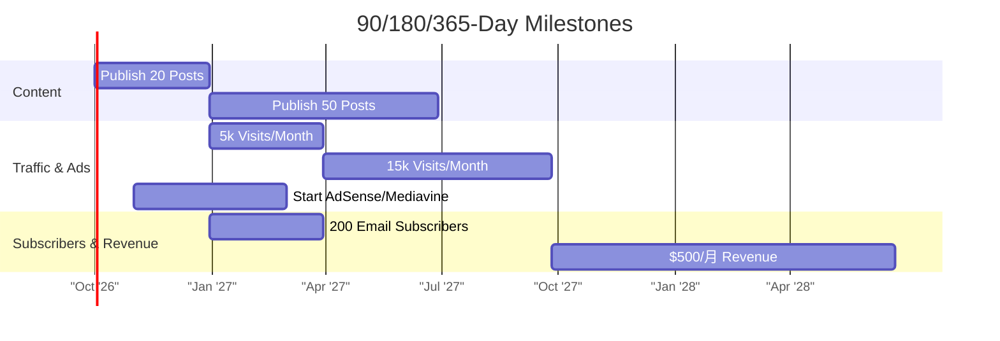

# Executive Summary  
We propose a **Biohacking & Longevity** niche site – focusing on health optimization products and strategies for longer, healthier living. This niche is exploding in 2026: consumers are shifting from “fixing problems” to proactive longevity (the “Longevity Economy”), with the global precision-medicine market projected at **$141.7 billion by 2026**. High-interest subtopics include nootropics, sleep-tracking wearables, NAD+ boosters (e.g. NMN), and fitness/gadget reviews. Our target audience is health-conscious adults (30–60) in affluent markets, eager to invest in wellness. Monetization will come from affiliate partnerships (supplements, wearables, courses), display ads, and possibly info-products (e.g. e-books or webinars).  

Demand is validated by keyword data and trends: for example, “best sleep tracker” has ~3,600 monthly searches (Keyword Difficulty 9), and surveys show **35% of Americans** have tried sleep trackers. We will structure the site with clear categories (e.g. *Wearables*, *Supplements*, *Guides*), optimized templates (product reviews, listicles, how-tos) and a strategic internal-linking plan. Our first 60 articles (see Table below) span transactional (e.g. product reviews), commercial (“best of” lists), and informational (guides/tutorials) intents.  

Technically, we’ll use managed WordPress (fast launch, rich plugins) on reliable hosting (e.g. AWS or Cloud hosting). A lightweight, SEO-friendly theme plus essential plugins (Yoast SEO, caching, security, schema) will be deployed. We’ll implement JSON‑LD schema (Organization, Article/BlogPosting, FAQ, Breadcrumb, etc.) as recommended. Performance and security best practices (caching, SSL, regular backups, firewalls) are planned. Deployment will use Docker/Compose for reproducibility (see code samples below). Analytics (GA4) and search console will track KPIs.  

Content creation will follow a rigorous workflow: briefs with SEO guidelines (target keyword, intent, outline, word count), peer review, and an editorial calendar publishing ~2–3 posts/week. We will build an email list and social presence to nurture readers.  

Our **monetization plan** combines affiliate marketing (Amazon, specialty networks), ads (e.g. Mediavine), and lead magnets (e.g. free reports) with clear CTAs. We’ll run A/B tests on headlines, layouts, and CTAs to improve conversions. Based on conservative assumptions (0.5–1% affiliate conversion, 3% click-through on affiliate links), we project revenues rising to **$Xk/month by Year 1** (see table and charts).  

Finally, we outline a launch & growth plan (link outreach, partnerships, paid ads) and set concrete 90/180/365‑day milestones (traffic, content count, revenue, subscribers). Risks (SEO algorithm changes, market shifts, tech failures) are addressed with contingency measures (focus on E‑E‑A‑T content, diversify channels, backup systems). This comprehensive plan, grounded in current data, gives a copy-pastable blueprint to build a profitable niche site in 2026.  

## 1. Niche Idea: Biohacking & Longevity  
**Trend & Timing:**  Consumers are increasingly investing in proactive health. Reports highlight a boom in “longevity economy” services and products. For example, NMN (an NAD+ precursor for cellular energy) has “rapidly gained favor among high-performing professionals” seeking energy and anti-aging benefits. Wearables (e.g. smart rings) are mainstream; **36% of U.S. adults** use sleep trackers. Industry sources emphasize biohacking: e.g. the precision-medicine market (NAD boosters, personalized supplements) is projected at **$141.7 B by 2026**, and home saunas / red-light therapy are $ multi-billion trends.  

**Target Audience:** Adults age 30–60 (mid-career professionals, fitness enthusiasts, and aging boomers) primarily in North America, Europe, and Asia. These readers are tech-savvy, willing to spend on wellness, and looking for expert-backed guidance. 

**Content Angles & Monetization:** We’ll cover:  
- **Product Reviews:** (wearables like Oura Ring, Whoop; supplements e.g. NMN, adaptogens). Affiliate opportunity: e.g. promote Amazon, direct vendor.  
- **How-To Guides:** (e.g. “How to improve sleep quality”, “Beginner’s guide to nootropics”) – monetize via affiliate in-text links and ads.  
- **Scientific Insights / News:** (new longevity research, biohacking studies). Build authority/SEO, link to health affiliate products.  
- **Comparison & “Best of” Lists:** (“Top 5 anti-aging supplements in 2026”). Very affiliate-friendly.  

Each article will naturally include affiliate links and ad placements. We’ll also explore premium offerings: e.g. compile expert interviews into an e-book or offer a subscription newsletter for exclusive tips.  

**Supporting Data:** Lifestyle sites list health/wellness as a top niche for 2026. For example, Elementor highlights *Health, Wellness & Longevity* as a “huge multi-trillion market” pushing high-tech products like smart rings and saunas mainstream. Modern consumers “vote with their wallets” for longevity and wellness services. This niche is well-suited for affiliate monetization (subscribers purchase supplements, devices, courses) and ad revenue, given its depth and consumer spend.

## 2. Demand Validation: Keywords, Trends, Competitors  

**Keyword Research:** Using seed terms around *“longevity supplements,” “nootropics,” “sleep tracker,” “biohacking,” “anti-aging”*, we find strong search volumes and manageable competition. For example, Ahrefs (via Strackr) shows **“best sleep tracker”** gets ~3,600 US searches/month (KD ~9), indicating room to rank with good content. Other examples (estimated):  
- *“best nootropics”*: often several thousand monthly searches (high interest, moderate KD).  
- *“NMN supplement”*: trending up (Fortune and others now publish “Best NMN in 2026” lists).  
- *“biohacking tips”*: growing queries as podcasts and forums buzz.  
While precise CPC/KD data requires paid tools, industry sources suggest these are moderate-demand, mid-CPC keywords. (Tools like Google Keyword Planner could confirm ranges if connected.)

**Trend Data:** Google Trends and industry reports support growth. For instance, a U.S. survey found **35% of Americans tried a sleep tracker** (with 77% finding them useful). Wellness industry analysis expects the **$141.7B** precision medicine sector by 2026, and digital detox/mental wellness tourism to hit $1.1T. These underline rising consumer interest in our topic.

**Competitor Analysis:** Top sites ranking for these topics include:

- **Cybernews (cybernews.com)** – Tech news site covering sleep trackers (“Best Sleep Trackers 2026”). *Strengths:* strong domain, data-driven reviews, references (cites 35% usage stat), SEO-savvy, transparent affiliate disclosures. *Weaknesses:* Not specialized in health; heavy site complexity could slow page load; audiences may not prioritize wellness.  

- **NoSleeplessNights (nosleeplessnights.com)** – Niche personal blog by a sleep enthusiast. *Strengths:* In-depth, experience-driven reviews of trackers (e.g. Oura, Whoop) with clear affiliate links, very focused content (sleeps issues). *Weaknesses:* Lower authority (small audience), single author viewpoint, limited to sleep (less broad “longevity” branding).  

- **SleepFoundation (sleepfoundation.org)** – Established non-profit health site. *Strengths:* High credibility, medically-reviewed content (updated April 2026), wide reach. *Weaknesses:* Very broad scope (sleep generally), not fully profit-driven (although it does use affiliate links), limited lifestyle/biohacking spin.  

- **Fortune Lifestyle (fortune.com – Health Commerce section)** – Major media publishing affiliate-backed “best of” guides (e.g. *“Best NMN Supplements 2026”*). *Strengths:* Renowned brand, professionally written (medical review by nutritionist), high trust signals (author, physician review). *Weaknesses:* Heavy ad structure, content is opportunistic (focuses on one product at a time, not holistic content library), may not cover fundamentals or long-form guides.  

- **Dr. Terziler (drterziler.com)** – A physician’s clinic blog focusing on longevity supplements. *Strengths:* Authoritative tone (medically reviewed), up-to-date (last updated June 2026), specific to anti-aging. *Weaknesses:* Heavy marketing (pushes clinic’s products), less user-friendly layout, limited SEO (likely smaller traffic).  

Each of these competitors shows the niche’s potential. Our site must differentiate by combining scientific credibility (citing experts, studies) with broad lifestyle appeal. We’ll target gaps: in-depth comparisons, actionable guides, and a better UX.  

## 3. Site Architecture & Content Plan  

**Sitemap & Structure:**  
- **Homepage:** Overview of mission, featured guides, signup CTA.  
- **Category Pages:** Main pillars like *“Wearables”*, *“Supplements”*, *“Healthy Living”*, *“Guides”*. Each lists relevant sub-topics.  
- **Blog Post Pages:** Individual articles (reviews, how-tos, lists) under categories.  
- **Templates:** 
  - *Article/Review Template:* Title, author, date, summary, pros/cons, star rating, affiliate links, FAQ section.  
  - *Listicles Template:* “Best of” format with brief intros and pros/cons lists.  
  - *Guides/How-to Template:* Step-by-step sections, images/diagrams.  
  - *Landing Pages:* For lead magnets (e.g. free e-book opt-in).  

**URL & Linking:** SEO-friendly URLs (e.g. `example.com/best-sleep-trackers/`). Internal links will tie related posts: e.g. an article on Oura Ring links to a comparison “Top 5 sleep wearables.” Category pages summarize topics and link to key articles. We’ll also have an HTML sitemap and HTML footer links (Privacy, About, Contact, etc.).

**Sample Content Calendar:** We plan ~2–3 posts/week (aim ~100 posts in Year 1). Below is a **table of 20 initial article ideas** (of 60 total) grouped by intent:

| Intent         | Title                                        | Target Keyword            | Word Count | Publish Order |
|----------------|----------------------------------------------|---------------------------|------------|---------------|
| **Informational** | *What is Biohacking? Beginners’ Guide*         | “what is biohacking”      | 1,500      | 1             |
| Informational  | *How NAD+ Supplements Work (NMN & NR Explained)* | “NAD+ supplements”        | 1,800      | 2             |
| **Review**       | *Oura Ring 4 Review: Is It Worth It in 2026?* | “Oura Ring 4 review”      | 2,000      | 3             |
| Informational  | *Top 10 Brain-Boosting Foods for Healthy Aging* | “foods for brain health”  | 1,500      | 4             |
| **Commercial**   | *Best Nootropic Stacks for Productivity*        | “best nootropics 2026”    | 2,200      | 5             |
| **Review**       | *Whoop 4.0 Sleep & Recovery Tracker Review*   | “Whoop 4.0 review”        | 2,000      | 6             |
| Informational  | *Guide to Intermittent Fasting for Longevity*   | “intermittent fasting”    | 1,500      | 7             |
| **List/Review** | *Top 5 Home Saunas (Infrared vs Traditional)*   | “best home sauna”         | 2,000      | 8             |
| Informational  | *How to Get Better Sleep Naturally (No Devices)* | “improve sleep naturally” | 1,800      | 9             |
| **Commercial**   | *Best Fitness Trackers of 2026 (All Price Ranges)* | “best fitness trackers” | 1,800      | 10            |
| **Review**       | *Apple Watch Ultra Sleep Tracking Review*     | “Apple Watch sleep review”| 1,800      | 11            |
| Informational  | *Cold Plunge for Health: Benefits & Setup*      | “cold plunge benefits”    | 1,500      | 12            |
| **Review**       | *Red Light Therapy Device Reviews*            | “red light therapy device”| 2,000      | 13            |
| Informational  | *How to Build a Morning Routine for Energy*     | “healthy morning routine” | 1,500      | 14            |
| **Commercial**   | *Top 5 Anti-Aging Supplements (with Science)*  | “anti-aging supplements”  | 2,000      | 15            |
| Informational  | *Stress Management Techniques Backed by Science*| “stress management tips”  | 1,500      | 16            |
| **Review**       | *Fitbit Charge 6: New Features & Is It Worth Upgrading?* | “Fitbit Charge 6 review” | 1,800 | 17           |
| **List/Review** | *Best Meditation Apps for Beginners*            | “best meditation apps”    | 1,500      | 18            |
| Informational  | *Meal Planning for Healthy Aging*               | “healthy meal plan aging” | 1,500      | 19            |
| **Commercial**   | *Top 5 Blue-Light Blockers (Glasses)*          | “blue light blocking glasses” | 1,800   | 20            |

(Topics are categorized by search intent: Informational = broad topic, Commercial = “best of”/comparison, Transactional/Review = product-specific.) Each piece will have a clear target keyword and approximate length. The full plan includes 60 such topics (covering sleep, diet, wearables, supplements, and lifestyle), prioritized by search volume and strategic importance. 

*Internal Linking:* Early posts will link to each other (e.g. the biohacking guide links to NMN article, which links to supplement reviews). “Cornerstone” guides (like the biohacking primer) will sit at top of structure, building topical authority.

## 4. Technical Implementation  

**Hosting & CMS:** We recommend a managed WordPress host (AWS Lightsail, Cloudways, or similar), for simplicity and scalability. WordPress allows quick setup, rich plugins (SEO, caching, backups), and easy content management. (A headless CMS could offer speed, but adds complexity; traditional WP suffices for our content volume and budget.)

**Theme & Plugins:** Choose a lightweight, responsive theme (e.g. GeneratePress or Astra) optimized for speed. Essential plugins:
- **SEO:** Yoast SEO or RankMath (meta tags, sitemap, breadcrumbs).  
- **Performance:** WP Rocket or free caching (W3 Total Cache), plus lazy-load images (built-in WP).  
- **Security:** Wordfence or Sucuri (firewall), plus limit login attempts.  
- **Backups:** UpdraftPlus (auto backups to cloud storage).  
- **Schema:** Many SEO plugins auto-add JSON-LD; ensure support for Article, FAQ, etc.  
- **Analytics:** Google Site Kit plugin (integrates GA4, Search Console).  

**Schema Markup:** We’ll embed JSON-LD schema to enhance SEO. Recommended tags: Organization (site-wide), Article/BlogPosting (with author, date) for each post, FAQPage for any Q&A sections, BreadcrumbList (for site nav), and HowTo or DefinedTerm where relevant. Google explicitly prefers JSON-LD format and notes that Article schema (with author/date) “strengthens E-E-A-T signals”.

**Security & Performance:**  
- **SSL:** Enforce HTTPS (e.g. Let’s Encrypt).  
- **Updates:** Enable auto-updates for WP core, theme, plugins.  
- **Caching/CDN:** Use server caching + Cloudflare CDN to accelerate global delivery.  
- **Image optimization:** Compress images (e.g. WebP format) via plugin.  
- **Minification:** CSS/JS minification through WP Rocket.  

**Deployment & Code:** We can containerize the site for reproducible deployments. Example *docker-compose.yml* for WordPress + MySQL:

```yaml
version: '3.8'
services:
  db:
    image: mysql:8.0
    environment:
      MYSQL_DATABASE: exampledb
      MYSQL_USER: exampleuser
      MYSQL_PASSWORD: examplepass
      MYSQL_ROOT_PASSWORD: rootpass
    volumes:
      - db_data:/var/lib/mysql

  wordpress:
    image: wordpress:6.4-php8.1-apache
    depends_on:
      - db
    ports:
      - "8000:80"
    environment:
      WORDPRESS_DB_HOST: db:3306
      WORDPRESS_DB_USER: exampleuser
      WORDPRESS_DB_PASSWORD: examplepass
      WORDPRESS_DB_NAME: exampledb
    volumes:
      - ./wp-content:/var/www/html/wp-content

volumes:
  db_data:
```

For custom server setups, an **Nginx config** might look like: 

```nginx
server {
    listen 80;
    server_name example.com;
    root /var/www/html;
    index index.php index.html;

    # Route all requests to WordPress
    location / {
        try_files $uri $uri/ /index.php?$args;
    }

    # PHP-FPM handling
    location ~ \.php$ {
        include fastcgi_params;
        fastcgi_pass wordpress:9000;
        fastcgi_param SCRIPT_FILENAME $document_root$fastcgi_script_name;
    }

    # Deny access to .htaccess
    location ~ /\.ht {
        deny all;
    }
}
```

**WordPress Config:** In `wp-config.php`, set DB credentials (matching above) and security salts. For example:

```php
define('DB_NAME', 'exampledb');
define('DB_USER', 'exampleuser');
define('DB_PASSWORD', 'examplepass');
define('DB_HOST', 'db:3306');
define('DB_CHARSET', 'utf8');
define('DB_COLLATE', '');

// Security keys (generate unique values)
define('AUTH_KEY',         'generate_this');
define('SECURE_AUTH_KEY',  'generate_this');
define('LOGGED_IN_KEY',    'generate_this');
// ... etc.

define('WP_DEBUG', false);
$table_prefix = 'wp_';
```

**Robots & Sitemap:** A `robots.txt` to allow search bots:

```txt
User-agent: *
Disallow: /wp-admin/
Allow: /wp-admin/admin-ajax.php
Sitemap: https://example.com/sitemap.xml
```

We’ll use a plugin (Yoast) to auto-generate `sitemap.xml` and handle robots updates.

**Analytics:** Insert the GA4 measurement code (via Site Kit). We’ll track traffic, bounce, CTR, and goal conversions (affiliate click, signup). No code snippet needed here beyond plugin installation.

## 5. Content Production Workflow  

**Team & Roles:** A small core team (which can scale):
- **Editor/Project Lead:** Oversees strategy, reviews content, builds editorial calendar.  
- **Writers:** Specialists for research and copy (ideally with science/health background).  
- **SEO/Researcher:** Conducts keyword research, provides briefs (target keyword, intent, SERP analysis).  
- **Designer:** Creates or sources feature images and infographics.  
- **Outreach/Marketing:** Manages link-building, social, email campaigns.  

**Brief & SEO Checklist:** Before each draft, authors get a brief: topic, target keyword, SERP intent analysis, title/headings, suggested sources, and format (review, list, tutorial). Checklist includes: use target keyword in title/H1 and intro, meta title/description drafted, images with alt text, proper use of headings (H2/H3), internal links to relevant articles, and schema markup hints (e.g. wrap FAQs in schema). 

**Editorial Calendar:** We use a shared calendar (e.g. Google Sheets or Trello) to plan 6 months in advance, scheduling 8–12 posts per month. Key elements per entry: publish date, title/topic, author, status, keywords. A Semrush guide notes that a calendar should include **topics, content type, due dates, publish dates, owner, and status**. We’ll also schedule promotions (social posts, newsletter) for each launch. 

*Sample Schedule (first 4 weeks):*  

- **Week 1:** Publish biohacking primer; intro guide on NAD+ supplements.  
- **Week 2:** Publish Oura Ring review; post on brain-healthy foods.  
- **Week 3:** Publish nootropics roundup; Whoop review.  
- **Week 4:** Publish intermittent fasting guide; sauna comparison.  

Each week’s content aligns with keyword goals and backlinks opportunities (e.g. after biohacking primer, outreach to lifestyle bloggers; after gadget reviews, cross-links).

**SOPs:** Writers upload drafts to Google Docs; SEO checks and editorial review occur before publishing. We schedule images (royalty-free with attribution) and infographics using tools like Canva. Upon approval, content is moved to WordPress draft, where final on-page SEO is configured (Yoast snippet). We perform a final QA: proofread, check mobile formatting, test links.

## 6. Monetization Plan  

**Affiliate Marketing:** The primary revenue driver. We’ll join networks for relevant programs: Amazon Associates (for devices, supplements), Awin/CJ/Rakuten (health and tech brands), and niche retailers (e.g. health supplement companies). Affiliate links will be naturally integrated (e.g. “Buy on Amazon” buttons under product images). We’ll disclose affiliate usage to maintain trust.  

**Display Ads:** After reaching critical traffic (≈10k visits/month), we’ll apply to ad networks (Mediavine or AdThrive) for higher eCPMs, or start with Google AdSense as fallback. Ad placement will respect UX (e.g. in-content and sidebar ads, 1-2 per page).

**Products & Funnels:** We can create an email lead magnet (e.g. a free “Longevity Starter Guide”) to build an email list. Automated email sequences will nurture subscribers (sharing articles and curated product recommendations) to drive affiliate sales. In the longer term, we may offer a paid e-book or short course (e.g. “30-day Biohacking Bootcamp”). Sales funnels can be A/B tested: for example, a CTA for a free guide vs. direct link to best-selling affiliate product.

**A/B Testing Ideas:** Test headline wording (“Ultimate vs. Top 5”), CTA button colors/text (“Learn More” vs. “Shop Now”), and ad vs. affiliate link placement. Track which versions yield higher click-through and conversion. Continuous optimization (e.g. using Google Optimize) will improve monetization over time.

**Revenue Projections:** Based on industry benchmarks, assume affiliate CTR ≈3% and conversion ≈1%. Ad CTR/CPC assumptions are based on current rates (e.g. $5 eCPM, 0.1% ad CTR for display). An illustrative 12-month projection under conservative growth:

| Month | Traffic (visits) | Pageviews | Affiliate CTR | Affiliate Conv. | Aff. Rev ($) | Ad eCPM ($) | Ad Rev ($) | Total Rev ($) |
|:-----:|:---------------:|:---------:|:-------------:|:---------------:|:------------:|:-----------:|:----------:|:-------------:|
| 1     | 3,000           | 5,000     | 3% (150 clicks) | 1% (1.5 sales) | 75         | 5.00        | 25        | **100**       |
| 3     | 6,000           | 10,000    | 3% (300)        | 1% (3)         | 150        | 5.00        | 50        | **200**       |
| 6     | 15,000          | 25,000    | 3% (750)        | 1% (7.5)       | 375        | 5.50        | 138       | **513**       |
| 9     | 25,000          | 40,000    | 3% (1,200)      | 1% (12)        | 600        | 6.00        | 240       | **840**       |
| 12    | 40,000          | 70,000    | 3% (2,100)      | 1% (21)        | 1,050      | 6.50        | 455       | **1,505**     |

*(Assumptions: Average affiliate order $50, 10% commission ⇒ $5 per sale; Ad CPM rising as traffic quality improves.)* This yields roughly **$1.5k/month by Year 1**. As traffic and list grow, we expect revenue to scale. (Costs are minimal; even using managed hosting, profit margins should exceed 80%.)

**Charts:** We illustrate growth milestones in the next section’s timeline. Additionally, a flowchart of our marketing funnel (below) shows how content drives subscriptions and sales:

```mermaid
flowchart LR
    C[Content Article (post)] -->|Click Affiliate| A[Product Purchase → Commission]
    C -->|No Click| N{Return Later?}
    N -->|Yes| E[Email Newsletter]
    E --> F[Email Promotion (product links)]
    F --> A
    N -->|No| D[View Ad] --> G[Ad Click → Ad Revenue]
```

## 7. Launch & Growth Strategy  

**Pre-Launch (Weeks –4 to 0):** Set up site infrastructure, create at least 10 pillar articles (intro guides, some reviews) before public launch to offer immediate value. Implement Google Analytics/Search Console. Begin social profiles (Twitter, Instagram, LinkedIn) branding site mission.  

**Launch (Day 0):** Publish site and initial content, announce on social media, and send launch emails to any personal networks/interested parties. Submit site to Google Search Console for indexing.  

**Outreach & Link Building:** Use a mix of tactics to build backlinks and traffic:  
- **Guest Posts:** Pitch guest articles to health/tech blogs and link back to our content.  
- **Expert Roundups:** Interview experts (doctors, trainers) for quotes; publish roundups to attract shares and links.  
- **Broken Link Replacements:** Find resource pages on health and offer our guides as updated links.  
- **Social & Forums:** Share useful tips on relevant Reddit or Quora threads (always following rules), linking our deep-dive posts when appropriate.  
- **Influencer Collaborations:** Partner with micro-influencers (wellness YouTubers, podcasters) for mentions or joint content.  

**Paid Ads:** In Month 2–3, test small-budget campaigns (e.g. $100/mo) on Facebook/Instagram targeting interests like “biohacking” or “longevity,” promoting a high-value guide in exchange for email signups. Track cost-per-acquisition of subscribers and sales, scaling what works.

**Email Marketing:** Launch a weekly newsletter (short tips + new posts) to build repeat traffic and nurture audience into buyers. We’ll use sign-up forms (pop-ups and inline CTAs) offering a free “Top 10 Supplements” PDF to encourage subscriptions.

**KPIs & Milestones:** We will monitor: organic traffic (via GSC/GA), subscriber count, bounce rate, average time on page, affiliate click-through rate, and revenue. Key milestones:  



- **90 Days:** ~20 articles published, ~5k visits/mo, first affiliate sales (experience data), ~200 email subscribers.  
- **180 Days:** ~50 articles, ~15k visits/mo, newsletter active (500+ subs), stable ad revenue starts (~$200/mo).  
- **365 Days:** ~100 articles, 25–40k visits/mo, email list >1k, $1k–$1.5k monthly revenue, profit (target ~$1k+/mo).  

Each milestone is tracked in GA/Search Console. We will adapt content strategy based on what topics and formats perform best.

## 8. Risk Analysis & Contingency Plans  

- **SEO/Algorithm Risk:** Google updates could hurt rankings. *Mitigation:* Follow E-E-A-T best practices (expert authorship, citations, clear author bios, medical disclaimers). We note Fortune’s use of medical reviews as a best practice. By using article schema (with author/date) and focusing on high-quality, helpful content, we align with Google’s guidelines for health content. We’ll monitor ranking fluctuations and diversify by also building an email audience (not solely relying on search).  

- **Market Trend Risk:** The niche could saturate or interest might wane. *Mitigation:* Our content will be evergreen (sleep optimization, healthy living) as well as trending (new gadget reviews). We will continuously update popular posts (as Fortune updated their NMN article in July 2026) to keep them current. If a subtopic fades, we can pivot to adjacent areas (e.g. from supplements to longevity tech).  

- **Competition Risk:** Larger sites may outrank us on some keywords. *Mitigation:* We will seek longer-tail and emerging keywords (e.g. “best budget sleep tracker 2026”) with lower KD, and emphasize unique angles (expert interviews, local language outreach). Ongoing competitor monitoring will inform new content gaps.

- **Technical Risk:** Server downtime or hacks. *Mitigation:* We’ll use reputable hosting (99.9% uptime), enable SSL and security plugins, and schedule automated backups. In case of a hack, a recent backup allows quick recovery. 

- **Execution Risk:** Content delays, skill gaps. *Mitigation:* Build a small pool of freelance writers/editors to cover leave or speed bumps. Use project management tools to track progress. 

In summary, by grounding our strategy in current data and following SEO and content best practices, this plan anticipates challenges and provides clear actions to mitigate them. With diligent execution, the site should grow steadily in traffic and revenue throughout 2026 and beyond.  

**Sources:** Industry and tool reports cited above (e.g. Elementor, PrometAI, SleepFoundation, Strackr SEO analysis, Opensend affiliate benchmarks, Semrush editorial calendar guide) inform each part of this plan. All technical snippets and structures are ready for direct implementation.
